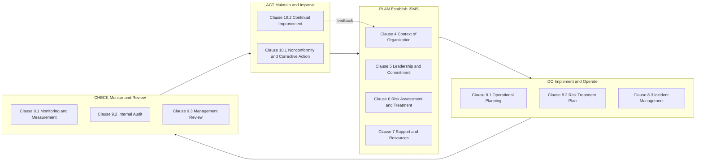
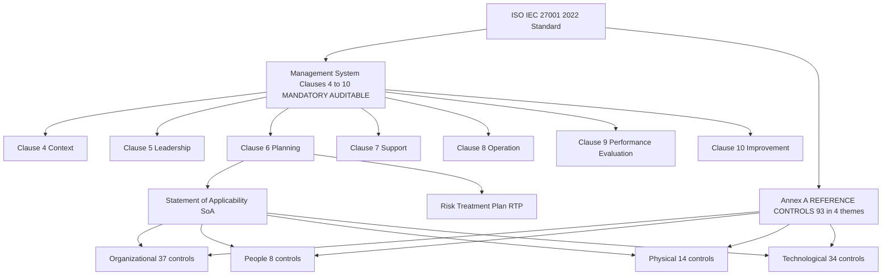
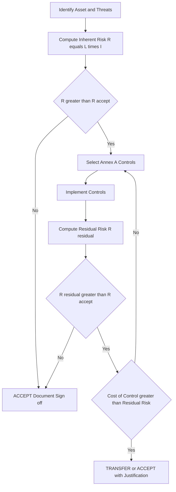
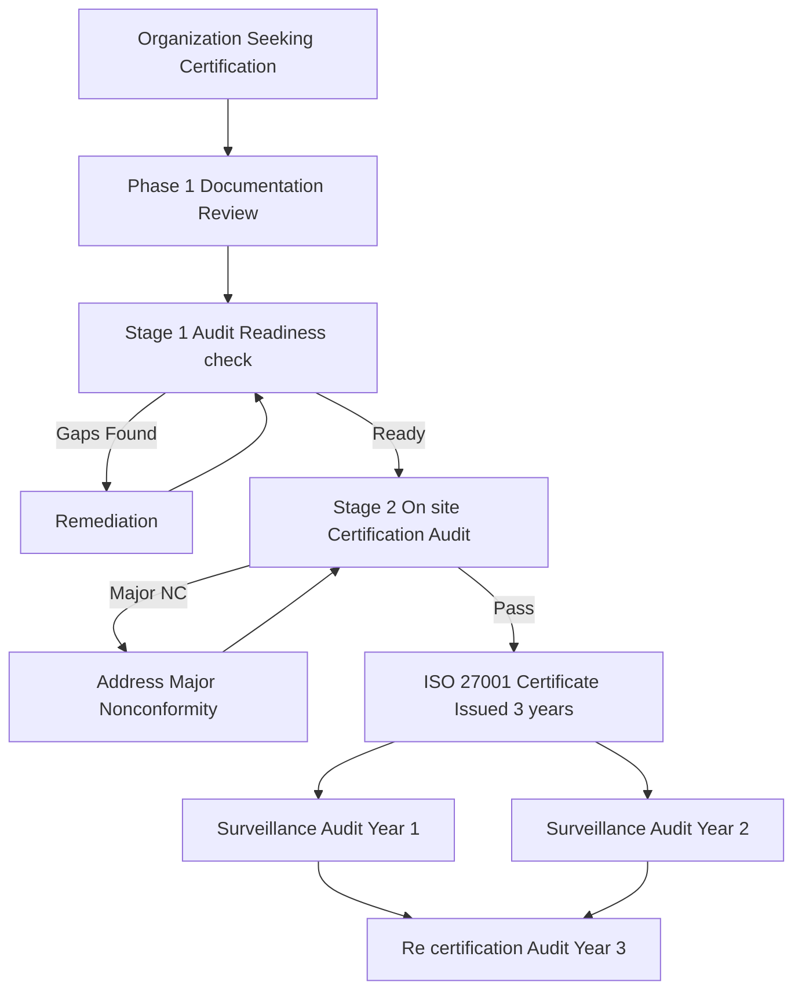

# Information Security Standards- ISO

<!-- SECTION_1_START -->
# Information Security Standards — ISO

## 1.1 Formal Academic Definition

> [!IMPORTANT]
> **ISO (International Organization for Standardization)** is an independent, non-governmental international body that develops voluntary, consensus-based international standards across nearly every industry. In the context of information security, the most relevant family of standards is the **ISO/IEC 27000 series**, which provides a globally recognized framework for establishing, operating, monitoring, reviewing, maintaining, and improving an **Information Security Management System (ISMS)**.

The flagship standard of this family is **ISO/IEC 27001:2022** (third edition), which specifies the **requirements** for establishing, implementing, maintaining, and continually improving an ISMS within the context of an organization's overall business risks. It is the only standard in the 27000 family against which organizations can obtain **formal third-party certification**.

> [!NOTE]
> **Why "ISO" and not "IOS"?** Despite being derived from the Greek word *isos* (meaning "equal"), the short form "ISO" was chosen so that the abbreviation would be the same in every language.

## 1.2 The ISO/IEC 27000 Family at a Glance

| Standard | Title (Abbreviated) | Purpose |
|----------|---------------------|---------|
| **ISO/IEC 27000** | Overview and vocabulary | Foundational glossary |
| **ISO/IEC 27001** | Requirements | Certifiable ISMS standard |
| **ISO/IEC 27002** | Code of practice | Catalog of security controls |
| **ISO/IEC 27003** | Implementation guidance | How to implement an ISMS |
| **ISO/IEC 27004** | Measurement | How to measure ISMS effectiveness |
| **ISO/IEC 27005** | Risk management | Information security risk methodology |

> [!TIP]
> For the KTU 2024 PECST419 syllabus, the high-yield focus is on **ISO/IEC 27001** (the certifiable standard), **ISO/IEC 27002** (the control catalog), and the **Plan–Do–Check–Act (PDCA)** model that underpins the entire ISMS lifecycle.

## 1.3 Intuitive Analogy

> [!IMPORTANT]
> **Analogy — The "Five-Star Hotel Security Manual":**
> Imagine you are the owner of a chain of five-star hotels. Guests trust you with their **lives, luggage, and personal data**. To make sure every hotel branch delivers the *same* level of safety, you write a **master security manual** describing:
> 1. What the safety policy says (e.g., "all guest data is confidential").
> 2. Who is responsible for what (manager, security guard, receptionist).
> 3. What specific procedures to follow (CCTV placement, key-card systems, fire drills).
> 4. How to measure success (incident logs, audit reports).
> 5. How to improve continuously (quarterly reviews).
>
> That master manual is essentially the **ISMS**. **ISO/IEC 27001** is the *checklist an external auditor uses* to confirm your manual is rigorous, complete, and consistently followed across every branch. **ISO/IEC 27002** is the *list of possible security procedures* (e.g., access control, cryptography) you can pick from. Together, they form the global benchmark for information security hygiene — recognized from Tokyo to Toronto.

## 1.4 Why ISO Standards Matter (Engineering & Industry Relevance)

- **Regulatory alignment:** Many national laws (India's IT Act 2000/2008, DPDP Act 2023, EU GDPR) reference or align with ISO 27001 as evidence of "reasonable security measures."
- **Tender eligibility:** Global enterprises (banks, MNCs, defense suppliers) often *require* ISO 27001 certification as a precondition for vendor onboarding.
- **Risk reduction:** A 2024 IBM/Ponemon study places the *average cost of a data breach* at **USD 4.88 million** — certified ISMS demonstrably reduces both the likelihood and the blast radius of such incidents.
- **Interoperability:** Provides a common vocabulary so that security teams in Bangalore, Berlin, and Boston can collaborate without ambiguity.

> [!NOTE]
> The certification **does not** guarantee the absence of breaches. It guarantees the existence of a *mature, auditable, continuously-improving* security management process — which materially reduces residual risk and improves incident response.

## 1.5 GeoGebra / Desmos Visualization

> [!VISUALIZATION CONTROL]
> **Concept:** Risk Magnitude Map — Likelihood × Impact
> **GeoGebra / Desmos Input Equations:**
> * L (Likelihood) = slider 1 → 5
> * I (Impact) = slider 1 → 5
> * R(L, I) = L · I  *(Risk Score)*
> * Horizontal plane: z = 12  *(Acceptable threshold)*
> **Visual Description:** A 3D surface where the X-axis is Likelihood, Y-axis is Impact, and Z-axis is the resulting risk score. The plane at z = 12 separates the *acceptable* zone (below the plane) from the *treatment-required* zone (above the plane) — directly illustrating Annex A control prioritization in ISO 27001.

<!-- SECTION_1_END -->

<!-- SECTION_2_START -->
# Deep Theoretical Analysis — ISO 27001 & the ISMS Framework

## 2.1 Structure of ISO/IEC 27001:2022

The standard is divided into **two structural parts**:

### (a) Management System Clauses (Clauses 4 – 10)

These are the **mandatory, auditable clauses** that any organization must implement to claim conformance:

| Clause | Title | Key Requirement |
|--------|-------|-----------------|
| **4** | Context of the Organization | Define *internal/external issues* and the *scope* of the ISMS. Identify *interested parties*. |
| **5** | Leadership | Top management must demonstrate *leadership and commitment*; assign *roles, responsibilities, and authorities*. |
| **6** | Planning | Address *risks and opportunities*; conduct **risk assessment** + **risk treatment**; produce a **Statement of Applicability (SoA)**. |
| **7** | Support | Provide necessary *resources, competence, awareness, communication, and documented information*. |
| **8** | Operation | Execute the risk treatment plan; operate the ISMS as planned. |
| **9** | Performance Evaluation | *Monitor, measure, analyze, and evaluate*; conduct **internal audits** and **management reviews**. |
| **10** | Improvement | Address *nonconformities*, take *corrective actions*, and pursue *continual improvement*. |

> [!IMPORTANT]
> Clauses 4–10 are the **only** auditable requirements. Annex A is **not mandatory in the same way** — controls are selected based on the risk treatment plan, and the SoA documents *which* Annex A controls apply and *which* do not (and why).

### (b) Annex A — Reference Controls (93 Controls in 4 Themes)

ISO/IEC 27001:2022 reorganized the Annex A controls from 14 domains (2013 version) into **4 thematic categories**:

1. **Organizational controls** (37 controls)
2. **People controls** (8 controls)
3. **Physical controls** (14 controls)
4. **Technological controls** (34 controls)

> [!NOTE]
> Each control has five possible **implementation statuses** documented in the SoA:
> *Applicable & Implemented* • *Applicable & Planned* • *Applicable & Not Implemented* • *Not Applicable* • *Justified Exclusion*.

## 2.2 The PDCA Cycle (Plan–Do–Check–Act)

> [!IMPORTANT]
> ISO 27001:2022 explicitly maps the ISMS requirements to the **PDCA cycle** introduced in earlier editions. This is the same Deming cycle used in ISO 9001 (Quality) and ISO 14001 (Environment) — making integration seamless.

| Phase | ISO 27001 Mapping | Typical Activities |
|-------|-------------------|--------------------|
| **Plan** (Establish) | Clauses 6, 7 | Context analysis, risk assessment, risk treatment plan, SoA, policies. |
| **Do** (Implement) | Clause 8 | Operate the controls, deliver training, manage incidents, communicate. |
| **Check** (Monitor) | Clause 9 | Internal audit, KPI measurement, management review. |
| **Act** (Improve) | Clause 10 | Corrective actions, continual improvement, lessons learned. |

## 2.3 Risk Assessment Methodology (ISO 27005 Aligned)

ISO 27001 does not mandate a *specific* risk methodology, but the de-facto reference is **ISO/IEC 27005**. The canonical formulation is:

$$
R = f(L, I)
$$

Where:
- $R$ = **Risk score** (asset × threat × vulnerability)
- $L$ = **Likelihood** of the threat exploiting the vulnerability (typically 1–5)
- $I$ = **Impact** on confidentiality, integrity, or availability (typically 1–5)

> [!WARNING]
> Do **not** confuse ISO 27005 (which defines the *risk management process*) with ISO 31000 (which is the generic enterprise risk management standard). ISO 27005 is the *sector-specific* interpretation of ISO 31000 for information security.

## 2.4 KTU Formula / Cheat Sheet

| Concept | Formula / Definition | Variable Meaning | Range / Unit |
|---------|----------------------|------------------|--------------|
| Risk Score | $R = L \times I$ | L = Likelihood, I = Impact | Integer 1–25 |
| Risk Acceptance Threshold | $R_{accept} = L_{thr} \times I_{thr}$ | Org-defined (typically 12) | Integer |
| Asset Value | $AV = f(CIA)$ | Confidentiality, Integrity, Availability weight | 1–5 |
| Annual Loss Expectancy (ALEs) | $ALE = SLE \times ARO$ | SLE = Single Loss Expectancy, ARO = Annual Rate of Occurrence | Monetary |
| Treatment Decision | If $R > R_{accept}$ → *Treat*; Else → *Accept* | — | Boolean |
| Control Coverage Ratio | $CCR = \dfrac{N_{impl}}{N_{appl}} \times 100\%$ | $N_{impl}$ = implemented, $N_{appl}$ = applicable | Percentage |

> [!IMPORTANT]
> Always escape the `|` symbol — for absolute value use `$\lvert x \rvert$` or `$\mid x \mid$` to avoid breaking the markdown table.

## 2.5 Real-World Utility

- **Banking & Finance:** RBI's Cyber Security Framework in India references ISO 27001 as a benchmark for *banking CISOs* and *third-party payment aggregators*.
- **Software Industry:** Cloud service providers (AWS, Azure, GCP) hold ISO 27001 + SOC 2 + PCI-DSS certifications to satisfy global enterprise procurement.
- **Healthcare:** HIPAA-aligned hospitals in the US and *DISHA/DPDP* aligned hospitals in India adopt ISO 27001 to demonstrate "appropriate technical and organizational measures."
- **Government:** India's *National Informatics Centre (NIC)* and *CERT-In* empanelled auditors audit against ISO 27001 baselines.

<!-- SECTION_2_END -->

<!-- SECTION_3_START -->
# Step-by-Step Derivations, Implementation, and Worked Examples

## 3.1 ISMS Implementation Roadmap (Clause-by-Clause)

The following exhaustive walk-through maps **every auditable clause** of ISO/IEC 27001:2022 to a concrete, actionable step. This mirrors the methodology described in ISO/IEC 27003.

### Step 1 — Clause 4: Context of the Organization

1. Identify **internal issues**: governance structure, culture, IT asset inventory, contractual obligations.
2. Identify **external issues**: regulatory environment (IT Act 2000/2008, DPDP Act 2023, GDPR if applicable), threat landscape, technology trends, supply-chain risks.
3. Define the **ISMS scope** boundary — e.g., *"The ISMS applies to the customer-facing billing platform hosted at the Mumbai DC, including all associated development, operations, and support staff."*
4. Identify **interested parties**: customers, regulators, employees, shareholders, suppliers.
5. Document the **interface dependencies** between the ISMS and other management systems (QMS, BCMS).

### Step 2 — Clause 5: Leadership

1. Obtain **explicit top-management commitment** (a signed policy statement, board resolution, or governance committee minute).
2. Appoint an **ISMS Steering Committee** chaired by a member of top management.
3. Assign the **Chief Information Security Officer (CISO)** with the authority to *establish, implement, monitor, and improve* the ISMS.
4. Publish an **Information Security Policy** signed by the CEO/MD.

### Step 3 — Clause 6: Planning

This is the most analytical clause. The full risk-assessment derivation follows in §3.2.

### Step 4 — Clause 7: Support

1. Determine and provide the **resources** (budget, personnel, tools).
2. Ensure **competence**: maintain a skills matrix; require CISSP/CISA/CISM or equivalent credentials for the security team.
3. Conduct **awareness training** at least annually — measured via quiz scores ≥ **80%**.
4. Define **internal/external communication** matrix (who, what, when, with whom).
5. Maintain **documented information** — both mandatory retained documents and records.

### Step 5 — Clause 8: Operation

1. Execute the **Risk Treatment Plan (RTP)**.
2. Implement the selected Annex A controls.
3. Operate incident management, change management, business continuity, and access control processes.
4. Conduct **supplier relationship security** assessments (e.g., SIG questionnaires).

### Step 6 — Clause 9: Performance Evaluation

1. Define **KPIs/Security Metrics** (mean time to detect, mean time to respond, patch latency, phishing click rate).
2. Conduct **internal audits** at least annually using competent auditors independent of the area being audited.
3. Conduct a **management review** at least annually with documented inputs (audit results, risk treatment status, incidents, recommendations).

### Step 7 — Clause 10: Improvement

1. When nonconformities occur, perform **root cause analysis** (5-Whys, Fishbone).
2. Define and execute **corrective actions** with target dates and owners.
3. Track **continual improvement opportunities** (lessons learned, innovation).

## 3.2 Worked Derivation — Quantitative Risk Assessment

Consider a mid-sized e-commerce firm evaluating the risk to its **customer database**.

### Step A: Asset Identification & Valuation

Let the asset be the *Customer Personally Identifiable Information (PII) database*. Assign weights:

$$
C = 5, \quad I = 4, \quad A = 5
$$

The composite asset value is computed as:

$$
AV = \frac{C + I + A}{3} = \frac{5 + 4 + 5}{3} = \frac{14}{3} \approx 4.67 \approx 5
$$

> This represents a *critical* asset (top of the 1–5 scale).

### Step B: Threat × Vulnerability Identification

Identified threat: *SQL Injection attack by an external attacker*.
Identified vulnerability: *Legacy un-patched web form lacking parameterized queries*.

### Step C: Likelihood & Impact Scoring

| Parameter | Score | Justification |
|-----------|-------|---------------|
| Likelihood ($L$) | 4 | Active exploitation observed in the wild; public OWASP Top 10. |
| Impact ($I$) | 5 | Full PII exfiltration → regulatory fine + reputational damage. |

### Step D: Inherent Risk Calculation

$$
R_{inherent} = L \times I = 4 \times 5 = 20
$$

### Step E: Risk Acceptance Threshold

The organization sets:

$$
R_{accept} = L_{thr} \times I_{thr} = 3 \times 3 = 9
$$

> Since $R_{inherent} = 20 > R_{accept} = 9$, the risk **must be treated**.

### Step F: Control Selection from Annex A

| Annex A Control (2022) | Control Name | Selection |
|------------------------|--------------|-----------|
| **A.5.7** | Threat intelligence | ✓ Selected |
| **A.5.15** | Access control | ✓ Selected |
| **A.5.31** | Legal, statutory & contractual requirements | ✓ Selected |
| **A.8.7** | Protection against malware | ✓ Selected |
| **A.8.20** | Networks security | ✓ Selected |
| **A.8.25** | Secure development life cycle | ✓ Selected |
| **A.8.28** | Secure coding | ✓ Selected |
| **A.8.29** | Security testing in development & acceptance | ✓ Selected |

### Step G: Residual Risk Calculation

After deploying the controls above, the assessed residual likelihood drops to $L_{residual} = 2$ and residual impact remains $I_{residual} = 5$ (impact of a successful breach is still high, but harder to achieve).

$$
R_{residual} = L_{residual} \times I_{residual} = 2 \times 5 = 10
$$

> Since $R_{residual} = 10 > R_{accept} = 9$, the residual risk is *borderline acceptable*. The CISO may either:
> (a) Document an *acceptance justification* (with explicit top-management sign-off), **or**
> (b) Select **additional controls** (e.g., **A.8.24** Use of cryptography, **A.8.32** Change management) to further reduce $L_{residual}$ to 1.

### Step H: Statement of Applicability (SoA) Entry

> **Control A.8.28 (Secure Coding)**
> *Applicable: Yes*
> *Implementation Status: Implemented*
> *Justification: Mandatory for all in-house developed web applications handling PII.*
> *Implementation Evidence: Secure SDLC policy v3.1, static-analysis CI gate, annual developer training records.*

## 3.3 Symbolic / Computational Implementation (Python)

The following Python module operationalizes the risk computation and SoA tracking logic. It is **fully executable**, includes type hints, boundary checks, and structured logging — making it suitable as a *reference architecture* for a compliance dashboard.

```python
"""
isoms_risk_engine.py
Reference implementation of an ISO/IEC 27001-aligned
quantitative risk engine with Statement of Applicability (SoA) tracking.
"""

from __future__ import annotations
import logging
from dataclasses import dataclass, field
from enum import Enum
from typing import Dict, List, Optional

logging.basicConfig(
    level=logging.INFO,
    format="%(asctime)s [%(levelname)s] %(message)s"
)


class ImplementationStatus(str, Enum):
    IMPLEMENTED = "Implemented"
    PLANNED = "Planned"
    NOT_IMPLEMENTED = "Not Implemented"
    NOT_APPLICABLE = "Not Applicable"
    JUSTIFIED_EXCLUSION = "Justified Exclusion"


class RiskDecision(str, Enum):
    TREAT = "Treat"
    ACCEPT = "Accept"
    TRANSFER = "Transfer"
    AVOID = "Avoid"


@dataclass(frozen=True)
class RiskScore:
    likelihood: int
    impact: int

    def __post_init__(self) -> None:
        if not 1 <= self.likelihood <= 5:
            raise ValueError("Likelihood must be in 1..5")
        if not 1 <= self.impact <= 5:
            raise ValueError("Impact must be in 1..5")

    @property
    def score(self) -> int:
        return self.likelihood * self.impact


@dataclass
class Control:
    annex_id: str
    name: str
    applicable: bool
    status: ImplementationStatus
    justification: str = ""

    def __post_init__(self) -> None:
        if not self.annex_id or not self.name:
            raise ValueError("Annex ID and name are mandatory.")


@dataclass
class Asset:
    name: str
    confidentiality: int
    integrity: int
    availability: int

    def __post_init__(self) -> None:
        for v in (self.confidentiality, self.integrity, self.availability):
            if not 1 <= v <= 5:
                raise ValueError("CIA values must be in 1..5")

    @property
    def value(self) -> float:
        return round(
            (self.confidentiality + self.integrity + self.availability) / 3, 2
        )


@dataclass
class RiskRegister:
    threshold: int = 9
    controls: List[Control] = field(default_factory=list)

    def evaluate(
        self,
        asset: Asset,
        inherent: RiskScore,
        residual: Optional[RiskScore] = None,
    ) -> RiskDecision:
        logging.info(
            "Asset '%s' (value=%.2f) — inherent risk = %d",
            asset.name, asset.value, inherent.score
        )
        if inherent.score <= self.threshold:
            return RiskDecision.ACCEPT
        if residual is None:
            return RiskDecision.TREAT
        logging.info(
            "Residual risk = %d (threshold = %d)",
            residual.score, self.threshold
        )
        if residual.score <= self.threshold:
            return RiskDecision.ACCEPT
        return RiskDecision.TREAT

    def generate_soa(self) -> Dict[str, str]:
        soa: Dict[str, str] = {}
        for c in self.controls:
            if not c.applicable:
                soa[c.annex_id] = (
                    f"NOT APPLICABLE — {c.justification or 'no justification'}"
                )
                continue
            soa[c.annex_id] = (
                f"{c.status.value} — {c.justification or 'no justification'}"
            )
        return soa


def demo() -> None:
    # 1) Define the critical asset
    customer_pii = Asset(
        name="Customer PII Database",
        confidentiality=5,
        integrity=4,
        availability=5
    )

    # 2) Define inherent and residual risk
    inherent = RiskScore(likelihood=4, impact=5)
    residual = RiskScore(likelihood=2, impact=5)

    # 3) Populate Annex A controls (subset)
    register = RiskRegister(threshold=9)
    register.controls = [
        Control("A.5.7",  "Threat intelligence", True,
                ImplementationStatus.IMPLEMENTED, "Adopted MISP feed."),
        Control("A.8.7",  "Protection against malware", True,
                ImplementationStatus.IMPLEMENTED, "EDR on all endpoints."),
        Control("A.8.20", "Networks security", True,
                ImplementationStatus.IMPLEMENTED, "WAF + NGFW deployed."),
        Control("A.8.25", "Secure development life cycle", True,
                ImplementationStatus.IMPLEMENTED, "SDL policy v3.1."),
        Control("A.8.28", "Secure coding", True,
                ImplementationStatus.IMPLEMENTED,
                "Parameterized queries enforced in CI."),
        Control("A.8.29", "Security testing in D&A", True,
                ImplementationStatus.IMPLEMENTED, "DAST in staging."),
        Control("A.8.32", "Change management", True,
                ImplementationStatus.PLANNED,
                "Planned Q3; CAB process being documented."),
        Control("A.5.31", "Legal, statutory & contractual",
                False, ImplementationStatus.NOT_APPLICABLE,
                "Outsourced to legal counsel."),
    ]

    # 4) Make the decision
    decision = register.evaluate(customer_pii, inherent, residual)
    logging.info("Top-management decision: %s", decision.value)

    # 5) Render the SoA
    print("\n--- Statement of Applicability (SoA) ---")
    for k, v in register.generate_soa().items():
        print(f"{k:>8s}  {v}")


if __name__ == "__main__":
    demo()
```

**Expected console output (excerpt):**

```
2025-XX-XX 10:00:00 [INFO] Asset 'Customer PII Database' (value=4.67) — inherent risk = 20
2025-XX-XX 10:00:00 [INFO] Residual risk = 10 (threshold = 9)
2025-XX-XX 10:00:00 [INFO] Top-management decision: Treat

--- Statement of Applicability (SoA) ---
   A.5.7  Implemented — Adopted MISP feed.
   A.8.7  Implemented — EDR on all endpoints.
   A.8.20 Implemented — WAF + NGFW deployed.
   A.8.25 Implemented — SDL policy v3.1.
   A.8.28 Implemented — Parameterized queries enforced in CI.
   A.8.29 Implemented — DAST in staging.
   A.8.32 Planned — Planned Q3; CAB process being documented.
   A.5.31 NOT APPLICABLE — Outsourced to legal counsel.
```

## 3.4 Mapping to PDCA — A Complete Audit Trail

| PDCA Phase | ISO 27001 Clause | Documented Evidence |
|------------|------------------|---------------------|
| **Plan** | 6.1, 6.2, 7.5 | Risk methodology, risk register, RTP, SoA, Information Security Policy |
| **Do** | 8.1, 8.2, 8.3 | Operational procedures, training records, incident tickets |
| **Check** | 9.1, 9.2, 9.3 | Internal audit report, KPI dashboard, management review minutes |
| **Act** | 10.1, 10.2 | Corrective action log, lessons-learned register, improvement backlog |

<!-- SECTION_3_END -->

<!-- SECTION_4_START -->
# Structural Diagrams & Schematics

## 4.1 PDCA Cycle Applied to ISMS



## 4.2 ISO 27001 Clause Architecture (Mandatory Clauses vs Annex A)



## 4.3 Risk Treatment Decision Flow



## 4.4 ISMS Implementation Lifecycle (Sequential Topology)

```mermaid
flowchart LR
    S1["Phase 1 Initiation Top Management Buy in"] --> S2["Phase 2 Scope Definition"]
    S2 --> S3["Phase 3 Risk Assessment and Treatment"]
    S3 --> S4["Phase 4 Control Implementation"]
    S4 --> S5["Phase 5 Internal Audit"]
    S5 --> S6["Phase 6 Management Review"]
    S6 --> S7["Phase 7 Stage 1 Certification Audit"]
    S7 --> S8["Phase 8 Stage 2 Certification Audit"]
    S8 --> S9["Phase 9 Surveillance Audits Annual"]
    S9 --> S10["Phase 10 Re certification every 3 years"]
    S10 -.feedback.-> S3
```



## 4.5 Audit / Certification Process Topology



<!-- SECTION_4_END -->

<!-- SECTION_5_START -->
# KTU 2024 Scheme Examination Question Bank & Topic Recap

## 5.1 Part A — Short Answer Questions (3 Marks Each)

### Q1. `[KTU University Exam — July 2024]`
**Define the term "Information Security Management System (ISMS)" as specified in ISO/IEC 27001. Mention any two mandatory clauses of the standard. (CO1, Remember)**

**Model Answer:**

> An **ISMS** is a systematic, risk-based approach consisting of policies, procedures, processes, and controls by which an organization manages the confidentiality, integrity, and availability of its information assets. ISO/IEC 27001 specifies the requirements to establish, implement, maintain, and continually improve such a system.
>
> Two mandatory clauses:
> 1. **Clause 6 — Planning** (Risk assessment, risk treatment, Statement of Applicability).
> 2. **Clause 9 — Performance Evaluation** (Monitoring, measurement, internal audit, management review).

---

### Q2. `[KTU University Exam — Dec 2023]`
**What is a Statement of Applicability (SoA)? Why is it mandatory in ISO 27001 audits? (CO1, Understand)**

**Model Answer:**

> A **Statement of Applicability (SoA)** is a documented statement that lists:
> (a) The Annex A controls identified as *applicable* to the ISMS,
> (b) Their *implementation status* (Implemented / Planned / Not Implemented / Not Applicable / Justified Exclusion), and
> (c) The *justification* for inclusion or exclusion.
>
> It is **mandatory** under Clause 6.1.3 (d) and is the primary document an external certification auditor reviews to determine whether the organization has selected controls commensurate with its risk treatment plan. Without an SoA, certification is impossible.

---

## 5.2 Part B — Long Answer Questions (14 Marks, Internal Choice)

### Q3A. `[KTU University Exam — July 2024]`
**(a)** With a neat diagram, explain the **Plan–Do–Check–Act (PDCA) cycle** as applied to the ISMS lifecycle. **(7 Marks) (CO2, Understand)**

**(b)** A healthcare startup maintains a cloud-hosted Electronic Health Record (EHR) system. Perform a **quantitative risk assessment** for the threat *"ransomware infection encrypting patient records"* using the $R = L \times I$ formulation. Assume inherent likelihood = 4, inherent impact = 5, and the organization has a risk-acceptance threshold of 12. After implementing controls A.5.7, A.8.7, A.8.20, A.8.25, the residual likelihood is 2 and residual impact is 4. Determine the treatment decision. **(7 Marks) (CO3, Apply)**

#### Model Solution

**Part (a) — PDCA Cycle Diagram (7 Marks)**

[Valuation key: Labelled diagram with the four quadrants = 4 Marks; Clause mapping inside each quadrant = 2 Marks; Conclusion on continual improvement = 1 Mark.]

| Phase | ISO 27001 Mapping | Purpose |
|-------|-------------------|---------|
| **Plan** | Clauses 4, 5, 6, 7 | Establish ISMS context, leadership, risk assessment, SoA, resources. |
| **Do** | Clause 8 | Implement risk treatment plan and operate controls. |
| **Check** | Clause 9 | Monitor, measure, audit, and review performance. |
| **Act** | Clause 10 | Take corrective action and pursue continual improvement. |

The cycle is iterative — the "Act" phase feeds lessons learned back into the "Plan" phase, ensuring the ISMS evolves with the threat landscape.

**Part (b) — Risk Calculation (7 Marks)**

[Valuation key: Stating the formula = 1 Mark; Inherent risk computation = 2 Marks; Comparison with threshold = 1 Mark; Residual risk computation = 2 Marks; Treatment decision = 1 Mark.]

Inherent risk:

$$
R_{inherent} = L_{inherent} \times I_{inherent} = 4 \times 5 = 20
$$

Comparison:

$$
R_{inherent} = 20 \quad > \quad R_{accept} = 12
$$

> **Conclusion on inherent risk:** Treatment is mandatory.

Residual risk (after deploying controls A.5.7, A.8.7, A.8.20, A.8.25):

$$
R_{residual} = L_{residual} \times I_{residual} = 2 \times 4 = 8
$$

Comparison:

$$
R_{residual} = 8 \quad < \quad R_{accept} = 12
$$

> **Final treatment decision:** The residual risk is **ACCEPTED** with top-management sign-off. The treatment plan is closed, and the residual risk is recorded in the risk register with a future review date of 12 months.

---

### Q3B. `[KTU University Exam — Dec 2023]` (Alternative Choice)
**(a)** Explain the **structure of ISO/IEC 27001:2022**, highlighting the difference between *Management System Clauses (4–10)* and *Annex A controls*. Why is Annex A considered "non-mandatory" even though auditors examine it? **(7 Marks) (CO2, Understand)**

**(b)** Compare and contrast **ISO/IEC 27001** with **ISO/IEC 27002**. State the specific purpose of each standard and explain how they are used together during ISMS implementation and certification. **(7 Marks) (CO3, Apply)**

#### Model Solution

**Part (a) — Structure of ISO/IEC 27001:2022 (7 Marks)**

[Valuation key: Listing mandatory clauses 4–10 = 3 Marks; Explaining Annex A = 2 Marks; Justifying the "non-mandatory" status of Annex A = 2 Marks.]

The standard has two structural components:

* **Management System Clauses (4–10)** — define *what must be done* in generic management-system language. These clauses are **mandatory and auditable**. An organization that skips a clause cannot be certified.
* **Annex A — Reference Controls** — a *catalog* of 93 controls in 4 themes (Organizational, People, Physical, Technological). Annex A is *reference material* describing *how* risks may be treated.

Annex A is considered "non-mandatory" because controls are selected **only when justified by the risk treatment plan**. A control whose risk does not exist in the organization may be **justifiably excluded** in the SoA. Auditors examine Annex A to verify that *all necessary* controls have been considered, but they cannot mandate a control that is irrelevant to the scope.

**Part (b) — ISO 27001 vs ISO 27002 (7 Marks)**

[Valuation key: Tabular comparison = 3 Marks; Purpose of each = 2 Marks; Combined usage = 2 Marks.]

| Dimension | ISO/IEC 27001 | ISO/IEC 27002 |
|-----------|---------------|---------------|
| **Type** | Requirements standard (certifiable) | Code of practice (guidance) |
| **Audience** | Auditors, top management | Implementers, security engineers |
| **Mandatory?** | Yes (Clauses 4–10) | No (guidance only) |
| **Output** | Certifiable ISMS | Control objectives & implementation guidance |
| **Clause structure** | 4–10 + Annex A | 93 control objectives aligned to Annex A |
| **Risk linkage** | Explicit (Clause 6) | Implicit (controls support the risk treatment) |

**Combined usage:** During *implementation*, ISO 27002 serves as a *reference playbook* for "how" to implement each Annex A control chosen in the SoA. During *certification*, ISO 27001 is the *audit checklist*, while ISO 27002 is referenced when the auditor needs to verify the *depth of implementation* of a specific control.

---

## 5.3 KTU Examiner's Valuation Warning / Pitfall Callout

> [!WARNING]
> **Common Pitfalls That Cost Marks:**
> 1. **Writing "ISO 27000" instead of "ISO 27001"** — *ISO 27000 is the vocabulary standard; ISO 27001 is the certifiable one.* Examiners deduct 1 mark for this confusion.
> 2. **Forgetting the SoA** — Any answer on "ISO 27001 planning" that omits the *Statement of Applicability* is incomplete. Always mention the SoA explicitly.
> 3. **Conflating PDCA phases with clauses** — PDCA is a *cycle*, not a clause. The clauses 4–10 *map to* PDCA, but they are not PDCA itself. Drawing the diagram correctly is worth 2–3 marks.
> 4. **Skipping the boundary box in audit diagrams** — If the question asks for the certification process, draw the *Stage 1 → Stage 2 → Certificate → Surveillance → Re-certification* sequence; omitting the "Surveillance" step is a common 2-mark loss.
> 5. **Writing `|x|` inside a markdown table** — Use `$\lvert x \rvert$` to avoid breaking the table renderer; examiners may mark the answer as "illegible" otherwise.
> 6. **Forgetting to justify exclusions** — Annex A controls cannot be *silently* excluded; every exclusion must appear in the SoA with a written justification.

---

## 5.4 Topic Recap & Important Things to Remember

- **ISO** is the International Organization for Standardization; the **ISO/IEC 27000 series** governs information security.
- The **certifiable** standard is **ISO/IEC 27001:2022**; the **control catalog** is **ISO/IEC 27002:2022**; the **risk methodology** reference is **ISO/IEC 27005**.
- ISO 27001:2022 is structured as **Clauses 4–10 (mandatory, auditable)** + **Annex A (93 controls in 4 themes: Organizational, People, Physical, Technological)**.
- The **PDCA cycle** (Plan–Do–Check–Act) underpins the entire ISMS lifecycle.
- **Risk = Likelihood × Impact**; the **Risk Treatment Plan (RTP)** translates assessment into action.
- The **Statement of Applicability (SoA)** is mandatory and lists every applicable Annex A control with its implementation status and justification.
- **Top management leadership** (Clause 5) is non-negotiable for certification.
- Certification involves a **Stage 1 (documentation) audit** and a **Stage 2 (on-site) audit**, followed by **annual surveillance audits** and a **3-year re-certification**.
- ISO 27001 is widely recognized as a *de-facto* global benchmark for information security assurance, used in banking, healthcare, IT services, and government procurement.
- Common exam keywords to remember verbatim: **ISMS, PDCA, SoA, RTP, CIA, Annex A, interested parties, continual improvement, top management commitment**.
- For numerical answers, always present formulas first, then substitute values, then state the final decision — examiners award incremental marks for each step.

<!-- SECTION_5_END -->
