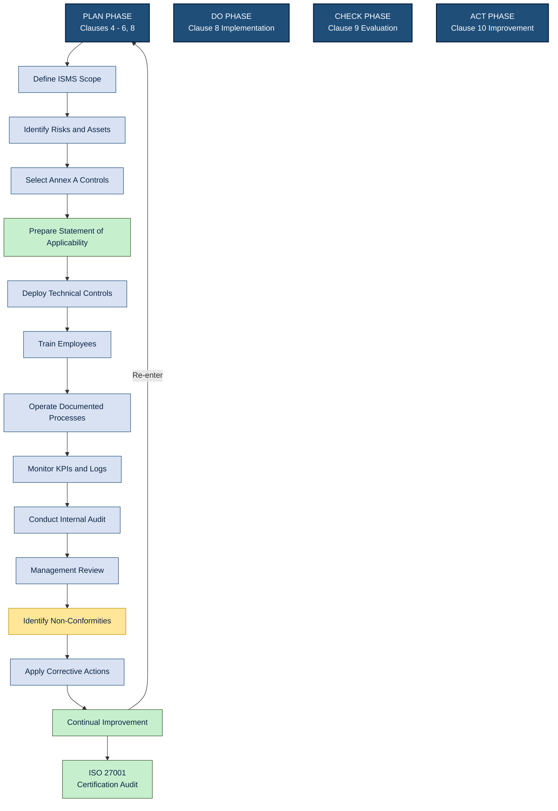
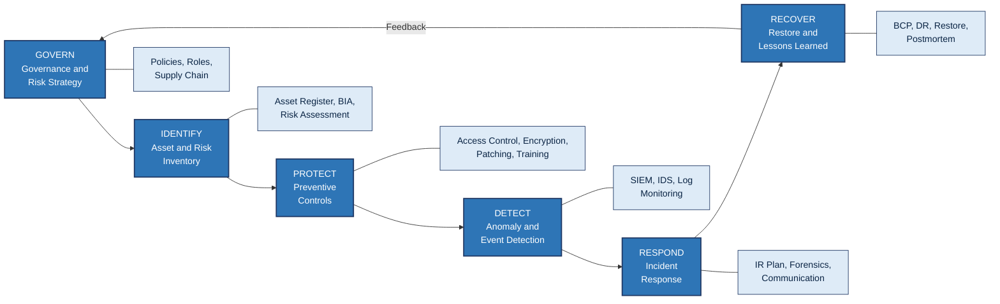
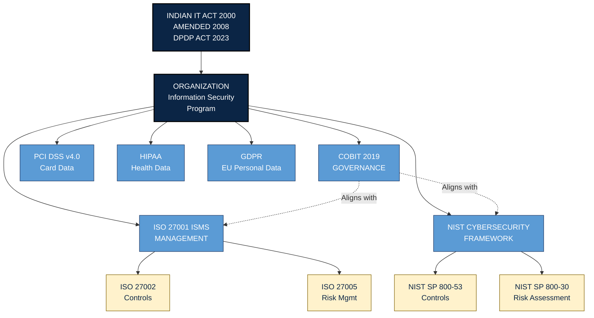
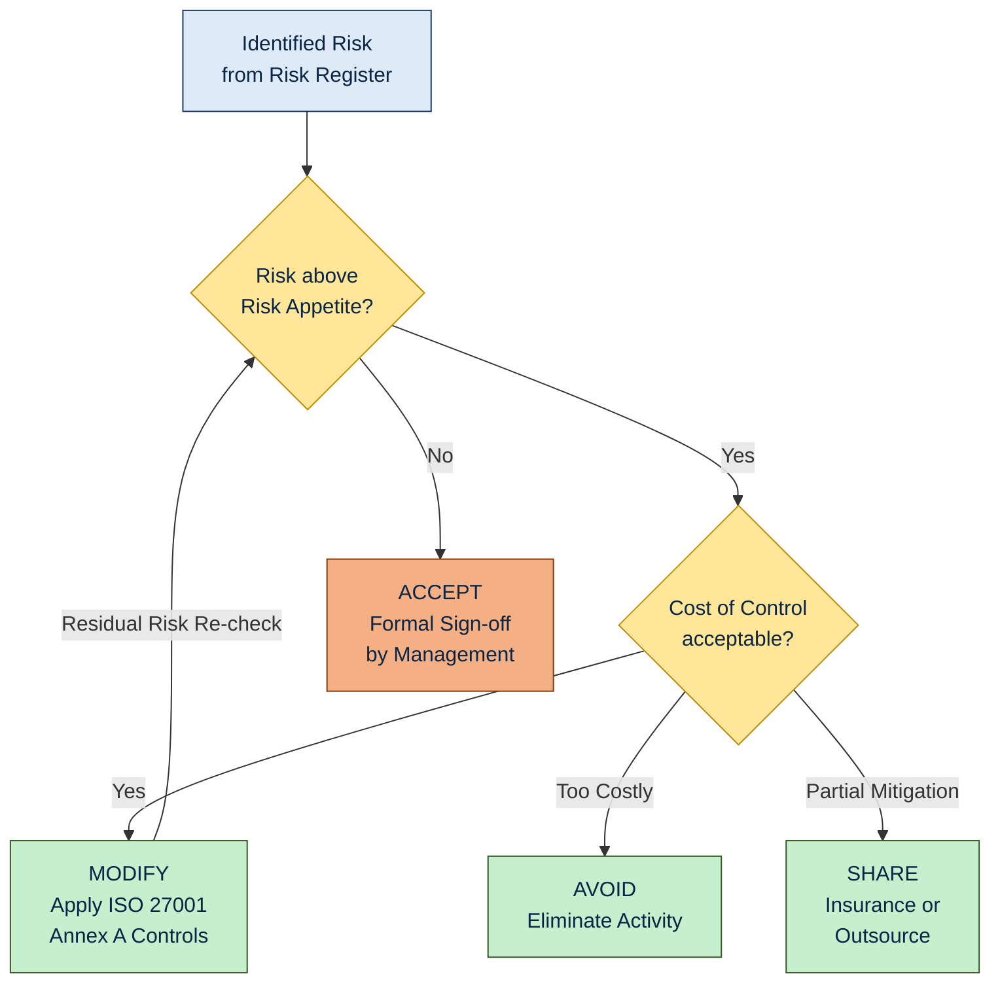

# Information Security Standards

<!-- SECTION_1_START -->
# Information Security Standards — Core Technical Definition & Intuitive Overview

## 1.1 Formal Academic Definition

**Information Security Standards** are formally documented sets of rules, guidelines, best practices, and control frameworks that prescribe how an organization must protect the **Confidentiality**, **Integrity**, and **Availability (CIA Triad)** of its information assets. They provide a structured, auditable, and globally recognized blueprint for designing, implementing, monitoring, and continuously improving an organization's **Information Security Management System (ISMS)**.

> [!IMPORTANT]
> **KTU 2024 Syllabus Anchor (PECST419 — Module 4):**
> *"Information Security Standards"* is a sub-topic under *Security Policies and IT Act*. Students must understand **what** each standard prescribes, **why** organizations adopt them, and **how** compliance is achieved and audited.

In the KTU 2024 Scheme context, the most relevant standards are:

| Standard | Issuing Body | Primary Domain |
|---|---|---|
| **ISO/IEC 27001** | International Organization for Standardization | Generic ISMS |
| **ISO/IEC 27002** | ISO / IEC | Operational Security Controls |
| **NIST CSF** | U.S. National Institute of Standards & Technology | Cybersecurity Risk Management |
| **PCI DSS** | Payment Card Industry Security Standards Council | Cardholder Data Protection |
| **HIPAA** | U.S. Department of Health & Human Services | Healthcare Information Privacy |
| **GDPR** | European Union | Personal Data of EU Citizens |
| **COBIT** | ISACA | IT Governance & Management |
| **CIS Controls** | Center for Internet Security | Prioritized Cyber Hygiene |

---

## 1.2 Conceptual Analogy & Intuition

Imagine you are constructing a **high-rise building** in Kerala that must withstand monsoons, earthquakes, and decades of use. You would not invent your own engineering rules — you would follow the **National Building Code of India (NBC)**, the **Bureau of Indian Standards (BIS)**, and the **Indian Standard (IS) codes** for concrete, steel, and fire safety. These codes tell the engineer exactly **what thickness of concrete to use**, **how many fire exits are mandatory**, and **how to test structural integrity**.

**Information Security Standards serve the exact same purpose for digital systems.** They tell the CISO (Chief Information Security Officer):

- **What** to protect (data classification, asset inventory)
- **How** to protect it (encryption, access control, patch management)
- **How often** to check protection (audits, penetration tests)
- **What to do when something goes wrong** (incident response, BCP/DR)
- **How to prove** to regulators, customers, and partners that protection is real (certification, attestation)

> [!NOTE]
> **Why Bother With Standards?**
> Without a standard, every organization "invents" its own security, leading to **inconsistent**, **unauditable**, and often **ineffective** protection. A standard turns security from an *art* into a *discipline* — much like accounting standards (Ind AS/IFRS) turn financial reporting into a verified science.

---

## 1.3 The CIA Triad — Foundation of All Standards

Every standard ultimately serves to preserve the **CIA Triad**:

$$
\text{Information Security} = f(\text{Confidentiality}, \text{Integrity}, \text{Availability})
$$

| Pillar | Meaning | Real-World Example |
|---|---|---|
| **Confidentiality** | Only authorized users can read data | Aadhaar number visible only to UIDAI & authorized KYC partners |
| **Integrity** | Data is not altered without authorization | Marks on a KTU digital grade card not tampered with |
| **Availability** | Systems work when needed | KTU exam portal accessible during result publication day |

> [!TIP]
> **Extended Properties (often tested in KTU):**
> - **Authentication** — proving *who* you are
> - **Authorization** — proving *what* you can do
> - **Non-repudiation** — preventing the sender from denying they sent a message
> - **Accountability** — every action is traced to a user

---

## 1.4 GeoGebra / Desmos Visualization

> [!VISUALIZATION CONTROL]
> **Concept:** CIA Triad as a three-pillar support structure
> **GeoGebra Input Commands:**
> * `A = (0,0)`, `B = (4,0)`, `C = (2,5)` — represents a triangular support
> * `Poly1 = Polygon(A, B, C)`
> * `T1 = Text("C", (1.5, 1))` — Confidentiality
> * `T2 = Text("I", (2.5, 1))` — Integrity
> * `T3 = Text("A", (2, 3.5))` — Availability
> **Visual Description:** The student should observe a triangle with three vertices. If any one vertex is removed, the structure collapses — illustrating that *all three* of Confidentiality, Integrity, and Availability are mandatory pillars of information security.

---

## 1.5 Why Organizations Adopt Standards

1. **Regulatory Compliance** — Laws like the **IT Act 2000 (amended 2008)**, **GDPR**, **HIPAA**, and **DPDP Act 2023 (India)** indirectly demand adherence to recognized security standards.
2. **Customer Trust** — Enterprises (especially BFSI and IT services in Kerala's Technopark/Infopark) demand ISO 27001 certification from vendors.
3. **Risk Reduction** — Standards codify lessons learned from thousands of past breaches.
4. **Operational Efficiency** — A documented ISMS reduces duplication of effort and ad-hoc decisions.
5. **Legal Defense** — In a cyber-incident lawsuit, demonstrable compliance to a recognized standard acts as a *due diligence* shield.
6. **Global Market Access** — ISO/IEC standards are recognized across 160+ countries, enabling cross-border trade.

> [!IMPORTANT]
> **Quick Mnemonic — "CARE-PALS":**
> **C**ompliance, **A**udit-readiness, **R**isk management, **E**vidence of due diligence, **P**artner requirements, **A**ccountability, **L**egal defense, **S**calability.
<!-- SECTION_1_END -->

<!-- SECTION_2_START -->
# Deep Theoretical Analysis & KTU High-Yield Formula Sheet

## 2.1 The Two Categories of Information Security Standards

Standards can be classified into two broad families:

| Type | Purpose | Examples | Audience |
|---|---|---|---|
| **Management Standards (Framework)** | Define *what* must be done and *why* — high-level governance | ISO 27001, NIST CSF, COBIT | Top Management, CISOs, Auditors |
| **Operational / Technical Standards (Controls)** | Define *how* to do it — specific technical or procedural controls | ISO 27002, PCI DSS, CIS Controls v8, NIST SP 800-53 | Engineers, System Admins, SOC Teams |

> [!NOTE]
> **Critical KTU Distinction:**
> ISO 27001 is **certifiable** (an organization gets an "ISO 27001 Certified" badge).
> ISO 27002 is **not certifiable** — it is a *code of practice* / supporting guideline.

---

## 2.2 ISO/IEC 27001 — The Global ISMS Benchmark

### 2.2.1 What is ISO 27001?

ISO/IEC 27001 is the world's most widely adopted **Information Security Management System (ISMS)** standard. Published by the **International Organization for Standardization (ISO)** jointly with the **International Electrotechnical Commission (IEC)**, the current version is **ISO/IEC 27001:2022**.

An **ISMS** is a systematic, risk-based approach consisting of policies, procedures, processes, and controls that an organization uses to manage information security.

### 2.2.2 The Plan-Do-Check-Act (PDCA) Cycle

ISO 27001 is built on the **PDCA (Deming Cycle)**, mapped as follows:

| PDCA Phase | ISO 27001 Activity | Clause Reference |
|---|---|---|
| **Plan** | Establish ISMS scope, identify risks, select controls, write Statement of Applicability (SoA) | Clauses 4–6, 8 |
| **Do** | Implement the controls, train staff, operate the ISMS | Clause 8 (Implementation) |
| **Check** | Monitor, measure, audit, review | Clause 9 |
| **Act** | Correct non-conformities, continually improve | Clause 10 |

$$
\text{Continuous Improvement} = \lim_{n \to \infty} (\text{PDCA})^n
$$

### 2.2.3 ISO 27001:2022 Control Structure

The 2022 revision reduced the control set from 114 to **93 controls**, organized into **4 themes** and **14 control sets (Annex A)**:

| Theme | Control Sets (Total 14) | Example Controls |
|---|---|---|
| **Organizational (37 controls)** | Policies, Roles, Asset Mgmt, Access Control, Supplier, Incident Mgmt, Compliance, etc. | A.5.1 Policies for InfoSec, A.5.24 Incident Mgmt Planning |
| **People (8 controls)** | Screening, Training, Disciplinary Process | A.6.3 Awareness & Training |
| **Physical (14 controls)** | Perimeter Security, Equipment Disposal | A.7.1 Physical Perimeters |
| **Technological (34 controls)** | Cryptography, Backup, Network Security, Logging, Secure Coding | A.8.5 Secure Authentication, A.8.24 Use of Cryptography |

### 2.2.4 Mandatory Clauses (Clauses 4–10)

These are the **7 mandatory clauses** that an organization *must* satisfy for certification:

| Clause | Title | KTU Focus |
|---|---|---|
| **4** | Context of the Organization | Internal/external issues, scope of ISMS |
| **5** | Leadership | Top management commitment, roles & responsibilities |
| **6** | Planning | Risk assessment methodology, risk treatment plan, SoA |
| **7** | Support | Resources, competence, awareness, communication, documented info |
| **8** | Operation | Operational planning, risk treatment implementation |
| **9** | Performance Evaluation | Monitoring, internal audit, management review |
| **10** | Improvement | Non-conformity, corrective action, continual improvement |

> [!IMPORTANT]
> **Statement of Applicability (SoA)** is a single document that:
> (a) lists all 93 Annex A controls,
> (b) states which are applicable and which are not, and
> (c) provides justification for inclusion/exclusion.
> It is the **single most important document** reviewed by ISO 27001 auditors.

---

## 2.3 NIST Cybersecurity Framework (CSF)

Published by the U.S. **National Institute of Standards and Technology (NIST)** in 2014 (updated to **CSF 2.0** in 2024), the framework organizes cybersecurity into **6 Functions** (in CSF 2.0):

$$
\text{NIST CSF} = \{\text{GOVERN}, \text{IDENTIFY}, \text{PROTECT}, \text{DETECT}, \text{RESPOND}, \text{RECOVER}\}
$$

| Function | Purpose | Sample Activities |
|---|---|---|
| **GOVERN** (added in 2.0) | Enterprise-wide cybersecurity governance, risk strategy, supply chain | Define policies, roles, oversight |
| **IDENTIFY** | Asset & risk inventory, business environment | Asset register, BIA (Business Impact Analysis) |
| **PROTECT** | Implement preventive controls | Access control, encryption, training, patching |
| **DETECT** | Identify occurrence of cyber events | SIEM, IDS/IPS, log monitoring, anomaly detection |
| **RESPOND** | Contain, mitigate, communicate | Incident response plan, forensics, notification |
| **RECOVER** | Restore capabilities and services | BCP/DR, lessons learned, restore backups |

**Tiers (Maturity Levels):** NIST CSF defines 4 implementation tiers:
- **Tier 1 — Partial** (ad-hoc)
- **Tier 2 — Risk-Informed** (approved but not enterprise-wide)
- **Tier 3 — Repeatable** (formally documented)
- **Tier 4 — Adaptive** (continuous, data-driven improvement)

**Profiles:** A "Current Profile" vs. "Target Profile" gap analysis guides the roadmap.

---

## 2.4 PCI DSS — Payment Card Industry Data Security Standard

Applies to **any entity that stores, processes, or transmits cardholder data** (debit/credit cards). The current version is **PCI DSS v4.0** (released 2022, mandatory from 2025).

**6 Control Objectives (PCI DSS v4.0):**

1. **Build and Maintain a Secure Network and Systems** — firewalls, default passwords
2. **Protect Account Data** — encryption in transit and at rest, no storage of CVV/CVC
3. **Maintain a Vulnerability Management Program** — patching, anti-malware
4. **Implement Strong Access Control Measures** — least privilege, unique IDs, MFA
5. **Regularly Monitor and Test Networks** — logs, vulnerability scans, pen-tests
6. **Maintain an Information Security Policy** — written, maintained, disseminated

> [!NOTE]
> **PCI DSS has 12 core requirements** under these 6 objectives. Students often confuse 6 vs. 12 — remember the **6 Objectives contain 12 Requirements**.

---

## 2.5 COBIT (Control Objectives for Information and Related Technologies)

Issued by **ISACA**, COBIT is an IT **governance** framework (not purely a security standard). The current version is **COBIT 2019**.

**COBIT 2019 Core Model** aligns IT goals with enterprise goals using:
- **40 Governance & Management Objectives**
- **Design Factors** for tailoring
- **Performance Management** (process capability using CMMI levels)

COBIT integrates with other standards: ISO 27001, ITIL, TOGAF, NIST CSF, etc.

---

## 2.6 KTU Formula Sheet / Cheat Sheet

| Concept | Key Formula / Definition | KTU Use |
|---|---|---|
| **CIA Triad** | $S = \{C, I, A\}$ | Define security goals |
| **Annualized Loss Expectancy (ALE)** | $\text{ALE} = \text{SLE} \times \text{ARO}$ | Justify control investment |
| **Single Loss Expectancy** | $\text{SLE} = \text{Asset Value} \times \text{Exposure Factor}$ | Quantify per-incident loss |
| **Return on Security Investment (ROSI)** | $\text{ROSI} = \dfrac{\text{ALE}_{\text{before}} - \text{ALE}_{\text{after}} - \text{Cost of Control}}{\text{Cost of Control}}$ | Prove security ROI to management |
| **Risk Score** | $\text{Risk} = \text{Threat} \times \text{Vulnerability} \times \text{Impact}$ | Risk register entries |
| **PDCA Loop** | $Q_{n+1} = Q_n + \Delta_{\text{improve}}$ | Continual improvement model |
| **NIST CSF Functions** | $\{G, I, P, D, R, R\}$ (CSF 2.0) | Cybersecurity framework |
| **ISO 27001 Controls (2022)** | 93 controls / 14 sets / 4 themes | Audit & certification |
| **PCI DSS v4.0** | 6 objectives / 12 requirements | Cardholder data security |
| **Residual Risk** | $R_{\text{residual}} = R_{\text{inherent}} - R_{\text{controls}}$ | After-control risk |
| **Maturity Level** | $L \in \{1, 2, 3, 4, 5\}$ (CMMI) | Process capability rating |

> [!TIP]
> **ALE, SLE, ARO are HIGH-FREQUENCY exam topics** in risk-management questions. The ROSI formula is asked directly in 14-mark problems.

---

## 2.7 Real-World Engineering Utility

| Sector | Standard Used | Why |
|---|---|---|
| **Banking (e.g., SBI, Federal Bank Kerala)** | ISO 27001 + RBI Cyber Security Framework | Customer data, transaction integrity |
| **IT Services (TCS, Infosys, UST Global Trivandrum)** | ISO 27001 + SOC 2 + PCI DSS | Client contracts demand certification |
| **Healthcare (Kerala hospitals)** | ISO 27799 (healthcare ISMS) + HIPAA-equivalent | Patient records, telemedicine |
| **E-commerce (Flipkart, Amazon India)** | PCI DSS v4.0 | Cardholder transactions |
| **Government (KTU, Digital Kerala)** | ISO 27001 + IT Act 2000 | Public service portals, exam data |
| **Cloud (AWS, Azure, GCP)** | SOC 2 Type II + ISO 27017 (cloud) + ISO 27018 (PII in cloud) | Customer trust, data residency |

> [!IMPORTANT]
> For Kerala-based IT companies, **ISO 27001 certification is often a deal-breaker** during vendor onboarding by global clients — making it the most commercially valuable standard in this module.
<!-- SECTION_2_END -->

<!-- SECTION_3_START -->
# Step-by-Step Derivations, Risk Mathematics & Code Implementation

## 3.1 Risk Management Mathematics (Full Derivation)

### 3.1.1 Single Loss Expectancy (SLE)

The SLE represents the monetary loss expected from a *single occurrence* of a risk event. It is computed as:

$$
\text{SLE} = \text{Asset Value (AV)} \times \text{Exposure Factor (EF)}
$$

The **Exposure Factor (EF)** is the percentage of asset value lost if the risk materializes, expressed as a decimal (e.g., $0.40$ for 40% loss).

**Example Derivation:**
- Asset: Customer database of a Kerala e-commerce firm
- Asset Value (AV) = $\text{Rs. } 50{,}00{,}000$
- Exposure Factor (EF) = $0.60$ (60% of records corrupted in a SQL injection)

$$
\begin{aligned}
\text{SLE} &= \text{AV} \times \text{EF} \\
&= 50{,}00{,}000 \times 0.60 \\
&= \text{Rs. } 30{,}00{,}000
\end{aligned}
$$

**Interpretation:** A single SQL injection incident would cause a Rs. 30 lakh loss.

### 3.1.2 Annualized Rate of Occurrence (ARO)

ARO is the estimated **number of times per year** a particular risk will materialize. Values:
- $\text{ARO} = 0$ → no expected occurrence
- $\text{ARO} = 0.1$ → once every 10 years
- $\text{ARO} = 1$ → annual
- $\text{ARO} = 12$ → monthly

### 3.1.3 Annualized Loss Expectancy (ALE)

$$
\text{ALE} = \text{SLE} \times \text{ARO}
$$

**Example Derivation (continued):** If the SQL injection is expected to occur twice a year:

$$
\begin{aligned}
\text{ALE}_{\text{before}} &= \text{SLE} \times \text{ARO} \\
&= 30{,}00{,}000 \times 2 \\
&= \text{Rs. } 60{,}00{,}000
\end{aligned}
$$

So **before** any control, the firm is expected to lose Rs. 60 lakhs per year to this specific risk.

### 3.1.4 Return on Security Investment (ROSI)

Suppose the firm installs a **Web Application Firewall (WAF)** + conducts code review:
- Cost of Control (CoC) = $\text{Rs. } 8{,}00{,}000$ per year
- After the control, the same risk has $\text{SLE} = 50{,}00{,}000 \times 0.15 = 7{,}50{,}000$ and $\text{ARO} = 0.25$:

$$
\begin{aligned}
\text{ALE}_{\text{after}} &= 7{,}50{,}000 \times 0.25 = 1{,}87{,}500 \\
\text{ROSI} &= \frac{\text{ALE}_{\text{before}} - \text{ALE}_{\text{after}} - \text{CoC}}{\text{CoC}} \\
&= \frac{60{,}00{,}000 - 1{,}87{,}500 - 8{,}00{,}000}{8{,}00{,}000} \\
&= \frac{50{,}12{,}500}{8{,}00{,}000} \\
&= 6.265 \\
&\approx 626.5\%
\end{aligned}
$$

**Interpretation:** The WAF + code-review control yields a **626% return** — strongly justifying the investment to top management.

### 3.1.5 Residual Risk

$$
R_{\text{residual}} = R_{\text{inherent}} - R_{\text{mitigated}}
$$

In monetary terms:

$$
\text{ALE}_{\text{residual}} = \text{ALE}_{\text{inherent}} - (\text{ALE}_{\text{inherent}} - \text{ALE}_{\text{after}}) = \text{ALE}_{\text{after}}
$$

A risk that remains above the organization's **risk appetite** must be **avoided, transferred, or accepted with formal sign-off**.

---

## 3.2 ISO 27001:2022 Implementation — Step-by-Step Procedure

The 10-step implementation roadmap is the **single most likely 14-mark KTU question** on this topic. Every step must be memorized.

**Step 1 — Obtain Top Management Commitment**
- Documented management approval, budget allocation, and appointment of a **CISO / ISMS Leader**.

**Step 2 — Define the Scope of the ISMS**
- Specify the **organizational unit(s)**, **locations**, **assets**, and **boundaries** covered.
- E.g., "ISMS scope: All IT operations of XYZ Pvt. Ltd., Technopark Trivandrum, India, including cloud workloads in AWS Mumbai region."

**Step 3 — Conduct a Risk Assessment**
- Identify assets, threats, vulnerabilities, impacts, and likelihoods.
- Choose a methodology: **ISO 27005**, **NIST SP 800-30**, **OCTAVE**, or **FAIR**.

**Step 4 — Identify and Evaluate Risk Treatment Options**
Four options for each risk:
1. **Risk Modification** — apply controls to reduce likelihood/impact.
2. **Risk Retention (Accept)** — if below risk appetite.
3. **Risk Avoidance** — eliminate the activity causing risk.
4. **Risk Sharing (Transfer)** — insurance, outsourcing.

**Step 5 — Select Controls from Annex A**
Choose applicable controls from the 93 controls of ISO 27001:2022 Annex A.

**Step 6 — Prepare the Statement of Applicability (SoA)**
- Lists all 93 controls, whether they apply, justification, and current implementation status.

**Step 7 — Implement the Controls and Risk Treatment Plan**
- Deploy technical controls (firewalls, encryption), procedural controls (policies, training), and physical controls (CCTV, locks).

**Step 8 — Conduct Awareness & Training Programs**
- All employees must be trained on the ISMS, their role, and incident reporting.

**Step 9 — Monitor, Measure, and Internal Audit**
- KPIs, metrics, logs, periodic audits against ISO 27001 clauses 9.1 and 9.2.

**Step 10 — Management Review and Continual Improvement**
- Top management formally reviews ISMS performance (Clause 9.3) and drives improvements (Clause 10).

> [!IMPORTANT]
> After all 10 steps, the organization invites an **accredited certification body** (e.g., BSI, TÜV SÜD, DNV) for a two-stage audit. **Stage 1 = documentation review; Stage 2 = on-site assessment**. A successful audit yields a 3-year ISO 27001 certificate with annual surveillance audits.

---

## 3.3 Python Implementation — Compliance Scoring Tool

A practical, exam-ready Python program that:
(a) loads the 93 ISO 27001:2022 control IDs,
(b) accepts user-input compliance status, and
(c) computes a **Compliance Percentage Score** with **risk-weighted severity**.

```python
"""
ISO 27001:2022 Compliance Scoring Tool
Maps each Annex A control to a weighted risk score.
"""

from dataclasses import dataclass, field
from typing import Dict, List
import logging
import sys

logging.basicConfig(
    level=logging.INFO,
    format="%(asctime)s [%(levelname)s] %(message)s",
)

CONTROL_WEIGHTS: Dict[str, int] = {
    "A.5.1": 5,   # Information security policies
    "A.5.7": 5,   # Threat intelligence
    "A.5.15": 4,  # Access control policy
    "A.5.24": 5,  # Information security incident management planning
    "A.5.30": 3,  # ICT readiness for business continuity
    "A.6.3": 4,   # Information security awareness & training
    "A.6.6": 3,   # Confidentiality / non-disclosure agreements
    "A.7.1": 3,   # Physical perimeters
    "A.8.5": 5,   # Secure authentication
    "A.8.9": 4,   # Configuration management
    "A.8.16": 5,  # Monitoring activities
    "A.8.24": 5,  # Use of cryptography
    "A.8.28": 4,  # Secure coding
}

VALID_STATUSES = {"implemented", "partial", "missing", "not_applicable"}


@dataclass
class ControlResult:
    control_id: str
    weight: int
    status: str
    score: float = 0.0


@dataclass
class ComplianceReport:
    results: List[ControlResult] = field(default_factory=list)
    total_weight: int = 0
    earned_score: float = 0.0

    def add(self, result: ControlResult) -> None:
        if result.status == "not_applicable":
            logging.info("Skipping N/A control: %s", result.control_id)
            return
        if result.status not in VALID_STATUSES:
            raise ValueError(f"Invalid status '{result.status}' for {result.control_id}")
        self.results.append(result)
        self.total_weight += result.weight
        self.earned_score += result.score

    def percentage(self) -> float:
        if self.total_weight == 0:
            return 0.0
        return round((self.earned_score / self.total_weight) * 100, 2)


STATUS_MULTIPLIER: Dict[str, float] = {
    "implemented": 1.0,
    "partial": 0.5,
    "missing": 0.0,
}


def collect_user_input() -> ControlResult:
    cid = input("Enter Control ID (e.g., A.8.5): ").strip().upper()
    if cid not in CONTROL_WEIGHTS:
        raise KeyError(f"Control {cid} not found in scope.")
    status = input("Status (implemented/partial/missing/not_applicable): ").strip().lower()
    weight = CONTROL_WEIGHTS[cid]
    score = weight * STATUS_MULTIPLIER.get(status, 0.0)
    return ControlResult(control_id=cid, weight=weight, status=status, score=score)


def main() -> int:
    report = ComplianceReport()
    print("=== ISO 27001:2022 Compliance Tool ===")
    print(f"Total controls in scope: {len(CONTROL_WEIGHTS)}")
    try:
        for _ in range(len(CONTROL_WEIGHTS)):
            try:
                r = collect_user_input()
                report.add(r)
            except (KeyError, ValueError) as e:
                logging.error("Input error: %s", e)
                return 1
    except KeyboardInterrupt:
        logging.warning("User aborted the input process.")

    print("\n=== COMPLIANCE REPORT ===")
    print(f"Total weight assessed   : {report.total_weight}")
    print(f"Total score earned      : {report.earned_score}")
    print(f"Compliance percentage   : {report.percentage()}%")
    if report.percentage() >= 95:
        print("VERDICT: Audit-ready (>= 95%)")
    elif report.percentage() >= 75:
        print("VERDICT: Acceptable, address partials")
    else:
        print("VERDICT: Major non-conformities, NOT audit-ready")
    return 0


if __name__ == "__main__":
    sys.exit(main())
```

**Sample Output (excerpt):**
```
Enter Control ID (e.g., A.8.5): A.8.5
Status: implemented
...
=== COMPLIANCE REPORT ===
Total weight assessed   : 62
Total score earned      : 55
Compliance percentage   : 88.71%
VERDICT: Acceptable, address partials
```

---

## 3.4 Comparative Standards Matrix (Tabular for KTU)

| Feature | ISO 27001 | NIST CSF | PCI DSS v4.0 | COBIT 2019 | HIPAA |
|---|---|---|---|---|---|
| **Type** | Management framework | Risk framework | Prescriptive controls | IT governance | Regulation |
| **Certifiable** | Yes | No | Yes (via QSA/ROC) | No | Audit by HHS |
| **Origin** | ISO/IEC | US Government | PCI SSC | ISACA | US Congress |
| **Sector** | All | All (esp. critical infra) | Payment cards | All | Healthcare |
| **Risk Method** | ISO 27005 | NIST 800-30 | Optional | COBIT Risk | HHS Risk Tool |
| **Maturity Model** | Implicit (Clause 9) | 4 Tiers | ROC reporting | CMMI 5 levels | None |
| **Key Strength** | Global acceptance | Voluntary best practice | Mandatory for card data | IT-business alignment | Patient privacy |
| **KTU Frequency** | Very High | High | Medium | Medium | Medium |

---

## 3.5 ISO 27001 vs. ISO 27002 — Tabular Distinction

| Aspect | ISO 27001 | ISO 27002 |
|---|---|---|
| **Purpose** | Defines ISMS requirements | Provides implementation guidance |
| **Certifiable** | Yes | No |
| **Structure** | 7 mandatory clauses + Annex A | 14 control sets / 93 controls |
| **Audience** | Top management, auditors | Implementers, engineers |
| **Document Output** | SoA, Risk Treatment Plan | Control implementation guidance |
| **Release Pair** | ISO 27001:2022 | ISO 27002:2022 (companion) |
<!-- SECTION_3_END -->

<!-- SECTION_4_START -->
# Structural Diagrams & Schematics

## 4.1 Mermaid Diagram — ISO 27001:2022 PDCA Implementation Cycle



**Reading the diagram:** Each phase cascades into detailed sub-steps. The artifact nodes (`P4`, `A3`, `CERT`) represent *outputs* — Statement of Applicability, Continual Improvement Plan, and the final Certification Audit. The feedback arrow from A3 back to PLAN closes the PDCA loop.

---

## 4.2 Mermaid Diagram — NIST CSF 2.0 Six-Function Core



**Reading the diagram:** The six functions form a left-to-right flow, with **GOVERN** wrapping all others (it appears in CSF 2.0 as a top-level governance function that influences every other stage). The lower subgraph nodes describe the operational activities under each function.

---

## 4.3 Mermaid Diagram — Standards Mapping Architecture



**Reading the diagram:** Indian laws sit at the top as the legal driver. Organizations build their security program by selecting and integrating multiple standards. The dashed arrows show that COBIT 2019 acts as an *integrating* framework that aligns with both ISO 27001 and NIST CSF.

---

## 4.4 Mermaid Diagram — Risk Treatment Decision Flow



**Reading the diagram:** Every identified risk is first compared with the organization's **risk appetite** (a pre-defined threshold of acceptable loss). Risks above appetite flow into a cost-feasibility decision, leading to one of the four canonical risk treatment options: **Modify, Avoid, Share, Accept**. The loop back to Q1 ensures residual risk is continuously re-evaluated.
<!-- SECTION_4_END -->

<!-- SECTION_5_START -->
# KTU 2024 Scheme Examination Question Bank & Topic Recap

## Part A — Short Answer Questions (3 Marks Each)

### Question 1: Define Information Security Standard. Give two examples. [KTU University Exam - July 2023]

**Model Answer (3 Marks):**
An **Information Security Standard** is a formally documented set of rules, guidelines, and best practices that prescribe how an organization must protect the **Confidentiality, Integrity, and Availability** of its information assets. *[1 Mark]*
Examples: **ISO/IEC 27001** (ISMS) and **PCI DSS v4.0** (payment card data). *[1 Mark]*
These standards provide a structured, auditable framework for designing and managing an organization's security posture, enabling legal compliance, customer trust, and operational efficiency. *[1 Mark]*

---

### Question 2: List the four themes of ISO 27001:2022 Annex A. [KTU University Exam - Dec 2023]

**Model Answer (3 Marks):**
The ISO 27001:2022 Annex A is organized into **4 themes** with **14 control sets** and **93 controls**. *[1 Mark]*
1. **Organizational** (37 controls) — policies, supplier relationships, incident management *[0.5 Marks]*
2. **People** (8 controls) — screening, training, disciplinary process *[0.5 Marks]*
3. **Physical** (14 controls) — perimeter security, equipment disposal *[0.5 Marks]*
4. **Technological** (34 controls) — cryptography, logging, secure coding, network security *[0.5 Marks]*

---

## Part B — Long Answer Questions (14 Marks Each)

> [!NOTE]
> KTU 2024 ESE Part B features a **module-level internal choice**: students answer **one full question from a pair** (either Option A or Option B). Each question carries **14 marks**, typically divided into **two sub-parts of 7 marks each**.

---

### Option A — 14 Marks

**Q. (a)** Explain the **Plan-Do-Check-Act (PDCA) cycle** as applied to ISO 27001. Map each phase to the relevant ISO 27001:2022 clauses. **[7 Marks]** [CO2, Understand] — *[KTU University Exam - July 2024]*

**Model Solution:**

The **PDCA (Deming) cycle** is the operational backbone of ISO 27001:2022, providing a structured mechanism to establish, implement, monitor, and continuously improve the Information Security Management System (ISMS). *[1 Mark]*

**PLAN Phase — Clauses 4, 5, 6, and part of 8**
- **Clause 4 (Context):** Identify internal/external issues, the scope of the ISMS, and interested-party needs. *[1 Mark]*
- **Clause 5 (Leadership):** Secure top management commitment, define the information security policy, and assign roles & responsibilities. *[1 Mark]*
- **Clause 6 (Planning):** Conduct risk assessment, define a risk treatment methodology, and prepare the **Statement of Applicability (SoA)**. *[1 Mark]*

**DO Phase — Clause 8 (Operation)**
- Implement the chosen risk treatment plan.
- Deploy Annex A controls (technical, procedural, physical).
- Conduct awareness and training programs for all staff. *[1 Mark]*

**CHECK Phase — Clause 9 (Performance Evaluation)**
- Monitor, measure, analyze, and evaluate ISMS performance.
- Conduct **internal audits** at planned intervals.
- Hold **management reviews** to assess suitability, adequacy, and effectiveness. *[1 Mark]*

**ACT Phase — Clause 10 (Improvement)**
- Identify non-conformities and apply **corrective actions**.
- Drive **continual improvement** of the ISMS based on audit findings, incidents, and changing risk landscape. *[1 Mark]*
- The output of ACT feeds back into PLAN, closing the loop. *[1 Mark]*

---

**Q. (b)** A banking firm has an asset (customer transaction database) valued at **Rs. 5 crore**. A **phishing attack** would expose **30% of records** and is expected to occur **once every 2 years**. The firm is considering a phishing-awareness + email-filtering solution costing **Rs. 6 lakh per year**, which would reduce exposure to **5%** and occurrence to **once every 8 years**. Compute the **SLE, ARO, ALE (before), ALE (after), and ROSI**, and comment on whether the investment is justified. **[7 Marks]** [CO3, Apply] — *[KTU University Exam - Dec 2023]*

**Model Solution:**

**Given:**
- Asset Value (AV) = Rs. $5{,}00{,}00{,}000$
- Exposure Factor (EF) = 30% = 0.30 (before control)
- ARO = 0.5 (once every 2 years)
- Cost of Control (CoC) = Rs. $6{,}00{,}000$ per year
- EF after control = 5% = 0.05
- ARO after control = 0.125 (once every 8 years)

**Step 1 — SLE (before):** *[1 Mark]*
$$
\text{SLE}_{\text{before}} = \text{AV} \times \text{EF} = 5{,}00{,}00{,}000 \times 0.30 = 1{,}50{,}00{,}000
$$

**Step 2 — ALE (before):** *[1 Mark]*
$$
\text{ALE}_{\text{before}} = \text{SLE}_{\text{before}} \times \text{ARO} = 1{,}50{,}00{,}000 \times 0.5 = 75{,}00{,}000
$$

**Step 3 — SLE (after):** *[1 Mark]*
$$
\text{SLE}_{\text{after}} = 5{,}00{,}00{,}000 \times 0.05 = 25{,}00{,}000
$$

**Step 4 — ALE (after):** *[1 Mark]*
$$
\text{ALE}_{\text{after}} = 25{,}00{,}000 \times 0.125 = 3{,}12{,}500
$$

**Step 5 — ROSI:** *[1.5 Marks]*
$$
\begin{aligned}
\text{ROSI} &= \frac{\text{ALE}_{\text{before}} - \text{ALE}_{\text{after}} - \text{CoC}}{\text{CoC}} \\
&= \frac{75{,}00{,}000 - 3{,}12{,}500 - 6{,}00{,}000}{6{,}00{,}000} \\
&= \frac{65{,}87{,}500}{6{,}00{,}000} \\
&= 10.979 \approx 1097.9\%
\end{aligned}
$$

**Conclusion:** The phishing-awareness + email-filtering solution yields a **ROSI of ~1098%**, which is exceptionally high. **The investment is strongly justified.** *[0.5 Marks]*

**Valuation Key for (b):**
- [SLE computation: 1 Mark]
- [ALE computations before/after: 2 Marks]
- [Correct ROSI formula substitution: 1.5 Marks]
- [Final ROSI value and conclusion: 1 Mark]
- [Risk-reduction commentary: 1.5 Marks]

---

### Option B — 14 Marks

**Q. (a)** Describe the **NIST Cybersecurity Framework (CSF) 2.0** with its **6 core functions** and **4 implementation tiers**. Mention one typical activity per function. **[7 Marks]** [CO2, Understand] — *[KTU University Exam - July 2024]*

**Model Solution:**

The **NIST CSF 2.0** is a voluntary, risk-based framework published by the U.S. National Institute of Standards and Technology. It helps organizations of all sizes manage and reduce cybersecurity risk. *[1 Mark]*

**Six Core Functions:** *[3 Marks — 0.5 per function]*

| Function | Purpose | Sample Activity |
|---|---|---|
| **GOVERN** | Enterprise-wide cybersecurity governance, risk strategy, supply chain risk | Define the organization's cybersecurity policy and assign board-level risk oversight |
| **IDENTIFY** | Develop organizational understanding to manage cybersecurity risk | Maintain a complete asset inventory and Business Impact Analysis (BIA) |
| **PROTECT** | Implement safeguards to ensure delivery of critical services | Deploy MFA, encryption, security awareness training, and patching |
| **DETECT** | Define activities to identify the occurrence of a cyber event | Operate SIEM, IDS/IPS, and continuous log monitoring |
| **RESPOND** | Take action regarding a detected cybersecurity incident | Activate the Incident Response Plan, perform forensic analysis, notify stakeholders |
| **RECOVER** | Restore capabilities and services impaired by an incident | Execute BCP/DR plans, restore from backups, conduct post-mortem |

**Four Implementation Tiers:** *[2.5 Marks]*
1. **Tier 1 — Partial:** Ad-hoc, reactive, no enterprise-wide risk management. *[0.5 Marks]*
2. **Tier 2 — Risk-Informed:** Risk management practices approved by management but not organization-wide. *[0.5 Marks]*
3. **Tier 3 — Repeatable:** Formal, organization-wide policies, regularly updated. *[0.5 Marks]*
4. **Tier 4 — Adaptive:** Continuous improvement using predictive indicators, lessons learned, and threat intelligence. *[0.5 Marks]*

**Profiles & Conclusion:** Organizations create a **Current Profile** (where they are) and a **Target Profile** (where they want to be) and use a gap analysis to prioritize improvements. *[0.5 Marks]*

---

**Q. (b)** Compare **ISO 27001, NIST CSF, and PCI DSS v4.0** across any **five** parameters. Why is ISO 27001 the most widely adopted standard globally? **[7 Marks]** [CO4, Analyze] — *[KTU University Exam - Dec 2022]*

**Model Solution:**

**Comparative Table (5 parameters):** *[4 Marks — 0.8 per row]*

| Parameter | ISO 27001 | NIST CSF | PCI DSS v4.0 |
|---|---|---|---|
| **Type** | Management framework (ISMS) | Voluntary risk framework | Prescriptive technical controls |
| **Certifiable** | Yes (3-year cycle) | No (self-assessment) | Yes (via QSA / ROC report) |
| **Issuing Body** | ISO / IEC | U.S. NIST | PCI Security Standards Council |
| **Sector Applicability** | All sectors | All sectors, esp. critical infra | Mandatory for entities handling card data |
| **Risk Methodology** | ISO 27005 recommended | NIST SP 800-30 | Optional; 12 must-do requirements |

**Why ISO 27001 is the most widely adopted:** *[3 Marks]*

1. **Global recognition** — Issued by ISO/IEC, accepted in 160+ countries; vendor-neutral. *[1 Mark]*
2. **Certifiability** — Provides a tangible, third-party-verified badge; clients demand it. *[1 Mark]*
3. **Comprehensive, risk-based, sector-agnostic** — Applicable to banks, IT firms, hospitals, governments, and cloud providers alike; uses a flexible risk-treatment approach that any organization can tailor. *[1 Mark]*

> [!WARNING]
> **KTU Examiner's Valuation Warning — Common Pitfalls:**
> - **Forgetting to write the formula** in risk-math questions: even if your final answer is correct, full marks require the explicit equation (SLE, ALE, ROSI). **[Lose up to 1 Mark]**
> - **Confusing ISO 27001 with ISO 27002**: ISO 27001 is *certifiable*; ISO 27002 is *not*. Examiners explicitly test this distinction. **[Lose up to 1 Mark]**
> - **Stating "ISO 27001 has 114 controls"** in 2024 — this is the **2013 version**. The 2022 version has **93 controls / 14 sets / 4 themes**. **[Lose up to 1 Mark]**
> - **Missing the "GOVERN" function** in NIST CSF — CSF 2.0 (2024) has **6 functions**, not 5. The 5-function version is CSF 1.1. **[Lose up to 1 Mark]**
> - **In PDCA mapping, misassigning Clause 10** (Improvement) to CHECK — Clause 10 is **ACT**, Clause 9 is **CHECK**. **[Lose up to 1 Mark]**
> - **In comparison questions, only listing features without comparing** — KTU examiners want a *contrast*, not a paragraph on each standard. Always use a **table**. **[Lose up to 2 Marks]**

---

## Topic Recap & Important Things to Remember

- **Information Security Standard** = formalized framework for managing CIA of information assets.
- **CIA Triad** = Confidentiality, Integrity, Availability — the universal security goal.
- **ISO 27001:2022** = the world's leading certifiable ISMS standard, based on **PDCA**.
- **PDCA Cycle:** **Plan** (Clauses 4–6, 8) → **Do** (Clause 8) → **Check** (Clause 9) → **Act** (Clause 10).
- **ISO 27001:2022 Annex A** has **4 themes**, **14 control sets**, and **93 controls**.
- **Statement of Applicability (SoA)** is the *single most important document* in an ISO 27001 audit.
- **ISO 27001 is certifiable; ISO 27002 is a code of practice (not certifiable).**
- **NIST CSF 2.0** has **6 functions**: GOVERN, IDENTIFY, PROTECT, DETECT, RESPOND, RECOVER, with **4 Tiers** (Partial, Risk-Informed, Repeatable, Adaptive).
- **PCI DSS v4.0** has **6 objectives** containing **12 requirements** — mandatory for any entity handling cardholder data.
- **COBIT 2019** is an IT **governance** framework (not purely a security standard) issued by **ISACA**.
- **HIPAA** protects healthcare data; **GDPR** protects EU citizens' personal data; both are *regulations*, not voluntary standards.
- **Risk formulas** (high-frequency):
  - $\text{SLE} = \text{AV} \times \text{EF}$
  - $\text{ALE} = \text{SLE} \times \text{ARO}$
  - $\text{ROSI} = \dfrac{\text{ALE}_{\text{before}} - \text{ALE}_{\text{after}} - \text{CoC}}{\text{CoC}}$
  - $R_{\text{residual}} = R_{\text{inherent}} - R_{\text{mitigated}}$
- **Four risk treatment options:** **Modify** (apply controls), **Avoid** (eliminate activity), **Share/Transfer** (insurance/outsourcing), **Accept** (formal sign-off).
- **ISO 27001 10-step implementation:** Top management commitment → scope → risk assessment → risk treatment → select Annex A controls → SoA → implement → train → monitor/audit → management review & improvement → certification audit.
- **Indian Context:** IT Act 2000 (amended 2008) and the **Digital Personal Data Protection Act 2023 (DPDP Act)** legally drive adoption of standards like ISO 27001 by Indian organizations.
- **Kerala context:** Technopark/Infopark IT firms routinely require ISO 27001 + SOC 2 for global client onboarding; PCI DSS is mandatory for banks and payment gateways.
- **Certifiable standards in this module:** ISO 27001, PCI DSS, ISO 27701, SOC 2. **Non-certifiable (voluntary) frameworks:** NIST CSF, ISO 27002, COBIT, CIS Controls.
- **Memorize the difference** between *management* standards (what/why) and *technical/operational* standards (how) — KTU frequently tests this conceptual distinction.
- **Mnemonic for PDCA + Clauses:** *"Please Do Check Acts"* → P = Clauses 4–6, D = Clause 8, C = Clause 9, A = Clause 10.
<!-- SECTION_5_END -->
