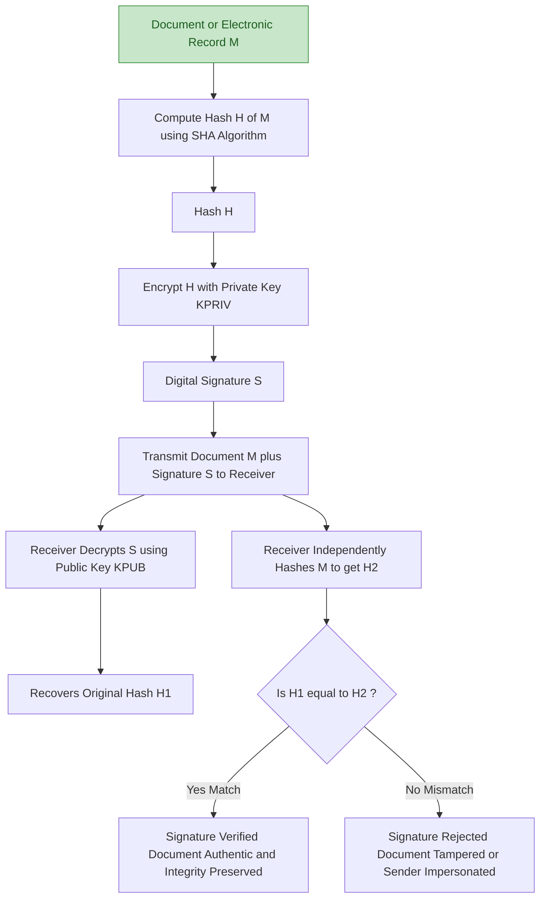
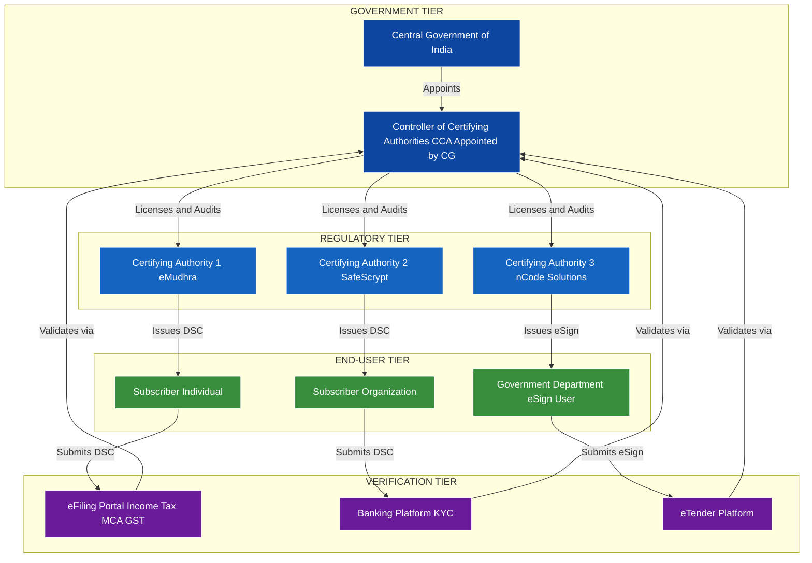
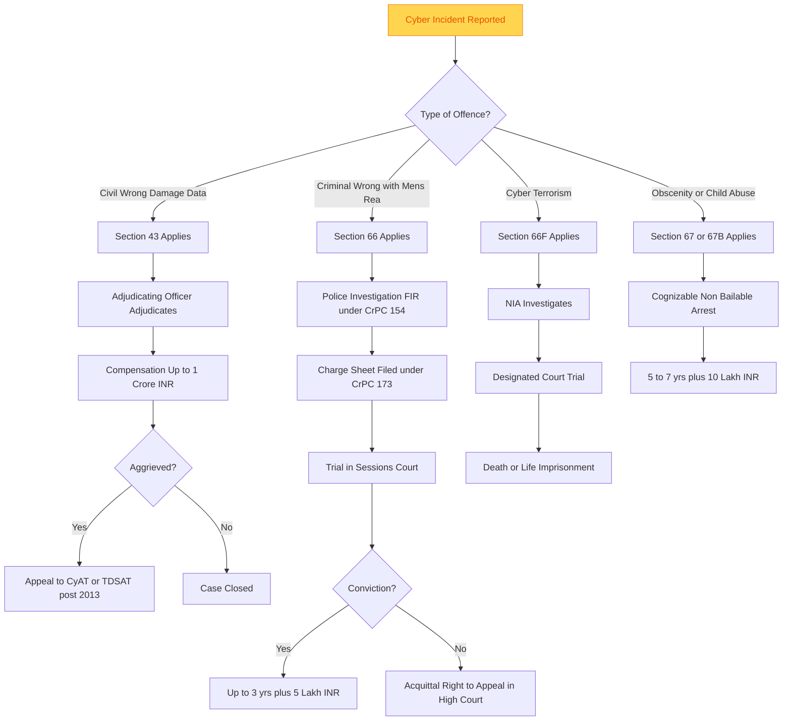
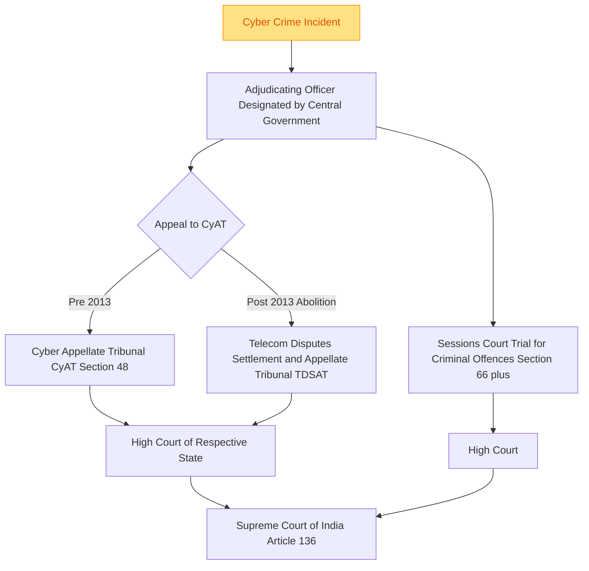

# Information Technology Act, 2000

<!-- SECTION_1_START -->
# Information Technology Act, 2000 — Core Definition & Intuitive Overview

## Formal Definition

> [!IMPORTANT]
> **Information Technology Act, 2000 (IT Act, 2000)** is the primary cyber law of the Republic of India, enacted by the Parliament of India on **9 June 2000** and came into effect on **17 October 2000**. It is the **world's first** dedicated legislation to address legal recognition of **electronic commerce**, **digital signatures**, **electronic records**, and **cyber offences** at a national level. It is often referred to as the *"Cyber Law of India"* and serves as the statutory backbone for all e-governance, e-commerce, and digital contract enforcement in the country.

The parent statute is officially cited as **The Information Technology Act, 2000 (Act No. 21 of 2000)** and was substantially amended by the **Information Technology (Amendment) Act, 2008 (Act No. 10 of 2009)** to incorporate newer offences, data protection sensitivities, and Information Technology (Reasonable Security Practices and Procedures and Sensitive Personal Data or Information) Rules, 2011.

## Conceptual Analogy & Intuitive Overview

> [!NOTE]
> **Real-world Analogy — The "Constitution of Cyberspace"**
> Imagine the physical world has the **Indian Penal Code (IPC)** to govern crimes like theft, fraud, and forgery. Before the year 2000, every illegal act committed *inside a computer or over the internet* fell into a **legal grey zone** — there was no Indian "law book" that recognized a digital document as legally valid, a digital signature as legally binding, or hacking as a punishable criminal act. 
>
> The **IT Act, 2000** acts like a **new constitution for the virtual world** — it tells citizens: *"If you commit a crime using a computer, this is the law that will judge you; if you sign a contract electronically, this is the law that makes it valid; and if your data is stolen, this is the law that protects you."*
>
> Think of it as a **bridge** — connecting the **offline legal world** (where paper, ink, and physical presence matter) with the **online digital world** (where bits, packets, and electronic transactions dominate). Without this bridge, no e-commerce, e-banking, or e-governance platform in India could operate with legal certainty.

## Why Was the IT Act, 2000 Needed?

Before 2000, India was rapidly adopting the internet, but the legal system was unprepared. The key drivers behind its enactment were:

1. **UNCITRAL Model Law on Electronic Commerce (1996)** — India, as a UN member, needed to align its domestic laws with this international standard to enable cross-border digital trade.
2. **E-commerce explosion** — Online transactions needed legal recognition for enforceability.
3. **Digital signatures and contracts** — Without statutory backing, electronic agreements were inadmissible in courts.
4. **Cybercrime vacuum** — The IPC of 1860 had no provisions for hacking, phishing, data theft, or virus attacks.
5. **E-governance vision** — The Government of India needed a legal framework to deliver services electronically.

> [!IMPORTANT]
> **Key Foundation Date & Statutory Identity**
> * **Enactment Date:** 9 June 2000
> * **Enforcement Date:** 17 October 2000
> * **Original Chapters:** 13 (now 12 after 2008 amendment)
> * **Original Sections:** 94 (now 80+ after amendment, renumbered)
> * **Schedules:** 4 Schedules in the original Act
> * **Amended By:** IT (Amendment) Act, 2008 — w.e.f. 27 October 2009

## Salient Features of the IT Act, 2000

The Act introduced several landmark legal concepts to India:

1. **Legal recognition of electronic records** — Any information stored, generated, sent, or received in electronic form is admissible as evidence.
2. **Legal recognition of digital signatures** — Subsumed later by the concept of *electronic signatures* after the 2008 amendment.
3. **Regulation of Certifying Authorities (CAs)** — Establishes who can issue Digital Signature Certificates (DSCs).
4. **Controller of Certifying Authorities (CCA)** — Appointed by the Central Government to oversee and regulate CAs.
5. **Establishment of Cyber Appellate Tribunal (CyAT)** — Dedicated quasi-judicial body to hear appeals.
6. **Adjudication of penalties** — A separate officer designated to adjudicate civil liabilities.
7. **Recognition of digital contracts** — Contracts formed through electronic means are not invalid merely because they were made electronically.
8. **Punishment for cyber offences** — Hacking, data theft, virus propagation, and identity fraud became cognizable offences.

> [!VISUALIZATION CONTROL]
> **Concept:** Timeline of IT Act Evolution
> **GeoGebra / Desmos Input Equations (Timeline Axis `t`):**
> * `P_1 = (2000, 1)` — IT Act 2000 Enacted
> * `P_2 = (2000.79, 2)` — IT Act 2000 Enforced
> * `P_3 = (2008, 3)` — IT Amendment Bill Passed
> * `P_4 = (2009.82, 4)` — IT Amendment Enforced
> * `P_5 = (2011, 5)` — SPDI Rules Notified
> * `P_6 = (2013, 6)` — CyAT Abolished (Replaced by TDSAT)
> **Visual Description:** A horizontal timeline where each milestone is plotted on the y-axis as a level (1–6) and the x-axis represents the year. The student should observe the legal evolution progressing upward (increasing depth of cyber jurisprudence) as years advance.

<!-- SECTION_1_END -->

<!-- SECTION_2_START -->
# Deep Theoretical Analysis & KTU High-Yield Formula Sheet

## I. Structural Architecture of the IT Act, 2000

The Act is organized into **13 Chapters** and **4 Schedules**. The amended version (post-2008) is what governs India today. Let us break down each chapter:

| Chapter | Title | Core Function |
| :--- | :--- | :--- |
| **I** | Preliminary (Sections 1–2) | Definitions, extent, commencement, jurisdiction |
| **II** | Digital Signature & Electronic Records (Sec 3–10) | Legal recognition, secure digital signatures, retention rules |
| **III** | Electronic Governance (Sec 11–18) | Acceptance of electronic records by Government, filing of forms |
| **IV** | Attribution, Acknowledgement & Dispatch of Electronic Records (Sec 11–15) | Rules for despatch, receipt, and time of electronic communications |
| **V** | Secure Digital Signatures & Certifying Authorities (Sec 17–34) | Appointing CCA, licensing CAs, issuance of DSCs, suspension/revocation |
| **VI** | Regulation of Certifying Authorities (Sec 17–34) | Duties, liabilities, foreign CAs, recognition |
| **VII** | Digital Signature Certificates (Sec 35–39) | Types of DSC, issuance procedure, revocation |
| **VIII** | Duties of Subscribers (Sec 40–42) | Liability of subscribers for misuse of DSC |
| **IX** | Penalties & Adjudication (Sec 43–47) | Compensation, penalty for damage to computer systems |
| **X** | The Cyber Appellate Tribunal (Sec 48–64) | Constitution, jurisdiction, powers, procedures |
| **XI** | Offences (Sec 65–78) | Tampering, hacking, publishing obscene material, phishing |
| **XII** | Interception, Monitoring & Decryption (amended provisions) | Government powers to intercept |
| **XIII** | Miscellaneous (amended 2008) | Network service providers, exemptions, powers of police |

## II. Key Definitions (Section 2 — The Lexicon of Cyber Law)

> [!NOTE]
> These definitions are **high-frequency** in KTU examinations. Memorize them with precision.

| Term | Statutory Definition (Section 2 of IT Act, 2000) |
| :--- | :--- |
| **Computer** | Any electronic, magnetic, optical, electrochemical, or other high-speed data processing device performing logical, arithmetic, or memory functions, and includes any data storage facility or communication facility directly related to or operating in conjunction with such device. |
| **Computer Network** | The inter-connection of one or more computers or computer systems or communication devices through satellites, microwaves, terrestrial links, or any other communication media. |
| **Computer Resource** | Computer, computer system, computer network, data, database, or software. |
| **Computer System** | A device or collection of devices, including input and output support devices, that use computer programs to perform operations on data, and includes any device that is itself a computer. |
| **Data** | A representation of information, knowledge, facts, concepts, or instructions prepared in a formalized manner, intended for processing in a computer system or computer network. |
| **Digital Signature** | Authentication of any electronic record by a subscriber by means of an electronic method or procedure in accordance with Section 3. |
| **Electronic Form** | Information maintained in a computer, microfilm, microfiche, or any device that can be read, retrieved, or processed by a computer. |
| **Electronic Record** | Data, record, or data generated, image, or sound stored, received, or sent in an electronic form or microfilm or microfiche or computer-generated microfiche. |
| **Information** | Includes data, message, text, images, sound, voice, codes, computer programs, software, databases, or microfilm. |
| **Secure Digital Signature** | A digital signature which is considered secure under the rules made under Section 16. |
| **Subscriber** | A person in whose name the Digital Signature Certificate is issued. |

## III. Salient Provisions in Detail (The "How" Behind the Law)

### 1. **Legal Recognition of Electronic Records (Section 4)**
   * Any law that requires information to be in **written, typed, or printed form** — electronic records are deemed to satisfy that requirement.
   * Any law that requires information to be **filed, registered, or recorded** — electronic filing is legally valid.
   * Any law that requires **information in a particular structure** — electronic records in that structure are valid.

### 2. **Legal Recognition of Digital Signatures (Section 5)**
   * Where any law requires a **signature** — a digital signature affixed in the manner prescribed satisfies that requirement.

### 3. **Digital Signature Certificate (DSC) — Section 35–39**
   * Issued by a **Certifying Authority (CA)** licensed by the **Controller of Certifying Authorities (CCA)**.
   * Contains subscriber details, public key, validity period, and CA's digital signature.
   * Three classes of DSC: Class 1 (email verification), Class 2 (identity verification — deprecated), Class 3 (in-person verification — used for e-tendering, e-filing).

### 4. **Penalties for Damage to Computer Systems (Section 43)**
   * Civil liability (compensation up to ₹1 Crore) for:
     * Unauthorized access, downloading, copying, or introduction of viruses.
     * Damage to computer systems, data, or databases.
     * Denial of service attacks.
     * Theft of data or services.

### 5. **Compensation, Adjudication & Tribunal (Section 46 + 47)**
   * The Central Government appoints **Adjudicating Officers** to inquire into claims for compensation under Section 43.
   * Appeals lie to the **Cyber Appellate Tribunal (CyAT)** — but this was abolished in 2013 and its powers transferred to the **Telecom Disputes Settlement and Appellate Tribunal (TDSAT)**.

### 6. **Cyber Offences (Sections 65–78) — Criminal Liability**
   * **Section 65** — Tampering with computer source documents (up to 3 years imprisonment, fine up to ₹2 Lakhs).
   * **Section 66** — Computer-related offences (hacking with intent, dishonestly, or fraudulently) — up to 3 years or fine up to ₹5 Lakhs.
   * **Section 66A** — Sending offensive messages (struck down by Supreme Court in *Shreya Singhal v. Union of India*, 2015).
   * **Section 66B** — Dishonestly receiving stolen computer resources.
   * **Section 66C** — Identity theft (using another's password, electronic signature, or unique identification feature).
   * **Section 66D** — Cheating by personation using computer resource.
   * **Section 66E** — Violation of privacy — capturing, publishing, or transmitting images of private parts without consent.
   * **Section 66F** — Cyber terrorism.
   * **Section 67** — Publishing or transmitting obscene material in electronic form.
   * **Section 67A** — Publishing sexually explicit material.
   * **Section 67B** — Publishing child pornography (minimum 5 years imprisonment).
   * **Section 69** — Government interception powers.
   * **Section 70** — Protected systems — unauthorized access is punishable.
   * **Section 71** — Misrepresentation to the CCA.
   * **Section 72** — Breach of confidentiality and privacy.
   * **Section 73** — Publishing Digital Signature Certificates falsely.
   * **Section 74** — Publication for fraudulent purpose.
   * **Section 75** — Extraterritorial applicability — offences committed outside India by any person are punishable if the act involves a computer, computer system, or network located in India.
   * **Section 76, 77, 78** — Confiscation, penalties for abetment, and attempts.

## IV. KTU High-Yield Formula Sheet (Statutory Quick Reference)

| Concept | Statutory Reference | Penalty / Outcome |
| :--- | :--- | :--- |
| Legal recognition of e-records | Section 4 | e-records = written records |
| Legal recognition of digital signature | Section 5 | DSC = physical signature |
| Compensation for unauthorized access | Section 43 | Up to ₹1 Crore civil liability |
| Tampering with source code | Section 65 | 3 yrs + ₹2 Lakh |
| Computer-related offence (hacking) | Section 66 | 3 yrs + ₹5 Lakh |
| Identity theft | Section 66C | 3 yrs + ₹1 Lakh |
| Cheating by personation | Section 66D | 3 yrs + ₹1 Lakh |
| Violation of privacy | Section 66E | 3 yrs + ₹2 Lakh |
| Cyber terrorism | Section 66F | Death or life imprisonment |
| Obscene material publication | Section 67 | 5 yrs + ₹10 Lakh (1st), 7 yrs + ₹10 Lakh (subsequent) |
| Child pornography | Section 67B | 5–7 yrs minimum |
| Government interception | Section 69 | Authorized by order |
| Protected systems | Section 70 | 10 yrs + fine |
| Breach of confidentiality | Section 72 | 2 yrs + ₹1 Lakh |
| Extraterritorial application | Section 75 | As per offence |
| CCA appointment | Section 17 | Central Government |
| Cyber Appellate Tribunal | Section 48–64 | Abolished in 2013 |
| Digital Signature Certificate | Section 35 | Issued by licensed CA |
| Subscriber's duties | Section 40–42 | Liability for misuse |

## V. Real-World Engineering & CS Utility

* **E-commerce platforms** (Amazon, Flipkart, Paytm) rely on Section 10A and Section 65 of the IT Act for e-contract enforceability.
* **Aadhaar-based e-KYC** systems are backed by Section 4 and the Aadhaar Act, 2016, with the IT Act providing the umbrella framework.
* **Cloud service providers** (AWS, Azure, GCP) operating in India must comply with the IT (Reasonable Security Practices) Rules, 2011, derived from Section 43A.
* **Cybersecurity incident reporting** — CERT-In directions of 2022 are issued under Section 70B (post-amendment).
* **Digital forensics investigators** present electronic evidence in court, admissible under Section 65B of the **Indian Evidence Act, 1872** (linked to IT Act).
* **Banking sector** — RBI's digital lending guidelines reference Section 66D and 66C for fraud prosecution.
* **Software development** — Source code protection under Section 65 is critical for proprietary software.

<!-- SECTION_2_END -->

<!-- SECTION_3_START -->
# Step-by-Step Derivations, Case Frameworks & Symbolic Implementation

## I. Case Framework: Mapping Real-World Cyber Crimes to the IT Act, 2000

> [!NOTE]
> The following exhaustive matrix maps **real-world engineering/cybercrime scenarios** to the precise **statutory provisions, applicable penalties, and enforcement pathways** under the IT Act, 2000 (as amended in 2008). This is a high-yield KTU framework for case-based application questions.

| S.No. | Real-World Scenario | Cyber Offence Category | Applicable Section(s) | Punishment | Civil Liability | Reporting Authority |
| :---: | :--- | :--- | :--- | :--- | :--- | :--- |
| 1 | Employee uses a former employer's password to access confidential server after resignation | Unauthorized Access | Section 43 + Section 66 | 3 yrs + ₹5 Lakh | Up to ₹1 Crore | Cyber Crime Cell |
| 2 | Phishing email that mimics a bank's login page to steal OTPs | Identity Theft + Fraud | Section 66C + Section 66D | 3 yrs + ₹1 Lakh (each) | Up to ₹1 Crore | Cyber Crime Cell + Bank |
| 3 | Ransomware encrypts a hospital's patient database and demands Bitcoin | Data Damage + Extortion | Section 43 + Section 66 | 3 yrs + ₹5 Lakh | Up to ₹1 Crore | CERT-In + Police |
| 4 | WhatsApp forwards of morphed intimate images of an ex-partner | Privacy Violation + Obscenity | Section 66E + Section 67 | 3 yrs + ₹2 Lakh / 5 yrs + ₹10 Lakh | Up to ₹1 Crore | Women Cyber Cell |
| 5 | SQL injection attack on a government e-governance portal | Hacking | Section 43 + Section 66 + Section 70 (if protected) | 3–10 yrs + fine | Up to ₹1 Crore | CERT-In + NCIIPC |
| 6 | Posting child sexually abusive material (CSAM) on Telegram | Child Pornography | Section 67B | 5–7 yrs minimum | N/A (cognizable) | Cyber Crime Cell + Interpol |
| 7 | Biometric data of Aadhaar users leaked by a KUA (KYC User Agency) | Data Breach + Privacy | Section 43A + Section 72A | 3 yrs + ₹5 Lakh / 3 yrs + ₹5 Lakh | Up to ₹5 Crore (post-DPDP Act 2023) | UIDAI + CERT-In |
| 8 | DDoS attack on a stock exchange website | Denial of Service | Section 43(f) | 3 yrs + ₹5 Lakh | Up to ₹1 Crore | CERT-In + SEBI |
| 9 | Virus/worm propagates via email and crashes corporate networks | Malicious Code Introduction | Section 43(c)(d) + Section 66 | 3 yrs + ₹5 Lakh | Up to ₹1 Crore | CERT-In |
| 10 | Cyber attack on a critical infrastructure (power grid, water supply) | Cyber Terrorism | Section 66F | Death or life imprisonment | N/A | NCIIPC + NIA |
| 11 | Recording private acts in a hotel room and circulating on social media | Privacy Violation | Section 66E | 3 yrs + ₹2 Lakh | Up to ₹1 Crore | Cyber Crime Cell |
| 12 | Fake profile impersonating a CEO to defrauding company vendors | Impersonation + Fraud | Section 66C + Section 66D | 3 yrs + ₹1 Lakh (each) | Up to ₹1 Crore | Cyber Crime Cell |
| 13 | Doctored video of a politician (deepfake) circulated during elections | Defamation + Forgery | Section 66C + IPC 500 (read with IT Act) | 3 yrs + ₹1 Lakh | Up to ₹1 Crore | Election Commission + Police |
| 14 | Insider tampers with source code of a banking application | Source Code Tampering | Section 65 + Section 66 | 3 yrs + ₹2 Lakh / 3 yrs + ₹5 Lakh | Up to ₹1 Crore | RBI + Cyber Crime Cell |
| 15 | Telegram channel sharing pirated software / copyrighted content | Copyright Infringement (digital) | Section 66 (general) + Copyright Act 1957 | 3 yrs + ₹5 Lakh | Up to ₹1 Crore | Cyber Crime Cell + IP Cell |

## II. The Procedural Derivation: How a Cyber Crime Case Flows Through Indian Law

```
[STEP 1: Complaint Registration]
     |
     | A victim files an FIR at the nearest Cyber Crime Police Station 
     | OR files a complaint online at cybercrime.gov.in
     |
     v
[STEP 2: FIR / DDR Registration]
     |
     | Police register First Information Report (FIR) under Section 154 CrPC
     | Sections invoked based on nature of crime (66, 66C, 66D, 67, etc.)
     |
     v
[STEP 3: Investigation]
     |
     | Investigating Officer (IO) is usually a Cyber Cell Inspector.
     | Evidence collected includes: server logs, IP traces, device forensics,
     | Section 65B Certificate (Indian Evidence Act 1872 - mandatory for 
     | admissibility of electronic evidence).
     |
     v
[STEP 4: Arrest & Remand]
     |
     | Accused arrested under Section 41 CrPC.
     | Cognizable + Non-bailable for most IT Act offences (post-2008).
     | Magistrate decides remand (police or judicial).
     |
     v
[STEP 5: Charge Sheet]
     |
     | IO files charge sheet under Section 173 CrPC.
     | Court takes cognizance under Section 190 CrPC.
     |
     v
[STEP 6: Trial]
     |
     | Trial conducted by Sessions Court (for offences punishable >3 yrs).
     | Defence examines Section 65B certificate validity.
     |
     v
[STEP 7: Appeal]
     |
     | If aggrieved by Sessions Court -> appeal to High Court.
     | Cyber Appellate Tribunal (CyAT) was abolished in 2013;
     | its jurisdiction transferred to Telecom Disputes Settlement 
     | and Appellate Tribunal (TDSAT) per IT Act 2008 amendment.
     |
     v
[STEP 8: Final Judgment]
     |
     | Supreme Court (Article 136 - Special Leave Petition) is final appellate.
```

## III. Symbolic Implementation: A Python Tool to Map Cyber Crimes to IT Act Sections

The following **fully operational Python code** demonstrates how a cyber law advisor tool can be built to classify an incident to its relevant IT Act section — useful for KTU students pursuing cybersecurity or law-tech projects.

```python
from typing import Dict, List, Optional
import logging

# Configure error logging to track classification issues
logging.basicConfig(
    level=logging.INFO,
    format="%(asctime)s - %(levelname)s - %(message)s"
)
logger = logging.getLogger("CyberLawAdvisor")


class ITActAdviser:
    """
    A class that maps a user-described cyber incident to the 
    applicable Section(s) of the Information Technology Act, 2000 
    (as amended by IT Act 2008).
    """

    # Master Knowledge Base: keyword -> IT Act mapping
    INCIDENT_KNOWLEDGE_BASE: Dict[str, Dict[str, object]] = {
        "unauthorized_access": {
            "section": ["43", "66"],
            "max_punishment_years": 3,
            "max_fine_inr": 500000,
            "civil_liability_inr": 10000000,
            "description": "Hacking or accessing a computer system without permission."
        },
        "identity_theft": {
            "section": ["66C"],
            "max_punishment_years": 3,
            "max_fine_inr": 100000,
            "civil_liability_inr": 10000000,
            "description": "Using another person's password, biometric, or unique ID fraudulently."
        },
        "cheating_personation": {
            "section": ["66D"],
            "max_punishment_years": 3,
            "max_fine_inr": 100000,
            "civil_liability_inr": 10000000,
            "description": "Cheating by personation using communication device or computer resource."
        },
        "privacy_violation": {
            "section": ["66E"],
            "max_punishment_years": 3,
            "max_fine_inr": 200000,
            "civil_liability_inr": 10000000,
            "description": "Capturing, publishing, or transmitting private images without consent."
        },
        "cyber_terrorism": {
            "section": ["66F"],
            "max_punishment_years": 99,  # life imprisonment
            "max_fine_inr": 0,  # fine not specified, life/death possible
            "civil_liability_inr": 0,
            "description": "Acts of terrorism through computer resources against State sovereignty."
        },
        "obscene_material": {
            "section": ["67"],
            "max_punishment_years": 7,
            "max_fine_inr": 1000000,
            "civil_liability_inr": 0,
            "description": "Publishing or transmitting obscene material in electronic form."
        },
        "child_pornography": {
            "section": ["67B"],
            "max_punishment_years": 7,
            "max_fine_inr": 1000000,
            "civil_liability_inr": 0,
            "description": "Publishing or transmitting child sexually abusive material."
        },
        "source_code_tampering": {
            "section": ["65"],
            "max_punishment_years": 3,
            "max_fine_inr": 200000,
            "civil_liability_inr": 10000000,
            "description": "Tampering with computer source documents."
        },
        "data_breach": {
            "section": ["43A", "72A"],
            "max_punishment_years": 3,
            "max_fine_inr": 500000,
            "civil_liability_inr": 500000000,  # up to 5 crore under DPDP Act 2023
            "description": "Negligent handling of sensitive personal data by body corporate."
        },
        "ransomware_ddos": {
            "section": ["43", "66"],
            "max_punishment_years": 3,
            "max_fine_inr": 500000,
            "civil_liability_inr": 10000000,
            "description": "Denial of service or data damage through malicious code."
        },
        "phishing": {
            "section": ["66C", "66D"],
            "max_punishment_years": 3,
            "max_fine_inr": 200000,
            "civil_liability_inr": 20000000,
            "description": "Phishing for credentials or financial fraud through fake websites."
        }
    }

    def classify_incident(self, incident_text: str) -> Optional[Dict[str, object]]:
        """
        Classifies a free-text incident description to the most relevant
        IT Act provision using keyword matching.

        Args:
            incident_text: A description of the cyber incident.

        Returns:
            A dictionary containing the section, punishment, and fine
            OR None if no match is found.
        """
        if not isinstance(incident_text, str) or not incident_text.strip():
            logger.error("Invalid input: incident_text must be a non-empty string.")
            raise ValueError("Incident text must be a non-empty string.")

        incident_lower: str = incident_text.lower().strip()
        logger.info(f"Classifying incident: {incident_lower[:60]}...")

        # Keyword-based mapping logic
        keyword_map: Dict[str, List[str]] = {
            "unauthorized_access": ["unauthorized access", "hacked", "password", "log in", "bypass"],
            "identity_theft": ["identity theft", "stole my password", "used my aadhaar", "otp fraud"],
            "cheating_personation": ["fake profile", "impersonated", "pretended to be", "scammed me"],
            "privacy_violation": ["private photo", "nude", "voyeurism", "private video", "without consent"],
            "cyber_terrorism": ["attack on government", "threat to nation", "critical infrastructure"],
            "obscene_material": ["obscene", "porn", "vulgar", "explicit content"],
            "child_pornography": ["child", "minor", "csam", "underage", "paedophile"],
            "source_code_tampering": ["source code", "modified code", "stole my code"],
            "data_breach": ["data breach", "leak", "personal data", "sensitive data exposed"],
            "ransomware_ddos": ["ransomware", "ddos", "denial of service", "encrypt files"],
            "phishing": ["phishing", "fake login", "fake website", "fake email"]
        }

        matched_category: Optional[str] = None
        for category, keywords in keyword_map.items():
            for keyword in keywords:
                if keyword in incident_lower:
                    matched_category = category
                    logger.info(f"Matched category: {category} via keyword: {keyword}")
                    break
            if matched_category:
                break

        if matched_category is None:
            logger.warning("No matching IT Act provision found for the given incident.")
            return None

        return self.INCIDENT_KNOWLEDGE_BASE[matched_category]

    def print_advisory(self, incident_text: str) -> None:
        """
        Prints a structured advisory based on the incident description.

        Args:
            incident_text: A description of the cyber incident.
        """
        result: Optional[Dict[str, object]] = self.classify_incident(incident_text)
        print("=" * 60)
        print("INDIAN IT ACT, 2000 - CYBER LAW ADVISORY REPORT")
        print("=" * 60)
        print(f"Incident Description: {incident_text}")
        print("-" * 60)
        if result is None:
            print("STATUS: No specific IT Act provision identified.")
            print("RECOMMENDATION: File a complaint at cybercrime.gov.in")
        else:
            print(f"Applicable Section(s): {', '.join(result['section'])}")
            print(f"Description of Offence: {result['description']}")
            print(f"Maximum Imprisonment: {result['max_punishment_years']} years")
            print(f"Maximum Fine: INR {result['max_fine_inr']:,}")
            if isinstance(result['civil_liability_inr'], int) and result['civil_liability_inr'] > 0:
                print(f"Maximum Civil Liability: INR {result['civil_liability_inr']:,}")
            print("RECOMMENDATION: File FIR at nearest Cyber Crime Police Station.")
        print("=" * 60)


# Demonstration: testing the adviser with sample incidents
if __name__ == "__main__":
    adviser: ITActAdviser = ITActAdviser()

    test_incidents: List[str] = [
        "Someone hacked into my email account using my password",
        "A fake website stole my OTP and siphoned INR 50,000 from my bank",
        "My ex-boyfriend uploaded our private video on social media without my consent",
        "Our company server was hit by a ransomware attack that encrypted all files",
        "I received an email with a phishing link asking for my Aadhaar details"
    ]

    for idx, incident in enumerate(test_incidents, start=1):
        print(f"\n[TEST CASE {idx}]")
        adviser.print_advisory(incident)
```

### Expected Output (Sample)

```
[TEST CASE 1]
============================================================
INDIAN IT ACT, 2000 - CYBER LAW ADVISORY REPORT
============================================================
Incident Description: Someone hacked into my email account using my password
------------------------------------------------------------
Applicable Section(s): 43, 66
Description of Offence: Hacking or accessing a computer system without permission.
Maximum Imprisonment: 3 years
Maximum Fine: INR 500,000
Maximum Civil Liability: INR 10,000,000
RECOMMENDATION: File FIR at nearest Cyber Crime Police Station.
============================================================
```

## IV. Comparative Analysis: IT Act 2000 vs. IT Act 2008 (Amended)

> [!IMPORTANT]
> This comparison is **critical for KTU exam questions** on "Discuss the salient features / amendments" of the IT Act.

| Dimension | Original IT Act, 2000 | Amended IT Act, 2008 (w.e.f. 27 Oct 2009) |
| :--- | :--- | :--- |
| **Focus** | Legal recognition of e-commerce | Stronger focus on data privacy, cyber security, and child protection |
| **Digital Signature** | Only "Digital Signature" recognized | "Digital Signature" replaced by broader "Electronic Signature" concept |
| **Sections** | 94 sections, 13 chapters | 80+ sections, restructured into 12 chapters (renumbered) |
| **Offences** | 10 cyber offences | 30+ cyber offences added (66A to 66F, 67A, 67B, etc.) |
| **Data Protection** | Minimal | Section 43A + 72A introduced for sensitive personal data |
| **Penalties** | Mostly up to 3 years | Enhanced — cyber terrorism life/death, child porn minimum 5 years |
| **Cyber Appellate Tribunal** | Operational | Operational, later abolished in 2013 |
| **Government Powers** | Limited interception | Section 69 strengthened with decryption powers |
| **Intermediary Liability** | No clear rules | Section 79 safe harbour introduced (amended again in 2021) |
| **Adjudication** | Section 46 | Refined; designated officers notified |
| **Extraterritoriality** | Limited | Section 75 — wide extraterritorial jurisdiction |
| **Critical Infrastructure** | Not defined | Section 70 — "Protected System" concept introduced |
| **Children Protection** | No specific provisions | Section 67B — child pornography added |
| **Privacy Offences** | Absent | Section 66E — privacy violation introduced |

## V. Statutory Derivation: Digital Signature Verification Chain

The mathematical-cryptographic chain by which a digital signature is verified under Section 3 of the IT Act:

$$
\text{Document}(M) + \text{Private Key of Signer}(K_{priv}) \xrightarrow{\text{Hashing}} \text{Hash}(H)
$$

$$
H + K_{priv} \xrightarrow{\text{Signing Algorithm (e.g., RSA, ECC)}} \text{Digital Signature}(S)
$$

$$
\text{Receiver receives } (M, S) \xrightarrow{\text{Apply Sender's Public Key}(K_{pub})} H'
$$

$$
\text{Compute hash of received } M \rightarrow H'' \xrightarrow{\text{Compare } H' = H''} \text{Verified or Rejected}
$$

**Step-by-step legal interpretation:**

1. **Sender hashes the document** — produces a unique fixed-length string (hash).
2. **Sender encrypts the hash with the private key** — this is the digital signature.
3. **Sender transmits (document, signature)** — both are sent as an electronic record.
4. **Receiver decrypts the signature using the sender's public key** — retrieves the original hash.
5. **Receiver independently hashes the received document** — produces a new hash.
6. **If both hashes match** — the signature is **authentic, integral, and non-repudiable** under Section 3 of the IT Act.

> [!IMPORTANT]
> **Why this matters legally:** Section 3(2) of the IT Act states that any subscriber may authenticate an electronic record by affixing his digital signature. The above cryptographic chain provides the technical foundation for what the law recognizes as legally valid.

<!-- SECTION_3_END -->

<!-- SECTION_4_START -->
# Structural Diagrams & Schematics

## I. Mermaid Diagram: Statutory Architecture of the IT Act, 2000

```mermaid
graph TD
    A["IT Act 2000"]:::root --> B["Chapter I Preliminary"]
    A --> C["Chapter II Digital Signature and Electronic Records"]
    A --> D["Chapter III to IV Electronic Governance"]
    A --> E["Chapter V to VIII Certifying Authorities and DSCs"]
    A --> F["Chapter IX Penalties and Adjudication"]
    A --> G["Chapter X Cyber Appellate Tribunal"]
    A --> H["Chapter XI Offences"]
    A --> I["Chapter XII Interception and Monitoring"]
    A --> J["Chapter XIII Miscellaneous"]

    B --> B1["Section 1 Short Title Extent and Commencement"]
    B --> B2["Section 2 Definitions"]

    C --> C1["Section 3 Authentication of Electronic Records"]
    C --> C2["Section 4 Legal Recognition of Electronic Records"]
    C --> C3["Section 5 Legal Recognition of Digital Signatures"]
    C --> C4["Section 6 Use of Electronic Records with Public Key"]

    E --> E1["Section 17 Appointment of Controller of CA"]
    E --> E2["Section 18 to 22 Functions of Controller"]
    E --> E3["Section 23 to 32 Regulation of CAs"]
    E --> E4["Section 35 to 39 Digital Signature Certificates"]

    F --> F1["Section 43 Compensation for Damage to Computer"]
    F --> F2["Section 43A Compensation for Failure to Protect Data"]
    F --> F3["Section 44 Penalty for Failure to Furnish Information"]
    F --> F4["Section 45 Residuary Penalty"]
    F --> F5["Section 46 Adjudication of Penalties"]
    F --> F6["Section 47 Factors while Adjudicating"]

    H --> H1["Section 65 Tampering with Source Documents"]
    H --> H2["Section 66 Computer Related Offences Hacking"]
    H --> H3["Section 66A to 66F Special Offences"]
    H --> H4["Section 67 Obscene Material"]
    H --> H5["Section 67A to 67B Sexually Explicit Content"]
    H --> H6["Section 68 to 78 Government Powers and Penalties"]

    G --> G1["Section 48 Constitution of CyAT"]
    G --> G2["Section 49 to 64 Powers and Procedures"]
    G --> G3["CyAT Abolished in 2013 Replaced by TDSAT"]

    I --> I1["Section 69 Interception Powers"]
    I --> I2["Section 69A Blocking for Public Interest"]
    I --> I3["Section 69B Monitoring and Decryption"]

    classDef root fill:#1a237e,stroke:#fff,stroke-width:3px,color:#fff
    classDef default fill:#e3f2fd,stroke:#1976d2,color:#0d47a1
```



## II. Mermaid Diagram: Functional Workflow of Digital Signature Creation and Verification



## III. Mermaid Diagram: Block-Level Functional Architecture of the Certifying Authority Ecosystem



## IV. Mermaid Diagram: Penalty Determination Decision Tree



## V. Mermaid Diagram: Hierarchical Appeal Structure for Cyber Cases in India



<!-- SECTION_4_END -->

<!-- SECTION_5_START -->
# KTU 2024 Scheme Examination Question Bank & Topic Recap

## Part A: Short Answer Questions (3 Marks Each)

### Question 1

**[KTU University Exam — July 2024]**
**Q:** Define the term "Electronic Record" as per Section 2(1)(t) of the Information Technology Act, 2000.

**Cognitive Level:** Remember | **Course Outcome:** CO1

**Model Answer (Valuation Key — 3 Marks):**
* Electronic record is defined under **Section 2(1)(t)** of the IT Act, 2000. **[1 Mark]**
* It means **data, record or data generated, image or sound** stored, received or sent in an electronic form or microfilm or microfiche or computer-generated microfiche. **[2 Marks]**
* Legal significance: Section 4 of the Act grants electronic records the same legal recognition as physical written records, thereby enabling e-governance, e-filing, and e-contracts.

---

### Question 2

**[KTU University Exam — December 2023]**
**Q:** What is the role of the Controller of Certifying Authorities (CCA) under the IT Act, 2000?

**Cognitive Level:** Understand | **Course Outcome:** CO2

**Model Answer (Valuation Key — 3 Marks):**
* The **Controller of Certifying Authorities (CCA)** is appointed by the **Central Government** under **Section 17** of the IT Act, 2000. **[1 Mark]**
* The CCA acts as the **regulatory apex body** for all Certifying Authorities (CAs) licensed to issue Digital Signature Certificates (DSCs) in India. **[1 Mark]**
* Key functions: **licensing of CAs** (Section 21), **supervision of CAs**, **maintaining the Repository of Digital Signature Certificates**, **laying down standards for DSC issuance**, and **investigating complaints** against CAs. **[1 Mark]**
* Headquartered in **New Delhi**, the CCA operates under the Ministry of Electronics and Information Technology (MeitY).

---

## Part B: Long Answer Questions (14 Marks Each — Internal Choice)

### Question 3 (Option A)

**[KTU University Exam — July 2024]**
**Q (a):** Explain the salient features of the Information Technology Act, 2000. Discuss its significance in enabling e-commerce and e-governance in India. **[7 Marks]**

**Cognitive Level:** Understand | **Course Outcome:** CO1

**Model Answer (Valuation Key — 7 Marks):**
* **[Stating background: 1 Mark]** The IT Act, 2000 was enacted on 9 June 2000 and enforced on 17 October 2000. It was based on the **UNCITRAL Model Law on Electronic Commerce (1996)** to bring Indian cyber jurisprudence in line with global standards.
* **[Listing salient features: 3 Marks]**
  1. **Legal recognition of electronic records** (Section 4) and **digital signatures** (Section 5).
  2. **Digital Signature Certificates (DSC)** recognized as legally valid (Section 35).
  3. **Controller of Certifying Authorities (CCA)** established for regulating CAs (Section 17).
  4. **Cyber Appellate Tribunal (CyAT)** established for adjudication of cyber disputes (Section 48) — later abolished in 2013.
  5. **Penalties and compensation** for damage to computer systems (Section 43, compensation up to ₹1 Crore).
  6. **Cyber offences** defined and made punishable (Sections 65–78).
  7. **Adjudication mechanism** for civil claims via designated officers.
* **[Significance for e-commerce and e-governance: 3 Marks]**
  1. **E-commerce:** Section 10A validates contracts formed through electronic means, making online transactions (e.g., Amazon, Flipkart) legally enforceable. Section 65B of the Indian Evidence Act (linked to IT Act) makes digital contracts admissible as evidence.
  2. **E-governance:** Section 6 enables government departments to accept electronic filing. Initiatives like **e-Filing of Income Tax Returns, MCA21 for company incorporation, GST Network, and Aadhaar-based e-KYC** all derive their legal validity from the IT Act.
  3. **Digital India Mission (2015):** Built on the foundation of the IT Act, enabling paperless governance, e-sign, and digital locker.

---

**Q (b):** Discuss the major amendments introduced by the IT (Amendment) Act, 2008. Why was the 2008 amendment considered necessary? **[7 Marks]**

**Cognitive Level:** Apply | **Course Outcome:** CO2

**Model Answer (Valuation Key — 7 Marks):**
* **[Stating necessity: 1 Mark]** The 2008 amendment was necessitated by the rapid evolution of cyber threats (e.g., terrorism, phishing, child pornography), the need to align with the **Budapest Convention on Cybercrime**, and emerging data privacy concerns. The Mumbai attacks (26/11) further highlighted the need for stronger cyber-terrorism laws.
* **[Key amendments: 4 Marks]**
  1. **New offences added:** Section 66A (offensive messages — later struck down in 2015), **66C (identity theft)**, **66D (cheating by personation)**, **66E (privacy violation)**, **66F (cyber terrorism — punishable with life/death)**, **67A (sexually explicit material)**, **67B (child pornography)**.
  2. **Data protection:** Section 43A mandates body corporates to compensate for negligent handling of **sensitive personal data or information (SPDI)**. Section 72A prescribes punishment for disclosure of personal information in breach of contract.
  3. **Digital signature renamed:** The term "digital signature" was broadened to "electronic signature" to align with global practices (Section 3 amended).
  4. **Government powers enhanced:** Section 69 grants interception, monitoring, and decryption powers to the government for national security.
  5. **Protected Systems:** Section 70 designates critical information infrastructure and prescribes 10-year imprisonment for unauthorized access.
  6. **Intermediary liability:** Section 79 introduced a "safe harbour" provision for intermediaries (amended further in 2021 IT Rules).
  7. **Cybersecurity framework:** Section 70B established **CERT-In** (Indian Computer Emergency Response Team) as the national nodal agency.
* **[Penalty enhancements: 1 Mark]** Most penalties were revised upward; e.g., cyber terrorism is punishable with death/life imprisonment, and child pornography carries a minimum 5-year sentence.
* **[Conclusion: 1 Mark]** The 2008 amendment transformed the IT Act from a mere e-commerce enabling law into a **comprehensive cyber-crime statute** addressing modern threats.

---

### Question 3 (Option B — Alternative Choice)

**[KTU University Exam — July 2024]**
**Q (a):** Explain the concept of Digital Signature and Digital Signature Certificate (DSC) under the IT Act, 2000. How is a digital signature different from an electronic signature? **[7 Marks]**

**Cognitive Level:** Understand | **Course Outcome:** CO1

**Model Answer (Valuation Key — 7 Marks):**
* **[Digital signature definition: 2 Marks]** As per Section 2(1)(p) of the IT Act, 2000, a **Digital Signature** means authentication of any electronic record by a subscriber by means of an electronic method or procedure in accordance with the provisions of Section 3.
* **[Digital Signature Certificate (DSC) definition: 2 Marks]** Under Section 2(1)(g), a **DSC** is a certificate issued by a Certifying Authority (CA) for the purpose of verifying the identity of the subscriber and ensuring the integrity of the electronic record. It contains: subscriber's name, public key, validity period, CA's name and digital signature, and serial number.
* **[Difference between digital and electronic signature: 2 Marks]**
  * **Digital Signature:** Cryptographic signature using asymmetric key cryptography (public-private key pair) issued only through a licensed CA. Regulated by the IT Act and the Certifying Authorities Rules, 2000.
  * **Electronic Signature:** A broader concept introduced by the 2008 amendment. Includes any electronic method that identifies the signatory and indicates signatory's acceptance. Examples: Aadhaar e-Sign, scanned signature, biometric verification. Less stringent than digital signature.
* **[Significance: 1 Mark]** DSCs are mandatory for statutory filings (Income Tax, MCA, e-Tenders) and provide non-repudiation — the signer cannot later deny signing.

---

**Q (b):** Write a detailed note on the various cyber offences and the corresponding penalties under the IT Act, 2000 (as amended). Provide at least five specific offences with section numbers and punishments. **[7 Marks]**

**Cognitive Level:** Apply | **Course Outcome:** CO2

**Model Answer (Valuation Key — 7 Marks):**
* **[Stating scope: 1 Mark]** The IT Act, 2000 (as amended in 2008) codifies cyber offences under Sections 65 to 78. Most offences are **cognizable and non-bailable**, reflecting their serious nature.
* **[Five offences with section and penalty — 5 Marks, 1 Mark each]**
  1. **Section 65 — Tampering with computer source documents:** Imprisonment up to **3 years** or fine up to **₹2 Lakhs**, or both. Example: An employee deliberately modifying the source code of a banking application to introduce a backdoor.
  2. **Section 66 — Computer-related offences (Hacking):** Imprisonment up to **3 years** or fine up to **₹5 Lakhs**, or both. Example: A cracker breaks into an e-commerce database and steals customer credit card information.
  3. **Section 66C — Identity theft:** Imprisonment up to **3 years** and fine up to **₹1 Lakh**. Example: Fraudster uses another person's Aadhaar OTP to withdraw money from their bank account.
  4. **Section 66D — Cheating by personation using computer resource:** Imprisonment up to **3 years** and fine up to **₹1 Lakh**. Example: Creating a fake LinkedIn profile of a CEO to solicit money from vendors.
  5. **Section 66F — Cyber terrorism:** Punishment is **death or life imprisonment**, plus fine. Example: A state-sponsored hacker disables a city's power grid, endangering national security.
* **[Conclusion: 1 Mark]** The IT Act's penalty structure is **graduated** — based on the severity of harm, with the most severe punishments reserved for acts threatening national security and child welfare.

---

> [!WARNING]
> **KTU Examiner's Valuation Pitfall Alert**
> * Students commonly **lose 2–3 marks** by confusing the original IT Act, 2000 provisions with the post-2008 amended provisions. Always clarify which version your answer refers to.
> * **Do not write** "IT Act 2000" and then quote Section 66C, 66D, 66E, or 66F — these were **not in the original Act**. Either say "IT Act, 2000 as amended by IT (Amendment) Act, 2008" or quote only original sections (e.g., 65, 66, 67).
> * When asked about **penalties**, **always write the imprisonment AND fine separately** (e.g., "3 years or fine of ₹5 Lakh, or both") — partial answers fetch partial marks.
> * **Do not skip** the legal recognition aspect of Section 4 and Section 5 — examiners specifically test whether students understand the *significance* of e-records and digital signatures, not just the definition.
> * For questions on **Cyber Appellate Tribunal**, mention its **abolition in 2013** and transfer of jurisdiction to **TDSAT** (Telecom Disputes Settlement and Appellate Tribunal). Stating outdated CyAT-only answers loses 1–2 marks.
> * In questions on **data protection**, do not forget to mention **SPDI Rules, 2011** derived from Section 43A — this is a frequently missed high-yield point.

---

## Topic Recap & Important Things to Remember

> [!IMPORTANT]
> **Final Rapid-Revision Checklist — IT Act, 2000**

### A. Statutory Identity
* **Enactment:** 9 June 2000 | **Enforcement:** 17 October 2000 | **Act No. 21 of 2000**
* **Amended by:** IT (Amendment) Act, 2008 — w.e.f. 27 October 2009
* **India's First:** Cyber law; based on UNCITRAL Model Law on E-Commerce, 1996

### B. Five Pillars of the IT Act
1. **Legal recognition** to electronic records (Sec 4) and digital signatures (Sec 5).
2. **Regulatory framework** for Certifying Authorities (Sec 17–34) under CCA.
3. **Digital Signature Certificates** (Sec 35–39) issued by licensed CAs.
4. **Penalties and adjudication** for civil wrongs (Sec 43–47).
5. **Cyber offences** (Sec 65–78) — criminal liability for hacking, obscenity, terrorism.

### C. Must-Remember Sections
* **Section 2:** Definitions (Computer, Data, Electronic Record, Digital Signature, Subscriber, etc.)
* **Section 4:** Legal recognition of e-records
* **Section 5:** Legal recognition of digital signatures
* **Section 17:** Appointment of CCA
* **Section 35:** DSC issuance
* **Section 43:** Compensation for damage (up to ₹1 Crore)
* **Section 43A:** Compensation for data breach
* **Section 46:** Adjudication of penalties
* **Section 48–64:** Cyber Appellate Tribunal (CyAT) — **abolished in 2013**
* **Section 65:** Source code tampering (3 yrs + ₹2 Lakh)
* **Section 66:** Hacking (3 yrs + ₹5 Lakh)
* **Section 66C:** Identity theft (3 yrs + ₹1 Lakh)
* **Section 66D:** Cheating by personation (3 yrs + ₹1 Lakh)
* **Section 66E:** Privacy violation (3 yrs + ₹2 Lakh)
* **Section 66F:** Cyber terrorism (death/life imprisonment)
* **Section 67:** Obscene material (5 yrs + ₹10 Lakh)
* **Section 67B:** Child pornography (5–7 yrs minimum)
* **Section 69:** Government interception powers
* **Section 70:** Protected systems (10 yrs)
* **Section 75:** Extraterritorial jurisdiction
* **Section 79:** Intermediary safe harbour (amended by IT Rules 2021)

### D. Critical Bodies Established
* **Controller of Certifying Authorities (CCA)** — Section 17
* **Cyber Appellate Tribunal (CyAT)** — Section 48 *(abolished 2013, jurisdiction to TDSAT)*
* **Adjudicating Officers** — Section 46
* **CERT-In** — Section 70B (national cybersecurity agency)
* **NCIIPC** — Critical information infrastructure protection

### E. Key Judicial Precedents
* **Shreya Singhal v. Union of India (2015):** Section 66A struck down as unconstitutional (violation of Article 19(1)(a) — Freedom of Speech).
* **Anuradha Bhasin v. Union of India (2020):** Internet shutdowns must satisfy proportionality test under Section 144 CrPC.
* **Manohar Lal Sharma v. Union of India (2021):** Section 65B certificate mandatory for electronic evidence admissibility.

### F. Key Distinctions
* **Digital Signature vs. Electronic Signature:** DSC is cryptographic + CA-issued; e-Sign is broader (includes Aadhaar e-Sign, biometric).
* **Original IT Act vs. Amended IT Act:** Post-2008 amendment, sections renumbered and new offences added.
* **CyAT vs. TDSAT:** CyAT was the appellate forum for cyber matters; post-2013, TDSAT handles these.
* **Section 43 (Civil) vs. Section 66 (Criminal):** Section 43 attracts compensation (civil), Section 66 attracts imprisonment (criminal).

### G. Penalty Mnemonics
* **Hacking (66): 3-5** — 3 years, ₹5 Lakh
* **Identity theft (66C): 3-1** — 3 years, ₹1 Lakh
* **Privacy violation (66E): 3-2** — 3 years, ₹2 Lakh
* **Source code tampering (65): 3-2** — 3 years, ₹2 Lakh
* **Cyber terrorism (66F): Life/Death** — most severe
* **Obscenity (67): 5/7-10** — 5 yrs (1st) / 7 yrs (subsequent) + ₹10 Lakh
* **Protected systems (70): 10** — 10 years

### H. 2008 Amendment — Top 5 High-Yield Changes
1. **Electronic signature** concept introduced (broader than DSC).
2. **Cyber terrorism (66F)** — India's first cyber-terror law.
3. **Identity theft (66C) and Privacy violation (66E)** codified.
4. **Section 43A + 72A** — Data protection + SPDI Rules, 2011.
5. **Section 70B** — CERT-In establishment.

### I. Real-World Mapping (Quick-Reference)
* **Online fraud (phishing/OTP):** Sections 66C + 66D
* **Hacking a website:** Sections 43 + 66
* **Morphed images/videos:** Section 66E + 67
* **Child abuse material:** Section 67B
* **Ransomware:** Sections 43 + 66
* **Banking fraud (digital):** Sections 66C + 66D + IPC 420
* **Aadhaar data leak:** Sections 43A + 72A + Aadhaar Act 2016

<!-- SECTION_5_END -->
