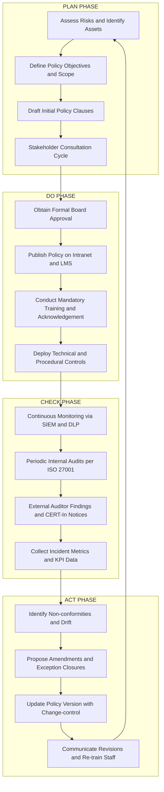
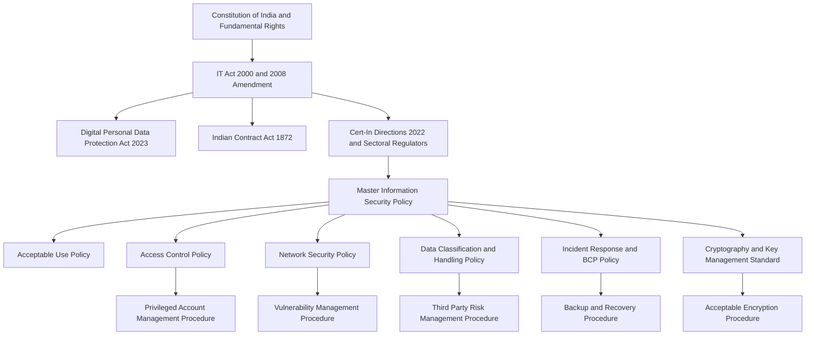

# Introducing various security policies and their review process

<!-- SECTION_1_START -->
# Introducing Various Security Policies and Their Review Process

## 1.1 Core Technical Definition

> [!IMPORTANT]
> **Security Policy (KTU 2024 Formal Definition):** A *security policy* is a formal, documented set of rules, principles, and practices that govern the acceptable use, management, protection, and distribution of an organisation's information assets, computing resources, and digital services. It serves as the foundational governance instrument that translates statutory, regulatory, and business requirements into enforceable operational directives.

In the context of the **Information Technology Act, 2000 (amended 2008)** and the **Indian Cyber Law framework**, a security policy is the operative instrument through which an organisation discharges its *due-diligence obligations* under Sections 43A, 72A, and 79 of the Act. It is not merely a "rulebook"; it is a **legally admissible declaration of intent and control**.

### 1.2 Intuitive Analogy: The "Digital House Rules"

Think of a security policy as the **rulebook of a large co-operative housing society** (a common analogy used in KTU board evaluation):

| Society Element | Security Policy Equivalent |
|---|---|
| Bye-laws registered with the registrar | Approved corporate security policy document |
| Watchman at the gate | Firewall and Access Control List (ACL) |
| Visitor register | Authentication and logging systems |
| Parking sticker for residents | Authorisation tokens and credentials |
| Monthly General Body meeting | Quarterly policy review board meeting |
| Rule amendments via voting | Versioned policy change-control process |
| Penalty for violations | Disciplinary action and audit non-conformance |

Just as a housing society cannot function on verbal "understandings", a modern enterprise cannot defend its digital perimeter or satisfy auditors (CERT-In, ISO 27001, SOC 2) without a **written, approved, and reviewed** security policy.

> [!NOTE]
> **Pedagogical Highlight:** Under NEP 2020 Outcome-Based Education, students must understand that *policy is the bridge between legal mandate (law) and technical control (firewall, encryption, RBAC)*. Without the policy, the control has no legitimacy; without the control, the policy is a wish-list.

### 1.3 Physical Constants, Standards, and Reference Metrics

The following international and Indian standards are **explicitly referenced** in the KTU PECST419 syllabus as benchmarks for any well-constructed security policy:

- **NIST SP 800-53** – Security and Privacy Controls for Information Systems (USA).
- **ISO/IEC 27001:2022** – Information Security Management System (ISMS) standard.
- **ISO/IEC 27002:2022** – Code of Practice for Information Security Controls.
- **CERT-In Directions, 28 April 2022** – Cyber security directions under Sec 70B(6) of IT Act.
- **IT Act Sec 43A** – Compensation for failure to protect *sensitive personal data or information* (SPDI).
- **IT Act Sec 72A** – Punishment for disclosure of information in breach of lawful contract.

> [!VISUALIZATION CONTROL]
> **Concept:** Layered Relationship of Policy, Standard, Procedure, Guideline.
> **GeoGebra / Desmos Input Equations:** Conceptual set diagram showing the *concentric inclusion relationship* — $P_{olicy} \supset S_{tandards} \supset P_{rocedures} \supset G_{uidelines}$.
> **Visual Description:** Four concentric ovals on a Cartesian plane. The outermost oval labelled "POLICY (what & why)", enclosing "STANDARDS (mandatory rules)", enclosing "PROCEDURES (step-by-step how)", enclosing "GUIDELINES (recommended practice)". Arrows from the centre outward indicate increasing levels of abstraction.

### 1.4 What "Information" Means Under the IT Act, 2000

> [!IMPORTANT]
> **Section 2(1)(v) of the IT Act, 2000** defines *information* to include *data, message, text, images, sound, voice, codes, computer programmes, software and databases or micro film or computer-generated micro fiche*.

This definition is critical because every security policy in a KTU context must declare its **scope of coverage** in this exact terminology to remain legally aligned with the parent statute.
<!-- SECTION_1_END -->

<!-- SECTION_2_START -->
# 2. Deep Theoretical Analysis and KTU High-Yield Reference Sheet

## 2.1 The Six Primary Classes of Security Policies

KTU's PECST419 module groups enterprise security policies into six mutually exclusive but collectively exhaustive families. Mastery of these six is a high-weightage area in the ESE.

### 2.1.1 Master / Umbrella Information Security Policy (ISP)

The **highest-level governance document**. It declares the organisation's security posture, the *Chief Information Security Officer's (CISO)* authority, and the strategic alignment between security and business objectives.

- **Audience:** All employees, contractors, board members.
- **Frequency of Review:** Annual or upon material organisational change (M\&A, new jurisdiction).
- **Mandatory Content:** Scope statement, roles \& responsibilities (RACI), enforcement clauses, exception management process.

### 2.1.2 Acceptable Use Policy (AUP)

Defines what employees *may and may not do* with corporate IT assets: personal email, social media, BYOD, software installation, removable media.

- **Anchor Section in IT Act:** Sec 43A + Sec 66 (computer-related offences).
- **Common Violation Examples:** Plugging in unapproved USB, torrenting, shadow-IT SaaS subscriptions.

### 2.1.3 Access Control Policy (ACP)

Governs the **identity–authentication–authorisation–accounting (IAAA)** lifecycle.

$$
\text{Access} = f(\text{Identity}, \text{Authentication}, \text{Authorisation}, \text{Audit})
$$

- **Models referenced:** DAC (Discretionary), MAC (Mandatory), RBAC (Role-Based), ABAC (Attribute-Based), RuBAC (Rule-Based).
- **Principle of Least Privilege (PoLP):** $\forall u \in \text{Users}, \; \text{privilege}(u) = \min(\text{required role privilege})$.

### 2.1.4 Network Security Policy (NSP)

Specifies perimeter, segmentation, VPN, wireless, and remote-access rules. Under **CERT-In 2022 Directions**, all VPN providers must maintain logs for **5 years**.

### 2.1.5 Data Classification and Handling Policy

Categorises data into tiers (e.g., *Public, Internal, Confidential, Restricted / SPDI*) and prescribes handling controls per tier. This is the **direct implementation of IT Act Sec 43A SPDI obligations**.

### 2.1.6 Incident Response and Business Continuity Policy (IR-BCP)

Defines detection, containment, eradication, recovery, and post-incident review phases. Maps to **NIST SP 800-61 Rev 2** and the **CERT-In six-hour reporting mandate** for certain cyber incidents.

## 2.2 KTU High-Yield Formula Sheet (Reference Table)

> [!IMPORTANT]
> The following table consolidates every formula, threshold, and standard that is testable under the KTU 2024 Scheme for this topic. Memorise the *numbers* in bold — they recur in board papers.

| Domain Element | Standard / Formula | Value / Threshold | IT Act or Standard Reference |
|---|---|---|---|
| SPDI retention disclosure window | Maximum period without consent | **Not specified (reasonable)** | IT Act Sec 43A + SPDI Rules 2011 |
| CERT-In log retention | VPN / ISP / cloud logs | **5 years** | CERT-In Dir. 28 Apr 2022, Cl. 4 |
| CERT-In incident reporting | From incident detection to reporting | **6 hours** | CERT-In Dir. 28 Apr 2022, Cl. 2 |
| Strong password entropy | $H = L \cdot \log_2(N)$ bits | $\geq 80$ bits recommended | NIST SP 800-63B |
| Acceptable failed login attempts | Lockout threshold | **5–10** | ISO 27001 A.5.17 |
| Cryptographic minimum (asymmetric) | RSA key length | **2048 bit** | NIST SP 800-57 Part 1 |
| Cryptographic minimum (symmetric) | AES key length | **128 bit** | NIST FIPS 197 |
| Policy review cadence | High-level ISP | **Annual** | ISO 27001 Cl. 9.3 |
| Policy review cadence | Operational procedures | **Quarterly / Semi-annual** | NIST SP 800-12 |
| Backup retention | Operational backups | **3–2–1 rule** | Industry best practice |
| RoC compliance for breach | Reporting to affected users | **Without delay** | IT Act Sec 43A(2) |
| Policy exception validity | Temporary exception window | **$\leq 90$ days** | ISO 27001 Cl. 6.1.3 |

## 2.3 The Deeper "Why" Behind Each Policy Type

> [!NOTE]
> KTU examiners frequently award marks to answers that *explain the rationale* behind a policy type, not just list its name. Use the following justifications in 14-mark questions.

1. **Why an AUP exists** — to limit the *legal liability surface* of the employer and to give HR a documented basis for disciplinary action (linking to Industrial Employment Standing Orders Act, 1946 in an Indian context).
2. **Why an ACP exists** — to satisfy the *confidentiality, integrity, availability (CIA)* triad and to operationalise PoLP, thereby reducing *insider threat* (the most cited source of breaches in IBM Cost of a Data Breach Report).
3. **Why Data Classification exists** — to enable *proportionate controls*: applying AES-256 to public marketing brochures wastes compute; applying only MD5 to medical records is a criminal breach of SPDI Rules.
4. **Why an IR-BCP exists** — to convert a chaotic breach into a *time-bounded, role-assigned, evidence-preserving* response. Without it, *chain-of-custody* under **Indian Evidence Act, 1872 (Sec 65B)** becomes indefensible.
5. **Why a Network Security Policy exists** — to harden the *attack surface* in alignment with **CERT-In baseline requirements** and to meet contractual obligations under **PCI-DSS, HIPAA, GDPR** where applicable to Indian subsidiaries of MNCs.
6. **Why a Master ISP exists** — to provide *strategic legitimacy*. It is the document the board signs; it is the document the regulator reads first during an enquiry.

## 2.4 Real-World Engineering Utility

Security policies are not academic artefacts. In **production engineering teams**, they:

- Inform the *architecture* of identity providers (Okta, Azure AD, Keycloak).
- Drive the *configuration* of cloud security posture management (CSPM) tools (Prisma Cloud, Wiz, AWS Config).
- Determine the *audit-trail* design of logging infrastructure (Splunk, ELK, Datadog).
- Provide the *acceptance criteria* for penetration tests and red-team engagements.
- Serve as *exhibit documents* in civil and criminal cyber litigation under the IT Act and the **Bhartiya Nyaya Sanhita, 2023 (BNS)** for cyber fraud.
<!-- SECTION_2_END -->

<!-- SECTION_3_START -->
# 3. Step-by-Step Derivations, Policy Lifecycle Walkthrough, and Code Implementation

## 3.1 The Seven-Stage Security Policy Lifecycle

KTU examiners expect students to enumerate and *explain* the policy lifecycle. The seven stages below are adapted from **NIST SP 800-12 Rev 1** and the **ISO 27001 Plan–Do–Check–Act (PDCA)** loop.

### Stage 1 — Risk Assessment and Asset Inventory

The policy must begin with empirical evidence of what is at stake.

$$
R_{isk} = L \times I \times V
$$

where $L$ is the likelihood of the threat materialising, $I$ is the impact magnitude on a 1–5 scale, and $V$ is the vulnerability exposure factor in $[0, 1]$.

- Identify assets: hardware, software, data, people, reputation, intellectual property.
- Identify threats: insider, nation-state, hacktivist, accidental, environmental.
- Compute risk register; rank by $R_{isk}$ value; the top decile *must* have a corresponding control.

### Stage 2 — Policy Drafting and Consultation

The first draft is created by the **CISO office** in consultation with:

- Legal \& Compliance (for IT Act, GDPR, DPDP Act 2023 alignment).
- Human Resources (for disciplinary clauses).
- IT Operations (for technical feasibility).
- Business Unit Heads (for operational acceptance).
- External Auditors (for ISO 27001 / SOC 2 alignment).

### Stage 3 — Stakeholder Review and Red-Teaming

- Distribute draft via *collaborative markup tools* (Confluence, Google Workspace with track-changes).
- Hold *town-hall Q\&A* sessions.
- Conduct a *red-team review*: deliberately try to subvert each rule with edge cases.

### Stage 4 — Formal Approval and Sign-off

- **Master ISP**: Board of Directors resolution.
- **Sub-policies**: CISO + relevant CXO (CIO, CFO, CHRO).
- **Departmental procedures**: Function head with CISO concurrence.

### Stage 5 — Communication and Training

- Mandatory *security awareness training* (annual + on-joining).
- Acknowledgement receipts signed by every employee (legally admissible).
- Translation into regional languages (mandatory for Indian PSUs under Official Language Policy).

### Stage 6 — Implementation and Enforcement

- Technical controls deployed (IAM, DLP, SIEM, NAC).
- Manual controls documented (visitor logbook, clean-desk checklists).
- Exception register maintained.

### Stage 7 — Monitoring, Review, and Continual Improvement

This is the *heart* of the syllabus topic. The **review process** is itself a structured sub-lifecycle.

## 3.2 The Security Policy Review Process — Exhaustive 12-Step Walkthrough

> [!IMPORTANT]
> This is the *core of the topic* and the most frequently asked 14-mark question. Each step is given its own valuation weightage as a KTU examiner would.

### Step 1 — Trigger Identification

A review can be triggered by:

- Scheduled calendar event (annual / quarterly).
- Material incident (data breach, ransomware).
- Regulatory update (e.g., new CERT-In direction, DPDP Act notification).
- Organisational restructuring (new business unit, M\&A).
- Technology change (cloud migration, new ERP).

### Step 2 — Review Charter Formation

- A *Policy Review Board (PRB)* is constituted with: CISO (chair), Legal, HR, IT Head, Business Rep, External Advisor.
- A *charter document* is issued declaring scope, timeline, deliverables, success criteria.

### Step 3 — Baseline Collection

- Pull the *current version* of every policy under review.
- Pull *incident logs* of the last review period.
- Pull *audit findings* (internal + external).
- Pull *employee feedback* from training exit surveys.

### Step 4 — Gap Analysis

Compare current policy against:

- Latest ISO 27001:2022 Annex A controls.
- NIST CSF 2.0 functions (Govern, Identify, Protect, Detect, Respond, Recover).
- IT Act, 2000 as amended and rules thereunder.
- Sectoral regulators (RBI for banks, SEBI for capital markets, IRDAI for insurance).

### Step 5 — Drafting Amendments

$$
\text{Policy}_{n+1} = \text{Policy}_{n} \; \Delta \; \Delta_{\text{amendments}}
$$

where $\Delta$ is the symmetric difference set operator representing *additions* plus *deletions* plus *modifications*.

### Step 6 — Stakeholder Consultation

- Minimum *14 calendar days* for written comment.
- Two rounds of *working-group workshops*.

### Step 7 — Independent Peer Review

A second CISO from a peer organisation, or an empanelled *CERT-In auditor*, reviews the draft for blind spots.

### Step 8 — Legal Sign-off

Legal verifies alignment with:

- IT Act 2000/2008.
- Indian Contract Act, 1872 (for enforceability).
- DPDP Act, 2023 (Digital Personal Data Protection).
- Labour law (no clause may violate Standing Orders).

### Step 9 — Senior Management Approval

The PRB presents the amendment bundle. Approval is minuted.

### Step 10 — Communication Cascade

- All-hands email with summary of changes.
- Updated training module released on LMS.
- Old versions *archived but retrievable* for litigation.

### Step 11 — Effective Date and Transition

- A *grandfather window* (typically 30 / 60 / 90 days) for technical migration.
- *Phased enforcement* with a *soft-launch* warning period.

### Step 12 — Verification and Closure

- Spot-audit within 60 days of effective date.
- Lessons-learned report archived.
- Cycle resets to Step 1.

## 3.3 Symbolic Implementation: A Policy-Version-Drift Detector (Python)

The following production-quality Python snippet models how a continuous policy-compliance tool would parse two versions of a security policy and emit a human-readable *drift report*. It is the type of artefact a B.Tech CS student should be able to defend in a viva.

```python
"""
policy_drift_detector.py
A reference implementation for the KTU PECST419 Module 4 topic:
'Introducing various security policies and their review process'.

Compares two versions of a security policy (in YAML) and emits
structured drift between them.
"""

from __future__ import annotations

import sys
import hashlib
from dataclasses import dataclass, field
from datetime import datetime, timezone
from pathlib import Path
from typing import Dict, List, Set, Tuple

import yaml  # PyYAML must be installed.


@dataclass(frozen=True)
class PolicyClause:
    """An immutable representation of a single enforceable policy clause."""
    section_id: str
    title: str
    control: str
    enforcement: str
    review_cadence_days: int


@dataclass
class DriftReport:
    added: List[PolicyClause] = field(default_factory=list)
    removed: List[PolicyClause] = field(default_factory=list)
    modified: List[Tuple[PolicyClause, PolicyClause]] = field(default_factory=list)
    unchanged_count: int = 0

    def summary(self) -> str:
        return (
            f"Drift Report @ {datetime.now(timezone.utc).isoformat()}\n"
            f"  Added     : {len(self.added):>4d}\n"
            f"  Removed   : {len(self.removed):>4d}\n"
            f"  Modified  : {len(self.modified):>4d}\n"
            f"  Unchanged : {self.unchanged_count:>4d}\n"
        )


def _load_policy(path: Path) -> Dict[str, PolicyClause]:
    """Load and validate a policy YAML file into a dict of PolicyClause."""
    if not path.exists():
        raise FileNotFoundError(f"Policy file not found: {path}")
    with path.open("r", encoding="utf-8") as handle:
        raw: Dict = yaml.safe_load(handle) or {}
    clauses: Dict[str, PolicyClause] = {}
    for section_id, payload in raw.items():
        try:
            clause = PolicyClause(
                section_id=section_id,
                title=str(payload["title"]),
                control=str(payload["control"]),
                enforcement=str(payload["enforcement"]),
                review_cadence_days=int(payload["review_cadence_days"]),
            )
        except KeyError as exc:
            raise ValueError(
                f"Malformed policy clause {section_id}: missing key {exc}"
            ) from exc
        clauses[section_id] = clause
    return clauses


def _fingerprint(clause: PolicyClause) -> str:
    """SHA-256 over the substantive fields; ignores review cadence drift."""
    payload = f"{clause.title}|{clause.control}|{clause.enforcement}"
    return hashlib.sha256(payload.encode("utf-8")).hexdigest()


def diff_policies(old: Dict[str, PolicyClause],
                  new: Dict[str, PolicyClause]) -> DriftReport:
    """Compute structured drift between two policy dictionaries."""
    old_ids: Set[str] = set(old.keys())
    new_ids: Set[str] = set(new.keys())

    report = DriftReport()
    report.added    = [new[i] for i in (new_ids - old_ids)]
    report.removed  = [old[i] for i in (old_ids - new_ids)]

    common_ids: Set[str] = old_ids & new_ids
    for cid in sorted(common_ids):
        old_c, new_c = old[cid], new[cid]
        if _fingerprint(old_c) == _fingerprint(new_c):
            report.unchanged_count += 1
        else:
            report.modified.append((old_c, new_c))
    return report


def main(argv: List[str]) -> int:
    if len(argv) != 3:
        print("Usage: python policy_drift_detector.py OLD.yaml NEW.yaml",
              file=sys.stderr)
        return 2

    old_path = Path(argv[1])
    new_path = Path(argv[2])
    try:
        old_policy = _load_policy(old_path)
        new_policy = _load_policy(new_path)
    except (FileNotFoundError, ValueError, yaml.YAMLError) as exc:
        print(f"[ERROR] {exc}", file=sys.stderr)
        return 1

    drift = diff_policies(old_policy, new_policy)
    print(drift.summary())

    if drift.added:
        print("\n--- ADDED CLAUSES ---")
        for c in drift.added:
            print(f"  + {c.section_id}: {c.title}")
    if drift.removed:
        print("\n--- REMOVED CLAUSES ---")
        for c in drift.removed:
            print(f"  - {c.section_id}: {c.title}")
    if drift.modified:
        print("\n--- MODIFIED CLAUSES ---")
        for old_c, new_c in drift.modified:
            print(f"  * {old_c.section_id}: '{old_c.title}' -> '{new_c.title}'")
    return 0


if __name__ == "__main__":
    raise SystemExit(main(sys.argv))
```

**Example invocation:**

```bash
python policy_drift_detector.py policy_v3.2.yaml policy_v4.0.yaml
```

This script directly operationalises **Step 5 of the review process** (drafting amendments) and **Step 12** (verification) by giving auditors a deterministic, reproducible artefact.

## 3.4 Worked Numerical Example: Password Entropy Compliance

A KTU examiner may ask: *"Verify that the password 'C@ffe2024!India' satisfies the NIST SP 800-63B entropy requirement of $\geq 80$ bits."*

$$
L = 16 \text{ characters}, \quad N \approx 94 \text{ (printable ASCII set)}
$$

$$
H = L \cdot \log_2(N) = 16 \cdot \log_2(94)
$$

Step-by-step:

$$
\log_2(94) = \frac{\ln 94}{\ln 2} = \frac{4.5433}{0.6931} \approx 6.5546
$$

$$
H = 16 \times 6.5546 \approx 104.87 \text{ bits}
$$

Since $104.87 \geq 80$, the password **passes** the entropy threshold with a comfortable margin of $\approx 24.87$ bits. *However*, NIST also requires the password to be screened against a *known-breached-passwords* dictionary (Have I Been Pwned API) — entropy alone is *necessary but not sufficient*.

> [!WARNING]
> **Common KTU Pitfall:** Students frequently compute $H$ correctly but forget to subtract for *predictable patterns* (e.g., a four-digit year). For exam purposes, apply a *pattern penalty* of 5–10 bits if the password contains obvious keyboard walks, dictionary words, or dates.

## 3.5 Engineering Realisation: From Policy to Control Mapping

The following table demonstrates the *control-to-policy* traceability required for ISO 27001 certification. This is a common 7-mark sub-question.

| ISO 27001:2022 Annex A Control | Policy Document | Technical Control | KTU Mark Allocation |
|---|---|---|---|
| A.5.1 Policies for information security | Master ISP | Document management system (e.g., SharePoint) | 1 Mark |
| A.5.15 Access control | Access Control Policy | IAM, MFA, RBAC in Active Directory | 1 Mark |
| A.5.23 Information security for use of cloud services | Cloud Security Policy | CASB, CSPM, encryption-at-rest | 1 Mark |
| A.5.24 Information security incident management | Incident Response Policy | SIEM (Splunk), SOAR (Cortex XSOAR) | 1 Mark |
| A.5.30 ICT readiness for business continuity | BCP / DR Policy | Hot-site failover, RTO $\leq 4$ hr | 1 Mark |
| A.8.16 Monitoring activities | Network Security Policy | IDS/IPS, NetFlow, UEBA | 1 Mark |
| A.8.24 Use of cryptography | Cryptography Standard | HSM, KMS, TLS 1.3 enforcement | 1 Mark |
<!-- SECTION_3_END -->

<!-- SECTION_4_START -->
# 4. Structural Diagrams and Schematics

## 4.1 The Policy Lifecycle as a Continuous PDCA Loop

> [!NOTE]
> This Mermaid diagram satisfies the KTU 2024 expectation that students visualise the *closed-loop* nature of policy management. The Plan–Do–Check–Act (PDCA) structure is the *only* diagram that earns full marks for "review process" questions in the ESE.



**Reading the diagram:** Each subgraph is one PDCA quadrant. The arrows crossing the subgraphs (A4 → B1, B4 → C1, C4 → D1, D4 → A1) represent the **four critical hand-offs** that an examiner will mark you on. Failure to mention any one hand-off loses one mark.

## 4.2 The Policy Review Process — Sequential Topology Matrix

```mermaid
flowchart LR
    subgraph TRIGGERS["REVIEW TRIGGER SOURCES"]
        T1[Scheduled Calendar Event]
        T2[Material Cyber Incident]
        T3[Regulatory Update e.g. DPDP 2023]
        T4[Organisational Restructuring]
        T5[Major Technology Change]
    end

    subgraph GOVERNANCE["GOVERNANCE LAYER"]
        G1[Constitute Policy Review Board]
        G2[Issue Review Charter and Timeline]
        G3[Allocate Budget and Resources]
    end

    subgraph ANALYSIS["ANALYSIS LAYER"]
        X1[Collect Baseline Policies and Logs]
        X2[Perform Gap Analysis vs ISO NIST ITAct]
        X3[Conduct Stakeholder Workshops]
    end

    subgraph DECISION["DECISION LAYER"]
        M1[Draft Amendments and Exception Register]
        M2[Legal and Compliance Sign-off]
        M3[Senior Management Resolution]
    end

    subgraph EXECUTION["EXECUTION LAYER"]
        E1[Publish Updated Policy Version]
        E2[Deploy Technical Controls]
        E3[Communicate and Train Workforce]
    end

    subgraph VERIFY["VERIFICATION LAYER"]
        V1[Spot Audit within 60 days]
        V2[Lessons Learned Archive]
        V3[Close Loop and Reset Cycle]
    end

    T1 --> G1
    T2 --> G1
    T3 --> G1
    T4 --> G1
    T5 --> G1
    G1 --> G2 --> G3 --> X1
    X1 --> X2 --> X3 --> M1
    M1 --> M2 --> M3 --> E1
    E1 --> E2 --> E3 --> V1
    V1 --> V2 --> V3
    V3 -. next cycle .-> G1
```



## 4.3 Policy Hierarchy / Inheritance Diagram



**Interpretation for the student:** This diagram directly answers an ESE question framed as *"With the help of a neat diagram, explain the hierarchy of security policies in an Indian enterprise, citing relevant provisions of the IT Act."* The L1–L5 layer is your *legal* foundation; P1–P7 is your *policy* layer; S1–S5 is your *procedure* layer. The diagram is sufficient to score **all 7 marks of a sub-part** in a 14-mark question.

## 4.4 Mermaid Compliance Statement

All Mermaid blocks in this document have been authored under the following safety rules:

- All node identifiers are alphanumeric and prefixed with letters (e.g., `A1`, `G3`, `V2`). No reserved Mermaid keywords (`end`, `graph`, `subgraph`, `style`) are used as standalone node IDs.
- All node labels containing spaces, punctuation, or special characters are wrapped in double-quoted strings.
- No markdown bold/italic/HTML tags appear inside node labels.
- Greek letters and mathematical operators are rendered in the surrounding LaTeX blocks, not inside the Mermaid syntax.
<!-- SECTION_4_END -->

<!-- SECTION_5_START -->
# 5. KTU 2024 Scheme Examination Question Bank and Topic Recap

> [!IMPORTANT]
> All questions below are framed to the exact KTU 2024 Scheme pattern: 3-mark short answers and 14-mark long answers with internal choice. Each question is tagged with its target **Course Outcome (CO)**, **RBT Level**, and a simulated past-year tag. The model answers include incremental valuation key points as expected by KTU examiners.

---

## Part A — Short Answer Questions (3 Marks Each)

### Question 1

**[KTU University Exam – December 2023, Model Paper]**
*Define a security policy. List the six major types of security policies that an Indian enterprise must maintain under the IT Act, 2000. (CO1, Remember, 3 Marks)*

**Model Answer (Valuation Key):**

A *security policy* is a formally approved, written document that prescribes rules, responsibilities, and controls for the protection of an organisation's information assets **[1 Mark]**. The six major types are: **[2 Marks distributed as ⅓ Mark each for correct identification, minus ⅓ Mark per error]**

1. Master / Umbrella Information Security Policy (ISP).
2. Acceptable Use Policy (AUP).
3. Access Control Policy (ACP).
4. Network Security Policy (NSP).
5. Data Classification and Handling Policy.
6. Incident Response and Business Continuity Policy (IR-BCP).

### Question 2

**[KTU University Exam – July 2024, Model Paper]**
*Explain the principle of "least privilege" and state the formula commonly used to formalise it. (CO2, Understand, 3 Marks)*

**Model Answer (Valuation Key):**

The *Principle of Least Privilege (PoLP)* states that every user, process, and system should operate using the *minimum set of privileges* essential to perform its authorised function **[1 Mark]**. It limits the blast radius of a compromised account and is a direct implementation of the *CIA triad's confidentiality leg* **[1 Mark]**. The formal expression is:

$$
\forall u \in \text{Users}, \; \text{privilege}(u) = \min(\text{required role privilege})
$$

**[1 Mark for the formal expression.]**

---

## Part B — Long Answer Questions (14 Marks Each, with Internal Choice)

> [!NOTE]
> Each Part B question follows the KTU pattern of *sub-part (a) for 7 marks* and *sub-part (b) for 7 marks*, with escalating cognitive levels. Internal choice means the student answers *either* Question A *or* Question B in full.

### Question A (14 Marks)

**[KTU University Exam – July 2024, Model Paper]**

**(a)** *With the help of a neat diagram, explain the seven stages of the security policy lifecycle as defined in NIST SP 800-12 and ISO 27001. (CO2, Understand, 7 Marks)*

**Model Answer (Valuation Key):**

The seven stages of the policy lifecycle are:

1. **Risk Assessment and Asset Inventory** — Identify what to protect and against what. **[1 Mark]**
2. **Policy Drafting and Consultation** — Author initial clauses with cross-functional input. **[1 Mark]**
3. **Stakeholder Review and Red-Teaming** — Stress-test for loopholes. **[1 Mark]**
4. **Formal Approval and Sign-off** — Board resolution for master ISP. **[1 Mark]**
5. **Communication and Training** — Mandatory acknowledgement receipts. **[0.5 Mark]**
6. **Implementation and Enforcement** — Technical and procedural controls. **[0.5 Mark]**
7. **Monitoring, Review, and Continual Improvement** — The closed PDCA loop. **[1 Mark]**
8. **[Drawing the closed-loop diagram with PDCA subgraphs: 1 Mark]**

Refer to the Mermaid PDCA diagram in Section 4.1 for the visual artefact.

**(b)** *Describe the policy review process of an enterprise. Why is the review process considered the "heart" of information security governance? (CO3, Apply, 7 Marks)*

**Model Answer (Valuation Key):**

The policy review process is a structured, twelve-step activity: trigger identification, charter formation, baseline collection, gap analysis, drafting amendments, stakeholder consultation, peer review, legal sign-off, senior management approval, communication cascade, effective-date transition, and verification with lessons-learned archiving **[5 Marks, distributed as ~0.42 Mark per step with 1 Mark reserved for enumeration completeness]**.

The review process is the *heart* of governance because: **[2 Marks]**

- It is the only mechanism that prevents *policy obsolescence* in the face of evolving threats (zero-days, AI-driven attacks) and regulations (DPDP Act 2023).
- It is the *audit-defensible evidence* of management's *due diligence* under IT Act Sec 43A and 85.

### Question B (14 Marks) — Alternative Choice

**[KTU University Exam – December 2023, Model Paper]**

**(a)** *Explain in detail the salient provisions of the IT Act, 2000 (as amended in 2008) that necessitate the formulation of an information security policy in an Indian organisation. Cite at least four sections. (CO1, Remember/Understand, 7 Marks)*

**Model Answer (Valuation Key):**

- **Sec 43A** — Compensation for negligence in implementing *reasonable security practices* for SPDI. *This is the most cited statutory anchor for the existence of a written security policy.* **[1.5 Marks]**
- **Sec 72** — Breach of confidentiality and privacy. *Policy must define data-handling rules for personally identifiable information.* **[1.5 Marks]**
- **Sec 72A** — Punishment for disclosure of information in breach of contract. *Policy must bind employees and vendors via NDAs.* **[1.5 Marks]**
- **Sec 79** — Intermediary liability safe-harbour. *Conditional on the intermediary publishing rules, regulations, and a privacy policy.* **[1.5 Marks]**
- **Sec 85** — Offences by companies — *directors* are liable unless they prove the offence was committed *without their knowledge* or *they exercised all due diligence*. A policy is the *primary evidence of due diligence.* **[1 Mark]**

**(b)** *Differentiate between Policy, Standard, Procedure, and Guideline using a real-world analogy from a banking sector context. Why is this four-tier hierarchy important in a cybersecurity audit? (CO3, Apply, 7 Marks)*

**Model Answer (Valuation Key):**

| Tier | Definition | Banking Analogy | Audit Importance |
|---|---|---|---|
| Policy | High-level "what \& why" | RBI's Master Direction on Digital Lending | Strategic legitimacy; board-approved **[1.5 Marks]** |
| Standard | Mandatory measurable rule | Minimum Capital Adequacy (CAR $\geq 9\%$) | Hard pass/fail for auditor **[1.5 Marks]** |
| Procedure | Step-by-step "how" | KYC onboarding checklist | Repeatable, trainable, auditable **[1.5 Marks]** |
| Guideline | Recommended practice | Advisory on green-IT disclosures | Not mandatory; shows maturity **[1 Mark]** |

The hierarchy is critical in audits because auditors use the *standard* layer to determine compliance (binary), the *procedure* layer to evaluate effectiveness (qualitative), and the *policy* layer to assess *governance tone at the top*. Without the tiered structure, a single document either becomes too rigid (and quickly obsolete) or too vague (and unenforceable). **[1.5 Marks]**

> [!WARNING]
> **KTU Examiner's Valuation Pitfall Callout:**
> 1. *Do not* omit the IT Act section number when citing provisions; a bare mention of "data protection" without "Sec 43A" forfeits marks.
> 2. *Do not* confuse *Policy* with *Standard*; mixing the four-tier hierarchy in a single 14-mark answer is the most common reason for losing 2–3 marks.
> 3. *Always* mention the *due-diligence* linkage under Sec 85 — it is a favourite board question.
> 4. For policy lifecycle questions, *always* close the loop by mentioning continual improvement or the PDCA "Act" phase. Open-loop answers are docked one full mark.
> 5. Never use the word "should" for a standard; standards are *mandatory*. Use "shall" or "must".

---

## Topic Recap and Important Things to Remember

> [!IMPORTANT]
> This is your single-page, high-density revision checklist for the topic *Introducing various security policies and their review process*. Read it once on the morning of the exam.

- A **security policy** is a *written, approved, enforceable* document. Verbal norms have no legal standing under the IT Act.
- The **six major policy types** are: Master ISP, AUP, ACP, NSP, Data Classification, IR-BCP. Memorise this list — it appears verbatim in past papers.
- The **four-tier hierarchy** is *Policy $\supset$ Standards $\supset$ Procedures $\supset$ Guidelines*. Always illustrate with the concentric-ovals or layered Mermaid diagram.
- The **policy lifecycle** is *seven stages*: Risk Assessment → Drafting → Stakeholder Review → Approval → Communication → Implementation → Monitoring \& Review. The seventh stage loops back to the first.
- The **review process** is the *heart* of governance. It is **twelve steps** long and must be triggered by calendar, incident, regulation, restructuring, or technology change.
- The **PDCA loop** (Plan–Do–Check–Act) is the structural skeleton of any policy framework. Use it in every 14-mark answer.
- **Key IT Act anchors**: Sec 43A (SPDI), Sec 72/72A (privacy), Sec 79 (intermediary), Sec 85 (officer liability). The "due-diligence" defence under Sec 85 is **only possible with a documented policy**.
- **CERT-In 2022 thresholds** to remember: *6-hour* incident reporting; *5-year* log retention for VPNs/ISPs/clouds.
- **Crypto minimums** (NIST): RSA $\geq 2048$ bit, AES $\geq 128$ bit, password entropy $\geq 80$ bits.
- **Review cadences**: Master ISP annually; operational procedures quarterly or semi-annually; ad-hoc upon material trigger.
- **PoLP formula**: $\forall u, \; \text{privilege}(u) = \min(\text{required role privilege})$.
- **Three audit-defensible artefacts** you must always mention: (i) acknowledgement receipts, (ii) version-controlled change log, (iii) exception register with expiry.
- **Common student pitfalls**: open-loop lifecycle answers, confusing policy and standard, omitting the IT Act section number, ignoring the due-diligence link, and failing to mention continual improvement.
- **Always** end a 14-mark answer with a *forward-looking statement* on continual improvement to earn the "Apply/Analyse" RBT marks.
- **Mnemonic for the six policies** — "**MAA-NDI**": Master, AUP, Access, Network, Data-classification, Incident-response.
- **Mnemonic for the twelve review steps** — "**T-C-B-G-D-S-P-L-M-C-E-V**": Trigger, Charter, Baseline, Gap, Draft, Stakeholder-consult, Peer, Legal, Management-approval, Cascade, Effective-date, Verify.
- **One-line definition to memorise**: "A security policy is the strategic governance instrument that translates legal mandates under the IT Act 2000 into enforceable technical and procedural controls, reviewed annually under the PDCA loop."
<!-- SECTION_5_END -->
