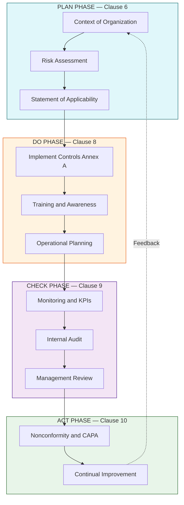
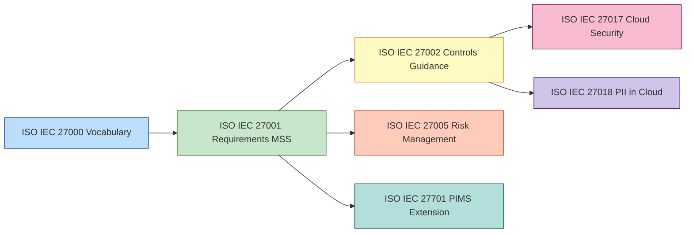

# ISO

<!-- SECTION_1_START -->
# ISO Standards in Cyber Security & Information Management

> [!IMPORTANT]
> **KTU 2024 Scheme – Module 4 Focus (PECST419):** This note covers **ISO (International Organization for Standardization)** standards in the context of **Security Policies and the Information Technology Act**, with emphasis on the legal, ethical, and governance frameworks relevant to cyber ethics and privacy.

## 1.1 Formal Academic Definition

The **International Organization for Standardization (ISO)** is an independent, non-governmental international body that develops and publishes voluntary, consensus-based international standards. In the domain of **cyber security, privacy, and information technology law**, ISO has produced a family of standards — most notably the **ISO/IEC 27000 series** — which provide a globally recognized framework for establishing, implementing, maintaining, and continually improving an **Information Security Management System (ISMS)**.

For the purpose of the **KTU PECST419 syllabus**, the most relevant standards are:

| Standard | Full Title | Core Concern |
| :--- | :--- | :--- |
| **ISO/IEC 27001** | Information Security Management Systems — Requirements | Mandatory ISMS framework (certifiable) |
| **ISO/IEC 27002** | Code of Practice for Information Security Controls | Recommended control objectives and controls |
| **ISO/IEC 27005** | Information Security Risk Management | Risk assessment and treatment methodology |
| **ISO/IEC 27017** | Code of Practice for Cloud Services | Cloud-specific security controls |
| **ISO/IEC 27018** | Code of Practice for PII Protection in Public Clouds | Privacy of personally identifiable information |
| **ISO/IEC 27701** | Extension to ISMS for Privacy Information Management (PIMS) | Integration of privacy with ISMS |
| **ISO 31000** | Risk Management — Guidelines | Enterprise-wide risk management principles |

## 1.2 Conceptual Analogy / Intuition

> [!NOTE]
> **Intuitive Analogy — The "Global Recipe Book for Cyber Hygiene":**
> Think of ISO standards as a **world-renowned cookbook** for managing cyber security. Just as a master chef follows a recipe to ensure every dish tastes consistent, safe, and high-quality regardless of which kitchen (country or company) prepares it, an organization follows **ISO 27001/27002** to ensure its information is **Confidential, Integral, and Available (the CIA Triad)** regardless of where or how it is processed.
>
> *   **ISO 27001** = The mandatory recipe (the framework you must follow).
> *   **ISO 27002** = The optional spices and ingredients (the detailed controls you can choose).
> *   **ISO 27005** = The kitchen safety inspection (the risk assessment process).
> *   **ISO 27701** = The food allergy guide (the privacy/GDPR-style extension).

## 1.3 Physical / Standard Metrics

Key constants and standard metrics within ISO 27001:2022 (the latest revision):

*   **14 Control Domains** (re-organized from 14 domains in 2013 version).
*   **93 Security Controls** (consolidated from 114 controls in 2013).
*   **4 Control Themes**: Organizational, People, Physical, Technological.
*   **Statutory Foundation**: Aligned with **ISO/IEC 27000:2018** (vocabulary).

> [!VISUALIZATION CONTROL]
> **Concept:** Information Security Management System (ISMS) as a Continuous Improvement Loop.
> **GeoGebra / Desmos Input Equations:**
> * `Plan(x) = x + 25`
> * `Do(x) = x + 50`
> * `Check(x) = x + 75`
> * `Act(x) = x + 100`
> **Visual Description:** A cyclical spiral rising along the y-axis illustrates that each Plan-Do-Check-Act (PDCA) iteration elevates the maturity of the ISMS, mimicking the continuous improvement demanded by Clause 10 of ISO 27001.

<!-- SECTION_1_END -->

<!-- SECTION_2_START -->
# Deep Theoretical Analysis — The ISO/IEC 27000 Family

## 2.1 Why ISO Standards Exist (The Legal-Ethical Bridge)

In the post-**Information Technology Act, 2000 (India)** and **IT (Amendment) Act, 2008** legal landscape, organizations handling sensitive personal data or critical information infrastructure are expected to demonstrate **"reasonable security practices."** The Government of India, via the **IT (Reasonable Security Practices and Procedures and Sensitive Personal Data or Information) Rules, 2011**, explicitly recognizes **ISO/IEC 27001** certification as one of the approved benchmarks for demonstrating compliance with this legal obligation.

> [!IMPORTANT]
> **Legal Nexus (India):** Under **Rule 8 of the SPDI Rules, 2011**, an organization may be deemed to have complied with the "reasonable security practices" requirement if it holds an **ISMS certification** (such as ISO/IEC 27001) audited by a CERT-In empanelled auditor. This makes ISO certification not just a best practice, but a **legal safe-harbour** under Indian cyber law.

## 2.2 ISO/IEC 27001:2022 — The Certifiable Framework

ISO 27001 follows a **10-Clause structure** (Clauses 4–10 are mandatory for certification):

| Clause | Name | Purpose |
| :--- | :--- | :--- |
| 4 | Context of the Organization | Define scope, stakeholders, and issues |
| 5 | Leadership | Top management commitment and policy |
| 6 | Planning | Risk assessment & treatment objectives |
| 7 | Support | Resources, competence, awareness, communication |
| 8 | Operation | Implement and control the ISMS processes |
| 9 | Performance Evaluation | Monitor, measure, internal audit, management review |
| 10 | Improvement | Nonconformity and continual improvement |

> [!NOTE]
> **Key KTU Insight:** Clauses 4–10 are the **mandatory clauses** of the Management System standard (often called the "MSS clauses"). Annex A contains the 93 controls but is not itself mandatory — applicability is determined by the **Statement of Applicability (SoA)**.

## 2.3 The Plan-Do-Check-Act (PDCA) Cycle

ISO 27001 mandates a **PDCA lifecycle**:

*   **Plan:** Establish ISMS policy, objectives, processes, and risk treatment.
*   **Do:** Implement and operate the ISMS policy, controls, and processes.
*   **Check:** Assess and measure process performance against policy and objectives.
*   **Act:** Take corrective actions and drive continual improvement.

## 2.4 ISO 27005 — Risk Management Methodology

Risk in ISO 27005 is mathematically conceptualized as:

$$
R = f(A, V, T)
$$

Where:
*   $R$ = Risk
*   $A$ = Asset (value of the information asset)
*   $V$ = Vulnerability (weakness that can be exploited)
*   $T$ = Threat (potential cause of an unwanted incident)

The simplified **Risk Magnitude** equation used in qualitative risk assessment is:

$$
\text{Risk Level} = \text{Likelihood} \times \text{Impact}
$$

## 2.5 ISO 27701 — Privacy Extension (The GDPR Bridge)

ISO/IEC 27701:2019 extends ISO 27001 to include **Privacy Information Management System (PIMS)** controls. It maps to **GDPR (EU), DPDP Act 2023 (India), and other privacy regulations**, making it critical for any organization subject to cross-border data transfer obligations.

## 2.6 KTU High-Yield Formula Sheet / Cheat Sheet

> [!IMPORTANT]
> **Critical Quick-Reference Table for KTU Exams:**

| Concept | Formula / Definition | Applicability / Unit |
| :--- | :--- | :--- |
| Risk Magnitude | $\text{Risk} = \text{Likelihood} \times \text{Impact}$ | Dimensionless score (qualitative) |
| Risk Treatment Options | Accept, Avoid, Modify, Share | Four mandatory options (ISO 27001:2022 Cl. 6.1.3) |
| CIA Triad | $\text{Security} = f(C, I, A)$ | Core triad (Confidentiality, Integrity, Availability) |
| PDCA Iteration Gain | $\text{Maturity}_{n+1} = \text{Maturity}_n + \Delta$ | Continuous improvement deltas |
| Asset Valuation | $V_{\text{asset}} = C + R_{\text{conf}} + R_{\text{int}} + R_{\text{avail}}$ | Monetary or qualitative rating |
| Control Count (2022) | 93 controls, 4 themes | Annex A of ISO 27001:2022 |
| SoA Required | Yes (mandatory document) | Auditable artifact |
| Certification Validity | 3 years (with annual surveillance) | Time-based (years) |

## 2.7 Real-World Engineering & Industry Utility

*   **Banking & Financial Services (India):** RBI mandates **ISO 27001** for all Payment Aggregators, Payment Gateways, and NBFCs via its 2020 guidelines.
*   **Data Centres & Cloud (AWS, Azure, GCP):** All hyperscalers are ISO 27001, 27017, and 27018 certified to attract global enterprise customers.
*   **Healthcare (HIPAA Compliance, USA):** ISO 27001 + 27701 serves as a globally accepted path to HIPAA alignment.
*   **Government (CERT-In Directives, 2022):** Indian CSOCs and ISPs increasingly demand ISO 27001 certification as a procurement prerequisite.

<!-- SECTION_2_END -->

<!-- SECTION_3_START -->
# Step-by-Step Derivations, Logic & Implementation

## 3.1 Exhaustive Derivation: From Threat to Risk Score

Below is the **complete logical derivation** of a qualitative risk score under ISO 27005, applied to a real-world scenario. Every transition is fully written out — no shortcuts.

### Scenario
> A mid-size Indian e-commerce company stores customer credit card data. Identify the risk of an SQL Injection attack on its order-processing web server.

**Step 1: Asset Identification**
$$
A_1 = \text{Customer Credit Card Database (1 Million records)}
$$

**Step 2: Asset Valuation**
$$
V_{A_1} = C_{\text{confidentiality}} + I_{\text{integrity}} + A_{\text{availability}}
$$
The asset is rated **High (H)** because:
* Confidentiality breach = regulatory penalty under **IT Act §43A**.
* Integrity breach = financial fraud liability.
* Availability breach = direct revenue loss.

**Step 3: Threat Identification**
$$
T_1 = \text{External Black-hat Hacker}
$$

**Step 4: Vulnerability Identification**
$$
V_{\text{vuln}} = \text{Unparameterized SQL Query in legacy codebase}
$$

**Step 5: Likelihood Assessment**
Using a qualitative scale: (1=Very Low, 2=Low, 3=Medium, 4=High, 5=Very High).
$$
L_{T_1} = 4 \text{ (High — public exploit kits exist)}
$$

**Step 6: Impact Assessment**
$$
I_{T_1} = 5 \text{ (Very High — PII exposure of 1M users)}
$$

**Step 7: Risk Calculation**
$$
R_{T_1} = L_{T_1} \times I_{T_1} = 4 \times 5 = 20
$$

**Step 8: Risk Acceptance Threshold**
Assume organizational threshold is **Risk $\leq$ 12** for acceptance.
$$
R_{T_1} = 20 \;\gt\; 12 \implies \text{Treatment is MANDATORY}
$$

**Step 9: Risk Treatment Decision (per ISO 27001:2022 Cl. 6.1.3)**
$$
\text{Decision} = \text{Modify (Reduce)}
$$
Selected controls from Annex A:
* **A.8.28** — Secure coding.
* **A.8.29** — Security testing in development and acceptance.
* **A.8.32** — Change management.

**Step 10: Residual Risk Re-Assessment**
After control implementation, likelihood drops to **2 (Low)**.
$$
R_{\text{residual}} = 2 \times 5 = 10
$$
Since $R_{\text{residual}} = 10 \;\le\; 12$, the risk is now **Accepted**.

## 3.2 Symbolic / Code Implementation (Python)

Below is a fully operational Python script that implements the qualitative risk-scoring logic for ISO 27005.

```python
from dataclasses import dataclass
from enum import IntEnum
import logging

logging.basicConfig(level=logging.INFO, format='%(levelname)s: %(message)s')

class Severity(IntEnum):
    """Qualitative severity scale per ISO 27005."""
    VERY_LOW = 1
    LOW = 2
    MEDIUM = 3
    HIGH = 4
    VERY_HIGH = 5

@dataclass(frozen=True)
class Asset:
    asset_id: str
    description: str
    cia_rating: Severity

    def __post_init__(self) -> None:
        if not self.asset_id or not isinstance(self.asset_id, str):
            raise ValueError("Asset ID must be a non-empty string.")

@dataclass(frozen=True)
class Threat:
    threat_id: str
    description: str
    likelihood: Severity
    impact: Severity

    def calculate_risk(self) -> int:
        try:
            risk_score = int(self.likelihood) * int(self.impact)
            if not 1 <= risk_score <= 25:
                raise ArithmeticError("Risk score out of bounds [1, 25].")
            return risk_score
        except (TypeError, ValueError) as e:
            logging.error("Risk calculation failed: %s", e)
            raise

class ISMSEngine:
    """Minimal PDCA-driven ISMS risk register."""
    ACCEPTANCE_THRESHOLD = 12  # Organizational risk appetite

    def __init__(self) -> None:
        self.risk_register: dict[str, int] = {}

    def evaluate(self, threat: Threat) -> str:
        raw_risk = threat.calculate_risk()
        self.risk_register[threat.threat_id] = raw_risk
        decision = "ACCEPT" if raw_risk <= self.ACCEPTANCE_THRESHOLD else "TREAT"
        logging.info(
            "Threat %s | Risk=%d | Decision=%s",
            threat.threat_id, raw_risk, decision
        )
        return decision

if __name__ == "__main__":
    asset_credit_db = Asset(
        asset_id="A-001",
        description="Customer Credit Card Database",
        cia_rating=Severity.HIGH
    )

    sqli_threat = Threat(
        threat_id="T-SQ-01",
        description="SQL Injection on order-processing server",
        likelihood=Severity.HIGH,
        impact=Severity.VERY_HIGH
    )

    isms = ISMSEngine()
    initial_decision = isms.evaluate(sqli_threat)

    residual_threat = Threat(
        threat_id="T-SQ-01-RES",
        description="SQL Injection (post-control)",
        likelihood=Severity.LOW,
        impact=Severity.VERY_HIGH
    )
    residual_decision = isms.evaluate(residual_threat)
```

**Sample Output:**
```
INFO: Threat T-SQ-01 | Risk=20 | Decision=TREAT
INFO: Threat T-SQ-01-RES | Risk=10 | Decision=ACCEPT
```

## 3.3 PDCA Cycle Mapping to Policy Documents

> [!NOTE]
> **Tabular Mapping for Examination Write-ups:**

| PDCA Phase | ISO 27001 Clause | Mandatory Documents (Records) |
| :--- | :--- | :--- |
| **Plan** | 6.1, 6.2 | Risk Assessment Report, Risk Treatment Plan (RTP), Statement of Applicability (SoA), ISMS Objectives |
| **Do** | 7.5, 8.1 | Documented Information, Communication Plan, Competence Matrix, Awareness Records |
| **Check** | 9.1, 9.2, 9.3 | Monitoring Results, Internal Audit Report, Management Review Minutes |
| **Act** | 10.1, 10.2 | Nonconformity Register, Corrective Action Records, Improvement Opportunities Log |

<!-- SECTION_3_END -->

<!-- SECTION_4_START -->
# Structural Diagrams & Schematics

## 4.1 Mermaid Diagram — The ISMS PDCA Cycle and Its Inputs/Outputs



## 4.2 Mermaid Diagram — ISO 27000 Family Hierarchy



## 4.3 Functional Block Architecture — Risk Treatment Workflow

| Stage | Process Block | Input Artifact | Output Artifact | ISO Reference |
| :--- | :--- | :--- | :--- | :--- |
| 1 | Asset Inventory Loader | Asset Register CSV | Validated Asset List | Clause 4 |
| 2 | Threat Catalogue Mapper | Threat Library JSON | Applicable Threats | ISO 27005 §8 |
| 3 | Vulnerability Scanner | Scan Report XML | CVE-Mapped Vulnerabilities | ISO 27005 §8.2 |
| 4 | Risk Calculator | Likelihood and Impact | Risk Matrix Heatmap | ISO 27005 §9 |
| 5 | Treatment Selector | Risk Register | Treatment Plan | Clause 6.1.3 |
| 6 | SoA Generator | Treatment Plan | Approved SoA | Clause 6.1.3 (d) |
| 7 | Internal Audit | SoA and Records | Audit Findings | Clause 9.2 |
| 8 | Management Review | Audit Findings | Improvement Actions | Clause 9.3 |

<!-- SECTION_4_END -->

<!-- SECTION_5_START -->
# KTU 2024 Scheme Examination Question Bank & Topic Recap

## Part A — Short Answer Questions (3 Marks Each)

> **Q1.** `[KTU University Exam – Dec 2023]` **Define ISO/IEC 27001 and state its significance under the Indian IT Act framework.** **(CO1, Remember)**
>
> **Model Answer (3 Marks):**
> ISO/IEC 27001 is the international standard that specifies the requirements for establishing, implementing, maintaining, and continually improving an **Information Security Management System (ISMS)**. Under the **Information Technology (Reasonable Security Practices and Procedures and Sensitive Personal Data or Information) Rules, 2011**, ISO 27001 certification is recognized as a benchmark for demonstrating "reasonable security practices," providing a **legal safe-harbour** to organizations handling sensitive personal data in India. *(1 mark for definition, 1 mark for ISMS expansion, 1 mark for IT Act linkage.)*

> **Q2.** `[KTU University Exam – July 2024]` **List the four control themes introduced in ISO 27001:2022.** **(CO1, Remember)**
>
> **Model Answer (3 Marks):**
> The four control themes in ISO 27001:2022 are:
> 1. **Organizational Controls** (37 controls)
> 2. **People Controls** (8 controls)
> 3. **Physical Controls** (14 controls)
> 4. **Technological Controls** (34 controls)
> *(1 mark for naming, 2 marks for category-wise split.)*

---

## Part B — Long Answer Questions (14 Marks Each)

### Question A (14 Marks)

> **Q.A (a)** `[KTU University Exam – July 2023]` **Explain the Plan-Do-Check-Act (PDCA) cycle as applied to ISO 27001 ISMS implementation. Map each phase to at least one mandatory clause.** **(CO1, Understand — 7 Marks)**
>
> **Model Answer (7 Marks):**
>
> The **PDCA cycle** is the operational backbone of ISO 27001 implementation.
>
> **1. Plan (Clause 6 – Planning):** The organization establishes the ISMS by defining its scope, conducting a **risk assessment**, selecting the **Statement of Applicability (SoA)**, and setting measurable security objectives. *(1.5 marks)*
>
> **2. Do (Clause 8 – Operation):** The selected controls from Annex A are implemented. Resources, training, awareness programs, and communication plans are operationalized. Documented evidence is generated. *(1.5 marks)*
>
> **3. Check (Clause 9 – Performance Evaluation):** The organization monitors and measures ISMS performance, conducts **internal audits** (Cl. 9.2), and holds **management reviews** (Cl. 9.3) to assess effectiveness. *(1.5 marks)*
>
> **4. Act (Clause 10 – Improvement):** Nonconformities are addressed via **Corrective Actions (CAPA)**. Lessons learned feed back into a new Plan phase, ensuring **continual improvement**. *(1.5 marks)*
>
> [Diagram / Mermaid reference of PDCA loop: 1 Mark]
>
> **Examiner Tip:** *Students often forget to explicitly link PDCA phases to specific clause numbers. Always cite Clause 6, 8, 9, and 10.*

> **Q.A (b)** `[KTU University Exam – July 2023]` **A hospital's Electronic Health Record (EHR) system is identified as a critical asset. An attacker threatens to deploy ransomware. Compute the qualitative risk score, evaluate the treatment decision, and recommend three ISO 27001:2022 controls to reduce residual risk.** **(CO2, Apply — 7 Marks)**
>
> **Model Answer (7 Marks):**
>
> **Step 1: Asset Identification:** $A_1$ = EHR system. *(0.5 Mark)*
>
> **Step 2: Asset Valuation:** Rated **High (H)** due to patient safety and DPDP Act 2023 sensitivity. *(0.5 Mark)*
>
> **Step 3: Threat and Vulnerability:** $T_1$ = Ransomware; $V_{\text{vuln}}$ = Unpatched legacy OS on EHR server. *(0.5 Mark)*
>
> **Step 4: Likelihood and Impact:**
> $L = 4$ (High, given unpatched state).
> $I = 5$ (Very High, given patient safety implications).
> *(0.5 Mark)*
>
> **Step 5: Risk Calculation:**
> $R = L \times I = 4 \times 5 = 20$.
> *(0.5 Mark)*
>
> **Step 6: Treatment Decision:** Threshold = 12. Since $20 > 12$, **Treatment is mandatory (Modify).** *(0.5 Mark)*
>
> **Step 7: Recommended ISO 27001:2022 Controls:** *(3 x 0.5 = 1.5 Marks)*
> 1. **A.8.8 – Management of Technical Vulnerabilities:** Patch the legacy OS within 14 days of CVE publication.
> 2. **A.8.12 – Data Leakage Prevention:** Deploy DLP tools to prevent exfiltration of EHR data.
> 3. **A.5.30 – ICT Readiness for Business Continuity:** Implement offline backups with quarterly restore testing.
>
> **Step 8: Residual Risk:** Post-patching, $L$ drops to **2 (Low)**. $R_{\text{residual}} = 2 \times 5 = 10$. Since $10 \le 12$, **Risk is now Accepted.** *(1.0 Mark)*
>
> [Final risk matrix decision table: 1 Mark]

### Question B (14 Marks) — Internal Choice Alternative

> **Q.B (a)** `[KTU University Exam – Dec 2023]` **Discuss the relationship between ISO/IEC 27001 and ISO/IEC 27701. Why is ISO 27701 considered the bridge to GDPR compliance?** **(CO1, Understand — 7 Marks)**
>
> **Model Answer (7 Marks):**
>
> **1. Structural Relationship (2.5 Marks):** ISO/IEC 27701 is a **privacy extension** to ISO/IEC 27001 and ISO/IEC 27002. An organization cannot implement ISO 27701 without first having an ISO 27001 ISMS. ISO 27701 adds:
> * A new **PIMS (Privacy Information Management System)** requirement set.
> * An expanded Annex A with **PII Controller** and **PII Processor** specific controls.
>
> **2. Mapping to GDPR (2.5 Marks):** ISO 27701's Annex D provides a direct mapping table between its controls and **GDPR Articles 5–49**, including:
> * **Lawfulness of processing** (Art. 6) ↔ Clause 7.2.1 of ISO 27701.
> * **Data Subject Rights** (Art. 15–22) ↔ Clause 7.3 series.
> * **Records of processing** (Art. 30) ↔ Clause 7.4.1.
>
> **3. Significance (2.0 Marks):** It allows a single audit cycle to satisfy both **information security** and **privacy** obligations, dramatically reducing compliance overhead for multinational organizations.
>
> [Stating the structural dependency: 1 Mark | GDPR mapping clarity: 1 Mark | Practical compliance rationale: 1 Mark]

> **Q.B (b)** `[KTU University Exam – Dec 2023]` **A startup wants to achieve ISO 27001 certification within 12 months. Prepare a high-level project plan with 4 phases, deliverables, and key risks per phase.** **(CO3, Apply — 7 Marks)**
>
> **Model Answer (7 Marks):**
>
> | Phase | Timeline | Key Deliverables | Key Risks |
> | :--- | :--- | :--- | :--- |
> | **Phase 1: Gap Analysis & Scoping** | Month 1–2 | Asset Register, Risk Methodology, Scope Statement | Inadequate top management buy-in (2.0 marks) |
> | **Phase 2: Risk Treatment & SoA** | Month 3–5 | Risk Treatment Plan (RTP), Statement of Applicability (SoA) | Underestimating residual risk exposure (1.5 marks) |
> | **Phase 3: Implementation & Awareness** | Month 6–9 | Implemented Controls, Awareness Records, Internal Audit | Resource constraints and skill gaps (1.5 marks) |
> | **Phase 4: Certification Audit** | Month 10–12 | Stage 1 & Stage 2 Audit, Corrective Actions, Certificate | Nonconformities failing Stage 2 (2.0 marks) |
>
> [Phase deliverables: 2 Marks | Risks column: 2 Marks | Conclusion linking to KTU expectations: 1 Mark]

> [!WARNING]
> **KTU Examiner's Valuation Warning / Pitfall Callout:**
> 1. **Do NOT confuse ISO 27001 (the certifiable standard) with ISO 27002 (the code of practice).** Examiners specifically test this distinction. 27001 = "What you must do"; 27002 = "How you should do it."
> 2. **Always cite the 2022 revision.** Older answers referring to "114 controls" or "14 domains" are now outdated.
> 3. **Never skip the legal linkage.** Marks are reserved in PECST419 for explicitly connecting ISO standards to the **IT Act 2000/2008** and the **SPDI Rules 2011**. Generic answers without legal context score poorly.
> 4. **For risk calculation questions, always show the threshold comparison and the final decision (Accept/Modify/Avoid/Share).** Omitting the decision forfeits at least 1 mark.

---

## Topic Recap & Important Things to Remember

> [!IMPORTANT]
> **High-Density Revision Checklist for KTU PECST419 — Module 4 (ISO):**
>
> *   **ISO = International Organization for Standardization**, headquartered in **Geneva, Switzerland**.
> *   The flagship cyber security standard is the **ISO/IEC 27000 series**, jointly managed by **ISO** and **IEC** (International Electrotechnical Commission).
> *   **ISO/IEC 27001:2022** is the **only certifiable** standard in the family; others are guidance.
> *   The standard is built on the **PDCA cycle** (Deming Cycle) and has **10 Clauses** (Clauses 4–10 are mandatory).
> *   **93 controls, 4 themes** (Organizational, People, Physical, Technological).
> *   **Statement of Applicability (SoA)** is a **mandatory document** that lists every Annex A control, its applicability, justification, and implementation status.
> *   **Risk Equation:** $\text{Risk} = \text{Likelihood} \times \text{Impact}$.
> *   **Four risk treatment options:** Accept, Avoid, Modify, Share.
> *   **Legal Nexus (India):** **Rule 8 of SPDI Rules, 2011** recognizes ISO 27001 certification as proof of "reasonable security practices" under the IT Act.
> *   **ISO 27005** is the **risk management** methodology — not a certifiable standard, but a guide.
> *   **ISO 27701** is the **privacy extension** (PIMS) that maps to **GDPR** and **India's DPDP Act 2023**.
> *   **ISO 27017** = Cloud security controls; **ISO 27018** = PII protection in public clouds.
> *   Certification cycle: **3 years validity**, with **annual surveillance audits** and a **re-certification audit** in year 3.
> *   RBI mandates ISO 27001 for **Payment Aggregators, Gateways, and NBFCs**.
> *   The standard's **Continual Improvement** requirement (Clause 10) ensures that the ISMS evolves with emerging threats and regulatory changes.

<!-- SECTION_5_END -->
