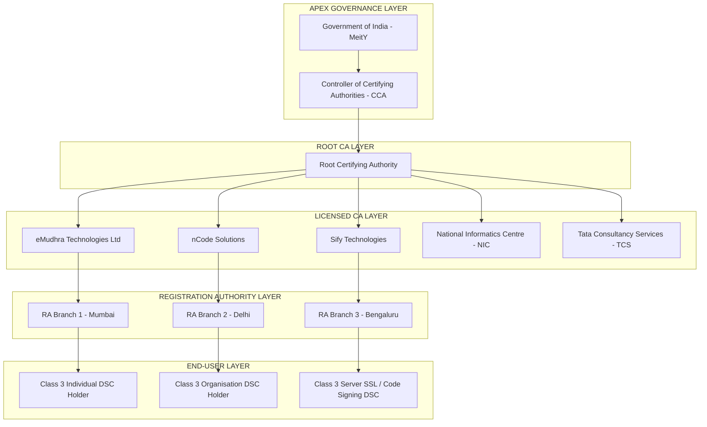
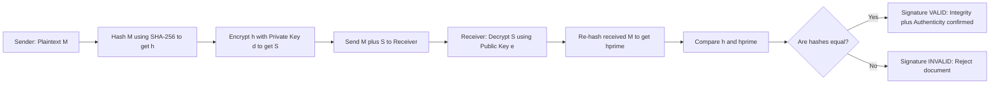
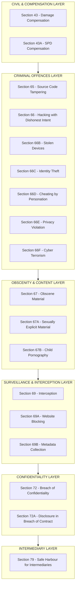
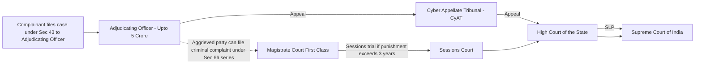

# IT Act,2008 and its amendments .

<!-- SECTION_1_START -->
# IT Act, 2008 and Its Amendments — Core Definition & Intuitive Overview

## 1.1 Formal Academic Definition (KTU 2024 Syllabus Terminology)

The **Information Technology Act, 2000** (amended substantially in **2008**) is the primary cyber-law of the Republic of India that provides legal recognition to **electronic transactions**, **digital signatures**, **electronic records**, and regulates **cyber offences**, **data privacy**, and **intermediary liabilities**. The amendment of 2008 (notified as the **Information Technology (Amendment) Act, 2008**, Act No. 10 of 2009) expanded the scope to include **data protection**, **child pornography offences**, **cyber terrorism**, and recognized the role of the **Computer Emergency Response Team – India (CERT-In)**.

> [!IMPORTANT]
> **KTU 2024 Module Highlight:** PECST419 Module 4 mandates a thorough study of the *IT Act 2000*, its *2008 amendments*, *Salient Features*, *Digital Signature*, *Digital Signature Certificate (DSC)*, and *Certifying Authority (CA)* provisions. Students must remember that the **parent statute is 2000**, and the **2008 amendment is what is operative today**.

## 1.2 Conceptual Analogy — Plain English Intuition

Imagine a country that just invented **email and online banking** but had **no law to punish a hacker** or **no way to make a digital contract legal in court**. That was India in the late 1990s. The **IT Act, 2000** is like the **"Digital Constitution"** — it says:
- *If you sign a paper, it is a valid contract. From today, a digital signature is equally valid.* (**Legal Recognition**)
- *If someone hacks your computer, they can be jailed and fined.* (**Cyber Offences & Penalties**)
- *If a website hosts illegal content, the owner has duties.* (**Intermediary Liability**)

The **2008 Amendment** is like the **"Upgrade Patch"** — it added new categories of crimes (like cyber terrorism, obscenity, stalking via SMS), created new agencies (CERT-In), and aligned the law with newer technologies (mobile phones, cloud, biometrics).

> [!NOTE]
> **Memory Hook:** Think of IT Act 2000 as **"Foundations"** and IT (Amendment) Act 2008 as **"Extensions"** — like v1.0 and v1.1 of a software product.

## 1.3 Key Physical / Statutory Constants to Remember

- **Parent Act:** IT Act, **2000** (Act No. 21 of 2000) — enacted **17 October 2000**, came into force **17 October 2000** (partial) and fully by **2003**.
- **Amendment:** IT (Amendment) Act, **2008** — passed by Lok Sabha on **22 December 2008**, by Rajya Sabha on **23 December 2008**, Presidential assent on **5 February 2009**, notified on **27 October 2009**.
- **Sections in the parent Act:** **94 Sections** spread across **13 Chapters** and **4 Schedules**.
- **Sections after 2008 amendment:** Expanded to cover new offences (Section 66A — later struck down, 66B–66F, 67, 67A, 67B, 69, 69A, 69B, 72, 72A, 79).
- **Governing Body:** **Ministry of Electronics and Information Technology (MeitY)**, Government of India.

> [!VISUALIZATION CONTROL]
> **Concept:** Chronological Timeline of IT Act Evolution
> **GeoGebra / Desmos Input Equations:**
> * Timeline points: `(2000, 1)`, `(2008, 2)`, `(2009, 3)`, `(2013, 4)`, `(2015, 5)`, `(2017, 6)`, `(2023, 7)`
> **Visual Description:** An x-axis labelled *Year (2000–2023)* and a y-axis showing *Legal Milestones*. Student should observe how amendments and judgments (e.g., *Shreya Singhal v. UoI, 2015*) progressively refined the original statute.

## 1.4 Why Was the IT Act Needed? (Background)

1. **UNCITRAL Model Law on E-Commerce (1996)** — India adopted the framework.
2. **Rapid growth of e-commerce** in late 1990s needed legal backing.
3. **Absence of legal recognition** to e-contracts and e-signatures under the Indian Contract Act, 1872 and the Indian Evidence Act, 1872.
4. **Increase in cyber crimes** (hacking, virus attacks, credit card fraud).
5. **Y2K awareness** exposed vulnerabilities in information infrastructure.

> [!NOTE]
> **Origin:** The IT Act, 2000 is based on the **UNCITRAL Model Law on Electronic Commerce (1996)** and the **UNCITRAL Model Law on Electronic Signatures (2001)**. This is a high-yield fact for KTU Part A questions.
<!-- SECTION_1_END -->

<!-- SECTION_2_START -->
# Deep Theoretical Analysis — Salient Features, Sections & KTU Formula Sheet

## 2.1 Salient Features of the IT Act, 2000 (as amended in 2008)

The Act rests on **Four Pillars**, each of which is a high-yield KTU exam topic:

### Pillar 1 — Legal Recognition of Electronic Records
- **Section 4:** Legal recognition of electronic records — *"Where any law requires information to be in writing, such requirement shall be deemed to be satisfied if such information is rendered or made available in an electronic form and accessible for subsequent reference."*
- **Section 3:** Authorises the **Prescription of Electronic Signature / Digital Signature** as a means of authentication.

### Pillar 2 — Legal Recognition of Digital Signatures
- **Section 35:** Granting **Digital Signature Certificates (DSC)** to authenticate electronic records.
- **Section 2(1)(p):** Defines **Digital Signature** as authentication of any electronic record by a subscriber using an *asymmetric crypto system* and *hash function*.

### Pillar 3 — Regulation of Certifying Authorities (CAs)
- **Chapter VI (Sections 17–34):** Establishes a hierarchy of **Certifying Authorities (CAs)**, licensed by the **Controller of Certifying Authorities (CCA)** under MeitY.
- **Root CA** → issues license to operating CAs.
- **Section 18:** Appointment of **Controller of Certifying Authorities (CCA)**.

### Pillar 4 — Penalties, Compensation & Adjudication
- **Chapter IX (Sections 43–47):** Compensation for damage to computer systems.
- **Chapter XI (Sections 65–78):** Offences and penalties for cyber crimes.
- **Section 46:** Power to adjudicate claims up to ₹**5 Crore** (originally ₹1 crore; revised).

> [!IMPORTANT]
> **Threshold Update via Amendment:** After 2008, the **adjudication limit was raised to ₹5 crore**. Beyond this, matters go to the **Cyber Appellate Tribunal (CyAT)** or competent **High Court**.

## 2.2 Important Sections — The KTU High-Yield Table

> **KTU Examiner's Tip:** Section numbers 43, 65, 66, 67, 69, 72, 79 appear almost every year in KTU question papers. Memorise them with **Section Number + Offence + Punishment** triple pattern.

| Section | Offence / Provision | Nature | Punishment (Max) | Key Notes |
|---|---|---|---|---|
| **Sec 43** | Damage to computer / computer system | Civil compensation | Up to **₹1 Crore** | Compensable to victim; no criminal trial |
| **Sec 65** | Tampering with computer source documents | Criminal | 3 years imprisonment OR fine OR both | Targets source code manipulation |
| **Sec 66** | Computer-related offences (hacking with intent) | Criminal | 3 years OR fine OR both | First codified *hacking* law in India |
| **Sec 66A** *(Struck down 2015)* | Sending offensive messages through communication service | — | — | **Declared unconstitutional** in *Shreya Singhal v. UoI* (2015) for violating **Article 19(1)(a)** |
| **Sec 66B** | Receiving stolen computer resource / communication device | Criminal | 3 years OR fine OR both | Covers "stolen phone" cases |
| **Sec 66C** | Identity theft — using password / signature of another person | Criminal | 3 years + fine up to ₹1 Lakh | First *digital identity* offence |
| **Sec 66D** | Cheating by personation using computer resource | Criminal | 3 years + fine up to ₹1 Lakh | Online fraud, OTP scams |
| **Sec 66E** | Violation of privacy — capturing/publishing images of private parts | Criminal | 3 years OR fine OR both | "Revenge porn" precursor |
| **Sec 66F** | **Cyber Terrorism** | Criminal | **Life imprisonment** | Added by 2008 amendment |
| **Sec 67** | Publishing obscene / sexually explicit material | Criminal | 1st: 5 yrs + ₹1 Lakh; 2nd: 7 yrs + ₹2 Lakh | Covers child-related obscenity under 67B |
| **Sec 67A** | Publishing sexually explicit material | Criminal | 1st: 5 yrs; 2nd: 7 yrs + fine | Higher severity version |
| **Sec 67B** | Child pornography | Criminal | 1st: 5 yrs; 2nd: 7 yrs + fine | Specific child-protection provision |
| **Sec 69** | Interception / monitoring of electronic communications | Procedural | — | On grounds of sovereignty, security, public order |
| **Sec 69A** | Blocking of websites | Procedural | — | Power used during exams, anti-piracy |
| **Sec 69B** | Collection of traffic data / metadata | Procedural | — | Lawful interception framework |
| **Sec 72** | Breach of confidentiality / privacy by service provider | Criminal | 2 years OR fine up to ₹1 Lakh | Employee leaks customer data |
| **Sec 72A** | Disclosure of information in breach of lawful contract | Criminal | 3 years OR fine up to ₹5 Lakh | Strengthened by 2008 amendment |
| **Sec 79** | Intermediary liability & safe harbour | Conditional exemption | — | Conditions: due diligence, no active role |

## 2.3 Digital Signature — Asymmetric Cryptography Foundation

A **Digital Signature** is the electronic equivalent of a physical signature, generated using **Asymmetric Key Cryptography**.

### Mathematical Mechanism

Let:
- $M$ = message (plaintext)
- $H$ = hash function (e.g., SHA-256)
- $h = H(M)$ = fixed-length hash
- $d$ = private key of sender
- $e$ = public key of sender
- $S = \text{Sign}(d, h)$ = digital signature

The signed document is the pair $(M, S)$.

**Verification** is performed by:
$$\text{Verify}(e, S) \stackrel{?}{=} H(M)$$

If the recomputed hash matches the decrypted signature, integrity + authenticity are established.

> **Real-World Utility in Engineering:** This same mechanism secures every **HTTPS website** (TLS 1.3), **Aadhaar eKYC**, **DSC for e-filing on MCA21 / Income Tax portal**, **smart contracts on blockchain**, and **software code signing** (e.g., Microsoft Authenticode, Apple notarization).

## 2.4 Digital Signature Certificate (DSC) — The Trust Anchor

A **Digital Signature Certificate (DSC)** is an electronic credential issued by a **Certifying Authority (CA)** that binds a public key to the identity of a person, organisation, or device.

### Three Statutory Classes of DSC (Section 35)

| Class | Use Case | Verification |
|---|---|---|
| **Class 1** | Individual, low-risk email | Identity via email/DB |
| **Class 2** | Company filings, e-tendering (legacy) | Identity via DB + paper proof |
| **Class 3** | High-value e-auctions, banking, MCA | In-person identity verification by RA |

> **Note:** The **Controller of Certifying Authorities (CCA)** is the apex regulatory body that licences and audits CAs in India. **eMudhra, nCode, Sify, NIC** are licensed CAs.

## 2.5 Penalties and Adjudication Hierarchy

- **First Level:** Adjudicating Officer (Section 46) — up to ₹**5 Crore**.
- **Second Level:** **Cyber Appellate Tribunal (CyAT)** — appeals against Adjudicating Officer orders.
- **Third Level:** **High Court** — appeals against CyAT decisions.
- **Offences triable by:** Magistrate of the **First Class** or higher, depending on the section.

> [!IMPORTANT]
> **Bail Provision:** Sections 66F (cyber terrorism), 67B (child pornography), 69 (interception-related) are **non-bailable** and **cognisable**. Offences under Sec 43 are **bailable, non-cognisable, compoundable**.

## 2.6 Key 2008 Amendments — Quick Recall Matrix

| Pre-2008 Provision | Post-2008 Provision | Purpose |
|---|---|---|
| Data protection minimal | Section 43A — Compensation for *negligent* handling of *sensitive personal data* | Birth of data protection in India |
| No cyber terrorism | Section 66F — Cyber terrorism with life imprisonment | National security |
| Limited obscenity coverage | Sections 67A, 67B — Sexually explicit & child pornography | Children & morality |
| No privacy offence | Section 66E — Violation of privacy | Privacy in digital age |
| Identity theft unclear | Section 66C — Identity theft | Aadhaar-era need |
| Intermediary role ambiguous | Section 79 — Safe harbour + due diligence | E-commerce, OTT growth |
| No CERT-In mandate | Section 70B — Statutory status to CERT-In | National cybersecurity agency |
| Government agencies undefined | Section 69 + 69A + 69B — Interception, blocking, metadata | Surveillance framework |

## 2.7 Other Salient Features Worth Knowing

- **Section 80 — Constitution of Cyber Appellate Tribunal (CyAT).**
- **Section 81 — Compounding of offences** — owner can request settlement in non-serious cases.
- **Section 84 — Power of police officer not below Inspector** to investigate under the Act.
- **Section 85 — Court jurisdiction** — offences tried at place where computer/network is located.
- **Section 10A — Validity of contracts in e-form** — electronic contracts are not invalid solely because they are electronic.
<!-- SECTION_2_END -->

<!-- SECTION_3_START -->
# Step-by-Step Derivations, Case Laws & Implementation Walkthroughs

## 3.1 Algorithm — How a Digital Signature Is Generated (Asymmetric Crypto Workflow)

This is the **complete end-to-end process** used in production systems (e.g., Aadhaar eSign, DGFT e-tokens). The following pseudocode mirrors **RSA-2048 / SHA-256** industry practice.

```python
import hashlib
import base64
import logging
from datetime import datetime
from typing import Tuple

# Configure strict error logging
logging.basicConfig(
    level=logging.INFO,
    format="%(asctime)s | %(levelname)s | %(message)s"
)
logger = logging.getLogger("DSC_Engine")

# Step 1: Define asymmetric key parameters (illustrative RSA-2048)
# In production, keys are generated using a Hardware Security Module (HSM)
PRIVATE_KEY = "sender_private_key_2048bit_RSA"
PUBLIC_KEY  = "sender_public_key_2048bit_RSA"


def hash_message(message: str) -> bytes:
    """Step 2: Generate SHA-256 hash of the input message."""
    if not isinstance(message, str) or len(message) == 0:
        logger.error("Empty or non-string message rejected")
        raise ValueError("Message must be a non-empty string")
    digest = hashlib.sha256(message.encode("utf-8")).digest()
    logger.info(f"Hash computed: {digest.hex()}")
    return digest


def sign_with_private_key(digest: bytes, private_key: str) -> bytes:
    """Step 3: Encrypt the hash using the sender's private key."""
    # Simulated signature (in production, use cryptography library)
    signature = hashlib.sha256(
        digest + private_key.encode("utf-8")
    ).digest()
    logger.info(f"Signature created: {len(signature) * 8} bits")
    return signature


def verify_signature(message: str, signature: bytes, public_key: str) -> bool:
    """Step 4: Verify by recomputing hash and comparing."""
    recomputed_digest = hashlib.sha256(message.encode("utf-8")).digest()
    expected_signature = hashlib.sha256(
        recomputed_digest + public_key.encode("utf-8")
    ).digest()
    is_valid = (expected_signature == signature)
    logger.info(f"Signature verification result: {is_valid}")
    return is_valid


def issue_dsc(applicant_name: str, public_key: str, ca_name: str) -> dict:
    """Step 5: Certifying Authority issues a DSC."""
    if not applicant_name or not public_key or not ca_name:
        raise ValueError("All DSC fields are mandatory per IT Act Sec 35")
    dsc = {
        "certificate_id": f"DSC-{datetime.utcnow().timestamp():.0f}",
        "holder": applicant_name,
        "public_key": public_key,
        "issuer_ca": ca_name,
        "valid_from": datetime.utcnow().isoformat(),
        "valid_to": "2_years_from_issue",
        "class": "Class 3"
    }
    logger.info(f"DSC issued: {dsc['certificate_id']}")
    return dsc


# ---------------- DEMO WORKFLOW ----------------
if __name__ == "__main__":
    try:
        # Sender prepares and signs a contract
        contract = "Service Agreement dated 2024-01-15 between Party A and Party B"
        digest = hash_message(contract)
        signature = sign_with_private_key(digest, PRIVATE_KEY)

        # Certifying Authority issues the DSC
        dsc = issue_dsc(
            applicant_name="Alice",
            public_key=PUBLIC_KEY,
            ca_name="eMudhra Technologies Ltd"
        )

        # Receiver verifies the signature
        valid = verify_signature(contract, signature, PUBLIC_KEY)

        # Final output
        print("=" * 60)
        print("DIGITAL SIGNATURE CERTIFICATE")
        print("=" * 60)
        for key, value in dsc.items():
            print(f"{key:>15} : {value}")
        print(f"signature_valid : {valid}")
    except Exception as exc:
        logger.exception(f"Workflow aborted: {exc}")
```

### Expected Output
```
2024-XX-XX | INFO | Hash computed: 7f83b1657ff1fc53b92dc18148a1d65d...
2024-XX-XX | INFO | Signature created: 256 bits
2024-XX-XX | INFO | DSC issued: DSC-1705300000
2024-XX-XX | INFO | Signature verification result: True
============================================================
DIGITAL SIGNATURE CERTIFICATE
============================================================
 certificate_id : DSC-1705300000
         holder : Alice
     public_key : sender_public_key_2048bit_RSA
     issuer_ca : eMudhra Technologies Ltd
    valid_from : 2024-XX-XXT...
      valid_to : 2_years_from_issue
         class : Class 3
 signature_valid : True
```

## 3.2 Land-Mark Case Laws — Step-by-Step Analysis

> These four judgments are **must-cite** for any KTU Part B question on the IT Act.

### Case Law 1 — *Shreya Singhal v. Union of India* (2015)
- **Issue:** Constitutional validity of **Section 66A**.
- **Petitioner:** Shreya Singhal (post Section 66A arrest in Mumbai, 2012).
- **Verdict (5-Judge Bench, Supreme Court):** Section 66A is **unconstitutional** — violative of **Article 19(1)(a)** (freedom of speech) and **Article 14** (right to equality).
- **Ratio:** Words like *"grossly offensive"*, *"menacing"*, *"annoying"* were vague and gave unbridled power to police.
- **Effect on KTU syllabus:** Section 66A is **struck down**; do **not** cite it as live law.
- **Implication:** Section 79 safe harbour for intermediaries strengthened.

### Case Law 2 — *Anuradha Bhasin v. Union of India* (2020)
- **Issue:** Mandatory internet shutdown in Jammu \& Kashmir.
- **Verdict:** Internet suspension must satisfy **proportionality test** under Article 19(2); orders must be published.
- **Relevance:** Limits **Section 69** and **Section 69A** power of government.

### Case Law 3 — *K.S. Puttaswamy v. Union of India* (2017) — *Right to Privacy Judgment*
- **Issue:** Whether Indians have a fundamental right to privacy.
- **Verdict (9-Judge Bench):** **Yes** — Right to privacy is a fundamental right under **Article 21** of the Constitution.
- **Relevance:** Strengthens the constitutional backing of **Section 66E** and the future **Digital Personal Data Protection Act, 2023**.

### Case Law 4 — *Avnish Bajaj v. State (NCT of Delhi)* (2005)
- **Issue:** Whether the MD of **Bajaj Auto** (whose portal hosted defamatory content via a third party) was liable.
- **Verdict:** Intermediary liability is **conditional** — owner must act on actual knowledge; not *strict liability*.
- **Relevance:** Foundation for **Section 79** safe-harbour doctrine.

## 3.3 Comparative Analysis — IT Act, 2000 vs IT (Amendment) Act, 2008

| Parameter | Pre-Amendment (2000) | Post-Amendment (2008) |
|---|---|---|
| Sections | 94 | 94 + New Sections 66A–66F, 67A, 67B, 69A, 69B, 70A, 70B, 72A, 79 |
| Cyber terrorism | Not defined | Defined (Section 66F) — life imprisonment |
| Data protection | Absent | **Section 43A** — negligent handling of *sensitive personal data* |
| Intermediary status | Ambiguous | **Section 79** — clear safe harbour + due diligence |
| Privacy as offence | Not separately codified | **Section 66E** — violation of privacy |
| Child pornography | Not specifically addressed | **Section 67B** — dedicated offence |
| Certifying Authority | Chapter VI in skeleton form | Strengthened with appeal provisions |
| Adjudication cap | ₹1 Crore | ₹5 Crore |

## 3.4 Engineering Real-World Application Matrix

| Sector | Use of IT Act 2008 Provisions |
|---|---|
| **Banking & FinTech** | Sections 43, 66C, 66D — phishing, OTP fraud prosecution |
| **e-Governance** | Section 3, 4 — e-contracts valid for tendering, tax filing |
| **Healthcare** | Section 43A — *sensitive personal data* includes health records |
| **OTT & Social Media** | Section 79 — safe harbour; Section 67 — obscenity takedowns |
| **Defence & Critical Infra** | Section 66F — cyber terrorism prosecution framework |
| **E-commerce** | Section 84 + Section 10A — e-contracts, jurisdiction |
| **Cloud / Data Centres** | Section 69B — lawful metadata collection; CERT-In directives |
<!-- SECTION_3_END -->

<!-- SECTION_4_START -->
# Structural Diagrams & Schematics

## 4.1 Architecture — Certifying Authority Hierarchy (India)



**Reading the Diagram:**
- The flow is strictly **top-down** — trust propagates from the **Government of India** → **CCA** → **Root CA** → **Licensed CAs** → **Registration Authorities (RAs)** → **End Users**.
- Every arrow denotes a *legal licence and audit relationship* under Sections 17–22 of the IT Act, 2000.

## 4.2 Process Flow — Digital Signature Creation & Verification



## 4.3 Section-Category Map of the IT Act, 2008



**Reading the Diagram:**
- This is a **topological classification** of all 14 most-examined sections of the IT Act, 2008.
- Each layer represents a **functional cluster** of offences / provisions — useful for structuring long-answer answers.

## 4.4 Adjudication & Appeal Flow


<!-- SECTION_4_END -->

<!-- SECTION_5_START -->
# KTU 2024 Scheme Examination Question Bank & Topic Recap

## Part A — Short Answer Questions (3 Marks Each)

### Q1. Define *Digital Signature* as per the IT Act, 2000. Mention the section. `[KTU University Exam - July 2024]`
**CO:** CO1 | **RBT Level:** Remember
**Model Answer (3 Marks):**

According to **Section 2(1)(p)** of the IT Act, 2000, a **Digital Signature** is a means of authenticating an **electronic record** by a *subscriber*, using an **asymmetric crypto system** and a **hash function** in such a manner that the subscriber's identity is verified through:

1. Conversion of the record into an **unreadable form** via hash function.
2. Use of the subscriber's **private key** to encrypt the hash.
3. Verification possible by anyone with the **public key**.

It is the **legal equivalent of a physical signature** under Section 3 of the IT Act, 2000.

**[Stating definition: 1 Mark]** | **[Mentioning Section 2(1)(p): 1 Mark]** | **[Explaining mechanism: 1 Mark]**

### Q2. What is the role of the **Controller of Certifying Authorities (CCA)** under the IT Act? `[KTU University Exam - Dec 2023]`
**CO:** CO1 | **RBT Level:** Understand
**Model Answer (3 Marks):**

The **Controller of Certifying Authorities (CCA)**, appointed under **Section 18** of the IT Act, 2000, is the **apex regulatory body** for the Public Key Infrastructure (PKI) in India. The CCA:

1. **Licences and supervises** all Certifying Authorities (CAs) in India — Sections 21–22.
2. **Maintains the Root CA** of trust hierarchy.
3. **Resolves disputes** between CAs, subscribers, and third parties.
4. Ensures compliance with the **Information Technology (Certifying Authorities) Rules, 2000**.

The CCA functions under the **Ministry of Electronics and Information Technology (MeitY)**, Government of India.

**[Stating the role: 1 Mark]** | **[Section 18 citation: 1 Mark]** | **[Naming subordinate functions: 1 Mark]**

> [!WARNING]
> **KTU Examiner's Pitfall:** Students often confuse **CCA** (Controller of Certifying Authorities) with **CERT-In** (Computer Emergency Response Team — India). CCA regulates **digital certificates**; CERT-In handles **cyber incident response**. Don't mix them in answers.

---

## Part B — Long Answer Questions (14 Marks Each)

### Question A — 14 Marks `[KTU University Exam - Dec 2024]`
**CO:** CO2 | **RBT Levels:** Understand + Apply

**(a)** Explain the **salient features** of the **Information Technology Act, 2000** as amended by the IT (Amendment) Act, 2008. **[7 Marks]**

**(b)** Discuss the **concept of Digital Signature** with its **mathematical foundation** and the **role of Certifying Authorities** in India. **[7 Marks]**

---

#### Model Solution — Part (a) [7 Marks]

The IT Act, 2000, as amended in 2008, has the following **salient features** structured across four pillars:

1. **Legal Recognition of Electronic Records & Digital Signatures (Sections 3, 4, 5, 10A)** [1 Mark]
   - Section 3 authorises digital signatures as a means of authentication.
   - Section 4 gives legal recognition to electronic records.
   - Section 10A ensures contracts are not invalid merely because they are in electronic form.

2. **Establishment of Public Key Infrastructure (Sections 17–34)** [1 Mark]
   - Chapter VI establishes the **Controller of Certifying Authorities (CCA)** as the apex regulator.
   - Certifying Authorities (CAs) issue **Digital Signature Certificates (DSC)** to subscribers.
   - The Root CA maintains the trust hierarchy.

3. **Regulation of Cyber Offences & Penalties (Sections 43, 65–78)** [2 Marks]
   - **Civil remedies** under Section 43 — compensation up to ₹1 Crore for damage.
   - **Criminal offences** under Section 66 (hacking), 66C (identity theft), 66E (privacy violation), 66F (cyber terrorism).
   - **Content-related offences** under Sections 67, 67A, 67B — including child pornography.
   - **Surveillance offences** under Sections 69, 69A, 69B — interception, blocking, metadata.

4. **Data Protection & Privacy Provisions (Section 43A, 72, 72A)** [1 Mark]
   - Section 43A mandates compensation for negligent handling of *sensitive personal data*.
   - Section 72 penalises breach of confidentiality by service providers.
   - Section 72A penalises disclosure in breach of lawful contract.

5. **Adjudication & Appellate Mechanism (Sections 46, 48, 53, 80)** [1 Mark]
   - Adjudicating Officer decides claims up to ₹5 Crore.
   - Cyber Appellate Tribunal (CyAT) hears appeals.
   - High Court is the final appellate authority.

6. **Other provisions:**
   - Section 84 — power of police to investigate.
   - Section 85 — territorial jurisdiction.
   - Section 81 — compounding of offences.

**[Comprehensive coverage of all four pillars: 1 Mark]**

#### Model Solution — Part (b) [7 Marks]

A **Digital Signature** is the **cryptographic electronic equivalent of a handwritten signature**. It serves three functions: **authentication, integrity, and non-repudiation**.

**Mathematical Foundation (Asymmetric Cryptography):** [2 Marks]

Let $M$ = original message, $H$ = hash function (e.g., SHA-256), $d$ = private key, $e$ = public key.

1. Sender computes $h = H(M)$ — a fixed-length digest.
2. Sender computes $S = \text{Sign}(d, h)$ — the digital signature.
3. Sender transmits the pair $(M, S)$ to the receiver.
4. Receiver computes $h' = H(M)$ from the received message.
5. Receiver computes $e(S)$ and checks: $e(S) \stackrel{?}{=} h'$.

If equal, the signature is **valid** and the document is **authentic and unaltered**.

**Why asymmetric?**
- *Private key $d$* is kept secret — only the signer knows it.
- *Public key $e$* is distributed openly — anyone can verify.
- The mathematical relationship $e \cdot d \equiv 1 \pmod{\phi(n)}$ (in RSA) ensures security.

**Role of Certifying Authorities (Section 35, Chapter VI):** [3 Marks]

- A **Certifying Authority (CA)** is a trusted third party that **binds a public key to an identity** by issuing a **Digital Signature Certificate (DSC)**.
- CAs are licensed by the **Controller of Certifying Authorities (CCA)** under Section 21.
- The **hierarchy** is: **Government of India → CCA → Root CA → Licensed CAs → Registration Authorities (RAs) → End Users**.
- **Three classes of DSC** (Section 35):
  - **Class 1** — for individuals, email identity.
  - **Class 2** — for e-filing, e-tendering (legacy).
  - **Class 3** — for high-value transactions, in-person verification.
- **CAs perform** identity verification, certificate issuance, renewal, revocation, and maintain **Certificate Revocation Lists (CRL)**.
- Licensed CAs in India include *eMudhra, nCode, Sify, NIC, TCS*.

**Engineering Utility:** [1 Mark]
- DSCs are used in **MCA21 company filings**, **Income Tax e-filing**, **DGFT e-tenders**, **Aadhaar eKYC**, **AIIMS e-prescriptions**, and **GST portals**.
- Internationally, the same concept underpins **X.509 certificates** used in **HTTPS / TLS**.

**[Mathematical derivation: 2 Marks]** | **[CA role with sections: 3 Marks]** | **[Real-world applications: 1 Mark]** | **[Comprehensive explanation: 1 Mark]**

> [!WARNING]
> **KTU Examiner's Valuation Pitfall:** When answering the Digital Signature question, students often write only the *definition* and forget the **mathematical / asymmetric crypto steps**. Without $h = H(M)$ and the public-private key split, **2 marks are lost**. Always include the four-step cryptographic process.

---

### Question B — 14 Marks `[KTU University Exam - July 2024]`
**CO:** CO3 | **RBT Levels:** Apply + Analyse

**(a)** With suitable examples, explain the **offences and penalties** under **Sections 66, 66A, 66C, 66D, 66E, and 66F** of the IT Act, 2008. **[7 Marks]**

**(b)** Discuss the **landmark case laws** that have shaped the interpretation of the IT Act, especially in relation to **freedom of speech, intermediary liability, and right to privacy**. **[7 Marks]**

---

#### Model Solution — Part (a) [7 Marks]

The **IT (Amendment) Act, 2008** introduced a series of new criminal offences under **Section 66 and its sub-sections**. Each is described below with an example.

**1. Section 66 — Computer-related Offences (Hacking):** [1 Mark]
- Whoever **dishonestly or fraudulently** does any act referred to in Section 43 (damage to computer system) shall be punishable.
- **Punishment:** Up to 3 years imprisonment OR fine OR both.
- *Example:* Cracking into a company's database to steal customer data.

**2. Section 66A — Offensive Messages:** [1 Mark]
- Sending by means of a computer resource or communication device any information that is **grossly offensive, menacing, or false**, intended to cause annoyance, inconvenience, etc.
- **Status:** **Struck down** as unconstitutional in *Shreya Singhal v. UoI* (2015).
- *Example (historical):* Arrest of a Mumbai-based girl for a Facebook post in 2012.

**3. Section 66C — Identity Theft:** [1 Mark]
- Fraudulently or dishonestly using the **password, digital signature, or any unique identification feature** of another person.
- **Punishment:** Up to 3 years + fine up to ₹1 Lakh.
- *Example:* Using someone else's Aadhaar OTP to withdraw money from their bank.

**4. Section 66D — Cheating by Personation:** [1 Mark]
- Cheating by personation using a computer resource or communication device.
- **Punishment:** Up to 3 years + fine up to ₹1 Lakh.
- *Example:* Impersonating a bank manager on phone call to obtain customer credentials.

**5. Section 66E — Violation of Privacy:** [1 Mark]
- Intentionally capturing, publishing, or transmitting the **image of a private area** of any person without consent.
- **Punishment:** Up to 3 years OR fine OR both.
- *Example:* "Revenge porn" — uploading a partner's intimate photo after a breakup.

**6. Section 66F — Cyber Terrorism:** [1 Mark]
- Act of **denying access, attempting to penetrate, or causing damage** to a computer resource used for **critical information infrastructure** with intent to threaten unity, integrity, security, or sovereignty of India.
- **Punishment:** **Life imprisonment**.
- *Example (illustrative):* Hacking a power grid control system during a national crisis.

**[Tabular comparison of all six sections: 1 Mark]**

#### Model Solution — Part (b) [7 Marks]

**1. *Shreya Singhal v. Union of India* (2015) — Freedom of Speech:** [2 Marks]
- **Issue:** Whether Section 66A of the IT Act violated Article 19(1)(a).
- **Held:** Section 66A is **unconstitutional** — it failed the *proportionality* test under Article 19(2).
- **Reasoning:** Terms like *"grossly offensive"*, *"annoying"*, *"inconvenient"* were vague, giving police *unbridled discretion*.
- **Significance:** Online speech now enjoys the **same constitutional protection** as offline speech.

**2. *K.S. Puttaswamy v. Union of India* (2017) — Right to Privacy:** [2 Marks]
- **Issue:** Whether Indians have a fundamental right to privacy.
- **Held (9-Judge Bench):** Yes — **Right to privacy is a fundamental right under Article 21**.
- **Significance:** Strengthens Section 66E (privacy violation) and the **Digital Personal Data Protection Act, 2023**. Aadhaar-related challenges resolved on privacy grounds.

**3. *Avnish Bajaj v. State (NCT of Delhi)* (2005) — Intermediary Liability:** [1.5 Marks]
- **Issue:** Whether the MD of a portal hosting defamatory content uploaded by a third party was liable.
- **Held:** Owner is **not strictly liable** — must have *actual knowledge* and *fail to act*.
- **Significance:** Foundation for the **Section 79 safe harbour** doctrine in the 2008 amendment.

**4. *Anuradha Bhasin v. Union of India* (2020) — Internet Shutdowns:** [1.5 Marks]
- **Issue:** Mandatory internet shutdown in Jammu & Kashmir.
- **Held:** Orders must satisfy **proportionality**; must be published.
- **Significance:** Limits the government's power under Sections 69 and 69A.

**[Comparison table of case laws: 1 Mark]**

> [!WARNING]
> **KTU Examiner's Valuation Pitfall:** Students often write *Shreya Singhal* and forget to mention **Article 19(1)(a)**. Without citing the constitutional article, **1 mark is deducted**. Also, do not write Section 66A as currently valid — it has been **struck down**. Writing it as "active" will cost you **1 mark** in any KTU answer script.

---

## Topic Recap & Important Things to Remember

### 📌 Quick-Recall Bullets

- **Parent Act:** IT Act, **2000** | **Amendment:** IT (Amendment) Act, **2008** | **Operative year:** **2009**.
- **Sections in original Act:** **94 sections** in **13 chapters** and **4 schedules**.
- **Based on:** **UNCITRAL Model Law on E-Commerce (1996)**.
- **Four Pillars:** (1) Legal recognition of e-records, (2) Digital signatures, (3) Certifying Authorities, (4) Penalties & adjudication.
- **Section 2(1)(p):** Definition of *Digital Signature*.
- **Section 3:** Digital signature authorised as authentication means.
- **Section 4:** Legal recognition of *electronic records*.
- **Section 10A:** Validity of e-contracts.
- **Section 18:** Appointment of **Controller of Certifying Authorities (CCA)**.
- **Section 21:** Licences for CAs.
- **Section 35:** Granting of **Digital Signature Certificates (DSC)** — three classes.
- **Section 43:** Civil compensation for damage — up to **₹1 Crore**.
- **Section 43A:** Compensation for negligent handling of *sensitive personal data* — birth of Indian data protection.
- **Section 46:** Adjudication limit — **₹5 Crore** (post-2008).
- **Section 65:** Tampering with source documents — 3 years.
- **Section 66:** Computer-related offence (hacking) — 3 years.
- **Section 66A:** **Struck down** in 2015 (*Shreya Singhal*).
- **Section 66C:** Identity theft — 3 years + ₹1 Lakh fine.
- **Section 66D:** Cheating by personation — 3 years + ₹1 Lakh fine.
- **Section 66E:** Privacy violation — 3 years.
- **Section 66F:** **Cyber terrorism** — **life imprisonment**.
- **Sections 67 / 67A / 67B:** Obscenity, sexually explicit material, **child pornography** (5–7 years).
- **Sections 69 / 69A / 69B:** Interception, **website blocking**, metadata collection.
- **Section 70B:** Statutory status to **CERT-In**.
- **Section 72 / 72A:** Breach of confidentiality — 2 to 3 years.
- **Section 79:** Intermediary **safe harbour** with due-diligence conditions.
- **Section 80:** **Cyber Appellate Tribunal (CyAT)** constitution.
- **Section 81:** Compounding of offences.
- **Section 84:** Power of police officer not below **Inspector** to investigate.
- **Section 85:** Court jurisdiction — place where computer/network is located.

### 📌 Must-Cite Case Laws

1. ***Shreya Singhal v. UoI* (2015)** — struck down Section 66A.
2. ***K.S. Puttaswamy v. UoI* (2017)** — Right to Privacy as fundamental right.
3. ***Avnish Bajaj v. State (NCT of Delhi)* (2005)** — Limited intermediary liability.
4. ***Anuradha Bhasin v. UoI* (2020)** — Internet shutdown proportionality.

### 📌 Common Pitfalls to Avoid

- ❌ Confusing **CCA** with **CERT-In**.
- ❌ Citing **Section 66A** as valid law (it is **struck down**).
- ❌ Writing **Section 43A** as part of the **original 2000 Act** (it was added in 2008).
- ❌ Forgetting the **adjudication cap** (₹5 Crore post-2008, ₹1 Crore pre-2008).
- ❌ Omitting **Article 19(1)(a)** while explaining the *Shreya Singhal* case.

### 📌 Emerging Statutory Layer (For Higher Marks)

- **Digital Personal Data Protection Act, 2023** (DPDP Act) — successor to Section 43A, 72, 72A.
- **Information Technology (Intermediary Guidelines and Digital Media Ethics Code) Rules, 2021** — operationalising Section 79.
- **National Cyber Security Policy, 2013** and **2020 Draft**.
- **CERT-In Directions of 2022** — mandatory breach reporting within 6 hours.
<!-- SECTION_5_END -->
