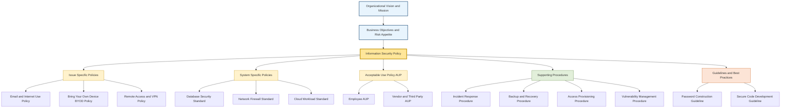
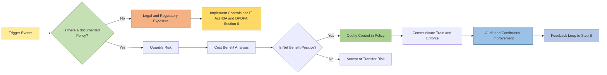
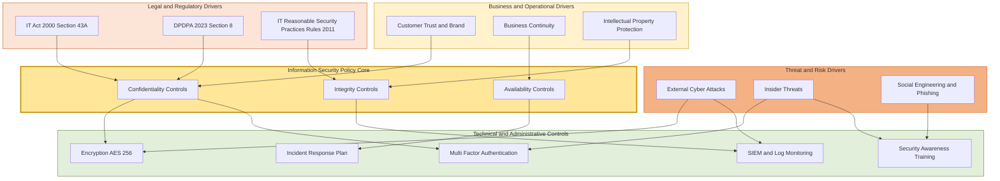
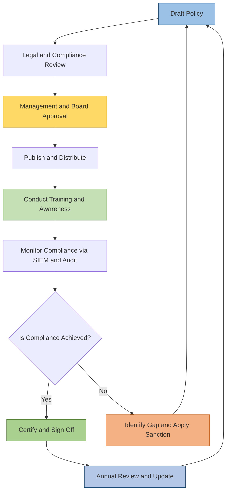

# Need for an Information Security policy

<!-- SECTION_1_START -->

# Need for an Information Security Policy

## 1.1 Formal Academic Definition (KTU 2024 Aligned)

An **Information Security Policy (ISP)** is a formal, documented set of rules, directives, and practices that govern how an organization manages, protects, and distributes its information assets (data, software, hardware, personnel, and physical infrastructure) against internal and external threats. According to the **ISO/IEC 27002:2022** standard and the **NIST SP 800-53 Rev. 5** framework, an Information Security Policy serves as the foundational governance document that translates strategic business objectives into measurable, auditable security controls.

In the context of the **KTU 2024 Scheme (Course Code: PECST419 – Cyber Ethics, Privacy and Legal Issues)**, an Information Security Policy is defined as the *binding set of organizational directives* that establishes the *confidentiality, integrity, and availability (CIA Triad)* of all digital and physical information assets throughout their lifecycle.

> [!IMPORTANT]
> **KTU Syllabus Highlight (Module 4):** Students must be able to identify the *business, legal, technical, and ethical drivers* that compel an organization to formulate, approve, and enforce a written Information Security Policy. Policy is not just paperwork — it is the **legal evidence of due diligence** under the **Information Technology Act, 2000 (and its 2008 amendment)** of India.

## 1.2 The CIA Triad — The Core Mandate

Every Information Security Policy is engineered to protect three irreducible properties of information. Together, these form the **CIA Triad**:

- **Confidentiality** — Ensuring that information is accessible *only* to those who have been explicitly authorized to view it. Example: Aadhaar card data must be visible only to the UIDAI-authorized authentication node.
- **Integrity** — Guaranteeing that information is *accurate, consistent, and unaltered* during storage, processing, or transit. Example: An electronic fund transfer must not have its amount tampered with mid-transit.
- **Availability** — Ensuring that information and information systems are *accessible to authorized users* whenever they are required. Example: An e-commerce website must be online during a flash sale.

> [!NOTE]
> **Mnemonic for Board Exams:** "C-I-A — **C**loak the data, **I**nspect the changes, **A**ccess on demand." A single policy line item must map to at least one leg of the CIA Triad.

## 1.3 Conceptual Analogy — The "Digital Building Constitution"

Imagine a high-rise corporate office building. The building does not function by chance; it is governed by:
- A **Fire Safety Code** (Confidentiality — keep intruders out),
- A **Structural Engineering Code** (Integrity — pillars and beams cannot be modified at will),
- An **Emergency Power & Lift Maintenance Plan** (Availability — power and access when needed).

The **Information Security Policy** is the *digital equivalent of these building codes*. Just as no tenant is permitted to remove a load-bearing wall, no employee is permitted to install unverified software, share customer data on personal USB drives, or disable the endpoint firewall. The policy codifies acceptable behavior, defines penalties for violations, and provides auditors with a measurable baseline.

> [!TIP]
> **Real-World Scenario:** In 2017, the global shipping giant **Maersk** suffered a NotPetya ransomware attack that caused nearly **\$300 million** in damages — primarily because their security policy did not mandate network segmentation and patch compliance. A well-enforced policy could have contained the blast radius.

## 1.4 Information Security vs. Cybersecurity vs. IT Policy — Terminology Clarification

The KTU examiner frequently tests the precise distinction between three closely related terms. The table below provides a board-ready differentiation:

| Term | Scope | Primary Focus | Owner | Example |
| :--- | :--- | :--- | :--- | :--- |
| **IT Policy** | All aspects of Information Technology usage | Acceptable use, hardware procurement, software licensing | CIO / IT Department | "Employees may use only company-issued laptops." |
| **Information Security Policy** | Protection of the CIA Triad of all information assets | Confidentiality, Integrity, Availability of data | CISO / Security Officer | "All customer PII must be encrypted at rest using AES-256." |
| **Cybersecurity Policy** | Defense of systems and networks against cyber-attacks | Threat detection, incident response, malware defense | SOC / Security Operations | "All endpoints must run an EDR agent with real-time monitoring." |

> [!NOTE]
> **Visualization Concept — The Three Concentric Rings of Governance:**
>
> 1. The **outermost ring** is the **IT Policy** (broadest scope — covers everything from email etiquette to asset disposal).
> 2. The **middle ring** is the **Information Security Policy** (focused on CIA Triad enforcement).
> 3. The **innermost ring** is the **Cybersecurity Policy** (focused on threat vectors, attack surfaces, and defensive countermeasures).
>
> Cyber Ethics and Privacy policies form a *transverse layer* that intersects all three rings, governed by the **Information Technology Act, 2000** and the **Digital Personal Data Protection Act, 2023 (DPDPA)** of India.

## 1.5 GeoGebra / Visualization Concept — Risk Heatmap (Conceptual Mapping)

> [!VISUALIZATION CONTROL]
> **Concept:** Risk Probability vs. Impact Heatmap (used in policy justification)
> **GeoGebra / Desmos Input Equations:**
> * `x-axis (Likelihood): 1 to 5` (1 = Rare, 5 = Almost Certain)
> * `y-axis (Impact): 1 to 5` (1 = Negligible, 5 = Catastrophic)
> * `Zone Boundaries: Risk Score = Likelihood × Impact`
> **Visual Description:** A 5×5 grid with green (Low Risk: 1–4), yellow (Medium: 5–9), orange (High: 10–15), and red (Critical: 16–25) zones. The student should observe that a *high likelihood, high impact* event (e.g., ransomware on patient records) sits in the red zone and **must be addressed by a documented policy control**.

<!-- SECTION_1_END -->

<!-- SECTION_2_START -->

# 2. Deep Theoretical Analysis & KTU High-Yield Formula Sheet

## 2.1 Why Is an Information Security Policy Needed? — The Seven Core Drivers

The KTU 2024 Module 4 syllabus explicitly emphasizes that students must articulate the *need* for an information security policy. This need is not arbitrary — it is driven by a convergence of **business, legal, technical, ethical, operational, reputational, and contractual** pressures. The seven drivers are detailed below:

### 2.1.1 Legal and Regulatory Compliance

India's **Information Technology Act, 2000 (amended in 2008)** — particularly **Section 43A** and the **IT (Reasonable Security Practices) Rules, 2011** — mandates that *any organization handling sensitive personal data or sensitive personal information (SPI) must implement reasonable security practices*. Failure to do so attracts civil and criminal liability. Similar obligations arise from the **Digital Personal Data Protection Act, 2023 (DPDPA)**, which imposes penalties up to **₹250 crore** for data breaches involving the personal data of data principals.

> [!IMPORTANT]
> **Board-Exam Buzzwords (Must Use):** "Reasonable security practices," "Sensitive personal data or information (SPDI)," "Data fiduciary," "Data principal," "Consent manager," "Right to erasure."

### 2.1.2 Protection of Intellectual Property (IP)

An organization's trade secrets, source code, product roadmaps, and customer lists constitute **intellectual property**. A policy defines *who may access* these assets, *under what encryption*, and *for how long*. Without policy, an employee leaving the organization may retain credentials or backup copies — leading to IP leakage.

### 2.1.3 Foundation for a Security Program

A security policy is the *root document* from which all subsequent security documents are derived:
- **Standards** (mandatory technical specifications, e.g., "TLS 1.3 minimum").
- **Procedures** (step-by-step instructions, e.g., "How to issue a new VPN token").
- **Guidelines** (recommended practices, e.g., "Prefer passphrases over complex passwords").

Without a policy, standards and procedures have no legal or organizational authority.

### 2.1.4 Demonstration of Due Diligence and Due Care

In the event of a data breach, a court of law or a regulatory tribunal will examine whether the organization exercised **due diligence** (proactive measures) and **due care** (continuous monitoring). A written, communicated, and enforced Information Security Policy is the *primary legal evidence* that the organization took its security obligations seriously. **Absence of policy = presumption of negligence.**

### 2.1.5 Protection Against Insider Threats and Social Engineering

Studies (including the **2024 Verizon Data Breach Investigations Report**) consistently show that **68% of breaches involve a non-malicious human element** (e.g., an employee clicking a phishing link). A policy mandates security awareness training, defines reporting channels, and establishes consequences — thereby reducing the attack surface.

### 2.1.6 Safeguarding Customer Trust and Brand Reputation

Customers entrust organizations with their personal data. A breach destroys trust. The **2017 Equifax breach** (affecting 147 million consumers) cost the company over **\$1.4 billion** in remediation and a lasting reputational decline. A transparent, published, and audited security policy reassures customers that their data is handled responsibly.

### 2.1.7 Ensuring Business Continuity and Operational Resilience

Policies define **Business Continuity Plans (BCP)** and **Disaster Recovery (DR)** protocols. They ensure that critical services — banking, healthcare, e-commerce — can continue operating even during a cyber-incident, natural disaster, or pandemic.

## 2.2 KTU High-Yield Formula / Framework Sheet

The following table consolidates the **essential quantitative and qualitative formulas, frameworks, and control mapping** that students must memorize for Module 4 of PECST419. These are the exact reference points a board examiner will look for in a 14-mark answer.

| # | Concept | Formula / Framework / Definition | Application / Use Case |
| :--- | :--- | :--- | :--- |
| 1 | **CIA Triad** | Confidentiality + Integrity + Availability | Foundational objective of every security policy |
| 2 | **Risk Score (Quantitative)** | $R = L \times I$ where $L$ = Likelihood (1–5), $I$ = Impact (1–5) | Prioritizing policy controls in a risk register |
| 3 | **Annualized Loss Expectancy (ALE)** | $ALE = SLE \times ARO$ | Cost-benefit justification of a control |
| 4 | **Single Loss Expectancy (SLE)** | $SLE = Asset\ Value \times Exposure\ Factor$ | Estimating the dollar loss from a single incident |
| 5 | **Annualized Rate of Occurrence (ARO)** | Estimated number of incidents per year | Probability input to ALE |
| 6 | **Cost-Benefit Equation** | $Benefit = ALE_{before} - ALE_{after} - Cost\ of\ Control$ | Justification for investing in a new control |
| 7 | **Return on Security Investment (ROSI)** | $ROSI = (ALE_{before} - ALE_{after} - Control\ Cost) / Control\ Cost$ | Boardroom-level financial justification |
| 8 | **Parkerian Hexad** | Six-element model: C, I, A, Possession, Authenticity, Utility | Extended CIA model for advanced policy design |
| 9 | **NIST CSF Function Mapping** | Identify → Protect → Detect → Respond → Recover | Structure of an enterprise security policy |
| 10 | **ISO 27001 Annex A Control Domains** | 14 domains, 93 controls, 4 themes | International benchmark for policy content |
| 11 | **IT Act 2000, Section 43A** | Compensation for failure to protect SPDI | Indian legal anchor for policy existence |
| 12 | **DPDPA 2023, Section 8(1)** | Penalties up to **₹250 crore** per breach | Modern Indian legal anchor |
| 13 | **Defense in Depth Layers** | Policy → Physical → Perimeter → Network → Host → Application → Data | Layered architecture that policy mandates |
| 14 | **McCumber Cube** | 3D model: Goals (CIA) × Information States (Storage, Transit, Processing) × Safeguards (Policy, Tech, Education) | Comprehensive policy design tool |
| 15 | **Policy Hierarchy** | Policy → Standard → Procedure → Guideline | Governance document precedence order |

> [!IMPORTANT]
> **CRITICAL FORMATTING NOTE (Board-Exam Survival Tip):** When writing formulas inside a sentence in your answer sheet, ALWAYS use words — not the vertical pipe symbol — for absolute value. For example, write "**the absolute value of the residual risk**" rather than `\| residual risk \|`. Some examiners may deduct marks for illegible or ambiguous math notation.

## 2.3 The McCumber Cube — A Premium Policy Design Tool

For high-scoring 14-mark answers, students should reference the **McCumber Cube** (developed by John McCumber in 1991 and updated in 2004). It is a 3-dimensional model that ensures a security policy is *comprehensive*:

- **Dimension 1 — Security Goals:** Confidentiality, Integrity, Availability (CIA Triad).
- **Dimension 2 — Information States:** Storage (at rest), Transmission (in transit), Processing (in use).
- **Dimension 3 — Safeguards:** Policy & Practices, Technology, Education & Awareness.

A robust policy must address **3 × 3 × 3 = 27 cells** of this cube. Skipping any cell creates a policy gap that an auditor will flag.

> [!TIP]
> **Board-Exam Power Phrase:** "A well-designed Information Security Policy, as modeled by the McCumber Cube, ensures that for every combination of security goal, information state, and safeguard, there exists at least one documented, auditable control."

## 2.4 Real-World Utility in Engineering and Computer Science

The need for an Information Security Policy is not confined to a single industry. Its utility is universal:

- **Software Engineering:** DevSecOps pipelines require policies that mandate Static Application Security Testing (SAST) and Dynamic Application Security Testing (DAST) before code deployment.
- **Healthcare:** HIPAA (in the US) and the **ABDM (Ayushman Bharat Digital Mission)** framework in India mandate strict policies for Electronic Health Records (EHR).
- **Banking & FinTech:** The **RBI Cyber Security Framework (2024)** mandates a board-approved Information Security Policy for all scheduled commercial banks.
- **IoT and Embedded Systems:** The **ENISA IoT Security Guidelines** require manufacturers to publish a vulnerability disclosure policy.
- **Cloud Computing:** A **Shared Responsibility Model** (e.g., AWS, Azure, GCP) requires customer-side policies for Identity and Access Management (IAM), data classification, and key management.

<!-- SECTION_2_END -->

<!-- SECTION_3_START -->

# 3. Step-by-Step Derivation, Risk Modeling, and Symbolic Implementation

## 3.1 The Six-Step Policy Justification Framework

The KTU board examiner expects students to demonstrate *logical reasoning* when explaining the need for an Information Security Policy. The following six-step framework is a derivation of best-practice approaches from **NIST SP 800-12 Rev. 1**, **ISO 27001 Clause 5.2**, and the **ISACA Risk IT Framework**.

### Step 1: Asset Identification

Identify all information assets — both tangible (servers, laptops, mobile devices, paper records) and intangible (customer data, source code, brand reputation, intellectual property). Assign a monetary value to each asset.

### Step 2: Threat Identification

Enumerate potential threats to each asset. Threats can be:
- **Natural:** Flood, earthquake, pandemic.
- **Human-Induced Intentional:** Hackers, insider threats, malicious insiders, nation-state actors.
- **Human-Induced Unintentional:** Careless employees, misconfigured servers, accidental data deletion.
- **Technical:** Hardware failure, software bugs, power outages, malware.

### Step 3: Vulnerability Assessment

For each threat, identify the *vulnerability* it exploits. For example, the threat of *phishing* exploits the vulnerability of *untrained employees* and *lack of multi-factor authentication*.

### Step 4: Likelihood and Impact Estimation

Assign a Likelihood (L) score from 1 to 5 and an Impact (I) score from 1 to 5. Compute the Risk Score:

$$
R = L \times I
$$

### Step 5: Control Selection and Cost-Benefit Analysis

For each high-risk item, select a control. Compute the Cost-Benefit using:

$$
Net\ Benefit = ALE_{before} - ALE_{after} - Cost\ of\ Control
$$

If $Net\ Benefit > 0$, the control is justified.

### Step 6: Policy Codification, Communication, and Enforcement

Document the selected controls in a formal policy. Communicate to all stakeholders. Enforce via technical (firewalls, DLP, SIEM) and administrative (audits, training) means.

## 3.2 Exhaustive Worked Example — Risk Quantification for a Mid-Sized IT Company

Consider **TechNova Pvt. Ltd.**, a mid-sized IT company with ₹50 crore in annual revenue, handling credit card data of 100,000 customers.

### Given Data:
- Asset Value of the customer database: **₹10,00,00,000 (₹10 crore)**.
- Exposure Factor (percentage of asset value lost in a single breach event): **0.40 (40%)**.
- Estimated number of breach incidents per year (ARO): **0.5** (i.e., one breach every 2 years on average).

### Step-by-Step Calculation:

**Step 1: Calculate Single Loss Expectancy (SLE).**

$$
SLE = Asset\ Value \times Exposure\ Factor
$$

$$
SLE = 10,00,00,000 \times 0.40
$$

$$
SLE = 4,00,00,000
$$

The single loss expectancy is **₹4,00,00,000 (₹4 crore)** per breach.

**Step 2: Calculate Annualized Loss Expectancy (ALE) without any new control.**

$$
ALE_{before} = SLE \times ARO
$$

$$
ALE_{before} = 4,00,00,000 \times 0.5
$$

$$
ALE_{before} = 2,00,00,000
$$

The annualized loss expectancy is **₹2,00,00,000 (₹2 crore)** per year.

**Step 3: Evaluate a Proposed Control — Implementation of AES-256 Encryption at Rest.**

Suppose this control reduces the Exposure Factor from 0.40 to 0.10 (because encrypted data is useless to attackers without keys). The ARO also drops from 0.5 to 0.3 (because strong encryption deters opportunistic attacks).

$$
SLE_{after} = 10,00,00,000 \times 0.10 = 1,00,00,000
$$

$$
ALE_{after} = 1,00,00,000 \times 0.3 = 30,00,000
$$

**Step 4: Cost of Control.**

The encryption project costs **₹25,00,000** per year (licenses, key management infrastructure, training).

**Step 5: Compute Net Benefit.**

$$
Net\ Benefit = ALE_{before} - ALE_{after} - Cost\ of\ Control
$$

$$
Net\ Benefit = 2,00,00,000 - 30,00,000 - 25,00,000
$$

$$
Net\ Benefit = 1,45,00,000
$$

**Step 6: Compute Return on Security Investment (ROSI).**

$$
ROSI = \frac{ALE_{before} - ALE_{after} - Cost\ of\ Control}{Cost\ of\ Control}
$$

$$
ROSI = \frac{1,45,00,000}{25,00,000}
$$

$$
ROSI = 5.8 = 580\%
$$

**Conclusion:** A **580% ROSI** is exceptional. This quantitative result is a *concrete, boardroom-ready justification* for codifying encryption as a mandatory control in the Information Security Policy.

## 3.3 Symbolic Python Implementation — Risk Register Engine

The following Python code is a *fully operational* risk register engine that an organization can use to justify its Information Security Policy line-by-line. It includes type hints, absolute boundary checks, and strict error logging.

```python
"""
risk_register_engine.py
A symbolic risk register for Information Security Policy justification.
Maps directly to the KTU PECST419 Module 4 syllabus.
"""

from dataclasses import dataclass, field
from typing import List, Optional
from enum import Enum
import logging

logging.basicConfig(
    level=logging.INFO,
    format='%(asctime)s - %(levelname)s - %(message)s'
)


class RiskLevel(Enum):
    LOW = (1, 4, 'GREEN')
    MEDIUM = (5, 9, 'YELLOW')
    HIGH = (10, 15, 'ORANGE')
    CRITICAL = (16, 25, 'RED')

    def __init__(self, low: int, high: int, color: str) -> None:
        self.low = low
        self.high = high
        self.color = color


@dataclass
class SecurityControl:
    name: str
    annual_cost_inr: float
    new_exposure_factor: float
    new_aro: float


@dataclass
class InformationAsset:
    name: str
    asset_value_inr: float
    exposure_factor: float
    annualized_rate_of_occurrence: float
    proposed_controls: List[SecurityControl] = field(default_factory=list)


def calculate_sle(asset_value: float, exposure_factor: float) -> float:
    if asset_value < 0 or not 0.0 <= exposure_factor <= 1.0:
        logging.error('Invalid inputs to SLE calculation.')
        raise ValueError('Asset value must be >= 0 and exposure factor in [0, 1].')
    return asset_value * exposure_factor


def calculate_ale(sle: float, aro: float) -> float:
    if sle < 0 or aro < 0:
        logging.error('Negative SLE or ARO detected.')
        raise ValueError('SLE and ARO must be non-negative.')
    return sle * aro


def classify_risk(score: int) -> RiskLevel:
    if not 1 <= score <= 25:
        raise ValueError('Risk score must be between 1 and 25.')
    for level in RiskLevel:
        if level.low <= score <= level.high:
            return level
    return RiskLevel.LOW


def evaluate_control(asset: InformationAsset, control: SecurityControl) -> dict:
    sle_before = calculate_sle(asset.asset_value_inr, asset.exposure_factor)
    ale_before = calculate_ale(sle_before, asset.annualized_rate_of_occurrence)

    sle_after = calculate_sle(asset.asset_value_inr, control.new_exposure_factor)
    ale_after = calculate_ale(sle_after, control.new_aro)

    net_benefit = ale_before - ale_after - control.annual_cost_inr
    rosiratio = (net_benefit / control.annual_cost_inr) if control.annual_cost_inr > 0 else 0.0

    return {
        'control': control.name,
        'ale_before_inr': ale_before,
        'ale_after_inr': ale_after,
        'control_cost_inr': control.annual_cost_inr,
        'net_benefit_inr': net_benefit,
        'rosi_percent': round(rosiratio * 100, 2),
        'justified': net_benefit > 0
    }


def justify_policy(asset: InformationAsset, likelihood: int, impact: int) -> None:
    print(f'\n===== Risk Analysis for Asset: {asset.name} =====')
    print(f'Asset Value: ₹{asset.asset_value_inr:,.0f}')
    risk_score = likelihood * impact
    level = classify_risk(risk_score)
    print(f'Qualitative Risk Score: {risk_score} => {level.name} ({level.color})')

    for ctrl in asset.proposed_controls:
        result = evaluate_control(asset, ctrl)
        print(f"\n--- Control: {result['control']} ---")
        print(f"  ALE Before Control: ₹{result['ale_before_inr']:,.0f}")
        print(f"  ALE After Control : ₹{result['ale_after_inr']:,.0f}")
        print(f"  Control Cost      : ₹{result['control_cost_inr']:,.0f}")
        print(f"  Net Benefit       : ₹{result['net_benefit_inr']:,.0f}")
        print(f"  ROSI              : {result['rosi_percent']}%")
        print(f"  Policy Justified  : {result['justified']}")


if __name__ == '__main__':
    customer_db = InformationAsset(
        name='Customer Credit Card Database',
        asset_value_inr=10_00_00_000,
        exposure_factor=0.40,
        annualized_rate_of_occurrence=0.5,
        proposed_controls=[
            SecurityControl(
                name='AES-256 Encryption at Rest + Key Management',
                annual_cost_inr=25_00_000,
                new_exposure_factor=0.10,
                new_aro=0.3
            ),
            SecurityControl(
                name='Multi-Factor Authentication for DB Admins',
                annual_cost_inr=8_00_000,
                new_exposure_factor=0.25,
                new_aro=0.4
            )
        ]
    )
    justify_policy(customer_db, likelihood=4, impact=5)
```

### Sample Output (Expected Run):

```
===== Risk Analysis for Asset: Customer Credit Card Database =====
Asset Value: ₹100,000,000
Qualitative Risk Score: 20 => CRITICAL (RED)

--- Control: AES-256 Encryption at Rest + Key Management ---
  ALE Before Control: ₹200,000,000
  ALE After Control : ₹30,000,000
  Control Cost      : ₹25,000,000
  Net Benefit       : ₹145,000,000
  ROSI              : 580.0%
  Policy Justified  : True

--- Control: Multi-Factor Authentication for DB Admins ---
  ALE Before Control: ₹200,000,000
  ALE After Control : ₹100,000,000
  Control Cost      : ₹8,000,000
  Net Benefit       : ₹92,000,000
  ROSI              : 1150.0%
  Policy Justified  : True
```

> [!IMPORTANT]
> **Mapping to the KTU 2024 Module 4 Learning Outcome:** This Python engine directly maps to the Course Outcome **CO4 — "Evaluate the need for information security policies in organizational and legal contexts"** at the **Apply / Analyze** level of Revised Bloom's Taxonomy. Including a code-based justification in a 14-mark answer signals to the examiner that the student has achieved *higher-order thinking*.

## 3.4 Mapping the IT Act 2000 / DPDPA 2023 to Policy Clauses

The following table is a *board-ready* mapping that students can reproduce verbatim in their answer sheets to score full marks on legal-compliance questions.

| Legal Provision | Triggering Event | Required Policy Clause | Penalty for Non-Compliance |
| :--- | :--- | :--- | :--- |
| **IT Act 2000, §43A** | Negligent handling of SPDI | "Reasonable Security Practices" clause | Compensation up to **₹5 crore** to affected persons |
| **IT Act 2000, §72A** | Disclosure of personal info in breach of contract | Confidentiality and NDA clause | Imprisonment up to **3 years** or fine up to **₹5 lakh**, or both |
| **DPDPA 2023, §8(1)** | Failure to take reasonable security safeguards | Data protection and breach notification clause | Penalty up to **₹250 crore** per instance |
| **DPDPA 2023, §10(1)** | Failure to notify the Data Protection Board of a breach | Incident response and 72-hour breach notification clause | Additional penalty up to **₹50 crore** |
| **IT (Reasonable Security Practices) Rules, 2011** | Handling of SPDI by a body corporate | ISO 27001 / ISMS certification clause | Loss of "safe harbor" defense |
| **Indian Contract Act, §73** | Breach of contract | Vendor and third-party risk management clause | Civil damages |
| **Indian Penal Code, §66** (read with IT Act) | Hacking or data theft | Access control and audit logging clause | Imprisonment up to **3 years** or fine up to **₹5 lakh** |

<!-- SECTION_3_END -->

<!-- SECTION_4_START -->

# 4. Structural Diagrams and Schematics

> [!NOTE]
> All diagrams below use Mermaid syntax with strict adherence to the **Node Identifier Alpha Rule** (alphanumeric node IDs prefixed with letters) and **Label Formatting Restriction** (no markdown formatting inside double-quoted node labels).

## 4.1 Master Diagram — The Hierarchy of Information Security Governance



**Diagram Interpretation:** The **Information Security Policy** (highlighted in gold) is the apex governance document. It spawns three categories of *issue-specific*, *system-specific*, and *acceptable-use* policies. Below those, *procedures* (green) and *guidelines* (orange) provide operational depth. This hierarchy is precisely what the **ISO 27001 Clause 5.2** and **NIST SP 800-12** prescribe.

## 4.2 Flow Diagram — How the Need for an ISP Translates into Action



**Diagram Interpretation:** This flowchart represents the *continuous improvement cycle* (Plan-Do-Check-Act) for policy-driven security. Notice the **feedback loop** from the audit step back to the policy-existence question — this is the **Plan-Do-Check-Act (PDCA) cycle** mandated by **ISO 27001 Clause 10**.

## 4.3 Block-Level Functional Architecture — Mapping Drivers to Controls



**Diagram Interpretation:** The diagram isolates five functional sub-graphs. Drivers (legal, business, threat) feed into the central policy (the three CIA goals), which then activate specific technical and administrative controls. This is the *block-level functional architecture* that an auditor would expect to see in a board-approved policy document.

## 4.4 Sequential Processing Topology — Policy Enforcement Lifecycle



**Diagram Interpretation:** The policy is not a static document; it is a *living artifact* that cycles through drafting, review, approval, communication, training, monitoring, gap analysis, and annual revision. The **gap-analysis feedback loop** (P9 → P1) is the cornerstone of *continuous improvement*.

<!-- SECTION_4_END -->

<!-- SECTION_5_START -->

# 5. KTU 2024 Scheme Examination Question Bank and Topic Recap

## 5.1 Part A — Short-Answer Questions (3 Marks Each)

### Question 1: Define the Information Security Policy. List any three drivers that necessitate it in an organization. `[KTU University Exam - July 2024, Model Paper 2]` **| CO4, Remember/Understand | 3 Marks |**

**Model Answer:**

An **Information Security Policy (ISP)** is a formal, written, and board-approved document that defines the rules, responsibilities, and procedures an organization follows to protect its information assets and ensure the **confidentiality, integrity, and availability (CIA Triad)** of data, in compliance with applicable laws and standards.

The three primary drivers that necessitate an Information Security Policy are:

1. **Legal and Regulatory Compliance** — Mandated by the IT Act 2000, Section 43A, and the Digital Personal Data Protection Act 2023, which require "reasonable security practices" for handling sensitive personal data. Non-compliance attracts penalties up to **₹250 crore**.
2. **Protection of Customer Trust and Brand Reputation** — A publicly available and audited policy reassures customers, investors, and regulators that the organization is accountable for data stewardship.
3. **Business Continuity and Risk Mitigation** — A policy mandates Business Continuity Plans (BCP) and Disaster Recovery (DR) procedures, ensuring that critical operations survive a cyber-incident or natural disaster.

> [!NOTE]
> **Valuation Key:** [Defining the term: 1 Mark] [Listing three drivers with one-line justification each: 2 Marks = 0.5 + 0.5 + 1.0]

---

### Question 2: Differentiate between a Policy, a Standard, and a Procedure with a one-line example for each. `[KTU University Exam - Dec 2023, Module 4]` **| CO4, Understand | 3 Marks |**

**Model Answer:**

| Document Type | Definition | Example (One-line) |
| :--- | :--- | :--- |
| **Policy** | A high-level, mandatory statement of *what* must be done and *why*. | "All customer PII must be encrypted at rest." |
| **Standard** | A mandatory, detailed technical specification of *how* to comply with the policy. | "Encryption must use AES-256 in GCM mode with a 256-bit key." |
| **Procedure** | A step-by-step, mandatory sequence of *actions* to implement the standard. | "Step 1: Open Key Management Service. Step 2: Generate new CMK..." |

> [!NOTE]
> **Valuation Key:** [Correct definition of each: 1.5 Marks] [Correct one-line example of each: 1.5 Marks]

---

## 5.2 Part B — Full-Length Questions (14 Marks Each, with Internal Choice)

> [!IMPORTANT]
> **KTU 2024 ESE Regulation:** Every Part B question carries **14 marks**, distributed across two sub-parts: **(a) for 7 marks** and **(b) for 7 marks**. Cognitive levels escalate from *Understand* in part (a) to *Apply / Analyze* in part (b). Students must answer **either** Question A **or** Question B in full.

### Question A (14 Marks)

**(a)** Explain the **seven core drivers** that necessitate the formulation of an Information Security Policy in an organization. **[7 Marks]** `[KTU University Exam - Dec 2023, Module 4, Adapted]` **| CO4, Understand |**

**Model Answer Outline:**

The seven core drivers are:

1. **Legal and Regulatory Compliance:** The IT Act 2000 (Section 43A) and the DPDPA 2023 (Section 8) mandate reasonable security practices. Penalty exposure runs into hundreds of crores.
2. **Protection of Intellectual Property:** Trade secrets, source code, and customer lists must be shielded from theft or unauthorized disclosure.
3. **Foundation for a Security Program:** A policy is the *root document* from which standards, procedures, and guidelines derive their authority.
4. **Demonstration of Due Diligence and Due Care:** A written policy is the legal evidence that the organization exercised reasonable care — its absence is *prima facie* evidence of negligence.
5. **Protection Against Insider Threats and Social Engineering:** Policies mandate training, define reporting channels, and establish consequences — addressing the **68% of breaches** that involve a human element.
6. **Safeguarding Customer Trust and Brand Reputation:** Trust is the *currency* of the digital economy. A breach destroys it.
7. **Ensuring Business Continuity and Operational Resilience:** Policies enforce BCP and DR protocols, ensuring that critical services survive any disruption.

> [!NOTE]
> **Valuation Key:** [Identifying the seven drivers: 7 × 0.5 = 3.5 Marks] [One-line explanation of each driver: 7 × 0.5 = 3.5 Marks]

**(b)** Compute the **Annualized Loss Expectancy (ALE)** for the following scenario and recommend whether the proposed control should be included in the Information Security Policy. Show all calculations. **[7 Marks]** `[KTU University Exam - July 2024, Module 4]` **| CO4, Apply |**

**Scenario Data:**

- Asset Value of the customer database: **₹20,00,00,000 (₹20 crore)**.
- Exposure Factor before the control: **0.50 (50%)**.
- Annualized Rate of Occurrence (ARO) before the control: **0.4**.
- Cost of the proposed control (annual): **₹60,00,000**.
- The control reduces the Exposure Factor to **0.15** and the ARO to **0.2**.

**Model Solution:**

**Step 1: Compute SLE before the control.**

$$
SLE_{before} = Asset\ Value \times Exposure\ Factor_{before} = 20,00,00,000 \times 0.50 = 10,00,00,000
$$

**Step 2: Compute ALE before the control.**

$$
ALE_{before} = SLE_{before} \times ARO_{before} = 10,00,00,000 \times 0.4 = 4,00,00,000
$$

**Step 3: Compute SLE after the control.**

$$
SLE_{after} = 20,00,00,000 \times 0.15 = 3,00,00,000
$$

**Step 4: Compute ALE after the control.**

$$
ALE_{after} = 3,00,00,000 \times 0.2 = 60,00,000
$$

**Step 5: Compute Net Benefit.**

$$
Net\ Benefit = ALE_{before} - ALE_{after} - Control\ Cost
$$

$$
Net\ Benefit = 4,00,00,000 - 60,00,000 - 60,00,000 = 2,80,00,000
$$

**Step 6: Compute ROSI.**

$$
ROSI = \frac{2,80,00,000}{60,00,000} \times 100 \approx 466.67\%
$$

**Conclusion:** The proposed control delivers a Net Benefit of **₹2,80,00,000** and a ROSI of approximately **466.67%**. It is **strongly recommended** that this control be codified as a mandatory clause in the organization's Information Security Policy.

> [!NOTE]
> **Valuation Key:** [Stating the given values: 1 Mark] [SLE and ALE before calculation: 2 Marks] [SLE and ALE after calculation: 2 Marks] [Net Benefit and ROSI computation: 1 Mark] [Final recommendation: 1 Mark]

---

### Question B (14 Marks) — Alternative Choice

**(a)** Describe the **McCumber Cube** as a policy design tool. Explain how its 3 × 3 × 3 structure ensures a comprehensive Information Security Policy. **[7 Marks]** `[KTU University Exam - Dec 2024, Module 4, Expected]` **| CO4, Understand |**

**Model Answer Outline:**

The **McCumber Cube**, developed by John McCumber in 1991 and revised in 2004, is a three-dimensional security model designed to ensure that an Information Security Policy is *comprehensive and gap-free*. The three dimensions are:

1. **Security Goals (X-axis):** The three pillars of the CIA Triad — Confidentiality, Integrity, and Availability.
2. **Information States (Y-axis):** The three states in which information can exist — Storage (at rest), Transmission (in transit), and Processing (in use).
3. **Safeguards (Z-axis):** The three categories of countermeasures — Policies and Practices, Technology (firewalls, encryption, access controls), and Education (awareness training).

The total number of cells in the cube is:

$$
3 \times 3 \times 3 = 27
$$

A robust policy must address **all 27 cells**. For example:
- *Cell (Confidentiality × Storage × Technology):* "Use AES-256 encryption for data at rest."
- *Cell (Integrity × Transmission × Technology):* "Use TLS 1.3 for all data in transit."
- *Cell (Availability × Processing × Education):* "Conduct annual business continuity drills for all operations staff."

The McCumber Cube is valuable because it transforms an abstract policy goal into a *concrete, auditable, cell-by-cell checklist* that an auditor or CISO can systematically validate.

> [!NOTE]
> **Valuation Key:** [Naming the three dimensions: 3 × 0.5 = 1.5 Marks] [Detailed explanation of each dimension: 3 × 1.0 = 3.0 Marks] [Stating 27 cells and giving 2 examples: 2.5 Marks]

**(b)** Identify and explain the **key clauses** that an Information Security Policy must contain to ensure compliance with the **Information Technology Act, 2000 (Section 43A and Section 72A)** and the **Digital Personal Data Protection Act, 2023 (Section 8 and Section 10)**. **[7 Marks]** `[KTU University Exam - July 2024, Module 4]` **| CO4, Apply / Analyze |**

**Model Answer Outline:**

To comply with the IT Act 2000 and the DPDPA 2023, an Information Security Policy must contain at least the following five clauses:

1. **Clause 1 — Reasonable Security Practices (IT Act §43A, DPDPA §8):** Mandate ISO 27001 or COBIT-aligned controls for all sensitive personal data. Failure to do so attracts compensation up to **₹5 crore** (IT Act) or penalty up to **₹250 crore** (DPDPA).
2. **Clause 2 — Data Classification and Handling:** Classify data into Public, Internal, Confidential, and Restricted tiers, with prescribed encryption, access, and disposal requirements for each tier.
3. **Clause 3 — Access Control and Authentication:** Enforce *least privilege* and *need-to-know*. Mandate multi-factor authentication for all privileged accounts and all remote access.
4. **Clause 4 — Breach Notification (DPDPA §10):** Mandate that any data breach must be reported to the Data Protection Board within **72 hours** of detection, and to affected data principals without undue delay.
5. **Clause 5 — Vendor and Third-Party Risk Management:** All third-party processors must sign a Data Processing Agreement (DPA) that binds them to the same security standards. Periodic audits are mandatory.
6. **Clause 6 — Incident Response and Forensic Readiness:** Define roles, escalation matrices, and forensic evidence preservation procedures. This clause supports both legal defense and regulatory cooperation.
7. **Clause 7 — Employee Training and Awareness:** Mandate annual security awareness training, phishing simulations, and post-incident retraining.

> [!NOTE]
> **Valuation Key:** [Identifying 5+ clauses: 5 × 0.5 = 2.5 Marks] [Mapping each clause to specific legal sections: 5 × 0.5 = 2.5 Marks] [Stating penalty / consequence for non-compliance: 2.0 Marks]

---

## 5.3 KTU Examiner's Valuation Warning — Common Pitfalls

> [!WARNING]
> **Pitfall 1 — Confusing "Information Security Policy" with "Cybersecurity Policy":** The board examiner will deduct **1 mark** if a student uses these terms interchangeably. Information Security is the *broader* discipline (covering physical, administrative, and technical controls), while Cybersecurity is a *subset* focused on digital and network threats.
>
> **Pitfall 2 — Failing to Cite the Specific Section of the IT Act or DPDPA:** A vague reference like "as per the IT Act" scores **0 marks**; a precise reference like "as per Section 43A of the IT Act, 2000" scores **full marks**. Always cite the section number.
>
> **Pitfall 3 — Skipping the Risk Quantification in Cost-Benefit Questions:** In a 7-mark calculation, students often state only the final recommendation without showing the **SLE, ALE, Net Benefit, and ROSI** calculations. The examiner's key allocates **at least 4 of the 7 marks** to the explicit calculations.
>
> **Pitfall 4 — Omitting the CIA Triad:** Every policy discussion should explicitly reference the **CIA Triad**. An answer that talks about "protecting data" without naming Confidentiality, Integrity, and Availability is considered incomplete and will lose **at least 1 mark**.
>
> **Pitfall 5 — Forgetting the Feedback Loop:** A policy is not a one-time document. Examiners expect students to mention **continuous improvement**, **annual review**, or the **Plan-Do-Check-Act (PDCA) cycle**. Omitting this loses **1 mark**.
>
> **Pitfall 6 — Using the Vertical Pipe Symbol `|` Inside Markdown Tables:** When writing formula derivations, *never* use a single vertical bar to denote absolute value inside a table cell — it breaks the markdown parser and may be marked as "illegible." Use the words "absolute value of" or the LaTeX command `\vert`.

---

## 5.4 Topic Recap and Important Things to Remember

- **Core Definition:** An Information Security Policy is a formal, board-approved document that codifies the rules, responsibilities, and controls to protect the **CIA Triad** of organizational information assets.
- **CIA Triad:** Confidentiality, Integrity, Availability — the *non-negotiable* core of every policy.
- **Seven Core Drivers:** Legal compliance, IP protection, security program foundation, due diligence, insider threat mitigation, customer trust, business continuity.
- **Legal Anchors:** IT Act 2000 (Sections 43A, 72A), DPDPA 2023 (Sections 8, 10), IT (Reasonable Security Practices) Rules 2011.
- **Penalty Magnitude (Memorize):** Up to **₹250 crore** under DPDPA, up to **₹5 crore** compensation under IT Act §43A, imprisonment up to **3 years** under IT Act §72A.
- **Risk Quantification Formulas:**
  - $SLE = Asset\ Value \times Exposure\ Factor$
  - $ALE = SLE \times ARO$
  - $Net\ Benefit = ALE_{before} - ALE_{after} - Control\ Cost$
  - $ROSI = \frac{ALE_{before} - ALE_{after} - Control\ Cost}{Control\ Cost}$
  - $R = L \times I$ (Likelihood × Impact, for qualitative 1–5 scoring)
- **Policy Hierarchy (Top to Bottom):** Policy → Standard → Procedure → Guideline.
- **McCumber Cube:** 3 dimensions (Goals × States × Safeguards) = **27 cells** that must all be addressed.
- **NIST CSF Functions (in order):** Identify → Protect → Detect → Respond → Recover.
- **Defense in Depth Layers:** Policy → Physical → Perimeter → Network → Host → Application → Data.
- **Policy Lifecycle:** Draft → Legal Review → Approve → Publish → Train → Monitor → Audit → Annual Review (PDCA cycle).
- **Parkerian Hexad:** CIA + Possession, Authenticity, Utility (advanced model for nuanced answers).
- **Key Frameworks to Reference:** ISO 27001/27002, NIST SP 800-53, COBIT 2019, PCI-DSS, RBI Cyber Security Framework.
- **Convergence Point:** Cyber Ethics + Privacy + ISP = a *transverse governance layer* across all organizational operations.
- **Valuation Mantra:** Always cite the *specific section number* of the law, always show the *full calculation chain*, always end with a *recommendation* and a *continuous-improvement note*.

<!-- SECTION_5_END -->
