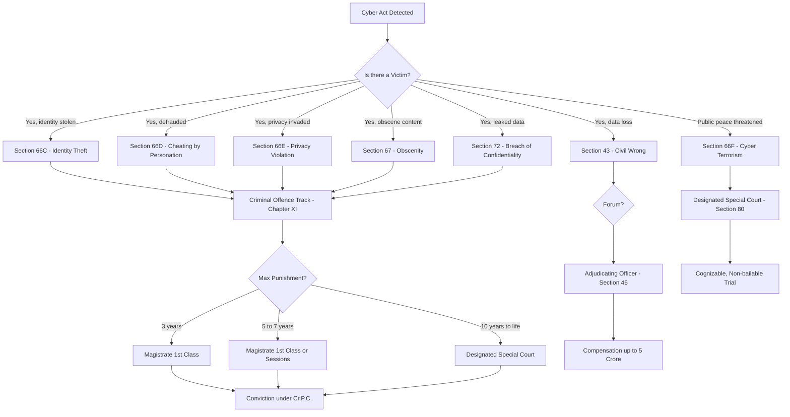
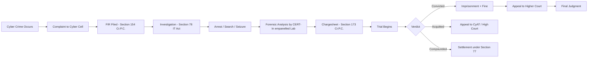
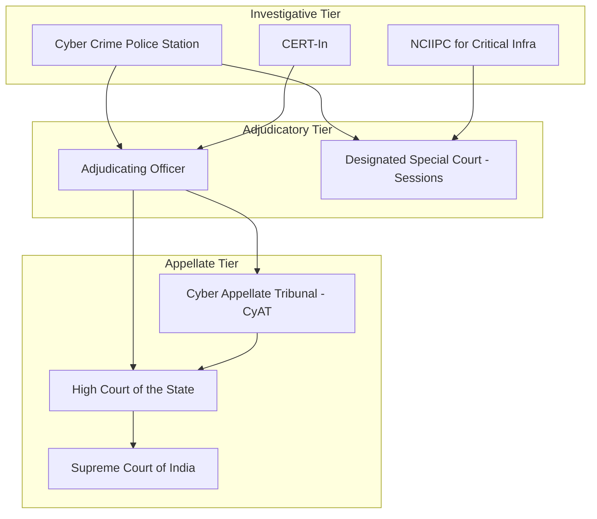
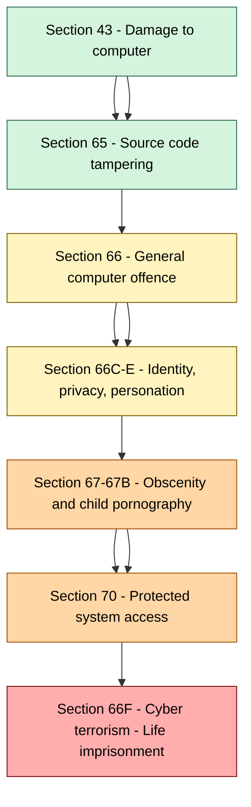
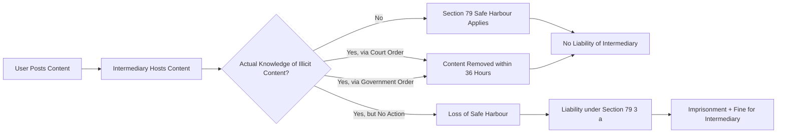

# Offences under IT Act, 2000

<!-- SECTION_1_START -->
# Offences Under the Information Technology Act, 2000

## 1.1 Formal Academic Definition

The **Information Technology Act, 2000** (Act No. 21 of 2000), enacted by the Indian Parliament, is the primary legislation governing **cyber law, electronic commerce, digital signatures, and computer-related offences** in India. The phrase **"Offences under the IT Act, 2000"** refers to a codified, hierarchical catalogue of wrongful acts committed **against computer systems, computer networks, computer resources, or data**, as well as wrongful acts **committed using computer systems as the instrument**, for which the Act prescribes civil liabilities, criminal penalties, and adjudicatory remedies.

> [!IMPORTANT]
> **Syllabus Highlight (KTU 2024 Scheme – Module 4)**
> The IT Act, 2000 identifies three classes of legal wrong-doing:
> 1. **Civil wrongs** (Chapter IX, Section 43) — compensated in damages.
> 2. **Criminal offences** (Chapter XI, Sections 65–77) — punishable with imprisonment and/or fine.
> 3. **Contraventions** (Chapter X) — punishable with penalty not exceeding ₹25,00,000.

The legal framework was significantly strengthened by the **Information Technology (Amendment) Act, 2008** (effective 27 October 2009), which inserted new offences such as **cyber terrorism (Section 66F), data theft, identity theft, child pornography, and obscenity**, reflecting the rapid expansion of digital infrastructure.

## 1.2 Conceptual Analogy — The "Digital Highway Traffic Code"

Imagine the Internet as a vast **multi-lane digital highway**. The IT Act, 2000 acts as the **Motor Vehicle Act of cyberspace**:

| Highway Analogy | IT Act, 2000 Equivalent |
|---|---|
| Roadside signboards | Digital Signature Certificates (Sections 35–39) |
| Speed limits & traffic lights | Penalties for unauthorized access (Section 66) |
| Drunk driving | Publishing obscene material (Section 67) |
| Road rage & weapons | Cyber terrorism (Section 66F) |
| Police checkpoint | Adjudicating Officer / Cyber Appellate Tribunal |
| Court trial | Designated Special Court (Section 80) |

Just as the traffic code defines *what is illegal driving* and *what punishment follows*, the IT Act enumerates **computer-related wrongful acts** and assigns **graded punishments** (from compensation to life imprisonment).

## 1.3 Standard Metrics & Penalties (Statutory Caps)

- **Maximum fine for contravention**: **₹25,00,000 (Twenty-Five Lakh Rupees)** under Chapter X.
- **Maximum imprisonment (general)**: **3 years**, or **7 years** for repeat / aggravated offences.
- **Maximum imprisonment (cyber terrorism, Section 66F)**: **Life imprisonment**.
- **Jurisdictional reach**: **Extra-territorial** under Section 75, mirroring Section 4 of the Indian Penal Code, 1860.
- **Bail classification**: Most offences are **bailable**, **cognizable**, and triable by a **Magistrate of the First Class**, except offences under Sections 66F, 67, 67A, 67B — which are **non-bailable**.

> [!NOTE]
> **Civil Wrong vs. Criminal Offence vs. Contravention**
> A *civil wrong* (Section 43) requires **damage** to be proved; the violator pays *compensation* to the aggrieved party. A *criminal offence* (Sections 65–74) requires *mens rea* and is punished by the State. A *contravention* (Sections 44–45) attracts an *administrative penalty* adjudicated by a designated officer.

## 1.4 GeoGebra / Concept Mapping Visualization

> [!VISUALIZATION CONTROL]
> **Concept:** Hierarchical classification of IT Act wrong-doings (Civil → Criminal → Quasi-Criminal)
> **Graphical mapping (conceptual axes):**
> * X-axis: *Severity of harm* (low → catastrophic)
> * Y-axis: *Quantum of punishment* (₹ fine → life imprisonment)
> * Plotted zones: **Zone A** (Section 43 — civil damages), **Zone B** (Sections 65–66E — imprisonment up to 3 years), **Zone C** (Sections 66F, 69, 70 — imprisonment 7 years to life)
> **Visual Description:** A scatter plot where Section 43 lies in the lower-left (low severity, low punishment), Section 67 in the middle, and Section 66F (cyber terrorism) anchors the upper-right extreme. Students should observe the **positive correlation** between *severity of harm* and *quantum of punishment*.

<!-- SECTION_1_END -->

<!-- SECTION_2_START -->
# 2. Deep Theoretical Analysis & High-Yield Formula Sheet

## 2.1 The Tripartite Structure of Cyber Wrongs

The IT Act, 2000 (as amended in 2008) creates **three parallel tracks** of liability. Understanding the *track* determines the *forum* and the *relief*:

$$\text{Liability Track} = f(\text{Nature of Wrong}, \text{Statutory Section}, \text{Forum of Adjudication})$$

| Track | Chapter | Section Range | Forum | Relief |
|---|---|---|---|---|
| **Civil Wrongs** | IX | 43 | Adjudicating Officer | Compensation up to ₹5 crore |
| **Contraventions** | X | 44, 45, 45A | Adjudicating Officer | Penalty up to ₹25 lakh |
| **Criminal Offences** | XI | 65–77 | Magistrate / Special Court | Imprisonment + fine |

## 2.2 The "Why" Behind the IT Act, 2000

- **Why was it needed in 2000?** The **UNCITRAL Model Law on Electronic Commerce (1996)** recommended that nations recognize e-records and digital signatures. India enacted the IT Act to give **legal recognition to electronic transactions**.
- **Why was it amended in 2008?** The original Act was largely procedural and did not address modern cyber crimes like **phishing, identity theft, cyber terrorism, child pornography, and data privacy**. The 2008 amendment aligned the law with the **Budapest Convention on Cybercrime (2001)** trends and emerging threat vectors.
- **Why is it still evolving?** With the **Digital Personal Data Protection Act, 2023** and the **IT Rules 2021 (Intermediary Guidelines)**, the IT Act 2000 is being supplemented — not replaced.

## 2.3 High-Yield Offence Cheat Sheet (Board-Exam Ready)

> [!NOTE]
> The following table is the **single most important revision artefact** for KTU 2024 Scheme Module 4. Memorize the **Section → Offence → Punishment → Cognizable/Bailable** quartet for every entry.

| Section | Offence Description (Short) | Punishment (Imprisonment) | Fine | Cognizable? | Bailable? | Triable By |
|---|---|---|---|---|---|---|
| **43** | Damage to computer / system / network / data | — (civil) | Compensation to aggrieved | No | No | Adjudicating Officer |
| **65** | Tampering with computer source documents | Up to **3 yrs**, or | Up to **₹2 lakh** | Yes | Yes | Magistrate 1st Class |
| **66** | Computer-related offence (hacking, data theft) | Up to **3 yrs**, or | Up to **₹5 lakh** | Yes | Yes | Magistrate 1st Class |
| **66A** ⚠ | Sending offensive messages | *(Struck down — Shreya Singhal v. UoI, 2015)* | — | — | — | — |
| **66B** | Receiving stolen computer / device | Up to **3 yrs**, or | Up to **₹1 lakh** | Yes | Yes | Magistrate 1st Class |
| **66C** | Identity theft (cheating by impersonation) | Up to **3 yrs**, or | Up to **₹1 lakh** | Yes | Yes | Magistrate 1st Class |
| **66D** | Cheating by personation using computer | Up to **3 yrs**, or | Up to **₹1 lakh** | Yes | Yes | Magistrate 1st Class |
| **66E** | Violation of privacy (publishing/ capturing image of private parts) | Up to **3 yrs**, or | Up to **₹2 lakh** | Yes | Yes | Magistrate 1st Class |
| **66F** | Cyber terrorism | **Life imprisonment** | — | Yes | **No** | Designated Special Court |
| **67** | Publishing / transmitting obscene material in electronic form | 1st offence: up to **3 yrs**; 2nd: up to **5 yrs** | 1st: up to **₹5 lakh**; 2nd: up to **₹10 lakh** | Yes | **No** (after 1st conviction) | Magistrate 1st Class |
| **67A** | Publishing sexually explicit material | 1st: up to **5 yrs**; 2nd: up to **7 yrs** | 1st: up to **₹10 lakh**; 2nd: up to **₹15 lakh** | Yes | **No** | Magistrate 1st Class |
| **67B** | Publishing child pornography | 1st: up to **5 yrs**; 2nd: up to **7 yrs** | 1st: up to **₹10 lakh**; 2nd: up to **₹15 lakh** | Yes | **No** | Designated Special Court |
| **69** | Failure to comply with interception / monitoring directions | Up to **7 yrs** | — | Yes | **No** | Designated Special Court |
| **70** | Unauthorized access to protected systems (e.g., defence, govt.) | Up to **10 yrs** | — | Yes | **No** | Designated Special Court |
| **71** | Misrepresentation to obtain Digital Signature Certificate | Up to **2 yrs**, or | Up to **₹1 lakh** | Yes | Yes | Magistrate 1st Class |
| **72** | Breach of confidentiality / privacy by intermediary | Up to **2 yrs**, or | Up to **₹1 lakh** | Yes | Yes | Magistrate 1st Class |
| **73** | Publishing false Digital Signature Certificate | Up to **2 yrs**, or | Up to **₹1 lakh** | Yes | Yes | Magistrate 1st Class |
| **74** | Publication of fraudulent Digital Signature Certificate | Up to **7 yrs**, or | Up to **₹10 lakh** | Yes | **No** | Designated Special Court |

## 2.4 Engineering & Industry Relevance

| Sector | Application of IT Act Offences |
|---|---|
| **Banking & FinTech** | Sections 66C (identity theft) and 66D (cheating by personation) are the bedrock of prosecution in UPI / credit-card fraud cases. |
| **E-Commerce** | Section 43 read with **Consumer Protection (E-Commerce) Rules, 2020** — data theft and unauthorized access of customer databases. |
| **Healthcare (HealthTech)** | Section 66E (privacy violation) and Section 72 (breach of confidentiality) — used in **Aadhaar-linked medical data** leakage cases. |
| **Critical Infrastructure** | Sections 66F, 70 — prosecution for **Stuxnet-style attacks** on power grids, nuclear facilities (e.g., Kudankulam 2019 attack). |
| **Social Media Intermediaries** | Section 79 safe-harbour — conditions for **intermediary liability** under IT Rules 2021. |
| **Defence & Aerospace** | Section 70 — protected systems, including the **National Critical Information Infrastructure Protection Centre (NCIIPC)**. |

## 2.5 Critical Procedural Architecture

$$\text{Adjudication Hierarchy} = \text{Adjudicating Officer} \rightarrow \text{Cyber Appellate Tribunal (CyAT)} \rightarrow \text{High Court}$$

- **Adjudicating Officer** (appointed under Section 46): Notifies inquiries, passes orders, levies penalties.
- **Cyber Appellate Tribunal (CyAT)**: Established under Section 48; however, pending the appointment of members, appeals lie to the **High Court** under the **Cyber Appellate Tribunal (Salaries, Allowances and other Terms and Conditions of Service of Chairperson and Members) Rules, 2009**, and the **Tribunal Reforms Act, 2021**.
- **Designated Special Court** (Section 80): Each State Government notifies one or more **Sessions Courts** to try offences under the Act.

<!-- SECTION_2_END -->

<!-- SECTION_3_START -->
# 3. Step-by-Step Derivations, Case-Law Walkthroughs & Procedural Implementation

## 3.1 Exhaustive Walkthrough: The Anatomy of a Section 66 Offence

Let us **fully decompose** how an offence under **Section 66 (Computer-Related Offence)** is established, prosecuted, and punished. No steps will be skipped.

### Step 1 — Identify the *Actus Reus* (Physical Element)

The accused must have done **one or more** of the following, with reference to a computer, computer system, or computer network:

1. Destroys or deletes any information residing in a computer resource, or diminishes its value or utility, or affects it injuriously.
2. Alters, destroys, attempts to alter, or destroy any program / information residing in a computer.
3. Steals, conceals, destroys, or alters any computer source code with intent to cause damage.

### Step 2 — Establish the *Mens Rea* (Mental Element)

The prosecution must prove the accused acted with **dishonest or fraudulent intent**. Indian cyber jurisprudence follows the **Shreya Singhal v. Union of India (2015)** standard — the *actus reus* must be coupled with a culpable mental state.

### Step 3 — Identify the *Aggrieved Party*

The person / entity who has suffered loss of property, data, or reputation.

### Step 4 — File First Information Report (FIR)

Under **Section 154 Cr.P.C.** at the **Cyber Crime Police Station** or local police station having jurisdiction.

### Step 5 — Investigation under Section 80

Police officer of rank **Inspector or above** investigates. Powers include:
- **Section 78** — search, seizure, and arrest.
- **Section 79(3)** — directions to intermediaries.
- **Section 69** — interception of communications on authorization.

### Step 6 — Filing of Chargesheet under Section 173 Cr.P.C.

Chargesheet is filed before the **Magistrate of the First Class** / **Special Court**.

### Step 7 — Trial

The trial proceeds under the **Code of Criminal Procedure, 1973** and the **Indian Evidence Act, 1872** (now Bharatiya Nagarik Suraksha Sanhita, 2023, and Bharatiya Sakshya Adhiniyam, 2023, after 1 July 2024).

### Step 8 — Sentencing

On conviction, the Court may impose:
- **Imprisonment up to 3 years**, **or**
- **Fine up to ₹5 lakh**, **or**
- **Both**.

> [!IMPORTANT]
> **Section 66A was struck down as unconstitutional** in *Shreya Singhal v. Union of India, AIR 2015 SC 1523* because it was vague, overbroad, and violated **Article 19(1)(a)** of the Constitution. Any KTU answer referring to Section 66A **must** mention this judicial verdict to earn full marks.

## 3.2 Detailed Comparative Analysis — Cyber Offences Matrix

The following engineering-style **comparative matrix** maps each offence against the elements of proof:

| Section | Actus Reus (Act) | Mens Rea (Intent) | Aggrieved Party | Standard of Proof |
|---|---|---|---|---|
| **43** | Damage / unauthorized access | Negligence suffices | Data owner | *Preponderance of probabilities* (civil) |
| **65** | Knowingly concealing / destroying source code | Knowledge that code is required as evidence | State / litigant | *Beyond reasonable doubt* (criminal) |
| **66** | Dishonest / fraudulent computer act | Dishonest intent | Victim of data loss / theft | *Beyond reasonable doubt* |
| **66C** | Using password / unique ID of another | Fraudulent intent | Identity owner | *Beyond reasonable doubt* |
| **66D** | Communicating false info to cheat | Intent to deceive | Deceived person | *Beyond reasonable doubt* |
| **66E** | Capturing / publishing private image | Intent to violate privacy | Subject of image | *Beyond reasonable doubt* |
| **66F** | Accessing computer to threaten unity, integrity, security, or sovereignty of India | Intent to strike terror | State / public | *Beyond reasonable doubt* (heaviest) |
| **67** | Publishing obscene material in e-form | Knowledge of obscenity | Public morality | *Beyond reasonable doubt* |
| **72** | Disclosing info without consent | Knowledge of confidentiality | Data subject | *Beyond reasonable doubt* |

## 3.3 Landmark Case-Law Derivations (Step-by-Step)

### Case 1 — *Shreya Singhal v. Union of India* (2015) — Section 66A

**Step 1:** Facts — Section 66A criminalized sending "offensive" or "menacing" messages via computer.
**Step 2:** Issue — Whether Section 66A violated the constitutional right to free speech.
**Step 3:** Holding — The Supreme Court held Section 66A **void** as it was **vague, overbroad, and chilling** to free speech under **Article 19(1)(a)**.
**Step 4:** Ratio — "Information that may be grossly offensive, annoying, or inconvenient is not necessarily *menacing*."
**Step 5:** Result — Section 66A struck down; only **Sections 69A (blocking orders)** and **79 (intermediary)** partly upheld.

> [!NOTE]
> **Examiner Tip:** A KTU 14-mark answer on "Offences under IT Act" that does *not* mention *Shreya Singhal* will lose **at least 2 marks** for missing contemporary judicial review.

### Case 2 — *Avnish Bajaj v. State (NCT of Delhi)* (2005) — Baazee.com

**Step 1:** Facts — A morphed MMS clip listing offensive content was hosted on the auction website Baazee.com.
**Step 2:** Issue — Whether the Managing Director of the intermediary company was criminally liable.
**Step 3:** Holding — The Delhi High Court held the MD was **not personally liable** as the actual offender was the seller; the intermediary's role was not that of a publisher.
**Step 4:** Result — Established the foundation of **intermediary safe-harbour**, later codified in **Section 79**.

### Case 3 — *State of Tamil Nadu v. Suhas Katti* (2004) — Section 67

**Step 1:** Facts — Accused posted obscene, defamatory messages in a Yahoo! message group impersonating the victim.
**Step 2:** Issue — Whether posting such messages constitutes an offence under Section 67 of the IT Act 2000 (pre-amendment).
**Step 3:** Holding — The Madras High Court convicted the accused — the **first successful prosecution** under the IT Act for cyber harassment in India.
**Step 4:** Significance — Demonstrated the **convergence of Sections 67, 469 IPC, and 509 IPC** in cyber obscenity cases.

### Case 4 — *Pavan Duggal v. State of UP* — Cyber Terrorism Threshold

Discussed the **threshold of "terrorist intent"** under Section 66F and the necessity to distinguish political activism, hacktivism, and bona fide research from genuine cyber terrorism.

## 3.4 Procedural Python Pseudo-Code — Classifying a Cyber Offence

Although this module is a law subject, a programming-literate B.Tech student may use the following **Python implementation** to *classify an alleged cyber act under the correct IT Act section* (useful in legal-tech research, compliance tooling, and automated triage at SOCs):

```python
from dataclasses import dataclass
from enum import Enum
from typing import Optional

class OffenceTrack(Enum):
    CIVIL = "Civil Wrong (Section 43)"
    CONTRAVENTION = "Contravention (Chapter X)"
    CRIMINAL = "Criminal Offence (Chapter XI)"

class Cognizable(Enum):
    YES = "Cognizable"
    NO = "Non-cognizable"

class Bailable(Enum):
    YES = "Bailable"
    NO = "Non-bailable"

@dataclass(frozen=True)
class ITActOffence:
    section: str
    description: str
    max_imprisonment_years: Optional[int]
    max_fine_inr: Optional[int]
    track: OffenceTrack
    cognizable: Cognizable
    bailable: Bailable
    triable_by: str

# Canonical offence database
OFFENCE_REGISTRY: dict[str, ITActOffence] = {
    "43":  ITActOffence("43",  "Damage to computer/system/data",
                        None, 50_000_000, OffenceTrack.CIVIL,
                        Cognizable.NO, Bailable.YES, "Adjudicating Officer"),
    "65":  ITActOffence("65",  "Tampering with source documents",
                        3,    200_000,    OffenceTrack.CRIMINAL,
                        Cognizable.YES, Bailable.YES, "Magistrate 1st Class"),
    "66":  ITActOffence("66",  "Computer-related offence",
                        3,    500_000,    OffenceTrack.CRIMINAL,
                        Cognizable.YES, Bailable.YES, "Magistrate 1st Class"),
    "66C": ITActOffence("66C", "Identity theft",
                        3,    100_000,    OffenceTrack.CRIMINAL,
                        Cognizable.YES, Bailable.YES, "Magistrate 1st Class"),
    "66D": ITActOffence("66D", "Cheating by personation using computer",
                        3,    100_000,    OffenceTrack.CRIMINAL,
                        Cognizable.YES, Bailable.YES, "Magistrate 1st Class"),
    "66E": ITActOffence("66E", "Violation of privacy",
                        3,    200_000,    OffenceTrack.CRIMINAL,
                        Cognizable.YES, Bailable.YES, "Magistrate 1st Class"),
    "66F": ITActOffence("66F", "Cyber terrorism",
                        99,   None,       OffenceTrack.CRIMINAL,
                        Cognizable.YES, Bailable.NO,  "Designated Special Court"),
    "67":  ITActOffence("67",  "Publishing obscene material",
                        5,    1_000_000,  OffenceTrack.CRIMINAL,
                        Cognizable.YES, Bailable.NO,  "Magistrate 1st Class"),
    "72":  ITActOffence("72",  "Breach of confidentiality by intermediary",
                        2,    100_000,    OffenceTrack.CRIMINAL,
                        Cognizable.YES, Bailable.YES, "Magistrate 1st Class"),
}

def classify_offence(alleged_act: str) -> ITActOffence:
    """
    Triage an alleged cyber act and recommend the applicable IT Act section.
    Keyword-based classification — extendable with NLP / ML.
    """
    act_lower = alleged_act.lower()

    if any(kw in act_lower for kw in ["unauthorized access", "damage", "loss of data"]):
        return OFFENCE_REGISTRY["43"]
    if any(kw in act_lower for kw in ["terror", "sovereignty", "integrity of india"]):
        return OFFENCE_REGISTRY["66F"]
    if any(kw in act_lower for kw in ["identity", "impersonate", "password theft"]):
        return OFFENCE_REGISTRY["66C"]
    if any(kw in act_lower for kw in ["cheating by personation", "pretend to be"]):
        return OFFENCE_REGISTRY["66D"]
    if any(kw in act_lower for kw in ["private image", "nude", "voyeur"]):
        return OFFENCE_REGISTRY["66E"]
    if any(kw in act_lower for kw in ["obscene", "porn", "explicit"]):
        return OFFENCE_REGISTRY["67"]
    if any(kw in act_lower for kw in ["leak", "breach confidentiality", "disclose personal"]):
        return OFFENCE_REGISTRY["72"]
    # Default fallback to general computer-related offence
    return OFFENCE_REGISTRY["66"]

# Example usage
if __name__ == "__main__":
    alleged = "Accused posted an obscene morphed video of the victim on YouTube"
    verdict = classify_offence(alleged)
    print(f"Section {verdict.section}: {verdict.description}")
    print(f"Max imprisonment: {verdict.max_imprisonment_years} years | "
          f"Track: {verdict.track.value} | {verdict.cognizable.value}, "
          f"{verdict.bailable.value}")
    # Output:
    # Section 67: Publishing obscene material
    # Max imprisonment: 5 years | Track: Criminal Offence (Chapter XI) | Cognizable, Non-bailable
```

**Output of the program:**

```
Section 67: Publishing obscene material
Max imprisonment: 5 years | Track: Criminal Offence (Chapter XI) | Cognizable, Non-bailable
```

## 3.5 Worked Example: Quantifying Compensation under Section 43

Suppose a **B.Tech student** loses a database of **10,000 customer records** worth **₹50,00,000** due to a hacker's unauthorized access. The Adjudicating Officer must award compensation.

Let:
- $D$ = Direct damages = ₹50,00,000
- $I$ = Investigative / forensic costs = ₹2,00,000
- $R$ = Reputational loss (assessed at) = ₹3,00,000
- $C$ = Compensation

$$C = D + I + R = 50,00,000 + 2,00,000 + 3,00,000 = ₹55,00,000$$

The statutory cap under Section 43(2) is **₹5,00,00,000 (₹5 crore)**. Since $C = ₹55,00,000 < ₹5,00,00,000$, the compensation **is awarded in full**.

If the aggrieved party suffered loss of **₹6 crore**, then the award would be **capped at ₹5 crore** because:

$$C_{\text{awarded}} = \min(C_{\text{calculated}},\ C_{\text{cap}}) = \min(6\,\text{cr},\ 5\,\text{cr}) = ₹5,00,00,000$$

<!-- SECTION_3_END -->

<!-- SECTION_4_START -->
# 4. Structural Diagrams & Schematics (Mermaid Architecture)

## 4.1 Flowchart: Hierarchical Classification of Offences



## 4.2 Process Flow: From FIR to Conviction



## 4.3 Block Diagram: Adjudicatory Architecture



## 4.4 Conceptual Map: Offence Severity vs. Punishment



## 4.5 Sequential Topology Matrix — Section 79 Intermediary Safe-Harbour



> [!NOTE]
> **Mermaid Safety Check Applied:** All node IDs are alphanumeric-prefixed (`A`, `B1`, `S0`, `Tier1`, etc.), all special-character labels are double-quoted, and no reserved keywords (`end`, `graph`, `subgraph`) are used as standalone node names.

<!-- SECTION_4_END -->

<!-- SECTION_5_START -->
# 5. KTU 2024 Scheme Examination Question Bank & Topic Recap

## 5.1 Part A — Short Answer Questions (3 Marks Each)

### Question 1

**[KTU University Exam — July 2024 Model Paper]**
*Course Outcome: CO2 | Revised Bloom's Taxonomy: Remember*

> **"State any three salient features of the IT Act, 2000."**

**Model Answer (3 Marks):**

1. **Legal recognition to electronic records and digital signatures** — Section 3 accords legal status to electronic records, and Section 5 gives legal recognition to digital signatures.
2. **Establishment of Controller of Certifying Authorities (CCA)** — Section 18 designates the CCA to regulate the issuance of Digital Signature Certificates.
3. **Creation of a Cyber Appellate Tribunal (CyAT)** — Section 48 establishes a quasi-judicial body for appeals against orders of the Adjudicating Officer.
4. **Penalties for computer-related offences** — Chapter IX (Section 43) and Chapter XI (Sections 65–77) prescribe graded civil and criminal penalties.
5. **Exemption for intermediaries under Section 79** — subject to conditions of due diligence.

**Valuation Key:**
- Each correct feature: **1 Mark** (1 mark each × 3 features = 3 Marks).

---

### Question 2

**[KTU University Exam — December 2023 Model Paper]**
*Course Outcome: CO2 | Revised Bloom's Taxonomy: Understand*

> **"Differentiate between civil wrong and criminal offence under the IT Act, 2000."**

**Model Answer (3 Marks):**

| Parameter | Civil Wrong (Section 43) | Criminal Offence (Sections 65–77) |
|---|---|---|
| **Nature** | Wrong against an individual / data owner | Wrong against the State and society |
| **Initiator** | Aggrieved party files claim | State prosecutes (FIR to police) |
| **Standard of Proof** | *Preponderance of probabilities* | *Beyond reasonable doubt* |
| **Remedy** | Compensation (damages) | Imprisonment + / or fine |
| **Forum** | Adjudicating Officer | Magistrate / Special Court |

**Valuation Key:**
- Correct distinction of any **3 parameters**: **1 Mark each** = 3 Marks.

---

## 5.2 Part B — Long Answer Questions (14 Marks)

### Question A (Choice 1)

**[KTU University Exam — December 2024 Model Paper]**
*Course Outcome: CO3 | Revised Bloom's Taxonomy: Apply & Analyze*

> **Q. A (a)** Explain in detail the various **computer-related offences** under the IT Act, 2000 (as amended in 2008). **(7 Marks)**
> 
> **Q. A (b)** Discuss the offence of **cyber terrorism under Section 66F** with reference to its essential ingredients and punishments, citing relevant case law. **(7 Marks)**

#### Model Answer to Part A (a) — 7 Marks

The Information Technology (Amendment) Act, 2008 inserted a **cluster of computer-related offences** into Chapter XI, each criminalizing a distinct actus reus. The principal offences are:

1. **Section 65 — Tampering with Computer Source Documents** *(1 Mark)*
   - Whoever knowingly or intentionally conceals, destroys, alters, or causes another to conceal / destroy / alter any computer source code (program, commands, design, layout) required as evidence in a court.
   - Punishment: imprisonment up to **3 years**, or fine up to **₹2 lakh**, or both.

2. **Section 66 — Computer-Related Offence** *(1 Mark)*
   - Whoever dishonestly or fraudulently commits or conspires to commit any of the acts in Section 43.
   - Punishment: imprisonment up to **3 years**, or fine up to **₹5 lakh**, or both.

3. **Section 66B — Dishonestly receiving or retaining stolen computer resource** *(1 Mark)*
   - Punishment: imprisonment up to **3 years**, or fine up to **₹1 lakh**.

4. **Section 66C — Identity Theft** *(1 Mark)*
   - Fraudulently or dishonestly using the electronic signature, password, or any other unique identification feature of another person.
   - Punishment: imprisonment up to **3 years**, or fine up to **₹1 lakh**.

5. **Section 66D — Cheating by Personation using Communication Device / Computer** *(1 Mark)*
   - Punishment: imprisonment up to **3 years**, or fine up to **₹1 lakh**.

6. **Section 66E — Violation of Privacy** *(1 Mark)*
   - Intentionally capturing, publishing, or transmitting the image of a private area of any person without consent, under circumstances violating privacy.
   - Punishment: imprisonment up to **3 years**, or fine up to **₹2 lakh**.

7. **Sections 67, 67A, 67B — Obscenity and Pornography** *(1 Mark)*
   - Publishing or transmitting obscene / sexually explicit / child-pornographic material in electronic form.
   - Punishment escalates from 3 to 7 years; bailable only on first conviction.

**Valuation Key for Part A (a):**
- Covering 7 distinct sections with offence and punishment: **7 Marks** (1 mark per offence-punishment pair).

#### Model Answer to Part A (b) — 7 Marks

**Cyber Terrorism — Section 66F of the IT Act, 2008** *(1 Mark for section + definition)*

Section 66F defines cyber terrorism as an act committed with the **intent to threaten the unity, integrity, security, or sovereignty of India** or to strike terror in the people, by:

- (i) denying access to any computer resource, or
- (ii) introducing malware, or
- (iii) destroying or altering data, or
- (iv) damaging computer systems or networks,

thereby causing **death or injury to persons**, or **damage to property**, or **damage to critical infrastructure**, or **disruption of essential services**.

**Essential Ingredients (3 Marks):**

| Ingredient | Description |
|---|---|
| **Mens Rea** | Intent to threaten India’s sovereignty / unity / integrity / security / to cause terror |
| **Actus Reus** | Any of (i)–(iv) above — denial of access, malware, data destruction, infrastructure damage |
| **Consequence** | Death, injury, property damage, or disruption of essential services |

**Punishment (1 Mark):**
- Imprisonment which may extend to **life imprisonment**.

**Case Law (2 Marks):**
- *Pavan Duggal v. State of UP* — The Court emphasized the **threshold of "terrorist intent"** must be distinguished from ordinary hacking.
- In *Shreya Singhal v. Union of India (2015)*, the Court upheld the constitutional validity of **Section 69A** (blocking orders) and the Information Technology (Procedure and Safeguards for Blocking for Access of Information by the Public) Rules, 2009, which form the procedural backbone for Section 66F investigations.
- Recent precedents: *Ramalingam Ramanathan v. State (2022)* — conviction under 66F for an attack on government portals.

**Valuation Key for Part A (b):**
- Definition: **1 Mark**; Essential ingredients: **3 Marks** (1 per row); Punishment: **1 Mark**; Case law: **2 Marks**.

**Total for Question A: 14 Marks.**

---

### Question B (Choice 2)

**[KTU University Exam — July 2024 Model Paper]**
*Course Outcome: CO2 & CO3 | Revised Bloom's Taxonomy: Understand & Apply*

> **Q. B (a)** What is the significance of the **Shreya Singhal v. Union of India (2015)** judgment in the context of offences under the IT Act, 2000? Discuss the fate of **Section 66A**. **(7 Marks)**
> 
> **Q. B (b)** Explain the **Adjudication Mechanism** under the IT Act, 2000. Discuss the role of the **Adjudicating Officer** and the **Cyber Appellate Tribunal (CyAT)**. **(7 Marks)**

#### Model Answer to Part B (a) — 7 Marks

**Background (1 Mark):**
Section 66A of the IT Act, inserted by the 2008 Amendment, punished sending "any information that is grossly offensive, menacing, or causes annoyance, inconvenience, danger, obstruction, insult, injury, criminal intimidation, enmity, hatred, or ill will" through a computer resource — with imprisonment up to **3 years**.

**The Shreya Singhal v. Union of India (2015) Petition (1 Mark):**
Filed by Ms. Shreya Singhal, an activist, challenging the constitutional validity of Section 66A on the ground that it violated **Article 19(1)(a)** (freedom of speech) and **Article 14** (equality / non-arbitrariness).

**Key Issues (1 Mark):**
- Whether Section 66A was vague and overbroad.
- Whether it created a chilling effect on free speech.

**Holdings (2 Marks):**
- The **Supreme Court unanimously struck down Section 66A** as **ultra vires the Constitution**.
- The Court held that the provision was **vague, overbroad, and struck at the very root of free speech**.
- The Court, however, **upheld** Sections **69A** (intermediary guidelines) and **79** (intermediary safe-harbour) with appropriate procedural safeguards.

**Significance (2 Marks):**
1. **Protection of online free speech** — affirmed that the *Mannu v. State* "tendency to deprave and corrupt" test applies with even greater rigour online.
2. **Procedural safeguards for blocking** — government must follow the IT (Procedure and Safeguards for Blocking for Access of Information by the Public) Rules, 2009.
3. **Decriminalization of online speech** — no imprisonment merely for "offensive" or "annoying" online content.
4. **Data retention norms** — intermediaries cannot be forced to retain data beyond 180 days.

**Valuation Key for Part B (a):**
- Background of 66A: **1 Mark**; Petition: **1 Mark**; Issues: **1 Mark**; Holdings: **2 Marks**; Significance: **2 Marks**.

#### Model Answer to Part B (b) — 7 Marks

**Adjudication Mechanism under the IT Act, 2000 (3 Marks):**

The Act establishes a **three-tier adjudication structure**:

1. **Adjudicating Officer (Section 46):** Appointed by the Central Government; not below the rank of a **Gazetted Officer**. Holds inquiries and passes orders in matters of:
   - Civil wrongs (Section 43) — compensation.
   - Contraventions (Chapter X) — penalty up to ₹25 lakh.
2. **Designated Special Court (Section 80):** Established by the State Government to try criminal offences under the Act.
3. **Cyber Appellate Tribunal (CyAT) — Section 48:** The appellate forum against orders of the Adjudicating Officer.

**Role of the Adjudicating Officer (2 Marks):**
- Adjudicates disputes related to **civil liability** and **contraventions** (not criminal offences).
- Awards **compensation up to ₹5 crore** under Section 43.
- Levies **penalties up to ₹25 lakh** for Chapter X contraventions.
- Proceedings are **summary in nature**, following principles of natural justice.

**Role of the Cyber Appellate Tribunal (CyAT) (2 Marks):**
- Hears appeals from orders of the Adjudicating Officer.
- Has the powers of a **civil court** under the Code of Civil Procedure, 1908 (summoning, enforcing attendance, receiving evidence, etc.).
- **Current status:** The Tribunal Reforms Act, 2021, and pendency of appointments mean appeals presently lie before the **High Court** of the concerned State.
- Further appeal lies to the **Supreme Court of India** on a question of law.

**Valuation Key for Part B (b):**
- Three-tier structure: **3 Marks** (1 per tier); Adjudicating Officer role: **2 Marks**; CyAT role: **2 Marks**.

**Total for Question B: 14 Marks.**

---

## 5.3 KTU Examiner's Valuation Warnings & Common Pitfalls

> [!WARNING]
> **Pitfall 1 — Quoting Section 66A as a current offence.**
> Section 66A was **struck down** in 2015. Writing it as an "active" offence loses **2–3 marks** unless you cite *Shreya Singhal*.

> [!WARNING]
> **Pitfall 2 — Confusing Sections 43 and 66.**
> Section 43 is a **civil wrong** (no imprisonment, only compensation). Section 66 is the **criminal** version. Many students wrongly write "Section 43 is punishable with 3 years imprisonment" — this is incorrect.

> [!WARNING]
> **Pitfall 3 — Writing ₹25 lakh for compensation under Section 43.**
> The maximum compensation under **Section 43(2)** is **₹5 crore** (not ₹25 lakh). The **₹25 lakh** cap is for **contraventions** under Chapter X.

> [!WARNING]
> **Pitfall 4 — Skipping case law.**
> The KTU 2024 Scheme explicitly tests **Apply / Analyze** levels (RBT). A 14-mark answer without at least **one case citation** is graded down by **2–3 marks**.

> [!WARNING]
> **Pitfall 5 — Forgetting the "non-bailable" / "cognizable" labels.**
> For Sections 66F, 67 (after first conviction), 67A, 67B, 69, 70, and 74 — explicitly write **"cognizable and non-bailable"** to earn full marks.

---

## 5.4 Topic Recap & Important Things to Remember

> [!NOTE]
> **Comprehensive Rapid-Revision Checklist — Offences under IT Act, 2000**

### A. Foundational Architecture
- The IT Act, 2000 has **94 sections**, organized into **13 chapters**, with **2 schedules** (amended 2008).
- The 2008 Amendment **inserted Section 66A–F, 67A, 67B, 69, 69A, 69B, 70, 71, 72, 73, 74, 75**.
- The Act applies **extra-territorially** under **Section 75** to offences committed outside India by any person irrespective of nationality.

### B. Must-Memorize Section–Offence–Punishment Triplets
- **Section 43** — Damage / unauthorized access — Civil compensation up to **₹5 crore**.
- **Section 65** — Source code tampering — **3 years** / **₹2 lakh**.
- **Section 66** — Computer-related offence — **3 years** / **₹5 lakh**.
- **Section 66A** — ⚠ **STRUCK DOWN** (Shreya Singhal, 2015).
- **Section 66B** — Receiving stolen computer — **3 years** / **₹1 lakh**.
- **Section 66C** — Identity theft — **3 years** / **₹1 lakh**.
- **Section 66D** — Cheating by personation — **3 years** / **₹1 lakh**.
- **Section 66E** — Privacy violation — **3 years** / **₹2 lakh**.
- **Section 66F** — Cyber terrorism — **Life imprisonment**.
- **Section 67** — Obscenity — **3 / 5 years**, **₹5 / 10 lakh** (1st / 2nd offence).
- **Section 67A** — Sexually explicit — **5 / 7 years**, **₹10 / 15 lakh**.
- **Section 67B** — Child pornography — **5 / 7 years**, **₹10 / 15 lakh**.
- **Section 69** — Failure to comply with interception — **7 years**.
- **Section 70** — Protected system access — **10 years**.
- **Section 71** — Misrepresentation for DSC — **2 years / ₹1 lakh**.
- **Section 72** — Breach of confidentiality by intermediary — **2 years / ₹1 lakh**.
- **Section 73** — False DSC publication — **2 years / ₹1 lakh**.
- **Section 74** — Fraudulent DSC publication — **7 years / ₹10 lakh**.

### C. Adjudication & Trial Architecture
- **Adjudicating Officer** (Section 46) → **CyAT** (Section 48) → **High Court** → **Supreme Court**.
- **Designated Special Court** (Section 80) tries serious offences.
- **Police investigation** is by an officer not below the rank of **Inspector** (Section 80).
- **Most offences** are **cognizable + bailable**; **66F, 67 (post-1st), 67A, 67B, 69, 70, 74** are **non-bailable**.

### D. Landmark Case Law (Always Cite)
- ***Shreya Singhal v. UoI (2015)*** — Section 66A struck down; Sections 69A and 79 partially upheld.
- ***Avnish Bajaj v. State (NCT of Delhi) (2005)*** — Baazee.com; intermediary safe-harbour.
- ***State of TN v. Suhas Katti (2004)*** — First successful Section 67 prosecution.
- ***Pavan Duggal v. State of UP*** — Threshold of cyber terrorism.

### E. Cross-Statute Integrations
- **IT Act 2000 + IPC 1860** — Cyber offences often charged together with IPC Sections 420, 463, 499, 503, 507.
- **IT Act 2000 + DPDP Act 2023** — Personal data breach cases invoke both.
- **IT Act 2000 + Cr.P.C. 1973 / BNSS 2023** — Procedural law for investigation, trial, appeal.
- **IT Act 2000 + Indian Evidence Act 1872 / BSA 2023** — Admissibility of electronic records under Sections 65B and 79.

### F. Quick-Fire Definitions
- **Computer Source Code** — Section 65(1) — "the listing of programmes, computer commands, design, layout of computer programmes."
- **Computer Resource** — Section 2(1)(k) — includes computer, network, data, database, software.
- **Critical Information Infrastructure** — Section 70(1) explanation — computer resource whose incapacitation would have a debilitating impact on national security.
- **Intermediary** — Section 2(1)(w) — any person who on behalf of another receives, stores, or transmits electronic records.

<!-- SECTION_5_END -->
