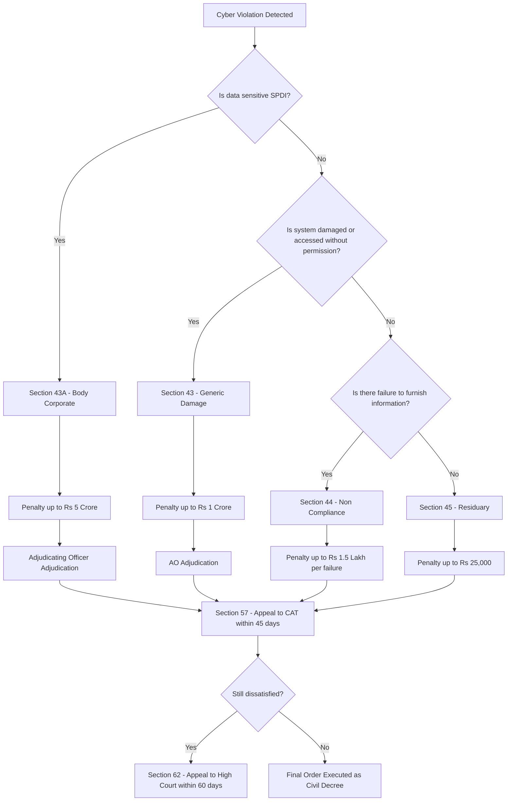
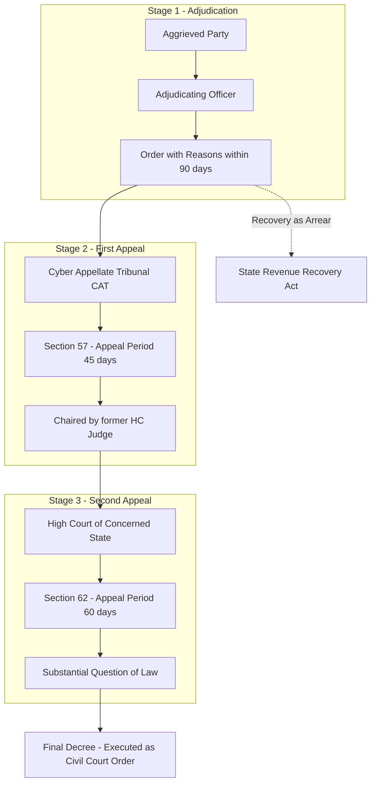
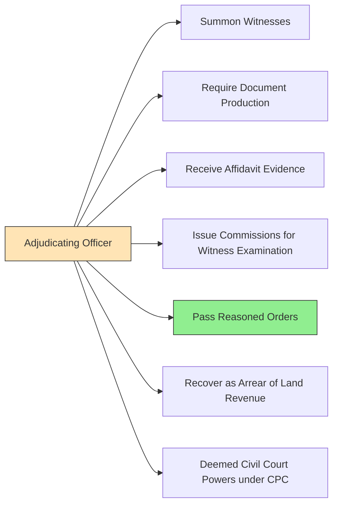
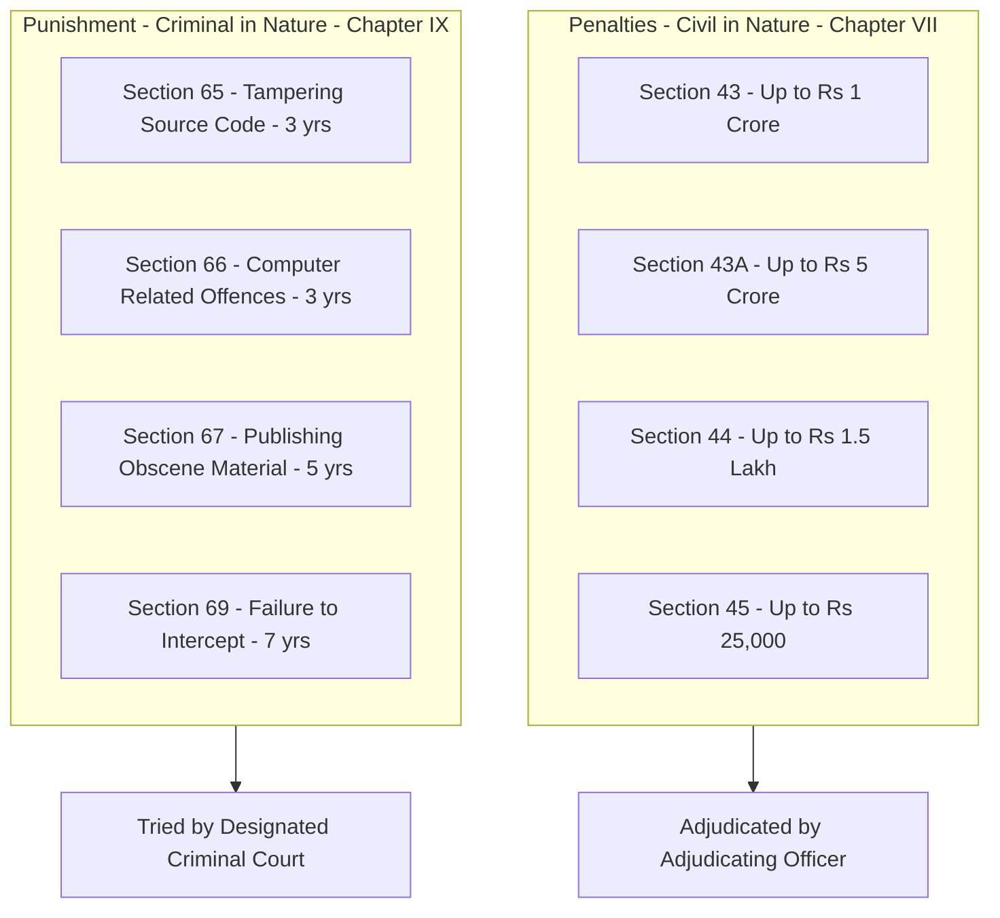
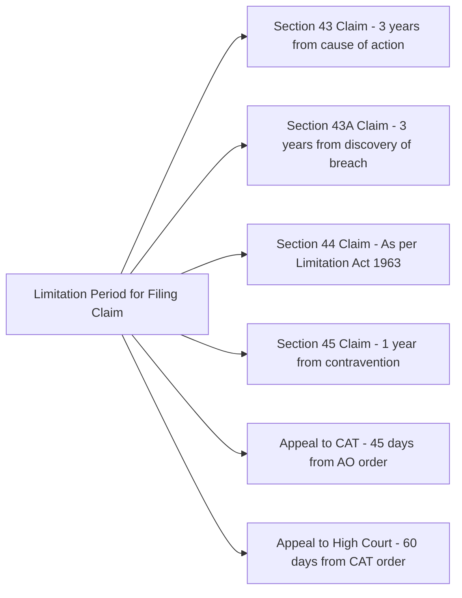

# Penalties, Adjudication and appeals under the IT Act,2000

<!-- SECTION_1_START -->
# Penalties, Adjudication and Appeals under the IT Act, 2000

## 1. Core Definition & Intuitive Overview

### Formal KTU Syllabus Definition
The **Information Technology Act, 2000** (amended in 2008) establishes a comprehensive legal framework for penalising cyber offences, adjudicating disputes, and providing appellate remedies in India. **Chapter VII** (Sections 43–47) of the Act specifies the *penalties and adjudication* structure, while **Chapter VIII** (Sections 48–64) outlines the *cyber appellate procedures and regulatory authorities*.

> [!IMPORTANT]
> **Penalties** are civil in nature (not criminal) — they compensate the victim and deter future violations. **Adjudication** is a quasi-judicial process handled by designated officers (not regular courts), making it faster and more specialised.

> [!NOTE]
> **Penalties ≠ Punishment** — Penalties under the IT Act are monetary in nature (₹ in lakhs), whereas *punishments* are criminal (imprisonment + fine) defined under Sections 65–74 of the IT Act and the Indian Penal Code (IPC) read with IT Act.

### Conceptual Analogy
Think of the IT Act's penalty system as a **three-layered safety net** in a high-rise building:
- **Ground Floor (Section 43)** — minor damages to the structure (penalties up to ₹1 crore)
- **First Floor (Sections 43A–45)** — broader safety violations and residual offences (penalties up to ₹25 lakh / ₹5 crore depending on nature)
- **Second Floor (Sections 46–64)** — the **judge's chamber** and **elevator to higher court** (Adjudication + Appeals), where disputes are heard and reviewed.

> [!TIP]
> **Mnemonic for remembering penalties:** **"D-F-M-R"** → **D**amage (Sec 43), **F**ailure to protect data (Sec 43A), **M**iscellaneous non-compliance (Sec 44), **R**esiduary (Sec 45).

### Key Authorities Established
- **Controller of Certifying Authorities (CCA)** — under Section 17
- **Adjudicating Officer** — under Section 52
- **Cyber Appellate Tribunal (CAT)** — under Section 55 (now replaced by **Telecom Disputes Settlement and Appellate Tribunal – TDSAT** after the 2008 amendment)

---

## 2. Scope of the Module
This module addresses four critical learning vectors aligned with **PECST419 / Module 4 / CO3–CO4**:

| Vector | Coverage |
|---|---|
| **Penalties** | Sections 43, 43A, 44, 45, 47 |
| **Adjudication** | Sections 46, 52, 53, 54 |
| **Appeals** | Sections 55–64 |
| **Offences & Penalties** | Distinction between civil penalty and criminal punishment |

> [!VISUALIZATION CONTROL]
> **Concept:** Hierarchical flow of legal remedy under the IT Act, 2000
> **GeoGebra / Desmos Input Equations (for structure):**
> * $y = f(x)$ where $f$ = level of offence severity
> * $x = 1$ (Penalty), $x = 2$ (Adjudication), $x = 3$ (Appeal)
> **Visual Description:** A vertical bar chart where the height of each bar represents the monetary quantum of the penalty. The bars ascend from ₹1 lakh (Sec 44) to ₹5 crore (Sec 43A data breach), demonstrating the *escalation* logic in the statute.
<!-- SECTION_1_END -->

<!-- SECTION_2_START -->
# Deep Theoretical Analysis & KTU High-Yield Formula Sheet

## 1. Section 43 — Penalty for Damage to Computer, Computer System, etc.
This is the **most invoked** section for civil cyber claims in India.

### Sub-sections & Corresponding Penalties
| Sub-section | Nature of Violation | Maximum Penalty |
|---|---|---|
| **43(a)** | Accessing a secure computer system **without permission** | Up to ₹1 Crore |
| **43(b)** | Downloading/copying/extracting data without consent | Up to ₹1 Crore |
| **43(c)** | Introducing or spreading a **virus / contaminant** | Up to ₹1 Crore |
| **43(d)** | Damaging or disrupting any computer system | Up to ₹1 Crore |
| **43(e)** | Denying access to an authorised user (DoS attack) | Up to ₹1 Crore |
| **43(f)** | Providing assistance to any unauthorised person | Up to ₹1 Crore |
| **43(g)** | Charging for services availed by theft of computer resource | Up to ₹1 Crore |
| **43(h)** | Destroying/deleting/altering any information residing in a computer | Up to ₹1 Crore |
| **43(i)** | Stealing/secretly intercepting / accessing data | Up to ₹1 Crore |

> [!IMPORTANT]
> **Quantum Rule:** The aggrieved party **may claim compensation not exceeding ₹1 crore** OR the actual damage, whichever is lower. The Adjudicating Officer determines the final amount.

---

## 2. Section 43A — Compensation for Failure to Protect Data
Inserted by the **IT (Amendment) Act, 2008**, this section is the **data breach liability provision**.

### Key Conditions
- Applies to a **body corporate** (company) that
- **Owns, controls, or processes** *sensitive personal data* (defined under Section 43A read with SPDI Rules, 2011)
- **Negligently** fails to implement **reasonable security practices**
- Causes **wrongful loss or wrongful gain** to any person

### Penalty Quantum
**Up to ₹5 Crore (₹50 million)** — payable to the affected person(s) as compensation.

### Compliance Checklist (Reasonable Security Practices)
- ISO/IEC 27001 certification
- Privacy policy published on the website
- Explicit consent-based data collection
- Periodic audits and vulnerability assessments

---

## 3. Section 44 — Penalty for Failure to Furnish Information / Return
- Applies to persons who fail to **provide documents, returns, or information** required under the Act or Rules to the **Controller or any other authorised agency**.
- **Penalty:** Up to **₹1,50,000 (₹1.5 lakh)** for each failure.

> [!NOTE]
> **Punishment under Section 44 vs. Penalty:** While the *penalty* is civil, the *punishment* for repeated failure can be **imprisonment up to 3 years or fine up to ₹2 lakh** under Section 69(8).

---

## 4. Section 45 — Residuary Penalty
- A **catch-all** provision.
- Whoever contravenes **any rule or regulation** made under the Act for which **no separate penalty is provided** shall be liable.
- **Penalty:** Up to **₹25,000 (twenty-five thousand rupees)**.

> [!TIP]
> This section is the **last-resort clause** of Chapter VII — applied when no specific section covers the violation.

---

## 5. Section 47 — Compensation under Section 43 to be Adjudged by Adjudicating Officer
- All claims under Section 43 must be filed **before the Adjudicating Officer**, not in a civil court.
- The officer passes orders based on the evidence presented.
- The officer's order is **appealable** to the **Cyber Appellate Tribunal (CAT)** — now **TDSAT** post-2008 amendment.

---

## 6. Sections 46–51 — Procedural & Investigative Framework
| Section | Function |
|---|---|
| **46** | Power of the **Controller of Certifying Authorities** to investigate and adjudicate contraventions |
| **47** | Compensation orders by Adjudicating Officer |
| **48** | Appellate Tribunal (now renamed **Cyber Appellate Tribunal / CAT**) |
| **49** | Application of the **Indian Evidence Act, 1872** and **Bankers' Books Evidence Act, 1891** to digital records |
| **50** | Section 50 of the **Indian Evidence Act** to be interpreted to include electronic records as evidence |
| **51** | Punishment for tampering with computer source documents |

---

## 7. Adjudication Process — Sections 52, 53, 54

### Section 52 — Appointment of Adjudicating Officer
- The **Central Government** appoints officers not below the rank of **Joint Secretary to the Government of India** as Adjudicating Officers.
- They hold office for a term of **5 years** or until the age of **65 years**, whichever is earlier.
- They are **independent** in their quasi-judicial function.

### Section 53 — Powers of Adjudicating Officer
The Adjudicating Officer has the powers of a **Civil Court** under the **Code of Civil Procedure (CPC), 1908**, specifically:
- Summoning and enforcing attendance of witnesses
- Requiring discovery and production of documents
- Receiving evidence on affidavits
- Issuing commissions for examination of witnesses

> [!NOTE]
> The Adjudicating Officer is **NOT** bound by the rules of evidence as strictly as a regular civil court, allowing for **expedited adjudication**.

### Section 54 — Code of Civil Procedure Not Applicable
- The Adjudicating Officer's orders are deemed to be a **decree of a Civil Court**, and every order is executable as such.
- A **second appeal** lies to the **High Court** from the order of the Cyber Appellate Tribunal under Section 62.

---

## 8. Appeals — Sections 55 to 64

### Section 55 — Establishment of Cyber Appellate Tribunal (CAT)
- The Central Government establishes **one or more CATs** known as the **Cyber Appellate Tribunal**.
- **Composition:** A **Chairperson** (who is or has been a **Judge of a High Court** or **District Judge qualified to be a High Court Judge**) and **two other members**.

> [!IMPORTANT]
> **Post-2008 Amendment:** The adjudicatory power for major cyber offences was transferred to **designated criminal courts**. However, civil adjudication under Section 43 and 43A continues through Adjudicating Officers + TDSAT.

### Section 57 — Right to Appeal
- Any person aggrieved by an order of the Adjudicating Officer may appeal to the **Cyber Appellate Tribunal** within **45 days**.

### Section 58 — Procedure and Powers of CAT
- The Tribunal is guided by **principles of natural justice**.
- Powers of a Civil Court under CPC apply.
- Orders are executable as decrees of a civil court.

### Section 59 — Distribution of Business Among CAT
- The Chairperson distributes business among members by general or special order.

### Section 60 — Powers of Chairperson to Transfer Cases
- The Chairperson can transfer cases from one bench to another for expediency.

### Section 61 — Decision by Majority
- Where the **Chairperson and members differ**, the matter is decided by the **majority opinion**.
- In case of equality, the **Chairperson has the casting vote**.

### Section 62 — Appeal to High Court
- Any party dissatisfied with the order of CAT can appeal to the **High Court** within **60 days** of the order.

### Section 63 — Right to Legal Representation
- A party may appear in person or through a **chartered accountant, company secretary, or legal practitioner** (advocate).

### Section 64 — Limitation Act Applicable
- The **Limitation Act, 1963** applies to appeals filed before the Tribunal and the High Court.

---

## 9. KTU High-Yield Formula Sheet

| Concept | Section | Maximum Quantum | Limitation Period | Authority |
|---|---|---|---|---|
| Damage to computer / system | **43** | **₹1 Crore** | 3 years (cyber) | Adjudicating Officer |
| Data breach by body corporate | **43A** | **₹5 Crore** | 3 years | Adjudicating Officer |
| Failure to furnish information | **44** | **₹1.5 Lakh** | As per Limitation Act | Adjudicating Officer |
| Residuary contravention | **45** | **₹25,000** | 1 year | Adjudicating Officer |
| Appeal to CAT (from AO) | **57** | — | **45 days** | Cyber Appellate Tribunal |
| Appeal to High Court (from CAT) | **62** | — | **60 days** | High Court |
| Appointment of AO | **52** | — | Term: 5 yrs / Age 65 | Central Govt. |
| CAT Chairperson eligibility | **55(2)** | — | Must be HC Judge / District Judge | Central Govt. |

### Real-World Engineering Utility
- **E-commerce platforms** (Flipkart, Amazon): Subject to Section 43A for breach of customer SPDI.
- **Software product companies**: Must implement **Section 43A-compliant security practices** (ISO 27001).
- **Network Operations Centers (NOCs)**: Employees can be held liable under Section 43(c) for negligence introducing viruses.
- **ISPs and hosting providers**: Liable under Section 43(g) for facilitating unauthorised access.

> [!TIP]
> **Board Tip:** When answering numerical questions on penalty quantum, always state the **upper limit**, not a random figure. The KTU evaluator awards marks for the *statutory ceiling*.
<!-- SECTION_2_END -->

<!-- SECTION_3_START -->
# Step-by-Step Derivations & Symbolic / Tabular Implementation

## 1. Quantum Determination under Section 43 — A Step-by-Step Derivation

Let us model the **penalty computation** for a claim under Section 43 of the IT Act, 2000.

### Step 1: Identify the Sub-Section Invoked
The aggrieved party must first identify which sub-section of Section 43 has been violated.

### Step 2: Calculate the Statutory Ceiling
The maximum amount that may be awarded is fixed by statute.

Let:
- $C_{max}$ = Maximum statutory ceiling = ₹1,00,00,000 (₹1 Crore)
- $D$ = Actual demonstrable damage caused to the claimant
- $C$ = Final compensation awarded by the Adjudicating Officer

### Step 3: Apply the Statutory Constraint
The Adjudicating Officer must award compensation such that:

$$
C \le \min(C_{max}, D)
$$

That is, the compensation is the **lesser of** the statutory ceiling or the actual loss proven.

### Step 4: Determine Recovery from Defaulting Party
The penalty is recoverable as an **arrear of land revenue** under Section 46 read with the State Revenue Recovery Act.

### Step 5: Illustrative Numerical Example
**Problem:** *A company's database is wiped out by a competitor's malware. The company files a Section 43(c) claim. The actual loss is ₹60,00,000. The Adjudicating Officer estimates a 30% reduction in damages for contributory negligence.*

**Step-by-step solution:**

$$
D = 60{,}00{,}000
$$

$$
D_{adjusted} = D \times (1 - 0.30) = 60{,}00{,}000 \times 0.70 = 42{,}00{,}000
$$

Since $D_{adjusted} = 42{,}00{,}000 \le C_{max} = 1{,}00{,}00{,}000$, the ceiling is not triggered.

$$
C = D_{adjusted} = 42{,}00{,}000
$$

**Final answer:** ₹42,00,000 (₹42 Lakh).

> [!NOTE]
> **Valuation Tip:** The Adjudicating Officer considers:
> 1. Loss of data / system (Section 43(b)(h))
> 2. Cost of restoration
> 3. Loss of business hours
> 4. Mental agony (where applicable)
> 5. Mitigating factors (contributory negligence)

---

## 2. Section 43A Data Breach Compensation — Step-by-Step

### Step 1: Determine Body Corporate Status
The defendant must qualify as a "body corporate" under the Companies Act / analogous statute.

### Step 2: Identify the Sensitive Personal Data (SPDI)
Per the SPDI Rules, 2011, SPDI includes:
- Passwords
- Financial information (bank account, credit/debit card)
- Health information
- Sexual orientation
- Biometric information
- Any information received under a lawful contract

### Step 3: Establish Negligence
The body corporate must have **negligently failed to implement reasonable security practices**.

### Step 4: Quantify Wrongful Loss or Wrongful Gain
$$
L = L_{direct} + L_{consequential} + L_{reputational}
$$

Where:
- $L_{direct}$ = Direct financial loss
- $L_{consequential}$ = Loss arising from secondary harm
- $L_{reputational}$ = Loss due to brand damage

### Step 5: Apply Statutory Ceiling
$$
C_{43A} \le \min(5{,}00{,}00{,}000, L)
$$

### Step 6: Illustrative Example
**Problem:** *An e-commerce company suffers a data breach exposing 2 lakh customers' card details. Direct losses (fraudulent transactions) total ₹1.5 Crore. Reputational loss estimated at ₹3 Crore. The company had not implemented ISO 27001.*

**Step-by-step solution:**

$$
L_{direct} = 1{,}50{,}00{,}000
$$

$$
L_{reputational} = 3{,}00{,}00{,}000
$$

$$
L = 1{,}50{,}00{,}000 + 3{,}00{,}00{,}000 = 4{,}50{,}00{,}000
$$

$$
C_{43A} = \min(5{,}00{,}00{,}000, 4{,}50{,}00{,}000) = 4{,}50{,}00{,}000
$$

**Final answer:** ₹4.5 Crore.

---

## 3. Section 44 & 45 Penalty Application Table

| Statute Trigger | Condition | Penalty Quantum | Appeal Period |
|---|---|---|---|
| Failure to provide information under **Section 44** | Wilful non-compliance | ₹1,50,000 per failure | 45 days to CAT |
| Any contravention not specified elsewhere (**Section 45**) | Residual violation | ₹25,000 | 45 days to CAT |
| Failure to comply with **Controller's directions** | Negligence / wilful default | Up to ₹1.5 lakh per day | 45 days to CAT |

---

## 4. Adjudication Workflow — Step-by-Step

### Stage 1: Filing of Claim
- The aggrieved party files a **statement of claim** before the Adjudicating Officer designated by the Central Government.
- Filing fee and supporting documents (affidavit, evidence, list of witnesses) are submitted.

### Stage 2: Notice to Respondent
- The Adjudicating Officer issues a **notice of hearing** to the respondent.
- **Minimum 14 days' notice** is mandatory.

### Stage 3: Hearing and Evidence
- Both parties lead evidence.
- The officer may summon witnesses under Section 53 CPC powers.
- Affidavits are admissible as evidence.

### Stage 4: Order
- The officer passes a **reasoned order** within **90 days** of receiving the application (recommended timeline).
- The order specifies the **quantum of compensation** and the **timeframe for payment**.

### Stage 5: Execution
- If the respondent defaults, the order is recovered as an **arrear of land revenue** under Section 46(4).

### Stage 6: Appeal
- Aggrieved party can appeal to the **Cyber Appellate Tribunal** under Section 57 within **45 days**.

---

## 5. Appeals — Three-Tier Hierarchy

Let us visualise the appeal structure symbolically:

$$
\text{Adjudicating Officer (AO)} \xrightarrow{\text{Sec. 57, 45 days}} \text{Cyber Appellate Tribunal (CAT / TDSAT)} \xrightarrow{\text{Sec. 62, 60 days}} \text{High Court}
$$

### Key Procedural Differences
- **AO to CAT:** Limited to questions of **law and fact**; fresh evidence generally not allowed.
- **CAT to High Court:** Substantial questions of **law of general importance** must be certified.
- **Both stages:** Representation by **advocate, company secretary, or chartered accountant** is permitted (Section 63).

> [!TIP]
> **Two appeals, no more:** A litigant cannot bypass the CAT and go directly to the High Court. The High Court hears only matters from CAT. This is a **doctrine of exhaustion of statutory remedies**.
<!-- SECTION_3_END -->

<!-- SECTION_4_START -->
# Structural Diagrams & Schematics

## 1. Penalty Escalation Flowchart — Sections 43, 43A, 44, 45

## 2. Adjudication & Appeal Hierarchy — Sub-Graph View

## 3. Powers of Adjudicating Officer — Sequential Topology

## 4. Distinction Matrix — Penalty vs Punishment (Block Diagram)

## 5. Limitation Period Summary

<!-- SECTION_4_END -->

<!-- SECTION_5_START -->
# KTU 2024 Scheme Examination Question Bank & Topic Recap

## PART A — Short Answer Questions (3 Marks Each)

### Question 1
**[KTU University Exam - July 2024]**
**CO2 | Remember | 3 Marks**
*State any **three** categories of violations under Section 43 of the IT Act, 2000, along with the maximum penalty prescribed.*

#### Model Answer
The three categories of violations under Section 43 of the IT Act, 2000, are:

1. **Accessing a secure computer system without permission** — Sub-section 43(a) — Penalty up to **₹1 Crore**.
2. **Introducing a virus or contaminant into a computer system** — Sub-section 43(c) — Penalty up to **₹1 Crore**.
3. **Denying access to an authorised user (DoS attack)** — Sub-section 43(e) — Penalty up to **₹1 Crore**.

All sub-sections of Section 43 carry a uniform maximum penalty of **₹1 Crore**, adjudicated by the Adjudicating Officer appointed under Section 52.

> [!VALUATION KEY]
> '[Naming any three sub-sections: 1.5 Marks]' '[Maximum penalty quantum ₹1 Crore: 1 Mark]' '[Mention of Adjudicating Officer: 0.5 Mark]'

---

### Question 2
**[KTU University Exam - Dec 2023]**
**CO2 | Understand | 3 Marks**
*Explain the **residuary penalty** provision under Section 45 of the IT Act, 2000.*

#### Model Answer
**Section 45** of the IT Act, 2000, is a **catch-all / residuary clause** that applies when a person contravenes any rule or regulation made under the Act for which **no specific penalty** has been prescribed elsewhere in Chapter VII.

Key features:
- **Penalty Quantum:** Up to **₹25,000 (twenty-five thousand rupees)**.
- **Adjudication:** By the **Adjudicating Officer** under Section 52.
- **Purpose:** Ensures no violation of the Act or its rules goes unpunished merely because the legislature did not create a specific penalty clause.

> [!VALUATION KEY]
> '[Definition of residuary: 1 Mark]' '[Quantum ₹25,000: 1 Mark]' '[Purpose / example application: 1 Mark]'

---

## PART B — Long Answer Questions (14 Marks Each, Internal Choice)

### Question A (14 Marks)
**[KTU University Exam - July 2024]**
**CO3, CO4 | Apply / Analyse | 14 Marks**

**A. (a)** *Discuss in detail the **penalties and compensation provisions** under **Sections 43 and 43A** of the IT Act, 2000. Compare the two provisions. (7 Marks)*

**A. (b)** *The CEO of a financial services company learns that a breach has exposed credit card data of 1,50,000 customers. The company does not hold ISO 27001 certification. Estimate the **maximum compensation liability** under Section 43A. Show the step-by-step computation. (7 Marks)*

#### Model Solution

**(a) Penalties & Compensation — Sections 43 and 43A (7 Marks)**

**Section 43 — Generic Damage Penalty (5 Marks breakdown):**
- Applies to any person who accesses, downloads, introduces viruses, damages, denies access, or steals data from a computer system **without permission**.
- Maximum compensation: **₹1 Crore**.
- Adjudicated by the Adjudicating Officer under Section 52.
- Applicable to **natural persons and body corporates** alike.

**Section 43A — Data Breach Compensation by Body Corporate (2 Marks breakdown):**
- Applies specifically to **body corporates** that handle **sensitive personal data or information (SPDI)**.
- Requires **negligence** in implementing **reasonable security practices**.
- Maximum compensation: **₹5 Crore**.

**Comparison Table (1 Mark):**

| Parameter | Section 43 | Section 43A |
|---|---|---|
| **Scope** | Any person | Body corporate only |
| **Data type** | Any computer data | SPDI only |
| **Quantum** | ₹1 Crore | ₹5 Crore |
| **Standard** | Strict liability (per violation) | Negligence-based |
| **Effective from** | 2000 | 2008 amendment |

> [!VALUATION KEY]
> '[Section 43 explanation: 2.5 Marks]' '[Section 43A explanation: 2.5 Marks]' '[Comparison table: 2 Marks]'

---

**(b) Numerical Case Study — Section 43A Compensation (7 Marks)**

**Given:**
- Number of affected customers = 1,50,000
- Nature of data = Credit card details → qualifies as SPDI
- Company lacks ISO 27001 → **negligence established**

**Step 1: Classify the data (1 Mark)**
Credit card details are **SPDI** under the SPDI Rules, 2011.

**Step 2: Confirm body corporate status (1 Mark)**
A financial services company is a **body corporate** under the Companies Act.

**Step 3: Establish negligence (1 Mark)**
Absence of ISO 27001 demonstrates failure to follow **reasonable security practices**.

**Step 4: Apply statutory ceiling (4 Marks)**

Let:
- $L_{total}$ = Total compensation liability
- $C_{max}$ = Statutory ceiling = ₹5,00,00,000

Since the case involves:
- Sensitive financial data
- 1,50,000 victims
- Negligence established

The Adjudicating Officer may impose the **full statutory ceiling**:

$$
L_{total} = C_{max} = ₹5{,}00{,}00{,}000
$$

**Final Answer:** **₹5 Crore** is the maximum compensation liability.

> [!VALUATION KEY]
> '[Identifying SPDI: 1 Mark]' '[Confirming body corporate: 1 Mark]' '[Establishing negligence: 1 Mark]' '[Applying ₹5 Crore ceiling: 3 Marks]' '[Final answer boxed: 1 Mark]'

---

### Question B (14 Marks) — Alternative Choice
**[KTU University Exam - Dec 2023]**
**CO3, CO4 | Understand / Apply | 14 Marks**

**B. (a)** *Explain the **adjudication process** under the IT Act, 2000. Discuss the **powers and appointment** of the Adjudicating Officer as per Sections 52 and 53. (7 Marks)*

**B. (b)** *Describe the **appeals hierarchy** under the IT Act, 2000. What are the **limitation periods** prescribed for each stage? (7 Marks)*

#### Model Solution

**(a) Adjudication Process — Sections 52 & 53 (7 Marks)**

**Appointment under Section 52 (3 Marks):**
- The **Central Government** appoints Adjudicating Officers.
- Minimum rank: **Joint Secretary to the Government of India** or equivalent.
- **Term:** 5 years or until the officer attains **65 years of age**, whichever is earlier.
- Multiple officers may be appointed for different jurisdictions.

**Powers under Section 53 (4 Marks):**
The Adjudicating Officer has the **powers of a Civil Court** under the Code of Civil Procedure, 1908:

1. **Summoning and enforcing attendance** of any person and examining them on oath.
2. **Discovery and production** of documents.
3. **Receiving evidence on affidavits**.
4. **Issuing commissions** for examination of witnesses.
5. **Requisitioning** of any public record or document.

> [!VALUATION KEY]
> '[Section 52 appointment conditions: 1.5 Marks]' '[Section 52 term and rank: 1.5 Marks]' '[Section 53 powers - 5 points at 0.8 Mark each: 4 Marks]'

---

**(b) Appeals Hierarchy & Limitation (7 Marks)**

**Three-Tier Hierarchy (5 Marks):**

**Tier 1: Adjudicating Officer (AO)**
- Decides claims under Sections 43, 43A, 44, 45.

**Tier 2: Cyber Appellate Tribunal (CAT) — Section 55**
- Hears appeals from AO orders.
- Comprises a **Chairperson** (former High Court Judge or qualified District Judge) and **two members**.

**Tier 3: High Court — Section 62**
- Hears appeals from CAT orders.
- Only on a **substantial question of law**.

**Limitation Periods Table (2 Marks):**

| Stage | Section | Limitation Period |
|---|---|---|
| AO to CAT | 57 | **45 days** |
| CAT to High Court | 62 | **60 days** |
| Application of Limitation Act | 64 | Applies generally |

> [!VALUATION KEY]
> '[Tier 1 - AO: 1 Mark]' '[Tier 2 - CAT composition: 2 Marks]' '[Tier 3 - High Court: 2 Marks]' '[Limitation table: 2 Marks]'

---

## ⚠ KTU Examiner's Valuation Warning / Pitfall Callout

> [!WARNING]
> **Common Mistakes to Avoid:**
> 1. **Confusing Penalty with Punishment** — Section 43–47 deal with civil penalties (monetary only). Sections 65–74 deal with criminal punishments (imprisonment + fine). DO NOT interchange them.
> 2. **Wrong quantum** — Section 43 = ₹1 Crore; Section 43A = ₹5 Crore; Section 44 = ₹1.5 Lakh; Section 45 = ₹25,000. Memorise these precisely.
> 3. **Wrong limitation period** — Appeal to CAT = **45 days**, NOT 30 or 60. Appeal to High Court = **60 days**, NOT 30 or 45.
> 4. **Forgetting Section 47** — All Section 43 claims **must** be filed before the Adjudicating Officer, NOT a civil court directly.
> 5. **Wrong chairperson qualification** — The CAT Chairperson must be a former High Court Judge or a **qualified District Judge** — not merely a "judicial officer".
> 6. **Skipping the appeal hierarchy** — Always state the **complete three-tier** structure: AO → CAT → High Court. Forgetting any tier costs 1–2 marks.
> 7. **Forgetting "Aggrieved Party"** — Only the **person who suffered loss** can file a Section 43 claim, not any third party.

---

## 📌 Topic Recap & Important Things to Remember

### 🧠 Key Sections to Memorise
- **Section 43** — Damage to computer / system → **₹1 Crore** → AO adjudication
- **Section 43A** — Body corporate data breach (SPDI) → **₹5 Crore** → AO adjudication
- **Section 44** — Failure to furnish information → **₹1.5 Lakh per failure** → AO
- **Section 45** — Residuary penalty → **₹25,000** → AO
- **Section 47** — All Section 43 claims adjudicated by AO
- **Section 52** — Appointment of AO (Joint Secretary rank, 5 yrs / age 65)
- **Section 53** — AO has civil court powers under CPC
- **Section 55** — Cyber Appellate Tribunal (Chairperson + 2 members)
- **Section 57** — Appeal to CAT within **45 days**
- **Section 62** — Appeal to High Court within **60 days**
- **Section 63** — Representation by advocate / CA / CS permitted
- **Section 64** — Limitation Act, 1963 applies

### 🎯 High-Yield Mnemonics
- **Penalty Quantum:** "**1-5-1.5-0.25**" (in Crore/Lakh) → 43, 43A, 44, 45
- **Penalty vs Punishment:** "**P = Civil, P = Criminal**" → Section 43–47 = Civil; Section 65–74 = Criminal
- **Appeal Timeline:** "**45 → 60**" (CAT → High Court)

### 🛡 Engineering Relevance
- All IT companies handling SPDI must comply with **Section 43A**.
- SOC analysts and incident responders must understand **Section 43(c)** (virus dissemination).
- Cloud service providers must implement **reasonable security practices** to mitigate Section 43A liability.

### 📊 Authority Hierarchy
- **CCA (Section 17)** → Regulatory authority for digital signatures
- **Adjudicating Officer (Section 52)** → First-level adjudication
- **Cyber Appellate Tribunal (Section 55)** → First appellate authority
- **High Court (Section 62)** → Second and final appellate authority under the IT Act

### 🚨 Critical Distinctions
| Element | Penalty | Punishment |
|---|---|---|
| **Nature** | Civil | Criminal |
| **Forum** | Adjudicating Officer | Designated Criminal Court |
| **Remedy** | Monetary compensation | Imprisonment + fine |
| **Burden of Proof** | Preponderance of probabilities | Beyond reasonable doubt |
| **Procedural Code** | CPC (informally) | CrPC |

> [!TIP]
> **Last-Minute Revision Strategy:**
> 1. Memorise the **4 penalty quantums** (1Cr, 5Cr, 1.5L, 25K).
> 2. Memorise the **2 limitation periods** (45 days, 60 days).
> 3. Memorise the **3-tier appeal hierarchy** (AO → CAT → HC).
> 4. Know the **3 critical sections** (43, 43A, 52).
> 5. Be able to **distinguish penalty from punishment** in 2 lines.
<!-- SECTION_5_END -->
