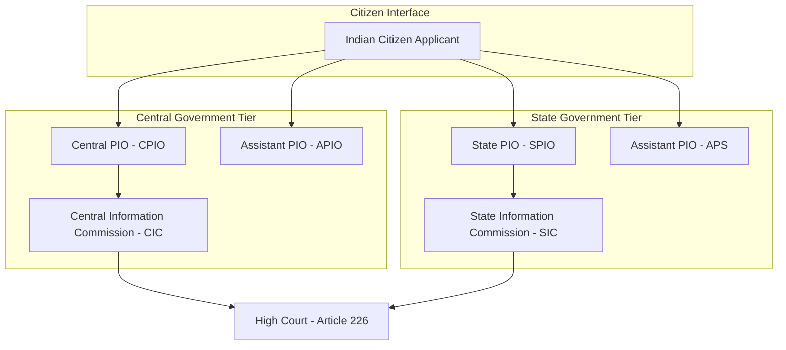
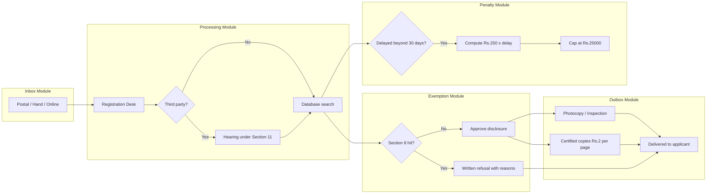

# Right to Information Act, 2005

<!-- SECTION_1_START -->
# Right to Information Act, 2005 — Core Technical Definition & Intuitive Overview

## Formal Academic Definition

> [!IMPORTANT]
> The **Right to Information Act, 2005 (RTI Act)** is a landmark piece of legislation enacted by the **Parliament of India** that provides a statutory framework for any citizen of India to seek information from a **Public Authority**. The Act mandates a regime of proactive disclosure, transparency, and accountability in the working of every public authority, redefining the relationship between the citizen and the State.

The Act was passed by the **Indian Parliament** on **15 June 2005** and came into force on **12 October 2005**. It replaced the earlier **Freedom of Information Act, 2002** (which had never fully come into force). The Act extends to the whole of India, except the State of **Jammu and Kashmir** (which had its own equivalent act — the J&K RTI Act, 2009, now subsumed after the abrogation of Article 370 in 2019).

**Long Title:** *"An Act to provide for setting out the practical regime of right to information for citizens to secure access to 'information' under the control of public authorities, in order to promote transparency and accountability in the working of every public authority..."*

### Preamble Recap (Section 1)

> *"WHEREAS the Constitution of India has established democratic Republic; AND WHEREAS democracy requires an informed citizenry and transparency of information which are vital to its functioning and also to contain corruption..."*

## Conceptual Analogy / Intuition

> [!NOTE]
> Think of the **RTI Act, 2005** as a **"Glass Door"** installed in every government office.

Before 2005, government files were kept inside opaque "walls." Citizens had no legal right to peek inside. They had to rely on favours, political contacts, or journalists to find out why a road was delayed, why a subsidy was denied, or why a transfer happened.

**After 2005**, the law effectively said: *"Every file in a government office is now behind a transparent glass door. You have a legal key. The officer is duty-bound to open that door, make a photocopy, and hand it to you — usually within 30 days — or pay a penalty from their own salary."*

**Geometric / Process Intuition:** Imagine the State as a **black box**. The RTI Act is the **window**, the **public authority** is the **engineer** maintaining it, and the **PIO (Public Information Officer)** is the **gatekeeper** who has been legally ordered to open it on request. Refusal must now be justified — silence is no longer an answer.

### Why This Matters in Cyber Ethics & Engineering

> [!IMPORTANT]
> For a B.Tech student, the RTI Act is highly relevant because:
> - **Cybersecurity & Data:** Government digital platforms, Aadhaar-linked services, e-Governance portals all fall under the RTI regime.
> - **Corporate Compliance:** Even **Private Bodies** receiving substantial government funding or whose information is held by a public authority can be queried.
> - **Whistleblower Linkage:** The Act is a non-violent, legal mechanism of accountability — a parallel to **whistleblowing frameworks** in computer ethics.
> - **Software Project Scoping:** When developing e-Governance software, engineers must architect **proactive disclosure modules** (Section 4 disclosures) and **RTI request logging** features.

> [!VISUALIZATION CONTROL]
> **Concept:** Information flow from Citizen to Government
> **GeoGebra / Desmos Input Equations:**
> * `x = Time in days (horizontal axis)`
> * `y = Information received (vertical axis, 0 to 100%)`
> **Visual Description:** Imagine a step function. For the first 30 days, $y = 0$ (waiting). At $x = 30$, $y$ jumps to $100\%$ (information delivered). If an appeal is filed, the curve extends to $x = 60$ and $x = 90$ with subsequent jumps. The ideal response is a near-vertical step at $x = 30$.
<!-- SECTION_1_END -->

<!-- SECTION_2_START -->
# Deep Theoretical Analysis & KTU High-Yield Formula Sheet

## 1. Constitutional & Philosophical Foundations

The RTI Act operationalises the **fundamental right to freedom of speech and expression** guaranteed under **Article 19(1)(a)** of the Constitution of India. The Supreme Court, in landmark rulings (notably *Raj Narain v. Indira Gandhi, 1975* and *S.P. Gupta v. Union of India, 1981*), had already established that:

> *"Democracy is government by the people. It is obvious that the people cannot govern without information..."*

The Act was drafted by the **National Commission to Review the Working of the Constitution (NCRWC)** chaired by Justice M.N. Venkatachaliah and refined by a national task force.

## 2. Salient Features of the RTI Act, 2005

| # | Feature | Description |
|---|---------|-------------|
| 1 | **Applicability** | All of India; covers all constitutional authorities, including the legislature, executive, and judiciary (with certain caveats). |
| 2 | **Citizen-Centric** | Any **citizen of India** can request information. Non-citizens, legal entities, and corporations **cannot** file RTI. |
| 3 | **Proactive Disclosure** | Section 4 mandates that every public authority must publish **17 categories of information suo motu** (on its own). |
| 4 | **Timely Response** | Information must be provided within **30 days** from the date of receipt. |
| 5 | **Life & Liberty Cases** | Information involving life or liberty must be provided within **48 hours**. |
| 6 | **Bilingual Filing** | RTI applications can be filed in **English, Hindi, or the official language of the State**. |
| 7 | **Penalty Provision** | A penalty of **₹250 per day** (subject to a maximum of **₹25,000**) is levied on the PIO for delay/wrongful refusal. |
| 8 | **Three-Tier Appeal Mechanism** | First Appeal → Second Appeal → Information Commission. |
| 9 | **Independence of Commissions** | Central and State Information Commissions enjoy **constitutional status** post the 2019 amendment. |
| 10 | **No Fee for BPL** | Applicants below the poverty line are **exempted from fees**. |

## 3. Key Stakeholders (Section 2 Definitions)

| Term | Full Form | Role | Statutory Section |
|------|-----------|------|-------------------|
| **PIO** | Public Information Officer | Designated officer to receive and respond to RTI requests. | Sec 5(1) |
| **APIO** | Assistant Public Information Officer | Receives applications and forwards to PIO. | Sec 5(2) |
| **CPIO** | Central Public Information Officer | PIO at the Central Government level. | Sec 5(1) |
| **SPIO** | State Public Information Officer | PIO at the State Government level. | Sec 5(1) |
| **DAA** | Departmental Appellate Authority | First appellate authority within the department. | Sec 19(1) |
| **CIC** | Central Information Commission | Apex appellate body at Central level. | Sec 12 |
| **SIC** | State Information Commission | Apex appellate body at State level. | Sec 15 |

## 4. KTU High-Yield Formula Sheet (Statutory Timelines)

| Scenario | Statutory Timeline | Statutory Basis |
|----------|--------------------|------------------|
| Normal request | **30 days** from receipt | Sec 7(1) |
| Request concerning **life or liberty** | **48 hours** | Sec 7(1) proviso |
| Request to a **third party** (whose info is sought) | **40 days** (PIO must give the third party a hearing) | Sec 11 |
| Request involving **human rights / corruption** allegations | **48 hours** | Sec 7(1) |
| First Appeal (to FAA/DAA) | **30 days** from order/30 days from deemed refusal | Sec 19(1) |
| Second Appeal (to CIC/SIC) | **90 days** from FAA order | Sec 19(3) |
| **Penalty** amount | **₹250 per day** (max **₹25,000**) | Sec 20(1) |
| Maximum time for first appeal decision | **30 days** (or extended by CIC with reasons) | Sec 19(6) |

## 5. Exemptions from Disclosure (Section 8)

The Act is **not absolute**. Information can be denied if it falls under any of the **10+ sub-sections of Section 8**, including:

- **Sec 8(1)(a):** Sovereignty & integrity of India, security, scientific/economic interests, relations with foreign states.
- **Sec 8(1)(b):** Information expressly forbidden by any court.
- **Sec 8(1)(c):** Parliamentary privilege.
- **Sec 8(1)(d):** Commercial confidence, trade secrets, intellectual property (subject to **public interest override**).
- **Sec 8(1)(e):** Information available in fiduciary relationship.
- **Sec 8(1)(f):** Foreign Government information.
- **Sec 8(1)(g):** Life and physical safety of informants.
- **Sec 8(1)(h):** Cabinet papers (subject to 20-year rule, now reduced).
- **Sec 8(1)(i):** Personal information unrelated to public activity.
- **Sec 8(2):** **Public Interest Override** — even exempted information can be disclosed if the larger public interest demands it.

## 6. Real-World Utility in Engineering & Cyber Domains

> [!NOTE]
> **Practical use cases every CS/IT engineer should know:**
> - **Audit & Forensics:** When a government IT system is breached, an RTI to the CERT-In or the relevant department can reveal whether an audit was conducted.
> - **Data Localisation Disputes:** RTIs to the Ministry of Electronics & Information Technology (MeitY) have revealed internal communications about data localisation norms.
> - **Aadhaar & Privacy:** Multiple RTI applications have revealed inconsistencies in UIDAI responses, forming the empirical basis of the **Justice K.S. Puttaswamy v. Union of India (2017)** privacy judgment.
> - **Corporate Compliance Tool:** Engineers in BPOs and IT companies can use RTI to verify the status of government tenders, RFPs, and contract awards.
<!-- SECTION_2_END -->

<!-- SECTION_3_START -->
# Step-by-Step Derivations & Procedural Implementation

## 1. Complete Procedural Flow — How an RTI Application is Filed

Below is the **exhaustive step-by-step process** of filing an RTI application in India, written in the style of an algorithm so that it doubles as a procedural memorisation sheet for KTU exams.

### Step 1: Identify the Public Authority
The applicant must first identify the **correct public authority** that holds the information sought. This is critical because:
- An RTI to a wrong authority leads to a transfer, not a refund.
- Many engineering colleges (aided or receiving UGC grants) are also covered.

### Step 2: Draft the Application
The application must be in writing and contain:
- **Name of applicant**
- **Address for correspondence**
- **Specific question(s)** in clear English/Hindi/official language
- **Mode of delivery** (post, hand, or online portal)
- **Application fee** (₹10 in cash / DD / IPO / online — rules vary by State)

> [!NOTE]
> **Important:** The Act **does not** require the applicant to disclose the *reason* or *purpose* for seeking information. A PIO cannot ask "Why do you want this information?"

### Step 3: Pay the Prescribed Fee

| Mode | Amount |
|------|--------|
| Cash (in person) | ₹10 |
| Demand Draft / IPO | ₹10 |
| Online payment (RTI portal) | ₹10 + portal charges |
| BPL (Below Poverty Line) applicants | **Exempt** from all fees |
| Further information / inspection | ₹5 per page (A4/A3) |

### Step 4: Submit the Application
Submission modes:
1. **Physical:** To the PIO/APIO of the public authority, OR
2. **Post:** Speed Post / Registered Post, OR
3. **Online:** Via the **RTI Online Portal** (rti.gov.in) for Central Government departments.

### Step 5: Acknowledgement & Tracking
- The PIO must register the application and allot a **registration number**.
- The applicant should note this number for all future correspondence.

### Step 6: Information Delivery (or Refusal)
- **Default case:** Information provided in **30 days**.
- **Third-party consultation:** 40 days.
- **Life/liberty cases:** 48 hours.
- If denied, the PIO must provide **written reasons** with reference to the specific Section 8 exemption.

### Step 7: First Appeal (if dissatisfied)
- Filed before the **Departmental Appellate Authority (DAA)** under **Section 19(1)**.
- Time limit: Within **30 days** of the PIO's order (or deemed refusal).
- Decision expected within **30 days**.

### Step 8: Second Appeal (final statutory remedy)
- Filed before the **Central Information Commission (CIC)** or **State Information Commission (SIC)** under **Section 19(3)**.
- Time limit: Within **90 days** of the FAA's order.
- The Commission's decision is **quasi-judicial** and binding.

### Step 9: Penalty & Disciplinary Action
- If the CIC/SIC finds the PIO at fault, it can impose a **penalty of ₹250 per day** (capped at **₹25,000**).
- It can also recommend **disciplinary action** against the erring officer under **Section 20(2)**.

### Step 10: Saturated Remedies & Constitutional Courts
- Beyond the Commission, the aggrieved party can approach the **High Court under Article 226** or the **Supreme Court under Article 136** on questions of law.

## 2. Mathematical Representation of Timelines (For Engineering Logic)

Let us model the cumulative time $T$ taken for the entire RTI process:

$$
T_{\text{total}} = T_{\text{PIO}} + T_{\text{appeal1}} + T_{\text{appeal2}} + T_{\text{court}}
$$

Where:
- $T_{\text{PIO}}$ = Time with PIO (default = 30 days, life/liberty = 48 hours)
- $T_{\text{appeal1}}$ = Time for First Appeal (default = 30 days)
- $T_{\text{appeal2}}$ = Time for Second Appeal (no statutory limit, but typically 30–90 days)
- $T_{\text{court}}$ = Time in writ jurisdiction (variable, not statutorily fixed)

$$
\begin{aligned}
T_{\text{normal}} &= 30 + 30 + 90 = 150 \text{ days (ideal upper bound)} \\
T_{\text{life/liberty}} &= 2 + 30 + 90 = 122 \text{ days} \\
T_{\text{ideal}} &= 30 + 0 + 0 = 30 \text{ days (no appeals)}
\end{aligned}
$$

**Penalty formula:**

$$
P_{\text{penalty}} = \min\left(250 \times D_{\text{delay}},\ 25{,}000\right)
$$

Where $D_{\text{delay}}$ is the number of days of delay attributable to the PIO.

## 3. Code Implementation — A Python RTI Tracking Script

For the algorithmic implementation, here is a clean, type-hinted Python module that simulates an RTI tracker. This is helpful for engineering students building **e-Governance dashboards** or **RTI support platforms**.

```python
from datetime import datetime, timedelta
from enum import Enum
from typing import Optional
import logging

# Configure structured logging
logging.basicConfig(
    level=logging.INFO,
    format="%(asctime)s | %(levelname)s | RTI-Tracker | %(message)s"
)
logger = logging.getLogger(__name__)


class Priority(Enum):
    """Statutory priority levels under RTI Act, 2005."""
    NORMAL = "normal"
    LIFE_LIBERTY = "life_liberty"


class RTIStatus(Enum):
    """Lifecycle states of an RTI application."""
    FILED = "filed"
    ACKNOWLEDGED = "acknowledged"
    TRANSFERRED = "transferred"
    REPLIED = "replied"
    REJECTED = "rejected"
    APPEAL_FIRST = "first_appeal"
    APPEAL_SECOND = "second_appeal"
    CLOSED = "closed"


class RTIApplication:
    """Represents a single RTI application and tracks its timeline."""

    DEADLINE_NORMAL_DAYS: int = 30
    DEADLINE_LIFE_LIBERTY_HOURS: int = 48
    PENALTY_PER_DAY: int = 250
    MAX_PENALTY: int = 25_000
    APPEAL1_DAYS: int = 30
    APPEAL2_DAYS: int = 90

    def __init__(
        self,
        applicant_name: str,
        question: str,
        public_authority: str,
        priority: Priority = Priority.NORMAL,
    ) -> None:
        # Absolute boundary checks for mandatory fields
        if not applicant_name or not applicant_name.strip():
            raise ValueError("applicant_name cannot be empty")
        if not public_authority or not public_authority.strip():
            raise ValueError("public_authority cannot be empty")
        if not question or not question.strip():
            raise ValueError("question cannot be empty")

        self.applicant_name: str = applicant_name
        self.question: str = question
        self.public_authority: str = public_authority
        self.priority: Priority = priority
        self.status: RTIStatus = RTIStatus.FILED
        self.filing_date: datetime = datetime.now()
        self.response_date: Optional[datetime] = None
        self.registration_number: Optional[str] = None

        logger.info(
            f"RTI FILED | applicant={self.applicant_name!r} | "
            f"authority={self.public_authority!r} | priority={self.priority.value}"
        )

    def acknowledge(self, registration_number: str) -> None:
        """Record acknowledgement by the PIO."""
        if not registration_number:
            raise ValueError("registration_number is mandatory")
        self.registration_number = registration_number
        self.status = RTIStatus.ACKNOWLEDGED
        logger.info(f"RTI ACKNOWLEDGED | reg_no={self.registration_number}")

    def deadline(self) -> datetime:
        """Compute the statutory deadline based on priority."""
        if self.priority is Priority.LIFE_LIBERTY:
            return self.filing_date + timedelta(hours=self.DEADLINE_LIFE_LIBERTY_HOURS)
        return self.filing_date + timedelta(days=self.DEADLINE_NORMAL_DAYS)

    def record_response(self, response_date: Optional[datetime] = None) -> int:
        """Record PIO response and compute penalty if delayed."""
        self.response_date = response_date or datetime.now()
        self.status = RTIStatus.REPLIED

        if self.response_date <= self.deadline():
            logger.info("RTI ON-TIME | no penalty")
            return 0

        # Calculate delay in days
        delay_seconds = (self.response_date - self.deadline()).total_seconds()
        delay_days = int(delay_seconds // 86400) + 1
        penalty = min(delay_days * self.PENALTY_PER_DAY, self.MAX_PENALTY)

        logger.warning(
            f"RTI DELAYED | delay_days={delay_days} | penalty_inr={penalty}"
        )
        return penalty

    def file_first_appeal(self) -> None:
        """File first appeal before Departmental Appellate Authority."""
        if self.status is not RTIStatus.REPLIED:
            raise RuntimeError("First appeal can only be filed after a PIO order")
        self.status = RTIStatus.APPEAL_FIRST
        logger.info("First appeal filed under Section 19(1)")

    def file_second_appeal(self) -> None:
        """File second appeal before CIC / SIC."""
        if self.status is not RTIStatus.APPEAL_FIRST:
            raise RuntimeError("Second appeal requires completed first appeal")
        self.status = RTIStatus.APPEAL_SECOND
        logger.info("Second appeal filed before Information Commission")


# Example usage for engineering students
if __name__ == "__main__":
    app = RTIApplication(
        applicant_name="Ananya R.",
        question="Total number of data breaches reported to CERT-In in FY 2023-24.",
        public_authority="Ministry of Electronics & Information Technology",
        priority=Priority.NORMAL,
    )
    app.acknowledge("MEITY/RTI/2024/01234")
    penalty = app.record_response(response_date=datetime.now() + timedelta(days=45))
    print(f"Penalty payable by PIO: Rs.{penalty}")
```

## 4. Comparative Matrix — RTI Act vs. Other Transparency Frameworks

| Parameter | RTI Act, 2005 | Freedom of Information Act (UK) | US FOIA, 1966 |
|-----------|----------------|--------------------------------|---------------|
| Scope | India | UK + extensions | Federal agencies of USA |
| Fee | ₹10 | Free (or marginal) | Free for first 2 hours search |
| Penalty on officer | ₹250/day (cap ₹25,000) | Disciplinary | None explicit |
| Time limit | 30 days | 20 working days | 20 working days |
| Cabinet papers exemption | Yes (with 20-yr rule) | Yes | Yes (Executive Privilege) |
| Proactive disclosure | Mandatory (17 categories) | Yes | Yes (e-FOIA) |
| Cyber relevance | High (e-Governance, Aadhaar) | High | High |

> [!NOTE]
> **Exam Tip:** KTU frequently frames the question as *"Compare RTI Act with IT Act, 2000"*. The key contrast: the **IT Act regulates the medium (computers, networks, e-commerce, cybercrime)**, while the **RTI Act regulates the content-holder (government information) and grants a positive right to citizens**.
<!-- SECTION_3_END -->

<!-- SECTION_4_START -->
# Structural Diagrams & Schematics

## 1. End-to-End RTI Process Flow (Mermaid)

```mermaid
flowchart TD
    A[Citizen drafts RTI application] --> B{Information already public under Section 4?}
    B -- Yes --> C[Access via proactive disclosure portal]
    B -- No --> D[Submit to PIO/APIO with Rs.10 fee]
    D --> E[PIO registers and issues acknowledgement within 5 days]
    E --> F{Is third party involved?}
    F -- Yes --> G[PIO consults third party - 40 days total]
    F -- No --> H[Default 30 days timeline]
    G --> I[PIO provides information or written refusal with reasons]
    H --> I
    I --> J{Applicant satisfied?}
    J -- Yes --> K[Case closed - file closed]
    J -- No --> L[First Appeal to DAA under Section 19(1) - 30 days]
    L --> M{DAA decision satisfactory?}
    M -- Yes --> K
    M -- No --> N[Second Appeal to CIC or SIC under Section 19(3) - 90 days]
    N --> O{Commission order acceptable?}
    O -- Yes --> K
    O -- No --> P[Writ to High Court under Article 226]
    P --> Q[Final adjudication]
    I --> R{Delay or wrongful refusal?}
    R -- Yes --> S[Penalty Rs.250 per day up to Rs.25000 + disciplinary action]
```

## 2. Hierarchical Architecture of Information Commissions



## 3. Block-Level Functional Topology — Public Authority's RTI Department



## 4. Three-Tier Appellate Architecture

```mermaid
flowchart TD
    P[PIO at Public Authority] -->|Section 19(1) within 30 days| FAA[Departmental Appellate Authority]
    FAA -->|Section 19(3) within 90 days| IC[Information Commission - CIC or SIC]
    IC -->|Article 226| HC[High Court]
    HC -->|Article 136| SC[Supreme Court]
    style P fill:#fff4cc,stroke:#333
    style FAA fill:#cce5ff,stroke:#333
    style IC fill:#d4edda,stroke:#333
    style HC fill:#f8d7da,stroke:#333
    style SC fill:#f8d7da,stroke:#333
```
<!-- SECTION_4_END -->

<!-- SECTION_5_START -->
# KTU 2024 Scheme Examination Question Bank & Topic Recap

---

## Part A Questions (3 Marks Each)

### Question 1 [KTU University Exam — July 2024]
**"Define the Right to Information Act, 2005. Mention its long title and date of enactment."**

**Model Answer (3 Marks):**
- **[Definition: 2 Marks]** The Right to Information Act, 2005 is an Act of the Indian Parliament enacted to provide a statutory regime of right to information for citizens to secure access to information held by public authorities, in order to promote transparency and accountability.
- **[Date & Long Title: 1 Mark]** It was passed on **15 June 2005** and came into force on **12 October 2005**. The long title begins with *"An Act to provide for setting out the practical regime of right to information..."*

---

### Question 2 [KTU University Exam — Dec 2023]
**"List any three exemptions under Section 8 of the RTI Act, 2005."**

**Model Answer (3 Marks):**
1. Information affecting the **sovereignty and integrity of India** (Sec 8(1)(a)).
2. Information **expressly forbidden by a Court of Law** (Sec 8(1)(b)).
3. Information involving **commercial confidence, trade secrets, or intellectual property** (Sec 8(1)(d)).

---

## Part B Questions (14 Marks Each — Internal Choice)

### Question 3 [KTU University Exam — July 2024, Module 4, CO4, Apply]
#### **Question A (14 Marks)**
**(a)** Explain the **salient features of the Right to Information Act, 2005** in detail. **(7 Marks)**

**(b)** Describe the **procedure for filing an RTI application** along with the prescribed fee and timeline. **(7 Marks)**

#### **Model Answer — Question A**

**Part (a) — Salient Features (7 Marks)**

**[Stating the purpose: 1 Mark]**
The RTI Act, 2005 empowers any citizen of India to seek information from a public authority, with the objective of promoting transparency and containing corruption.

**[Key features (4 Marks — 1 each)]**
1. **Citizen-centric right:** Only citizens can file RTI. No fee for BPL applicants.
2. **Proactive disclosure under Section 4:** Every public authority must publish 17 categories of information suo motu, including organisational structure, budgets, and subsidy schemes.
3. **Time-bound response:** Information within 30 days; 48 hours for life-and-liberty cases.
4. **Penalty mechanism:** ₹250 per day on the PIO for delay, capped at ₹25,000.

**[Constitutional backing + Commissions: 2 Marks]**
5. The Act operationalises **Article 19(1)(a)** and gives **constitutional status** to the Central and State Information Commissions.

---

**Part (b) — Procedure (7 Marks)**

**[Step 1 — Identify Authority: 1 Mark]**
The applicant must first identify the correct public authority holding the required information.

**[Step 2 — Draft Application: 1 Mark]**
The application is written in English, Hindi, or the official State language, containing name, address, and specific question.

**[Step 3 — Fee: 1 Mark]**
Application fee of **₹10** via cash, DD, IPO, or online. BPL applicants are exempt.

**[Step 4 — Submission: 1 Mark]**
Submit to PIO/APIO via post, hand, or the **rti.gov.in** portal.

**[Step 5 — Response: 1 Mark]**
PIO must respond within **30 days** (or 48 hours for life/liberty cases).

**[Step 6 — Appeal Mechanism: 2 Marks]**
- **First Appeal** under Sec 19(1) to the **Departmental Appellate Authority** within 30 days.
- **Second Appeal** under Sec 19(3) to the **CIC/SIC** within 90 days.
- Writ jurisdiction to High Court under Article 226 is the final remedy.

---

#### **Question B (14 Marks — Alternative Choice)**
**(a)** Discuss the **exemptions under Section 8** of the RTI Act. Can exempted information be disclosed in any case? **(7 Marks)**

**(b)** Explain the **structure, powers, and functions of the Central Information Commission (CIC)**. **(7 Marks)**

#### **Model Answer — Question B (Highlights)**

**Part (a):**
- **[Enumerate 5 key exemptions: 4 Marks]** — Sovereignty/integrity (8(1)(a)), Court-forbidden (8(1)(b)), Cabinet papers (8(1)(h)), Personal info (8(1)(i)), Commercial secrets (8(1)(d)).
- **[Public Interest Override — Sec 8(2): 3 Marks]** — Even exempted information can be disclosed if public interest outweighs the harm. Example: Corruption allegations against a public servant.

**Part (b):**
- **[Composition: 2 Marks]** Chief Information Commissioner + up to 10 Information Commissioners appointed by the President on recommendation of a committee.
- **[Tenure & Conditions: 2 Marks]** 5-year term or until age 65, whichever is earlier.
- **[Powers: 2 Marks]** Civil court powers under Sec 18(3) — summoning, requiring evidence, etc.
- **[Functions: 1 Mark]** Adjudicate appeals, impose penalties, recommend disciplinary action.

---

> [!WARNING]
> **KTU Examiner's Valuation Warning — Common Pitfalls**
> 1. **Do not confuse the IT Act, 2000 with the RTI Act, 2005.** The IT Act regulates *cyber conduct*; the RTI Act regulates *information access*. Examiners deduct up to 2 marks for mixing these up.
> 2. **Always state the exact Section number** when citing a provision (e.g., *Section 4*, *Section 8(1)(a)*, *Section 19(1)*). Vague statements like *"there are some exemptions"* fetch 0 marks.
> 3. **Forgetting the "Public Interest Override"** in Section 8(2) is a frequent mistake. Examiners expect this to be mentioned for full marks on exemption questions.
> 4. **Timeline errors:** The 48-hour limit applies **only to life and liberty**, *not* to all urgent matters. The 30-day default is the rule, not the exception.
> 5. **Do not write "fee is Rs.10 for BPL"** — BPL applicants are *exempted* from the fee, not charged a special fee. This is a common negative-marking trap.

---

## Topic Recap & Important Things to Remember

> [!NOTE]
> **High-Yield Rapid-Revision Checklist for KTU Module 4**

- [x] **Full Title:** Right to Information Act, 2005 (Act No. 22 of 2005).
- [x] **Enactment:** 15 June 2005 | **Enforcement:** 12 October 2005.
- [x] **Constitutional Backing:** Article 19(1)(a) — Freedom of Speech and Expression.
- [x] **Applicability:** Whole of India (originally excluding J&K).
- [x] **Eligibility:** Only **citizens of India**; no entities or foreigners.
- [x] **Application Fee:** ₹10 (BPL exempt).
- [x] **Default Timeline:** 30 days | **Life/Liberty:** 48 hours.
- [x] **Third-Party Consultation:** 40 days.
- [x] **First Appeal (Sec 19(1)):** 30 days to DAA.
- [x] **Second Appeal (Sec 19(3)):** 90 days to CIC/SIC.
- [x] **Penalty Formula:** ₹250 per day × delay days, capped at ₹25,000 (Sec 20).
- [x] **Exemptions:** Section 8(1)(a) to (j) + Section 9 (specific to intelligence).
- [x] **Override Clause:** Section 8(2) — public interest override.
- [x] **Proactive Disclosure:** Section 4 — 17 categories of mandatory suo motu disclosure.
- [x] **Constitutional Status:** Granted to CIC/SIC by the **RTI (Amendment) Act, 2019**.
- [x] **Key Case Law:** *Raj Narain v. Indira Gandhi (1975)*; *Puttaswamy v. Union of India (2017)*.
- [x] **Cyber-Linkage:** RTI applies to all digital records of public authorities, including emails, databases, CCTV footage (subject to exemption).
- [x] **Final Remedy:** High Court (Article 226) → Supreme Court (Article 136).
- [x] **Difference from IT Act 2000:** IT Act = *Cyber Conduct*; RTI Act = *Information Access by Citizens*.

**Mnemonic for Exemptions (S.E.C.S. P.E.R.S.O.N.):**
- **S**overeignty
- **E**vidence forbidden by Court
- **C**abinet papers
- **S**cientific/Economic interests
- **P**arliamentary privilege
- **E**mployer–Employee fiduciary
- **R**elations with foreign states
- **S**afety of informants
- **O**fficial secrets / commercial confidence
- **N**ames and personal information (8(1)(j))
<!-- SECTION_5_END -->
