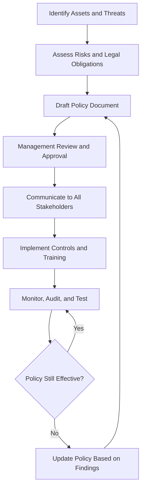
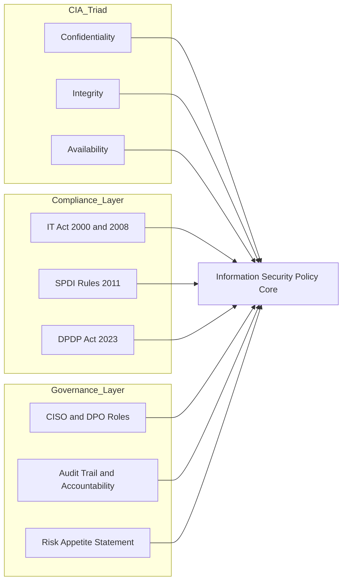
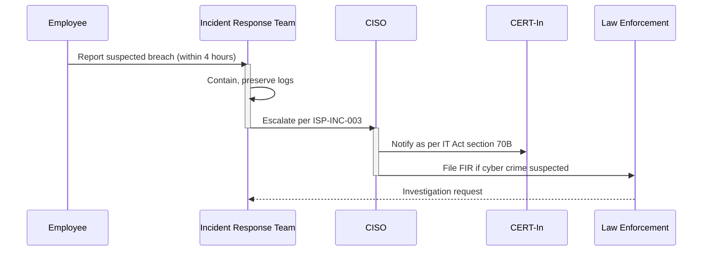
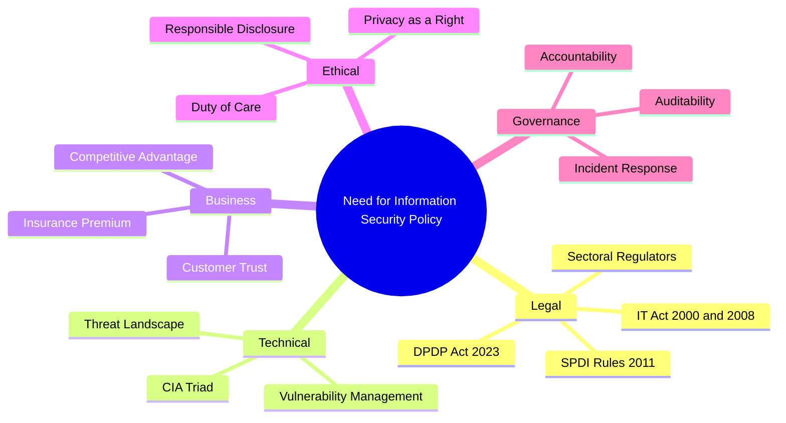

# Security Policies and Information Technology Act Need for an Information Security policy

<!-- SECTION_1_START -->
# 1. Core Technical Definition & Intuitive Overview

## 1.1 Formal Definition (KTU 2024 Syllabus Terminology)

An **Information Security Policy (ISP)** is a formal, documented set of rules, directives, practices, and procedures that govern how an organization manages, protects, and distributes its sensitive information assets, including digital data, intellectual property, and the underlying IT infrastructure.

> [!IMPORTANT]
> **KTU 2024 Definition Reference:** A security policy is a *living document* — it is not a one-time artifact. It defines the *what* (assets to protect) and the *why* (legal, ethical, business obligations), while procedures and standards define the *how*.

In the context of the **Information Technology Act, 2000 (amended 2008)** of India, an ISP also acts as the **first line of statutory compliance** for organizations handling sensitive personal data or operating critical information infrastructure.

---

## 1.2 Conceptual Analogy / Intuition

Imagine your home has a *vault* containing jewellery, legal documents, and cash. The vault is useless unless you have:

- A **written rule** (policy): "Only the head of the family can open the vault."
- A **mechanism** (procedure): "Use the combination lock, change the code every 6 months."
- A **consequence** (enforcement): "If the rule is broken, the alarm rings and police are called."

| Home Analogy | Information Security Equivalent |
|---|---|
| Vault | Database / Server / Cloud Storage |
| Written rule | **Security Policy** |
| Combination code change | Password Rotation Policy |
| Alarm + Police | Incident Response + IT Act §66 / §66F |
| Family members | Employees, contractors, third parties |

> [!NOTE]
> **Key Insight for Students:** A policy without enforcement is just a *piece of paper*. The IT Act, 2008 gives legal teeth to these policies, making non-compliance a *punishable offence* in many cases.

---

## 1.3 Why is the *Need* for an Information Security Policy a Standalone Topic?

The KTU 2024 Scheme explicitly lists the *need* for an ISP as a discrete learning outcome because modern enterprises face four converging pressures:

1. **Technological Pressure** — exponential growth in cyber-attacks (ransomware, phishing, zero-day exploits).
2. **Legal Pressure** — statutory mandates under the IT Act 2000/2008, plus sectoral regulators (RBI for banking, SEBI for securities, IRDAI for insurance).
3. **Business Pressure** — clients, partners, and vendors demand ISO 27001 / SOC 2 compliance before signing contracts.
4. **Ethical Pressure** — duty of care toward customers' personally identifiable information (PII).

> [!VISUALIZATION CONTROL]
> **Concept:** The 4-Pressure Convergence Model for ISP Necessity
> **Visualization Type:** Quadrant / Venn-style overlap
> **Visual Description:** Plot four overlapping circles labelled *Technology*, *Law*, *Business*, *Ethics* on a 2D plane. The central intersection — where all four circles overlap — represents the *absolute necessity* of an Information Security Policy. Any organization falling in the central region is *non-compliant* without an ISP.
> **Suggested Tool:** Draw.io or PowerPoint quadrant diagram.

---

<!-- SECTION_1_END -->

<!-- SECTION_2_START -->
# 2. Deep Theoretical Analysis & KTU High-Yield Formula Sheet

## 2.1 The Operational Logic of "Why an ISP is Needed"

An ISP is needed to satisfy **five engineering and legal objectives**, often abbreviated in the KTU syllabus as the **CIA + Compliance + Governance** pentagon:

### 2.1.1 The CIA Triad (Technical Foundation)

- **Confidentiality** — *Only authorized users can read the data.* Achieved via encryption, access controls, and NDAs.
- **Integrity** — *Data is not modified in transit or at rest without authorization.* Achieved via hashing (SHA-256), digital signatures, and audit trails.
- **Availability** — *Systems are accessible when needed.* Achieved via redundancy, DDoS protection, and disaster recovery plans.

### 2.1.2 Compliance (Legal Foundation)

Under the **IT Act, 2000 (as amended by the IT Act, 2008)**, certain sections directly mandate policy-level action:

- **Section 43A** — Compensation for failure to protect *sensitive personal data* (the basis for corporate privacy policies).
- **Section 72A** — Punishment for disclosure of information in breach of lawful contract.
- **Section 69** — Government's power to intercept, monitor, or decrypt information — mandates interception policies for ISPs and telecom companies.
- **Rules under SPDI (Sensitive Personal Data Information), 2011** — require explicit, written *privacy + security policies* by any body corporate.

### 2.1.3 Governance (Management Foundation)

Without an ISP, there is *no accountability chain* during a breach. The policy defines:
- **Who** is the Data Controller / Data Protection Officer (DPO).
- **What** is the classification of data (Public, Internal, Confidential, Restricted).
- **When** must incidents be reported (typically within hours under the IT Act).
- **How** are audits conducted (annual, bi-annual, continuous).

---

## 2.2 Components of a Robust Information Security Policy (KTU High-Yield Framework)

| # | Policy Component | Purpose | Statutory Linkage (IT Act) |
|---|---|---|---|
| 1 | **Acceptable Use Policy (AUP)** | Defines permitted use of organizational IT assets by employees | §79 (Safe harbour conditional) |
| 2 | **Access Control Policy** | Specifies who can access what, using RBAC / MAC / DAC | §43A, SPDI Rules 2011 |
| 3 | **Password & Authentication Policy** | Sets complexity, rotation, MFA requirements | SPDI Rule 5(2) |
| 4 | **Data Classification & Handling Policy** | Labels data as Public/Internal/Confidential/Restricted | §72A |
| 5 | **Incident Response Policy** | Step-by-step reaction to breaches | §66, §66F (Cyberterrorism) |
| 6 | **Email & Internet Usage Policy** | Restricts phishing, social media, downloads | §66D (Cheating by personation) |
| 7 | **Remote Work & BYOD Policy** | Governs work-from-home, personal device usage | §43A |
| 8 | **Encryption & Key Management Policy** | Mandates cryptographic standards (AES-256, RSA-2048, SHA-256) | §84A (Promotes encryption) |
| 9 | **Backup & Recovery Policy** | Defines RTO / RPO, off-site storage | §69 (Continuity of CII) |
| 10 | **Third-Party / Vendor Policy** | Ensures suppliers meet the same security posture | §43A, Contract Law |
| 11 | **Physical Security Policy** | Server room access, CCTV, biometrics | §69 |
| 12 | **Acceptable Encryption & Cryptography Policy** | Aligned with global standards | §84A |

> [!IMPORTANT]
> **KTU Board Tip:** When asked "Why is an ISP needed?", always structure the answer using the **5W1H framework** — *What* is protected, *Who* is responsible, *Why* (legal + business reasons), *When* (continuous), *Where* (applies organization-wide), and *How* (through standards and procedures).

---

## 2.3 The "Risk-Compliance-Cost" Triangle

Every ISP exists to balance three competing forces:

$$ \text{Effective Security} = f(\text{Risk Reduction}, \text{Compliance Level}, \text{Cost}) $$

Where the goal is to **minimize** residual risk while **maximizing** compliance at an **acceptable** cost.

A common engineering heuristic used in corporate security planning is:

$$ \text{ALE} = \text{SLE} \times \text{ARO} $$

- **SLE** = Single Loss Expectancy (monetary loss from one incident).
- **ARO** = Annualized Rate of Occurrence (expected number of incidents per year).
- **ALE** = Annual Loss Expectancy (justifies the budget for the security policy).

> [!NOTE]
> Students from non-CSE backgrounds (this PEC elective is taken by all branches in KTU 2024) should focus on the *conceptual meaning* of ALE rather than computation. It demonstrates to the examiner that you can *quantify* the need for security.

---

## 2.4 Real-World Utility (Why Engineers Must Care)

1. **Placement Interviews** — TCS, Infosys, Wipro, and Accenture ask "Have you signed the ISP / NDA?" during onboarding. Violation = termination + potential legal action.
2. **Project Compliance** — A B.Tech project handling real user data (e.g., a college attendance app with Aadhaar integration) legally *requires* an ISP under IT Act §43A.
3. **Startups** — Investors during Series A funding demand an ISP + Privacy Policy as part of due diligence.
4. **Cross-border Engineering** — GDPR (EU) compliance cannot be achieved without an internal ISP that governs data handling across geographies.

---

<!-- SECTION_2_END -->

<!-- SECTION_3_START -->
# 3. Step-by-Step Derivations, Policy Templates & Symbolic Implementation

## 3.1 Step-by-Step Logical Derivation: The *Need* for an ISP

The following 10-step logical chain is the *expected KTU board answer* when the question is framed as "Discuss the need for an Information Security Policy."

### Step 1 — Establish the Asset Universe
An organization possesses *data* (customer records, IP, financials) and *systems* (servers, networks, endpoints). Without a policy, there is **no inventory** of what must be protected.

### Step 2 — Identify Threats and Vulnerabilities
Threats are external (hackers, nation-states) and internal (disgruntled employees, careless contractors). A policy formally *lists* and *ranks* these.

### Step 3 — Assign Ownership and Accountability
A policy specifies the **CISO** (Chief Information Security Officer) or equivalent authority. The IT Act §69 and §70B make this *legally binding* for Critical Information Infrastructure.

### Step 4 — Define Legal Compliance Obligations
Map each asset to the relevant IT Act section (e.g., customer PII → §43A → SPDI Rules 2011).

### Step 5 — Set the Risk Appetite
Management decides how much risk is acceptable. The policy codifies this so employees have a *reference point*.

### Step 6 — Document Controls
Policies generate *standards* (e.g., "All laptops must use AES-256 encryption") and *procedures* (e.g., "To encrypt, go to Settings → BitLocker → Turn On").

### Step 7 — Mandate Training and Awareness
A policy clause such as *"All employees shall undergo annual security awareness training"* is enforceable; a verbal request is not.

### Step 8 — Define Incident Handling
Who calls the police? Who informs CERT-In (the Indian Computer Emergency Response Team under §70B)? The policy answers this *before* an incident occurs.

### Step 9 — Enable Auditability
Auditors (internal and external) verify policy compliance. Without a policy, there is *nothing to audit* — every system is a violation.

### Step 10 — Continuous Improvement Loop
The policy mandates annual review, ensuring adaptation to *new threats* (e.g., quantum computing risks, AI-driven phishing).

---

## 3.2 Policy Drafting — A Symbolic Template (Acceptable Use Policy)

Below is a **template** in symbolic / pseudo-legal format, demonstrating the structure of a real ISP clause. This is what students will encounter in industry.

```text
================================================================================
POLICY ID           : ISP-AUP-001
POLICY NAME         : Acceptable Use Policy
EFFECTIVE DATE      : DD/MM/YYYY
REVIEW CYCLE        : Annual
OWNER               : Chief Information Security Officer (CISO)
APPLIES TO          : All employees, interns, contractors, third parties
================================================================================

1.0  PURPOSE
      The purpose of this policy is to define acceptable use of organizational
      IT assets including email, internet, intranet, and devices.

2.0  SCOPE
      This policy applies to every individual granted access to
      [Company Name] information systems, regardless of location or device.

3.0  POLICY STATEMENTS
      3.1  Users SHALL NOT share their credentials with any other person.
      3.2  Users SHALL use multi-factor authentication (MFA) on all
           systems handling sensitive personal data [IT Act §43A reference].
      3.3  Users SHALL NOT install unauthorized software on company
           devices.
      3.4  Users SHALL report any suspected security incident to the
           Incident Response Team within 4 hours of discovery.

4.0  ENFORCEMENT
      Violations may result in disciplinary action, termination, and
      referral to law enforcement under the Information Technology Act,
      2008 (Sections 43, 66, 66D, 66F, 72, 72A as applicable).

5.0  RELATED DOCUMENTS
      - ISP-ACC-002  : Access Control Policy
      - ISP-INC-003  : Incident Response Policy
      - ISP-DAT-004  : Data Classification Policy
================================================================================
```

> [!NOTE]
> **Note for Students:** The terms *SHALL* and *SHALL NOT* (in capitals) are RFC 2119 keywords used in policy drafting. They are *mandatory* language, distinguishing *requirements* from *recommendations* (which use *SHOULD* and *SHOULD NOT*).

---

## 3.3 Engineering Comparative Analysis: Without-ISP vs With-ISP

| Dimension | Organization **Without** an ISP | Organization **With** an ISP |
|---|---|---|
| Employee behaviour | Ambiguous, ad-hoc | Clearly defined, auditable |
| Legal defence in court | Weak — "we had no rules" | Strong — "we followed due diligence" |
| Customer trust | Low | High — ISO 27001 / SOC 2 ready |
| Breach response time | Hours to days of confusion | Defined in minutes (call tree) |
| IT Act §43A compliance | Non-compliant, liable for damages | Compliant, due-diligence shield |
| Insurance premium | High (insurer views as high-risk) | Reduced (insurer views as low-risk) |
| Cross-border data transfer | Blocked under GDPR / DPDP Act 2023 | Smooth via Binding Corporate Rules |
| Audit findings | Multiple major non-conformities | Clean or minor observations |
| Engineer onboarding | "Ask your manager" | "Read, sign, comply" within 1 day |
| Brand reputation post-breach | Catastrophic, irreversible | Manageable, with public response plan |

---

## 3.4 Symbolic Mapping: The Policy Hierarchy

The KTU 2024 syllabus expects students to articulate the *pyramid of security documentation*:

$$
\underbrace{\text{Policy (Why \& What)}}_{\text{Top of pyramid — strategic}}
\;\longrightarrow\;
\underbrace{\text{Standard (What specifically)}}_{\text{Tactical}}
\;\longrightarrow\;
\underbrace{\text{Procedure (How — step by step)}}_{\text{Operational}}
\;\longrightarrow\;
\underbrace{\text{Guideline (Recommendations)}}_{\text{Bottom — advisory}
$$

**Worked Example (kept symbolic for clarity):**

- **Policy:** "All sensitive data must be encrypted at rest."
- **Standard:** "Use AES-256 encryption with a 256-bit key managed through AWS KMS."
- **Procedure:** "Step 1 — Open the AWS console. Step 2 — Navigate to KMS. Step 3 — Generate a new key. Step 4 — Apply to S3 bucket..."
- **Guideline:** "Prefer server-side encryption with KMS keys for compliance-critical workloads."

---

<!-- SECTION_3_END -->

<!-- SECTION_4_START -->
# 4. Structural Diagrams & Schematics

## 4.1 Mermaid Flowchart — The Information Security Policy Lifecycle



> [!NOTE]
> **Mermaid Safety Applied:** All node IDs are alphanumeric (`A`, `B`, `C`...), all labels are double-quoted and free of bold/italic markdown. The decision node `H` uses a rhombus shape via `{}` braces.

---

## 4.2 Mermaid Block Diagram — The CIA + Compliance + Governance Pentagon



---

## 4.3 Mermaid Sequential Diagram — Incident Response Driven by Policy



---

## 4.4 Mermaid Mind-Map — Why an Information Security Policy is Needed



---

<!-- SECTION_4_END -->

<!-- SECTION_5_START -->
# 5. KTU 2024 Scheme Examination Question Bank & Topic Recap

---

## Part A — Short Answer Questions (3 Marks Each)

### Question 1 [KTU University Exam — July 2024] — CO1, Remember
**Q: Define an Information Security Policy. List any four components of an ISP.**

**Model Answer (3 Marks):**

> An **Information Security Policy (ISP)** is a formal, documented set of rules and procedures that govern the protection of an organization's information assets, including digital data, systems, and networks.

**Four components (1/2 Mark each):**
1. Acceptable Use Policy (AUP)
2. Access Control Policy
3. Incident Response Policy
4. Data Classification and Handling Policy

> [!NOTE]
> **Valuation Key:** Definition 2 Marks + Listing 1 Mark (0.25 × 4).

---

### Question 2 [KTU University Exam — Dec 2023] — CO1, Understand
**Q: "A policy without enforcement is just a piece of paper." Discuss in the context of the IT Act, 2008.**

**Model Answer (3 Marks):**

This statement emphasizes that merely *drafting* a security policy is insufficient. Under the **IT Act 2000 (amended 2008)**, policies must be:
- **Enforced** through technical controls (firewalls, access logs) and administrative controls (disciplinary action) — 1 Mark.
- **Audited** periodically to demonstrate *due diligence* in a court of law — 1 Mark.
- **Linked to specific sections** such as §43A (compensation for data breach) and §72A (punishment for breach of confidentiality), which make non-compliance *punishable* — 1 Mark.

---

## Part B — Long Answer Questions (14 Marks Each)

### Question A — Module Internal Choice Option 1

**[KTU University Exam — Model Paper 2024] — CO2, Understand + Apply**

**Q: (a)** Explain in detail the *need* for an Information Security Policy in a modern organization. Discuss the legal, technical, business, and ethical dimensions. **(7 Marks)**

**Q: (b)** With the help of a neat diagram, describe the components of a comprehensive Information Security Policy. How does it differ from procedures and standards? **(7 Marks)**

---

#### Part (a) — Model Solution (7 Marks)

| Dimension | Explanation | Marks |
|---|---|---|
| **Legal Need** | IT Act 2000/2008 (§43A, §66, §69, §70B), SPDI Rules 2011, DPDP Act 2023 mandate documented security practices. Non-compliance attracts fines and imprisonment. | 2 |
| **Technical Need** | Protects the **CIA triad** — Confidentiality, Integrity, Availability. Defines controls against malware, phishing, ransomware, insider threats. | 2 |
| **Business Need** | Builds customer trust, meets contractual obligations (ISO 27001, SOC 2), reduces insurance premiums, protects brand reputation. | 1.5 |
| **Ethical Need** | Upholds the *duty of care* toward stakeholders' personal data, fulfils corporate social responsibility, supports responsible disclosure. | 1.5 |

---

#### Part (b) — Model Solution (7 Marks)

**Diagrammatic Representation (3 Marks):**

The student is expected to draw the **Policy Hierarchy Pyramid**:

$$
\underbrace{\text{Policy (Strategic — Why \& What)}}_{\text{Top}}
\;\longrightarrow\;
\underbrace{\text{Standards (Tactical — What specifically)}}_{\text{Middle}}
\;\longrightarrow\;
\underbrace{\text{Procedures (Operational — How step by step)}}_{\text{Bottom}
$$

**Explanation of Components (3 Marks):**
1. Acceptable Use Policy
2. Access Control Policy
3. Data Classification Policy
4. Incident Response Policy
5. Encryption & Key Management Policy
6. Backup & Recovery Policy
7. Third-Party / Vendor Management Policy

**Difference Table (1 Mark):**

| Element | Answers | Audience |
|---|---|---|
| **Policy** | *What* and *Why* | Management, legal |
| **Standard** | *What specifically* (technology choice) | IT teams |
| **Procedure** | *How* step by step | End users, operators |

---

### Question B — Module Internal Choice Option 2

**[KTU University Exam — Model Paper 2024] — CO2, Apply + Analyze**

**Q: (a)** A mid-sized IT company in Kerala with 500 employees recently suffered a data breach exposing 50,000 customer records. The CEO claims "we have a strong firewall, so we don't need a security policy." Critically evaluate this statement using the IT Act, 2008 framework. **(7 Marks)**

**Q: (b)** Design a basic Information Security Policy for a college project that stores student Aadhaar numbers. List the minimum 6 clauses you would include and justify each under the relevant IT Act section. **(7 Marks)**

---

#### Part (a) — Model Solution (7 Marks)

[Critique of CEO's statement: 3 Marks]
The CEO's claim is **flawed** because:
- A firewall is a *technical control*, not a *policy*. It cannot define *who* is accountable, *what* must be reported, or *how* employees should behave.
- IT Act §43A imposes liability for *failure to protect sensitive personal data* — a firewall alone does not satisfy this.
- The IT Act §72A punishes *disclosure in breach of contract* — without a policy, there is no contract defining confidentiality.

[Statutory analysis: 2 Marks]
- **§43A** → Compensation to affected data principals.
- **§66** → Computer-related offences (up to 3 years imprisonment or ₹5 lakh fine).
- **§66F** → Cyberterrorism (if the breach impacts critical infrastructure).
- **§70B** → Mandatory reporting to CERT-In.

[Recommendation: 2 Marks]
- Draft and enforce an ISP within 30 days.
- Appoint a DPO.
- Conduct mandatory employee training.
- Encrypt all PII at rest and in transit.
- Implement a breach notification SOP.

---

#### Part (b) — Model Solution (7 Marks)

| # | Policy Clause | Justification | IT Act Reference | Marks |
|---|---|---|---|---|
| 1 | **Purpose & Scope** — to protect student Aadhaar data collected for attendance | Defines the *what* and *who* | §43A + SPDI Rule 4 | 1 |
| 2 | **Data Collection Consent** — explicit written consent from students/parents | SPDI mandates informed consent | SPDI Rule 5 | 1 |
| 3 | **Access Control** — only the class teacher and HOD can view Aadhaar | Implements *need-to-know* | §43A | 1 |
| 4 | **Encryption Mandate** — Aadhaar stored in AES-256 encrypted database | Technical safeguard | §84A (encryption promotion) | 1 |
| 5 | **Retention & Disposal** — Aadhaar deleted within 30 days of academic year end | Limits exposure window | SPDI Rule 5(4) | 1 |
| 6 | **Breach Notification** — incident reported to principal and CERT-In within 24 hours | Enables rapid response | §70B | 1 |
| 7 | **Penalties for Misuse** — disciplinary + criminal referral | Enforceability | §72A | 1 |

> [!WARNING]
> **KTU Examiner's Valuation Warning / Pitfall Callout:**
> - Do **NOT** answer "Why is an ISP needed?" with *only* technical reasons. You **must** mention **legal** obligations (IT Act sections). Examiners allocate 30–40% marks to legal/statutory linkage.
> - Do **NOT** confuse *Policy* with *Procedure*. Writing a procedure for password change is **wrong** when the question asks for the **policy** (e.g., "Passwords must be 12+ characters with MFA").
> - Do **NOT** omit the **enforcement clause** — every policy must state *what happens on violation*.
> - Do **NOT** write answers in pure prose paragraphs. Use **bulleted lists, headings, and tables** for full marks.

---

## Topic Recap & Important Things to Remember

- **Definition:** An Information Security Policy is a formal, documented set of rules governing the protection of an organization's information assets.
- **Why it is needed:** Four converging pressures — Legal, Technical, Business, Ethical.
- **Core Technical Foundation:** The **CIA Triad** — Confidentiality, Integrity, Availability.
- **Legal Foundation:** IT Act 2000 (amended 2008), specifically **§43A, §66, §66D, §66F, §69, §70B, §72A, §84A**, plus **SPDI Rules 2011** and the newer **DPDP Act 2023**.
- **Key Components:** Acceptable Use, Access Control, Data Classification, Incident Response, Encryption, Backup, Third-Party Management, Physical Security, Email/Internet Usage, Remote Work/BYOD.
- **Hierarchy:** Policy (What/Why) → Standard (What specifically) → Procedure (How) → Guideline (Recommendations).
- **Mandatory Keywords in Policies:** Use *SHALL* and *SHALL NOT* (RFC 2119) for mandatory clauses.
- **Owner:** The CISO (Chief Information Security Officer) is the typical owner; small organizations may assign it to an IT Manager or Director.
- **Review Cycle:** Policies must be reviewed **annually at minimum**, or immediately after a major incident.
- **Enforceability:** A policy must specify consequences for violation — administrative, civil (under IT Act), and criminal (FIR under relevant IPC sections).
- **Risk Quantification:** ALE = SLE × ARO is the standard formula for justifying security investments.
- **Indian Context:** CERT-In (under §70B of the IT Act) is the national nodal agency for incident reporting.
- **DPDP Act 2023:** The *Digital Personal Data Protection Act, 2023* is the *newest* layer of compliance — it supersedes SPDI Rules 2011 in many respects and introduces penalties up to **₹250 crore** for non-compliance.
- **Ethical Dimension:** Privacy is recognized as a fundamental right under **Justice K.S. Puttaswamy v. Union of India (2017)** — the policy must reflect this constitutional backing.
- **Engineering Relevance:** Every B.Tech student handling real user data in a project must have at least a *minimal* ISP — it is a statutory requirement, not optional best practice.
- **Mnemonic for Components:** "**A**ccess **D**ata **I**n **E**ncrypted **B**ackup **P**hysical **T**hird-party **A**udit **R**emote" — A.D.I.E.B.P.T.A.R.

---

<!-- SECTION_5_END -->
