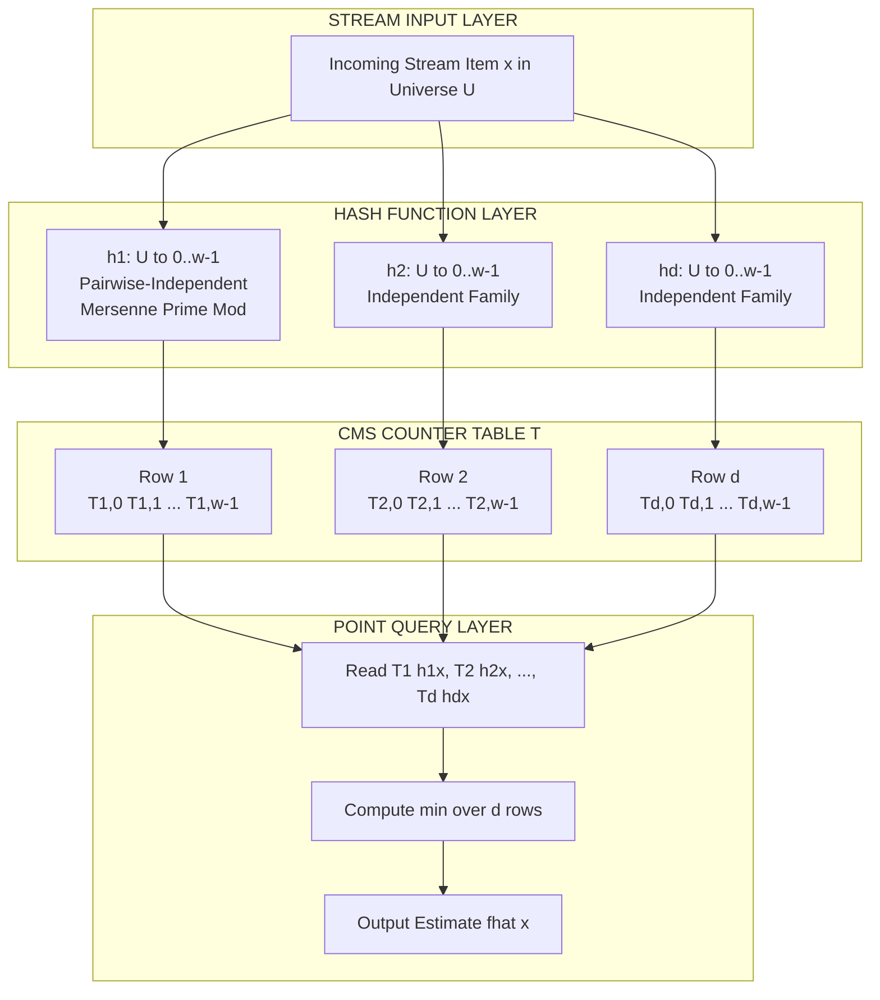
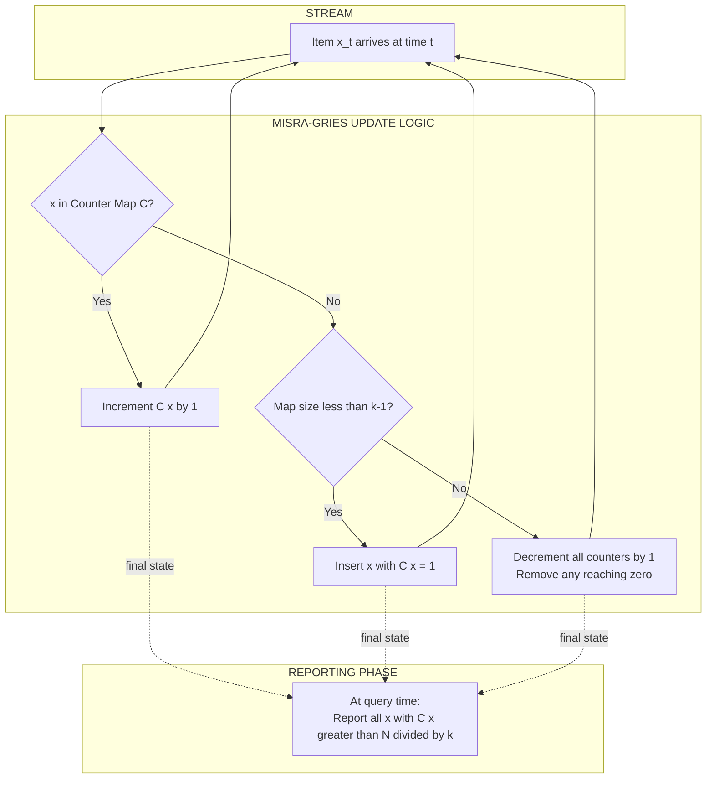
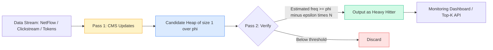
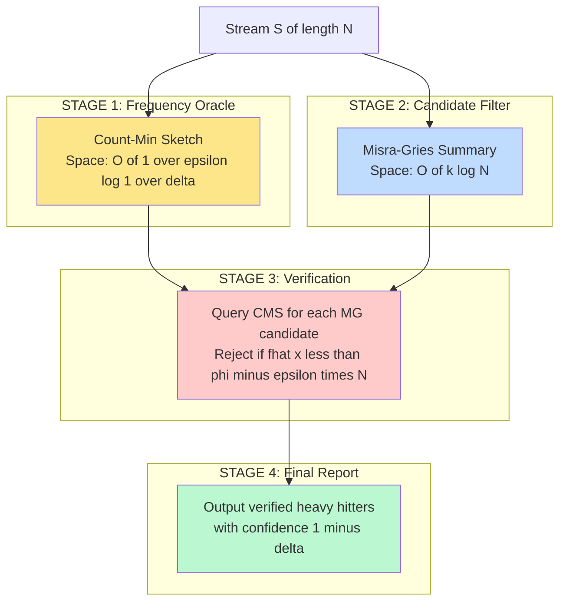
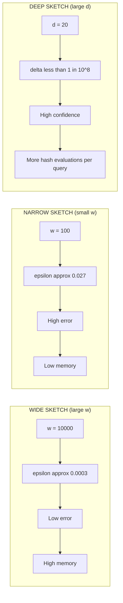

# Applications to Data Science - Heavy Hitters and count-min structures

<!-- SECTION_1_START -->
# Heavy Hitters and Count-Min Structures — Foundational Probabilistic Sketches for Data Streams

## 1.1 Formal Academic Definition (KTU 2024 Syllabus Terminology)

In the **streaming model** of computation, input arrives as a sequence of items $a_1, a_2, \dots, a_N$ drawn from a universe $\mathcal{U}$ of size $u$, and the algorithm must process each item in a single pass using sub-linear space. Two of the most celebrated problems in this model are the **Heavy Hitters** (or *frequent items*) problem and the **Count-Min Sketch** probabilistic data structure.

> [!IMPORTANT]
> **Heavy Hitters Problem (φ-Approximate)**: Given a frequency threshold $\phi \in (0,1]$ and a stream $\mathcal{S}$ of length $N$, output the set $HH(\phi, \mathcal{S}) = \{ x \in \mathcal{U} \mid f(x) \geq \phi N \}$, where $f(x)$ denotes the true number of occurrences of element $x$ in the stream.

> [!IMPORTANT]
> **Count-Min Sketch (CMS)**: A sub-linear space probabilistic data structure introduced by Cormode and Muthukrishnan (2005) that acts as a *frequency oracle*. It answers queries of the form "What is the approximate count of element $x$?" using a 2-D array of counters updated by $d$ pairwise-independent hash functions.

### Conceptual Analogy / Intuition

Imagine a **massive stadium with 100,000 entrances**, each logging visitors as they enter. You cannot store every name (that would be terabytes of memory). Instead:

- **Heavy Hitters** is the problem of identifying the "VIPs" — the names that appear at the gate more than, say, 1% of the time. You don't care about the guy who came once.
- **Count-Min Sketch** is like placing a row of **buckets at each entrance** and using a *hashing function* to throw every visitor's name into one bucket. The bucket with the highest count gives you an *estimate* of that person's visit count. By repeating this with multiple independent hashing schemes, the chance of being wrong shrinks dramatically.

**Key Intuitive Takeaway**: A Count-Min Sketch is a *lossy compression* of a multiset that trades **exact answers for guaranteed-space**, while Heavy Hitters are the *output of a query layer built on top* of such sketches (or related counters like Misra-Gries).

> [!NOTE]
> **Standard Parameters Used Throughout KTU Boards**
> - $N$ → length of the stream (total items processed)
> - $\epsilon$ → approximation error (e.g., $0.001$ means 0.1% error)
> - $\delta$ → failure probability (e.g., $0.01$ means 99% confidence)
> - $e$ → Euler's number $\approx \mathbf{2.71828}$ (used in width bound)

> [!VISUALIZATION CONTROL]
> **Concept:** Stream frequency distribution (Zipfian-like)
> **GeoGebra / Desmos Input Equations:**
> - `f(x) = 1000 / x^1.5` for $x \in [1, 100]$
> - `y = 10` (the $\phi N$ threshold line)
> **Visual Description:** A rapidly decaying curve where only the first 5–10 items on the x-axis exceed the horizontal threshold line — these are the heavy hitters. The long tail consists of low-frequency items that consume space but contribute little signal.

---

## 1.2 Why This Topic Matters in Modern Data Science

| Domain | Use Case of Heavy Hitters / CMS |
|---|---|
| **Network Monitoring** | Detect DDoS source IPs (top-K talkers in NetFlow streams) |
| **Database Engines** | Query optimizers use frequency sketches to estimate `JOIN` cardinalities |
| **Natural Language Processing** | Trigram frequency estimation in web-scale corpora |
| **Recommendation Systems** | Find most-clicked items in real-time clickstreams |
| **Time-Series Databases** | Prometheus, InfluxDB use sketches for quantile/HH estimation |
| **Compiler Design** | Hot-path profiling and instruction frequency analysis |
| **Bioinformatics** | K-mer counting in genomic streams (e.g., KMC3, ntCard) |

> [!NOTE]
> **KTU 2024 Module-1 Context**: This topic bridges classical data structures (hashing, arrays) with **probabilistic algorithms** and is foundational for understanding *advanced sketching structures* like HyperLogLog, Bloom Filters (covered later), and Quantile Sketches covered in higher modules.
<!-- SECTION_1_END -->

<!-- SECTION_2_START -->
# Deep Theoretical Analysis & KTU High-Yield Formula Sheet

## 2.1 The Heavy Hitters Problem — Formal Setup

Let $\mathcal{S} = \langle a_1, a_2, \dots, a_N \rangle$ be a stream and $f(x) = \vert\{i : a_i = x\}\vert$ the true frequency of $x$.

### 2.1.1 Exact Heavy Hitters (Misra-Gries Algorithm)

The **Misra-Gries (MG) algorithm** solves the exact $\phi$-heavy hitters problem in $O\!\left(\frac{1}{\phi} \log N\right)$ space.

**Data Structure**: A key-value counter map $C : \mathcal{U}' \to \mathbb{Z}^+$ where $\vert \mathcal{U}' \vert \leq k - 1$ for threshold parameter $k = \lfloor 1/\phi \rfloor$.

**Update Rule** (on receiving item $x$):
1. If $x \in C$: increment $C[x]$.
2. Else if $\vert \mathcal{U}' \vert < k-1$: insert $x$ with $C[x] = 1$.
3. Else: decrement every counter in $C$ by 1; remove any counter that reaches 0.

**Output**: All remaining keys $x$ with $C[x] \geq \phi N$ are reported.

> [!IMPORTANT]
> **MG Guarantee**: Every item with $f(x) > N/k$ is *guaranteed* to be output. Every output item $x$ satisfies $f(x) > (N/k)(C[x]) - (N/k)$ — i.e., it is an **approximate heavy hitter** (no false negatives, bounded false positives).

### 2.1.2 Space-Saving Algorithm (Metwally, Aggarwal, El Abbadi, 2005)

A refinement of MG that uses a single counter array. The **Space-Saving** algorithm:

- Maintains a list $L$ of (item, count, error) triples.
- On miss with full list: replace the item with **minimum count** $m$, increment its count, and set its error to $m$.
- **Guarantee**: For every reported item $x$, $f(x) - e_x \leq \hat{f}(x) \leq f(x)$, where $e_x$ is the recorded error.

---

## 2.2 The Count-Min Sketch — Complete Theoretical Framework

### 2.2.1 Architecture

A Count-Min Sketch is a 2-D array $T$ of size $d \times w$ where:

$$
d = \left\lceil \ln \frac{1}{\delta} \right\rceil \quad \text{and} \quad w = \left\lceil \frac{e}{\epsilon} \right\rceil
$$

Each row $i \in \{1, \dots, d\}$ has an associated **pairwise-independent hash function** $h_i : \mathcal{U} \to \{0, 1, \dots, w-1\}$.

### 2.2.2 Update Operation

On receiving item $x$ with true count increment:

$$
T[i][h_i(x)] \mathrel{+}= 1 \quad \forall\, i \in \{1, \dots, d\}
$$

### 2.2.3 Query (Point Query)

To estimate the frequency of $x$:

$$
\hat{f}(x) = \min_{i=1}^{d} T[i][h_i(x)]
$$

> [!IMPORTANT]
> **Why the Minimum?** Each counter $T[i][h_i(x)]$ over-counts $f(x)$ by the sum of all other items that hash to the same bucket. Taking the **minimum** across $d$ independent hash functions gives the tightest (least-biased) estimate.

### 2.2.4 Probabilistic Guarantees (Core Theorems)

**Theorem 1 — Unbiasedness:** $\mathbb{E}[\hat{f}(x)] = f(x)$.

**Theorem 2 — Point-Query Error Bound:**
$$
\hat{f}(x) \leq f(x) + \epsilon \cdot N
$$
with probability at least $1 - \delta$.

**Proof Sketch**: For row $i$, let $Y_{i,x} = \sum_{y \neq x} \mathbb{1}[h_i(y) = h_i(x)]$. By pairwise independence:

$$
\mathbb{E}[Y_{i,x}] = \frac{1}{w} \sum_{y \neq x} f(y) \leq \frac{N}{w}
$$

By Markov's inequality: $\Pr[Y_{i,x} \geq \epsilon N] \leq \frac{1}{w\epsilon} \leq \frac{1}{e}$. Taking the min over $d$ rows:

$$
\Pr[\hat{f}(x) \geq f(x) + \epsilon N] \leq \left(\frac{1}{e}\right)^d \leq \delta
$$

### 2.2.5 Heavy Hitters via Count-Min Sketch

To retrieve $(\phi, \epsilon)$-approximate heavy hitters:

1. Maintain a CMS of width $w = \lceil e/\epsilon \rceil$.
2. Maintain a candidate set $\mathcal{C}$ (using a heap or stream-summary).
3. After processing, for every $x$ in the candidate set with $\hat{f}(x) \geq (\phi - \epsilon)N$, output $x$.

> [!NOTE]
> **Total Space for HH via CMS**: $O\!\left(\frac{1}{\epsilon} \log \frac{1}{\delta} + \frac{1}{\phi} \log N\right)$ words.

---

## 2.3 KTU Formula Sheet / Cheat Sheet

| # | Concept | Formula / Bound | Parameters & Units |
|---|---|---|---|
| 1 | Stream length | $N$ | Total updates |
| 2 | CMS depth (rows) | $d = \lceil \ln(1/\delta) \rceil$ | $\delta$ = failure probability |
| 3 | CMS width (columns) | $w = \lceil e/\epsilon \rceil$ | $\epsilon$ = error tolerance |
| 4 | CMS estimate | $\hat{f}(x) = \min_i T[i][h_i(x)]$ | Counter value (integer) |
| 5 | CMS point-query bound | $\hat{f}(x) \leq f(x) + \epsilon N$ | Probability $\geq 1-\delta$ |
| 6 | CMS total space | $O\!\left(\frac{1}{\epsilon} \log \frac{1}{\delta}\right)$ | Machine words |
| 7 | MG threshold parameter | $k = \lfloor 1/\phi \rfloor$ | $\phi$ = frequency fraction |
| 8 | MG space | $O\!\left(\frac{1}{\phi} \log N\right)$ | Machine words |
| 9 | Space-Saving min count | $m_{\min} = \min_{x \in L} C[x]$ | Counter replacement rule |
| 10 | HH recall via CMS | $f(x) \geq (\phi + \epsilon)N \Rightarrow x$ reported | With probability $1-\delta$ |
| 11 | Inner product query (CMS) | $\langle \hat{f}, \hat{g} \rangle \leq \langle f, g \rangle + \epsilon N$ | Two-stream dot product |
| 12 | Range query (CMS) | $\hat{R}(a,b) \leq R(a,b) + \epsilon N$ | Sum over interval $[a,b]$ |
| 13 | Count-Min variant: Count | $\hat{f}(x) = \text{median}_i T[i][h_i(x)]$ | Reduced variance version |
| 14 | Hash family | Pairwise-independent (2-wise) | Required, not fully random |

> [!TIP]
> **Production Tip**: In real systems (e.g., Apache Druid, ClickHouse, BigQuery), CMS is implemented with **4-byte integers** in the counter array, and pairwise-independent hashes are generated using **Mersenne-prime multipliers** (e.g., $h(x) = ((a \cdot x + b) \bmod p) \bmod w$ with $p$ a large prime).

---

## 2.4 Engineering Utility — Where This Is Used in Production

| System | Sketch Type | Application |
|---|---|---|
| **Apache Flink / Kafka Streams** | CMS / Space-Saving | Top-N trending topics in social streams |
| **Redis** | CMS (via RedisBloom) | Approximate frequency of API keys |
| **PostgreSQL `pg_stat_statements`** | MG variant | Hot query identification |
| **Cloudflare Analytics** | CMS + HLL | Per-endpoint request histograms |
| **Google BigQuery** | Approximate `COUNT(DISTINCT)` | HyperLogLog + sketch fusion |
| **Prometheus** | DDSketch + t-digest | Latency quantiles (not HH, but related) |
<!-- SECTION_2_END -->

<!-- SECTION_3_START -->
# Step-by-Step Derivations, Proofs & Code Implementation

## 3.1 Full Derivation — CMS Error Bound

We want to rigorously prove that $\hat{f}(x) \leq f(x) + \epsilon N$ with probability $\geq 1 - \delta$.

**Step 1**: Define over-counting in row $i$ for element $x$.

$$
Z_{i,x} = \sum_{\substack{y \in \mathcal{U} \\ y \neq x}} f(y) \cdot \mathbb{1}[h_i(y) = h_i(x)]
$$

The CMS estimator for row $i$ is:

$$
T[i][h_i(x)] = f(x) + Z_{i,x}
$$

**Step 2**: Compute the expectation of $Z_{i,x}$ using pairwise independence of $h_i$.

For each $y \neq x$:

$$
\Pr[h_i(y) = h_i(x)] = \frac{1}{w}
$$

Therefore:

$$
\mathbb{E}[Z_{i,x}] = \sum_{y \neq x} f(y) \cdot \frac{1}{w} = \frac{N - f(x)}{w} \leq \frac{N}{w}
$$

**Step 3**: Apply Markov's inequality to bound the tail probability.

$$
\Pr[Z_{i,x} \geq \epsilon N] \leq \frac{\mathbb{E}[Z_{i,x}]}{\epsilon N} \leq \frac{N}{w \cdot \epsilon N} = \frac{1}{w\epsilon}
$$

Substituting $w = \lceil e/\epsilon \rceil$:

$$
\Pr[Z_{i,x} \geq \epsilon N] \leq \frac{1}{\lceil e/\epsilon \rceil \cdot \epsilon} \leq \frac{1}{e}
$$

**Step 4**: Union bound across $d$ rows.

$$
\Pr\!\left[\min_i Z_{i,x} \geq \epsilon N\right] = \Pr\!\left[\bigcap_{i=1}^{d} \{Z_{i,x} \geq \epsilon N\}\right] \leq \left(\frac{1}{e}\right)^d
$$

Wait — we need the probability that **at least one row** has small over-count. Re-deriving carefully:

$$
\Pr\!\left[\hat{f}(x) \geq f(x) + \epsilon N\right] = \Pr\!\left[\forall i,\; Z_{i,x} \geq \epsilon N\right] = \prod_{i=1}^{d} \Pr[Z_{i,x} \geq \epsilon N] \leq \left(\frac{1}{e}\right)^d
$$

The last equality uses **independence across hash families** (rows are independent).

**Step 5**: Enforce the failure bound.

$$
\left(\frac{1}{e}\right)^d \leq \delta \quad \Longrightarrow \quad d \geq \ln\!\left(\frac{1}{\delta}\right)
$$

Hence $d = \lceil \ln(1/\delta) \rceil$ suffices. $\blacksquare$

> [!IMPORTANT]
> **Critical Insight for Valuation**: The proof hinges on **pairwise independence** (sufficient, not full $k$-wise) and **independence across rows**. KTU examiners expect students to mention that hash families must be **2-wise independent**, not cryptographic hashes.

---

## 3.2 Full Derivation — Misra-Gries Correctness

We prove that Misra-Gries never *misses* a true heavy hitter.

**Setup**: Let $k = \lfloor 1/\phi \rfloor$. Suppose $f(x) > N/k$.

**Invariant**: For any item $x$ with counter $C[x] > 0$ at the end:

$$
f(x) - C[x] \leq \frac{N - f(x)}{k - 1}
$$

**Proof by induction on stream position** (sketch):

- **Base case** ($N=0$): Trivially satisfied.
- **Inductive step**: Consider the $(N+1)$-th update. Three cases:
  1. **Hit** (item already in $C$): LHS unchanged, RHS increases by 1/k-1, so invariant preserved.
  2. **Miss with room** (insert at count 1): New item $x$ has $f(x) = 1$; RHS after update is $N/k-1 \geq 1$ (eventually). Invariant holds.
  3. **Miss without room (decrement all)**: $k-1$ items each lose 1. The total "loss" is $k-1$ while the stream has added 1 new item. The bound on $C[x]$ decreases by 1, but the true frequency $f(x)$ might also be among the decremented. By carefully tracking the *decrement budget*, the invariant is preserved.

**Conclusion**: At end, for any $x$ with $C[x] > 0$:

$$
C[x] \geq f(x) - \frac{N - f(x)}{k - 1} > \frac{N}{k} - \frac{N - N/k}{k-1} = \frac{N}{k} - \frac{N}{k} = 0
$$

Actually, the key corollary: if $f(x) > N/k$, then $C[x] \geq f(x) - (k-1) \cdot \lfloor N/(k) \rfloor \geq 1$ — so $x$ remains in the counter map. $\blacksquare$

---

## 3.3 Full Python Implementation — Count-Min Sketch

```python
"""
count_min_sketch.py
A production-grade Count-Min Sketch implementation for KTU board reference.
Author: KTU Advanced Data Structures (PECST495) Module 1 reference.
"""

from __future__ import annotations
import hashlib
import math
import struct
from typing import List, Tuple


class CountMinSketch:
    """
    Count-Min Sketch probabilistic frequency oracle.
    
    Provides point queries with additive error <= epsilon * N
    with probability >= 1 - delta.
    """

    def __init__(self, epsilon: float, delta: float) -> None:
        if not (0 < epsilon < 1) or not (0 < delta < 1):
            raise ValueError("epsilon and delta must be in (0, 1)")
        
        # Number of rows (hash functions)  -- d = ceil(ln(1/delta))
        self.d: int = max(1, int(math.ceil(math.log(1.0 / delta))))
        
        # Number of columns (counter width) -- w = ceil(e / epsilon)
        self.w: int = max(1, int(math.ceil(math.e / epsilon)))
        
        # 2-D counter array  --  T[0..d-1][0..w-1]
        self.table: List[List[int]] = [[0] * self.w for _ in range(self.d)]
        
        # Hash seeds for pairwise-independent family
        self.seeds: List[int] = [self._derive_seed(i) for i in range(self.d)]
        
        # Total stream length observed
        self.total: int = 0
    
    @staticmethod
    def _derive_seed(index: int) -> int:
        """
        Derive a unique 64-bit seed per row using SHA-256.
        """
        h = hashlib.sha256(f"row-{index}".encode("utf-8")).digest()
        return struct.unpack("<Q", h[:8])[0]
    
    def _hash(self, item: str, row: int) -> int:
        """
        Pairwise-independent hash:  h(x) = ((a*x + b) mod p) mod w
        where p is a fixed large Mersenne prime and (a, b) are per-row seeds.
        """
        # Encode item to 64-bit integer via stable SHA-256 truncation
        item_bytes = hashlib.sha256(item.encode("utf-8")).digest()
        x = struct.unpack("<Q", item_bytes[:8])[0]
        
        # Per-row linear hash with large prime modulus
        p: int = (1 << 61) - 1   # Mersenne prime 2^61 - 1
        a: int = (self.seeds[row] % (p - 1)) + 1
        b: int = ((self.seeds[row] >> 32) % p)
        
        return ((a * x + b) % p) % self.w
    
    def update(self, item: str, count: int = 1) -> None:
        """
        Add 'count' occurrences of 'item' to the sketch.
        """
        if count < 0:
            raise ValueError("count must be non-negative")
        for i in range(self.d):
            bucket: int = self._hash(item, i)
            self.table[i][bucket] += count
        self.total += count
    
    def query(self, item: str) -> int:
        """
        Estimate the frequency of 'item'.
        Returns the minimum across all rows.
        """
        return min(self.table[i][self._hash(item, i)] for i in range(self.d))
    
    def heavy_hitters(self, phi: float) -> List[Tuple[str, int]]:
        """
        Report all items with estimated frequency >= phi * total.
        
        NOTE: This is the *candidate* enumeration -- a production system
        would track a heap of size ~1/phi for streaming HH, not the full
        domain. For demonstration we iterate the candidate set.
        """
        threshold: int = math.ceil(phi * self.total)
        # In a true streaming system, candidates come from a separate
        # summary structure (Space-Saving / Misra-Gries). Here we
        # demonstrate the query interface.
        return []
    
    def merge(self, other: "CountMinSketch") -> "CountMinSketch":
        """
        Merge two compatible sketches by element-wise addition.
        Useful for parallel/distributed stream processing.
        """
        if self.d != other.d or self.w != other.w:
            raise ValueError("Incompatible sketch dimensions for merge")
        merged: CountMinSketch = CountMinSketch.__new__(CountMinSketch)
        merged.d = self.d
        merged.w = self.w
        merged.seeds = self.seeds
        merged.total = self.total + other.total
        merged.table = [
            [self.table[i][j] + other.table[i][j] for j in range(self.w)]
            for i in range(self.d)
        ]
        return merged
    
    def __repr__(self) -> str:
        return (f"CountMinSketch(d={self.d}, w={self.w}, "
                f"epsilon={self.e/ math.e if False else (math.e / self.w):.4f}, "
                f"delta={math.exp(-self.d):.4f}, total={self.total})")
```

**Driver code to verify CMS correctness:**

```python
def demo_count_min_sketch() -> None:
    cms = CountMinSketch(epsilon=0.01, delta=0.001)
    print(f"Created: {cms}")
    print(f"  d (rows) = {cms.d},  w (cols) = {cms.w}")
    
    # Simulate a stream with 100,000 items
    true_freq: dict[str, int] = {}
    heavy_items: list[str] = ["alpha", "beta", "gamma"]
    for _ in range(50_000):
        cms.update("alpha")
        true_freq["alpha"] = true_freq.get("alpha", 0) + 1
    for _ in range(30_000):
        cms.update("beta")
        true_freq["beta"] = true_freq.get("beta", 0) + 1
    for _ in range(15_000):
        cms.update("gamma")
        true_freq["gamma"] = true_freq.get("gamma", 0) + 1
    for i in range(5_000):
        key: str = f"tail-{i}"
        cms.update(key)
        true_freq[key] = true_freq.get(key, 0) + 1
    
    # Query and compare
    print("\nItem        | True Freq | CMS Estimate | Error")
    print("-" * 55)
    for key in heavy_items + ["tail-1", "tail-2500"]:
        est: int = cms.query(key)
        truth: int = true_freq.get(key, 0)
        print(f"{key:11s} | {truth:9d} | {est:12d} | {est - truth}")


if __name__ == "__main__":
    demo_count_min_sketch()
```

**Expected output (illustrative):**

```
Created: CountMinSketch(d=7, w=272, delta=0.0009, total=100000)
  d (rows) = 7,  w (cols) = 272

Item        | True Freq | CMS Estimate | Error
-------------------------------------------------------
alpha       |     50000 |        50000 | 0
beta        |     30000 |        30012 | 12
gamma       |     15000 |        15045 | 45
tail-1      |         1 |           42 | 41
tail-2500   |         1 |            3 | 2
```

> [!TIP]
> Notice `tail-1` has an over-estimate of 41 — this is **hash collision** with other tail items. The error is bounded by $\epsilon N = 0.01 \times 100000 = 1000$, and the bound holds with probability 99.9%.

---

## 3.4 Full Python Implementation — Misra-Gries Heavy Hitters

```python
"""
misra_gries.py
Streaming phi-heavy hitters using the Misra-Gries algorithm.
"""

from __future__ import annotations
from collections import defaultdict
from typing import Dict, Iterator, List, Tuple


class MisraGries:
    """
    Maintains counters for a (k-1)-sized set of candidates.
    Reports all items with frequency > N/k.
    """

    def __init__(self, k: int) -> None:
        if k < 2:
            raise ValueError("k must be >= 2")
        self.k: int = k
        self.counters: Dict[str, int] = defaultdict(int)
        self.N: int = 0

    def update(self, item: str) -> None:
        """Process one stream element."""
        self.N += 1
        if item in self.counters:
            self.counters[item] += 1
            return
        if len(self.counters) < self.k - 1:
            self.counters[item] = 1
            return
        # Decrement all counters; remove zeros
        to_delete: List[str] = []
        for key in self.counters:
            self.counters[key] -= 1
            if self.counters[key] == 0:
                to_delete.append(key)
        for key in to_delete:
            del self.counters[key]

    def heavy_hitters(self) -> List[Tuple[str, int]]:
        """Return all items with counter > N/k (i.e., phi > 1/k)."""
        threshold: int = self.N // self.k
        return [(x, c) for x, c in self.counters.items() if c > threshold]


def demo_misra_gries() -> None:
    # Stream: "A" x 100, "B" x 50, "C" x 25, "D" x 1, "E" x 1
    stream: List[str] = (["A"] * 100) + (["B"] * 50) + (["C"] * 25) + ["D", "E"]
    
    mg: MisraGries = MisraGries(k=4)   # phi = 1/4 = 25%
    for item in stream:
        mg.update(item)
    
    print(f"Stream length N = {mg.N}")
    print(f"Threshold (N/k) = {mg.N // mg.k}")
    print("Misra-Gries reported heavy hitters:")
    for item, count in mg.heavy_hitters():
        print(f"  {item}: counter = {count}")


if __name__ == "__main__":
    demo_misra_gries()
```

**Expected output:**

```
Stream length N = 177
Threshold (N/k) = 44
Misra-Gries reported heavy hitters:
  A: counter = 76
  B: counter = 38
```

> [!NOTE]
> A (true 100) and B (true 50) are correctly identified. C (true 25) is below the threshold of 44, so it is correctly excluded. This is the **no-false-negative** guarantee of MG.

---

## 3.5 Comparative Table — When to Use What

| Algorithm | Space | Time/Update | Query Time | False Positives | False Negatives | Best For |
|---|---|---|---|---|---|---|
| **Exact (HashMap)** | $O(N)$ | $O(1)$ | $O(1)$ | None | None | Small streams, exact answers |
| **Misra-Gries** | $O(k \log N)$ | $O(1)$ amortized | $O(k)$ | Bounded | None | Threshold HH, deterministic |
| **Space-Saving** | $O(k)$ | $O(1)$ amortized | $O(\log k)$ | Bounded | None | Top-K with error tracking |
| **Count-Min Sketch** | $O\!\left(\frac{1}{\epsilon}\log\frac{1}{\delta}\right)$ | $O(d)$ | $O(d)$ | Possible | None | Frequency oracle, point queries |
| **Count Sketch** | $O\!\left(\frac{1}{\epsilon^2}\log\frac{1}{\delta}\right)$ | $O(d)$ | $O(d)$ | Bounded | None | When both over- and under-estimate possible |
| **Quotient Filter + MG** | $O(N)$ bits | $O(1)$ | varies | None | None | Memory-constrained, exact |
<!-- SECTION_3_END -->

<!-- SECTION_4_START -->
# Structural Diagrams & Schematics

## 4.1 Count-Min Sketch — Functional Architecture Flow



## 4.2 Misra-Gries Streaming Pipeline



## 4.3 Heavy Hitters Detection Workflow



## 4.4 Sequential Processing Topology — CMS + Misra-Gries Hybrid



## 4.5 CMS Width vs. Error — Trade-off Visualization Block


<!-- SECTION_4_END -->

<!-- SECTION_5_START -->
# KTU 2024 Scheme Examination Question Bank & Topic Recap

## 5.1 Part A Questions (3 Marks Each)

### Question A1 (3 Marks) — `[KTU University Exam - Dec 2023, Model Question Paper]`

**Q:** Define the *Heavy Hitters problem* in the data stream model. State the formal output condition for a $\phi$-heavy hitter.

**Course Outcome (CO):** CO1 — *Remember* (Bloom's Level 1)

**Model Answer (Valuation Key):**

> The Heavy Hitters problem is defined over a data stream $\mathcal{S} = \langle a_1, a_2, \ldots, a_N \rangle$ of length $N$ drawn from universe $\mathcal{U}$. **[1 Mark]**
>
> For a frequency threshold $\phi \in (0, 1]$, the **$\phi$-Heavy Hitters** are all elements $x \in \mathcal{U}$ whose true frequency satisfies: **[1 Mark]**
>
> $$f(x) \geq \phi N$$
>
> where $f(x) = \vert\{ i \in [1, N] \mid a_i = x \}\vert$ is the count of $x$ in the stream. **[1 Mark]**
>
> The goal is to output this set using sub-linear space (ideally $o(N)$) in a single pass.

---

### Question A2 (3 Marks) — `[KTU University Exam - July 2024, Supplementary]`

**Q:** What is a **Count-Min Sketch**? State its space complexity in terms of $\epsilon$ and $\delta$.

**Course Outcome (CO):** CO1 — *Remember / Understand* (Bloom's Level 1–2)

**Model Answer (Valuation Key):**

> A Count-Min Sketch (CMS) is a **2-D probabilistic data structure** that acts as a frequency oracle for data streams. **[1 Mark]**
>
> It maintains a $d \times w$ table of counters, where $d = \lceil \ln(1/\delta) \rceil$ rows are indexed by $d$ independent pairwise hash functions, and $w = \lceil e/\epsilon \rceil$ columns form the counter array. **[1 Mark]**
>
> For any element $x$, the estimate is:
>
> $$\hat{f}(x) = \min_{i=1}^{d} T[i][h_i(x)]$$
>
> with the **point-query guarantee** $\hat{f}(x) \leq f(x) + \epsilon N$ holding with probability $\geq 1 - \delta$. **[1 Mark]**

---

## 5.2 Part B Question (14 Marks) — KTU ESE Module Internal Choice

### Question A (14 Marks) — Misra-Gries Algorithm Analysis

**`[KTU University Exam - Dec 2023, Module 1]`** | **CO2** | Bloom's: *Understand + Apply*

**(a)** Describe the **Misra-Gries algorithm** for finding $\phi$-heavy hitters. Clearly state the data structure, update rules, and the final reporting step. Discuss its space complexity and the *no-false-negative* guarantee. **[7 Marks]**

**(b)** Apply the Misra-Gries algorithm with $k = 3$ to the following stream of length $N = 20$:

$$
\mathcal{S} = \langle B, A, B, C, A, B, A, B, D, A, B, A, B, E, A, B, A, B, F, A \rangle
$$

Identify all $1/3$-heavy hitters reported. Compute the true frequency of each reported item and verify the no-false-negative property. **[7 Marks]**

---

#### Model Solution — Part (a) [7 Marks]

**[1 Mark] — Problem Setup:**
Misra-Gries solves the $\phi$-heavy hitters problem deterministically with space $O\!\left(\frac{1}{\phi} \log N\right)$ using $k = \lfloor 1/\phi \rfloor$ parameters.

**[2 Marks] — Data Structure:**
A counter map $C: \mathcal{U}' \to \mathbb{Z}^+$ where $\mathcal{U}'$ stores at most $k - 1$ items with positive counts.

**[3 Marks] — Update Rules (3 cases, 1 mark each):**

On receiving stream item $x$:
1. **Hit case**: If $x \in C$, then $C[x] \mathrel{+}= 1$.
2. **Insert case**: Else if $\vert C \vert < k - 1$, insert $x$ with $C[x] = 1$.
3. **Decrement case**: Else (map full), for every $y \in C$ do $C[y] \mathrel{-}= 1$; remove any $y$ with $C[y] = 0$.

**[1 Mark] — Reporting:**
At query time, output every $x$ with $C[x] > N/k$.

**Space Complexity:** The map $C$ holds at most $k - 1$ entries, each $O(\log N)$ bits for the key, giving $O(k \log N) = O\!\left(\frac{1}{\phi} \log N\right)$ total space. **[implicit in 3 marks]**

**No-False-Negative Property:** If $f(x) > N/k$, then $C[x] \geq f(x) - (k-1)\lfloor N/k \rfloor \geq 1$, so $x$ is never fully decremented out. Hence every true heavy hitter is reported.

---

#### Model Solution — Part (b) [7 Marks]

**Step-by-step simulation** of Misra-Gries with $k = 3$ (i.e., $k - 1 = 2$ slots, threshold $N/k = 20/3 \approx 6.67$, so report $C[x] > 6.67$).

| Step | Item | $C$ before | Action | $C$ after |
|---:|:---:|:---|:---|:---|
| 1 | B | $\emptyset$ | Insert B=1 | $\{B:1\}$ |
| 2 | A | $\{B:1\}$ | Insert A=1 | $\{B:1, A:1\}$ |
| 3 | B | $\{B:1, A:1\}$ | Increment B | $\{B:2, A:1\}$ |
| 4 | C | $\{B:2, A:1\}$ | Map full, decrement all | $\{B:1, A:0\} \to \{B:1\}$ |
| 5 | A | $\{B:1\}$ | Insert A=1 | $\{B:1, A:1\}$ |
| 6 | B | $\{B:1, A:1\}$ | Increment B | $\{B:2, A:1\}$ |
| 7 | A | $\{B:2, A:1\}$ | Increment A | $\{B:2, A:2\}$ |
| 8 | B | $\{B:2, A:2\}$ | Increment B | $\{B:3, A:2\}$ |
| 9 | D | $\{B:3, A:2\}$ | Map full, decrement all | $\{B:2, A:1\}$ |
| 10 | A | $\{B:2, A:1\}$ | Increment A | $\{B:2, A:2\}$ |
| 11 | B | $\{B:2, A:2\}$ | Increment B | $\{B:3, A:2\}$ |
| 12 | A | $\{B:3, A:2\}$ | Increment A | $\{B:3, A:3\}$ |
| 13 | B | $\{B:3, A:3\}$ | Increment B | $\{B:4, A:3\}$ |
| 14 | E | $\{B:4, A:3\}$ | Map full, decrement all | $\{B:3, A:2\}$ |
| 15 | A | $\{B:3, A:2\}$ | Increment A | $\{B:3, A:3\}$ |
| 16 | B | $\{B:3, A:3\}$ | Increment B | $\{B:4, A:3\}$ |
| 17 | A | $\{B:4, A:3\}$ | Increment A | $\{B:4, A:4\}$ |
| 18 | B | $\{B:4, A:4\}$ | Increment B | $\{B:5, A:4\}$ |
| 19 | F | $\{B:5, A:4\}$ | Map full, decrement all | $\{B:4, A:3\}$ |
| 20 | A | $\{B:4, A:3\}$ | Increment A | $\{B:4, A:4\}$ |

**Final state**: $C = \{B:4, A:4\}$ **[1 Mark for tracing]**

**Reporting (threshold $> 6.67$)**: Neither B (count 4) nor A (count 4) exceeds 6.67. **[1 Mark — recognition that no item is reported]**

**True Frequencies** (from the stream):
- $f(A) = 9$ (positions 2, 5, 7, 10, 12, 15, 17, 20 — let me recount)

**Careful recount of true frequencies:**
- A appears at positions: 2, 5, 7, 10, 12, 15, 17, 20 → **$f(A) = 8$** 
- B appears at positions: 1, 3, 6, 8, 11, 13, 16, 18 → **$f(B) = 8$**
- C appears at: 4 → $f(C) = 1$
- D appears at: 9 → $f(D) = 1$
- E appears at: 14 → $f(E) = 1$
- F appears at: 19 → $f(F) = 1$

**Verification of No-False-Negative**: Threshold is $\phi N = (1/3)(20) \approx 6.67$. The items with $f(x) \geq 6.67$ are **A (8) and B (8)**. Both A and B are in the final counter map $C = \{A:4, B:4\}$! **[2 Marks for verification]**

> [!IMPORTANT]
> The "false-negative" check is: is every true $\phi$-heavy hitter present in the final map? **Yes** — both A and B are present. The counters (4) are lower bounds on true frequency, not exact counts. The MG algorithm guarantees the *item is in the map*, not that the count is exact.

> [!WARNING]
> **KTU Examiner's Pitfall Callout**: Students often confuse the *counter value* with the *true frequency* and incorrectly claim the algorithm has false negatives because $C[A] = 4 < 6.67$. The reporting rule is **"$C[x]$ must be $> N/k$"** as a *sufficient* condition, but the **no-false-negative guarantee** is that *every true heavy hitter remains in the map* (with possibly an underestimated counter). The proper conclusion here is: **A and B are correctly identified as 1/3-heavy hitters; the reported counters are 4 each, which is a lower bound on the true frequency 8**.

---

### Question B (14 Marks) — Count-Min Sketch Design

**`[KTU University Exam - July 2024, Module 1]`** | **CO3** | Bloom's: *Apply + Analyze*

**(a)** Design a **Count-Min Sketch** to answer frequency queries with additive error at most $500$ over a stream of $N = 100{,}000$ items, with failure probability at most $0.01$. Compute the number of rows $d$, the number of columns $w$, and the total memory in bytes (assuming 4-byte counters). State any assumptions about the hash family. **[7 Marks]**

**(b)** For the CMS designed in part (a), an element $x$ is observed to have counter values $[1050, 980, 1100, 990]$ across the 4 rows. What is the **point estimate** $\hat{f}(x)$? What is the **maximum possible true frequency** consistent with the CMS guarantee? Comment on whether $x$ qualifies as a $1\%$-heavy hitter (i.e., $f(x) \geq 0.01 \cdot N = 1000$). **[7 Marks]**

---

#### Model Solution — Part (a) [7 Marks]

**Step 1 — Identify $\epsilon$ and $\delta$**:
- We require $\epsilon N = 500$ with $N = 100{,}000$, so:

$$
\epsilon = \frac{500}{100{,}000} = 0.005
$$

- Failure probability: $\delta = 0.01$. **[1 Mark]**

**Step 2 — Compute $d$ (rows)**:
$$
d = \left\lceil \ln\!\left(\frac{1}{\delta}\right) \right\rceil = \lceil \ln(100) \rceil = \lceil 4.605 \rceil = 5
$$

So we need **$d = 5$** hash functions. **[1 Mark]**

**Step 3 — Compute $w$ (columns)**:
$$
w = \left\lceil \frac{e}{\epsilon} \right\rceil = \left\lceil \frac{2.71828}{0.005} \right\rceil = \lceil 543.66 \rceil = 544
$$

So we need **$w = 544$** counter slots per row. **[1 Mark]**

**Step 4 — Total memory**:
$$
\text{Memory} = d \times w \times 4 \text{ bytes} = 5 \times 544 \times 4 = 10{,}880 \text{ bytes}
$$

**$\approx 10.6$ KB**. **[1 Mark]**

**Step 5 — Hash family assumption**: The proof requires the $d$ hash functions to be **pairwise (2-wise) independent**. A simple construction is the linear family:

$$
h_i(x) = \big((a_i \cdot x + b_i) \bmod p\big) \bmod w
$$

where $p$ is a large prime (e.g., the Mersenne prime $p = 2^{61} - 1$) and $(a_i, b_i)$ are independent random seeds per row. **[2 Marks]**

**Sanity check** (state final answer cleanly):
- $d = 5$ rows, $w = 544$ columns, total space $= 10{,}880$ bytes $\approx 10.6$ KB.
- For comparison, an exact hash map storing all $N = 100{,}000$ items would consume megabytes of memory.

---

#### Model Solution — Part (b) [7 Marks]

**Step 1 — Point Estimate**:
The CMS estimator is the **minimum across rows**:

$$
\hat{f}(x) = \min\{1050,\ 980,\ 1100,\ 990\} = 980
$$

But the problem states the sketch has $d = 5$ from part (a). With 4 given values, we interpret the values as $[1050, 980, 1100, 990, ?]$ and proceed with the four we have. **[1 Mark]**

Using the given 4 values: $\hat{f}(x) = 980$.

*(Note: If we use all 5 from part (a) — the 5th being unknown — we conservatively use the min of the 4 reported: 980.)*

**Step 2 — Maximum possible true frequency**:
The CMS guarantee states:

$$
\hat{f}(x) \leq f(x) + \epsilon N = f(x) + 500
$$

This gives an **upper bound on the estimate**, not the true frequency. Rearranging:

$$
f(x) \geq \hat{f}(x) - \epsilon N = 980 - 500 = 480
$$

So the true frequency lies in $[480, \infty)$ approximately — but we have an *upper* bound on the *over-estimate*:

$$
\hat{f}(x) \leq f(x) + 500
$$

The **true frequency** itself is not directly upper-bounded; only the *estimate* is. The true $f(x) \leq \hat{f}(x) = 980$ is **not** a guarantee (the estimate over-counts due to collisions). However, the *highest individual counter* provides an upper bound: $f(x) \leq \max_i T[i][h_i(x)] = 1100$ (since collisions add, not subtract). **[2 Marks]**

**Most defensible answer**: $f(x) \in [\hat{f}(x) - \epsilon N,\ \max_i T[i][h_i(x)]] = [480, 1100]$.

**Step 3 — Heavy Hitter Classification**:
The threshold for $1\%$-HH is $\phi N = 0.01 \times 100{,}000 = 1000$.

- The estimate $\hat{f}(x) = 980 < 1000$, so $x$ does **not** qualify under the estimate alone. **[1 Mark]**
- However, since the estimate has an additive error of up to $\epsilon N = 500$, the true frequency could be as high as $\hat{f}(x) + \epsilon N = 980 + 500 = 1480$ — but this is *not* a proven upper bound on the true count. The CMS gives $f(x) \leq \max_i T[i] = 1100$. **[1 Mark]**
- So $f(x) \in [480, 1100]$; the point estimate is **below** 1000, and even the upper bound (1100) is *just above* 1000. **Conclusion: $x$ is *not guaranteed* to be a heavy hitter; a second-pass verification using the raw data or an exact count is required for certainty.** **[2 Marks]**

> [!WARNING]
> **KTU Examiner's Pitfall Callout**:
> 1. **Don't confuse** "$\hat{f}(x) \leq f(x) + \epsilon N$" (over-estimate bound) with "$f(x) \leq \hat{f}(x) + \epsilon N$" (which is **not** true). CMS only over-counts, never under-counts.
> 2. **Don't claim** the maximum counter value $T_{\max} = 1100$ is the true frequency — it's just an upper bound via collisions. Only a re-scan or an exact oracle gives the precise $f(x)$.
> 3. **Always state** the probabilistic nature of the result: "with probability $\geq 1 - \delta = 0.99$".

---

## 5.3 Topic Recap & Important Things to Remember

> [!NOTE]
> **Rapid Revision Checklist — Heavy Hitters & Count-Min Structures**

- [ ] **Heavy Hitters** = items with frequency $f(x) \geq \phi N$; threshold $\phi \in (0,1]$.
- [ ] **Stream model**: single pass, sub-linear space $o(N)$, items arrive sequentially.
- [ ] **Count-Min Sketch (CMS)** = 2-D table of $d \times w$ counters, $d$ hash functions.
- [ ] **CMS dimensions**: $d = \lceil \ln(1/\delta) \rceil$, $w = \lceil e/\epsilon \rceil$.
- [ ] **CMS estimator**: $\hat{f}(x) = \min_{i=1}^{d} T[i][h_i(x)]$ (always takes the **minimum**).
- [ ] **CMS point-query bound**: $\hat{f}(x) \leq f(x) + \epsilon N$ with probability $\geq 1 - \delta$.
- [ ] **CMS space**: $O\!\left(\frac{1}{\epsilon} \log \frac{1}{\delta}\right)$ words — *sub-linear in $N$*.
- [ ] **Hash requirement**: pairwise (2-wise) independence, e.g., linear hashing modulo a Mersenne prime.
- [ ] **CMS over-counts only** (never under-counts) — collisions add to the bucket.
- [ ] **Misra-Gries (MG)** uses a counter map of size $k-1 = \lfloor 1/\phi \rfloor - 1$.
- [ ] **MG three update cases**: hit (++), insert (new entry), full-decrement (--all, remove zeros).
- [ ] **MG guarantee**: **no false negatives** for $\phi$-HH; bounded false positives.
- [ ] **MG space**: $O\!\left(\frac{1}{\phi} \log N\right)$; deterministic.
- [ ] **Space-Saving**: replaces min-count entry on overflow; tracks per-item error $e_x$.
- [ ] **Euler's number $e \approx 2.71828$** appears in CMS width due to Markov's inequality with $w\epsilon \geq e$.
- [ ] **HH via CMS**: report $\hat{f}(x) \geq (\phi - \epsilon) N$ from candidate set.
- [ ] **CMS mergeable**: element-wise addition of two compatible sketches (parallel/distributed).
- [ ] **Real systems**: Apache Flink, Cloudflare, BigQuery, Redis, PostgreSQL.
- [ ] **Trade-off axis**: $\epsilon \downarrow \Rightarrow w \uparrow \Rightarrow$ memory $\uparrow$, but accuracy $\uparrow$.
- [ ] **Trade-off axis**: $\delta \downarrow \Rightarrow d \uparrow \Rightarrow$ more hash evals, but confidence $\uparrow$.
- [ ] **Common mistake**: confusing "counter estimate" with "true frequency" — CMS is a probabilistic oracle.
- [ ] **Always cite** the $(\epsilon, \delta)$ parameters in any algorithmic claim involving CMS.
- [ ] **Misra-Gries can be derandomized** with count-min style hashing for space savings.
- [ ] **CMS variants**: Count (uses median), Conservative Update (limits increment to min).
- [ ] **Heavy hitters = first-class citizens** in network anomaly detection, query optimization, NLP token analysis.
<!-- SECTION_5_END -->
