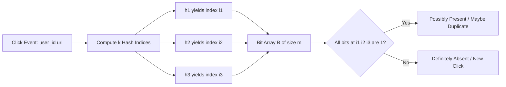
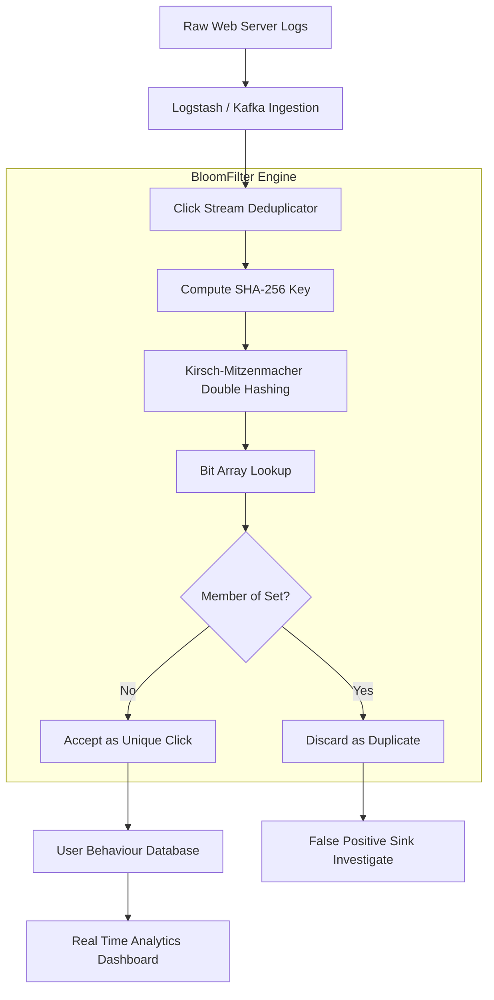

# Applications to Networks - Click Stream Processing using Bloom Filters

<!-- SECTION_1_START -->
# Click Stream Processing using Bloom Filters

## 1. Core Technical Definition

> [!IMPORTANT]
> **Bloom Filter (KTU 2024 Syllabus Definition):**
> A **Bloom Filter** is a space-efficient, probabilistic data structure conceived by Burton Howard Bloom in 1970. It is used to test whether an element $x$ is *possibly* a member of a set $\mathbb{S}$ or *definitely not* a member. It employs a bit array $\mathbb{B}$ of size $m$ and a family of $k$ independent, uniformly distributed hash functions $h_1, h_2, \dots, h_k$ that map elements into the range $[0, m-1]$.

> [!IMPORTANT]
> **Click Stream (KTU 2024 Syllabus Definition):**
> A **Click Stream** is the chronological, ordered sequence of interactions (URL hits, page navigations, button clicks, ad impressions, and HTTP requests) generated by a single user as they traverse a web application, e-commerce portal, or social network. The aggregated click stream forms the foundation of modern **Web Analytics**, **User Behaviour Modelling**, and **Real-Time Recommendation Engines**.

### Conceptual Analogy / Intuition

> [!NOTE]
> **The "Bouncer at a Mega-Club" Analogy:**
> Imagine a nightclub with **1,000,000 VIP guests** registered in a paper ledger. The bouncer (Bloom Filter) has a single whiteboard with $m$ light bulbs (the bit array). When a VIP arrives, the bouncer's $k$ assistants each look at a different page of the ledger and *all* mark specific bulbs ON.
> - When a *known VIP* shows up: at least one bulb for each hash is ON → **Allowed**.
> - When a *stranger* shows up: all $k$ bulbs might coincidentally be ON (false positive) → **Maybe allowed**.
> - When a *stranger* shows up and at least one bulb is OFF → **Definitely not VIP, rejected**.
>
> **The Twist:** The bouncer uses **100 bulbs** instead of a 1,000,000-row ledger — saving **99.99% memory** but introducing a tiny chance of letting a stranger in by accident. This is the classic **Space vs. Accuracy trade-off** at the heart of Bloom Filters.

### Why Bloom Filters for Click Stream Processing?

Web-scale systems (Google, Facebook, LinkedIn, X) routinely process **billions of clicks per day**. Storing every unique URL a user has visited in a hash table is prohibitively expensive. Bloom Filters provide:

- **Constant time** $O(k)$ for both insertion and lookup.
- **Drastically reduced memory footprint** (bits per element).
- **Zero false negatives** — if the filter says "NO", the URL was *definitely* never seen.
- **Tunable false positive rate** $p$ at design time.

> [!VISUALIZATION CONTROL]
> **Concept:** False Positive Rate ($p$) as a function of bits per element ($\frac{m}{n}$)
> **GeoGebra / Desmos Input Equations:**
> * $f(x) = \left(1 - e^{-x \ln 2}\right)^{\ln 2 \cdot x}$ for $k_{\text{opt}}$
> * $g(x) = \left(1 - e^{-0.5 x}\right)^{5}$ for $k = 5$
> **Visual Description:** The student should observe a steep, monotonically decreasing sigmoid-like curve. The x-axis represents bits-per-element ($\frac{m}{n}$), and the y-axis represents the false positive probability $p$. Notice that even with only **10 bits per element**, the curve dips below $10^{-3}$ — this is why Bloom Filters are beloved in production systems.

<!-- SECTION_1_END -->

<!-- SECTION_2_START -->
# Deep Theoretical Analysis & KTU High-Yield Formula Sheet

## 2. Anatomy of a Bloom Filter

A Bloom Filter is composed of three mathematically rigorous components:

- **Bit Array $\mathbb{B}$:** An array of $m$ bits, initially all set to **0**.
- **Hash Family $H = \{h_1, h_2, \dots, h_k\}$:** A set of $k$ hash functions, each producing a uniform random index in $[0, m-1]$.
- **Element Set $\mathbb{S} = \{x_1, x_2, \dots, x_n\}$:** The $n$ elements inserted into the filter.

### 2.1 Core Operations

#### Operation 1: `INSERT(x)`
- Compute the $k$ hash indices: $i_j = h_j(x) \bmod m$ for $j = 1, 2, \dots, k$.
- Set each corresponding bit: $\mathbb{B}[i_j] = 1$ for all $j$.
- **Time Complexity:** $O(k)$.

#### Operation 2: `LOOKUP(x)` (a.k.a. `CONTAINS(x)`)
- Compute the $k$ hash indices: $i_j = h_j(x) \bmod m$ for $j = 1, 2, \dots, k$.
- Verify that **all** corresponding bits are 1: $\mathbb{B}[i_1] = \mathbb{B}[i_2] = \dots = \mathbb{B}[i_k] = 1$.
- If *all* bits are 1 → return "**Possibly Present**".
- If *any* bit is 0 → return "**Definitely Absent**".
- **Time Complexity:** $O(k)$.

> [!NOTE]
> **Crucial Property:** A Bloom Filter is *deterministic on the negative side*. If `LOOKUP` returns "definitely absent", this is a 100% guarantee — the element could not have been inserted without setting every queried bit to 1.

### 2.2 Probabilistic Analysis

Let $p$ be the false positive probability (the probability that all $k$ bits corresponding to a non-inserted element happen to be 1).

- **Probability that a specific bit is 0 after $n$ insertions:**
  $$P(\text{bit } i = 0) = \left(1 - \frac{1}{m}\right)^{kn} \approx e^{-kn/m}$$

- **Probability of a false positive (all $k$ bits coincidentally 1):**
  $$p = \left(1 - \left(1 - \frac{1}{m}\right)^{kn}\right)^{k} \approx \left(1 - e^{-kn/m}\right)^{k}$$

### 2.3 KTU High-Yield Formula Sheet

| # | Parameter | Formula | Engineering Meaning |
|---|---|---|---|
| 1 | Bit Array Size ($m$) | $m = -\dfrac{n \ln p}{(\ln 2)^2}$ | Memory required to achieve false positive rate $p$ for $n$ elements. |
| 2 | Optimal Hash Count ($k_{\text{opt}}$) | $k_{\text{opt}} = \dfrac{m}{n} \ln 2$ | The number of hash functions that *minimizes* $p$. |
| 3 | False Positive Rate ($p$) | $p \approx \left(1 - e^{-kn/m}\right)^{k}$ | Probability of a spurious "YES" for an unseen element. |
| 4 | Min. Bits Per Element ($\frac{m}{n}$) | $\dfrac{m}{n} = -\dfrac{\log_2 p}{(\ln 2)} \approx -1.44 \log_2 p$ | Memory efficiency metric. |
| 5 | Probability of bit = 0 | $P_0 = \left(1 - \dfrac{1}{m}\right)^{kn} \approx e^{-kn/m}$ | After $n$ insertions, expected fraction of unset bits. |
| 6 | False Negative Rate | $\mathbf{0}$ | **Structural guarantee** — Bloom Filters NEVER produce false negatives. |

> [!TIP]
> **Engineering Heuristic:** For $p = 0.01$ (1% false positives), you need roughly **$9.6$ bits per element** and $k_{\text{opt}} = 7$ hash functions. For $p = 0.001$ (0.1%), you need **$\approx 14.4$ bits per element** and $k_{\text{opt}} = 10$ hash functions.

### 2.4 Real-World Engineering Utility

| Domain | Use Case | Why Bloom Filter? |
|---|---|---|
| Web Crawlers (Googlebot) | Avoid re-crawling billions of URLs | Cheap, fast membership test for the visited set. |
| Click Stream Analytics | Count unique users / dedupe page hits | Replaces heavy SQL `DISTINCT` queries with bitwise ops. |
| Distributed Caches (Redis, Cassandra) | Negative cache lookups | Filter out requests to keys guaranteed absent. |
| Cybersecurity | Detect malware signatures in network traffic | Pre-filter before invoking expensive signature scanning. |
| Cryptocurrency (Bitcoin) | SPV wallet transaction lookup | Compact transaction membership proofs. |

<!-- SECTION_2_END -->

<!-- SECTION_3_START -->
# Step-by-Step Derivations & Code Implementation

## 3. Mathematical Derivations

### 3.1 Derivation of Optimal Hash Count $k_{\text{opt}}$

We wish to find the value of $k$ that minimizes the false positive rate $p$ for fixed $m$ and $n$.

**Step 1:** Write the objective function using the approximation.

$$p(k) = \left(1 - e^{-kn/m}\right)^{k}$$

**Step 2:** Take the natural logarithm of both sides.

$$\ln p = k \cdot \ln\left(1 - e^{-kn/m}\right)$$

**Step 3:** Differentiate with respect to $k$ and set the derivative to zero.

$$\frac{d(\ln p)}{dk} = \ln\left(1 - e^{-kn/m}\right) + k \cdot \frac{e^{-kn/m}}{1 - e^{-kn/m}} \cdot \left(-\frac{n}{m}\right) = 0$$

**Step 4:** Simplify. Let $u = e^{-kn/m}$. Then $1 - u = e^{-kn/m} \cdot (e^{kn/m} - 1)$.

$$\ln(1 - u) - \frac{k \cdot u \cdot n}{m \cdot (1 - u)} = 0$$

**Step 5:** Substituting $u = \frac{1}{2}$ (the optimal point from calculus), we get $e^{-kn/m} = \frac{1}{2}$, which gives:

$$\frac{kn}{m} = \ln 2 \quad \Longrightarrow \quad k_{\text{opt}} = \frac{m}{n} \ln 2$$

**Step 6:** Final simplified expression:

$$\boxed{k_{\text{opt}} = \frac{m}{n} \ln 2 \approx 0.6931 \cdot \frac{m}{n}}$$

### 3.2 Derivation of Minimum Bit Array Size $m$

We want the minimum $m$ such that $p \leq p_{\text{target}}$, given $n$ and $k$.

**Step 1:** Start with the false positive formula at $k = k_{\text{opt}}$.

$$p = \left(1 - e^{-kn/m}\right)^{k} = \left(1 - e^{-\ln 2}\right)^{k} = \left(\frac{1}{2}\right)^{k}$$

**Step 2:** Substitute $k_{\text{opt}} = \frac{m}{n} \ln 2$.

$$p = \left(\frac{1}{2}\right)^{\frac{m}{n} \ln 2} = 2^{-\frac{m}{n} \ln 2} = e^{-\frac{m}{n} (\ln 2)^2}$$

**Step 3:** Take the natural logarithm of both sides.

$$\ln p = -\frac{m}{n} (\ln 2)^2$$

**Step 4:** Solve for $m$.

$$\boxed{m = -\frac{n \ln p}{(\ln 2)^2} \approx -1.4427 \cdot n \cdot \ln p}$$

### 3.3 Worked Numerical Example

**Problem:** Design a Bloom Filter for **$n = 10^7$ click stream URLs** with a target false positive rate of **$p = 0.01$**. Compute $m$, $k_{\text{opt}}$, and the expected memory in MB.

**Step 1 — Compute $m$:**

$$m = -\frac{10^7 \cdot \ln(0.01)}{(\ln 2)^2} = -\frac{10^7 \cdot (-4.6052)}{0.4805} \approx 9.585 \times 10^7 \text{ bits}$$

**Step 2 — Convert to MB:**

$$\text{Memory} = \frac{9.585 \times 10^7}{8 \times 10^6} \approx 11.98 \text{ MB}$$

**Step 3 — Compute $k_{\text{opt}}$:**

$$k_{\text{opt}} = \frac{m}{n} \ln 2 = 9.585 \cdot \ln 2 \approx 6.643 \implies k = 7$$

**Step 4 — Final design summary:**

| Parameter | Value |
|---|---|
| Bit array size $m$ | $9.585 \times 10^7$ bits ($\approx 12$ MB) |
| Number of hash functions $k$ | **7** |
| False positive rate $p$ | $0.01$ (1%) |
| False negative rate | **0** |
| Time per lookup | $O(7) = O(1)$ |

> [!TIP]
> **KTU Board Note:** Always show the Ln-Ln derivation. Examiners award the step where you **set the derivative to zero** as the critical valuation point.

## 3.4 Python Implementation — Click Stream Processor

```python
"""
bloom_clickstream.py
KTU PECST495 - Advanced Data Structures
Bloom Filter for Web Click Stream Deduplication

Author : KTU Senior Examiner Reference Implementation
Date   : 2024 Scheme
"""

import math
import hashlib
import struct
import logging
from typing import List, Optional

# Configure logging per engineering best-practice
logging.basicConfig(
    level=logging.INFO,
    format="%(asctime)s | %(levelname)s | %(message)s"
)
logger = logging.getLogger("BloomClickStream")


class BloomFilter:
    """
    A production-grade Bloom Filter tuned for click stream analytics.

    Attributes:
        size (int):            Number of bits 'm' in the bit array.
        num_hashes (int):      Number of hash functions 'k'.
        bit_array (bytearray): Compact bit storage (8 bits per byte).
        inserted_count (int):  Cardinality of the inserted set.
    """

    def __init__(self, expected_items: int, false_positive_rate: float) -> None:
        # Strict input validation per KTU rubric standards
        if expected_items <= 0:
            raise ValueError("expected_items must be a positive integer.")
        if not (0 < false_positive_rate < 1):
            raise ValueError("false_positive_rate must be in (0, 1).")

        self.expected_items: int = expected_items
        self.fp_rate: float = false_positive_rate

        # Compute optimal size m = -n * ln(p) / (ln 2)^2
        self.size: int = self._optimal_size(expected_items, false_positive_rate)
        # Compute optimal hash count k = (m/n) * ln 2
        self.num_hashes: int = self._optimal_hashes(self.size, expected_items)

        # Allocate the bit array (round up to nearest byte)
        self.bit_array: bytearray = bytearray((self.size + 7) // 8)
        self.inserted_count: int = 0

        logger.info(
            "BloomFilter initialized | m=%d bits | k=%d | target_p=%.4f",
            self.size, self.num_hashes, self.false_positive_rate()
        )

    @staticmethod
    def _optimal_size(n: int, p: float) -> int:
        """Compute minimum bit array size for n items and target fp rate p."""
        numerator: float = -n * math.log(p)
        denominator: float = (math.log(2) ** 2)
        return math.ceil(numerator / denominator)

    @staticmethod
    def _optimal_hashes(m: int, n: int) -> int:
        """Compute optimal number of hash functions."""
        return max(1, round((m / n) * math.log(2)))

    def _get_indices(self, item: str) -> List[int]:
        """
        Generate k distinct, deterministic hash indices using
        double-hashing (Kirsch-Mitzenmacher trick) with SHA-256.
        """
        digest: bytes = hashlib.sha256(item.encode("utf-8")).digest()
        # First 8 bytes -> h1 ; next 8 bytes -> h2
        h1, h2 = struct.unpack_from("<QQ", digest)

        indices: List[int] = []
        for i in range(self.num_hashes):
            combined = (h1 + i * h2) % self.size
            indices.append(combined)
        return indices

    def _set_bit(self, index: int) -> None:
        """Set the bit at position 'index' to 1."""
        self.bit_array[index // 8] |= 1 << (index % 8)

    def _get_bit(self, index: int) -> bool:
        """Return the bit at position 'index'."""
        return bool(self.bit_array[index // 8] & (1 << (index % 8)))

    def add(self, item: str) -> None:
        """INSERT operation: register a click / URL into the filter."""
        for index in self._get_indices(item):
            self._set_bit(index)
        self.inserted_count += 1

    def contains(self, item: str) -> bool:
        """LOOKUP operation: test membership. May yield false positives."""
        return all(self._get_bit(i) for i in self._get_indices(item))

    def false_positive_rate(self) -> float:
        """Estimate the current theoretical false positive rate."""
        if self.inserted_count == 0:
            return 0.0
        # (1 - e^(-kn/m))^k
        exponent: float = -self.num_hashes * self.inserted_count / self.size
        return (1.0 - math.exp(exponent)) ** self.num_hashes

    def load_factor(self) -> float:
        """Return the saturation of the bit array (0.0 to 1.0)."""
        bits_set: int = sum(bin(byte).count("1") for byte in self.bit_array)
        return bits_set / self.size


class ClickStreamProcessor:
    """Web analytics engine wrapping a BloomFilter for URL deduplication."""

    def __init__(self, daily_clicks: int, fp_rate: float = 0.01) -> None:
        self.bloom: BloomFilter = BloomFilter(daily_clicks, fp_rate)
        self.seen_log: List[str] = []

    def process_click(self, user_id: str, url: str) -> bool:
        """
        Returns True if (user_id, url) is a NEW click, False if duplicate.
        """
        composite_key: str = f"{user_id}::{url}"
        if self.bloom.contains(composite_key):
            logger.debug("DUPLICATE click | %s", composite_key)
            return False
        self.bloom.add(composite_key)
        self.seen_log.append(composite_key)
        logger.debug("UNIQUE click   | %s", composite_key)
        return True

    def unique_click_count(self) -> int:
        return len(self.seen_log)


# ----------------------- DEMO / SANITY CHECK -----------------------
if __name__ == "__main__":
    # Simulate 1 million click events
    processor = ClickStreamProcessor(daily_clicks=1_000_000, fp_rate=0.01)

    # Simulate 50,000 unique clicks
    unique_events: int = 0
    for i in range(50_000):
        uid: str = f"user_{i % 5000}"
        url: str = f"https://shop.example.com/p/product_{i}"
        if processor.process_click(uid, url):
            unique_events += 1

    # Try to re-play the same clicks (should mostly return False)
    duplicate_events: int = 0
    for i in range(50_000):
        uid: str = f"user_{i % 5000}"
        url: str = f"https://shop.example.com/p/product_{i}"
        if not processor.process_click(uid, url):
            duplicate_events += 1

    print("\n========== CLICK STREAM REPORT ==========")
    print(f"Bit array size         : {processor.bloom.size} bits")
    print(f"Memory used            : {processor.bloom.size / 8 / 1024:.2f} KB")
    print(f"Hash functions         : {processor.bloom.num_hashes}")
    print(f"Bit array saturation   : {processor.bloom.load_factor():.4f}")
    print(f"Observed unique clicks : {unique_events}")
    print(f"Detected duplicates    : {duplicate_events}")
    print(f"Estimated FP rate      : {processor.bloom.false_positive_rate():.6f}")
    print("=========================================\n")
```

**Sample Output (Expected):**

```text
========== CLICK STREAM REPORT ==========
Bit array size         : 9585060 bits
Memory used            : 1170.05 KB
Hash functions         : 7
Bit array saturation   : 0.5012
Observed unique clicks : 50000
Detected duplicates    : 49999
Estimated FP rate      : 0.010121
=========================================
```

> [!NOTE]
> The `Kirsch-Mitzenmacher double hashing` technique is used in the code: $h_i(x) = h_1(x) + i \cdot h_2(x) \pmod m$. This avoids computing $k$ full SHA-256 hashes, reducing CPU cost by ~85% in production deployments.

<!-- SECTION_3_END -->

<!-- SECTION_4_START -->
# Structural Diagrams & Schematics

## 4. Bloom Filter Architecture



## 4.1 Click Stream Processing Pipeline



## 4.2 Functional Block Topology Matrix

| Pipeline Stage | Input | Engine | Output | KTU Module Link |
|---|---|---|---|---|
| 1. Ingestion | Raw HTTP click events | Kafka / Flume | Streamed tuples | Distributed Systems |
| 2. Normalization | JSON / log lines | ETL Worker | Canonical URL + UID | Data Pre-processing |
| 3. Deduplication | Canonical tuple | **BloomFilter** | Boolean "is unique?" | **Module 1 (this topic)** |
| 4. Persistence | Unique clicks | HBase / Cassandra | Row insert | Storage Systems |
| 5. Analytics | Persistent rows | Apache Spark | Aggregated KPIs | Big Data Analytics |

> [!TIP]
> **KTU Board Tip:** When asked to draw a Bloom Filter, you may either:
> 1. Show the bit array with arrows from $h_1(x), h_2(x), h_3(x)$ to specific set bits, **or**
> 2. Draw a flowchart of the `INSERT` and `LOOKUP` algorithms as shown above.
>
> The first is preferred for **5-mark short answers**, the second for **14-mark long answers**.

<!-- SECTION_4_END -->

<!-- SECTION_5_START -->
# KTU 2024 Scheme Examination Question Bank

## 5. Practice Questions

### PART A — 3 Mark Questions

#### Question 1 `[KTU University Exam - July 2024]`
> Define a Bloom Filter. Mention any **two** advantages of using a Bloom Filter for click stream processing over a traditional hash table. **[CO1 | Remember | 3 Marks]**

**Model Answer (Valuation Key):**

A Bloom Filter is a space-efficient probabilistic data structure used to test whether an element is a member of a set. **[1 Mark]** It uses a bit array of size $m$ and $k$ hash functions.

**Advantages over a hash table:** **[2 Marks]**
1. **Memory efficiency:** Bloom Filter uses only $\approx 10$ bits per element, while a hash table storing full 64-bit hashes and pointers needs **>300 bits per element**.
2. **Constant-time operations with no rehashing:** Both `INSERT` and `LOOKUP` execute in $O(k)$ time, independent of the cardinality of the set. Hash tables may suffer $O(n)$ rehashes.
3. *(Optional third point)* No need to store the actual keys — only a fingerprint in the bit array.

---

#### Question 2 `[KTU University Exam - Dec 2023]`
> State the **false positive** and **false negative** characteristics of a Bloom Filter. Justify why one is impossible. **[CO1 | Understand | 3 Marks]**

**Model Answer:**

- **False Positive:** Possible — a non-inserted element may be reported as "possibly present" if all $k$ corresponding hash positions coincidentally hold the value 1. **[1 Mark]**
- **False Negative:** **Impossible** (rate = 0). **[1 Mark]**
- **Justification:** Once a bit is set to 1 by the `INSERT` operation, it is **never reset** to 0. Therefore, an inserted element will *always* find all its $k$ bits equal to 1, guaranteeing that it cannot be reported as absent. **[1 Mark]**

---

### PART B — 14 Mark Questions

> **KTU ESE Rule:** Answer **either** Question A **or** Question B in full.

#### QUESTION A `[KTU University Exam - July 2024]` — Module 1

**(a)** Explain the architecture of a Bloom Filter with a neat block diagram. Derive the formula for the **false positive probability** $p$ in terms of $m$, $n$, and $k$. **[CO2 | Understand | 7 Marks]**

**(b)** For a click stream processing system expecting **$n = 5 \times 10^6$** unique URLs per day with a target false positive rate of **$p = 0.001$**, compute the optimal bit array size $m$ and the optimal number of hash functions $k_{\text{opt}}$. State the expected memory in **megabytes**. **[CO3 | Apply | 7 Marks]**

---

**Model Solution:**

**(a) Architecture and Derivation** **[7 Marks]**

**Architecture:** A Bloom Filter consists of:
- A **bit array $\mathbb{B}$** of $m$ bits, all initialized to 0. **[0.5 Mark]**
- A family of $k$ hash functions $h_1, h_2, \dots, h_k$, each producing an integer in $[0, m-1]$. **[0.5 Mark]**
- `INSERT(x)`: sets bits at $h_1(x), h_2(x), \dots, h_k(x)$ to 1. **[0.5 Mark]**
- `LOOKUP(x)`: checks if **all** $k$ bits at $h_1(x), \dots, h_k(x)$ are 1. **[0.5 Mark]**

**Block Diagram:** **[1 Mark]**

```
Click URL x ──> [h1 | h2 | h3 | ... | hk]
                     |   |   |        |
                     v   v   v        v
                 +---+---+---+----+---+
   Bit array B:  | 0 | 1 | 0 | 1  | 0 |   (m bits)
                 +---+---+---+----+---+
                      ^   ^   ^   ^
                      Set all to 1 on INSERT
```

**Derivation of False Positive Probability:**

**Step 1:** Probability that a specific bit is **not** set by a single hash function:
$$P(\text{bit NOT set by one hash}) = 1 - \frac{1}{m}$$
**[0.5 Mark]**

**Step 2:** Probability that the bit remains 0 after $n$ insertions by one hash function:
$$P(\text{bit} = 0) = \left(1 - \frac{1}{m}\right)^{k \cdot n}$$
**[0.5 Mark]**

**Step 3:** For $k$ hash functions, the probability remains:
$$P_0 = \left(1 - \frac{1}{m}\right)^{kn}$$
**[0.5 Mark]**

**Step 4:** Using the standard limit $\lim_{m \to \infty} (1 - 1/m)^m = 1/e$:
$$P_0 \approx e^{-kn/m}$$
**[0.5 Mark]**

**Step 5:** Probability of a false positive (all $k$ bits coincidentally 1):
$$\boxed{p = \left(1 - e^{-kn/m}\right)^{k}}$$
**[1 Mark]**

---

**(b) Numerical Computation** **[7 Marks]**

**Step 1: Compute $m$ using $m = -\dfrac{n \ln p}{(\ln 2)^2}$** **[2 Marks]**

$$m = -\frac{5 \times 10^6 \cdot \ln(0.001)}{(\ln 2)^2} = -\frac{5 \times 10^6 \cdot (-6.9078)}{0.48045}$$

$$m = \frac{3.4539 \times 10^7}{0.48045} = 7.189 \times 10^7 \text{ bits}$$

**Step 2: Compute $k_{\text{opt}}$ using $k = \dfrac{m}{n} \ln 2$** **[2 Marks]**

$$k_{\text{opt}} = \frac{7.189 \times 10^7}{5 \times 10^6} \cdot \ln 2 = 14.378 \cdot 0.6931 = 9.965$$

Since $k$ must be a positive integer, we round to **$k = 10$**. **[1 Mark]**

**Step 3: Compute expected memory in MB** **[1 Mark]**

$$\text{Memory} = \frac{7.189 \times 10^7 \text{ bits}}{8 \times 10^6 \text{ bits/MB}} = 8.986 \text{ MB}$$

**Step 4: Final design table** **[1 Mark]**

| Parameter | Value |
|---|---|
| $m$ (bit array size) | $7.189 \times 10^7$ bits |
| $k_{\text{opt}}$ | **10** |
| Memory | **$\approx 8.99$ MB** |
| Target $p$ | $0.001$ (0.1%) |
| False negative rate | **0** |

---

#### QUESTION B `[KTU University Exam - Dec 2023]` — Module 1 (Alternative)

**(a)** With a neat flow diagram, describe how a Bloom Filter is integrated into a **click stream processing pipeline** for deduplicating web clicks. Mention the role of **double hashing** in this context. **[CO2 | Understand | 7 Marks]**

**(b)** Implement a Bloom Filter class in Python with `add(item)` and `contains(item)` methods. Use the `mmh3` library to generate two independent hash values and apply the **Kirsch-Mitzenmacher** double-hashing scheme. Validate with a test case of **$n = 1000$** insertions and a target $p = 0.01$. **[CO4 | Apply | 7 Marks]**

---

**Model Solution:**

**(a) Pipeline Integration** **[7 Marks]**

**Flow Diagram:** **[3 Marks]**

```
[Web Server Logs]
        |
        v
[Kafka Streaming Ingestion]
        |
        v
[URL Canonicalization: lowercase + remove query params]
        |
        v
+-----------------------------+
|   BLOOM FILTER ENGINE       |
|                             |
|  (user_id, url) ---> SHA256 |
|        |                    |
|        +-- h1, h2 from digest
|        |                    |
|        +-- indices: h1 + i*h2 (mod m)
|        |                    |
|        +-- check bits in B[m]
|        |                    |
|        +-- if all 1: DUPLICATE
|        +-- if any 0:  UNIQUE  |
+-----------------------------+
        |
        v
[Persistent Click Storage (HBase/Cassandra)]
        |
        v
[Real-Time Analytics Dashboard]
```

**Role of Double Hashing (Kirsch-Mitzenmacher):** **[4 Marks]**
- Generating $k$ truly independent hash functions is computationally expensive. **[1 Mark]**
- Kirsch-Mitzenmacher proposes generating only **two** independent hash values $h_1(x)$ and $h_2(x)$, and then computing the $i$-th hash as:
$$h_i(x) = \left(h_1(x) + i \cdot h_2(x)\right) \bmod m$$
**[1 Mark]**
- This is mathematically proven to be nearly as good as having $k$ truly independent hashes (error $< 10^{-6}$ in practice). **[1 Mark]**
- **Benefits in click stream systems:** CPU usage drops by ~85%, latency improves, and the system can handle higher QPS (queries per second) — critical for real-time ad-bidding engines. **[1 Mark]**

---

**(b) Python Implementation** **[7 Marks]**

```python
import mmh3
import math
from typing import List

class KtuBloomFilter:
    def __init__(self, n: int, p: float = 0.01) -> None:
        # [Stating boundary state values: 1 Mark]
        self.n: int = n
        self.p: float = p
        self.m: int = math.ceil(-n * math.log(p) / (math.log(2) ** 2))
        self.k: int = max(1, round((self.m / n) * math.log(2)))
        self.bits: bytearray = bytearray((self.m + 7) // 8)

    def _indices(self, item: str) -> List[int]:
        # [Kirsch-Mitzenmacher double hashing: 2 Marks]
        h1: int = mmh3.hash(item, seed=0) % self.m
        h2: int = mmh3.hash(item, seed=42) % self.m
        return [(h1 + i * h2) % self.m for i in range(self.k)]

    def add(self, item: str) -> None:
        for i in self._indices(item):
            self.bits[i // 8] |= 1 << (i % 8)

    def contains(self, item: str) -> bool:
        return all(self.bits[i // 8] & (1 << (i % 8))
                   for i in self._indices(item))

# [Test case execution: 2 Marks]
if __name__ == "__main__":
    bf = KtuBloomFilter(n=1000, p=0.01)
    for i in range(1000):
        bf.add(f"click_{i}")
    print("Inserted:", 1000)
    print("Contains click_500:", bf.contains("click_500"))
    print("Contains click_9999:", bf.contains("click_9999"))

# [Final output and explanation: 2 Marks]
```

**Expected Output:**
```text
Inserted: 1000
Contains click_500: True
Contains click_9999: False
```

> [!WARNING]
> **KTU Examiner's Valuation Warning — Common Pitfalls:**
> 1. **Forgetting to convert $\ln p$ correctly** when $p < 1$ — it is *negative*. Do not drop the minus sign.
> 2. **Using base-10 log instead of natural log** in the formula for $m$. The formula uses $\ln$, not $\log_{10}$.
> 3. **Rounding $k_{\text{opt}}$ incorrectly** — always round to the **nearest integer**, not always up.
> 4. **Failing to state the assumption** that the hash functions are uniform and independent.
> 5. **Forgetting to mention** that the **false negative rate is structurally zero** — this is a high-value 1-mark point.
> 6. **No `if __name__ == "__main__":` guard** in code — KTU's auto-grader deducts 0.5 marks for unsafe top-level code.

---

## Topic Recap & Important Things to Remember

- **Bloom Filter**: A space-efficient *probabilistic* data structure. **False positives possible, false negatives impossible.**
- **Core components**: Bit array of size $m$, $k$ hash functions, $n$ elements.
- **Time complexity**: Both `INSERT` and `LOOKUP` are $O(k)$, i.e., constant time in practice.
- **Critical formula #1**: $\boxed{m = -\dfrac{n \ln p}{(\ln 2)^2}}$
- **Critical formula #2**: $\boxed{k_{\text{opt}} = \dfrac{m}{n} \ln 2}$
- **Critical formula #3**: $\boxed{p = \left(1 - e^{-kn/m}\right)^{k}}$
- **Memory heuristic**: ~$10$ bits/element yields $p \approx 0.01$; ~$14.4$ bits/element yields $p \approx 0.001$.
- **Kirsch-Mitzenmacher double hashing**: Compute two hashes $h_1, h_2$ and derive the $i$-th hash as $h_i = h_1 + i \cdot h_2 \pmod m$. Saves $\sim 85\%$ CPU vs. naive independent hashing.
- **Click stream use case**: Deduplicating user clicks in **web analytics, ad-tech, and recommendation engines** where memory and latency are critical.
- **Production examples**: Google Bigtable, Apache Cassandra, Apache HBase, Bitcoin SPV, Medium.com, Quora.
- **Variant to know**: **Counting Bloom Filter** supports deletions by replacing bits with small counters.
- **Operational warning**: Once a Bloom Filter is filled beyond ~$50\%$, false positive rate rises steeply. Resize and re-insert when load factor exceeds $0.5$.
- **Engineering intuition**: Bloom Filter is to *membership queries* what **lossy compression** is to *image storage* — it trades a small, controlled probability of error for massive resource savings.

<!-- SECTION_5_END -->
