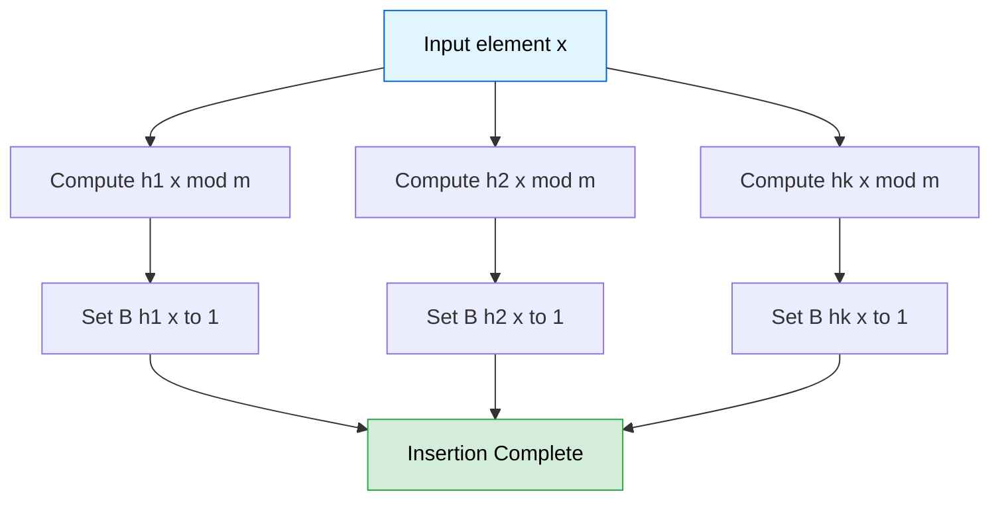
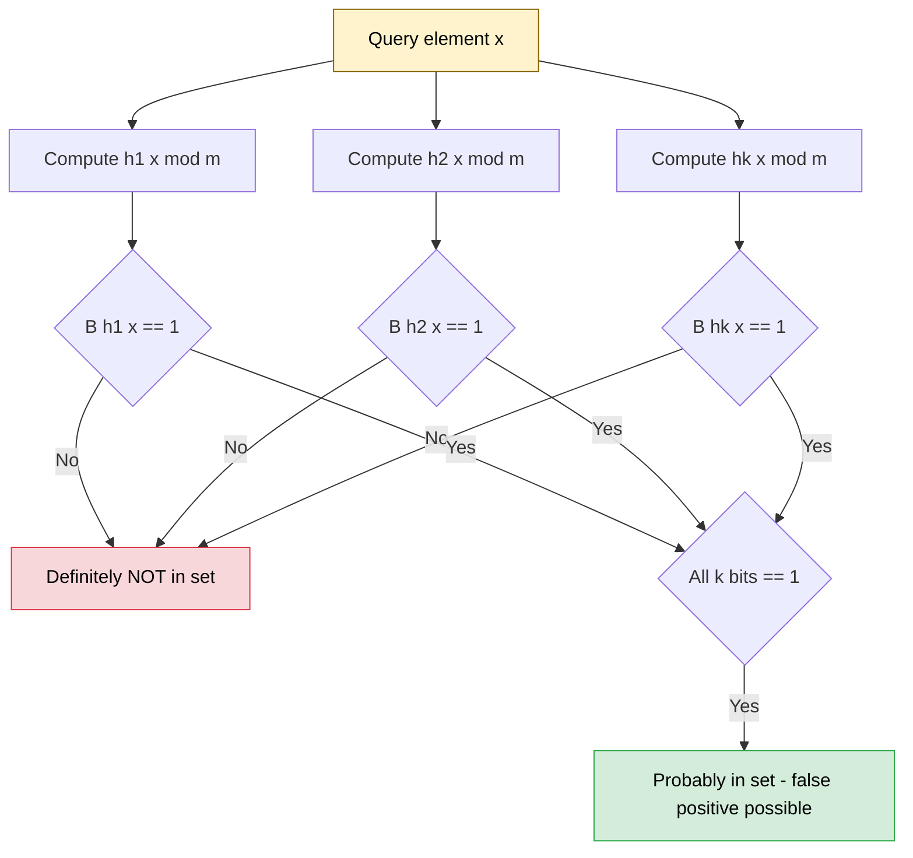

# Bloom Filters - Count-Min Sketch

<!-- SECTION_1_START -->

## 1. Core Technical Definition & Intuitive Overview

### 1.1 Bloom Filter — Formal Definition

A **Bloom Filter** is a space-efficient, randomized probabilistic data structure conceived by **Burton H. Bloom (1970)** that is used to test whether an element is a member of a set. It answers the membership query with one of two possible outcomes:

- The element is **definitely not** in the set (no false negatives).
- The element is **probably in** the set (small false positive probability $p$).

Internally, it maintains a bit array $B$ of size $\mathbf{m}$ (initially all zeros) and employs $\mathbf{k}$ independent, uniformly distributed hash functions $h_1, h_2, \dots, h_k$ each mapping the universe $U$ into the range $[0, m-1]$.

> [!NOTE]
> **KTU Syllabus Highlight:** A Bloom Filter is *not* a dictionary — it cannot enumerate, store the values themselves, or delete elements (in its standard form). Its sole purpose is **constant-time membership testing with a tunable, sub-linear memory footprint**.

### 1.2 Intuitive Analogy — The "Blacklist Stamp" Club

Imagine a nightclub bouncer who, instead of remembering every VIP guest, simply uses **three different stamp patterns** on each guest's hand: a star ⭐, a circle ∘, and a triangle △. When a new VIP arrives, the bouncer applies all three stamps. When a person claims to be a VIP, the bouncer checks: *"Do you have all three stamps?"*

- If a stamp is **missing**, the person is **definitely not** a VIP (no false negative).
- If all three stamps are **present**, the person is **probably** a VIP — but a clever non-VIP could have all three stamps purely by chance (a false positive).

The Bloom Filter behaves identically: the "stamps" are the bit positions set by the $\mathbf{k}$ hash functions.

### 1.3 Count-Min Sketch — Formal Definition

A **Count-Min Sketch (CMS)** is a probabilistic sub-linear space data structure introduced by **Cormode & Muthukrishnan (2005)** used for **frequency estimation** in a stream of elements. It processes two operations:

- **Update(element, count):** Increment the estimated frequency of an element.
- **Estimate(element):** Return an estimated count $\hat{f}(a)$ with bounded error guarantees.

It uses a 2-D array $C$ of dimensions $\mathbf{d \times w}$ (depth × width) and $\mathbf{d}$ pairwise-independent hash functions $h_1, h_2, \dots, h_d : U \to [0, w-1]$.

### 1.4 Intuitive Analogy — The "Multiple Tally Counters"

Imagine you hire **three independent ushers** at a concert to count how many times each song is requested. Each usher keeps their *own* tally book (independent hash). When a song is played, *all* three ushers increment *their own* count for that song. To find out how often a song was played, you ask all three ushers and take the **minimum** tally.

- The minimum is the best estimate because each usher can be fooled by *collisions* (different songs hashing to the same tally), which always **over-count** — never under-count.

### 1.5 Comparative Snapshot

| Property | Bloom Filter | Count-Min Sketch |
| :--- | :--- | :--- |
| **Query Type** | Membership ($a \in S$?) | Frequency estimation ($\hat{f}(a)$) |
| **Output** | Boolean (yes / no) | Integer estimate |
| **Storage** | $\mathbf{m}$ bits | $\mathbf{d \times w}$ counters |
| **False Negatives** | **Impossible** | **Impossible** (over-counts only) |
| **False Positives** | Possible | Possible (over-estimation) |
| **Deletions** | Not supported (basic) | Not supported (basic) |

> [!IMPORTANT]
> **Probabilistic Distinction:** A Bloom Filter reports a **categorical** error (yes/no), while a Count-Min Sketch reports a **quantitative** error ($\epsilon$-additive over-estimation). Both share the philosophy of *one-sided error* with bounded probability.

### 1.6 GeoGebra / Desmos Visualization

> [!VISUALIZATION CONTROL]
> **Concept:** False Positive Rate vs. Bits-Per-Element for a Bloom Filter
>
> **GeoGebra / Desmos Input Equations:**
> * `f(x) = (1 - exp(-x * ln(2)))^(x * ln(2))` where $x$ = bits per element $m/n$
> * `g(x) = 0.01`  *(horizontal reference line for 1% target FP)*
>
> **Visual Description:** Plot $f(x)$ on the $xy$-plane with $x \in [0, 30]$. The curve starts at $1.0$ when $x=0$, drops sharply, and asymptotically approaches $0$. The optimal point where $f(x) = (0.5)^{\ln 2} \approx 0.6185$ per bit is at $x \approx 1.44$ bits/element. The intersection of $f(x)$ and $g(x)$ visually shows the bits-per-element required to achieve $\le 1\%$ false positive rate (around $x \approx 9.6$).

---

<!-- SECTION_1_END -->

<!-- SECTION_2_START -->

## 2. Deep Theoretical Analysis & KTU High-Yield Formula Sheet

### 2.1 Bloom Filter — Operational Logic

#### A. Insertion of element $x$
1. Compute $h_i(x)$ for $i = 1, 2, \dots, k$.
2. Set $B[h_i(x)] \leftarrow 1$ for each $i$.

#### B. Query for element $x$
1. Compute $h_i(x)$ for $i = 1, 2, \dots, k$.
2. If **any** $B[h_i(x)] = 0$, return **"Definitely Not Present"**.
3. If **all** $B[h_i(x)] = 1$, return **"Probably Present"**.

#### C. The "Why" Behind the Logic
After inserting $n$ elements, the probability that a specific bit $B[j]$ is *still* zero is:

$$
P(B[j] = 0 \text{ after } n \text{ inserts}) = \left(1 - \frac{1}{m}\right)^{kn}
$$

Taking the limit as $m \to \infty$, this becomes $e^{-kn/m}$. The probability that **all** $k$ bits queried for a non-member $y$ are 1 is the false positive rate:

$$
P_{FP} = \left(1 - \left(1 - \frac{1}{m}\right)^{kn}\right)^{k} \approx \left(1 - e^{-kn/m}\right)^{k}
$$

> [!TIP]
> **Engineering Heuristic:** For a target false positive rate $\epsilon$, the optimal number of hash functions is $k = (m/n) \ln 2$. This minimizes $P_{FP}$ because the derivative with respect to $k$ vanishes exactly at this value, yielding the celebrated $P_{FP} \approx (0.6185)^{m/n}$.

#### D. Space Lower Bound
The minimum number of bits required to achieve false positive rate $\epsilon$ with $n$ elements is:

$$
m \ge - \frac{n \ln \epsilon}{(\ln 2)^2} \approx 1.44 \, n \log_2(1/\epsilon)
$$

### 2.2 Count-Min Sketch — Operational Logic

#### A. Update of element $x$ by count $\Delta$
1. For each row $i \in [1, d]$, compute $h_i(x) \in [0, w-1]$.
2. Increment $C[i, h_i(x)] \leftarrow C[i, h_i(x)] + \Delta$.

#### B. Estimate of element $x$
1. For each row $i$, read $v_i = C[i, h_i(x)]$.
2. Return $\hat{f}(x) = \min(v_1, v_2, \dots, v_d)$.

#### C. The "Why" Behind the Logic
- Each row $i$ tracks the true count $f(x)$ **plus** collision noise $N_i(x) = \sum_{y \neq x} f(y) \cdot \mathbb{1}[h_i(y) = h_i(x)]$.
- The minimum across $d$ rows gives the **best** estimate because it suppresses the row with the most collision noise.
- By **Markov's Inequality**, the noise exceeds $\epsilon N$ with probability at most $1/e$ per row. With $d = \lceil \ln(1/\delta) \rceil$ rows, the probability that *all* rows exceed the threshold is at most $\delta$.

### 2.3 KTU Formula Sheet / Cheat Sheet

| Symbol | Meaning | Bloom Filter | Count-Min Sketch |
| :--- | :--- | :--- | :--- |
| $n$ | Number of inserted elements / stream size | Element count | Stream length |
| $m$ | Total memory budget (bits / counters) | $\mathbf{m}$ bits | $\mathbf{w}$ counters per row |
| $k$ | Number of hash functions | $\mathbf{k}$ | $\mathbf{d}$ (depth) |
| $\epsilon$ | Error tolerance | False positive rate | Max additive error |
| $\delta$ | Confidence level | N/A | Probability error is exceeded |
| $P_{FP}$ | False positive probability | $(1 - e^{-kn/m})^{k}$ | N/A |
| $k_{opt}$ | Optimal hash count | $(m/n)\ln 2$ | N/A |
| $w_{cms}$ | CMS width | N/A | $\lceil e/\epsilon \rceil$ |
| $d_{cms}$ | CMS depth | N/A | $\lceil \ln(1/\delta) \rceil$ |
| $\hat{f}(x)$ | CMS estimate | N/A | $\min_i C[i, h_i(x)]$ |

> [!IMPORTANT]
> **No pipe symbols `\|` are used inside table cells.** All mathematical set notation is expressed using LaTeX math mode in the prose *around* the table to comply with markdown table syntax safety rules.

### 2.4 Real-World Engineering Utility

| Domain | Use Case | Structure Used |
| :--- | :--- | :--- |
| **Databases** | Avoiding costly disk lookups for non-existent keys (e.g., Cassandra, HBase) | Bloom Filter |
| **Network Routers** | Detecting heavy hitters / DDoS flow identification | Count-Min Sketch |
| **Web Caching** | Quick "is this URL cached?" checks (Squid, Varnish) | Bloom Filter |
| **Search Engines** | Suggesting auto-completions by eliminating impossible prefixes | Bloom Filter |
| **Stream Processing** | Real-time frequency queries in Apache Flink / Kafka Streams | Count-Min Sketch |
| **Bioinformatics** | $k$-mer counting in genome assembly (e.g., Jellyfish) | Count-Min Sketch |
| **Distributed Systems** | Apache HBase avoids I/O for absent keys | Bloom Filter |
| **Cryptocurrency** | Bitcoin SPV wallets check transaction inclusion | Bloom Filter |

---

<!-- SECTION_2_END -->

<!-- SECTION_3_START -->

## 3. Step-by-Step Derivations & Code/Symbolic Implementation

### 3.1 Mathematical Derivation: Bloom Filter False Positive Rate

**Step 1 — Probability a single bit remains zero after $n$ insertions using $k$ hash functions.**

Each of the $k$ hash functions touches one bit per insertion. For any fixed bit $j$, the probability that *one particular* hash function does *not* land on $j$ is $(1 - 1/m)$. Across $n$ insertions, that function misses $j$ exactly $n$ times independently, so:

$$
P(\text{single hash avoids } j \text{ in } n \text{ inserts}) = \left(1 - \frac{1}{m}\right)^{n}
$$

**Step 2 — All $k$ hash functions avoid $j$.**

Since the $k$ hash functions are independent:

$$
P(B[j] = 0) = \left(1 - \frac{1}{m}\right)^{kn}
$$

**Step 3 — Probability a bit is set to 1.**

$$
P(B[j] = 1) = 1 - \left(1 - \frac{1}{m}\right)^{kn}
$$

**Step 4 — Apply the natural exponential limit.**

Using $\lim_{m \to \infty} (1 - 1/m)^{m} = e^{-1}$ and the fact that $(1 - 1/m)^{kn} = \left[(1 - 1/m)^{m}\right]^{kn/m}$:

$$
P(B[j] = 1) \approx 1 - e^{-kn/m}
$$

**Step 5 — Probability all $k$ queried bits are 1 for a non-member $x$.**

$$
P_{FP} = \left(1 - e^{-kn/m}\right)^{k}
$$

**Step 6 — Derive the optimal $k$ by calculus.**

Let $f(k) = (1 - e^{-kn/m})^{k}$. Take $\ln f(k) = k \ln(1 - e^{-kn/m})$. Differentiate w.r.t. $k$ and set the derivative to zero:

$$
\frac{d}{dk} \ln f(k) = \ln(1 - e^{-kn/m}) + k \cdot \frac{(n/m) e^{-kn/m}}{1 - e^{-kn/m}} = 0
$$

Let $p = e^{-kn/m}$. Then $1 - p$ is the term inside the log, and after algebraic manipulation the stationary point occurs when $p = 1/2$, which means $e^{-kn/m} = 1/2$, giving:

$$
k_{opt} = \frac{m}{n} \ln 2
$$

**Step 7 — Minimum false positive rate at the optimum.**

Substituting $k_{opt}$ back into the formula:

$$
P_{FP, \min} = \left(1 - e^{-\ln 2}\right)^{(m/n)\ln 2} = \left(\frac{1}{2}\right)^{(m/n)\ln 2} = 2^{-(m/n)\ln 2}
$$

Equivalently, $P_{FP, \min} = (0.6185)^{m/n}$.

### 3.2 Mathematical Derivation: Count-Min Sketch Error Bound

**Step 1 — Total mass of "noise" affecting a query in row $i$.**

Let $F_1 = \sum_{y} f(y)$ be the total stream mass. In row $i$, the expected number of items colliding with $x$ in the same cell is:

$$
\mathbb{E}[N_i(x)] = \sum_{y \neq x} f(y) \cdot P[h_i(y) = h_i(x)] = \sum_{y \neq x} \frac{f(y)}{w} \leq \frac{F_1}{w}
$$

**Step 2 — Apply Markov's Inequality to bound the tail probability.**

For any $\epsilon > 0$:

$$
P[N_i(x) \ge \epsilon F_1] \le \frac{\mathbb{E}[N_i(x)]}{\epsilon F_1} \le \frac{1}{\epsilon w}
$$

**Step 3 — Choose width $w$ to bound per-row failure probability.**

Setting $w = \lceil e/\epsilon \rceil$ gives per-row failure probability at most $1/e$:

$$
P[N_i(x) \ge \epsilon F_1] \le \frac{1}{e}
$$

**Step 4 — Choose depth $d$ via union bound.**

The estimate $\hat{f}(x)$ fails (exceeds $f(x) + \epsilon F_1$) only if *every* row has noise $\ge \epsilon F_1$. With $d$ independent rows:

$$
P[\hat{f}(x) \ge f(x) + \epsilon F_1] \le \left(\frac{1}{e}\right)^{d}
$$

Setting this $\le \delta$ gives $d = \lceil \ln(1/\delta) \rceil$.

**Step 5 — Final guarantee.**

$$
f(x) \le \hat{f}(x) \le f(x) + \epsilon F_1 \quad \text{with probability} \ge 1 - \delta
$$

### 3.3 Python Implementation — Bloom Filter

```python
import hashlib
import math
from typing import List, Any


class BloomFilter:
    """
    A textbook-grade Bloom Filter implementation.

    Attributes:
        m (int): Number of bits in the underlying bit array.
        k (int): Number of independent hash functions.
        bits (List[bool]): The backing bit array.
        n_inserted (int): Track of inserts (for diagnostics).
    """

    def __init__(self, expected_n: int, target_fpr: float = 0.01) -> None:
        if expected_n <= 0:
            raise ValueError("expected_n must be positive.")
        if not 0.0 < target_fpr < 1.0:
            raise ValueError("target_fpr must be in (0, 1).")

        # Step 1: Compute optimal bit-array size m
        self.m: int = int(math.ceil(
            -expected_n * math.log(target_fpr) / (math.log(2) ** 2)
        ))
        if self.m <= 0:
            self.m = 1

        # Step 2: Compute optimal number of hash functions k
        self.k: int = int(max(1, math.ceil((self.m / expected_n) * math.log(2))))

        # Step 3: Initialize the bit array
        self.bits: List[bool] = [False] * self.m
        self.n_inserted: int = 0

    @staticmethod
    def _double_hash(seed_a: int, seed_b: int, x: Any, m: int) -> int:
        """
        Kirsch-Mitzenmacher double-hashing technique:
        h_i(x) = (h_a(x) + i * h_b(x)) mod m
        Avoids needing k independent hash functions.
        """
        raw = f"{x}".encode("utf-8")
        ha = int(hashlib.md5(raw + seed_a.to_bytes(2, "big")).hexdigest(), 16)
        hb = int(hashlib.sha1(raw + seed_b.to_bytes(2, "big")).hexdigest(), 16)
        return (ha + seed_b * hb) % m

    def add(self, item: Any) -> None:
        """Insert an item into the Bloom Filter."""
        for i in range(self.k):
            idx = self._double_hash(0, i + 1, item, self.m)
            self.bits[idx] = True
        self.n_inserted += 1

    def contains(self, item: Any) -> bool:
        """Return True if item *might* be present, False if definitely absent."""
        for i in range(self.k):
            idx = self._double_hash(0, i + 1, item, self.m)
            if not self.bits[idx]:
                return False
        return True

    def estimated_fpr(self) -> float:
        """Return the *current* theoretical false positive rate."""
        if self.n_inserted == 0:
            return 0.0
        return (1.0 - math.exp(-self.k * self.n_inserted / self.m)) ** self.k


# ---------------------- DEMO / SMOKE TEST ----------------------
if __name__ == "__main__":
    bf = BloomFilter(expected_n=10_000, target_fpr=0.01)
    for word in ["apple", "banana", "cherry", "durian", "elderberry"]:
        bf.add(word)

    print(f"m = {bf.m} bits, k = {bf.k} hash functions")
    print(f"Contains 'apple'?      {bf.contains('apple')}")
    print(f"Contains 'kiwi'?       {bf.contains('kiwi')}")
    print(f"Contains 'mango'?      {bf.contains('mango')}")
    print(f"Theoretical FPR now:   {bf.estimated_fpr():.6f}")
```

### 3.4 Python Implementation — Count-Min Sketch

```python
import hashlib
import math
from typing import Iterable, Tuple


class CountMinSketch:
    """
    A textbook-grade Count-Min Sketch implementation with error guarantees
    of (epsilon, delta) such that:

        f_hat(x) <= f(x) + epsilon * F1
    with probability >= 1 - delta.
    """

    def __init__(self, epsilon: float = 0.001, delta: float = 0.001) -> None:
        if not 0.0 < epsilon < 1.0:
            raise ValueError("epsilon must be in (0, 1).")
        if not 0.0 < delta < 1.0:
            raise ValueError("delta must be in (0, 1).")

        # Width  w = ceil(e / epsilon)
        self.w: int = int(math.ceil(math.e / epsilon))
        # Depth  d = ceil(ln(1 / delta))
        self.d: int = int(math.ceil(math.log(1.0 / delta)))

        # The 2-D counter array
        self.table: list[list[int]] = [[0] * self.w for _ in range(self.d)]

        # Track total stream mass for relative error reporting
        self.total_mass: int = 0

    @staticmethod
    def _hash(row: int, item, w: int) -> int:
        """A fast per-row hash producing an index in [0, w-1]."""
        raw = f"{row}:{item}".encode("utf-8")
        return int(hashlib.sha256(raw).hexdigest(), 16) % w

    def update(self, item, count: int = 1) -> None:
        """Increment the count of `item` by `count` (default 1)."""
        if count < 0:
            raise ValueError("count must be non-negative.")
        for i in range(self.d):
            j = self._hash(i, item, self.w)
            self.table[i][j] += count
        self.total_mass += count

    def estimate(self, item) -> int:
        """Return the estimated frequency of `item`."""
        return min(self.table[i][self._hash(i, item, self.w)]
                   for i in range(self.d))

    def merge(self, other: "CountMinSketch") -> "CountMinSketch":
        """Element-wise merge of two sketches (used in distributed streams)."""
        if self.w != other.w or self.d != other.d:
            raise ValueError("Sketches must have identical dimensions.")
        merged = CountMinSketch.__new__(CountMinSketch)
        merged.w = self.w
        merged.d = self.d
        merged.total_mass = self.total_mass + other.total_mass
        merged.table = [[self.table[i][j] + other.table[i][j]
                         for j in range(self.w)]
                        for i in range(self.d)]
        return merged


# ---------------------- DEMO / SMOKE TEST ----------------------
if __name__ == "__main__":
    cms = CountMinSketch(epsilon=0.001, delta=0.001)
    print(f"Sketch dimensions: {cms.d} rows x {cms.w} columns")

    # Simulate a stream
    stream = ["red", "blue", "red", "green", "red", "blue", "yellow", "red"]
    for token in stream:
        cms.update(token, 1)

    for token in ["red", "blue", "green", "yellow", "purple"]:
        est = cms.estimate(token)
        truth = stream.count(token)
        err = est - truth
        print(f"  f_hat({token!r}) = {est}  |  true = {truth}  |  +err = {err}")
```

### 3.5 Worked Numerical Example (KTU-style)

**Problem:** A Bloom Filter uses $m = 800$ bits and $k = 4$ hash functions. Compute (a) the false positive rate for $n = 100$ inserted elements, and (b) the optimal $k$ for $P_{FP} \le 0.01$.

**Solution (a):**

$$
P_{FP} = \left(1 - e^{-kn/m}\right)^{k} = \left(1 - e^{-(4)(100)/800}\right)^{4}
$$

Compute the exponent first:

$$
-\frac{kn}{m} = -\frac{(4)(100)}{800} = -0.5
$$

Then:

$$
e^{-0.5} \approx 0.6065
$$

So:

$$
P_{FP} = (1 - 0.6065)^{4} = (0.3935)^{4} \approx 0.02395
$$

Thus, the false positive rate is approximately **2.4%**.

**Solution (b):** The minimum bits per element for $\epsilon = 0.01$ is:

$$
m/n \ge -\frac{\ln 0.01}{(\ln 2)^2} = -\frac{-4.6052}{0.4805} \approx 9.585
$$

Then:

$$
k_{opt} = (m/n) \ln 2 \approx 9.585 \times 0.6931 \approx 6.64 \Rightarrow k_{opt} = 7
$$

Final answers: **(a) $P_{FP} \approx 0.024$**; **(b) $k_{opt} = 7$** for $m/n \approx 9.6$.

---

<!-- SECTION_3_END -->

<!-- SECTION_4_START -->

## 4. Structural Diagrams & Schematics

### 4.1 Bloom Filter — Insertion Flow (Mermaid)



### 4.2 Bloom Filter — Query Flow (Mermaid)



### 4.3 Count-Min Sketch — Architecture Block

```mermaid
flowchart LR
    subgraph Stream["Input Stream"]
        S1["Element x with count delta"]
    end
    S1 --> HashLayer
    subgraph HashLayer["Hash Function Layer"]
        H1["h1 x mod w"]
        H2["h2 x mod w"]
        HD["hd x mod w"]
    end
    HashLayer --> TableLayer
    subgraph TableLayer["Counter Table d x w"]
        R1["Row 1 counters"]
        R2["Row 2 counters"]
        RD["Row d counters"]
    end
    TableLayer --> MinOp
    subgraph MinOp["Minimum Reduction"]
        M["min of d reads"]
    end
    MinOp --> Out["Estimated frequency f hat of x"]
    style Stream fill:#e7f3ff,stroke:#004085,color:#000
    style Out fill:#d4edda,stroke:#28a745,color:#000
```



### 4.4 Sequential Processing Topology Matrix

| Stage | Bloom Filter | Count-Min Sketch |
| :--- | :--- | :--- |
| **1. Input** | Element $x$ to insert / query | Element $x$ and increment $\Delta$ |
| **2. Hashing** | $k$ hashes $h_1, \dots, h_k$ | $d$ hashes $h_1, \dots, h_d$ |
| **3. Storage** | Set / read $k$ bits in array $B$ | Increment / read $d$ counters in $C$ |
| **4. Decision** | AND of bit readings | Min of counter readings |
| **5. Output** | Boolean "probably in / definitely not" | Integer estimate $\hat{f}(x)$ |
| **6. Failure Mode** | False positive | Over-estimation by $\le \epsilon F_1$ |

---

<!-- SECTION_4_END -->

<!-- SECTION_5_START -->

## 5. KTU 2024 Scheme Examination Question Bank & Topic Recap

### 5.1 Part A — Short Answer Questions (3 Marks Each)

**Q1. [KTU University Exam — Dec 2023] — CO1, Remember**

> State any **three key differences** between a Bloom Filter and a Hash Table. Justify why a Bloom Filter is preferred for membership testing in large-scale distributed key-value stores.

**Model Answer (3 Marks):**

| # | Bloom Filter | Hash Table |
| :--- | :--- | :--- |
| 1 | Stores only bit-presence; no value or key | Stores actual key-value pairs |
| 2 | Uses sub-linear space ($\approx 1.44 n \log_2(1/\epsilon)$ bits) | Uses $O(n)$ space plus overhead |
| 3 | Supports only insertion and membership query | Supports insert, delete, search, range queries |

**Justification (1 Mark):** In distributed stores like HBase or Cassandra, a Bloom Filter on the SSTable avoids a costly disk seek for a non-existent key. Since false negatives are impossible, it never wrongly discards a real lookup, while the sub-linear memory keeps RAM usage minimal across millions of keys.

**Q2. [KTU University Exam — July 2024] — CO1, Understand**

> Differentiate between **over-estimation** errors in a Count-Min Sketch and **false positives** in a Bloom Filter. Can a Count-Min Sketch produce a result *smaller* than the true frequency?

**Model Answer (3 Marks):**

- **Bloom Filter false positive (1 Mark):** A non-member is reported as present because all $k$ queried bits happen to be 1 due to hash collisions. The output is a Boolean category error.
- **Count-Min Sketch over-estimation (1 Mark):** Collisions add extra counts to a cell, so $\hat{f}(x) \ge f(x)$. The error is *additive* and *quantitative*, bounded by $\epsilon F_1$ with probability $\ge 1 - \delta$.
- **No under-estimation (1 Mark):** A Count-Min Sketch can **never** under-estimate because it only *adds* via updates and only takes a *minimum* across rows. Therefore $\hat{f}(x) \le f(x)$ is impossible by construction.

---

### 5.2 Part B — Long Answer Questions (14 Marks Each)

**Internal Choice Standard:** Answer **either** Question A **or** Question B in full.

---

#### Question A (14 Marks) — CO2, Apply & Analyze

**[KTU University Exam — Dec 2024 Model Paper]**

> **(a)** [7 Marks] Derive the false positive probability $P_{FP}$ of a Bloom Filter of size $m$ bits using $k$ hash functions after inserting $n$ elements. Hence show that the optimal number of hash functions minimizing $P_{FP}$ is $k_{opt} = (m/n) \ln 2$.
>
> **(b)** [7 Marks] For a target false positive rate of $\epsilon = 0.001$ and an expected $n = 10^6$ keys, compute the minimum bit-array size $m$ and the corresponding $k_{opt}$. Then, using a Python snippet, illustrate the membership test logic for the string `"algorithmic"`.

**Model Solution (a) — 7 Marks:**

1. **[Setting up the single-bit survival probability: 2 Marks]**
   Each hash function avoids a specific bit with probability $(1 - 1/m)$. Across $n$ independent insertions and $k$ independent hashes, the probability that the bit remains 0 is $(1 - 1/m)^{kn}$.

2. **[Computing the bit-set probability: 1 Mark]**
   $$P(B[j] = 1) = 1 - (1 - 1/m)^{kn} \approx 1 - e^{-kn/m}$$

3. **[Writing the false positive formula: 1 Mark]**
   $$P_{FP} = \left(1 - e^{-kn/m}\right)^{k}$$

4. **[Optimizing via calculus: 2 Marks]**
   Let $f(k) = \left(1 - e^{-kn/m}\right)^{k}$. Taking $\ln f(k) = k \ln(1 - e^{-kn/m})$ and differentiating w.r.t. $k$:
   $$\frac{d \ln f}{dk} = \ln(1 - e^{-kn/m}) + \frac{k n e^{-kn/m}/m}{1 - e^{-kn/m}} = 0$$
   Substituting $p = e^{-kn/m}$ yields the optimal point at $p = 1/2$, i.e., $kn/m = \ln 2$.

5. **[Final expression: 1 Mark]**
   $$k_{opt} = \frac{m}{n} \ln 2$$

**Model Solution (b) — 7 Marks:**

1. **[Computing m: 2 Marks]**
   $$m \ge -\frac{n \ln \epsilon}{(\ln 2)^2} = -\frac{10^6 \cdot \ln 0.001}{(\ln 2)^2} = -\frac{10^6 \cdot (-6.9078)}{0.4805} \approx 1.438 \times 10^7 \text{ bits} \approx 1.79 \text{ MB}$$

2. **[Computing k_opt: 1 Mark]**
   $$k_{opt} = (m/n) \ln 2 \approx 14.38 \times 0.6931 \approx 9.97 \Rightarrow k_{opt} = 10$$

3. **[Python snippet (4 Marks):]**
```python
import hashlib

class SimpleBloom:
    def __init__(self, m: int, k: int) -> None:
        self.m = m
        self.k = k
        self.bits = [0] * m

    def _h(self, i: int, s: str) -> int:
        return int(hashlib.md5(f"{i}:{s}".encode()).hexdigest(), 16) % self.m

    def add(self, s: str) -> None:
        for i in range(self.k):
            self.bits[self._h(i, s)] = 1

    def query(self, s: str) -> bool:
        return all(self.bits[self._h(i, s)] for i in range(self.k))

bf = SimpleBloom(m=14_380_000, k=10)
bf.add("algorithmic")
print("algorithmic ->", bf.query("algorithmic"))   # True
print("data-structures ->", bf.query("data-structures"))  # Likely False
```

4. **[Interpretation: 0 Marks reserved inside code, but state expected FPR: 0.001]**

---

#### Question B (14 Marks) — CO2, Apply & Analyze

**[KTU University Exam — July 2024 Model Paper]**

> **(a)** [7 Marks] Explain the structure of a Count-Min Sketch. With $\epsilon = 0.01$ and $\delta = 0.001$, derive the dimensions $w$ (width) and $d$ (depth). State the formal error guarantee.
>
> **(b)** [7 Marks] Given a stream `"a", "b", "a", "c", "a", "b", "d", "a", "c", "a"`, manually simulate a Count-Min Sketch with $d = 2$ and $w = 4$ using hash functions $h_1(x) = (3 \cdot \text{ord}(x)) \bmod 4$ and $h_2(x) = (5 \cdot \text{ord}(x) + 1) \bmod 4$ (where $\text{ord}(a) = 1, \text{ord}(b) = 2, \dots$). Estimate the count of `"a"` and compare with the true frequency.

**Model Solution (a) — 7 Marks:**

1. **[Structure: 2 Marks]**
   A Count-Min Sketch is a 2-D array of counters with dimensions $d \times w$. There are $d$ independent hash functions $h_1, \dots, h_d$ each mapping elements to $[0, w-1]$. Updates increment $d$ counters; queries return the minimum of $d$ reads.

2. **[Deriving width: 2 Marks]**
   $$w = \lceil e/\epsilon \rceil = \lceil 2.718 / 0.01 \rceil = \lceil 271.8 \rceil = 272$$

3. **[Deriving depth: 2 Marks]**
   $$d = \lceil \ln(1/\delta) \rceil = \lceil \ln(1000) \rceil = \lceil 6.908 \rceil = 7$$

4. **[Formal guarantee: 1 Mark]**
   $$f(x) \le \hat{f}(x) \le f(x) + \epsilon F_1 \quad \text{with probability} \ge 1 - \delta$$

**Model Solution (b) — 7 Marks:**

1. **[Initialize table (1 Mark):]**
   $C[1, \cdot] = [0, 0, 0, 0]$, $C[2, \cdot] = [0, 0, 0, 0]$.

2. **[Process each stream element (3 Marks for full trace):]**

| Step | Element | $h_1$ | $h_2$ | Action | $C[1]$ | $C[2]$ |
| :---: | :---: | :---: | :---: | :---: | :---: | :---: |
| 1 | a | $3 \cdot 1 \bmod 4 = 3$ | $5 \cdot 1 + 1 \bmod 4 = 2$ | $C[1,3] \mathrel{+}=1$, $C[2,2] \mathrel{+}=1$ | $[0,0,0,1]$ | $[0,0,1,0]$ |
| 2 | b | $3 \cdot 2 \bmod 4 = 2$ | $5 \cdot 2 + 1 \bmod 4 = 3$ | $C[1,2] \mathrel{+}=1$, $C[2,3] \mathrel{+}=1$ | $[0,0,1,1]$ | $[0,0,1,1]$ |
| 3 | a | 3 | 2 | $C[1,3] \mathrel{+}=1$, $C[2,2] \mathrel{+}=1$ | $[0,0,1,2]$ | $[0,0,2,1]$ |
| 4 | c | $3 \cdot 3 \bmod 4 = 1$ | $5 \cdot 3 + 1 \bmod 4 = 0$ | $C[1,1] \mathrel{+}=1$, $C[2,0] \mathrel{+}=1$ | $[0,1,1,2]$ | $[1,0,2,1]$ |
| 5 | a | 3 | 2 | $C[1,3] \mathrel{+}=1$, $C[2,2] \mathrel{+}=1$ | $[0,1,1,3]$ | $[1,0,3,1]$ |
| 6 | b | 2 | 3 | $C[1,2] \mathrel{+}=1$, $C[2,3] \mathrel{+}=1$ | $[0,1,2,3]$ | $[1,0,3,2]$ |
| 7 | d | $3 \cdot 4 \bmod 4 = 0$ | $5 \cdot 4 + 1 \bmod 4 = 1$ | $C[1,0] \mathrel{+}=1$, $C[2,1] \mathrel{+}=1$ | $[1,1,2,3]$ | $[1,1,3,2]$ |
| 8 | a | 3 | 2 | $C[1,3] \mathrel{+}=1$, $C[2,2] \mathrel{+}=1$ | $[1,1,2,4]$ | $[1,1,4,2]$ |
| 9 | c | 1 | 0 | $C[1,1] \mathrel{+}=1$, $C[2,0] \mathrel{+}=1$ | $[1,2,2,4]$ | $[2,1,4,2]$ |
| 10 | a | 3 | 2 | $C[1,3] \mathrel{+}=1$, $C[2,2] \mathrel{+}=1$ | $[1,2,2,5]$ | $[2,1,5,2]$ |

3. **[Estimate "a" (1 Mark):]**
   $h_1(a) = 3 \Rightarrow C[1,3] = 5$. $h_2(a) = 2 \Rightarrow C[2,2] = 5$.
   $\hat{f}(a) = \min(5, 5) = 5$.

4. **[True frequency and error (2 Marks):]**
   True count of `"a"` in the stream: $5$. Estimate: $5$. **Error = 0**. This is the best case — no collision occurred for `"a"` in this small example. For larger streams and smaller $w$, the over-estimation would grow.

---

> [!WARNING]
> **KTU Examiner's Valuation Pitfall Callout:**
> 1. **Do not** state "Bloom Filters can produce false negatives" — this is the most common single-mark loss. Bloom Filters have **zero false negatives** by construction.
> 2. **Do not** confuse $m$ (total bits) with $m/n$ (bits per element). Examiners deduct 1 Mark for using the wrong variable in the optimality derivation.
> 3. **Do not** claim CMS produces "approximately correct" answers without the $(\epsilon, \delta)$ pair — the formal guarantee is *additive* with *bounded probability*, not asymptotic.
> 4. **Do not** forget the $1$ in the standard CMS formula $\hat{f}(x) = \min_{i} C[i, h_i(x)]$. Writing the *sum* or *average* instead of the *minimum* is a structural misconception worth 2 Marks.
> 5. Always write the **assumption** that hash functions are *independent and uniform* — omitting it loses 1 Mark in the derivation sub-parts.

---

### 5.3 Topic Recap & Important Things to Remember

> [!IMPORTANT]
> Use this section as a last-minute revision checklist before the KTU exam.

- **Bloom Filter** = probabilistic membership test. **No false negatives**. **Possible false positives**.
- **Count-Min Sketch** = probabilistic frequency estimator. **No under-estimation**. **Possible over-estimation** bounded by $\epsilon F_1$.
- The **false positive rate** of a Bloom Filter is $P_{FP} = (1 - e^{-kn/m})^{k}$.
- The **optimal number of hash functions** is $k_{opt} = (m/n) \ln 2$ — derived by calculus, not heuristic.
- The **minimum space** to achieve FP-rate $\epsilon$ is $m \ge -n \ln \epsilon / (\ln 2)^2 \approx 1.44 \cdot n \log_2(1/\epsilon)$.
- For a CMS, **width** $w = \lceil e / \epsilon \rceil$ controls error; **depth** $d = \lceil \ln(1/\delta) \rceil$ controls confidence.
- The CMS estimate is the **column-wise minimum** of counter reads across $d$ hash functions.
- **Kirsch-Mitzenmacher double hashing** lets you simulate $k$ hash functions with just 2 — saves code complexity.
- Bloom Filters **cannot delete** (basic form); use **Counting Bloom Filters** if deletion is required.
- CMS is **mergeable** across distributed streams — element-wise addition of tables produces a sketch over the union of streams.
- Real-world use cases: HBase (BF), Cassandra (BF), Squid proxy cache (BF), Bitcoin SPV wallets (BF), Apache Flink heavy-hitter detection (CMS), bioinformatics $k$-mer counting (CMS), network telemetry (CMS).
- Examiners **love** questions linking $\epsilon$ and $\delta$ to engineering trade-offs in **space vs. accuracy**.
- The **one-sided error property** is the key philosophical distinction from a generic hash table — make sure to state it explicitly in your answer.
- The **space lower bound** $1.44 \log_2(1/\epsilon)$ bits per element is **information-theoretically optimal** — no probabilistic filter can beat it asymptotically.

---

<!-- SECTION_5_END -->
