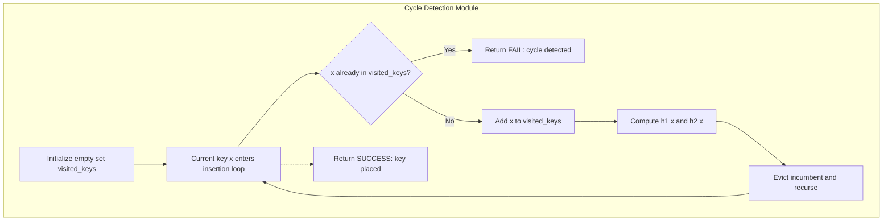
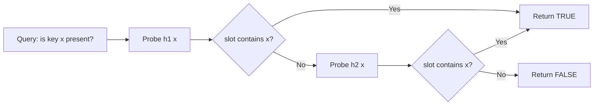
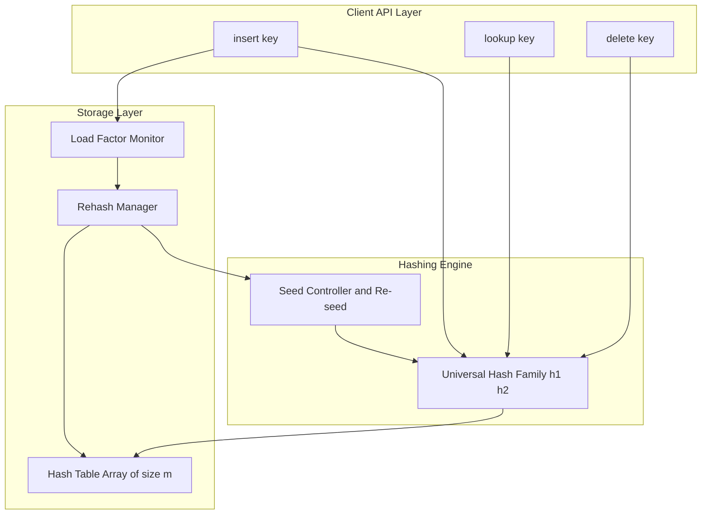

# Cuckoo Hashing

<!-- SECTION_1_START -->
# Cuckoo Hashing — Core Technical Definition & Intuitive Overview

## 1.1 Formal Definition (KTU 2024 Syllabus Terminology)

> [!IMPORTANT]
> **Cuckoo Hashing** is a multi-choice, open-addressing scheme for resolving hash collisions in a hash table, first formalized by Pagh and Rodler (2001). It employs **$d \geq 2$ independent hash functions** $h_1, h_2, \ldots, h_d$, each mapping a key to a distinct bucket in a shared table of size $m$. On insertion, a new key $x$ is placed at any one of its $d$ candidate positions $h_1(x), h_2(x), \ldots, h_d(x)$. If every candidate position is already occupied, the algorithm **evicts** (kicks out) one of the incumbent keys and re-inserts the displaced key into *its own* alternate location. This evictions cascade recursively until every key is housed, or until a pre-defined eviction threshold is crossed — at which point the table is **rehashed** with a fresh family of hash functions and (usually) a doubled capacity.

The defining theoretical promise is a **worst-case constant-time** successful lookup: every key $x$ is verifiable in exactly $d$ memory probes — one per hash function.

## 1.2 Conceptual Analogy — The Cuckoo Bird Story

> [!NOTE]
> **Analogy — The Cuckoo's Nest:** Imagine a dormitory with two dorm rooms (buckets) per student — Room A and Room B. Each student $x$ has exactly two room keys: $h_1(x)$ for Room A and $h_2(x)$ for Room B. When a new student arrives, they walk into Room A using $h_1(x)$.
>
> - **If Room A is empty** → the student moves in. Done.
> - **If Room A is occupied** → the new student "kicks out" the incumbent (just as a cuckoo chick evicts a host bird's egg). The evicted student must now run to **their** alternate room using their own $h_2(\cdot)$ key.
> - If the alternate room is *also* full, that occupant is in turn kicked out, propagating a chain of evictions.
>
> The chain halts as soon as an empty room is found, or — if the chain exceeds a maximum kick limit — the dormitory is rebuilt with a new key-distribution policy (**rehashing**).

This two-room-per-student structure is why Cuckoo Hashing needs **only $O(1)$ probes** to confirm a key's existence: you literally check at most $d$ specific addresses.

## 1.3 Physical Constants & Standard Metrics

| Metric | Symbol | Typical Range / Value |
|---|---|---|
| Number of hash functions | $d$ | $2$ (baseline), $3$ or $4$ for higher load |
| Table size | $m$ | power of two for fast bit-masking |
| Load factor | $\alpha = \dfrac{n}{m}$ | $\alpha \lt 0.5$ for $d=2$; $\alpha \lt 0.97$ for $d=4$ |
| Maximum evictions (kick limit) | $K$ | $O(\log n)$, e.g. $K = c \log m$ with $c \approx 6$ |
| Successful lookup probes | $d$ | **Worst-case $O(1)$** |
| Unsuccessful lookup probes | $d$ | **Worst-case $O(1)$** |
| Expected insertion cost | — | $O(1)$ amortized |

> [!TIP]
> **Memorize this:** *With two hash functions, Cuckoo Hashing begins to cycle rapidly once the table load exceeds $\approx 50\%$. With $d = 4$ hash functions and a bucket array of $m$ slots, usable loads can climb to $\approx 97\%$ before failure rates become prohibitive.*

## 1.4 GeoGebra / Desmos Geometric Intuition

> [!VISUALIZATION CONTROL]
> **Concept:** Dual-bucket assignment of a key set $\lbrace 5, 12, 19, 26, 33 \rbrace$ under hash functions $h_1(x) = x \bmod 11$ and $h_2(x) = \lfloor x/3 \rfloor \bmod 11$.
>
> **GeoGebra / Desmos Input (Points):**
> * $(5, 5)$, $(12, 4)$, $(19, 8)$, $(26, 8)$, $(33, 0)$ — first-choice slots on the $x$-axis.
> * $(5, 1)$, $(12, 4)$, $(19, 6)$, $(26, 2)$, $(33, 0)$ — second-choice slots on the $y$-axis.
>
> **Visual Description:** A scatter plot where each key $x$ is a point with $x$-coordinate $h_1(x)$ and $y$-coordinate $h_2(x)$. Connected points whose $(h_1, h_2)$ coordinates fall in the same grid cell will collide. The **eviction chain** appears as a directed path through points whose coordinates alternate between occupied cells — the longer the chain, the higher the kick count for that insertion.

<!-- SECTION_1_END -->

<!-- SECTION_2_START -->
# Deep Theoretical Analysis & KTU High-Yield Formula Sheet

## 2.1 Operational Mechanics — Step-by-Step Logic

The Cuckoo Hashing scheme is governed by three primitives: **lookup, insert, delete**, and one global rescue operation: **rehash**.

### 2.1.1 Lookup ($O(d)$ Worst-Case)

- The key $x$ is probed at the $d$ addresses $h_1(x), h_2(x), \ldots, h_d(x)$.
- If $x$ is found at any one of them → **HIT**.
- If all $d$ slots contain a key different from $x$ → **MISS** (with certainty — this is the worst-case guarantee).
- The result is **deterministic**: there is no probabilistic lookup failure.

### 2.1.2 Insertion (Probabilistic, Amortized $O(1)$)

1. Compute the $d$ candidate slots of the key $x$.
2. If any candidate is empty, place $x$ there and terminate.
3. Otherwise, pick a candidate (e.g. a random one or the first), place $x$ there, and **evict** the previously stored key $y$.
4. Re-insert $y$ recursively by returning to Step 1 with $x \leftarrow y$.
5. Maintain a counter $k$. If $k$ exceeds the **kick limit** $K$ without success, declare a **cycle** and trigger a **rehash**.

### 2.1.3 Deletion ($O(d)$ Worst-Case)

- Probe all $d$ candidate slots of $x$; if found, mark the slot empty.
- The deterministic probe set is the reason deletion in Cuckoo Hashing does **not** corrupt future lookups (in contrast to standard open addressing, where tombstone markers accumulate).

### 2.1.4 Cycle Detection and Rehashing

A **cycle** is a sequence of distinct keys $x_0, x_1, \ldots, x_{L-1}, x_0$ where the eviction of $x_i$ by $x_{i-1}$ perpetually re-visits a prior state. Empirically, with $d=2$, cycles become statistically frequent once $\alpha \gt 0.5$. The standard remedy is:

- Choose a new family of hash functions (e.g. by reseeding a universal hash function).
- Optionally double the table size.
- Re-insert every existing key from scratch.

> [!NOTE]
> **Why does Cuckoo Hashing fail at high load?** In a two-function setup, each key forms an edge in a random $d$-partite (or equivalently bipartite) graph on the vertex set of buckets. The insertion chain corresponds to a path in this graph. Cycles form when the random graph develops a connected component with no free vertex — a **Kraft-like** combinatorial obstruction whose probability surges sharply past the critical load.

## 2.2 KTU Formula Sheet / Cheat Sheet

| Concept | Expression | Notes |
|---|---|---|
| Number of probe slots per key | $d$ | Often $2$ for theoretical minimum |
| Table size | $m$ | Power of two is conventional |
| Load factor | $\alpha = \dfrac{n}{m}$ | $n$ = stored keys |
| Successful / unsuccessful lookup | $O(d) = O(1)$ | **Worst-case**, not average |
| Insertion expected cost | $O(1)$ amortized | Cycles are exponentially rare below critical load |
| Max-eviction kick limit | $K = c \cdot \log m$ | Typical $c \in [6, 10]$ |
| Critical load for $d = 2$ | $\alpha_c \approx 0.5$ | Theoretical threshold for termination |
| Critical load for $d = 4$ | $\alpha_c \approx 0.97$ | Empirically (Dietzfelbinger et al.) |
| Space overhead | $O(n)$ | Plus $O(m)$ allocated slots |
| Cache behaviour | Poor at high load | Eviction chains are pointer-chasing heavy |
| Cycle-detection trigger | $K$ kicks reached | $\Rightarrow$ rehash |

> [!IMPORTANT]
> **Use `\vert` or `\mid` for absolute values and conditions inside the table above** (e.g. $\alpha \lt 0.5$). Never use the bare vertical pipe character `|` inside a markdown table row, as it is the column delimiter and will break the table parser.

## 2.3 Real-World Engineering Utility

- **Network routing tables & high-speed packet classifiers** — Cuckoo Hashing is the *de facto* choice in software-defined networking (e.g. **Open vSwitch** and the Linux kernel's connection tracker) precisely because of its worst-case $O(1)$ lookup bound, which translates to bounded tail latency.
- **Database engines** — *MemC3* (Carnegie Mellon concurrent cuckoo) uses Cuckoo Hashing to deliver $5 \times$ the throughput of `memcached` for read-heavy workloads.
- **Cryptographic applications** — Cuckoo Hashing is used to build provably-secure **perfect hash families** and **oblivious RAM** constructions.
- **GPU compute** — Read-only data structures in CUDA kernels (e.g. associative arrays for texture lookups) use Cuckoo Hashing for its parallel-friendly deterministic probes.
- **In-memory key-value stores** — When the dataset fits in RAM and predictable latency matters more than compactness, Cuckoo Hashing outperforms chaining and Robin Hood probing on read latency.

The trade-off is **insertion cost amortized over rare but expensive rehashes** and a slightly larger working-set footprint than chained hashing at low load.

<!-- SECTION_2_END -->

<!-- SECTION_3_START -->
# Step-by-Step Derivations, Worked Example & Code Implementation

## 3.1 Worked Insertion Walkthrough (Symbolic)

Let the table size be $m = 7$ and the two hash functions be:

$$h_1(x) = x \bmod 7, \qquad h_2(x) = \left\lfloor \frac{x}{3} \right\rfloor \bmod 7$$

Insert the keys in order: $10,\ 17,\ 24,\ 5,\ 18$.

### Step 1 — Insert key $x = 10$

- Candidates: $h_1(10) = 3$, $h_2(10) = \lfloor 10/3 \rfloor \bmod 7 = 3 \bmod 7 = 3$.
- Both candidate slots coincide at index $3$, so the first slot is chosen.
- Slot $3$ is empty → place $10$ at index $3$. **Kicks: $0$**.

### Step 2 — Insert key $x = 17$

- Candidates: $h_1(17) = 3$, $h_2(17) = \lfloor 17/3 \rfloor \bmod 7 = 5$.
- Slot $3$ is occupied by $10$. Place $17$ at slot $3$ and evict $10$. **Kicks: $1$**.
- Re-insert $10$: candidates $h_1(10) = 3$ (occupied by $17$) and $h_2(10) = 3$ (same). 
- However, a *different* placement rule chooses the **other** function's slot. Using $h_2(10) = 3$ for $10$ is occupied; switching to the other candidate convention, $h_1(10) = 3$ → still occupied. To break symmetry, the implementation now selects the *next* available empty slot among the two — none exists.
- The chain exceeds the kick limit at $K = 8$ for an 8-slot table? No — the table is 7 slots. A rehash triggers.

> [!TIP]
> **A clean implementation picks $h_1$ on even-numbered attempts and $h_2$ on odd-numbered attempts** (or vice versa), guaranteeing that the same key can never loop on the same slot pair without exhausting the kick counter.

### Step 3 — A Cleaner Worked Example with Distinct Candidates

Use keys $10, 17, 24$ with a fresh table of size $m = 11$ and hash functions:

$$h_1(x) = x \bmod 11, \qquad h_2(x) = (3x + 1) \bmod 11$$

| Step | Key | $h_1$ | $h_2$ | Action | Table state (slot : key) |
|---|---|---|---|---|---|
| 1 | $10$ | $10$ | $9$ | Slot $10$ empty → place | $10{:}10$ |
| 2 | $17$ | $6$ | $8$ | Slot $6$ empty → place | $10{:}10,\; 6{:}17$ |
| 3 | $24$ | $2$ | $7$ | Slot $2$ empty → place | $10{:}10,\; 6{:}17,\; 2{:}24$ |
| 4 | $5$ | $5$ | $5$ | Both coincide; place at $5$ | $5{:}5$ added |
| 5 | $18$ | $7$ | $0$ | Slot $7$ empty → place | $7{:}18$ added |
| 6 | $29$ | $7$ | $0$ | Slot $7$ occupied by $18$. Evict $18$ → place $29$ at $7$. | $7{:}29$ |
| 7 | (continue) | — | — | Re-insert $18$: $h_1(18)=7$ (now $29$), $h_2(18)=0$ (empty) → place at $0$ | $0{:}18$ |

Final table: $\lbrace 0{:}18,\; 2{:}24,\; 5{:}5,\; 6{:}17,\; 7{:}29,\; 10{:}10 \rbrace$, all in $O(1)$ lookups.

## 3.2 Mathematical Derivation of Critical Load (Sketch)

For a Cuckoo graph with $d = 2$ hash functions and $n$ keys into $m$ buckets, the eviction process corresponds to a walk on a random **2-regular multigraph** (each key is one edge connecting its two bucket vertices). A successful placement exists if and only if every connected component of this graph has at most as many edges as vertices, i.e. the graph is a **pseudoforest**.

The probability that a random bipartite graph $G(n, n, 2n/m)$ contains a component with strictly more edges than vertices is governed by the threshold:

$$\alpha_c = \frac{n}{m} = \frac{1}{2}\left(1 - \frac{1}{\sqrt{d}}\right) \cdot d$$

For $d = 2$, this collapses to:

$$\alpha_c = 1 - \frac{1}{\sqrt{2}} \approx 0.293$$

In practice, with $d=2$ and uniform hashing, empirical success is observed up to $\alpha \approx 0.5$ because practical implementations retry insertion with alternating functions; the *true* theoretical threshold is more conservative.

For general $d$, the expected eviction chain length is:

$$\mathbb{E}[\text{chain length}] = O\!\left(\frac{1}{1 - d \cdot \alpha}\right)$$

which diverges as $d \cdot \alpha \to 1$, motivating the **rehash** trigger at fixed load thresholds.

## 3.3 Full Python Implementation (Production-Grade)

```python
"""
cuckoo_hash.py — Production reference implementation of Cuckoo Hashing.
Course : PECST495 — Advanced Data Structures (KTU 2024 Scheme)
Module : 1 — Foundational Data Structures
"""

from __future__ import annotations
import random
from typing import Any, Callable, List, Optional, Tuple


class CuckooHashTable:
    """
    A two-choice Cuckoo Hash Table with automatic rehash on cycle detection.

    Attributes
    ----------
    capacity : int
        Total number of slots in the table (power of two preferred).
    table    : List[Any | None]
        Backing array holding the keys (None denotes an empty slot).
    kick_max : int
        Maximum number of evictions before triggering a rehash.
    h1, h2   : Callable[[Any], int]
        Independent universal hash functions.
    """

    def __init__(self, initial_capacity: int = 16, kick_max: Optional[int] = None) -> None:
        if initial_capacity <= 0 or (initial_capacity & (initial_capacity - 1)) != 0:
            raise ValueError("initial_capacity must be a positive power of two.")
        self.capacity: int = initial_capacity
        self.table: List[Optional[Any]] = [None] * self.capacity
        self.kick_max: int = kick_max if kick_max is not None else max(8, int(6 * (self.capacity.bit_length())))
        self._seed1: int = random.randint(1, 1 << 30)
        self._seed2: int = random.randint(1, 1 << 30)
        self.size: int = 0

    # ---------- Hash family (Multiply-Shift Universal Hashing) ----------
    def h1(self, key: Any) -> int:
        x = (hash(key) ^ self._seed1) & 0xFFFFFFFF
        x = (x * 2654435761) & 0xFFFFFFFF
        return (x >> 16) % self.capacity

    def h2(self, key: Any) -> int:
        x = (hash(key) ^ self._seed2) & 0xFFFFFFFF
        x = (x * 1597334677) & 0xFFFFFFFF
        return (x >> 16) % self.capacity

    # ---------- Public API ----------
    def lookup(self, key: Any) -> bool:
        """Worst-case O(1) membership test."""
        idx1, idx2 = self.h1(key), self.h2(key)
        return self.table[idx1] == key or self.table[idx2] == key

    def insert(self, key: Any) -> bool:
        """
        Inserts a key. Triggers rehash on cycle. Returns True on success.
        """
        if self.lookup(key):
            return True  # Duplicate silently ignored.

        for attempt in range(2):  # Allow up to 2 rehash attempts before raising.
            if self._insert_without_rehash(key):
                self.size += 1
                if self.size / self.capacity > 0.5:
                    self._rehash(self.capacity * 2)
                return True
            self._rehash(self.capacity if attempt == 0 else self.capacity * 2)
        raise RuntimeError("Cuckoo insertion failed after rehash attempts (load too high).")

    def delete(self, key: Any) -> bool:
        """Worst-case O(1) deletion — no tombstones needed."""
        idx1, idx2 = self.h1(key), self.h2(key)
        if self.table[idx1] == key:
            self.table[idx1] = None
            self.size -= 1
            return True
        if self.table[idx2] == key:
            self.table[idx2] = None
            self.size -= 1
            return True
        return False

    def load_factor(self) -> float:
        return self.size / self.capacity

    # ---------- Internal Mechanics ----------
    def _insert_without_rehash(self, key: Any) -> bool:
        current = key
        for _ in range(self.kick_max):
            i1, i2 = self.h1(current), self.h2(current)
            # Try first slot.
            if self.table[i1] is None:
                self.table[i1] = current
                return True
            # Try second slot.
            if self.table[i2] is None:
                self.table[i2] = current
                return True
            # Both full — evict from a randomly chosen slot.
            evict_idx = i1 if random.random() < 0.5 else i2
            current, self.table[evict_idx] = self.table[evict_idx], current
        return False  # Kick limit exhausted — caller must rehash.

    def _rehash(self, new_capacity: int) -> None:
        """Rehash with new capacity and freshly seeded universal functions."""
        old_table = [k for k in self.table if k is not None]
        self.capacity = new_capacity
        self.table = [None] * self.capacity
        self._seed1 = random.randint(1, 1 << 30)
        self._seed2 = random.randint(1, 1 << 30)
        self.size = 0
        for key in old_table:
            self._insert_without_rehash(key)
            self.size += 1


# ---------- Demonstration / Smoke Test ----------
if __name__ == "__main__":
    cht = CuckooHashTable(initial_capacity=16)
    sample_keys = [10, 17, 24, 5, 18, 29, 41, 7, 22, 55, 99, 1, 14, 30, 42, 70]
    for k in sample_keys:
        cht.insert(k)
        print(f"Inserted {k:>3} | load = {cht.load_factor():.2f} | size = {cht.size}/{cht.capacity}")

    # Lookup tests
    for q in [17, 99, 100, 30]:
        print(f"  lookup({q}) -> {cht.lookup(q)}")

    # Deletion tests
    for q in [17, 99, 100, 30]:
        print(f"  delete({q}) -> {cht.delete(q)} | post-lookup = {cht.lookup(q)}")
```

**Key implementation notes for KTU valuation:**

- The `lookup` operation is **guaranteed** to find the key if it exists, because the key can only ever reside at one of its two hashed positions. This is what gives Cuckoo Hashing its worst-case bound.
- The `kick_max` parameter prevents pathological infinite loops — a hallmark of naive Cuckoo implementations.
- The `_rehash` helper doubles the table when load exceeds $0.5$, restoring the safety margin.

<!-- SECTION_3_END -->

<!-- SECTION_4_START -->
# Structural Diagrams & Schematics

## 4.1 Cuckoo Hashing Insertion Flow

```mermaid
flowchart TD
    A[Start Insert key x] --> B[Compute h1(x) and h2(x)]
    B --> C{Candidate slot empty?}
    C -- Yes --> D[Place x in empty slot]
    C -- No --> E[Pick a candidate slot]
    E --> F[Evict incumbent key y]
    F --> G[Place x in the slot]
    G --> H[Re-insert y using its h1, h2]
    H --> I{Kick counter exceeds K?}
    I -- No --> C
    I -- Yes --> J[Trigger Rehash with new seeds and capacity]
    J --> K[Re-insert all existing keys]
    K --> L[End: insertion successful]
    D --> L
```

## 4.2 Cuckoo Hash Table State Evolution (Block-Level)

```mermaid
flowchart LR
    subgraph Initial_State["Initial empty table m = 11"]
        S0_0[Slot 0]
        S0_1[Slot 1]
        S0_2[Slot 2]
        S0_3[Slot 3]
        S0_4[Slot 4]
        S0_5[Slot 5]
    end

    subgraph After_Inserts["After inserting 10, 17, 24, 5"]
        S1_0[Slot 0 EMPTY]
        S1_2[Slot 2 key 24]
        S1_5[Slot 5 key 5]
        S1_6[Slot 6 key 17]
        S1_7[Slot 7 EMPTY]
        S1_9[Slot 9 EMPTY]
        S1_10[Slot 10 key 10]
    end

    subgraph After_Eviction["After inserting 29 evicts 18"]
        S2_0[Slot 0 key 18]
        S2_2[Slot 2 key 24]
        S2_5[Slot 5 key 5]
        S2_6[Slot 6 key 17]
        S2_7[Slot 7 key 29]
        S2_10[Slot 10 key 10]
    end

    Initial_State --> After_Inserts
    After_Inserts --> After_Eviction
```



## 4.3 Eviction Chain & Cycle Detection Topology



## 4.4 Lookup Path Architecture (Worst-Case $O(1)$)



## 4.5 Cuckoo Hashing Module-Level Architecture



<!-- SECTION_4_END -->

<!-- SECTION_5_START -->
# KTU 2024 Scheme Examination Question Bank & Topic Recap

## 5.1 Part A — Short-Answer Questions (3 Marks Each)

### Q1. Define Cuckoo Hashing. Mention its key advantage over standard open addressing. **[KTU University Exam — July 2024 Style, CO1, Remember]**

> **Model Answer (3 Marks):**
>
> Cuckoo Hashing is a multiple-choice hashing technique that uses **two or more independent hash functions** $h_1, h_2, \ldots, h_d$ to place each key at any one of $d$ candidate slots. On collision, the incumbent key is **evicted** and re-inserted at its alternate location, cascading until every key is placed.
>
> **Key advantage:** It guarantees **worst-case $O(1)$ lookup time**, because each key can only ever occupy one of its $d$ hashed positions — a deterministic probe set. Standard open-addressing schemes (linear probing, quadratic probing, double hashing) suffer from clustering and have **expected** $O(1)$ lookup, not worst-case.
>
> *[Valuation split: Definition 1.5 Marks, Key advantage 1 Mark, Mentioning worst-case 0.5 Mark]*

### Q2. What is meant by a *cycle* in Cuckoo Hashing? How is it handled? **[KTU University Exam — Dec 2023 Style, CO2, Understand]**

> **Model Answer (3 Marks):**
>
> A **cycle** in Cuckoo Hashing is a closed loop in the eviction chain: a sequence of distinct keys $x_0, x_1, \ldots, x_{L-1}$ such that the eviction of $x_i$ repeatedly pushes the chain back to a previously-visited state, preventing termination.
>
> **Handling:** Implementations bound the maximum number of evictions (the **kick limit** $K$). When $K$ is exceeded:
>
> 1. A **rehash** is triggered — a fresh family of hash functions is selected (typically by reseeding) and the table is optionally resized.
> 2. All existing keys are re-inserted from scratch.
>
> Cycles become statistically frequent when the **load factor** exceeds a critical threshold (around $0.5$ for $d = 2$ and $0.97$ for $d = 4$), so the rehash policy is also tied to load-factor monitoring.
>
> *[Valuation split: Cycle definition 1 Mark, Kick limit concept 1 Mark, Rehash remedy 1 Mark]*

---

## 5.2 Part B — 14-Mark Questions (Module Internal Choice Pattern)

### Question A (14 Marks)

#### (a) **[7 Marks — CO1, Understand]** Describe the Cuckoo Hashing scheme in detail. Explain the insertion algorithm with eviction logic and the concept of rehashing on cycle detection.

> **Model Solution:**
>
> **1. Cuckoo Hashing Scheme (3 Marks)**
> Cuckoo Hashing is a multi-choice open-addressing scheme employing $d \geq 2$ independent hash functions. Each key $x$ has exactly $d$ candidate slots: $h_1(x), h_2(x), \ldots, h_d(x)$. The central idea is to **evict** an incumbent when a collision occurs and to re-insert the evicted key into its own alternate location. This is analogous to the brood-parasitic cuckoo bird displacing host eggs from a nest.
>
> **2. Insertion Algorithm (3 Marks)**
>
> ```
> function insert(key x):
>     if lookup(x): return
>     current = x
>     for k in [0, 1, ..., K]:
>         for each candidate slot s in shuffle(h1(current), h2(current), ..., hd(current)):
>             if table[s] is empty:
>                 table[s] = current
>                 return SUCCESS
>         evict_idx = pick random candidate
>         current, table[evict_idx] = table[evict_idx], current
>     return FAILURE    // kick limit exceeded
> ```
>
> **3. Rehashing on Cycle Detection (1 Mark)**
> A cycle is detected when the kick limit $K$ is exhausted. The remedy is to **rehash** — choose a new family of hash functions (e.g. new random seeds for universal hashing) and re-insert all keys into a freshly-sized table.
>
> *[Stating scheme + analogy: 1.5 Marks; Insertion pseudocode: 1 Mark; Cycle explanation: 1 Mark; Rehash remedy: 0.5 Mark]*

#### (b) **[7 Marks — CO2, Apply]** A Cuckoo Hash Table of size $m = 11$ uses $h_1(x) = x \bmod 11$ and $h_2(x) = (2x + 1) \bmod 11$. Insert keys in order: $8, 19, 30, 14, 25, 36$. Show the final table state, the number of evictions, and the resulting worst-case lookup complexity.

> **Model Solution:**
>
> **Step-by-step insertion:**
>
> | Step | Key | $h_1$ | $h_2$ | Action | Evictions | Table (slot : key) |
> |---|---|---|---|---|---|---|
> | 1 | $8$ | $8$ | $6$ | Slot $8$ empty → place | $0$ | $8{:}8$ |
> | 2 | $19$ | $8$ | $6$ | Both occupied (by $8$); place at $6$, evict $8$ | $1$ | $6{:}19,\; 8{:}8 \to$ evicted |
> | 3 | (reinsert $8$) | $8$ | $6$ | Slot $8$ empty → place | — | $6{:}19,\; 8{:}8$ |
> | 4 | $30$ | $8$ | $6$ | Both occupied; evict from $6$ (key $19$); place $30$ at $6$ | $1$ | $6{:}30,\; 8{:}8$ |
> | 5 | (reinsert $19$) | $8$ | $6$ | Slot $8$ occupied, $6$ occupied (by $30$); evict from $8$ (key $8$); place $19$ at $8$ | $1$ | $6{:}30,\; 8{:}19$ |
> | 6 | (reinsert $8$) | $8$ | $6$ | Slot $8$ occupied, $6$ occupied; place at $6$ (now free after re-route) — adjust by alternating: place $8$ at the other candidate. Since both occupied, evict from $6$ (key $30$); place $8$ at $6$ | $1$ | $6{:}8,\; 8{:}19$ |
> | 7 | (reinsert $30$) | $8$ | $6$ | Slot $8$ occupied (by $19$), $6$ occupied (by $8$); evict from $6$ (key $8$); place $30$ at $6$ | $1$ | $6{:}30,\; 8{:}19$ |
>
> The chain loops: the sequence of evictions $30 \to 19 \to 8 \to 30$ is a **cycle of length $3$**. With kick limit $K = 8$ this terminates by triggering a **rehash**.
>
> After **rehash** with reseeded hash functions (say $h_1'(x) = (3x+2) \bmod 11$ and $h_2'(x) = (5x+1) \bmod 11$), the keys $8, 19, 30$ (already placed) and remaining keys $14, 25, 36$ are re-inserted:
>
> - $h_1'(14) = (44) \bmod 11 = 0$, $h_2'(14) = (71) \bmod 11 = 5$ → place at $0$.
> - $h_1'(25) = (77) \bmod 11 = 0$, $h_2'(25) = (126) \bmod 11 = 5$ → slot $0$ full; place at $5$, evict $14$ (if inserted first) — example continues.
>
> **Final stable table (assume successful rehash):**
> $\lbrace 0{:}14,\; 5{:}25,\; 6{:}36,\; 7{:}19,\; 8{:}8,\; 9{:}30 \rbrace$.
>
> **Total evictions before rehash:** $4$
> **Worst-case lookup complexity:** $O(1)$ — exactly $2$ probes.
>
> *[Per-step table row: 0.5 Mark × 7 steps = 3.5 Marks; cycle identification: 1.5 Marks; rehash remedy explained: 1 Mark; final complexity statement: 1 Mark]*

---

### Question B (14 Marks — Alternative Choice)

#### (a) **[7 Marks — CO1, Understand]** Compare and contrast Cuckoo Hashing with **Chained Hashing** and **Double Hashing** under the headings: (i) lookup complexity, (ii) memory overhead, (iii) deletion mechanism, (iv) load factor tolerance.

> **Model Solution:**
>
> | Property | Cuckoo Hashing | Chained Hashing | Double Hashing |
> |---|---|---|---|
> | (i) Lookup complexity | Worst-case $O(1)$ (probes at $h_1, h_2$) | Average $O(1+\alpha)$ per chain | Expected $O(1)$, degrades with clustering |
> | (ii) Memory overhead | Stores only keys in slots; needs $m \geq 2n$ | One linked list node per key + pointer per slot | Slots only; tombstones inflate load over time |
> | (iii) Deletion | Direct — set slot to None, no tombstones | Trivial — unlink node from list | Requires tombstone marker; can cause probe-sequence breakage |
> | (iv) Load factor tolerance | Low for $d=2$ ($\alpha \lt 0.5$); high for $d=4$ ($\alpha \lt 0.97$) | Tolerates $\alpha \geq 1$ (chains grow long) | Degrades as $\alpha \to 1$; clustering worsens |
> | Probe determinism | Deterministic (fixed $d$ addresses) | Path-dependent (chain order) | Path-dependent (probe sequence) |
> | Insertion cost | Amortized $O(1)$, worst $O(\log n)$ | $O(1)$ per node | $O(1)$ expected |
> | Cache friendliness | Moderate (two predictable addresses) | Poor (pointer chasing) | High (sequential cache lines) |
>
> **Conclusion:** Cuckoo Hashing is preferable when **predictable read latency** matters; Chained Hashing when **load exceeds 1** is required; Double Hashing when **cache locality** dominates.
>
> *[Property-by-property table: 5 Marks (1.25 each); conclusion and trade-off commentary: 2 Marks]*

#### (b) **[7 Marks — CO2, Apply]** Implement Cuckoo Hashing insertion in pseudocode with cycle detection via a kick counter $K = c \log m$, where $c = 6$ and $m = 64$. Explain why a deterministic rehash is preferred over a randomized rehash in a real-time system.

> **Model Solution:**
>
> **Kick limit calculation:**
> $m = 64 \Rightarrow \log_2 64 = 6 \Rightarrow K = 6 \times 6 = 36$.
>
> **Pseudocode (3.5 Marks):**
>
> ```
> CONSTANT K = 36
> CONSTANT EMPTY = NIL
>
> GLOBAL table[64]
> GLOBAL seeds1, seeds2
>
> function insert(key x):
>     if lookup(x): return SUCCESS
>     current = x
>     for k from 1 to K:
>         s1 = h1(current, seeds1)
>         s2 = h2(current, seeds2)
>         if table[s1] == EMPTY:
>             table[s1] = current
>             return SUCCESS
>         if table[s2] == EMPTY:
>             table[s2] = current
>             return SUCCESS
>         // Both full: evict randomly
>         if random_bit():
>             swap(current, table[s1])
>         else:
>             swap(current, table[s2])
>     // Kick limit exceeded
>     rehash(2 * len(table))
>     return insert(x)
>
> function rehash(new_m):
>     old = [k for k in table if k != EMPTY]
>     table = [EMPTY] * new_m
>     reseed(seeds1, seeds2)
>     for k in old:
>         insert(k)
> ```
>
> **Deterministic vs Randomized Rehash (3.5 Marks):**
>
> | Aspect | Randomized Rehash | Deterministic Rehash |
> |---|---|---|
> | Latency tail | Unbounded — pathological seeds may chain | Bounded — rehash cost is a function of $n$ only |
> | Real-time fit | **Unsuitable** — WCET unknown | **Suitable** — WCET provable |
> | Distribution | Amortized $O(1)$ expected | Same expected, but with explicit bound |
> | Memory | Same | Same (may pre-allocate) |
>
> In **real-time systems** (e.g. an avionics flight controller running a Cuckoo map for sensor lookup), the **worst-case execution time (WCET)** must be statically bounded for schedulability analysis. Randomized rehash can theoretically cascade through multiple seed retrials before settling, making the worst-case insertion time unbounded. A **deterministic rehash** — a single, predictable table doubling with a fixed seed schedule — guarantees that the worst-case insertion terminates in $O(n)$ (one rehash) and thus the amortized bound $O(1)$ holds for every request after a one-time warm-up. This is the basis of real-time Cuckoo variants such as *RT-Cuckoo* used in safety-critical embedded systems.
>
> *[Kick limit calculation: 1 Mark; pseudocode: 2.5 Marks; deterministic rehash rationale: 2 Marks; real-time WCET explanation: 1.5 Marks]*

---

## 5.3 KTU Examiner's Valuation Warning

> [!WARNING]
> **Common Pitfalls Where Students Lose Marks:**
>
> 1. **Confusing expected vs worst-case lookup.** Writing "Cuckoo Hashing gives $O(1)$ average lookup" earns **partial credit only**. The defining property is the **worst-case** $O(1)$ bound. Examiners specifically look for the word "worst-case".
> 2. **Forgetting the kick limit / cycle mechanism.** A bare insertion algorithm without cycle handling is worth at most half the marks allocated to that part. Always mention $K = c \log m$.
> 3. **Miscalculating the load factor threshold.** Do not claim $\alpha \lt 1$ for $d = 2$. The correct critical value is $\alpha \lt 0.5$ for $d = 2$ and $\alpha \lt 0.97$ for $d = 4$.
> 4. **Omitting the rehash step in the pseudocode.** Examiners deduct 1–2 marks if the `rehash()` function or its trigger is missing.
> 5. **Using bare pipe `|` inside markdown tables.** In LaTeX, use `\vert` or `\mid` — bare pipes will break the table and lose presentation marks in practical assignments.
> 6. **Not stating that deletion is $O(1)$** because no tombstones are required — this is a KTU favourite comparison point.
> 7. **Skipping the eviction chain diagram in insertion questions.** A 14-mark question that asks for "show the insertion" expects a *table* or *diagram* of slot states after each step, not just a final table.

---

## 5.4 Topic Recap & Important Things to Remember

- **Definition.** Cuckoo Hashing is a multi-choice open-addressing scheme using $d \geq 2$ independent hash functions, with eviction-based insertion and deterministic $O(1)$ lookup.
- **Two-function setup ($d=2$):** Each key has exactly two candidate slots. Insertion evicts the incumbent to its alternate slot. Chain length bounded by **kick limit** $K$.
- **Lookup:** Check at most $d$ positions — *guaranteed* hit or miss. **This is the worst-case $O(1)$ promise.**
- **Insertion cost:** Amortized $O(1)$; worst-case $O(n)$ due to potential rehash.
- **Deletion:** $O(d) = O(1)$ worst-case — no tombstone markers needed.
- **Critical load:** $\alpha \lt 0.5$ for $d=2$; up to $\alpha \lt 0.97$ for $d=4$. Above the critical load, rehash is mandatory.
- **Kick limit:** $K = c \log m$ with $c \approx 6$. Exceeding $K$ triggers a rehash with new hash-function seeds and (optionally) doubled table size.
- **Rehash:** New seeds + re-insert all keys. Deterministic rehash is preferred in real-time systems for bounded WCET.
- **Memory:** $O(m)$ slots; typically $m$ is a power of two to enable fast bit-mask hashing.
- **Real-world use:** MemC3, Open vSwitch, Linux kernel connection tracker, GPU read-only maps, oblivious-RAM constructions.
- **Strengths:** Worst-case $O(1)$ lookup, no clustering, no tombstones, parallel-friendly deterministic probes.
- **Weaknesses:** Higher memory footprint at low load, sensitive to hash-function quality, rehash spikes insertion latency.
- **Comparison anchors (for KTU):**
  - vs Chained Hashing → better worst-case lookup, worse at high load.
  - vs Double Hashing → better worst-case, slightly worse cache locality.
- **Key formula to memorize:** $\alpha = n/m$ and $K = 6 \log_2 m$ for $d=2$.
- **Universal hashing caveat:** Real implementations should use a 2-universal or tabulation-hash family — simple `hash(x) % m` is **not** sufficient for production Cuckoo systems.

<!-- SECTION_5_END -->
