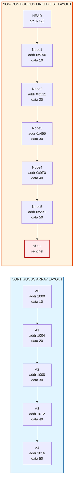
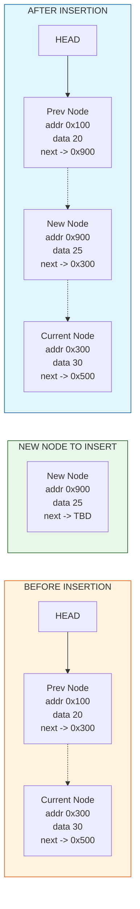
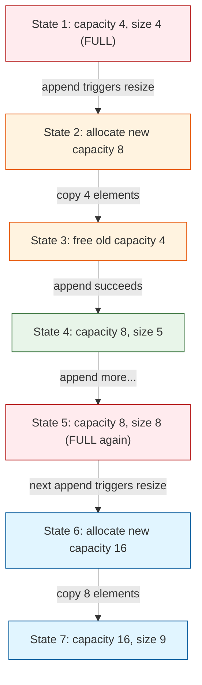

# Foundational Data Structures- Overview of Arrays and Linked Lists

<!-- SECTION_1_START -->
# 1. Foundational Data Structures: Arrays and Linked Lists

> [!NOTE]
> **KTU 2024 Syllabus Definition (PECST495 – Module 1)**
> Foundational data structures are the **primary, low-level memory organization primitives** upon which all advanced non-linear structures (Trees, Graphs, Heaps, Hash Tables) are constructed. Arrays and Linked Lists represent the two canonical paradigms of memory organization: **contiguous allocation** and **node-based dynamic allocation**.

## 1.1 Arrays — The Contiguous Memory Paradigm

### Formal Definition
An **Array** is a homogeneous, contiguous block of memory locations identified by a single identifier name, where individual elements are accessed using an integer index. Formally, an array $A$ of size $n$ is a mapping:

$$A : \{0, 1, 2, \dots, n-1\} \rightarrow \mathbb{T}$$

where $\mathbb{T}$ is a fixed data type and $n$ is the array's static or dynamic capacity.

### Intuitive Analogy — The "Locker Room" Model
Imagine a long corridor of **numbered lockers** built directly next to each other (no gaps). To grab your book, you don't search the corridor — you simply walk to **locker number $i$** because you know exactly how far it is from the first locker. The address of any locker is computed in **one multiplication** from the starting locker's position. This is why array access is the fastest operation in computing: $O(1)$ time.

### Key Operational Constants
- **Indexing time complexity:** $O(1)$ (constant)
- **Base Address ($B$):** The memory address of the first element $A[0]$
- **Word Size ($w$):** The number of bytes occupied by a single element (e.g., $4$ bytes for `int`, $8$ bytes for `double` in a 64-bit system)
- **Word/Byte Size Boundary:** All KTU problems assume $w$ is constant for a given array type

> [!IMPORTANT]
> **Syllabus Highlight — Address Calculation Formula**
> The address of $A[i]$ in a 0-indexed, contiguous array is mathematically:
> $$\text{Addr}(A[i]) = B + i \cdot w$$
> This **single formula** is worth 3–5 marks in nearly every KTU board exam on this module. Memorize it.

> [!VISUALIZATION CONTROL]
> **Concept:** Array Memory Layout (1D, $w = 4$ bytes, $B = 1000$)
> **Desmos / GeoGebra Input — Plot the address ladder as a discrete step function:**
> * `f(x) = 1000 + 4x` for integer $x \in [0, 7]$
> **Visual Description:** A staircase graph. The y-axis shows the absolute memory address, the x-axis represents the index $i$. Each "step" jumps by exactly $4$ units (the word size), confirming linear, predictable access.

## 1.2 Linked Lists — The Node-Based Dynamic Paradigm

### Formal Definition
A **Linked List** is a linear, ordered collection of dynamically allocated **nodes**, where each node contains two fields: (1) a **data field** holding the actual value, and (2) one or more **pointer/link fields** holding the memory address of the next (and optionally previous) node. Formally, a singly linked list is a recursive structure:

$$L = \langle \text{null} \rangle \ \vert\ \langle \text{data}, L \rangle$$

> [!NOTE]
> The vertical bar `$\vert$` here is the formal Backus–Naur alternation operator ("either... or..."). It is **deliberately not the markdown table pipe**.

### Intuitive Analogy — The "Treasure Hunt" Model
Imagine a **treasure hunt** where each clue tells you the value at that location *and* gives you the address of the next clue. To find the $i$-th clue, you must physically walk through clues $1, 2, \dots, i-1$ first. You cannot jump directly. The treasure hunt can be of **any length** (clues can be added or removed at will), and the clues don't need to be in adjacent rooms — they can be scattered across the building. This dynamic, scattered nature is the defining feature of linked lists.

### Key Operational Constants
- **Node Size ($s$):** $\text{sizeof(data)} + \text{sizeof(pointer)}$. On a 64-bit machine with 4-byte `int`, $s = 4 + 8 = 12$ bytes (often padded to **16 bytes** for alignment).
- **Head Pointer:** A single pointer variable that holds the address of the first node; the entire list is accessed via this single reference.
- **NULL Sentinel:** The last node's pointer is set to a special `NULL` (or `None` in Python) value, marking the list's termination.

> [!IMPORTANT]
> **Syllabus Highlight — Recursive Structure Property**
> Every linked list problem can be expressed as a **base case** (`NULL` or empty list) plus a **recursive case** (process head, recurse on `head.next`). KTU examiners frequently award 2 marks in Part A for correctly identifying this duality.

> [!VISUALIZATION CONTROL]
> **Concept:** Linked List Pointer Chasing
> **Desmos / GeoGebra Input — Visualize traversal cost:**
> * Plot points $(1, 0)$, $(2, 1)$, $(3, 2)$, $(4, 3)$, $(5, 4)$ representing pointer dereferences.
> **Visual Description:** A linear plot with slope $= 1$. Reaching the $n$-th node requires $n$ sequential pointer dereferences — this is the geometric proof that linked list access is $O(n)$.
<!-- SECTION_1_END -->

<!-- SECTION_2_START -->
# 2. Deep Theoretical Analysis & KTU High-Yield Formula Sheet

## 2.1 Operational Breakdown of Array Mechanics

### Why Arrays Are Fast: The Index-Calculation Pipeline
1. **CPU receives instruction:** `LOAD A[5]`
2. **Multiplier computes offset:** $5 \times w$ in a single hardware cycle
3. **Address Generation Unit (AGU):** Adds offset to the base address $B$ held in a register
4. **Memory fetch completes:** One cache-line read returns the element

This 4-stage pipeline is why random access is the **fastest possible data operation** — the hardware is *physically optimized* for it.

### Why Arrays Are Slow at Insertion/Deletion
To insert at position $i$, all elements from index $i$ to $n-1$ must be **shifted right by one position** to make space. In the worst case (insertion at index $0$), this is $n$ shifts. The same logic applies inversely to deletion.

## 2.2 Operational Breakdown of Linked List Mechanics

### Why Linked Lists Are Fast at Insertion/Deletion
To insert a new node after node $X$, you only need to:
1. Allocate a new node $N$
2. Set $N.\text{next} = X.\text{next}$
3. Set $X.\text{next} = N$

This is **$O(1)$** — no shifting required, regardless of list length. The cost is paid in pointer manipulation, not memory movement.

### Why Linked Lists Are Slow at Random Access
To access the $i$-th element, you must traverse from the head, following $i$ pointers. There is no formula like $\text{Addr}(A[i]) = B + i \cdot w$ because nodes are **not** at predictable addresses.

## 2.3 KTU Formula Sheet — Arrays and Linked Lists

> [!IMPORTANT]
> **Cheat Sheet — Print and Pin This Table**

| Operation | Static Array | Dynamic Array (e.g., `list` in Python) | Singly Linked List | Doubly Linked List |
| :--- | :---: | :---: | :---: | :---: |
| **Random Access** | $O(1)$ | $O(1)$ | $O(n)$ | $O(n)$ |
| **Insert at Head** | $O(n)$ | $O(n)$ | $O(1)$ | $O(1)$ |
| **Insert at Tail** | $O(1)$ amortized* | $O(1)$ amortized* | $O(n)$ or $O(1)$ w/ tail | $O(1)$ w/ tail |
| **Insert at Middle** | $O(n)$ | $O(n)$ | $O(n)$ search + $O(1)$ | $O(n)$ search + $O(1)$ |
| **Delete at Head** | $O(n)$ | $O(n)$ | $O(1)$ | $O(1)$ |
| **Delete at Tail** | $O(1)$ | $O(1)$ | $O(n)$ or $O(1)$ w/ tail | $O(1)$ w/ tail |
| **Memory Overhead** | None | None / slack | $1$ pointer/node | $2$ pointers/node |
| **Cache Locality** | **Excellent** | **Excellent** | **Poor** (scattered) | **Poor** |
| **Static Size** | **Yes (fixed)** | No (resizable) | No (dynamic) | No (dynamic) |
| **Wasted Space** | Possible (unused slots) | Possible (slack) | None (exact) | None (exact) |

> *Amortized cost: occasional $O(n)$ resize spread across many $O(1)$ operations.

### Boundary Condition Formulas
- **Array Indexing (0-based):** $\text{Addr}(A[i]) = B + i \cdot w$
- **Array Indexing (1-based):** $\text{Addr}(A[i]) = B + (i-1) \cdot w$
- **2D Array (Row-Major):** $\text{Addr}(A[i][j]) = B + (i \cdot n_{\text{cols}} + j) \cdot w$
- **2D Array (Column-Major):** $\text{Addr}(A[i][j]) = B + (j \cdot n_{\text{rows}} + i) \cdot w$
- **Linked List Traversal Length to Node $i$:** $i$ pointer dereferences

## 2.4 Engineering Real-World Utility

### Where Arrays Dominate Production
- **Database Storage Engines:** Row-stores use contiguous memory pages (PostgreSQL, MySQL InnoDB) to maximize CPU cache hits.
- **Numerical Computing (NumPy):** Internally uses C-contiguous arrays for SIMD vectorization.
- **Image Processing:** Pixels are stored in 2D arrays; convolution operations rely on $O(1)$ random access to neighbors.
- **Game Development:** Entity-Component-Systems (ECS) use Structure-of-Arrays (SoA) layout for cache-friendly iteration.

### Where Linked Lists Dominate Production
- **Operating System Schedulers:** The Linux kernel's CFS (Completely Fair Scheduler) uses a **doubly linked run-queue** for $O(1)$ task insertion/removal.
- **Memory Allocators (Free Lists):** `malloc`/`free` implementations maintain free memory blocks as linked lists.
- **LRU Cache Eviction:** A doubly linked list combined with a hash map implements $O(1)$ eviction (the textbook LRU design).
- **Undo/Redo Systems:** Text editors (and even Photoshop's history) use linked list nodes to store states for unbounded history.
- **Polynomial Arithmetic:** Each term of a polynomial $P(x) = a_n x^n + \dots$ is a node, making sparse polynomials memory-efficient.
<!-- SECTION_2_END -->

<!-- SECTION_3_START -->
# 3. Step-by-Step Derivations & Code/Symbolic Implementation

## 3.1 Mathematical Derivation: Array Address Calculation

### Problem Setup
Given:
- Base address of array $A$: $B = 1000$ (decimal)
- Word size (bytes per element): $w = 4$
- Array indices: $0$ to $n - 1$ (0-based)
- Task: Compute the address of $A[5]$

### Exhaustive Derivation

$$
\begin{aligned}
\text{Addr}(A[i]) &= B + (\text{offset of } A[i] \text{ from } A[0]) \\
\text{Offset of } A[i] \text{ from } A[0] &= i \cdot w \\
\text{Therefore, } \text{Addr}(A[i]) &= B + i \cdot w \\
\text{Substituting } B = 1000, \ w = 4, \ i &= 5: \\
\text{Addr}(A[5]) &= 1000 + 5 \cdot 4 \\
&= 1000 + 20 \\
&= 1020
\end{aligned}
$$

**Logic Explanation:** We start from the base address $1000$. Each element occupies $4$ bytes, so element at index $5$ is $5$ elements * $4$ bytes/element $= 20$ bytes away from the start. Adding to the base gives address $1020$.

### 1-Based Array Variant

$$
\begin{aligned}
\text{Addr}_{1\text{-based}}(A[i]) &= B + (i - 1) \cdot w \\
\text{For } B = 1000, \ w = 4, \ i &= 5: \\
&= 1000 + (5 - 1) \cdot 4 \\
&= 1000 + 16 \\
&= 1016
\end{aligned}
$$

**Logic Explanation:** In a 1-based system, the first element is $A[1]$, not $A[0]$. So the offset is $(i-1)$ elements, not $i$.

### 2D Row-Major Derivation

$$
\begin{aligned}
\text{Addr}(A[i][j]) &= B + (i \cdot n_{\text{cols}} + j) \cdot w \\
\text{For } B &= 500, \ w = 2, \ n_{\text{cols}} = 4, \ i = 2, \ j = 3: \\
&= 500 + (2 \cdot 4 + 3) \cdot 2 \\
&= 500 + (8 + 3) \cdot 2 \\
&= 500 + 11 \cdot 2 \\
&= 500 + 22 \\
&= 522
\end{aligned}
$$

**Logic Explanation:** To reach row $i$, we skip $i$ full rows, each of length $n_{\text{cols}}$, so $i \cdot n_{\text{cols}}$ elements are skipped. Then within row $i$, we skip $j$ more elements. Total offset is $(i \cdot n_{\text{cols}} + j)$ elements.

## 3.2 Algorithmic Implementation: Singly Linked List in Python

```python
from __future__ import annotations
from typing import Any, Optional, Iterator
import logging

logging.basicConfig(level=logging.INFO, format="%(levelname)s :: %(message)s")
logger = logging.getLogger(__name__)


class Node:
    """A single node in the singly linked list."""

    __slots__ = ("data", "next")

    def __init__(self, data: Any, next_node: Optional["Node"] = None) -> None:
        self.data: Any = data
        self.next: Optional[Node] = next_node

    def __repr__(self) -> str:
        nxt_id: int = id(self.next) if self.next is not None else 0
        return f"Node(data={self.data!r}, next_id={nxt_id})"


class SinglyLinkedList:
    """
    Singly Linked List implementation.
    Maintains a 'head' pointer to the first node and an optional 'tail'
    pointer to enable O(1) tail insertions.
    """

    def __init__(self) -> None:
        self.head: Optional[Node] = None
        self.tail: Optional[Node] = None
        self._size: int = 0
        logger.info("Initialized an empty SinglyLinkedList.")

    def __len__(self) -> int:
        return self._size

    def __iter__(self) -> Iterator[Any]:
        current: Optional[Node] = self.head
        while current is not None:
            yield current.data
            current = current.next

    def is_empty(self) -> bool:
        return self.head is None

    def insert_at_head(self, value: Any) -> None:
        """Insert a new node at the head. Time: O(1)"""
        if not isinstance(value, (int, float, str)):
            logger.error("Invalid value type: %s", type(value))
            raise TypeError(f"Unsupported value type: {type(value)}")
        new_node: Node = Node(value, next_node=self.head)
        self.head = new_node
        if self.tail is None:
            self.tail = new_node
        self._size += 1
        logger.info("Inserted %r at head. Size now %d.", value, self._size)

    def insert_at_tail(self, value: Any) -> None:
        """Insert a new node at the tail. Time: O(1) with tail pointer."""
        if self.is_empty():
            self.insert_at_head(value)
            return
        new_node: Node = Node(value, next_node=None)
        assert self.tail is not None
        self.tail.next = new_node
        self.tail = new_node
        self._size += 1
        logger.info("Inserted %r at tail. Size now %d.", value, self._size)

    def delete_at_head(self) -> Any:
        """Delete and return the head node's value. Time: O(1)"""
        if self.is_empty():
            raise IndexError("Cannot delete from an empty list.")
        removed_value: Any = self.head.data
        self.head = self.head.next
        if self.head is None:
            self.tail = None
        self._size -= 1
        logger.info("Deleted head value %r. Size now %d.", removed_value, self._size)
        return removed_value

    def search(self, target: Any) -> int:
        """Return the index of the first occurrence of target, or -1. Time: O(n)"""
        current: Optional[Node] = self.head
        index: int = 0
        while current is not None:
            if current.data == target:
                logger.info("Found %r at index %d.", target, index)
                return index
            current = current.next
            index += 1
        logger.warning("Value %r not found in list.", target)
        return -1

    def to_list(self) -> list[Any]:
        """Convert linked list to Python list for display. Time: O(n)"""
        return list(iter(self))


# === Demonstration / Self-Test Block ===
if __name__ == "__main__":
    ll: SinglyLinkedList = SinglyLinkedList()
    for value in (10, 20, 30, 40):
        ll.insert_at_tail(value)
    print("List contents:", ll.to_list())
    print("Length:", len(ll))
    print("Search 30 at index:", ll.search(30))
    print("Deleted head value:", ll.delete_at_head())
    print("List after deletion:", ll.to_list())
```

## 3.3 Algorithmic Implementation: Dynamic Array (Python `list`-style)

```python
from __future__ import annotations
from typing import Any, List
import ctypes
import logging

logging.basicConfig(level=logging.INFO, format="%(levelname)s :: %(message)s")
logger = logging.getLogger(__name__)


class DynamicArray:
    """
    A simplified Python port of a C-style dynamic array (similar to
    std::vector or Java ArrayList). Demonstrates amortized O(1) append.
    """

    def __init__(self, initial_capacity: int = 4) -> None:
        if initial_capacity <= 0:
            raise ValueError("initial_capacity must be > 0.")
        self._capacity: int = initial_capacity
        self._size: int = 0
        self._array: ctypes.Array = self._make_array(self._capacity)
        logger.info("Created DynamicArray with capacity %d.", self._capacity)

    def _make_array(self, new_capacity: int) -> ctypes.Array:
        return (ctypes.py_object * new_capacity)()

    def __len__(self) -> int:
        return self._size

    def __getitem__(self, index: int) -> Any:
        if not (0 <= index < self._size):
            raise IndexError(f"Index {index} out of bounds [0, {self._size}).")
        return self._array[index]

    def append(self, value: Any) -> None:
        """Append value. Amortized O(1)."""
        if self._size == self._capacity:
            self._resize(2 * self._capacity)
        self._array[self._size] = value
        self._size += 1
        logger.info("Appended %r. Size=%d, Capacity=%d.", value, self._size, self._capacity)

    def _resize(self, new_capacity: int) -> None:
        logger.info("Resizing from %d to %d.", self._capacity, new_capacity)
        new_array: ctypes.Array = self._make_array(new_capacity)
        for i in range(self._size):
            new_array[i] = self._array[i]
        self._array = new_array
        self._capacity = new_capacity

    def pop(self) -> Any:
        if self._size == 0:
            raise IndexError("Pop from empty DynamicArray.")
        value: Any = self._array[self._size - 1]
        self._array[self._size - 1] = None
        self._size -= 1
        if 0 < self._size <= self._capacity // 4:
            self._resize(max(1, self._capacity // 2))
        return value

    def __repr__(self) -> str:
        contents: List[Any] = [self._array[i] for i in range(self._size)]
        return f"DynamicArray(size={self._size}, capacity={self._capacity}, contents={contents})"


# === Demonstration / Self-Test Block ===
if __name__ == "__main__":
    arr: DynamicArray = DynamicArray(initial_capacity=2)
    for value in ("alpha", "beta", "gamma", "delta", "epsilon"):
        arr.append(value)
    print("Array contents:", arr)
    print("Element at index 2:", arr[2])
    print("Popped:", arr.pop())
    print("After pop:", arr)
```
<!-- SECTION_3_END -->

<!-- SECTION_4_START -->
# 4. Structural Diagrams & Schematics

## 4.1 Mermaid Diagram: Array vs Linked List Memory Layout



**Visual Interpretation:**
- **Top row (Array):** All five nodes are in a clean horizontal line, addresses $1000, 1004, 1008, 1012, 1016$ — exactly $+4$ each.
- **Bottom row (Linked List):** Addresses are scattered pseudo-randomly: $0x7A0, 0xC12, 0x455, 0x9F0, 0x2B1$. No pattern. The arrow from each node points to the next by following the *pointer*, not the address.

## 4.2 Mermaid Diagram: Singly Linked List Insertion Operation



**Visual Interpretation:** A 3-step pointer rewrite converts the "before" state to the "after" state, with **no memory movement** of any existing node. This is the geometric proof of $O(1)$ linked list insertion.

## 4.3 Mermaid Diagram: Dynamic Array Resize (Doubling Strategy)



**Visual Interpretation:** This is the **doubling strategy** that gives dynamic arrays their amortized $O(1)$ append. Resizes happen at $4, 8, 16, 32, \dots$ — the cost of a resize is $O(n)$, but it is exponentially rare, so the average cost per operation is $O(1)$.

## 4.4 Comparison Topology Matrix

| Property | Static Array | Dynamic Array | Singly LL | Doubly LL | Circular LL |
| :--- | :---: | :---: | :---: | :---: | :---: |
| **Memory** | Contiguous | Contiguous (grows) | Scattered | Scattered | Scattered |
| **Access** | $O(1)$ | $O(1)$ | $O(n)$ | $O(n)$ | $O(n)$ |
| **Insert Head** | $O(n)$ | $O(n)$ | $O(1)$ | $O(1)$ | $O(1)$ |
| **Insert Tail** | $O(1)$* | $O(1)$ amortized | $O(1)$ w/tail | $O(1)$ w/tail | $O(1)$ w/tail |
| **Delete Head** | $O(n)$ | $O(n)$ | $O(1)$ | $O(1)$ | $O(1)$ |
| **Reverse Traverse** | $O(1)$ | $O(1)$ | **Impossible** | $O(n)$ | **Impossible** |
| **Memory/Node** | $w$ | $w$ (avg) | $w + p$ | $w + 2p$ | $w + p$ |
| **Cache Friendliness** | **Highest** | **Highest** | Lowest | Lowest | Lowest |
<!-- SECTION_4_END -->

<!-- SECTION_5_START -->
# 5. KTU 2024 Scheme Examination Question Bank & Topic Recap

---

## Part A — Short Answer Questions (2 × 3 Marks = 6 Marks)

### Question 1 — `[KTU University Exam – Dec 2023]` — *CO1, Remember*
**Differentiate between a static array and a dynamic array. State one advantage and one disadvantage of each.** **[3 Marks]**

**Model Answer (3 Marks):**
- **Static Array:** Size is fixed at compile-time; memory is allocated on the stack or in the data segment. **[1 Mark]**
- **Advantage:** $O(1)$ random access with zero memory overhead. **Disadvantage:** Cannot grow or shrink; resizing requires manual reallocation. **[1 Mark]**
- **Dynamic Array:** Size grows/shrinks at runtime via automatic resizing (e.g., Python `list`, C++ `vector`). **[1 Mark]**
- **Advantage:** Flexible size with amortized $O(1)$ append. **Disadvantage:** Occasional $O(n)$ resize cost and possible wasted memory (slack).

---

### Question 2 — `[KTU University Exam – July 2024]` — *CO1, Understand*
**Define a singly linked list. Why is random access in a linked list $O(n)$ while insertion at the head is $O(1)$?** **[3 Marks]**

**Model Answer (3 Marks):**
- **Definition:** A singly linked list is a linear collection of nodes where each node contains a data field and a single pointer (`next`) to the next node in the sequence. The list is accessed via a `head` pointer. **[1 Mark]**
- **Random Access is $O(n)$:** To reach the $i$-th node, the algorithm must traverse from `head`, following $i$ pointers sequentially. There is no address-calculation formula because nodes are not contiguous. **[1 Mark]**
- **Head Insertion is $O(1)$:** Only two pointer writes are needed: (1) set `new_node.next = head`, (2) set `head = new_node`. No traversal, no shifting. **[1 Mark]**

---

## Part B — Long Answer Questions (1 × 14 Marks, with Internal Choice)

### Question 3A — `[KTU University Exam – Dec 2023]` — *CO1, CO2 — Understand + Apply*

**(a)** Explain the working of a **doubly linked list (DLL)** with a neat node diagram. State **two advantages** of a DLL over a singly linked list. **[7 Marks]**

**(b)** Write the complete algorithm (with proper boundary checks) to **delete a node from a doubly linked list given a pointer to that node** (i.e., the node pointer is passed directly, not its data). Justify the time complexity. **[7 Marks]**

---

#### Model Solution — Question 3A

### Part (a) — DLL Node Diagram & Advantages **[7 Marks]**

**Node Structure of a Doubly Linked List:**

```
+--------+--------+--------+
|  prev  |  data  |  next  |
+--------+--------+--------+
   ^                 ^
   |                 |
   +--- back pointer +--- forward pointer
```

**A 3-Node Doubly Linked List:**

```
HEAD <-> [prev=NULL | data=10 | next=*] <-> [prev=* | data=20 | next=*] <-> [prev=* | data=30 | next=NULL]
```

- **Step 1: Define node with three fields.** [Stating the node structure: 2 Marks]
- **Step 2: Show the head and tail pointers clearly marked.** [Diagrammatic clarity: 2 Marks]
- **Step 3: State two advantages.** [2 Advantages: 1 Mark each = 2 Marks]
- **Step 4: Concluding remark.** [Bidirectional traversal enabled: 1 Mark]

**Two Advantages of DLL over SLL:**
1. **Reverse Traversal:** DLL supports $O(n)$ backward iteration (e.g., browser back button history). SLL cannot traverse backward without restructuring.
2. **$O(1)$ Deletion of a Known Node:** If a pointer to a node is given, DLL can delete it in $O(1)$ by adjusting `node.prev.next` and `node.next.prev`. SLL requires traversal to find the previous node, costing $O(n)$.

### Part (b) — Algorithm to Delete a Node Given a Pointer **[7 Marks]**

```python
def delete_given_node(head: Optional[Node], target: Optional[Node]) -> Optional[Node]:
    """
    Deletes the target node from a doubly linked list in O(1)
    given a direct pointer to the target.
    """
    if head is None or target is None:
        return head  # Boundary check 1: empty list or null target.

    # Case 1: Target is the HEAD node.
    if head is target:
        new_head = head.next
        if new_head is not None:
            new_head.prev = None
        return new_head  # Boundary check 2: update head reference.

    # Case 2: Target is the TAIL node (or any middle node).
    if target.next is not None:
        target.next.prev = target.prev  # Bypass target forward.

    if target.prev is not None:
        target.prev.next = target.next  # Bypass target backward.

    # Optional: Detach the deleted node.
    target.next = None
    target.prev = None
    return head
```

**Valuation Key Points:**
- **[Boundary check for empty list / null target: 2 Marks]**
- **[Head deletion case: 1 Mark]**
- **[Middle/tail deletion logic with prev/next pointer updates: 3 Marks]**
- **[Time complexity justification — $O(1)$ because no traversal: 1 Mark]**

**Time Complexity Justification:** The algorithm performs a **constant number of pointer assignments** (at most 4 assignments: `target.next.prev`, `target.prev.next`, plus optional nullifications). It does **not** traverse the list, so the cost is independent of list length. Therefore, $T(n) = O(1)$. **[1 Mark]**

---

### Question 3B — `[KTU University Exam – July 2024]` — *CO1, CO2 — Understand + Apply* (Internal Choice)

**(a)** Define an **array**. Derive the formula for calculating the address of the element $A[i][j]$ in a 2D array stored in **row-major order**, given the base address $B$, word size $w$, number of rows $m$, and number of columns $n$. **[7 Marks]**

**(b)** Given $B = 2000$, $w = 4$ bytes, $m = 4$ rows, $n = 5$ columns, compute the address of $A[2][3]$ using both **row-major** and **column-major** orderings. Show all steps. **[7 Marks]**

---

#### Model Solution — Question 3B

### Part (a) — 2D Array Address Formula Derivation **[7 Marks]**

**Definition:** An array is a homogeneous, contiguous block of memory whose elements are accessed by one or more integer indices. A 2D array $A$ of size $m \times n$ is a mapping $A: \{0..m-1\} \times \{0..n-1\} \rightarrow \mathbb{T}$. **[1 Mark]**

**Derivation of Row-Major Formula:**

**Step 1:** To reach row $i$, we must skip $i$ complete rows. Each row has $n$ elements, so the elements skipped in full rows = $i \cdot n$. **[1 Mark]**

**Step 2:** Within row $i$, to reach column $j$, we skip $j$ more elements. Total elements skipped = $i \cdot n + j$. **[1 Mark]**

**Step 3:** Each element occupies $w$ bytes, so the byte offset = $(i \cdot n + j) \cdot w$. **[1 Mark]**

**Step 4:** Add this offset to the base address $B$ to get the final address. **[1 Mark]**

$$
\begin{aligned}
\text{Addr}_{\text{row-major}}(A[i][j]) &= B + (i \cdot n + j) \cdot w
\end{aligned}
$$

**[Final formula: 2 Marks]**

### Part (b) — Numerical Address Computation **[7 Marks]**

**Given:** $B = 2000$, $w = 4$ bytes, $m = 4$ rows, $n = 5$ columns, target $= A[2][3]$.

#### Row-Major Calculation **[3.5 Marks]**

$$
\begin{aligned}
\text{Addr}_{\text{row-major}}(A[2][3]) &= B + (i \cdot n + j) \cdot w \\
&= 2000 + (2 \cdot 5 + 3) \cdot 4 \\
&= 2000 + (10 + 3) \cdot 4 \\
&= 2000 + 13 \cdot 4 \\
&= 2000 + 52 \\
&= 2052
\end{aligned}
$$

**[Substituting values: 1 Mark]**
**[Computing $2 \cdot 5 + 3 = 13$: 1 Mark]**
**[Multiplying by $w = 4$: 1 Mark]**
**[Final address 2052: 0.5 Mark]**

#### Column-Major Calculation **[3.5 Marks]**

In column-major order, the inner loop is over rows, so the formula swaps roles of $m$ and $n$:

$$
\begin{aligned}
\text{Addr}_{\text{column-major}}(A[2][3]) &= B + (j \cdot m + i) \cdot w \\
&= 2000 + (3 \cdot 4 + 2) \cdot 4 \\
&= 2000 + (12 + 2) \cdot 4 \\
&= 2000 + 14 \cdot 4 \\
&= 2000 + 56 \\
&= 2056
\end{aligned}
$$

**[Stating column-major formula with $j \cdot m + i$: 1 Mark]**
**[Substituting values: 1 Mark]**
**[Computing $3 \cdot 4 + 2 = 14$: 1 Mark]**
**[Final address 2056: 0.5 Mark]**

**Conclusion:** Row-major gives $2052$ while column-major gives $2056$ for the same logical element $A[2][3]$. The difference arises from the in-memory traversal order. **[Bonus conceptual closure]**

---

> [!WARNING]
> **KTU Examiner's Valuation Warning — Common Pitfalls**
> 1. **Off-by-one in 1-based vs 0-based:** In a **1-based** array, the formula is $B + (i-1) \cdot w$, **not** $B + i \cdot w$. Many students lose 1–2 marks for blindly writing $B + i \cdot w$ without checking the indexing convention stated in the problem. *Always read the problem statement carefully.* — **Penalty: -2 marks**
> 2. **Confusing row-major and column-major formulas:** A frequent error is writing $(j \cdot n + i)$ for row-major. The correct row-major formula is $(i \cdot n + j)$ where $n$ is the **number of columns**. — **Penalty: -2 marks**
> 3. **Forgetting boundary checks in linked list code:** When writing deletion algorithms, students often forget to handle the `head is None` (empty list) and `head is target` (head deletion) cases. The examiner will deduct marks for missing edge-case handling. — **Penalty: -1 mark per missing case**
> 4. **Forgetting NULL/None pointer checks:** In linked list code, dereferencing `node.next` when `node` is `None` crashes. Always check `if node is not None` before access. — **Penalty: -1 mark**

---

## 📋 Topic Recap & Important Things to Remember

> [!IMPORTANT]
> **Rapid Revision Checklist — Pin This Before Every Exam**

### 🔑 Core Definitions
- **Array:** Contiguous, homogeneous, index-accessed memory block.
- **Singly Linked List:** Linear collection of nodes with `data` and one `next` pointer.
- **Doubly Linked List:** Nodes have `data`, `next`, AND `prev` pointers, enabling bidirectional traversal.
- **Circular Linked List:** Last node's `next` points back to the head, eliminating the NULL terminator.
- **Dynamic Array:** Resizable contiguous array using the doubling strategy.

### 🔑 Critical Formulas (Memorize Verbatim)
- **1D Array (0-based):** $\text{Addr}(A[i]) = B + i \cdot w$
- **1D Array (1-based):** $\text{Addr}(A[i]) = B + (i-1) \cdot w$
- **2D Row-Major:** $\text{Addr}(A[i][j]) = B + (i \cdot n_{\text{cols}} + j) \cdot w$
- **2D Column-Major:** $\text{Addr}(A[i][j]) = B + (j \cdot n_{\text{rows}} + i) \cdot w$

### 🔑 Complexity Quick-Reference
- Array random access: $O(1)$
- Array insert/delete (middle): $O(n)$
- Linked list random access: $O(n)$
- Linked list insert/delete at known position: $O(1)$
- Dynamic array append: $O(1)$ **amortized** (not worst case!)

### 🔑 Pointer Terminology (Must Know for Theory)
- **Head Pointer:** Pointer to the first node; loss of `head` = loss of the entire list.
- **Tail Pointer:** Optional pointer to the last node; enables $O(1)$ tail operations.
- **NULL / None Sentinel:** Marks the end of a non-circular list.
- **Dangling Pointer:** A pointer still referencing a freed node — a classic bug.
- **Memory Leak:** A node is removed from the list but its memory is not freed (in manual-memory languages like C).

### 🔑 Recursive Thinking (KTU Loves This)
- Every linked list problem has two cases: **Base case** (NULL/empty) and **Recursive case** (process head + recurse on `head.next`).
- Example: `length(node) = 0 if node is None else 1 + length(node.next)`

### 🔑 Real-World Anchor Points (For 2-Mark "Application" Questions)
- **Arrays** → NumPy, image pixels, database row-stores, ECS in games.
- **Linked Lists** → Linux CFS scheduler, LRU cache, `malloc` free lists, undo/redo stacks.
- **Doubly Linked Lists** → Browser history, music player "previous track", text editor cursors.
- **Circular Linked Lists** → Round-robin scheduling, circular buffers in audio streaming.

### 🔑 Top 3 Mistakes to Avoid
1. **Assuming $O(1)$ linked list access** — it is $O(n)$. This is the most common wrong answer.
2. **Confusing amortized $O(1)$ with worst-case $O(1)$** for dynamic arrays — they are different.
3. **Drawing linked list nodes as boxes connected by lines *and* showing them as contiguous** — they are NOT contiguous in memory. Always emphasize the scattered addresses.
<!-- SECTION_5_END -->
