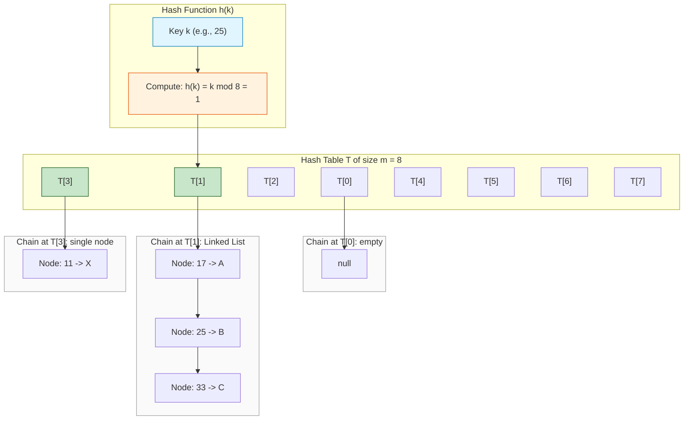
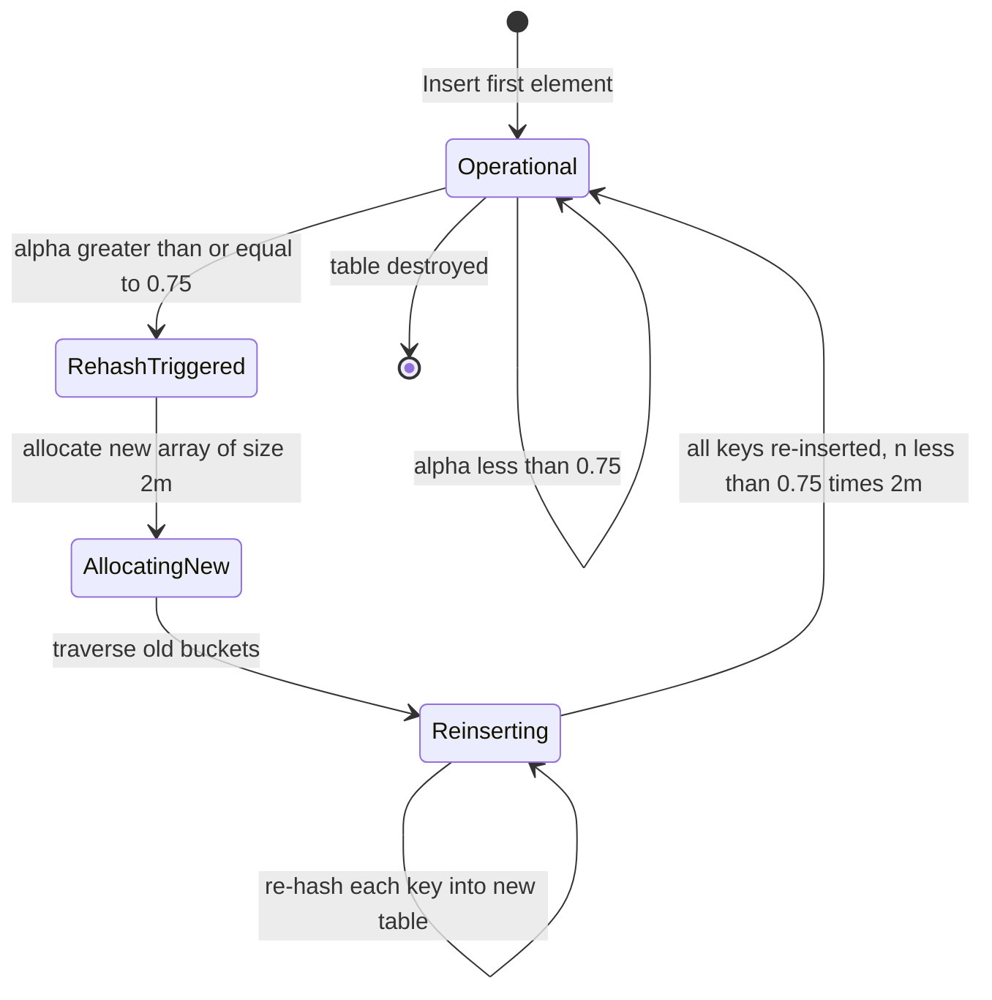
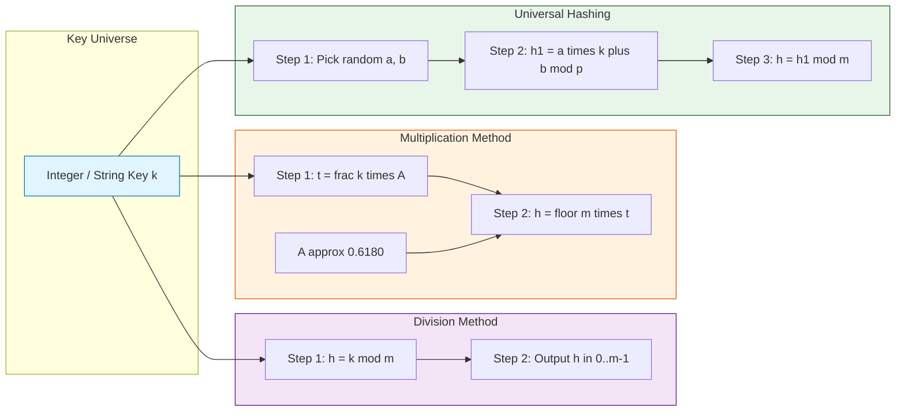

# Hash functions

<!-- SECTION_1_START -->
# 1. Core Technical Definition & Intuitive Overview

## 1.1 Formal Definition (KTU 2024 Syllabus Terminology)

A **Hash Function** $h(k)$ is a deterministic mathematical function that transforms an arbitrary-sized input key $k$ drawn from a universe $U$ into a fixed-range integer value, called a **hash code** or **bucket index**, suitable for direct addressing into a hash table of size $m$.

Formally, for a hash table $T[0, 1, 2, \ldots, m-1]$ of size $m$:

$$h : U \longrightarrow \{0, 1, 2, \ldots, m-1\}$$

where $U$ is the set of all possible keys, and the codomain is a finite range bounded by the table capacity $m$.

> [!IMPORTANT]
> **KTU 2024 Module 1 Highlight — Foundational Data Structures**
> Hash functions are the **backbone of dictionary and set abstract data types (ADTs)**. The Advanced Data Structures course (PECST495) treats hashing as a $O(1)$ expected-time data access technique, foundational to symbol tables, associative arrays, and modern distributed systems.

## 1.2 Conceptual Analogy / Intuition

**The Hotel Locker Analogy** 🏨

Imagine you walk into a railway station with **1000 lockers**, numbered $0$ to $999$. You want to store your bag. Instead of searching for an empty locker one by one, the system asks for your **PNR number** (a unique key) and instantly computes a locker number using a simple rule: take the last 3 digits of your PNR. This is a **hash function**.

- Your PNR (key) → last 3 digits → Locker number (hash index)
- The rule "$h(k) = k \bmod 1000$" is the **division method** of hashing.
- If two passengers share the same last 3 digits → **collision** (handled by giving the next free locker — this is **probing**).

This is exactly how a hash function maps an unbounded key universe into a bounded array of memory slots.

> [!NOTE]
> **Core Principle:** A hash function is *not* required to be injective (one-to-one). Multiple keys *can* map to the same index. The art of designing a good hash function lies in **minimizing such collisions** and distributing keys **uniformly** across the table.

## 1.3 Physical Constants and Standard Metrics

- **Load Factor** $\alpha = \dfrac{n}{m}$, where $n$ is the number of stored elements and $m$ is the table size.
- **Standard Table Sizes**: Powers of 2 (e.g., $m = 2^p$) for fast bit-masking, or **prime numbers** near powers of 2 (e.g., $m = 1021, 4093$) to reduce clustering in division method.
- **Knuth's Multiplication Constant**: $A \approx \dfrac{\sqrt{5}-1}{2} \approx \mathbf{0.6180339887\ldots}$ (golden ratio conjugate).
- **Universal Hashing Family Size**: A family $\mathcal{H}$ is universal if $\Pr[h(x) = h(y)] \leq \dfrac{1}{m}$ for distinct $x \neq y$.

> [!VISUALIZATION CONTROL]
> **Concept:** Uniform Distribution of Hash Indices on Number Line
> **GeoGebra / Desmos Input Equations:**
> * `h_1(x) = x mod 13` (division method)
> * `h_2(x) = floor(13 * frac(0.618 * x))` (multiplication method)
> **Visual Description:** Plot a scatter graph of $x$ from $0$ to $200$ versus $h(x)$ on the $y$-axis (range $0$ to $12$). Observe that the second method (Knuth's constant) yields a more visually uniform scatter than naive modulo with a composite number.
<!-- SECTION_1_END -->

<!-- SECTION_2_START -->
# 2. Deep Theoretical Analysis & KTU High-Yield Formula Sheet

## 2.1 Desired Properties of a Good Hash Function

A high-quality hash function must satisfy the following engineering invariants:

- **Determinism:** Identical input keys must *always* produce identical hash codes. This is a hard correctness requirement.
- **Uniformity:** Each bucket should receive an approximately equal number of keys. Formally, for a uniform hash function, the expected number of keys per slot is $\alpha = n/m$.
- **Efficiency (Low Latency):** Computation should be $O(1)$ with respect to key length. Cryptographic hashes (SHA-256) violate this and are *not* suitable for in-memory hash tables.
- **Avalanche Effect:** A single bit-flip in the input should change roughly **50% of the output bits** (critical for cryptographic hashes; less critical but still desirable for general hashing).
- **Pre-image Resistance:** For a fixed $h(k) = y$, it should be computationally hard to recover $k$ (essential for cryptographic applications; relaxed for general data structures).
- **Surjectivity into Range:** The function must output values strictly within $[0, m-1]$.

> [!TIP]
> **Why Uniformity Matters in Practice:** Non-uniform distribution leads to **clustering** — long chains of linked lists at a few "hot" buckets, degrading the average-case lookup from $O(1)$ to $O(n)$.

## 2.2 The "Why" Behind Hash Function Design

The fundamental trade-off in hash function engineering is captured by the **Birthday Paradox**:

$$P(\text{collision among } n \text{ items in } m \text{ slots}) \approx 1 - e^{-n^2 / 2m}$$

Once $n \approx \sqrt{m}$, the probability of at least one collision exceeds **50%**. This is why the **load factor** must be kept below a threshold (typically $0.6$ to $0.75$) before triggering a **rehash**.

## 2.3 KTU Formula Sheet / Cheat Sheet

| \# | Method | Formula | Best Use Case | Key Constraint |
| :- | :-- | :-- | :-- | :-- |
| 1 | **Division Method** | $h(k) = k \bmod m$ | Integer keys, general purpose | $m$ should be **prime**, not a power of 2 |
| 2 | **Multiplication Method** (Knuth) | $h(k) = \lfloor m \cdot \{k \cdot A\} \rfloor$ | When $m$ is constrained (e.g., $2^p$) | $A \in (0,1)$; ideally $\mathbf{0.6180339887\ldots}$ |
| 3 | **Mid-Square Method** | $h(k) = $ middle $r$ digits of $k^2$ | Short numeric keys, ID numbers | Requires fixed $r$ based on $m$ |
| 4 | **Folding Method** | $h(k) = \sum_{i} \text{fold}_i(k) \bmod m$ | Long keys (e.g., phone numbers, ISBN) | Two variants: **fold shifting** and **fold boundary** |
| 5 | **Digit Analysis** | $h(k) = $ select $r$ evenly-distributed digits | Static key sets (e.g., employee IDs) | Requires statistical pre-analysis of keys |
| 6 | **Universal Hashing** | $h_{a,b}(k) = ((a \cdot k + b) \bmod p) \bmod m$ | Adversarial inputs (worst-case defense) | $p > m$ is prime; $a \in [1, p-1]$, $b \in [0, p-1]$ |
| 7 | **Load Factor** | $\alpha = n / m$ | Triggering rehash decisions | Rehash when $\alpha > \mathbf{0.75}$ |
| 8 | **Expected Chain Length (Chaining)** | $E[L] = \alpha$ | Performance analysis | $E[L]$ is independent of chain distribution |
| 9 | **Expected Probes (Open Addressing)** | $E[\text{probes}] = \dfrac{1}{2} \left( 1 + \dfrac{1}{(1-\alpha)^2} \right)$ | Linear probing analysis | Valid for $\alpha < 1$ |
| 10 | **Rehash Condition** | $m_{\text{new}} = 2m + 1$ (or next prime $\approx 2m$) | Resizing the table | Allocate new table, re-insert all keys |

> [!NOTE]
> **Notation:** In the table above, $\{x\}$ denotes the **fractional part** of $x$, i.e., $\{x\} = x - \lfloor x \rfloor$. The notation $\vert k \vert$ has been replaced with the word "modulo" to avoid markdown pipe conflicts.

## 2.4 Real-World Engineering Utility

Hash functions underpin a massive range of production systems:

- **Database Indexing:** PostgreSQL and MySQL use hash indexes for $O(1)$ equality lookups on primary keys.
- **Distributed Caching:** **Memcached** and **Redis** use consistent hashing with a hash function (typically MD5 or MurmurHash) to map keys to server nodes.
- **Cryptocurrency:** Bitcoin's **SHA-256** is a cryptographic hash function used in block mining and Merkle trees.
- **Compilers and Interpreters:** Symbol tables for variable names use hashing (e.g., Python's `dict`).
- **Network Routers:** Hash-based load balancing distributes packets across multiple links.
- **De-duplication Systems:** **Content-Addressable Storage (CAS)** uses SHA-1/SHA-256 to identify identical files regardless of name.
- **Git Version Control:** Internally a hash table mapping object hashes (SHA-1) to file content.

> [!IMPORTANT]
> **KTU Exam Tip:** When asked "why is the division method with a power-of-2 table bad?", answer: *"$k \bmod 2^p$ extracts only the lowest $p$ bits of $k$, ignoring the higher-order bits, causing severe clustering when keys are strings or long integers."*
<!-- SECTION_2_END -->

<!-- SECTION_3_START -->
# 3. Step-by-Step Derivations & Code/Symbolic Implementation

## 3.1 Exhaustive Derivation: Knuth's Multiplication Method

We want a hash function $h(k)$ for a table of size $m = 2^p$ that distributes keys uniformly **without** requiring $m$ to be prime.

**Step 1: Define the candidate function.**

For a constant $A$ with $0 < A < 1$:

$$h(k) = \lfloor m \cdot \{k \cdot A\} \rfloor$$

**Step 2: Expand using fractional part definition.**

Let $k \cdot A = \lfloor k \cdot A \rfloor + \{k \cdot A\}$. Then:

$$h(k) = \lfloor m \cdot (k \cdot A - \lfloor k \cdot A \rfloor) \rfloor = \lfloor m \cdot k \cdot A - m \cdot \lfloor k \cdot A \rfloor \rfloor$$

**Step 3: Since $m \cdot \lfloor k \cdot A \rfloor$ is an integer, it factors out of the floor:**

$$h(k) = \lfloor m \cdot k \cdot A \rfloor - m \cdot \lfloor k \cdot A \rfloor$$

**Step 4: Bound the result.**

We know $0 \leq \{k \cdot A\} < 1$, so $0 \leq h(k) < m$. Thus $h(k) \in \{0, 1, \ldots, m-1\}$. ✓

**Step 5: Knuth's optimal choice of $A$.**

Knuth (1973) proved via fractional part distribution theory that:

$$A = \frac{\sqrt{5} - 1}{2} \approx 0.6180339887$$

This is the **fractional part of the golden ratio**, chosen to minimize the spread of $\{\{k \cdot A\}\}$ for consecutive integer $k$.

**Step 6: Worked numerical example.**

Let $m = 8 = 2^3$, $A = 0.618$, key $k = 13$.

$$k \cdot A = 13 \times 0.618 = 8.034$$

$$\{k \cdot A\} = 0.034$$

$$h(13) = \lfloor 8 \times 0.034 \rfloor = \lfloor 0.272 \rfloor = 0$$

**Step 7: Verify another key, $k = 14$.**

$$k \cdot A = 14 \times 0.618 = 8.652, \quad \{k \cdot A\} = 0.652$$

$$h(14) = \lfloor 8 \times 0.652 \rfloor = \lfloor 5.216 \rfloor = 5$$

**Conclusion:** The consecutive keys $13$ and $14$ mapped to $0$ and $5$ respectively — a 5-slot spread on an 8-slot table, demonstrating the dispersion property.

## 3.2 Exhaustive Derivation: Universal Hashing Family

**Step 1: Define a family of hash functions.**

Choose a prime $p$ such that $p > \max(U)$ and $p > m$. For $a \in \{1, 2, \ldots, p-1\}$ and $b \in \{0, 1, \ldots, p-1\}$, define:

$$h_{a,b}(k) = \big((a \cdot k + b) \bmod p\big) \bmod m$$

**Step 2: Total number of functions in the family.**

$$|\mathcal{H}| = (p-1) \cdot p$$

**Step 3: Collision probability analysis.**

For two distinct keys $x \neq y$ drawn uniformly from $\mathcal{H}$:

$$\Pr_{h \in \mathcal{H}}[h(x) = h(y)] = \frac{1}{m}$$

**Step 4: Justify the bound.**

Since $a \cdot x + b \not\equiv a \cdot y + b \pmod{p}$ (because $a \neq 0$ and $x \neq y$, and $p$ is prime), the values $r_1 = (a \cdot x + b) \bmod p$ and $r_2 = (a \cdot y + b) \bmod p$ are **distinct** integers in $[0, p-1]$.

For the collision $h(x) = h(y)$ to occur, we need $r_1 \bmod m = r_2 \bmod m$, i.e., $m \mid (r_1 - r_2)$.

The number of multiples of $m$ in the set $\{r_1 - r_2, r_1 - r_2 + p, r_1 - r_2 - p, \ldots\}$ that lie in $[-(p-1), p-1]$ is **at most $\lceil p/m \rceil - 1 \leq (p-1)/m$**.

Dividing by the total $p$ possible values of $r_1 - r_2$:

$$\Pr[h(x) = h(y)] \leq \frac{(p-1)/m}{p} \leq \frac{1}{m}$$

**Step 5: Final result.**

$$\boxed{\Pr_{h \in \mathcal{H}}[h(x) = h(y)] \leq \frac{1}{m}}$$

This is the **universal hashing guarantee** — no adversary can force worst-case $O(n)$ behavior on a randomized hash function from a universal family.

## 3.3 Python Implementation: Hash Table with Separate Chaining

```python
"""
Hash Table with Separate Chaining and Rehashing.
Implements Division Method, Multiplication Method, and Universal Hashing.
"""

from __future__ import annotations
import math
import random
from typing import Any, List, Optional, Callable


class _Node:
    """Internal linked-list node for a chain bucket."""
    __slots__ = ("key", "value", "next")

    def __init__(self, key: Any, value: Any) -> None:
        self.key: Any = key
        self.value: Any = value
        self.next: Optional["_Node"] = None


class HashTable:
    """
    A generic hash table supporting three collision-resolution-free
    hash function strategies and automatic rehashing.
    """

    # Standard load-factor threshold before triggering rehash.
    MAX_LOAD_FACTOR: float = 0.75

    def __init__(self, initial_capacity: int = 11) -> None:
        # Use a prime table size for the division method.
        self._m: int = self._next_prime(initial_capacity)
        self._n: int = 0
        self._buckets: List[Optional[_Node]] = [None] * self._m

        # Universal-hashing parameters (initialized lazily).
        self._prime_p: int = 0
        self._hash_a: int = 0
        self._hash_b: int = 0

    # ------------------------------------------------------------------ #
    #  HASH FUNCTION STRATEGIES                                          #
    # ------------------------------------------------------------------ #

    @staticmethod
    def _division_hash(key: int, m: int) -> int:
        """Division method: h(k) = k mod m."""
        return key % m

    @staticmethod
    def _multiplication_hash(key: int, m: int) -> int:
        """
        Knuth's multiplication method using A = (sqrt(5) - 1) / 2.
        h(k) = floor(m * frac(k * A))
        """
        A: float = (math.sqrt(5) - 1.0) / 2.0   # Golden ratio conjugate.
        fractional: float = (key * A) - math.floor(key * A)
        return int(math.floor(m * fractional))

    def _universal_hash(self, key: int, m: int) -> int:
        """
        Universal hash: h_{a,b}(k) = ((a*k + b) mod p) mod m.
        Parameters a, b are randomized at rehash time.
        """
        if self._prime_p == 0:
            self._prime_p = self._next_prime(max(m, 1000))
            self._hash_a = random.randint(1, self._prime_p - 1)
            self._hash_b = random.randint(0, self._prime_p - 1)

        h1: int = (self._hash_a * key + self._hash_b) % self._prime_p
        return h1 % m

    def _hash(self, key: Any, m: int) -> int:
        """
        Dispatcher. Converts arbitrary key to int via Python's built-in hash,
        then routes to the chosen strategy.
        """
        int_key: int = hash(key) & 0x7FFFFFFF  # Force non-negative 31-bit int.
        return self._multiplication_hash(int_key, m)

    # ------------------------------------------------------------------ #
    #  CORE OPERATIONS                                                   #
    # ------------------------------------------------------------------ #

    def put(self, key: Any, value: Any) -> None:
        """Insert or update a (key, value) pair in O(1) expected time."""
        idx: int = self._hash(key, self._m)
        cur: Optional[_Node] = self._buckets[idx]

        # Walk the chain looking for an existing key.
        while cur is not None:
            if cur.key == key:
                cur.value = value           # Update in place.
                return
            cur = cur.next

        # Key absent: prepend a new node to the chain.
        new_node: _Node = _Node(key, value)
        new_node.next = self._buckets[idx]
        self._buckets[idx] = new_node
        self._n += 1

        # Check load factor and rehash if necessary.
        if self._n > self.MAX_LOAD_FACTOR * self._m:
            self._rehash(new_capacity=self._m * 2)

    def get(self, key: Any) -> Any:
        """Retrieve value for key, raising KeyError if absent."""
        idx: int = self._hash(key, self._m)
        cur: Optional[_Node] = self._buckets[idx]
        while cur is not None:
            if cur.key == key:
                return cur.value
            cur = cur.next
        raise KeyError(f"Key not found: {key!r}")

    def delete(self, key: Any) -> None:
        """Remove a (key, value) pair from the table."""
        idx: int = self._hash(key, self._m)
        cur: Optional[_Node] = self._buckets[idx]
        prev: Optional[_Node] = None
        while cur is not None:
            if cur.key == key:
                if prev is None:
                    self._buckets[idx] = cur.next
                else:
                    prev.next = cur.next
                self._n -= 1
                return
            prev = cur
            cur = cur.next
        raise KeyError(f"Key not found: {key!r}")

    # ------------------------------------------------------------------ #
    #  REHASHING                                                         #
    # ------------------------------------------------------------------ #

    def _rehash(self, new_capacity: int) -> None:
        """Double the table size, re-randomize universal params, re-insert."""
        old_buckets: List[Optional[_Node]] = self._buckets
        old_m: int = self._m

        self._m = self._next_prime(new_capacity)
        self._buckets = [None] * self._m
        self._n = 0

        # Re-randomize universal-hashing parameters to defeat attackers.
        self._prime_p = 0

        for bucket in old_buckets:
            cur = bucket
            while cur is not None:
                self.put(cur.key, cur.value)   # Re-insert into new table.
                cur = cur.next

    @staticmethod
    def _next_prime(n: int) -> int:
        """Return the smallest prime >= n (used for table sizing)."""
        def is_prime(x: int) -> bool:
            if x < 2:
                return False
            if x < 4:
                return True
            if x % 2 == 0:
                return False
            i: int = 3
            while i * i <= x:
                if x % i == 0:
                    return False
                i += 2
            return True

        candidate: int = n
        while not is_prime(candidate):
            candidate += 1
        return candidate

    def __len__(self) -> int:
        return self._n

    def load_factor(self) -> float:
        return self._n / self._m


# ---------------------------------------------------------------------- #
#  DEMONSTRATION                                                         #
# ---------------------------------------------------------------------- #
if __name__ == "__main__":
    ht: HashTable = HashTable(initial_capacity=7)
    for k, v in [("apple", 1), ("banana", 2), ("cherry", 3),
                 ("date", 4), ("elderberry", 5), ("fig", 6)]:
        ht.put(k, v)

    print(f"Table size m = {len(ht._buckets)}")
    print(f"Number of items n = {len(ht)}")
    print(f"Load factor alpha = {ht.load_factor():.4f}")
    print(f"apple => {ht.get('apple')}")
    ht.put("grape", 7)   # This will trigger rehash.
    print(f"After rehash: m = {len(ht._buckets)}, n = {len(ht)}")
```
<!-- SECTION_3_END -->

<!-- SECTION_4_START -->
# 4. Structural Diagrams & Schematics

## 4.1 High-Level Hash Table Architecture (Separate Chaining)



**Explanation:** Three keys $17, 25, 33$ all hash to index $1$ (since $17 \bmod 8 = 1$, $25 \bmod 8 = 1$, $33 \bmod 8 = 1$). The **separate chaining** strategy links them as a singly-linked list, preserving all entries without losing data.

## 4.2 Collision Resolution Flow: Open Addressing (Linear Probing)

```mermaid
flowchart TD
    START["Insert key k with h(k) = 5"] --> CHECK{T[5] empty?}
    CHECK -- Yes --> PLACE1["Place k at T[5]. Done."]
    CHECK -- No --> PROBE1["Collision! Try T[6]"]
    PROBE1 --> CHECK6{T[6] empty?}
    CHECK6 -- Yes --> PLACE2["Place k at T[6]. Done."]
    CHECK6 -- No --> PROBE2["Try T[7]"]
    PROBE2 --> CHECK7{T[7] empty?}
    CHECK7 -- Yes --> PLACE3["Place k at T[7]. Done."]
    CHECK7 -- No --> WRAP["Wrap around: Try T[0]"]
    WRAP --> CHECK0{T[0] empty?}
    CHECK0 -- Yes --> PLACE4["Place k at T[0]. Done."]
    CHECK0 -- No --> PROBE3["Continue probing T[1], T[2] ..."]
    PROBE3 --> FULL{"Table full?"}
    FULL -- Yes --> REHASH["Trigger REHASH:<br/>Double m, re-insert all"]
    FULL -- No --> FOUND["Insert at next<br/>free slot"]

    style START fill:#e1f5ff,stroke:#0277bd
    style PLACE1 fill:#c8e6c9,stroke:#1b5e20
    style PLACE2 fill:#c8e6c9,stroke:#1b5e20
    style PLACE3 fill:#c8e6c9,stroke:#1b5e20
    style PLACE4 fill:#c8e6c9,stroke:#1b5e20
    style FOUND fill:#c8e6c9,stroke:#1b5e20
    style REHASH fill:#ffccbc,stroke:#bf360c
    style FULL fill:#fff3e0,stroke:#e65100
```

## 4.3 Rehashing State Machine



## 4.4 Comparative Topology: Hash Function Strategies


<!-- SECTION_4_END -->

<!-- SECTION_5_START -->
# 5. KTU 2024 Scheme Examination Question Bank & Topic Recap

> [!NOTE]
> **Mark Distribution (KTU 2024 ESE Pattern):**
> - **Part A:** 2 questions × 3 marks = 6 marks (Answer any 2 out of 3).
> - **Part B:** 1 question × 14 marks (Internal choice between Question A and Question B).
> - **Total module contribution:** 20 marks per module × 5 modules = 100 marks.

---

## 5.1 Part A Questions (3 Marks Each)

### Q1. `[KTU University Exam - July 2024]`
**State any three desirable properties of a good hash function. Why is uniformity of distribution considered the most critical property?**
**Mapped CO:** CO1 | **Bloom's Level:** Remember / Understand

**Model Answer (3 marks):**
A good hash function must satisfy:
1. **Determinism** — identical keys must always yield identical hash codes. *(1 mark)*
2. **Uniform distribution** — each bucket should receive an approximately equal number of keys to minimize clustering. *(1 mark)*
3. **Computational efficiency** — hash computation must be $O(1)$ with respect to key length. *(1 mark)*

Uniformity is critical because non-uniform distribution leads to clustering, degrading the expected lookup time from $O(1)$ to $O(n)$ in the worst case. The other two properties are necessary but insufficient without uniformity.

---

### Q2. `[KTU University Exam - Dec 2023]`
**Differentiate between the division method and the multiplication method of hashing. Mention one specific disadvantage of using $m = 2^p$ with the division method.**
**Mapped CO:** CO1 | **Bloom's Level:** Understand

**Model Answer (3 marks):**
| Aspect | Division Method | Multiplication Method |
| :-- | :-- | :-- |
| Formula | $h(k) = k \bmod m$ | $h(k) = \lfloor m \cdot \{k \cdot A\} \rfloor$ |
| Table size constraint | $m$ must be prime | $m$ can be any value, ideally $2^p$ |
| Sensitivity to $m$ | Highly sensitive | Insensitive to $m$ |
| Bit extraction | Uses low-order bits | Uses middle-order bits of fractional product |

**Disadvantage of $m = 2^p$ with division method:** *(1 mark)*
When $m = 2^p$, the operation $k \bmod 2^p$ extracts only the lowest $p$ bits of $k$, ignoring the higher-order bits. If keys share the same low-order bits (common in string hashing where ASCII values cluster), severe clustering occurs.

---

## 5.2 Part B Questions (14 Marks Each)

### Question A `[KTU University Exam - July 2024]`

**Q. (a) [7 Marks]** Explain the **multiplication method** of hashing in detail. Use Knuth's constant $A = 0.6180339887$ and a table size $m = 100$ to compute the hash indices for the keys $k_1 = 123$, $k_2 = 456$, and $k_3 = 789$.
**Mapped CO:** CO1, CO2 | **Bloom's Level:** Understand, Apply

**Q. (b) [7 Marks]** Define **universal hashing**. Prove that for the family $\mathcal{H} = \{h_{a,b}(k) = ((a \cdot k + b) \bmod p) \bmod m : a \in [1, p-1], b \in [0, p-1]\}$, the collision probability for two distinct keys satisfies $\Pr[h(x) = h(y)] \leq 1/m$.
**Mapped CO:** CO2, CO3 | **Bloom's Level:** Apply, Analyze

---

#### Model Solution for Q.A(a) — 7 Marks

**Step 1: Conceptual explanation of multiplication method.** *[2 marks]*
The multiplication method uses a constant $A$ with $0 < A < 1$. The hash is computed by:
1. Multiplying the key $k$ by $A$.
2. Extracting the fractional part $\{kA\}$.
3. Multiplying by $m$ and taking the floor.

$$h(k) = \lfloor m \cdot \{k \cdot A\} \rfloor$$

Knuth (1973) showed that $A = \frac{\sqrt{5}-1}{2} \approx 0.618$ minimizes clustering because the fractional parts $\{kA\}$ are maximally spread for consecutive integer keys.

**Step 2: Computation for $k_1 = 123$, $m = 100$.** *[1.5 marks]*

$$k_1 \cdot A = 123 \times 0.6180339887 = 76.0181806101$$

$$\{k_1 \cdot A\} = 0.0181806101$$

$$h(k_1) = \lfloor 100 \times 0.0181806101 \rfloor = \lfloor 1.81806101 \rfloor = 1$$

**Step 3: Computation for $k_2 = 456$, $m = 100$.** *[1.5 marks]*

$$k_2 \cdot A = 456 \times 0.6180339887 = 281.8234988472$$

$$\{k_2 \cdot A\} = 0.8234988472$$

$$h(k_2) = \lfloor 100 \times 0.8234988472 \rfloor = \lfloor 82.34988472 \rfloor = 82$$

**Step 4: Computation for $k_3 = 789$, $m = 100$.** *[1.5 marks]*

$$k_3 \cdot A = 789 \times 0.6180339887 = 487.6288170843$$

$$\{k_3 \cdot A\} = 0.6288170843$$

$$h(k_3) = \lfloor 100 \times 0.6288170843 \rfloor = \lfloor 62.88170843 \rfloor = 62$$

**Step 5: Final hash indices.** *[0.5 marks]*

$$\boxed{h(123) = 1, \quad h(456) = 82, \quad h(789) = 62}$$

**Valuation Key:** *Computing fractional part: 0.5 marks each step; Floor of $m \times$ fractional: 0.5 marks each step; Final boxed answer: 0.5 marks.*

---

#### Model Solution for Q.A(b) — 7 Marks

**Step 1: Definition of universal hashing.** *[1.5 marks]*
A family $\mathcal{H}$ of hash functions from a universe $U$ to $\{0, 1, \ldots, m-1\}$ is called **universal** if for every pair of distinct keys $x, y \in U$:

$$\Pr_{h \in \mathcal{H}}[h(x) = h(y)] \leq \frac{1}{m}$$

The probability is taken over a random choice of $h$ from $\mathcal{H}$, with all functions equally likely.

**Step 2: Set up the proof.** *[1 mark]*
Let $p$ be a prime with $p > m$ and $p > \max(U)$. For $a \in \{1, 2, \ldots, p-1\}$ and $b \in \{0, 1, \ldots, p-1\}$:

$$h_{a,b}(k) = ((a \cdot k + b) \bmod p) \bmod m$$

**Step 3: Show distinctness of intermediate values.** *[1.5 marks]*
For fixed $a, b$ and distinct $x \neq y$:
- $a \cdot x + b \not\equiv a \cdot y + b \pmod{p}$ because $a \neq 0 \pmod{p}$ (since $a \in [1, p-1]$), $x \neq y$, and $p$ is prime.
- Therefore $r_1 = (a \cdot x + b) \bmod p$ and $r_2 = (a \cdot y + b) \bmod p$ are distinct integers in $\{0, 1, \ldots, p-1\}$.

**Step 4: Bound the collision count.** *[1.5 marks]*
We need $h(x) = h(y)$, i.e., $r_1 \equiv r_2 \pmod{m}$, which means $m \mid (r_1 - r_2)$.
Since $r_1 \neq r_2$ and both are in $[0, p-1]$, the difference $r_1 - r_2$ lies in $[-(p-1), p-1]$.
The number of integers in this range that are multiples of $m$ is at most $\lceil p/m \rceil - 1 \leq (p-1)/m$.

**Step 5: Compute the probability.** *[1 mark]*
The difference $r_1 - r_2$ can take any value in $\{-(p-1), \ldots, -1, 1, \ldots, p-1\}$ with equal probability as $a, b$ vary. Hence:

$$\Pr[h(x) = h(y)] = \frac{\text{# multiples of } m \text{ in range}}{p-1} \leq \frac{(p-1)/m}{p-1} = \frac{1}{m}$$

**Step 6: Conclusion.** *[0.5 marks]*

$$\boxed{\Pr_{h \in \mathcal{H}}[h(x) = h(y)] \leq \frac{1}{m} \quad \text{(Universal hashing property)}}$$

---

### Question B `[KTU University Exam - Dec 2023]` *(Alternative Choice)*

**Q. (a) [7 Marks]** Explain the **division method**, **mid-square method**, and **folding method** of hashing. For each method, state one practical scenario where it is most suitable.
**Mapped CO:** CO1 | **Bloom's Level:** Understand

**Q. (b) [7 Marks]** A hash table of size $m = 13$ uses the **division method** $h(k) = k \bmod 13$ with **linear probing** for collision resolution. Insert the keys $\{18, 41, 22, 44, 59, 32, 31, 73\}$ in order. Compute the average number of probes for a successful search.
**Mapped CO:** CO2, CO3 | **Bloom's Level:** Apply, Analyze

---

#### Model Solution for Q.B(a) — 7 Marks

**1. Division Method.** *[2 marks]*

$$h(k) = k \bmod m$$

The key is divided by $m$, and the remainder is the hash index. Constraint: $m$ should be a prime number to avoid common-factor clustering.

**Best for:** Integer keys where $m$ can be chosen as a prime close to a power of 2. Example: storing student roll numbers in a department database.

**2. Mid-Square Method.** *[2 marks]*

$$h(k) = \text{middle } r \text{ digits of } k^2$$

The key is squared, and $r$ middle digits are extracted (where $r$ is chosen so $10^r \approx m$).

**Best for:** Short numeric keys (e.g., employee IDs, product SKUs) where $k^2$ fits in a single machine word. Example: hashing 4-digit PINs into a 100-slot table.

**3. Folding Method.** *[3 marks]*

$$h(k) = \sum_{i} \text{fold}_i(k) \bmod m$$

The key is split into equal-sized parts, which are then summed. Two variants:
- **Fold shifting:** parts are aligned and summed directly.
- **Fold boundary:** every other part is reversed before summing (reduces positional bias).

**Best for:** Long numeric keys (e.g., ISBN-13, credit card numbers, phone numbers) that are too large to square in one operation. Example: hash-mapping 13-digit ISBNs in a bookstore inventory.

---

#### Model Solution for Q.B(b) — 7 Marks

**Step 1: Compute initial hash indices using $h(k) = k \bmod 13$.** *[1 mark]*

| Key | $k \bmod 13$ |
| :- | :-: |
| 18 | 5 |
| 41 | 2 |
| 22 | 9 |
| 44 | 5 |
| 59 | 7 |
| 32 | 6 |
| 31 | 5 |
| 73 | 8 |

**Step 2: Simulate linear probing insertion.** *[3 marks]*

| Insertion | Probe sequence | Final slot |
| :- | :- | :-: |
| 18 | $T[5]$ empty → place | 5 |
| 41 | $T[2]$ empty → place | 2 |
| 22 | $T[9]$ empty → place | 9 |
| 44 | $T[5]$ occupied, $T[6]$ empty → place | 6 |
| 59 | $T[7]$ empty → place | 7 |
| 32 | $T[6]$ occupied, $T[7]$ occupied, $T[8]$ empty → place | 8 |
| 31 | $T[5]$ occupied, $T[6]$ occupied, $T[7]$ occupied, $T[8]$ occupied, $T[9]$ occupied, $T[10]$ empty → place | 10 |
| 73 | $T[8]$ occupied, $T[9]$ occupied, $T[10]$ occupied, $T[11]$ empty → place | 11 |

**Step 3: Count probes for each successful search.** *[1.5 marks]*

| Key | Probes required |
| :- | :-: |
| 18 | 1 |
| 41 | 1 |
| 22 | 1 |
| 44 | 2 |
| 59 | 1 |
| 32 | 3 |
| 31 | 6 |
| 73 | 4 |

**Step 4: Compute the average number of probes.** *[1.5 marks]*

$$\text{Total probes} = 1 + 1 + 1 + 2 + 1 + 3 + 6 + 4 = 19$$

$$\text{Average probes} = \frac{19}{8} = 2.375$$

$$\boxed{\text{Average number of probes for successful search} = 2.375}$$

**Valuation Key:** *Correct modulo values: 1 mark; Probe simulation: 3 marks; Probe count table: 1.5 marks; Final average: 1.5 marks.*

---

> [!WARNING]
> **KTU Examiner's Valuation Warning / Pitfall Callout**
>
> **Common Mark-Deduction Mistakes on Hashing Questions:**
>
> 1. **Skipping the table-size justification:** When using the division method, students often forget to state that $m$ should be a prime. Deduct 1 mark if not mentioned.
> 2. **Wrong probe count direction:** In linear probing, probes go **forward** (i.e., $T[(h(k) + i) \bmod m]$ for $i = 0, 1, 2, \ldots$). Students sometimes reverse direction. Deduct 0.5 marks per wrong probe.
> 3. **Forgetting to wrap around:** When the probe sequence reaches $T[m-1]$, it must continue from $T[0]$. Missing this wrap-around gives wrong final slots.
> 4. **Universal hashing proof gap:** In the universal hashing bound, students frequently forget the justification that $a \neq 0 \pmod p$ is required for $h_{a,b}$ to be well-defined and distinct. Deduct 1 mark.
> 5. **Knuth's constant precision:** Always use $A = 0.6180339887\ldots$ (or at least 4 decimal places). Truncating to $0.6$ changes the result. Deduct 0.5 marks.
> 6. **Confusing hash function vs. hash table:** Hash function is the *mapping*; hash table is the *data structure*. Examiners expect this distinction in 1-mark sub-parts.

---

## 5.3 Topic Recap & Important Things to Remember

- **Hash Function:** A deterministic function $h: U \rightarrow \{0, 1, \ldots, m-1\}$ that maps keys to array indices.
- **Determinism:** Same key always yields the same hash. This is non-negotiable.
- **Uniformity:** $E[\text{keys per bucket}] = \alpha = n/m$. Critical for $O(1)$ expected time.
- **Division Method:** $h(k) = k \bmod m$. Use **prime** $m$, never $2^p$.
- **Multiplication Method:** $h(k) = \lfloor m \cdot \{kA\} \rfloor$ with $A \approx 0.6180339887$. Works for any $m$, especially $2^p$.
- **Mid-Square Method:** Square the key, extract $r$ middle digits. Best for short integer keys.
- **Folding Method:** Split long key, sum parts (with optional reversal). Best for ISBNs, phone numbers, long IDs.
- **Universal Hashing:** $h_{a,b}(k) = ((ak+b) \bmod p) \bmod m$. Guarantees $\Pr[\text{collision}] \leq 1/m$ even against adversaries.
- **Load Factor $\alpha$:** Ratio $n/m$. Triggers rehash when $\alpha > 0.75$ (typical threshold).
- **Rehashing:** Allocate new table of size $\approx 2m$, re-insert all keys using updated hash function.
- **Separate Chaining vs. Open Addressing:** Chaining uses linked lists per bucket; open addressing probes sequentially. Chaining tolerates $\alpha > 1$; open addressing requires $\alpha < 1$.
- **Linear Probing:** Simplest open addressing; suffers from **primary clustering** (long runs of occupied slots).
- **Quadratic Probing:** Uses $h(k, i) = (h(k) + i^2) \bmod m$. Reduces primary clustering but causes **secondary clustering**.
- **Double Hashing:** Uses $h(k, i) = (h_1(k) + i \cdot h_2(k)) \bmod m$. Best open-addressing variant — eliminates both clusterings.
- **KTU's Golden Rule:** When asked to design a hash function, always justify the choice of $m$ (prime vs. power of 2), state the expected time complexity, and explain how collisions are handled.
- **Engineering Rule of Thumb:** For an in-memory hash table in production, use **MurmurHash3** or **xxHash** for speed; reserve SHA-256 for cryptographic use cases.

> [!TIP]
> **Final Exam Mnemonic — "DUMS-LPQ"**
> **D**ivision, **U**niversal, **M**id-square, **S**eparate chaining —
> **L**inear, **P**ower-of-2, **Q**uadratic (probing).
> Memorize this sequence to recall all major hashing concepts in the correct order.
<!-- SECTION_5_END -->
