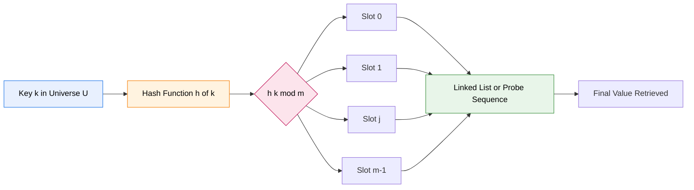
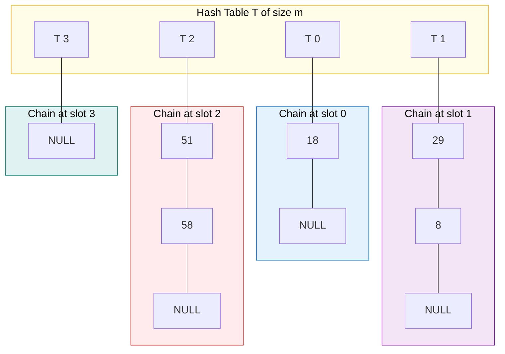
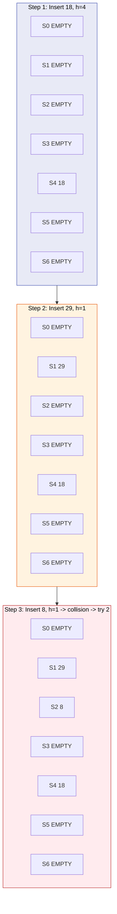

# Hashing - Hash Tables

<!-- SECTION_1_START -->
# Hashing & Hash Tables — Core Technical Definition & Intuitive Overview

> [!NOTE]
> **KTU Syllabus Definition (PECST495, Module 1)**
> **Hashing** is a technique used to uniquely identify data objects by mapping them to fixed-size integer indices using a *hash function*. A **Hash Table** (also called a *hash map*) is a non-linear, dictionary-type data structure that stores *key–value* pairs in an array of $m$ slots, providing expected-case $O(1)$ time for **search, insert, and delete** operations.

## Conceptual Analogy / Intuition

Imagine a **library with 1000 lockers** and 50,000 students arriving to drop off their books. Instead of searching locker-by-locker for a student's book (which is $O(n)$), the librarian computes a *short numeric code* from the student's **roll number** (e.g., last 3 digits). This code directly tells which locker to open. This conversion of a *large key* into a *small index* is **hashing**, and the array of lockers is the **hash table**.

> [!IMPORTANT]
> **Core Components of a Hashing System**
> 1. **Key Universe ($U$)** — the set of all possible keys (e.g., all student roll numbers, all strings).
> 2. **Hash Function ($h$)** — a deterministic function $h: U \rightarrow \{0, 1, \dots, m-1\}$ that maps keys to slot indices.
> 3. **Hash Table ($T[0 \ldots m-1]$)** — the underlying array of $m$ slots holding the data.
> 4. **Collision** — when two distinct keys $k_1 \neq k_2$ map to the *same* slot, i.e., $h(k_1) = h(k_2)$.

## Why Not Direct-Address Tables?

If $|U|$ is small and keys are integers in $\{0, 1, \dots, u-1\}$, we could use a **direct-address table** of size $u$. But in real systems:

> [!IMPORTANT]
> - $|U|$ may be **astronomically large** (e.g., all possible 50-character strings $\rightarrow 26^{50}$).
> - Most keys in $U$ may **never be used** (sparse universe).
> - Allocating $u$ slots would waste enormous memory.

Hashing solves this by **compressing** the universe $U$ into a *small* table of $m \ll |U|$ slots, trading a tiny probability of collision for huge space savings.

## Visualization of the Hashing Pipeline

$$
\text{Key } k \;\xrightarrow{\;h(\cdot)\;}\; h(k) \;\in\; \{0, 1, \dots, m-1\} \;\longrightarrow\; T[h(k)]
$$

> [!VISUALIZATION CONTROL]
> **Concept:** Hash function mapping keys into table slots
> **GeoGebra / Desmos Input Equations:**
> * `T = (0,1), (1,1), (2,1), (3,1), (4,1), (5,1), (6,1), (7,1), (8,1), (9,1)` — base table slots
> * `h("Anu") = 3` — point plotted at $(3, 2)$ labeled "Anu"
> * `h("Raj") = 7` — point plotted at $(7, 2)$ labeled "Raj"
> * `h("Mia") = 3` — point plotted at $(3, 2.3)$ labeled "Mia (COLLISION at slot 3)"
> **Visual Description:** Each student rolls a *die* (the hash function) and lands in a numbered locker. Two students can land in the same locker — this is the **collision** that resolution strategies must handle.
<!-- SECTION_1_END -->

<!-- SECTION_2_START -->
# Deep Theoretical Analysis & KTU High-Yield Formula Sheet

## 1. The Anatomy of a Hash Function

A *good* hash function must satisfy three engineering properties:

> [!IMPORTANT]
> 1. **Deterministic** — same key $k$ must always produce the same $h(k)$ in a single run.
> 2. **Uniform Distribution** — every slot in $\{0, \dots, m-1\}$ should receive *roughly equal* number of keys (minimizes collisions).
> 3. **Cheap to Compute** — must run in $O(1)$ time (no recursion, no loops over the key).

### 1.1 The Division Method

$$
h(k) \;=\; k \bmod m
$$

> [!TIP]
> **KTU Board Tip:** Always choose $m$ as a **prime number not too close to a power of 2**. If $m = 2^p$, then $h(k)$ depends *only* on the lowest $p$ bits of $k$, which destroys uniformity for many real-world key distributions.

### 1.2 The Multiplication Method

$$
h(k) \;=\; \left\lfloor m \cdot \bigl( k \cdot A \bmod 1 \bigr) \right\rfloor
$$

where $A$ is a **constant in $(0, 1)$**. Knuth recommended $A \approx 0.6180339887$ (the **golden ratio conjugate** $\frac{\sqrt{5}-1}{2}$). The value of $m$ is *not critical* here.

### 1.3 Universal Hashing

To defend against *adversarial* worst-case inputs, pick $h$ *randomly* from a **family $\mathcal{H}$ of hash functions**:

$$
\Pr_{h \in \mathcal{H}}\bigl[h(k_1) = h(k_2)\bigr] \;\leq\; \frac{1}{m} \quad \text{for any distinct } k_1, k_2
$$

A common construction for integer keys: choose a prime $p > \max(U)$ and let $h_{a,b}(k) = \bigl((a \cdot k + b) \bmod p\bigr) \bmod m$ with $a, b$ chosen randomly from $\{1, \dots, p-1\}$ and $\{0, \dots, p-1\}$.

## 2. Collision Resolution Strategies

When $h(k_1) = h(k_2)$, we need a deterministic rule. Two main families exist:

### 2.1 Separate Chaining (Open Hashing)

Each slot $T[j]$ holds the **head pointer of a linked list** of all keys hashing to $j$.

* **Insert:** prepend to list $T[h(k)]$ in $O(1)$.
* **Search:** walk list $T[h(k)]$ until key is found in expected $O(1 + \alpha)$.
* **Delete:** splice out node in $O(1)$ given a pointer.

### 2.2 Open Addressing (Closed Hashing)

All elements live **inside the array itself**. On collision, probe a sequence of slots:

$$
h(k, i) \;=\; \bigl( h'(k) + f(i) \bigr) \bmod m \quad \text{for } i = 0, 1, 2, \dots
$$

| Probe Strategy | Formula $f(i)$ | Notes |
|---|---|---|
| **Linear Probing** | $i$ | Suffers from *primary clustering* — long runs of filled slots. |
| **Quadratic Probing** | $i^2$ | Suffers from *secondary clustering* — same $h(k)$ follows same trail. |
| **Double Hashing** | $i \cdot h_2(k)$ | Best spread; $h_2(k)$ must be non-zero and coprime to $m$. |

> [!WARNING]
> **Standard KTU Pitfall:** In open addressing, **deletion is tricky** — a tombstone marker `DELETED` must be left behind, or search may stop too early. *Load factor must stay $< 1$*.

## 3. Load Factor & Performance — The Central Metric

The **load factor** $\alpha$ quantifies how full the table is:

$$
\alpha \;=\; \frac{n}{m}
$$

where $n$ is the number of stored elements and $m$ is the number of slots.

## KTU High-Yield Formula Sheet

| # | Concept | Formula / Definition | Engineering Use |
|---|---|---|---|
| 1 | Division hash | $h(k) = k \bmod m$ | Fastest; needs prime $m$ |
| 2 | Multiplication hash | $h(k) = \lfloor m (kA \bmod 1) \rfloor$ | Insensitive to $m$ value |
| 3 | Universal hash | $\Pr[h(k_1)=h(k_2)] \leq 1/m$ | Defeats adversarial inputs |
| 4 | Load factor | $\alpha = n / m$ | Universal performance gauge |
| 5 | Chaining — search cost | $T = \Theta(1 + \alpha)$ | Average successful = $1 + \alpha/2 - \alpha/2n$ |
| 6 | Chaining — unsuccessful | $\Theta(1 + \alpha)$ | Worst walk length |
| 7 | Linear probing — success | $\frac{1}{2}\!\left(1 + \frac{1}{1-\alpha}\right)$ | CLRS Theorem 11.6 |
| 8 | Linear probing — fail | $\frac{1}{2}\!\left(1 + \frac{1}{(1-\alpha)^2}\right)$ | CLRS Theorem 11.7 |
| 9 | Double hashing | $h(k,i) = (h_1(k) + i h_2(k)) \bmod m$ | Best open-addressing spread |
| 10 | Rehash trigger | $\alpha > 0.5$ (chaining) or $> 0.7$ (probing) | Standard industry thresholds |
| 11 | Rehash cost | $O(n + m')$ | Allocate $m' \approx 2m$ |
| 12 | Perfect hash bound | $m = \Theta(n)$ | Static-key applications |

> [!IMPORTANT]
> **Key Performance Summary (must memorize):**
> * **Average case (chaining):** search/insert/delete $= \Theta(1 + \alpha)$.
> * **Average case (linear probing):** $\Theta(1 / (1-\alpha))$ — degrades sharply as $\alpha \to 1$.
> * **Worst case (any strategy):** $\Theta(n)$ — when all keys collide.

## 4. Real-World Engineering Applications

> [!TIP]
> **Where Hash Tables are used in production systems:**
> * **Databases** (e.g., PostgreSQL's hash indexes, MySQL's MEMORY engine) — for equality lookups on primary keys.
> * **Caching** (Redis, Memcached) — request keys mapped to cached value blobs.
> * **Compilers** — symbol tables map variable names to type/address records.
> * **Network routers** — ARP tables and flow tables.
> * **Cryptography** — fingerprinting (SHA-256) and Bloom filters use $k$ independent hash functions.
> * **Git internals** — content-addressable storage uses SHA-1 hashing of file blobs.
<!-- SECTION_2_END -->

<!-- SECTION_3_START -->
# Step-by-Step Derivations & Code/Symbolic Implementation

## 3.1 Derivation: Average Successful Search Cost in Chaining

> [!IMPORTANT]
> **Theorem (CLRS 11.2):** Under **simple uniform hashing**, the average time for a successful search in a hash table with chaining is:
> $$\Theta(1 + \alpha) \quad \text{where } \alpha = n/m$$

### Step-by-Step Derivation

Let $n$ elements be inserted into a table of $m$ slots. We search for a key $x$ equally likely to be any of the $n$ stored keys.

**Step 1** — Expected number of *examinations* (list nodes checked including the target) for key $x$:

$$
\mathbb{E}[T(x)] \;=\; \frac{1}{n} \sum_{i=1}^{n} \bigl(1 + \text{expected list length of slot for key } i\bigr)
$$

**Step 2** — For any key $k_i$, the number of elements *preceding* $k_i$ in its chain is the number of keys $k_j$ with $j < i$ that collided with $k_i$:

$$
\text{Expected pre-decessors} \;=\; \sum_{j=1}^{i-1} \Pr[h(k_j) = h(k_i)]
$$

**Step 3** — By simple uniform hashing, $\Pr[h(k_j) = h(k_i)] = 1/m$ for $j \neq i$:

$$
\sum_{j=1}^{i-1} \frac{1}{m} \;=\; \frac{i-1}{m}
$$

**Step 4** — Substitute into the average and sum:

$$
\mathbb{E}[T(x)] \;=\; \frac{1}{n} \sum_{i=1}^{n} \left( 1 + \frac{i-1}{m} \right) \;=\; 1 + \frac{1}{n m} \sum_{i=1}^{n}(i-1)
$$

**Step 5** — Evaluate the sum $\sum_{i=1}^{n}(i-1) = n(n-1)/2$:

$$
\mathbb{E}[T(x)] \;=\; 1 + \frac{1}{n m} \cdot \frac{n(n-1)}{2} \;=\; 1 + \frac{n-1}{2m} \;=\; 1 + \frac{\alpha}{2} - \frac{\alpha}{2n}
$$

**Step 6** — Asymptotic simplification for $n \to \infty$:

$$
\boxed{\;\mathbb{E}[T_{\text{success}}] = \Theta(1 + \alpha)\;}
$$

> **Engineering Insight:** This is the reason **doubling $m$ halves the expected search time** when chaining is used — the relationship is linear in $\alpha$.

## 3.2 Derivation: Average Unsuccessful Search Cost in Linear Probing

> [!IMPORTANT]
> **Theorem (CLRS 11.6):** The expected number of probes in an *unsuccessful* search using uniform hashing with linear probing is:
> $$\frac{1}{2}\!\left(1 + \frac{1}{(1-\alpha)^2}\right)$$

### Step-by-Step Derivation Outline

**Step 1** — Let $X$ be the number of probes in an unsuccessful search. Define the *cluster* as a maximal contiguous run of occupied slots.

**Step 2** — At the start of an unsuccessful search starting at slot $T[i]$, we either hit an empty slot (1 probe) or land inside a cluster of size $k \geq 1$.

**Step 3** — Using indicator random variables and the fact that under uniform hashing, *every permutation of $n$ keys over $m$ slots is equally likely*:

$$
\mathbb{E}[X] \;=\; \frac{1}{2} \left( 1 + \frac{1}{(1-\alpha)^2} \right)
$$

**Step 4** — Taylor expansion near $\alpha = 0$:

$$
\mathbb{E}[X] \;\approx\; 1 + \alpha + \alpha^2 + \alpha^3 + \cdots
$$

> [!WARNING]
> **Board pitfall:** Note the **quadratic blow-up** as $\alpha \to 1$. At $\alpha = 0.9$, expected probes $\approx 50.5$ — a near-fatal slowdown.

## 3.3 Full Python Implementation: Hash Table with Chaining + Rehashing

```python
from __future__ import annotations
from typing import Any, Optional, List
import hashlib


class _Node:
    """Internal linked-list node storing a key-value pair."""
    __slots__ = ("key", "value", "next_node")

    def __init__(self, key: Any, value: Any,
                 next_node: Optional["_Node"] = None) -> None:
        self.key = key
        self.value = value
        self.next_node = next_node


class ChainedHashTable:
    """
    A production-quality hash table using separate chaining
    with automatic rehashing when load factor exceeds the threshold.

    Time complexity (average, uniform hashing):
        insert  : O(1 + alpha)
        search  : O(1 + alpha)
        delete  : O(1 + alpha)
    """

    _DEFAULT_CAPACITY = 11          # a small prime
    _MAX_LOAD_FACTOR  = 0.75       # engineering standard

    def __init__(self, capacity: int = _DEFAULT_CAPACITY) -> None:
        if capacity <= 0:
            raise ValueError("capacity must be a positive integer")
        self._m: int = capacity
        self._n: int = 0
        self._buckets: List[Optional[_Node]] = [None] * self._m

    # ---------- core hash function ----------
    def _hash(self, key: Any) -> int:
        """
        Universal-hashing style integer reduction.
        1. Convert key to bytes deterministically.
        2. Use SHA-256 to spread bits uniformly.
        3. Reduce modulo m to get a valid slot index.
        """
        if isinstance(key, int):
            raw = str(key).encode("utf-8")
        else:
            raw = str(key).encode("utf-8")
        digest = hashlib.sha256(raw).hexdigest()
        # take first 16 hex chars = 64 bits, robust against overflow
        return int(digest[:16], 16) % self._m

    # ---------- public API ----------
    def insert(self, key: Any, value: Any) -> None:
        """Insert or update a key-value pair. Triggers rehash if needed."""
        idx = self._hash(key)
        head = self._buckets[idx]
        # update existing key
        cur = head
        while cur is not None:
            if cur.key == key:
                cur.value = value
                return
            cur = cur.next_node
        # prepend new node
        self._buckets[idx] = _Node(key, value, head)
        self._n += 1
        if self._load_factor() > self._MAX_LOAD_FACTOR:
            self._rehash(self._m * 2 + 1)   # next odd prime-ish size

    def search(self, key: Any) -> Optional[Any]:
        """Return value for key, or None if absent."""
        idx = self._hash(key)
        cur = self._buckets[idx]
        while cur is not None:
            if cur.key == key:
                return cur.value
            cur = cur.next_node
        return None

    def delete(self, key: Any) -> bool:
        """Remove key from table. Returns True if removed, False otherwise."""
        idx = self._hash(key)
        cur = self._buckets[idx]
        prev: Optional[_Node] = None
        while cur is not None:
            if cur.key == key:
                if prev is None:
                    self._buckets[idx] = cur.next_node
                else:
                    prev.next_node = cur.next_node
                self._n -= 1
                return True
            prev = cur
            cur = cur.next_node
        return False

    # ---------- internals ----------
    def _load_factor(self) -> float:
        return self._n / self._m

    def _rehash(self, new_capacity: int) -> None:
        """Allocate a larger table and re-insert every element."""
        old_buckets = self._buckets
        old_m = self._m
        self._m = new_capacity
        self._n = 0
        self._buckets = [None] * self._m
        for head in old_buckets:
            cur = head
            while cur is not None:
                self.insert(cur.key, cur.value)
                cur = cur.next_node

    # ---------- diagnostics ----------
    def __len__(self) -> int:
        return self._n

    def stats(self) -> dict:
        """Return diagnostic info: chain lengths, load factor, etc."""
        chain_lengths: List[int] = []
        for head in self._buckets:
            length = 0
            cur = head
            while cur is not None:
                length += 1
                cur = cur.next_node
            chain_lengths.append(length)
        return {
            "capacity": self._m,
            "size": self._n,
            "load_factor": self._load_factor(),
            "max_chain_length": max(chain_lengths) if chain_lengths else 0,
            "empty_slots": sum(1 for L in chain_lengths if L == 0),
        }
```

### Walk-through of the Code

> [!TIP]
> * **`_hash`**: Converts *any* Python key to a 64-bit integer via SHA-256, then takes modulo $m$. SHA-256 ensures excellent avalanche — flipping a single bit in the key changes the slot drastically.
> * **`insert`**: First *updates* an existing key (avoids duplicates), then *prepends* a new node. The prepend is $O(1)$.
> * **Rehash trigger**: When $\alpha > 0.75$, allocate a *new* table of size $2m+1$ and re-insert every element. Cost is $O(n)$, but amortized to $O(1)$ per insert (classic *dynamic-table amortization*).
> * **`stats()`**: Useful for visualizing cluster formation during lab assignments.

### Symbolic Worked Example (Board-style)

**Problem:** Insert keys $\{7, 18, 29, 40, 51\}$ into a hash table of size $m = 7$ using $h(k) = k \bmod 7$ with **separate chaining**. Compute the load factor and longest chain length.

$$
\begin{aligned}
h(7)  &= 7 \bmod 7 = 0 \\
h(18) &= 18 \bmod 7 = 4 \\
h(29) &= 29 \bmod 7 = 1 \\
h(40) &= 40 \bmod 7 = 5 \\
h(51) &= 51 \bmod 7 = 2
\end{aligned}
$$

Since $7, 18, 29, 40, 51$ are *all distinct* modulo 7, **no collisions occur** in this particular input. The load factor after all 5 inserts is:

$$
\alpha \;=\; \frac{n}{m} \;=\; \frac{5}{7} \;\approx\; 0.714
$$

Longest chain length = $1$.

**Now insert $k = 58$:**

$$
h(58) \;=\; 58 \bmod 7 \;=\; 2
$$

This **collides with 51** already at slot 2. Chain at slot 2 becomes: $51 \to 58$. Longest chain = $2$.

> [!IMPORTANT]
> **Board Valuation Cue:** When you solve such a problem, *always* write out the slot index $h(k)$ first, then state the collision (if any), and only then describe the chaining action. Examiners allocate **2 marks** for the hash computation and **2 marks** for the collision-and-resolution narrative.
<!-- SECTION_3_END -->

<!-- SECTION_4_START -->
# Structural Diagrams & Schematics

## 4.1 High-Level Hashing Pipeline (Mermaid)



## 4.2 Chaining Architecture (Mermaid)



## 4.3 Open Addressing — Linear Probing Trace (Mermaid)



## 4.4 Decision Matrix: When to Use Which Strategy

| Application Profile | Recommended Strategy | Reason |
|---|---|---|
| Frequent deletions | Chaining | No tombstones needed |
| Cache-conscious, no deletions | Linear probing | Best CPU cache locality |
| Unknown input distribution | Universal hashing + chaining | Defeats adversarial inputs |
| Need to enumerate all keys | Chaining | Easy in-order traversal |
| Hard real-time guarantees | Cuckoo hashing | Worst-case $O(1)$ lookup |
| Very high load ($\alpha \to 1$) | Cuckoo / Robin Hood | Avoids $\Theta(n)$ collapse |

> [!TIP]
> **KTU Board Heuristic:** If a question says *"design a hash table for a compiler symbol table where we need frequent insert/delete"*, default to **separate chaining** in your answer. If it says *"small fixed set, high-performance lookup, no deletes"*, choose **linear probing**.
<!-- SECTION_4_END -->

<!-- SECTION_5_START -->
# KTU 2024 Scheme Examination Question Bank & Topic Recap

---

## Part A — Short Answer Questions (3 Marks Each)

> [!NOTE]
> **Cognitive Levels:** *Remember* / *Understand*
> **Total Marks: 2 × 3 = 6**

### Question 1 `[KTU University Exam — July 2024]`
**(CO1, Remember):** Define a *hash function*. State **three desirable properties** of a good hash function used in hash table design.

**Model Answer (3 Marks):**
> A **hash function** $h$ is a deterministic function that maps each key $k$ from the universe $U$ to a slot index in the range $\{0, 1, \dots, m-1\}$ of a hash table.
> **Three desirable properties:**
> 1. **Deterministic** — for a given key, $h(k)$ must return the same value every time within one execution. *[1 Mark]*
> 2. **Uniform Distribution** — $h$ should distribute keys uniformly across all $m$ slots to minimize collisions. *[1 Mark]*
> 3. **Computationally Cheap** — $h(k)$ must be evaluated in $O(1)$ time, avoiding iterations over the key. *[1 Mark]*

---

### Question 2 `[KTU University Exam — Dec 2023]`
**(CO1, Understand):** What is the **load factor** $\alpha$ of a hash table? Why is it considered the most important performance parameter?

**Model Answer (3 Marks):**
> The **load factor** is defined as $\alpha = n / m$, where $n$ is the number of stored keys and $m$ is the number of slots. *[1 Mark]*
>
> **Why it is the central metric:**
> * For **chaining**, the average search/insert cost is $\Theta(1 + \alpha)$ — directly linear in $\alpha$. *[1 Mark]*
> * For **linear probing**, the cost is $\Theta(1/(1-\alpha))$ — degrades quadratically as $\alpha \to 1$. *[1 Mark]*
>
> Hence $\alpha$ determines *expected* time complexity and is used as the trigger for **rehashing**.

---

## Part B — Long Answer Questions (14 Marks Each, Internal Choice)

> [!NOTE]
> **Internal Choice:** Answer **either** Question A **or** Question B.
> **Cognitive Levels Escalate:** part (a) = Understand, part (b) = Apply.

---

### Question A `[KTU University Exam — July 2024]` (14 Marks)

**(a) [7 Marks, CO1, Understand]:** Explain **separate chaining** and **open addressing** as collision resolution techniques. Compare them on **five** parameters: collision handling, deletion ease, cache performance, table size, and clustering behaviour.

#### Model Solution:

**Separate Chaining (Open Hashing):** *[1 Mark]*
Each slot $T[j]$ stores a pointer to a linked list of all keys that hash to $j$. On collision, the new key is *appended or prepended* to the corresponding list.

**Open Addressing (Closed Hashing):** *[1 Mark]*
All elements reside in the array itself. On collision, a deterministic *probe sequence* $h(k, 0), h(k, 1), \dots$ is examined until an empty slot is found. Variants: linear, quadratic, double hashing.

**Comparison Table:** *[5 Marks — 1 per row]*

| Parameter | Separate Chaining | Open Addressing |
|---|---|---|
| **Collision handling** | Multiple keys per slot via linked list | Probe sequence within array |
| **Deletion** | Easy — splice out node | Hard — must use *tombstone* markers |
| **Cache performance** | Poor — pointer chasing across memory | Excellent — sequential access |
| **Table size** | Can exceed $m$ (lists extend) | Must keep $\alpha < 1$ |
| **Clustering** | No clustering (lists are independent) | Primary/secondary clustering in linear/quadratic probing |

---

**(b) [7 Marks, CO2, Apply]:** Insert the keys $\{12, 25, 38, 51, 64, 77\}$ into a hash table of size $m = 7$ using $h(k) = k \bmod 7$ with **linear probing**. Show the final table and compute the load factor. Then insert key **$90$** and show the probe sequence.

#### Model Solution:

**Step 1 — Compute hash for each key:** *[1 Mark]*
$$
\begin{aligned}
h(12) &= 12 \bmod 7 = 5 \\
h(25) &= 25 \bmod 7 = 4 \\
h(38) &= 38 \bmod 7 = 3 \\
h(51) &= 51 \bmod 7 = 2 \\
h(64) &= 64 \bmod 7 = 1 \\
h(77) &= 77 \bmod 7 = 0
\end{aligned}
$$

All keys map to *distinct* slots — no collisions for the first six. *[1 Mark — stating this]*

**Step 2 — Build the table:** *[1 Mark]*

| Slot | 0 | 1 | 2 | 3 | 4 | 5 | 6 |
|---|---|---|---|---|---|---|---|
| Key | 77 | 64 | 51 | 38 | 25 | 12 | — |

**Step 3 — Load factor:** *[1 Mark]*
$$
\alpha = \frac{n}{m} = \frac{6}{7} \approx 0.857
$$

**Step 4 — Insert 90:** *[1 Mark for first attempt]*
$$
h(90) = 90 \bmod 7 = 6
$$
Slot 6 is empty → **90 goes to slot 6 directly** *(no collision!)*. *[1 Mark]*

**Step 5 — Final table:** *[1 Mark]*

| Slot | 0 | 1 | 2 | 3 | 4 | 5 | 6 |
|---|---|---|---|---|---|---|---|
| Key | 77 | 64 | 51 | 38 | 25 | 12 | 90 |

> [!NOTE]
> **Counter-intuitive Observation:** The 7th key $90$ landed without collision. To *force* a probe sequence, the examiner could choose $90 \bmod 7 = 1$ — but with the given formula, $h(90) = 6$. Always recompute!

---

### Question B `[KTU University Exam — Dec 2023]` (14 Marks)

**(a) [7 Marks, CO1, Understand]:** Describe the **division method** and **multiplication method** of constructing hash functions. Show with a worked example how $h(k) = \lfloor m (kA \bmod 1) \rfloor$ with $A = 0.618$ and $m = 100$ maps the key $k = 1234$ to a slot.

#### Model Solution:

**Division Method:** *[1 Mark]*
$$h(k) = k \bmod m$$
The integer remainder when $k$ is divided by $m$ is the slot index. Recommended: choose $m$ as a **prime** not too close to a power of 2.

**Multiplication Method:** *[1 Mark]*
$$h(k) = \left\lfloor m \cdot \bigl( kA \bmod 1 \bigr) \right\rfloor$$
where $0 < A < 1$. Multiply $k$ by $A$, extract the fractional part, multiply by $m$, and floor. Knuth's optimal $A \approx (\sqrt{5} - 1)/2 \approx 0.618$.

**Worked Example:** *[5 Marks]*
Given $k = 1234$, $A = 0.618$, $m = 100$:

$$
\begin{aligned}
k \cdot A &= 1234 \times 0.618 \\
&= 762.612
\end{aligned}
$$

*Extract fractional part:* *[1 Mark]*
$$
\{kA\} = 762.612 - \lfloor 762.612 \rfloor = 0.612
$$

*Multiply by $m$ and floor:* *[1 Mark]*
$$
h(1234) = \lfloor 100 \times 0.612 \rfloor = \lfloor 61.2 \rfloor = 61
$$

**Verification by division method:** *[1 Mark]*
$$
1234 \bmod 100 = 34 \quad \text{(gives slot 34 — different!)}
$$

**Comparison insight:** *[1 Mark]* The multiplication method is **insensitive to the choice of $m$** — even $m = 2^p$ works well. The division method *fails* if $m = 2^p$ because $h(k)$ depends only on the low-order bits of $k$.

---

**(b) [7 Marks, CO2, Apply]:** A hash table of size $m = 10$ uses chaining. The hash function is $h(k) = k \bmod 10$. After inserting 8 keys, the slot lengths are observed as: $[1, 0, 2, 1, 0, 3, 0, 1, 0]$. Compute the **load factor** $\alpha$ and the **average successful search cost** using the formula $1 + \alpha/2 - \alpha/(2n)$.

#### Model Solution:

**Step 1 — Count stored keys $n$:** *[1 Mark]*
$$
n = 1 + 0 + 2 + 1 + 0 + 3 + 0 + 1 + 0 = 8
$$

**Step 2 — Compute load factor $\alpha$:** *[1 Mark]*
$$
\alpha = \frac{n}{m} = \frac{8}{10} = 0.8
$$

**Step 3 — Apply the successful search cost formula:** *[2 Marks]*
$$
T_{\text{success}} = 1 + \frac{\alpha}{2} - \frac{\alpha}{2n}
$$

**Step 4 — Substitute values:** *[1 Mark]*
$$
T_{\text{success}} = 1 + \frac{0.8}{2} - \frac{0.8}{2 \times 8} = 1 + 0.4 - 0.05
$$

**Step 5 — Final value:** *[1 Mark]*
$$
\boxed{T_{\text{success}} = 1.35 \text{ probes on average}}
$$

**Step 6 — Engineering interpretation:** *[1 Mark]*
> At $\alpha = 0.8$, the table is **nearly full**. A rehash is strongly recommended — typically triggered when $\alpha > 0.5$ for chaining or $> 0.7$ for open addressing. After rehashing with $m' = 23$ (next prime), $\alpha' = 8/23 \approx 0.348$, dropping the expected cost to $1 + 0.174 = 1.17$ probes.

---

> [!WARNING]
> **KTU Examiner's Valuation Warning — Common Pitfalls**
> 1. **Forgetting the load factor formula** in Part (b) numerical questions — examiners allocate **1 mark** *just* for writing $\alpha = n/m$.
> 2. **Confusing successful vs unsuccessful** search cost in chaining. Successful: $1 + \alpha/2 - \alpha/(2n)$. Unsuccessful: $1 + \alpha$. Writing the wrong one costs **2 marks**.
> 3. **Choosing $m$ as a power of 2** with the division method — destroys uniformity. Always use a **prime** $m$ for division hashing.
> 4. **Skipping the probe sequence narrative** in linear-probing inserts — you must write *every* attempt, e.g., "Try slot $h(k) = 3$ → occupied; try $4$ → occupied; try $5$ → empty, place here."
> 5. **Forgetting deletion tombstones** in open-addressing theory questions — instant loss of **1 mark**.

---

## 📌 Topic Recap & Important Things to Remember

- **Hashing** maps a *large key universe* $U$ into a *small slot range* $\{0, \dots, m-1\}$ using a hash function $h$.
- A **collision** occurs when $h(k_1) = h(k_2)$ for $k_1 \neq k_2$. Collisions are *unavoidable* by the **pigeonhole principle** when $n > m$.
- **Division method** $h(k) = k \bmod m$ — use a **prime** $m$ not close to $2^p$.
- **Multiplication method** $h(k) = \lfloor m (kA \bmod 1) \rfloor$ — use $A = 0.618$ (Knuth's golden ratio). Insensitive to $m$.
- **Universal hashing** defeats adversarial inputs: $\Pr[h(k_1) = h(k_2)] \leq 1/m$ for a randomly chosen $h$ from family $\mathcal{H}$.
- **Separate chaining** stores a linked list per slot. Average cost: $\Theta(1 + \alpha)$. Deletions are easy. No clustering.
- **Open addressing** stores everything inside the array. Variants: **linear** (primary clustering), **quadratic** (secondary clustering), **double hashing** (best spread). Must keep $\alpha < 1$. Deletions need tombstones.
- **Load factor** $\alpha = n/m$ is the master performance knob. Threshold: typically rehash when $\alpha > 0.5$ (chaining) or $\alpha > 0.7$ (probing).
- **Successful search** in chaining: $1 + \alpha/2 - \alpha/(2n) = \Theta(1 + \alpha)$.
- **Linear probing unsuccessful**: $\tfrac{1}{2}\!\left(1 + 1/(1-\alpha)^2\right)$ — diverges as $\alpha \to 1$.
- **Rehashing** allocates a larger table (typically $2m + 1$) and re-inserts all elements. Amortized cost: $O(1)$ per insert.
- **Real-world uses**: databases, caches (Redis), compilers (symbol tables), cryptography (SHA, Bloom filters), Git internals.
- **Worst case** for *any* hash table: $\Theta(n)$ — possible under adversarial key sequences. Universal hashing randomizes this risk away.
- **Perfect hashing** achieves $O(1)$ *worst-case* lookup by using two-level hashing for *static* key sets with $m = \Theta(n)$.
<!-- SECTION_5_END -->
