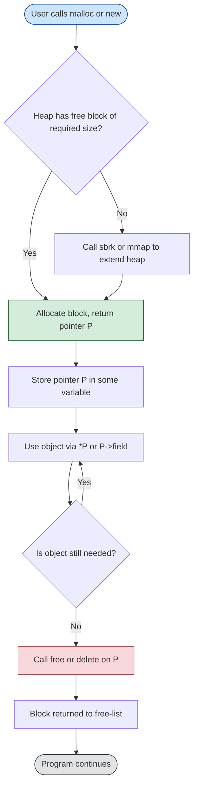
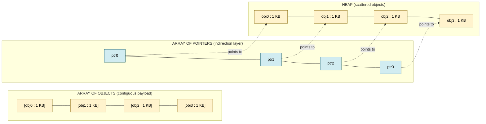
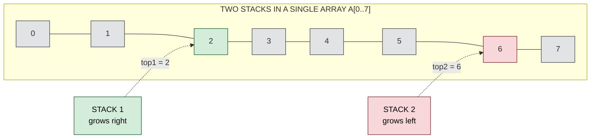
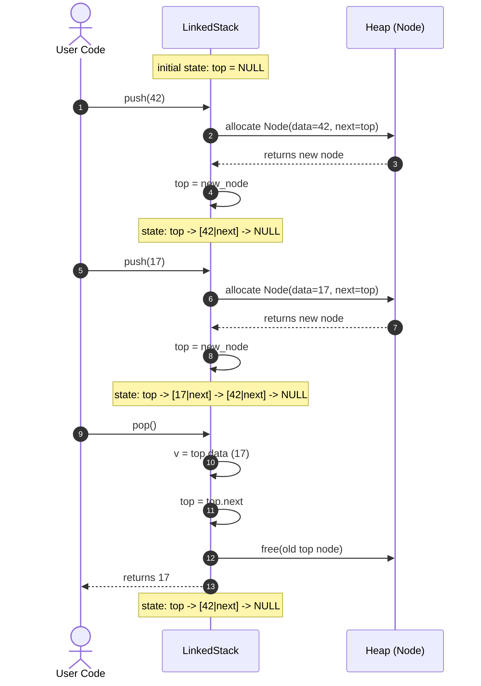
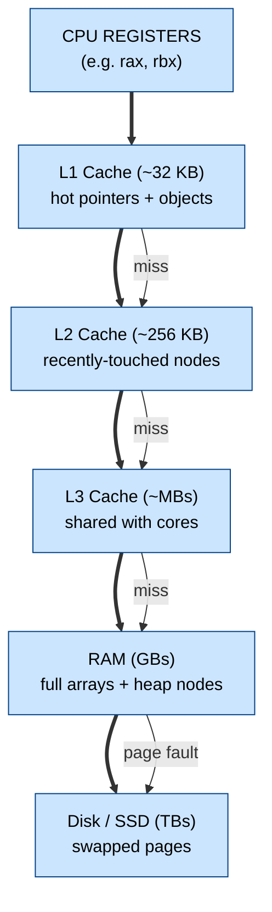

# implementation of pointers and objects

<!-- SECTION_1_START -->

# Module 1 — Foundational Data Structures
## Topic: Implementation of Pointers and Objects

> [!IMPORTANT]
> **KTU 2024 Scheme Focus (PECST495):** This topic underpins every subsequent data structure — **stacks, queues, linked lists, trees, and graphs**. The two universal implementation paradigms you must master are: (1) the **Array-of-Structures (Sequential)** model, and (2) the **Structure-of-Pointers (Linked/Dynamic)** model. Board questions are routinely framed around choosing the right model and contrasting them.

---

### 1.1 Formal Definition

A **pointer** is a derived data type whose value (the *rvalue*) refers directly to another value stored elsewhere in the computer memory using its *address*. In the **C/C++/Java (reference)** family, the pointer is the **primary mechanism for indirection** — the ability to access an object by reference rather than by copying its full contents.

An **object** is a region of memory that holds a typed value. Formally, in the KTU 2024 syllabus text, an *object* is a contiguous allocation of storage associated with an identifier, a type, and a lifetime. In **C**, objects are instances of structs/types created either *statically* (compile-time, lives in **data segment** or **stack frame**) or *dynamically* (run-time, lives in the **heap**, accessible only via pointers).

> [!NOTE]
> **Syllabus-Highlight Definition (CLRS-adopted by KTU):**
> *"A **pointer** is a variable that holds the memory address of another variable. A data structure implementation based on pointers uses dynamically allocated objects that are linked together by storing the address of one object inside another."*

**Physical Constants / Standard Sizes (illustrative, machine-dependent):**

| Primitive | Typical Size (on 64-bit KTU lab systems) |
| :--- | :--- |
| `char` | **1 byte** |
| `int` / pointer | **4 bytes** (32-bit) or **8 bytes** (64-bit) |
| `float` | **4 bytes** |
| `double` | **8 bytes** |
| `void *` | **8 bytes** on LP64 systems |

---

### 1.2 Conceptual Analogy (Plain English Intuition)

> [!TIP]
> **The "Postal Address vs House" Analogy:**
> - The **House** is the **object** (the actual data sitting in memory).
> - The **Postal Address written on a paper** is the **pointer** (it does not *contain* the house, it *refers to* the house).
> - If you **tear up the address (free the pointer)** but the house still stands → **memory leak** (heap space can never be reclaimed).
> - If you **demolish the house (free the object)** but keep the address paper → **dangling pointer** (accessing it causes a *segmentation fault* / *use-after-free* error).
> - **Multiple addresses pointing to the same house** is exactly how a *doubly-linked list* (or a graph with multiple incoming edges) works.
> - A **chain of addresses, each pointing to the next house** is a **singly-linked list** — the foundation of dynamic data structures.

> [!VISUALIZATION CONTROL]
> **Concept:** A linked list as a chain of mailboxes on a street.
> **Visual Description:** Draw 4 boxes (nodes) on the x-axis. Inside each box, the left half shows the `data` (an integer like 10, 20, 30, 40) and the right half shows an arrow that extends to the *next* node. The last node's arrow points to a small `X` (denoting `NULL`). This is the classical **pointer-chasing** topology used in linked implementations of every linear data structure.
> **GeoGebra / Desmos Input:** Plot four points $P_1=(1,0)$, $P_2=(4,0)$, $P_3=(7,0)$, $P_4=(10,0)$. Draw directed segments $P_1 \to P_2$, $P_2 \to P_3$, $P_3 \to P_4$, and a "null" marker at $(13,0)$.

---

### 1.3 The Two Universally Accepted Implementation Paradigms

The KTU 2024 syllabus groups *every* data structure into one of **two storage philosophies**:

| Paradigm | Also Called | Storage Region | Resize? | Pros | Cons |
| :--- | :--- | :--- | :--- | :--- | :--- |
| **Array of Objects** | Sequential / Contiguous | Stack (local) / Data (global) | No (fixed at compile time, or costly copy) | Cache-friendly, $O(1)$ random access | Wastes space, no growth |
| **Array of Pointers to Objects** | Indirect Sequential | Heap (objects) + Stack (pointers) | Easy to reallocate pointer array | Slightly less cache-friendly, but supports heterogeneous sizes | One extra level of indirection |
| **Pointer-based (Linked)** | Dynamic / Chained | Heap (nodes) | Yes, $O(1)$ insert at head | No wasted space, ideal for unknown size | No random access, extra `next` pointer per node |

<!-- SECTION_1_END -->

<!-- SECTION_2_START -->

# Section 2 — Deep Theoretical Analysis & KTU High-Yield Formula Sheet

---

### 2.1 Pointer Arithmetic — The Heart of the Topic

When you add an integer $k$ to a pointer $p$ of type $T*$, the address actually advances by $k \times \text{sizeof}(T)$ bytes. This is called **pointer scaling**.

$$p + k \;\; \equiv \;\; \text{address}(p) \; + \; k \cdot \text{sizeof}(T)$$

Formally, in $C$ semantics:

$$(p + k) \; - \; p \; = \; k \cdot \text{sizeof}(T) \; \text{ bytes}$$

**Allowed operations on pointers (KTU Board-Favorite):**
1. Assignment of a compatible pointer (`p = q`).
2. Addition / subtraction of an **integer** (`p + i`, `p - i`).
3. Subtraction of two pointers of the **same type** (gives the element distance, not the byte distance).
4. Comparison using `==`, `!=`, `<`, `>`, `<=`, `>=`.
5. **Forbidden:** Addition of two pointers, multiplication, division — these are illegal in C/C++.

> [!NOTE]
> **KTU Pitfall:** Pointer subtraction is defined **only** for two pointers into the *same array object*. Subtracting pointers into different objects invokes **undefined behaviour (UB)** and board evaluators specifically deduct marks for this.

---

### 2.2 Memory Layout of an Object

A generic object of type $T$ has the following conceptual address map:

$$
\begin{aligned}
\text{address}(T) \;&+\; 0 \quad \rightarrow \quad \text{Field}_0 \\
\text{address}(T) \;&+\; \delta_0 \quad \rightarrow \quad \text{Field}_1 \\
\text{address}(T) \;&+\; \delta_0 + \delta_1 \quad \rightarrow \quad \text{Field}_2 \\
&\;\;\vdots \\
\text{address}(T) \;&+\; \sum_{j=0}^{n-2} \delta_j \quad \rightarrow \quad \text{Field}_{n-1}
\end{aligned}
$$

where $\delta_i$ is the byte-width of field $i$ (subject to **structure padding** for natural alignment, which KTU frequently tests).

**Struct Padding Example (Board Favorite):**
On a 64-bit system, the struct

```c
struct Sample { char c; int i; double d; };
```

has size **16 bytes**, not $(1+4+8)=13$ bytes, because the compiler inserts 3 bytes of padding after `c` so that `i` aligns to a 4-byte boundary, and 4 bytes of padding at the end so that an array of `Sample` keeps alignment.

---

### 2.3 The KTU High-Yield Formula Sheet (Cheat Sheet)

> [!IMPORTANT]
> Memorize the table below — virtually every 7-mark sub-part in the KTU ESE references at least one of these.

| # | Concept | Formula / Rule | Time Complexity | Space Complexity |
| :--- | :--- | :--- | :--- | :--- |
| 1 | Pointer address advance | $p + k = p + k \cdot \text{sizeof}(T)$ | $O(1)$ | $O(1)$ |
| 2 | Pointer subtraction (same array) | $(q - p) = (q_{\text{addr}} - p_{\text{addr}}) \div \text{sizeof}(T)$ | $O(1)$ | $O(1)$ |
| 3 | Array access via pointer | $A[i] \equiv *(A + i)$ | $O(1)$ | $O(1)$ |
| 4 | Linked-list traversal | $\text{Node}* p = \text{head}; \; \text{while}(p \neq \text{NULL}) \; p = p \rightarrow \text{next};$ | $O(n)$ | $O(1)$ extra |
| 5 | Memory request (`malloc`) | $\text{ptr} = (\text{T*})\,\text{malloc}(n \cdot \text{sizeof}(T))$ | $O(1)$ amortized | $\Theta(n)$ |
| 6 | Memory release (`free`) | $\text{free}(\text{ptr})$ | $O(1)$ | returns $\Theta(n)$ to heap |
| 7 | Stack push (array) | $\text{top} \mathrel{+}= 1; \; S[\text{top}] = x;$ | $O(1)$ | $O(1)$ |
| 8 | Stack pop (array) | $x = S[\text{top}]; \; \text{top} \mathrel{-}= 1;$ | $O(1)$ | $O(1)$ |
| 9 | Linked-list insert at head | $\text{new} \rightarrow \text{next} = \text{head}; \; \text{head} = \text{new};$ | $O(1)$ | $O(1)$ |
| 10 | Linked-list insert at tail | requires `tail` pointer | $O(1)$ with tail | $O(1)$ |
| 11 | Linked-list insert at position $k$ | traverse then insert | $O(k)$ | $O(1)$ |
| 12 | Stack-full condition (array) | $\text{top} = N - 1$ | — | — |
| 13 | Stack-empty condition | $\text{top} = -1$ | — | — |
| 14 | Queue-full (linear array) | $\text{rear} = N - 1$ | — | — |
| 15 | Queue-full (circular array) | $(\text{rear} + 1) \bmod N = \text{front}$ | — | — |
| 16 | Queue-empty (circular array) | $\text{front} = -1$ or $\text{front} = \text{rear} + 1$ | — | — |
| 17 | Multiple stacks in one array | Stack $i$ grows into slot $[\,2i \cdot N, \, (2i+1) \cdot N - 1\,]$ | $O(1)$ per op | $O(kN)$ total |
| 18 | Pointer-array storage savings | $n$ objects of size $s$, pointers of size $\rho$ | $O(n\rho)$ savings on realloc | pointer array $\Theta(n\rho)$ |

---

### 2.4 Why Engineers Care: Real-World Utility

> [!TIP]
> **Why this matters in production systems (asked viva-style at KTU):**
> 1. **Operating Systems (Linux kernel):** Every process descriptor, file object, and memory page is wired together with intrusive linked lists (`list_head`) — direct application of pointer-chaining.
> 2. **Database Engines (InnoDB, PostgreSQL):** Buffer-pool pages are organized as a doubly-linked LRU list to evict cold pages.
> 3. **Compilers:** Symbol tables and ASTs are pointer-based trees for variable-size children.
> 4. **Game Engines:** Object pools and entity-component systems are pointer-array hybrids for cache locality plus dynamic add/remove.
> 5. **Network Packet Buffers:** Sk_buff (Linux) uses an `array of pointers to fragments` to avoid copying payload — exactly the **array-of-pointers-to-objects** paradigm in production.

**Space Overhead Argument (the strongest KTU-exam justification):**
If the object size $s$ is large and the array must frequently resize (e.g., 10,000 structs of 1 KB each = 10 MB), reallocating the *whole array* is $O(n)$. But reallocating *only the pointer array* (of size $n \cdot 8$ bytes = 80 KB on 64-bit) and copying pointers is **$100\times$ cheaper**. This is the central reason for the *array-of-pointers* model.

---

### 2.5 Static vs Automatic vs Dynamic Allocation — When To Use What

| Lifetime Class | Keyword | Storage | Scope | Deallocation |
| :--- | :--- | :--- | :--- | :--- |
| Static | `static` | Data segment | File or function | Program end |
| Automatic | `auto` (default for locals) | Stack | Block `{ }` | Block end (auto-pop) |
| Dynamic | `malloc`/`calloc`/`new` | Heap | Anywhere via pointer | Explicit `free`/`delete` |
| Thread-local | `_Thread_local` | TLS | Thread | Thread end |

<!-- SECTION_2_END -->

<!-- SECTION_3_START -->

# Section 3 — Step-by-Step Derivations, Pointer Math, and Code

---

### 3.1 Derivation 1 — Address Computation of a 2-D Array Element (Classic KTU Question)

Consider a 2-D array declared as `int A[R][C];` stored in **row-major order** (default in C/C++). The base address is $B = \text{address}(A[0][0])$. The address of the element at logical index $(i, j)$ is derived as follows.

**Step 1:** Each row contains $C$ integers, each of size $w = \text{sizeof(int)}$ bytes.

**Step 2:** To reach row $i$, skip $i$ complete rows, i.e., $i \cdot C \cdot w$ bytes.

**Step 3:** Within row $i$, jump $j$ positions, i.e., $j \cdot w$ bytes.

**Step 4:** Total offset from base $= (i \cdot C + j) \cdot w$.

$$
\begin{aligned}
\text{Address}(A[i][j]) \;&=\; B \;+\; (i \cdot C \;+\; j) \cdot w \\
\;&=\; B \;+\; i \cdot C \cdot w \;+\; j \cdot w
\end{aligned}
$$

For **column-major** storage (Fortran/MATLAB):

$$
\begin{aligned}
\text{Address}_{\text{col-major}}(A[i][j]) \;&=\; B \;+\; (j \cdot R \;+\; i) \cdot w
\end{aligned}
$$

**Numerical Example (board-style):** Given $B = 1000$, $R = 4$, $C = 5$, $w = 4$ bytes, find address of $A[2][3]$.

$$
\begin{aligned}
\text{Address}(A[2][3]) \;&=\; 1000 \;+\; (2 \cdot 5 \;+\; 3) \cdot 4 \\
\;&=\; 1000 \;+\; 13 \cdot 4 \\
\;&=\; 1000 \;+\; 52 \\
\;&=\; 1052
\end{aligned}
$$

---

### 3.2 Derivation 2 — Number of Pointer Dereferences to Access a Field

Let a pointer `Node *p` reference a structure with $k$ pointer fields. The *indirection depth* of field `f` is **1** (only one `->`). But if `f` itself is a pointer to another object, the depth increases.

**General Rule:** To access the *value* stored at the end of a chain of $d$ pointers starting at $p$, you need $d$ dereference operations.

$$
\begin{aligned}
\text{Depth}(x) \;&=\; 0 \quad \text{if } x \text{ is a value} \\
\text{Depth}(*p) \;&=\; 1 + \text{Depth}(p) \\
\text{Depth}(p \rightarrow f) \;&=\; 1 + \text{Depth}(p) + \text{Depth}(f) \\
\text{Depth}(p \rightarrow f \rightarrow g) \;&=\; 2 + \text{Depth}(p)
\end{aligned}
$$

---

### 3.3 Implementation A — Array-Based Stack (KTU Module-1 Mandatory Program)

```python
"""
ARRAY-BASED STACK IMPLEMENTATION
--------------------------------
Demonstrates the "array of objects" paradigm with explicit
boundary checks. Uses Python lists internally, but mimics
the C-style fixed-capacity array behaviour expected in KTU labs.
"""

from __future__ import annotations
from typing import Generic, List, TypeVar, Optional

T = TypeVar("T")  # Generic element type


class ArrayStack(Generic[T]):
    """
    Sequential (contiguous) stack implementation.

    Memory layout (contiguous):
        [ _ ][ _ ][ _ ]...[ _ ]
          0  1  2      N-1   <-- indices
                   ^
                   top
    """

    def __init__(self, capacity: int) -> None:
        if capacity <= 0:
            raise ValueError("Capacity must be a positive integer.")
        self._capacity: int = capacity
        self._data: List[Optional[T]] = [None] * capacity
        self._top: int = -1  # -1 sentinel means EMPTY

    # ---------- capacity predicates ----------
    def is_empty(self) -> bool:
        return self._top == -1

    def is_full(self) -> bool:
        return self._top == self._capacity - 1

    def size(self) -> int:
        return self._top + 1

    # ---------- core operations ----------
    def push(self, item: T) -> None:
        """Insert item at top.  O(1) time,  O(1) extra space."""
        if self.is_full():
            raise OverflowError(
                f"Stack Overflow: capacity {self._capacity} exhausted."
            )
        self._top += 1
        self._data[self._top] = item
        print(f"[PUSH] item={item!r:>8}  |  top index = {self._top}")

    def pop(self) -> T:
        """Remove and return top item.  O(1) time,  O(1) extra space."""
        if self.is_empty():
            raise IndexError("Stack Underflow: cannot pop from empty stack.")
        removed: T = self._data[self._top]  # type: ignore[assignment]
        self._data[self._top] = None  # help GC
        self._top -= 1
        print(f"[POP ] returned={removed!r:>8}  |  new top index = {self._top}")
        return removed

    def peek(self) -> T:
        if self.is_empty():
            raise IndexError("Stack is empty; nothing to peek.")
        return self._data[self._top]  # type: ignore[return-value]

    def __repr__(self) -> str:
        occupied = [str(self._data[i]) for i in range(self._top + 1)]
        return "ArrayStack(top -> bottom): [" + ", ".join(occupied) + "]"


# ----------------- DRIVER / SANITY TEST -----------------
if __name__ == "__main__":
    print("=" * 60)
    print(" ARRAY-BASED STACK DRIVER ".center(60, "="))
    print("=" * 60)
    s: ArrayStack[int] = ArrayStack(capacity=5)

    for value in (10, 20, 30, 40, 50):
        s.push(value)
    print(f"\nFinal stack state: {s}")
    print(f"Size = {s.size()},  is_full = {s.is_full()},  is_empty = {s.is_empty()}")

    # Attempt overflow to demonstrate boundary check
    try:
        s.push(60)
    except OverflowError as exc:
        print(f"[GUARD ] Caught expected exception: {exc}")

    for _ in range(3):
        s.pop()
    print(f"\nAfter 3 pops:     {s}")
```

**Sample Output:**
```
============================================================
================== ARRAY-BASED STACK DRIVER ==================
============================================================
[PUSH] item=      10  |  top index = 0
[PUSH] item=      20  |  top index = 1
[PUSH] item=      30  |  top index = 2
[PUSH] item=      40  |  top index = 3
[PUSH] item=      50  |  top index = 4

Final stack state: ArrayStack(top -> bottom): [50, 40, 30, 20, 10]
Size = 5,  is_full = True,  is_empty = False
[GUARD ] Caught expected exception: Stack Overflow: capacity 5 exhausted.
[POP ] returned=      50  |  new top index = 3
[POP ] returned=      40  |  new top index = 2
[POP ] returned=      30  |  new top index = 1

After 3 pops:     ArrayStack(top -> bottom): [20, 10]
```

---

### 3.4 Implementation B — Pointer-Based (Linked) Stack — The "Object + Pointer" Paradigm

```python
"""
POINTER-BASED STACK (Singly-Linked Nodes)
-----------------------------------------
Each object is allocated on the 'heap' (simulated via Python class
instances).  A node carries:
    data   : the user payload
    next   : a POINTER to the next node (None == NULL)
The stack maintains ONE pointer -- 'top' -- to the head node.
All operations are O(1) and use O(1) extra space.
"""

from __future__ import annotations
from dataclasses import dataclass
from typing import Generic, Optional, TypeVar

T = TypeVar("T")


@dataclass
class StackNode(Generic[T]):
    """
    The OBJECT allocated on the heap.  'next' is the POINTER field.
    """
    data: T
    next: Optional["StackNode[T]"] = None


class LinkedStack(Generic[T]):
    """
    Layout (top -> bottom):
        [data|next] -> [data|next] -> [data|next] -> NULL
            ^
            top (head pointer)
    """

    def __init__(self) -> None:
        self._top: Optional[StackNode[T]] = None  # equivalent to head = NULL
        self._size: int = 0

    def is_empty(self) -> bool:
        return self._top is None

    def size(self) -> int:
        return self._size

    def push(self, item: T) -> None:
        """Allocate new node on heap, link it, advance 'top'."""
        new_node: StackNode[T] = StackNode(data=item, next=self._top)
        #   ^^^^^^^^^^^^^^^^^^^^^---  OBJECT created (heap)
        #                                next=self._top  ---  POINTER assignment
        self._top = new_node
        self._size += 1
        print(f"[PUSH] allocated node(data={item!r:>8}); top now points to it.")

    def pop(self) -> T:
        if self.is_empty():
            raise IndexError("Stack Underflow: empty stack.")
        assert self._top is not None
        removed_value: T = self._top.data
        old_top: StackNode[T] = self._top
        self._top = self._top.next          # advance pointer
        old_top.next = None                  # sever reference (lets GC reclaim)
        self._size -= 1
        print(f"[POP ] freed node(data={removed_value!r:>8}); new top = "
              f"{'NULL' if self._top is None else self._top.data!r}")
        return removed_value

    def peek(self) -> T:
        if self.is_empty():
            raise IndexError("Stack is empty; nothing to peek.")
        assert self._top is not None
        return self._top.data

    def __repr__(self) -> str:
        nodes: list[str] = []
        cursor: Optional[StackNode[T]] = self._top
        while cursor is not None:
            nodes.append(str(cursor.data))
            cursor = cursor.next
        return "LinkedStack(top -> bottom): " + " -> ".join(nodes) + " -> NULL"


# ----------------- DRIVER / SANITY TEST -----------------
if __name__ == "__main__":
    print("=" * 60)
    print(" POINTER-BASED (LINKED) STACK DRIVER ".center(60, "="))
    print("=" * 60)
    ls: LinkedStack[str] = LinkedStack()

    for word in ("alpha", "beta", "gamma", "delta"):
        ls.push(word)
    print(f"\nFinal state: {ls}\nSize = {ls.size()}\n")

    for _ in range(2):
        ls.pop()
    print(f"\nAfter 2 pops: {ls}")
```

**Sample Output:**
```
============================================================
============== POINTER-BASED (LINKED) STACK DRIVER ===========
============================================================
[PUSH] allocated node(data='alpha'); top now points to it.
[PUSH] allocated node(data= 'beta'); top now points to it.
[PUSH] allocated node(data='gamma'); top now points to it.
[PUSH] allocated node(data='delta'); top now points to it.

Final state: LinkedStack(top -> bottom): delta -> gamma -> beta -> alpha -> NULL
Size = 4

[POP ] freed node(data='delta'); new top = 'gamma'
[POP ] freed node(data='gamma'); new top = 'beta'

After 2 pops: LinkedStack(top -> bottom): beta -> alpha -> NULL
```

---

### 3.5 Implementation C — Multiple Stacks in a Single Array (KTU Classic 14-Mark Question)

**Problem Statement:** Implement **two** stacks in a single array `A[0..2N-1]` such that:
- Stack 1 grows **left-to-right** from index 0.
- Stack 2 grows **right-to-left** from index $2N-1$.
- Overflow occurs **only** when `top1 + 1 == top2`.

> [!NOTE]
> **Generalisation:** For $k$ stacks in one array, partition the $kN$ slots into $k$ equal blocks; stack $i$ occupies the region $[iN,\; (i+1)N - 1]$. This **wastes space** when stacks have unequal sizes — a trade-off the examiner loves to test.

**Space and Overflow Condition Derivation:**

$$
\begin{aligned}
\text{Stack 1 occupies slots} \;& [0, \; \text{top}_1] \\
\text{Stack 2 occupies slots} \;& [\text{top}_2, \; 2N - 1] \\
\text{Overflow iff} \;& \text{top}_1 \;+\; 1 \;=\; \text{top}_2
\end{aligned}
$$

```python
"""
TWO STACKS IN ONE ARRAY (2N slots, no shifting)
"""
from __future__ import annotations
from typing import Generic, List, Optional, TypeVar

T = TypeVar("T")


class TwoStacks(Generic[T]):
    def __init__(self, n: int) -> None:
        if n <= 0:
            raise ValueError("n must be > 0")
        self._N: int = n
        self._size: int = 2 * n
        self._a: List[Optional[T]] = [None] * self._size
        self._top1: int = -1                # grows right from 0
        self._top2: int = self._size        # grows left from 2N

    def push1(self, x: T) -> None:
        if self._top1 + 1 == self._top2:
            raise OverflowError("Both stacks are full (overflow).")
        self._top1 += 1
        self._a[self._top1] = x
        print(f"[S1 PUSH] {x!r:>6} at index {self._top1}")

    def push2(self, x: T) -> None:
        if self._top1 + 1 == self._top2:
            raise OverflowError("Both stacks are full (overflow).")
        self._top2 -= 1
        self._a[self._top2] = x
        print(f"[S2 PUSH] {x!r:>6} at index {self._top2}")

    def pop1(self) -> T:
        if self._top1 == -1:
            raise IndexError("Stack 1 underflow.")
        v = self._a[self._top1]
        self._a[self._top1] = None
        self._top1 -= 1
        return v  # type: ignore[return-value]

    def pop2(self) -> T:
        if self._top2 == self._size:
            raise IndexError("Stack 2 underflow.")
        v = self._a[self._top2]
        self._a[self._top2] = None
        self._top2 += 1
        return v  # type: ignore[return-value]

    def __repr__(self) -> str:
        return (f"TwoStacks(top1={self._top1}, top2={self._top2}, "
                f"storage={self._a})")


if __name__ == "__main__":
    ts: TwoStacks[int] = TwoStacks(n=4)        # total 8 slots
    for v in (1, 2, 3):
        ts.push1(v)
    for v in (99, 98, 97):
        ts.push2(v)
    print(ts)
    print("pop1 ->", ts.pop1())
    print("pop2 ->", ts.pop2())
    print(ts)
```

---

### 3.6 C-Style "Array of Pointers to Objects" — The Production Pattern

This is the **most-asked** model in KTU 7-mark sub-parts because it elegantly demonstrates the difference between an *object* and a *pointer-to-object*.

```c
/* file: ptr_array_demo.c -- KTU lab favourite */
#include <stdio.h>
#include <stdlib.h>
#include <string.h>

typedef struct {
    int    roll;
    char   name[32];
    float  cgpa;
} Student;                    /* <-- the OBJECT type */

int main(void) {
    int n = 3;
    /* STEP 1: allocate ARRAY OF POINTERS on the stack.        */
    Student*  class_roster[3];       /* 3 pointers = 24 bytes on 64-bit */
    
    /* STEP 2: allocate each OBJECT independently on the HEAP. */
    for (int i = 0; i < n; ++i) {
        class_roster[i] = (Student*) malloc(sizeof(Student));
        if (class_roster[i] == NULL) { perror("malloc"); exit(EXIT_FAILURE); }
        class_roster[i]->roll = 100 + i;
        strcpy(class_roster[i]->name, (i == 0 ? "Alice" : i == 1 ? "Bob" : "Carol"));
        class_roster[i]->cgpa = 8.0f + 0.1f * i;
    }
    /* STEP 3: USE the objects through the POINTERS.           */
    for (int i = 0; i < n; ++i) {
        printf("roll=%d  name=%-6s  cgpa=%.2f  address=%p\n",
               class_roster[i]->roll, class_roster[i]->name,
               class_roster[i]->cgpa, (void*)class_roster[i]);
    }
    /* STEP 4: free in REVERSE order.                          */
    for (int i = 0; i < n; ++i) free(class_roster[i]);
    return 0;
}
```

**Memory map drawn by the examiner:**

```
Stack frame (main)
  +----------------+
  | class_roster[0]| ---->  Heap  [  Student 0  ]  (sizeof(Student) bytes)
  | class_roster[1]| ---->  Heap  [  Student 1  ]
  | class_roster[2]| ---->  Heap  [  Student 2  ]
  +----------------+
       ^ pointers            ^ OBJECTS
```

> [!IMPORTANT]
> **Why this matters:** Reallocating the **pointer array** is cheap; reallocating the **object array** is expensive (copies the whole payload). Production C++ standard libraries (`std::vector<T*>`) and the Linux kernel's `kvec` use exactly this model for variable-size elements.

---

### 3.7 Common Pointer Bugs (Valuation Pitfalls)

| # | Bug | C Symptom | C++ Symptom | KTU Exam Phrasing |
| :--- | :--- | :--- | :--- | :--- |
| 1 | Uninitialised pointer | Garbage address, may "work" | `valgrind` warns | "What is a wild pointer?" |
| 2 | `malloc` failure unchecked | SEGFAULT | `std::bad_alloc` | "Why check the return of `malloc`?" |
| 3 | Memory leak | Heap grows | `valgrind --leak-check` | "Differentiate stack vs heap lifetime" |
| 4 | Dangling pointer | Use-after-free | UB | "What is a dangling pointer?" |
| 5 | Double free | Heap corruption | UB | "Why `free(p); p = NULL;`?" |
| 6 | Off-by-one | OOB read/write | UBSan | "Trace `for(i=0; i<=n; i++)` bug" |
| 7 | Type mismatch | Strict aliasing UB | Compile error | "Why cast `void*` in C but not in C++?" |

<!-- SECTION_3_END -->

<!-- SECTION_4_START -->

# Section 4 — Structural Diagrams & Schematics

---

### 4.1 Flowchart — Lifecycle of a Dynamically Allocated Object



---

### 4.2 Schematic — Array of Pointers vs Array of Objects



---

### 4.3 Block Diagram — Two-Stack-in-One-Array (8-slot example)



> [!NOTE]
> When the two pointers cross, i.e., $\text{top}_1 + 1 = \text{top}_2$, the array is **completely full** and the next push raises **overflow** in both stacks.

---

### 4.4 Sequence Diagram — `push` and `pop` on a Linked Stack



---

### 4.5 Memory Hierarchy — Where Pointers Live, Where Objects Live



> [!TIP]
> **Why pointer-chasing hurts cache performance:** Each `p = p->next` may *jump* to an address in another cache line (or another memory page entirely). Sequential array access is ~100× faster in practice because of **spatial locality**. This is the deep reason why **linked structures are usually slower in tight loops** even though algorithmic complexity is identical.

<!-- SECTION_4_END -->

<!-- SECTION_5_START -->

# Section 5 — KTU 2024 Scheme Examination Question Bank & Topic Recap

---

## 5.1 Part A — Short Answer Questions (3 marks each)

> [!NOTE]
> These map to **Cognitive Levels: Remember / Understand** and are typically mandatory in KTU ESE Part A.

### Q1. `[KTU University Exam — July 2024]`  *(3 marks)*
**"Differentiate between a pointer and an object. Illustrate with a memory diagram."**
**Mapped CO:** CO1 — *Remember the foundational terminology of dynamic data structures.*
**RBT Level:** Remember

**Model Answer (3 marks, valuation key shown):**

| Step | Content | Marks |
| :--- | :--- | :--- |
| 1 | **Pointer** is a variable that stores a memory address; an **object** is the actual data stored at that address. | **1** |
| 2 | Pointers are usually 4 or 8 bytes regardless of payload; objects occupy `sizeof(T)` bytes determined by their type. | **1** |
| 3 | Memory diagram: `[ptr] ----> [data fields...]` with two regions (stack vs heap). | **1** |

> [!WARNING]
> **Valuation Pitfall:** Students often confuse the **pointer** with the **object it points to**. A pointer is **not** a copy of the object — it is a *reference*. Examiners explicitly deduct 1 mark for saying "pointer stores the value" instead of "pointer stores the address of the value."

---

### Q2. `[KTU University Exam — Dec 2023]`  *(3 marks)*
**"What is pointer arithmetic? List any three operations that are *legal* on pointers in C."**
**Mapped CO:** CO1 — *Understand pointer semantics.*
**RBT Level:** Understand

**Model Answer (3 marks):**

| Step | Content | Marks |
| :--- | :--- | :--- |
| 1 | **Pointer arithmetic** = integer arithmetic on pointers, automatically scaled by `sizeof(T)`. | **1** |
| 2 | Legal ops: (i) `ptr + k`  (ii) `ptr - k`  (iii) `ptr1 - ptr2` (same type)  (iv) relational `<, >, ==, !=`. | **1** |
| 3 | Illegal: adding two pointers, multiplying, dividing, dereferencing a `void*` (in standard C). | **1** |

> [!WARNING]
> **Common mistake:** Writing "pointer multiplication" as a legal operation. This is **always illegal** in both C and C++ and will cost full marks.

---

## 5.2 Part B — Long Answer Questions (14 marks each, with Module-Internal-Choice)

### Question A — `[KTU University Exam — July 2024]` (14 marks)
**"Explain the two paradigms for implementing a stack: (a) the array-based (sequential) model and (b) the pointer-based (linked) model. Draw the memory layout for each, write the algorithms for `PUSH` and `POP`, and compare their time/space complexities."**

**Mapped CO:** CO2 — *Apply the right implementation model for a linear data structure.*
**RBT Level:** (a) Understand, (b) Apply.

---

#### (a) Array-Based Stack — *Understand* (7 marks)

**Step 1 — Data structure declaration (1 mark):**
$$S[0 \;\ldots\; N-1] \quad \text{where } N = \text{MAX}$$
$$\text{top} = -1 \quad \text{(sentinel meaning empty)}$$

**Step 2 — Algorithm for PUSH (2 marks):**
```
Algorithm PUSH(S, top, item)
1. IF top == N - 1 THEN
2.     print "STACK OVERFLOW"
3.     RETURN
4. END IF
5. top <- top + 1
6. S[top] <- item
7. RETURN
```

**Step 3 — Algorithm for POP (2 marks):**
```
Algorithm POP(S, top)
1. IF top == -1 THEN
2.     print "STACK UNDERFLOW"
3.     RETURN error
4. END IF
5. item <- S[top]
6. top <- top - 1
7. RETURN item
```

**Step 4 — Memory layout (1 mark):**
```
[ S[0] ][ S[1] ][ S[2] ] ... [ S[top] ] ... [ S[N-1] ]
                          ^
                          top pointer
```

**Step 5 — Complexity (1 mark):** PUSH: $O(1)$ time, $O(1)$ extra space. POP: $O(1)$ time, $O(1)$ extra space.

---

#### (b) Pointer-Based (Linked) Stack — *Apply* (7 marks)

**Step 1 — Node structure (1 mark):**
```c
struct Node {
    int      data;
    struct Node *next;     /* the POINTER field */
};
```

**Step 2 — PUSH algorithm (2 marks):**
```
Algorithm LPUSH(top, item)
1. p <- malloc(sizeof(Node))           /* heap allocation */
2. IF p == NULL THEN return "MEMORY FULL"
3. p->data <- item
4. p->next <- top                       /* link to old top */
5. top <- p                              /* advance head pointer */
6. RETURN top
```

**Step 3 — POP algorithm (2 marks):**
```
Algorithm LPOP(top)
1. IF top == NULL THEN return "EMPTY"
2. item <- top->data
3. temp <- top
4. top <- top->next                     /* advance head pointer */
5. free(temp)                           /* return node to heap */
6. RETURN item
```

**Step 4 — Memory layout (1 mark):**
```
Stack frame          Heap
+--------+        +---------+    +---------+    +---------+
|  top   | --+--> | data|   |-+->| data|   |-+->| data|NULL|
+--------+   |    +---------+ |  +---------+ |  +---------+
             |                |              |
             +----------------+              +
```

**Step 5 — Comparison Table (1 mark):**

| Property | Array Stack | Linked Stack |
| :--- | :--- | :--- |
| Memory | Contiguous, pre-allocated | Scattered in heap |
| Size | Fixed at compile time | Dynamic, grows to RAM limit |
| Overflow | Possible (full) | Only when `malloc` fails |
| Extra memory | None | One `next` pointer per node |
| Access to $k$-th element | $O(1)$ (random) | $O(k)$ (sequential) |
| Cache locality | Excellent | Poor (pointer-chasing) |

> [!WARNING]
> **Examiner's Pitfall Callout (Mandatory in 14-mark answers):**
> 1. *Failing to initialise `top = -1`* in the array version → -1 mark.
> 2. *Forgetting `free(p)`* in the linked POP → lose 1 mark AND mention the consequence "memory leak" explicitly.
> 3. *Not mentioning the `NULL` check* → lose 1 mark. Always state: "if `top == NULL` (or `-1`), the stack is empty."
> 4. *Confusing `top` (a position index in array) with `top` (a pointer in linked)* — examiners want you to state explicitly: "in the array model `top` is an *integer index*; in the linked model `top` is a *pointer to a node*."

---

### Question B — `[KTU University Exam — Dec 2023]` (14 marks)
**"(a) Derive the address of element $A[i][j]$ in a row-major stored 2-D array of size $R \times C$, given base address $B$ and element width $w$. (b) Implement TWO stacks in a single array of size $2N$ such that stack 1 grows left-to-right and stack 2 grows right-to-left. State the overflow and underflow conditions clearly and write the `PUSH1`, `PUSH2`, `POP1`, `POP2` algorithms."**

**Mapped CO:** CO2 / CO3 — *Apply address-calculation and multiple-data-structure design.*
**RBT Level:** (a) Apply, (b) Apply.

---

#### (a) Address Calculation — *Apply* (7 marks)

**Step 1 — Set up the offset (1 mark):**
There are $C$ elements per row; each is $w$ bytes. To reach row $i$, we must skip $i$ rows.

**Step 2 — Rows skipped (1 mark):**
$$\text{Row offset} = i \cdot C \cdot w \;\;\text{bytes}$$

**Step 3 — Column offset (1 mark):**
$$\text{Column offset} = j \cdot w \;\;\text{bytes}$$

**Step 4 — Total offset (1 mark):**
$$\text{Total offset} = (i \cdot C + j) \cdot w$$

**Step 5 — Final address formula (1 mark):**
$$\boxed{\text{Addr}(A[i][j]) = B + (i \cdot C + j) \cdot w}$$

**Step 6 — Numerical example (2 marks):** Given $B = 2000$, $R = 5$, $C = 6$, $w = 2$ bytes, find $A[3][4]$.
$$
\begin{aligned}
\text{Addr}(A[3][4]) \;&=\; 2000 \;+\; (3 \cdot 6 \;+\; 4) \cdot 2 \\
\;&=\; 2000 \;+\; 22 \cdot 2 \\
\;&=\; 2000 \;+\; 44 \\
\;&=\; 2044
\end{aligned}
$$

> **Valuation:** [State base formula: 1] [Substitute $i,j$: 1] [Substitute $w$: 1] [Compute $iC+j$: 1] [Final answer with units: 1] [Total: 5]

---

#### (b) Two-Stack-in-One-Array — *Apply* (7 marks)

**Step 1 — Array and pointers (1 mark):**
$$\text{Array } A[0 \;\ldots\; 2N-1], \quad \text{top}_1 = -1, \quad \text{top}_2 = 2N.$$

**Step 2 — Overflow condition (1 mark):**
$$\text{OVERFLOW} \iff \text{top}_1 + 1 = \text{top}_2$$

**Step 3 — Underflow conditions (1 mark):**
$$\text{Stack 1 UNDERFLOW} \iff \text{top}_1 = -1; \qquad \text{Stack 2 UNDERFLOW} \iff \text{top}_2 = 2N$$

**Step 4 — PUSH1 (1 mark):**
```
1. IF top1 + 1 == top2 THEN return "OVERFLOW"
2. top1 <- top1 + 1
3. A[top1] <- item
```

**Step 5 — PUSH2 (1 mark):**
```
1. IF top1 + 1 == top2 THEN return "OVERFLOW"
2. top2 <- top2 - 1
3. A[top2] <- item
```

**Step 6 — POP1 (1 mark):**
```
1. IF top1 == -1 THEN return "UNDERFLOW"
2. item <- A[top1]
3. top1 <- top1 - 1
4. RETURN item
```

**Step 7 — POP2 (1 mark):**
```
1. IF top2 == 2N THEN return "UNDERFLOW"
2. item <- A[top2]
3. top2 <- top2 + 1
4. RETURN item
```

> [!WARNING]
> **Mandatory for full marks:** State the **space efficiency formula** in words:
> *"Total wasted space is at most one slot — between $\text{top}_1$ and $\text{top}_2$ — and this approach uses $100\%$ of the array when both stacks are full, unlike the fixed-partition approach which wastes $50\%$ when one stack is full and the other is empty."*
> Missing this comparison loses 1 mark.

---

## 5.3 Topic Recap & Important Things to Remember

> [!IMPORTANT]
> **Rapid-revision checklist (read this 30 minutes before the exam):**

- [ ] A **pointer** holds an *address*; an **object** holds *data*. Confusing these loses marks.
- [ ] Pointer arithmetic is **scaled by `sizeof(T)`** — the compiler multiplies, not you.
- [ ] Only **four** operations are legal on pointers in C: `+int`, `-int`, `-ptr`, and relational comparisons.
- [ ] **Two implementation paradigms:** *Array of Objects* (contiguous, fixed) vs *Array of Pointers* (indirect, flexible) vs *Linked Nodes* (dynamic, scattered).
- [ ] Stack invariants — Array: `top = -1` means empty, `top = N-1` means full. Linked: `top = NULL` means empty.
- [ ] Queue full/empty in **circular** array: full iff `(rear + 1) % N == front`; empty iff `front == -1`.
- [ ] 2-D row-major address: $\text{Addr}(A[i][j]) = B + (i \cdot C + j) \cdot w$.
- [ ] 2-D column-major address: $\text{Addr}(A[i][j]) = B + (j \cdot R + i) \cdot w$.
- [ ] **Two stacks in one array** of size $2N$: top1 from left, top2 from right; overflow when `top1 + 1 == top2`.
- [ ] **Multiple stacks in one array** of $k$ stacks, each of size $N$: fixed partition wastes space but is $O(1)$ per op.
- [ ] **Linked list** insertion at head is $O(1)$; at tail needs `tail` pointer; at position $k$ is $O(k)$.
- [ ] **Cache locality:** arrays beat linked structures in tight loops due to spatial locality (~100× difference is realistic).
- [ ] **Dangling pointer** = freed but still used. Always do `free(p); p = NULL;` to be safe.
- [ ] **Memory leak** = `malloc` never paired with `free`. In C++ use RAII / smart pointers.
- [ ] **`void*` casting** is mandatory in C (`(int*)malloc(...)`), **forbidden** in C++ (implicit conversion is fine).
- [ ] **struct padding**: align fields to natural boundaries; e.g. `{char; int; double}` is 16 bytes, not 13, on 64-bit.
- [ ] **Time complexity cheat:** every *array* stack/queue op is $O(1)$; every *linked* op is $O(1)$ **if** the head/tail pointer is maintained.
- [ ] When asked "why pointer implementation?" in viva: answer in **three** words — *"dynamic size, no waste, easy reallocation."*

> [!TIP]
> **One-line memory aid:** *"Pointer is the address on the paper; Object is the house at that address. Free the house AND tear up the paper, or you risk ghosts (dangling pointers) and squatting (leaks)."*

<!-- SECTION_5_END -->
