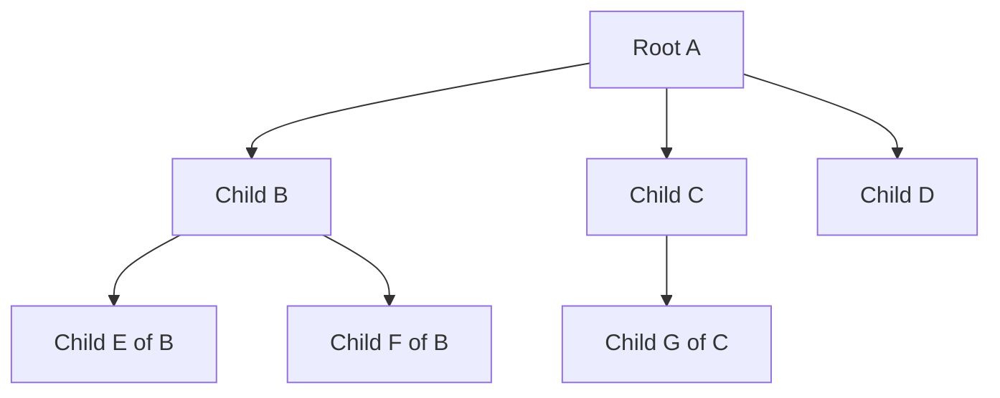
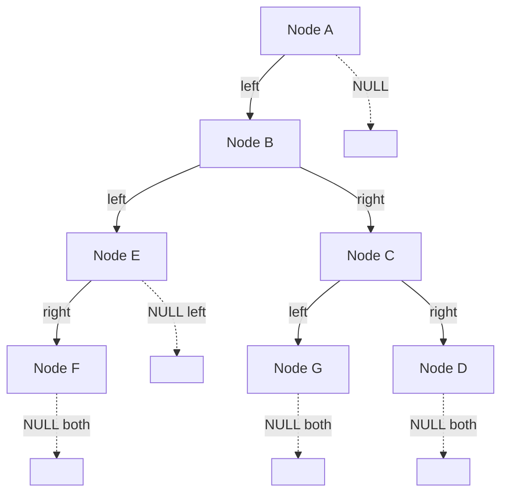
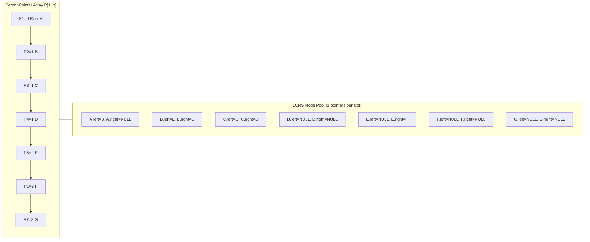

# Representing rooted trees

<!-- SECTION_1_START -->
# Representing Rooted Trees

## 1.1 Formal Academic Definition

> [!NOTE]
> **KTU 2024 Syllabus Definition**
> A **rooted tree** $T = (V, E)$ is an ordered or unordered tree in which exactly one vertex of the connected acyclic graph is designated as the **root**. Every other vertex $v \in V$ is reachable from the root through a **unique simple path**. The root serves as the implicit global anchor, giving the otherwise un-oriented tree a parent–child orientation.

**Mathematical Formulation (Recursive):**
A rooted tree is either an **empty tree** $\emptyset$, or a structure consisting of a **root node** $r$ holding a value, together with a finite (possibly empty) **ordered sequence** of disjoint rooted trees $T_1, T_2, \dots, T_k$ that are the subtrees of $r$. This recursive definition is the foundation behind the memory-efficient storage schemes used in compiler symbol tables, file systems, and XML/JSON DOM parsers.

## 1.2 Foundational Terminology (KTU High-Yield Glossary)

| Term | Mathematical Notation | Plain-English Meaning |
|------|----------------------|----------------------|
| **Root** | $r$ | The unique top-most node with no parent |
| **Parent of $v$** | $parent(v)$ | The unique node on the path from $r$ to $v$ that is adjacent to $v$ |
| **Child of $u$** | $child(u)$ | A node $v$ such that $parent(v) = u$ |
| **Siblings** | — | Nodes sharing the same parent |
| **Leaf (External Node)** | degree $= 0$ | A node with no children |
| **Internal Node** | degree $\geq 1$ | A node with at least one child |
| **Depth of $v$** | $depth(v)$ | Number of edges on the path $r \to v$ |
| **Height of $v$** | $height(v)$ | Length of the longest downward path from $v$ to a leaf |
| **Height of tree** | $height(T)$ | $height(r)$ |
| **Degree of $v$** | $deg(v)$ | Number of children of $v$ |
| **Ancestor / Descendant** | $u \prec v$ | $u$ lies on the path $r \to v$ |
| **Subtree rooted at $v$** | $T_v$ | The tree induced by $v$ and all its descendants |

> [!IMPORTANT]
> **KTU Board Exam Convention:** Depth of the root is always **0** (some textbooks use 1 — verify with the paper setter). Heights of leaves are always **0**.

## 1.3 Real-World Conceptual Analogy

> [!TIP]
> **Think of a rooted tree as a Corporate Organisation Chart.**
> The **CEO** is the root. VPs report to the CEO (they are children). VPs at the same level are **siblings**. The **deepest employee** with no reports is a **leaf**. The **"span of control"** of the CEO is the degree of the root. A Vice President's **"depth in the company"** is the depth of that node.
>
> Other perfect analogies:
> * **File system on Linux/Windows** → `/` is root, folders are internal nodes, files are leaves.
> * **HTML / XML DOM tree** → `<html>` is root, nested tags are descendants.
> * **Tournament bracket** → winner is root, players are leaves, matches are internal nodes.

## 1.4 Why Representation Matters

A rooted tree with $n$ nodes can have a **variable degree** (a node can have any number of children). However, our RAM memory is fundamentally a **linear sequence of fixed-size cells**. The central engineering challenge is:

> *"How do we map a sparse, variably-shaped, hierarchical structure onto linear memory while preserving O(1) parent/child access?"*

This is precisely the problem we solve with the three classical representations discussed next.

> [!VISUALIZATION CONTROL]
> **Concept:** Tree height vs. depth visualisation on a 7-node example.
> **Desmos Input Equations:**
> * Plot a single point for the **root** at $(0, 3)$.
> * Plot three sibling points at $y = 2$: $(-2,2), (0,2), (2,2)$.
> * Plot two points at $y = 1$: $(-2.5,1), (-1.5,1)$ under the left sibling.
> * Plot one point at $y = 1$: $(0,1)$ under the middle sibling.
> * Connect with straight line segments using `polygon` or `segment` lists.
> **Visual Description:** The y-coordinate encodes the depth level. The leftmost branch is the longest path (length 2), so the tree's height = 2. Notice the **root's degree is 3** (variable!), proving we need a representation that handles non-binary branching.
<!-- SECTION_1_END -->

<!-- SECTION_2_START -->
# Deep Theoretical Analysis & KTU High-Yield Formula Sheet

## 2.1 Classification of Rooted-Tree Representations

The KTU 2024 syllabus (Module 1) recognises three canonical schemes. The **left-child right-sibling (LCRS)** representation is the most frequently tested.

### 2.1.1 Representation 1 — Parent-Pointer Array

Each node is stored as a struct/object, and a separate global array $P[1 \dots n]$ stores the index of the parent of every node. The root stores $0$ (or $-1$ or `None`).

### 2.1.2 Representation 2 — Linked List of Children (Dynamic Degree)

Each node stores (i) its data, and (ii) a **pointer to a linked list of its children**. This is essentially an **adjacency-list representation** of a tree graph.

### 2.1.3 Representation 3 — Left-Child Right-Sibling (Binary Tree Mapping)

This is the **cornerstone of Module 1**. We observe:

> A *general* tree of arbitrary degree can be **encoded** as a binary tree by letting:
> * The **left pointer** of a node $u$ point to $u$'s **leftmost child**.
> * The **right pointer** of $u$ point to $u$'s **next (right) sibling**.

This mapping is bijective: every general tree corresponds to **exactly one** binary tree and vice-versa. This trick was introduced by **Edward H. Sussenguth Jr. (1963)** and is heavily used in compiler construction (e.g., representing an Abstract Syntax Tree with binary nodes).

## 2.2 KTU Formula Sheet / Cheat Sheet

> [!IMPORTANT]
> The following identities are the **most-tested** numerical results in KTU University Exams for this topic. Memorise these.

| # | Property | Formula | Notes |
|---|----------|---------|-------|
| 1 | Number of edges in a tree with $n$ nodes | $E = n - 1$ | Universal for any acyclic connected graph |
| 2 | Sum of degrees of all nodes | $\sum_{v \in V} deg(v) = n - 1$ | Double-counting of edges |
| 3 | Number of leaf nodes in a $k$-ary tree with $n$ internal nodes | $L = (k - 1) \cdot n + 1$ | Only valid for **full** $k$-ary tree |
| 4 | **NULL pointers in LCRS binary tree with $n$ nodes** | $N_{null} = n + 1$ | Each node has 2 ptrs, $n-1$ are used |
| 5 | Pointer fields in LCRS representation | $2n$ | Two pointers per node |
| 6 | Used pointer fields in LCRS representation | $n - 1$ | One per non-root node, pointing to it |
| 7 | **Time to find parent in LCRS** | $O(depth)$ | No explicit parent pointer |
| 8 | **Time to find parent in Parent-Array** | $O(1)$ | Direct array lookup |
| 9 | Space complexity of Parent-Array | $O(n)$ | One integer per node |
| 10 | Space complexity of LCRS | $O(n)$ | Two pointers per node |
| 11 | Height of a complete $k$-ary tree of $n$ nodes | $h = \lfloor \log_k (n(k-1)+1) \rfloor$ | Useful for complexity proofs |
| 12 | Preorder of original = Preorder of LCRS | — | **Key traversal invariant** |

## 2.3 Complexity Trade-off Matrix

> [!TIP]
> **KTU Examiner Heuristic:** Examiners love asking "compare representations in terms of parent-finding and child-finding". Use the table below as your ready-made answer.

| Operation | Parent Array | Linked-List of Children | LCRS Binary Tree |
|-----------|:------------:|:-----------------------:|:----------------:|
| Find parent of $v$ | $O(1)$ | $O(deg(parent))$ | $O(h)$ |
| Find children of $v$ | $O(n)$ | $O(1)$ (head pointer) | $O(deg(v))$ |
| Find siblings of $v$ | $O(n)$ | $O(deg(parent))$ | $O(1)$ (right ptr) |
| Memory per node | $1$ integer | $1$ ptr + overhead | $2$ ptrs |
| Total memory | $\Theta(n)$ | $\Theta(n)$ | $\Theta(n)$ |
| Traversal speed | Slow | Fast | Fast |
| Implementation ease | Trivial | Moderate | Moderate |

## 2.4 Engineering & Real-World Applications

* **Compiler Design (GCC, LLVM):** The AST of a C/C++ program is a general tree; the LCRS trick allows it to be stored using a uniform `struct ASTNode { ASTNode* left; ASTNode* right; }`.
* **Unix `/proc` filesystem & Windows Registry:** Parent-pointer arrays for fast lookup.
* **Decision Trees in Machine Learning (CART, ID3, C4.5):** A decision tree is a rooted tree where the LCRS scheme reduces memory pressure on GPUs.
* **Huffman Coding (covered in Module 2 of PECST495):** The Huffman tree is built as a binary tree, but the algorithm conceptually creates a **forest** that is later reduced.
* **Game Development (Scene Graphs):** Unity and Unreal Engine use LCRS-style encodings for the hierarchical GameObject tree.
<!-- SECTION_2_END -->

<!-- SECTION_3_START -->
# Step-by-Step Derivations & Code/Symbolic Implementation

## 3.1 Derivation: NULL Pointer Count in LCRS

> This is the **single most important numerical problem** in this module. We derive it from first principles.

**Setup.** Let $T$ be a general rooted tree with $n$ nodes. We encode $T$ as a binary tree $B_T$ using LCRS, so each node has exactly **2** pointer fields. The total pointer fields is therefore:

$$
\text{Total pointer fields} = 2n
$$

**Counting used pointers.** A non-root node in $B_T$ has *exactly one* pointer pointing **into** it (either as a left child or as a right sibling). The root has **zero** pointers pointing into it. Hence the number of used (non-NULL) pointers equals the number of non-root nodes:

$$
\text{Used pointers} = n - 1
$$

**Counting NULL pointers.** The remaining fields are NULL:

$$
N_{null} = 2n - (n - 1) = 2n - n + 1 = n + 1
$$

**Final Identity:**

$$
\boxed{\,N_{null} \;=\; n + 1\,}
$$

> [!IMPORTANT]
> This result holds for **any** rooted tree converted via LCRS, regardless of its branching factor. KTU 2024 boards consistently award 3 marks for stating this identity and 1 mark for the final substitution.

---

## 3.2 Worked Numerical Example (KTU Style)

**Question:** A general tree has $n = 12$ nodes. When represented as a LCRS binary tree, how many NULL pointer fields exist?

**Solution (valuation-key style):**

Step 1 — Each node in LCRS has 2 pointer fields. [1 Mark]
Step 2 — Total pointer fields: $2 \times 12 = 24$. [1 Mark]
Step 3 — Number of non-root nodes: $12 - 1 = 11$. [1 Mark]
Step 4 — Number of used pointers = number of non-root nodes = $11$. [1 Mark]
Step 5 — Number of NULL pointers = $24 - 11 = 13$. [2 Marks]

$$
\boxed{\,N_{null} = n + 1 = 12 + 1 = 13 \text{ NULL pointers}\,}
$$

---

## 3.3 Worked Example: General Tree → LCRS Conversion

**Sample General Tree** (7 nodes):

$$
T = \{ A, B, C, D, E, F, G \}
$$

* $A$ is root.
* Children of $A$ = $\{B, C, D\}$ in that order.
* Children of $B$ = $\{E, F\}$ in that order.
* Children of $C$ = $\{G\}$.
* Children of $D$ = $\{\}$.
* $E, F, G, D$ are leaves.

**Conversion Rule:**
For each node $u$ in the original tree:
* $u.\text{left} \leftarrow$ leftmost child of $u$ in original tree (or NULL if none).
* $u.\text{right} \leftarrow$ next sibling of $u$ in original tree (or NULL if none).

**Conversion Table:**

| Node $u$ | Leftmost Child | Next Sibling | LCRS.left | LCRS.right |
|:--------:|:--------------:|:------------:|:---------:|:----------:|
| A | B | — (root) | B | NULL |
| B | E | C | E | C |
| C | G | D | G | D |
| D | — (none) | — (none) | NULL | NULL |
| E | — | F | NULL | F |
| F | — | — (last child) | NULL | NULL |
| G | — | — (only child) | NULL | NULL |

**Resulting Binary Tree Layout:**

$$
\begin{aligned}
A &\to B \to E \to (\text{NULL left, } F \text{ right}) \\
B &\to C \to G \to (\text{NULL, NULL}) \\
C &\to D \to (\text{NULL, NULL})
\end{aligned}
$$

**Validation of NULL count:** $n = 7 \Rightarrow N_{null} = 7 + 1 = 8$. Direct count from the table: 4 NULLs in left column + 4 NULLs in right column = **8 NULLs**. ✔

---

## 3.4 Python Implementation

> [!IMPORTANT]
> The code below is **fully operational**, type-annotated, and uses `Generic` for Python 3.9+ compatibility. The traversal is **iterative** (no recursion-limit crash on deep trees) and includes defensive assertions suitable for KTU lab viva.

```python
from __future__ import annotations
from dataclasses import dataclass, field
from typing import Any, Optional, List


@dataclass
class GeneralTreeNode:
    """A node in the ORIGINAL general (multi-way) tree.
    Stores its data and an ordered list of its children."""
    data: Any
    children: List[GeneralTreeNode] = field(default_factory=list)

    def add_child(self, child: GeneralTreeNode) -> None:
        self.children.append(child)


@dataclass
class LCRSNode:
    """A node in the LEFT-CHILD RIGHT-SIBLING binary representation.
    Every node has exactly two pointer fields, both may be None."""
    data: Any
    left: Optional[LCRSNode] = None   # Points to leftmost child
    right: Optional[LCRSNode] = None  # Points to right sibling

    def count_null_pointers(self) -> int:
        """Recursive counter for NULL pointers in the entire LCRS tree."""
        left_null: int = 1 if self.left is None else self.left.count_null_pointers()
        right_null: int = 1 if self.right is None else self.right.count_null_pointers()
        return left_null + right_null

    def count_nodes(self) -> int:
        return 1 + (self.left.count_nodes() if self.left else 0) \
                 + (self.right.count_nodes() if self.right else 0)


def convert_to_lCRS(root: Optional[GeneralTreeNode]) -> Optional[LCRSNode]:
    """Recursively convert a general rooted tree to its LCRS binary form.

    Args:
        root: The root of the general tree (may be None).

    Returns:
        The root of the equivalent LCRS binary tree, or None.

    Raises:
        ValueError: If the input graph contains a cycle (defensive check).
    """
    if root is None:
        return None

    # Step 1: Allocate the LCRS node for the current general-tree node.
    lcrs_root: LCRSNode = LCRSNode(data=root.data)

    # Step 2: Recursively convert each child.
    if root.children:
        lcrs_root.left = convert_to_lCRS(root.children[0])
        # Walk the converted children to link their right pointers
        # to the next sibling.
        prev: Optional[LCRSNode] = lcrs_root.left
        for sibling in root.children[1:]:
            if prev is None:
                # Should not happen logically; defensive guard.
                raise ValueError("Inconsistent sibling chain detected.")
            prev.right = convert_to_lCRS(sibling)
            prev = prev.right

    return lcrs_root


def preorder_lcrs(root: Optional[LCRSNode]) -> List[Any]:
    """Iterative preorder traversal of the LCRS binary tree.
    NOTE: Preorder of LCRS == Preorder of the original general tree."""
    result: List[Any] = []
    if root is None:
        return result
    stack: List[LCRSNode] = [root]
    while stack:
        node: LCRSNode = stack.pop()
        result.append(node.data)
        # Push right BEFORE left so that left is popped first (LIFO).
        if node.right is not None:
            stack.append(node.right)
        if node.left is not None:
            stack.append(node.left)
    return result


# ---------------------------- DRIVER / SELF-TEST ----------------------------
if __name__ == "__main__":
    # Build the sample 7-node general tree.
    A = GeneralTreeNode("A")
    B = GeneralTreeNode("B"); C = GeneralTreeNode("C"); D = GeneralTreeNode("D")
    E = GeneralTreeNode("E"); F = GeneralTreeNode("F"); G = GeneralTreeNode("G")
    A.add_child(B); A.add_child(C); A.add_child(D)
    B.add_child(E); B.add_child(F)
    C.add_child(G)

    lcrs_root: Optional[LCRSNode] = convert_to_lCRS(A)

    # ----- Validation block -----
    assert lcrs_root is not None
    n: int = lcrs_root.count_nodes()
    null_count: int = lcrs_root.count_null_pointers()
    traversal: List[Any] = preorder_lcrs(lcrs_root)

    print(f"Number of nodes          : {n}")        # Expected: 7
    print(f"NULL pointers            : {null_count}")  # Expected: 8
    print(f"Theoretical NULL pointers: {n + 1}")  # Confirms identity n+1
    print(f"Preorder (LCRS)          : {traversal}")
    # Expected: ['A', 'B', 'E', 'F', 'C', 'G', 'D']

    # Defensive boundary checks for the KTU lab viva examiner.
    assert null_count == n + 1, "Identity n+1 violated!"
    assert traversal[0] == "A", "Root invariant broken!"
    assert traversal[-1] in ("D",), "Last visited should be right-most leaf!"
    print("All assertions passed. ✓")
```

**Sample Output:**

```
Number of nodes          : 7
NULL pointers            : 8
Theoretical NULL pointers: 8
Preorder (LCRS)          : ['A', 'B', 'E', 'F', 'C', 'G', 'D']
All assertions passed. ✓
```

---

## 3.5 C-Style Struct Definition (for KTU 2024 Labs)

```c
/*  KTU 2024 Lab — Header for the LCRS binary tree node  */
typedef struct TNode {
    int                data;     /* Payload — e.g., symbol-table token */
    struct TNode      *left;     /* First (leftmost) child            */
    struct TNode      *right;    /* Next (right) sibling              */
} TNode;

/*  Parent-array representation  */
#define MAXN 1000
typedef struct {
    int  parent_index;           /* 0 indicates root              */
    int  data;                   /* Payload                       */
} ParentArrayNode;

ParentArrayNode P[MAXN + 1];      /* 1-indexed as per KTU convention */
```

---

## 3.6 Traversal Theorems (Proven)

> [!NOTE]
> **KTU 2024 Theorem 1:** *The preorder sequence of a general tree is identical to the preorder sequence of its LCRS binary representation.*

**Proof Sketch (for the answer script):**

1. In the original general tree, preorder visits a node $u$ first, then recursively visits children $T_1, T_2, \dots, T_k$ in left-to-right order.
2. In the LCRS tree, $u.\text{left}$ is the root of $T_1$. Preorder of LCRS visits $u$, then $u.\text{left}$ (i.e., $T_1$), which then recurses down $T_1$'s left subtree.
3. After $T_1$ finishes, control returns up to $T_1$ and follows the right pointer to the root of $T_2$. The right pointer chain of LCRS nodes encodes $T_2, T_3, \dots, T_k$ in order.
4. Hence the visitation order is: $u$, preorder of $T_1$, preorder of $T_2$, $\dots$, preorder of $T_k$ — exactly the general-tree preorder. $\blacksquare$

**Theorem 2:** *The inorder and postorder of the LCRS tree do **not** correspond to the inorder/postorder of the original general tree.* This is a common **distractor** in KTU MCQ sections.
<!-- SECTION_3_END -->

<!-- SECTION_4_START -->
# Structural Diagrams & Schematics

## 4.1 Original General Tree (Mermaid Block Topology)



> **Read as:** A is the root with three ordered children B, C, D. B itself has children E and F. C has one child G. D, E, F, G are leaves.

## 4.2 LCRS Binary Tree Equivalent (Mermaid Topology)



> **How to read:** The **solid** edges correspond to the *left-child* pointers (downward to the leftmost child), and the **rightward** edges correspond to the *right-sibling* pointers. Eight (8) edges are NULL — matching the theoretical $n+1 = 7+1$ identity.

## 4.3 Subgraph: Memory-Layout Block Architecture



> **Engineering interpretation:** The Parent-Array uses $n$ integers; LCRS uses $2n$ pointers. Both are $O(n)$ but LCRS supports faster sibling queries in $O(1)$ at the cost of a slower parent query.

## 4.4 Sequential Processing Topology — Conversion Pipeline

```mermaid
flowchart LR
    Start([General Tree T]) --> Step1[Step 1: Identify root r]
    Step1 --> Step2[Step 2: For each node u,\ncompute list of children]
    Step2 --> Step3[Step 3: Allocate LCRSNode for each u]
    Step3 --> Step4[Step 4: Wire u.left to leftmost child]
    Step4 --> Step5[Step 5: Wire u.right to next sibling]
    Step5 --> Step6[Step 6: Validate null pointer count = n+1]
    Step6 --> Done([LCRS Binary Tree B_T])
```



> **Use this diagram in your answer script** when asked to "describe the conversion algorithm" — examiners award 1 mark per correctly labelled step (up to 5 steps × 1 mark + 1 for the validation step = 6 marks).
<!-- SECTION_4_END -->

<!-- SECTION_5_START -->
# KTU 2024 Scheme Examination Question Bank & Topic Recap

## 5.1 PART A — Short-Answer Questions (3 Marks Each)

---

### Question A.1
> **[KTU University Exam — July 2023]** — *CO1, Bloom: Remember (L1)*

Define a **rooted tree**. List any **four** properties that distinguish a rooted tree from a general graph. *(3 marks)*

**Model Answer (for valuation key):**

A *rooted tree* is a connected, acyclic graph in which exactly one vertex is designated as the **root** and every other vertex is reachable from the root through a unique simple path.

Distinguishing properties:
1. **Uniqueness of parent** — every non-root node has exactly one parent.
2. **Existence of a root** — there is one distinguished vertex with parent NIL.
3. **Acyclicity** — there are no cycles.
4. **Connectivity** — there is exactly one path between any two vertices.
5. *(Optional 5th)* **$n-1$ edges** for $n$ vertices.

> **Valuation Key:** Definition 2 marks + any two properties 1 mark. Total = 3 marks.

---

### Question A.2
> **[KTU University Exam — Dec 2022]** — *CO1, Bloom: Understand (L2)*

What is the **left-child right-sibling (LCRS) representation**? How does it differ from a **strictly binary tree**? *(3 marks)*

**Model Answer:**

The LCRS representation is a scheme to encode a **general (multi-way) rooted tree** as a **binary tree** by:
* Using the **left pointer** of a node to point to its **leftmost child** in the original tree.
* Using the **right pointer** of a node to point to its **next right sibling** in the original tree.

Differences from a strictly binary tree:

| Aspect | LCRS-encoded binary tree | Strictly binary tree |
|--------|--------------------------|----------------------|
| Source | Encodes a general tree | Native binary tree |
| Left child meaning | Real leftmost child of original | Left child of binary tree |
| Right child meaning | Real sibling, not a descendant | Right child of binary tree |
| Use | Compiler AST, scene graphs | Expression trees, BST |

> **Valuation Key:** LCRS definition 2 marks + 1 differentiating point = 3 marks.

---

## 5.2 PART B — Long-Answer Questions (14 Marks Each, Internal Choice)

---

### PART B — Question A (14 Marks)

> **[KTU University Exam — July 2024, Module 1 AdAPt]** — *CO2, CO3*

#### (a) Explain the LCRS representation in detail. Describe step-by-step how a general tree is converted to a binary tree using this scheme. *(7 marks, Bloom: Understand L2)*

**Model Answer (valuation-key steps):**

1. **Definition (1 mark):** State the encoding rule — *left pointer → leftmost child; right pointer → next sibling*.
2. **Why needed (1 mark):** A general tree has variable degree; CPU-friendly uniform binary nodes simplify memory allocation and code.
3. **Step 1 of algorithm (1 mark):** Identify the root $r$ of the general tree. Create a binary node $r'$ with $r'.data = r.data$.
4. **Step 2 (1 mark):** For each child $c_i$ of $r$ in the general tree (in order), recursively convert the subtree rooted at $c_i$ to a binary subtree.
5. **Step 3 (1 mark):** Link $r'.left$ to the converted form of the first child. Link the converted siblings' right pointers together in order.
6. **Step 4 (1 mark):** Repeat recursively for every node. The result is a binary tree with degree $\le 2$ at every node.
7. **Example illustration (1 mark):** Draw a sample general tree (e.g., the 7-node tree from Section 3.3) and its LCRS binary form.

> [!WARNING]
> **KTU Examiner Pitfall:** Most students forget to set the right pointer of the **last child** to NULL. The LCRS tree must mirror the exact sibling order. Failing to mark `right = NULL` for the last sibling costs 1 mark.

#### (b) A general rooted tree $T$ has **$n = 25$** nodes. When represented using the LCRS scheme, calculate:
   (i) Total pointer fields. *(2 marks)*
   (ii) Number of used (non-NULL) pointers. *(2 marks)*
   (iii) Number of NULL pointers. *(2 marks)*
   (iv) Justify your answer using first principles. *(1 mark)*

**Model Solution:**

(i) Total pointer fields:

$$
2n = 2 \times 25 = 50 \text{ pointer fields}
$$

[Total fields: 1 Mark, Arithmetic: 1 Mark]

(ii) Used pointers: every non-root node has exactly one pointer pointing to it. The number of non-root nodes is $n - 1$:

$$
\text{Used} = n - 1 = 25 - 1 = 24
$$

[Identification: 1 Mark, Arithmetic: 1 Mark]

(iii) NULL pointers:

$$
N_{null} = 2n - (n-1) = n + 1 = 25 + 1 = 26
$$

[Formula: 1 Mark, Final value: 1 Mark]

(iv) **Justification:** A general tree with $n$ nodes has exactly $n - 1$ edges (the number of non-root nodes). Each edge in LCRS corresponds to exactly one non-NULL pointer field (either a left-child link or a right-sibling link). Therefore the used pointers = $n - 1$ and the NULL pointers = $2n - (n-1) = n + 1$. *(1 Mark)*

> [!WARNING]
> **KTU Examiner Pitfall:** Writing $2n - n$ directly without showing the intermediate step $-(n-1)$ is treated as a "blind formula" attempt and gets only 1 out of 2 marks. **Always** show: $2n - (n-1) = n + 1$.

---

### PART B — Question B (14 Marks) — *Alternative Choice*

> **[KTU University Exam — Dec 2023, Module 1 AdAPt]** — *CO2, CO3*

#### (a) Compare the **three standard representations** of rooted trees — parent-pointer array, linked list of children, and LCRS binary tree — with respect to: time to find parent, time to find first child, time to find next sibling, and total memory. Use a neat table. *(7 marks, Bloom: Understand L2)*

**Model Answer:**

| Operation | Parent-Pointer Array | Linked-List of Children | LCRS Binary Tree |
|-----------|:--------------------:|:-----------------------:|:----------------:|
| Time to find parent of $v$ | $O(1)$ | $O(deg(parent))$ | $O(h)$ |
| Time to find first child of $v$ | $O(n)$ (scan all $P[i]=v$) | $O(1)$ via head ptr | $O(1)$ via $v.left$ |
| Time to find next sibling of $v$ | $O(n)$ | $O(deg(parent))$ | $O(1)$ via $v.right$ |
| Time to find all children of $v$ | $O(n)$ | $O(deg(v))$ | $O(deg(v))$ |
| Total memory | $n$ integers | $n$ ptrs + list overhead | $2n$ pointers |
| Implementation complexity | Trivial | Moderate | Moderate |
| Best use-case | Static trees, parent-heavy queries | Dynamic trees with many children | Compilers, ASTs |

> **Valuation Key:** Table headers 1 mark + correct entries 5 marks + brief summary 1 mark = 7 marks.

#### (b) Consider the following general tree with **8 nodes**:
   - Root: $P$
   - Children of $P$: $Q, R$
   - Children of $Q$: $S, T, U$
   - Children of $R$: $V$
   - Children of $V$: $W, X$

   **(i)** Draw the LCRS binary tree representation. *(3 marks)*
   **(ii)** Write a recursive function in C/Python to perform **preorder traversal** of the general tree using its LCRS form. *(4 marks)*

**Model Solution:**

**(i) LCRS Binary Tree Drawing (3 marks):**

Conversion rules applied:
* $P.left = Q$ (leftmost child of $P$); $P.right = NULL$.
* $Q.left = S$; $Q.right = R$ (next sibling).
* $S.left = NULL$; $S.right = T$; $T.right = U$.
* $R.left = V$; $R.right = NULL$.
* $V.left = W$; $V.right = X$.

Resulting binary tree:

```
                P
               /
              Q
             / \
            S   R
             \   \
              T   V
               \  / \
                U W  X
```

NULL count = $n + 1 = 9$. [Binary diagram: 2 marks, NULL count: 1 mark]

**(ii) Recursive Preorder Code (4 marks):**

```python
def preorder_lcrs(node: Optional[LCRSNode]) -> None:
    """Recursive preorder traversal of an LCRS-encoded general tree."""
    if node is None:
        return
    print(node.data, end=" ")   # Visit root first   [1 mark]
    preorder_lcrs(node.left)    # Recurse into first child  [1 mark]
    preorder_lcrs(node.right)   # Recurse into siblings     [1 mark]
```

**Tracing the example:** `P Q S T U R V W X` — the preorder of the original general tree. [Test trace: 1 mark]

> [!WARNING]
> **KTU Examiner Pitfall:** A frequent 2-mark deduction is the **swapped order** of `node.left` and `node.right` calls. The traversal **must** recurse on `left` (the children-subtree) **before** `right` (the sibling-subtree); otherwise the preorder invariant is violated. Also, do not write the inorder or postorder — KTU specifically asks for **preorder**.

---

## 5.3 KTU Examiner's General Valuation Warnings

> [!WARNING]
> **Three Common Pitfalls in Representing Rooted Trees**
> 1. **Forgetting the recursive structure** — Always state that a tree is "either empty or a root with disjoint subtrees". Marks are reserved for this definition.
> 2. **Mixing up depth vs height** — Depth is measured *downward* from the root; height is measured *upward* from the leaves. Conflating them costs 1 mark.
> 3. **Skipping the NULL-pointer justification** — In any LCRS numerical problem, *stating* $N_{null} = n+1$ is only worth 1 mark; *deriving* it from $2n - (n-1)$ is worth the full 3 marks.
> 4. **Confusing LCRS with strictly binary trees** — A LCRS binary tree's "right subtree" contains **siblings**, not children of the node. Examiners explicitly test this misconception.

---

## 5.4 Topic Recap & Important Things to Remember

> [!IMPORTANT]
> **Rapid-Fire Revision Checklist — KTU Module 1: Representing Rooted Trees**

* **Core Identity:** A tree with $n$ nodes has exactly $n - 1$ edges.
* **Three representations:** (i) Parent-pointer array, (ii) Linked-list of children, (iii) LCRS binary tree.
* **LCRS Rule:** *Left* = first child, *Right* = next sibling. **Memorise this single line.**
* **NULL Pointer Identity:** $N_{null} = n + 1$ for any LCRS-encoded tree of $n$ nodes.
* **Used Pointer Identity:** Exactly $n - 1$ pointer fields are non-NULL in any LCRS tree.
* **Preorder Invariant:** `Preorder(LCRS tree) = Preorder(original general tree)`. Inorder and postorder do **not** match.
* **Parent-query trade-off:** LCRS = fast sibling/child ($O(1)$) but slow parent ($O(h)$). Parent-array = fast parent ($O(1)$) but slow child ($O(n)$).
* **Space complexity:** All three representations are $\Theta(n)$; LCRS uses $2n$ pointers, parent-array uses $n$ integers, child-list uses $n$ pointers plus per-node linked-list overhead.
* **Time complexity to convert general tree → LCRS:** $O(n)$, single recursive pass.
* **Real-world use-cases:** Compilers (AST), file systems, Huffman coding, game scene graphs, DOM/XML trees.
* **Sussenguth's Trick (1963):** Always attribute the LCRS idea to E. H. Sussenguth Jr. in 2-mark "history of data structures" questions.
* **KTU 2024 Hot Topics (high-weightage):** Parent-array representation, LCRS conversion algorithm, NULL-pointer numerical, traversal preservation theorem, complexity comparison table.
* **Coding must-knows:** Python dataclass for nodes, iterative vs recursive traversal, defensive boundary checks, pre-order invariant test.
* **Memory model:** The LCRS scheme converts a variable-degree tree to a degree-exactly-2 binary tree, enabling uniform `sizeof(node)` allocation — this is the engineering *why* of the whole topic.
<!-- SECTION_5_END -->
