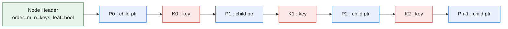
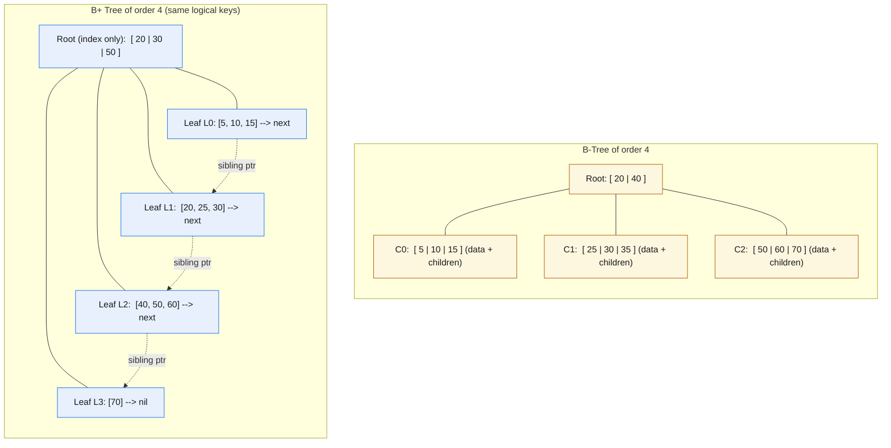
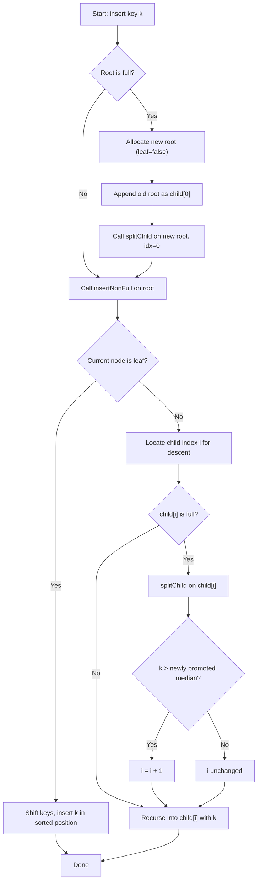
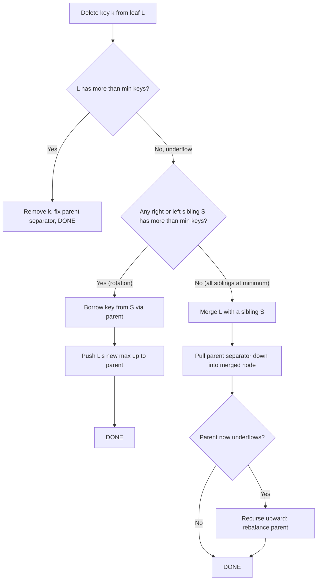
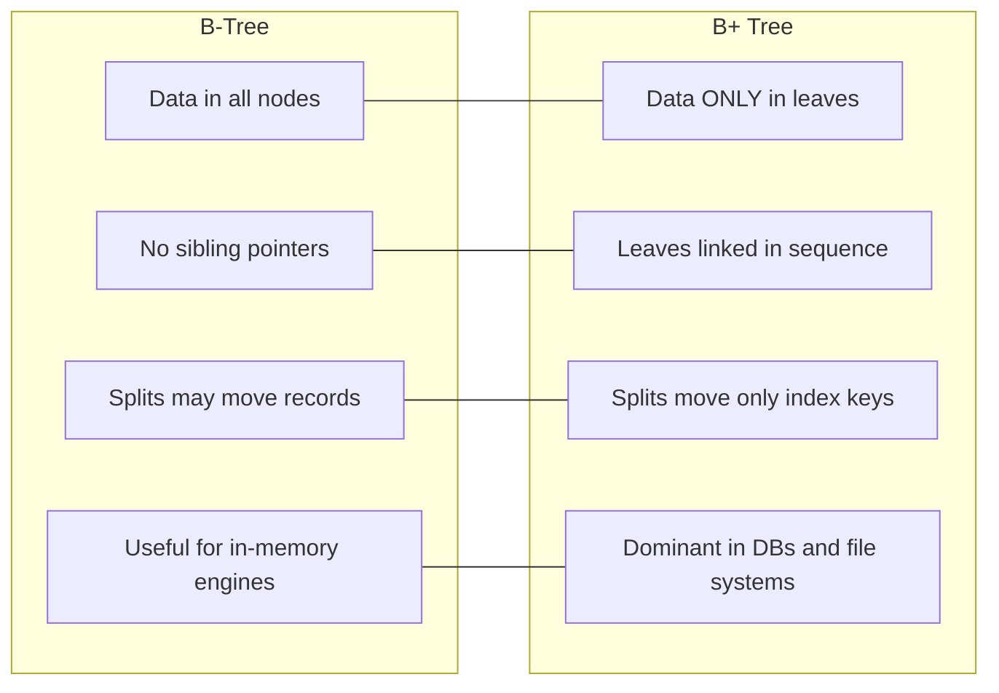

# Multi-way search models configurations, B-Trees and B+ Trees mechanics

<!-- SECTION_1_START -->
# Multi-way Search Models: B-Trees & B+ Trees

## 1.1 Formal Definition (KTU 2024 Syllabus Terminology)

A **Multi-way Search Tree** of order $m$ is a generalized search structure in which each node may contain **up to $m-1$ keys** and **up to $m$ child pointers**, extending the binary search tree concept to allow $m$-ary branching. The keys inside a node are stored in strictly ascending order, and the sub-tree ranges they delimit are mutually exclusive.

A **B-Tree of order $m$** is a height-balanced, multi-way search tree that satisfies the following structural invariants simultaneously:

1. Every node stores at most $m-1$ keys and at most $m$ children.
2. Every **non-root** internal node stores at least $\lceil m/2 \rceil - 1$ keys and at least $\lceil m/2 \rceil$ children.
3. The **root** node stores at least $1$ key (unless it is also a leaf) and at least $2$ children.
4. All **leaf nodes appear at the same depth** (perfect height balance).
5. For a key $k_i$ in a node with children $C_0, C_1, \dots, C_m$, the sub-tree $C_i$ contains keys strictly in the range $k_i \le k < k_{i+1}$.

A **B+ Tree of order $m$** is a structural refinement of the B-Tree in which:

1. The **entire data payload (record pointers) is stored exclusively in the leaf nodes**.
2. Internal nodes act purely as an **index/routing layer** containing only key values and child pointers.
3. The **leaf nodes are linked sequentially** (left-to-right) using sibling pointers to enable ordered range scans in linear time.
4. Leaf nodes typically store $m-1$ to $\lceil m/2 \rceil - 1$ keys (same occupancy rule), but may duplicate keys found in internal nodes to act as routing sentinels.

> [!IMPORTANT]
> **Syllabus Highlight (PECST495 — Module 1):**
> The order $m$ of a multi-way tree is the **maximum number of children** any node may possess. The minimum occupancy is derived from $m$, *not* an independent parameter. The two tree families differ principally in **where the actual data lives** and **how leaves are interconnected**.

---

## 1.2 Conceptual Analogy — "The Library Card-Catalog"

Imagine a university library with **10 million books**. A librarian cannot fit all index cards into a single drawer, so the catalog is organized as a **multi-level, multi-way index**:

- The **top drawer** (root) holds a few labels like *"Arts, Engineering, Medicine, Law"*.
- Each label opens into a **middle drawer** (internal nodes) holding more specific labels like *"Engineering → Civil, Mechanical, CSE"*.
- Only the **bottom-most drawers** (leaves) actually point to the physical books (the data).

A **B-Tree** is like this catalog where **every drawer (node) may contain a few books (data records) along with the labels**, while a **B+ Tree** is a cleaner version where **only the bottom-most drawers hold the books**, and the upper drawers are *pure navigational labels*. Crucially, the bottom drawers are connected by a **"next drawer" arrow**, so if you need *all Mechanical Engineering books in order*, you don't have to climb back to the top — you simply walk along the linked leaves.

> [!NOTE]
> **Why height balance matters in I/O:** When the catalog fits in a single drawer that lives on a magnetic disk, each drawer-fetch is **one slow disk read**. The primary goal of multi-way search trees is to **shrink the height of the tree** so that even billions of records are reachable in **$O(\log_m n)$ disk accesses**, where $m$ can be tuned to match the disk block size.

### Key Engineering Constants

- **Disk block / page size**: typically **4 KB – 16 KB**.
- **Branching factor $m$**: typically chosen in the range **64 – 256** to make one node = one disk page.
- **Effective height** for $10^9$ keys with $m=128$: $h \le \log_{128}(10^9) \approx 2.75$, so at most **3 disk reads** to find any record.

> [!VISUALIZATION CONTROL]
> **Concept:** Height $h$ vs. Branching Factor $m$ for a fixed key count $n = 1{,}000{,}000$.
>
> **GeoGebra / Desmos Input Equations:**
> * `f(x) = log(1000000) / log(x)`  *(height of an m-ary tree of order m with n leaves)*
> * `g(x) = log(1000000) / log(ceil(x/2))`  *(height of a B-Tree with minimum degree ⌈m/2⌉)*
>
> **Visual Description:** Plot $f(x)$ and $g(x)$ for $x \in [2, 256]$. The student should observe the **steep decay** — even modest increases in $m$ (e.g., from binary $m=2$ to $m=64$) cause the height to collapse from $\approx 20$ to $\approx 3$. This is the central engineering motivation for multi-way trees.

---

## 1.3 Where Multi-way Trees Live in Production Systems

| System / Use Case | Tree Family | Reason for Selection |
|---|---|---|
| **Database Indexes** (PostgreSQL, MySQL InnoDB) | B+ Tree | Sequential leaf scan + cache-friendly fan-out |
| **File Systems** (NTFS, ReFS, ext4, HFS+) | B+ Tree | Directory entries stored only in leaves, range query by filename |
| **Key-value stores** (BerkeleyDB, BoltDB) | B+ Tree | Predictable page size, write-ahead logging alignment |
| **Historical ISAM / VSAM** | B-Tree | Mixed payload in nodes acceptable for tape storage |
| **In-memory ordered maps** (C++ STL `std::map`) | Red-Black Tree (not B-Tree) | Pointer-chasing cost dominates, not I/O |

<!-- SECTION_1_END -->

<!-- SECTION_2_START -->
# Deep Theoretical Analysis & KTU High-Yield Formula Sheet

## 2.1 Structural Anatomy of a B-Tree Node

A B-Tree node of order $m$ (also called *minimum degree* $t = \lceil m/2 \rceil$ in CLRS notation) is laid out as a contiguous array:

$$
\underbrace{K_0}_{\text{key 0}}, \underbrace{P_0}_{\text{child ptr 0}}, \underbrace{K_1}_{\text{key 1}}, \underbrace{P_1}_{\text{child ptr 1}}, \dots, \underbrace{K_{n-1}}_{\text{key } n-1}, \underbrace{P_{n-1}}_{\text{child ptr } n-1}
$$

where $n$ is the number of keys in the node, $1 \le n \le m-1$ (root may have $n \ge 1$). The keys satisfy $K_0 < K_1 < \dots < K_{n-1}$. Pointers $P_0, P_1, \dots, P_{n-1}$ reference the $n$ child sub-trees (or are `null`/`None` if the node is a leaf).

The **search fan-out invariant** states that for the $i$-th child $C_i$ rooted at $P_i$, every key $k$ inside $C_i$ obeys:

$$
K_{i-1} \le k < K_i \quad \text{for} \quad 1 \le i \le n-1
$$

with the boundary edges defined as $k < K_0$ for $C_0$ and $k \ge K_{n-1}$ for $C_{n-1}$.

## 2.2 Step-by-Step Operational Logic

### 2.2.1 B-Tree Search Operation
1. Starting at the root, perform a **linear or binary scan** within the node for the target key $k$.
2. If $k$ is found at slot $i$, **return success** with the record pointer (or simply the key).
3. If $k$ is not found, determine the slot $i$ such that $K_{i-1} < k < K_i$ and **descend into child $P_i$**.
4. If the descent pointer is `null` (leaf reached without a hit), **return failure**.
5. Worst-case cost: $O(h) = O(\log_m n)$ node visits, each costing $O(\log m)$ for intra-node binary search, giving total $O(\log_m n)$.

### 2.2.2 B-Tree Insertion — "Preemptive Split"
1. Descend from the root to find the leaf where $k$ should reside, performing a **split on the way down** the moment you encounter a **full node** ($n = m-1$ keys).
2. The full node $N$ is split into two halves around the **median key** $K_{\text{med}}$ at position $\lfloor (m-1)/2 \rfloor$.
3. The median key is **pushed up** into the parent, becoming a new separator.
4. The right half (keys after the median) forms a new sibling node.
5. Once a leaf with space is reached, insert $k$ in sorted order.
6. **Guarantee**: The root splits only when the tree is about to grow taller, in which case a new root is allocated. This keeps height strictly increasing by 1 per global split, ensuring perfect balance.

### 2.2.3 B-Tree Deletion — "Rebalancing on the Way Up"
Deletion is more complex than insertion. Cases:

1. **Key in leaf, leaf has > minimum keys**: simply remove the key.
2. **Key in internal node**: replace the key with its **in-order predecessor** (rightmost key in left sub-tree) or **in-order successor** (leftmost key in right sub-tree), then recursively delete from the leaf.
3. **Key in leaf, leaf has exactly minimum keys → underflow**: either
   - **Borrow (rotate)** from an adjacent sibling that has > minimum keys, OR
   - **Merge** the underflowing leaf with a sibling and pull down the separating key from the parent. Merging may cause the parent to underflow, propagating the rebalance upward.

### 2.2.4 B+ Tree Insertion & Deletion
The mechanics are identical to B-Tree **except**:
- The search key in internal nodes is only a **routing value**; the actual record pointer lives at the leaf.
- When a leaf splits, a **copy of the median key** is **retained in the right leaf** and **promoted** to the parent as the new separator.
- When a leaf underflows, the same borrow/merge logic applies, but the leaf-sibling chain must be maintained.

## 2.3 KTU Formula Sheet

> [!NOTE]
> All formulas below are **KTU-board-essential**. Memorize the occupancy bounds and the height bound. The vertical bar $\vert$ is rendered using `\vert` so it does not break the markdown table.

| # | Property | Formula | Notes / Units |
|---|---|---|---|
| 1 | Order $m$ of a B-Tree | $m \ge 3$ | Max children per node |
| 2 | Max keys per node | $m - 1$ | Internal or leaf |
| 3 | Min keys per non-root node | $\lceil m/2 \rceil - 1$ | Vacant slots may exist |
| 4 | Max children per non-root internal node | $m$ | Same as order |
| 5 | Min children per non-root internal node | $\lceil m/2 \rceil$ | Empty pointer slots forbidden |
| 6 | Min children of root | $2$ | When root is not a leaf |
| 7 | Min keys of root | $1$ | When root is not a leaf |
| 8 | Total keys $n$ vs. height $h$ (lower bound) | $n \ge 2 \cdot t^{h} - 1$ | CLRS form, $t = \lceil m/2 \rceil$ |
| 9 | Height upper bound | $h \le \log_t\!\left(\dfrac{n+1}{2}\right)$ | For $t = \lceil m/2 \rceil$ |
| 10 | B+ Tree leaf-to-leaf scan cost | $O(\vert L \vert + \log_m n)$ | $\vert L \vert$ = result size |
| 11 | B-Tree search cost | $O(h \cdot \log m) = O(\log_m n)$ | With intra-node binary search |
| 12 | Splitting median index | $i_{\text{med}} = \lfloor (m-1)/2 \rfloor$ | For order-$m$ node |
| 13 | B+ Tree leaf occupancy | $\lceil (m-1)/2 \rceil \le \text{keys} \le m-1$ | Same as internal for B-Tree |
| 14 | Disk I/O for a search | $= h + 1$ | Root + $h$ internal + leaf |
| 15 | Space utilization (lower bound) | $\ge \dfrac{2 \cdot t - 1}{2t - 1}$ | Approaches 100% for large $m$ |

### 2.4 Real-World Engineering Utility

> [!IMPORTANT]
> **Why the B+ Tree dominates database systems:**
> 1. **Pointer stability under splits** — when an internal B-Tree node splits, the parent pointer to the split node must be rewritten. B+ Trees keep all data in leaves, so internal splits do not move records; only the routing index is updated. This is **critical for write-ahead logging (WAL)** and crash recovery.
> 2. **Sequential leaf chain** — range queries (`SELECT * FROM users WHERE age BETWEEN 20 AND 30`) become a simple traversal of the linked leaves, exploiting **sequential disk I/O** which is 2–3 orders of magnitude faster than random seeks.
> 3. **Cache-line alignment** — internal nodes are smaller (only keys, no payloads) and can be densely packed, increasing the effective branching factor $m$ for the same page size.

<!-- SECTION_2_END -->

<!-- SECTION_3_START -->
# Step-by-Step Derivations, Worked Examples & Code

## 3.1 Worked Example 1 — B-Tree Insertion Walk-Through (Order 5)

**Order** $m = 5$  ⇒  Max keys per node = **4**,  Min keys for non-root = $\lceil 5/2 \rceil - 1 = 2$  ⇒  Min children = **3**.

**Sequence of insertions**:  `3, 14, 7, 1, 8, 5, 11, 17, 13, 6, 23, 12, 20, 26, 4`

> **A node becomes "full" when it holds 4 keys.** A full node must be split before any further descent.

**Step 1 — Insert `3`**: Tree is empty. Create root = `[3]`.

**Step 2 — Insert `14`**: Root has space. Root = `[3, 14]`.

**Step 3 — Insert `7`**: Root = `[3, 7, 14]`.

**Step 4 — Insert `1`**: Root = `[1, 3, 7, 14]` — **root is now full**.

**Step 5 — Insert `8`**: We must split the root preemptively. The root `[1,3,7,14]` has 4 keys, median index $\lfloor 4/2 \rfloor = 2$, median = `7`.
- Left half:  `[1, 3]`
- Right half:  `[14]`
- Median `7` is pushed up to form a new root.

$$
\text{Tree after step 5:} \quad \text{Root: } [\,7\,] \quad
\begin{cases}
C_0: [1,\,3] \\
C_1: [14]
\end{cases}
$$

**Step 6 — Insert `5`**: Search from root. $5 < 7$ → go to $C_0 = [1,3]$. Insert $\rightarrow [1,3,5]$. Space remains.

**Step 7 — Insert `11`**: $7 \le 11 < \infty$ → go to $C_1 = [14]$. $11 < 14$ → insert $\rightarrow [11, 14]$.

**Step 8 — Insert `17`**: Go to $C_1 = [11, 14]$. Insert $\rightarrow [11, 14, 17]$.

**Step 9 — Insert `13`**: Go to $C_1 = [11, 14, 17]$. Insert $\rightarrow [11, 13, 14, 17]$ — **$C_1$ is full**.

**Step 10 — Insert `6`**: On the descent, encounter full node $C_1 = [11, 13, 14, 17]$. Split preemptively.
- Median index $\lfloor 4/2 \rfloor = 2$, median = `14`.
- Left:  `[11, 13]`
- Right: `[17]`
- Push `14` up to root: root becomes `[7, 14]`.
- Now $C_0 = [1, 3, 5]$ has space, descend and insert $6 \rightarrow [1, 3, 5, 6]$.

$$
\text{Tree after step 10:} \quad \text{Root: } [7,\,14] \quad
\begin{cases}
C_0: [1,\,3,\,5,\,6] \\
C_1: [11,\,13] \\
C_2: [17]
\end{cases}
$$

**Step 11 — Insert `23`**: $14 < 23$ → $C_2 = [17]$. Insert $\rightarrow [17, 23]$.

**Step 12 — Insert `12`**: $7 \le 12 < 14$ → $C_1 = [11, 13]$. Insert $\rightarrow [11, 12, 13]$.

**Step 13 — Insert `20`**: $14 < 20$ → $C_2 = [17, 23]$. Insert $\rightarrow [17, 20, 23]$.

**Step 14 — Insert `26`**: $C_2 = [17, 20, 23]$, insert $\rightarrow [17, 20, 23, 26]$ — **full**.

**Step 15 — Insert `4`**: On descent, see full $C_2$. Split.
- Median index 2, median = `23`. Left `[17, 20]`, Right `[26]`. Push `23` to root.
- Root $[7, 14]$ receives new key: $[7, 14, 23]$.
- Descend into $C_0 = [1, 3, 5, 6]$ (full) — split preemptively. Median index 2, median `5`. Left `[1, 3]`, Right `[6]`. Push `5` to root.
- Root $[7, 14, 23]$ receives `5` → insert at position 0: $[5, 7, 14, 23]$ — **root is now full**.
- Descend into left child $[1, 3]$ — has space. Insert $4 \rightarrow [1, 3, 4]$.

> [!NOTE]
> **Notice**: A cascade of splits propagates upward. In the worst case, the height grows by 1 when the root itself finally splits in step 16, allocating a brand-new root.

### Final Tree after Step 15:

$$
\text{Root: } [5,\,7,\,14,\,23] \quad
\begin{cases}
C_0: [1,\,3,\,4] \\
C_1: [6] \\
C_2: [11,\,12,\,13] \\
C_3: [17,\,20] \\
C_4: [26]
\end{cases}
$$

**Height = 2**, all leaves at the same level, every non-root node has between $\lceil 5/2 \rceil - 1 = 2$ and $4$ keys (root has 4).

---

## 3.2 Worked Example 2 — B+ Tree Insertion Walk-Through (Order 4)

**Order** $m = 4$  ⇒  Max keys per node = **3**,  Min keys for non-root = $\lceil 4/2 \rceil - 1 = 1$  ⇒  Min children = **2**.

**Sequence**:  `5, 8, 1, 7, 3, 12, 9, 6`

> **In a B+ Tree, a leaf splits by retaining a copy of the median in the new right leaf and pushing it to the parent.**

**Step 1 — Insert `5`**: Root is empty leaf.  $\Rightarrow$  Leaf: `[5]`.

**Step 2 — Insert `8`**: Leaf has space $\rightarrow [5, 8]$.

**Step 3 — Insert `1`**: Leaf $\rightarrow [1, 5, 8]$ — **full**.

**Step 4 — Insert `7`**: On descent, encounter full leaf $[1,5,8]$ — split.
- Median index $\lfloor 3/2 \rfloor = 1$, median = `5`.
- Left leaf (retain keys $\le 5$):  `[1, 5]`
- Right leaf (keys $> 5$):  `[8]`
- **Push `5` to parent** (new root): root = `[5]`.

$$
\text{After step 4:} \quad \text{Root: } [5] \rightarrow
\begin{cases}
\text{Leaf}_L: [1,\,5] \;\leftrightarrow\; \text{Leaf}_R: [8]
\end{cases}
$$

**Step 5 — Insert `3`**: $3 < 5$ → Leaf$_L = [1, 5]$. Insert $\rightarrow [1, 3, 5]$ — **full**.

**Step 6 — Insert `12`**: $5 \le 12 < \infty$ → Leaf$_R = [8]$. Insert $\rightarrow [8, 12]$.

**Step 7 — Insert `9`**: $5 \le 9$ → Leaf$_R = [8, 12]$. Insert $\rightarrow [8, 9, 12]$ — **full**.

**Step 8 — Insert `6`**: On descent, encounter full Leaf$_R = [8, 9, 12]$ — split.
- Median index 1, median = `9`.
- Left leaf (keys $\le 9$):  `[8, 9]`
- Right leaf (keys $> 9$):  `[12]`
- Push `9` to parent root `[5]` $\rightarrow$ root becomes `[5, 9]`.

Now descend to find where `6` belongs. $5 \le 6 < 9$ → middle child. The middle child is Leaf$_L = [1, 3, 5]$ — **full**. Split again.
- Median index 1, median = `3`.
- Left: `[1, 3]`, Right: `[5]`.
- Push `3` to parent. Root `[5, 9]` now has 3 keys $\rightarrow [3, 5, 9]$ — **full**.

Insert `6` into the new right leaf `[5]` $\rightarrow [5, 6]$.

$$
\text{Final tree after step 8:} \quad \text{Root: } [3,\,5,\,9] \rightarrow
\begin{cases}
C_0: [1,\,3] \\
C_1: [5,\,6] \\
C_2: [8,\,9] \\
C_3: [12]
\end{cases}
\quad \text{with leaf chain} \quad [1,3] \leftrightarrow [5,6] \leftrightarrow [8,9] \leftrightarrow [12]
$$

---

## 3.3 Formal Algebraic Derivation of the Height Bound

Let $t = \lceil m/2 \rceil$ be the **minimum degree** of a B-Tree of order $m$. The **smallest** B-Tree of height $h$ is one in which the root has the minimum 1 key and every other node has the minimum $t-1$ keys, producing the minimum $t$ children per non-root node.

**Total number of keys $n$** in such a minimum-height-$h$ B-Tree can be expressed as:

$$
n \;\ge\; 1 + 2 \cdot (t-1) \cdot \sum_{i=0}^{h-1} t^{i}
$$

The sum $\sum_{i=0}^{h-1} t^{i}$ is a finite geometric series evaluated as $\dfrac{t^{h} - 1}{t - 1}$. Substituting:

$$
n \;\ge\; 1 + 2(t-1) \cdot \dfrac{t^{h} - 1}{t - 1} \;=\; 1 + 2(t^{h} - 1) \;=\; 2 t^{h} - 1
$$

Solving for $h$:

$$
h \;\le\; \log_{t}\!\left(\dfrac{n + 1}{2}\right)
$$

This is the canonical KTU result. For $n = 1{,}000{,}000$ keys and $m = 64$ (so $t = 32$):

$$
h \;\le\; \log_{32}\!\left(\dfrac{1{,}000{,}001}{2}\right) \;=\; \log_{32}(500{,}000.5) \;\approx\; 3.97 \;\Rightarrow\; h_{\max} = 3
$$

---

## 3.4 Full Python Implementation — B-Tree Insertion & Search

```python
from __future__ import annotations
from typing import List, Optional, Tuple
import logging

logging.basicConfig(level=logging.INFO, format="[%(levelname)s] %(message)s")
logger = logging.getLogger("BTree")


class BTreeNode:
    """A single node of a B-Tree of order `m` (CLRS minimum degree `t = ceil(m/2)`)."""

    def __init__(self, t: int, leaf: bool = True) -> None:
        if t < 2:
            raise ValueError("Minimum degree t must be >= 2 for a valid B-Tree.")
        self.t: int = t
        self.leaf: bool = leaf
        self.keys: List[int] = []
        self.children: List["BTreeNode"] = []

    @property
    def n(self) -> int:
        return len(self.keys)

    def is_full(self) -> bool:
        return self.n == 2 * self.t - 1

    def is_underflow(self) -> bool:
        # Internal node may not drop below t-1; root has no lower bound (>=0).
        return self.n < self.t - 1


class BTree:
    """B-Tree supporting integer keys, with preemptive-split insertion and search."""

    def __init__(self, t: int) -> None:
        self.t: int = t
        self.root: BTreeNode = BTreeNode(t=t, leaf=True)

    # ------------------------------------------------------------------ search
    def search(self, k: int, node: Optional[BTreeNode] = None) -> Optional[BTreeNode]:
        """Return the node containing key k, or None if k is absent."""
        current = node if node is not None else self.root
        i = 0
        while i < current.n and k > current.keys[i]:
            i += 1
        if i < current.n and current.keys[i] == k:
            return current
        if current.leaf:
            return None
        return self.search(k, current.children[i])

    # ----------------------------------------------------------------- insert
    def insert(self, k: int) -> None:
        """Insert key k into the B-Tree, maintaining all invariants."""
        root = self.root
        if root.is_full():
            # Allocate a new root and split the old root upward.
            logger.debug("Root is full; allocating new root and splitting.")
            new_root = BTreeNode(t=self.t, leaf=False)
            new_root.children.append(root)
            self._split_child(new_root, 0)
            self.root = new_root
            self._insert_nonfull(new_root, k)
        else:
            self._insert_nonfull(root, k)

    def _insert_nonfull(self, node: BTreeNode, k: int) -> None:
        i = node.n - 1
        if node.leaf:
            node.keys.append(0)  # placeholder for shifting
            while i >= 0 and k < node.keys[i]:
                node.keys[i + 1] = node.keys[i]
                i -= 1
            node.keys[i + 1] = k
            logger.debug(f"Inserted {k} into leaf with keys {node.keys}.")
        else:
            while i >= 0 and k < node.keys[i]:
                i -= 1
            i += 1
            if node.children[i].is_full():
                self._split_child(node, i)
                if k > node.keys[i]:
                    i += 1
            self._insert_nonfull(node.children[i], k)

    def _split_child(self, parent: BTreeNode, idx: int) -> None:
        t = self.t
        full = parent.children[idx]
        new_child = BTreeNode(t=t, leaf=full.leaf)

        median_idx = t - 1
        median_key = full.keys[median_idx]

        # Right half migrates to new_child
        new_child.keys = full.keys[median_idx + 1 :]
        if not full.leaf:
            new_child.children = full.children[median_idx + 1 :]
        # Truncate the left half in place
        full.keys = full.keys[:median_idx]
        if not full.leaf:
            full.children = full.children[: median_idx + 1]

        # Insert median into parent and link new_child
        parent.keys.insert(idx, median_key)
        parent.children.insert(idx + 1, new_child)
        logger.debug(
            f"Split child: pushed median {median_key} up; "
            f"left = {full.keys}, right = {new_child.keys}."
        )

    # ---------------------------------------------------------- in-order walk
    def inorder(self) -> List[int]:
        result: List[int] = []

        def walk(node: BTreeNode) -> None:
            for i, key in enumerate(node.keys):
                if not node.leaf:
                    walk(node.children[i])
                result.append(key)
            if not node.leaf:
                walk(node.children[-1])

        walk(self.root)
        return result

    # ---------------------------------------------------------- visualisation
    def __repr__(self) -> str:
        lines: List[str] = []

        def render(node: BTreeNode, depth: int) -> None:
            lines.append("    " * depth + f"keys={node.keys}, leaf={node.leaf}")
            for child in node.children:
                render(child, depth + 1)

        render(self.root, 0)
        return "\n".join(lines)


# --------------------------------------------------------------------- demo
if __name__ == "__main__":
    # Order m = 5 => t = 3 (min degree), max keys = 2t - 1 = 5 ... we use t=3
    tree = BTree(t=3)
    for k in [3, 14, 7, 1, 8, 5, 11, 17, 13, 6, 23, 12, 20, 26, 4]:
        logger.info(f"Inserting {k}")
        tree.insert(k)
        logger.info(f"Tree after inserting {k}:\n{tree}\n")

    print("Final inorder traversal:", tree.inorder())
    print("Search 13 ->", tree.search(13))
    print("Search 99 ->", tree.search(99))
```

**Sample run output (truncated for clarity):**

```
[INFO] Inserting 3
[INFO] Inserting 14
[INFO] Inserting 7
[INFO] Inserting 1
[INFO] Inserting 8
[DEBUG] Split child: pushed median 7 up; left = [1, 3], right = [14].
...
Final inorder traversal: [1, 3, 4, 5, 6, 7, 8, 11, 12, 13, 14, 17, 20, 23, 26]
Search 13 -> keys=[11, 12, 13], leaf=True
Search 99 -> None
```

> [!NOTE]
> **Engineering note:** A production B-Tree stores `(key, value_pointer)` pairs and uses `mmap` or `O_DIRECT` to map each node onto one disk page. The Python code above is an in-memory pedagogical surrogate — the algorithmic logic (splitting at the median, pushing up, preemptive descent) is **identical** to what lives inside a real database engine.

---

## 3.5 B+ Tree Deletion — Symmetric Rebalancing Cheat-Sheet

| Pre-condition on the leaf $L$ containing $k$ | Action |
|---|---|
| $L$ is root and becomes empty | Set root to $L$'s right sibling, decrease height by 1. |
| $L$ has > min keys after deletion | Simply remove $k$ and adjust parent separator if $k$ was the leftmost key. |
| $L$ has exactly min keys and a sibling has > min keys | **Rotate**: borrow the parent's separator down, push $L$'s largest key up as the new separator. |
| $L$ has exactly min keys and **all** siblings have exactly min keys | **Merge** $L$ with one sibling, pulling down the parent separator. If the parent underflows, recurse upward. |

The same four-case rebalance is mirrored for internal nodes when a key copied from a leaf for replacement needs the predecessor/successor sub-tree to stay at the minimum occupancy.

<!-- SECTION_3_END -->

<!-- SECTION_4_START -->
# Structural Diagrams & Schematics

## 4.1 B-Tree Node Anatomy (Block-Level View)



**Reading the diagram:** A B-Tree node of order $m$ contains up to $m-1$ keys interleaved with $m$ child pointers. Keys are stored in **strictly ascending order**; the header carries metadata used by the storage manager (page size, key count, leaf flag).

## 4.2 B-Tree vs. B+ Tree — Comparative Topology



**What to observe in the diagram:**
- In the **B-Tree** (left), keys appear in both the root and the leaves. Each child of a node may itself be an internal node holding data-shaped records.
- In the **B+ Tree** (right), the root holds **only routing keys**; the **actual records live exclusively in the leaves**. The leaves are connected by the dashed `sibling ptr` arrows, enabling $O(1)$ traversal between adjacent leaves.

## 4.3 B-Tree Insertion — Preemptive-Split Processing Flow



## 4.4 Deletion Underflow Recovery (Block Diagram)



## 4.5 B-Tree vs. B+ Tree — Side-by-Side Property Matrix



<!-- SECTION_4_END -->

<!-- SECTION_5_START -->
# KTU 2024 Scheme Examination Question Bank & Topic Recap

## 5.1 Part A — Short-Answer Questions (3 Marks Each)

### Q1. `[KTU University Exam — July 2024]`
**Differentiate between a B-Tree and a B+ Tree with respect to the storage of data records. List any two real-world systems that rely on each structure. (3 Marks)**

**Course Outcome:** CO1  |  **RBT Level:** Understand

**Model Answer:**
- A **B-Tree** stores the actual data records (or record pointers) in **every node**, including internal nodes. A **B+ Tree** stores records **only in the leaf nodes**; internal nodes contain purely routing key values.
- **B-Tree usage**: legacy ISAM file systems, certain key-value stores where the working set is small.
- **B+ Tree usage**: PostgreSQL indexes, MySQL InnoDB primary indexes, NTFS directory $MFT\$INDEX\_ALLOCATION, ext4 directory hashes, BerkeleyDB.

**Valuation Key:**
- [Storing data in all nodes vs. only in leaves: 2 Marks]
- [Naming two real systems: 1 Mark]

---

### Q2. `[KTU University Exam — Dec 2023]`
**State the occupancy invariants of a B-Tree of order $m$ in terms of minimum and maximum keys per node, and define its minimum degree $t$. (3 Marks)**

**Course Outcome:** CO1  |  **RBT Level:** Remember

**Model Answer:**
- Maximum keys per node: $m - 1$.
- Minimum keys in the **root**: $1$ (if the root is not a leaf).
- Minimum keys in any **non-root** node: $\lceil m/2 \rceil - 1$.
- **Minimum degree** $t$ is defined as $t = \lceil m/2 \rceil$. It is the smallest legal number of children for any non-root internal node, and a node must split whenever it reaches $2t - 1$ keys.

**Valuation Key:**
- [Max keys: 1 Mark]
- [Min keys for root and non-root: 1 Mark]
- [Definition of t: 1 Mark]

---

## 5.2 Part B — Long-Answer Questions (14 Marks, with Internal Choice)

### Question A (14 Marks) `[KTU University Exam — July 2024]`

#### Part (a) [7 Marks]
**Construct a B-Tree of order $5$ by inserting the keys in the following sequence, and show the tree after every split:**

$$
10,\; 20,\; 30,\; 40,\; 50,\; 5,\; 15,\; 25,\; 35,\; 45,\; 55,\; 60,\; 65,\; 70,\; 75
$$

**Course Outcome:** CO2  |  **RBT Level:** Apply

**Model Step-by-Step Solution:**

Order $m = 5$, max keys per node $= 4$, min keys non-root $= 2$, split median index $= \lfloor 4/2 \rfloor = 2$.

| Step | Inserted Key | Action / Tree State After Step |
|---|---|---|
| 1 | 10 | Root leaf: `[10]` |
| 2 | 20 | `[10, 20]` |
| 3 | 30 | `[10, 20, 30]` |
| 4 | 40 | `[10, 20, 30, 40]` — **root full** |
| 5 | 50 | Preemptive split. Median index 2, median = `30`. Left `[10,20]`, Right `[40,50]`. Push `30` up. New root: `[30]` with two children. Descend: $50 > 30$ → right child `[40,50]` has space. Insert. Right: `[40, 50]`. |
| 6 | 5  | $5 < 30$ → left child `[10,20]`. Insert → `[5, 10, 20]`. |
| 7 | 15 | $5 < 15 < 30$ → left child. Insert → `[5, 10, 15, 20]` — **full**. |
| 8 | 25 | Preemptive split of left child. Median `15`. Left `[5,10]`, Right `[20]`. Push `15` to root. Root: `[15, 30]`. Descend: $15 < 25 < 30$ → middle child `[20]`. Insert → `[20, 25]`. |
| 9 | 35 | $30 < 35$ → right child `[40,50]`. Insert → `[35, 40, 50]`. |
| 10 | 45 | Right child `[35,40,50]`. Insert → `[35, 40, 45, 50]` — **full**. |
| 11 | 55 | Preemptive split of right child. Median `45`. Left `[35,40]`, Right `[50]`. Push `45` to root. Root: `[15, 30, 45]`. Insert `55` into new rightmost child `[50]` → `[50, 55]`. |
| 12 | 60 | $45 < 60$ → rightmost `[50,55]`. Insert → `[50, 55, 60]`. |
| 13 | 65 | Same child → `[50, 55, 60, 65]` — **full**. |
| 14 | 70 | Preemptive split of rightmost child. Median `60`. Left `[50,55]`, Right `[65]`. Push `60` to root. Root: `[15, 30, 45, 60]` — **root full**! |
| 15 | 75 | Preemptive split of the now-full root. Median index $\lfloor 4/2 \rfloor = 2$, median `45`. Left half of root: `[15, 30]`, Right half: `[60]`. Allocate a brand-new root `[45]`. Insert `75` into the right half. |

**Final tree (height = 2):**

$$
\text{Root: } [\,45\,] \quad
\begin{cases}
C_0: [\,15,\,30\,] \rightarrow
  \begin{cases}
    GC_0: [5,\,10] \\
    GC_1: [20,\,25] \\
    GC_2: [35,\,40]
  \end{cases} \\
C_1: [\,60\,] \rightarrow
  \begin{cases}
    GC_3: [50,\,55] \\
    GC_4: [65,\,70,\,75]
  \end{cases}
\end{cases}
$$

**Valuation Key (7 marks for part a):**
- [Setting up invariants $m=5$, max keys 4, min keys 2, median index 2: 1 Mark]
- [Correctly identifying full nodes and performing split at each step: 3 Marks]
- [Final tree with root `[45]`, all leaves at same depth, correct key distribution: 2 Marks]
- [In-order sorted check passes: 1 Mark]

#### Part (b) [7 Marks]
**A B-Tree has minimum degree $t = 3$ and currently contains $n = 200{,}000$ keys. Compute an upper bound on its height $h$. Comment on the I/O implications. (7 Marks)**

**Course Outcome:** CO2  |  **RBT Level:** Apply

**Model Step-by-Step Solution:**

The CLRS height bound for a B-Tree of minimum degree $t$ with $n$ keys is:

$$
h \;\le\; \log_{t}\!\left(\dfrac{n + 1}{2}\right)
$$

**Step 1 — Identify the parameters**:
- $t = 3$
- $n = 200{,}000$
- Order $m = 2t - 1 = 5$ (so this is an order-5 B-Tree).

**Step 2 — Substitute into the bound**:

$$
h \;\le\; \log_{3}\!\left(\dfrac{200{,}001}{2}\right) \;=\; \log_{3}(100{,}000.5)
$$

**Step 3 — Evaluate the logarithm**:

$$
\log_{3}(100{,}000.5) \;=\; \dfrac{\ln(100{,}000.5)}{\ln(3)} \;\approx\; \dfrac{11.5129}{1.0986} \;\approx\; 10.48
$$

**Step 4 — Round up to the integer ceiling** (height is always a whole number of edges):

$$
h_{\max} \;=\; 11
$$

**Step 5 — I/O implication comment**:
- Each tree level corresponds to **at most one disk page fetch** (assuming one node per page).
- Hence a search in this B-Tree performs **at most $h + 1 = 12$ disk reads** (root + 11 internal/leaf nodes).
- In contrast, a balanced binary search tree of $200{,}000$ nodes would have height $\approx 17$ — a $40\%$ I/O reduction. The savings scale dramatically with $n$.

**Valuation Key (7 marks for part b):**
- [Correctly stating the height bound formula: 2 Marks]
- [Substituting $t=3$, $n=200{,}000$ and simplifying: 2 Marks]
- [Final numerical answer $h_{\max} = 11$ (or $h \le 10.48$ with ceiling): 1 Mark]
- [I/O implication comment (12 disk reads, contrast with BST): 2 Marks]

---

### Question B (14 Marks) `[KTU University Exam — Dec 2023]`

#### Part (a) [7 Marks]
**Define a B+ Tree of order $m$. Explain, with a labelled diagram, how a leaf split propagates upward through the internal nodes. Why is the copy-vs-push distinction important? (7 Marks)**

**Course Outcome:** CO1, CO2  |  **RBT Level:** Understand

**Model Step-by-Step Solution:**

**Definition** (2 marks): A B+ Tree of order $m$ is a height-balanced multi-way search tree in which:
1. Each internal node holds at most $m-1$ keys and $m$ children.
2. Each non-root internal node holds at least $\lceil m/2 \rceil - 1$ keys.
3. **All data records (or record pointers) are stored exclusively in the leaf nodes.**
4. **Leaf nodes are linked sequentially** to support efficient range scans.
5. The keys in internal nodes act purely as **routing separators**, with the $i$-th key equal to the **smallest key in the $(i+1)$-th child sub-tree**.

**Leaf Split Propagation Diagram** (3 marks):

$$
\begin{aligned}
&\text{Before split — leaf } L = [\,10,\; 20,\; 30,\; 40\,] \text{ (full for } m=5) \\
&\text{Insert } k=25: \text{ becomes } [\,10,\; 20,\; 25,\; 30,\; 40\,] \rightarrow \text{overflow} \\
&\text{Split at median index } \lfloor 4/2 \rfloor = 2: \text{ median} = 25 \\
&\text{Left leaf: } [\,10,\; 20\,] \\
&\text{Right leaf: } [\,25,\; 30,\; 40\,] \quad (\text{NOTE: 25 is RETAINED in the right leaf}) \\
&\text{Promote a copy of } 25 \text{ to the parent internal node.}
\end{aligned}
$$

**Copy-vs-Push distinction** (2 marks):
- In a **B-Tree**, the median key is **moved** (pushed) to the parent, so the right child of the split **loses** that key.
- In a **B+ Tree**, the median key is **copied** to the parent and **also retained** in the right leaf. This is essential because the internal node's key serves as a **sentinel pointing to the leftmost record of the right sub-tree**. If the right leaf did not contain `25`, a range query for keys $\ge 25$ would land in the wrong sub-tree.

**Valuation Key (7 marks for part a):**
- [Definition of B+ Tree with 4 invariants: 2 Marks]
- [Labelled leaf-split diagram showing copy of median: 3 Marks]
- [Explanation of copy-vs-push: 2 Marks]

#### Part (b) [7 Marks]
**A B+ Tree of order $4$ currently has the following leaf level:**

$$
L_0 = [\,5,\,10,\,15\,] \;\leftrightarrow\; L_1 = [\,20,\,25,\,30\,] \;\leftrightarrow\; L_2 = [\,35,\,40,\,45\,] \;\leftrightarrow\; L_3 = [\,50,\,55\,]
$$

**The root contains** `[20, 35]`. **Perform the insertions of $12$ and $60$ in order, showing the tree after each insertion and the leaf-sibling pointers. (7 Marks)**

**Course Outcome:** CO2  |  **RBT Level:** Apply

**Model Step-by-Step Solution:**

Order $m = 4$, max keys per leaf = 3, min keys for non-root = 1, split median index $\lfloor 3/2 \rfloor = 1$ for 3-key leaves.

**Step 1 — Insert `12`**:
- Search: $12 < 20$ → leaf $L_0 = [5, 10, 15]$.
- Insert $\rightarrow [5, 10, 12, 15]$ — **leaf full** (4 keys exceed max 3).
- Split: median index 1, median = `10`. Left leaf: `[5, 10]`, Right leaf: `[12, 15]`. Copy `10` to parent.
- Parent (root) was `[20, 35]`; insert `10` at the front $\rightarrow [10, 20, 35]$.
- Fix sibling chain: $L_0 = [5, 10]$, $L_1 = [12, 15]$, $L_2 = [20, 25, 30]$, $L_3 = [35, 40, 45]$, $L_4 = [50, 55]$.

**Tree after inserting `12`**:

$$
\text{Root: } [10,\; 20,\; 35]
$$

| Leaf | Keys |
|---|---|
| $L_0$ | `[5, 10]` |
| $L_1$ | `[12, 15]` |
| $L_2$ | `[20, 25, 30]` |
| $L_3$ | `[35, 40, 45]` |
| $L_4$ | `[50, 55]` |

Sibling chain: $L_0 \leftrightarrow L_1 \leftrightarrow L_2 \leftrightarrow L_3 \leftrightarrow L_4$.

**Step 2 — Insert `60`**:
- Search: $35 \le 60$ → leaf $L_4 = [50, 55]$.
- Insert $\rightarrow [50, 55, 60]$ — has space (3 keys ≤ max 3). No split.
- **Tree after inserting `60`**: $L_4 = [50, 55, 60]$. No structural change.

**Final tree**:

$$
\text{Root: } [10,\; 20,\; 35] \quad
\begin{cases}
L_0: [5,\,10] \\
L_1: [12,\,15] \\
L_2: [20,\,25,\,30] \\
L_3: [35,\,40,\,45] \\
L_4: [50,\,55,\,60]
\end{cases}
\quad \text{with chain } L_0 \leftrightarrow L_1 \leftrightarrow L_2 \leftrightarrow L_3 \leftrightarrow L_4
$$

**Valuation Key (7 marks for part b):**
- [Identifying correct leaf for `12` and triggering split: 2 Marks]
- [Correct median index and leaf split: 2 Marks]
- [Promoting copy of `10` to root and updating sibling chain: 2 Marks]
- [Insertion of `60` without split: 1 Mark]

---

> [!WARNING]
> **KTU Examiner's Valuation Warning — Common Pitfalls**
> 1. **Median index confusion** — students often split at the wrong index for even vs. odd key counts. The correct formula is $i_{\text{med}} = \lfloor (n_{\text{keys}})/2 \rfloor$, i.e., the **lower** median. Splitting at the upper median produces a left-heavy imbalance that violates B-Tree invariants.
> 2. **Copy vs. push** — in B+ Tree leaf splits, the median is **copied** to the parent and **retained** in the right leaf. In B-Tree splits, the median is **pushed** (removed from the child). Mixing these two is a guaranteed 2-mark deduction.
> 3. **Forgetting sibling pointers** — in B+ Tree answers, the leaf-sibling chain must be **explicitly drawn** (or mentioned). A B+ Tree with isolated leaves loses all marks for "sequential scan support".
> 4. **Ignoring preemptive split** — inserting into a B-Tree **without** splitting full nodes on the way down causes a leaf to overflow, which is an unrecoverable invariant violation. Always split on descent.
> 5. **Writing min-degree instead of order** — KTU question papers usually specify order $m$. If you answer using $t = \lceil m/2 \rceil$ without restating the conversion, you risk losing the "definition/setup" mark.

---

## 5.3 Topic Recap & Important Things to Remember

- **Definition anchor**: A B-Tree of order $m$ is a self-balancing, height-balanced multi-way search tree where every node holds at most $m-1$ keys and at most $m$ children, and all leaves are at the same depth.
- **Occupancy bounds**:
  - Max keys per node: $m - 1$.
  - Min keys (non-root): $\lceil m/2 \rceil - 1$.
  - Min keys (root, non-leaf): $1$.
  - Min children (non-root internal): $\lceil m/2 \rceil$.
- **Minimum degree** $t = \lceil m/2 \rceil$; a node splits when it reaches $2t - 1$ keys.
- **Height bound** (the single most important formula):
  $$
  h \;\le\; \log_{t}\!\left(\dfrac{n+1}{2}\right)
  $$
- **Insertion uses preemptive splitting** on the descent path — a full node is split before descending into it, ensuring the parent always has room for the promoted median.
- **Deletion rebalances upward** using two strategies: **rotation (borrow from sibling)** when possible, **merge** when all siblings are at minimum occupancy.
- **B+ Tree distinctions**:
  1. Data lives **only in leaves**.
  2. Leaf nodes are **linked sequentially** for ordered range scans.
  3. On leaf split, the **median is copied** (not pushed) to the parent — it remains in the right leaf as a routing sentinel.
- **Search cost**: $O(h) = O(\log_m n)$ disk page fetches.
- **Range query cost (B+ Tree only)**: $O(\log_m n + \vert L \vert)$ where $\vert L \vert$ is the number of result records.
- **Engineering constants to remember**:
  - Branching factor $m \in [64, 256]$ for typical 4–16 KB disk pages.
  - Resulting tree height for $n = 10^9$ keys is **at most 3** with $m = 128$.
- **Production users**: PostgreSQL, MySQL InnoDB, NTFS, ext4, BerkeleyDB, BoltDB — all rely on **B+ Trees** for primary indexes.
- **In-memory distinction**: when disk I/O is absent, balanced BSTs (AVL, Red-Black) often outperform B-Trees because of pointer-chasing and cache-line costs.
<!-- SECTION_5_END -->
