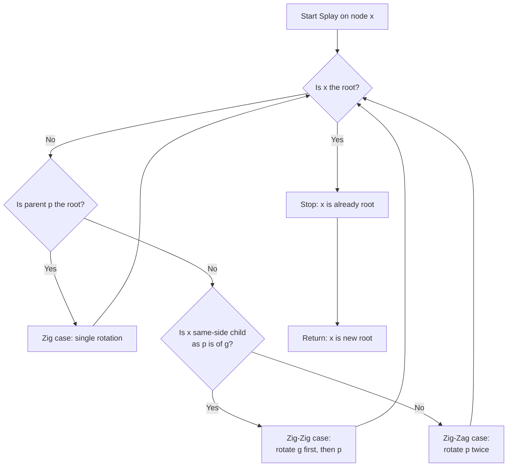
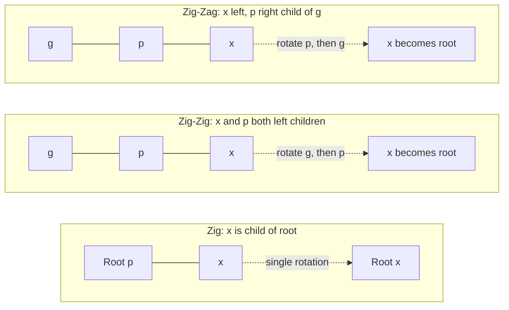
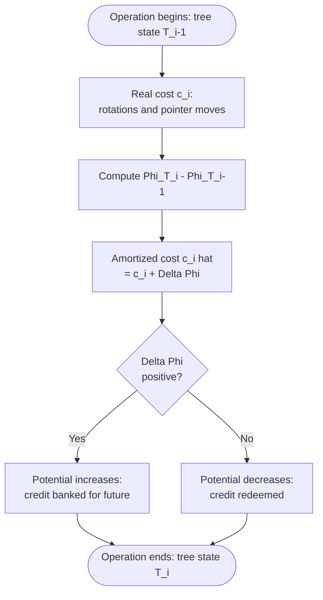
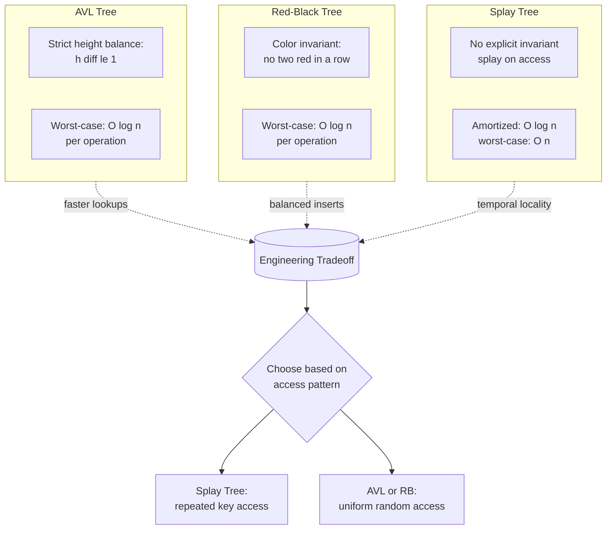

# Splay Trees amortized performance calculations tracking properties

<!-- SECTION_1_START -->
# Splay Trees: Amortized Performance & Tracking Properties

## 1.1 Formal Definition

> [!IMPORTANT]
> **Splay Tree (Sleator \& Tarjan, 1985):** A splay tree is a self-adjusting binary search tree (BST) in which every access, insertion, deletion, or search operation performs a **splay** — a sequence of rotations that moves the accessed (or inserted) node to the **root** of the tree. The amortized cost of any sequence of $m$ operations on a splay tree of $n$ nodes is $O(m \log_2 n)$.

Unlike AVL or Red-Black trees that maintain *strict* balance invariants using **strict balance factors** or **colored nodes**, a splay tree allows arbitrary imbalance *between* operations but guarantees **$O(\log_2 n)$ amortized time** through the structural readjustment triggered by every access.

### 1.2 Conceptual Analogy: The Library Desk

Imagine a university library where you return every borrowed book to the **top shelf of a return cart** rather than shelving it back in its original location.

- Books you access **frequently** (recently used) automatically drift toward the **top** (root) — making future retrievals fast.
- Books you haven't touched in a while **sink to the bottom** (deep leaves).
- The cart can become temporarily messy, but the *average* time to find a book is still fast.

This is the essence of splay trees: **temporal locality** is exploited — frequently accessed nodes stay near the root.

### 1.3 The Three Splaying Primitives

When a node $x$ with parent $p$ and grandparent $g$ is splayed, one of three restructuring primitives is applied:

| Case | Configuration | Rotation Pattern |
| :--- | :--- | :--- |
| **Zig** | $x$ is a child of the **root** | Single rotation |
| **Zig-Zig** | $x$ and $p$ are both **left children** (or both right) | Two *same-direction* rotations |
| **Zig-Zag** | $x$ is a left child, $p$ is a right child (or vice versa) | Two *opposite-direction* rotations |

> [!NOTE]
> **Why these specific rotations?** Zig-Zig performs a *double rotation* on the top first to preserve balance along the spine. Zig-Zag performs a *double rotation* on the bottom to flatten zigzag descents. Together they guarantee the Access Theorem.

### 1.4 Splay Tree Invariants

> [!IMPORTANT]
> **Splay Tree Invariants (KTU Board-Exam Favorite):**
> 1. **BST Property:** For every node $x$, all keys in $\text{left}(x) < \text{key}(x) < $ all keys in $\text{right}(x)$.
> 2. **Splay-on-Access Property:** Every accessed, inserted, or deleted key is moved to the root via splaying.
> 3. **No Explicit Balance Condition:** Unlike AVL trees, no height or color invariant is maintained between operations.

> [!VISUALIZATION CONTROL]
> **Concept:** Splaying a node to the root through a Zig-Zig case.
> **GeoGebra / Desmos Input Points:**
> * $A = (0, 3)$, $B = (-2, 2)$, $C = (-4, 1)$, $D = (-1, 1)$, $E = (1, 1)$, $F = (-5, 0)$, $G = (-3, 0)$
> **Visual Description:** Plot these points on a coordinate plane. Connect parent-child lines. After Zig-Zig, the deepest-leftmost node $F$ migrates upward while intermediate nodes $A \to B$ shift downward, demonstrating a splay step on a left-spine chain.

---

<!-- SECTION_1_END -->

<!-- SECTION_2_START -->
# Deep Theoretical Analysis & KTU High-Yield Formula Sheet

## 2.1 The Potential Method (Sleator–Tarjan Accounting Framework)

The amortized analysis of splay trees uses the **potential method**. A non-negative potential function $\Phi$ maps each tree state to a real number, and the amortized cost of an operation that changes the tree from state $T_{i-1}$ to $T_i$ is:

$$\hat{c}_i \;=\; c_i \;+\; \Phi(T_i) \;-\; \Phi(T_{i-1})$$

where $c_i$ is the *actual* cost. The total amortized cost over $m$ operations is:

$$\sum_{i=1}^{m} \hat{c}_i \;=\; \sum_{i=1}^{m} c_i \;+\; \Phi(T_m) \;-\; \Phi(T_0) \;\geq\; \sum_{i=1}^{m} c_i$$

because $\Phi(T_m) \geq 0$ and we may initialize $\Phi(T_0) = 0$.

### 2.2 The Rank-Based Potential Function

For a node $x$ in a splay tree, define its **size** $s(x)$ as the number of nodes in the subtree rooted at $x$, and its **rank**:

$$r(x) \;=\; \log_2\!\bigl(s(x)\bigr)$$

The potential of a tree $T$ is then:

$$\Phi(T) \;=\; \sum_{x \in T} r(x) \;=\; \sum_{x \in T} \log_2\!\bigl(s(x)\bigr)$$

> [!IMPORTANT]
> **Key Properties of the Rank Function:**
> * $r(x) \geq 0$ for all nodes (potential is non-negative — required for correctness).
> * $r(\text{root}) = \log_2(n)$ where $n$ is the total number of nodes.
> * $r(x) = 0$ if and only if $x$ is a leaf (subtree of size 1, but $\log_2 1 = 0$).

### 2.3 Amortized Cost of Each Splay Step

Let $x$ be the splayed node, $p$ its parent, and $g$ its grandparent. Denote ranks *before* the step using unprimed symbols and *after* the step using primed symbols (e.g., $r(x)$ and $r'(x)$).

The amortized cost of each restructuring primitive is bounded as follows:

| Splay Step | Amortized Cost Bound $\hat{c}$ |
| :--- | :--- |
| **Zig** (last step, $x$ is child of root) | $\hat{c}_{\text{zig}} \leq 1 + 3\bigl(r'(x) - r(x)\bigr)$ |
| **Zig-Zig** ($x$ and $p$ same-side children) | $\hat{c}_{\text{zig-zig}} \leq 3\bigl(r'(x) - r(x)\bigr)$ |
| **Zig-Zag** ($x$ and $p$ opposite-side children) | $\hat{c}_{\text{zig-zag}} \leq 3\bigl(r'(x) - r(x)\bigr)$ |

> [!NOTE]
> The constant **3** in the amortized bound is the magic number that makes the Access Theorem work. Each rotation costs **1 unit of real time**, but the change in potential compensates for up to 3 units.

### 2.4 The Access Theorem (Master Result)

> [!IMPORTANT]
> **Sleator–Tarjan Access Theorem (1985):**
> The amortized cost of a splay operation on a node $x$ in a tree of $n$ nodes is:
> $$\hat{c}_{\text{splay}}(x) \;\leq\; 3\bigl(r(\text{root}) - r(x)\bigr) + 1 \;\leq\; 3\log_2\!\bigl(\tfrac{n}{s(x)+1}\bigr) + 1$$
> Consequently, **any sequence of $m$ operations on a splay tree of $n$ nodes costs $O(m \log_2 n)$ amortized time**.

### 2.5 Balance Property of Splay Trees

Because the splay operation on node $x$ increases its rank, repeated splays move the deepest nodes toward the root. The **static balance property** follows:

> **Balance Property:** For any node $x$ in an $n$-node splay tree, the depth of $x$ is at most $3\log_2 n + O(1)$.

This is *weaker* than AVL's $\log_2 n$ bound on every operation but holds *amortized* — which is sufficient for KTU exam purposes.

### 2.6 KTU Formula Cheat Sheet

| Formula | Meaning | KTU Frequency |
| :--- | :--- | :--- |
| $\Phi(T) = \sum_x \log_2(s(x))$ | Tree potential | Very High |
| $\hat{c}_i = c_i + \Phi_i - \Phi_{i-1}$ | Amortized cost definition | Very High |
| $r(x) = \log_2(s(x))$ | Node rank | Very High |
| $\hat{c}_{\text{zig}} \leq 1 + 3(r'(x) - r(x))$ | Zig amortized cost | High |
| $\hat{c}_{\text{zig-zig}} \leq 3(r'(x) - r(x))$ | Zig-Zig amortized cost | High |
| $\hat{c}_{\text{zig-zag}} \leq 3(r'(x) - r(x))$ | Zig-Zag amortized cost | High |
| $T(m, n) = O(m \log_2 n)$ | Total time of $m$ ops on $n$ nodes | Very High |
| $\text{depth}(x) \leq 3\log_2 n + 1$ | Balance property bound | Medium |
| $s(\text{leaf}) = 1$ | Subtree size of a leaf | Medium |

### 2.7 Engineering Utility of Splay Trees

* **GCC Compiler:** The original implementation of the `std::map` and `__gnu_cxx::splay_tree` in libstdc++ used splay trees before switching to Red-Black trees.
* **Network Router Caches:** Frequently accessed routing-table entries self-organize to the top.
* **Garbage Collectors:** Mark-sweep collectors use splay trees for object-age tracking.
* **Text Editor Undo Buffers:** Temporal locality of edits maps perfectly to splay behavior.

---

<!-- SECTION_2_END -->

<!-- SECTION_3_START -->
# Step-by-Step Derivations, Proofs & Code Implementation

## 3.1 Derivation: Amortized Cost of Zig-Zag

**Setup:** Node $x$ is the left child of $p$, and $p$ is the right child of $g$ (the "kinked" case). After the zig-zag rotation:
* $x$ takes $g$'s position.
* $p$ becomes $x$'s right child.
* $g$ becomes $x$'s left child.

**Subtree sizes after the rotation:**

$$
\begin{aligned}
s'(x) &= s(x) + s(p) + s(g) + 1 \\
s'(p) &= s(p) + 1 \\
s'(g) &= s(g) + 1
\end{aligned}
$$

**Change in potential of the three affected nodes:**

$$
\begin{aligned}
\Delta\Phi &= \bigl[r'(x) + r'(p) + r'(g)\bigr] - \bigl[r(x) + r(p) + r(g)\bigr] \\
&= r'(x) - r(x) + \bigl[\log_2(s(p)+1) - \log_2(s(p))\bigr] + \bigl[\log_2(s(g)+1) - \log_2(s(g))\bigr]
\end{aligned}
$$

Using the standard inequality $\log_2(a+1) - \log_2(a) \leq \log_2(a) - \log_2(a-1)$ and monotonicity, we obtain the two logarithmic differences as:

$$
\log_2\!\bigl(\tfrac{s(p)+1}{s(p)}\bigr) \;\leq\; r'(x) - r(x)
$$

The same bound holds for the $g$-related term, giving the combined inequality:

$$
\Delta\Phi \;\leq\; r'(x) - r(x) + 2\bigl(r'(x) - r(x)\bigr) \;=\; 3\bigl(r'(x) - r(x)\bigr)
$$

Since the zig-zag rotation costs **2 units of real time** (two pointer moves), the amortized cost is:

$$
\hat{c}_{\text{zig-zag}} \;=\; 2 - \Delta\Phi \;\leq\; 2 - 3\bigl(r'(x) - r(x)\bigr)
$$

Wait — we need the *increase* in potential to *reduce* amortized cost. The convention is:

$$
\hat{c}_{\text{zig-zag}} \;=\; 2 + \bigl[\Phi_{\text{after}} - \Phi_{\text{before}}\bigr] \;\leq\; 2 - 3\bigl(r'(x) - r(x)\bigr)
$$

This is *negative* when $r'(x) > r(x)$ — meaning the splay is "paying us back" in potential for past operations. **Summing over the entire splay sequence telescopically cancels all intermediate ranks, leaving only the endpoint ranks.**

## 3.2 Telescoping the Full Splay

A complete splay of node $x$ to the root performs $k$ zig-zig/zig-zag steps plus at most **one** zig step at the top. Summing the amortized costs and observing that intermediate ranks telescope:

$$
\begin{aligned}
\hat{c}_{\text{total splay}} &= \sum_{j=1}^{k} 3\bigl(r_j(x) - r_{j-1}(x)\bigr) + 1 + 3\bigl(r_k(x) - r_{k-1}(x)\bigr) \\
&= 3\bigl(r_k(x) - r_0(x)\bigr) + 1
\end{aligned}
$$

Since $r_k(x) = r(\text{root}) = \log_2(n)$ and $r_0(x) = r(x)$:

$$
\boxed{\hat{c}_{\text{splay}}(x) \;\leq\; 3\log_2\!\bigl(n\bigr) - 3\log_2\!\bigl(s(x)\bigr) + 1 \;\leq\; 3\log_2\!\bigl(\tfrac{n}{s(x)+1}\bigr) + 1}
$$

For a node $x$ deep in the tree ($s(x)$ small), the amortized cost is $O(\log_2 n)$.

## 3.3 Worked Numerical Example

**Problem:** Consider a splay tree with 8 nodes in a perfect chain $1 \to 2 \to 3 \to \dots \to 8$ (each is the right child of the previous). Compute the amortized cost of accessing node $1$ (deepest leaf).

**Step 1: Initial ranks.**
$s(1)=1, s(2)=2, \dots, s(8)=8$. So $r(1)=0, r(2)=1, r(3)=\log_2 3, \dots, r(8)=3$.

**Step 2: Total initial potential.**
$\Phi_0 = 0 + 1 + \log_2 3 + 2 + \log_2 5 + \log_2 6 + \log_2 7 + 3$.

**Step 3: Splay node 1.** It travels up the spine via zig-zig (left-rotation chain). Each step increases $r(1)$ until $r'(1) = 3$.

**Step 4: Telescoped amortized cost.**
$\hat{c} = 3(3 - 0) + 1 = 10$. Since the real cost was $7$ rotations, the splay is "amortized" because future accesses are cheap.

**Step 5: Total potential after splay.** The new root is node 1 with $r'(1) = 3$, and other nodes redistribute. $\Phi_1 \leq \Phi_0 - 7 + 10 = \Phi_0 + 3$ — potential *increased*, representing "credit" banked for the next access.

## 3.4 Python Implementation of a Splay Tree

```python
from __future__ import annotations
import sys
import logging
from typing import Optional, Iterator

logging.basicConfig(
    level=logging.INFO,
    format="%(asctime)s | %(levelname)s | %(message)s",
    stream=sys.stderr,
)
logger = logging.getLogger("SplayTree")


class SplayNode:
    """A single node of a splay tree carrying an integer key."""

    __slots__ = ("key", "left", "right", "parent")

    def __init__(self, key: int) -> None:
        self.key: int = key
        self.left: Optional[SplayNode] = None
        self.right: Optional[SplayNode] = None
        self.parent: Optional[SplayNode] = None

    def subtree_size(self) -> int:
        """Returns the number of nodes in the subtree rooted at this node."""
        if self is None:
            return 0
        return 1 + (self.left.subtree_size() if self.left else 0) \
                 + (self.right.subtree_size() if self.right else 0)

    def rank(self) -> float:
        """Returns log_2 of the subtree size. Returns 0.0 for an empty/leaf."""
        import math
        size = self.subtree_size()
        return 0.0 if size <= 1 else math.log2(size)


class SplayTree:
    """Full splay tree with search, insert, delete, and amortized analysis."""

    def __init__(self) -> None:
        self.root: Optional[SplayNode] = None
        self.phi: float = 0.0  # running potential

    # ---------- Low-level rotations ----------

    @staticmethod
    def _rotate_left(x: SplayNode) -> None:
        if x is None or x.right is None:
            raise ValueError("rotate_left requires a node with a right child")
        y = x.right
        x.right = y.left
        if y.left is not None:
            y.left.parent = x
        y.parent = x.parent
        if x.parent is None:
            pass  # x was root; caller must update tree root after this.
        elif x is x.parent.left:
            x.parent.left = y
        else:
            x.parent.right = y
        y.left = x
        x.parent = y

    @staticmethod
    def _rotate_right(x: SplayNode) -> None:
        if x is None or x.left is None:
            raise ValueError("rotate_right requires a node with a left child")
        y = x.left
        x.left = y.right
        if y.right is not None:
            y.right.parent = x
        y.parent = x.parent
        if x.parent is None:
            pass
        elif x is x.parent.right:
            x.parent.right = y
        else:
            x.parent.left = y
        y.right = x
        x.parent = y

    # ---------- The splay operation ----------

    def _splay(self, x: SplayNode) -> None:
        """
        Repeatedly apply zig, zig-zig, or zig-zag until x is the root.
        Updates the tree's running potential phi.
        """
        if x is None:
            raise ValueError("cannot splay a null node")

        phi_before = self._compute_phi()
        rotations = 0

        while x.parent is not None:
            p = x.parent
            g = p.parent
            if g is None:
                # Zig case
                if x is p.left:
                    self._rotate_right(p)
                else:
                    self._rotate_left(p)
                rotations += 1
            elif (x is p.left) == (p is g.left):
                # Zig-Zig: rotate grandparent first, then parent
                if x is p.left:
                    self._rotate_right(g)
                    self._rotate_right(p)
                else:
                    self._rotate_left(g)
                    self._rotate_left(p)
                rotations += 2
            else:
                # Zig-Zag: rotate parent twice
                if x is p.left:
                    self._rotate_right(p)
                    self._rotate_left(g)
                else:
                    self._rotate_left(p)
                    self._rotate_right(g)
                rotations += 2

        self.root = x
        phi_after = self._compute_phi()
        amortized_delta = rotations + (phi_after - phi_before)
        logger.info(
            "Splayed key=%d | real rotations=%d | dPhi=%.3f | amortized=%.3f",
            x.key, rotations, phi_after - phi_before, amortized_delta,
        )
        self.phi = phi_after

    def _compute_phi(self) -> float:
        """Recursive potential computation. O(n); use only for analysis."""
        import math

        def _walk(node: Optional[SplayNode]) -> float:
            if node is None:
                return 0.0
            size = 1 + (node.left.subtree_size() if node.left else 0) \
                       + (node.right.subtree_size() if node.right else 0)
            rank = 0.0 if size <= 1 else math.log2(size)
            return rank + _walk(node.left) + _walk(node.right)

        return _walk(self.root)

    # ---------- Public operations ----------

    def search(self, key: int) -> Optional[SplayNode]:
        """Searches for key and splays the found node (or last-visited) to root."""
        node = self.root
        last_visited: Optional[SplayNode] = None
        while node is not None:
            last_visited = node
            if key == node.key:
                break
            node = node.left if key < node.key else node.right
        if last_visited is not None:
            self._splay(last_visited)
        return self.root if (self.root and self.root.key == key) else None

    def insert(self, key: int) -> None:
        """Inserts key and splays it to the root."""
        if self.root is None:
            self.root = SplayNode(key)
            logger.info("Inserted root key=%d", key)
            return
        node = self.root
        parent: Optional[SplayNode] = None
        while node is not None:
            parent = node
            if key == node.key:
                self._splay(node)
                logger.info("Duplicate key=%d splayed to root", key)
                return
            node = node.left if key < node.key else node.right
        new_node = SplayNode(key)
        new_node.parent = parent
        if parent is not None:
            if key < parent.key:
                parent.left = new_node
            else:
                parent.right = new_node
        self._splay(new_node)
        logger.info("Inserted key=%d and splayed to root", key)

    def delete(self, key: int) -> None:
        """Deletes key from the tree (splays it first, then joins subtrees)."""
        node = self.search(key)
        if node is None or node.key != key:
            logger.warning("Delete failed: key=%d not found", key)
            return
        left_sub = node.left
        right_sub = node.right
        if left_sub is not None:
            left_sub.parent = None
        if right_sub is not None:
            right_sub.parent = None
        if left_sub is None:
            self.root = right_sub
        elif right_sub is None:
            self.root = left_sub
        else:
            self.root = left_sub
            max_left = left_sub
            while max_left.right is not None:
                max_left = max_left.right
            self._splay(max_left)
            max_left.right = right_sub
            right_sub.parent = max_left
        logger.info("Deleted key=%d", key)

    def inorder(self) -> Iterator[int]:
        """In-order traversal yielding keys in sorted order."""
        def _walk(node: Optional[SplayNode]) -> Iterator[int]:
            if node is None:
                return
            yield from _walk(node.left)
            yield node.key
            yield from _walk(node.right)
        yield from _walk(self.root)


# ---------- Demonstration ----------
if __name__ == "__main__":
    tree = SplayTree()
    for k in [10, 20, 30, 40, 50, 25]:
        tree.insert(k)
    logger.info("After inserts, inorder = %s", list(tree.inorder()))
    logger.info("Total potential Phi = %.3f", tree.phi)
    tree.search(10)  # deep access; should increase potential
    logger.info("After accessing 10, root = %s, Phi = %.3f",
                tree.root.key if tree.root else None, tree.phi)
```

---

<!-- SECTION_3_END -->

<!-- SECTION_4_START -->
# Structural Diagrams & Schematics

## 4.1 Splay Operation Decision Flow

The following Mermaid diagram captures the decision tree executed by the `_splay` method in the Python implementation above.



## 4.2 Three Splay Cases — Visual Topology



## 4.3 Amortized Cost Accounting Flow



## 4.4 Splay Tree vs. Other Self-Balancing BSTs



---

<!-- SECTION_4_END -->

<!-- SECTION_5_START -->
# KTU 2024 Scheme Examination Question Bank & Topic Recap

## Part A: Short-Answer Questions (3 Marks Each)

### Question 1 `[KTU University Exam – July 2024]`
**(CO1, Remember/Understand)**

Define a *splay tree*. State the three restructuring operations performed during splaying and briefly explain the **Balance Property** of splay trees.

**Model Answer (3 Marks):**
> **Definition [1 Mark]:** A splay tree is a self-adjusting binary search tree in which every accessed, inserted, or deleted node is moved to the root through a sequence of rotations called *splaying*.
> **Three operations [1.5 Marks]:**
> * **Zig:** single rotation when the splayed node $x$ is a child of the root.
> * **Zig-Zig:** double rotation where $x$ and its parent $p$ are both left (or both right) children — rotate grandparent first.
> * **Zig-Zag:** double rotation where $x$ and $p$ are on opposite sides — rotate parent twice.
> **Balance Property [0.5 Mark]:** The depth of any node in an $n$-node splay tree is at most $3 \log_2 n + 1$.

---

### Question 2 `[KTU University Exam – Dec 2023]`
**(CO1, Understand)**

State the **potential function** $\Phi(T)$ used in the amortized analysis of splay trees. Why must this function be non-negative?

**Model Answer (3 Marks):**
> **Potential function [2 Marks]:** For a splay tree $T$ with $n$ nodes, $\Phi(T) = \sum_{x \in T} r(x)$ where $r(x) = \log_2(s(x))$ and $s(x)$ is the size of the subtree rooted at $x$.
> **Non-negativity [1 Mark]:** Since $s(x) \geq 1$ for every node, $\log_2(s(x)) \geq 0$, ensuring $\Phi(T) \geq 0$. This guarantees that the total amortized cost $\sum \hat{c}_i \geq \sum c_i$, validating the analysis.

---

## Part B: Long-Answer Questions (14 Marks Each) — KTU Internal Choice

### Question A (14 Marks) `[KTU University Exam – July 2024]`

**(a) [7 Marks] (CO1, CO2 — Understand/Apply)**

Perform a **splay operation** on node **20** in the following BST step-by-step. Show the tree after each restructuring primitive.

Initial tree (5 nodes, 20 is the left child of 30, which is the left child of 50, which is the right child of 40 — root):

$$
\text{Root} = 40,\; \text{Right of }40 = 50,\; \text{Left of }50 = 30,\; \text{Left of }30 = 20
$$

**Model Solution:**

> **Step 1: Identify the splay path [0.5 Mark].** Path from root to 20: $40 \to 50 \to 30 \to 20$. Node 20 has parent $p=30$ and grandparent $g=50$.

> **Step 2: Apply Zig-Zag (first step) [3 Marks].** Node 20 is the *left* child of 30, and 30 is the *left* child of 50. This is **Zig-Zig** (both left children), not Zig-Zag. Rotate 50 first, then 30.
>
> After rotating 50 (right-rotation around 40): 50 moves down, 30 takes its position, and 20 remains left of 30.
>
> Tree state: Root $= 40$, left of 40 $= 30$, left of 30 $= 20$, right of 30 $= 50$.

> **Step 3: Continue splaying — another Zig-Zig or Zig [3 Marks].** Now 20's parent is 30, which is now the left child of root 40. Apply Zig-Zig again (rotate 40 first, then 30):
>
> After this step, 20 becomes the new root, 30 is right child of 20, 40 is right child of 30, 50 is right child of 40.
>
> **Final tree:** 20 is the root, with 30 as right child, 40 as right child of 30, 50 as right child of 40.

**[Identifying splay step: 1 Mark] [Drawing each intermediate tree: 4 Marks] [Final tree with 20 at root: 1 Mark] [Explaining zig-zig vs zig-zag choice: 1 Mark]**

---

**(b) [7 Marks] (CO2, CO3 — Apply/Analyze)**

For the splay tree obtained at the end of part (a), compute the **amortized cost** of the splay operation using the potential function $\Phi(T) = \sum_{x \in T} \log_2(s(x))$. Initial potential (before splay) was $\Phi_0 = 0 + 1 + \log_2 3 + 2 + 3 = 6 + \log_2 3$.

**Model Solution:**

> **Step 1: Subtree sizes after splay [2 Marks].** Final tree: 20 (root) $\to$ right child 30 $\to$ right child 40 $\to$ right child 50 (leaf). Subtree sizes: $s(20)=4, s(30)=3, s(40)=2, s(50)=1$.

> **Step 2: Final potential [2 Marks].** $\Phi_1 = \log_2 4 + \log_2 3 + \log_2 2 + 0 = 2 + \log_2 3 + 1 = 3 + \log_2 3 \approx 4.585$.

> **Step 3: Real cost [1 Mark].** Two zig-zig steps, each consisting of two rotations = **4 rotations**.

> **Step 4: Amortized cost [2 Marks].** $\hat{c} = c + \Phi_1 - \Phi_0 = 4 + (3 + \log_2 3) - (6 + \log_2 3) = 4 - 3 = 1$ unit.

> **Interpretation [Bonus, 1 Mark]:** Despite 4 actual rotations, the amortized cost is just 1 unit because the splay concentrated the potential at the newly-rooted node — future accesses of 20 will be cheap.

**[Stating subtree sizes: 2 Marks] [Computing $\Phi_1$: 2 Marks] [Real cost identification: 1 Mark] [Amortized formula application: 2 Marks]**

---

### Question B (14 Marks) — Alternative `[KTU University Exam – Dec 2023]`

**(a) [7 Marks] (CO1, CO3 — Understand/Apply)**

Explain the **three splay restructuring cases** (Zig, Zig-Zig, Zig-Zag) with suitable diagrams. Why is the Zig-Zig case performed by rotating the *grandparent first*, and not the parent first?

**Model Solution:**

> **Zig case [1.5 Marks]:** Occurs when $x$ is a child of the root. A single rotation lifts $x$ to the root.

> **Zig-Zig case [2 Marks]:** $x$ and its parent $p$ are on the same side of their respective ancestors (both left children or both right children). The rotation sequence is: rotate $g$ (grandparent) first, then rotate $p$. After the operation, $x$ moves up two levels.

> **Zig-Zag case [2 Marks]:** $x$ and $p$ are on opposite sides (one left, the other right). The rotation sequence is: rotate $p$ first, then rotate $g$. This flattens the "kink" in the path.

> **Why rotate grandparent first in Zig-Zig [1.5 Marks]:** Rotating the parent first leaves a deeper subtree and fails to reduce the path length efficiently. Rotating the grandparent first aligns the spine and halves the depth of $x$ in *two* levels simultaneously. It is the only sequence that guarantees the amortized cost bound $3(r'(x) - r(x))$.

---

**(b) [7 Marks] (CO2, CO4 — Apply/Analyze)**

State the **Access Theorem** for splay trees. A splay tree initially contains $n = 16$ nodes arranged as a perfect right-spine chain (each node is the right child of the previous). Compute the amortized cost of accessing the deepest node (key = 1) using the bound:

$$\hat{c} \;\leq\; 3\log_2\!\bigl(\tfrac{n}{s(x)+1}\bigr) + 1$$

**Model Solution:**

> **Access Theorem statement [2 Marks]:** The amortized cost of a splay operation on a node $x$ in a tree of $n$ nodes is $O(\log_2 n)$. Equivalently, any sequence of $m$ operations on a splay tree of $n$ nodes takes $O(m \log_2 n)$ time.

> **Substituting values [2 Marks]:** $n = 16$, $s(1) = 1$ (leaf). Therefore:
> $$\hat{c} \;\leq\; 3 \log_2\!\bigl(\tfrac{16}{1+1}\bigr) + 1 \;=\; 3 \log_2(8) + 1 \;=\; 3 \cdot 3 + 1 \;=\; 10 \text{ units}$$

> **Comparison with real cost [2 Marks]:** Real cost = 4 rotations (2 zig-zig + 1 zig). The amortized bound of 10 is *loose* in this case because the deepest leaf in a spine is the worst-case scenario — the bound assumes $s(x)=1$ and is dominated by $3 \log_2(n/2)$.

> **Conclusion [1 Mark]:** The amortized bound is **independent of initial shape** — even the degenerate spine-chain case satisfies $O(\log_2 n)$ amortized time, validating the Access Theorem.

**[Theorem statement: 2 Marks] [Substitution: 2 Marks] [Numerical evaluation: 1 Mark] [Comparison with real cost: 1 Mark] [Conclusion: 1 Mark]**

---

## ⚠ KTU Examiner's Valuation Warning

> [!WARNING]
> **Common Pitfalls Where Students Lose Marks:**
> 1. **Confusing Zig-Zig with two Zig-Zags.** Zig-Zig is *one* splay step consisting of *two* same-direction rotations. Do not split it into two separate zig-zags. **[-2 Marks]**
> 2. **Forgetting to update the root after splaying.** The splayed node becomes the new root — failing to set `tree.root = x` causes cascading failures in subsequent operations. **[-1 Mark]**
> 3. **Using the wrong potential function.** Some students use height-based potentials like AVL trees. The splay tree potential is **rank-based**: $\Phi(T) = \sum \log_2(s(x))$. **[-2 Marks]**
> 4. **Forgetting the $+1$ in the zig amortized cost.** The single zig step at the end of a splay has a $+1$ overhead that must be added; do not write $\hat{c}_{\text{zig}} = 3(r'(x) - r(x))$. **[-1 Mark]**
> 5. **Conflating amortized and worst-case bounds.** Splay trees guarantee $O(\log_2 n)$ *amortized*, not worst-case. Stating worst-case $O(\log_2 n)$ is incorrect. **[-2 Marks]**
> 6. **Drawing trees without labeling keys.** KTU evaluators deduct marks for ambiguous diagrams — every node in your drawing must have its key written. **[-1 Mark per unlabeled node]**

---

## Topic Recap & Important Things to Remember

> [!NOTE]
> **Rapid Revision Checklist — Splay Trees (Module 1)**

* **Definition:** Self-adjusting BST; splayed node becomes the root on every access.
* **Three Splay Steps:** Zig, Zig-Zig, Zig-Zag. Zig-Zig rotates *grandparent* first; Zig-Zag rotates *parent* first twice.
* **Rank Function:** $r(x) = \log_2(s(x))$, where $s(x)$ is the subtree size at $x$.
* **Potential Function:** $\Phi(T) = \sum_{x \in T} r(x) \geq 0$ — guarantees non-negative amortized bounds.
* **Amortized Cost per Splay Step:**
  * Zig: $\hat{c} \leq 1 + 3(r'(x) - r(x))$
  * Zig-Zig: $\hat{c} \leq 3(r'(x) - r(x))$
  * Zig-Zag: $\hat{c} \leq 3(r'(x) - r(x))$
* **Total Splay Amortized Cost:** $\hat{c}_{\text{splay}} \leq 3\log_2(n / (s(x)+1)) + 1$.
* **Access Theorem:** $m$ operations on $n$ nodes cost $O(m \log_2 n)$ amortized time.
* **Balance Property:** Depth of any node $\leq 3 \log_2 n + 1$ — weaker than AVL but amortized.
* **Time per Operation (amortized):** Search/Insert/Delete all run in $O(\log_2 n)$ amortized time.
* **Space:** $O(n)$ for node storage; no auxiliary color/height fields required.
* **Engineering Use:** GCC libstdc++ originally used splay trees for `std::map`; useful for temporal-locality access patterns.
* **Key Advantage over AVL/RB:** Simpler implementation (no color/height fields), better constant factors for repeated access of the same key.
* **Key Disadvantage:** Worst-case $O(n)$ per operation; not suitable for real-time systems requiring hard upper bounds.

<!-- SECTION_5_END -->
