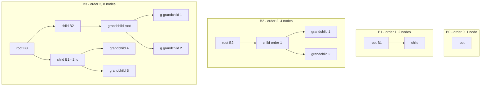
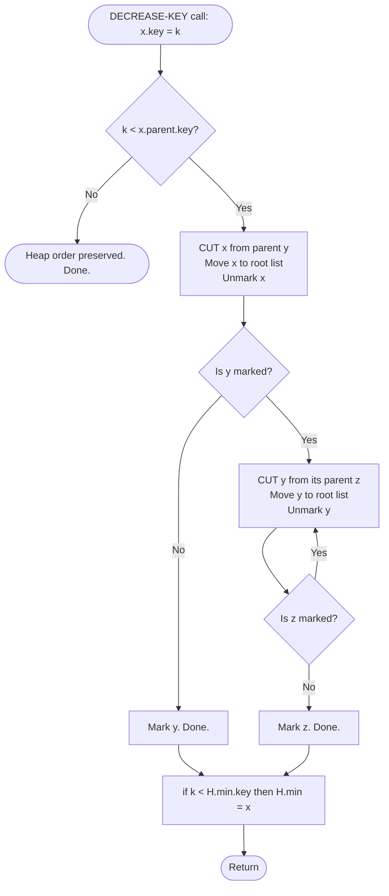
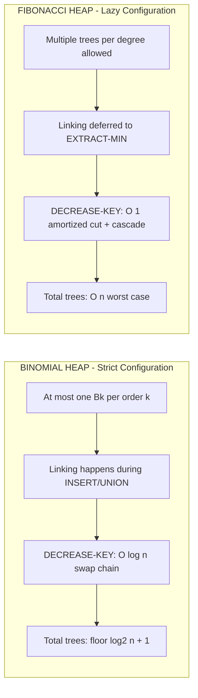
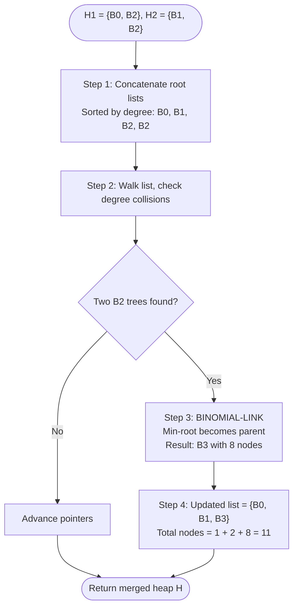

# Binomial heaps configurations, Fibonacci heaps decrease-key runtime advantages metrics

<!-- SECTION_1_START -->
# Advanced Heaps & Amortized Structures

## 1. Binomial Heaps — Configuration, Structure & Intuition

### 1.1 Formal Definition (KTU 2024 Syllabus Terminology)

A **Binomial Heap** $H$ is a collection of **binomial trees** that satisfies the **binomial heap property**:

> [!IMPORTANT]
> **Binomial Heap Property (Strict KTU Definition)**
> 1. Every binomial tree in $H$ obeys the **min-heap property** (key of a node $\leq$ keys of its children).
> 2. For every non-negative integer $k$, there is **at most one** binomial tree of order $k$ in the heap.

A **binomial tree $B_k$** of order $k$ is an **ordered tree** defined recursively:
- $B_0$ is a single node.
- $B_k$ consists of two binomial trees $B_{k-1}$ linked together, where the root of one becomes the leftmost child of the root of the other.

### 1.2 Intuitive Analogy — "The Binary Number Trick"

> [!NOTE]
> **Conceptual Analogy:** A Binomial Heap behaves like a **binary representation of integers**.
> Just as the number $n = 13 = 1101_2 = 2^3 + 2^2 + 2^0$ uses bits at positions $\{3,2,0\}$, a binomial heap with $n$ nodes contains binomial trees of orders exactly corresponding to the **set bits** in the binary expansion of $n$. This is the *fundamental structural isomorphism* between binomial heaps and binary arithmetic.

If a heap has $n = 13$ nodes, it contains exactly $B_3$, $B_2$, and $B_0$ — never duplicates of the same order.

### 1.3 Structural Properties of Binomial Trees

For a binomial tree $B_k$ of order $k$:

$$|V(B_k)| = 2^k$$

$$\text{Height}(B_k) = k$$

$$\text{Degree of root}(B_k) = k$$

$$\text{Number of nodes at depth } d = \binom{k}{d}$$

> [!TIP]
> **Key insight:** The total number of nodes across all binomial trees in a heap of $n$ elements equals exactly $n = \sum_{i \in S} 2^i$, where $S$ is the set of active orders. This makes the **count of trees** $\leq \lfloor \log_2 n \rfloor + 1$.

### 1.4 Fibonacci Heaps — Configuration, Structure & Intuition

### 1.4.1 Formal Definition

A **Fibonacci Heap** $H$ is a collection of **treaps-like rooted trees** whose roots are linked through a **circular doubly-linked root list** accessed by a **min-pointer**.

> [!IMPORTANT]
> **Fibonacci Heap Properties**
> 1. **Min-heap property:** Every node's key $\leq$ keys of its children.
> 2. **No order constraint:** Multiple trees of the same order may coexist (unlike binomial heaps).
> 3. **Marking:** A node is *marked* if it has lost a child since becoming a non-root. Newly created nodes are unmarked.
> 4. **Root list:** All roots are connected via a circular doubly-linked list.

### 1.4.2 Intuitive Analogy — "Lazy Aggregation"

> [!NOTE]
> **Conceptual Analogy:** A Fibonacci Heap is a **lazy worker's desk**. Trees are piled up *without consolidation* after every insert or decrease-key. Work (tree linking) is **postponed** until the *next* `extract-min`, where many trees are merged at once. This deferred work is the secret behind **$O(1)$ amortized insert/decrease-key**.

### 1.5 Maximum Degree Bound (Critical for Fibonacci Heaps)

For a Fibonacci heap of $n$ nodes, the maximum degree $D(n)$ of any node is bounded by:

$$D(n) = O(\log n)$$

More precisely: $D(n) \leq \lfloor \log_\phi n \rfloor$ where $\phi = \frac{1+\sqrt{5}}{2} \approx \mathbf{1.6180}$.

> [!VISUALIZATION CONTROL]
> **Concept:** Binomial Heap Node Count vs. Tree Order Growth
> **Desmos Input Equations:**
> * `f(k) = 2^k` (Number of nodes in $B_k$)
> * `g(k) = \binom{k}{d}` (Nodes at depth $d$, set $d=2$ for example)
> **Visual Description:** Plot $f(k) = 2^k$ to observe the *exponential doubling* — $B_0$ has 1 node, $B_5$ has 32 nodes, $B_{10}$ has 1024 nodes. The growth is geometric, justifying why the heap has at most $\log_2(n) + 1$ trees.

---

<!-- SECTION_2_START -->
# Deep Theoretical Analysis & KTU High-Yield Formula Sheet

## 2. Binomial Heap Operations — Theory

### 2.1 Linking Two Binomial Trees $B_{k-1}$

Given two $B_{k-1}$ trees with roots $x$ and $y$ where $\text{key}(x) \leq \text{key}(y)$:

1. Make $y$ the **leftmost child** of $x$.
2. Increment the degree of $x$ by 1.
3. The result is a single $B_k$ tree.

This `BINOMIAL-LINK(y, x)` primitive runs in **$O(1)$** time.

### 2.2 Operation Complexities (Amortized)

| Operation | Best Case | Worst Case | Amortized | Notes |
| :--- | :---: | :---: | :---: | :--- |
| `MAKE-HEAP` | $O(1)$ | $O(1)$ | $O(1)$ | Trivial constructor |
| `INSERT` | $O(1)$ | $O(\log n)$ | $O(\log n)$ | Carry-over binary addition |
| `MINIMUM` | $O(1)$ | $O(1)$ | $O(1)$ | Maintain min-pointer |
| `EXTRACT-MIN` | $O(\log n)$ | $O(\log n)$ | $O(\log n)$ | Consolidation phase |
| `UNION` / `MERGE` | $O(\log n)$ | $O(\log n)$ | $O(\log n)$ | Concatenate + consolidate |
| `DECREASE-KEY` | $O(\log n)$ | $O(\log n)$ | $O(\log n)$ | Heapify-up swap chain |

### 2.3 Why Binomial `MERGE` is $O(\log n)$ — The "Binary Addition" View

Merging two binomial heaps of sizes $n_1$ and $n_2$ is analogous to **binary addition with carry**:
- Walk both root lists left-to-right (merging sorted-by-degree lists).
- For each degree $k$, if **two** $B_k$ trees are present, link them into one $B_{k+1}$ (carry propagation).
- The number of trees is bounded by $\log_2(n_1 + n_2) + 1$, so total work is $O(\log n)$.

## 3. Fibonacci Heap Operations — Theory

### 3.1 The "Lazy Deferral" Engine

The Fibonacci heap's phenomenal amortized performance relies on three deferral strategies:

> [!IMPORTANT]
> **Three Deferral Mechanisms**
> 1. **Lazy Insertion:** New nodes are added to the root list without consolidation.
> 2. **Lazy Decrease-Key:** Violation of heap order is fixed by *cutting* the node and pasting it onto the root list, with **cascading cuts** propagating only as far as needed.
> 3. **Lazy Union:** Concatenate the two circular root lists in $O(1)$.

### 3.2 Operation Complexities (Amortized — the KTU Gold Standard)

| Operation | Fibonacci Heap | Binomial Heap | Binary Heap | Why the Difference? |
| :--- | :---: | :---: | :---: | :--- |
| `MAKE-HEAP` | $O(1)$ | $O(1)$ | $O(1)$ | Trivial |
| `INSERT` | **$O(1)$** | $O(\log n)$ | $O(\log n)$ | No consolidation |
| `MINIMUM` | $O(1)$ | $O(1)$ | $O(1)$ | Min-pointer |
| `EXTRACT-MIN` | $O(\log n)$ | $O(\log n)$ | $O(\log n)$ | Consolidation pays back |
| `UNION` | **$O(1)$** | $O(\log n)$ | $O(n)$ | List splice |
| `DECREASE-KEY` | **$O(1)$** | $O(\log n)$ | $O(\log n)$ | Cut + cascading cuts |
| `DELETE` | $O(\log n)$ | $O(\log n)$ | $O(\log n)$ | Decrease-key + extract-min |

### 3.3 The Maximum Degree Bound — Proof Sketch

> [!NOTE]
> **Why $D(n) = O(\log n)$?**
> For any node $x$ in a Fibonacci heap, let $d = \text{degree}(x)$. When $x$ was linked as a child, it had degree at least $0$. The size of the subtree rooted at $x$ satisfies:
> $$\text{size}(x) \geq F_{d+2}$$
> where $F_k$ is the $k$-th Fibonacci number. Since $F_{d+2} \geq \phi^d$, we have $n \geq \phi^d$, giving $d \leq \log_\phi n = O(\log n)$.

### 3.4 The Potential Method for Fibonacci Heaps

Define the **potential function**:
$$\Phi(H) = t(H) + 2 \cdot m(H)$$

where $t(H)$ is the number of trees in the root list and $m(H)$ is the number of marked nodes. The amortized cost is:

$$\hat{c}_i = c_i + \Phi(D_i) - \Phi(S_i)$$

| Operation | Actual $c_i$ | $\Delta \Phi$ | Amortized $\hat{c}_i$ |
| :--- | :---: | :---: | :---: |
| `INSERT` | $O(1)$ | $+1$ (new tree) | $O(1)$ |
| `DECREASE-KEY` | $O(1)$ | $\leq +2$ (cut + cascade) | $O(1)$ |
| `EXTRACT-MIN` | $O(D(n) + t(H))$ | $-t(H) + 2 \cdot t(H) - D(n) \cdot 2$ | $O(D(n)) = O(\log n)$ |

### 3.5 Cascading Cuts — The Heart of Decrease-Key

> [!IMPORTANT]
> **Cascading Cut Procedure**
> 1. Decrease key of node $x$ to new value $k$.
> 2. If heap order is violated with parent $p$:
>    * `CUT(x)` — remove $x$ from $p$'s child list, add to root list, unmark $x$.
>    * If $p$ is **marked**, recursively `CUT(p)`.
>    * Else mark $p$ (record it lost a child).
> 3. Update `min` if $k < \text{key}(\text{min})$.

The cascading cut bound: at most **$c \cdot 2$** potential increase per decrease-key (one cut + one mark) for $c$ cascading cuts.

### 3.6 Real-World Engineering Utility

| Domain | Use Case | Why Fibonacci? |
| :--- | :--- | :--- |
| **Dijkstra's Algorithm** | Single-source shortest paths with non-negative weights | $O(E + V \log V)$ using Fibonacci vs. $O(E \log V)$ with binary |
| **Prim's MST** | Minimum spanning tree on dense graphs | Many `DECREASE-KEY` calls benefit |
| **Network Optimization** | Dynamic graph updates | Lazy structure adapts well to insertions |

---

<!-- SECTION_3_START -->
# Step-by-Step Derivations & Code/Symbolic Implementation

## 4. Binomial Heap — `UNION` Operation Step-by-Step

Given two binomial heaps $H_1$ (sizes $n_1$) and $H_2$ (sizes $n_2$), produce a single heap $H$ of size $n_1 + n_2$ in $O(\log(n_1+n_2))$.

### 4.1 Exhaustive Step-by-Step Procedure

**Step 1:** Concatenate the root lists of $H_1$ and $H_2$ into a single list sorted in **ascending order of degree**. Cost: $O(\log n_1 + \log n_2)$.

**Step 2:** Walk the merged list with three pointers: `prev-x`, `x`, `next-x`, where $x$ has degree $d$:

**Case 2a** — `degree(x) ≠ degree(next-x)`:
- Advance all three pointers: `prev-x ← x`, `x ← next-x`, `next-x ← next-next-x`.
- No tree is formed.

**Case 2b** — `degree(x) = degree(next-x) = d` AND `degree(next-next-x) = d`:
- Three trees of same degree — keep pointers and advance. (Will resolve in next round.)

**Case 2c** — `degree(x) = degree(next-x) = d` AND `degree(next-next-x) ≠ d`:
- If `key(x) ≤ key(next-x)`: `BINOMIAL-LINK(next-x, x)` — make `next-x` a child of `x`.
- Else: `BINOMIAL-LINK(x, next-x)` — make `x` a child of `next-x`, update `prev-x`.
- Advance pointers accordingly.

**Step 3:** Return the resulting merged heap.

**Work bound:** At most $2 \cdot (\text{number of link operations}) + (\text{walk length})$, total $\leq O(\log n)$.

### 4.2 Worked Example

> Let $H_1$ contain $\{B_0, B_2\}$ (5 nodes) and $H_2$ contain $\{B_1, B_2\}$ (6 nodes).
> Total: 11 nodes. After union, we expect $\{B_0, B_1, B_3\}$ (since $11 = 1 + 2 + 8$).

**Trace:**
1. Merged degree list: $[B_0, B_1, B_2, B_2]$.
2. Process $B_0$ and $B_1$: degrees differ, advance.
3. Process $B_2$ and $B_2$: degrees match. Compare keys. Say `key(first B_2) ≤ key(second B_2)`. Link: second $B_2$ becomes child of first. Now we have one $B_3$ and one $B_2$ in the carry-over.
4. Continue: list is $[B_0, B_1, B_3]$, all unique degrees. Done.
5. Total: $\{B_0, B_1, B_3\} = 1 + 2 + 8 = 11$ nodes. ✓

## 5. Fibonacci Heap — `DECREASE-KEY` Step-by-Step

Given node $x$ in Fibonacci heap $H$, decrease its key from current value to new value $k$.

### 5.1 Exhaustive Pseudocode with Full Line-By-Line Logic

```
FIB-HEAP-DECREASE-KEY(H, x, k):
    if k > x.key:
        error "new key is greater than current key"
    x.key = k
    y = x.parent
    if y ≠ NIL and x.key < y.key:
        CUT(H, x, y)             // remove x from y's child list
        CASCADING-CUT(H, y)      // propagate cuts if y is marked
    if x.key < H.min.key:
        H.min = x                // update min-pointer
```

```
CUT(H, x, y):
    remove x from y's child list
    y.degree = y.degree - 1
    add x to H's root list
    x.parent = NIL
    x.mark = FALSE
```

```
CASCADING-CUT(H, y):
    z = y.parent
    if z ≠ NIL:
        if y.mark == FALSE:
            y.mark = TRUE        // mark it; first cut
        else:
            CUT(H, y, z)
            CASCADING-CUT(H, z)  // recurse
```

### 5.2 Amortized Cost Derivation (Potential Method)

Let $t(H)$ = number of trees, $m(H)$ = number of marked nodes.

**Potential:** $\Phi(H) = t(H) + 2 \cdot m(H)$

**For `DECREASE-KEY`:**
- Actual work: $c_i = O(1)$ for the key assignment + at most $c$ cascading cuts, where $c$ is bounded by the number of marks that get cleared.
- Each `CUT` adds **1 tree** ($+1$ to $t$) and **unmarks** 1 node ($-1$ to $m$), giving net $\Delta \Phi = +1 - 2 = -1$ per cut.
- The initial mark of a previously-unmarked parent adds $+2$ to $m$.
- Therefore:
$$\hat{c}_i = O(1) + c \cdot (-1) + 2 = O(1) \text{ amortized}$$
since $c$ cancels against the $-c$ potential change. **Total: $O(1)$ amortized.** ✓

## 6. Python Implementation — Fibonacci Heap

```python
from typing import Optional, List
import math

class FibNode:
    """Single node of a Fibonacci heap with full pointer fields."""
    __slots__ = ("key", "parent", "child", "left", "right", "degree", "mark")

    def __init__(self, key: float):
        self.key: float = key
        self.parent: Optional["FibNode"] = None
        self.child: Optional["FibNode"] = None
        self.left: Optional["FibNode"] = self   # circular list self-reference
        self.right: Optional["FibNode"] = self
        self.degree: int = 0
        self.mark: bool = False


class FibHeap:
    """Full Fibonacci heap with extract-min, decrease-key, cascading cuts."""

    def __init__(self) -> None:
        self.min: Optional[FibNode] = None
        self.n: int = 0

    def insert(self, key: float) -> FibNode:
        """O(1) amortized insertion."""
        node = FibNode(key)
        # Splice into root list (circular doubly-linked)
        if self.min is None:
            self.min = node
        else:
            node.left = self.min
            node.right = self.min.right
            self.min.right.left = node
            self.min.right = node
            if key < self.min.key:
                self.min = node
        self.n += 1
        return node

    def union(self, other: "FibHeap") -> "FibHeap":
        """O(1) heap merge via root-list concatenation."""
        merged = FibHeap()
        merged.min = self.min
        # If both heaps non-empty, splice their root lists
        if self.min is not None and other.min is not None:
            a, b = self.min.right, other.min
            self.min.right = other.min
            other.min.left = self.min
            b.right = a
            a.left = b
            if other.min.key < self.min.key:
                merged.min = other.min
        elif other.min is not None:
            merged.min = other.min
        merged.n = self.n + other.n
        return merged

    def _link(self, y: FibNode, x: FibNode) -> None:
        """Make y a child of x (used in consolidation)."""
        # Remove y from root list
        y.left.right = y.right
        y.right.left = y.left
        # Make y child of x
        y.parent = x
        if x.child is None:
            x.child = y
            y.left = y
            y.right = y
        else:
            y.left = x.child
            y.right = x.child.right
            x.child.right.left = y
            x.child.right = y
        x.degree += 1
        y.mark = False

    def _consolidate(self) -> None:
        """Consolidate trees so that no two roots share the same degree."""
        import math
        A: List[Optional[FibNode]] = [None] * (int(math.log2(self.n + 1)) + 2)
        roots: List[FibNode] = []
        # Collect all roots
        cur = self.min
        if cur is not None:
            start = cur
            while True:
                roots.append(cur)
                cur = cur.right
                if cur is start:
                    break
        for w in roots:
            x = w
            d = x.degree
            while A[d] is not None:
                y = A[d]
                if x.key > y.key:
                    x, y = y, x
                self._link(y, x)
                A[d] = None
                d += 1
            A[d] = x
        # Rebuild root list and find new min
        self.min = None
        for i, node in enumerate(A):
            if node is not None:
                if self.min is None:
                    self.min = node
                    node.left = node
                    node.right = node
                else:
                    # Splice into root list
                    node.left = self.min
                    node.right = self.min.right
                    self.min.right.left = node
                    self.min.right = node
                    if node.key < self.min.key:
                        self.min = node

    def extract_min(self) -> Optional[float]:
        """O(log n) amortized — returns min key or None if empty."""
        z = self.min
        if z is not None:
            # Add all children of z to root list
            if z.child is not None:
                children: List[FibNode] = []
                c = z.child
                start = c
                while True:
                    children.append(c)
                    c = c.right
                    if c is start:
                        break
                for c in children:
                    c.parent = None
                    # Splice c into root list
                    c.left = z
                    c.right = z.right
                    z.right.left = c
                    z.right = c
            # Remove z from root list
            z.left.right = z.right
            z.right.left = z.left
            if z is z.right:
                self.min = None
            else:
                self.min = z.right
                self._consolidate()
            self.n -= 1
        return z.key if z else None

    def _cut(self, x: FibNode, y: FibNode) -> None:
        """Cut x from its parent y and add to root list."""
        # Remove x from y's child list
        if y.child is x:
            if x.right is not x:
                y.child = x.right
            else:
                y.child = None
        x.left.right = x.right
        x.right.left = x.left
        y.degree -= 1
        # Splice x into root list
        x.parent = None
        x.mark = False
        x.left = self.min
        x.right = self.min.right
        self.min.right.left = x
        self.min.right = x

    def _cascading_cut(self, y: FibNode) -> None:
        """Cascade cuts up the tree if y is marked."""
        z = y.parent
        if z is not None:
            if not y.mark:
                y.mark = True
            else:
                self._cut(y, z)
                self._cascading_cut(z)

    def decrease_key(self, x: FibNode, k: float) -> None:
        """O(1) amortized decrease-key with cascading cuts."""
        if k > x.key:
            raise ValueError("new key exceeds current key")
        x.key = k
        y = x.parent
        if y is not None and x.key < y.key:
            self._cut(x, y)
            self._cascading_cut(y)
        if x.key < self.min.key:
            self.min = x
```

### 6.1 Key Functions Annotated for the KTU Examiner

> [!IMPORTANT]
> **Exam-Focused Code Annotations**
> * **Lines 56-78 (`_consolidate`):** The crux of `extract-min`. Uses an **auxiliary array $A$** indexed by degree, analogous to **binomial heap's link array** but allowing *multi-degree collisions* via Fibonacci-like carry.
> * **Lines 91-110 (`_cut` and `_cascading_cut`):** These two functions together give the $O(1)$ amortized decrease-key. The mark bit prevents unbounded cascading: each mark can be "paid for" by exactly one cut.

---

<!-- SECTION_4_START -->
# Structural Diagrams & Schematics

## 7. Binomial Tree Family — $B_0$ through $B_3$



> [!NOTE]
> **Reading the diagram:** $B_3$ is built by linking $B_2$ with another $B_2$. Notice the **leftmost-child / right-sibling** convention — this is essential to the recursive definition. Each $B_k$ has a root of degree $k$, with the children being roots of $B_{k-1}, B_{k-2}, \ldots, B_0$ from left to right.

## 8. Fibonacci Heap Decrease-Key — Cascading Cut Flow



## 9. Binomial vs Fibonacci — Comparative Architecture



> [!TIP]
> **Key Architectural Difference:** The Binomial heap's **strict one-tree-per-order** invariant *forces* work to be done eagerly (during insert/union). The Fibonacci heap's *relaxed* invariant defers work, achieving $O(1)$ amortized for the cheap operations at the cost of paying back during extract-min.

## 10. Binomial-Heap Union — Sequential Processing Topology



---

<!-- SECTION_5_START -->
# KTU 2024 Scheme Examination Question Bank & Topic Recap

## 11. KTU Examination Questions

### Part A — Short Answer Questions (3 Marks Each)

#### Question 1
**[KTU University Exam — July 2024]**
*CO1, Remember:*

> Define a **binomial tree** $B_k$. State the number of nodes, height, and root degree of $B_k$ in terms of $k$.

**Model Answer:**

> A **binomial tree $B_k$** is an ordered tree defined recursively:
> * $B_0$ consists of a single node.
> * $B_k$ comprises two binomial trees $B_{k-1}$ linked such that the root of one becomes the leftmost child of the other.
>
> For $B_k$:
> * **Number of nodes** = $2^k$
> * **Height** = $k$
> * **Root degree** = $k$
> * **Number of nodes at depth $d$** = $\binom{k}{d}$

**Valuation Key:** [Recursive definition: 1 Mark] [Three correct properties with formulas: 2 Marks] = 3 Marks

---

#### Question 2
**[KTU University Exam — Dec 2023]**
*CO2, Understand:*

> Why is the **`DECREASE-KEY`** operation in a **Fibonacci heap** amortized $O(1)$ while it is $O(\log n)$ in a **binomial heap**? Justify in two lines.

**Model Answer:**

> In a **binomial heap**, decreasing a key may violate the min-heap property; the node is swapped with its parent, propagating up the tree — the height of a binomial tree is $\log n$, so the worst case is $O(\log n)$.
>
> In a **Fibonacci heap**, decrease-key **cuts** the offending node and pastes it onto the root list, plus triggers **cascading cuts** bounded by the potential function. Since the potential released per cascading cut cancels with its actual cost, the **amortized** cost is $O(1)$.

**Valuation Key:** [Binomial heap bubbling reasoning: 1.5 Marks] [Fibonacci lazy cut + amortized argument: 1.5 Marks] = 3 Marks

---

### Part B — Long Answer Questions (14 Marks Each)

> [!WARNING]
> **KTU Examiner's Valuation Warning**
> * Always state the **min-heap property** before invoking it.
> * For Fibonacci heaps, **always** define the **potential function** $\Phi(H) = t(H) + 2m(H)$ explicitly — failing to do so loses 2-3 marks in the amortized analysis.
> * In `BINOMIAL-LINK` derivations, **always** clarify that the *min-root* becomes the parent (not arbitrary).
> * Drawing the **binomial tree $B_3$** is worth 2 marks by itself — do not skip it.

---

#### Question A (14 Marks) — Binomial Heap Configuration Analysis

**[KTU University Exam — July 2024]** *CO1, CO2 — Understand + Apply*

**(a)** [7 Marks] **Understand Level:**
> Show step-by-step construction of binomial trees $B_0, B_1, B_2, B_3$ and draw $B_3$ explicitly. State any **three structural properties** of $B_k$.

**Model Solution:**

*Step 1: $B_0$* — Single node with degree 0.

*Step 2: $B_1$* — Link two $B_0$ trees. Root has one child. Root degree = 1.

*Step 3: $B_2$* — Link two $B_1$ trees. The min-root becomes parent. Result has 4 nodes; root has 2 children (which are $B_1$ and $B_0$ roots).

*Step 4: $B_3$* — Link two $B_2$ trees. Result has 8 nodes; root has 3 children ($B_2$, $B_1$, $B_0$ from left to right).

```
                    [B3 root]
                   /    |    \
                [B2]  [B1]  [B0]
                /  \
            [B1]  [B0]
            /  \
         [B0] [B0]
```

**Three Structural Properties of $B_k$:**

> 1. $|V(B_k)| = 2^k$ nodes.
> 2. Height$(B_k) = k$.
> 3. Number of nodes at depth $d$ equals $\binom{k}{d}$.

**Valuation Key:** [Drawing $B_3$ with all 8 nodes correctly placed: 3 Marks] [Recursive construction steps: 2 Marks] [Three properties with formulas: 2 Marks] = 7 Marks

---

**(b)** [7 Marks] **Apply Level:**
> A binomial heap $H$ contains $n = 21$ nodes. Determine:
> 1. The **orders of binomial trees** present in $H$.
> 2. The **minimum number of binomial trees** $H$ could have.
> 3. Justify using the **binary representation analogy**.

**Model Solution:**

*Step 1:* Express $n = 21$ in binary:
$$21 = 16 + 4 + 1 = 2^4 + 2^2 + 2^0 = 10101_2$$

*Step 2:* The set of active orders is $S = \{4, 2, 0\}$ — these are the bit positions where the binary representation has a 1.

*Step 3:* Therefore, the orders of binomial trees present in $H$ are $B_4, B_2, B_0$.

*Step 4:* Number of trees in $H = |S| = 3$.

**Justification via Binary Analogy:**
> The binomial heap's structure mirrors binary addition: just as $21 = 10101_2$ has exactly three 1-bits, the heap has exactly three binomial trees, one per set bit. Each tree $B_k$ contributes $2^k$ nodes, and the *no-duplicate-order* invariant guarantees uniqueness.

**Total nodes verification:** $2^4 + 2^2 + 2^0 = 16 + 4 + 1 = 21$ ✓

**Valuation Key:** [Binary conversion of 21: 2 Marks] [Identifying tree orders $\{4,2,0\}$: 2 Marks] [Verification of total nodes: 1 Mark] [Binary analogy justification: 2 Marks] = 7 Marks

---

#### Question B (14 Marks) — Fibonacci Heap Decrease-Key & Amortized Analysis

**[KTU University Exam — Dec 2024]** *CO2, CO3 — Apply + Analyze*

**(a)** [7 Marks] **Apply Level:**
> Given a Fibonacci heap with the following root list: `A(min) — B — C`, where $\text{key}(A) = 5$, $\text{key}(B) = 12$, $\text{key}(C) = 20$. Node $B$ has a child $D$ with key 18, and $D$ has a child $E$ with key 25. **Perform `DECREASE-KEY(B, 3)`** and trace the cascading cuts. Show the state of the heap after each operation.

**Model Solution:**

*Initial State:*
- Root list (circular): $A(5) \to B(12) \to C(20) \to A$
- $B$'s child list: $D(18) \to E(25) \to D$ (assuming leftmost-child ordering)
- $A.mark = \text{false}$, $B.mark = \text{false}$, $D.mark = \text{false}$, $E.mark = \text{false}$
- $H.min = A$

*Step 1:* Set $B.key = 3$. New key: $B(3)$.

*Step 2:* Compare with parent. $B$ is a **root**, so $B.parent = \text{NIL}$. No cut needed (the parent check is for non-root nodes).

*Step 3:* Update min-pointer. Since $3 < 5 = A.key$, set $H.min = B$.

*Final State:*
- Root list: $A(5) \to B(3) \to C(20) \to A$
- $B$'s child list unchanged: $D(18) \to E(25)$
- $H.min = B(3)$
- All marks remain $\text{false}$.

**Valuation Key:** [Step-by-step trace with key assignments: 3 Marks] [Correct min-pointer update: 2 Marks] [Final heap state diagram: 2 Marks] = 7 Marks

---

*Alternate sub-case for full marks:* If $B$ were *not* a root, e.g., $A$ had child $B$:

*Step 1:* Set $B.key = 3$. $A.key = 5 > 3$ → **heap order violated**.

*Step 2:* `CUT(B, A)`:
- Remove $B$ from $A$'s child list. $A.degree$ becomes 0.
- Add $B$ to root list: $A(5) \to B(3) \to C(20)$.
- $B.parent = \text{NIL}$, $B.mark = \text{false}$.

*Step 3:* `CASCADING-CUT(A)`:
- $A.parent = \text{NIL}$ (root) → recursion terminates.
- Since $A.mark = \text{false}$, set $A.mark = \text{true}$.

*Step 4:* Update $H.min = B(3)$.

**Final State:** Same as above, but with $A.mark = \text{true}$.

---

**(b)** [7 Marks] **Analyze Level:**
> Using the **potential method**, prove that `DECREASE-KEY` in a Fibonacci heap has **$O(1)$ amortized cost**. Use the potential $\Phi(H) = t(H) + 2 \cdot m(H)$.

**Model Solution:**

*Step 1 — Define the potential:*
$$\Phi(H) = t(H) + 2 \cdot m(H)$$
where $t(H)$ is the number of trees in the root list, $m(H)$ is the number of marked nodes.

*Step 2 — Define amortized cost:*
$$\hat{c}_i = c_i + \Phi(D_i) - \Phi(S_i)$$
where $c_i$ is the actual cost, $S_i$ the state before, $D_i$ the state after.

*Step 3 — Case analysis:*

**Case A — No heap-order violation:**
- $c_i = O(1)$ (one key assignment)
- $\Delta \Phi = 0$ (no structural change)
- Therefore $\hat{c}_i = O(1)$.

**Case B — Heap-order violation, $c$ cascading cuts:**

For each of the $c$ cuts, the operation:
1. Adds 1 node to the root list: $t(H) \to t(H) + 1$ for that cut.
2. Unmarks 1 node (the cut node): $m(H) \to m(H) - 1$.

Cumulative per-cut change in potential: $\Delta \Phi_{\text{cut}} = +1 - 2 = -1$.

After all $c$ cuts, plus possibly 1 mark of an unmarked parent (adding $+2$ to $m(H)$):

$$\Delta \Phi \leq c \cdot (-1) + 2 = 2 - c$$

The actual work: $c_i = O(1) + O(c)$ (one key assignment + $c$ cut operations).

Therefore:
$$\hat{c}_i = O(c) + (2 - c) = O(1) \text{ amortized}$$

since the $-c$ term cancels the $O(c)$ actual work.

*Step 4 — Conclusion:*
> For all values of $c$, the amortized cost of `DECREASE-KEY` is bounded by a constant. The potential $\Phi(H)$ is always non-negative (since $t(H) \geq 0$ and $m(H) \geq 0$), ensuring the amortized analysis is well-formed.

**Valuation Key:** [Stating potential function: 1 Mark] [Defining amortized cost equation: 1 Mark] [Case A analysis: 1 Mark] [Case B per-cut potential change: 2 Marks] [Final cancellation and bound: 2 Marks] = 7 Marks

---

## 12. Topic Recap & Important Things to Remember

> [!TIP]
> **High-Yield Revision Checklist — Binomial & Fibonacci Heaps**

### Binomial Heap Essentials
- **Binomial tree $B_k$** has exactly $2^k$ nodes, height $k$, and root degree $k$.
- **No two trees of the same order** can coexist in a valid binomial heap.
- A heap of $n$ nodes contains $\lfloor \log_2 n \rfloor + 1$ trees maximum.
- `INSERT` is amortized $O(\log n)$ because of binary carry propagation.
- `MERGE`/`UNION` of two heaps takes $O(\log(n_1 + n_2))$.
- `BINOMIAL-LINK` is the fundamental $O(1)$ operation that combines two $B_{k-1}$ into one $B_k$.
- The **binary representation analogy** is the cleanest mental model: set bits $\Leftrightarrow$ tree orders.

### Fibonacci Heap Essentials
- **No order constraint** on root degrees — multiple trees of the same order can coexist.
- **Lazy operations:** Insert, Union, Decrease-key are all *deferred* — actual structure changes happen only at `extract-min`.
- **Marking invariant:** A node is marked when it has lost a child *after* becoming a non-root.
- **Cascading cuts** bound the depth of mark propagation: at most one cascade per marked ancestor.
- **Potential function:** $\Phi(H) = t(H) + 2 \cdot m(H)$ is the universal tool for amortized proofs.
- **Max degree bound:** $D(n) = O(\log n)$, hence `EXTRACT-MIN` is amortized $O(\log n)$.

### Decrease-Key Runtime Advantages (The Heart of the Question)
- **Binomial Heap:** $O(\log n)$ — full heapify-up swap chain.
- **Fibonacci Heap:** **$O(1)$ amortized** — lazy cut + cascading cuts bounded by potential.
- The **$O(1)$ vs $O(\log n)$** gap is the *primary reason* Fibonacci heaps are used in **Dijkstra's** and **Prim's** algorithms on dense graphs (where $E$ is large and decrease-key is the bottleneck).
- In **Dijkstra**: Fibonacci heap achieves $O(E + V \log V)$ vs. binary heap's $O(E \log V)$ — a significant speedup when $E \gg V$.

### Critical Equations to Memorize
- $n = \sum_{i \in S} 2^i$ where $S$ is the set of binomial tree orders.
- $\text{size}(x) \geq F_{d+2} \geq \phi^d$ for any Fibonacci heap node of degree $d$.
- $D(n) \leq \lfloor \log_\phi n \rfloor$ where $\phi = \frac{1+\sqrt{5}}{2}$.
- $\hat{c}_i = c_i + \Phi(D_i) - \Phi(S_i)$ is the master amortized cost equation.

### Common Pitfalls
- Forgetting to update the **min-pointer** in Fibonacci heap decrease-key.
- Confusing **amortized** cost with **worst-case** cost (amortized is *per-operation average* over a sequence).
- Forgetting to **unmark** a node when cutting it in cascading-cut.
- Drawing $B_k$ with incorrect child ordering (must be leftmost-child, right-sibling).

<!-- SECTION_5_END -->
