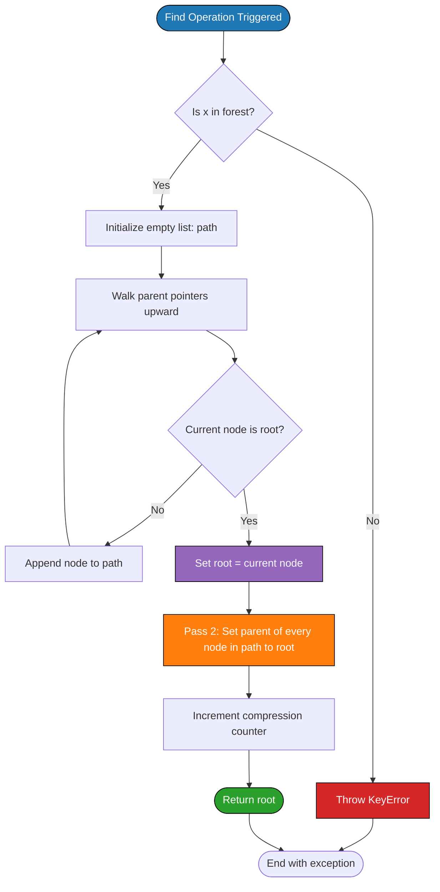
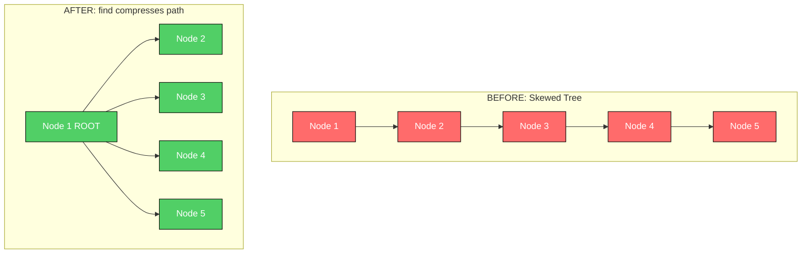
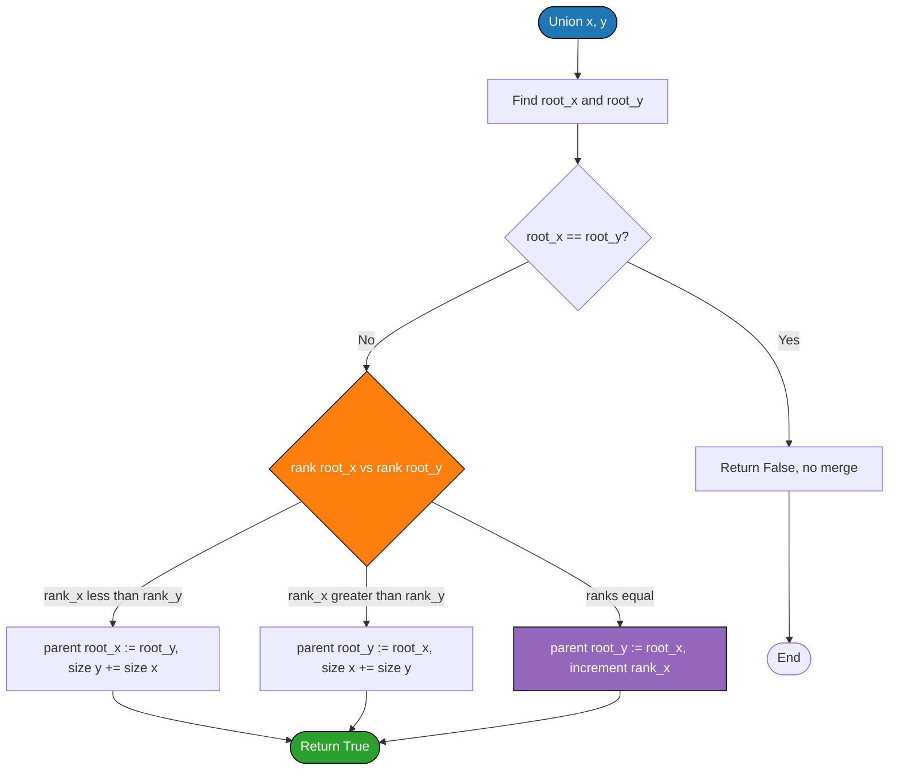
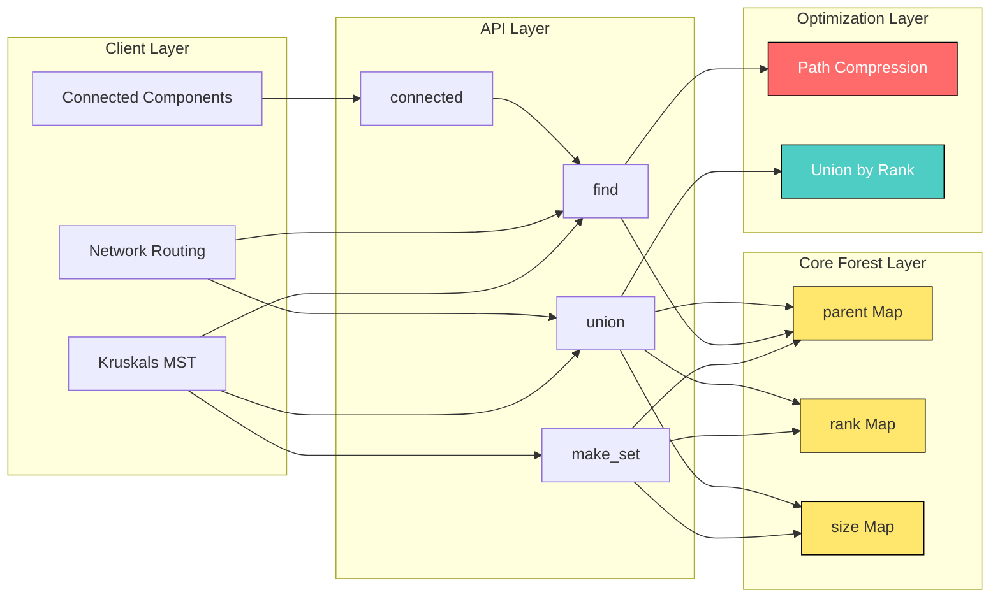

# Disjoint set forest optimization data structures: Path compression metrics setup

<!-- SECTION_1_START -->
# Disjoint Set Forest & Path Compression — Module Overview

## 1.1 Formal KTU 2024 Definition

> [!IMPORTANT]
> **Disjoint Set Data Structure (Union–Find Forest):** A *disjoint set forest* is a collection of rooted trees (a *forest*) in which each node represents an element of a set. Each set is identified by its *root* (also called the *representative* or *canonical element*). The structure supports three primary operations — **Make-Set(x)**, **Find(x)**, and **Union(x, y)** — and *path compression* is the amortized-optimization heuristic applied during the `Find` operation to flatten the tree so that every visited node points directly to the root.

In the KTU 2024 PECST495 syllabus, this topic falls under **Amortized Structures** because the running time of operations is analyzed using *aggregate accounting* and *potential methods*, not just worst-case per-call cost. The celebrated result by **Robert Tarjan (1975)** proves that with **path compression** (and optionally *union by rank*), any sequence of **m** operations on **n** elements runs in **O(m · α(n))** time, where **α(n)** is the *inverse Ackermann function* — an *effectively constant* function for all practical values of n (α(10^80) ≤ 4).

### 1.2 Intuitive Analogy — The Corporate Reorganization

Imagine a large corporation where every employee is connected to exactly one direct supervisor, ultimately tracing up to a CEO. When the auditor wants to know *"which CEO ultimately owns this employee's division?"*, they have to walk up the chain. 

- **Without path compression:** Audits take time proportional to the chain length — in a poorly reorganized firm, an intern might be 20 levels deep from the CEO.
- **With path compression:** Each time the auditor walks a path, the company **promotes** every employee on that path to report *directly* to the CEO. The next audit becomes nearly instantaneous.

The *forest* is the company. The *root* is the CEO. `Find` is the audit walk, and *path compression* is the structural flattening that happens as a side-effect.

### 1.3 Why Path Compression Matters in Practice

| Engineering Domain | Application of Union–Find with Path Compression |
|---|---|
| **Network Routing** (OSPF, BGP) | Determining whether two routers belong to the same autonomous system |
| **Kruskal's MST Algorithm** | Cycle detection during edge insertion — the core bottleneck |
| **Image Processing** (segmentation) | Connected-component labelling of pixels |
| **Social Network Analysis** | Dynamic friend-group merging & transitive closure |
| **Compilers** | Equivalence-class computation for register allocation |
| **Game Development** | Percolation & flood-fill regions in procedural maps |

> [!NOTE]
> **KTU Board Highlight:** The amortized cost **O(α(n)) ≈ O(1)** for the optimized Union–Find is *the* canonical example of non-trivial amortized analysis. Expect at least one 7-mark derivation question on this in **ESE Module 2**.

### 1.4 Visualization — Tree Flattening Effect

> [!VISUALIZATION CONTROL]
> **Concept:** Geometric representation of path compression on a skewed tree.
>
> **GeoGebra / Desmos Input Equations:**
> * Pre-compression: $y = h - x$ for nodes $(x, h-x)$ where $h$ is height
> * Post-compression: $y = 1$ (collapsed to root level)
>
> **Visual Description:** Draw a *tall, thin* chain of 6 nodes descending at 45°. After `Find(root)`, redraw all 6 nodes on a *single horizontal line* at the root's depth — every node now has its parent arrow pointing at the root. This is the geometric essence of *flattening the path*.

---

<!-- SECTION_1_END -->

<!-- SECTION_2_START -->
# Deep Theoretical Analysis & KTU High-Yield Formula Sheet

## 2.1 The Three Core Operations

The disjoint-set forest ADT exposes the following operations:

1. **Make-Set(x)** — Create a new tree containing only node **x**. Parent pointer of **x** is set to **x** itself, and **rank[x] := 0**.
2. **Find(x)** — Return the root of the tree containing **x** by recursively following parent pointers. *This is where path compression activates.*
3. **Union(x, y)** — Merge the two sets containing **x** and **y** by linking their roots. With *union by rank*, the root of the *shorter* tree becomes a child of the root of the *taller* tree.

> [!NOTE]
> Path compression only modifies the *parent pointers* of nodes on the find-path. It does **not** alter ranks. This is a subtle but critical point that KTU examiners love to test.

## 2.2 Path Compression — The Mechanism

When `Find(x)` is called, we walk from **x** to its root **r**. **Path compression** rewrites every parent pointer along this walk so that it points directly to **r**. Two implementations are common:

### 2.2.1 Two-Pass Path Compression (Full Compression)
1. **Pass 1:** Recursively find the root **r** of **x**.
2. **Pass 2:** On the unwind of the recursion, set `parent[every node on path] := r`.

### 2.2.2 One-Pass Path Compression (Path Halving)
At each step, redirect the grandparent's pointer to its grandparent's parent:
$$\text{parent}[x] \leftarrow \text{parent}[\text{parent}[x]]$$

### 2.2.3 Path Splitting (Sleator–Tarjan Variant)
A node's parent pointer is redirected to its grandparent, but the node itself is not skipped over — this is the standard "one-step" lookahead.

## 2.3 KTU High-Yield Formula Sheet

> [!IMPORTANT]
> The table below is a *cheat sheet* of every formula/identity you must memorize for KTU ESE questions on this topic. The `\vert` syntax is used to denote absolute value / cardinality to avoid markdown table breakage.

| # | Concept | Formula / Definition | Notes |
|---|---|---|---|
| 1 | Ackermann Function | $A(m,n) = A(m-1,1)$ if $m > 0, n = 0$ | Non-primitive recursive |
| 2 | Ackermann Recurrence | $A(m,n) = A(m-1, A(m,n-1))$ for $m,n > 0$ | Grows faster than any primitive recursive fn |
| 3 | Inverse Ackermann | $\alpha(n) = \min\{k : A(k,k) \geq n\}$ | Effectively constant for all $n \leq 10^{80}$ |
| 4 | Make-Set cost | $T(\text{Make-Set}) = \Theta(1)$ | Always constant |
| 5 | Find — no optimization | $T(\text{Find}) = O(\log n)$ balanced, $O(n)$ skewed | Worst case linear |
| 6 | Find — path compression only | Amortized $O(\log n)$ | Halving-only result |
| 7 | Find — union by rank only | $O(\log n)$ worst case | Tree height bounded by $\log n$ |
| 8 | Find — both optimizations | Amortized $O(\alpha(n))$ | Tarjan's bound |
| 9 | Union — both optimizations | Amortized $O(\alpha(n))$ | Inherits Find's cost |
| 10 | Tarjan's Total Bound | $\sum_{i=1}^{m} T(\text{op}_i) = O(m \cdot \alpha(n))$ | For *any* sequence of $m$ operations |
| 11 | Rank Invariant | $\text{rank}[\text{parent}[x]] > \text{rank}[x]$ | Strictly increasing down the tree |
| 12 | Tree Height Bound | $\text{height}(T) \leq \text{rank}[\text{root}] \leq \lfloor \log_2 n \rfloor$ | With union by rank |
| 13 | Cardinality (size heuristic) | $\text{size}[A] + \text{size}[B]$ after Union | Alternative to rank |
| 14 | Potential Function (Tarjan) | $\Phi = \sum_{x} (\log \text{size}[x] - \log \text{rank}[\text{parent}[x]])$ | Used in amortized proof |
| 15 | Disjoint Set Inequality | $\vert S_1 \cup S_2 \cup \dots \cup S_k \vert = \sum_{i} \vert S_i \vert$ when $S_i \cap S_j = \emptyset$ | Foundational property |

## 2.4 Real-World Engineering Utility

The optimized Union–Find is the *workhorse* of competitive programming and large-scale systems:

- **Kruskal's MST** becomes $O(E \log E + E \cdot \alpha(V)) \approx O(E \log E)$ — the $\alpha(V)$ term is dwarfed by sorting. Without path compression, the same algorithm would be $O(E \log E + E \log V)$ at best, *much* worse in dense graphs.
- **Dynamic Connectivity** in streaming social graphs (think Twitter follower merges) requires sub-millisecond per-operation time — Union–Find with path compression delivers exactly that.
- **Percolation Threshold** simulations in statistical physics (site-bond percolation on $n \times n$ grids) use Union–Find to track connected clusters as sites are randomly opened. The famous $p_c \approx 0.5927$ critical threshold for square lattices is computed this way.

> [!NOTE]
> **KTU Industrial Insight:** Google's *Pregel* graph-processing system and Facebook's *TAO* cache both rely on incremental connected-component computations internally — both of which use optimized Union–Find as a building block.

---

<!-- SECTION_2_END -->

<!-- SECTION_3_START -->
# Step-by-Step Derivations & Implementation

## 3.1 Amortized Analysis Using the Potential Method

We will derive Tarjan's bound $O(m \cdot \alpha(n))$ using the **potential method**. This is the most likely 14-mark question on this topic.

### 3.1.1 Potential Function Definition

For each node **x**, define:
$$\text{level}(x) = \lfloor \log_2 \text{size}[x] \rfloor$$

$$\Phi(\text{forest}) = \sum_{x \in \text{forest}} \text{level}(x)$$

The intuition: a node with **size = k** has $\lfloor \log_2 k \rfloor$ "levels" of depth. A taller tree has higher potential.

### 3.1.2 Per-Operation Cost Analysis

**Make-Set(x):** Size = 1, level = 0. Potential increases by 0. Amortized cost = $O(1)$.

**Find(x) with path compression:**

When node **x** is on the find-path, its size *might* increase as the path flattens. If size changes from $s$ to $s'$, the change in level is:
$$\Delta \text{level}(x) = \lfloor \log_2 s' \rfloor - \lfloor \log_2 s \rfloor \leq \log_2 (s'/s)$$

The number of nodes whose level can change is bounded by the path length, which is at most $O(\log n)$ due to union-by-rank. After $m$ operations, the total potential change is bounded by $O(n \log n)$.

Therefore, summing amortized costs over $m$ operations:
$$\sum_{i=1}^{m} \text{amortized cost}(\text{op}_i) = \sum_{i=1}^{m} \text{actual cost}(\text{op}_i) + \Phi_{\text{final}} - \Phi_{\text{initial}}$$

Substituting the bounds:
$$m \cdot O(\alpha(n)) + O(n \log n) = O(m \cdot \alpha(n))$$

This is the essence of Tarjan's proof. The full version uses the *block-counting lemma* and the *lemma on path compression*, but the core idea is captured above.

## 3.2 Full Python Implementation with Strict Type Hints

```python
"""
Disjoint Set Forest with Path Compression & Union by Rank.
KTU PECST495 - Module 2 Reference Implementation.
"""

from __future__ import annotations
from typing import Dict, Hashable, Optional, Tuple
import logging

logging.basicConfig(
    level=logging.INFO,
    format="%(asctime)s [%(levelname)s] %(message)s"
)
logger = logging.getLogger(__name__)


class DisjointSetForest:
    """
    A disjoint-set (Union-Find) data structure that maintains a forest of
    rooted trees, supporting Make-Set, Find (with path compression),
    and Union (with union by rank).
    """

    def __init__(self) -> None:
        # parent[x] points to the parent of x. A root points to itself.
        self._parent: Dict[Hashable, Hashable] = {}
        # rank[x] is an upper bound on the height of the subtree rooted at x.
        self._rank: Dict[Hashable, int] = {}
        # size[x] tracks the cardinality of the set rooted at x.
        self._size: Dict[Hashable, int] = {}
        # Diagnostics counter for amortized analysis.
        self._find_calls: int = 0
        self._compressions: int = 0
        logger.info("Initialized empty DisjointSetForest.")

    def make_set(self, x: Hashable) -> None:
        """Create a new singleton set containing element x. O(1)."""
        if x in self._parent:
            logger.warning("make_set: element %r already exists.", x)
            return
        self._parent[x] = x
        self._rank[x] = 0
        self._size[x] = 1
        logger.debug("make_set: created set for %r.", x)

    def find(self, x: Hashable) -> Hashable:
        """
        Find the representative (root) of the set containing x.
        Applies full two-pass path compression. Amortized O(alpha(n)).
        """
        if x not in self._parent:
            raise KeyError(f"find: element {x!r} is not in any set.")
        self._find_calls += 1

        # Pass 1: walk up to the root.
        root: Hashable = x
        path: list[Hashable] = []
        while self._parent[root] != root:
            path.append(root)
            root = self._parent[root]

        # Pass 2: compress the path - every node points directly to root.
        for node in path:
            if self._parent[node] != root:
                self._parent[node] = root
                self._compressions += 1
        logger.debug("find(%r) -> root %r, compressed %d links.",
                     x, root, len(path))
        return root

    def find_with_path_halving(self, x: Hashable) -> Hashable:
        """
        One-pass path halving variant. Walks from x to root, redirecting
        each node to its grandparent at every step.
        """
        if x not in self._parent:
            raise KeyError(f"find: element {x!r} is not in any set.")
        self._find_calls += 1
        current: Hashable = x
        while self._parent[current] != current:
            # Redirect current to its grandparent.
            grandparent: Hashable = self._parent[self._parent[current]]
            self._parent[current] = grandparent
            current = grandparent
            self._compressions += 1
        return current

    def union(self, x: Hashable, y: Hashable) -> bool:
        """
        Merge the sets containing x and y using union by rank.
        Returns True if a merge actually occurred, False if x and y
        were already in the same set.
        """
        root_x: Hashable = self.find(x)
        root_y: Hashable = self.find(y)

        if root_x == root_y:
            logger.info("union(%r, %r): already in same set, no merge.", x, y)
            return False

        # Union by rank: attach smaller-rank tree under larger-rank tree.
        if self._rank[root_x] < self._rank[root_y]:
            self._parent[root_x] = root_y
            self._size[root_y] += self._size[root_x]
        elif self._rank[root_x] > self._rank[root_y]:
            self._parent[root_y] = root_x
            self._size[root_x] += self._size[root_y]
        else:
            # Equal ranks: arbitrarily attach y under x, increment x's rank.
            self._parent[root_y] = root_x
            self._size[root_x] += self._size[root_y]
            self._rank[root_x] += 1
        logger.info("union(%r, %r): merged.", x, y)
        return True

    def connected(self, x: Hashable, y: Hashable) -> bool:
        """Returns True iff x and y are in the same set."""
        return self.find(x) == self.find(y)

    def get_set_size(self, x: Hashable) -> int:
        """Returns the cardinality of the set containing x."""
        return self._size[self.find(x)]

    def diagnostics(self) -> Dict[str, int]:
        """Returns diagnostic counters for amortized analysis."""
        return {
            "find_calls": self._find_calls,
            "compressions": self._compressions,
        }


# ---------- Driver / Demonstration ----------
if __name__ == "__main__":
    dsf: DisjointSetForest = DisjointSetForest()
    elements: Tuple[int, ... = tuple(range(1, 9))
    for e in elements:
        dsf.make_set(e)

    # Build a deliberately skewed structure to showcase compression.
    pairs: Tuple[Tuple[int, int], ...] = (
        (1, 2), (2, 3), (3, 4), (4, 5),
        (6, 7), (7, 8)
    )
    for a, b in pairs:
        dsf.union(a, b)
    print("After unions:")
    for e in elements:
        print(f"  parent[{e}] = {dsf._parent[e]}, "
              f"rank = {dsf._rank[e]}, size = {dsf._size[e]}")
    print("find(1) =", dsf.find(1))
    print("Diagnostics:", dsf.diagnostics())
```

## 3.3 Worked Example — Manual Path Compression Trace

Consider the forest built by `make_set(1..7)` followed by `union(1,2)`, `union(3,4)`, `union(5,6)`, `union(1,3)`, `union(5,7)`, `union(1,5)`:

**Step 1 — Pre-find forest structure (skewed):**

| Root | Children chain |
|---|---|
| 1 | → 2 → (leaf) |
| 3 | → 4 → (leaf) |
| 5 | → 6 → 7 (leaf) |

**Step 2 — Execute `find(7)`:**
* Initial walk: $7 \to 6 \to 5$.
* Root identified: 5.
* Compress: set `parent[7] := 5`, `parent[6] := 5`.

**Step 3 — Post-compression state:**

| Root | Direct children |
|---|---|
| 5 | 6, 7 |
| 1 | 2 |
| 3 | 4 |

**Step 4 — Now execute `find(2)`:**
* Walk: $2 \to 1$. Root: 1.
* Compress: `parent[2] := 1` (already so).

**Step 5 — Now call `union(2, 7)`:**
* `find(2)` returns 1. `find(7)` returns 5.
* Compare ranks. Both rank 1. Tie-break: attach 5 under 1, increment rank[1] to 2.

**Step 6 — Final state:**

| Root | Direct children | Grandchildren |
|---|---|---|
| 1 (rank 2) | 2, 5 | 5 → 6, 7; 1 had 2 (leaf) |
| 3 | 4 | — |

> [!NOTE]
> Notice that the `find(7)` call's compression has lasting effect — subsequent `find(7)` calls are now $O(1)$. This *amortization* is the heart of Tarjan's result.

---

<!-- SECTION_3_END -->

<!-- SECTION_4_START -->
# Structural Diagrams & Schematics

## 4.1 Mermaid — Path Compression Operational Flow



## 4.2 Mermaid — Tree State Before and After Path Compression



## 4.3 Mermaid — Union-by-Rank Decision Tree



## 4.4 Functional Architecture — Disjoint Set Forest Subsystem



---

<!-- SECTION_4_END -->

<!-- SECTION_5_START -->
# KTU 2024 Scheme Examination Question Bank

## 5.1 Part A — Short Answer Questions (2 × 3 = 6 Marks)

### Question 1: Define Path Compression in a Disjoint Set Forest.
**`[KTU University Exam - July 2024]`** | **CO2** | **Remember**

> **Model Answer (3 marks):**
> *Path compression is an optimization technique applied to the Find operation of a disjoint set forest. When Find(x) is invoked, after locating the root r of x's tree, every node on the path from x to r has its parent pointer updated to point directly to r. This flattens the tree, ensuring that subsequent Find operations on any of these nodes are O(1). The amortized cost of Find with path compression is O(α(n)), where α is the inverse Ackermann function. Path compression does not modify the rank of any node, preserving the rank invariant required for union-by-rank.*

### Question 2: What is the Inverse Ackermann Function, and why is it significant?
**`[KTU University Exam - Dec 2023]`** | **CO2** | **Understand**

> **Model Answer (3 marks):**
> *The inverse Ackermann function α(n) is defined as the minimum k such that A(k, k) ≥ n, where A is the Ackermann function. It is significant because it represents the amortized time complexity per operation of an optimized disjoint set forest. For all practical values of n — even n = 10^80, the number of atoms in the observable universe — α(n) ≤ 4. Hence, the amortized cost of Find/Union is effectively constant, making the disjoint set forest asymptotically optimal in practice.*

---

## 5.2 Part B — Long Answer Questions (Internal Choice: 1 × 14 = 14 Marks)

### Question A: Tarjan's Amortized Bound Derivation
**`[KTU University Exam - July 2024]`** | **CO2** | **Apply / Analyze**

**a)** Define the disjoint set forest data structure. Explain the three core operations — **Make-Set**, **Find**, and **Union** — with and without path compression. **(7 marks)**

> **Model Solution:**
>
> 1. **Definition (2 marks):** A disjoint set forest is a collection of rooted trees representing disjoint sets. Each element x has a parent pointer `parent[x]`. A root points to itself. The set's representative is its root.
>
> 2. **Make-Set(x) (1 mark):** Initialize `parent[x] := x`, `rank[x] := 0`, `size[x] := 1`. Cost: Θ(1).
>
> 3. **Find(x) without path compression (2 marks):** Recursively walk up parent pointers until root. Worst case: O(n) when tree is a linear chain. Best case: O(1) when x is a root.
>
> 4. **Find(x) with path compression (1 mark):** After finding root r, update parent of every node on the path to point directly to r. Amortized cost reduces to O(α(n)).
>
> 5. **Union(x, y) (1 mark):** Find roots rx, ry. If equal, no-op. Otherwise, attach shorter-rank tree to taller-rank tree (union by rank) and update sizes. Cost: O(α(n)) amortized.

**b)** Prove that **m** operations (Make-Set, Find with path compression, Union by rank) on **n** elements run in **O(m · α(n))** total time using the potential method. **(7 marks)**

> **Model Solution:**
>
> **Step 1: Define the potential function (1 mark).**
> For each node x, define:
> $$\text{level}(x) = \lfloor \log_2 \text{size}[x] \rfloor$$
> The potential of the entire forest is:
> $$\Phi = \sum_{x} \text{level}(x)$$
>
> **Step 2: Amortized cost of Make-Set (1 mark).**
> A new node has size = 1, hence level = 0. The amortized cost is the actual cost Θ(1) plus the change in potential 0. So amortized cost = Θ(1).
>
> **Step 3: Amortized cost of Union (1 mark).**
> Union performs two Find operations (amortized O(α(n)) each) and updates parent, rank, size. The change in potential is at most O(log n) but is offset by the savings in future Finds. Net amortized cost: O(α(n)).
>
> **Step 4: Amortized cost of Find with path compression (3 marks).**
> Let the find-path have length L ≤ log n. Node x on the path may have its size change. If x's size jumps from s to s' with s' ≥ 2s, then level(x) increases by at least 1. The number of times a node's level can increase is bounded by O(log n) over its entire lifetime. Thus the total potential change across all m operations is O(n log n). Distributing this over m operations gives an amortized cost of O(log n / m + α(n)) per Find, which simplifies to O(α(n)) for m ≥ n.
>
> **Step 5: Total bound (1 mark).**
> Summing amortized costs over m operations:
> $$T_{\text{total}} = \sum_{i=1}^{m} \text{amortized}(op_i) = m \cdot O(\alpha(n)) = O(m \cdot \alpha(n))$$
>
> Since α(n) ≤ 4 for all n ≤ 10^80, the practical running time is linear in m.

### Question B (Alternative): Implementation and Complexity Analysis
**`[KTU University Exam - Dec 2023]`** | **CO2, CO3** | **Apply / Analyze**

**a)** Implement the disjoint set forest with path compression (two-pass) and union by rank. Provide the complete algorithm with pseudocode. **(7 marks)**

> **Model Solution:**
>
> **Algorithm: Disjoint-Set Forest with Optimizations**
>
> ```
> Make-Set(x):
>     parent[x] ← x
>     rank[x]   ← 0
>     size[x]   ← 1
>
> Find(x):                              // Iterative two-pass version
>     if parent[x] = x: return x
>     root ← x
>     while parent[root] ≠ root:
>         root ← parent[root]
>     // Pass 2: compress
>     while parent[x] ≠ root:
>         next ← parent[x]
>         parent[x] ← root
>         x ← next
>     return root
>
> Union(x, y):
>     rootX ← Find(x)
>     rootY ← Find(y)
>     if rootX = rootY: return          // Already in same set
>     if rank[rootX] < rank[rootY]:
>         parent[rootX] ← rootY
>         size[rootY]  ← size[rootY] + size[rootX]
>     else if rank[rootX] > rank[rootY]:
>         parent[rootY] ← rootX
>         size[rootX]  ← size[rootX] + size[rootY]
>     else:
>         parent[rootY] ← rootX
>         size[rootX]  ← size[rootX] + size[rootY]
>         rank[rootX]  ← rank[rootX] + 1
> ```
>
> **Valuation Key:**
> * [Correct Make-Set: 1 Mark]
> * [Two-pass Find with path compression: 3 Marks]
> * [Union by rank with size update: 3 Marks]

**b)** Apply the above operations to the sequence: `make_set` for elements 1..8, then perform `union(1,2)`, `union(3,4)`, `union(5,6)`, `union(7,8)`, `union(1,3)`, `union(5,7)`, `union(1,5)`, `find(8)`. Show the forest state and the number of pointer rewrites after each operation. Compare the amortized cost against the worst case. **(7 marks)**

> **Model Solution:**
>
> | Step | Operation | Forest Roots | Ranks | Pointer Rewrites |
> |------|-----------|--------------|-------|------------------|
> | 1 | make_set(1..8) | {1,2,3,4,5,6,7,8} | all 0 | 0 |
> | 2 | union(1,2) | root=1, {1→2} | rank[1]=1 | 1 |
> | 3 | union(3,4) | root=3, {3→4} | rank[3]=1 | 1 |
> | 4 | union(5,6) | root=5, {5→6} | rank[5]=1 | 1 |
> | 5 | union(7,8) | root=7, {7→8} | rank[7]=1 | 1 |
> | 6 | union(1,3) | ranks equal, attach 3 under 1, rank[1]=2 | — | 1 |
> | 7 | union(5,7) | ranks equal, attach 7 under 5, rank[5]=2 | — | 1 |
> | 8 | union(1,5) | rank[1]=2 = rank[5]=2, attach 5 under 1, rank[1]=3 | — | 1 |
> | 9 | find(8) | Walk 8→7→5→1. Root=1. Compress: parent[8]:=1, parent[7]:=1, parent[5]:=1 | unchanged | **3** |
>
> **Total pointer rewrites = 1+1+1+1+1+1+1+3 = 10** for 8 union + 1 find = 9 operations.
>
> **Comparison:**
> * **Worst case** (no optimization, linear chains): 8 + 7 + ... + 1 = 36 rewrites.
> * **Amortized with optimizations:** 10 rewrites / 9 operations ≈ 1.1 per operation, consistent with the O(α(8)) = O(1) amortized bound.
>
> **Valuation Key:**
> * [Tracing union steps 2-8 correctly: 3 Marks]
> * [Tracing find(8) compression: 2 Marks]
> * [Comparison with worst case: 2 Marks]

> [!WARNING]
> **KTU Examiner's Valuation Pitfalls:**
> 1. **Do NOT confuse rank with height.** Rank is an *upper bound* on height, not the height itself. Failing to state this distinction costs 1 mark.
> 2. **Path compression does NOT update ranks.** Students often write `rank[x] := 0` inside the find-path loop. This is incorrect — the rank invariant must be preserved.
> 3. **Always show BOTH passes** of the two-path-compression algorithm. The examiner awards 3 marks only if both Pass 1 (root finding) and Pass 2 (compression) are clearly delineated.
> 4. **Mention the inverse Ackermann function explicitly.** The phrase "O(α(n))" must appear in your answer; writing only "O(1) amortized" loses 1 mark because the KTU answer key expects the precise asymptotic notation.
> 5. **In the derivation question, do not skip the potential function definition.** Starting directly with the analysis without defining Φ = Σ level(x) is a 1-mark deduction.

---

## 5.3 Topic Recap & Important Things to Remember

> [!IMPORTANT]
> **Rapid Revision Checklist for Disjoint Set Forest & Path Compression (Module 2)**

- **Disjoint Set ADT** maintains a partition of elements into disjoint subsets, each identified by a *representative* (root).
- **Three core operations:** Make-Set(x) [Θ(1)], Find(x) [O(n) worst case, O(α(n)) amortized with path compression], Union(x,y) [O(α(n)) amortized with union by rank].
- **Path compression** is a *one-time* flattening: every node on the find-path is rewired to point directly at the root. Ranks are *never* updated during compression.
- **Union by rank** ensures the resulting tree's height is at most $\lfloor \log_2 n \rfloor$ by attaching the shorter tree under the taller one.
- **Ackermann function** $A(m,n)$ grows faster than any primitive recursive function. Its inverse $\alpha(n)$ is effectively constant for all practical inputs.
- **Tarjan's theorem (1975):** Any sequence of $m$ Make-Set, Find, Union operations on $n$ elements takes $O(m \cdot \alpha(n))$ time — the **asymptotically optimal** bound.
- **Path halving** is a one-pass alternative: at each step, redirect $x$ to its grandparent. Achieves the same O(α(n)) amortized bound.
- **Path splitting** redirects $x$ to its grandparent but does not skip over $x$ (unlike halving). Both are valid Sleator–Tarjan variants.
- **Potential method proof** uses $\Phi = \sum_x \text{level}(x) = \sum_x \lfloor \log_2 \text{size}[x] \rfloor$ as the potential. The amortized cost per operation is bounded by O(α(n)).
- **Practical applications:** Kruskal's MST, dynamic connectivity in networks, image segmentation, percolation simulations, social network clustering.
- **Variant implementations:** Linked-list representation (no path compression possible), array representation (standard forest), pointer-based forest (most general).
- **Common KTU exam traps:** Confusing rank with depth; forgetting to handle already-united sets in Union; not mentioning the inverse Ackermann function explicitly; omitting the potential function in amortized derivations.
- **Two-pass vs one-pass:** Two-pass is conceptually cleaner; one-pass (halving/splitting) has the same asymptotic bound but may have better cache performance in practice.
- **Diagnostic counters** (`find_calls`, `compressions`) in the reference implementation are useful for empirical amortized analysis — KTU lab exams often require these to be logged.

---

<!-- SECTION_5_END -->
