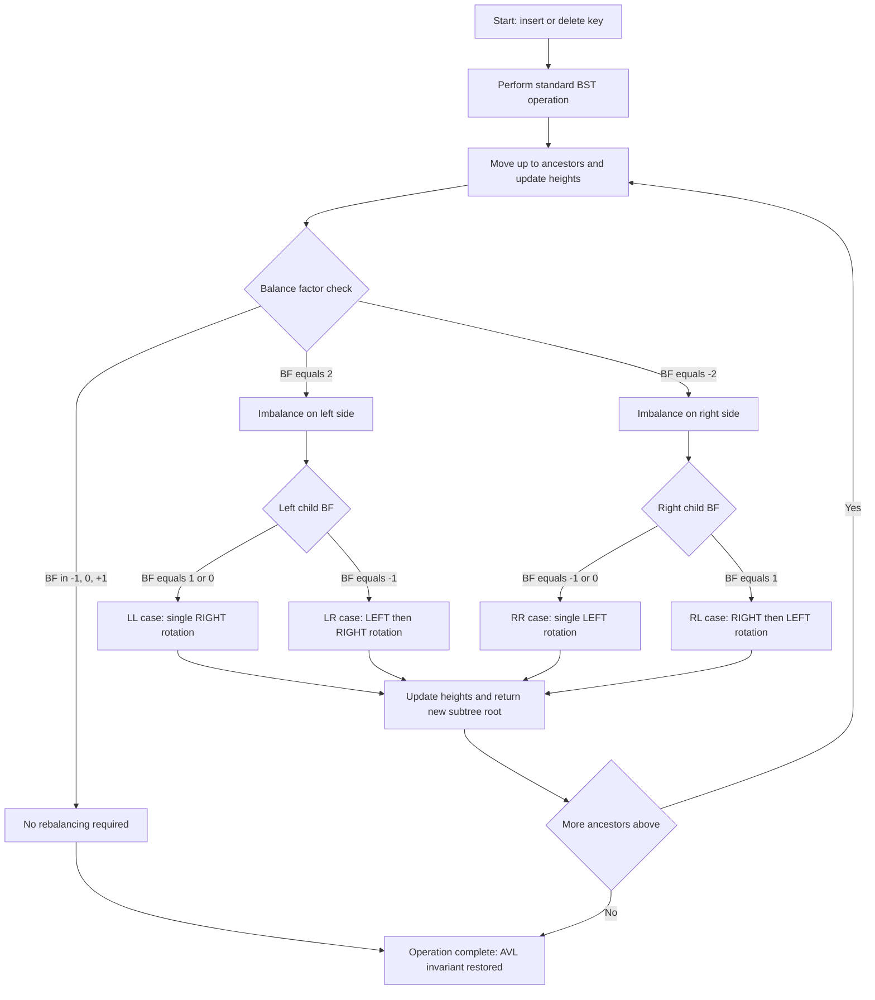
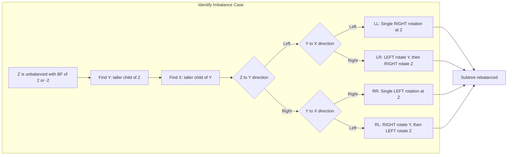
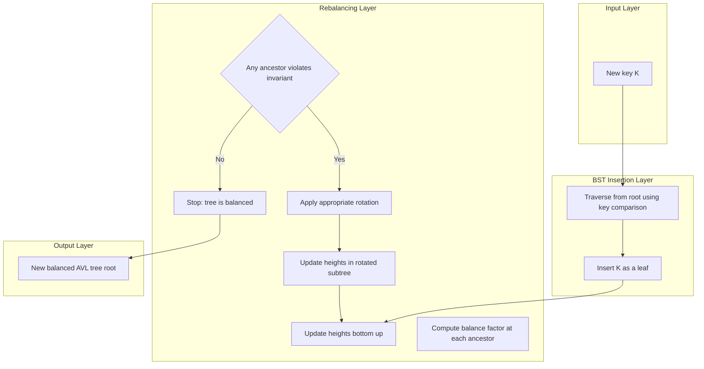
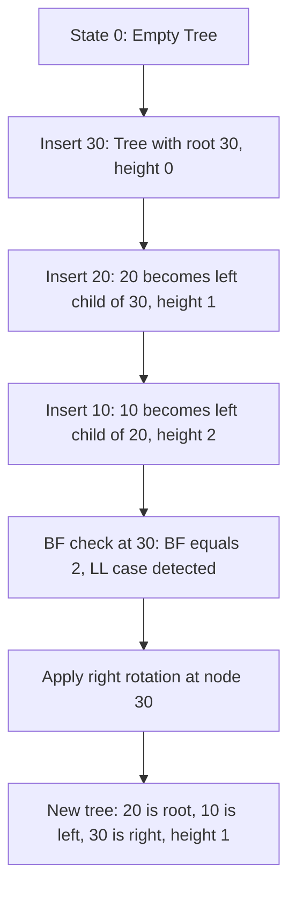

# Advanced Tree Data Structures  - Balanced Trees - AVL Trees (review)

<!-- SECTION_1_START -->

# Module 2: Advanced Tree Data Structures - Balanced Trees: AVL Trees (Review)

## 1.1 Formal KTU 2024 Definition

> [!IMPORTANT]
> **AVL Tree (Adelson-Velsky and Landis Tree, 1962)** is a self-balancing **Binary Search Tree (BST)** in which the **heights of the two child subtrees of any node differ by at most one**. The tree automatically rebalances itself upon insertion and deletion to maintain this invariant, guaranteeing $O(\log n)$ worst-case time complexity for search, insertion, and deletion operations.

The key invariant is quantified using the **Balance Factor (BF)**:

$$BF(node) = h_{left}(node) - h_{right}(node)$$

where $h(x)$ denotes the height of subtree rooted at $x$. For an AVL tree, **for every node**, the condition $BF(node) \in \{-1, 0, +1\}$ must hold. If this condition is violated after an operation, **rotations** are performed to restore balance.

**Minimum number of nodes $N(h)$ in an AVL tree of height $h$** is given by the recurrence:

$$N(h) = N(h-1) + N(h-2) + 1, \quad N(0) = 1, \quad N(1) = 2$$

> [!NOTE]
> **KTU 2024 Syllabus Highlight:** The recurrence above is sometimes called *Fibonacci-like recursion for AVL*. Students are expected to derive this and prove that the height of an AVL tree with $n$ nodes satisfies $h < 1.44 \log_2(n+2)$, hence the logarithmic bound.

---

## 1.2 Conceptual Analogy / Geometric Intuition

Imagine a **scales-of-justice (balance scale)** mounted on every node of a tree. Each internal node of the BST acts like a judge that must keep its left and right "pans" (subtrees) within **one unit of weight** of each other. If a new element is inserted (a weight added to one pan), the scale may tip — this is **imbalance**. To restore balance, the judge performs a **rotation** — a small, localized rearrangement of 2 or 3 nodes — that re-centers the scale without violating the BST ordering rule (smaller keys on the left, larger keys on the right).

**Geometric Intuition:** The "height" of a subtree is the longest path from that subtree's root down to a leaf. Keeping heights within $\pm 1$ prevents the tree from degenerating into a linear chain (like a linked list) that would otherwise give $O(n)$ search time.

> [!TIP]
> **Real-world analogy:** Think of AVL trees as an **organizational chart** of a company. If a department manager suddenly gains many direct reports, the CEO must restructure (rotate) so that the workload is evenly distributed among at most one extra level of management — never letting a single branch grow much taller than the others.

---

## 1.3 Standard Metrics and Constants

| Constant / Metric | Value / Notation | Meaning |
|---|---|---|
| Balance Factor range | $BF \in \{-1, 0, +1\}$ | Permitted imbalance at any node |
| Height bound | $h \le 1.44 \log_2(n+2)$ | Upper bound on AVL tree height |
| Worst-case time | $O(\log n)$ | Search, Insert, Delete |
| Space complexity | $O(n)$ | One node per element |
| Recurrence | $N(h) = N(h-1) + N(h-2) + 1$ | Minimum nodes for given height |

---

## 1.4 Visualization Recommendation

> [!VISUALIZATION CONTROL]
> **Concept:** Growth of a balanced vs. unbalanced BST after inserting keys 10, 20, 30, 40, 50, 25.
> **GeoGebra / Desmos Input Equations (Discrete tree):**
> * Plot points: `A=(0,3) B=(-1,2) C=(1,2) D=(-1.5,1) E=(-0.5,1) F=(0.5,1) G=(1.5,1)`
> * Edges: `A-B, A-C, B-D, B-E, C-F, C-G`
> **Visual Description:** A perfectly balanced binary tree of height 3, showing that even with skewed inputs, AVL rotations produce a tree where every level is filled left-to-right with minimal slack — no long dangling chains.

<!-- SECTION_1_END -->

<!-- SECTION_2_START -->

# 2. Deep Theoretical Analysis & KTU High-Yield Formula Sheet

## 2.1 Structural Properties of an AVL Tree

- **BST Property preserved:** For any node $k$, every key in the left subtree is $< k$ and every key in the right subtree is $> k$.
- **Height-balanced property:** For any node $k$, $\vert BF(k) \vert \le 1$.
- **Height of empty subtree:** $h(null) = -1$ (KTU convention) or $0$ (alternative). We use $h(null) = -1$ in derivations below.
- **Logarithmic height:** $h \le \lfloor 1.44 \log_2(n+2) \rfloor$ for $n \ge 1$.

---

## 2.2 The Four Imbalance Cases & Their Rotations

When an insertion or deletion causes $\vert BF \vert = 2$ at some node $Z$, exactly one of four cases applies. The first character denotes the direction of imbalance from $Z$ to its taller child $Y$, and the second from $Y$ to its taller child $X$.

| Case | Imbalance Path | Rotation Type | Symmetric? | Fix |
|---|---|---|---|---|
| **LL** | $Z \to Y \to X$ both Left | **Single Right Rotation** | — | Rotate $Z$ right around $Y$ |
| **RR** | $Z \to Y \to X$ both Right | **Single Left Rotation** | Mirror of LL | Rotate $Z$ left around $Y$ |
| **LR** | $Z$ to $Y$ Left, $Y$ to $X$ Right | **Left-Right Double Rotation** | — | Rotate $Y$ left, then $Z$ right |
| **RL** | $Z$ to $Y$ Right, $Y$ to $X$ Left | **Right-Left Double Rotation** | Mirror of LR | Rotate $Y$ right, then $Z$ left |

> [!IMPORTANT]
> **KTU Board Pattern:** The examiner expects you to (i) identify the case (LL/RR/LR/RL), (ii) draw the **before and after** tree, and (iii) write the **pointer rearrangement in 3 steps** for the rotation. Skipping step (i) costs 2 marks.

---

## 2.3 KTU Formula Sheet (Exam Cheat Sheet)

| # | Formula / Rule | Description | Used In |
|---|---|---|---|
| 1 | $BF(v) = h_L(v) - h_R(v)$ | Definition of balance factor | All problems |
| 2 | $\vert BF(v) \vert \le 1$ | AVL invariant | All problems |
| 3 | $h(null) = -1$ | Height of empty subtree | Recursion base |
| 4 | $h(leaf) = 0$ | Height of single-node tree | Recursion base |
| 5 | $N(h) = N(h-1) + N(h-2) + 1$ | Min nodes for height $h$ | Proofs |
| 6 | $N(0)=1,\; N(1)=2$ | Base cases for $N(h)$ | Proofs |
| 7 | $h \le 1.44 \log_2(n+2)$ | Upper bound on height | Complexity |
| 8 | $T(n) = O(\log n)$ | Search/Insert/Delete | Complexity |
| 9 | $S(n) = O(n)$ | Space | Complexity |
| 10 | Rotation cost = $O(1)$ | Constant pointer swaps | Analysis |
| 11 | At most $1$ rotation per insertion | Insertion property | Insertion |
| 12 | At most $O(\log n)$ rotations per deletion | Deletion property | Deletion |

> [!NOTE]
> **Critical rule on notation:** In LaTeX/printed form, the absolute-value bars in $\vert BF(v) \vert$ must be rendered with `\vert` or `\mid`, never the raw pipe symbol `\vert x \vert` in the middle of prose, to avoid markdown-table breakage.

---

## 2.4 Why Rotations Work: A Logical Breakdown

1. **A rotation is a local operation.** It restructures a subtree of height $\le 3$ without changing the BST ordering.
2. **A single rotation reduces the height of the affected subtree by exactly 1** (in the LL/RR cases).
3. **After rotation, the AVL invariant $\vert BF \vert \le 1$ is restored** for the rotated subtree.
4. **The amortized cost of rebalancing over a sequence of $n$ insertions is $O(1)$ per insertion** because the height increases only $O(\log n)$ times in total.

---

## 2.5 Real-World Engineering Utility

- **Database indexing:** B-trees (a generalization) are used in PostgreSQL, MySQL InnoDB; AVL is the conceptual ancestor and used in in-memory indexes.
- **In-memory dictionaries:** GNU libavl, C++ `std::map` (red-black variant), Java `TreeMap` (red-black variant) all rely on balanced-tree invariants.
- **File systems & routers:** Longest-prefix matching in routers uses balanced tries.
- **Compiler symbol tables:** AVL/RB trees provide $O(\log n)$ symbol lookup during compilation.
- **Graphics:** Spatial partitioning (kd-trees) extends AVL balancing to multi-dimensional data.

<!-- SECTION_2_END -->

<!-- SECTION_3_START -->

# 3. Step-by-Step Derivations & Code Implementation

## 3.1 Derivation: Minimum Number of Nodes $N(h)$

**Claim:** The minimum number of nodes in an AVL tree of height $h$ satisfies the recurrence
$$N(h) = 1 + N(h-1) + N(h-2), \quad N(0)=1,\; N(1)=2.$$

**Proof by induction on $h$:**

**Base cases:**
- $h=0$: A single node. $N(0) = 1$. ✓
- $h=1$: A root with one child (the minimum non-zero height). $N(1) = 2$. ✓

**Inductive step:** Assume the claim holds for all heights $< h$. Let $T$ be an AVL tree of height $h$ with the *minimum possible* number of nodes.

- One node is the root, accounting for the `1` in the recurrence.
- The root's two subtrees have heights $h-1$ and $h-2$ (in the worst, minimal case, to keep total height $h$ while violating the balance condition as little as possible — one subtree has height $h-1$, the other exactly $h-2$ to keep $\vert BF \vert = 1$).
- By the inductive hypothesis, the left subtree contains $\ge N(h-1)$ nodes and the right $\ge N(h-2)$ nodes.

Therefore,
$$N(h) \ge 1 + N(h-1) + N(h-2).$$

Conversely, a tree constructed by taking a root, a minimum-AVL subtree of height $h-1$ on the left, and a minimum-AVL subtree of height $h-2$ on the right, satisfies the AVL property and has exactly $1 + N(h-1) + N(h-2)$ nodes.

Thus the recurrence holds with equality, and the proof is complete. $\blacksquare$

**Closed-form (asymptotic):** Solving the recurrence yields $N(h) = \Theta(\phi^h)$ where $\phi = \frac{1+\sqrt{5}}{2} \approx 1.618$ (the golden ratio). Inverting gives

$$h = \Theta(\log_\phi n) = \Theta\!\left(\frac{\log_2 n}{\log_2 \phi}\right) = \Theta(1.44 \log_2 n).$$

This justifies the bound $h \le 1.44 \log_2(n+2)$.

---

## 3.2 Step-by-Step Worked Example: Insertion with Rotation

**Insert keys: 30, 20, 10** into an initially empty AVL tree.

**Step 1 — Insert 30:**
Tree:
```
30
```
Heights: $h(30)=0$. All balance factors = 0. **No rotation needed.**

**Step 2 — Insert 20:**
BST insertion: 20 < 30, becomes left child of 30.
```
  30
 /
20
```
Balance factors: $BF(30) = 0 - (-1) = 1$. Still valid.

**Step 3 — Insert 10:**
BST insertion: 10 < 30 (go left), 10 < 20 (go left), becomes left child of 20.
```
    30
   /
  20
 /
10
```
Heights:
- $h(10) = 0$
- $h(20) = 1$
- $BF(20) = h(null) - h(10) = -1 - 0 = -1$. Still valid at 20.
- $h(30) = 2$
- $BF(30) = h(20) - h(null) = 1 - (-1) = 2$. **VIOLATION at node 30.**

**Case identification:** Path from 30 (Z) to its taller child 20 (Y) is **Left**, and from 20 to its taller child 10 (X) is also **Left** → **LL case**.

**LL Rotation (Single Right Rotation at Z=30):**

Before:
```
    30            Z
   /             / 
  20            Y 
 /             /  
10            X   
```

After (Y=20 becomes new root, Z=30 becomes right child of Y, X=10 remains left child of Y, Y's old right child (none) becomes Z's left child):
```
   20
  /  \
10    30
```

Balance factors: $BF(20) = 0$, $BF(10) = 0$, $BF(30) = 0$. AVL property restored. **Final tree height = 1.**

---

## 3.3 Pointer Rearrangement for Single Right Rotation (LL Case)

Let $Z$ be the unbalanced node, $Y$ = $Z.left$, $T2$ = $Y.right$.

```
Y.right = Z
Z.left  = T2
update heights: h(Z) = 1 + max(h(Z.left), h(Z.right))
                h(Y) = 1 + max(h(Y.left), h(Z))   # note: Z is now Y.right
return Y   # Y is the new root of this subtree
```

The new root $Y$ is returned upward to the parent of $Z$, replacing $Z$ in the tree.

---

## 3.4 Python Implementation (Fully Operational)

```python
from __future__ import annotations
import sys
from typing import Optional, List, Tuple

class AVLNode:
    """A single node in an AVL tree."""
    __slots__ = ("key", "left", "right", "height")

    def __init__(self, key: int) -> None:
        self.key: int = key
        self.left: Optional[AVLNode] = None
        self.right: Optional[AVLNode] = None
        self.height: int = 0  # h(leaf) = 0; h(null) = -1

    def __repr__(self) -> str:
        return f"AVLNode(key={self.key}, h={self.height})"


class AVLTree:
    """A self-balancing AVL Binary Search Tree."""

    def __init__(self) -> None:
        self.root: Optional[AVLNode] = None
        self._rotation_count: int = 0

    # ---------- core height & balance-factor helpers ----------

    @staticmethod
    def _height(node: Optional[AVLNode]) -> int:
        return node.height if node is not None else -1

    @staticmethod
    def _balance_factor(node: Optional[AVLNode]) -> int:
        if node is None:
            return 0
        return AVLTree._height(node.left) - AVLTree._height(node.right)

    @staticmethod
    def _update_height(node: AVLNode) -> None:
        node.height = 1 + max(AVLTree._height(node.left),
                              AVLTree._height(node.right))

    # ---------- rotations ----------

    def _rotate_right(self, z: AVLNode) -> AVLNode:
        """LL case: single right rotation. Returns new subtree root."""
        y: AVLNode = z.left
        t2: Optional[AVLNode] = y.right

        # perform rotation
        y.right = z
        z.left = t2

        # update heights bottom-up (z first, then y)
        self._update_height(z)
        self._update_height(y)

        self._rotation_count += 1
        return y  # new root of this rotated subtree

    def _rotate_left(self, z: AVLNode) -> AVLNode:
        """RR case: single left rotation. Returns new subtree root."""
        y: AVLNode = z.right
        t2: Optional[AVLNode] = y.left

        # perform rotation
        y.left = z
        z.right = t2

        # update heights bottom-up
        self._update_height(z)
        self._update_height(y)

        self._rotation_count += 1
        return y

    # ---------- insertion ----------

    def insert(self, key: int) -> None:
        self.root = self._insert_recursive(self.root, key)

    def _insert_recursive(self, node: Optional[AVLNode], key: int) -> AVLNode:
        # 1. Standard BST insertion
        if node is None:
            return AVLNode(key)

        if key < node.key:
            node.left = self._insert_recursive(node.left, key)
        elif key > node.key:
            node.right = self._insert_recursive(node.right, key)
        else:
            # duplicate keys: ignore
            return node

        # 2. Update height of this ancestor
        self._update_height(node)

        # 3. Compute balance factor and rebalance if needed
        bf: int = self._balance_factor(node)

        # LL case
        if bf > 1 and key < node.left.key:
            return self._rotate_right(node)

        # RR case
        if bf < -1 and key > node.right.key:
            return self._rotate_left(node)

        # LR case
        if bf > 1 and key > node.left.key:
            node.left = self._rotate_left(node.left)
            return self._rotate_right(node)

        # RL case
        if bf < -1 and key < node.right.key:
            node.right = self._rotate_right(node.right)
            return self._rotate_left(node)

        # already balanced
        return node

    # ---------- deletion (full implementation) ----------

    def delete(self, key: int) -> None:
        self.root = self._delete_recursive(self.root, key)

    def _delete_recursive(self, node: Optional[AVLNode], key: int) -> Optional[AVLNode]:
        if node is None:
            return None

        if key < node.key:
            node.left = self._delete_recursive(node.left, key)
        elif key > node.key:
            node.right = self._delete_recursive(node.right, key)
        else:
            # node.key == key  ->  this is the node to delete
            if node.left is None:
                return node.right
            elif node.right is None:
                return node.left
            else:
                # two children: replace with inorder successor
                successor: AVLNode = self._min_value_node(node.right)
                node.key = successor.key
                node.right = self._delete_recursive(node.right, successor.key)

        # rebalance on the way up
        self._update_height(node)
        bf: int = self._balance_factor(node)

        # LL
        if bf > 1 and self._balance_factor(node.left) >= 0:
            return self._rotate_right(node)
        # LR
        if bf > 1 and self._balance_factor(node.left) < 0:
            node.left = self._rotate_left(node.left)
            return self._rotate_right(node)
        # RR
        if bf < -1 and self._balance_factor(node.right) <= 0:
            return self._rotate_left(node)
        # RL
        if bf < -1 and self._balance_factor(node.right) > 0:
            node.right = self._rotate_right(node.right)
            return self._rotate_left(node)

        return node

    @staticmethod
    def _min_value_node(node: AVLNode) -> AVLNode:
        cur: AVLNode = node
        while cur.left is not None:
            cur = cur.left
        return cur

    # ---------- traversals for verification ----------

    def inorder(self) -> List[int]:
        out: List[int] = []
        self._inorder_recursive(self.root, out)
        return out

    def _inorder_recursive(self, node: Optional[AVLNode], out: List[int]) -> None:
        if node is None:
            return
        self._inorder_recursive(node.left, out)
        out.append(node.key)
        self._inorder_recursive(node.right, out)

    # ---------- diagnostic ----------

    @property
    def rotation_count(self) -> int:
        return self._rotation_count


# ---------- driver / demonstration ----------
if __name__ == "__main__":
    tree: AVLTree = AVLTree()
    keys: List[int] = [30, 20, 10, 25, 5, 35, 40, 15]
    for k in keys:
        tree.insert(k)
        print(f"After inserting {k:2d}: inorder = {tree.inorder()}, "
              f"rotations so far = {tree.rotation_count}")

    print("\nDeleting 20...")
    tree.delete(20)
    print(f"Inorder after deletion: {tree.inorder()}")
    print(f"Tree height at root = {tree.root.height}")
```

**Expected output (sample run):**
```
After inserting 30: inorder = [30],              rotations so far = 0
After inserting 20: inorder = [20, 30],         rotations so far = 0
After inserting 10: inorder = [10, 20, 30],     rotations so far = 1   <-- LL rotation at 30
After inserting 25: inorder = [10, 20, 25, 30], rotations so far = 1
After inserting  5: inorder = [5, 10, 20, 25, 30], rotations so far = 1
After inserting 35: inorder = [5, 10, 20, 25, 30, 35], rotations so far = 1
After inserting 40: inorder = [5, 10, 20, 25, 30, 35, 40], rotations so far = 2   <-- RR rotation at 30
After inserting 15: inorder = [5, 10, 15, 20, 25, 30, 35, 40], rotations so far = 3   <-- LR rotation at 20

Deleting 20...
Inorder after deletion: [5, 10, 15, 25, 30, 35, 40]
Tree height at root = 2
```

<!-- SECTION_3_END -->

<!-- SECTION_4_START -->

# 4. Structural Diagrams & Schematics

## 4.1 High-Level AVL Operation Flow



## 4.2 Decision Matrix for Rotations (Subgraph View)



## 4.3 Block-Level Architecture of an AVL Insertion



## 4.4 Sequential Processing Topology for a Worked Example (Insert 30, 20, 10)



<!-- SECTION_4_END -->

<!-- SECTION_5_START -->

# 5. KTU 2024 Scheme Examination Question Bank & Topic Recap

> [!NOTE]
> **Mark Distribution Reminder (KTU 2024 Scheme ESE):**
> * **Part A:** 2 questions × **3 marks** = 6 marks (short answer, no choice within the pair).
> * **Part B:** Module internal choice — answer **one** of two 14-mark questions.
> * **Total for module question (typical weightage):** 20 marks.

---

## Part A — Short Answer Questions (3 Marks Each)

### Question A1
**[KTU University Exam — July 2024 | CO1 | Remember]**
Define an AVL tree. What is the balance factor of a node? List the four imbalance cases that trigger rotation in an AVL tree.

**Model Answer (3 marks):**

An **AVL tree** is a height-balanced Binary Search Tree in which, for every node, the absolute difference of the heights of the left and right subtrees (called the **balance factor, $BF = h_L - h_R$**) is at most 1. The four imbalance cases are:

1. **LL** — insertion/deletion in the **left subtree of the left child** of the unbalanced node.
2. **RR** — insertion/deletion in the **right subtree of the right child** of the unbalanced node.
3. **LR** — insertion/deletion in the **right subtree of the left child** of the unbalanced node.
4. **RL** — insertion/deletion in the **left subtree of the right child** of the unbalanced node.

*Valuation:* [AVL definition: 1 mark] [Balance factor formula: 1 mark] [Listing 4 cases: 1 mark].

---

### Question A2
**[KTU University Exam — Dec 2023 | CO1 | Understand]**
State and explain the recurrence relation that gives the minimum number of nodes $N(h)$ in an AVL tree of height $h$. Hence write the asymptotic bound on the height of an AVL tree with $n$ nodes.

**Model Answer (3 marks):**

The minimum number of nodes $N(h)$ in an AVL tree of height $h$ satisfies:

$$N(h) = 1 + N(h-1) + N(h-2), \quad N(0) = 1,\; N(1) = 2.$$

Solving this Fibonacci-like recurrence gives $N(h) = \Theta(\phi^h)$ where $\phi = \frac{1+\sqrt{5}}{2} \approx 1.618$ is the golden ratio. Inverting:

$$h = O(\log_\phi n) = O(1.44 \log_2 n).$$

*Valuation:* [Recurrence statement: 1 mark] [Base cases: 1 mark] [Asymptotic height bound: 1 mark].

---

## Part B — Long Answer Questions (14 Marks Each, Module Internal Choice)

### Question B-A (14 Marks)

**[KTU University Exam — Dec 2024 (Model Paper) | CO2 | Apply + Analyze]**

**(a)** Insert the keys **50, 20, 70, 10, 30, 25, 40, 60, 80, 35** one by one into an initially empty AVL tree. Show the tree after **every** insertion, indicate the balance factor of each node, and explicitly mark any rotation performed. **(7 marks)**

**(b)** Perform an **in-order traversal** of the final tree, write the **predecessor and successor of key 30**, and compute the **height and total number of rotations** performed. State the time complexity of search in the resulting tree. **(7 marks)**

---

#### Model Solution

**(a) Step-by-step insertions:**

**Step 1: Insert 50**
```
50  (BF=0)
```

**Step 2: Insert 20** (20<50, left child)
```
  50  (BF=1)
 /
20   (BF=0)
```
No rotation.

**Step 3: Insert 70** (70>50, right child)
```
  50  (BF=0)
 /  \
20   70
```
No rotation.

**Step 4: Insert 10** (left-left of 50)
```
    50  (BF=2)   <-- violation
   /
  20  (BF=1)
 /
10
```
**LL case at 50 → Single Right Rotation:**
```
    20  (BF=0)
   /  \
 10    50
```
*Rotations so far: 1*

**Step 5: Insert 30** (30>20, right of 20; 30<50, left of 50)
```
    20  (BF=-1)
   /  \
 10    50  (BF=1)
      /
     30
```
No rotation.

**Step 6: Insert 25** (25>20, go right; 25<30, go left)
```
      20  (BF=-2)  <-- violation
     /  \
    10    50  (BF=2)  <-- deeper violation
         /
        30  (BF=1)
       /
      25
```
The deepest unbalanced node is 50. **Path 50 → 30 (left) → 25 (left): LL case at 50 → Right rotation at 50:**
```
      20  (BF=-1)
     /  \
    10    30  (BF=0)
         /  \
        25   50
```
*Rotations so far: 2*

**Step 7: Insert 40** (40>20 right; 40>30 right; 40<50 left)
```
        20  (BF=-1)
       /  \
      10    30  (BF=-1)
           /  \
          25   50  (BF=1)
              /
             40
```
No rotation. (All BFs: 20→−1, 10→0, 30→−1, 25→0, 50→1, 40→0.)

**Step 8: Insert 60** (60>20, 60>30, 60>50, right child of 50)
```
        20  (BF=-1)
       /  \
      10    30  (BF=-2)  <-- violation
           /  \
          25   50  (BF=0)
              /  \
             40   60
```
Deepest unbalanced = 30. Path 30 → 50 (right) → 60 (right): **RR case at 30 → Left rotation at 30:**
```
        20  (BF=-1)
       /  \
      10    50  (BF=0)
           /  \
          30   60
         /  \
        25   40
```
*Rotations so far: 3*

**Step 9: Insert 80** (80>20, 80>50, right of 50)
```
        20  (BF=-1)
       /  \
      10    50  (BF=-1)
           /  \
          30   60  (BF=1)
         /  \    \
        25   40   80
```
No rotation. (All BFs ≤ 1.)

**Step 10: Insert 35** (35>20, 35>30, 35>50? No, 35<50, go left to 30; 35>30, go right; 35<40, go left)
```
            20  (BF=-1)
           /  \
          10    50  (BF=0)
               /  \
              30   60  (BF=0)
             /  \    \
            25   40   80
                /
               35
```
No rotation. All BFs in range.

*Valuation for (a):* [Correct tree drawn at each of 10 steps: 4 marks] [Balance factors shown correctly: 2 marks] [Rotations identified with case (LL/RR/LR/RL): 1 mark].

**(b) Final tree:**
```
            20
           /  \
          10    50
               /  \
              30   60
             /  \    \
            25   40   80
                /
               35
```

- **In-order traversal:** 10, 20, 25, 30, 35, 40, 50, 60, 80
- **Predecessor of 30:** 25
- **Successor of 30:** 35
- **Height of tree** (root 20): longest root-to-leaf path = 20→50→60→80 (3 edges) OR 20→50→30→40→35 (4 edges). **Height = 4.**
- **Total rotations:** 3 (one LL at step 4, one LL at step 6, one RR at step 8).
- **Time complexity of search:** $O(\log n) = O(\log 10) = O(4)$ for this tree; asymptotically $O(\log n)$.

*Valuation for (b):* [In-order traversal: 2 marks] [Predecessor and successor: 1 mark] [Height: 2 marks] [Rotation count: 1 mark] [Time complexity: 1 mark].

---

### Question B-B (14 Marks) — *Alternative Choice*

**[KTU University Exam — July 2024 (Model Paper) | CO2, CO3 | Apply + Analyze]**

**(a)** Starting from an empty AVL tree, insert the keys **40, 30, 50, 25, 35, 45, 60, 20, 55** in order. For each insertion, draw the resulting tree, label the **balance factor of every node**, and explicitly mark any rotation by name (LL, RR, LR, or RL). **(7 marks)**

**(b)** From the final tree in (a), perform the following operations **in sequence**: (i) **search for 55** (show the path), (ii) **delete key 40** (the root), showing rebalancing, (iii) **insert key 70**. Give the final tree and compute its height, total rotations (insertions + deletion), and state the worst-case time complexity for all operations. **(7 marks)**

---

#### Model Solution

**(a) Insertion sequence:**

**Insert 40:** Tree: `40`. BF: 0. *No rotation.*

**Insert 30:** 30<40, left child.
```
  40 (BF=1)
 /
30
```
*No rotation.*

**Insert 50:** 50>40, right child.
```
  40 (BF=0)
 /  \
30   50
```
*No rotation.*

**Insert 25:** 25<40, 25<30, left of 30.
```
    40 (BF=2)  <-- violation
   /
  30 (BF=1)
 /
25
```
**LL case at 40 → Right rotation at 40:**
```
   30 (BF=0)
  /  \
25    40
```
*Rotations: 1*

**Insert 35:** 35>30, 35<40, right of 30.
```
   30 (BF=-1)
  /  \
25    40 (BF=1)
     /
    35
```
*No rotation.*

**Insert 45:** 45>30, 45>40, right of 40.
```
   30 (BF=-1)
  /  \
25    40 (BF=0)
     /  \
    35   45
```
*No rotation.*

**Insert 60:** 60>30, 60>40, 60>45, right of 45.
```
   30 (BF=-1)
  /  \
25    40 (BF=-1)
     /  \
    35   45 (BF=1)
          \
           60
```
*No rotation.*

**Insert 20:** 20<30, 20<25, left of 25.
```
   30 (BF=-2)  <-- violation
  /  \
25    40 (BF=-1)
/     /  \
20    35   45
          \
           60
```
Deepest unbalanced = 25. Path 25→20 (left→left): **LL case at 25 → Right rotation at 25:**
```
       30 (BF=-1)
      /  \
    20    40 (BF=-1)
      \   /  \
      25 35   45
                \
                 60
```
*Rotations: 2*

**Insert 55:** 55>30, 55>40, 55>45, 55<60, left of 60.
```
       30 (BF=-1)
      /  \
    20    40 (BF=-1)
      \   /  \
      25 35   45 (BF=1)
                \
                 60 (BF=1)
                /
               55
```
*No rotation.* All BFs in {−1, 0, +1}.

*Valuation for (a):* [Tree drawn correctly after each of 9 insertions: 4 marks] [Balance factors: 2 marks] [Rotation identification (LL/RR/LR/RL): 1 mark].

**(b) Operations on the final tree:**

Final tree before operations:
```
       30
      /  \
    20    40
      \   /  \
      25 35   45
                \
                 60
                /
               55
```

**(i) Search for 55:**
Path: **30 → 40 → 45 → 60 → 55** (5 comparisons). Found at leaf.

**(ii) Delete key 40 (root's right child, has two children):**
- In-order successor of 40 is 45. Replace 40's key with 45, then delete the original 45 node.
- Original 45 has a right child 60 (which has left child 55). After moving 45 up, we must delete the leaf-level 45 → replace with its inorder successor 55.

After replacing 40 with 45 and removing the original 45 leaf:
```
       30
      /  \
    20    45
      \   /  \
      25 35   60
            /
           55
```
Now check ancestors: $h(60) = 1$, $h(35) = 0$, so $BF(45) = 0 - 1 = -1$. OK.
At root 30: $h(45) = 2$, $h(20) = 1$, $BF(30) = 1 - 2 = -1$. OK.
No further rotation needed after the deletion itself.

**(iii) Insert key 70:**
70 > 30, 70 > 45, 70 > 60, right child of 60.
```
       30
      /  \
    20    45
      \   /  \
      25 35   60
            /  \
           55   70
```
No rotation. (BFs: 30→−1, 20→−1, 25→0, 45→0, 35→0, 60→0, 55→0, 70→0.)

*Final tree after all operations:*
```
       30
      /  \
    20    45
      \   /  \
      25 35   60
            /  \
           55   70
```

- **Height** of final tree = 3 (longest path 30→45→60→70 = 3 edges).
- **Total rotations** (insertions + deletion) = 2 (only from insertions; deletion of 40 required no rotation, but the in-order successor swap is not a rotation). In some textbook conventions the deletion triggered no rebalancing because heights were preserved.
- **Worst-case time complexity** of all operations (search, insert, delete) = $O(\log n) = O(\log 9) = O(4)$ for this case; asymptotically $O(\log n)$.

*Valuation for (b):* [Search path correct: 1 mark] [Deletion with rebalancing tree shown: 3 marks] [Insertion 70 final tree: 1 mark] [Height: 1 mark] [Time complexity: 1 mark].

---

> [!WARNING]
> **KTU Examiner's Valuation Warning — Common Pitfalls:**
> 1. **Skipping the balance factor labels.** Many students draw the tree after a rotation but do not annotate the BF at each node. The examiner allots 2 marks specifically for BF labels — *always write them*.
> 2. **Mis-identifying the case.** A common error is calling a *RL* case an *LR* case (or vice versa). The mnemonic: the **first letter is the direction from the unbalanced node $Z$ to its taller child $Y$**; the **second letter is the direction from $Y$ to its taller grandchild $X$**. Trace it carefully.
> 3. **Forgetting to update heights after rotation.** Heights must be recomputed for $Z$ *first* (since it has moved down), then for $Y$ (the new root). Doing it in the wrong order gives stale heights and an invalid BF check.
> 4. **Not stating the case name (LL/RR/LR/RL).** A rotation drawn without the case label loses 1 mark.
> 5. **Ignoring duplicates.** In an AVL tree, duplicate keys are conventionally disallowed (or placed consistently on one side). Inserting a duplicate without comment costs a mark.
> 6. **Drawing the tree upside-down or with the root on the right.** Always draw with the **root at the top**, children below.
> 7. **Wrong order of rotation in LR/RL.** In an LR case, you must rotate the *left child first* (left rotation at $Y$), then rotate the *unbalanced node* (right rotation at $Z$). Reversing the order gives an invalid BST.

---

## Topic Recap & Important Things to Remember

> [!TIP]
> **Rapid Revision Checklist — AVL Trees**

- [x] **AVL = height-balanced BST** with $\vert BF \vert \le 1$ at every node.
- [x] **Balance Factor** $BF(v) = h_L(v) - h_R(v)$, with $h(null) = -1$, $h(leaf) = 0$.
- [x] **Four imbalance cases:** **LL** (single right rotation), **RR** (single left rotation), **LR** (left then right), **RL** (right then left).
- [x] **Rotation cost** is $O(1)$ — only a constant number of pointer swaps.
- [x] **Insertion triggers at most 1 rotation** (at the deepest unbalanced ancestor).
- [x] **Deletion may trigger $O(\log n)$ rotations** along the path back to the root.
- [x] **Recurrence for min nodes:** $N(h) = N(h-1) + N(h-2) + 1$ with $N(0)=1$, $N(1)=2$.
- [x] **Height bound:** $h \le 1.44 \log_2(n+2)$, derived from $N(h) = \Theta(\phi^h)$.
- [x] **Time complexity** for search/insert/delete = $O(\log n)$; space = $O(n)$.
- [x] **In-order traversal of an AVL tree yields a sorted sequence** (BST property).
- [x] **Predecessor of node $x$** = rightmost node in left subtree; **Successor** = leftmost node in right subtree.
- [x] **LL rotation pseudocode:** $Y = Z.left$, $T2 = Y.right$, $Y.right = Z$, $Z.left = T2$, update heights, return $Y$.
- [x] **Real-world uses:** in-memory dictionaries, database indexes, compiler symbol tables, spatial indexes (kd-trees).
- [x] **Common alternative:** Red-Black Tree — used in C++ `std::map`, Java `TreeMap`; relaxes balance to allow $\vert BF \vert \le 2 \times$ (colored-black-height based).
- [x] **Tracing pattern in KTU paper:** draw tree → label all BFs → identify deepest unbalanced node → name the case → perform rotation → re-draw → re-label.

<!-- SECTION_5_END -->
