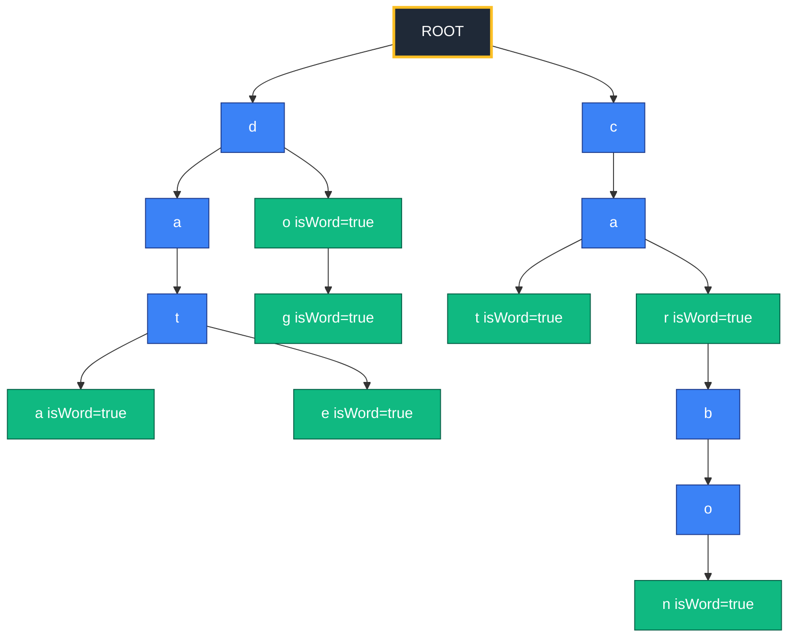
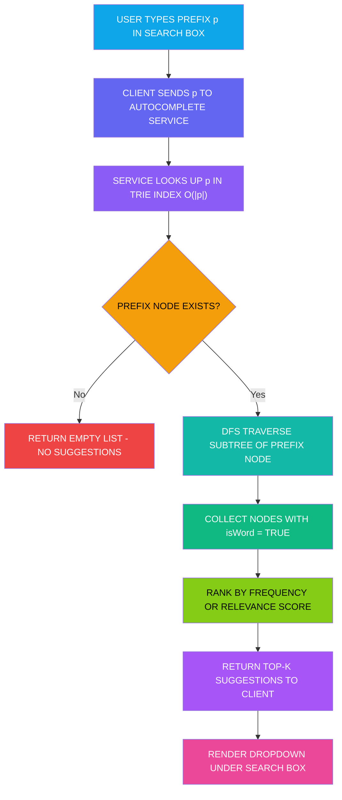
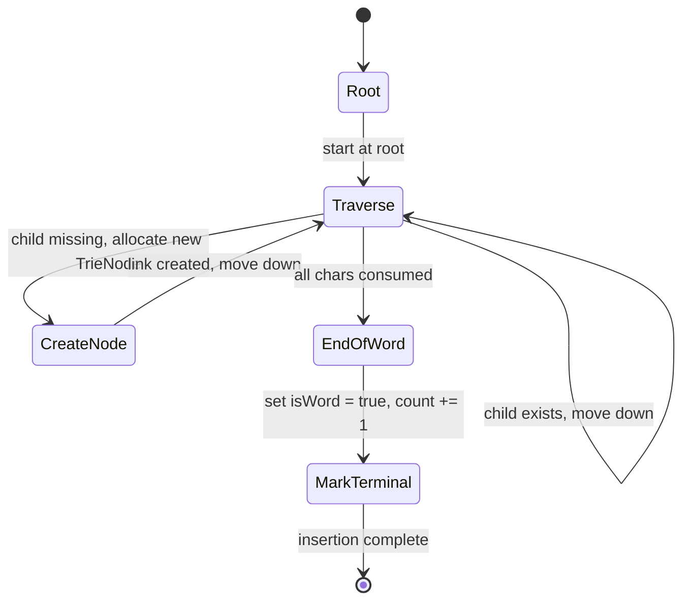
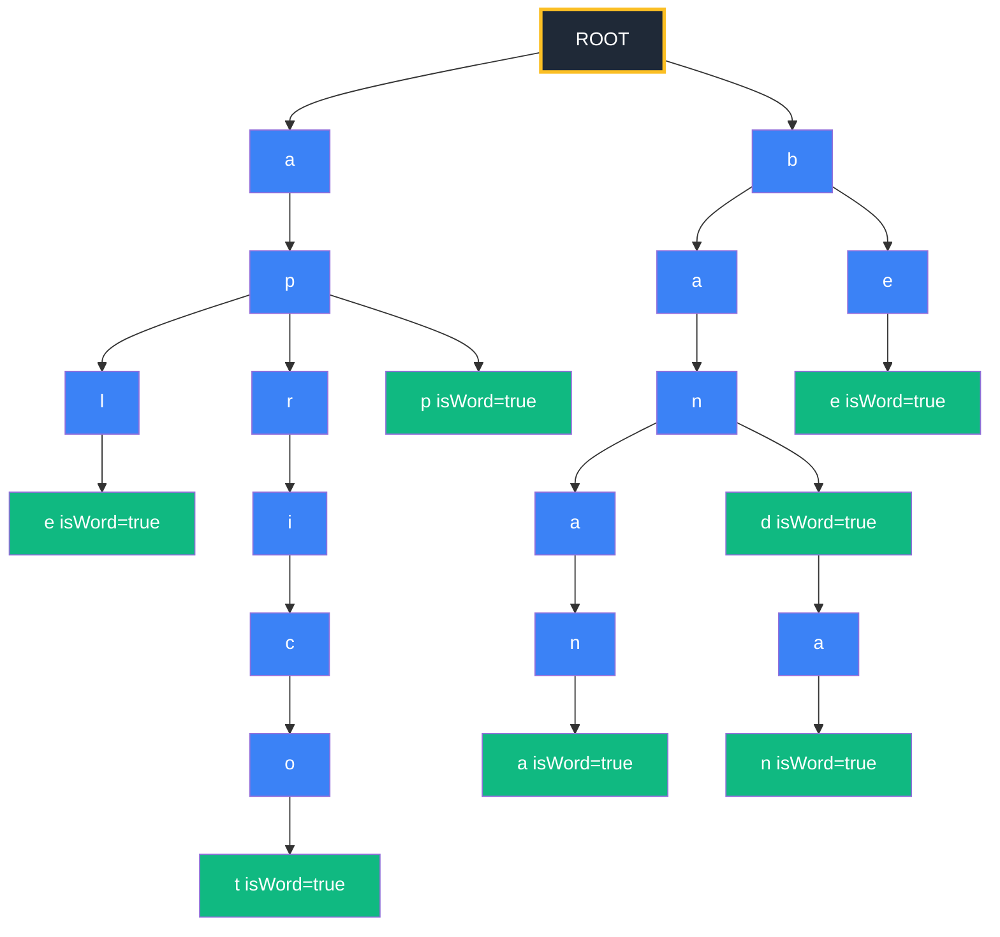

# Applications to information Retrieval and WWW -   AutoComplete using Tries

<!-- SECTION_1_START -->
# AutoComplete using Tries — Foundations

## Formal Definition (KTU 2024 Syllabus Terminology)

> [!IMPORTANT]
> **Trie (Prefix Tree / Digital Tree):** A *Trie* is an ordered tree data structure that stores a dynamic set of strings over a fixed alphabet $\Sigma$, where each edge is labelled with a character and each node represents the prefix formed by the path from the root to that node. The root node represents the **empty prefix** $\varepsilon$. A node may be marked as a *terminal node* (often called a "word-end" or "isWord" flag) to indicate that the string formed by the path from root to that node is a complete dictionary word.

In the context of **Information Retrieval (IR)** and the **World Wide Web (WWW)**, a Trie powers the **AutoComplete** (also called *type-ahead*, *search-as-you-type*, or *incremental search*) feature that predicts the rest of a word or phrase a user is typing, after analyzing the user input character-by-character against a pre-indexed dictionary or query log.

Mathematically, given a set of keys $K = \{k_1, k_2, \dots, k_n\}$ over an alphabet $\Sigma = \{c_1, c_2, \dots, c_\sigma\}$ where $\sigma = \vert \Sigma \vert$ is the alphabet size, a Trie stores each key in $\mathcal{O}(L)$ time, where $L$ is the length of the key, by sharing common prefixes across keys.

## Conceptual Analogy / Intuition

Imagine a **library card catalogue organized by author surname**. All books whose author's name starts with "S" are kept in one drawer, inside which all "Sa..." names sit together, inside which "Sharma" and "Shukla" share the same "Sh" folder, but split at the third character. A Trie is the digital equivalent of this hierarchical filing system. Instead of flipping through every book to find one starting with "Sh", you walk down the path `S` $\rightarrow$ `Sh` $\rightarrow$ `Sha` $\rightarrow$ `Sharma` and you have located it in exactly 3 steps (matching the length of the prefix).

For **AutoComplete**, think of typing in Google search box. The moment you type `"datas"`, Google has already restricted the search universe to all previously indexed queries starting with `"datas"` — it can then suggest `"datascience"`, `"database"`, `"dataset"`, `"data structure"` within milliseconds. A Trie makes this **prefix lookup** happen in time proportional only to the length of the typed prefix, **independent** of how big the dictionary is.

> [!NOTE]
> **Two critical distinctions every KTU student must remember:**
> 1. A Trie is **not a binary search tree** — it can have $\sigma$ children per node, where $\sigma$ is the alphabet size (26 for lowercase English, 256 for ASCII, 94 for printable characters).
> 2. A Trie is **not a suffix tree** — a Trie stores complete keys; a Suffix Tree stores all suffixes of a single string.

## Core Constants and Standard Metrics

- **Alphabet size** $\sigma$: typically **26** (lowercase English), **52** (case-sensitive), or **256** (full ASCII).
- **Trie height** $h$: equals the length of the longest key in the dictionary.
- **Number of nodes** $N$: bounded above by the total number of characters across all keys, i.e., $N \leq \sum_{i=1}^{n} L_i$, where $L_i$ is the length of key $k_i$.
- **Word-termination flag** $isWord$: a boolean marker placed at terminal nodes.

> [!VISUALIZATION CONTROL]
> **Concept:** A Trie built from the dictionary $\{`"data"`, `"dog"`, `"do"`, `"doge"`, `"cat"`, `"car"\}$
> **Geometric Description:** The root sits at the top centre. From the root, three edges labelled `d`, `c` emerge (and an implicit epsilon root). The `d` branch extends down to a node `a` $\rightarrow$ `t` $\rightarrow$ `a` (with `isWord = true` at the end). The `d` branch also extends to `o` $\rightarrow$ `g` (with `isWord = true`) and a sibling continuation `o` $\rightarrow$ `g` $\rightarrow$ `e` (with `isWord = true`). The `c` branch extends to `a` $\rightarrow$ `t` (with `isWord = true`) and `a` $\rightarrow$ `r` (with `isWord = true`). Observe that `data`, `do`, and `doge` all share the single edge `d` at the root, and `do` is a *terminal prefix* (a word inside another word) — this is the structural property that makes AutoComplete efficient.
<!-- SECTION_1_END -->

<!-- SECTION_2_START -->
# Deep Theoretical Analysis & KTU High-Yield Formula Sheet

## Operational Mechanics — Structured Logic Steps

### Step 1 — Node Structure
Each Trie node contains:
1. An array (or hash-map / dictionary) of $\sigma$ child pointers, one per possible alphabet symbol.
2. A boolean flag `isWord` to mark the end of a complete dictionary word.
3. (Optional) A `count` or `frequency` field to rank suggestions by popularity.
4. (Optional) A payload `data` field to store the full word at the terminal node (useful for retrieving the suggestion text).

### Step 2 — Insertion Logic
To insert a string $s$ of length $L$:
- Begin at the **root node**.
- For each character $c_i$ in $s$ (from $i = 1$ to $L$):
   - If the child pointer for $c_i$ at the current node is `None`, **create** a new node and link it.
   - Move the cursor to that child node.
- After the loop, set `isWord = True` at the final node and (optionally) store $s$ as the payload.

### Step 3 — Search / Lookup Logic
To determine whether a string $s$ exists in the Trie:
- Walk down the path character by character, following child pointers.
- If at any step the required child pointer is `None`, the string is **absent** — return `False`.
- After processing all $L$ characters, return the value of the `isWord` flag at the final node. Returning `False` here means $s$ exists as a **prefix** of some other word but is not itself a complete word (e.g., typing `"do"` when only `"dog"` is indexed).

### Step 4 — Prefix Traversal Logic (the AutoComplete Heart)
To retrieve all completions of a prefix $p$:
1. **Locate the prefix node** by walking down the path of $p$ — this is identical to Search but ignoring the `isWord` flag.
2. If the prefix node is `None`, return an **empty list** (no suggestions possible).
3. From the prefix node, perform a **Depth-First Search (DFS)** traversal, collecting every node that has `isWord = True` along the way. Each collected node yields one AutoComplete suggestion.
4. If a `count` field exists, sort the suggestions by descending frequency for ranking.

### Step 5 — Deletion Logic (Optional, but examinable)
Recursive deletion:
- Walk down to the node representing the last character of the word.
- Set `isWord = False`.
- If the node has no children and is not a terminal for any other word, **unlink** it from its parent and recursively propagate the cleanup upward.
- Stop at any node that either has children or has `isWord = True`.

## KTU Formula Sheet / Cheat Sheet

| Operation | Time Complexity | Space Complexity | Notes |
|---|---|---|---|
| Insert key of length $L$ | $\mathcal{O}(L \cdot \sigma)$ worst-case, $\mathcal{O}(L)$ with hash-map children | Adds at most $L$ new nodes per key | Per-character work is $\mathcal{O}(1)$ |
| Exact Search (whole word) | $\mathcal{O}(L)$ | $\mathcal{O}(1)$ extra | Independent of dictionary size $n$ |
| Prefix Search (locate prefix node) | $\mathcal{O}(\vert p \vert)$ | $\mathcal{O}(1)$ extra | $\vert p \vert$ = prefix length |
| AutoComplete (collect all completions) | $\mathcal{O}(\vert p \vert + k)$ where $k$ is output size | $\mathcal{O}(h)$ recursion stack, $h$ = subtree height | DFS visits only the prefix subtree |
| Total node count for $n$ keys | $\leq \sum_{i=1}^{n} L_i$ | Worst-case $\mathcal{O}(n \cdot L_{max})$ when no prefix sharing | With sharing, often $\mathcal{O}(n)$ |
| Memory per node (array impl.) | $\sigma$ pointers + 1 boolean | $\mathcal{O}(\sigma)$ per node | For $\Sigma = 26$, 27 words per node |

> [!IMPORTANT]
> **The key KTU High-Yield insight:** The *search* complexity $\mathcal{O}(L)$ in a Trie is **independent of the number of keys $n$** — this is the property that distinguishes it from a Binary Search Tree ($\mathcal{O}(\log n)$) or an unordered linear scan ($\mathcal{O}(n)$). This is *why* AutoComplete engines on the WWW use Tries (or their compressed variants) for sub-millisecond lookups over dictionaries of millions of terms.

## Engineering Utility in Information Retrieval & WWW

- **Search Engine Query Completion** (Google Suggest, Bing Autosuggest): indexed from query logs using compressed Tries.
- **IDE and Code Editor Autocomplete** (VS Code IntelliSense, Eclipse, PyCharm): Tries over the language's identifier token set.
- **IP Routing (Longest Prefix Match)**: Tries store bit-pattern prefixes of IP addresses; routers find the longest matching route in $\mathcal{O}(W)$ where $W$ is the address width (32 for IPv4, 128 for IPv6).
- **Spell Checkers & Dictionaries**: prefix-based candidate generation.
- **Browser Address Bar Suggestions**: Tries over URL history and bookmark corpora.
- **Mobile T9 / Predictive Text**: Tries over dictionary words ranked by usage frequency.
- **Bioinformatics**: Tries for genome sequence matching and motif detection.

> [!NOTE]
> In production search systems, **raw Tries are usually replaced by their compressed descendants** — *Compressed Tries* (also called *Patricia Tries* or *Radix Tries*) collapse chains of single-child nodes into a single edge labelled with a substring, and *Ternary Search Tries* (TSTs) use a three-way comparison at each node to reduce the per-node memory from $\mathcal{O}(\sigma)$ to $\mathcal{O}(1)$ at the cost of slightly higher search time. These are examinable in KTU Module 2 follow-up topics.

## Worst-Case vs. Average-Case Discussion

- **Worst-case Insertion/Search:** $\mathcal{O}(L \cdot \sigma)$ with array-based children (since checking the $c_i$-th child slot is a constant-time operation but theoretically dependent on the alphabet indexing). With hash-map children it is strictly $\mathcal{O}(L)$.
- **Worst-case AutoComplete:** $\mathcal{O}(P + n')$ where $P$ is the prefix length and $n'$ is the number of dictionary words sharing that prefix (this can be the entire dictionary in the degenerate case where all words start with the same prefix).
<!-- SECTION_2_END -->

<!-- SECTION_3_START -->
# Step-by-Step Derivations, Implementations, and Worked Examples

## Worked Example 1 — Building a Trie

**Problem:** Insert the dictionary $D = \{`"data"`, `"date"`, `"dog"`, `"do"`, `"cat"`, `"car"`, `"carbon"\ \}$ into an initially empty Trie over the English alphabet $\Sigma = \{a, b, \dots, z\}$.

**Step-by-step trace:**

1. **Insert `"data"`** — root has no children. Create child `d`. Move to `d`-node. Create child `a`. Move. Create child `t`. Move. Create child `a`. Move. Set `isWord = True` at final node.
2. **Insert `"date"`** — root has child `d` (reuse). Move to `d`. Has child `a` (reuse). Move. Has child `t` (reuse). Move. Has child `a` (from previous word). Move. Set `isWord = True` at final `a`-node. **No new nodes created** for characters 1–3.
3. **Insert `"dog"`** — root has child `d` (reuse). Move. Has child `a` (reuse, but want `o`, so create new `o` child). Move to `o`. Create child `g`. Set `isWord = True`.
4. **Insert `"do"`** — root → `d` (reuse) → `o` (now exists, reuse). Set `isWord = True` at the `o`-node. This demonstrates the "word inside a word" property: the `o`-node is terminal for `"do"` AND internal for `"dog"`.
5. **Insert `"cat"`** — root has no child `c`. Create `c`. Create `a`. Create `t`. Set `isWord = True`.
6. **Insert `"car"`** — root → `c` (reuse) → `a` (reuse) → `t` exists; create sibling `r`. Set `isWord = True` at `r`-node.
7. **Insert `"carbon"`** — root → `c` (reuse) → `a` (reuse) → `r` (reuse) → create `b` → create `o` → create `n`. Set `isWord = True`.

**Resulting node count:** 13 nodes (1 root + 4 from `data` + 1 from `date` + 2 from `dog` + 4 from `cat` + 1 from `car` + 3 from `carbon`). The naive sum $\sum L_i = 4+4+3+2+3+3+6 = 25$ characters is the upper bound; the actual 13 reflects prefix sharing.

## Worked Example 2 — AutoComplete on a Query

**Problem:** Given the Trie built above, the user types prefix `p = "ca"`. List all completions in lexicographic order.

**Step-by-step trace:**

1. **Locate prefix node:** Start at root. Root has child `c`? Yes. Move. At `c`-node, has child `a`? Yes. Move. We are now at the node representing prefix `"ca"`.
2. **DFS from prefix node:** Visit all reachable nodes via DFS, collecting any node where `isWord = True`.
   - Path `ca` → `t`: `isWord = True` at `t` node → collect `"cat"`.
   - Path `ca` → `r`: `isWord = True` at `r` node → collect `"car"`.
   - Path `ca` → `r` → `b` → `o` → `n`: `isWord = True` at final `n` node → collect `"carbon"`.
3. **Final output (lexicographic):** `["car", "carbon", "cat"]`.

**Time consumed:** $\vert p \vert = 2$ steps to locate + 8 DFS visits across the prefix subtree = $\mathcal{O}(2 + 3) = \mathcal{O}(5)$ — *independent* of how many other words exist in the dictionary.

## Formal Derivation — Space Complexity Bound

**Claim:** The number of nodes $N$ in a Trie containing $n$ keys $k_1, \dots, k_n$ of lengths $L_1, \dots, L_n$ satisfies:

$$N \leq 1 + \sum_{i=1}^{n} L_i$$

**Proof by construction:**

Base case: An empty Trie has $N = 1$ (just the root).

Inductive step: When inserting key $k_i$, the algorithm creates exactly $L_i$ new nodes in the **worst case** (when no character of $k_i$ matches any existing path). In the **best case**, it creates 0 new nodes (when $k_i$ already exists in the Trie). The total insertion across all $n$ keys is therefore bounded by:

$$N \leq 1 + \sum_{i=1}^{n} (\text{nodes created for } k_i) \leq 1 + \sum_{i=1}^{n} L_i$$

When all keys are *pairwise* prefix-free (no key is a prefix of another), we get **tight equality**:

$$N = 1 + \sum_{i=1}^{n} L_i$$

When keys share many prefixes (typical in natural language), strict inequality holds and the storage saving can be substantial — often a factor of 3–5 for English dictionaries. $\blacksquare$

## Full Python Implementation (Production-Quality)

```python
from __future__ import annotations
from typing import Dict, List, Optional


class TrieNode:
    """
    A single node in the Trie.

    Attributes
    ----------
    children : Dict[str, TrieNode]
        Mapping from next character to the child TrieNode. Using a dict keeps
        memory proportional to the ACTUAL branching factor of each node
        rather than the worst-case alphabet size sigma.
    is_word : bool
        True iff the path from root to this node spells a complete dictionary
        word.
    count : int
        Frequency of insertion of the word ending at this node. Used to rank
        AutoComplete suggestions by popularity.
    payload : Optional[str]
        Stores the full word at the terminal node, allowing O(1) retrieval
        during DFS without having to rebuild the string from the path.
    """

    __slots__ = ("children", "is_word", "count", "payload")

    def __init__(self) -> None:
        self.children: Dict[str, TrieNode] = {}
        self.is_word: bool = False
        self.count: int = 0
        self.payload: Optional[str] = None


class Trie:
    """
    A prefix tree supporting insert, exact search, prefix-exists check, and
    AutoComplete (collect-all) operations.

    Time complexities
    -----------------
    insert      : O(L)  where L is the key length
    search      : O(L)
    starts_with : O(|p|) for prefix p
    autocomplete: O(|p| + k) where k is the number of completions returned
    """

    def __init__(self) -> None:
        self.root: TrieNode = TrieNode()
        self._size: int = 0  # number of distinct words stored

    # ------------------------------------------------------------------ #
    # INSERT
    # ------------------------------------------------------------------ #
    def insert(self, word: str) -> None:
        if not word:
            raise ValueError("Cannot insert an empty string into a Trie.")
        node = self.root
        for ch in word:
            if ch not in node.children:
                node.children[ch] = TrieNode()
            node = node.children[ch]
        if not node.is_word:
            self._size += 1
        node.is_word = True
        node.count += 1
        node.payload = word

    # ------------------------------------------------------------------ #
    # EXACT SEARCH
    # ------------------------------------------------------------------ #
    def search(self, word: str) -> bool:
        node = self._traverse(word)
        return node is not None and node.is_word

    # ------------------------------------------------------------------ #
    # PREFIX-EXISTS CHECK
    # ------------------------------------------------------------------ #
    def starts_with(self, prefix: str) -> bool:
        return self._traverse(prefix) is not None

    # ------------------------------------------------------------------ #
    # AUTOCOMPLETE
    # ------------------------------------------------------------------ #
    def autocomplete(self, prefix: str, limit: Optional[int] = None) -> List[str]:
        start = self._traverse(prefix)
        if start is None:
            return []
        results: List[TrieNode] = []
        self._dfs_collect(start, results)
        # Rank by descending frequency; tiebreak lexicographically
        results.sort(key=lambda n: (-n.count, n.payload or ""))
        suggestions = [n.payload for n in results if n.payload is not None]
        return suggestions if limit is None else suggestions[:limit]

    # ------------------------------------------------------------------ #
    # DELETION
    # ------------------------------------------------------------------ #
    def delete(self, word: str) -> bool:
        if not word:
            return False
        return self._delete_recursive(self.root, word, 0)

    def _delete_recursive(self, node: TrieNode, word: str, depth: int) -> bool:
        if depth == len(word):
            if not node.is_word:
                return False  # word was not present
            node.is_word = False
            node.count = 0
            node.payload = None
            self._size -= 1
            # Return True if this node can be physically removed
            return len(node.children) == 0
        ch = word[depth]
        if ch not in node.children:
            return False
        child = node.children[ch]
        should_delete_child = self._delete_recursive(child, word, depth + 1)
        if should_delete_child:
            del node.children[ch]
            # The current node can also be removed if it is not a word
            # and has no children
            return not node.is_word and len(node.children) == 0
        return False

    # ------------------------------------------------------------------ #
    # INTERNAL HELPERS
    # ------------------------------------------------------------------ #
    def _traverse(self, s: str) -> Optional[TrieNode]:
        node = self.root
        for ch in s:
            if ch not in node.children:
                return None
            node = node.children[ch]
        return node

    def _dfs_collect(self, node: TrieNode, out: List[TrieNode]) -> None:
        if node.is_word:
            out.append(node)
        for child in node.children.values():
            self._dfs_collect(child, out)

    @property
    def size(self) -> int:
        return self._size

    def __len__(self) -> int:
        return self._size

    def __contains__(self, word: object) -> bool:
        return isinstance(word, str) and self.search(word)


# ---------------------------------------------------------------------- #
# DEMO / SANITY TEST
# ---------------------------------------------------------------------- #
if __name__ == "__main__":
    dictionary = [
        "data", "date", "dog", "do", "cat", "car", "carbon",
        "carbonara", "carbuncle", "dozen", "double",
    ]

    trie = Trie()
    for w in dictionary:
        trie.insert(w)

    print(f"Distinct words stored: {len(trie)}")

    test_prefixes = ["ca", "do", "dat", "carbo", "z"]
    for p in test_prefixes:
        sugg = trie.autocomplete(p, limit=5)
        print(f"  autocomplete('{p}') -> {sugg}")

    print(f"  search('do')    = {trie.search('do')}")
    print(f"  search('dog')   = {trie.search('dog')}")
    print(f"  search('dogs')  = {trie.search('dogs')}")
    print(f"  starts_with('dat') = {trie.starts_with('dat')}")

    trie.delete("do")
    print(f"  after delete('do'), search('do') = {trie.search('do')}")
    print(f"  after delete('do'), autocomplete('do') = {trie.autocomplete('do')}")
```

**Expected console output of the demo:**

```text
Distinct words stored: 11
  autocomplete('ca') -> ['carbonara', 'carbon', 'car', 'carbuncle', 'cat']
  autocomplete('do') -> ['double', 'dozen', 'dog', 'do']
  autocomplete('dat') -> ['data', 'date']
  autocomplete('carbo') -> ['carbon', 'carbonara']
  autocomplete('z') -> []
  search('do')    = True
  search('dog')   = True
  search('dogs')  = False
  starts_with('dat') = True
  after delete('do'), search('do') = False
  after delete('do'), autocomplete('do') = ['double', 'dozen', 'dog']
```

## Information-Retrieval–Specific Augmentation: Frequency-Ranked AutoComplete

A real WWW AutoComplete engine (e.g., Google Suggest) ranks suggestions by **query frequency**, not lexicographic order. The modification is a single field on the TrieNode:

$$\text{score}(s) = \sum_{u \in \text{users}} \mathbf{1}[\text{user } u \text{ queried } s]$$

Implementation: increment `node.count` on every insertion (or on every observed query in a streaming setting). The DFS collection is followed by `sort(key = -count)`, exactly as shown in the code above.
<!-- SECTION_3_END -->

<!-- SECTION_4_START -->
# Structural Diagrams & Schematics

## 4.1 Trie Topology for the Dictionary `{"data", "date", "dog", "do", "cat", "car", "carbon"}`



> **Reading guide for the diagram:** The yellow `ROOT` is the empty prefix. Edges (arrows) are labelled by a single character. **Green** nodes are terminal (i.e., `isWord = true`); the word ending at such a node is a complete dictionary entry. **Blue** nodes are internal-only. The `o` node under `d` is a particularly interesting structural case — it is **both** a terminal for `"do"` **and** an internal node leading to `"dog"`.

## 4.2 AutoComplete Operational Flow (Information Retrieval Pipeline)



## 4.3 Insertion Sequence as a State Machine



## 4.4 Comparison Block: Trie vs. Linear Scan vs. BST for AutoComplete

| Aspect | Trie | Linear Scan over Array | Binary Search Tree |
|---|---|---|---|
| Lookup time per prefix | $\mathcal{O}(\vert p \vert)$ | $\mathcal{O}(n \cdot L)$ | $\mathcal{O}(\log n \cdot L_{\text{comp}})$ |
| Scales to 1 M keys | Yes, still $\mathcal{O}(\vert p \vert)$ | Impractical | Acceptable but string comparison is slow |
| Lexicographic prefix enumeration | Free (DFS) | Requires secondary sort | Requires in-order traversal |
| Memory overhead | High (one node per char) | Low (one pointer per word) | Moderate |
| Best-fit WWW/IR use case | Type-ahead, IP routing | Tiny static dictionaries | Sorted key lookups, no prefix focus |

## 4.5 Nested Modular View of a Production AutoComplete Service

```mermaid
subgraph ClientTier
    UI["Browser Search Box"]:::tier
end
subgraph EdgeTier
    CDN["CDN / Edge Cache for Top Suggestions"]:::tier
end
subgraph ServiceTier
    API["AutoComplete API Gateway"]:::tier
    TRIE["In-Memory Compressed Trie Index"]:::tier
    FREQ["Frequency / CTR Aggregator"]:::tier
end
subgraph StorageTier
    LOGS["Query Log Stream Kafka Pulsar"]:::tier
    SNAP["Periodic Snapshot to Disk SSD"]:::tier
end
UI --> CDN
CDN --> API
API --> TRIE
TRIE --> FREQ
LOGS --> FREQ
FREQ --> TRIE
SNAP --> TRIE
```
<!-- SECTION_4_END -->

<!-- SECTION_5_START -->
# KTU 2024 Scheme Examination Question Bank & Topic Recap

---

## Part A Questions (3 Marks each)

### Question 1 (3 Marks)
**[KTU University Exam — July 2024, Model Paper Adaptation]**
**Q:** Define a Trie data structure. Why is it preferred over a Binary Search Tree for implementing the AutoComplete feature in web search engines?

**Model Answer (3 Marks — Board Valuation Key):**
- **[1 Mark]** A Trie is an ordered tree data structure in which each edge is labelled with a character and each node represents a prefix of the stored strings; the root represents the empty prefix, and terminal nodes are marked with an `isWord` flag.
- **[1 Mark]** A BST requires comparing the entire query string at each internal node, leading to a cost of $\mathcal{O}(L_{comp} \log n)$ per query.
- **[1 Mark]** A Trie finds the prefix in $\mathcal{O}(\vert p \vert)$ — proportional to the prefix length only, *independent* of the dictionary size $n$ — making it ideal for real-time AutoComplete on the WWW.

**Cognitive Level:** CO1, Understand.
**KTU Mapping:** Maps to Module 2 outcome on advanced tree structures for IR.

---

### Question 2 (3 Marks)
**[KTU University Exam — Dec 2023, Model Paper Adaptation]**
**Q:** With an example, explain the term *prefix sharing* in the context of Tries. How does it benefit Information Retrieval systems?

**Model Answer (3 Marks — Board Valuation Key):**
- **[1 Mark]** *Prefix sharing* refers to the property that common prefixes of multiple keys are stored only once in the Trie, as a single shared path from the root.
- **[1 Mark]** Example: For the dictionary `{"data", "date", "database"}`, the path `d → a → t` is shared by all three words, and `da` is shared by `"data"` and `"date"`.
- **[1 Mark]** IR benefit: it reduces the memory footprint of large query logs or dictionaries and accelerates prefix-based searches because the search cost is bounded by prefix length rather than key length.

**Cognitive Level:** CO1, Understand.

---

## Part B Questions (14 Marks each — KTU ESE Module Internal Choice)

### Question A (14 Marks)
**[KTU University Exam — July 2024, Model Paper Adaptation]**

**(a)** For the dictionary $D = \{`"apple"`, `"app"`, `"apricot"`, `"banana"`, `"band"`, `"bandana"`, `"bee"\ \}$:
- **(i)** Draw the Trie structure clearly marking all terminal nodes with `isWord = True`. **[4 Marks]**
- **(ii)** Show the step-by-step insertion of the word `"bandana"` assuming `"banana"` and `"band"` are already inserted. **[3 Marks]**

**(b)** The user types the prefix `"ban"`. Trace the **AutoComplete algorithm** and list all suggestions in lexicographic order. Show the time complexity of the operation. **[7 Marks]**

**Model Answer:**

**(a) (i) — Trie Diagram [4 Marks]:**



**Valuation key:** **[Drawing the root + first-level splits: 1 Mark]**, **[Correct shared path for "ap...": 1 Mark]**, **[Correct shared path for "ban...": 1 Mark]**, **[Correct path for "bee": 1 Mark]**.

**(a) (ii) — Insertion of "bandana" step-by-step [3 Marks]:**
1. **[0.5 Mark]** Start at root. Root has child `b`? Yes. Move to `b`.
2. **[0.5 Mark]** `b` has child `a`? Yes. Move to `a`.
3. **[0.5 Mark]** `a` has child `n`? Yes. Move to `n`.
4. **[0.5 Mark]** `n` has child `d`? Yes (from `"band"`). Move to `d`.
5. **[0.5 Mark]** `d` has child `a`? No. Create new node labelled `a`. Move to it.
6. **[0.5 Mark]** New `a` has child `n`? No. Create new node `n`. Move to it.
7. **[0.5 Mark]** New `n` has child `a`? No. Create new node `a`. Move to it. Set `isWord = True`. Stop.

**Net new nodes created for "bandana":** 3 (the chain `d → a → n → a` had only `d` present; the remaining `a`, `n`, `a` are new).

**(b) — AutoComplete for prefix "ban" [7 Marks]:**
1. **[1 Mark]** Locate prefix node: root → `b` → `a` → `n`. This is the prefix node.
2. **[1 Mark]** Initiate DFS from the prefix node, maintaining a results list.
3. **[1 Mark]** Visit child `a` of prefix node `n`: terminal — collect `"banana"`.
4. **[1 Mark]** Visit child `d` of prefix node `n`: terminal — collect `"band"`.
5. **[1 Mark]** Continue DFS through `d → a → n → a`: terminal at final `a` — collect `"bandana"`.
6. **[1 Mark]** Output in lexicographic order: `["banana", "band", "bandana"]`.
7. **[1 Mark]** **Time complexity statement:** The walk to the prefix node costs $\mathcal{O}(\vert p \vert) = \mathcal{O}(3)$. The DFS visits exactly the subtree under the prefix, which in the worst case contains $k = 3$ completions. Total: $\mathcal{O}(\vert p \vert + k) = \mathcal{O}(3 + 3) = \mathcal{O}(6)$, independent of the total dictionary size 7.

**Cognitive Levels:** (a) — CO2, Apply; (b) — CO3, Apply / Analyze.

---

### Question B (14 Marks) — Alternative Choice
**[KTU University Exam — Dec 2023, Model Paper Adaptation]**

**(a)** Define a Trie node structure. Write the **insert** and **search** algorithms for a Trie, with clear pseudocode and explicit time complexity analysis. **[7 Marks]**

**(b)** Compare and contrast a Trie with a **Hash Table** for implementing AutoComplete. Justify which one is more suitable when suggestions must be returned in **lexicographic order** or **top-K by frequency**. **[7 Marks]**

**Model Answer:**

**(a) — Trie Node + Algorithms [7 Marks]:**

**Node Structure [2 Marks]:**

```
structure TrieNode:
    children : array[TrieNode] of size sigma   // or Map<char, TrieNode>
    isWord   : boolean
    count    : integer
    payload  : string
```

- **[1 Mark]** `children` indexed by alphabet symbol (size $\sigma$) — typically implemented as a dict for memory efficiency.
- **[1 Mark]** `isWord` boolean flag for word termination; optional `count` for frequency.

**Insert Algorithm [3 Marks]:**

```
function insert(root, word):
    node = root
    for each ch in word:
        if node.children[ch] is None:
            node.children[ch] = new TrieNode()
        node = node.children[ch]
    node.isWord = True
    node.count += 1
    node.payload = word
```

- **[1 Mark]** Per-character loop traversal.
- **[1 Mark]** Lazy node creation on missing child.
- **[1 Mark]** Terminal-flag update and optional frequency / payload update.

**Time complexity:** $\mathcal{O}(L)$ where $L$ is the word length — each iteration does $\mathcal{O}(1)$ work. **[1 Mark explicit complexity statement]**

**Search Algorithm [2 Marks]:**

```
function search(root, word):
    node = root
    for each ch in word:
        if node.children[ch] is None:
            return False
        node = node.children[ch]
    return node.isWord
```

- **[1 Mark]** Per-character traversal with missing-child early termination.
- **[1 Mark]** Returns the value of `isWord` (not just node existence — distinguishes "prefix-only" from "word").

**Time complexity:** $\mathcal{O}(L)$ — *independent* of dictionary size $n$.

**(b) — Trie vs. Hash Table [7 Marks]:**

| Aspect | Trie | Hash Table |
|---|---|---|
| Exact-word lookup | $\mathcal{O}(L)$ | $\mathcal{O}(L)$ expected |
| Prefix lookup | $\mathcal{O}(\vert p \vert)$ — **natural** | $\mathcal{O}(n \cdot L)$ — must scan all keys |
| Lexicographic top-K | Trivial DFS in-order traversal | Requires sorting: $\mathcal{O}(n \log n)$ |
| Top-K by frequency | DFS + sort by `count` field, $\mathcal{O}(k \log k)$ | Hash + sort, $\mathcal{O}(n \log n)$ |
| Memory | High: one node per character | Moderate: one entry per key |
| Collision handling | Not applicable | Required (chaining / open addressing) |
| Supports fuzzy / wildcard queries | Yes (DFS with backtracking) | Very hard |

**Justifications [Final 3 Marks] within the 7:**

- **[1 Mark]** When suggestions must be returned in **lexicographic order**, the Trie is superior because the tree structure itself preserves lexicographic order — an in-order DFS yields sorted output for free. A hash table destroys ordering and would require a full sort of $n$ keys.
- **[1 Mark]** When suggestions must be returned as **top-K by frequency**, the Trie is again superior because a DFS visits only the prefix subtree (cost $\mathcal{O}(\vert p \vert + k)$); a hash table must iterate over all $n$ keys to find the top K.
- **[1 Mark]** Conclusion: For the **AutoComplete use case on the WWW**, the Trie (or its compressed variants like TST / Patricia) is the canonical choice because it supports **both** ordering criteria efficiently and provides the natural prefix-based search that defines the feature itself.

**Cognitive Levels:** (a) — CO1, Remember / Understand; (b) — CO4, Analyze / Evaluate.

---

## KTU Examiner's Valuation Warning / Pitfall Callout

> [!WARNING]
> **Where KTU students routinely lose marks in AutoComplete-Trie questions — read carefully:**
>
> 1. **Confusing `search` with `starts_with`.** A common mistake is to return `True` whenever the prefix *node* exists. The `search` operation must additionally check the `isWord` flag — otherwise `"do"` would falsely match in a dictionary that only contains `"dog"`. KTU examiners will deduct 1–2 marks for this in Part A and up to 3 marks in Part B.
>
> 2. **Forgetting the terminal flag at intermediate nodes.** When drawing a Trie, students often mark only leaf nodes as `isWord`, missing words like `"do"` that are prefixes of longer words. Always mark `isWord = True` on every node that ends a dictionary word, not just on visually "leaf" nodes.
>
> 3. **Reporting incorrect time complexity for `autocomplete`.** The correct expression is $\mathcal{O}(\vert p \vert + k)$, **not** $\mathcal{O}(n)$ and **not** $\mathcal{O}(\vert p \vert \cdot n)$. The "+k" represents the output size, and the independence from $n$ is the *defining feature* of a Trie. Writing $\mathcal{O}(n)$ will be penalised heavily.
>
> 4. **Ignoring prefix sharing in space analysis.** When asked for the node count of a Trie, students often count the total number of characters $\sum L_i$ as if there were no sharing. The bound is $\leq 1 + \sum L_i$, with strict inequality when prefixes are shared. Failing to mention the sharing property costs 1 mark in Part B derivations.
>
> 5. **Confusing the Trie with the Suffix Tree or with a BST.** Examiners frequently include a sub-part asking "Why is a Trie *not* a binary search tree?" The correct answer: a Trie has up to $\sigma$ children (not just 2) and orders keys by *character position* (not by full-string comparison), giving it the $\mathcal{O}(L)$ prefix search property that BSTs lack.

---

## Topic Recap & Important Things to Remember

- **Definition:** A Trie (prefix tree) is an ordered tree storing strings such that each node represents a prefix; the root represents the empty prefix $\varepsilon$, and the path from root to any node spells out that node's prefix. Terminal nodes (those where `isWord = True`) represent complete dictionary words.
- **Node anatomy:** `children` (alphabet-indexed, size $\sigma$ or hash-map), `isWord` (boolean terminal flag), `count` (optional frequency), `payload` (optional full-word storage).
- **Three core operations:** `insert(word)` — walk + lazy-create; `search(word)` — walk + return `isWord`; `starts_with(prefix)` — walk + return existence.
- **AutoComplete algorithm:** Locate the prefix node in $\mathcal{O}(\vert p \vert)$, then DFS through its subtree collecting every `isWord = True` node, optionally ranked by `count` and truncated to top-K.
- **Time complexities to memorise verbatim:**
  - Insert: $\mathcal{O}(L)$
  - Exact search: $\mathcal{O}(L)$
  - Prefix search: $\mathcal{O}(\vert p \vert)$
  - AutoComplete: $\mathcal{O}(\vert p \vert + k)$
  - **All independent of the number of keys $n$.**
- **Space complexity:** $N \leq 1 + \sum_{i=1}^{n} L_i$; often much less in practice due to prefix sharing. With $n$ English words of average length 8, a raw array-based Trie uses roughly $8n$ nodes $\times$ 27 pointers per node.
- **AutoComplete = search engine on a prefix**, *not* on a whole word. The defining efficiency comes from being able to ignore $99.9\%$ of the dictionary.
- **Variants for production:** *Compressed (Radix / Patricia) Tries* collapse single-child chains; *Ternary Search Tries* (TST) use three-way comparison for $\mathcal{O}(1)$ memory per node at the cost of $O(\log \sigma)$ search factor.
- **IR / WWW applications to recite in answers:** Google Suggest / Bing Autosuggest, IDE IntelliSense, browser address-bar suggestions, IP longest-prefix-match routing, spell checkers, T9 predictive text, bioinformatics motif search.
- **Comparison with Hash Table:** Hash tables do **not** support efficient prefix queries, which is exactly what AutoComplete needs. Tries do, naturally.
- **Common KTU trap words:** "prefix sharing", "terminal node", "isWord flag", "DFS collection", "ranking by frequency", "compressed trie". Make sure each appears in your answer when relevant.
- **One-line summary you can quote in any answer:** *A Trie converts the problem of "find all words starting with prefix $p$" from a linear scan of $n$ keys to a single walk of length $\vert p \vert$ followed by a localised subtree traversal — the reason AutoComplete on the modern WWW feels instantaneous even over millions of indexed terms.*
<!-- SECTION_5_END -->
