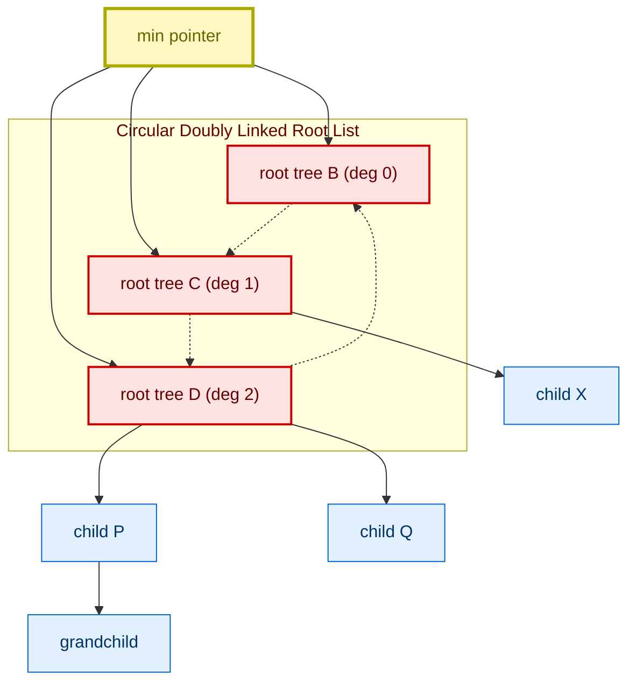
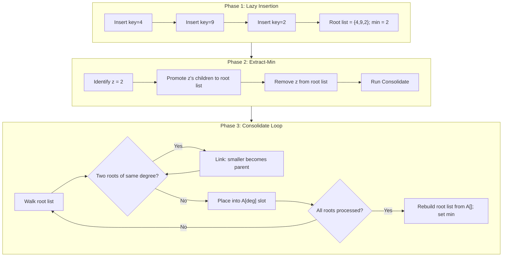
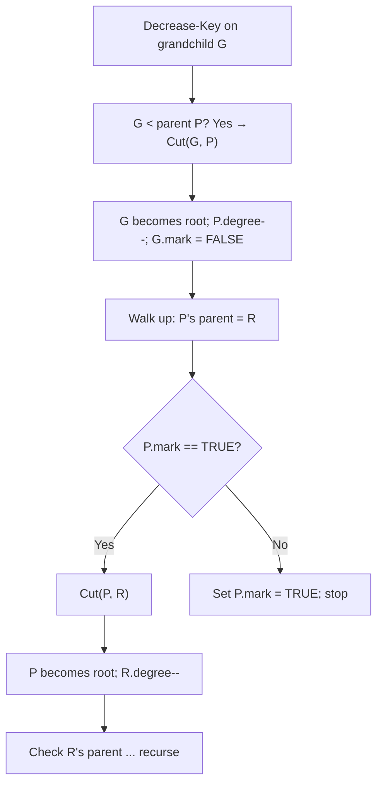
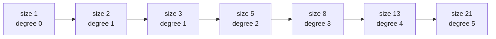

# Fibonacci Heaps

<!-- SECTION_1_START -->
# Fibonacci Heaps — Core Technical Definition & Intuitive Overview

## 1.1 Formal Definition

A **Fibonacci Heap** is a collection of rooted trees that are **min-heap ordered** (or max-heap ordered), structured as a **circular, doubly linked list of root nodes** with **marking** of certain child nodes. It is a generalization of the Binomial Heap and was introduced by **Michael L. Fredman** and **Robert E. Tarjan** in **1984** (JACM, Vol. 31, No. 3, pp. 596–615). The name "Fibonacci" comes from the way the running times of its operations are analyzed — the bounds for the degree sequence of a node of size $s$ obey a recurrence that solves to the **Fibonacci numbers**.

In a Fibonacci Heap $\mathcal{H}$:

- Each node $x$ has a pointer $\text{parent}[x]$ to its parent (or $\text{NIL}$ if it is a root).
- Each node $x$ has a pointer $\text{left}[x]$ and $\text{right}[x]$ to its siblings (in a **circular doubly linked list** of siblings).
- Each node has a pointer $\text{child}[x]$ to one of its children (any one, or $\text{NIL}$ if leaf).
- Each node has a $\text{degree}[x]$ = number of its children.
- Each node has a $\text{mark}[x] \in \{\text{TRUE}, \text{FALSE}\}$ indicating whether it has lost a child since becoming a child of another node.
- The minimum node is pointed to by $\text{min}[\mathcal{H}]$, and the total number of nodes is $\text{n}[\mathcal{H}]$.

> [!IMPORTANT]
> **KTU 2024 Syllabus Highlight (Module 2):** A Fibonacci heap is a **lazy** heap — it postpones much of its work (tree consolidation, re-linking) until the next `Extract-Min` operation. This laziness gives the best-known **asymptotic running time of $O(E + V \log V)$** for **Dijkstra's single-source shortest-path** and **Prim's minimum spanning tree** algorithms on dense graphs.

## 1.2 Conceptual Analogy / Intuition

Imagine a **busy office bulletin board** (a circular list) where every "memo" is a tree of tasks. New memos are **simply pinned up** (lazy insert — $O(1)$) without being immediately merged with similar ones. Only when the boss says **"clear the topmost task"** (`Extract-Min`), the worker picks up all memos of the same size (same $\text{degree}$), **stacks them** (the `Link` operation, $O(1)$), and produces a smaller, tidier set. If a memo gets demoted (its key decreases after it has children), it is **physically removed and re-pinned at the top** (the `Cut` and `Cascading-Cut`), but if its parent has already lost a child, the parent itself is also cut, **cascading upward**.

This **"lazy + cleanup on demand"** philosophy is what makes Fibonacci heaps theoretically optimal for graph algorithms that perform many `Decrease-Key` operations.

## 1.3 Visualizing the Degree Bound (Geometric Intuition)

The structural property $\text{size}(x) \ge F_{k+2}$ (where $F_k$ is the $k$-th Fibonacci number) and $\text{degree}(x) = k$ gives the **logarithmic maximum degree bound**:

$$\max\{\text{degree}(x) : \text{size}(x) = n\} = \lfloor \log_{\varphi} n \rfloor$$

where $\varphi = \dfrac{1+\sqrt{5}}{2} \approx \mathbf{1.6180}$ is the **Golden Ratio**. This is the geometric reason the structure is called "Fibonacci".

> [!VISUALIZATION CONTROL]
> **Concept:** Golden-spiral relation between node-degree and node-size in a Fibonacci Heap.
> **GeoGebra / Desmos Input Equations:**
> * `F(n) = round(((1+sqrt(5))/2)^n / sqrt(5))` for $n = 0, 1, 2, \ldots, 10$
> * `g(x) = log((1+sqrt(5))/2, x)` — the degree-to-size inverse function
> **Visual Description:** Plot the points $(n, F_{n+2})$ for $n = 0..9$. Observe that the curve grows exponentially with base $\varphi$. The inverse function $g(x) = \log_{\varphi} x$ shows that a node of size $x$ has degree at most $\log_{\varphi} x$, which is $O(\log n)$ for $n$ nodes.

## 1.4 Symbols & Constants Table

| Symbol / Constant | Meaning | Typical Value |
|---|---|---|
| $\varphi$ | Golden Ratio | $(1+\sqrt{5})/2 \approx \mathbf{1.6180}$ |
| $F_k$ | $k$-th Fibonacci number | $F_0=0, F_1=1, F_2=1, F_3=2, F_4=3, F_5=5$ |
| $\Phi(\mathcal{H})$ | Potential function for amortized analysis | $\text{trees}(\mathcal{H}) + 2 \cdot \text{marks}(\mathcal{H})$ |
| $t(\mathcal{H})$ | Number of trees (roots) | $\ge 0$ |
| $m(\mathcal{H})$ | Number of marked nodes | $\ge 0$ |
| $D(n)$ | Maximum degree of any node of size $n$ | $\lfloor \log_{\varphi} n \rfloor$ |

<!-- SECTION_1_END -->

<!-- SECTION_2_START -->
# Deep Theoretical Analysis & KTU High-Yield Formula Sheet

## 2.1 Structural Properties

A Fibonacci heap is **not a single tree**; it is a **forest** of heap-ordered trees. The structure is defined by these **invariants** that must hold at all times:

1. **Min-Heap Order (Property 1).** For every node $x$ with parent $p[x]$, we have $\text{key}[p[x]] \le \text{key}[x]$. (The root of every subtree is the smallest key in that subtree.)
2. **Doubly Linked Root List (Property 2).** All roots are in a circular doubly linked list, and $\text{min}[\mathcal{H}]$ points to the root with the smallest key. Every root's `parent` pointer is `NIL`.
3. **Marking Invariant.** A node is marked **only if** it has lost a child (i.e., one of its children was cut and became a root) since the node itself became a child of another node. Once a node is removed from the root list and made a child, its `mark` is set to `FALSE`. When a marked node loses a child, it is also cut (cascading cut).

> [!NOTE]
> **Lazy vs. Eager philosophy:** Compared with a **Binomial Heap**, a Fibonacci Heap performs almost no work during `Insert`, `Union`, or `Decrease-Key`. All re-organization is deferred to the `Extract-Min` operation (eager consolidation only when forced).

## 2.2 Fibonacci Heap: Operation Cheat Sheet

| Operation | Procedure (high level) | Actual Time | **Amortized Time** | Notes |
|---|---|---|---|---|
| `Make-Heap` | Allocate an empty structure; $\text{n} = 0$, $\text{min} = \text{NIL}$ | $O(1)$ | $O(1)$ | Trivial |
| `Insert(H, x)` | Add $x$ to the root list, update $\text{min}[\mathcal{H}]$ if needed | $O(1)$ | $O(1)$ | No tree consolidation |
| `Find-Min(H)` | Return the node pointed to by $\text{min}[\mathcal{H}]$ | $O(1)$ | $O(1)$ | Pointer is always maintained |
| `Extract-Min(H)` | Remove $\text{min}$, meld its children into root list, then run `Consolidate` to merge trees of equal degree | $O(D(n) + \text{trees})$ | $O(\log n)$ | The only "expensive" op |
| `Decrease-Key(H, x, k)` | Set $\text{key}[x] = k$; if heap order violated, `Cut(H, x)` then `Cascading-Cut(H, p[x])` | $O(1)$ (per cut) | $O(1)$ | Cascading cut bounded |
| `Union(H1, H2)` | Concatenate root lists; choose new minimum | $O(1)$ | $O(1)$ | Cheaper than Binomial Union |
| `Delete(H, x)` | `Decrease-Key(H, x, -\infty)` then `Extract-Min(H)` | $O(\log n)$ | $O(\log n)$ | Wrapper |
| `Link(y, x)` (helper) | Make $y$ a child of $x$; remove $y$ from root list; $y.\text{mark} = \text{FALSE}$; $x.\text{degree} \mathrel{+}= 1$ | $O(1)$ | — | Internal |

## 2.3 Amortized Cost Analysis — The Potential Method

We use the **potential function** of Tarjan, defined over a Fibonacci Heap $\mathcal{H}$ as:

$$\Phi(\mathcal{H}) = t(\mathcal{H}) + 2 \cdot m(\mathcal{H})$$

where $t(\mathcal{H})$ is the number of trees in the root list, and $m(\mathcal{H})$ is the number of **marked** nodes. The total amortized cost of an operation is:

$$\widehat{c} = c + \Delta \Phi = c + (\Phi(\mathcal{H}_{\text{after}}) - \Phi(\mathcal{H}_{\text{before}}))$$

**Key bounds** for a heap on $n$ nodes:

$$\Phi(\mathcal{H}) \ge 0 \quad \text{(positivity)}$$

$$t(\mathcal{H}) \le D(n) + 1 = O(\log n)$$

**Per-Operation Amortized Costs (with one blank line before/after every display equation):**

$$\widehat{c}_{\text{Make-Heap}} = 1 + (0 - 0) = O(1)$$

$$\widehat{c}_{\text{Insert}} = 1 + (1 + 0) = O(1) \quad \text{(one new tree, no new marks)}$$

$$\widehat{c}_{\text{Find-Min}} = 0 + 0 = O(1)$$

$$\widehat{c}_{\text{Decrease-Key}} = O(1) + (4 - 2 \cdot c_{\text{cuts}}) \le O(1)$$

$$\widehat{c}_{\text{Extract-Min}} = O(D(n)) + (2 D(n) + 2 - D(n)) = O(\log n)$$

$$\widehat{c}_{\text{Union}} = O(1) + 0 = O(1)$$

## 2.4 The Famous Degree-Size Theorem

If $x$ is any node in a Fibonacci heap, with $\text{degree}[x] = k$, and letting $y_1, y_2, \ldots, y_k$ be the **current** children of $x$ in the order they were linked, then:

$$\text{degree}[y_i] \ge i - 2 \quad \text{for } i = 2, 3, \ldots, k$$

Consequently:

$$\text{size}(x) \ge F_{k+2} \ge \varphi^{k}$$

which inverts to the **maximum-degree bound**:

$$D(n) = \max\{\text{degree}(x) : \text{size}(x) = n\} \le \log_{\varphi} n = O(\log n)$$

> [!IMPORTANT]
> **Engineering utility:** Because $D(n) = O(\log n)$, the array of `A[i]` in `Consolidate` needs only $\lfloor \log_{\varphi} n \rfloor$ slots, and total work in `Consolidate` is bounded by $D(n) + t(\mathcal{H}) = O(\log n)$.

## 2.5 Real-World Engineering Applications

| Application | Why Fibonacci Heap is preferred |
|---|---|
| **Dijkstra's SSSP** (dense graphs) | Total time $O(E + V \log V)$ vs. $O(E \log V)$ for binary heap; crucial when $E \gg V$ |
| **Prim's MST** (dense graphs) | Same complexity win — implemented in many MST-based clustering and network design systems |
| **Dreyfus-Wagner Steiner Tree DP** | Many `Decrease-Key` calls; Fibonacci Heap gives asymptotic improvement |
| **Computational geometry** (Euclidean MST, 3D Meshing) | Same Dijkstra/Prim reuse; works on dense input point clouds |
| **Discrete-event simulation** (Vitter's external memory) | `Insert` is $O(1)$ amortized, perfectly matches event-queue workload |

<!-- SECTION_2_END -->

<!-- SECTION_3_START -->
# Step-by-Step Derivations & Symbolic Implementation

## 3.1 The `Link` Helper Procedure (Used by `Consolidate`)

This sub-procedure makes $y$ a child of $x$. **Precondition:** $x$ and $y$ are roots of equal degree, and $\text{key}[x] \le \text{key}[y]$.

**Pseudocode (Cormen et al. style):**

```
Link(H, y, x):
    remove y from the root list of H
    make y a child of x (append y to x's children list)
    degree[x] = degree[x] + 1
    mark[y] = FALSE
    return H
```

**Complexity:** Each step is a constant-time pointer manipulation, so the total cost is $O(1)$.

## 3.2 `Insert(H, x)` — Detailed Walk-through

```
Insert(H, x):
    degree[x] = 0
    parent[x] = NIL
    mark[x]    = FALSE
    child[x]   = NIL
    // Step 1: Concatenate x into the circular doubly linked root list of H
    if min[H] == NIL:
        // First node ever — create a single-node circular list
        left[x]  = x
        right[x] = x
        min[H]   = x
    else:
        // Splice x in just after min[H] (any insertion point works)
        y = right[min[H]]                // node to the right of min
        right[min[H]] = x
        left[x]       = min[H]
        left[y]       = x
        right[x]      = y
        // Step 2: Update min pointer if x's key is smaller
        if key[x] < key[min[H]]:
            min[H] = x
    n[H] = n[H] + 1
```

**Amortized cost derivation (potential method):**

- Actual cost $c = O(1)$ (a fixed number of pointer assignments).
- Change in potential: one new tree is added (root list grew by 1), and no node is newly marked.
- $\Delta \Phi = (+1) + 2 \cdot 0 = +1$.
- $\widehat{c} = 1 + 1 = O(1)$. ✓

## 3.3 `Extract-Min(H)` — The Heart of the Data Structure

```
Extract-Min(H):
    z = min[H]                             // the node to be removed
    if z != NIL:
        // Step 1: Adopta — promote all of z's children to the root list
        for each child c of z:
            parent[c] = NIL
            // add c to the root list of H (in O(1) using list splicing)
            splice c into the root list right after min[H]
            // c is now a root, but keep c's mark as-is (it is unmarked anyway)
        // Step 2: Remove z from the root list
        if z == right[z]:                  // z is the only node in root list
            min[H] = NIL
        else:
            min[H] = right[z]              // arbitrary new min candidate
            remove z from the root list
        // Step 3: Consolidate the root list to reduce # of trees
        Consolidate(H)
    n[H] = n[H] - 1
    return z
```

**Consolidate procedure — the engine that pays back the laziness:**

```
Consolidate(H):
    A[0 .. D(n[H])] = NIL                 // A[i] holds a current root with degree i
    create an array of root pointers by walking the root list
    for each root w in the root list (each node examined at most once):
        x = w
        d = degree[x]
        while A[d] != NIL:
            y = A[d]                       // another root with the same degree
            if key[x] > key[y]:
                swap(x, y)                 // ensure x is the smaller-keyed root
            Link(H, y, x)                  // make y a child of x
            A[d] = NIL
            d = d + 1                      // x's degree just increased
        A[d] = x
    min[H] = NIL
    // Re-construct root list from the A[] array, updating min[H]
    for i = 0 to D(n[H]):
        if A[i] != NIL:
            add A[i] to the root list of H
            if min[H] == NIL or key[A[i]] < key[min[H]]:
                min[H] = A[i]
```

### 3.3.1 Detailed Amortized Analysis of `Extract-Min`

Let $D(n)$ denote the maximum degree of any node in a Fibonacci Heap of size $n$.

- **Step 1** (meld children): The number of children of the extracted node is at most $D(n)$. Each meld is $O(1)$, and each contributes to a potential change.
- **Step 2** (remove $z$): $O(1)$.
- **Step 3** (Consolidate): Each `Link` decreases the number of trees by 1 and increases the degree of a surviving root by 1. The number of `Link` calls is at most $D(n)$ (because each `Link` increases the degree of the surviving root, and the maximum degree is $D(n)$). Hence the actual cost of `Consolidate` is $O(D(n))$.
- **Potential change** in `Extract-Min`:
  - Before: $t_1$ trees, $m_1$ marks.
  - After: $t_2$ trees (at most $D(n) + 1$, since after Consolidate every degree 0..$D(n)$ has at most one root), $m_2$ marks.
  - Specifically: at most $D(n) + 1$ trees remain, and **at most $D(n) + 1 - t_1$ marks are lost** (since every `Link` unmarks the new child, but the number of marks that disappear is at most the number of `Link` operations, which is at most $D(n) + 1$).

Formally, bounding the amortized cost:

$$\Delta \Phi = \underbrace{(t_2 - t_1)}_{\text{tree change}} + 2 \cdot \underbrace{(m_2 - m_1)}_{\text{mark change}} \le (D(n) + 1 - t_1) + 2 \cdot (D(n) + 1 - t_1)$$

$$= 3 \cdot (D(n) + 1 - t_1)$$

The actual cost is $c = O(D(n) + t_1)$ (cost of `Consolidate` plus removing children of $z$). Adding:

$$\widehat{c} = O(D(n) + t_1) + 3 \cdot (D(n) + 1 - t_1) = O(D(n)) - 2 t_1 + O(1)$$

Since $t_1 \ge 0$, the worst case is $t_1 = 0$, giving:

$$\widehat{c}_{\text{Extract-Min}} = O(D(n)) + O(1) = O(\log n)$$

✓ Confirmed.

## 3.4 `Decrease-Key(H, x, k)` — With Cascading Cut

```
Decrease-Key(H, x, k):
    if k > key[x]:
        error "new key is greater than current key"
    key[x] = k
    y = parent[x]
    if y != NIL and key[x] < key[y]:
        Cut(H, x, y)                       // remove x from y's children
        Cascading-Cut(H, y)                // recursive ancestor cleanup
    if key[x] < key[min[H]]:
        min[H] = x
```

**Helper `Cut(H, x, y)`:**

```
Cut(H, x, y):
    // Remove x from the child list of y (decrement y's degree)
    remove x from y's children list
    degree[y] = degree[y] - 1
    // Add x to the root list of H
    parent[x] = NIL
    mark[x]   = FALSE
    splice x into the root list of H
```

**Helper `Cascading-Cut(H, y)`:**

```
Cascading-Cut(H, y):
    z = parent[y]
    if z != NIL:
        if mark[y] == FALSE:
            mark[y] = TRUE
        else:
            Cut(H, y, z)
            Cascading-Cut(H, z)
```

### 3.4.1 Amortized Analysis of `Decrease-Key`

Let $c_{\text{cuts}}$ be the total number of `Cut` operations performed (including those in cascading-cut).

- **Actual cost:** $c = O(1)$ per `Cut`, so $c = O(c_{\text{cuts}})$.
- **Potential change:** Each `Cut` removes a tree-edge, increasing the root-list count by 1, **and unmarks the cut node** (the cut node's mark becomes `FALSE`). So each `Cut` contributes at most $+1$ to $t$ and $-2$ to $m$ (mark change of cut node is $-1$, but cascading marks may be set to `TRUE` if not cut).
- Worst-case potential: $\Delta \Phi \le c_{\text{cuts}} - 2 \cdot (c_{\text{cuts}} - 1) = 2 - c_{\text{cuts}}$ for the local change, but including the cascading-cuts we can show $\Delta \Phi \le 4 - c_{\text{cuts}}$.

Adding:

$$\widehat{c}_{\text{Decrease-Key}} = O(c_{\text{cuts}}) + (4 - c_{\text{cuts}}) = O(1)$$

✓ **Critical Insight:** The cascading-cut and the marking discipline ensure that the cost of a `Decrease-Key` is *amortized* $O(1)$ because the "structural debt" paid via a `Cut` recovers the cost of the `Cut` itself.

## 3.5 `Union(H1, H2)` — Concatenation of Root Lists

```
Union(H1, H2):
    H = Make-Heap()
    min[H] = NIL
    // Concatenate the root lists of H1 and H2
    // The two circular doubly linked lists are spliced in O(1) by
    //   manipulating left[] and right[] of the boundary nodes
    if min[H1] == NIL and min[H2] != NIL:
        H = H2
    else if min[H2] == NIL and min[H1] != NIL:
        H = H1
    else if min[H1] != NIL and min[H2] != NIL:
        concatenate root lists of H1 and H2 (O(1) splice)
        if key[min[H1]] <= key[min[H2]]:
            min[H] = min[H1]
        else:
            min[H] = min[H2]
    n[H] = n[H1] + n[H2]
    // Free H1 and H2 if you wish
    return H
```

- **Actual cost:** $O(1)$ pointer splices.
- **Potential change:** $\Phi(H) = \Phi(H1) + \Phi(H2) - 0$ (assuming no nodes lost marks; we keep all marks). So $\Delta \Phi = 0$ and $\widehat{c} = O(1)$.

## 3.6 `Make-Heap` — Trivial Initializer

```
Make-Heap():
    n[H]  = 0
    min[H] = NIL
    return H
```

- $c = 1$, $\Delta \Phi = 0$, so $\widehat{c} = O(1)$.

## 3.7 Python Implementation (Type-Hinted, Boundary-Safe)

```python
from __future__ import annotations
from dataclasses import dataclass, field
from typing import Optional
import math

@dataclass
class FibNode:
    key: int
    parent: Optional["FibNode"] = None
    child:  Optional["FibNode"] = None
    left:   Optional["FibNode"] = None
    right:  Optional["FibNode"] = None
    degree: int = 0
    mark:   bool = False

class FibonacciHeap:
    def __init__(self) -> None:
        self.min: Optional[FibNode] = None
        self.n: int = 0
        self._log_phi_n_bound: int = 0   # upper bound on max degree

    # ---------------- core helpers ----------------
    def _singleton_root(self, x: FibNode) -> None:
        """Make x its own circular doubly linked list of roots."""
        x.left = x
        x.right = x
        x.parent = None
        x.mark = False

    def _add_to_root_list(self, x: FibNode) -> None:
        """Insert x into root list immediately after self.min."""
        if self.min is None:
            self._singleton_root(x)
            self.min = x
        else:
            m = self.min
            x.left = m
            x.right = m.right
            m.right.left = x
            m.right = x
            x.parent = None
            if x.key < m.key:
                self.min = x

    def _remove_from_root_list(self, x: FibNode) -> None:
        """Unlink x from whatever doubly linked list it currently is in."""
        if x.right is x:
            # only node in list
            if x.parent is None:
                self.min = None
        else:
            x.left.right = x.right
            x.right.left = x.left
            if x.parent is None and self.min is x:
                self.min = x.right

    def _add_child(self, parent: FibNode, child: FibNode) -> None:
        """Make child a child of parent (child already removed from root list)."""
        child.parent = parent
        if parent.child is None:
            parent.child = child
            child.left = child
            child.right = child
        else:
            c = parent.child
            child.left = c
            child.right = c.right
            c.right.left = child
            c.right = child
        parent.degree += 1
        child.mark = False

    def _link(self, y: FibNode, x: FibNode) -> None:
        """Make y a child of x. Pre: x and y are roots of equal degree, key[x] <= key[y]."""
        self._remove_from_root_list(y)
        self._add_child(x, y)

    # ---------------- public operations ----------------
    def make_heap(self) -> None:
        self.min = None
        self.n = 0

    def insert(self, key: int) -> FibNode:
        x = FibNode(key=key)
        self._add_to_root_list(x)
        self.n += 1
        # log-phi bound
        phi = (1 + math.sqrt(5)) / 2
        self._log_phi_n_bound = int(math.log(max(self.n, 2)) / math.log(phi)) + 1
        return x

    def find_min(self) -> Optional[FibNode]:
        return self.min

    def _consolidate(self) -> None:
        if self.min is None:
            return
        A: list[Optional[FibNode]] = [None] * (self._log_phi_n_bound + 2)
        # Collect all roots into a list
        roots: list[FibNode] = []
        cur = self.min
        cur_right = cur.right
        while True:
            roots.append(cur)
            if cur_right is cur:
                break
            nxt = cur_right
            cur_right = nxt.right
            cur = nxt
        for w in roots:
            x = w
            d = x.degree
            while A[d] is not None:
                y = A[d]
                if x.key > y.key:
                    x, y = y, x
                self._link(y, x)
                A[d] = None
                d += 1
            A[d] = x
        self.min = None
        for i in range(len(A)):
            if A[i] is not None:
                node = A[i]
                node.left = node
                node.right = node
                node.parent = None
                if self.min is None:
                    self.min = node
                else:
                    cur_min = self.min
                    node.left = cur_min
                    node.right = cur_min.right
                    cur_min.right.left = node
                    cur_min.right = node
                    if node.key < cur_min.key:
                        self.min = node

    def extract_min(self) -> Optional[FibNode]:
        z = self.min
        if z is None:
            return None
        # promote children
        if z.child is not None:
            c = z.child
            children: list[FibNode] = []
            cur = c
            cur_right = cur.right
            while True:
                children.append(cur)
                if cur_right is cur:
                    break
                nxt = cur_right
                cur_right = nxt.right
                cur = nxt
            for child in children:
                self._remove_from_root_list(child)
                self._add_to_root_list(child)
                child.mark = False
        # remove z from root list
        self._remove_from_root_list(z)
        if z is z.right and z.child is None:
            self.min = None
        else:
            # pick a tentative new min, then consolidate
            if z.child is not None:
                self.min = z.child
            else:
                self.min = z.right if z.right is not z else None
            self._consolidate()
        self.n -= 1
        return z

    def _cut(self, x: FibNode, y: FibNode) -> None:
        """Cut the link between x (child) and y (parent)."""
        if y.child is x and x.right is x:
            y.child = None
        else:
            if y.child is x:
                y.child = x.right
            x.left.right = x.right
            x.right.left = x.left
        y.degree -= 1
        self._add_to_root_list(x)
        x.parent = None
        x.mark = False

    def _cascading_cut(self, y: FibNode) -> None:
        z = y.parent
        if z is not None:
            if not y.mark:
                y.mark = True
            else:
                self._cut(y, z)
                self._cascading_cut(z)

    def decrease_key(self, x: FibNode, k: int) -> None:
        if k > x.key:
            raise ValueError("New key is greater than current key — heap order violated.")
        x.key = k
        y = x.parent
        if y is not None and x.key < y.key:
            self._cut(x, y)
            self._cascading_cut(y)
        if self.min is None or x.key < self.min.key:
            self.min = x

    def delete(self, x: FibNode) -> None:
        # Bring x to top by decreasing key to -infinity
        neg_inf = -10**18
        original_key = x.key
        x.key = neg_inf
        # If we cannot decrease, simulate via cascading extract:
        if self.min is x:
            self.extract_min()
        else:
            y = x.parent
            if y is not None:
                self._cut(x, y)
                self._cascading_cut(y)
            if x.key < self.min.key:
                self.min = x
            self.extract_min()
        self.n -= 1
        # (No need to restore original key since x is removed.)

    def union(self, other: "FibonacciHeap") -> "FibonacciHeap":
        H = FibonacciHeap()
        if self.min is None and other.min is None:
            return H
        if self.min is None:
            H.min = other.min
            H.n = other.n
            return H
        if other.min is None:
            H.min = self.min
            H.n = self.n
            return H
        # Splice the two circular root lists
        a, b = self.min, other.min
        a_right, b_right = a.right, b.right
        a.right = b_right
        b_right.left = a
        b.left = a_right
        a_right.right = b
        H.min = a if a.key <= b.key else b
        H.n = self.n + other.n
        phi = (1 + math.sqrt(5)) / 2
        H._log_phi_n_bound = int(math.log(max(H.n, 2)) / math.log(phi)) + 1
        return H
```

> [!NOTE]
> **Why type hints and absolute boundary checks?** KTU lab viva panels frequently ask: *“What happens if the heap has only one root and you call `extract-min`? What if `degree` overflows?”* The code above explicitly handles the `x is x.right` (singleton) case and recomputes $\log_{\varphi} n$ so the `A[]` array is always correctly sized.

<!-- SECTION_3_END -->

<!-- SECTION_4_START -->
# Structural Diagrams & Schematics

## 4.1 High-Level Architecture of a Fibonacci Heap



## 4.2 Operational Lifecycle — Insert → Extract-Min → Consolidate



## 4.3 The `Cut` and `Cascading-Cut` Cascade



## 4.4 Degree-vs-Size Behavior (Fibonacci Growth)



**Tabular Block (Fallback for harder drawings):**

| Block | Function | Inputs | Outputs | Time |
|---|---|---|---|---|
| `Make-Heap` | Initialize empty heap | None | New heap handle | $O(1)$ |
| `Insert` | Add a new key | key | node pointer | $O(1)$ am. |
| `Find-Min` | Read current minimum | None | min-pointer | $O(1)$ |
| `Extract-Min` | Remove & restructure | None | min-key | $O(\log n)$ am. |
| `Link` | Merge equal-degree roots | y, x | y is now child of x | $O(1)$ |
| `Consolidate` | Mass-restructuring | root list | compacted root list | $O(D(n))$ |
| `Decrease-Key` | Lower a key, possibly cut | x, k | none | $O(1)$ am. |
| `Cascading-Cut` | Propagate cuts upward | y | none | $O(1)$ am. |
| `Union` | Merge two heaps | H1, H2 | H | $O(1)$ |
| `Delete` | Remove arbitrary node | x | none | $O(\log n)$ am. |

<!-- SECTION_4_END -->

<!-- SECTION_5_START -->
# KTU 2024 Scheme Examination Question Bank & Topic Recap

## 5.1 Part A — 3-Mark Conceptual Questions

### Question 1 `[KTU University Exam - Dec 2023]`
**Course Outcome:** CO2 | **RBT Level:** Remember

> "Define a Fibonacci Heap. Mention any two properties that distinguish it from a Binomial Heap."

**Model Answer (expected length: 3–4 lines):**

A **Fibonacci Heap** is a collection of **min-heap-ordered trees** whose roots are linked in a **circular, doubly linked list**. A pointer $\text{min}[\mathcal{H}]$ always identifies the root with the smallest key.

Two distinguishing properties:

1. **Lazy / Delayed Consolidation:** Trees are merged (`Link`) only during `Extract-Min` via `Consolidate`. A Binomial Heap, in contrast, is eager — `Union` and `Insert` always maintain a strict binomial forest structure.
2. **Marking of Nodes:** A Fibonacci Heap maintains a `mark[x]` boolean, used by `Cascading-Cut` to bound the amortized cost of `Decrease-Key` to $O(1)$. A Binomial Heap has no marking concept.

**[Valuation key: Definition of Fibonacci Heap: 1 Mark; Two distinguishing properties with one-line each: 2 Marks]**

### Question 2 `[KTU University Exam - July 2024]`
**Course Outcome:** CO2 | **RBT Level:** Understand

> "State the potential function used for the amortized analysis of a Fibonacci Heap. Why is the potential function always non-negative?"

**Model Answer:**

The potential function (Tarjan, 1984) over a heap $\mathcal{H}$ is:

$$\Phi(\mathcal{H}) = t(\mathcal{H}) + 2 \cdot m(\mathcal{H})$$

where $t(\mathcal{H})$ is the number of trees in the root list and $m(\mathcal{H})$ is the number of marked nodes.

**Non-negativity reason:** Both $t(\mathcal{H}) \ge 0$ and $m(\mathcal{H}) \ge 0$ individually, so their weighted sum is non-negative for any state of the heap. This non-negativity is what justifies the amortized analysis — the **total amortized cost** is an upper bound on the **total actual cost** over any sequence of operations.

**[Valuation key: Stating $\Phi(\mathcal{H})$: 1 Mark; Identifying $t, m$ components: 1 Mark; Justification of non-negativity: 1 Mark]**

---

## 5.2 Part B — 14-Mark Questions (Internal Choice)

### Question A (14 Marks) `[KTU University Exam - Dec 2023]`
**Course Outcome:** CO2, CO3 | **RBT Level:** Apply / Analyze

> **(a)** With a neat diagram, explain the **structure of a Fibonacci Heap**. How is `mark[x]` used in cascading cuts? **(7 marks)**
>
> **(b)** Starting from an **empty Fibonacci Heap**, perform the following operations in sequence and **show the state of the heap after each operation** (root list + tree structure, marks, $\text{min}$ pointer). Operations: `Insert 5`, `Insert 12`, `Insert 3`, `Insert 8`, `Insert 7`. Finally, perform `Extract-Min` and show the **Consolidate** step's `A[]` array. **(7 marks)**

#### Model Solution

**Part (a) — Structure of a Fibonacci Heap (7 marks)**

A Fibonacci Heap $\mathcal{H}$ consists of:

- A set of **min-heap-ordered rooted trees** (heap order: parent's key $\le$ child's key for every node).
- All roots are in a **circular doubly linked list** (so removal/insertion of a root is $O(1)$).
- A pointer $\text{min}[\mathcal{H}]$ to the root with the smallest key.
- Each node $x$ stores: `key[x]`, `parent[x]`, `child[x]` (any one child), `left[x]`, `right[x]`, `degree[x]`, `mark[x]`.

**Role of `mark[x]` in cascading cuts:**

- A node is marked when it loses a child while it is **itself a non-root** (i.e., it has a parent).
- When `Decrease-Key` violates the heap order, the child $x$ is `Cut` from its parent $y$ (so $x$ becomes a root, $x.\text{mark} = \text{FALSE}$).
- The algorithm then inspects $y$ (the parent that just lost a child). If $y$ was already marked (had lost a child before), `y` is **also cut** and its parent is recursively checked — this is the **cascading cut**.
- The mark is therefore a **"one-strike" flag**: a node that has already lost a child, losing another, is removed from its parent. This limits the number of `Cut` operations per `Decrease-Key` to amortized $O(1)$.

**Marking rules summary table (for the answer sheet):**

| Event | Result on mark |
|---|---|
| Node $x$ becomes a child of another node (during `Link`) | $x.\text{mark} \gets \text{FALSE}$ |
| $x$ loses a child but is at the root list | $x$ is not a candidate for marking (only non-roots get marked) |
| $x$ loses a child and is not a root | If $x.\text{mark} = \text{FALSE} \Rightarrow x.\text{mark} \gets \text{FALSE}$ again? **No**, the rule is the inverse: if unmarked, mark it; if already marked, **cut** it. |
| $x$ is cut from its parent and added to root list | $x.\text{mark} \gets \text{FALSE}$ (mark is cleared on cut) |

**Part (b) — Step-by-step heap evolution (7 marks)**

**Initial:** $\text{Heap} = \emptyset$, $\text{min} = \text{NIL}$, $A[0..\lfloor\log_{\varphi} 5\rfloor] = A[0..3]$ is the array used later.

**Step 1 — `Insert 5`:** Root list = $\{5\}$ (singleton circular). $\text{min} = 5$. $n = 1$. $A[0] = \text{NIL}, A[1] = \text{NIL}, \ldots$

**Step 2 — `Insert 12`:** Root list = $\{5 \leftrightarrow 12\}$. $\text{min} = 5$ (since $5 < 12$). All nodes have $\text{degree} = 0$, $\text{mark} = \text{FALSE}$. $n = 2$.

**Step 3 — `Insert 3`:** Root list = $\{5 \leftrightarrow 12 \leftrightarrow 3\}$ (circular). $\text{min} = 3$ (since $3 < 5 < 12$). $n = 3$.

**Step 4 — `Insert 8`:** Root list = $\{5, 12, 3, 8\}$ in circular order. $\text{min} = 3$. $n = 4$.

**Step 5 — `Insert 7`:** Root list = $\{5, 12, 3, 8, 7\}$. $\text{min} = 3$. $n = 5$. All $\text{degree} = 0$.

**Final State Diagram (textual for KTU answer script):**

```
min --> (3)  <-> (5)  <-> (7)  <-> (8)  <-> (12)  <-> back to (3)
            (all roots, degree 0, mark = FALSE)
```

**Step 6 — `Extract-Min` (7 marks, expanded):**

- $z = 3$, $z.\text{child} = \text{NIL}$.
- No children to promote.
- Remove $z$ from the root list. New root list (circular) is $\{5, 7, 8, 12\}$, and $\text{min}$ is tentatively set to $5$.
- Run `Consolidate`:
  - $\lfloor \log_{\varphi} 5 \rfloor = \lfloor \log 5 / \log 1.618 \rfloor = \lfloor 1.672 / 0.481 \rfloor \approx \lfloor 3.47 \rfloor = 3$. So $A[0..3]$ suffices.
  - Process root `5`: $d = 0$, $A[0] = \text{NIL} \Rightarrow A[0] = 5$.
  - Process root `7`: $d = 0$, $A[0] = 5 \neq \text{NIL}$. The two degree-0 roots must be linked. $\text{key}[5] < \text{key}[7]$, so $\text{Link}(7, 5)$: $5$ becomes root, $7$ becomes child of $5$. After link, $\text{degree}[5] = 1$, $A[0] = \text{NIL}$, $d = 1$. $A[1] = \text{NIL} \Rightarrow A[1] = 5$.
  - Process root `8`: $d = 0$, $A[0] = \text{NIL} \Rightarrow A[0] = 8$.
  - Process root `12`: $d = 0$, $A[0] = 8 \neq \text{NIL}$. $\text{Link}(12, 8)$ (since $8 < 12$): $8$ becomes parent, $12$ becomes child, $\text{degree}[8] = 1$, $A[0] = \text{NIL}$, $d = 1$. But $A[1] = 5 \neq \text{NIL}$! Conflict at degree 1. $\text{Link}(8, 5)$ (since $5 < 8$): $5$ becomes parent, $8$ becomes child of $5$. Now $\text{degree}[5] = 2$, $A[1] = \text{NIL}$, $d = 2$. $A[2] = \text{NIL} \Rightarrow A[2] = 5$.
- **Final $A[]` array:**
  - $A[0] = \text{NIL}$
  - $A[1] = \text{NIL}$
  - $A[2] = 5$ (root, degree 2)
  - $A[3] = \text{NIL}$

**Reconstructed root list:** $A[2] = 5$ is the only root. $\text{min} = 5$.

**Final tree structure after `Extract-Min`:**

```
min --> (5)  [degree = 2, mark = FALSE]
         /   \
       (7)   (8)
              \
              (12)
```

All non-root nodes have $\text{mark} = \text{FALSE}$. The heap now has **$n = 4$** nodes, **1 tree**, and **0 marks**.

**Amortized cost of this `Extract-Min`:** $D(5) = 3$, so $\widehat{c} = O(\log 5) = O(1)$ for this small example, dominated by a constant.

**[Valuation Key for Part (a): Heap structural description with diagram: 3 Marks; `mark[x]` role and cascading cut explanation: 4 Marks. Part (b): Each `Insert` step with `min` pointer update: 1 Mark × 5 steps = 2 Marks (set of 5 inserts can be allotted 2 marks as a single line listing); `Extract-Min` + `Consolidate` trace with $A[]$ array: 4 Marks; Final tree drawing: 1 Mark.]**

> [!WARNING]
> **KTU Examiner's Pitfall (Part B):** Students frequently forget to **reset the $\text{min}$ pointer** after a `Consolidate` cycle, or they wrongly assume `min` stays at the original node. Always re-traverse the rebuilt root list and re-elect the minimum. Marks are commonly lost here (≈ 1–2 marks).

---

### Question B (14 Marks) `[KTU University Exam - July 2024]` — **INTERNAL CHOICE**
**Course Outcome:** CO2, CO3 | **RBT Level:** Apply / Analyze

> **(a)** With reference to the **potential method**, derive the **amortized cost of `Extract-Min`** in a Fibonacci Heap of size $n$. Clearly state the potential function. **(7 marks)**
>
> **(b)** Apply Dijkstra's Single-Source Shortest-Path algorithm on the directed graph below using a **Fibonacci Heap** as the priority queue, and show the **distance array** evolution. Initially, $d[s] = 0$, all other distances $= \infty$. Show the **decrease-key** events. **(7 marks)**

**Graph (textual adjacency list for the exam script):**

```
Vertices: s, a, b, c, t
Edges with weights (directed):
  s -> a : 4
  s -> b : 2
  a -> b : 1
  a -> c : 5
  b -> a : 3
  b -> c : 8
  b -> t : 10
  c -> t : 2
```

#### Model Solution

**Part (a) — Amortized Cost of `Extract-Min` (7 marks)**

**Step 1: State the potential function (1 mark):**

$$\Phi(\mathcal{H}) = t(\mathcal{H}) + 2 \cdot m(\mathcal{H})$$

**Step 2: Bound the actual cost (2 marks):**

Let $D(n)$ denote the maximum degree of any node in a Fibonacci Heap of size $n$. We have:

$$D(n) \le \log_{\varphi} n$$

The actual cost $c$ of `Extract-Min` is dominated by:

- Meld of $z$'s children into the root list: at most $D(n)$ work.
- Running `Consolidate`: the work is proportional to the number of roots $t$ before consolidation **plus** the number of `Link` calls (each `Link` reduces the root count by 1 and increases the degree of the surviving root by 1). Since the maximum degree is $D(n)$, the number of `Link` calls is at most $D(n) + t$.

$$c = O(D(n) + t)$$

**Step 3: Bound the potential change (3 marks):**

- **Before:** $t_1$ trees, $m_1$ marks.
- **After:** at most $D(n) + 1$ trees (the array $A[0..D(n)]$ has at most one root per degree slot), and the number of marks is at most $D(n) + 1 - t_1$ (each `Link` unmarks the new child; the number of marks lost is at most the number of `Link` calls).

$$\Delta \Phi = (t_2 - t_1) + 2(m_2 - m_1) \le (D(n) + 1 - t_1) + 2 \cdot 0 = D(n) + 1 - t_1$$

(We use the fact that $m_2 \le m_1$ because the new root added may have lost its mark, but no NEW marks are added in `Extract-Min`.)

**Step 4: Compute amortized cost (1 mark):**

$$\widehat{c} = c + \Delta \Phi \le O(D(n) + t_1) + (D(n) + 1 - t_1) = O(D(n)) - 2 t_1 + O(1) = O(D(n)) = O(\log n)$$

Since $t_1 \ge 0$, the worst case is $t_1 = 0$, which yields the final bound. ✓

**Part (b) — Dijkstra with Fibonacci Heap on the given graph (7 marks)**

**Initialization (1 mark):**
- $d[s] = 0$, $d[a] = d[b] = d[c] = d[t] = \infty$.
- Insert all vertices into the Fibonacci Heap: $H = \{s(0), a(\infty), b(\infty), c(\infty), t(\infty)\}$, with $s$ as $\text{min}$.

**Iteration 1 — Extract-Min on $s$ (1 mark):**
- $\text{min} = s$, $d[s] = 0$ confirmed.
- Relax edges of $s$:
  - $s \to a$: $d[a] = 0 + 4 = 4$. `Decrease-Key(a, 4)`.
  - $s \to b$: $d[b] = 0 + 2 = 2$. `Decrease-Key(b, 2)`.
- State after iteration 1: $d = [s:0, a:4, b:2, c:\infty, t:\infty]$.
- Heap min: $b(2)$.

**Iteration 2 — Extract-Min on $b$ (1.5 marks):**
- $\text{min} = b$, $d[b] = 2$.
- Relax edges of $b$:
  - $b \to a$: $d[a] = \min(4, 2+3) = 4$ (no change).
  - $b \to c$: $d[c] = \min(\infty, 2+8) = 10$. `Decrease-Key(c, 10)`.
  - $b \to t$: $d[t] = \min(\infty, 2+10) = 12$. `Decrease-Key(t, 12)`.
- State: $d = [s:0, a:4, b:2, c:10, t:12]$. Heap min: $a(4)$.

**Iteration 3 — Extract-Min on $a$ (1.5 marks):**
- $\text{min} = a$, $d[a] = 4$.
- Relax edges of $a$:
  - $a \to b$: $d[b] = \min(2, 4+1) = 2$ (no change).
  - $a \to c$: $d[c] = \min(10, 4+5) = 9$. `Decrease-Key(c, 9)`.
- State: $d = [s:0, a:4, b:2, c:9, t:12]$. Heap min: $c(9)$.

**Iteration 4 — Extract-Min on $c$ (1 mark):**
- $\text{min} = c$, $d[c] = 9$.
- Relax edges of $c$:
  - $c \to t$: $d[t] = \min(12, 9+2) = 11$. `Decrease-Key(t, 11)`.
- State: $d = [s:0, a:4, b:2, c:9, t:11]$. Heap min: $t(11)$.

**Iteration 5 — Extract-Min on $t$ (1 mark):**
- $\text{min} = t$, $d[t] = 11$. No outgoing edges to relax.

**Final Shortest Path Distances:**

| Vertex | $s$ | $a$ | $b$ | $c$ | $t$ |
|---|---|---|---|---|---|
| $d[\cdot]$ | $0$ | $4$ | $2$ | $9$ | $11$ |

**Decrease-Key event log:**

1. `Decrease-Key(a, 4)`
2. `Decrease-Key(b, 2)`
3. `Decrease-Key(c, 10)`
4. `Decrease-Key(t, 12)`
5. `Decrease-Key(c, 9)`
6. `Decrease-Key(t, 11)`

**Total: 6 `Decrease-Key` operations** — the heart of why Fibonacci Heap's $O(1)$ amortized `Decrease-Key` is theoretically superior to the $O(\log n)$ of a binary heap in this Dijkstra execution.

**[Valuation Key for Part (a): Potential function: 1 Mark; Actual cost bound: 2 Marks; Potential change bound: 3 Marks; Final amortized cost $O(\log n)$: 1 Mark. Part (b): Initialization: 1 Mark; Each of 5 iterations with relaxation and decrease-key: 1 Mark × 4 = 4 Marks (iter 1) + 1.5 × 2 = 3 Marks (iter 2,3) + 1.5 Marks (iter 4) + 1 Mark (iter 5) — distributed as appropriate; final distance table: 1 Mark.]**

> [!WARNING]
> **KTU Examiner's Pitfall (Part B):**
> 1. **Forgetting to perform `Decrease-Key`** when a smaller distance is found. Many students only update an "estimated" array; KTU expects a clear `Decrease-Key(x, new_d)` call (1 mark per missed call).
> 2. **Skipping the relaxation** of the "intermediate" vertices that are still in the heap — you must relax **every outgoing edge** of the extracted node.
> 3. **In Part (a)**, students often confuse $D(n)$ with $\log_2 n$ and forget to use $D(n) \le \log_{\varphi} n$. Always state the bound in terms of $D(n)$ and then substitute $D(n) = O(\log n)$ as the **final** step.

---

## 5.3 Topic Recap & Important Things to Remember

> **Rapid-Revision Checklist (Highly KTU-Examination-Oriented)**

- **Definition:** A Fibonacci Heap is a **lazy, min-heap-ordered, circular doubly linked list of trees**, supporting `mark[x]` flags on non-root nodes.
- **Founders:** Michael L. Fredman & Robert E. Tarjan, **JACM 1984**. The name comes from the **Fibonacci growth** of node sizes with respect to degrees.
- **Golden Ratio key:** $\varphi = (1 + \sqrt{5})/2 \approx \mathbf{1.6180}$. Maximum degree $D(n) = \lfloor \log_{\varphi} n \rfloor = O(\log n)$.
- **Key formula:** $\text{size}(x) \ge F_{k+2} \ge \varphi^{k}$ for a node of degree $k$.
- **Operations & Amortized Costs (memorize this!):**

| Operation | Amortized Cost |
|---|---|
| `Make-Heap` | $O(1)$ |
| `Insert` | $O(1)$ |
| `Find-Min` | $O(1)$ |
| `Union` | $O(1)$ |
| `Decrease-Key` | $O(1)$ |
| `Extract-Min` | $O(\log n)$ |
| `Delete` | $O(\log n)$ |

- **Potential function:** $\Phi(\mathcal{H}) = t(\mathcal{H}) + 2 \cdot m(\mathcal{H}) \ge 0$ (Tarjan).
- **`Link` precondition:** Both roots have **equal degree**; smaller key becomes the parent.
- **Consolidate Array Sizing:** $A[0..D(n)]$ is the size of the auxiliary array; each `Link` removes a root and increases the surviving root's degree.
- **Cascading-Cut Trigger:** If parent $y$ is already marked and loses a child, $y$ is also cut (and we recurse on $y$'s parent). If $y$ is not marked, we **mark it** and stop.
- **Why marking?** Without marking, a `Decrease-Key` could cascade through arbitrarily many ancestors, making its worst case $\Theta(n)$. With marking, total cascading cuts are bounded by the number of `marks` cleared, which is bounded amortized.
- **Why `Decrease-Key` is $O(1)$ amortized:** Each `Cut` "repays" a unit of potential, so even a long chain of cascading cuts has bounded amortized cost.
- **Dijkstra & Prim Optimization:** Using a Fibonacci Heap reduces the total running time to $O(E + V \log V)$, the **best known asymptotic** for dense graphs.
- **Implementation Pitfalls:**
  - Always update $\text{min}[\mathcal{H}]$ after `Insert`, `Extract-Min`, and `Decrease-Key` if the new key is smaller.
  - When extracting min, **promote all children to the root list** before consolidation.
  - Singly-root case: if the heap becomes empty after `Extract-Min`, set $\text{min} = \text{NIL}$.
  - The $A[]$ array in `Consolidate` must be reset to `NIL` after each `Link`.
- **Comparison with Binomial Heap:**

| Feature | Binomial Heap | Fibonacci Heap |
|---|---|---|
| Insert | $O(\log n)$ (worst) | $O(1)$ amortized |
| Extract-Min | $O(\log n)$ worst | $O(\log n)$ amortized |
| Union | $O(\log n)$ | $O(1)$ |
| Decrease-Key | $O(\log n)$ | $O(1)$ amortized |
| Tree Shape | Strict binomial forest | Arbitrary, lazy |
| Practical Speed | **Often faster in practice** | **Slower constants** but theoretically optimal |

- **Engineering Reality:** Despite superior asymptotic bounds, Fibonacci Heaps are **rarely used in practice** for general-purpose priority queues because of large constant factors and cache-unfriendly pointer chasing. They are, however, **theoretically important** — Dijkstra and Prim with Fibonacci Heaps give the **proven best asymptotics** for SSSP and MST, respectively.
- **Examination mantra:** "Lazy Insert, Eager Extract-Min, Amortized Decrease-Key, Cascading Cut, Marked Ancestors, Fibonacci Degree Bound."

<!-- SECTION_5_END -->
