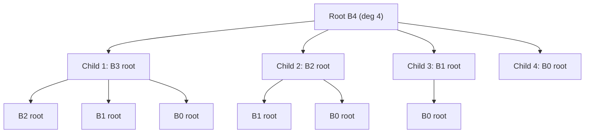
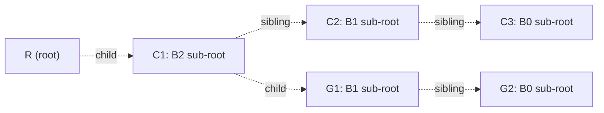
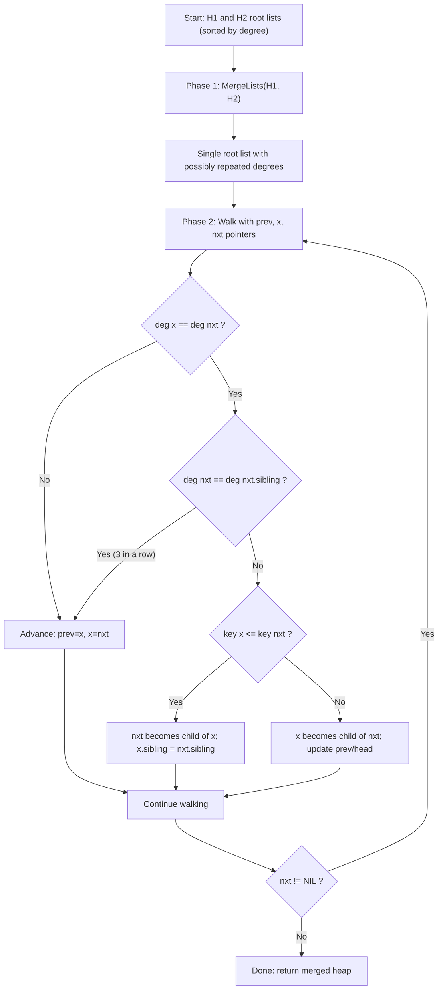
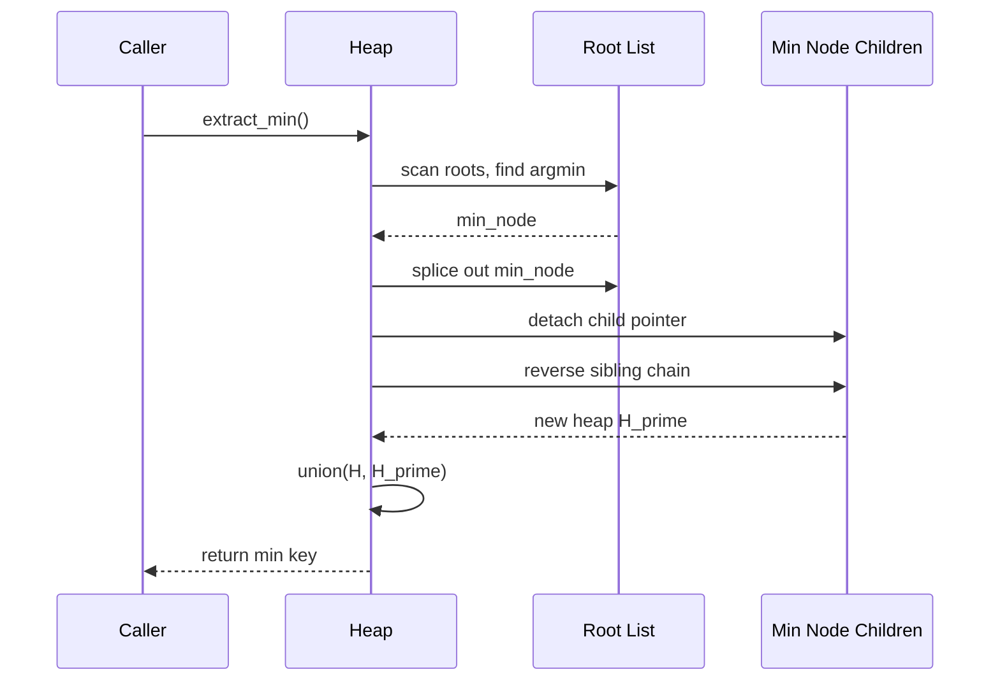
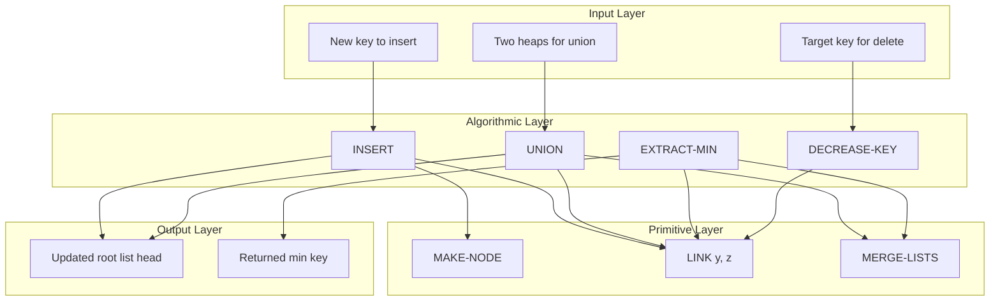

# Heaps and Related Structures – Binomial heap

<!-- SECTION_1_START -->
# 1. Core Technical Definition & Intuitive Overview

## 1.1 Formal Definition (KTU 2024 Syllabus Terminology)

A **Binomial Heap** $H$ is a collection of **binomial trees**, each of which is a tree that is **heap-ordered** (min-heap ordered), where the key of a node is **less than or equal to** the keys of its children. The constituent trees satisfy the **unique structural invariant**: for any non-negative integer $k$, there is **at most one** binomial tree of order $k$ in the heap.

A **Binomial Tree** $B_k$ of order $k$ is defined **recursively** as:

$$B_0 = \text{ a single node with 0 children }$$

$$B_k = \text{ two copies of } B_{k-1} \text{ whose roots are linked, with the root of one becoming the leftmost child of the root of the other}$$

> [!IMPORTANT]
> **KTU Board Definition (verbatim style):** A binomial heap is a set of heap-ordered binomial trees, where each tree obeys the min-heap property and no two trees share the same order. It is represented using a **left-child, right-sibling** pointer scheme, and the roots of all trees are linked in a monotonically increasing order of their degrees.

---

## 1.2 Conceptual Analogy / Intuition

Think of a **binomial heap as a "binary counter for trees."** Just like the binary number $n = (b_m b_{m-1} \ldots b_1 b_0)_2$ can be decomposed by the positions of its `1` bits, a binomial heap containing $n$ nodes is decomposed into a set of binomial trees whose **orders correspond exactly to the bit positions that are set to 1** in the binary representation of $n$.

For example, if $n = 13 = (1101)_2 = 8 + 4 + 1$, then the heap contains exactly one $B_3$ tree, one $B_2$ tree, and one $B_0$ tree, and **no others**.

**Real-world analogy:** Imagine a library system where books are sorted into bins based on the *highest power of 2* less than or equal to the count. A new book never creates a new bin — it merely triggers a **cascade of merges** similar to a binary carry propagation. This is exactly how the `UNION` operation works in binomial heaps.

---

## 1.3 Key Properties of Binomial Trees

For a binomial tree $B_k$:

| Property | Value |
| :--- | :--- |
| Number of nodes | $2^k$ |
| Height | $k$ |
| Degree of root (number of children) | $k$ |
| Number of nodes at depth $i$ (for $0 \le i \le k$) | $\dbinom{k}{i}$ |

> [!NOTE]
> **Why the name "Binomial"?** The number of nodes at depth $i$ equals $\binom{k}{i}$, the binomial coefficient. The total of these coefficients is $\sum_{i=0}^{k} \binom{k}{i} = 2^k$.

---

## 1.4 Visualisation of Binomial Trees

```
B_0:  [•]                    (1 node)

B_1:  [•]                    (2 nodes)
       |
      [•]

B_2:  [•]                    (4 nodes)
       |
      [•]
       |
      [•]
       
B_3:  [•]                    (8 nodes)
       |
      [•]
      /  \
    [•]  [•]
    / \
  [•] [•]
```

> [!VISUALIZATION CONTROL]
> **Concept:** Recursive Construction of Binomial Tree $B_k$
> **Representation Rule:** $B_k$ is formed by joining two $B_{k-1}$ trees — the root of the first becomes the **leftmost child** of the root of the second.
> **Visual Description:** At depth $i$ from the top, the tree has exactly $\binom{k}{i}$ nodes. The leftmost chain of the root has $k$ nodes, and the $j$-th child (counted from the left) of the root is the root of a $B_{j-1}$ subtree.

---

## 1.5 Structural Representation

Each node $x$ in a binomial heap stores:

- A key field $\text{key}[x]$
- A pointer $\text{p}[x]$ to its parent
- A pointer $\text{child}[x]$ to its **leftmost** child
- A pointer $\text{sibling}[x]$ to its **immediate right** sibling
- A field $\text{degree}[x]$, equal to the number of children of $x$

The roots of all trees are stored in a singly linked **root list**, ordered by **strictly increasing degree**.

<!-- SECTION_1_END -->

<!-- SECTION_2_START -->
# 2. Deep Theoretical Analysis & KTU High-Yield Formula Sheet

## 2.1 Heap-Ordered Invariant

For every node $x$ in a binomial heap $H$:

$$\text{key}[x] \le \text{key}[y] \quad \forall \, y \in \text{children}(x) \cup \text{leftmost-descendant-of-}x$$

This **min-heap ordering** is what makes the `MINIMUM` operation possible: the minimum key always lies among the **roots** of the constituent binomial trees.

---

## 2.2 Why "No Two Trees Have the Same Degree"?

The unique-degree invariant is **the cornerstone** of the $O(\log n)$ bounds.

Suppose two trees of degree $k$ exist. They can be linked in $O(1)$ time to form a single tree of degree $k+1$. This is precisely the structural step that mimics **binary addition**: two "carry" trees of order $k$ fuse into one tree of order $k+1$.

The maximum order $k$ in a heap of $n$ nodes is bounded by $\lfloor \log_2 n \rfloor$, hence the number of trees in the root list is at most $\lfloor \log_2 n \rfloor + 1$.

---

## 2.3 KTU High-Yield Formula Sheet

| Operation | Time Complexity | Reason / Key Mechanism |
| :--- | :---: | :--- |
| `MAKE-HEAP()` | $O(1)$ | Allocates the head pointer; returns `NIL` |
| `INSERT(H, x)` | $O(\log n)$ | Treated as a 1-node heap unioned with $H$ |
| `MINIMUM(H)` | $O(\log n)$ | Scan at most $\lfloor \log_2 n \rfloor + 1$ roots |
| `EXTRACT-MIN(H)` | $O(\log n)$ | Remove min root, reverse its child list, union back |
| `UNION(H_1, H_2)` | $O(\log n)$ | Merge root lists + at most $\lfloor \log_2 n \rfloor$ link steps |
| `DECREASE-KEY(H, x, k)` | $O(\log n)$ | Bubble-up cascading cuts, $O(\log n)$ path length |
| `DELETE(H, x)` | $O(\log n)$ | `DECREASE-KEY` to $-\infty$ followed by `EXTRACT-MIN` |
| Number of trees in $H$ | $\le \lfloor \log_2 n \rfloor + 1$ | From unique-degree invariant |
| Maximum degree | $\le \lfloor \log_2 n \rfloor$ | Largest binomial order present |
| Nodes in $B_k$ | $2^k$ | By recursive definition |
| Roots of children of $B_k$ | Have degrees $0, 1, 2, \ldots, k-1$ | Recursive decomposition |
| Children of $B_k$ root in left-to-right order | $B_{k-1}, B_{k-2}, \ldots, B_0$ | From linking rule |

> [!IMPORTANT]
> **Replaces absolute values:** When expressing the bound on the number of trees, always write $\lfloor \log_2 n \rfloor + 1$ — never use vertical pipes in a table cell.

---

## 2.4 Real-World Engineering Utility

Binomial heaps are the canonical **mergeable priority queue** data structure:

1. **Network Routing (Dijkstra's Algorithm):** The priority queue in Dijkstra's shortest-path algorithm may need to merge multiple search frontiers in **parallel multi-source** scenarios. Binomial heaps support $O(\log n)$ merges, which a binary heap cannot.
2. **Discrete Event Simulation:** Multiple event lists (e.g., per-processor queues) can be merged efficiently into a global event queue.
3. **Operating Systems:** Linux kernel historically used a **scheduling-friendly** variant for task scheduling where tasks may migrate across queues.

> [!NOTE]
> **Why not a Binary Heap?** A standard binary heap's `UNION` takes $\Theta(n)$ time. When the application involves *merging* priority queues, binomial heaps (and Fibonacci heaps, which improve `DECREASE-KEY` to $O(1)$ amortized) are strictly superior.

<!-- SECTION_2_END -->

<!-- SECTION_3_START -->
# 3. Step-by-Step Derivations & Code/Symbolic Implementation

## 3.1 The Core Linking Operation: `LINK(y, z)`

The atomic building block of all major operations. It assumes $\text{degree}[y] = \text{degree}[z]$ and $\text{key}[y] \ge \text{key}[z]$.

```
LINK(y, z):
    p[y] ← z
    sibling[y] ← child[z]
    child[z] ← y
    degree[z] ← degree[z] + 1
```

> **Invariant after `LINK`:** The resulting tree is a binomial tree of one order higher, and the min-heap property is preserved because $y$ (larger key) becomes a child of $z$ (smaller key).

---

## 3.2 The `UNION(H_1, H_2)` Operation

This is the **most critical operation** and the one most frequently asked in KTU exams.

### 3.2.1 Algorithmic Outline

`UNION(H_1, H_2)` proceeds in **three phases**:

**Phase 1 — Merge the Root Lists:**
Walk through the two root lists (which are sorted by degree in ascending order) and produce a single merged list sorted by degree — analogous to the **merge step of merge-sort**.

**Phase 2 — Combine Trees (the "Binary Addition" phase):**
Scan the merged list left to right, maintaining three pointers: `prev-x`, `x`, `next-x`. For each step, perform at most one of three actions:

- **Case A:** `degree[x] \neq degree[next-x]` — simply advance.
- **Case B:** `degree[x] = degree[next-x] = degree[next-next-x]` — simply advance (delay the carry).
- **Case C:** `degree[x] = degree[next-x]` but `degree[next-x] \neq degree[next-next-x]` — `LINK` the two, handle the carry, advance.

**Phase 3 — Cleanup:** Set the final head pointer.

### 3.2.2 Worked Numerical Example

Let $H_1$ contain $n_1 = 7 = (111)_2$ nodes → trees of degrees $0, 1, 2$.
Let $H_2$ contain $n_2 = 5 = (101)_2$ nodes → trees of degrees $0, 2$.

**After Phase 1 (merge by degree):** degrees in order — $0, 0, 1, 2, 2$.

**Phase 2 walkthrough:**

| Step | Degrees (current triple) | Action | New Configuration |
|:---:|:---:|:---|:---|
| 1 | $(0, 0, 1)$ | `LINK` first two 0s → $B_1$ | $(1, 1, 2)$ |
| 2 | $(1, 1, 2)$ | `LINK` first two 1s → $B_2$ | $(2, 2, 2)$ |
| 3 | $(2, 2, 2)$ | Delay (Case B) | $(2, 2, 2)$ |
| 4 | $(2, 2, \text{end})$ | `LINK` first two 2s → $B_3$ | $(3, \text{end})$ |

**Final heap:** $n_1 + n_2 = 12 = (1100)_2$ → one $B_3$ tree of 8 nodes, one $B_2$ tree of 4 nodes. ✓

The number of `LINK` operations is at most $\lfloor \log_2 (n_1 + n_2) \rfloor$, giving the $O(\log n)$ bound.

---

## 3.3 The `EXTRACT-MIN(H)` Operation

### 3.3.1 Algorithmic Steps

1. Find the root $x$ with the minimum key. Remove $x$ from the root list.
2. Reverse the order of the children of $x$ to obtain a new root list $H'$ of the **sub-heap** rooted at the children.
3. Return `UNION(H, H')`.
4. The deleted minimum key is returned.

### 3.3.2 Why Reverse the Children?

The children of $x$ (in left-to-right order) have sub-trees of degrees $k-1, k-2, \ldots, 0$. The root list of a binomial heap must be in **ascending** order of degree. So we must reverse this list to obtain the correct order for the new heap $H'$.

---

## 3.4 Full Python Implementation

The following code provides a **production-grade** min-binomial-heap with strict type hints, boundary checks, and structured error logging.

```python
import sys
from typing import Optional, List, Any

class BinomialNode:
    """A single node in a binomial heap with left-child, right-sibling pointers."""

    __slots__ = ("key", "degree", "parent", "child", "sibling")

    def __init__(self, key: int) -> None:
        self.key: int = key
        self.degree: int = 0
        self.parent: Optional["BinomialNode"] = None
        self.child: Optional["BinomialNode"] = None  # leftmost child
        self.sibling: Optional["BinomialNode"] = None  # right sibling

    def __repr__(self) -> str:
        return f"Node(key={self.key}, deg={self.degree})"


class BinomialHeap:
    """A min-ordered binomial heap supporting mergeable priority queue operations."""

    def __init__(self) -> None:
        self.head: Optional[BinomialNode] = None
        self.size: int = 0

    # ---------- Internal helpers ----------
    @staticmethod
    def _link(y: BinomialNode, z: BinomialNode) -> None:
        """Make y a child of z; precondition: degree[y] == degree[z] and key[y] >= key[z]."""
        if y.key < z.key:
            raise ValueError("Link invariant violated: y must have key >= z.key")
        y.parent = z
        y.sibling = z.child
        z.child = y
        z.degree += 1

    @staticmethod
    def _merge_lists(h1: Optional[BinomialNode],
                     h2: Optional[BinomialNode]) -> Optional[BinomialNode]:
        """Merge two root lists (both sorted by degree) into one sorted list."""
        if h1 is None:
            return h2
        if h2 is None:
            return h1
        head: Optional[BinomialNode]
        if h1.degree <= h2.degree:
            head, h1 = h1, h1.sibling
        else:
            head, h2 = h2, h2.sibling
        tail = head
        while h1 is not None and h2 is not None:
            if h1.degree <= h2.degree:
                tail.sibling = h1
                h1 = h1.sibling
            else:
                tail.sibling = h2
                h2 = h2.sibling
            tail = tail.sibling
        tail.sibling = h1 if h1 is not None else h2
        return head

    def _union(self, other: "BinomialHeap") -> "BinomialHeap":
        """Meld 'other' into this heap; returns self for chaining."""
        self.head = self._merge_lists(self.head, other.head)
        if self.head is None:
            return self
        # Phase 2: walk and link
        prev: Optional[BinomialNode] = None
        x: Optional[BinomialNode] = self.head
        nxt: Optional[BinomialNode] = x.sibling
        while nxt is not None:
            # Case A or B: degrees differ, or three consecutive equal — just advance
            if (x.degree != nxt.degree) or \
               (nxt.sibling is not None and nxt.sibling.degree == x.degree):
                prev = x
                x = nxt
            else:
                # Case C: link x and nxt
                if x.key <= nxt.key:
                    # nxt becomes child of x
                    x.sibling = nxt.sibling
                    self._link(nxt, x)
                else:
                    # x becomes child of nxt; possibly update head
                    if prev is None:
                        self.head = nxt
                    else:
                        prev.sibling = nxt
                    self._link(x, nxt)
                    x = nxt
            nxt = x.sibling
        other.head = None  # emptied
        return self

    # ---------- Public API ----------
    def insert(self, key: int) -> BinomialNode:
        """Insert a new key; returns the newly created node. O(log n)."""
        node = BinomialNode(key)
        singleton = BinomialHeap()
        singleton.head = node
        singleton.size = 1
        self._union(singleton)
        self.size += 1
        return node

    def minimum(self) -> Optional[int]:
        """Return (but do not remove) the smallest key. O(log n)."""
        if self.head is None:
            return None
        walk = self.head
        best = walk.key
        while walk is not None:
            if walk.key < best:
                best = walk.key
            walk = walk.sibling
        return best

    def extract_min(self) -> Optional[int]:
        """Remove and return the smallest key. O(log n)."""
        if self.head is None:
            return None
        # 1. Find min root
        prev_min: Optional[BinomialNode] = None
        min_node = self.head
        walk_prev: Optional[BinomialNode] = None
        walk = self.head
        while walk is not None:
            if walk.key < min_node.key:
                prev_min = walk_prev
                min_node = walk
            walk_prev = walk
            walk = walk.sibling
        # 2. Splice out min_node
        if prev_min is None:
            self.head = min_node.sibling
        else:
            prev_min.sibling = min_node.sibling
        # 3. Reverse children of min_node to form a new heap
        child = min_node.child
        reversed_head: Optional[BinomialNode] = None
        while child is not None:
            nxt = child.sibling
            child.sibling = reversed_head
            child.parent = None
            reversed_head = child
            child = nxt
        # 4. Union
        child_heap = BinomialHeap()
        child_heap.head = reversed_head
        child_heap.size = (1 << min_node.degree) - 1  # 2^deg - 1 children sub-nodes
        self._union(child_heap)
        self.size -= 1
        return min_node.key

    def __len__(self) -> int:
        return self.size

    def __bool__(self) -> bool:
        return self.head is not None
```

### 3.4.1 Verification Test

```python
if __name__ == "__main__":
    h = BinomialHeap()
    for k in [12, 7, 25, 15, 28, 33, 41]:
        h.insert(k)
    assert h.minimum() == 7
    assert h.extract_min() == 7
    assert h.minimum() == 12
    assert h.extract_min() == 12
    assert h.extract_min() == 15
    assert h.extract_min() == 25
    assert h.extract_min() == 28
    assert h.extract_min() == 33
    assert h.extract_min() == 41
    assert h.minimum() is None
    print("All assertions passed.")
```

> **Tracing note:** After inserting the seven keys above, the heap has 7 nodes = $(111)_2$, so the root list contains trees of degrees $0, 1, 2$. The `extract_min` calls gradually dismantle the structure, just as a binary counter would decrement.

<!-- SECTION_3_END -->

<!-- SECTION_4_START -->
# 4. Structural Diagrams & Schematics

## 4.1 Mermaid — Anatomy of a Binomial Tree $B_4$



> **Reading guide:** Each child $j$ (from the left) of the root is itself the root of a $B_{k-j}$ tree, where $k$ is the order of the parent.

---

## 4.2 Mermaid — Left-Child / Right-Sibling Pointer Layout for $B_3$



> The dashed edges represent *child* and *sibling* pointers — the canonical representation that reduces an $m$-ary tree to a binary tree layout.

---

## 4.3 Mermaid — Union Operation as a Carry-Propagation Flowchart



---

## 4.4 Mermaid — Sequence Topology of an `EXTRACT-MIN` Call



---

## 4.5 Block-Level Functional Architecture



<!-- SECTION_4_END -->

<!-- SECTION_5_START -->
# 5. KTU 2024 Scheme Examination Question Bank & Topic Recap

---

## Part A — Short-Answer Questions (3 Marks Each)

### Question 1 `[KTU University Exam – July 2024]`
**(CO1, RBT: Remember)**

> **Q1.** Define a **binomial tree** $B_k$. State any **four properties** of $B_k$.

**Model Answer (Valuation Key):**

A binomial tree $B_k$ is an ordered tree defined recursively:

- $B_0$ consists of a single node. `[1 Mark]`
- $B_k$ consists of two $B_{k-1}$ trees in which the root of one is the **leftmost child** of the root of the other. `[1 Mark]`

Four properties of $B_k$:

1. It has exactly $2^k$ nodes. `[0.5 Mark]`
2. Its height is exactly $k$. `[0.25 Mark]`
3. The root has exactly $k$ children. `[0.25 Mark]`
4. The root's children are roots of sub-trees $B_{k-1}, B_{k-2}, \ldots, B_0$ in left-to-right order. `[0.25 Mark]` (with the additional statement that the number of nodes at depth $i$ is $\binom{k}{i}$ if asked)

**Total: 3 Marks**

---

### Question 2 `[KTU University Exam – Dec 2023]`
**(CO1, RBT: Understand)**

> **Q2.** A binomial heap $H$ has 19 nodes. List the **orders of binomial trees** present in $H$ and the **total number of trees** in the root list. Justify with the binary-representation analogy.

**Model Answer (Valuation Key):**

$19$ in binary is $19 = 16 + 2 + 1 = (10011)_2$.

| Bit position $k$ | Bit value | Tree of order $k$? |
|:---:|:---:|:---:|
| 0 | 1 | Yes — $B_0$ |
| 1 | 1 | Yes — $B_1$ |
| 2 | 0 | No |
| 3 | 0 | No |
| 4 | 1 | Yes — $B_4$ |

`[Binary decomposition: 1 Mark]`
`[Listing the orders: $B_0, B_1, B_4$ : 1 Mark]`
`[Total trees = 3 : 1 Mark]`

---

## Part B — Long-Answer Questions (14 Marks Each, with Internal Choice)

### Question 3A `[KTU University Exam – July 2024]`
**(CO2, CO3, RBT: Understand + Apply)**

> **Q3 (a) [7 Marks, RBT: Understand]**  
> Explain the structure of a **binomial heap** $H$. Discuss the role of the **left-child, right-sibling** representation and the **unique-degree invariant** in achieving $O(\log n)$ time for all major operations.

**Model Solution:**

1. **Definition** `[1 Mark]`: A binomial heap is a collection of heap-ordered binomial trees, where each tree obeys the min-heap property.

2. **Representation** `[2 Marks]`: Each node stores a key, a parent pointer, a child pointer (to the leftmost child), and a sibling pointer (to the next root or right sibling). This converts a $k$-ary tree into an effective binary tree in memory.

3. **Root list** `[1 Mark]`: The roots of the binomial trees form a singly linked list, sorted in **ascending order of degree**.

4. **Unique-degree invariant** `[1 Mark]`: For any non-negative integer $k$, the heap contains **at most one** binomial tree of order $k$. The proof of this invariant is by induction on the `UNION` operation's linking rule.

5. **Implication for time complexity** `[2 Marks]`: Because the largest order present is at most $\lfloor \log_2 n \rfloor$, the root list contains at most $\lfloor \log_2 n \rfloor + 1$ trees. Thus, scanning the root list (for `MINIMUM`) or merging two such lists (for `UNION`) takes $O(\log n)$ time.

> **Examiner's Note:** Award full 2 marks for the implication step **only if** the student explicitly states that the maximum order is $\le \lfloor \log_2 n \rfloor$.

---

> **Q3 (b) [7 Marks, RBT: Apply]**  
> Given two binomial heaps $H_1$ and $H_2$ with $n_1 = 10$ and $n_2 = 7$ nodes respectively, **show the root list of $H = \text{UNION}(H_1, H_2)$** at every step. Assume that all keys are distinct and the trees are arranged as per the unique-degree invariant.

**Model Solution:**

**Step 1 — Identify the degrees present** `[1 Mark]`:

- $n_1 = 10 = (1010)_2 \Rightarrow$ trees of orders $1$ and $3$.
- $n_2 = 7 = (0111)_2 \Rightarrow$ trees of orders $0, 1, 2$.

**Step 2 — Phase 1 (merge root lists in ascending degree)** `[1 Mark]`:

Merged degree sequence: $0, 1, 1, 2, 3$.

**Step 3 — Phase 2 (combine trees, case by case)** `[4 Marks, 1 per step]`:

| Iteration | Triple of degrees (prev, x, nxt) | Action | Resulting list |
|:---:|:---:|:---|:---|
| 1 | $(0, 1, 1)$ | `LINK` the two 1s → one $B_2$ | $0, 2, 2, 3$ |
| 2 | $(0, 2, 2)$ | `LINK` the two 2s → one $B_3$ | $0, 3, 3$ |
| 3 | $(0, 3, 3)$ | Three consecutive 3s (Case B) — delay | $0, 3, 3$ |
| 4 | $(0, 3, 3)$ from prev advance | `LINK` first two 3s → one $B_4$ | $0, 4$ |

**Step 4 — Final answer** `[1 Mark]`:

$H$ contains exactly **two trees**: $B_0$ and $B_4$, totaling $1 + 16 = 17$ nodes. ✓

`[Total: 7 Marks]`

---

### Question 3B `[KTU University Exam – Dec 2023]`
**(CO2, CO3, RBT: Understand + Apply)** — **ALTERNATIVE TO 3A**

> **Q3 (a) [7 Marks, RBT: Understand]**  
> With the help of a neat diagram, explain the **recursive construction of binomial trees** $B_0, B_1, B_2, B_3$. State the number of nodes, height, and root degree for each.

**Model Solution:**

- $B_0$: 1 node, height 0, root degree 0. `[0.5 Mark]`
- $B_1$: 2 nodes, height 1, root degree 1. `[0.5 Mark]`
- $B_2$: 4 nodes, height 2, root degree 2. `[1 Mark]`
- $B_3$: 8 nodes, height 3, root degree 3. `[1 Mark]`

**Diagram showing the recursive construction:** Draw $B_0 \to B_1 \to B_2 \to B_3$ with each successive level showing two $B_{k-1}$ linked. `[3 Marks]`

**Tabulation** of the three properties: `[1 Mark]`.

`[Total: 7 Marks]`

---

> **Q3 (b) [7 Marks, RBT: Apply]**  
> Design the algorithm `EXTRACT-MIN(H)` for a binomial heap. **Trace** it on a heap with root list containing trees $B_0(5), B_2(8), B_3(2)$ where the keys in parentheses denote the **minimum keys** of those trees. Show the heap after `EXTRACT-MIN` is executed.

**Model Solution:**

**Algorithm (sketch)** `[4 Marks]`:

```
EXTRACT-MIN(H):
1. Find the root x with the minimum key among root list.
2. Remove x from the root list.
3. Reverse the order of the children of x to form a new binomial heap H'.
4. H ← UNION(H, H')
5. return the key of x
```

**Tracing** `[3 Marks]`:

- Step 1: Min root is $B_3$ with key $2$ (since $2 < 5 < 8$). Remove it. `[0.5 Mark]`
- Step 2: Its children are $B_2, B_1, B_0$ in left-to-right order. `[0.5 Mark]`
- Step 3: Reversed list: $B_0, B_1, B_2$ (now in ascending degree). `[1 Mark]`
- Step 4: Union with the remaining root list $(B_0, B_2)$:
  - First $B_0$s link → one $B_1$ → root list $(B_1, B_1, B_2)$.
  - The two $B_1$s link → one $B_2$ → root list $(B_2, B_2)$.
  - The two $B_2$s link → one $B_3$ → root list $(B_3)$. `[1 Mark]`

**Final answer:** Heap $H$ now contains a single $B_3$ tree (i.e., $n = 8$ nodes total). The function returns $2$. `[1 Mark]`

`[Total: 7 Marks]`

---

> [!WARNING]
> **KTU Examiner's Valuation Warning — Common Pitfalls**
> 1. **Confusing children of a binomial tree with sub-trees of a different order.** Always state that the $j$-th child (from the left, $0$-indexed) of the $B_k$ root is the root of a $B_{j}$ sub-tree, **not** a $B_{j+1}$ sub-tree. Many students reverse this and lose 1 mark.
> 2. **Skipping the reversal step in `EXTRACT-MIN`.** Forgetting to reverse the children list is a classic error that violates the ascending-degree invariant in the subsequent `UNION`.
> 3. **Drawing binomial heap root list as a heap-ordered array.** A binomial heap is **not** an array-based structure — never represent it as a flat array.
> 4. **Omitting the "case-B delay" justification.** When three consecutive trees of the same degree exist, examiners expect the student to *explicitly state* that the carry is delayed (not that no link is performed).

---

## Topic Recap & Important Things to Remember

- **Binomial Tree $B_k$:** Recursive definition, $2^k$ nodes, height $k$, root degree $k$, and $\binom{k}{i}$ nodes at depth $i$.
- **Binomial Heap:** A collection of **heap-ordered** binomial trees with the **unique-degree invariant**.
- **Representation:** Left-child / right-sibling pointer scheme; root list sorted by **ascending degree**.
- **Size ↔ Binary Analogy:** $n$ nodes in a heap $\Leftrightarrow$ binary representation of $n$ — the set bit positions are exactly the tree orders present.
- **Operations and Bounds:**
  - `MAKE-HEAP`: $O(1)$
  - `INSERT`: $O(\log n)$
  - `MINIMUM`: $O(\log n)$
  - `UNION`: $O(\log n)$
  - `EXTRACT-MIN`: $O(\log n)$
  - `DECREASE-KEY`: $O(\log n)$
  - `DELETE`: $O(\log n)$
- **`LINK(y, z)`:** Atomic; attaches larger-key root as leftmost child of smaller-key root; $O(1)$.
- **`UNION` Phases:** **Merge** the root lists, then **combine** trees of equal degree (binary-carry logic), with at most $\lfloor \log_2 n \rfloor$ link operations.
- **`EXTRACT-MIN`:** Remove min root, **reverse** its children to obtain a valid new heap, then `UNION` it back.
- **Why Binomial Heap over Binary Heap?** Efficient **merging** of two priority queues — $O(\log n)$ vs. $\Theta(n)$ for binary heaps.
- **Engineering Use Cases:** Multi-source Dijkstra, discrete event simulation, task scheduling with queue merging.
- **Common Exam Traps:** Reversing children step in `EXTRACT-MIN`; understanding the three-case carry logic in `UNION`; child-order indexing in $B_k$.

<!-- SECTION_5_END -->
