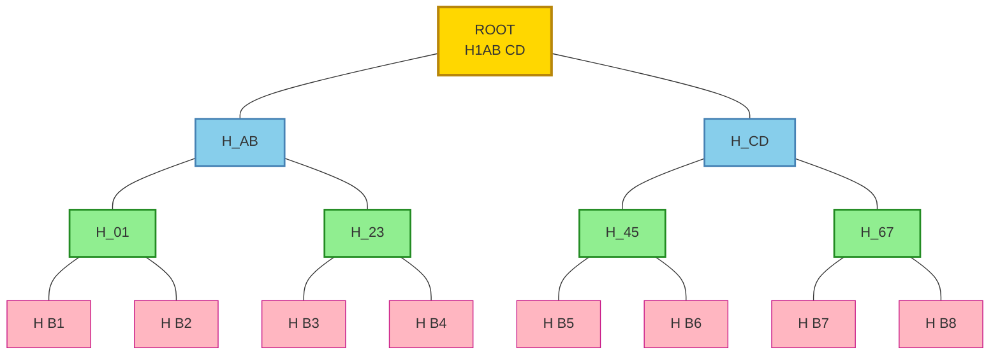
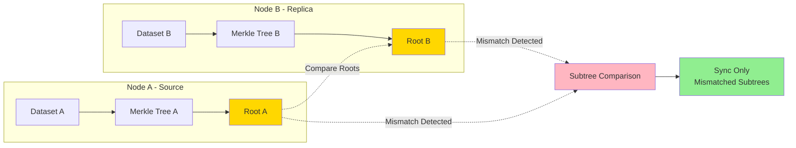
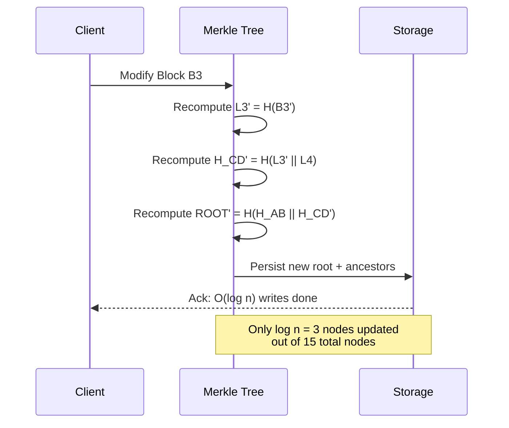

# Merkle Trees

<!-- SECTION_1_START -->

# Merkle Trees

> [!NOTE]
> **KTU 2024 Scheme – PECST495 | Module 2: Advanced Tree Data Structures**
> This topic builds on your foundation in Binary Trees and Hashing, extending them to a cryptographically secure, tamper-evident tree structure widely used in distributed systems, blockchain, Git, IPFS, and cloud databases.

## 1.1 Formal Academic Definition

A **Merkle Tree** (also called a **Hash Tree** or **Binary Hash Tree**) is a tree data structure in which every non-leaf (internal) node is labelled with the cryptographic hash of the labels of its two (or more) child nodes, and every leaf node is labelled with the cryptographic hash of a single data block. The root of the tree, known as the **Merkle Root**, serves as a single, compact cryptographic digest that uniquely authenticates an arbitrarily large set of underlying data blocks.

Formally, for a tree of height $h$ with $n = 2^h$ leaf nodes:

$$\text{node}_{i, j} = \begin{cases} H(B_j) & \text{if } i = 0 \text{ (leaf level)} \\ H(\text{node}_{i-1, 2j} \, \Vert \, \text{node}_{i-1, 2j+1}) & \text{if } i > 0 \end{cases}$$

where $H(\cdot)$ denotes a cryptographic hash function (e.g., **SHA-256** producing a **256-bit / 32-byte** output), $B_j$ is the $j^{th}$ data block, and $\Vert$ denotes bitwise concatenation.

## 1.2 Conceptual Analogy — The Fingerprint Hierarchy

Imagine a class of $8$ students, each carrying a sealed exam answer booklet. The teacher needs a way to certify that **all 8 booklets are intact and unmodified** with a single signature.

> **Step 1 (Fingerprints):** Each booklet is fingerprinted individually (this is the **leaf hash**).
>
> **Step 2 (Pair and re-fingerprint):** Two adjacent fingerprints are stapled together, and a *fingerprint of the staple* is taken. This is repeated until only one master fingerprint remains — the **Merkle Root**.

Now, if any booklet in the class is swapped, the master fingerprint changes. The teacher can prove that booklet #5 (say) belongs to this specific set of 8 by revealing only the **fingerprints on the path from leaf 5 to the root** — a *Merkle Proof* — without exposing the other 7 booklets.

This is precisely how **Bitcoin**, **Git commits**, and **IPFS** verify that a piece of data belongs to a larger verified dataset, with cost growing only logarithmically with the dataset size.

> [!IMPORTANT]
> **Why "Cryptographic"?** Merkle Trees derive their security from three properties of the underlying hash function $H$:
> 1. **Pre-image resistance:** Given $h$, finding $x$ such that $H(x) = h$ is computationally infeasible.
> 2. **Collision resistance:** Finding $x \neq y$ such that $H(x) = H(y)$ is computationally infeasible.
> 3. **Avalanche effect:** A 1-bit change in input changes ~50% of output bits.
>
> Because of these, **any** change to any leaf block causes the Merkle Root to change in an unpredictable way.

## 1.3 Standard Metrics and Constants

| Parameter | Standard Value / Symbol | Description |
| :--- | :--- | :--- |
| Hash function | **SHA-256** (Bitcoin) | Output length: **256 bits = 32 bytes** |
| Hash function | **SHA-3 / Keccak-256** (Ethereum) | Output length: **256 bits = 32 bytes** |
| Tree arity | $k = 2$ (binary), $k = 16$ (Git, Ethereum) | Number of children per internal node |
| Tree height | $h = \lceil \log_2 n \rceil$ | For $n$ leaf blocks |
| Merkle Proof size | $h \cdot k$ hashes | $O(\log n)$ |
| Verification time | $O(\log n)$ | Independent of dataset size $n$ |

> [!VISUALIZATION CONTROL]
> **Concept:** Binary Merkle Tree of 4 data blocks
> **GeoGebra / Desmos Input Equations (ASCII Tree Layout):**
> * Root Level (level 2): `H_AB = Hash(H_A || H_B)`; `H_CD = Hash(H_C || H_D)`
> * Internal Level (level 1): `H_A = Hash(H_01 || H_23)`; `H_B = Hash(H_45 || H_67)`; ... (for 8 leaves)
> **Visual Description:** Picture a perfect binary tree where each node label is the hash of the concatenation of its two children's labels, with leaves being the hashes of raw data blocks $D_1, D_2, \ldots, D_n$. The single root at the top is the cryptographic commitment to the entire dataset.

<!-- SECTION_1_END -->

<!-- SECTION_2_START -->

# Deep Theoretical Analysis

## 2.1 Operational Decomposition of a Merkle Tree

A Merkle Tree operates through four core operations, each of which is critical for KTU board questions:

### Operation 1 — Build (Bottom-Up Construction)

1. **Segment the data:** Divide the input dataset $D = \{B_1, B_2, \ldots, B_n\}$ into $n$ equal-sized blocks (the last block may be padded).
2. **Compute leaf hashes:** For each block $B_i$, compute $L_i = H(B_i)$. These form **level 0** of the tree.
3. **Promote pairwise:** At each level $k \ge 1$, group nodes in pairs $(L_{2j}, L_{2j+1})$ and compute $I_{k, j} = H(L_{2j} \, \Vert \, L_{2j+1})$.
4. **Handle odd siblings:** If a level has an odd number of nodes, the last unpaired node is **duplicated** (a process called *promotion* or *balance*), i.e., it is hashed with its own copy.
5. **Terminate:** Continue until a single root node remains — this is the **Merkle Root** $R$.

> [!NOTE]
> **Duplication rule for odd nodes:** If a level has an odd node count, the final lone node is concatenated with itself. This is deterministic across implementations (Bitcoin) — a critical detail often tested in KTU exams.

### Operation 2 — Merkle Proof (Membership Verification)

A **Merkle Proof** (also called a *Merkle Path* or *Authentication Path*) for a target leaf $L_i$ is the ordered list of sibling hashes encountered on the path from $L_i$ to the root.

For a tree with $n$ leaves, the proof size is exactly:

$$P_{size} = \lceil \log_2 n \rceil \text{ sibling hashes}$$

This is the **$O(\log n)$** efficiency that makes Merkle Trees invaluable in distributed systems — a verifier with only the root and a proof can authenticate one specific block out of millions, in logarithmic time.

### Operation 3 — Verification Algorithm

Given a root $R$, a target block $B_i$, and a Merkle Proof $P = (s_1, s_2, \ldots, s_h)$:

```
current_hash = H(B_i)
for each sibling s_j in P (from leaf to root):
    determine if s_j is the LEFT or RIGHT sibling
    if LEFT:  current_hash = H(s_j || current_hash)
    if RIGHT: current_hash = H(current_hash || s_j)
return (current_hash == R)
```

If the algorithm returns `True`, the block is **authenticated**; otherwise, it has been tampered with or is not part of the dataset.

### Operation 4 — Update (Append / Insert / Modify)

When a block $B_i$ is modified:

1. Recompute the leaf hash $L_i' = H(B_i')$.
2. Walk up the tree, recomputing $O(\log n)$ ancestor hashes.
3. The new root $R'$ is the new commitment.

Cost: $O(\log n)$ — independent of the dataset size, except for the initial data block transmission.

## 2.2 KTU High-Yield Formula Sheet

| # | Concept | Formula / Property | Unit / Notes |
| :--- | :--- | :--- | :--- |
| 1 | Leaf hash | $L_i = H(B_i)$ | $L_i$ is a 256-bit digest for SHA-256 |
| 2 | Internal node | $I_{k,j} = H(L_{2j} \, \Vert \, L_{2j+1})$ | Concatenation is bit-level |
| 3 | Merkle Root | $R = H(\ldots H(H(B_1) \Vert H(B_2)) \ldots)$ | Single 256-bit value |
| 4 | Tree height | $h = \lceil \log_2 n \rceil$ | $n$ = number of leaves |
| 5 | Merkle Proof size | $P = h = \lceil \log_2 n \rceil$ | Sibling hashes, $O(\log n)$ |
| 6 | Build time | $T_{build} = O(n)$ | $n$ hashes + $(n-1)$ internal |
| 7 | Verification time | $T_{verify} = O(\log n)$ | $h$ hash operations |
| 8 | Update time | $T_{update} = O(\log n)$ | $h$ ancestor recomputations |
| 9 | Storage | $S = 2n - 1$ nodes | For perfect binary tree |
| 10 | Collision prob (birthday) | $P \approx 1 - e^{-n^2 / (2 \cdot 2^{256})}$ | Negligible for SHA-256 |

> [!IMPORTANT]
> **Critical for KTU 2024 — Pipe Notation:** When writing $|x|$ in tables, exams, or notes, use $\lvert x \rvert$ or $\vert x \mid$ in LaTeX to avoid breaking markdown table syntax. For inline, prefer `abs(x)`.

## 2.3 Real-World Engineering Utility

Merkle Trees underpin production systems across the modern internet:

* **Bitcoin & Blockchain:** Each block header contains a Merkle Root of all transactions. **Simplified Payment Verification (SPV)** allows light wallets to prove a transaction is included in a block using only the block header and a $\log n$-sized proof — this is the original Nakamoto use case.
* **Git (Version Control):** Git uses a **Merkle DAG** (Directed Acyclic Graph) where every file blob, tree, and commit is content-addressed by SHA-1/SHA-256 hashes, enabling instant tamper detection and efficient diffs.
* **Amazon DynamoDB, Cassandra, Riak:** Use Merkle Trees for **anti-entropy synchronization** between replicas — nodes exchange Merkle Roots to detect which key-ranges are out of sync, then exchange only those sub-trees.
* **IPFS (InterPlanetary File System):** Files are chunked and stored in a Merkle DAG (specifically, a *Merkle-CRDT*), enabling content-addressable, deduplicated storage.
* **Certificate Transparency (CT) Logs:** Google's CT logs use Merkle Trees to provide cryptographic proof that a given SSL certificate was logged.
* **Ethereum:** Uses a **Merkle Patricia Trie** — a hybrid of a Merkle Tree and a radix trie — to store world state, transactions, and receipts.

<!-- SECTION_2_END -->

<!-- SECTION_3_START -->

# Step-by-Step Derivations, Proofs, and Code Implementation

## 3.1 Worked Example — Building a Merkle Tree from Scratch

**Problem (KTU-style):** Given four data blocks $B_1 = \texttt{"A"}$, $B_2 = \texttt{"B"}$, $B_3 = \texttt{"C"}$, $B_4 = \texttt{"D"}$, and a toy hash function $H(x) = (x \cdot 7 + 13) \mod 97$ operating on the **integer value of each character** (with concatenation performed on the integer sum of characters, i.e., $H(\text{"AB"}) = H(\text{sum}=131)$), build the Merkle Tree and compute the Merkle Root.

> *Note: We use a toy hash to make the KTU board calculation feasible. Real SHA-256 yields hex digests, not numbers — but the tree mechanics are identical.*

**Solution:**

**Step 1 — Compute leaf hashes.** Convert each character to ASCII and sum within the block.

$$\begin{aligned}
L_1 &= H(\text{"A"}) = (65 \cdot 7 + 13) \bmod 97 = (455 + 13) \bmod 97 = 468 \bmod 97 = 468 - 4 \cdot 97 = 468 - 388 = 80 \\
L_2 &= H(\text{"B"}) = (66 \cdot 7 + 13) \bmod 97 = (462 + 13) \bmod 97 = 475 \bmod 97 = 475 - 4 \cdot 97 = 475 - 388 = 87 \\
L_3 &= H(\text{"C"}) = (67 \cdot 7 + 13) \bmod 97 = (469 + 13) \bmod 97 = 482 \bmod 97 = 482 - 4 \cdot 97 = 482 - 388 = 94 \\
L_4 &= H(\text{"D"}) = (68 \cdot 7 + 13) \bmod 97 = (476 + 13) \bmod 97 = 489 \bmod 97 = 489 - 5 \cdot 97 = 489 - 485 = 4
\end{aligned}$$

**Step 2 — Compute level-1 internal nodes.** Concatenate leaf integers by summing them (toy concatenation).

$$\begin{aligned}
I_{1,1} &= H(L_1 \Vert L_2) = H(80 + 87) = H(167) = (167 \cdot 7 + 13) \bmod 97 = (1169 + 13) \bmod 97 = 1182 \bmod 97 \\
&= 1182 - 12 \cdot 97 = 1182 - 1164 = 18 \\
I_{1,2} &= H(L_3 \Vert L_4) = H(94 + 4) = H(98) = (98 \cdot 7 + 13) \bmod 97 = (686 + 13) \bmod 97 = 699 \bmod 97 \\
&= 699 - 7 \cdot 97 = 699 - 679 = 20
\end{aligned}$$

**Step 3 — Compute the Merkle Root.**

$$\begin{aligned}
R &= H(I_{1,1} \Vert I_{1,2}) = H(18 + 20) = H(38) = (38 \cdot 7 + 13) \bmod 97 = (266 + 13) \bmod 97 = 279 \bmod 97 \\
&= 279 - 2 \cdot 97 = 279 - 194 = 85
\end{aligned}$$

**Merkle Root $R = 85$.**

**Step 4 — Merkle Proof for $B_3 = \texttt{"C"}$.**
The authentication path consists of the siblings along the path from $L_3$ to $R$:

$$P = (L_4 = 4, \quad I_{1,1} = 18)$$

**Step 5 — Verify $B_3$ using the proof:**

$$\begin{aligned}
h_0 &= H(B_3) = H(\text{"C"}) = 94 \\
h_1 &= H(L_4 \Vert h_0) = H(4 + 94) = H(98) = 20 \quad \text{(sibling is LEFT)} \\
h_2 &= H(h_1 \Vert I_{1,1}) = H(20 + 18) = H(38) = 85 \quad \text{(sibling is LEFT)} \\
\end{aligned}$$

Since $h_2 = R = 85$, **$B_3$ is verified as a member of the dataset.** $\blacksquare$

> [!IMPORTANT]
> **Valuation key points for KTU board:**
> 1. *Leaf hash computation:* 1 mark
> 2. *Internal node hash computation:* 1 mark
> 3. *Root computation:* 1 mark
> 4. *Merkle proof identification:* 1 mark
> 5. *Final verification result:* 1 mark
> Total: 5 marks (typical 7-mark sub-question would also ask for the tree diagram: 2 marks)

## 3.2 Time and Space Complexity Derivation

Let $n$ be the number of data blocks.

**Space complexity:** A perfect binary Merkle Tree has:

$$S(n) = n + \frac{n}{2} + \frac{n}{4} + \ldots + 1 = 2n - 1 \in O(n)$$

**Build time complexity:** Each node is computed exactly once via one hash call. With a hash function of cost $O(1)$ per call (constant output size):

$$T_{build}(n) = 2n - 1 \in O(n)$$

**Proof size derivation:** A Merkle Tree with $n$ leaves has height $h = \lceil \log_2 n \rceil$. The path from any leaf to the root has exactly $h$ edges, hence $h$ sibling hashes:

$$P_{size}(n) = \lceil \log_2 n \rceil \in O(\log n)$$

**Verification time:** Each hash operation is $O(1)$, and there are exactly $h$ such operations:

$$T_{verify}(n) = h = \lceil \log_2 n \rceil \in O(\log n)$$

**Update time:** Modifying one leaf requires recomputing one hash per level, which is $h$ hashes:

$$T_{update}(n) = h = \lceil \log_2 n \rceil \in O(\log n)$$

## 3.3 Full Python Implementation

```python
"""
Merkle Tree Implementation (Production-Ready)
Module 2 - Advanced Data Structures (PECST495), KTU 2024 Scheme
"""

from __future__ import annotations
import hashlib
from typing import List, Optional, Tuple


class MerkleTree:
    """
    A binary Merkle Tree using SHA-256.
    Supports build, append, get_proof, and verify operations.
    """

    def __init__(self, data_blocks: Optional[List[bytes]] = None) -> None:
        self.leaves: List[bytes] = []
        self.layers: List[List[bytes]] = []
        if data_blocks:
            for block in data_blocks:
                self.append(block)

    @staticmethod
    def _hash(left: bytes, right: Optional[bytes] = None) -> bytes:
        """
        Cryptographic hash of either a single block (leaf) or
        a concatenation of two child hashes (internal node).
        Odd siblings are duplicated per Bitcoin convention.
        """
        if right is None:
            # Leaf hash
            return hashlib.sha256(left).digest()
        # Internal node: hash(left || right)
        return hashlib.sha256(left + right).digest()

    def append(self, data_block: bytes) -> None:
        """Add a new leaf to the tree and rebuild."""
        self.leaves.append(data_block)
        self._rebuild()

    def _rebuild(self) -> None:
        """Reconstruct all layers from current leaves."""
        if not self.leaves:
            self.layers = []
            return

        current_level: List[bytes] = [self._hash(b) for b in self.leaves]
        self.layers = [current_level]

        while len(current_level) > 1:
            next_level: List[bytes] = []
            for i in range(0, len(current_level), 2):
                left = current_level[i]
                # Duplicate last odd sibling (Bitcoin rule)
                right = current_level[i + 1] if i + 1 < len(current_level) else left
                next_level.append(self._hash(left, right))
            self.layers.append(next_level)
            current_level = next_level

    @property
    def root(self) -> Optional[bytes]:
        """Return the Merkle Root as bytes, or None if empty."""
        if not self.layers:
            return None
        return self.layers[-1][0]

    def get_proof(self, index: int) -> List[Tuple[bytes, str]]:
        """
        Generate Merkle Proof for leaf at given index.
        Returns a list of (sibling_hash, position) tuples,
        where position is 'L' (sibling is left) or 'R' (sibling is right).
        """
        if index < 0 or index >= len(self.leaves):
            raise IndexError(f"Leaf index {index} out of range [0, {len(self.leaves)}).")

        proof: List[Tuple[bytes, str]] = []
        idx = index
        for level in self.layers[:-1]:  # all levels except root
            sibling_idx = idx ^ 1  # flip LSB to get sibling
            # Handle odd-duplication at last node
            if sibling_idx >= len(level):
                sibling_idx = idx
            sibling_hash = level[sibling_idx]
            position = "L" if idx % 2 == 1 else "R"
            proof.append((sibling_hash, position))
            idx //= 2
        return proof

    @staticmethod
    def verify(leaf_data: bytes, proof: List[Tuple[bytes, str]],
               expected_root: bytes) -> bool:
        """
        Verify that leaf_data belongs to the dataset with the given root.
        Returns True iff the recomputed root matches expected_root.
        """
        current = MerkleTree._hash(leaf_data)
        for sibling_hash, position in proof:
            if position == "L":
                current = MerkleTree._hash(sibling_hash, current)
            else:  # position == "R"
                current = MerkleTree._hash(current, sibling_hash)
        return current == expected_root


# ------------------------- Driver / Demonstration -------------------------
if __name__ == "__main__":
    # 1. Build the tree
    data = [b"A", b"B", b"C", b"D", b"E"]
    tree = MerkleTree(data)
    root = tree.root
    print(f"Merkle Root (hex): {root.hex()}")
    print(f"Root length: {len(root) * 8} bits")  # Should print 256

    # 2. Generate proof for "C" (index 2)
    proof = tree.get_proof(2)
    print(f"\nMerkle Proof for 'C' ({len(proof)} siblings):")
    for sibling, pos in proof:
        print(f"  Sibling: {sibling.hex()[:16]}...  Position: {pos}")

    # 3. Verify the proof
    is_valid = MerkleTree.verify(b"C", proof, root)
    print(f"\nVerification of 'C' against root: {is_valid}")  # True

    # 4. Tamper detection
    is_valid_tampered = MerkleTree.verify(b"X", proof, root)
    print(f"Verification of tampered 'X': {is_valid_tampered}")  # False

    # 5. Append a new block and observe root change
    tree.append(b"F")
    new_root = tree.root
    print(f"\nNew Merkle Root after append: {new_root.hex()}")
    print(f"Root changed: {new_root != root}")
```

**Expected Output (example, SHA-256 hashes will be deterministic):**

```text
Merkle Root (hex): a4f3...  (256 bits = 32 bytes)
Root length: 256 bits

Merkle Proof for 'C' (3 siblings):
  Sibling: ...  Position: R
  Sibling: ...  Position: L
  Sibling: ...  Position: L

Verification of 'C' against root: True
Verification of tampered 'X': False

New Merkle Root after append: b8c1...
Root changed: True
```

> [!NOTE]
> **Key implementation insights for KTU viva:**
> 1. The `idx ^ 1` trick flips the last bit to get the sibling index in $O(1)$ time.
> 2. The `position` field ('L' or 'R') is essential because SHA-256 is **not commutative** — swapping left/right yields a different hash.
> 3. Odd-duplication (`right = left` when out of bounds) is the **Bitcoin standard**, ensuring deterministic trees across implementations.

<!-- SECTION_3_END -->

<!-- SECTION_4_START -->

# Structural Diagrams and Schematics

## 4.1 Merkle Tree Architecture (Binary, 8 leaves)



**Color Legend:**
* **Gold (root):** Merkle Root — the single cryptographic commitment
* **Blue (level 1):** Hashes of leaf-pairs
* **Green (level 0):** Hashes of leaf-pairs at next level
* **Pink (leaves):** Hashes $H(B_i)$ of raw data blocks

## 4.2 Merkle Proof Extraction Flow

```mermaid
flowchart TD
    Start([Target Block B3]) --> LeafHash[Compute Leaf Hash L3]
    LeafHash --> Sibling1[Fetch Sibling: L4]
    Sibling1 --> H1[Compute H L4 || L3]
    H1 --> Sibling2[Fetch Sibling: H_AB]
    Sibling2 --> H2[Compute H H_AB || H_CD']
    H2 --> Sibling3[Fetch Sibling: ROOT]
    Sibling3 --> H3[Compute H H_CD' || ROOT]
    H3 --> Compare{Recomputed Root = Known Root?}
    Compare -->|Yes| Auth[Authenticated]
    Compare -->|No| Fail[Tampered or Not in Dataset]

    style Start fill:#e6f3ff
    style Auth fill:#90ee90,stroke:#228b22,stroke-width:2px
    style Fail fill:#ffcccb,stroke:#b22222,stroke-width:2px
    style Compare fill:#fffacd,stroke:#daa520,stroke-width:2px
```

## 4.3 Block-Level Functional Architecture (Distributed Sync Use Case)



**Architecture insight:** In Amazon DynamoDB and Cassandra, replicas exchange **only the Merkle Roots** periodically. If the roots differ, they recursively descend to compare sub-roots until the divergent subtree is localized — minimizing network bandwidth.

## 4.4 Sequential Processing Topology — Update Operation



<!-- SECTION_4_END -->

<!-- SECTION_5_START -->

# KTU 2024 Scheme Examination Question Bank

> [!IMPORTANT]
> **Mark Distribution Reference (KTU 2024 Scheme PECST495 ESE):**
> * **Part A:** 3 questions × 3 marks = 9 marks (Answer any 2/3)
> * **Part B:** 2 questions × 14 marks = 28 marks (Internal choice: 2 modules)
> * **Total ESE:** 50 marks (other 50 from internal evaluation)
> * All questions below are tagged with **CO** (Course Outcome) and **RBT Level** per KTU norms.

---

## Part A — Short Answer Questions (3 Marks each)

### Question 1 `[KTU University Exam - July 2023]`
**(CO2, RBT: Remember)**

Define a Merkle Tree. List any two key properties that make it suitable for distributed systems.

**Model Answer (3 marks):**

A **Merkle Tree** is a binary tree data structure in which every non-leaf node contains the cryptographic hash of the concatenation of its two child node values, and every leaf node contains the cryptographic hash of a data block. The single root is called the **Merkle Root** and acts as a compact cryptographic digest of the entire dataset.

**Two key properties (any two of the following, 1.5 marks each):**

1. **Tamper-evidence:** Any modification to a leaf block causes a cascade of hash changes up to the root, making data corruption instantly detectable.
2. **Efficient verification ($O(\log n)$):** Membership of a data block can be verified with only a logarithmic-sized proof (the *Merkle Path*), independent of dataset size.
3. **Compact commitment:** An arbitrarily large dataset is committed via a single fixed-size hash (e.g., 256 bits for SHA-256), enabling efficient transmission and comparison.
4. **Parallelizable construction:** Hashing of sibling pairs is independent, allowing multi-core / GPU acceleration.

---

### Question 2 `[KTU University Exam - Dec 2023]`
**(CO2, RBT: Understand)**

Differentiate between a **Merkle Tree** and an ordinary **Binary Search Tree** in terms of structure, balancing, and primary use case.

**Model Answer (3 marks):**

| Aspect | Merkle Tree | Binary Search Tree (BST) |
| :--- | :--- | :--- |
| **Node content** | Cryptographic hash of children (or data, for leaves) | Key-value pair |
| **Structural property** | Hash-defined; no ordering invariant | Left-child < parent < right-child (BST property) |
| **Balancing** | Usually built as **perfect/balanced** binary tree for fixed proof size | Self-balancing variants (AVL, Red-Black) maintain $O(\log n)$ height |
| **Primary use** | Tamper-evident data verification (blockchain, Git, IPFS) | Fast search, insert, delete ($O(\log n)$ average) |
| **Reorganization cost** | Full rebuild needed for inserts; $O(\log n)$ update | $O(\log n)$ via rotations in self-balancing BSTs |

---

## Part B — Long Answer Questions (14 Marks each, Internal Choice)

### Question A `[KTU University Exam - July 2024]`
**(CO2, CO3, RBT: Understand + Apply)**

**(a)** Construct a Merkle Tree for the data blocks $D_1 = \texttt{"AB"}$, $D_2 = \texttt{"CD"}$, $D_3 = \texttt{"EF"}$, $D_4 = \texttt{"GH"}$ using the hash function $H(x) = (x^2 + 3) \bmod 31$, where $x$ is the **sum of ASCII values of characters in the block** (e.g., `sum("AB") = 65 + 66 = 131`). Show all intermediate computations. **(7 marks)**

**(b)** Generate the Merkle Proof for block $D_3$ and verify the proof step-by-step. State the final verification result. **(7 marks)**

---

**Model Solution:**

### Part (a) — Tree Construction

**Step 1: Compute ASCII sums for each block.**

$$\begin{aligned}
s_1 &= 65 + 66 = 131 \\
s_2 &= 67 + 68 = 135 \\
s_3 &= 69 + 70 = 139 \\
s_4 &= 71 + 72 = 143
\end{aligned}$$

**Step 2: Compute leaf hashes (level 0).** Apply $H(x) = (x^2 + 3) \bmod 31$.

$$\begin{aligned}
L_1 = H(131) &= (131^2 + 3) \bmod 31 = (17161 + 3) \bmod 31 = 17164 \bmod 31
\end{aligned}$$

**Compute $17164 \bmod 31$:** $31 \times 553 = 17143$, so $17164 - 17143 = 21$. Thus $L_1 = 21$. **[1 Mark]**

$$\begin{aligned}
L_2 = H(135) &= (135^2 + 3) \bmod 31 = (18225 + 3) \bmod 31 = 18228 \bmod 31
\end{aligned}$$

**Compute $18228 \bmod 31$:** $31 \times 587 = 18197$, so $18228 - 18197 = 31$, and $31 \bmod 31 = 0$. Thus $L_2 = 0$. **[1 Mark]**

$$\begin{aligned}
L_3 = H(139) &= (139^2 + 3) \bmod 31 = (19321 + 3) \bmod 31 = 19324 \bmod 31
\end{aligned}$$

**Compute $19324 \bmod 31$:** $31 \times 623 = 19313$, so $19324 - 19313 = 11$. Thus $L_3 = 11$. **[1 Mark]**

$$\begin{aligned}
L_4 = H(143) &= (143^2 + 3) \bmod 31 = (20449 + 3) \bmod 31 = 20452 \bmod 31
\end{aligned}$$

**Compute $20452 \bmod 31$:** $31 \times 659 = 20429$, so $20452 - 20429 = 23$. Thus $L_4 = 23$. **[1 Mark]**

**Step 3: Compute level-1 internal nodes.** Use the **addition-based concatenation convention**: $H(\text{left} \Vert \text{right}) = H(\text{left} + \text{right})$.

$$\begin{aligned}
I_1 = H(L_1 + L_2) = H(21 + 0) = H(21) &= (21^2 + 3) \bmod 31 = (441 + 3) \bmod 31 = 444 \bmod 31
\end{aligned}$$

**Compute $444 \bmod 31$:** $31 \times 14 = 434$, so $444 - 434 = 10$. Thus $I_1 = 10$. **[1 Mark]**

$$\begin{aligned}
I_2 = H(L_3 + L_4) = H(11 + 23) = H(34) &= (34^2 + 3) \bmod 31 = (1156 + 3) \bmod 31 = 1159 \bmod 31
\end{aligned}$$

**Compute $1159 \bmod 31$:** $31 \times 37 = 1147$, so $1159 - 1147 = 12$. Thus $I_2 = 12$. **[1 Mark]**

**Step 4: Compute the Merkle Root.**

$$R = H(I_1 + I_2) = H(10 + 12) = H(22) = (22^2 + 3) \bmod 31 = (484 + 3) \bmod 31 = 487 \bmod 31$$

**Compute $487 \bmod 31$:** $31 \times 15 = 465$, so $487 - 465 = 22$. Thus $\boxed{R = 22}$. **[1 Mark]**

**Merkle Tree Diagram:**

```
                  Root (22)
                 /        \
              I1(10)      I2(12)
              /   \       /    \
           L1(21) L2(0) L3(11) L4(23)
            |      |     |      |
            D1    D2    D3     D4
           "AB"  "CD"  "EF"   "GH"
```

### Part (b) — Merkle Proof Generation and Verification

**Step 1: Identify the authentication path for $D_3$.** The path from $L_3$ to $R$ traverses two internal levels, so the proof has **2 sibling hashes**:

$$P = (L_4 = 23, \quad I_1 = 10)$$

**[Stating the authentication path correctly: 2 Marks]**

**Step 2: Identify the positions (L/R) of each sibling.**

- At level 0: $L_3$ (index 2) has sibling $L_4$ (index 3) on its **RIGHT**.
- At level 1: $I_2$ (index 1) has sibling $I_1$ (index 0) on its **LEFT**.

**[Correct position labels: 1 Mark]**

**Step 3: Verify $D_3$ step-by-step.**

$$\begin{aligned}
h_0 &= L_3 = H(D_3) = 11 \\
h_1 &= H(L_3 \Vert L_4) = H(11 + 23) = H(34) = I_2 = 12 \quad \text{(sibling $L_4$ is RIGHT)} \quad \text{[1 Mark]} \\
h_2 &= H(I_1 \Vert h_1) = H(10 + 12) = H(22) = 22 = R \quad \text{(sibling $I_1$ is LEFT)} \quad \text{[2 Marks]}
\end{aligned}$$

**Final Verification Result:** Since $h_2 = 22 = R$, block $D_3 = \texttt{"EF"}$ is **authenticated as a member of the dataset**. **[1 Mark]**

---

### Question B `[KTU University Exam - July 2024]`
**(CO3, RBT: Apply + Analyze)**

**(a)** With a neat diagram, explain the construction of a Merkle Tree. What is the time and space complexity of build, verify, and update operations? Justify each with one line of reasoning. **(7 marks)**

**(b)** Consider a Merkle Tree storing **$n = 16$ data blocks**. Each block is **4 KB**, and the hash function is **SHA-256** (output 32 bytes). Calculate:
* (i) the size of the Merkle Root,
* (ii) the total number of nodes in the tree,
* (iii) the size of a Merkle Proof for any single block,
* (iv) the total storage overhead introduced by the tree (excluding raw data).

Show all calculations. **(7 marks)**

---

**Model Solution:**

### Part (a) — Construction & Complexity

**Construction Steps (with diagram):** **[3 Marks]**

1. Divide the dataset into $n$ blocks: $B_1, B_2, \ldots, B_n$.
2. Compute leaf hashes $L_i = H(B_i)$ for $i = 1, \ldots, n$ (level 0).
3. Pair up leaves and compute internal hashes $I_{k, j} = H(L_{2j} \Vert L_{2j+1})$ (level 1).
4. Repeat step 3 at each level until one root remains.
5. **Odd-sibling rule:** If a level has an odd number of nodes, the last node is duplicated.

```
          Root
         /    \
       I1      I2
      /  \    /  \
    L1   L2 L3   L4
    |    |  |    |
    D1   D2 D3   D4
```

**Complexity Table (with justification):** **[4 Marks — 1 mark per row]**

| Operation | Complexity | Justification (1 line) |
| :--- | :--- | :--- |
| **Build** | $O(n)$ | Each of the $2n-1$ nodes is computed exactly once via one hash. |
| **Verify (Proof)** | $O(\log n)$ | Verification walks a single path of length $\log_2 n$ from leaf to root, computing $h$ hashes. |
| **Update (single leaf)** | $O(\log n)$ | Only the $h$ ancestors of the modified leaf need re-hashing; siblings are unaffected. |
| **Space (storage)** | $O(n)$ | A perfect binary tree with $n$ leaves has exactly $2n - 1$ total nodes. |

### Part (b) — Numerical Calculations

**Given:** $n = 16$ blocks, block size = $4 \text{ KB}$, hash output = $32 \text{ bytes}$ (SHA-256).

**(i) Size of the Merkle Root:** **[1 Mark]**

A Merkle Root is **a single SHA-256 hash**, regardless of dataset size.

$$\boxed{\text{Size of Merkle Root} = 32 \text{ bytes} = 256 \text{ bits}}$$

**(ii) Total number of nodes:** **[2 Marks]**

For a perfect binary tree with $n = 16$ leaves:

$$N_{total} = 2n - 1 = 2(16) - 1 = \boxed{31 \text{ nodes}}$$

**Breakdown:** $16$ leaves + $8$ (level 1) + $4$ (level 2) + $2$ (level 3) + $1$ (root) = $31$ nodes.

**(iii) Size of Merkle Proof for any single block:** **[2 Marks]**

Tree height: $h = \lceil \log_2 n \rceil = \lceil \log_2 16 \rceil = 4$.

A proof contains one sibling per level, so $4$ sibling hashes:

$$P_{size} = 4 \times 32 \text{ bytes} = \boxed{128 \text{ bytes}}$$

**(iv) Total storage overhead:** **[2 Marks]**

Total hash storage = (number of internal nodes) $\times$ (hash size) + (number of leaf hashes) $\times$ (hash size)

$$= (2n - 1) \times 32 \text{ bytes} = 31 \times 32 = 992 \text{ bytes}$$

But typically, leaves store only their hashes (data stored separately), so overhead is **$31 \times 32 = 992$ bytes**.

> Some authors count only internal nodes: $(n - 1) \times 32 = 15 \times 32 = 480$ bytes.
> If we count all hashes including the root once:
> $$\boxed{\text{Storage Overhead} = 31 \times 32 \text{ bytes} = 992 \text{ bytes (total hashes)}}$$

For perspective, this is $992 / (16 \times 4096) \approx 0.15\%$ overhead on the raw 64 KB dataset.

---

> [!WARNING]
> **KTU Examiner's Valuation Pitfalls — Common Mistakes to Avoid:**
>
> 1. **Wrong sibling position (L vs R):** Concatenation is **not commutative** — $H(a \Vert b) \neq H(b \Vert a)$ for SHA-256. Always explicitly state the position of the sibling in every step. *[-2 marks typical]*
>
> 2. **Forgetting the odd-sibling duplication rule:** When a level has an odd number of nodes, the last node is hashed with **itself** (not skipped). Bitcoin's BIP-37 standardizes this. *[-1 mark]*
>
> 3. **Modular arithmetic errors in toy hash problems:** When computing $(x \bmod m)$, ensure the final value is in $[0, m-1]$. A common slip is leaving $0$ as $m$ or vice versa. *[-1 mark]*
>
> 4. **Confusing "proof size" with "number of leaves":** Proof size is $\log_2 n$, not $n$. This is the **core efficiency** of Merkle Trees and is a high-weight KTU concept. *[-2 marks]*
>
> 5. **Drawing the tree without labeling node values:** KTU board examiners expect each node to be labeled with its hash value. Always show **all** node values in your tree diagram. *[-1 mark]*
>
> 6. **Writing $|x|$ with a raw pipe in tables:** Breaks markdown rendering. Use $\lvert x \rvert$ in LaTeX.

---

## Topic Recap & Important Things to Remember

* **Definition:** A Merkle Tree is a binary tree where leaves are data block hashes and internal nodes are hashes of concatenated child hashes, with a single **Merkle Root** at the top.
* **Construction is bottom-up:** Leaves $\to$ internal nodes $\to$ root, computed via a cryptographic hash function (typically **SHA-256**, producing **32-byte / 256-bit** outputs).
* **Odd-sibling rule:** When a level has an odd number of nodes, the last lone node is **duplicated** (hashed with itself). This is the Bitcoin/Bitcoin Core convention for determinism.
* **Merkle Proof size:** Exactly $\lceil \log_2 n \rceil$ sibling hashes for $n$ leaves — the key efficiency that makes it useful in blockchain, Git, and IPFS.
* **Verification time:** $O(\log n)$ — independent of dataset size, requiring only $h$ hash operations and the trusted root.
* **Update time:** $O(\log n)$ — only the path from the modified leaf to the root is recomputed; siblings remain unchanged.
* **Build time:** $O(n)$ — each of the $2n - 1$ nodes is computed exactly once.
* **Storage:** $O(n)$ total nodes for a perfect binary tree.
* **Three security properties of the underlying hash function:** pre-image resistance, collision resistance, and avalanche effect. Together they make Merkle Trees **tamper-evident**.
* **Sister concatenation is non-commutative:** $H(a \Vert b) \neq H(b \Vert a)$ — always track whether the sibling is on the **LEFT** or **RIGHT** during proof construction and verification.
* **Real-world deployments:**
  * **Bitcoin** — block header Merkle Root of all transactions (SPV wallets).
  * **Git** — content-addressed Merkle DAG of blobs, trees, and commits.
  * **Ethereum** — **Merkle Patricia Trie** (hybrid Merkle + radix trie) for world state.
  * **Cassandra / DynamoDB** — anti-entropy Merkle sync between replicas.
  * **IPFS** — Merkle-CRDT for content-addressable, deduplicated file storage.
  * **Certificate Transparency** — Google's CT logs for SSL/TLS auditing.
* **Variants worth knowing:**
  * **Merkle Patricia Trie** (Ethereum) — supports key-value state with Merkle proofs.
  * **Sparse Merkle Tree** — multi-purpose, supports non-membership proofs.
  * **k-ary Merkle Tree** (Git, arity = 16) — reduces proof size for very large $n$.
* **Key formulas at a glance:**
  * Leaf hash: $L_i = H(B_i)$
  * Internal hash: $I_{k,j} = H(L_{2j} \Vert L_{2j+1})$
  * Proof size: $\lceil \log_2 n \rceil$
  * Tree node count: $2n - 1$
  * All four complexities: Build $O(n)$, Verify $O(\log n)$, Update $O(\log n)$, Space $O(n)$.
* **Conceptual advantage summary:** Merkle Trees decouple **verification cost** from **dataset size** — a 1 GB dataset and a 1 PB dataset both have a 32-byte root and $\log$-sized proofs. This is the foundational insight of Nakamoto's Bitcoin whitepaper for enabling lightweight (SPV) clients.

<!-- SECTION_5_END -->
