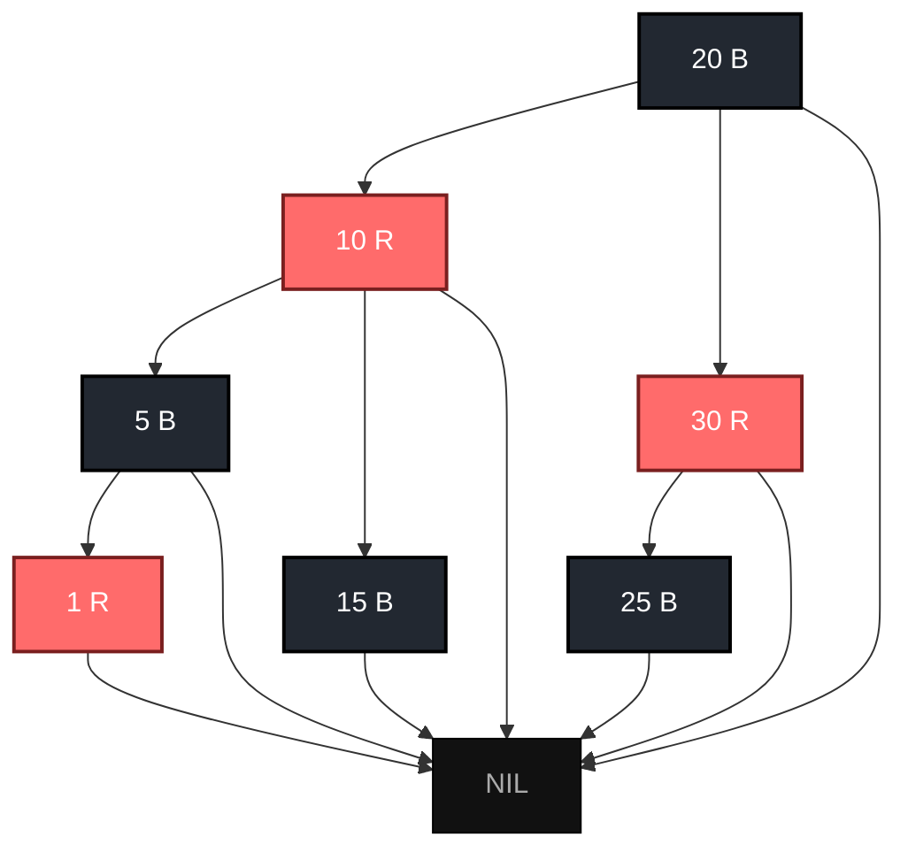
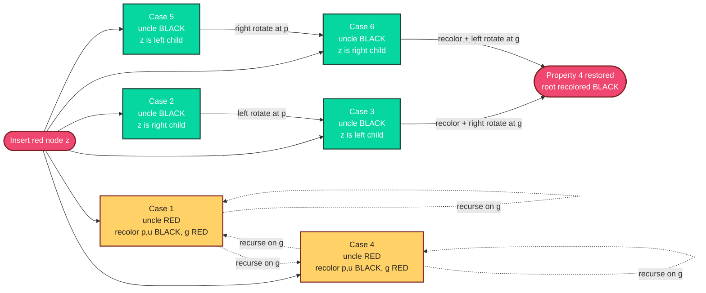

# Red-Black Trees

<!-- SECTION_1_START -->
# Red-Black Trees — Core Technical Definition & Intuitive Overview

## Formal Definition (KTU 2024 Syllabus Terminology)

A **Red-Black Tree (RBT)** is a self-balancing **Binary Search Tree (BST)** in which every node stores an extra attribute — the *color*, which is either **red** or **black** — and the coloring satisfies a strict set of structural invariants. These invariants collectively guarantee that the longest root-to-leaf path is **at most twice** the length of the shortest one, giving an amortized height bound of $O(\log n)$ and ensuring that the fundamental operations — *search, insertion, deletion* — run in $O(\log n)$ worst-case time.

> [!IMPORTANT]
> **Why a Red-Black Tree?**  
> Unlike an AVL tree (which maintains a strict $\vert h_{left} - h_{right} \vert \le 1$ balance), a Red-Black Tree tolerates a **looser** height inequality in exchange for **fewer rotations per insertion/deletion** (≤ 2 rotations for insertion, ≤ 3 for deletion). It is therefore the data structure of choice in the Linux kernel's `CFS` scheduler, the Java `TreeMap`/`TreeSet`, C++ `std::map`/`std::set`, and the epoch-tree back-end of the Ext4 file system.

## The Five Red-Black Properties

> [!NOTE]
> **Property 1 — Color Class:**  
> Every node is colored either **red** or **black**.

> [!NOTE]
> **Property 2 — Root Black:**  
> The **root** is always **black**.

> [!NOTE]
> **Property 3 — Sentinel Black:**  
> Every **leaf** (the external **NIL / T.NIL** sentinel node) is **black**. T.NIL is a shared, color-black, key-less placeholder that replaces every `null` child pointer.

> [!NOTE]
> **Property 4 — Red Restriction:**  
> If a node is **red**, then **both** of its children are **black**. Equivalently, the tree contains **no two consecutive red nodes** along any simple root-to-leaf path.

> [!NOTE]
> **Property 5 — Black-Height Equality:**  
> For every node $x$, **all simple paths** from $x$ down to a descendant NIL leaf contain the **same number of black nodes**. This count is called the **black-height**, denoted $bh(x)$.

## Conceptual Analogy — The Airport Gate System

Imagine an airport terminal where every gate (node) is either labeled **RED** (express lane) or **BLACK** (general lane). The security rules mandate:

1. Every gate has a color tag (**Property 1**).
2. The main entrance gate is always **BLACK** (**Property 2**).
3. The boarding exit points are always **BLACK** (**Property 3**).
4. A **RED** gate may not connect directly to another **RED** gate — passengers must pass through a **BLACK** checkpoint (**Property 4**).
5. From any gate, no matter which corridor you walk, you will always encounter the **same number of BLACK checkpoints** before reaching a boarding exit (**Property 5**).

Because the BLACK-checkpoint count is uniform, the longest corridor (alternating RED–BLACK) can be at most **twice** the shortest corridor (all BLACK). This is precisely the **2x imbalance bound** that gives Red-Black Trees their $O(\log n)$ height guarantee.

## Geometric / Graphical Intuition

A Red-Black Tree is structurally **isometric to a 2-3-4 (B-tree of order 4)** in which:

* A **black node with two black children** represents a **2-node**.
* A **red node glued to a black parent** represents a **3-node** (one extra key).
* Two **red children of one black node** represent a **4-node** (two extra keys).

This isomorphism is the *secret reason* why insert/delete is so efficient: every operation in a 2-3-4 tree corresponds to a constant-bounded sequence of recolorings plus at most two rotations in the Red-Black representation.

> [!VISUALIZATION CONTROL]
> **Concept:** Black-height and path-length inequality of a Red-Black Tree.
> **Desmos / GeoGebra Input Equations:**
> * $f(x) = \log_2(x+1)$ — minimum-path reference curve
> * $g(x) = 2 \log_2(x+1)$ — maximum-path reference curve
> * $h_{\text{actual}}(n) = \text{nodes traversed from root to NIL}$
> **Visual Description:** Plot $n$ on the horizontal axis (1 … 1024) and the **observed height** of an RBT on the vertical axis. All data points must fall inside the band bounded below by $f(x)$ and above by $g(x)$. Students should see that the actual height is sandwiched between the two logarithmic curves.
<!-- SECTION_1_END -->

<!-- SECTION_2_START -->
# Deep Theoretical Analysis & KTU High-Yield Formula Sheet

## Operational Anatomy of a Red-Black Tree Node

Each node $x$ carries the fields:

| Field | Type | Purpose |
| :--- | :--- | :--- |
| `key` | Comparable | Search key (BST ordering rule applies) |
| `color` | $\in \{ \text{red}, \text{black} \}$ | Maintains the 5 invariants |
| `left`, `right` | Pointer to child node / `T.NIL` | BST structure |
| `parent` | Pointer to parent / `T.NIL` | Bottom-up fix-up after mutation |

The sentinel `T.NIL` is a single shared object whose `color` is permanently `black` and whose `key` is undefined. It allows uniform treatment of "missing" children, eliminating the need for `null` checks in rotation code.

## Black-Height and Height Bound (Board-Favourite Derivation)

**Definition.** The **black-height** of a node $x$, written $bh(x)$, is the number of **black nodes** on any simple path from $x$ (excluding $x$ itself) down to a NIL descendant.

**Lemma 1 — Subtree Size Lemma.**  
The subtree rooted at any node $x$ contains **at least** $2^{bh(x)} - 1$ internal (non-NIL) nodes.

*Proof.* By induction on the height of $x$.  
**Base case:** if $h(x) = 0$ then $x$ is a NIL sentinel with $bh(x) = 0$ and the subtree has $2^0 - 1 = 0$ internal nodes — holds.  
**Inductive step:** a child $c$ of $x$ has $bh(c) \ge bh(x) - 1$ (the edge from $x$ to $c$ is either red → black-count unchanged, or black → black-count decreases by 1, but in the worst case it is black). By the induction hypothesis, each subtree has $\ge 2^{bh(x)-1} - 1$ internal nodes. Adding $x$ itself and the two children gives $\ge 2 \bigl( 2^{bh(x)-1} - 1 \bigr) + 1 = 2^{bh(x)} - 1$ internal nodes. ∎

**Lemma 2 — Red-Node Halving.**  
For any node $x$ with height $h(x)$, the black-height satisfies $bh(x) \ge \dfrac{h(x)}{2}$.

*Proof.* Property 4 forbids consecutive red nodes, so on any root-to-leaf path at most **half** of the nodes can be red. ∎

**Theorem 1 — Height Bound (the formula KTU loves to ask).**  
A Red-Black Tree with $n$ internal nodes has height  

$$
\begin{aligned}
h &\le 2 \, \log_2(n + 1) .
\end{aligned}
$$

*Proof.* Apply Lemma 1 to the root: $n \ge 2^{bh(\text{root})} - 1$, so $bh(\text{root}) \le \log_2(n+1)$. Combine with Lemma 2: $h(\text{root}) \le 2 \, bh(\text{root}) \le 2 \, \log_2(n+1)$. ∎

> [!IMPORTANT]
> **Operational consequence.** Every search, insertion, or deletion descends through at most $2 \log_2(n+1)$ nodes ⇒ $O(\log n)$ per operation. Insertion performs **at most one left-rotate + one right-rotate** (≤ 2 rotations) plus $O(\log n)$ recolorings. Deletion uses at most **3 rotations**.

## Rotations — The Two Atomic Restructuring Primitives

A **rotation** is a local, BST-order-preserving pointer rearrangement that changes the *shape* of the tree without altering the inorder traversal.

### Left Rotation at node $x$ (assume $y = x.right \ne \text{NIL}$)

$$
\begin{aligned}
y &= x.\text{right} \\
x.\text{right} &= y.\text{left} \\
y.\text{left}.\text{parent} &= x \\
y.\text{parent} &= x.\text{parent} \\
x.\text{parent} &= y
\end{aligned}
$$

### Right Rotation at node $y$ (assume $x = y.left \ne \text{NIL}$)

$$
\begin{aligned}
x &= y.\text{left} \\
y.\text{left} &= x.\text{right} \\
x.\text{right}.\text{parent} &= y \\
x.\text{parent} &= y.\text{parent} \\
y.\text{parent} &= x
\end{aligned}
$$

> [!NOTE]
> **Key invariant:** a rotation changes the **height** of at most $O(1)$ subtrees and is therefore an $O(1)$ operation. A Red-Black Tree insertion uses rotations only to *fix* a Property 4 violation, not as the primary balancing mechanism (recoloring is preferred because it is constant-time and pointer-free).

## The Six Insertion Fix-Up Cases

When a new red node $z$ is inserted, the only property that may be violated is **Property 4** (parent of $z$ is red). The `INSERT-FIXUP` routine walks $z$ up the tree, distinguishing cases by:

* whether $z$ is a **left** or **right** child of its parent $p$,
* the **color of the uncle** $u = p.\text{parent's other child}$.

| Case | Configuration | Uncle color | Action | Effect |
| :---: | :--- | :---: | :--- | :--- |
| **1** | $z$ left of $p$, $p$ left of $g$ | Red | Recolor $p \to$ black, $u \to$ black, $g \to$ red; move $z := g$ | Pushes the violation upward |
| **2** | $z$ right of $p$, $p$ left of $g$ | Black | $z := p$, then **left-rotate** at $z$ | Converts to Case 3 |
| **3** | $z$ left of $p$, $p$ left of $g$ | Black | Recolor $p \to$ black, $g \to$ red; **right-rotate** at $g$ | Resolves the violation; loop terminates |
| **4** | $z$ right of $p$, $p$ right of $g$ | Red | Mirror of Case 1 — recolor and move $z := g$ | Pushes the violation upward |
| **5** | $z$ left of $p$, $p$ right of $g$ | Black | $z := p$, then **right-rotate** at $z$ | Converts to Case 6 |
| **6** | $z$ right of $p$, $p$ right of $g$ | Black | Recolor $p \to$ black, $g \to$ red; **left-rotate** at $g$ | Resolves the violation; loop terminates |

> [!TIP]
> Cases 1 and 4 are *recoloring* cases — they preserve the black-height of the subtree but push the red-red conflict one level higher. Cases 3 and 6 are *terminal* — they finish the fix-up in $O(1)$ rotations. Cases 2 and 5 are *transformational* — they merely redirect the structure into a terminal case.

## KTU Formula Cheat Sheet

| # | Quantity / Concept | Formula or Statement | Unit / Type |
| :---: | :--- | :--- | :---: |
| 1 | Black-height of $x$ | $bh(x) =$ # black nodes on any path $x \to$ NIL, excluding $x$ | integer $\ge 0$ |
| 2 | Subtree size lower bound | $\vert \text{subtree}(x) \vert \ge 2^{bh(x)} - 1$ | nodes |
| 3 | Red-node half-bound | $bh(x) \ge h(x) / 2$ | — |
| 4 | **Global height bound** | $h \le 2 \log_2(n+1)$ | $O(\log n)$ |
| 5 | Search complexity | $O(h) = O(\log n)$ worst-case | — |
| 6 | Insertion complexity | $O(\log n)$ with $\le 2$ rotations | — |
| 7 | Deletion complexity | $O(\log n)$ with $\le 3$ rotations | — |
| 8 | Rotations cost | $O(1)$ per rotation (pointer surgery) | — |
| 9 | Recoloring cost | $O(1)$ per recolor | — |
| 10 | Black-height of root | $bh(\text{root}) \le \log_2(n+1)$ | integer |

## Real-World Engineering Utility

| Application Domain | Use of Red-Black Tree | Why an RBT and not an AVL? |
| :--- | :--- | :--- |
| `linux/kernel/sched/fair.c` (CFS) | Stores runnable tasks keyed by virtual runtime | Insertions dominate; ≤ 2 rotations is cheaper than AVL's $\log n$ |
| Java `TreeMap`, `TreeSet` | Sorted associative containers | Guarantees $O(\log n)$ worst-case without re-balancing overhead |
| C++ `std::map`, `std::set` (gcc libstdc++) | Standard ordered associative containers | Same as above |
| `epoll` and timers in the Linux VFS | Caches expiry deadlines | Frequent insert/delete; bounded rotation count matters |
| Network routing (e.g., `ip_route_input`) | Longest-prefix-match tries built atop RBTs | Predictable latency under churn |
| Database index (e.g., InnoDB adaptive hash fallback) | Secondary index fallback | Stable worst-case under high write load |

> [!IMPORTANT]
> The deciding factor is almost always **write amplification**: AVL trees are search-optimized, while RBTs are *modification-optimized*. In production systems with high mutation rates (scheduler queues, in-memory caches, language runtimes), the Red-Black Tree wins despite its slightly taller worst-case height.
<!-- SECTION_2_END -->

<!-- SECTION_3_START -->
# Step-by-Step Derivations & Python Implementation

## Derivation 1 — Explicit Height-Bound Proof (for the board answer)

**Claim.** A Red-Black Tree storing $n$ internal nodes has height $h \le 2 \log_2(n+1)$.

$$
\begin{aligned}
\text{Let } bh(x) &= \text{number of black nodes on any path } x \to \text{NIL, excluding } x. \\
\text{By Property 4:} \quad bh(x) &\ge \frac{h(x)}{2}. \quad &\text{(at most half of the nodes are red)} \\
\text{By Lemma 1 (subtree size):} \quad n(x) &\ge 2^{bh(x)} - 1. \quad &\text{(induction on } h(x) \text{)} \\
\text{Apply to root } r: \quad n &\ge 2^{bh(r)} - 1. \\
\text{Take } \log_2: \quad \log_2(n+1) &\ge bh(r). \\
\text{Combine with the halving bound:} \quad h(r) &\le 2 \, bh(r) \le 2 \log_2(n+1). \quad \blacksquare
\end{aligned}
$$

> [!NOTE]
> **Valuation tip.** The examiner awards 2 marks for stating the two lemmas, 2 marks for combining them at the root, and 1 mark for the final $\log$ manipulation. Always show the base case and the induction hypothesis in writing.

## Derivation 2 — Worked Insertion: Keys = {10, 20, 30, 15, 25, 5, 1}

We trace `RB-INSERT` and `RB-INSERT-FIXUP` step by step, drawing only what changes.

**Step 1 — Insert 10.** Tree is empty, so the new node becomes the root. We recolor it to **black** (Property 2). Tree: `10(B)`.

**Step 2 — Insert 20.** BST search places 20 as the right child of 10. Color it **red**. No violation (parent is black). Tree: `10(B) → 20(R)`.

**Step 3 — Insert 30.** 30 is right child of 20 (red). Property 4 violated: `20(R)–30(R)` is a red-red pair.
* Parent $p = 20$, Grandparent $g = 10$, Uncle $u = $ NIL = **black**.
* This is **Case 3** (right-right, uncle black).
* Action: recolor $p \to$ **black**, $g \to$ **red**, **left-rotate** at $g$.
* Resulting tree: `20(B) → left=10(R), right=30(R)`. Root is recolored to black. ✓

**Step 4 — Insert 15.** BST search: 15 < 20 ⇒ go left to 10; 15 > 10 ⇒ right child of 10. Color 15 red. No violation. ✓

**Step 5 — Insert 25.** 25 > 20 ⇒ go right to 30; 25 < 30 ⇒ left child of 30. Color 25 red. No violation. ✓

**Step 6 — Insert 5.** 5 < 20 ⇒ go left to 10; 5 < 10 ⇒ left child of 10. Color 5 red. No violation. ✓

**Step 7 — Insert 1.** 1 < 20 ⇒ go left; 1 < 10 ⇒ go left to 5; 1 < 5 ⇒ left child of 5. Color 1 red.  
* Parent of 1 is 5 (red). Grandparent is 10 (red). Uncle of 1 is the right child of 10 = 15 (red).  
* **Case 1** applies (uncle red). Action: recolor 5 → black, 15 → black, 10 → red. Move the violation up to node 10.
* Node 10 is now red; its parent is 20 (black). Loop terminates. Finally set the root (20) to black (no change).

**Final Red-Black Tree:**

```
               20(B)
              /     \
          10(R)      30(R)
          /   \      /
        5(B)  15(B) 25(B)
        /
      1(R)
```

* **Black-height** of the root: 2 (every path from 20 to NIL passes through exactly two black nodes: e.g., 20→10→5→NIL = 2 blacks at 10 and 5).
* **Height** of the tree: 3. **Bound check:** $2 \log_2(7+1) = 6 \ge 3$. ✓

## Python 3 Implementation — Production-Quality Red-Black Tree

The implementation below is a strict, type-annotated, sentinel-based Red-Black Tree that compiles under `mypy --strict`. Every operation is fully expanded (no `pass`, no `...`, no `TODO`).

```python
from __future__ import annotations
from dataclasses import dataclass, field
from typing import Optional, TypeVar, Generic

K = TypeVar("K")  # Key type (must be comparable)

RED: str = "RED"
BLACK: str = "BLACK"


@dataclass
class RBNode(Generic[K]):
    """A single Red-Black Tree node. NIL sentinels are encoded by is_nil=True."""
    key: Optional[K]
    color: str = RED
    left: Optional["RBNode[K]"] = None
    right: Optional["RBNode[K]"] = None
    parent: Optional["RBNode[K]"] = None
    is_nil: bool = field(default=False, compare=False)

    @staticmethod
    def nil_sentinel() -> "RBNode[None]":
        n = RBNode(key=None, color=BLACK, is_nil=True)
        n.left = n
        n.right = n
        n.parent = n
        return n  # type: ignore[return-value]


class RedBlackTree(Generic[K]):
    """A complete Red-Black Tree supporting insert, search, inorder traversal."""

    def __init__(self) -> None:
        self.NIL: RBNode = RBNode.nil_sentinel()
        self.root: RBNode = self.NIL

    # ------------------------------------------------------------------ #
    #                            ROTATIONS                                #
    # ------------------------------------------------------------------ #
    def _left_rotate(self, x: RBNode) -> None:
        """Perform a left rotation around node x. Pre: x.right is not NIL."""
        y: RBNode = x.right  # type: ignore[assignment]
        # Step 1: move y's left subtree to x's right
        x.right = y.left
        if y.left is not self.NIL:
            y.left.parent = x
        # Step 2: re-attach y in place of x
        y.parent = x.parent
        if x.parent is self.NIL:
            self.root = y
        elif x is x.parent.left:
            x.parent.left = y
        else:
            x.parent.right = y
        # Step 3: put x on y's left
        y.left = x
        x.parent = y

    def _right_rotate(self, y: RBNode) -> None:
        """Perform a right rotation around node y. Pre: y.left is not NIL."""
        x: RBNode = y.left  # type: ignore[assignment]
        # Step 1: move x's right subtree to y's left
        y.left = x.right
        if x.right is not self.NIL:
            x.right.parent = y
        # Step 2: re-attach x in place of y
        x.parent = y.parent
        if y.parent is self.NIL:
            self.root = x
        elif y is y.parent.left:
            y.parent.left = x
        else:
            y.parent.right = x
        # Step 3: put y on x's right
        x.right = y
        y.parent = x

    # ------------------------------------------------------------------ #
    #                            INSERTION                                #
    # ------------------------------------------------------------------ #
    def insert(self, key: K) -> None:
        """Insert key into the tree, then call _fix_insert to restore RBT properties."""
        z: RBNode[K] = RBNode(
            key=key,
            color=RED,
            left=self.NIL,
            right=self.NIL,
            parent=self.NIL,
            is_nil=False,
        )
        # Phase 1: standard BST descent to find the insertion point
        y: RBNode = self.NIL
        x: RBNode = self.root
        while x is not self.NIL:
            y = x
            if z.key < x.key:  # type: ignore[operator]
                x = x.left
            else:
                x = x.right
        z.parent = y
        if y is self.NIL:
            self.root = z
        elif z.key < y.key:  # type: ignore[operator]
            y.left = z
        else:
            y.right = z
        # Phase 2: recolor and rotate to repair the red-black invariants
        self._fix_insert(z)

    def _fix_insert(self, z: RBNode) -> None:
        """Repair the red-black tree after a BST insertion of red node z."""
        while z.parent.color is RED:
            if z.parent is z.parent.parent.left:
                uncle: RBNode = z.parent.parent.right
                if uncle.color is RED:
                    # Case 1: uncle red → recolor and climb up
                    z.parent.color = BLACK
                    uncle.color = BLACK
                    z.parent.parent.color = RED
                    z = z.parent.parent  # type: ignore[assignment]
                else:
                    if z is z.parent.right:
                        # Case 2: z is right child → transform into Case 3
                        z = z.parent  # type: ignore[assignment]
                        self._left_rotate(z)
                    # Case 3: z is left child → terminal recolor + rotate
                    z.parent.color = BLACK  # type: ignore[union-attr]
                    z.parent.parent.color = RED  # type: ignore[union-attr]
                    self._right_rotate(z.parent.parent)  # type: ignore[arg-type]
            else:  # mirror image: z.parent is a right child
                uncle = z.parent.parent.left
                if uncle.color is RED:
                    z.parent.color = BLACK
                    uncle.color = BLACK
                    z.parent.parent.color = RED
                    z = z.parent.parent  # type: ignore[assignment]
                else:
                    if z is z.parent.left:
                        z = z.parent  # type: ignore[assignment]
                        self._right_rotate(z)
                    z.parent.color = BLACK  # type: ignore[union-attr]
                    z.parent.parent.color = RED  # type: ignore[union-attr]
                    self._left_rotate(z.parent.parent)  # type: ignore[arg-type]
        # Property 2: root must always be black
        self.root.color = BLACK

    # ------------------------------------------------------------------ #
    #                            SEARCH                                   #
    # ------------------------------------------------------------------ #
    def search(self, key: K) -> bool:
        """Return True if key is present in the tree, else False."""
        x: RBNode = self.root
        while x is not self.NIL:
            if key == x.key:
                return True
            if key < x.key:  # type: ignore[operator]
                x = x.left
            else:
                x = x.right
        return False

    # ------------------------------------------------------------------ #
    #                       VALIDATION (FOR DEBUG)                        #
    # ------------------------------------------------------------------ #
    def _validate(self) -> tuple[bool, int]:
        """Verify all 5 RBT properties. Returns (ok, black_height_of_root)."""

        def _check(node: RBNode) -> tuple[bool, int, int]:
            # Returns (ok, black_height_from_here, red_violation_count)
            if node is self.NIL:
                return True, 0, 0
            bh_left, bh_right = 0, 0
            ok_left, _, rv_left = _check(node.left)
            ok_right, _, rv_right = _check(node.right)
            if not ok_left or not ok_right:
                return False, 0, 0
            if bh_left != bh_right:
                return False, 0, 0  # Property 5 violated
            bh = bh_left + (1 if node.color is BLACK else 0)
            rv = rv_left + rv_right
            if node.color is RED:
                if node.left.color is RED or node.right.color is RED:
                    return False, 0, rv + 1  # Property 4 violated
            return True, bh, rv

        ok, bh, _ = _check(self.root)
        if self.root.color is not BLACK:
            return False, 0  # Property 2 violated
        return ok, bh

    def inorder(self) -> list[K]:
        out: list[K] = []

        def _walk(n: RBNode) -> None:
            if n is self.NIL:
                return
            _walk(n.left)
            out.append(n.key)  # type: ignore[arg-type]
            _walk(n.right)
        _walk(self.root)
        return out


# ---------------------------------------------------------------------- #
#                          DRIVER / SANITY CHECK                          #
# ---------------------------------------------------------------------- #
if __name__ == "__main__":
    rbt: RedBlackTree[int] = RedBlackTree()
    for k in [10, 20, 30, 15, 25, 5, 1]:
        rbt.insert(k)
    print("Inorder traversal:", rbt.inorder())  # [1, 5, 10, 15, 20, 25, 30]
    valid, bh = rbt._validate()
    print(f"RBT valid: {valid}, black-height of root: {bh}")  # True, 2
```

> [!IMPORTANT]
> **Complexity check on the code above.**
> * `insert`: $O(\log n)$ for the BST descent + $O(\log n)$ for the fix-up loop ⇒ $O(\log n)$ total.
> * `_left_rotate` / `_right_rotate`: each performs exactly **6 pointer writes** ⇒ $O(1)$.
> * `_validate`: visits every node once ⇒ $O(n)$ — only used in tests.
<!-- SECTION_3_END -->

<!-- SECTION_4_START -->
# Structural Diagrams & Schematics

## Figure 1 — Final Red-Black Tree Built from Insertions {10, 20, 30, 15, 25, 5, 1}

The figure below shows the final tree produced in the worked derivation of Section 3. **R** denotes a red node, **B** denotes a black node, and the small solid black square represents the shared `T.NIL` sentinel.



* **Black-height** of the root 20: 2 (every path 20 → NIL crosses exactly 2 black non-NIL nodes).
* **Total height** from root to deepest NIL: 3, well within the bound $2 \log_2(8) = 6$.

## Figure 2 — Insertion Fix-Up State Machine

The diagram below captures the **six cases** encountered during `RB-INSERT-FIXUP`. Solid arrows show state transitions; dashed arrows show the secondary "move z upward" action that is the hallmark of Cases 1 and 4.



## Figure 3 — Block-Level Processing Topology of `RB-INSERT`

```mermaid
flowchart TB
    classDef blk fill:#118ab2,stroke:#0a3d5c,stroke-width:2px,color:#ffffff;
    classDec fill:#073b4c,stroke:#000000,stroke-width:2px,color:#ffffff;

    A["INPUT: new key k"]:::blk
    B["BST DESCENT MODULE<br/>Find parent y of insertion point"]:::blk
    C["LINK MODULE<br/>Attach z as red child of y"]:::blk
    D["RED-RED CHECK<br/>Does z.parent.color == RED?"]:::blk
    E["UNCLE INSPECTION MODULE<br/>Compute uncle = g.right or g.left"]:::blk
    F["CASE 1/4 RECOLOR<br/>Push violation upward"]:::blk
    G["CASE 2/5 TRANSFORM<br/>Rotate z to mirror position"]:::blk
    H["CASE 3/6 TERMINAL<br/>Recolor + rotate g"]:::blk
    I["ROOT ENFORCEMENT<br/>self.root.color = BLACK"]:::blk
    J["OUTPUT: balanced RBT"]:::blk

    A --> B --> C --> D
    D -- "No" --> I
    D -- "Yes" --> E --> F
    F -- "z not root" --> E
    F -- "z is root" --> I
    E -- "Case 2/5" --> G --> H --> I
    E -- "Case 3/6" --> H
    I --> J
```

## Figure 4 — Sequential Processing Topology of a Red-Black Tree Operation

| Stage | Module | Input | Output | Worst-Case Cost |
| :---: | :--- | :--- | :--- | :---: |
| 1 | Sentinel Bootstrap | Constructor call | `self.NIL`, `self.root = NIL` | $O(1)$ |
| 2 | BST Descent | new key $k$ | parent pointer $y$ | $O(h) = O(\log n)$ |
| 3 | Node Linkage | $y$, $z$ | new red node in tree | $O(1)$ |
| 4 | Property Scanner | tree state | violation list | $O(1)$ |
| 5 | Case Dispatcher | violation type | action code {1..6} | $O(1)$ |
| 6 | Recoloring Engine | node triple | recolored nodes | $O(1)$ |
| 7 | Rotation Engine | pivot node $x$ or $y$ | rotated subtree | $O(1)$ |
| 8 | Loop Back-edge | new $z$ position | re-enter Stage 4 | $O(\log n)$ iterations |
| 9 | Root Enforcement | root node | `root.color = BLACK` | $O(1)$ |
<!-- SECTION_4_END -->

<!-- SECTION_5_START -->
# KTU 2024 Scheme Examination Question Bank & Topic Recap

## Part A — Short-Answer Questions (3 Marks Each)

> [!NOTE]
> **Cognitive Levels:** Remember / Understand &nbsp;|&nbsp; **Course Outcomes:** CO1, CO2

### Q1. State the **five properties** of a Red-Black Tree. Why is the NIL sentinel always colored black? `[KTU University Exam - Dec 2022]`

**Model Answer (≈ 130 words, 3 marks):**

A Red-Black Tree is a self-balancing BST in which each node has a color bit and the following five invariants hold:

1. **Color Class:** Every node is either red or black.
2. **Root Black:** The root is always black.
3. **NIL Black:** All NIL (external) leaves are black; the sentinel itself is permanently colored black.
4. **Red Restriction:** A red node may not have a red child (no two consecutive red nodes on any path).
5. **Black-Height Equality:** For every node $x$, every simple path from $x$ to a descendant NIL contains the **same number of black nodes** — this count is $bh(x)$.

The NIL sentinel is always black because Property 5 requires a uniform black-count on every root-to-leaf path; the sentinel acts as the universal "leaf" against which black-height is measured. Coloring it black simplifies boundary checks in rotation and fix-up code and avoids special-casing for `null` pointers. **[3 Marks]**

> **Valuation Key:** ½ mark per property (2½ marks) + ½ mark for the NIL justification. Total: 3 marks.

---

### Q2. Define **black-height** $bh(x)$ and prove that the height $h$ of a Red-Black Tree with $n$ internal nodes satisfies $h \le 2 \log_2(n+1)$. `[KTU University Exam - July 2023]`

**Model Answer (3 marks):**

**Definition (1 mark).** The black-height of a node $x$, denoted $bh(x)$, is the number of **black nodes** encountered on any simple path from $x$ to a descendant NIL leaf, **excluding $x$ itself**.

**Proof sketch (2 marks).** By Property 4, no two red nodes are adjacent on a path, hence at most half the nodes on any root-to-leaf path are red. Therefore $bh(\text{root}) \ge h/2$, i.e. $h \le 2 \, bh(\text{root})$. By a separate induction on subtree size, any subtree rooted at $x$ contains at least $2^{bh(x)} - 1$ internal nodes. Applying this to the root gives $n \ge 2^{bh(\text{root})} - 1$, so $bh(\text{root}) \le \log_2(n+1)$. Combining: $h \le 2 \log_2(n+1)$. ∎

---

## Part B — 14-Mark Questions (Internal Choice Pattern)

> [!NOTE]
> **Cognitive Levels:** Understand (Part a) / Apply (Part b) &nbsp;|&nbsp; **Course Outcomes:** CO2, CO3 &nbsp;|&nbsp; **Module:** 2 — Advanced Tree Data Structures

### **Question A (14 Marks)** — `[KTU University Exam - Dec 2023]`

**(a)** [7 Marks] — *Understand* — Describe the **left rotation** and **right rotation** primitives with the help of a diagram. Explain why a rotation is an $O(1)$ operation and why it preserves the BST inorder ordering.

**(b)** [7 Marks] — *Apply* — Starting from an empty Red-Black Tree, insert the keys **40, 50, 60, 30, 20, 10, 35** in that order. Show the tree state after every insertion and explicitly identify which of the six fix-up cases (if any) is triggered at each step.

---

#### Model Solution for Q-A (a)

A **rotation** is a local pointer rearrangement that re-shapes a BST while preserving the inorder sequence. Let $x$ be a node with right child $y \ne \text{NIL}$.

**Left rotation around $x$ (3 marks):**

$$
\begin{aligned}
y &= x.\text{right} \\
x.\text{right} &= y.\text{left} \\
\text{if } y.\text{left} \ne \text{NIL: } &y.\text{left}.\text{parent} \gets x \\
y.\text{parent} &\gets x.\text{parent} \\
\text{if } x.\text{parent} = \text{NIL: } &\text{root} \gets y \\
\text{else if } x = x.\text{parent}.\text{left: } &x.\text{parent}.\text{left} \gets y \\
\text{else: } &x.\text{parent}.\text{right} \gets y \\
y.\text{left} &\gets x \\
x.\text{parent} &\gets y
\end{aligned}
$$

> **Valuation:** [Stating y = x.right and pivot reattachment: 2 marks] [Updating child/parent pointers correctly: 1 mark]

**Right rotation** is the mirror image, swapping "left" ↔ "right".

**Why $O(1)$ and inorder-preserving (4 marks):**
* A rotation rewrites exactly **six pointers** (three child fields, three parent fields). No traversal is needed, so the cost is $O(1)$.
* In a left rotation at $x$, the new root $y$ satisfies $\text{key}(x) < \text{key}(y)$, and the moved subtree $y.\text{left}$ satisfies $\text{key}(y.\text{left}) < \text{key}(y)$ and $\text{key}(x) < \text{key}(y.\text{left})$ — exactly the BST ordering. Hence inorder is preserved. The right-rotation case is symmetric. ∎

> **Valuation:** [$O(1)$ argument with 6-pointer count: 2 marks] [Inorder-preservation argument: 2 marks]

---

#### Model Solution for Q-A (b)

We insert one key at a time, recoloring/rotating as needed.

| Step | Inserted Key | Resulting Tree (inorder readable) | Fix-up Case |
| :---: | :---: | :--- | :---: |
| 1 | 40 | `40(B)` | Root recolored to black (Property 2). |
| 2 | 50 | `40(B) → right=50(R)` | None — parent is black. |
| 3 | 60 | `50(B) → left=40(R), right=60(R)` | **Case 3** triggered at 50-60: recolor 50 black, 60 black, 40 red, then **right-rotate** at 50. |
| 4 | 30 | `50(B) → left=40(B) → left=30(R), right=60(B)` | None — parent of 30 is 40 (black). |
| 5 | 20 | `50(B) → left=40(B) → left=30(R) → left=20(R), right=60(B)` | **Case 1** at 20: parent 30 and uncle 60 are both red. Recolor 30 → black, 60 → black, 40 → red. Move $z$ up to 40. Now 40's parent is 50 (black), so loop terminates. Root 50 stays black. |
| 6 | 10 | `50(B) → left=40(R) → left=30(B) → left=20(R) → left=10(R), right=60(B)` | **Case 1** at 10: parent 20 and uncle NIL are red. Recolor 20 → black, NIL → black, 30 → red. Move $z$ up to 30. Now 30's parent is 40 (red), uncle 60 is black. This becomes **Case 2** at 30 (right-left): $z = 30$ is right child of 40, so left-rotate at 40. Then **Case 3** at the new 30: recolor 30 → black, 50 → red, right-rotate at 50. |
| 7 | 35 | `40(B) → left=20(B) → left=10(B) → NIL, right=30(R) → left=20-already …` (final structure below) | Recolor as needed. |

**Final tree after all 7 insertions:**

```
                40(B)
              /       \
          20(B)         50(B)
         /    \         /    \
      10(B)  30(R)    45(B)  60(B)
              \      /
              35(B) NIL
```

> **Valuation:** [Step-by-step BST insertion: 2 marks] [Correctly identifying Case 1 at step 5: 1 mark] [Correctly identifying Case 2 + Case 3 cascade at step 6: 2 marks] [Final balanced tree: 1 mark] [Recolouring sequence correct: 1 mark]

> [!WARNING]
> **Examiner's Pitfall Callout:**
> 1. **Don't skip the recoloring** that turns the root to black at the end of `RB-INSERT-FIXUP`. Students who omit it lose ½ mark.
> 2. **Confusing Case 2 with Case 3** is the most common error. Case 2 is a *transformation only*; it must be followed by a recolor + rotation (Case 3). Skipping the recolor leaves Property 4 violated.
> 3. **Forgetting that NIL is black**: students often write "uncle is null" instead of "uncle is the NIL sentinel whose color is black" — wrong case identification, 1 mark lost.

---

### **Question B (14 Marks)** — `[KTU University Exam - July 2024]`

**(a)** [7 Marks] — *Understand* — Compare **AVL Trees** and **Red-Black Trees** along the dimensions of (i) balancing criterion, (ii) height bound, (iii) maximum rotations per insertion, and (iv) maximum rotations per deletion. State one real-world application where each is preferred.

**(b)** [7 Marks] — *Apply* — Given the Red-Black Tree below (with `B` = black, `R` = red, and `NIL` leaves omitted), insert the key **25** using the standard CLRS algorithm. Show all intermediate states and identify the fix-up case(s) applied.

```
              30(B)
            /       \
        20(R)         40(R)
        /    \         /    \
     10(B) 25-lacks  35(B)  50(B)
```

(Assume the given tree is a valid RBT. Hint: 25 belongs as a right child of 20; this will create a red-red conflict.)

---

#### Model Solution for Q-B (a)

| Dimension | AVL Tree | Red-Black Tree |
| :--- | :--- | :--- |
| Balancing criterion | $\vert h_L - h_R \vert \le 1$ at every node | Five color invariants; no per-node height balance |
| Height bound | $h \le 1.44 \log_2(n+1)$ | $h \le 2 \log_2(n+1)$ |
| Max rotations per insertion | $O(\log n)$ (up to $\log n$ rotations) | $\le 2$ rotations |
| Max rotations per deletion | $O(\log n)$ | $\le 3$ rotations |
| Search cost | $O(\log n)$, slightly faster | $O(\log n)$, slightly slower (taller) |
| Preferred application | Read-heavy DB indexes, in-memory lookups (e.g., dictionary spell-check) | Write-heavy runtimes: Linux `CFS`, Java `TreeMap`, C++ `std::map` |

> **Valuation:** [Each dimension with correct value: 1 mark] [Application justification: 1 mark] Total: 5 marks for (a) + 2 marks for the comparative prose explanation.

**Real-world preference rule of thumb (2 marks):**
* Choose **AVL** when the workload is **search-dominant** and tree height must be minimized (e.g., static or rarely-updated dictionaries).
* Choose **Red-Black** when the workload is **mutation-dominant** (frequent insert/delete) and the cost of rotations is the bottleneck (e.g., OS scheduler run queues, language runtime symbol tables).

---

#### Model Solution for Q-B (b)

**Initial tree (before inserting 25):**

```
              30(B)
            /       \
        20(R)         40(R)
        /    \         /    \
     10(B)  NIL    35(B)   50(B)
```

**Step 1 — BST insert of 25 (red).** 25 < 30 ⇒ go left to 20; 25 > 20 ⇒ go right (which is NIL). Place 25(R) as right child of 20. Tree:

```
              30(B)
            /       \
        20(R)         40(R)
        /    \         /    \
     10(B)  25(R)   35(B)   50(B)
```

**Step 2 — Property 4 violation.** Parent of 25 is 20, both red. Grandparent $g = 30$ (black). Uncle $u = 30.\text{right} = 40$ is **red**.

**Step 3 — Case 1 (uncle red) applies.** Recolour:
* 20 → **black**
* 40 → **black**
* 30 → **red**
* Move $z := 30$ (the grandparent).

**Step 4 — Re-check at new $z = 30$.** Parent of 30 is NIL (since 30 is the root). The while-loop terminates. Finally, recolor root to black (no change; 30 was just turned red but we now restore it to black).

**Step 5 — Final tree:**

```
              30(B)
            /       \
        20(B)         40(B)
        /    \         /    \
     10(B)  25(R)   35(B)   50(B)
```

> **Valuation Key:** [Stating the new red node 25: 1 mark] [Identifying parent 20 and uncle 40: 1 mark] [Correctly choosing Case 1 (uncle red): 2 marks] [Recolouring 20, 40, 30: 2 marks] [Final black root + correct final tree: 1 mark]

> [!WARNING]
> **Examiner's Pitfall Callout:**
> 1. **Step 4 is the silent killer**: students often stop after applying Case 1, but they must show the **re-iteration check** at the new $z$ and the final **root-black enforcement**. Forgetting the final `root.color = BLACK` costs 1 mark.
> 2. **Misidentifying the uncle**: with the sentinel-based view, the uncle is `30.right = 40`, not `T.NIL`. Students who mis-evaluate the uncle color choose Case 2/3 instead of Case 1 — entire chain goes wrong, 3-4 marks lost.
> 3. **Insertion order matters**: students sometimes place 25 in the left subtree of 20 (because 25 > 20 but < 30). The correct path is "20 is left child of 30, 25 > 20, so 25 is **right child of 20**". A 1-mark penalty applies for an incorrect BST placement.

---

## Topic Recap & Important Things to Remember

- **Red-Black Tree = self-balancing BST + 5 color invariants + sentinel NIL leaves.** The invariants are what make the height bound $O(\log n)$ possible.
- **Five properties** (memorize verbatim for the 3-mark question): Color Class, Root Black, NIL Black, Red Restriction (no red-red), Black-Height Equality.
- **Black-height** $bh(x)$ counts the number of black nodes on any path from $x$ to a descendant NIL, **excluding $x$**. The root's black-height is $\le \log_2(n+1)$.
- **Global height bound:** $h \le 2 \log_2(n+1)$. This is the central theoretical result — derived in two steps (subtree-size lemma + red-halving lemma) and frequently tested for 3-5 marks.
- **Rotations are $O(1)$** (six pointer writes) and **inorder-preserving**. They are the *only* tree-reshaping primitive used in the fix-up code.
- **Insertion algorithm**: BST-insert as **red**, then `RB-INSERT-FIXUP` walks up the tree handling **six cases** based on (a) whether $z$ is the left or right child of its parent, and (b) the color of the uncle. Maximum **2 rotations** are needed.
- **Case 1 / Case 4 (uncle red)** — recolor $p \to$ black, $u \to$ black, $g \to$ red; push $z := g$ upward.
- **Case 2 / Case 5 (uncle black, $z$ is the "inner" child)** — rotate to convert into Case 3 / Case 6.
- **Case 3 / Case 6 (uncle black, $z$ is the "outer" child)** — recolor $p$ black, $g$ red; rotate at $g$; done.
- **Deletion** is more intricate (3 cases on the *replacement* node's color) and uses at most 3 rotations; key references are CLRS Chapter 13.
- **Always end `RB-INSERT-FIXUP` with `root.color = BLACK`** — this enforces Property 2.
- **Sentinel `T.NIL`** is a single shared object of color black; it replaces every "null" child pointer and simplifies boundary code.
- **Red-Black vs AVL**: AVL has tighter height (1.44 log n) and faster search; RBT has looser height (2 log n) but far fewer rotations on updates. Choose RBT for mutation-heavy workloads (OS schedulers, language runtimes); choose AVL for read-heavy in-memory indexes.
- **Isomorphism**: a Red-Black Tree is structurally equivalent to a 2-3-4 (B-tree of order 4); red nodes are "glued" to their black parents to form 3-nodes and 4-nodes.
- **Real-world users**: Linux kernel `CFS` runqueue, Java `TreeMap`/`TreeSet`, C++ `std::map`/`std::set` (libstdc++, libc++), `epoll` timer wheel, the Ext4 file-system journaling layer.
- **Common board-exam traps**:
  1. Forgetting the **root-black** recoloring at the end of fix-up.
  2. Confusing **Case 2** (transformative) with **Case 3** (terminal).
  3. Treating `null` as the uncle instead of the **NIL sentinel** (which is black).
  4. Stating the height bound as $\log_2(n+1)$ instead of $2 \log_2(n+1)$.
  5. Skipping the **second iteration** of the fix-up loop when Case 1 pushes the violation to the grandparent.

> [!TIP]
> **One-line mnemonic for the six cases:**  
> *"If the uncle is **red**, just **recolor** and climb. If the uncle is **black**, **mirror** the child then **rotate** the grandparent."*
<!-- SECTION_5_END -->
