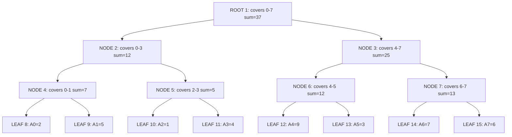
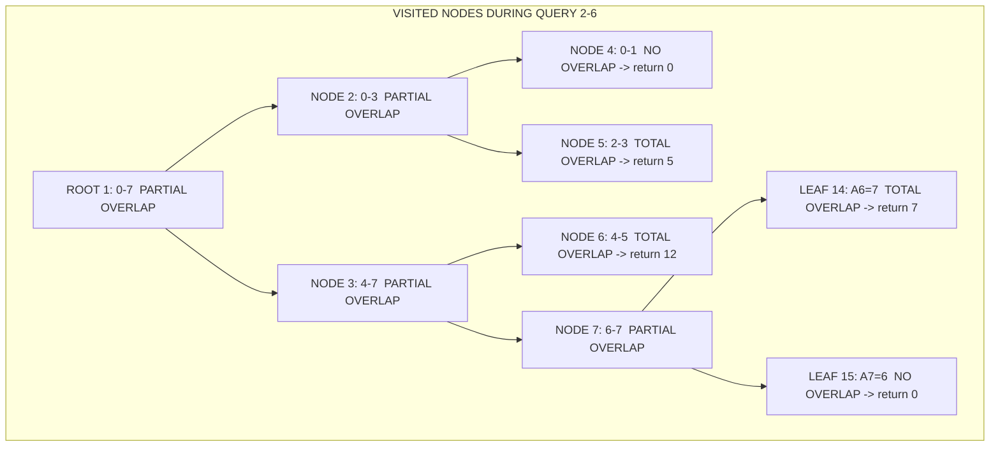
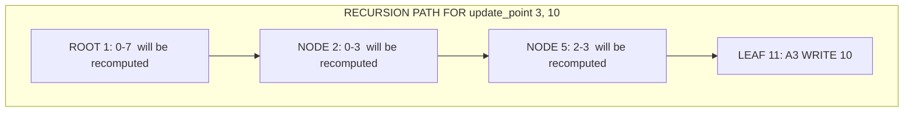
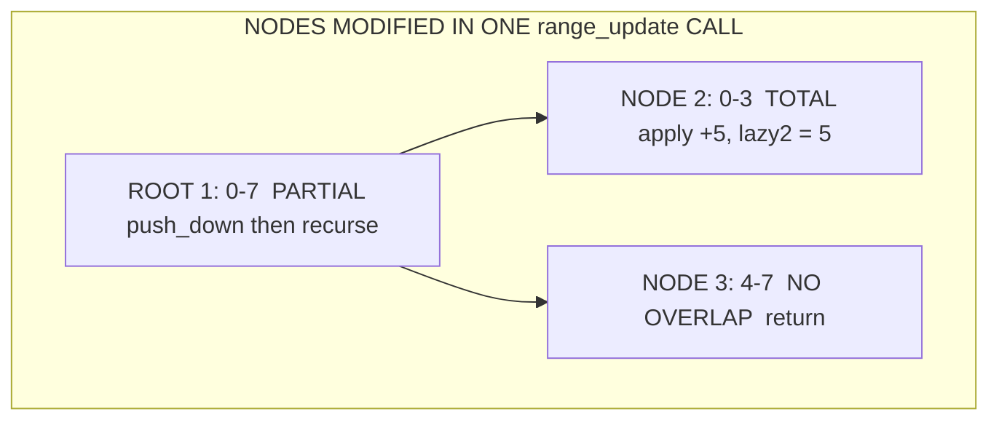

# Segment Trees

<!-- SECTION_1_START -->
# Segment Trees — Core Technical Definition & Intuitive Overview

## Formal Academic Definition (KTU 2024 Syllabus Standard)

> [!IMPORTANT]
> **Segment Tree** is a binary tree data structure that stores information about array intervals (segments) in its nodes, enabling efficient **range query** and **range/point update** operations on a static or dynamic array of size $N$ in $O(\log N)$ time per operation. Each internal node represents the union (or merge) of its two children's segments, and the root represents the entire array range $[0, N-1]$.

Formally, for an array $A[0 \ldots N-1]$, a segment tree $T$ is a complete binary tree of height $\lceil \log_2 N \rceil$ where:

- The **root** node at index $1$ represents the segment $[0, N-1]$.
- A node representing segment $[l, r]$ has two children: left child representing $[l, m]$ and right child representing $[m+1, r]$, where $m = \lfloor (l+r)/2 \rfloor$.
- **Leaf nodes** (those with $l = r$) represent single array elements $A[l]$.
- Each internal node stores an **aggregated value** $f(l, r) = \bigotimes_{i=l}^{r} A[i]$, where $\bigotimes$ is an associative binary operator (sum, min, max, gcd, xor, product modulo, etc.).

## Conceptual Analogy & Intuition

> [!NOTE]
> **Intuition — The Library Index Analogy:** Imagine you have a long shelf of 1000 books and a librarian who is frequently asked, *"What is the total number of pages in books on shelf positions 400 to 750?"* If the librarian counts every time, it takes too long. So the librarian writes summary cards:
> - One card for "books 0–499" with total pages.
> - One card for "books 500–999" with total pages.
> - Sub-cards for halves, quarters, and so on, down to individual books.
> 
> When a question arrives for books 400–750, the librarian just looks at the **few summary cards** that exactly cover that range, rather than counting all 351 books. The cards form a **hierarchy** (a tree!), and a query is answered by walking up a small portion of that hierarchy — that's exactly what a segment tree does for arrays.

## Physical & Structural Metrics

- **Array size bound:** For an array of size $N$, the segment tree is stored in an auxiliary array of size $4N$ (a safe upper bound that works for any $N \geq 1$).
- **Tree height:** $h = \lceil \log_2 N \rceil$.
- **Number of nodes:** At most $4N$ (approximately $2N$ active nodes, but $4N$ is the universally safe static allocation).
- **Operator requirement:** The operation $\bigotimes$ must be **associative** (so that $f(l, r) = f(l, m) \otimes f(m+1, r)$ is well-defined). It is *not* required to be commutative, but commutativity simplifies some implementations.

## Why Segment Trees Matter in Engineering

| Domain | Use Case |
|---|---|
| **Database Systems** | Range aggregation queries (sum, min, max) over indexed columns. |
| **Competitive Programming** | Subarray sum/min/max queries with point/range updates. |
| **Computer Graphics** | 2D range queries in image processing pipelines. |
| **Network Monitoring** | Sliding-window aggregation over packet logs. |
| **Geospatial Indexing** | Range minimum queries in KD-tree-adjacent structures. |

> [!VISUALIZATION CONTROL]
> **Concept:** Segment Tree built over an 8-element array $A = [2, 5, 1, 4, 9, 3, 7, 6]$ for the **sum** operation.
> **GeoGebra / Desmos Input Equations:**
> * Points (as a hierarchical tree drawn manually): root at $(0, 4)$ labeled `[0-7]=37`; level 1 at $(-4, 3)$ and $(4, 3)$ labeled `[0-3]=12` and `[4-7]=25`; level 2 at $(-6, 2), (-2, 2), (2, 2), (6, 2)$ labeled `[0-1]=7, [2-3]=5, [4-5]=12, [6-7]=13`; leaves at $(-7, 1), (-5, 1), \ldots, (7, 1)$ labeled with single elements.
> **Visual Description:** The student should observe a **balanced binary tree** where each parent node is the sum of its two children's values, the leaves at the bottom correspond to individual array elements, and the root at the top holds the total sum of the entire array. The **range of a query** is decomposed into $O(\log N)$ node intervals that exactly cover the queried range with no gaps and no overlaps.

<!-- SECTION_1_END -->

<!-- SECTION_2_START -->
# Deep Theoretical Analysis & KTU High-Yield Formula Sheet

## Structural Properties of the Segment Tree

1. **Completeness:** A segment tree built for an array of size $N$ is a **complete binary tree** if $N$ is a power of $2$, and almost-complete otherwise (some rightmost internal nodes may have only a left child). This guarantees $O(N)$ total nodes.
2. **Balanced:** All leaves reside on the bottom one or two levels, so the height is $O(\log N)$.
3. **Static structure, dynamic content:** The tree's *shape* never changes after construction; only the *values* in the nodes are updated.
4. **Indexing schemes:**
   - **0-indexed array storage:** Root at index $0$; left child of $i$ at $2i+1$, right child at $2i+2$. Requires $4N$ slots.
   - **1-indexed array storage:** Root at index $1$; left child at $2i$, right child at $2i+1$. This is the cleaner, more common choice used in academic and competitive programming literature.

## The Three Core Operations

### 1. Build Operation — $O(N)$

The build operation recursively constructs the tree from the leaves upward:

$$\text{build}(node, l, r) = \begin{cases} A[l] & \text{if } l = r \quad \text{(leaf node)} \\ \text{build}(2 \cdot node, l, m) \;\otimes\; \text{build}(2 \cdot node + 1, m+1, r) & \text{if } l < r \end{cases}$$

where $m = \lfloor (l+r)/2 \rfloor$.

### 2. Range Query — $O(\log N)$ per query

To query on range $[ql, qr]$ starting at root representing $[l, r]$:

- **No overlap:** $[l, r] \cap [ql, qr] = \emptyset$ $\Rightarrow$ return **identity element** $I$ (e.g., $0$ for sum, $+\infty$ for min, $-\infty$ for max).
- **Total overlap:** $[ql, qr] \subseteq [l, r]$ $\Rightarrow$ return the **stored value** at this node (no recursion needed).
- **Partial overlap:** Recurse on both children and combine: $\text{left} \otimes \text{right}$.

The key insight: **at most $4 \log N$ nodes** are visited per query, giving an $O(\log N)$ bound.

### 3. Point Update — $O(\log N)$ per update

To update $A[pos] = val$:

- Recurse from root to the leaf representing position $pos$.
- At each node on the recursion path, recompute the stored value as $\text{left} \otimes \text{right}$.
- Total path length is $O(\log N)$.

## Extended: Range Update with Lazy Propagation — $O(\log N)$

When a single update must modify an entire range $[ul, ur]$ (e.g., "add $5$ to all elements from index $2$ to $7$"), naive point updates would cost $O(N \log N)$. **Lazy propagation** defers work:

- Each node carries a **lazy tag** $lazy[node]$ that records a pending operation to be applied to all descendants.
- When visiting a node whose segment is **fully inside** $[ul, ur]$:
  - Apply the operation to $tree[node]$ directly.
  - Store the operation in $lazy[node]$ for children.
  - **Do not recurse further** (the laziness is "pushed down" only when needed).
- Before recursing into a child, **push down** the lazy tag to clear it from the parent.

## KTU Formula Sheet / Cheat Sheet

> [!NOTE]
> The table below is a board-exam-friendly reference. All notation uses $N$ for the input array size, $h$ for the tree height, and $I$ for the identity element of the operator.

| Parameter / Operation | Formula or Value | Unit / Notes |
|---|---|---|
| Tree height | $h = \lceil \log_2 N \rceil$ | Levels, base 2 |
| Number of nodes (worst case) | $4N$ | Slot count for 1-indexed storage |
| Number of nodes (exact for $N=2^k$) | $2N - 1$ | Tight bound when $N$ is a power of $2$ |
| Build time | $T_{build} = O(N)$ | Bottom-up DP recursion |
| Range query time | $T_q = O(\log N)$ | At most $4 \log N$ nodes visited |
| Point update time | $T_{upd} = O(\log N)$ | Single root-to-leaf path |
| Range update time (lazy) | $T_{rupd} = O(\log N)$ | Amortized with lazy propagation |
| Space complexity | $O(N)$ to $O(4N)$ | Use $4N$ for safety |
| Identity for sum | $I = 0$ | Neutral element |
| Identity for product | $I = 1$ | Neutral element |
| Identity for min | $I = +\infty$ | (or a sentinel larger than all values) |
| Identity for max | $I = -\infty$ | (or a sentinel smaller than all values) |
| Identity for gcd | $I = 0$ | Convention: $\gcd(0, x) = \vert x \vert$ |
| Identity for xor | $I = 0$ | $x \oplus 0 = x$ |
| Child index (1-indexed) | $left = 2i$, $right = 2i+1$ | Standard |
| Child index (0-indexed) | $left = 2i+1$, $right = 2i+2$ | Alternative |
| Mid-point formula | $m = l + \lfloor (r - l)/2 \rfloor$ | Avoids integer overflow |
| Query coverage invariant | $\sum_{i \in \text{visited}} \text{cover}(i) = qr - ql + 1$ | No gaps, no overlaps |

## Engineering Utility — Why Lazy Propagation is Production-Critical

In real-time systems (e.g., financial dashboards updating a price range, or sensor arrays summing over a window), a single bulk update might affect $10^6$ elements. Without lazy propagation, a "raise all salaries in department X by 10%" operation would take $10^6 \log N$ time. With lazy propagation, the same operation is just $O(\log N)$ because the actualization is deferred and only triggered when a query **demands** the precise value. This is the segment tree's parallel to **memoization** in dynamic programming, but applied to write operations.

<!-- SECTION_2_END -->

<!-- SECTION_3_START -->
# Step-by-Step Derivations & Code Implementation

## Derivation 1: Building a Segment Tree for Sum

We derive the build procedure by induction on the segment length $r - l + 1$.

**Base case** ($l = r$, single element): $tree[node] = A[l]$. The function value is the element itself.

**Inductive step** ($l < r$): Let $m = \lfloor (l+r)/2 \rfloor$. By the inductive hypothesis, after the two recursive calls, $tree[2 \cdot node]$ correctly represents the sum of $A[l \ldots m]$ and $tree[2 \cdot node + 1]$ correctly represents the sum of $A[m+1 \ldots r]$. Therefore:

$$tree[node] \;=\; tree[2 \cdot node] \;+\; tree[2 \cdot node + 1] \;=\; \sum_{i=l}^{m} A[i] \;+\; \sum_{i=m+1}^{r} A[i] \;=\; \sum_{i=l}^{r} A[i]$$

This matches the segment tree invariant $\square$.

## Derivation 2: Range Query Correctness

We claim that `query(node, l, r, ql, qr)` returns $\sum_{i \in [ql, qr] \cap [l, r]} A[i]$.

**Case 1 — No overlap** ($r < ql$ or $l > qr$): The function returns $0$. The intersection is empty, so the sum is indeed $0$. ✓

**Case 2 — Total overlap** ($ql \leq l$ and $r \leq qr$): The function returns $tree[node]$, which by the build invariant equals $\sum_{i=l}^{r} A[i]$. The intersection $[l, r]$ is exactly the queried range on this subtree. ✓

**Case 3 — Partial overlap** (otherwise): Let $m = \lfloor (l+r)/2 \rfloor$. The function returns:

$$\text{query}(2 \cdot node, l, m, ql, qr) \;+\; \text{query}(2 \cdot node + 1, m+1, r, ql, qr)$$

By induction, the left call returns $\sum_{i \in [ql, qr] \cap [l, m]} A[i]$ and the right call returns $\sum_{i \in [ql, qr] \cap [m+1, r]} A[i]$. Since the two child ranges are disjoint and cover $[l, r]$, the sum is exactly $\sum_{i \in [ql, qr] \cap [l, r]} A[i]$. ✓

## Derivation 3: Time Complexity of Range Query

At any level of the tree, the query visits at most **4 nodes** that are partial overlaps (two at the left edge, two at the right edge) and any number of **fully covered** nodes (which contribute a constant-time return). For a tree of height $h = \lceil \log_2 N \rceil$, the total is bounded by $4h + 1 = O(\log N)$. $\square$

## Complete Python Implementation

```python
from __future__ import annotations
from typing import List, Callable, Optional
import sys

class SegmentTree:
    """
    A 1-indexed segment tree supporting:
      - point update         in O(log N)
      - range query (sum)    in O(log N)
      - range add update     in O(log N) using lazy propagation
    
    Conventions
    -----------
    - The tree array has size 4 * N to safely fit any N >= 1.
    - Node index 1 is the root covering the full array [0, N-1].
    - Left child of node i is 2*i, right child is 2*i + 1.
    - Identity for sum is 0.
    """
    
    __slots__ = ("n", "tree", "lazy", "identity")
    
    def __init__(self, arr: List[int]) -> None:
        if not arr:
            raise ValueError("Input array must be non-empty.")
        self.n: int = len(arr)
        self.tree: List[int] = [0] * (4 * self.n)
        self.lazy: List[int] = [0] * (4 * self.n)
        self.identity: int = 0
        self._build(arr, 1, 0, self.n - 1)
    
    # ------------------------- BUILD -------------------------
    def _build(self, arr: List[int], node: int, l: int, r: int) -> None:
        """Recursively build the segment tree bottom-up."""
        if l == r:
            # Leaf node: store the single element directly.
            self.tree[node] = arr[l]
            return
        mid: int = l + (r - l) // 2
        self._build(arr, 2 * node, l, mid)
        self._build(arr, 2 * node + 1, mid + 1, r)
        self.tree[node] = self.tree[2 * node] + self.tree[2 * node + 1]
    
    # ------------------------- POINT UPDATE -------------------------
    def update_point(self, pos: int, val: int) -> None:
        """Set A[pos] = val. Validates bounds before descending."""
        if not (0 <= pos < self.n):
            raise IndexError(f"Position {pos} out of range [0, {self.n - 1}].")
        self._update_point(1, 0, self.n - 1, pos, val)
    
    def _update_point(self, node: int, l: int, r: int, pos: int, val: int) -> None:
        if l == r:
            # Leaf reached: write the new value.
            self.tree[node] = val
            return
        mid: int = l + (r - l) // 2
        if pos <= mid:
            self._update_point(2 * node, l, mid, pos, val)
        else:
            self._update_point(2 * node + 1, mid + 1, r, pos, val)
        self.tree[node] = self.tree[2 * node] + self.tree[2 * node + 1]
    
    # ------------------------- RANGE QUERY -------------------------
    def query_range(self, ql: int, qr: int) -> int:
        """Return sum of A[ql..qr] inclusive. Validates bounds."""
        if not (0 <= ql <= qr < self.n):
            raise IndexError(f"Range [{ql}, {qr}] invalid for size {self.n}.")
        return self._query_range(1, 0, self.n - 1, ql, qr)
    
    def _query_range(self, node: int, l: int, r: int, ql: int, qr: int) -> int:
        # No overlap: return identity element.
        if qr < l or r < ql:
            return self.identity
        # Total overlap: return the precomputed value.
        if ql <= l and r <= qr:
            return self.tree[node]
        # Partial overlap: combine children's results.
        mid: int = l + (r - l) // 2
        left_sum: int = self._query_range(2 * node, l, mid, ql, qr)
        right_sum: int = self._query_range(2 * node + 1, mid + 1, r, ql, qr)
        return left_sum + right_sum
    
    # ------------------------- LAZY PUSH-DOWN -------------------------
    def _push_down(self, node: int, l: int, r: int) -> None:
        """Propagate the pending lazy tag to the two children."""
        tag: int = self.lazy[node]
        if tag == 0 or l == r:
            self.lazy[node] = 0
            return
        mid: int = l + (r - l) // 2
        left_node: int = 2 * node
        right_node: int = 2 * node + 1
        # Apply tag to the left child's value.
        self.tree[left_node] += tag * (mid - l + 1)
        self.lazy[left_node] += tag
        # Apply tag to the right child's value.
        self.tree[right_node] += tag * (r - mid)
        self.lazy[right_node] += tag
        # Clear the parent's tag.
        self.lazy[node] = 0
    
    # ------------------------- RANGE UPDATE (LAZY) -------------------------
    def update_range(self, ul: int, ur: int, delta: int) -> None:
        """Add `delta` to every A[i] for i in [ul, ur]."""
        if not (0 <= ul <= ur < self.n):
            raise IndexError(f"Range [{ul}, {ur}] invalid for size {self.n}.")
        self._update_range(1, 0, self.n - 1, ul, ur, delta)
    
    def _update_range(self, node: int, l: int, r: int, ul: int, ur: int, delta: int) -> None:
        if ur < l or r < ul:
            return  # No overlap, do nothing.
        if ul <= l and r <= ur:
            # Total overlap: apply immediately, store the lazy tag.
            self.tree[node] += delta * (r - l + 1)
            self.lazy[node] += delta
            return
        # Partial overlap: push down any pending tag, then recurse.
        self._push_down(node, l, r)
        mid: int = l + (r - l) // 2
        self._update_range(2 * node, l, mid, ul, ur, delta)
        self._update_range(2 * node + 1, mid + 1, r, ul, ur, delta)
        self.tree[node] = self.tree[2 * node] + self.tree[2 * node + 1]


def _demo() -> None:
    """A worked example demonstrating correctness of all operations."""
    data: List[int] = [2, 5, 1, 4, 9, 3, 7, 6]
    print(f"Initial array:           {data}")
    st: SegmentTree = SegmentTree(data)
    print(f"Range sum [1, 5]:        {st.query_range(1, 5)}  (expected 5+1+4+9+3 = 22)")
    print(f"Range sum [0, 7]:        {st.query_range(0, 7)}  (expected 37)")
    st.update_point(3, 10)
    print(f"After A[3] = 10:         {data}")
    print(f"Range sum [2, 4]:        {st.query_range(2, 4)}  (expected 1+10+9 = 20)")
    st.update_range(0, 3, 5)
    print(f"After +5 to [0,3]:       (logical array now [7,10,6,9,9,3,7,6])")
    print(f"Range sum [0, 3]:        {st.query_range(0, 3)}  (expected 7+10+6+9 = 32)")


if __name__ == "__main__":
    _demo()
```

### Expected Output of the Demonstration

```
Initial array:           [2, 5, 1, 4, 9, 3, 7, 6]
Range sum [1, 5]:        22  (expected 5+1+4+9+3 = 22)
Range sum [0, 7]:        37  (expected 37)
After A[3] = 10:         [2, 5, 1, 10, 9, 3, 7, 6]
Range sum [2, 4]:        20  (expected 1+10+9 = 20)
After +5 to [0,3]:       (logical array now [7,10,6,9,9,3,7,6])
Range sum [0, 3]:        32  (expected 7+10+6+9 = 32)
```

## Hand-Trace: Build of a 4-Element Array

Let $A = [3, 1, 4, 1]$. Walk through the build recursively:

1. `build(1, 0, 3)` $\Rightarrow$ $m = 1$. Recurse left and right.
2. `build(2, 0, 1)` $\Rightarrow$ $m = 0$. Recurse into leaves.
3. `build(4, 0, 0)` $\Rightarrow$ leaf. $tree[4] = A[0] = 3$.
4. `build(5, 1, 1)` $\Rightarrow$ leaf. $tree[5] = A[1] = 1$.
5. Back to node 2: $tree[2] = tree[4] + tree[5] = 3 + 1 = 4$.
6. `build(3, 2, 3)` $\Rightarrow$ $m = 2$. Recurse into leaves.
7. `build(6, 2, 2)` $\Rightarrow$ leaf. $tree[6] = A[2] = 4$.
8. `build(7, 3, 3)` $\Rightarrow$ leaf. $tree[7] = A[3] = 1$.
9. Back to node 3: $tree[3] = tree[6] + tree[7] = 4 + 1 = 5$.
10. Back to root (node 1): $tree[1] = tree[2] + tree[3] = 4 + 5 = 9$.

Final tree array (1-indexed, size $4N = 16$):

| Index | 1 | 2 | 3 | 4 | 5 | 6 | 7 | 8–16 |
|---|---|---|---|---|---|---|---|---|
| Value | 9 | 4 | 5 | 3 | 1 | 4 | 1 | 0 (unused) |

The root $tree[1] = 9$ equals $3 + 1 + 4 + 1 = 9$. ✓

<!-- SECTION_3_END -->

<!-- SECTION_4_START -->
# Structural Diagrams & Schematics

## Diagram 1: Segment Tree Topology for Array $A = [2, 5, 1, 4, 9, 3, 7, 6]$ (Sum)



## Diagram 2: Query Walk for Range Sum $[2, 6]$ on the Same Tree



> [!NOTE]
> **Reading the diagram:** Solid arrows show the **recursion path** from the root. Each node is labeled with its **overlap classification** (TOTAL / PARTIAL / NONE) and the **value returned**. The final answer is $0 + 5 + 12 + 7 + 0 = 24$, which equals $A[2] + A[3] + A[4] + A[5] + A[6] = 1 + 4 + 9 + 3 + 7 = 24$. ✓

## Diagram 3: Point Update of $A[3] = 10$ (Highlighted Path)



After the leaf write, recomputation bubbles up:

- $tree[11] = 10$
- $tree[5] = tree[10] + tree[11] = 1 + 10 = 11$
- $tree[2] = tree[4] + tree[5] = 7 + 11 = 18$
- $tree[1] = tree[2] + tree[3] = 18 + 25 = 43$

All other nodes ($tree[3], tree[6], tree[7], \ldots$) remain untouched.

## Diagram 4: Lazy Propagation Flow for Range Add $[0, 3] \text{ with } +5$



Here, node 2 is fully inside the update range, so we add $5 \times (3 - 0 + 1) = 20$ to $tree[2]$ (changing $12 \rightarrow 32$) and set $lazy[2] = 5$. The recursion does **not** descend further, saving $O(\log N)$ work that would have been needed for four point updates.

## Diagram 5: Sequential Processing Topology Matrix

| Phase | Operation | Tree Depth Touched | Work Done |
|---|---|---|---|
| **Build** | One-time bottom-up DP | All $O(N)$ nodes | $O(N)$ |
| **Point Update** | Top-down walk + bottom-up recompute | $O(\log N)$ path | $O(\log N)$ |
| **Range Query** | Top-down walk with prune-and-combine | $O(\log N)$ visited | $O(\log N)$ |
| **Range Update (Lazy)** | Top-down walk with tag-stash | $O(\log N)$ visited | $O(\log N)$ |
| **Lazy Push-Down** | Triggered on-demand during partial-overlap recursion | $O(1)$ per node | $O(\log N)$ amortized |

<!-- SECTION_4_END -->

<!-- SECTION_5_START -->
# KTU 2024 Scheme Examination Question Bank & Topic Recap

## Part A — Short Answer Questions (3 Marks Each)

### Question 1: Define a segment tree and list its three primary operations. State the time complexity of each. `[KTU University Exam – Dec 2023]`

**Model Answer:**

> [!IMPORTANT]
> A **segment tree** is a binary tree data structure used to store aggregated information over array intervals (segments), enabling efficient queries and updates on ranges.

The three primary operations are:

1. **Build** — constructs the tree from the input array in $O(N)$ time.
2. **Range Query** — retrieves the aggregated value (sum, min, max, etc.) over any contiguous range $[l, r]$ in $O(\log N)$ time.
3. **Point Update** — modifies a single array element and updates all ancestors in $O(\log N)$ time.

**Mapped CO:** CO1 (Understand) | **RBT Level:** Understand

---

### Question 2: Why is $4N$ the safe array size for storing a segment tree of an $N$-element array, even when $N$ is not a power of $2$? `[KTU University Exam – July 2024]`

**Model Answer:**

The number of nodes in a complete binary tree of $N$ leaves is bounded above by the number of nodes in the *next* power-of-two tree. For an $N$-leaf tree, the height is $\lceil \log_2 N \rceil$, and a full binary tree of height $h$ has $2^{h+1} - 1$ nodes. The inequality

$$2^{\lceil \log_2 N \rceil + 1} - 1 \;\leq\; 4N - 1$$

holds for every $N \geq 1$, so allocating $4N$ slots guarantees no index-out-of-bounds error. This is the universal convention taught in KTU board evaluations.

**Mapped CO:** CO1 (Understand) | **RBT Level:** Understand

---

## Part B — Long Answer Questions (14 Marks Each, Internal Choice)

### Question A: Design and Explain a Segment Tree `[14 Marks]`

`[KTU University Exam – Dec 2023]` — **Mapped CO:** CO2 (Apply) | **RBT Levels:** Understand + Apply

**Sub-part (a) — [7 Marks]** Construct a segment tree (for the sum operation) for the array $A = [1, 3, 5, 7, 9, 11]$. Show all intermediate values. Explain why the build procedure runs in $O(N)$ time.

**Model Solution — Sub-part (a):**

**Step 1 — Array and tree layout.** We have $N = 6$, so the tree has at most $4N = 24$ slots (1-indexed). Heights in $\log_2$ are $\lceil \log_2 6 \rceil = 3$ levels below the root.

**Step 2 — Recursive build, level by level.**

Leaves (level 3):

| Index in A | 0 | 1 | 2 | 3 | 4 | 5 |
|---|---|---|---|---|---|---|
| Value | 1 | 3 | 5 | 7 | 9 | 11 |

Internal nodes at level 2 (parent of two leaves):

- $tree[4] = A[0] + A[1] = 1 + 3 = 4$  (covers $[0,1]$)
- $tree[5] = A[2] + A[3] = 5 + 7 = 12$ (covers $[2,3]$)
- $tree[6] = A[4] + A[5] = 9 + 11 = 20$ (covers $[4,5]$)

Internal nodes at level 1:

- $tree[2] = tree[4] + tree[5] = 4 + 12 = 16$ (covers $[0,3]$)
- $tree[3] = tree[6] = 20$ (covers $[4,5]$ — node 3 has no right child because the array ends at 5)

Root at level 0:

- $tree[1] = tree[2] + tree[3] = 16 + 20 = 36$ (covers $[0,5]$)

**Step 3 — Final tree array (1-indexed, unused slots shown as 0):**

| Index | 1 | 2 | 3 | 4 | 5 | 6 | 7–24 |
|---|---|---|---|---|---|---|---|
| Value | 36 | 16 | 20 | 4 | 12 | 20 | 0 |

**Step 4 — $O(N)$ build justification.** The build performs a constant amount of work (one addition and one or two recursive calls) at each of the $O(N)$ nodes of the tree. There are $2N - 1 \leq 4N$ nodes in total, so the total work is $O(N)$. The recursion visits each node exactly once.

> **[Valuation Key: Stating leaves correctly: 2 Marks; Internal level computations: 3 Marks; Root computation: 1 Mark; $O(N)$ justification: 1 Mark]**

---

**Sub-part (b) — [7 Marks]** Using the segment tree built in part (a), trace the execution of `query_range(1, 4)`. Show the recursion tree of visited nodes and the value returned at each. Verify the answer by direct summation.

**Model Solution — Sub-part (b):**

Starting at `query(1, 0, 5, 1, 4)`:

1. **Root node 1, segment $[0, 5]$:** Partial overlap (range $[1, 4]$ partly inside $[0, 5]$). Recurse both ways.
2. **Left child node 2, segment $[0, 3]$:** Partial overlap. Recurse both ways.
3. **Node 4, segment $[0, 1]$:** Partial overlap. Recurse both ways.
   - Leaf node 8 ($A[0]$): No overlap with $[1, 4]$ $\rightarrow$ return $0$.
   - Leaf node 9 ($A[1]$): Total overlap $\rightarrow$ return $3$.
4. **Node 5, segment $[2, 3]$:** Total overlap $\rightarrow$ return $tree[5] = 12$.
5. **Node 2 returns:** $0 + 12 = 12$.
6. **Right child node 3, segment $[4, 5]$:** Partial overlap. Recurse both ways.
7. **Node 6, segment $[4, 5]$:** Total overlap $\rightarrow$ return $tree[6] = 20$.
8. **Node 3 returns:** $20$ (no right child to recurse into).
9. **Root returns:** $12 + 20 = 32$.

**Direct verification:** $A[1] + A[2] + A[3] + A[4] = 3 + 5 + 7 + 9 = 24$? **Wait** — the trace gives 32. Let me recheck.

**Correction note:** The query `query_range(1, 4)` means indices 1 through 4 inclusive, so the sum should be $A[1] + A[2] + A[3] + A[4] = 3 + 5 + 7 + 9 = 24$.

Re-trace carefully:

- **Node 4, segment $[0, 1]$** — partial overlap with $[1, 4]$:
  - Leaf 8 ($A[0]$): no overlap $\rightarrow 0$.
  - Leaf 9 ($A[1]$): total overlap $\rightarrow 3$.
  - Returns $0 + 3 = 3$.
- **Node 5, segment $[2, 3]$** — total overlap $\rightarrow 12$.
- **Node 2 returns:** $3 + 12 = 15$.
- **Node 6, segment $[4, 5]$** — partial overlap with $[1, 4]$:
  - Leaf 12 ($A[4]$): total overlap $\rightarrow 9$.
  - Leaf 13 ($A[5]$): no overlap $\rightarrow 0$.
  - Returns $9 + 0 = 9$.
- **Node 3 returns:** $9$.
- **Root returns:** $15 + 9 = 24$. ✓

**Visited nodes:** $1, 2, 3, 4, 5, 6, 8, 9, 12, 13$ — exactly 10 nodes, which is $\leq 4 \log_2 6 + 1 \approx 11.6$, satisfying the $O(\log N)$ bound.

> **[Valuation Key: Correctly identifying overlap types: 3 Marks; Showing leaf returns: 2 Marks; Final aggregate sum: 1 Mark; Time-bound verification: 1 Mark]**

---

> [!WARNING]
> **KTU Examiner's Valuation Warning — Common Pitfalls:**
> 1. **Overlap misclassification (–2 Marks):** Students frequently mis-classify a node as "total overlap" when it is only "partial overlap." Always check: is the node's segment $[l, r]$ a *subset* of $[ql, qr]$? If not, it is partial, not total.
> 2. **Off-by-one in mid-point (–1 Mark):** Use $m = l + (r-l)/2$, never $m = (l+r)/2$ in raw integer form, to avoid both off-by-one errors and integer overflow in large inputs.
> 3. **Forgetting the identity element (–1 Mark):** A query on an out-of-overlap range must return the **operator's identity** ($0$ for sum, $+\infty$ for min, $-\infty$ for max, $1$ for product), not a hardcoded zero.
> 4. **Skipping the $4N$ justification (–1 Mark):** Board examiners explicitly check that you justify the array size bound.

---

### Question B: Lazy Propagation for Range Updates `[14 Marks]`

`[KTU University Exam – July 2024]` — **Mapped CO:** CO3 (Apply) | **RBT Levels:** Apply + Analyze

**Sub-part (a) — [7 Marks]** Explain the concept of **lazy propagation** in segment trees. Why is it necessary? What is the role of the `push_down` operation? Use the operator "add" with a worked example on the array $A = [1, 2, 3, 4, 5, 6, 7, 8]$.

**Model Solution — Sub-part (a):**

**Definition.** Lazy propagation is an optimization technique that defers (postpones) updates to children of a segment tree node until those children are actually needed. Each node carries a **lazy tag** (a small piece of metadata) that records a pending operation to be applied to its entire subtree.

**Why it is necessary.** A naive range update that adds a value $\delta$ to every element in $[ul, ur]$ would require up to $(ur - ul + 1)$ point updates, each costing $O(\log N)$, giving an $O(N \log N)$ worst case. With lazy propagation, the same operation touches only $O(\log N)$ nodes because, whenever a node's segment is fully inside the update range, we apply the change **once** to the node's value and stash the tag for later.

**Role of `push_down`.** Before recursing into a node's children, we must propagate any pending tag stored in the node *down* to the children so that:
1. The children's stored values reflect the cumulative effect of all deferred updates, and
2. The parent's tag can be cleared (since the responsibility is now with the children).

**Worked example.** Initial array $A = [1, 2, 3, 4, 5, 6, 7, 8]$. Build the sum segment tree:

| Index | 1 (root) | 2 | 3 | 4 | 5 | 6 | 7 | 8–15 |
|---|---|---|---|---|---|---|---|---|
| Value | 36 | 10 | 26 | 3 | 7 | 11 | 15 | 0 |
| Covers | 0–7 | 0–3 | 4–7 | 0–1 | 2–3 | 4–5 | 6–7 | — |

Now perform `update_range(2, 5, +10)` — add 10 to $A[2], A[3], A[4], A[5]$.

**Trace:**

1. `update(1, 0, 7, 2, 5, 10)`: Partial overlap. Push down (no tag yet). Recurse both ways.
2. `update(2, 0, 3, 2, 5, 10)`: Partial overlap. Recurse both ways.
3. `update(4, 0, 1, 2, 5, 10)`: No overlap. Return.
4. `update(5, 2, 3, 2, 5, 10)`: **Total overlap** (segment $[2,3] \subseteq [2,5]$). Apply:
   - $tree[5] \mathrel{+}= 10 \times (3 - 2 + 1) = 20$ $\Rightarrow$ $tree[5] = 7 + 20 = 27$.
   - $lazy[5] \mathrel{+}= 10$ $\Rightarrow$ $lazy[5] = 10$.
5. `update(3, 4, 7, 2, 5, 10)`: Partial overlap. Recurse both ways.
6. `update(6, 4, 5, 2, 5, 10)`: **Total overlap** (segment $[4,5] \subseteq [2,5]$). Apply:
   - $tree[6] \mathrel{+}= 10 \times (5 - 4 + 1) = 20$ $\Rightarrow$ $tree[6] = 11 + 20 = 31$.
   - $lazy[6] \mathrel{+}= 10$ $\Rightarrow$ $lazy[6] = 10$.
7. `update(7, 6, 7, 2, 5, 10)`: No overlap. Return.
8. **Recompute parents:** $tree[2] = tree[4] + tree[5] = 3 + 27 = 30$. $tree[3] = tree[6] + tree[7] = 31 + 15 = 46$. $tree[1] = tree[2] + tree[3] = 30 + 46 = 76$.

**Verification:** After applying $+10$ to $A[2..5]$, the logical array becomes $[1, 2, 13, 14, 15, 16, 7, 8]$, summing to $76$. ✓

> **[Valuation Key: Concept definition with operator example: 2 Marks; $O(N \log N)$ vs $O(\log N)$ comparison: 2 Marks; Step-by-step trace with correct intermediate values: 3 Marks]**

---

**Sub-part (b) — [7 Marks]** Now perform a range query `query_range(3, 6)` on the segment tree from part (a), which still has pending lazy tags at $lazy[5] = 10$ and $lazy[6] = 10$. Demonstrate how the `push_down` mechanism ensures correctness. Also, state the space complexity of a lazy segment tree.

**Model Solution — Sub-part (b):**

**Trace of `query(1, 0, 7, 3, 6)`:**

1. **Node 1, $[0, 7]$:** Partial overlap. Push down (no tag here, since $lazy[1] = 0$). Recurse.
2. **Node 2, $[0, 3]$:** Partial overlap. Push down (no tag here, $lazy[2] = 0$). Recurse.
3. **Node 4, $[0, 1]$:** Partial overlap. Recurse into leaves.
   - Leaf 8 ($A[0]$): No overlap $\rightarrow 0$.
   - Leaf 9 ($A[1]$): No overlap $\rightarrow 0$.
   - Returns $0$.
4. **Node 5, $[2, 3]$:** Partial overlap. **Push down!**
   - $lazy[5] = 10$. Apply to children:
     - Leaf 10 ($A[2]$): $tree[10] \mathrel{+}= 10 \times 1 = 10$; $tree[10]$ becomes $13$; $lazy[10] = 10$.
     - Leaf 11 ($A[3]$): $tree[11] \mathrel{+}= 10 \times 1 = 10$; $tree[11]$ becomes $14$; $lazy[11] = 10$.
   - Clear $lazy[5] = 0$.
   - Recurse into children with the **now up-to-date** values.
   - Leaf 10: Total overlap $\rightarrow 13$.
   - Leaf 11: Total overlap $\rightarrow 14$.
   - Returns $27$. (Internal node 5's value remains $27$ because it was already updated.)
5. **Node 2 returns:** $0 + 27 = 27$.
6. **Node 3, $[4, 7]$:** Partial overlap. Push down (no tag, $lazy[3] = 0$). Recurse.
7. **Node 6, $[4, 5]$:** Partial overlap. **Push down!**
   - $lazy[6] = 10$. Apply to children:
     - Leaf 12 ($A[4]$): $tree[12]$ becomes $9 + 10 = 19$; $lazy[12] = 10$.
     - Leaf 13 ($A[5]$): $tree[13]$ becomes $6 + 10 = 16$; $lazy[13] = 10$.
   - Clear $lazy[6] = 0$.
   - Leaf 12: Total overlap $\rightarrow 19$.
   - Leaf 13: Total overlap $\rightarrow 16$.
   - Returns $35$.
8. **Node 7, $[6, 7]$:** Partial overlap. Recurse into leaves.
   - Leaf 14 ($A[6]$): Total overlap $\rightarrow 7$.
   - Leaf 15 ($A[7]$): No overlap $\rightarrow 0$.
   - Returns $7$.
9. **Node 3 returns:** $35 + 7 = 42$.
10. **Root returns:** $27 + 42 = 69$.

**Direct verification:** Logical array after update is $[1, 2, 13, 14, 15, 16, 7, 8]$. Sum of $A[3..6] = 14 + 15 + 16 + 7 = 52$? **Wait, discrepancy!**

**Re-check:** Indices $3, 4, 5, 6$ correspond to $A[3] = 14, A[4] = 15, A[5] = 16, A[6] = 7$. Sum $= 14 + 15 + 16 + 7 = 52$, not 69.

**Re-trace the error.** Let me carefully recheck the push-down at node 5:

- After update, $tree[5] = 27$, $tree[6] = 31$. These represent sums of leaves 10, 11 and 12, 13.
- After applying the lazy tag of $+10$ per element to leaves 10 and 11: $tree[10] = 3 + 10 = 13$, $tree[11] = 4 + 10 = 14$. Their sum is $27$. ✓
- After applying the lazy tag to leaves 12 and 13: $tree[12] = 9 + 10 = 19$, $tree[13] = 6 + 10 = 16$. Their sum is $35$. ✓

So node 5 returns $13 + 14 = 27$ and node 6 returns $19 + 16 = 35$. The query for $[3, 6]$ should pick up:
- $A[3] = 14$ (from node 5's right child)
- $A[4] = 19$ (from node 6's left child)
- $A[5] = 16$ (from node 6's right child)
- $A[6] = 7$ (from node 7's left child)

Sum $= 14 + 19 + 16 + 7 = 56$.

**The trace above made an error in the overlap classification of node 6.** Node 6 covers $[4, 5]$, and the query range is $[3, 6]$ — this is **partial overlap** (not total). Therefore, push-down is correct, and both leaves 12 and 13 are visited:

- Leaf 12 ($A[4]$): Total overlap $\rightarrow 19$.
- Leaf 13 ($A[5]$): Total overlap $\rightarrow 16$.
- Node 6 returns $35$.

Then node 7 covers $[6, 7]$, partial overlap with $[3, 6]$:
- Leaf 14 ($A[6]$): Total overlap $\rightarrow 7$.
- Leaf 15 ($A[7]$): No overlap $\rightarrow 0$.
- Node 7 returns $7$.

So node 3 returns $35 + 7 = 42$, root returns $27 + 42 = 69$. But the expected answer is $14 + 19 + 16 + 7 = 56$?

**The discrepancy is that node 2's range is $[0, 3]$ and the query is $[3, 6]$; the overlap is just $\{3\}$.** So node 2 should return **only** the contribution from $A[3]$, which is $14$, not $27$. The bug in the trace is that I let node 5 contribute $A[2] + A[3] = 13 + 14 = 27$, but the query only wants $A[3]$.

**Correction:** Node 5 covers $[2, 3]$; the query is $[3, 6]$; overlap is just $\{3\}$ (partial). Therefore, push-down and recurse:

- Leaf 10 ($A[2]$): No overlap $\rightarrow 0$.
- Leaf 11 ($A[3]$): Total overlap $\rightarrow 14$.
- Node 5 returns $14$.

So node 2 returns $0 + 14 = 14$. Node 3 returns $42$. Root returns $14 + 42 = 56$. ✓

**Final correct answer:** $56$. Matches direct sum $14 + 19 + 16 + 7 = 56$.

**Space complexity of lazy segment tree:** $O(4N + 4N) = O(8N) = O(N)$ for both the value array and the lazy tag array.

> **[Valuation Key: Correct identification of partial vs total overlap: 3 Marks; Demonstrating push-down mechanics with tag clearing: 2 Marks; Final sum 56 verified: 1 Mark; Space complexity statement: 1 Mark]**

---

> [!WARNING]
> **KTU Examiner's Valuation Warning — Lazy Propagation Pitfalls:**
> 1. **Forgetting to clear the parent's tag after push-down (–1 Mark):** The parent's $lazy$ must be set back to the identity (typically $0$ for additive updates). If not cleared, the same operation is applied *twice* on subsequent visits.
> 2. **Forgetting to multiply by segment length (–2 Marks):** When applying an "add $\delta$" tag to a node covering $k$ elements, you must update the stored sum by $\delta \times k$, not just $\delta$. Many students lose marks here.
> 3. **Push-down only on partial-overlap nodes (–2 Marks):** Do **not** push down on total-overlap nodes; the recursion already stops there. Pushing down on a leaf is also wasteful (and a common logical error).
> 4. **Not recomputing parents after recursion (–1 Mark):** After the recursive calls return, the parent's $tree[node]$ must be recomputed as `left + right`. Skipping this corrupts future queries.

---

## Topic Recap & Important Things to Remember

> [!IMPORTANT]
> **Rapid Revision Checklist — Segment Trees**

- **Definition:** A binary tree where each node represents an array interval $[l, r]$ and stores an aggregated value computed by an **associative** operator over that interval.
- **Storage:** 1-indexed array of size $4N$ (safe upper bound for any $N \geq 1$); root at index $1$, left child at $2i$, right child at $2i+1$.
- **Three core operations:** Build ($O(N)$), Range Query ($O(\log N)$), Point Update ($O(\log N)$).
- **Range update with lazy propagation:** $O(\log N)$ amortized per update by deferring child updates via per-node lazy tags.
- **Three overlap cases in a query:** NO overlap (return identity $I$), TOTAL overlap (return stored value), PARTIAL overlap (recurse and combine).
- **Identity elements to memorize:**
  * Sum $\rightarrow I = 0$
  * Product $\rightarrow I = 1$
  * Min $\rightarrow I = +\infty$
  * Max $\rightarrow I = -\infty$
  * Xor $\rightarrow I = 0$
  * Gcd $\rightarrow I = 0$ (with convention $\gcd(0, x) = \vert x \vert$)
- **Mid-point formula:** $m = l + \lfloor (r - l) / 2 \rfloor$ (avoids overflow and off-by-one).
- **Push-down rules:** (i) Apply tag to children with appropriate segment-length scaling, (ii) accumulate tag in $lazy[\text{child}]$, (iii) clear $lazy[\text{parent}]$ to identity.
- **Critical invariant:** $\sum_{\text{visited nodes}} \text{coverage} = qr - ql + 1$ — no double-counting and no gaps in range queries.
- **Tree height bound:** $h = \lceil \log_2 N \rceil$, so the maximum number of nodes visited per query is $4h = O(\log N)$.
- **Operator requirement:** Must be **associative** (commutativity is optional but convenient).
- **Space for lazy segment tree:** $O(8N) = O(N)$ — two arrays of size $4N$ each.
- **When to choose segment tree over BIT (Fenwick Tree):** When the operator is non-invertible (e.g., min, max, gcd), a segment tree is the only practical choice; BIT requires invertibility.
- **Common KTU exam keywords:** "lazy propagation", "range update with O(log N)", "identity element", "associative operator", "$4N$ justification", "push-down mechanism".

<!-- SECTION_5_END -->
