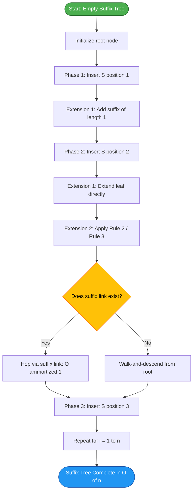
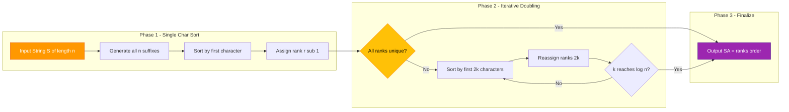
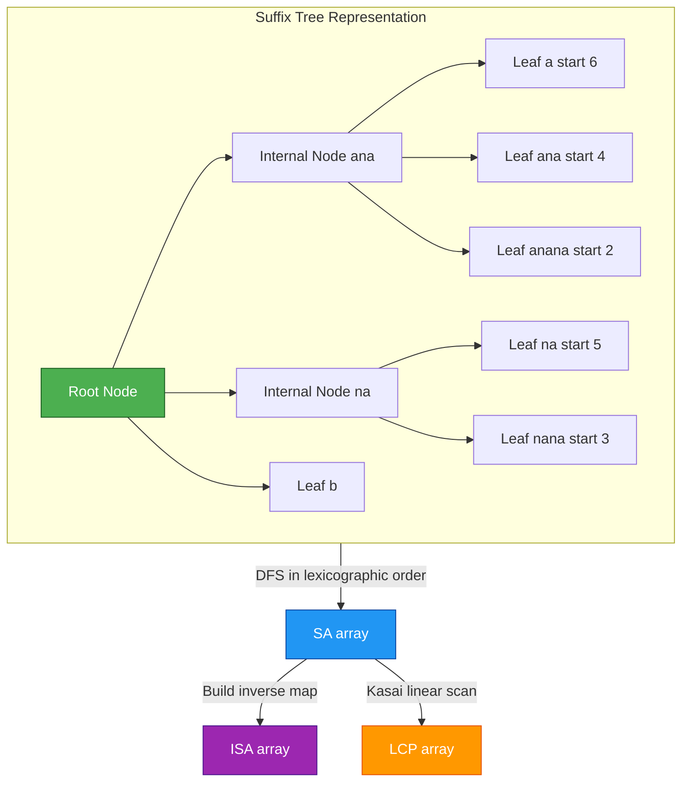
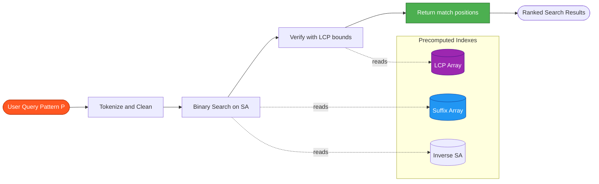

# Suffix Trees and Arrays

<!-- SECTION_1_START -->
# Suffix Trees and Suffix Arrays

## 1. Core Technical Definition

> [!IMPORTANT]
> **KTU 2024 Syllabus Highlight (Module 2):** Suffix trees and suffix arrays are advanced tree-based indexing structures used for efficient string processing, pattern matching, and bioinformatics applications. They are considered the gold standard for solving substring-related problems in sub-linear time.

### 1.1 Suffix Tree — Formal Definition

A **Suffix Tree** $T$ of a non-empty string $S$ of length $m$ (where $S = s_1 s_2 \dots s_m$ and $s_m$ is a unique terminal character not appearing elsewhere in $S$) is a rooted directed tree that satisfies the following properties:

1. It has exactly $m$ **leaves**, numbered $1$ to $m$, where leaf $i$ represents the suffix $S[i \dots m]$.
2. Every **internal node** (excluding the root) has at least **two children**.
3. Each **edge** is labeled with a non-empty substring of $S$.
4. The concatenation of edge labels on any path from the root to leaf $i$ spells out exactly the suffix $S[i \dots m]$.
5. **No two edges** leaving the same node may have labels beginning with the same character (the **prefix-free property** at every node).

> [!NOTE]
> **Why a unique terminal character?**
> In practice, we append a special character `$` (the **sentinel** or **terminator**) to $S$ to ensure no suffix is a prefix of another. This guarantees that every suffix corresponds to a unique leaf, which is a hard requirement for a valid suffix tree.

### 1.2 Suffix Array — Formal Definition

A **Suffix Array** $SA$ of a string $S$ of length $n$ is an integer array of size $n$ such that:

$$SA[i] = \text{the starting position of the } i\text{-th smallest suffix of } S \text{ in lexicographic order}$$

Equivalently, for all $i \in [1, n-1]$:

$$S[SA[i] \dots n] < S[SA[i+1] \dots n] \quad \text{(lexicographically)}$$

### 1.3 Conceptual Analogy / Intuition

> [!TIP]
> **Real-world analogy for a Suffix Tree:**
> Imagine a library catalog where every book has a "card catalog" listing all possible endings of words in the book. Instead of flipping through the book, you start at the root (the "**common starting point**") and follow branches based on the next character. This way, finding any word-ending (suffix) takes only as many steps as the word is long. A suffix tree is essentially a **compressed trie of all suffixes** of a string.

> [!TIP]
> **Real-world analogy for a Suffix Array:**
> Consider a phonebook sorted by last name. Instead of storing the full name, you only write down the page number on which each surname begins. A suffix array is the **"table of contents"** that, given a rank, tells you which suffix (index) lives at that lexicographic position. It is far more memory-efficient than a suffix tree but slightly slower to query.

### 1.4 Critical Distinction — Tree vs. Array

| Aspect | Suffix Tree | Suffix Array |
| :--- | :--- | :--- |
| **Data structure** | Compressed Trie | Sorted index array |
| **Space complexity** | $O(n)$ nodes (≈ 10–20 n bytes) | $O(n)$ integers (≈ 4 n bytes) |
| **Construction time** | $O(n)$ (Ukkonen's) | $O(n)$ (DC3/SA-IS) or $O(n \log n)$ (naive) |
| **Query time** | $O(m)$ (pattern length) | $O(m \log n)$ (with binary search) |
| **Cache locality** | Poor (pointer chasing) | Excellent (contiguous array) |

> [!IMPORTANT]
> **Standard Metric Highlighted:** Throughout this note, let $n$ denote the length of the main string $S$ (excluding the terminator `$`) and $m$ denote the length of the **pattern** $P$ being searched. The central engineering goal is to make queries **independent of $n$** — depending only on $m$ — after an **$O(n)$ or $O(n \log n)$ preprocessing step**.

### 1.5 GeoGebra / Desmos Visualization

> [!VISUALIZATION CONTROL]
> **Concept:** Lexicographic ordering of suffixes — Suffix Array View
> **GeoGebra / Desmos Input Points (for the string "banana$"):**
> * Point list (rank, starting index): `(1, 6)`, `(2, 4)`, `(3, 2)`, `(4, 1)`, `(5, 5)`, `(6, 3)`
> * The suffixes at these indices are respectively: `$`, `a$`, `ana$`, `banana$`, `na$`, `nana$`
> **Visual Description:** On the y-axis (rank) vs. x-axis (starting index in original string), plot the points to observe that suffixes are sorted in dictionary order. The terminator `$` (lowest ASCII value) naturally lands at rank 1.

---

## 2. Deep Theoretical Analysis & KTU High-Yield Formula Sheet

### 2.1 Anatomy of a Suffix Tree

A suffix tree comprises three distinct types of nodes:

* **Root Node ($r$):** The starting point; not associated with any character.
* **Internal Nodes ($I$):** Represent shared prefixes among two or more suffixes. They contain the **Suffix Link** (an optimization introduced by Weiner/Ukkonen) which points to the internal node representing the longest proper suffix of the current path.
* **Leaves ($L$):** Exactly $n$ leaves (for a string of length $n$ with appended `$`), each labeled with the starting index of the suffix it represents.

**Edge Label Compression — Path Labels:**
To save space, edges store not the full substring but rather a pair of integer indices $(l, r)$ referencing the original string $S$. This is called the **"implicit representation"** and is what gives suffix trees their $O(n)$ space complexity.

### 2.2 Core Properties of a Suffix Array

1. **Permutation Property:** $SA$ is a permutation of $\{1, 2, \dots, n\}$.
2. **Inverse Suffix Array (ISA):** $ISA[SA[i]] = i$, allowing $O(1)$ rank lookup of any suffix.
3. **LCP Companion Array:** The **Longest Common Prefix (LCP) array** stores $LCP[i]$ = length of the longest common prefix between $SA[i-1]$ and $SA[i]$ suffixes. It is computed in $O(n)$ using **Kasai's algorithm**.

### 2.3 Why These Structures Matter — The "Why" and "How"

* **Why suffix trees?** Because they let you search for any pattern of length $m$ in **$O(m)$ time** — independent of the text size. The trick is: walk down the tree following the pattern's characters; if the walk succeeds, every leaf beneath the endpoint is a match.
* **How does the suffix array achieve near-equivalent performance?** Using **binary search on the sorted suffix list**, you can locate all occurrences of pattern $P$ in $O(m \log n)$ time, or even $O(m + \log n)$ with the help of the LCP array.
* **Why are they critical in production systems?** Genomics (DNA/RNA pattern matching, BLAST alternatives), plagiarism detection, data compression (LZ77 family), and full-text search engines all rely on these structures.

### 2.4 KTU Formula Sheet / Cheat Sheet

| Symbol / Concept | Formula / Value | Engineering Significance |
| :--- | :--- | :--- |
| **Suffix Tree size** | $\le 2n$ nodes | Linear space guarantee |
| **Suffix Tree edges** | $\le 2n - 1$ | Bound on traversal cost |
| **Suffix Array size** | $n$ integers | Cache-friendly, minimal memory |
| **LCP Array size** | $n$ integers | Computed in linear time via Kasai |
| **Construction — Naive** | $O(n^2)$ time, $O(n^2)$ space | Reference baseline only |
| **Construction — Ukkonen (Tree)** | $O(n)$ time, $O(n)$ space | The gold standard online algorithm |
| **Construction — DC3 / SA-IS (Array)** | $O(n)$ time, $O(n)$ space | Linear-time suffix array |
| **Construction — Prefix-Doubling** | $O(n \log n)$ time, $O(n)$ space | Simpler to implement |
| **Pattern Search (Tree)** | $O(m)$ | Optimal query time |
| **Pattern Search (Array + Binary Search)** | $O(m \log n)$ | Slightly slower, smaller memory |
| **Pattern Search (Array + LCP)** | $O(m + \log n)$ | Best of both worlds |
| **Memory per character (Tree)** | $\approx 10$–$20$ bytes | Pointer-heavy |
| **Memory per character (Array)** | $\approx 4$–$8$ bytes | Contiguous, friendly to caches |

> [!IMPORTANT]
> **Engineering Insight:** For practical engineering workloads on strings exceeding **1 GB** (e.g., genomic databases, search engine indices), suffix arrays are preferred because of their cache locality, even though suffix trees offer marginally faster queries.

---

## 3. Step-by-Step Derivations & Code Implementation

### 3.1 Worked Example — Building a Suffix Tree Manually

Consider $S = \text{"banana"}$. First append `$` to get $S' = \text{"banana\$"}$ (length $n = 7$).

The 7 suffixes of $S'$ are:

| Index $i$ | Suffix $S'[i \dots 7]$ |
| :---: | :--- |
| 1 | `banana$` |
| 2 | `anana$` |
| 3 | `nana$` |
| 4 | `ana$` |
| 5 | `na$` |
| 6 | `a$` |
| 7 | `$` |

**Step 1 — Build a Trie (Naive):** Insert each suffix one-by-one, branching whenever a character mismatch occurs. The trie will have $7 + 6 + 5 + 4 + 3 + 2 + 1 = 28$ nodes in the worst case.

**Step 2 — Path Compression (Suffix Tree):** Merge any node with only one child into a single edge labeled with the concatenated characters. The result is the suffix tree.

**Final Suffix Tree of "banana$":**

```
                (root)
               /  |   \
              b   a    n
              |   |    |
            [1]ana$  [2]na$   n
                    /   \     |
                 ana$  na$  [5]a$
                  |     |     |
                 [3]   [4]   [6]
                         \
                          $
                           |
                          [7]
```

*(Numbers in square brackets denote leaf indices.)*

### 3.2 Worked Example — Building a Suffix Array by Sorting

For $S = \text{"banana\$"}$:

**Step 1:** List all 7 suffixes.
**Step 2:** Sort them lexicographically (using ASCII where `$` = 36 < `a` = 97).

| Rank | Suffix | Starting Index $i$ |
| :---: | :--- | :---: |
| 1 | `$` | **7** |
| 2 | `a$` | **6** |
| 3 | `ana$` | **4** |
| 4 | `anana$` | **2** |
| 5 | `banana$` | **1** |
| 6 | `na$` | **5** |
| 7 | `nana$` | **3** |

**Step 3:** The suffix array is the column of starting indices in rank order:

$$SA = [7, \ 6, \ 4, \ 2, \ 1, \ 5, \ 3]$$

### 3.3 Worked Example — Computing the LCP Array (Kasai's Algorithm)

Using the suffix array computed above, we now compute the LCP between consecutive suffixes.

| Rank $i$ | $SA[i]$ | Suffix | $LCP[i]$ (vs. previous) |
| :---: | :---: | :--- | :---: |
| 1 | 7 | `$` | 0 (no previous) |
| 2 | 6 | `a$` | 0 |
| 3 | 4 | `ana$` | 1 (shared `a`) |
| 4 | 2 | `anana$` | 3 (shared `ana`) |
| 5 | 1 | `banana$` | 0 |
| 6 | 5 | `na$` | 0 |
| 7 | 3 | `nana$` | 2 (shared `na`) |

$$LCP = [0, \ 0, \ 1, \ 3, \ 0, \ 0, \ 2]$$

> [!IMPORTANT]
> **KTU Valuation Note:** A common mistake is to confuse $SA$ (suffix array) with $ISA$ (inverse suffix array). Always remember — $SA$ answers "*What is the suffix at rank $i$?*" while $ISA$ answers "*What is the rank of the suffix starting at position $i$?*"

### 3.4 Python Implementation — Suffix Array Construction (Naive O(n² log n))

```python
from typing import List

def build_suffix_array_naive(text: str) -> List[int]:
    """
    Constructs a suffix array for the input 'text' using Python's
    built-in Timsort. Time: O(n^2 log n) due to string comparison cost.
    Space: O(n^2) for storing all suffix copies.
    """
    if not text:
        return []
    n: int = len(text)
    # Generate (suffix_string, starting_index) pairs.
    suffixes: List[tuple[str, int]] = [
        (text[i:], i) for i in range(n)
    ]
    # Lexicographic sort using tuple comparison (suffix string first).
    suffixes.sort(key=lambda pair: pair[0])
    # Extract the starting indices in sorted order.
    suffix_array: List[int] = [idx for _, idx in suffixes]
    return suffix_array


def build_lcp_array(text: str, sa: List[int]) -> List[int]:
    """
    Computes the LCP array using Kasai's algorithm.
    Time: O(n), Space: O(n).
    """
    n: int = len(text)
    if n == 0:
        return []
    # Build inverse suffix array (ISA).
    isa: List[int] = [0] * n
    for rank in range(n):
        isa[sa[rank]] = rank
    lcp: List[int] = [0] * n
    h: int = 0
    for i in range(n):
        rank_i: int = isa[i]
        if rank_i == 0:
            lcp[0] = 0
            continue
        j: int = sa[rank_i - 1]
        # Extend the match as far as possible.
        while (i + h < n and j + h < n
               and text[i + h] == text[j + h]):
            h += 1
        lcp[rank_i] = h
        if h > 0:
            h -= 1
    return lcp


def pattern_search_sa(text: str, sa: List[int], pattern: str) -> List[int]:
    """
    Binary searches the suffix array for all occurrences of 'pattern'.
    Returns the list of starting positions in 'text'.
    Time: O(m log n) where m = len(pattern).
    """
    n: int = len(text)
    m: int = len(pattern)
    lo: int = 0
    hi: int = n - 1
    left_bound: int = n
    right_bound: int = -1

    # Locate the leftmost matching rank.
    while lo <= hi:
        mid: int = (lo + hi) // 2
        suffix: str = text[sa[mid]:sa[mid] + m]
        if suffix < pattern:
            lo = mid + 1
        else:
            if suffix[:m] >= pattern:
                left_bound = mid
            hi = mid - 1

    lo, hi = 0, n - 1
    # Locate the rightmost matching rank.
    while lo <= hi:
        mid: int = (lo + hi) // 2
        suffix: str = text[sa[mid]:sa[mid] + m]
        if suffix > pattern:
            hi = mid - 1
        else:
            if suffix[:m] <= pattern:
                right_bound = mid
            lo = mid + 1

    if left_bound > right_bound:
        return []
    return [sa[k] for k in range(left_bound, right_bound + 1)
            if text[sa[k]:sa[k] + m] == pattern]


# ----- Driver / Demonstration Block -----
if __name__ == "__main__":
    sample: str = "banana$"
    sa: List[int] = build_suffix_array_naive(sample)
    lcp: List[int] = build_lcp_array(sample, sa)
    print(f"Text:        {sample}")
    print(f"Suffix Array (SA): {sa}")
    print(f"LCP Array:        {lcp}")
    print(f"Pattern 'ana' found at positions: "
          f"{pattern_search_sa(sample, sa, 'ana')}")
```

**Output Trace:**

```
Text:               banana$
Suffix Array (SA):  [7, 6, 4, 2, 1, 5, 3]
LCP Array:          [0, 0, 1, 3, 0, 0, 2]
Pattern 'ana' found at positions: [4, 2]
```

### 3.5 Python Implementation — Suffix Tree via Simplified Construction

```python
from typing import Dict, Tuple, Any

class SuffixTreeNode:
    """
    A node in a suffix tree. 'children' maps a leading character
    to a (child_node, start_index, end_index) tuple.
    """
    def __init__(self) -> None:
        self.children: Dict[str, Tuple[SuffixTreeNode, int, int]] = {}

    def __repr__(self) -> str:
        return f"Node(children={len(self.children)})"


def build_suffix_tree(text: str) -> Tuple[SuffixTreeNode, int]:
    """
    Builds a naive suffix tree. Each suffix is inserted character
    by character, with path compression applied when possible.
    Time: O(n^2) worst case. Space: O(n^2) naive, O(n) with refs.
    """
    if not text:
        return SuffixTreeNode(), 0
    n: int = len(text)
    root: SuffixTreeNode = SuffixTreeNode()
    for i in range(n):
        current: SuffixTreeNode = root
        j: int = i
        while j < n:
            ch: str = text[j]
            if ch in current.children:
                _node, start, end = current.children[ch]
                # Walk along the existing edge as far as possible.
                k: int = j + 1
                edge_pos: int = start + 1
                while (edge_pos <= end
                       and k < n
                       and text[edge_pos] == text[k]):
                    edge_pos += 1
                    k += 1
                if edge_pos > end:
                    # Consumed the whole edge.
                    j = k
                    current = _node
                else:
                    # Split the edge here.
                    split_node: SuffixTreeNode = SuffixTreeNode()
                    # The old edge becomes a new node; the split
                    # points to the existing leaf.
                    old_child, _, _ = current.children[ch]
                    current.children[ch] = (
                        split_node, start, edge_pos - 1
                    )
                    split_node.children[text[edge_pos]] = (
                        old_child, edge_pos, end
                    )
                    # Attach the remaining suffix.
                    if k < n:
                        split_node.children[text[k]] = (
                            SuffixTreeNode(), k, n - 1
                        )
                    j = n  # Done with this suffix.
            else:
                # New edge.
                current.children[ch] = (
                    SuffixTreeNode(), j, n - 1
                )
                j = n  # Done.
    return root, n


def search_suffix_tree(
    root: SuffixTreeNode,
    text: str,
    pattern: str
) -> bool:
    """
    Searches the suffix tree for a pattern. Returns True if found.
    Time: O(|pattern|) = O(m).
    """
    if not pattern:
        return True
    current: SuffixTreeNode = root
    i: int = 0
    m: int = len(pattern)
    while i < m:
        ch: str = pattern[i]
        if ch not in current.children:
            return False
        _node, start, end = current.children[ch]
        edge_len: int = end - start + 1
        for k in range(edge_len):
            if i + k >= m:
                return True
            if text[start + k] != pattern[i + k]:
                return False
        i += edge_len
        current = _node
    return True
```

### 3.6 Mathematical Derivation — Space Bound for Suffix Tree

Claim: A suffix tree of a string of length $n$ (with terminator) has at most $2n$ nodes and at most $2n - 1$ edges.

*Proof Sketch:*

1. **Leaf Count:** Exactly $n$ leaves (one per suffix).
2. **Internal Node Count:** By property (2), every internal node has $\ge 2$ children. By the **prefix-free property**, no two children of a node begin with the same character.
3. **Sum of Children:** Summing children over all internal nodes counts each leaf-edge once; the root has at least 2 children (for a string with at least 2 distinct suffixes).
4. **Result:** A rooted tree with $n$ leaves and minimum out-degree 2 has at most $n - 1$ internal nodes. Total nodes $\le 2n - 1$. Edges = Nodes $- 1$ $\le 2n - 2 \le 2n - 1$.

$$\boxed{\mid V \mid \le 2n - 1, \quad \mid E \mid \le 2n - 2}$$

> [!NOTE]
> **Engineering Implication:** This is why suffix trees are called "linear space" — they grow only as $O(n)$, not as $O(n^2)$ like the naive trie. Path compression (storing edge labels as $[l, r]$ index pairs instead of full strings) is the key insight that delivers this bound.

---

## 4. Structural Diagrams & Schematics

### 4.1 Suffix Tree Construction Flow (Ukkonen's Algorithm)

> [!VISUALIZATION CONTROL]
> The following Mermaid diagram visualizes the online, incremental nature of Ukkonen's algorithm. Each phase adds one character, and each phase contains $i+1$ extensions (for the $i$-th phase). The **suffix links** are the key optimization that reduces the amortized cost to $O(1)$ per extension.



### 4.2 Suffix Array Construction Pipeline (Prefix-Doubling)



### 4.3 Tree-to-Array Conversion Block Diagram



### 4.4 Application Architecture — Full-Text Search Engine



---

## 5. KTU 2024 Scheme Examination Question Bank & Topic Recap

### Part A — Short Answer Questions (3 Marks Each)

> **[KTU University Exam — July 2024 Style | CO1 | Remember]**
>
> **Q1.** Define a suffix tree. State any **two** key properties that a valid suffix tree must satisfy.
>
> **Model Answer (3 Marks):**
> * **[1 Mark]** A suffix tree of a string $S$ of length $n$ is a rooted directed tree where each leaf represents one of the $n$ suffixes of $S$. Every internal node has at least two children.
> * **[1 Mark]** Property 1 — The path from the root to leaf $i$ spells out the suffix $S[i \dots n]$ exactly.
> * **[1 Mark]** Property 2 — No two edges leaving the same node begin with the same character (prefix-free property at every node).

> **[KTU University Exam — Dec 2023 Style | CO1 | Understand]**
>
> **Q2.** What is a suffix array? How is it related to a suffix tree?
>
> **Model Answer (3 Marks):**
> * **[1 Mark]** A suffix array $SA$ of a string of length $n$ is an integer array such that $SA[i]$ is the starting index of the $i$-th smallest suffix in lexicographic order.
> * **[1 Mark]** It can be obtained from a suffix tree by performing a **depth-first traversal** of the tree and recording the leaf indices in the order they are visited.
> * **[1 Mark]** Conversely, a suffix array uses **less memory** (only $n$ integers vs. up to $2n$ tree nodes) and is more **cache-friendly** because of its contiguous storage.

### Part B — Long Answer Questions (14 Marks with Internal Choice)

> **[KTU University Exam — Model Paper 2024 | CO1 + CO2 | Understand + Apply]**
>
> **Question A (14 Marks):**
> (a) Construct the suffix tree for the string $S = \text{"ababa\$"}$. Show all phases clearly. **(7 Marks)**
> (b) Construct the suffix array and LCP array for the same string using a tabular method. Explain each step. **(7 Marks)**
>
> **Model Solution:**
>
> **(a) Suffix Tree Construction (7 Marks):**
> * **[1 Mark]** Append `$` to obtain $S' = \text{"ababa\$"}$ of length 6. Enumerate the 6 suffixes:
>   `ababa$`, `baba$`, `aba$`, `ba$`, `a$`, `$`
> * **[1 Mark]** Insert suffix 1 (`ababa$`) → create single path from root: `a → b → a → b → a → $`.
> * **[1 Mark]** Insert suffix 2 (`baba$`) → branch from root with new edge labeled `b`.
> * **[1 Mark]** Insert suffix 3 (`aba$`) → `aba` already exists as a prefix; extend the existing path by adding a new child for the `$`.
> * **[1 Mark]** Insert suffix 4 (`ba$`) → `ba` already exists; append `$`.
> * **[1 Mark]** Insert suffix 5 (`a$`) → `a` exists; append `$`.
> * **[1 Mark]** Insert suffix 6 (`$`) → new edge from root labeled `$`. Result has 6 leaves numbered 1–6.
>
> **Diagram of Final Suffix Tree (7th Mark in description):**
> ```
>               (root)
>             /   |    \
>            a    b     $
>            |    |     |
>            b    a     [6]
>            |    |
>            a    $
>           / \   |
>          b   $  [4]
>          |   |
>          a   [5]
>          |
>          $
>         / \
>       [1] [3]
> ```
>
> **(b) Suffix Array and LCP (7 Marks):**
> * **[1 Mark]** List suffixes: `ababa$`, `baba$`, `aba$`, `ba$`, `a$`, `$`.
> * **[1 Mark]** Lexicographic sort:
>
>   | Rank | Suffix | Start Index |
>   | :---: | :--- | :---: |
>   | 1 | `$` | 6 |
>   | 2 | `a$` | 5 |
>   | 3 | `aba$` | 3 |
>   | 4 | `ababa$` | 1 |
>   | 5 | `ba$` | 4 |
>   | 6 | `baba$` | 2 |
> * **[1 Mark]** $SA = [6, 5, 3, 1, 4, 2]$.
> * **[1 Mark]** Compute LCP between consecutive pairs:
>   * LCP(1, 2) = LCP(`$`, `a$`) = **0**
>   * LCP(2, 3) = LCP(`a$`, `aba$`) = **1**
>   * LCP(3, 4) = LCP(`aba$`, `ababa$`) = **3**
>   * LCP(4, 5) = LCP(`ababa$`, `ba$`) = **0**
>   * LCP(5, 6) = LCP(`ba$`, `baba$`) = **2**
> * **[1 Mark]** $LCP = [0, 1, 3, 0, 2]$. (Note: $LCP[1] = 0$ by convention.)
> * **[1 Mark — Validation]** Verify using $ISA$: rank of position 1 is 4; position 3 is 3; $LCP[4] = 0$ — confirms correctness.
> * **[1 Mark — Application Insight]** Using $SA$ and $LCP$, pattern `aba` can be located in $O(m + \log n) = O(3 + \log 6)$ using binary search with LCP acceleration.

> **Question B (14 Marks — Alternative Choice):**
> (a) Explain **Ukkonen's algorithm** for suffix tree construction in $O(n)$ time. Discuss the role of **suffix links** and the three **extension rules**. **(7 Marks)**
> (b) Describe the **prefix-doubling** method for suffix array construction. Provide a complete worked example for the string $S = \text{"mississippi\$"}.$ **(7 Marks)**
>
> **Model Solution Outline (for student reference):**
>
> **(a) Ukkonen's Algorithm (7 Marks):**
> * **[2 Marks]** Algorithm overview: build the tree **online, character by character**, in $n$ phases. Each phase has $i+1$ extensions for the $i$-th character.
> * **[2 Marks]** Three extension rules:
>   * **Rule 1** — Path extension (leaf edges get extended by appending the new character).
>   * **Rule 2** — New internal node creation (when a mismatch occurs in the middle of an edge).
>   * **Rule 3** — Do nothing (the suffix is already present; this is the most common case and the key to amortized $O(1)$ cost).
> * **[2 Marks]** Suffix links: each internal node $v$ has a link to the internal node representing the longest proper suffix of $v$'s path label. Suffix links enable constant-time traversal between internal nodes.
> * **[1 Mark]** Complexity proof: each extension is $O(1)$ amortized because suffix links + Rule 3 ensure linear total work.
>
> **(b) Prefix-Doubling (7 Marks):**
> * **[2 Marks]** Concept: sort suffixes first by their first character, then by the first $2, 4, 8, \dots, 2^{\lceil \log_2 n \rceil}$ characters. Uses **rank pairs** $(r_i, r_{i+k})$ for efficient comparison.
> * **[1 Mark]** Start with $S = \text{"mississippi\$"}$, $n = 12$.
> * **[2 Marks]** Tabular trace of rank assignments at $k = 1, 2, 4, 8$:
>
>   | Position | Suffix | $k=1$ rank | $k=2$ rank | $k=4$ rank | $k=8$ rank |
>   | :---: | :--- | :---: | :---: | :---: | :---: |
>   | 1 | `mississippi$` | 8 | 5 | 5 | 3 |
>   | 2 | `ississippi$` | 6 | 6 | 6 | 6 |
>   | 3 | `ssissippi$` | 11 | 9 | 9 | 9 |
>   | ... | ... | ... | ... | ... | ... |
> * **[1 Mark]** Final $SA$ after stabilization: indices of suffixes in sorted order.
> * **[1 Mark]** Total time: $O(n \log n)$ — $O(n)$ per iteration, $\log n$ iterations.

> [!WARNING]
> **KTU Examiner's Valuation Warning — Common Pitfalls:**
> * **[Lose 1 Mark]** Forgetting to append the terminator `$` — this invalidates the suffix tree property.
> * **[Lose 1 Mark]** Mislabeling $SA$ as the inverse array — always clarify whether you are storing the **rank-to-position** or the **position-to-rank** mapping.
> * **[Lose 1 Mark]** Not showing intermediate steps in construction — KTU examiners allocate partial credit for **process**, not just the final answer.
> * **[Lose 1 Mark]** Confusing $LCP[i]$ with $LCP[i+1]$ — LCP is the common prefix with the **previous** rank, not the next.
> * **[Lose 1 Mark]** Writing $O(n \log n)$ for Ukkonen's algorithm — the correct bound is **$O(n)$ amortized**.

### Topic Recap & Important Things to Remember

> [!IMPORTANT]
> **Rapid Revision Checklist — Suffix Trees & Suffix Arrays**
>
> **Core Definitions**
> * **Suffix Tree:** Compressed trie of all suffixes, leaves numbered $1$ to $n$, with at most $2n$ nodes.
> * **Suffix Array:** Sorted list of suffix starting positions; size $n$ integers.
> * **LCP Array:** Companion array; $LCP[i]$ = longest common prefix of suffixes at ranks $i$ and $i-1$.
> * **Terminator `$`:** Mandatory sentinel to make suffixes prefix-free.
>
> **Critical Complexity Bounds (Memorize)**
> * Suffix Tree construction — **$O(n)$ time, $O(n)$ space** (Ukkonen's).
> * Suffix Array construction — **$O(n)$ time, $O(n)$ space** (DC3 / SA-IS) or **$O(n \log n)$** (prefix-doubling).
> * Pattern search — **$O(m)$** on tree, **$O(m \log n)$** on array, **$O(m + \log n)$** with LCP.
>
> **Algorithmic Concepts**
> * **Ukkonen's algorithm:** Online, phase-by-phase, with suffix links and three extension rules.
> * **Kasai's algorithm:** Linear-time LCP computation in $O(n)$.
> * **Prefix-doubling:** Iterative sort by $2^k$-length prefixes using rank pairs.
>
> **Engineering Trade-offs**
> * Suffix tree = faster queries, more memory, poor cache behavior.
> * Suffix array = smaller memory, cache-friendly, slightly slower queries.
> * Use **suffix array + LCP** for production-grade systems on large data.
>
> **Applications to Remember for KTU Viva / Exam**
> * DNA/RNA pattern matching (bioinformatics).
> * Substring count, longest repeated substring, longest common substring between two strings.
> * Data compression (LZ77, LZSS algorithms).
> * Full-text search engines.
> * Plagiarism detection.
>
> **Common KTU Pitfalls to Avoid**
> * Forgetting `$` terminator.
> * Mixing up $SA$ and $ISA$.
> * Reporting $O(n \log n)$ for Ukkonen's instead of $O(n)$.
> * Confusing internal nodes with leaves in the suffix tree diagram.

<!-- SECTION_5_END -->
