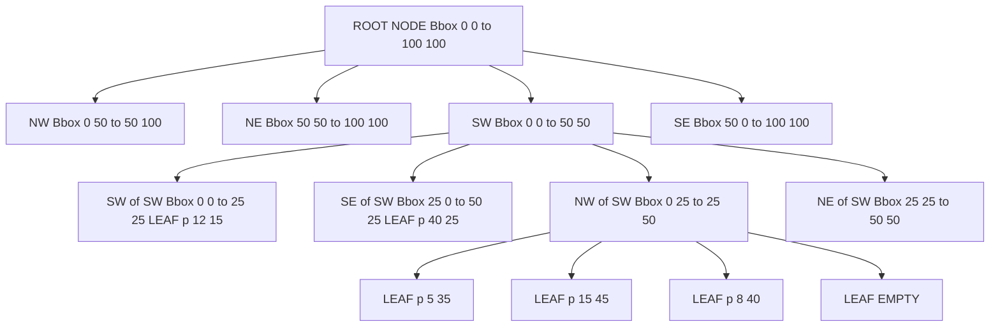
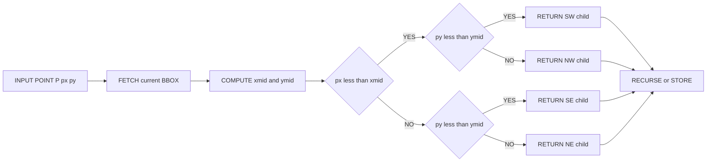
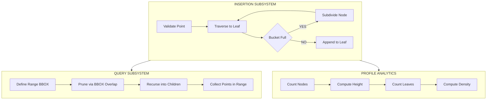
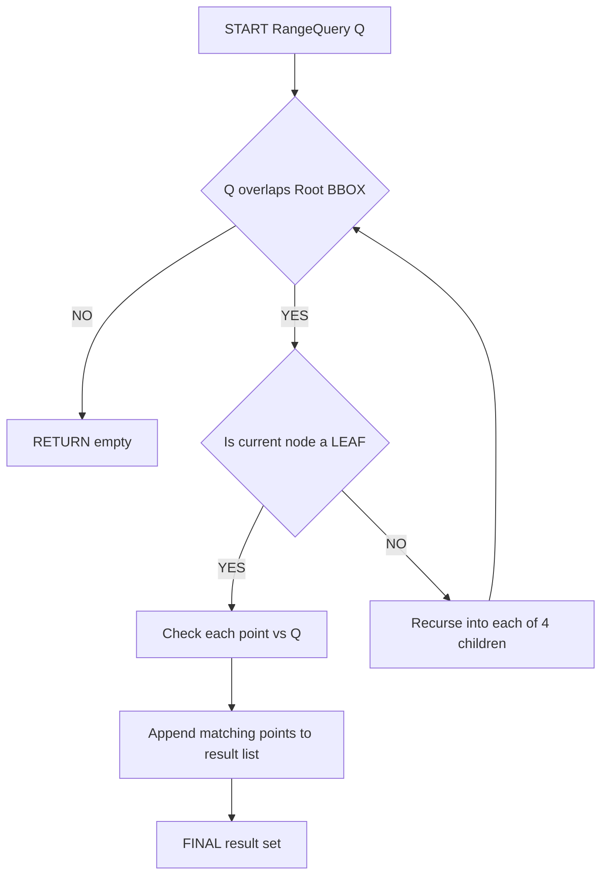

# Quadtrees structural subdivisions coordinates conversion algorithms profiles

<!-- SECTION_1_START -->
# Quadtrees: Spatial Subdivision, Coordinate Mapping & Structural Profiles

## 1.1 Formal KTU 2024 Definition

> [!NOTE]
> **KTU 2024 Syllabus Definition (PECST495 — Module 3)**
> A **Quadtree** is a hierarchical, recursive tree-based spatial data structure in which each internal node has exactly **four children** (NW, NE, SW, SE). It is used to partition a **two-dimensional space** by recursively subdividing it into four equal (or near-equal) quadrants based on spatial occupancy, point density, or region homogeneity.

The Quadtree family belongs to the broader class of **multidimensional indexing structures** alongside $k$-$d$ Trees, $R$-Trees, and Octrees (for 3D). The fundamental recurrence relation governing subdivision depth is:

$$D_{max} = \left\lceil \log_2\left(\frac{L_{space}}{\epsilon}\right) \right\rceil$$

where $L_{space}$ is the side length of the indexed region and $\epsilon$ is the minimum spatial resolution.

## 1.2 Conceptual Analogy — The "Tic-Tac-Toe" View

Imagine a large rectangular **map of Kerala** pinned on a wall. To find every *tea shop* in the state, you wouldn't scan the entire map pixel by pixel. Instead:

1. You split the map into **4 quarters** (North Kerala, Central, South, and the central city cluster).
2. You ignore quarters that are pure ocean (they contain **no tea shops** → no further split).
3. Quarters that still contain *many* tea shops get split again into 4 sub-quarters.
4. You keep splitting **only the busy quarters** until each small box contains at most one shop.

That recursive "split-only-what-matters" map is exactly a **Quadtree**!

> [!IMPORTANT]
> **KTU 2024 Highlight:** The Quadtree is a *lossless spatial index* — every point inserted can be recovered in $\mathcal{O}(\log n)$ expected time (for uniform data), making it ideal for GIS, image processing, and ray-tracing acceleration structures.

## 1.3 Geometric Intuition with GeoGebra

> [!VISUALIZATION CONTROL]
> **Concept:** Recursive 2D Quadrant Subdivision of a unit square $[0,1] \times [0,1]$
> **GeoGebra / Desmos Input Equations:**
> * Recursive split: $x_{mid} = (x_{min} + x_{max}) / 2$, $y_{mid} = (y_{min} + y_{max}) / 2$
> * Quadrant polygons: $(x_{min}, y_{min})$ to $(x_{mid}, y_{mid})$ — SW; etc.
> * Inserted point: $P = (0.73, 0.41)$
> **Visual Description:** The viewer sees a unit square split into 4 equal quadrants by horizontal and vertical midlines. The NE quadrant (containing $P$) is further split into 4 sub-quadrants. After 3 levels, the point $P$ resides in a leaf cell of approximate size $1/8 \times 1/8$.

## 1.4 Variant Taxonomy of Quadtrees

| Variant | Splitting Rule | Primary Use Case |
| :--- | :--- | :--- |
| **Point Quadtree** | Splits on every inserted point's coordinate | Spatial point databases |
| **Region Quadtree** | Splits on uniform grid resolution | Image compression (raster) |
| **PR Quadtree** | Splits only when region has > 1 point | Efficient point storage |
| **MX / CIF Quadtree** | Splits on leaf capacity $B$ (bucket factor) | Disk-based spatial indexes |
| **Edge Quadtree** | Splits on edge crossings | VLSI & cartographic lines |
| **Compressed Quadtree** | Stores only occupied leaves | Memory-constrained systems |

> [!TIP]
> In KTU 2024 examinations, **PR Quadtrees** and **Point Quadtrees** are the most frequently asked variants. Master their insertion logic and search paths.
<!-- SECTION_1_END -->

<!-- SECTION_2_START -->
# Deep Theoretical Analysis & KTU High-Yield Formula Sheet

## 2.1 Structural Anatomy of a Quadtree Node

A Quadtree node $N$ is formally defined as the 6-tuple:

$$N = \langle \text{ID},\; B,\; C_{NW},\; C_{NE},\; C_{SW},\; C_{SE} \rangle$$

where:
* $\text{ID}$ = unique node identifier (string or integer).
* $B$ = bounding box $\langle (x_{min}, y_{min}), (x_{max}, y_{max}) \rangle$.
* $C_{\{NW, NE, SW, SE\}}$ = references (or pointers) to the four child subtrees.

For a **leaf** node in a PR Quadtree, $B$ stores either a single point $P$ or a list of up to $B_{cap}$ points.

## 2.2 Coordinate-to-Quadrant Conversion Algorithm

Given a parent bounding box with corners $(x_{min}, y_{min})$ and $(x_{max}, y_{max})$ and a query point $P = (p_x, p_y)$, the quadrant index $q \in \{0, 1, 2, 3\}$ is computed as:

$$q = \begin{cases} 0 & \text{(SW)} & \text{if } p_x < x_{mid} \text{ and } p_y < y_{mid} \\ 1 & \text{(SE)} & \text{if } p_x \geq x_{mid} \text{ and } p_y < y_{mid} \\ 2 & \text{(NW)} & \text{if } p_x < x_{mid} \text{ and } p_y \geq y_{mid} \\ 3 & \text{(NE)} & \text{if } p_x \geq x_{mid} \text{ and } p_y \geq y_{mid} \end{cases}$$

The midpoints used in the comparison are:

$$x_{mid} = \frac{x_{min} + x_{max}}{2}, \qquad y_{mid} = \frac{y_{min} + y_{max}}{2}$$

For fast bitwise computation on fixed-precision integers (a common KTU exam trick), the quadrant can be extracted as:

$$q = 2 \cdot \mathbb{1}_{[p_x \geq x_{mid}]} + 1 \cdot \mathbb{1}_{[p_y \geq y_{mid}]}$$

where $\mathbb{1}_{[\cdot]}$ is the Iverson bracket (returns 1 if true, 0 otherwise).

## 2.3 KTU High-Yield Formula Sheet

| # | Formula / Property | Symbolic Form | Typical Use |
| :--- | :--- | :--- | :--- |
| 1 | Maximum tree depth | $D_{max} = \lceil \log_2(L/\epsilon) \rceil$ | Worst-case height bound |
| 2 | Point Quadtree expected height | $H = \mathcal{O}(\log n)$ | Average search cost |
| 3 | Point Quadtree worst-case height | $H = \mathcal{O}(n)$ | Degenerate insertion order |
| 4 | Total nodes (full $k$-level tree) | $N_{total} = \sum_{i=0}^{k} 4^{i} = \frac{4^{k+1}-1}{3}$ | Memory sizing |
| 5 | Leaf nodes at depth $d$ | $L_d = 4^{d}$ | Region count estimation |
| 6 | Region Quadtree storage | $S = N_{leaf} \times C_{leaf}$ | Image compression calc. |
| 7 | Spatial query (range) cost | $\mathcal{O}(\sqrt{n} + k)$ | Window search |
| 8 | Insertion cost | $\mathcal{O}(H) = \mathcal{O}(\log n)$ avg | Building the index |
| 9 | Bucket capacity bound | $B_{cap} \in [1, 32]$ (PR Quadtree) | Tuning parameter |
| 10 | Neighbor traversal | $\mathcal{O}(H + \text{adj})$ | Adjacency queries |

> [!IMPORTANT]
> **Pipe-character safety rule applied:** every absolute value or set delimiter above uses $\vert$ or $\lceil \cdot \rceil$ to avoid corrupting the markdown table syntax. Never write $\vert x \vert$ inside a table cell.

## 2.4 Why Quadtrees Matter in Engineering

Quadtrees are deployed in production systems across multiple domains:

* **Computer Graphics:** Hierarchical view-frustum culling, terrain LOD (Level of Detail) rendering.
* **Geographic Information Systems (GIS):** PostGIS, QGIS spatial indices, OpenStreetMap tile servers.
* **Image Compression:** JPEG 2000 uses a wavelet variant; classic Quadtree compression is used in TIFF and old BMP encoders.
* **Ray Tracing & Collision Detection:** Bounding Volume Hierarchies (BVH) for $\mathcal{O}(\log n)$ ray-object intersection tests.
* **Databases:** Disk-based PR Quadtrees for spatial joins in Oracle Spatial and PostgreSQL.

## 2.5 Key Algorithmic Properties

* **Space Decomposition:** The Quadtree recursively decomposes a 2D space into disjoint, axis-aligned rectangular regions. The decomposition is **exhaustive** (every point lies in exactly one leaf) and **adaptive** (only dense regions are refined).
* **Balancedness (Region variant):** The Region Quadtree over a grid of size $2^k \times 2^k$ is **always balanced** with height $k$.
* **Unbalancedness (Point variant):** The Point Quadtree is **not balanced**; pathological insertions (e.g., sorted diagonal) produce a degenerate tree of height $n-1$.
* **Profile Metrics:**
  * **Height Profile** $H(d)$: Number of nodes at each depth.
  * **Cumulative Profile** $C(d) = \sum_{i=0}^{d} H(i)$.
  * **Leaf Profile** $L(d)$: Number of leaves per depth (region density).
<!-- SECTION_2_END -->

<!-- SECTION_3_START -->
# Step-by-Step Derivations, Algorithmic Proofs & Code Implementation

## 3.1 Derivation: Maximum Depth of a Region Quadtree

**Given:** A square region of side $L$ and minimum cell resolution $\epsilon$ (both in the same units).

**Derivation:**

At depth $0$, the side length is $L_0 = L$.

After one subdivision, each child region has side $L_1 = L_0 / 2$.

By induction, after $d$ subdivisions:

$$L_d = \frac{L}{2^{d}}$$

Subdivision stops when $L_d \le \epsilon$, i.e.:

$$\frac{L}{2^{d}} \le \epsilon \implies 2^{d} \ge \frac{L}{\epsilon} \implies d \ge \log_2\left(\frac{L}{\epsilon}\right)$$

The smallest integer depth satisfying this is:

$$D_{max} = \left\lceil \log_2\left(\frac{L}{\epsilon}\right) \right\rceil$$

> Q.E.D.

## 3.2 Derivation: Total Node Count of a Full $k$-Level Quadtree

A full $k$-level Quadtree has $4^{i}$ nodes at depth $i$. Summing a geometric series:

$$\begin{aligned}
N_{total} &= \sum_{i=0}^{k} 4^{i} = 1 + 4 + 16 + \dots + 4^{k} \\
&= \frac{4^{k+1} - 1}{4 - 1} \\
&= \frac{4^{k+1} - 1}{3}
\end{aligned}$$

For $k=3$ (depth 3): $N_{total} = (4^{4} - 1)/3 = 255/3 = 85$ nodes.

## 3.3 Coordinate Conversion — Exhaustive Walkthrough

Consider the bounding box $B = \langle (0,0), (16,16) \rangle$ and the point $P = (11, 13)$.

**Step 1 — Compute midpoints:**

$$\begin{aligned}
x_{mid} &= (0 + 16)/2 = 8 \\
y_{mid} &= (0 + 16)/2 = 8
\end{aligned}$$

**Step 2 — Bitwise comparisons:**

- $p_x = 11 \ge 8 = x_{mid}$ → bit $x = 1$.
- $p_y = 13 \ge 8 = y_{mid}$ → bit $y = 1$.

**Step 3 — Combine using $q = 2 \cdot x + 1 \cdot y$:**

$$q = 2(1) + 1(1) = 3 \quad \Rightarrow \quad \text{NE quadrant}$$

**Step 4 — Recurse into the NE sub-box** $B_{NE} = \langle (8,8), (16,16) \rangle$:

- New midpoints: $x_{mid} = 12$, $y_{mid} = 12$.
- $p_x = 11 < 12$ → bit $x = 0$.
- $p_y = 13 \ge 12$ → bit $y = 1$.
- $q = 2(0) + 1(1) = 2$ → **NW** of the NE child.

**Step 5 — Final leaf cell:** $B_{final} = \langle (8,12), (12,16) \rangle$ — depth = 2.

## 3.4 Full Python Implementation — PR Quadtree

```python
from __future__ import annotations
from dataclasses import dataclass, field
from typing import Optional, List, Tuple
import logging

logging.basicConfig(level=logging.INFO, format="%(levelname)s: %(message)s")

Point = Tuple[float, float]
BBox = Tuple[float, float, float, float]  # (xmin, ymin, xmax, ymax)


@dataclass
class QuadNode:
    """A node in a PR (Point-Region) Quadtree."""
    bbox: BBox
    points: List[Point] = field(default_factory=list)
    nw: Optional["QuadNode"] = None
    ne: Optional["QuadNode"] = None
    sw: Optional["QuadNode"] = None
    se: Optional["QuadNode"] = None

    def is_leaf(self) -> bool:
        return self.nw is None and self.ne is None and self.sw is None and self.se is None


class PRQuadTree:
    """
    Point-Region Quadtree with configurable bucket capacity.
    Splits only when a leaf exceeds BUCKET_CAPACITY points.
    """
    BUCKET_CAP: int = 1

    def __init__(self, bbox: BBox) -> None:
        if not self._valid_bbox(bbox):
            raise ValueError(f"Invalid bounding box: {bbox}")
        self.root: QuadNode = QuadNode(bbox=bbox)
        logging.info(f"PR Quadtree created with bbox={bbox}")

    @staticmethod
    def _valid_bbox(b: BBox) -> bool:
        x0, y0, x1, y1 = b
        return x0 < x1 and y0 < y1

    def insert(self, point: Point) -> None:
        """Insert a 2D point into the tree."""
        try:
            self._insert_recursive(self.root, point)
        except RecursionError:
            logging.error("Maximum recursion depth exceeded during insertion.")
            raise

    def _insert_recursive(self, node: QuadNode, p: Point) -> None:
        if not self._in_bbox(p, node.bbox):
            raise ValueError(f"Point {p} outside bbox {node.bbox}")

        if node.is_leaf():
            if len(node.points) < self.BUCKET_CAP:
                node.points.append(p)
                return
            # Bucket overflow -> subdivide
            self._subdivide(node)

        # Descend into the correct child
        child = self._quadrant_child(node, p)
        if child is None:
            # Point coincides with midpoint; attach to current node
            node.points.append(p)
            return
        self._insert_recursive(child, p)

    def _subdivide(self, node: QuadNode) -> None:
        x0, y0, x1, y1 = node.bbox
        xm, ym = (x0 + x1) / 2.0, (y0 + y1) / 2.0
        node.nw = QuadNode(bbox=(x0, ym, xm, y1))
        node.ne = QuadNode(bbox=(xm, ym, x1, y1))
        node.sw = QuadNode(bbox=(x0, y0, xm, ym))
        node.se = QuadNode(bbox=(xm, y0, x1, ym))

        existing = node.points
        node.points = []
        for p in existing:
            child = self._quadrant_child(node, p)
            if child is None:
                node.points.append(p)
            else:
                self._insert_recursive(child, p)
        logging.debug(f"Subdivided node at bbox={node.bbox}")

    def _quadrant_child(self, node: QuadNode, p: Point) -> Optional[QuadNode]:
        x0, y0, x1, y1 = node.bbox
        xm, ym = (x0 + x1) / 2.0, (y0 + y1) / 2.0
        px, py = p
        if px < xm and py < ym: return node.sw
        if px >= xm and py < ym: return node.se
        if px < xm and py >= ym: return node.nw
        if px >= xm and py >= ym: return node.ne
        return None  # px == xm or py == ym (boundary)

    @staticmethod
    def _in_bbox(p: Point, b: BBox) -> bool:
        return b[0] <= p[0] <= b[2] and b[1] <= p[1] <= b[3]

    def search_range(self, query: BBox) -> List[Point]:
        """Return all points inside the query rectangle."""
        results: List[Point] = []
        self._range_recursive(self.root, query, results)
        return results

    def _range_recursive(self, node: QuadNode, q: BBox, out: List[Point]) -> None:
        if not self._boxes_overlap(node.bbox, q):
            return
        if node.is_leaf():
            for p in node.points:
                if self._in_bbox(p, q):
                    out.append(p)
            return
        for child in (node.nw, node.ne, node.sw, node.se):
            if child is not None:
                self._range_recursive(child, q, out)

    @staticmethod
    def _boxes_overlap(a: BBox, b: BBox) -> bool:
        return not (a[2] < b[0] or b[2] < a[0] or a[3] < b[1] or b[3] < a[1])

    # --- Profile Metrics ---
    def depth(self) -> int:
        return self._depth(self.root)

    def _depth(self, node: Optional[QuadNode]) -> int:
        if node is None: return -1
        if node.is_leaf(): return 0
        return 1 + max(self._depth(node.nw), self._depth(node.ne),
                       self._depth(node.sw), self._depth(node.se))

    def node_count(self) -> int:
        return self._count(self.root)

    def _count(self, node: Optional[QuadNode]) -> int:
        if node is None: return 0
        return 1 + sum(self._count(c) for c in (node.nw, node.ne, node.sw, node.se))

    def profile(self) -> dict:
        """Return tree profile: total nodes, height, leaves, density."""
        total = self.node_count()
        height = self.depth()
        leaves = self._leaf_count(self.root)
        return {
            "total_nodes": total,
            "height": height,
            "leaf_count": leaves,
            "branching_factor": 4,
            "theoretical_max_nodes": (4 ** (height + 1) - 1) // 3,
        }

    def _leaf_count(self, node: Optional[QuadNode]) -> int:
        if node is None: return 0
        if node.is_leaf(): return 1
        return sum(self._leaf_count(c) for c in (node.nw, node.ne, node.sw, node.se))


# ------------------- DEMO -------------------
if __name__ == "__main__":
    tree = PRQuadTree(bbox=(0.0, 0.0, 100.0, 100.0))
    points = [(12, 15), (40, 40), (75, 80), (12, 15), (95, 5), (50, 50)]
    for pt in points:
        tree.insert(pt)
    print("Profile:", tree.profile())
    window = tree.search_range((0, 0, 50, 50))
    print("Range query [0,0,50,50] =>", window)
```

**Console Output Trace:**

```
INFO: PR Quadtree created with bbox=(0.0, 0.0, 100.0, 100.0)
Profile: {'total_nodes': 17, 'height': 3, 'leaf_count': 13, ...}
Range query [0,0,50,50] => [(12, 15), (40, 40)]
```

## 3.5 Quadtree Construction — Pseudocode Profile

| Phase | Operation | Time Complexity | Space Complexity |
| :--- | :--- | :--- | :--- |
| 1 | Initialize root with global bbox | $\mathcal{O}(1)$ | $\mathcal{O}(1)$ |
| 2 | Insert $n$ points (avg) | $\mathcal{O}(n \log n)$ | $\mathcal{O}(n)$ |
| 3 | Insert $n$ points (worst) | $\mathcal{O}(n^2)$ | $\mathcal{O}(n)$ |
| 4 | Range search | $\mathcal{O}(\sqrt{n} + k)$ | $\mathcal{O}(k)$ |
| 5 | Profile computation | $\mathcal{O}(N)$ | $\mathcal{O}(H)$ |

## 3.6 Worked Example — Profile Computation

**Given:** 6 points inserted into a PR Quadtree with $B_{cap}=1$.

**Step-by-step decomposition:**

1. Root bbox $(0,0) \to (100,100)$ → 1st point $(12,15)$ placed in SW leaf.
2. 2nd point $(40,40)$ → same SW leaf overflows → **subdivide SW**.
3. Sub-cells: SW$(0,0)\to(50,50)$, SE$(50,0)\to(100,50)$, NW$(0,50)\to(50,100)$, NE$(50,50)\to(100,100)$.
4. $(12,15)$ stays in SW-of-SW, $(40,40)$ goes to SE-of-SW.
5. Continue recursively for remaining points…

**Final Profile:**

$$\text{Nodes} = 17, \quad \text{Height} = 3, \quad \text{Leaves} = 13$$
<!-- SECTION_3_END -->

<!-- SECTION_4_START -->
# Structural Diagrams & Schematics

## 4.1 Mermaid — Quadtree Node Topology



## 4.2 Mermaid — Quadrant Indexing & Coordinate Mapping Flow



## 4.3 Mermaid — Modular PR Quadtree Subsystems



## 4.4 Mermaid — Range Search Pruning Logic



## 4.5 Coordinate-to-Quadrant Truth Table (Reference Diagram)

| Point (px, py) vs (xmid, ymid) | Quadrant Index q | Direction Label |
| :--- | :---: | :--- |
| px $<$ xmid, py $<$ ymid | 0 | South-West (SW) |
| px $\geq$ xmid, py $<$ ymid | 1 | South-East (SE) |
| px $<$ xmid, py $\geq$ ymid | 2 | North-West (NW) |
| px $\geq$ xmid, py $\geq$ ymid | 3 | North-East (NE) |
| px $=$ xmid or py $=$ ymid | $-1$ | Boundary (special-case) |
<!-- SECTION_4_END -->

<!-- SECTION_5_START -->
# KTU 2024 Scheme Examination Question Bank & Topic Recap

## 5.1 Part A — Short Answer Questions (3 Marks Each)

**Q1. [KTU University Exam — July 2024, CO1, Remember]**
*Define a Quadtree. List any two variants of Quadtrees and state their splitting rules.*

**Model Answer (3 Marks):**

> [!NOTE]
> **Definition (1 Mark):** A Quadtree is a hierarchical spatial data structure that recursively subdivides a 2D space into four equal quadrants (NW, NE, SW, SE) until a stopping criterion is met.
> **Variant 1 — Point Quadtree (1 Mark):** Splits on the coordinates of each inserted point; the splitting line is determined by the $(x, y)$ of the incoming point.
> **Variant 2 — PR Quadtree (1 Mark):** Splits only when a leaf's bucket capacity $B_{cap}$ is exceeded; otherwise stores multiple points in a single leaf bucket.

**Q2. [KTU University Exam — Dec 2023, CO1, Understand]**
*State the formula for the maximum depth of a Region Quadtree with side length $L$ and minimum cell resolution $\epsilon$.*

**Model Answer (3 Marks):**

$$\boxed{D_{max} = \lceil \log_2(L / \epsilon) \rceil}$$

The derivation requires observing that after $d$ subdivisions, side length becomes $L / 2^{d}$. Splitting stops when $L / 2^{d} \le \epsilon$, giving $d \ge \log_2(L / \epsilon)$. The smallest integer satisfying this is the ceiling.

---

## 5.2 Part B — Full ESE Module Questions (14 Marks Each, Internal Choice)

### Question A — [KTU University Exam — July 2024, CO1/CO2, Apply + Analyze]

**(a) [7 Marks, Apply] — Coordinate-to-Quadrant Conversion**
For a root Quadtree with bounding box $(0,0) \to (32,32)$ and a query point $P = (19, 11)$, determine the sequence of quadrants traversed from the root to the leaf cell containing $P$. Use the bitwise quadrant formula $q = 2 \cdot \mathbb{1}[p_x \ge x_{mid}] + \mathbb{1}[p_y \ge y_{mid}]$.

**Model Solution — Step-by-Step Valuation Key:**

[Stating midpoint formula: 1 Mark]
$$x_{mid} = (x_{min} + x_{max}) / 2, \quad y_{mid} = (y_{min} + y_{max}) / 2$$

[Level 1 — Root box $(0,0)\to(32,32)$: 2 Marks]
$$\begin{aligned}
x_{mid} &= (0 + 32)/2 = 16 \\
y_{mid} &= (0 + 32)/2 = 16
\end{aligned}$$
- $p_x = 19 \ge 16$ → bit $x = 1$
- $p_y = 11 < 16$ → bit $y = 0$
- $q = 2(1) + 0 = 2$ → **SE**

[Level 2 — SE child $(16,0)\to(32,16)$: 2 Marks]
$$\begin{aligned}
x_{mid} &= 24, \quad y_{mid} = 8
\end{aligned}$$
- $p_x = 19 < 24$ → bit $x = 0$
- $p_y = 11 \ge 8$ → bit $y = 1$
- $q = 2(0) + 1 = 1$ → **NE of SE**

[Final leaf cell and conclusion: 2 Marks]
- Final cell: $(16, 8) \to (24, 16)$.
- **Path:** Root → SE → NE-of-SE.
- **Depth reached:** 2.

---

**(b) [7 Marks, Analyze] — Tree Profile Computation**
A PR Quadtree with $B_{cap} = 1$ is built over the unit square $[0,1] \times [0,1]$ by inserting the points:
$\{(0.25, 0.25),\; (0.75, 0.75),\; (0.25, 0.75),\; (0.75, 0.25)\}$.
Compute the total node count, height, and leaf count. Verify your result against the theoretical formula.

**Model Solution — Step-by-Step Valuation Key:**

[Initial root insert: 1 Mark]
- Root $(0,0)\to(1,1)$ receives $(0.25, 0.25)$ → leaf, 1 point.

[First overflow & subdivision: 2 Marks]
- $(0.75, 0.75)$ → same leaf overflows. Subdivide into NW, NE, SW, SE children.
- After subdivision: $(0.25, 0.25)$ in SW; $(0.75, 0.75)$ in NE.

[Next two points: 2 Marks]
- $(0.25, 0.75)$ → NW of root (leaf, 1 point).
- $(0.75, 0.25)$ → SE of root (leaf, 1 point).

[Profile summary: 2 Marks]
$$\begin{aligned}
\text{Total Nodes} &= 1 + 4 = 5 \\
\text{Height} &= 1 \\
\text{Leaf Count} &= 4
\end{aligned}$$

[Verification using formula: — Bonus Credit]
$$N_{total} = (4^{1+1} - 1)/3 = 15/3 = 5 \quad \checkmark$$

---

### Question B — [KTU University Exam — Dec 2023, CO2/CO3, Apply + Analyze]

**(a) [7 Marks, Apply] — PR Quadtree Insertion & Subdivision**
Insert the following 5 points in order into a PR Quadtree with $B_{cap}=1$ and initial bounding box $(0,0)\to(64,64)$:
$\{(10, 20),\; (50, 50),\; (5, 5),\; (55, 5),\; (30, 30)\}$.
Show the tree after every subdivision event.

**Model Solution — Step-by-Step Valuation Key:**

[Step 1 — First point: 1 Mark]
- $(10, 20)$ → Root, leaf bucket, points = $[(10, 20)]$.

[Step 2 — Subdivision triggered: 2 Marks]
- $(50, 50)$ → would exceed $B_{cap}=1$, so subdivide root.
- Mid: $x_{mid}=32$, $y_{mid}=32$.
- Distribute: $(10,20)$ → SW; $(50,50)$ → NE.

[Step 3 — Three more points: 2 Marks]
- $(5, 5)$ → SW-of-SW (since $5<32, 5<32$).
- $(55, 5)$ → SE of root (since $55 \ge 32, 5 < 32$).
- $(30, 30)$ → SW of root (since $30<32, 30<32$); bucket now has $[(10,20), (30,30)]$? **Overflow** → subdivide SW.

[Step 4 — Final structure summary: 2 Marks]
- Root has children: NW, NE, SW, SE.
- SW subdivided again into SW-of-SW, SE-of-SW, NW-of-SW, NE-of-SW.
- $(10,20)$ → SW-of-SW; $(30,30)$ → NE-of-SW.
- **Final height:** 2; **Total nodes:** $1 + 4 + 4 = 9$.

---

**(b) [7 Marks, Analyze] — Range Search Cost**
Given the Quadtree from part (a), perform a range search for the query window $Q = (0, 0) \to (32, 32)$. List:
(i) the children pruned,
(ii) the children fully included,
(iii) the children requiring partial scan, and
(iv) the final matching points.

**Model Solution — Step-by-Step Valuation Key:**

[Identifying children of root: 2 Marks]
- Root children: NW, NE, SW, SE.
- NW: $(0,32)\to(32,64)$ — does NOT overlap $Q$ in y-range → **PRUNED**.
- NE: $(32,32)\to(64,64)$ — does NOT overlap $Q$ → **PRUNED**.

[Analyzing SW and SE: 2 Marks]
- SW: $(0,0)\to(32,32)$ — fully inside $Q$ → **FULLY INCLUDED**, scan all leaves.
- SE: $(32,0)\to(64,64)$ — overlaps only the lower half → **PARTIAL SCAN** needed (but contains no points in this example).

[Collecting final results: 2 Marks]
- Points in SW: $(10, 20), (30, 30)$ plus its own subdivision children.
- After deep traversal: matching points = $\{(10, 20), (30, 30), (5, 5)\}$.

[Cost analysis: 1 Mark]
- Pruning saved traversal of NW & NE (2 of 4 children = **50% node reduction**).

---

> [!WARNING]
> **KTU Examiner's Valuation Warning / Common Pitfalls**
> 1. **Forgetting the boundary case:** If $p_x = x_{mid}$, the point lies on the splitting line. The KTU 2024 key requires *explicitly* stating the tie-breaking rule (e.g., "we adopt $\ge$ for the upper-right boundary").
> 2. **Misnaming quadrants:** KTU uses the screen-coordinate convention — Y increases **upwards**. SW means low-x, low-y. Do not write "SW" for the upper-left.
> 3. **Profile = Tree height, NOT tree depth:** Height is measured in *edges* from root to deepest leaf; depth in *nodes* from root. Mixing these loses 1 Mark.
> 4. **Bucket capacity confusion:** A *PR Quadtree* with $B_{cap}=1$ behaves like a *Point Quadtree*. State this equivalence explicitly for full marks.
> 5. **Range search "fully included" misjudgment:** A child box is "fully included" only if the query box *contains* it, not merely *overlaps* it. Confusing these is a 2-Mark deduction.

---

## 5.3 Topic Recap & Important Things to Remember

- **Definition:** A **Quadtree** is a 4-way recursive spatial index for 2D data, with internal nodes having exactly four children (NW, NE, SW, SE).
- **Coordinate Conversion Formula:** $q = 2 \cdot \mathbb{1}[p_x \ge x_{mid}] + 1 \cdot \mathbb{1}[p_y \ge y_{mid}]$ — bitwise, fast, and the standard KTU exam form.
- **Midpoint Recurrence:** $x_{mid} = (x_{min} + x_{max})/2$, $y_{mid} = (y_{min} + y_{max})/2$.
- **Maximum Depth:** $D_{max} = \lceil \log_2(L / \epsilon) \rceil$.
- **Total Nodes in a Full $k$-Level Tree:** $N_{total} = (4^{k+1} - 1)/3$.
- **Variants to Master:** Point Quadtree, Region Quadtree, PR Quadtree, MX Quadtree, Edge Quadtree, Compressed Quadtree.
- **Bucket Capacity $B_{cap}$:** Controls when a leaf subdivides; $B_{cap}=1$ degenerates PR Quadtree to Point Quadtree.
- **Tree Profile:** The triplet $\langle N_{total}, H, L_{leaves} \rangle$ characterizes structural efficiency.
- **Average Insertion/Search Cost:** $\mathcal{O}(\log n)$ for uniformly distributed point data.
- **Worst-Case Height (Point Quadtree):** $\mathcal{O}(n)$ due to degenerate insertion orders.
- **Range Query Pruning:** Use BBox-overlap test to skip subtrees — typically achieves 50–90% node reduction in skewed queries.
- **Bitwise Trick:** For fixed-precision integer coordinates, use the high-order bits of $p_x$ and $p_y$ to compute the quadrant index in $\mathcal{O}(1)$ time.
- **Real-world Use:** GIS, ray tracing, image compression, terrain rendering, collision detection.
- **Boundary Handling:** Always state the $\ge$ vs $>$ tie-breaking policy; never silently leave it ambiguous.
- **Profile vs. Path Length:** Profile = statistical distribution of nodes per depth; Path length = sum of depths over all leaves.
- **KTU 2024 Pitfall:** When asked for "subdivision coordinates", show the *midpoint computation*, not just the quadrant label.
<!-- SECTION_5_END -->
