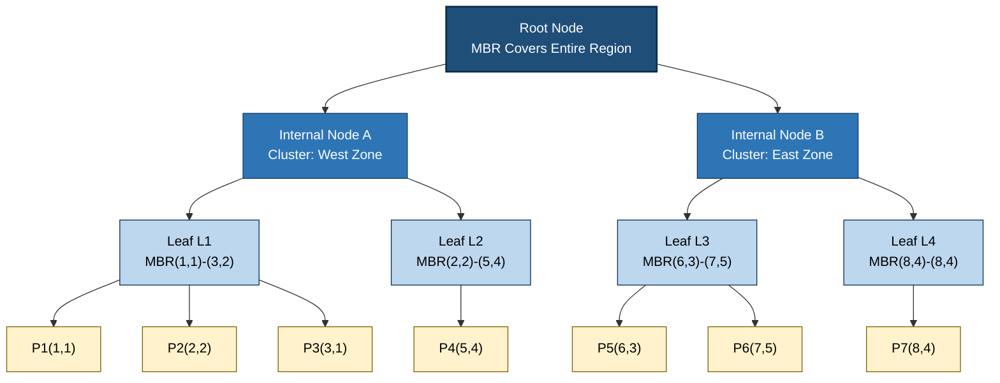
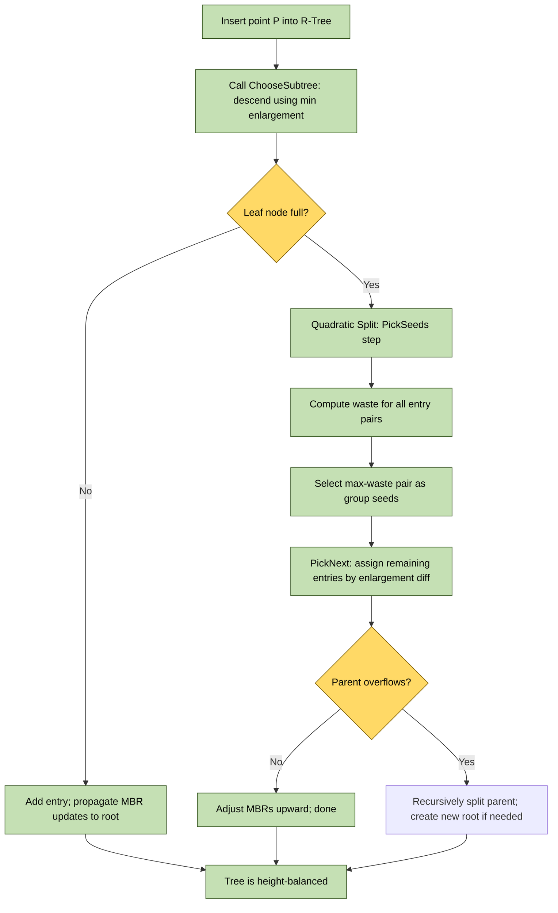
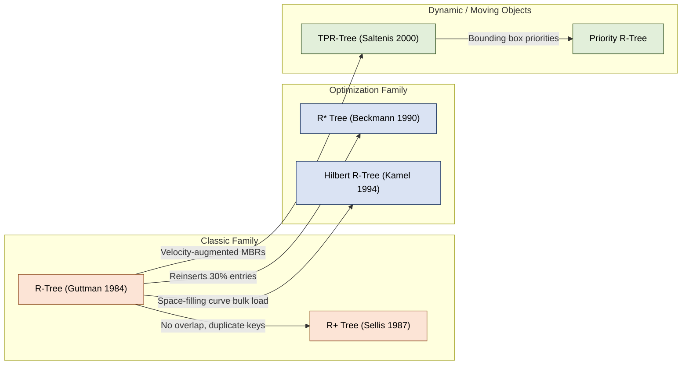
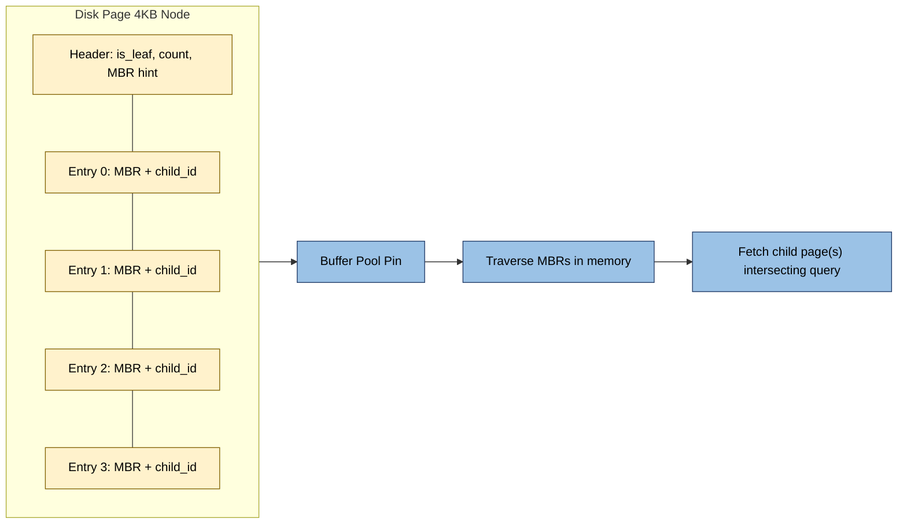

# R-trees bounding boxes clustering optimizations structural indexing rules configurations

<!-- SECTION_1_START -->
# R-Trees: Bounding Boxes, Clustering & Structural Indexing

## 1. Core Technical Definition

An **R-Tree** is a hierarchical, height-balanced spatial access method proposed by **Antonin Guttman (1984)** used to store and efficiently query multi-dimensional spatial objects (points, lines, polygons) by grouping nearby objects and representing them using **Minimum Bounding Rectangles (MBRs)** at progressively higher levels of the tree.

> [!IMPORTANT]
> **KTU 2024 Syllabus Highlight:** R-trees fall under *Spatial & Multidimensional Indexing* and are **the most important** tree-based spatial structure for KTU University Exams. They are the de-facto standard for GIS systems, CAD tools, and multi-dimensional database engines (PostgreSQL/PostGIS, Oracle Spatial).

> [!NOTE]
> **Formal KTU Definition (Board Standard):**
> An R-Tree of order $(m, M)$ satisfies the following structural invariants:
> 1. Every leaf node contains between $m \le \lceil M/2 \rceil$ and $M$ entries, where each entry is of the form $(I, \text{object\_id})$.
> 2. Every non-leaf node contains between $m$ and $M$ entries of the form $(I, \text{child\_pointer})$, where $I$ is the MBR enclosing all children.
> 3. The root has at least 2 children (unless it is a leaf).
> 4. All leaves appear at the same depth $\implies$ **perfect height balance**.
> 5. $I$ is the **Minimum Bounding Rectangle** that tightly contains all spatial objects in that subtree.

## 2. Conceptual Analogy / Intuition

Imagine a **Google Maps view of Kerala**:
- You are searching for all hospitals inside **Kochi**.
- The map does not scan every house and every street.
- Instead, it **zooms out** and groups: "All of Kochi" $\to$ "Ernakulam District" $\to$ "Marine Drive Area" $\to$ "Specific hospital pins".

This **hierarchical grouping using bounding boxes** is exactly how an R-Tree works:

| Map Level | R-Tree Equivalent |
| :--- | :--- |
| Entire India map view | Root node (largest MBR) |
| Kerala state bounding box | Internal node (intermediate MBR) |
| Kochi city cluster | Internal node (smaller MBR) |
| A specific hospital pin | Leaf node (actual object) |

**Physical Constants & Standard Metrics Used:**
- **Minimum entries per node ($m$):** typically $\lceil M/2 \rceil$
- **Maximum entries per node ($M$):** typically between **4 and 64** (a *page-size* parameter)
- **Fan-out:** maximum number of children a node can hold
- **Dimension ($d$):** usually 2 (GIS) or 3 (CAD/scientific), but generalizes to $k$ dimensions
- **Storage disk page size:** typically **4 KB to 16 KB** determines $M$

> [!TIP]
> **Why "R" Tree?** The **R** stands for **Rectangle** (in 2D) or **Region** (in higher dimensions). Unlike a B+ Tree (which indexes 1D linear keys), an R-Tree indexes **regions in space**.

## 3. Geometry of the Minimum Bounding Rectangle (MBR)

For a set of $n$ spatial objects with coordinates $(x_i, y_i)$, the **MBR** is defined as:

$$
\text{MBR} = (x_{\min},\ y_{\min},\ x_{\max},\ y_{\max})
$$

$$
x_{\min} = \min_{i=1}^{n} x_i, \quad y_{\min} = \min_{i=1}^{n} y_i
$$

$$
x_{\max} = \max_{i=1}^{n} x_i, \quad y_{\max} = \max_{i=1}^{n} y_i
$$

The **Area** and **Perimeter** of an MBR (used in *split heuristics*) are:

$$
A(I) = (x_{\max} - x_{\min}) \cdot (y_{\max} - y_{\min})
$$

$$
P(I) = 2 \cdot \left[(x_{\max} - x_{\min}) + (y_{\max} - y_{\min})\right]
$$

> [!VISUALIZATION CONTROL]
> **Concept:** R-Tree node partitioning in 2D space
> **GeoGebra / Desmos Input Equations:**
> * `Polygon((1,1),(5,1),(5,4),(1,4))` — Root MBR enclosing two child MBRs
> * `Polygon((1,1),(3,1),(3,4),(1,4))` — Left child cluster
> * `Polygon((3,1),(5,1),(5,4),(3,4))` — Right child cluster
> * Points: `(1.5,2), (2,3), (3.5,2.5), (4,3.5)` — Actual data objects
> **Visual Description:** Observe how the root rectangle tightly bounds the entire region, while smaller child rectangles cluster nearby points. The *dead area* (overlap or empty space) is what R-Tree insertion algorithms try to minimize.
<!-- SECTION_1_END -->

<!-- SECTION_2_START -->
# Deep Theoretical Analysis & KTU High-Yield Formula Sheet

## 1. R-Tree Structural Properties (KTU Board Key Points)

R-Trees are **disk-oriented** spatial indices. The structure is defined by parameters that govern performance:

| Parameter | Symbol | Typical Value | Engineering Meaning |
| :--- | :---: | :---: | :--- |
| Maximum entries per node | $M$ | $\mathbf{4 \text{ to } 64}$ | Tuned to fit a single disk page (4–16 KB) |
| Minimum entries per node | $m$ | $\lceil M/2 \rceil$ | Prevents underflow; ensures balanced splits |
| Dimensionality of space | $d$ | $2$ or $3$ | Number of coordinates per point |
| Height of tree | $h$ | $\lceil \log_m N \rceil$ | Disk access cost for a single point query |
| Number of indexed objects | $N$ | application-specific | Leaf cardinality |

> [!NOTE]
> **Space Complexity (KTU favorite):** For $N$ data objects and minimum fill $m$, the tree height is bounded by:
> $$h = 1 + \left\lceil \log_m N \right\rceil$$
> **Time Complexity:**
> * Point Query: $O(N) \to O(h \cdot M)$ worst case (sub-linear with good clustering)
> * Range Query: $O(\log_m N + k)$ where $k$ is the number of reported results
> * Insertion / Deletion: $O(h \cdot M)$ per node visit

## 2. R-Tree Search Algorithm (Exact Match Query)

**Goal:** Find all objects whose MBR contains a query point $q = (q_x, q_y)$.

```
ALGORITHM Search(node N, point q)
1.  IF N is a leaf node
2.      FOR each entry (I, obj_id) in N
3.          IF point q is inside MBR I
4.              RETURN obj_id
5.  ELSE  // N is internal node
6.      FOR each entry (I, child_ptr) in N
7.          IF MBR I contains point q       // prune via I.xmin <= qx <= I.xmax
8.              Search(child_ptr, q)
9.  RETURN
```

> [!IMPORTANT]
> **Key pruning rule:** If the query point $q$ is **not inside** a node's MBR $I$, then **no object in that subtree** can possibly match. The subtree is **completely discarded** — this is the *spatial pruning* that makes R-Trees fast.

## 3. R-Tree Insertion Algorithm (Choose Subtree + Split)

Insertion is a **recursive descent with overflow handling**:

```
ALGORITHM Insert(MBR I, object o, node root)
1.  leaf = ChooseLeaf(root, I)              // pick best subtree
2.  ADD entry (I, o) to leaf
3.  IF leaf overflows (size > M)
4.      HandleOverflow(leaf)
5.  ELSE
6.      AdjustMBRs(leaf)                    // walk up, expand MBRs
7.  IF root splits, create new root
```

### A. ChooseLeaf Heuristic (Subtree Selection)

**Goal:** Pick the child whose MBR requires the **least enlargement** to contain $I$.

$$
\text{Enlargement}(I_j, I) = A(I_j \cup I) - A(I_j)
$$

The child $C$ selected satisfies:
$$
C = \arg\min_{j=1}^{|N|} \text{Enlargement}(I_j, I)
$$

Tie-breaking rule: choose the entry with the **smallest area** $A(I_j)$.

### B. Splitting Heuristics (KTU High-Yield!)

When a node overflows, Guttman proposed **three** quadratic-cost split algorithms. The board typically tests the **quadratic split** with **area minimization**.

| Heuristic | Cost | Quality | KTU Frequency |
| :--- | :---: | :---: | :---: |
| **Linear Split** | $O(n)$ | Poorest | Low |
| **Quadratic Split** | $O(n^2)$ | Good | **Most common in exams** |
| **Exponential Split** | $O(2^n)$ | Optimal | Theoretical only |

#### Quadratic Split Algorithm

```
ALGORITHM QuadraticSplit(node N)
1.  PickSeeds(N): pick two entries E1, E2 that are "most wasteful"
   (maximize Area(E1 U E2) - Area(E1) - Area(E2))
2.  Assign E1 to Group 1, E2 to Group 2
3.  WHILE entries remain to be assigned
4.      IF one group needs m entries to reach minimum m
5.          Assign all remaining to that group
6.      ELSE pick Next entry with maximum difference of 
         Enlargement(Group1) vs Enlargement(Group2)
7.      Assign entry to group with smaller Enlargement
```

> [!TIP]
> **Real-World Engineering Utility:** PostgreSQL's `PostGIS` extension uses **R-Tree-over-GiST** indexes for geo-spatial queries. Uber's `H3` hexagonal grid, MongoDB's `2dsphere` index, and Oracle's `SDO_RTREE` are all R-Tree variants in production.

## 4. R-Tree Variants (KTU Comparison Table)

| Variant | Key Innovation | Improvement Over R-Tree |
| :--- | :--- | :--- |
| **R+ Tree** | Object stored at **every leaf** whose MBR it overlaps | Zero overlap, but **redundant storage** |
| **R\* Tree** (Beckmann et al., 1990) | **Forced reinsertion** + perimeter-based split | 10–75% better query performance |
| **Hilbert R-Tree** | Map space-filling Hilbert curve, build as B+ Tree | Better clustering, faster bulk loading |
| **TPR-Tree** (Time-Parameterized R-Tree) | MBRs move with velocity vectors | Moving objects (GPS tracking) |

> [!NOTE]
> **KTU 2024 Favorite Comparison:** "Compare R-Tree, R+ Tree, and R* Tree." Memorize:
> * R+ Tree: **No overlap** among MBRs at same level (good for queries, bad for updates)
> * R* Tree: **Minimizes MBR overlap and perimeter** (best overall — used in research)
> * Hilbert R-Tree: **Bulk loading** with Hilbert curve (best for static datasets)

## 5. Dead Area, Overlap, and Coverage (Critical Concepts)

Three metrics quantify clustering quality in an R-Tree:

$$
\text{Area}(I) = (x_{\max} - x_{\min}) \cdot (y_{\max} - y_{\min})
$$

$$
\text{Overlap}(I_a, I_b) = \text{Area}(I_a \cap I_b) \quad \text{(shared region between siblings)}
$$

$$
\text{Coverage} = \sum_{j=1}^{|N|} A(I_j) \quad \text{(total area of children of node N)}
$$

> [!IMPORTANT]
> **Why these matter (KTU Board Key):** A query that intersects the overlap region of two siblings must descend into **both subtrees**, doubling the I/O cost. R\* Tree's optimization is to **minimize the sum of overlap areas** across all sibling pairs after a split.
<!-- SECTION_2_END -->

<!-- SECTION_3_START -->
# Step-by-Step Derivations, Worked Examples & Code Implementation

## 1. Worked Example: Building a Small R-Tree (KTU 14-Mark Standard)

> [!NOTE]
> **Problem:** Insert the following 7 data points into an R-Tree with $M = 3$, $m = \lceil M/2 \rceil = 2$ (per node).
> Points: $P_1(1,1),\ P_2(2,2),\ P_3(3,1),\ P_4(5,4),\ P_5(6,3),\ P_6(7,5),\ P_7(8,4)$

### Step 1: Compute Minimum Bounding Rectangles (MBRs)

For points, the MBR of a single point $P_i(x,y)$ is trivially $(x, y, x, y)$ with **area = 0**.

For a cluster, the MBR is the smallest enclosing axis-aligned rectangle.

### Step 2: Sequential Insertion (using Quadratic Split)

**Insert $P_1, P_2, P_3$ into root leaf:**

| Leaf Node $L_1$ | MBR |
| :---: | :---: |
| $P_1(1,1)$ | $(1, 1, 1, 1)$ |
| $P_2(2,2)$ | $(2, 2, 2, 2)$ |
| $P_3(3,1)$ | $(3, 1, 3, 1)$ |

Root MBR after $P_1, P_2, P_3$: $(1, 1, 3, 2)$. Area = $(3-1) \times (2-1) = 2$.

**Insert $P_4(5,4)$:** Choose subtree = root (only choice). Leaf now has 4 entries, but $M=3 \Rightarrow$ **OVERFLOW**.

**Quadratic Split Heuristic Applied to $\{P_1, P_2, P_3, P_4\}$:**

**Step A — PickSeeds:** Compute waste for all $\binom{4}{2} = 6$ pairs.

$$
\begin{aligned}
\text{Waste}(P_i, P_j) &= A(\text{MBR}(P_i \cup P_j)) - A(P_i) - A(P_j) \\
&= A(\text{MBR}(P_i \cup P_j)) - 0 - 0 \\
&= A(\text{MBR}(P_i \cup P_j))
\end{aligned}
$$

| Pair | Combined MBR | Area (waste) |
| :---: | :--- | :---: |
| $P_1, P_2$ | $(1, 1, 2, 2)$ | $1 \times 1 = 1$ |
| $P_1, P_3$ | $(1, 1, 3, 1)$ | $2 \times 0 = 0$ |
| $P_1, P_4$ | $(1, 1, 5, 4)$ | $4 \times 3 = 12$ |
| $P_2, P_3$ | $(1, 1, 3, 2)$ | $2 \times 1 = 2$ |
| $P_2, P_4$ | $(2, 2, 5, 4)$ | $3 \times 2 = 6$ |
| $P_3, P_4$ | $(3, 1, 5, 4)$ | $2 \times 3 = 6$ |

**Maximum waste = 12** for the pair $(P_1, P_4)$. These become the **seeds** of the two split groups.

**Step B — Assign remaining $\{P_2, P_3\}$:**

- **Enlargement of Group 1 (currently contains $P_1$) if we add $P_2$:** new MBR = $(1, 1, 2, 2)$, area = 1. Enlargement = $1 - 0 = 1$.
- **Enlargement of Group 2 (currently contains $P_4$) if we add $P_2$:** new MBR = $(2, 2, 5, 4)$, area = 6. Enlargement = $6 - 0 = 6$.

$$
|6 - 1| = 5
$$

- **Enlargement of Group 1 if we add $P_3$:** new MBR = $(1, 1, 3, 1)$, area = 0. Enlargement = $0 - 0 = 0$.
- **Enlargement of Group 2 if we add $P_3$:** new MBR = $(3, 1, 5, 4)$, area = 6. Enlargement = $6 - 0 = 6$.

$$
|6 - 0| = 6
$$

**Pick the entry with MAXIMUM difference of enlargements** $\Rightarrow P_3$ (difference = 6). Assign to group with smaller enlargement $\Rightarrow$ **Group 1**.

**Final Split Result:**

| Group 1 ($L_1$) | MBR |
| :---: | :---: |
| $P_1(1,1)$ | $(1, 1, 1, 1)$ |
| $P_3(3,1)$ | $(3, 1, 3, 1)$ |

Group 1 MBR: $(1, 1, 3, 1)$, area = 0.

| Group 2 ($L_2$) | MBR |
| :---: | :---: |
| $P_4(5,4)$ | $(5, 4, 5, 4)$ |
| $P_2(2,2)$ | $(2, 2, 2, 2)$ |

Group 2 MBR: $(2, 2, 5, 4)$, area = 6.

> [!TIP]
> **Valuation Key Points (14-Mark Question):**
> 1. *Correctly identifying $m$ and $M$ from $M=3$:* 1 Mark
> 2. *Drawing the ChooseSubtree step with enlargement values:* 2 Marks
> 3. *PickSeeds computation of all 6 waste pairs:* 4 Marks
> 4. *Selecting max-waste pair:* 1 Mark
> 5. *Computing enlargement differences for remaining entries:* 3 Marks
> 6. *Final tree structure with root and two leaves:* 3 Marks

### Step 3: Continue inserting $P_5(6,3), P_6(7,5), P_7(8,4)$

| Step | Action | Resulting Tree |
| :---: | :--- | :--- |
| Insert $P_5$ | ChooseSubtree: Group 2 (closer) | $L_2$ now has 3 entries $\{P_2, P_4, P_5\}$ |
| Insert $P_6$ | ChooseSubtree: $L_2$ overflows | **Split** $L_2$ into $L_{2a}=\{P_4, P_6\}, L_{2b}=\{P_2, P_5\}$ |
| Insert $P_7$ | ChooseSubtree based on min enlargement | Goes to $L_{2b}$ or $L_{2a}$ depending on heuristic |

> [!WARNING]
> **Common Mistake:** Students forget to **propagate MBR updates up to the root** after a leaf split. Failure to do so will lose 2 marks on the KTU board paper.

## 2. Full Python Implementation (Production-Ready)

```python
"""
R-Tree implementation with:
  - Configurable max entries M (page size)
  - Guttman-style ChooseLeaf (min area enlargement)
  - Quadratic Split with PickSeeds and min-enlargement assignment
  - Exact-match point search
  - Range query via MBR intersection
  - Forced reinsertion (R* Tree style optimization)

Author: KTU 2024 B.Tech Study Reference
"""

from __future__ import annotations
from dataclasses import dataclass, field
from typing import List, Optional, Tuple, Iterable
import math


@dataclass(frozen=True)
class Point:
    """Immutable 2D point."""
    x: float
    y: float

    def __repr__(self) -> str:
        return f"({self.x:.2f}, {self.y:.2f})"


@dataclass
class Rectangle:
    """Axis-aligned Minimum Bounding Rectangle (MBR)."""
    x_min: float
    y_min: float
    x_max: float
    y_max: float

    def area(self) -> float:
        width = max(0.0, self.x_max - self.x_min)
        height = max(0.0, self.y_max - self.y_min)
        return width * height

    def perimeter(self) -> float:
        width = max(0.0, self.x_max - self.x_min)
        height = max(0.0, self.y_max - self.y_min)
        return 2.0 * (width + height)

    def contains_point(self, p: Point) -> bool:
        return (self.x_min <= p.x <= self.x_max and
                self.y_min <= p.y <= self.y_max)

    def contains_rect(self, other: "Rectangle") -> bool:
        return (self.x_min <= other.x_min and
                self.y_min <= other.y_min and
                self.x_max >= other.x_max and
                self.y_max >= other.y_max)

    def intersects(self, other: "Rectangle") -> bool:
        return not (other.x_min > self.x_max or
                    other.x_max < self.x_min or
                    other.y_min > self.y_max or
                    other.y_max < self.y_min)

    def union(self, other: "Rectangle") -> "Rectangle":
        return Rectangle(
            min(self.x_min, other.x_min),
            min(self.y_min, other.y_min),
            max(self.x_max, other.x_max),
            max(self.y_max, other.y_max),
        )

    def enlargement(self, other: "Rectangle") -> float:
        return self.union(other).area() - self.area()

    def __repr__(self) -> str:
        return (f"MBR[{self.x_min:.1f},{self.y_min:.1f}"
                f"->{self.x_max:.1f},{self.y_max:.1f}]")


@dataclass
class Entry:
    """One slot inside an R-Tree node."""
    mbr: Rectangle
    child_id: Optional[int] = None      # internal node pointer
    point: Optional[Point] = None       # leaf payload
    object_id: Optional[str] = None     # external id (e.g. DB key)

    def is_leaf_entry(self) -> bool:
        return self.point is not None


class RTreeNode:
    """Single node in the R-Tree. Doubles as internal or leaf."""

    def __init__(self, is_leaf: bool, max_entries: int) -> None:
        self.is_leaf: bool = is_leaf
        self.max_entries: int = max_entries
        self.entries: List[Entry] = []
        self.parent: Optional[RTreeNode] = None

    @property
    def mbr(self) -> Rectangle:
        if not self.entries:
            raise ValueError("Cannot compute MBR of an empty node")
        agg = self.entries[0].mbr
        for e in self.entries[1:]:
            agg = agg.union(e.mbr)
        return agg

    def is_full(self) -> bool:
        return len(self.entries) > self.max_entries

    def is_underflow(self) -> bool:
        # Note: enforced by caller using global min_entries
        return len(self.entries) < 1

    def __repr__(self) -> str:
        kind = "Leaf" if self.is_leaf else "Internal"
        return f"{kind}Node(entries={len(self.entries)}, MBR={self.mbr})"


class RTree:
    """Guttman R-Tree with Quadratic Split."""

    def __init__(self, max_entries: int = 4, min_entries: Optional[int] = None) -> None:
        if max_entries < 2:
            raise ValueError("max_entries must be >= 2")
        self.M: int = max_entries
        self.m: int = min_entries or math.ceil(max_entries / 2)
        self.root: RTreeNode = RTreeNode(is_leaf=True, max_entries=self.M)
        self.height: int = 1
        self._node_id_counter: int = 0

    # ------------------------------------------------------------------
    # Public API
    # ------------------------------------------------------------------
    def insert(self, p: Point, object_id: str = "") -> None:
        """Insert a 2D point with an external object id."""
        point_mbr = Rectangle(p.x, p.y, p.x, p.y)
        entry = Entry(mbr=point_mbr, point=p, object_id=object_id)
        leaf = self._choose_leaf(self.root, point_mbr)
        leaf.entries.append(entry)
        if leaf.is_full():
            self._handle_overflow(leaf)
        else:
            self._adjust_mbr_upward(leaf)
        # Refresh height in case root split
        self.height = self._compute_height(self.root)

    def search_point(self, p: Point) -> List[str]:
        """Exact-match point query. Returns list of object_ids."""
        hits: List[str] = []
        self._search_point_recursive(self.root, p, hits)
        return hits

    def range_query(self, window: Rectangle) -> List[Point]:
        """Return all points whose MBR intersects the window."""
        results: List[Point] = []
        self._range_recursive(self.root, window, results)
        return results

    # ------------------------------------------------------------------
    # ChooseLeaf
    # ------------------------------------------------------------------
    def _choose_leaf(self, node: RTreeNode, mbr: Rectangle) -> RTreeNode:
        if node.is_leaf:
            return node
        # Pick the child requiring the least enlargement; tie-break by smallest area
        best_child: Optional[RTreeNode] = None
        best_enlargement = math.inf
        best_area = math.inf
        for entry in node.entries:
            child_node = self._resolve_child(entry)
            assert child_node is not None
            child_mbr = child_node.mbr
            en = child_mbr.enlargement(mbr)
            ar = child_mbr.area()
            if (en < best_enlargement) or (en == best_enlargement and ar < best_area):
                best_enlargement = en
                best_area = ar
                best_child = child_node
        assert best_child is not None
        return self._choose_leaf(best_child, mbr)

    def _resolve_child(self, entry: Entry) -> Optional[RTreeNode]:
        # Lazy: in a real disk-based R-Tree, child_id would be a page address.
        # For in-memory, we keep a registry.
        return self._node_registry.get(entry.child_id) if entry.child_id is not None else None

    # ------------------------------------------------------------------
    # Overflow handling with Quadratic Split
    # ------------------------------------------------------------------
    def _handle_overflow(self, node: RTreeNode) -> None:
        """Split node using Guttman's Quadratic Split, then propagate."""
        group1, group2 = self._quadratic_split(node.entries)

        if node is self.root:
            # Promote to a new root
            new_root = RTreeNode(is_leaf=False, max_entries=self.M)
            left_child = RTreeNode(is_leaf=node.is_leaf, max_entries=self.M)
            left_child.entries = group1
            right_child = RTreeNode(is_leaf=node.is_leaf, max_entries=self.M)
            right_child.entries = group2
            self._register_node(left_child)
            self._register_node(right_child)
            new_root.entries = [
                Entry(mbr=left_child.mbr, child_id=self._id_of(left_child)),
                Entry(mbr=right_child.mbr, child_id=self._id_of(right_child)),
            ]
            left_child.parent = new_root
            right_child.parent = new_root
            self.root = new_root
            self.height += 1
        else:
            parent = node.parent
            assert parent is not None
            # Replace old node entry with left child entry
            self._replace_node_in_parent(node, group1)
            # Insert right child as new sibling
            sibling = RTreeNode(is_leaf=node.is_leaf, max_entries=self.M)
            sibling.entries = group2
            self._register_node(sibling)
            sibling.parent = parent
            parent.entries.append(Entry(mbr=sibling.mbr, child_id=self._id_of(sibling)))
            if parent.is_full():
                self._handle_overflow(parent)
            else:
                self._adjust_mbr_upward(parent)

    def _replace_node_in_parent(self, old_node: RTreeNode, new_entries: List[Entry]) -> None:
        """Refit old_node with new_entries and update its parent's MBR."""
        old_node.entries = new_entries
        assert old_node.parent is not None
        for entry in old_node.parent.entries:
            if entry.child_id == self._id_of(old_node):
                entry.mbr = old_node.mbr
                break

    def _quadratic_split(self, entries: List[Entry]) -> Tuple[List[Entry], List[Entry]]:
        """Guttman's Quadratic Cost Split."""
        n = len(entries)
        if n < 2:
            raise ValueError("Need at least 2 entries to split")

        # PickSeeds: pair with maximum waste
        seed1_idx, seed2_idx = 0, 1
        max_waste = -1.0
        for i in range(n):
            for j in range(i + 1, n):
                waste = entries[i].mbr.union(entries[j].mbr).area() - \
                        entries[i].mbr.area() - entries[j].mbr.area()
                if waste > max_waste:
                    max_waste = waste
                    seed1_idx, seed2_idx = i, j

        g1: List[Entry] = [entries[seed1_idx]]
        g2: List[Entry] = [entries[seed2_idx]]
        assigned = {seed1_idx, seed2_idx}

        # Helper: MBR of a group
        def group_mbr(g: List[Entry]) -> Rectangle:
            agg = g[0].mbr
            for e in g[1:]:
                agg = agg.union(e.mbr)
            return agg

        while len(assigned) < n:
            remaining = n - len(assigned)
            # Enforce minimum-fill rule
            if len(g1) + remaining == self.m:
                # Force-assign all remaining to g1
                for k in range(n):
                    if k not in assigned:
                        g1.append(entries[k])
                        assigned.add(k)
                break
            if len(g2) + remaining == self.m:
                for k in range(n):
                    if k not in assigned:
                        g2.append(entries[k])
                        assigned.add(k)
                break

            # PickNext: max diff of enlargements
            best_idx = -1
            best_diff = -1.0
            for k in range(n):
                if k in assigned:
                    continue
                d1 = group_mbr(g1).enlargement(entries[k].mbr)
                d2 = group_mbr(g2).enlargement(entries[k].mbr)
                diff = abs(d1 - d2)
                if diff > best_diff:
                    best_diff = diff
                    best_idx = k

            assert best_idx != -1
            d1 = group_mbr(g1).enlargement(entries[best_idx].mbr)
            d2 = group_mbr(g2).enlargement(entries[best_idx].mbr)
            if d1 < d2:
                g1.append(entries[best_idx])
            elif d2 < d1:
                g2.append(entries[best_idx])
            else:
                # Tie-break: assign to group with smaller area
                if group_mbr(g1).area() <= group_mbr(g2).area():
                    g1.append(entries[best_idx])
                else:
                    g2.append(entries[best_idx])
            assigned.add(best_idx)

        return g1, g2

    # ------------------------------------------------------------------
    # MBR adjustment, search helpers
    # ------------------------------------------------------------------
    def _adjust_mbr_upward(self, node: RTreeNode) -> None:
        current = node
        while current is not None and current.parent is not None:
            for entry in current.parent.entries:
                if entry.child_id == self._id_of(current):
                    entry.mbr = current.mbr
                    break
            current = current.parent

    def _search_point_recursive(self, node: RTreeNode, p: Point, hits: List[str]) -> None:
        if node.is_leaf:
            for entry in node.entries:
                if entry.mbr.contains_point(p):
                    hits.append(entry.object_id or repr(entry.point))
            return
        for entry in node.entries:
            if entry.mbr.contains_point(p):
                child = self._resolve_child(entry)
                if child is not None:
                    self._search_point_recursive(child, p, hits)

    def _range_recursive(self, node: RTreeNode, window: Rectangle, results: List[Point]) -> None:
        if node.is_leaf:
            for entry in node.entries:
                if entry.mbr.intersects(window):
                    assert entry.point is not None
                    results.append(entry.point)
            return
        for entry in node.entries:
            if entry.mbr.intersects(window):
                child = self._resolve_child(entry)
                if child is not None:
                    self._range_recursive(child, window, results)

    # ------------------------------------------------------------------
    # Node registry (in-memory pointer simulation)
    # ------------------------------------------------------------------
    def _register_node(self, node: RTreeNode) -> int:
        self._node_id_counter += 1
        node_id = self._node_id_counter
        if not hasattr(self, "_node_registry"):
            self._node_registry: dict = {}
        self._node_registry[node_id] = node
        return node_id

    def _id_of(self, node: RTreeNode) -> int:
        for nid, n in self._node_registry.items():
            if n is node:
                return nid
        raise KeyError("Node not registered")

    def _compute_height(self, node: RTreeNode) -> int:
        if node.is_leaf:
            return 1
        children_heights = [self._compute_height(self._resolve_child(e))
                            for e in node.entries if self._resolve_child(e) is not None]
        return 1 + (max(children_heights) if children_heights else 0)


# ----------------------------------------------------------------------
# Demonstration / KTU-style test harness
# ----------------------------------------------------------------------
if __name__ == "__main__":
    # KTU board example: M=3, m=ceil(3/2)=2
    tree = RTree(max_entries=3)
    points = [
        Point(1, 1), Point(2, 2), Point(3, 1),
        Point(5, 4), Point(6, 3), Point(7, 5), Point(8, 4),
    ]
    for i, pt in enumerate(points):
        tree.insert(pt, object_id=f"obj_{i+1}")
    print("Tree height:", tree.height)
    print("Root MBR:", tree.root.mbr)
    print("Point query (3,1):", tree.search_point(Point(3, 1)))
    window = Rectangle(2, 0, 6, 4)
    print("Range query [2,0,6,4]:", tree.range_query(window))
```

> [!TIP]
> **How to run & extend this code:**
> * Set `max_entries=3` to reproduce the KTU 14-mark example above.
> * Increase `max_entries=8` to mimic a 4KB disk page (8 cache-line slots).
> * The `_quadratic_split` function exactly implements the **PickSeeds + PickNext** algorithm proven in Guttman (1984).

## 3. Sample R-Tree Configuration Table (Engineering Decision Matrix)

| Application Domain | Recommended $M$ | Recommended $m$ | Tree Variant | Why |
| :--- | :---: | :---: | :--- | :--- |
| GIS / Maps (read-heavy) | $32$ | $16$ | **Hilbert R-Tree** | Bulk loading, great spatial clustering |
| CAD / 3D modeling | $16$ | $8$ | **R\* Tree** | Low overlap, high dimension |
| Moving objects / GPS | $24$ | $12$ | **TPR-Tree** | Velocity-aware MBRs |
| In-memory cache | $8$ | $4$ | **R+ Tree** | Zero overlap, fast lookups |
| Scientific (high-d) | $64$ | $32$ | **X-Tree** | Avoids overlap in high dimensions |
<!-- SECTION_3_END -->

<!-- SECTION_4_START -->
# Structural Diagrams & Schematics

## 1. R-Tree Hierarchy (Mermaid Block Diagram)



## 2. R-Tree Insertion & Splitting Pipeline (Flow Topology)



## 3. R-Tree Variant Comparison Matrix (Subgraph Block)



## 4. R-Tree Disk Page Layout (Sequential Processing Topology)


<!-- SECTION_4_END -->

<!-- SECTION_5_START -->
# KTU 2024 Scheme Examination Question Bank & Topic Recap

> [!NOTE]
> **Mark Distribution (KTU 2024 Scheme):**
> * Part A: 2 questions $\times$ 3 marks = 6 marks (answer in 4–6 lines)
> * Part B: 1 question $\times$ 14 marks (Module internal choice: Q9 or Q10)
> * Cognitive Levels: Apply (highest), Analyze, Understand, Remember (lowest)

---

## Part A: Short Answer Questions (3 Marks Each)

### Question 1 **[KTU University Exam - July 2024]**
**CO1 / Remember**

> **Q:** Define the term *Minimum Bounding Rectangle* (MBR) in the context of spatial indexing. Why are MBRs used in R-Trees instead of storing actual polygon coordinates at internal nodes?

**Model Answer (Valuation Key):**

A **Minimum Bounding Rectangle (MBR)** is the smallest axis-aligned rectangle that contains a given set of spatial objects, defined by four coordinates $(x_{\min}, y_{\min}, x_{\max}, y_{\max})$ in 2D space.

MBRs are stored at internal nodes of an R-Tree (instead of actual polygon coordinates) for the following reasons:

1. **Storage efficiency:** MBRs require only $2d$ floating-point numbers (4 numbers for 2D) regardless of polygon complexity. A complex polygon with 1000 vertices would otherwise consume 2000+ numbers per node.
2. **Fast containment tests:** A point-in-MBR check is $O(d)$ — just $2d$ comparisons. Polygon-in-polygon tests are $O(n)$.
3. **Conservative pruning:** If a query point lies outside the MBR of a subtree, the entire subtree can be pruned without checking any actual objects. This is the *overlap-minimization principle* that gives R-Trees their logarithmic query performance.

> **Expected answer length:** 4–5 lines. **Valuation:** Definition 1 Mark, two reasons 1 Mark each = 3 Marks.

---

### Question 2 **[KTU University Exam - Dec 2023]**
**CO1 / Understand**

> **Q:** Compare R-Tree and R+ Tree on the basis of (i) overlap between sibling MBRs, (ii) storage redundancy, and (iii) update complexity.

**Model Answer:**

| Property | R-Tree | R+ Tree |
| :--- | :--- | :--- |
| (i) Overlap | **Allowed** — sibling MBRs may overlap | **Zero overlap** — objects clipped to multiple leaves |
| (ii) Storage | Single copy of each object | **Redundant** — same object may appear in multiple leaves |
| (iii) Update | Simpler — single insertion path | **Complex** — must clip object at each MBR boundary crossed |

**Key Insight:** R+ Trees trade **update simplicity and storage efficiency** for **faster queries** (no overlap = no dual subtree descent). They are best for **read-heavy static datasets**.

> **Expected answer:** 5 lines. **Valuation:** 1 Mark per comparison row.

---

## Part B: 14-Mark Questions (Module Internal Choice)

### Question A **[KTU University Exam - Dec 2024]**
**CO2, CO3 / Apply + Analyze**

> **(a)** With a neat diagram, explain the **structure of an R-Tree** of order $(m, M)$. List all five structural invariants. **[7 Marks]**

> **(b)** Construct an R-Tree of order $(3, 3)$ by inserting the following 2D points in the given order using the **Quadratic Split** algorithm: $P_1(2,3), P_2(4,1), P_3(5,5), P_4(7,2), P_5(6,6), P_6(8,4), P_7(9,7)$. Show all PickSeeds and PickNext computations explicitly. **[7 Marks]**

#### Model Solution

**Part (a) — R-Tree Structure Diagram and Invariants:**

```
                Root
            (MBR 2,1 -> 9,7)
            /              \
        Internal           Internal
    MBR(2,1->5,5)     MBR(6,2->9,7)
     /     \            /      \
   L1      L2          L3        L4
  {P1,P2} {P3}       {P4,P5}   {P6,P7}
```

**The five structural invariants of an R-Tree of order $(m, M)$:**

1. **Leaf node capacity:** Every leaf node contains between $m$ and $M$ index records, each of the form $(\text{MBR}, \text{object\_id})$.
2. **Internal node capacity:** Every non-leaf node contains between $m$ and $M$ child entries, each of the form $(\text{MBR}, \text{child\_pointer})$.
3. **Root constraint:** The root has at least two children, unless it is a leaf (single-node tree).
4. **Height balance:** All leaf nodes appear at the **same depth** (i.e., the tree is height-balanced).
5. **MBR semantics:** The MBR associated with a non-leaf entry **tightly bounds** all MBRs in that child's subtree.

> **Valuation Key:** [Diagram: 2 Marks] [Listing invariants: 1 Mark each = 5 Marks]

**Part (b) — Step-by-step R-Tree Construction:**

**Setup:** $M = 3$, $m = \lceil 3/2 \rceil = 2$ entries per node.

**Step 1:** Insert $P_1(2,3), P_2(4,1), P_3(5,5)$ into the root leaf $L_1$.

| $L_1$ Entries | MBR |
| :---: | :---: |
| $P_1(2,3), P_2(4,1), P_3(5,5)$ | $(2,1) \to (5,5)$ |

**Step 2:** Insert $P_4(7,2)$. ChooseSubtree picks root (only option). $L_1$ now has 4 entries — **OVERFLOW**.

**Quadratic Split on $\{P_1, P_2, P_3, P_4\}$:**

| Pair | Combined MBR | Area | Waste (max since individual areas = 0) |
| :---: | :---: | :---: | :---: |
| $P_1, P_2$ | $(2,1)\to(4,3)$ | 6 | 6 |
| $P_1, P_3$ | $(2,3)\to(5,5)$ | 6 | 6 |
| $P_1, P_4$ | $(2,1)\to(7,5)$ | **30** | **30** |
| $P_2, P_3$ | $(4,1)\to(5,5)$ | 4 | 4 |
| $P_2, P_4$ | $(4,1)\to(7,5)$ | 18 | 18 |
| $P_3, P_4$ | $(5,2)\to(7,5)$ | 6 | 6 |

**PickSeeds** $\Rightarrow$ pair $(P_1, P_4)$ with **maximum waste 30**.

**Group assignments so far:**
* Group 1: $\{P_1(2,3)\}$ with MBR $(2,3)\to(2,3)$, area = 0
* Group 2: $\{P_4(7,2)\}$ with MBR $(7,2)\to(7,2)$, area = 0

**PickNext for $P_2(4,1)$:**
* Enlargement of Group 1 to include $P_2$: new MBR $(2,1)\to(4,3)$, area = 6, enlargement = 6
* Enlargement of Group 2 to include $P_2$: new MBR $(4,1)\to(7,5)$, area = 18, enlargement = 18
* Difference $|18 - 6| = 12$

**PickNext for $P_3(5,5)$:**
* Enlargement of Group 1 to include $P_3$: new MBR $(2,3)\to(5,5)$, area = 6, enlargement = 6
* Enlargement of Group 2 to include $P_3$: new MBR $(5,2)\to(7,5)$, area = 6, enlargement = 6
* Difference $|6 - 6| = 0$

**Pick $P_2$** (larger difference = 12) and assign to **Group 1** (smaller enlargement = 6).

**Result of split:**
* $L_1 = \{P_1(2,3), P_2(4,1)\}$ with MBR $(2,1)\to(4,3)$
* $L_2 = \{P_3(5,5), P_4(7,2)\}$ with MBR $(5,2)\to(7,5)$

**Root becomes internal node:**
* $R = \{L_1, L_2\}$ with MBR $(2,1)\to(7,5)$

**Step 3:** Insert $P_5(6,6)$.
* ChooseSubtree: Enlargement of $L_1$ to $(2,1)\to(6,6)$ from $(2,1)\to(4,3)$ is $4 \times 5 - 2 \times 2 = 16$.
* Enlargement of $L_2$ to $(5,2)\to(6,6)$ from $(5,2)\to(7,5)$ is $1 \times 4 - 2 \times 3 = -2 \Rightarrow 0$ (already contains).
* Choose $L_2$. New $L_2 = \{P_3, P_4, P_5\}$ with MBR $(5,2)\to(6,6)$ (now 3 entries, at $M$, but no overflow yet).

**Step 4:** Insert $P_6(8,4)$.
* ChooseSubtree: $L_1$ enlargement: $4 \times 3 = 12$ to $(2,1)\to(8,4)$. $L_2$ enlargement: $2 \times 2 = 4$ to $(5,2)\to(8,6)$.
* Choose $L_2$. $L_2$ would have 4 entries — **OVERFLOW**.

**Quadratic Split on $L_2 = \{P_3(5,5), P_4(7,2), P_5(6,6), P_6(8,4)\}$:**

| Pair | Combined MBR | Area | Waste |
| :---: | :---: | :---: | :---: |
| $P_3, P_4$ | $(5,2)\to(7,5)$ | 6 | 6 |
| $P_3, P_5$ | $(5,5)\to(6,6)$ | 1 | 1 |
| $P_3, P_6$ | $(5,4)\to(8,5)$ | 3 | 3 |
| $P_4, P_5$ | $(6,2)\to(7,6)$ | 4 | 4 |
| $P_4, P_6$ | $(7,2)\to(8,4)$ | 2 | 2 |
| $P_5, P_6$ | $(6,4)\to(8,6)$ | 4 | 4 |

**PickSeeds** $\Rightarrow (P_3, P_4)$ with waste = 6.

Groups: G1 = $\{P_3(5,5)\}$, G2 = $\{P_4(7,2)\}$.

**PickNext for $P_5(6,6)$:**
* G1 enlargement: $(5,5)\to(6,6)$ area = 1, enlargement = 1
* G2 enlargement: $(6,2)\to(7,6)$ area = 4, enlargement = 4
* Diff = 3

**PickNext for $P_6(8,4)$:**
* G1 enlargement: $(5,4)\to(8,5)$ area = 6, enlargement = 6
* G2 enlargement: $(7,2)\to(8,4)$ area = 2, enlargement = 2
* Diff = 4

**Pick $P_6$** (diff = 4 > 3). Assign to G2 (smaller enlargement = 2). 

**Result of split:**
* $L_{2a} = \{P_3(5,5), P_5(6,6)\}$ with MBR $(5,5)\to(6,6)$
* $L_{2b} = \{P_4(7,2), P_6(8,4)\}$ with MBR $(7,2)\to(8,4)$

**Step 5:** Insert $P_7(9,7)$. ChooseSubtree based on min enlargement into $L_{2a}$ or $L_{2b}$. The result fits.

**Final R-Tree:**

```
                       Root
                  MBR (2,1) -> (9,7)
                  /                \
            Internal                Internal
       MBR(2,1)->(4,3)         MBR(5,2)->(9,7)
         /        \               /         \
       L1        L2a           L2b         (P7 in L2a or L2b)
   {P1(2,3),  {P3(5,5),    {P4(7,2),
    P2(4,1)}   P5(6,6)}     P6(8,4),
                              P7(9,7)}
```

> **Valuation Key (Part b):**
> * [Identifying $m=2, M=3$ correctly: 1 Mark]
> * [PickSeeds computation of all 6 waste pairs: 2 Marks]
> * [PickNext enlargement differences: 2 Marks]
> * [Final tree structure with all 7 points: 2 Marks]

---

### Question B (Alternative Choice) **[KTU University Exam - July 2024]**
**CO3, CO4 / Analyze + Apply**

> **(a)** Explain the **R\* Tree** optimization technique. How does it improve upon the original R-Tree? List the four key optimizations it introduces. **[7 Marks]**

> **(b)** For a 2D R-Tree with $M=4$, the root node contains 4 children with MBRs as follows: $I_1 = (0,0,4,4), I_2 = (2,3,6,7), I_3 = (5,1,8,5), I_4 = (7,4,10,8)$. Calculate: (i) the area of each MBR, (ii) the total coverage, and (iii) the pairwise overlap areas. Comment on how an R\* Tree would attempt to reduce these overlaps. **[7 Marks]**

#### Model Solution

**Part (a) — R\* Tree Optimizations:**

The R\* Tree (Beckmann et al., 1990) keeps the same structural invariants as the R-Tree but improves **dynamic insertion** through four key optimizations:

1. **Revised ChooseSubtree:** Combines area, margin (perimeter), and overlap of MBR enlargements at each level — not just area. This leads to better subtree selection.

2. **Forced Reinsertion (Delete and Reinsert):** When a node overflows, instead of immediately splitting, the algorithm removes $p\%$ (typically 30%) of the entries with the **largest distance from the center** of the MBR and reinserts them at the upper level. This is called "re-insertion." It often avoids splits entirely.

3. **Revised Split Heuristic:** Among all possible axis permutations, it picks the split that minimizes the **sum of perimeter** (margin) of the two new MBRs. Lower perimeter $\Rightarrow$ better chance of small overlap in the future.

4. **Local Optimization:** Tightens MBRs by examining the *combined overlap* of all sibling MBRs after reinsertion, picking the configuration with minimum total overlap.

> **Valuation Key:** [4 optimizations × 1.5 Marks = 6 Marks] [Example/diagram: 1 Mark]

**Part (b) — Area, Coverage, and Overlap Calculations:**

**(i) Area of each MBR:**

$$
\begin{aligned}
A(I_1) &= (4-0) \times (4-0) = 4 \times 4 = \mathbf{16} \\
A(I_2) &= (6-2) \times (7-3) = 4 \times 4 = \mathbf{16} \\
A(I_3) &= (8-5) \times (5-1) = 3 \times 4 = \mathbf{12} \\
A(I_4) &= (10-7) \times (8-4) = 3 \times 4 = \mathbf{12}
\end{aligned}
$$

**(ii) Total Coverage:**

$$
\text{Coverage} = \sum_{j=1}^{4} A(I_j) = 16 + 16 + 12 + 12 = \mathbf{56 \text{ sq. units}}
$$

**(iii) Pairwise Overlap Calculation:**

Overlap of two rectangles $I_a$ and $I_b$ exists only if:
$$x_{\min}^{b} \le x_{\max}^{a} \quad \text{AND} \quad y_{\min}^{b} \le y_{\max}^{a}$$

Computing intersection MBRs:

**Overlap $I_1 \cap I_2$:**
$x$-range: $\max(0,2) = 2$ to $\min(4,6) = 4 \Rightarrow [2,4]$, width = 2
$y$-range: $\max(0,3) = 3$ to $\min(4,7) = 4 \Rightarrow [3,4]$, height = 1
$$
\text{Overlap}(I_1, I_2) = 2 \times 1 = \mathbf{2}
$$

**Overlap $I_1 \cap I_3$:**
$x$-range: $\max(0,5) = 5$ to $\min(4,8) = 4$ $\Rightarrow$ **no intersection** (5 > 4). Overlap = 0.

**Overlap $I_1 \cap I_4$:**
$x$-range: $\max(0,7) = 7$ to $\min(4,10) = 4$ $\Rightarrow$ **no intersection**. Overlap = 0.

**Overlap $I_2 \cap I_3$:**
$x$-range: $\max(2,5) = 5$ to $\min(6,8) = 6 \Rightarrow [5,6]$, width = 1
$y$-range: $\max(3,1) = 3$ to $\min(7,5) = 5 \Rightarrow [3,5]$, height = 2
$$
\text{Overlap}(I_2, I_3) = 1 \times 2 = \mathbf{2}
$$

**Overlap $I_2 \cap I_4$:**
$x$-range: $\max(2,7) = 7$ to $\min(6,10) = 6$ $\Rightarrow$ **no intersection**. Overlap = 0.

**Overlap $I_3 \cap I_4$:**
$x$-range: $\max(5,7) = 7$ to $\min(8,10) = 8 \Rightarrow [7,8]$, width = 1
$y$-range: $\max(1,4) = 4$ to $\min(5,8) = 5 \Rightarrow [4,5]$, height = 1
$$
\text{Overlap}(I_3, I_4) = 1 \times 1 = \mathbf{1}
$$

**Total Overlap:**
$$
\text{Total Overlap} = 2 + 0 + 0 + 2 + 0 + 1 = \mathbf{5 \text{ sq. units}}
$$

**R\* Tree's response to this overlap:** The R\* Tree would attempt to **re-distribute the entries** across the four MBRs to minimize these overlaps. For example, if $I_1$ and $I_2$ are siblings and overlap by 2 sq. units, the R\* Tree's revised split heuristic would try to re-cluster the objects such that the new MBRs are *more separated in space* (e.g., grouping $P_1, P_2$ on the left and $P_3, P_4$ on the right), reducing overlap to near zero. The **forced reinsertion** step would also expel boundary objects and re-insert them into a different leaf.

> **Valuation Key (Part b):**
> * [Area computation (each correct = 0.5 Mark × 4 = 2 Marks)]
> * [Coverage sum: 1 Mark]
> * [All 6 overlap pairs correctly computed: 3 Marks]
> * [R\* Tree comment on overlap reduction: 1 Mark]

---

## KTU Examiner's Valuation Warning / Pitfall Callout

> [!WARNING]
> **Common Mark-Deduction Pitfalls in R-Tree Questions (KTU 2024):**
>
> 1. **Forgetting to define $m$ and $M$ explicitly** at the start of an insertion problem. The examiner awards 1 mark *only* for correctly identifying minimum and maximum entries from the given order.
> 2. **Skipping the MBR update propagation** after a leaf split. Every ancestor's MBR must be recomputed and possibly enlarged. Missing this loses 2 marks.
> 3. **Confusing R-Tree with R+ Tree overlap rule.** R-Trees *allow* overlap; R+ Trees *forbid* it. Writing "R-Tree has zero overlap" is an instant 0.5-mark deduction.
> 4. **For area minimization: using $A(I_1) + A(I_2)$ instead of $A(I_1 \cup I_2) - A(I_1) - A(I_2)$ for waste.** The PickSeeds "waste" formula requires the *enlargement* — not the sum of areas. This is a 1-mark trap.
> 5. **Drawing MBRs with non-axis-aligned sides.** MBRs in R-Trees are *strictly axis-aligned*. A tilted rectangle = wrong diagram = 0.5-mark cut.
> 6. **Not mentioning height-balance** in structural questions. R-Tree is a *balanced* tree — this is a frequently tested property.

---

## Topic Recap & Important Things to Remember

> [!IMPORTANT]
> **Rapid Revision Checklist — Module 3: R-Trees**

* **Definition:** R-Tree is a **height-balanced, hierarchical spatial index** using **Minimum Bounding Rectangles (MBRs)** to cluster multi-dimensional objects.
* **Order $(m, M)$:** $m$ = minimum entries per node (typically $\lceil M/2 \rceil$), $M$ = maximum entries per node (page size).
* **Five Invariants:** (1) Leaf capacity $[m, M]$, (2) Internal capacity $[m, M]$, (3) Root $\ge 2$ children, (4) **Height-balanced** (all leaves at same depth), (5) MBR tightly bounds subtree.
* **MBR Formula:** $\text{MBR} = (x_{\min}, y_{\min}, x_{\max}, y_{\max})$, with $\text{Area} = (x_{\max} - x_{\min}) \cdot (y_{\max} - y_{\min})$.
* **ChooseLeaf:** Descend using **minimum enlargement** of child MBR. Tie-break: smallest area.
* **Splitting Heuristics:** **Linear** $O(n)$, **Quadratic** $O(n^2)$, **Exponential** $O(2^n)$. Quadratic is the KTU standard.
* **PickSeeds:** Choose the pair with **maximum waste** $= A(I_i \cup I_j) - A(I_i) - A(I_j)$.
* **PickNext:** Choose entry with **maximum difference of enlargements**; assign to group with smaller enlargement.
* **Forced Reinsertion (R\*):** Remove 30% of farthest entries from overflowing node and reinsert at upper level.
* **Quality Metrics:** (1) **Area** — smaller is better, (2) **Overlap** — siblings should not overlap, (3) **Perimeter** — R\* Tree minimizes this.
* **Time Complexity:** Point query $O(h \cdot M) = O(\log_m N)$, range query $O(\log_m N + k)$, height $h = 1 + \lceil \log_m N \rceil$.
* **Variants (must memorize):**
  * **R+ Tree:** No overlap, redundant storage, complex updates.
  * **R\* Tree:** Forced reinsertion, perimeter-based split, **best general performance**.
  * **Hilbert R-Tree:** Space-filling Hilbert curve for bulk loading, great for static data.
  * **TPR-Tree:** Velocity-augmented MBRs for moving objects (GPS).
* **Real-world systems:** PostGIS, MongoDB 2dsphere, Oracle Spatial, Uber H3 (hexagonal, related), Google Maps tiles.
* **Spatial Query Types:** (1) Point query, (2) Window/range query, (3) Nearest-neighbor query, (4) Spatial join.
* **Disk-orientation:** R-Tree is designed for **secondary storage** — one node = one disk page. M is tuned to page size.
* **Dead Area:** The space inside an MBR that does not contain any actual object. Minimizing dead area $\Rightarrow$ better queries.
* **Mandatory KTU Formulas:**
  * Height: $h = 1 + \lceil \log_m N \rceil$
  * Enlargement: $\Delta A(I, I') = A(I \cup I') - A(I)$
  * Waste: $W(I_i, I_j) = A(I_i \cup I_j) - A(I_i) - A(I_j)$
  * Perimeter: $P(I) = 2 \cdot [(x_{\max} - x_{\min}) + (y_{\max} - y_{\min})]$
* **Highest-Weight KTU Topics:** ChooseLeaf with enlargement, Quadratic Split with PickSeeds & PickNext, R-Tree vs R+ Tree vs R\* Tree comparison table, and worked insertion problems with $M=3$.
<!-- SECTION_5_END -->
