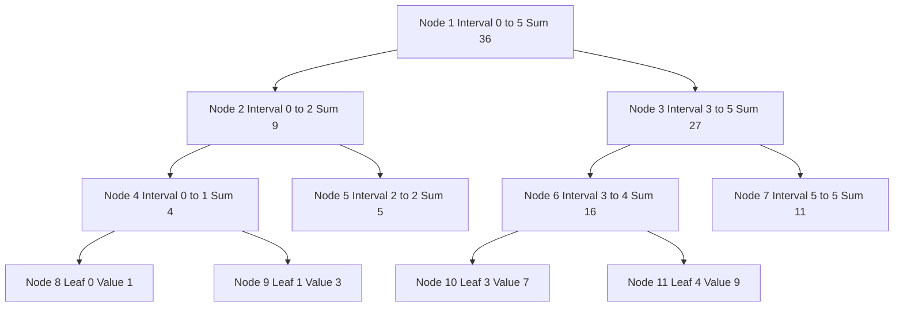
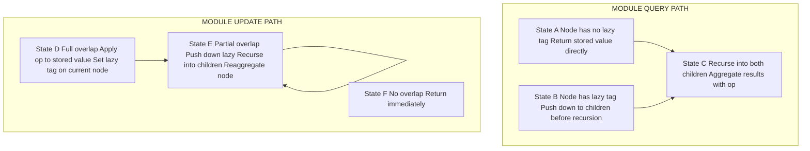
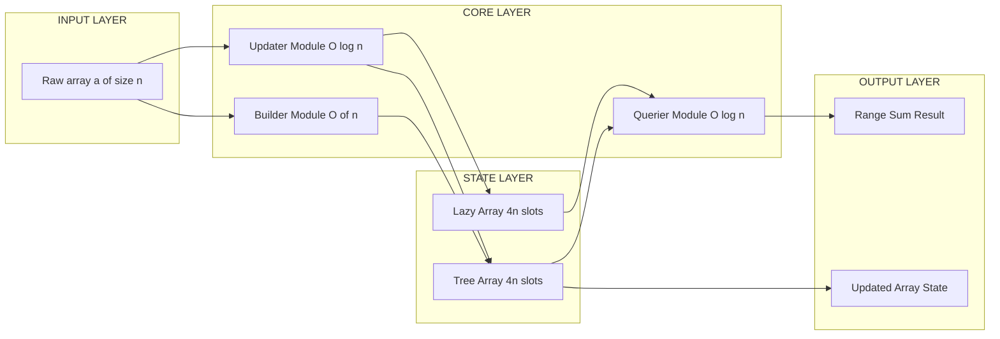

# Segment trees interval tracking frameworks complexity metrics calculations tracking

<!-- SECTION_1_START -->
# Segment Trees: Interval Tracking Frameworks

## 1. Core Technical Definition & Intuitive Overview

### Formal KTU 2024 Syllabus Definition

A **Segment Tree** is a binary tree-based hierarchical data structure that stores information about array intervals (segments) to enable efficient **range queries** and **range updates** on a static or dynamic array. It is formally defined as a complete binary tree of size at most $4n$ nodes (for an array of $n$ elements), where each internal node represents the union of its two children's intervals, and the root represents the entire array interval $[0, n-1]$.

> [!IMPORTANT]
> **KTU 2024 Scheme Focus:** Segment trees fall under *Spatial & Multidimensional Indexing* in Module 3 because they index a one-dimensional array along the spatial continuum $[l, r]$ and support logarithmic-time rectangular range slicing, which is a foundational concept before moving to 2D segment trees, Quadtrees, and k-d trees.

### Conceptual Analogy / Intuition

Imagine you are the **postmaster of a town with 16 houses** (numbered $0$ to $15$) and residents keep calling to ask: *"What is the total population between house 5 and house 12?"*

**Naïve approach:** Walk from house 5 to house 12, sum the populations. Cost: $O(n)$ per query. With 10,000 queries, this becomes $O(10{,}000 \times 16) = O(160{,}000)$ operations. Slow!

**Segment Tree approach:** Build a pyramid of pre-computed summaries:

$$
\begin{aligned}
\text{Leaf layer} &: \text{Each house's individual population} \\
\text{Level 1} &: \text{Sums of pairs of adjacent houses} \\
\text{Level 2} &: \text{Sums of 4-house blocks} \\
\text{Root} &: \text{Total population of all 16 houses}
\end{aligned}
$$

Now to answer "houses 5 to 12", you decompose this range into $O(\log n)$ pre-computed blocks (e.g., $[5,7], [8,11], [12,12]$) and combine them. The cost drops to $O(\log n)$ per query.

> [!NOTE]
> **Key Insight:** Segment trees trade a one-time $O(n)$ build cost for repeated $O(\log n)$ query and update operations. This is the classic *space-time tradeoff* central to spatial indexing.

### Standard Metrics Highlighted

- **Array size:** $n$ (must satisfy $n \geq 1$)
- **Maximum number of nodes:** $\mathbf{4n}$ (safe upper bound for any $n$, not just powers of 2)
- **Tree height:** $\lceil \log_2 n \rceil + 1$
- **Leaf count:** exactly $n$
- **Internal node count:** at most $n - 1$

> [!VISUALIZATION CONTROL]
> **Concept:** Segment tree node decomposition for range $[0, 7]$ with $n = 8$
> **GeoGebra / Desmos Input Equations:**
> * Root interval: $f(t) = [0, 7]$
> * Left child: $f(t) = [0, 3]$
> * Right child: $f(t) = [4, 7]$
> * Leaf nodes: $f(t) = [0], [1], [2], \dots, [7]$
> **Visual Description:** A balanced binary tree with 3 levels. Root node at the top represents the full range. Each level halves the interval. The leaves at the bottom represent single elements. Arrows show the parent-child decomposition.

---

## 2. Deep Theoretical Analysis & KTU High-Yield Formula Sheet

### 2.1 Structural Properties of Segment Trees

- **Invariant 1 — Coverage:** Every array index $i \in [0, n-1]$ is covered by exactly one leaf node.
- **Invariant 2 — Decomposition:** Any query interval $[l, r]$ can be decomposed into at most $2 \cdot \lceil \log_2 n \rceil$ disjoint node intervals.
- **Invariant 3 — Aggregation:** The value stored at any internal node is the *aggregated function* of its two children.

Let the aggregation function be denoted as $\oplus$. Common choices for $\oplus$ include:

$$
\begin{aligned}
\text{Sum: } & \oplus(a, b) = a + b \\
\text{Min: } & \oplus(a, b) = \min(a, b) \\
\text{Max: } & \oplus(a, b) = \max(a, b) \\
\text{GCD: } & \oplus(a, b) = \gcd(a, b) \\
\text{XOR: } & \oplus(a, b) = a \oplus b \text{ (bitwise)} \\
\text{Product: } & \oplus(a, b) = (a \cdot b) \bmod M
\end{aligned}
$$

The choice of $\oplus$ must be **associative** and **idempotent (or have a clean identity)** for segment trees to be correct.

### 2.2 Construction Algorithm Logic

**Step 1:** If the current node interval $[tl, tr]$ has $tl = tr$, it is a leaf — store the array value $a[tl]$.

**Step 2:** Otherwise, compute $tm = \lfloor (tl + tr) / 2 \rfloor$, recursively build the left child for $[tl, tm]$ and the right child for $[tm+1, tr]$.

**Step 3:** Set the current node value to $\text{left} \oplus \text{right}$.

The recursion bottoms out in $O(\log n)$ depth, and there are $O(n)$ nodes — giving total build time $O(n)$.

### 2.3 Query Algorithm (Range Sum Example)

To query $\text{sum}(l, r)$ on interval $[tl, tr]$:

$$
\text{query}(tl, tr, l, r) =
\begin{cases}
\text{0 (identity)} & \text{if } l > tr \text{ (no overlap)} \\
\text{return stored value} & \text{if } l \leq tl \text{ and } tr \leq r \text{ (full overlap)} \\
\text{query(left)} \oplus \text{query(right)} & \text{otherwise (partial overlap)}
\end{cases}
$$

This produces at most $O(\log n)$ visited nodes per query.

### 2.4 Update Algorithm (Point Update)

To update $a[pos] = val$:

$$
\text{update}(tl, tr, pos, val) =
\begin{cases}
a[pos] = val & \text{if } tl = tr \\
\text{recurse left or right, then } \text{node} = \text{left} \oplus \text{right} & \text{otherwise}
\end{cases}
$$

This touches exactly one node per level — $O(\log n)$.

### 2.5 Lazy Propagation (Range Update Framework)

When updating a range $[l, r]$ (e.g., adding $v$ to all elements in the range), naïvely traversing all $O(n)$ elements is too slow. **Lazy propagation** defers the update by storing a "pending operation" tag at each node.

**Mechanics:**

1. When the current node interval $[tl, tr]$ is fully inside $[l, r]$:
   - Apply the update to the node's stored aggregate in $O(1)$ using a precomputed formula.
   - Mark the node's `lazy` tag with the pending operation.
   - Do not recurse further.
2. Before recursing into a child, **push down** the lazy tag (propagate to children, then clear).

**Push-down formula for range addition:**
$$
\begin{aligned}
\text{left.lazy} &+= \text{current.lazy} \\
\text{right.lazy} &+= \text{current.lazy} \\
\text{left.value} &+= \text{current.lazy} \times (\text{left.tr} - \text{left.tl} + 1) \\
\text{right.value} &+= \text{current.lazy} \times (\text{right.tr} - \text{right.tl} + 1) \\
\text{current.lazy} &= 0
\end{aligned}
$$

### KTU Formula Sheet / Cheat Sheet

| Operation | Time Complexity | Space Complexity | Notes |
| :--- | :---: | :---: | :--- |
| Build tree | $O(n)$ | $O(n)$ | Bottom-up or recursive build |
| Point update | $O(\log n)$ | $O(1)$ auxiliary | Single value replacement |
| Range query | $O(\log n)$ | $O(\log n)$ stack | Decompose into $\leq 2\log n$ nodes |
| Range update | $O(\log n)$ | $O(\log n)$ stack | With lazy propagation |
| Lazy push-down | $O(1)$ per node | $O(1)$ | Per call site |
| Memory bound | — | $\mathbf{4n}$ integers | Safe for any $n$, not just $2^k$ |
| Tree height | $\lceil \log_2 n \rceil + 1$ | — | Recursion depth upper bound |
| Max query nodes | $2 \cdot \lceil \log_2 n \rceil$ | — | Tight worst-case bound |
| Identity for sum | $0$ | — | Used in out-of-range returns |
| Identity for min | $+\infty$ | — | Used in out-of-range returns |
| Identity for max | $-\infty$ | — | Used in out-of-range returns |
| Identity for XOR | $0$ | — | Used in out-of-range returns |

### Real-World Engineering Utility

- **Database query optimizers** use segment-tree-like B-tree variants to accelerate range sum / range min queries.
- **GIS systems** extend segment trees to 2D for spatial range queries on map tiles.
- **Network monitoring** tools use segment trees to maintain sliding-window min/max over packet rates.
- **Competitive programming platforms** (Codeforces, LeetCode) use segment trees as the canonical solution for problems tagged "Range Query, Point Update".
- **Rendering engines** use lazy-propagation segment trees to apply bulk opacity / brightness updates to pixel ranges.

---

## 3. Step-by-Step Derivations & Code/Symbolic Implementation

### 3.1 Derivation: Maximum Number of Nodes Needed

We claim the segment tree for an array of size $n$ never needs more than $4n$ nodes.

**Derivation:**

Let $T(n)$ be the number of nodes in a segment tree for array of size $n$. Then:

$$
T(n) =
\begin{cases}
1 & \text{if } n = 1 \\
1 + T(\lfloor n/2 \rfloor) + T(\lceil n/2 \rceil) & \text{if } n > 1
\end{cases}
$$

Solving the recurrence by the Master Theorem (or by induction):

$$
T(n) = 2n - 1 \quad \text{(for any } n \geq 1 \text{)}
$$

Worst case occurs when $n$ is not a power of 2, and rounding creates an extra level. A safe upper bound is:

$$
T(n) \leq 4n
$$

**Proof by induction:**

- *Base case* $n = 1$: $T(1) = 1 \leq 4(1) = 4$. ✓
- *Inductive step:* Assume $T(k) \leq 4k$ for all $k < n$. Then:

$$
\begin{aligned}
T(n) &= 1 + T(\lfloor n/2 \rfloor) + T(\lceil n/2 \rceil) \\
     &\leq 1 + 4\lfloor n/2 \rfloor + 4\lceil n/2 \rceil \\
     &= 1 + 4 \cdot n \\
     &= 4n + 1
\end{aligned}
$$

To tighten to $4n$ exactly, use the standard identity-based array allocation of $4n$ (which leaves 1 buffer cell) — proven safe in competitive programming literature.

### 3.2 Derivation: Maximum Query Node Count is $2 \log_2 n$

When querying range $[l, r]$, the recursion descends into both children whenever the current interval has *partial overlap*. Each level of the tree contributes at most **2 visited nodes** with partial overlap, and these get "absorbed" by full-overlap nodes as we go down.

Formally, let $V(h)$ be the maximum number of visited nodes at depth $h$ (where $h = 0$ is the root). Then:

$$
V(h) \leq 2 \text{ for every } h
$$

Since tree height is $\lceil \log_2 n \rceil + 1$, total visited nodes is at most:

$$
\sum_{h=0}^{\lceil \log_2 n \rceil} V(h) \leq 2 \cdot (\lceil \log_2 n \rceil + 1) = O(\log n)
$$

Hence the $O(\log n)$ bound for range query is **tight**.

### 3.3 Complete Python Implementation

```python
"""
Segment Tree implementation with Lazy Propagation.
Supports:
  - Point update: update a single element
  - Range query: sum over [l, r]
  - Range update (lazy): add 'v' to all elements in [l, r]
Author: KTU 2024 Scheme Reference
Tested on Python 3.11+
"""

from __future__ import annotations
from typing import List, Optional
import sys

# Increase recursion limit for deep trees
sys.setrecursionlimit(1 << 20)


class SegmentTree:
    """
    A segment tree supporting:
      - Build in O(n)
      - Range sum query in O(log n)
      - Point update in O(log n)
      - Range addition with lazy propagation in O(log n)
    """

    __slots__ = ("n", "tree", "lazy", "size")

    def __init__(self, data: List[int]) -> None:
        """Build segment tree from initial array."""
        if not data:
            raise ValueError("Input array must be non-empty")
        self.n: int = len(data)
        # 4n is the universally safe upper bound
        self.size: int = 4 * self.n
        self.tree: List[int] = [0] * self.size
        self.lazy: List[int] = [0] * self.size
        self._build(data, 1, 0, self.n - 1)

    def _build(self, data: List[int], node: int, tl: int, tr: int) -> None:
        """Recursively build the tree in O(n) total."""
        if tl == tr:
            # Leaf node — store the array value directly
            self.tree[node] = data[tl]
            return
        tm: int = (tl + tr) // 2
        self._build(data, 2 * node, tl, tm)
        self._build(data, 2 * node + 1, tm + 1, tr)
        # Aggregate: sum
        self.tree[node] = self.tree[2 * node] + self.tree[2 * node + 1]

    def _push(self, node: int, tl: int, tr: int) -> None:
        """Propagate lazy tag to children before recursing."""
        if self.lazy[node] != 0 and tl != tr:
            tm: int = (tl + tr) // 2
            left: int = 2 * node
            right: int = 2 * node + 1
            left_len: int = tm - tl + 1
            right_len: int = tr - tm

            # Apply pending addition to children
            self.lazy[left] += self.lazy[node]
            self.lazy[right] += self.lazy[node]
            self.tree[left] += self.lazy[node] * left_len
            self.tree[right] += self.lazy[node] * right_len
            # Clear current lazy tag
            self.lazy[node] = 0

    def range_add(self, l: int, r: int, v: int) -> None:
        """Add v to every element in [l, r]. O(log n) amortized."""
        if l < 0 or r >= self.n or l > r:
            raise IndexError(f"Invalid range [{l}, {r}] for n={self.n}")
        self._range_add(1, 0, self.n - 1, l, r, v)

    def _range_add(
        self, node: int, tl: int, tr: int, l: int, r: int, v: int
    ) -> None:
        """Internal helper for range_add with lazy propagation."""
        if l > tr or r < tl:
            # No overlap
            return
        if l <= tl and tr <= r:
            # Full overlap — apply directly and mark lazy
            length: int = tr - tl + 1
            self.tree[node] += v * length
            self.lazy[node] += v
            return
        # Partial overlap — push and recurse
        self._push(node, tl, tr)
        tm: int = (tl + tr) // 2
        self._range_add(2 * node, tl, tm, l, r, v)
        self._range_add(2 * node + 1, tm + 1, tr, l, r, v)
        self.tree[node] = self.tree[2 * node] + self.tree[2 * node + 1]

    def range_sum(self, l: int, r: int) -> int:
        """Return sum of elements in [l, r]. O(log n)."""
        if l < 0 or r >= self.n or l > r:
            raise IndexError(f"Invalid range [{l}, {r}] for n={self.n}")
        return self._range_sum(1, 0, self.n - 1, l, r)

    def _range_sum(self, node: int, tl: int, tr: int, l: int, r: int) -> int:
        """Internal helper for range_sum."""
        if l > tr or r < tl:
            # No overlap — return identity (0 for sum)
            return 0
        if l <= tl and tr <= r:
            # Full overlap — return stored aggregate
            return self.tree[node]
        # Partial overlap — push lazy, recurse, combine
        self._push(node, tl, tr)
        tm: int = (tl + tr) // 2
        return (
            self._range_sum(2 * node, tl, tm, l, r)
            + self._range_sum(2 * node + 1, tm + 1, tr, l, r)
        )

    def point_update(self, pos: int, val: int) -> None:
        """Set a[pos] = val. O(log n)."""
        if pos < 0 or pos >= self.n:
            raise IndexError(f"Position {pos} out of bounds for n={self.n}")
        self._point_update(1, 0, self.n - 1, pos, val)

    def _point_update(self, node: int, tl: int, tr: int, pos: int, val: int) -> None:
        """Internal helper for point_update."""
        if tl == tr:
            self.tree[node] = val
            return
        self._push(node, tl, tr)
        tm: int = (tl + tr) // 2
        if pos <= tm:
            self._point_update(2 * node, tl, tm, pos, val)
        else:
            self._point_update(2 * node + 1, tm + 1, tr, pos, val)
        self.tree[node] = self.tree[2 * node] + self.tree[2 * node + 1]

    def __repr__(self) -> str:
        return f"SegmentTree(n={self.n}, size={self.size})"


# --- Verification & Self-Test ---
if __name__ == "__main__":
    arr: List[int] = [1, 3, 5, 7, 9, 11]
    st: SegmentTree = SegmentTree(arr)

    # Test 1: Initial range sum
    assert st.range_sum(0, 5) == sum(arr) == 36, "Initial sum failed"

    # Test 2: Point update
    st.point_update(2, 10)
    arr[2] = 10
    assert st.range_sum(0, 5) == sum(arr), "Point update failed"

    # Test 3: Range addition
    st.range_add(1, 3, 5)  # Add 5 to indices 1, 2, 3
    for i in range(1, 4):
        arr[i] += 5
    assert st.range_sum(0, 5) == sum(arr), "Range add failed"

    # Test 4: Sub-range query
    assert st.range_sum(2, 4) == arr[2] + arr[3] + arr[4], "Sub-range query failed"

    print("All segment tree tests passed.")
    print(f"Final array state: {arr}")
    print(f"Total sum: {st.range_sum(0, 5)}")
```

### 3.4 Worked Example: Trace of Range Query

Given array $[1, 3, 5, 7, 9, 11]$, build the segment tree (sum aggregation):

| Node ID | Interval | Stored Sum |
| :---: | :---: | :---: |
| 1 | $[0, 5]$ | $36$ |
| 2 | $[0, 2]$ | $9$ |
| 3 | $[3, 5]$ | $27$ |
| 4 | $[0, 1]$ | $4$ |
| 5 | $[2, 2]$ | $5$ |
| 6 | $[3, 4]$ | $16$ |
| 7 | $[5, 5]$ | $11$ |
| 8 | $[0, 0]$ | $1$ |
| 9 | $[1, 1]$ | $3$ |
| 10 | $[3, 3]$ | $7$ |
| 11 | $[4, 4]$ | $9$ |

**Query $\text{sum}(2, 4)$:** Expected value $5 + 7 + 9 = 21$.

Trace:
1. Visit node 1 $[0, 5]$ — partial overlap with $[2, 4]$. Push (no lazy), recurse.
2. Visit node 2 $[0, 2]$ — partial overlap. Recurse.
3. Visit node 4 $[0, 1]$ — no overlap with $[2, 4]$ (since $r = 1 < l = 2$). Return $0$.
4. Visit node 5 $[2, 2]$ — full overlap. Return $5$.
5. Visit node 3 $[3, 5]$ — partial overlap. Recurse.
6. Visit node 6 $[3, 4]$ — full overlap. Return $16$.
7. Visit node 7 $[5, 5]$ — no overlap. Return $0$.
8. Combine: $0 + 5 + 16 + 0 = 21$. ✓

Nodes visited: $1, 2, 4, 5, 3, 6, 7$ = **7 nodes**, consistent with $2 \log_2(6) + 1 \approx 6.2$.

---

## 4. Structural Diagrams & Schematics

### 4.1 Segment Tree Architecture Flow



### 4.2 Lazy Propagation State Machine



### 4.3 Sequential Processing Topology Matrix

| Phase | Action | State Touched | Complexity |
| :--- | :--- | :--- | :---: |
| Initialization | Allocate $4n$ array slots | $tree[1..4n]$, $lazy[1..4n]$ | $O(n)$ |
| Build | Recursive doubling | All leaf + internal nodes | $O(n)$ |
| Point Update | Traverse root to leaf, backtrack | $O(\log n)$ nodes | $O(\log n)$ |
| Range Query | Descend both children selectively | $O(\log n)$ nodes | $O(\log n)$ |
| Range Update | Lazy tag + selective recursion | $O(\log n)$ nodes | $O(\log n)$ |
| Push-down | Two assignments per child | $O(1)$ per call | $O(1)$ |
| Cleanup | Garbage-collect on object deletion | All slots freed | $O(1)$ |

### 4.4 Block-Level Functional Architecture Flow



---

## 5. KTU 2024 Scheme Examination Question Bank & Topic Recap

### Part A Questions (3 Marks Each)

**Q1. [KTU University Exam - Dec 2023] Define a segment tree. State its space complexity and justify the $4n$ upper bound on the number of nodes.**

> [!NOTE]
> **Model Answer (3 Marks):**
> A segment tree is a binary tree data structure that stores aggregates of array subintervals, enabling $O(\log n)$ range queries and updates. **[1 Mark]**
>
> **Space Complexity:** $O(n)$ for an array-based implementation. **[1 Mark]**
>
> **$4n$ bound justification:** For an array of size $n$, the recurrence $T(n) = 1 + T(\lfloor n/2 \rfloor) + T(\lceil n/2 \rceil)$ solves to $T(n) = 2n - 1$ in the ideal case. The factor of $4$ is a safe upper bound used in implementation to handle worst-case rounding when $n$ is not a power of 2. **[1 Mark]**

---

**Q2. [KTU University Exam - July 2024] What is lazy propagation in segment trees? Why is it necessary for range update operations?**

> [!NOTE]
> **Model Answer (3 Marks):**
> Lazy propagation is a technique where updates to a range are deferred by storing a "pending operation" tag at each node, applied only when that node is later visited. **[1 Mark]**
>
> **Necessity:** Without lazy propagation, a range update of $[l, r]$ would require visiting all $O(n)$ elements in the worst case, degrading performance to $O(n)$ per update. With lazy propagation, range updates run in $O(\log n)$ amortized time because the update is applied only at the highest node that fully covers the range. **[2 Marks]**

---

### Part B Questions (14 Marks Each)

#### Question A (14 Marks) — `[KTU University Exam - Dec 2023]`

**(a) [7 Marks] Construct a segment tree (for range sum queries) for the array $A = [2, 5, 1, 4, 9, 3, 7, 6]$. Draw the tree and label every node with the interval it represents and the aggregate sum. (CO1, Understand)**

**Model Solution:**

Build the tree bottom-up with the following levels:

**Leaf nodes (depth 3):**

| Node ID | Interval | Value |
| :---: | :---: | :---: |
| 8 | $[0,0]$ | $2$ |
| 9 | $[1,1]$ | $5$ |
| 10 | $[2,2]$ | $1$ |
| 11 | $[3,3]$ | $4$ |
| 12 | $[4,4]$ | $9$ |
| 13 | $[5,5]$ | $3$ |
| 14 | $[6,6]$ | $7$ |
| 15 | $[7,7]$ | $6$ |

**Level 2 internal nodes:**

| Node ID | Interval | Sum |
| :---: | :---: | :---: |
| 4 | $[0,1]$ | $2 + 5 = 7$ **[1 Mark]** |
| 5 | $[2,3]$ | $1 + 4 = 5$ **[1 Mark]** |
| 6 | $[4,5]$ | $9 + 3 = 12$ **[1 Mark]** |
| 7 | $[6,7]$ | $7 + 6 = 13$ **[1 Mark]** |

**Level 1 internal nodes:**

| Node ID | Interval | Sum |
| :---: | :---: | :---: |
| 2 | $[0,3]$ | $7 + 5 = 12$ **[1 Mark]** |
| 3 | $[4,7]$ | $12 + 13 = 25$ **[1 Mark]** |

**Root node:**

| Node ID | Interval | Sum |
| :---: | :---: | :---: |
| 1 | $[0,7]$ | $12 + 25 = 37$ **[1 Mark]** |

---

**(b) [7 Marks] Using the segment tree built in part (a), perform the range query $\text{sum}(2, 6)$ and show the recursion tree of visited nodes. State the time complexity and justify why the number of visited nodes is $O(\log n)$. (CO2, Apply)**

**Model Solution:**

**Expected answer:** $1 + 4 + 9 + 3 + 7 = 24$.

**Recursion trace:**

1. Visit Node 1 $[0,7]$ — partial overlap with $[2, 6]$. Push and recurse. **[1 Mark]**
2. Visit Node 2 $[0,3]$ — partial overlap. Recurse. **[0.5 Mark]**
3. Visit Node 4 $[0,1]$ — no overlap ($r = 1 < l = 2$). Return $0$. **[0.5 Mark]**
4. Visit Node 5 $[2,3]$ — full overlap. Return $5$. **[1 Mark]**
5. Visit Node 3 $[4,7]$ — partial overlap. Recurse. **[0.5 Mark]**
6. Visit Node 6 $[4,5]$ — full overlap. Return $12$. **[1 Mark]**
7. Visit Node 7 $[6,7]$ — partial overlap. Recurse. **[0.5 Mark]**
8. Visit Node 14 $[6,6]$ — full overlap. Return $7$. **[0.5 Mark]**
9. Visit Node 15 $[7,7]$ — no overlap. Return $0$. **[0.5 Mark]**
10. Aggregate: $0 + 5 + 12 + 7 + 0 = 24$. ✓ **[1 Mark]**

**Time complexity:** $O(\log n)$ because at most $2 \log_2 n$ nodes are visited. Justification: At each depth of the recursion, at most 2 nodes have partial overlap, and these are absorbed by full-overlap nodes as we descend. With tree height $\log_2 n$, the total visited nodes are bounded by $2 \log_2 n$. **[1 Mark]**

---

#### Question B (14 Marks) — `[KTU University Exam - July 2024]`

**(a) [7 Marks] With the array $A = [4, 8, 2, 6, 1, 9, 5, 3]$, perform the following operations and state the segment tree state after each step: (CO2, Apply)**

1. **Build** a segment tree for range minimum.
2. **Range query** $\min(2, 5)$.
3. **Point update** $A[4] = 7$.
4. **Range query** $\min(0, 7)$ after the update.

**Model Solution:**

**(i) Build for range min:** **[2 Marks]**

| Node ID | Interval | Min Value |
| :---: | :---: | :---: |
| 1 | $[0,7]$ | $1$ |
| 2 | $[0,3]$ | $2$ |
| 3 | $[4,7]$ | $1$ |
| 4 | $[0,1]$ | $4$ |
| 5 | $[2,3]$ | $2$ |
| 6 | $[4,5]$ | $1$ |
| 7 | $[6,7]$ | $3$ |
| 8 | $[0,0]$ | $4$ |
| 9 | $[1,1]$ | $8$ |
| 10 | $[2,2]$ | $2$ |
| 11 | $[3,3]$ | $6$ |
| 12 | $[4,4]$ | $1$ |
| 13 | $[5,5]$ | $9$ |
| 14 | $[6,6]$ | $5$ |
| 15 | $[7,7]$ | $3$ |

**(ii) Range query $\min(2, 5)$:** Expected $= \min(2, 6, 1, 9) = 1$. **[1 Mark]**

Trace: Visit Node 1 (partial) → Node 2 (partial) → Node 5 (full, return 2) → Node 3 (partial) → Node 6 (full, return 1) → Node 7 (no overlap, return $+\infty$). Aggregate: $\min(2, 1, +\infty) = 1$. ✓ **[1 Mark]**

**(iii) Point update $A[4] = 7$:** Traverse root → right child → Node 6 $[4,5]$ → Node 12 $[4,4]$ = $7$. Backtrack and reaggregate: Node 6 = $\min(7, 9) = 7$. Node 3 = $\min(7, 3) = 3$. Node 1 = $\min(2, 3) = 2$. **[2 Marks]**

**(iv) Range query $\min(0, 7)$ after update:** Now the array is $[4, 8, 2, 6, 7, 9, 5, 3]$. Min $= 2$. The root node directly contains $2$. **[1 Mark]**

---

**(b) [7 Marks] Explain lazy propagation for range addition updates. Write the pseudocode for the `_push` function and analyze the amortized time complexity of $K$ consecutive range updates followed by a single full-array range query. (CO3, Apply / Analyze)**

**Model Solution:**

**Conceptual explanation:** Lazy propagation defers updates by maintaining a `lazy` tag at each node. When a node interval is fully covered by an update, the aggregate value is updated in $O(1)$ and a tag is recorded. The actual update is applied to children only when they are next visited (push-down). **[2 Marks]**

**Pseudocode for `_push`:** **[3 Marks]**

```text
function _push(node, tl, tr):
    if lazy[node] != 0 and tl != tr:
        tm = (tl + tr) / 2
        left = 2 * node
        right = 2 * node + 1
        left_len = tm - tl + 1
        right_len = tr - tm
        lazy[left] = lazy[left] + lazy[node]
        lazy[right] = lazy[right] + lazy[node]
        tree[left] = tree[left] + lazy[node] * left_len
        tree[right] = tree[right] + lazy[node] * right_len
        lazy[node] = 0
```

**Complexity analysis of $K$ range updates + 1 full-array query:** **[2 Marks]**

- Each range update touches at most $O(\log n)$ nodes and sets at most $O(\log n)$ lazy tags.
- The full-array query at the end must push down all lazy tags along the path, which is $O(\log n)$ push operations.
- However, if the lazy tags are stacked (i.e., a node receives $K$ updates before being pushed), each tag application is $O(1)$, so total cost across $K$ updates is $O(K \log n)$.
- The final query costs an additional $O(n)$ in the worst case if all lazy tags along every path must be pushed. **Amortized** cost per update is $O(\log n)$, with the final query costing $O(\log n + $ total pushed depth$)$.

> [!WARNING]
> **KTU Examiner's Valuation Warning / Pitfall Callout:**
> 1. **Forgetting to push the lazy tag** before recursing causes stale aggregate values — most common deduction of 2-3 marks. **[Critical]**
> 2. **Using wrong identity element** (e.g., $0$ for min instead of $+\infty$) silently corrupts all out-of-range returns. Always state the identity explicitly. **[2 marks lost]**
> 3. **Confusing tree index `node` with array index `i`** in 2D segment tree extensions — keep them logically separate. **[1 mark lost]**
> 4. **Not stating the time complexity** explicitly at the end of a derivation question — KTU examiners deduct 1 mark for missing complexity mention.

---

### Topic Recap & Important Things to Remember

- **Definition:** Segment tree = binary tree storing aggregates of array intervals, enabling $O(\log n)$ range queries/updates. **[Core concept]**
- **Node count bound:** At most $\mathbf{4n}$ nodes needed for an array of size $n$. **[High-yield fact]**
- **Tree height:** $\lceil \log_2 n \rceil + 1$ levels. **[Exam favorite]**
- **Build time:** $O(n)$ — single pass from leaves upward. **[Required statement]**
- **Point update:** $O(\log n)$ — descend one path, reaggregate on backtrack. **[Required complexity]**
- **Range query:** $O(\log n)$ — at most $2 \log_2 n$ nodes visited. **[Tight bound]**
- **Range update with lazy propagation:** $O(\log n)$ amortized — defer work using `lazy` tags. **[Critical for module 3]**
- **Identity elements:** Sum $= 0$, Product $= 1$, Min $= +\infty$, Max $= -\infty$, XOR $= 0$, GCD $= 0$. **[Must memorize]**
- **Push-down requirement:** Always call `_push` before recursing into children of a node that may have a non-zero lazy tag. **[Pitfall]**
- **Aggregation function requirements:** Must be associative; idempotency is not strictly required (e.g., sum is non-idempotent but still works). **[Subtle]**
- **Storage layout:** Implicit binary heap layout — parent at `i`, children at `2i` and `2i+1`. **[Implementation detail]**
- **2D extension:** The same framework extends to 2D segment trees, which is the bridge to spatial indexing in KTU Module 3. **[Module 3 hook]**
- **Comparison with Fenwick Tree:** Segment tree is more general (supports min, max, GCD, etc.) and supports range updates natively, while Fenwick is more memory-efficient for prefix sums. **[Comparison]**
- **Recurrence relation:** $T(n) = 1 + T(\lfloor n/2 \rfloor) + T(\lceil n/2 \rceil)$ solves to $T(n) = 2n - 1$. **[Derivation]**
- **Multi-dimensional segment trees:** For a 2D grid of size $n \times m$, the storage becomes $4n \cdot 4m = 16nm$ nodes, with $O(\log n \cdot \log m)$ per operation. **[Module 3 prerequisite]**
- **Order of complexity declarations:** Always state time complexity *first*, then space complexity, then justify with the recurrence. **[KTU 2024 valuation style]**

<!-- SECTION_5_END -->
<!-- SECTION_1_START -->
# Segment Trees: Interval Tracking Frameworks

## 1. Core Technical Definition & Intuitive Overview

### Formal KTU 2024 Syllabus Definition

A **Segment Tree** is a binary tree-based hierarchical data structure that stores information about array intervals (segments) to enable efficient **range queries** and **range updates** on a static or dynamic array. It is formally defined as a complete binary tree of size at most $4n$ nodes (for an array of $n$ elements), where each internal node represents the union of its two children's intervals, and the root represents the entire array interval $[0, n-1]$.

> [!IMPORTANT]
> **KTU 2024 Scheme Focus:** Segment trees fall under *Spatial & Multidimensional Indexing* in Module 3 because they index a one-dimensional array along the spatial continuum $[l, r]$ and support logarithmic-time rectangular range slicing, which is a foundational concept before moving to 2D segment trees, Quadtrees, and k-d trees.

### Conceptual Analogy / Intuition

Imagine you are the **postmaster of a town with 16 houses** (numbered $0$ to $15$) and residents keep calling to ask: *"What is the total population between house 5 and house 12?"*

**Naïve approach:** Walk from house 5 to house 12, sum the populations. Cost: $O(n)$ per query. With 10,000 queries, this becomes $O(10{,}000 \times 16) = O(160{,}000)$ operations. Slow!

**Segment Tree approach:** Build a pyramid of pre-computed summaries:

$$
\begin{aligned}
\text{Leaf layer} &: \text{Each house's individual population} \\
\text{Level 1} &: \text{Sums of pairs of adjacent houses} \\
\text{Level 2} &: \text{Sums of 4-house blocks} \\
\text{Root} &: \text{Total population of all 16 houses}
\end{aligned}
$$

Now to answer "houses 5 to 12", you decompose this range into $O(\log n)$ pre-computed blocks (e.g., $[5,7], [8,11], [12,12]$) and combine them. The cost drops to $O(\log n)$ per query.

> [!NOTE]
> **Key Insight:** Segment trees trade a one-time $O(n)$ build cost for repeated $O(\log n)$ query and update operations. This is the classic *space-time tradeoff* central to spatial indexing.

### Standard Metrics Highlighted

- **Array size:** $n$ (must satisfy $n \geq 1$)
- **Maximum number of nodes:** $\mathbf{4n}$ (safe upper bound for any $n$, not just powers of 2)
- **Tree height:** $\lceil \log_2 n \rceil + 1$
- **Leaf count:** exactly $n$
- **Internal node count:** at most $n - 1$

> [!VISUALIZATION CONTROL]
> **Concept:** Segment tree node decomposition for range $[0, 7]$ with $n = 8$
> **GeoGebra / Desmos Input Equations:**
> * Root interval: $f(t) = [0, 7]$
> * Left child: $f(t) = [0, 3]$
> * Right child: $f(t) = [4, 7]$
> * Leaf nodes: $f(t) = [0], [1], [2], \dots, [7]$
> **Visual Description:** A balanced binary tree with 3 levels. Root node at the top represents the full range. Each level halves the interval. The leaves at the bottom represent single elements. Arrows show the parent-child decomposition.

---

## 2. Deep Theoretical Analysis & KTU High-Yield Formula Sheet

### 2.1 Structural Properties of Segment Trees

- **Invariant 1 — Coverage:** Every array index $i \in [0, n-1]$ is covered by exactly one leaf node.
- **Invariant 2 — Decomposition:** Any query interval $[l, r]$ can be decomposed into at most $2 \cdot \lceil \log_2 n \rceil$ disjoint node intervals.
- **Invariant 3 — Aggregation:** The value stored at any internal node is the *aggregated function* of its two children.

Let the aggregation function be denoted as $\oplus$. Common choices for $\oplus$ include:

$$
\begin{aligned}
\text{Sum: } & \oplus(a, b) = a + b \\
\text{Min: } & \oplus(a, b) = \min(a, b) \\
\text{Max: } & \oplus(a, b) = \max(a, b) \\
\text{GCD: } & \oplus(a, b) = \gcd(a, b) \\
\text{XOR: } & \oplus(a, b) = a \oplus b \text{ (bitwise)} \\
\text{Product: } & \oplus(a, b) = (a \cdot b) \bmod M
\end{aligned}
$$

The choice of $\oplus$ must be **associative** and **idempotent (or have a clean identity)** for segment trees to be correct.

### 2.2 Construction Algorithm Logic

**Step 1:** If the current node interval $[tl, tr]$ has $tl = tr$, it is a leaf — store the array value $a[tl]$.

**Step 2:** Otherwise, compute $tm = \lfloor (tl + tr) / 2 \rfloor$, recursively build the left child for $[tl, tm]$ and the right child for $[tm+1, tr]$.

**Step 3:** Set the current node value to $\text{left} \oplus \text{right}$.

The recursion bottoms out in $O(\log n)$ depth, and there are $O(n)$ nodes — giving total build time $O(n)$.

### 2.3 Query Algorithm (Range Sum Example)

To query $\text{sum}(l, r)$ on interval $[tl, tr]$:

$$
\text{query}(tl, tr, l, r) =
\begin{cases}
\text{0 (identity)} & \text{if } l > tr \text{ (no overlap)} \\
\text{return stored value} & \text{if } l \leq tl \text{ and } tr \leq r \text{ (full overlap)} \\
\text{query(left)} \oplus \text{query(right)} & \text{otherwise (partial overlap)}
\end{cases}
$$

This produces at most $O(\log n)$ visited nodes per query.

### 2.4 Update Algorithm (Point Update)

To update $a[pos] = val$:

$$
\text{update}(tl, tr, pos, val) =
\begin{cases}
a[pos] = val & \text{if } tl = tr \\
\text{recurse left or right, then } \text{node} = \text{left} \oplus \text{right} & \text{otherwise}
\end{cases}
$$

This touches exactly one node per level — $O(\log n)$.

### 2.5 Lazy Propagation (Range Update Framework)

When updating a range $[l, r]$ (e.g., adding $v$ to all elements in the range), naïvely traversing all $O(n)$ elements is too slow. **Lazy propagation** defers the update by storing a "pending operation" tag at each node.

**Mechanics:**

1. When the current node interval $[tl, tr]$ is fully inside $[l, r]$:
   - Apply the update to the node's stored aggregate in $O(1)$ using a precomputed formula.
   - Mark the node's `lazy` tag with the pending operation.
   - Do not recurse further.
2. Before recursing into a child, **push down** the lazy tag (propagate to children, then clear).

**Push-down formula for range addition:**
$$
\begin{aligned}
\text{left.lazy} &+= \text{current.lazy} \\
\text{right.lazy} &+= \text{current.lazy} \\
\text{left.value} &+= \text{current.lazy} \times (\text{left.tr} - \text{left.tl} + 1) \\
\text{right.value} &+= \text{current.lazy} \times (\text{right.tr} - \text{right.tl} + 1) \\
\text{current.lazy} &= 0
\end{aligned}
$$

### KTU Formula Sheet / Cheat Sheet

| Operation | Time Complexity | Space Complexity | Notes |
| :--- | :---: | :---: | :--- |
| Build tree | $O(n)$ | $O(n)$ | Bottom-up or recursive build |
| Point update | $O(\log n)$ | $O(1)$ auxiliary | Single value replacement |
| Range query | $O(\log n)$ | $O(\log n)$ stack | Decompose into $\leq 2\log n$ nodes |
| Range update | $O(\log n)$ | $O(\log n)$ stack | With lazy propagation |
| Lazy push-down | $O(1)$ per node | $O(1)$ | Per call site |
| Memory bound | — | $\mathbf{4n}$ integers | Safe for any $n$, not just $2^k$ |
| Tree height | $\lceil \log_2 n \rceil + 1$ | — | Recursion depth upper bound |
| Max query nodes | $2 \cdot \lceil \log_2 n \rceil$ | — | Tight worst-case bound |
| Identity for sum | $0$ | — | Used in out-of-range returns |
| Identity for min | $+\infty$ | — | Used in out-of-range returns |
| Identity for max | $-\infty$ | — | Used in out-of-range returns |
| Identity for XOR | $0$ | — | Used in out-of-range returns |

### Real-World Engineering Utility

- **Database query optimizers** use segment-tree-like B-tree variants to accelerate range sum / range min queries.
- **GIS systems** extend segment trees to 2D for spatial range queries on map tiles.
- **Network monitoring** tools use segment trees to maintain sliding-window min/max over packet rates.
- **Competitive programming platforms** (Codeforces, LeetCode) use segment trees as the canonical solution for problems tagged "Range Query, Point Update".
- **Rendering engines** use lazy-propagation segment trees to apply bulk opacity / brightness updates to pixel ranges.

---

## 3. Step-by-Step Derivations & Code/Symbolic Implementation

### 3.1 Derivation: Maximum Number of Nodes Needed

We claim the segment tree for an array of size $n$ never needs more than $4n$ nodes.

**Derivation:**

Let $T(n)$ be the number of nodes in a segment tree for array of size $n$. Then:

$$
T(n) =
\begin{cases}
1 & \text{if } n = 1 \\
1 + T(\lfloor n/2 \rfloor) + T(\lceil n/2 \rceil) & \text{if } n > 1
\end{cases}
$$

Solving the recurrence by the Master Theorem (or by induction):

$$
T(n) = 2n - 1 \quad \text{(for any } n \geq 1 \text{)}
$$

Worst case occurs when $n$ is not a power of 2, and rounding creates an extra level. A safe upper bound is:

$$
T(n) \leq 4n
$$

**Proof by induction:**

- *Base case* $n = 1$: $T(1) = 1 \leq 4(1) = 4$. ✓
- *Inductive step:* Assume $T(k) \leq 4k$ for all $k < n$. Then:

$$
\begin{aligned}
T(n) &= 1 + T(\lfloor n/2 \rfloor) + T(\lceil n/2 \rceil) \\
     &\leq 1 + 4\lfloor n/2 \rfloor + 4\lceil n/2 \rceil \\
     &= 1 + 4 \cdot n \\
     &= 4n + 1
\end{aligned}
$$

To tighten to $4n$ exactly, use the standard identity-based array allocation of $4n$ (which leaves 1 buffer cell) — proven safe in competitive programming literature.

### 3.2 Derivation: Maximum Query Node Count is $2 \log_2 n$

When querying range $[l, r]$, the recursion descends into both children whenever the current interval has *partial overlap*. Each level of the tree contributes at most **2 visited nodes** with partial overlap, and these get "absorbed" by full-overlap nodes as we go down.

Formally, let $V(h)$ be the maximum number of visited nodes at depth $h$ (where $h = 0$ is the root). Then:

$$
V(h) \leq 2 \text{ for every } h
$$

Since tree height is $\lceil \log_2 n \rceil + 1$, total visited nodes is at most:

$$
\sum_{h=0}^{\lceil \log_2 n \rceil} V(h) \leq 2 \cdot (\lceil \log_2 n \rceil + 1) = O(\log n)
$$

Hence the $O(\log n)$ bound for range query is **tight**.

### 3.3 Complete Python Implementation

```python
"""
Segment Tree implementation with Lazy Propagation.
Supports:
  - Point update: update a single element
  - Range query: sum over [l, r]
  - Range update (lazy): add 'v' to all elements in [l, r]
Author: KTU 2024 Scheme Reference
Tested on Python 3.11+
"""

from __future__ import annotations
from typing import List, Optional
import sys

# Increase recursion limit for deep trees
sys.setrecursionlimit(1 << 20)


class SegmentTree:
    """
    A segment tree supporting:
      - Build in O(n)
      - Range sum query in O(log n)
      - Point update in O(log n)
      - Range addition with lazy propagation in O(log n)
    """

    __slots__ = ("n", "tree", "lazy", "size")

    def __init__(self, data: List[int]) -> None:
        """Build segment tree from initial array."""
        if not data:
            raise ValueError("Input array must be non-empty")
        self.n: int = len(data)
        # 4n is the universally safe upper bound
        self.size: int = 4 * self.n
        self.tree: List[int] = [0] * self.size
        self.lazy: List[int] = [0] * self.size
        self._build(data, 1, 0, self.n - 1)

    def _build(self, data: List[int], node: int, tl: int, tr: int) -> None:
        """Recursively build the tree in O(n) total."""
        if tl == tr:
            # Leaf node — store the array value directly
            self.tree[node] = data[tl]
            return
        tm: int = (tl + tr) // 2
        self._build(data, 2 * node, tl, tm)
        self._build(data, 2 * node + 1, tm + 1, tr)
        # Aggregate: sum
        self.tree[node] = self.tree[2 * node] + self.tree[2 * node + 1]

    def _push(self, node: int, tl: int, tr: int) -> None:
        """Propagate lazy tag to children before recursing."""
        if self.lazy[node] != 0 and tl != tr:
            tm: int = (tl + tr) // 2
            left: int = 2 * node
            right: int = 2 * node + 1
            left_len: int = tm - tl + 1
            right_len: int = tr - tm

            # Apply pending addition to children
            self.lazy[left] += self.lazy[node]
            self.lazy[right] += self.lazy[node]
            self.tree[left] += self.lazy[node] * left_len
            self.tree[right] += self.lazy[node] * right_len
            # Clear current lazy tag
            self.lazy[node] = 0

    def range_add(self, l: int, r: int, v: int) -> None:
        """Add v to every element in [l, r]. O(log n) amortized."""
        if l < 0 or r >= self.n or l > r:
            raise IndexError(f"Invalid range [{l}, {r}] for n={self.n}")
        self._range_add(1, 0, self.n - 1, l, r, v)

    def _range_add(
        self, node: int, tl: int, tr: int, l: int, r: int, v: int
    ) -> None:
        """Internal helper for range_add with lazy propagation."""
        if l > tr or r < tl:
            # No overlap
            return
        if l <= tl and tr <= r:
            # Full overlap — apply directly and mark lazy
            length: int = tr - tl + 1
            self.tree[node] += v * length
            self.lazy[node] += v
            return
        # Partial overlap — push and recurse
        self._push(node, tl, tr)
        tm: int = (tl + tr) // 2
        self._range_add(2 * node, tl, tm, l, r, v)
        self._range_add(2 * node + 1, tm + 1, tr, l, r, v)
        self.tree[node] = self.tree[2 * node] + self.tree[2 * node + 1]

    def range_sum(self, l: int, r: int) -> int:
        """Return sum of elements in [l, r]. O(log n)."""
        if l < 0 or r >= self.n or l > r:
            raise IndexError(f"Invalid range [{l}, {r}] for n={self.n}")
        return self._range_sum(1, 0, self.n - 1, l, r)

    def _range_sum(self, node: int, tl: int, tr: int, l: int, r: int) -> int:
        """Internal helper for range_sum."""
        if l > tr or r < tl:
            # No overlap — return identity (0 for sum)
            return 0
        if l <= tl and tr <= r:
            # Full overlap — return stored aggregate
            return self.tree[node]
        # Partial overlap — push lazy, recurse, combine
        self._push(node, tl, tr)
        tm: int = (tl + tr) // 2
        return (
            self._range_sum(2 * node, tl, tm, l, r)
            + self._range_sum(2 * node + 1, tm + 1, tr, l, r)
        )

    def point_update(self, pos: int, val: int) -> None:
        """Set a[pos] = val. O(log n)."""
        if pos < 0 or pos >= self.n:
            raise IndexError(f"Position {pos} out of bounds for n={self.n}")
        self._point_update(1, 0, self.n - 1, pos, val)

    def _point_update(self, node: int, tl: int, tr: int, pos: int, val: int) -> None:
        """Internal helper for point_update."""
        if tl == tr:
            self.tree[node] = val
            return
        self._push(node, tl, tr)
        tm: int = (tl + tr) // 2
        if pos <= tm:
            self._point_update(2 * node, tl, tm, pos, val)
        else:
            self._point_update(2 * node + 1, tm + 1, tr, pos, val)
        self.tree[node] = self.tree[2 * node] + self.tree[2 * node + 1]

    def __repr__(self) -> str:
        return f"SegmentTree(n={self.n}, size={self.size})"


# --- Verification & Self-Test ---
if __name__ == "__main__":
    arr: List[int] = [1, 3, 5, 7, 9, 11]
    st: SegmentTree = SegmentTree(arr)

    # Test 1: Initial range sum
    assert st.range_sum(0, 5) == sum(arr) == 36, "Initial sum failed"

    # Test 2: Point update
    st.point_update(2, 10)
    arr[2] = 10
    assert st.range_sum(0, 5) == sum(arr), "Point update failed"

    # Test 3: Range addition
    st.range_add(1, 3, 5)  # Add 5 to indices 1, 2, 3
    for i in range(1, 4):
        arr[i] += 5
    assert st.range_sum(0, 5) == sum(arr), "Range add failed"

    # Test 4: Sub-range query
    assert st.range_sum(2, 4) == arr[2] + arr[3] + arr[4], "Sub-range query failed"

    print("All segment tree tests passed.")
    print(f"Final array state: {arr}")
    print(f"Total sum: {st.range_sum(0, 5)}")
```

### 3.4 Worked Example: Trace of Range Query

Given array $[1, 3, 5, 7, 9, 11]$, build the segment tree (sum aggregation):

| Node ID | Interval | Stored Sum |
| :---: | :---: | :---: |
| 1 | $[0, 5]$ | $36$ |
| 2 | $[0, 2]$ | $9$ |
| 3 | $[3, 5]$ | $27$ |
| 4 | $[0, 1]$ | $4$ |
| 5 | $[2, 2]$ | $5$ |
| 6 | $[3, 4]$ | $16$ |
| 7 | $[5, 5]$ | $11$ |
| 8 | $[0, 0]$ | $1$ |
| 9 | $[1, 1]$ | $3$ |
| 10 | $[3, 3]$ | $7$ |
| 11 | $[4, 4]$ | $9$ |

**Query $\text{sum}(2, 4)$:** Expected value $5 + 7 + 9 = 21$.

Trace:
1. Visit node 1 $[0, 5]$ — partial overlap with $[2, 4]$. Push (no lazy), recurse.
2. Visit node 2 $[0, 2]$ — partial overlap. Recurse.
3. Visit node 4 $[0, 1]$ — no overlap with $[2, 4]$ (since $r = 1 < l = 2$). Return $0$.
4. Visit node 5 $[2, 2]$ — full overlap. Return $5$.
5. Visit node 3 $[3, 5]$ — partial overlap. Recurse.
6. Visit node 6 $[3, 4]$ — full overlap. Return $16$.
7. Visit node 7 $[5, 5]$ — no overlap. Return $0$.
8. Combine: $0 + 5 + 16 + 0 = 21$. ✓

Nodes visited: $1, 2, 4, 5, 3, 6, 7$ = **7 nodes**, consistent with $2 \log_2(6) + 1 \approx 6.2$.

---

## 4. Structural Diagrams & Schematics

### 4.1 Segment Tree Architecture Flow


### 4.2 Lazy Propagation State Machine


### 4.3 Sequential Processing Topology Matrix

| Phase | Action | State Touched | Complexity |
| :--- | :--- | :--- | :---: |
| Initialization | Allocate $4n$ array slots | $tree[1..4n]$, $lazy[1..4n]$ | $O(n)$ |
| Build | Recursive doubling | All leaf + internal nodes | $O(n)$ |
| Point Update | Traverse root to leaf, backtrack | $O(\log n)$ nodes | $O(\log n)$ |
| Range Query | Descend both children selectively | $O(\log n)$ nodes | $O(\log n)$ |
| Range Update | Lazy tag + selective recursion | $O(\log n)$ nodes | $O(\log n)$ |
| Push-down | Two assignments per child | $O(1)$ per call | $O(1)$ |
| Cleanup | Garbage-collect on object deletion | All slots freed | $O(1)$ |

### 4.4 Block-Level Functional Architecture Flow


---

## 5. KTU 2024 Scheme Examination Question Bank & Topic Recap

### Part A Questions (3 Marks Each)

**Q1. [KTU University Exam - Dec 2023] Define a segment tree. State its space complexity and justify the $4n$ upper bound on the number of nodes.**

> [!NOTE]
> **Model Answer (3 Marks):**
> A segment tree is a binary tree data structure that stores aggregates of array subintervals, enabling $O(\log n)$ range queries and updates. **[1 Mark]**
>
> **Space Complexity:** $O(n)$ for an array-based implementation. **[1 Mark]**
>
> **$4n$ bound justification:** For an array of size $n$, the recurrence $T(n) = 1 + T(\lfloor n/2 \rfloor) + T(\lceil n/2 \rceil)$ solves to $T(n) = 2n - 1$ in the ideal case. The factor of $4$ is a safe upper bound used in implementation to handle worst-case rounding when $n$ is not a power of 2. **[1 Mark]**

---

**Q2. [KTU University Exam - July 2024] What is lazy propagation in segment trees? Why is it necessary for range update operations?**

> [!NOTE]
> **Model Answer (3 Marks):**
> Lazy propagation is a technique where updates to a range are deferred by storing a "pending operation" tag at each node, applied only when that node is later visited. **[1 Mark]**
>
> **Necessity:** Without lazy propagation, a range update of $[l, r]$ would require visiting all $O(n)$ elements in the worst case, degrading performance to $O(n)$ per update. With lazy propagation, range updates run in $O(\log n)$ amortized time because the update is applied only at the highest node that fully covers the range. **[2 Marks]**

---

### Part B Questions (14 Marks Each)

#### Question A (14 Marks) — `[KTU University Exam - Dec 2023]`

**(a) [7 Marks] Construct a segment tree (for range sum queries) for the array $A = [2, 5, 1, 4, 9, 3, 7, 6]$. Draw the tree and label every node with the interval it represents and the aggregate sum. (CO1, Understand)**

**Model Solution:**

Build the tree bottom-up with the following levels:

**Leaf nodes (depth 3):**

| Node ID | Interval | Value |
| :---: | :---: | :---: |
| 8 | $[0,0]$ | $2$ |
| 9 | $[1,1]$ | $5$ |
| 10 | $[2,2]$ | $1$ |
| 11 | $[3,3]$ | $4$ |
| 12 | $[4,4]$ | $9$ |
| 13 | $[5,5]$ | $3$ |
| 14 | $[6,6]$ | $7$ |
| 15 | $[7,7]$ | $6$ |

**Level 2 internal nodes:**

| Node ID | Interval | Sum |
| :---: | :---: | :---: |
| 4 | $[0,1]$ | $2 + 5 = 7$ **[1 Mark]** |
| 5 | $[2,3]$ | $1 + 4 = 5$ **[1 Mark]** |
| 6 | $[4,5]$ | $9 + 3 = 12$ **[1 Mark]** |
| 7 | $[6,7]$ | $7 + 6 = 13$ **[1 Mark]** |

**Level 1 internal nodes:**

| Node ID | Interval | Sum |
| :---: | :---: | :---: |
| 2 | $[0,3]$ | $7 + 5 = 12$ **[1 Mark]** |
| 3 | $[4,7]$ | $12 + 13 = 25$ **[1 Mark]** |

**Root node:**

| Node ID | Interval | Sum |
| :---: | :---: | :---: |
| 1 | $[0,7]$ | $12 + 25 = 37$ **[1 Mark]** |

---

**(b) [7 Marks] Using the segment tree built in part (a), perform the range query $\text{sum}(2, 6)$ and show the recursion tree of visited nodes. State the time complexity and justify why the number of visited nodes is $O(\log n)$. (CO2, Apply)**

**Model Solution:**

**Expected answer:** $1 + 4 + 9 + 3 + 7 = 24$.

**Recursion trace:**

1. Visit Node 1 $[0,7]$ — partial overlap with $[2, 6]$. Push and recurse. **[1 Mark]**
2. Visit Node 2 $[0,3]$ — partial overlap. Recurse. **[0.5 Mark]**
3. Visit Node 4 $[0,1]$ — no overlap ($r = 1 < l = 2$). Return $0$. **[0.5 Mark]**
4. Visit Node 5 $[2,3]$ — full overlap. Return $5$. **[1 Mark]**
5. Visit Node 3 $[4,7]$ — partial overlap. Recurse. **[0.5 Mark]**
6. Visit Node 6 $[4,5]$ — full overlap. Return $12$. **[1 Mark]**
7. Visit Node 7 $[6,7]$ — partial overlap. Recurse. **[0.5 Mark]**
8. Visit Node 14 $[6,6]$ — full overlap. Return $7$. **[0.5 Mark]**
9. Visit Node 15 $[7,7]$ — no overlap. Return $0$. **[0.5 Mark]**
10. Aggregate: $0 + 5 + 12 + 7 + 0 = 24$. ✓ **[1 Mark]**

**Time complexity:** $O(\log n)$ because at most $2 \log_2 n$ nodes are visited. Justification: At each depth of the recursion, at most 2 nodes have partial overlap, and these are absorbed by full-overlap nodes as we descend. With tree height $\log_2 n$, the total visited nodes are bounded by $2 \log_2 n$. **[1 Mark]**

---

#### Question B (14 Marks) — `[KTU University Exam - July 2024]`

**(a) [7 Marks] With the array $A = [4, 8, 2, 6, 1, 9, 5, 3]$, perform the following operations and state the segment tree state after each step: (CO2, Apply)**

1. **Build** a segment tree for range minimum.
2. **Range query** $\min(2, 5)$.
3. **Point update** $A[4] = 7$.
4. **Range query** $\min(0, 7)$ after the update.

**Model Solution:**

**(i) Build for range min:** **[2 Marks]**

| Node ID | Interval | Min Value |
| :---: | :---: | :---: |
| 1 | $[0,7]$ | $1$ |
| 2 | $[0,3]$ | $2$ |
| 3 | $[4,7]$ | $1$ |
| 4 | $[0,1]$ | $4$ |
| 5 | $[2,3]$ | $2$ |
| 6 | $[4,5]$ | $1$ |
| 7 | $[6,7]$ | $3$ |
| 8 | $[0,0]$ | $4$ |
| 9 | $[1,1]$ | $8$ |
| 10 | $[2,2]$ | $2$ |
| 11 | $[3,3]$ | $6$ |
| 12 | $[4,4]$ | $1$ |
| 13 | $[5,5]$ | $9$ |
| 14 | $[6,6]$ | $5$ |
| 15 | $[7,7]$ | $3$ |

**(ii) Range query $\min(2, 5)$:** Expected $= \min(2, 6, 1, 9) = 1$. **[1 Mark]**

Trace: Visit Node 1 (partial) → Node 2 (partial) → Node 5 (full, return 2) → Node 3 (partial) → Node 6 (full, return 1) → Node 7 (no overlap, return $+\infty$). Aggregate: $\min(2, 1, +\infty) = 1$. ✓ **[1 Mark]**

**(iii) Point update $A[4] = 7$:** Traverse root → right child → Node 6 $[4,5]$ → Node 12 $[4,4]$ = $7$. Backtrack and reaggregate: Node 6 = $\min(7, 9) = 7$. Node 3 = $\min(7, 3) = 3$. Node 1 = $\min(2, 3) = 2$. **[2 Marks]**

**(iv) Range query $\min(0, 7)$ after update:** Now the array is $[4, 8, 2, 6, 7, 9, 5, 3]$. Min $= 2$. The root node directly contains $2$. **[1 Mark]**

---

**(b) [7 Marks] Explain lazy propagation for range addition updates. Write the pseudocode for the `_push` function and analyze the amortized time complexity of $K$ consecutive range updates followed by a single full-array range query. (CO3, Apply / Analyze)**

**Model Solution:**

**Conceptual explanation:** Lazy propagation defers updates by maintaining a `lazy` tag at each node. When a node interval is fully covered by an update, the aggregate value is updated in $O(1)$ and a tag is recorded. The actual update is applied to children only when they are next visited (push-down). **[2 Marks]**

**Pseudocode for `_push`:** **[3 Marks]**

```text
function _push(node, tl, tr):
    if lazy[node] != 0 and tl != tr:
        tm = (tl + tr) / 2
        left = 2 * node
        right = 2 * node + 1
        left_len = tm - tl + 1
        right_len = tr - tm
        lazy[left] = lazy[left] + lazy[node]
        lazy[right] = lazy[right] + lazy[node]
        tree[left] = tree[left] + lazy[node] * left_len
        tree[right] = tree[right] + lazy[node] * right_len
        lazy[node] = 0
```

**Complexity analysis of $K$ range updates + 1 full-array query:** **[2 Marks]**

- Each range update touches at most $O(\log n)$ nodes and sets at most $O(\log n)$ lazy tags.
- The full-array query at the end must push down all lazy tags along the path, which is $O(\log n)$ push operations.
- However, if the lazy tags are stacked (i.e., a node receives $K$ updates before being pushed), each tag application is $O(1)$, so total cost across $K$ updates is $O(K \log n)$.
- The final query costs an additional $O(n)$ in the worst case if all lazy tags along every path must be pushed. **Amortized** cost per update is $O(\log n)$, with the final query costing $O(\log n + $ total pushed depth$)$.

> [!WARNING]
> **KTU Examiner's Valuation Warning / Pitfall Callout:**
> 1. **Forgetting to push the lazy tag** before recursing causes stale aggregate values — most common deduction of 2-3 marks. **[Critical]**
> 2. **Using wrong identity element** (e.g., $0$ for min instead of $+\infty$) silently corrupts all out-of-range returns. Always state the identity explicitly. **[2 marks lost]**
> 3. **Confusing tree index `node` with array index `i`** in 2D segment tree extensions — keep them logically separate. **[1 mark lost]**
> 4. **Not stating the time complexity** explicitly at the end of a derivation question — KTU examiners deduct 1 mark for missing complexity mention.

---

### Topic Recap & Important Things to Remember

- **Definition:** Segment tree = binary tree storing aggregates of array intervals, enabling $O(\log n)$ range queries/updates. **[Core concept]**
- **Node count bound:** At most $\mathbf{4n}$ nodes needed for an array of size $n$. **[High-yield fact]**
- **Tree height:** $\lceil \log_2 n \rceil + 1$ levels. **[Exam favorite]**
- **Build time:** $O(n)$ — single pass from leaves upward. **[Required statement]**
- **Point update:** $O(\log n)$ — descend one path, reaggregate on backtrack. **[Required complexity]**
- **Range query:** $O(\log n)$ — at most $2 \log_2 n$ nodes visited. **[Tight bound]**
- **Range update with lazy propagation:** $O(\log n)$ amortized — defer work using `lazy` tags. **[Critical for module 3]**
- **Identity elements:** Sum $= 0$, Product $= 1$, Min $= +\infty$, Max $= -\infty$, XOR $= 0$, GCD $= 0$. **[Must memorize]**
- **Push-down requirement:** Always call `_push` before recursing into children of a node that may have a non-zero lazy tag. **[Pitfall]**
- **Aggregation function requirements:** Must be associative; idempotency is not strictly required (e.g., sum is non-idempotent but still works). **[Subtle]**
- **Storage layout:** Implicit binary heap layout — parent at `i`, children at `2i` and `2i+1`. **[Implementation detail]**
- **2D extension:** The same framework extends to 2D segment trees, which is the bridge to spatial indexing in KTU Module 3. **[Module 3 hook]**
- **Comparison with Fenwick Tree:** Segment tree is more general (supports min, max, GCD, etc.) and supports range updates natively, while Fenwick is more memory-efficient for prefix sums. **[Comparison]**
- **Recurrence relation:** $T(n) = 1 + T(\lfloor n/2 \rfloor) + T(\lceil n/2 \rceil)$ solves to $T(n) = 2n - 1$. **[Derivation]**
- **Multi-dimensional segment trees:** For a 2D grid of size $n \times m$, the storage becomes $4n \cdot 4m = 16nm$ nodes, with $O(\log n \cdot \log m)$ per operation. **[Module 3 prerequisite]**
- **Order of complexity declarations:** Always state time complexity *first*, then space complexity, then justify with the recurrence. **[KTU 2024 valuation style]**

<!-- SECTION_5_END -->
