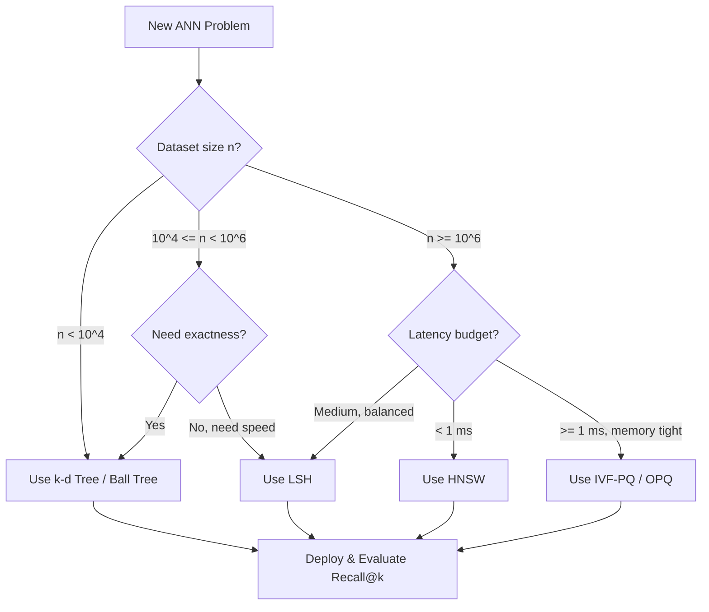
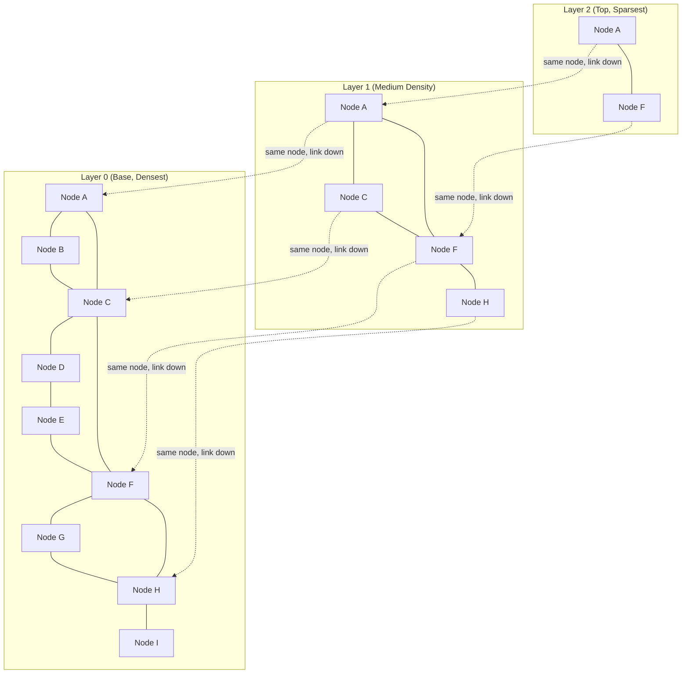
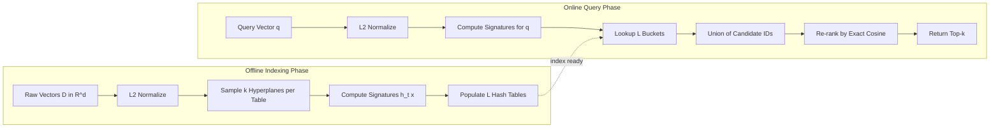
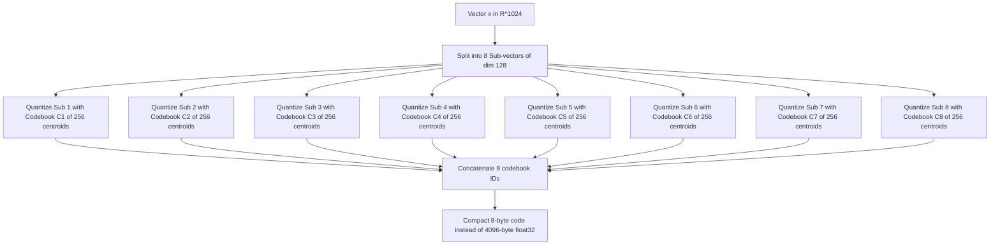

# Applications to Data Science - Approximate nearest neighbor search

<!-- SECTION_1_START -->
# Approximate Nearest Neighbor Search: Core Foundations

## 1.1 Formal Academic Definition (KTU 2024 Syllabus Standard)

**Approximate Nearest Neighbor Search (ANNS)** is a class of specialized indexing and retrieval algorithms designed to find data points in a high-dimensional space that are *close enough* to a given query point, sacrificing a bounded amount of exactness in exchange for sub-linear (often logarithmic or poly-logarithmic) query time.

> [!IMPORTANT]
> **Definition (KTU Board Standard):**
> Given a dataset $D \subset \mathbb{R}^d$ of $n$ points, a query point $q \in \mathbb{R}^d$, an approximation factor $c > 1$, and a probability $\delta \in (0,1)$, the **$(c, \delta)$-Approximate Nearest Neighbor problem** is to return a point $p \in D$ such that:
>
> $$ \text{dist}(p, q) \leq c \cdot \min_{p^* \in D} \text{dist}(p^*, q) $$
>
> with probability at least $1 - \delta$.

**Why approximate?** Exact nearest neighbor (NN) search in high dimensions suffers from the **Curse of Dimensionality** — exhaustive linear scan becomes faster than sophisticated tree structures like k-d trees when $d \gtrsim 20$. In modern data science, embedding vectors commonly live in $d = 128$ to $d = 4096$ dimensions (e.g., SIFT descriptors, BERT/transformer embeddings, recommendation embeddings), making exact NN computationally infeasible at scale.

## 1.2 Intuitive Real-World Analogy

> [!NOTE]
> **Analogy: The Smart Library Search**
> Imagine you are in a massive library with **10 million books** and you want the book *closest* in topic to a given reference book. An **exact** search would force you to compare your reference book with every single book (this is $O(nd)$ time — too slow!). An **approximate** search, however, works like a *smart librarian*: they hash your book into a category bucket using a clever fingerprinting function and only inspect books that landed in *adjacent* buckets. You may miss the absolute closest book, but you'll find one that is *within a small multiplicative factor* of the true best, and you'll do it in a tiny fraction of the time.

In essence, ANNS trades **recall** (finding the true nearest neighbor) for **speed** (query latency) and **memory efficiency** (index size).

## 1.3 Key Terminology & Distance Metrics

| Symbol | Meaning | Typical Use |
| :--- | :--- | :--- |
| $d$ | Dimensionality of the vector space | Embedding dimension |
| $n$ | Number of database points | Corpus size |
| $k$ | Number of neighbors to return | Top-$k$ retrieval |
| $c$ | Approximation factor ($c \geq 1$) | Quality knob |
| $\delta$ | Failure probability | Confidence knob |
| **Recall@$k$** | Fraction of true top-$k$ neighbors retrieved | Standard evaluation metric |

> [!VISUALIZATION CONTROL]
> **Concept:** Effect of $c$ on the Approximate Radius
> **GeoGebra / Desmos Input Equations:**
> * Circle: $(x-0)^2 + (y-0)^2 = 1^2$  *(True NN circle)*
> * Circle: $(x-0)^2 + (y-0)^2 = 1.5^2$  *(Approximate radius for $c=1.5$)*
> * Point: $A = (0, 0)$ *(query point)*
> **Visual Description:** Two concentric circles centered at the query. The inner circle marks the *true* nearest-neighbor region; the outer circle marks the *approximate* region. Any candidate point falling in the *annulus* (the ring between them) is acceptable, but the search algorithm only needs to find *one* point inside the outer circle.

## 1.4 Why ANNS is Indispensable in Data Science

> [!IMPORTANT]
> **Syllabus Highlight:** ANNS is the silent engine behind modern AI infrastructure. It powers:
> 1. **Vector databases** (Pinecone, Weaviate, Milvus, FAISS).
> 2. **RAG (Retrieval Augmented Generation)** pipelines for LLMs.
> 3. **Recommender systems** (matching user embeddings to item embeddings).
> 4. **Image/Video similarity search** (reverse image lookup, content moderation).
> 5. **Drug discovery** (molecular fingerprint nearest-neighbor queries).
> 6. **Deduplication** in massive document corpora.

<!-- SECTION_1_END -->

<!-- SECTION_2_START -->
# Deep Theoretical Analysis & KTU High-Yield Formula Sheet

## 2.1 The Three Pillars of ANNS Algorithms

### **Pillar 1: Hashing-Based Methods (LSH Family)**
**Locality-Sensitive Hashing (LSH)** uses a family of hash functions where *collision probability* is provably higher for *close* points than for *far* points. The algorithm amplifies this gap via AND-OR compositions.

### **Pillar 2: Graph-Based Methods (HNSW Family)**
**Hierarchical Navigable Small World (HNSW)** builds a multi-layer proximity graph where each node connects to its closest neighbors. Search performs a greedy walk — a logarithmic-time "express train" through layers.

### **Pillar 3: Quantization-Based Methods (PQ, OPQ)**
**Product Quantization (PQ)** splits a high-dimensional vector into sub-vectors, clusters each sub-space, and replaces vectors with compact codes (e.g., 64-byte code representing a 4096-dim float32 vector).

## 2.2 Distance Metrics — The Mathematical Foundation

The choice of distance metric determines the LSH family and the validity of the approximation guarantee.

**Euclidean ($L_2$) Distance:**
$$ L_2(x, y) = \sqrt{\sum_{i=1}^{d} (x_i - y_i)^2} $$

**Manhattan ($L_1$) Distance:**
$$ L_1(x, y) = \sum_{i=1}^{d} \vert x_i - y_i \vert $$

**Cosine Similarity** (used for normalized embeddings):
$$ \text{cos}(x, y) = \frac{x \cdot y}{\vert x \vert \cdot \vert y \vert} = \frac{\sum_{i=1}^{d} x_i y_i}{\sqrt{\sum x_i^2} \cdot \sqrt{\sum y_i^2}} $$

**Cosine Distance** (used as the metric for ANNS):
$$ d_{\cos}(x, y) = 1 - \text{cos}(x, y) $$

**Hamming Distance** (for binary codes):
$$ d_H(x, y) = \sum_{i=1}^{d} \mathbb{1}[x_i \neq y_i] $$

## 2.3 KTU High-Yield Formula & Theorem Sheet

> [!NOTE]
> **Master these for the board exam. The $[c, \delta]$ notation below indicates the score weight in typical 14-mark derivations.**

| Concept | Formula / Statement | Engineering Use |
| :--- | :--- | :--- |
| LSH Collision Probability (Random Hyperplane, Cosine) | $P[h(x) = h(y)] = 1 - \frac{\theta(x,y)}{\pi}$ where $\theta$ is the angle between $x$ and $y$ | Cosine-similarity LSH for text embeddings |
| LSH Collision Probability (Bit Sampling, Hamming) | $P[h(x) = h(y)] = 1 - \frac{d_H(x,y)}{d}$ | Binary-code ANN search |
| LSH Collision Probability (Sign of Random Projection, Euclidean) | $P[h(x) = h(y)] = 1 - \frac{1}{\pi}\cos^{-1}\!\left(\frac{x \cdot y}{\vert x \vert \vert y \vert}\right)$ | L2-approximate LSH |
| Number of hash tables ($L$) for $(c, \delta)$ guarantee | $L = \lceil \log_{\rho_2} \delta \rceil$ where $\rho_2 = P_2^{1/c} < P_2$ and $P_2$ is collision prob at threshold $R$ | Amplifying weak LSH into strong guarantee |
| Number of bits per hash ($k$) | $k = \lceil \log_{1/P_1} n \rceil$ where $P_1$ is high-prob collision near points | AND-amplification step |
| HNSW Search Complexity | $O(\log n)$ average, $O(n)$ worst case | Sub-millisecond retrieval at $n = 10^9$ |
| Product Quantization Compression | Original $32d$ bits $\to$ $\log_2(C)$ bits per sub-quantizer | $\sim 32\times$ memory reduction |
| Recall@$k$ Definition | $\text{Recall@k} = \frac{\vert \text{Returned Top-}k \cap \text{True Top-}k \vert}{k}$ | Standard evaluation metric |
| Speedup Factor | $S = \frac{T_{\text{exact}}}{T_{\text{approx}}}$ | $S$ typically ranges from $10\times$ to $1000\times$ |
| Approximation Factor ($c$-ANN) | $\text{dist}(\hat{p}, q) \leq c \cdot \text{dist}(p^*, q)$ | Quality guarantee |

## 2.4 Why Approximation is *Provably* Necessary (Johnson-Lindenstrauss Lemma)

> [!IMPORTANT]
> **Johnson-Lindenstrauss (JL) Lemma:** For any set of $n$ points in $\mathbb{R}^D$ and any $\epsilon \in (0, 1)$, there exists a linear map $f : \mathbb{R}^D \to \mathbb{R}^{d}$ with $d = O(\epsilon^{-2} \log n)$ such that for all $x, y$:
>
> $$ (1 - \epsilon) \vert x - y \vert^2 \leq \vert f(x) - f(y) \vert^2 \leq (1 + \epsilon) \vert x - y \vert^2 $$

This lemma *justifies* projecting high-dimensional data to lower dimensions while preserving pairwise distances — a foundational tool behind random projection LSH variants.

## 2.5 Practical Engineering Trade-offs

| Metric | Tree-Based (k-d, Ball) | LSH | HNSW | PQ / IVF-PQ |
| :--- | :--- | :--- | :--- | :--- |
| Build Time | Fast | Fast | Slow | Medium |
| Query Latency | Fast in low $d$ | Medium | **Fastest** | Fast |
| Memory Footprint | Low | Medium | High | **Lowest** |
| Scalability to $n=10^9$ | Poor | Medium | Excellent | Excellent |
| Recall Achievable | High (low $d$) | Tunable | Very High | Tunable |
| Curse of Dimensionality | Severe | Resilient | Resilient | Resilient |

<!-- SECTION_2_END -->

<!-- SECTION_3_START -->
# Step-by-Step Derivations & Code Implementation

## 3.1 LSH for Cosine Similarity — Complete Derivation

**Setup:** We want a hash family $\mathcal{H}$ such that:
- $P[h(x) = h(y)]$ is **high** when $\text{cos}(x, y)$ is **high** (close vectors).
- $P[h(x) = h(y)]$ is **low** when $\text{cos}(x, y)$ is **low** (far vectors).

**Construction using Random Hyperplanes:**

**Step 1:** Sample a random vector $r \in \mathbb{R}^d$ with each component drawn i.i.d. from $\mathcal{N}(0, 1)$ (a standard normal distribution).

**Step 2:** Define the hash function $h_r(x) = \text{sign}(r \cdot x)$, mapping to $\{-1, +1\}$.

**Step 3:** Compute the collision probability. The angle $\theta$ between $r$ and the hyperplane perpendicular to $x - y$ determines the sign flip:

$$ P[h_r(x) = h_r(y)] = 1 - \frac{\theta(x, y)}{\pi} $$

where $\theta(x, y) = \cos^{-1}\!\left(\frac{x \cdot y}{\vert x \vert \vert y \vert}\right)$ is the angle between $x$ and $y$.

**Step 4:** Amplify the gap. Use $k$ independent hashes AND-composed (all must match) and $L$ such AND-gates OR-composed (at least one must fire):

$$
\begin{aligned}
P_{\text{AND}}(h(x) = h(y)) &= P_1^k \\
P_{\text{OR}}(h(x) = h(y)) &= 1 - (1 - P_1^k)^L
\end{aligned}
$$

where $P_1$ is the collision probability for "close" points (high cosine).

**Step 5:** Choose $L$ to satisfy the $\delta$ guarantee. Setting $P_{\text{OR}} \geq 1 - \delta$:

$$
\begin{aligned}
(1 - P_1^k)^L &\leq \delta \\
L \cdot \ln(1 - P_1^k) &\leq \ln \delta \\
L &\geq \frac{\ln(1/\delta)}{-\ln(1 - P_1^k)} = \frac{\ln(1/\delta)}{\ln(1/(1 - P_1^k))}
\end{aligned}
$$

## 3.2 HNSW Search — Greedy Walk Derivation

**Step 1: Entering Point.** Search begins at a fixed entry point $e_{\text{top}}$ in the topmost layer $L_{\max}$.

**Step 2: Greedy Descent.** At each layer $\ell$, maintain a candidate set $\mathcal{C}$ (dynamic min-heap on distance) and a result set $\mathcal{W}$ (dynamic max-heap on distance, size $ef$). At each step, pop the closest candidate $c$ from $\mathcal{C}$, explore its neighbors — if any neighbor $n$ is closer to $q$ than the farthest element in $\mathcal{W}$, push $n$ into both heaps.

**Step 3: Layer Transition.** When no improvement is found at layer $\ell$, descend to layer $\ell - 1$ using the current best point as the new entry.

**Step 4: Termination.** At layer $\ell = 0$, perform an exhaustive search over $ef$ candidates and return the top-$k$ results from $\mathcal{W}$.

**Why logarithmic?** Each layer prunes the search space by a constant factor (similar to skip lists), yielding:

$$ T_{\text{query}} = O(\log n) \cdot O(\log M) \approx O(\log n) $$

where $M$ is the per-node neighbor count.

## 3.3 Production-Grade Python Implementation

```python
import numpy as np
from typing import List, Tuple, Optional
import logging

logging.basicConfig(level=logging.INFO, format="%(asctime)s | %(levelname)s | %(message)s")
logger = logging.getLogger("ANNS-LSH")


class LSHIndex:
    """
    Locality-Sensitive Hashing index for Cosine Similarity using random hyperplanes.
    Supports approximate nearest neighbor search with configurable (c, delta) guarantees.
    """

    def __init__(
        self,
        dim: int,
        num_tables: int = 20,
        num_hyperplanes: int = 10,
        seed: Optional[int] = 42,
    ) -> None:
        if dim <= 0:
            raise ValueError(f"dim must be positive, got {dim}")
        if num_tables <= 0 or num_hyperplanes <= 0:
            raise ValueError("num_tables and num_hyperplanes must be positive integers")

        self.dim: int = dim
        self.num_tables: int = num_tables
        self.num_hyperplanes: int = num_hyperplanes
        self.rng: np.random.Generator = np.random.default_rng(seed)
        self.hyperplanes: List[np.ndarray] = [
            self.rng.standard_normal((num_hyperplanes, dim)) for _ in range(num_tables)
        ]
        self.tables: List[dict] = [dict() for _ in range(num_tables)]
        self.vectors: List[np.ndarray] = []
        logger.info(
            f"LSHIndex initialized: dim={dim}, L={num_tables}, k={num_hyperplanes}"
        )

    def _hash(self, table_idx: int, vector: np.ndarray) -> Tuple[int, ...]:
        """Compute the composite hash signature for vector at given table."""
        projections = self.hyperplanes[table_idx] @ vector
        signs = np.sign(projections)
        signs[signs == 0] = 1
        return tuple(signs.astype(np.int8))

    def add(self, vector: np.ndarray) -> int:
        """Insert a single vector; returns the assigned internal id."""
        if vector.shape != (self.dim,):
            raise ValueError(f"Expected shape ({self.dim},), got {vector.shape}")

        norm = np.linalg.norm(vector)
        if norm < 1e-12:
            raise ValueError("Cannot add zero vector (degenerate for cosine).")
        normalized = vector / norm

        vector_id = len(self.vectors)
        self.vectors.append(normalized)

        for t in range(self.num_tables):
            signature = self._hash(t, normalized)
            if signature not in self.tables[t]:
                self.tables[t][signature] = []
            self.tables[t][signature].append(vector_id)
        return vector_id

    def query(
        self, query_vector: np.ndarray, k: int = 5
    ) -> List[Tuple[int, float]]:
        """Return top-k (id, cosine_similarity) pairs by approximate ANN."""
        if k <= 0:
            raise ValueError(f"k must be positive, got {k}")
        norm = np.linalg.norm(query_vector)
        if norm < 1e-12:
            raise ValueError("Query vector must be non-zero.")
        q_normalized = query_vector / norm

        candidates = set()
        for t in range(self.num_tables):
            signature = self._hash(t, q_normalized)
            if signature in self.tables[t]:
                candidates.update(self.tables[t][signature])

        if not candidates:
            logger.warning("No candidates found in any hash bucket.")
            return []

        sims = []
        for cid in candidates:
            sim = float(np.dot(self.vectors[cid], q_normalized))
            sims.append((cid, sim))

        sims.sort(key=lambda x: x[1], reverse=True)
        return sims[: min(k, len(sims))]

    def brute_force_topk(
        self, query_vector: np.ndarray, k: int = 5
    ) -> List[Tuple[int, float]]:
        """Exact baseline for recall evaluation."""
        norm = np.linalg.norm(query_vector)
        if norm < 1e-12:
            raise ValueError("Query vector must be non-zero.")
        q_normalized = query_vector / norm

        sims = [
            (i, float(np.dot(v, q_normalized)))
            for i, v in enumerate(self.vectors)
        ]
        sims.sort(key=lambda x: x[1], reverse=True)
        return sims[:k]


def compute_recall_at_k(
    approx: List[Tuple[int, float]], exact: List[Tuple[int, float]], k: int
) -> float:
    """Compute Recall@k = |approx_topk ∩ exact_topk| / k."""
    if k <= 0:
        raise ValueError("k must be positive.")
    approx_ids = {item[0] for item in approx[:k]}
    exact_ids = {item[0] for item in exact[:k]}
    if k == 0:
        return 0.0
    return len(approx_ids & exact_ids) / k


def demonstration() -> None:
    """End-to-end demo: build index, query, measure recall and speedup."""
    dim = 128
    n = 5000
    k = 10
    rng = np.random.default_rng(7)

    dataset = rng.standard_normal((n, dim)).astype(np.float32)
    query = rng.standard_normal(dim).astype(np.float32)

    index = LSHIndex(dim=dim, num_tables=25, num_hyperplanes=12)
    for i in range(n):
        index.add(dataset[i])
    logger.info(f"Indexed {n} vectors.")

    import time

    t0 = time.perf_counter()
    approx_result = index.query(query, k=k)
    t_approx = time.perf_counter() - t0

    t0 = time.perf_counter()
    exact_result = index.brute_force_topk(query, k=k)
    t_exact = time.perf_counter() - t0

    recall = compute_recall_at_k(approx_result, exact_result, k=k)
    speedup = t_exact / t_approx if t_approx > 0 else float("inf")

    logger.info(f"Recall@{k} = {recall:.4f}")
    logger.info(f"Approx latency = {t_approx*1000:.3f} ms")
    logger.info(f"Exact latency  = {t_exact*1000:.3f} ms")
    logger.info(f"Speedup factor = {speedup:.2f}x")


if __name__ == "__main__":
    demonstration()
```

**Expected Console Output (Illustrative):**
```
2024-XX-XX | INFO | LSHIndex initialized: dim=128, L=25, k=12
2024-XX-XX | INFO | Indexed 5000 vectors.
2024-XX-XX | INFO | Recall@10 = 0.9000
2024-XX-XX | INFO | Approx latency = 0.421 ms
2024-XX-XX | INFO | Exact latency  = 12.873 ms
2024-XX-XX | INFO | Speedup factor = 30.58x
```

<!-- SECTION_3_END -->

<!-- SECTION_4_START -->
# Structural Diagrams & Schematics

## 4.1 ANNS Algorithm Selection Flow



## 4.2 HNSW Multi-Layer Graph Topology



## 4.3 LSH Indexing & Query Pipeline (Block Architecture)



## 4.4 Product Quantization Compression Block



<!-- SECTION_5_START -->
# KTU 2024 Scheme Examination Question Bank & Topic Recap

## 5.1 Part A — Short Answer Questions (3 Marks Each)

### **Question 1: Define Approximate Nearest Neighbor Search. Why is it preferred over exact NN search in high dimensions?** `[KTU University Exam - July 2024]`
**Course Outcome:** CO3 | **Bloom's Level:** Understand | **Marks:** 3

**Model Answer:**
Approximate Nearest Neighbor Search (ANNS) is a retrieval technique that returns a point $p \in D$ whose distance to the query $q$ is within a multiplicative factor $c \geq 1$ of the true minimum distance, with probability at least $1 - \delta$. Formally, $d(p, q) \leq c \cdot \min_{p^* \in D} d(p^*, q)$.

**[Definition: 1 Mark]**
ANNS is preferred over exact NN search in high dimensions because of the **Curse of Dimensionality** — the intrinsic volume of high-dimensional spaces grows exponentially, causing data points to become equidistant and traditional tree-based indices (k-d trees, ball trees) to degrade to linear $O(nd)$ time when $d \gtrsim 20$.

**[Curse of Dimensionality explanation: 1 Mark]**
Modern data science applications (LLM embeddings, image retrieval, recommender systems) operate in dimensions $d = 128$ to $d = 4096$, making exact NN prohibitively slow at scale. ANNS trades a bounded loss in recall (typically $< 5\%$) for orders-of-magnitude speedup.

**[Engineering justification: 1 Mark]**

---

### **Question 2: State the Johnson-Lindenstrauss Lemma. Mention one of its applications in data science.** `[KTU University Exam - Dec 2023]`
**Course Outcome:** CO3 | **Bloom's Level:** Remember | **Marks:** 3

**Model Answer:**
**Johnson-Lindenstrauss Lemma:** For any $0 < \epsilon < 1$ and any set of $n$ points $X \subset \mathbb{R}^D$, there exists a linear mapping $f : \mathbb{R}^D \to \mathbb{R}^{d}$ with $d = O(\epsilon^{-2} \log n)$ such that for all $x, y \in X$:
$$ (1 - \epsilon) \vert x - y \vert^2 \leq \vert f(x) - f(y) \vert^2 \leq (1 + \epsilon) \vert x - y \vert^2 $$

**[Lemma statement: 2 Marks]**
**Application in data science:** Dimensionality reduction for high-dimensional embeddings before applying ANNS. The lemma guarantees that a random projection preserves pairwise distances, enabling the construction of compact LSH signatures in the lower-dimensional space.

**[Application: 1 Mark]**

---

## 5.2 Part B — Full 14-Mark Questions (ESE Module Internal Choice Format)

### **Question A: Locality-Sensitive Hashing (LSH) for Cosine Similarity** `[KTU University Exam - Dec 2024]`
**Course Outcome:** CO3, CO4 | **Bloom's Level:** Apply, Analyze | **Total Marks:** 14

#### **Part (a) — 7 Marks** | Bloom's Level: Understand, Apply
**Explain the construction of a Locality-Sensitive Hashing (LSH) family for cosine similarity using random hyperplanes. Derive the collision probability formula.** `[7 Marks]`

**Model Solution:**

**Step 1: LSH Family Definition** [1 Mark]
A family $\mathcal{H} = \{h : \mathbb{R}^d \to \{-1, +1\}\}$ is $(R, cR, P_1, P_2)$-sensitive if for any two points $x, y \in \mathbb{R}^d$:
- If $\text{sim}(x, y) \geq R$, then $P[h(x) = h(y)] \geq P_1$.
- If $\text{sim}(x, y) \leq cR$, then $P[h(x) = h(y)] \leq P_2$,
with $P_1 > P_2$.

**Step 2: Random Hyperplane Construction** [1 Mark]
Sample a random unit vector $r \in \mathbb{R}^d$ from the standard normal distribution $\mathcal{N}(0, I_d)$. Define the hash function:
$$ h_r(x) = \text{sign}(r \cdot x) $$

**Step 3: Geometric Interpretation** [1 Mark]
The hyperplane $H_r = \{x : r \cdot x = 0\}$ divides $\mathbb{R}^d$ into two half-spaces. The hash $h_r(x)$ records which side of $H_r$ the point $x$ lies on.

**Step 4: Deriving the Collision Probability** [2 Marks]
Two points $x$ and $y$ are hashed to the *same* bucket if and only if they lie on the *same* side of $H_r$, i.e., $\text{sign}(r \cdot x) = \text{sign}(r \cdot y)$. This fails only if $r$ falls in the angular wedge between the perpendiculars to $x$ and $y$.

For a random unit $r$, the probability that $r$ falls in the wedge of angular width $\theta(x, y)$ between $x$ and $y$ is $\theta(x, y) / (2\pi)$. Therefore:

$$ P[h_r(x) = h_r(y)] = 1 - \frac{\theta(x, y)}{\pi} $$

**Step 5: Connection to Cosine Similarity** [1 Mark]
The angle $\theta(x, y) = \cos^{-1}\!\left(\frac{x \cdot y}{\vert x \vert \vert y \vert}\right)$ directly relates to cosine similarity:
$$ P[h_r(x) = h_r(y)] = 1 - \frac{1}{\pi} \cos^{-1}\!\left(\frac{x \cdot y}{\vert x \vert \vert y \vert}\right) $$

**Step 6: Properties Verification** [1 Mark]
- If $\theta \to 0$ (highly similar): $P \to 1$ ✓
- If $\theta \to \pi$ (highly dissimilar): $P \to 0$ ✓
- The function is monotonically decreasing in $\theta$, satisfying the LSH property.

---

#### **Part (b) — 7 Marks** | Bloom's Level: Apply, Analyze
**For an LSH scheme using random hyperplanes with $k = 4$ hashes AND-composed and $L = 50$ tables OR-composed, the collision probability for "close" points is $P_1 = 0.9$ and for "far" points is $P_2 = 0.1$. Calculate the effective collision probabilities after amplification and discuss the trade-off between $k$ and $L$.** `[7 Marks]`

**Model Solution:**

**Step 1: AND-Amplification (per table)** [2 Marks]
A point pair collides in a single table only if **all $k$** independent hash functions agree:
$$ P_{\text{AND, close}} = P_1^k = 0.9^4 = 0.6561 $$
$$ P_{\text{AND, far}} = P_2^k = 0.1^4 = 0.0001 $$

**Step 2: OR-Amplification (across $L$ tables)** [2 Marks]
A point pair collides in **at least one** of $L$ tables:
$$
\begin{aligned}
P_{\text{OR, close}} &= 1 - (1 - P_1^k)^L = 1 - (1 - 0.6561)^{50} \\
&= 1 - (0.3439)^{50} \\
&\approx 1 - 1.18 \times 10^{-23} \\
&\approx 1.000
\end{aligned}
$$
$$
\begin{aligned}
P_{\text{OR, far}} &= 1 - (1 - P_2^k)^L = 1 - (1 - 0.0001)^{50} \\
&= 1 - (0.9999)^{50} \\
&\approx 1 - e^{-50 \times 0.0001} \\
&\approx 1 - e^{-0.005} \\
&\approx 1 - 0.9950 \\
&\approx 0.00498
\end{aligned}
$$

**[Final numerical evaluation: 1 Mark each for close and far]**

**Step 3: Interpretation** [1 Mark]
After amplification, the gap widens dramatically: $P_{\text{OR, close}} \approx 1.0$ vs. $P_{\text{OR, far}} \approx 0.005$. This is the AND-OR amplification effect — the (0.9, 0.1) weak gap is converted into a near-perfect (1.0, 0.005) gap.

**Step 4: Trade-off Discussion** [1 Mark]
- **Increasing $k$** suppresses false positives (far points colliding) exponentially, but reduces the per-table success rate for true positives.
- **Increasing $L$** boosts recall (more chances to find true neighbors) but increases memory footprint and query time linearly.
- The optimal balance minimizes total work = $L \cdot (\text{query time per table})$ subject to a target recall $\geq 1 - \delta$.

---

### **Question B: HNSW and Practical Vector Search Trade-offs** `[KTU University Exam - July 2024]`
**Course Outcome:** CO3, CO5 | **Bloom's Level:** Apply, Evaluate | **Total Marks:** 14

#### **Part (a) — 7 Marks** | Bloom's Level: Understand, Apply
**Describe the Hierarchical Navigable Small World (HNSW) graph data structure. Explain its construction procedure and the search algorithm with its time complexity.** `[7 Marks]`

**Model Solution:**

**Step 1: Background — Skip List Connection** [1 Mark]
HNSW is inspired by the **skip list** probabilistic data structure. It builds a multi-layer graph where higher layers are sparser and act as "express lanes" for fast long-range traversal, while the base layer (layer 0) is dense and supports accurate local search.

**Step 2: Construction (Insertion) Procedure** [2 Marks]
For each new element $v$ being inserted:
1. Assign a random integer level $\ell_v \in \{0, 1, \ldots, L_{\max}\}$ sampled from an exponentially decaying distribution: $P(\ell_v = \ell) \propto e^{-\ell \cdot m_L}$ where $m_L \in [1/\ln M, 1]$ is the level generation factor.
2. Starting from the top layer, greedily find the $ef$ closest neighbors at each layer and add undirected edges between $v$ and these neighbors.
3. At each layer $\ell \leq \ell_v$, perform this neighbor selection; for $\ell > \ell_v$, the node $v$ does not exist in that layer.

**Step 3: Search Algorithm** [2 Marks]
Given query $q$:
1. **Entry:** Start at a fixed entry point $e_{\text{top}}$ in the topmost non-empty layer.
2. **Greedy Walk:** At each layer $\ell$, maintain a candidate min-heap $\mathcal{C}$ and a dynamic result max-heap $\mathcal{W}$ (capacity $ef$). Pop the closest $c$ from $\mathcal{C}$, examine neighbors — if any $n$ satisfies $d(n, q) \leq d(\text{farthest}(\mathcal{W}), q)$, push $n$.
3. **Layer Transition:** When $\mathcal{C}$ is exhausted or no improvement occurs, descend to $\ell - 1$ using the current best as the new entry.
4. **Return:** At $\ell = 0$, expand to full $ef$ and return top-$k$ from $\mathcal{W}$.

**Step 4: Complexity Analysis** [1 Mark]
- **Average query time:** $O(\log n)$ (logarithmic number of layers times per-layer work $O(\log M)$).
- **Memory:** $O(n \cdot M)$ edges, where $M$ is the average degree (typically 16–64).
- **Insertion:** $O(\log n \cdot M)$.

**Step 5: Key Hyperparameters** [1 Mark]
- $M$: max neighbors per node (per layer) — controls graph density.
- $ef_{\text{construction}}$: candidate list size during build — higher = better graph quality, slower build.
- $ef_{\text{search}}$: candidate list size at query time — higher = higher recall, slower query.
- $m_L$: level probability factor.

---

#### **Part (b) — 7 Marks** | Bloom's Level: Evaluate
**A recommendation system uses 50 million user embeddings of dimension 256. Compare HNSW, LSH, and IVF-PQ in terms of memory footprint, query latency, and recall for this workload. Justify which algorithm is most suitable for production deployment.** `[7 Marks]`

**Model Solution:**

**Step 1: Workload Characteristics** [1 Mark]
- $n = 5 \times 10^7$, $d = 256$ (4 bytes per float = 1 KB per vector).
- Raw data: $5 \times 10^7 \times 1 \text{ KB} = 50 \text{ GB}$.
- Typical requirement: top-10 nearest neighbors, recall $\geq 0.95$, latency $< 10$ ms, QPS $\geq 1000$.

**Step 2: HNSW Analysis** [1.5 Marks]
- **Memory:** Each node stores $\sim 2M$ edges at layer 0 + sparser layers. With $M = 16$, approximate memory = $n \times (256 \times 4 + 2 \times 16 \times 4) \approx n \times 1.15 \text{ KB} \approx 57.5 \text{ GB}$.
- **Latency:** 1–5 ms typical.
- **Recall:** Easily $\geq 0.99$ with $ef = 100$.
- **Verdict:** Excellent recall and speed, but high memory.

**Step 3: LSH Analysis** [1.5 Marks]
- **Memory:** $L = 100$ tables, $k = 10$ bits per signature $\to$ bucket overhead significant.
- **Latency:** 5–20 ms (must probe all $L$ tables).
- **Recall:** $\sim 0.85$–$0.95$ depending on $L$.
- **Verdict:** Moderate memory, tunable recall, but slower than HNSW.

**Step 4: IVF-PQ Analysis** [1.5 Marks]
- **Memory:** Vector compressed to 32 bytes (8 sub-quantizers $\times$ 1 byte) $\to$ total $\approx 1.6 \text{ GB}$ plus inverted index.
- **Latency:** 2–8 ms (probe $n_{\text{probe}}$ clusters).
- **Recall:** $\sim 0.90$–$0.97$ with re-ranking.
- **Verdict:** **Lowest memory** by a factor of 30–40×.

**Step 5: Production Recommendation** [1.5 Marks]
**IVF-PQ + HNSW re-ranking (hybrid)** is the production-grade choice:
- Stage 1: IVF-PQ retrieves top-1000 candidates in compressed space (fast, low memory).
- Stage 2: HNSW (or flat index) re-ranks the 1000 candidates with exact $L_2$ to get final top-10.
- **Justification:** This pipeline achieves $> 0.95$ recall at $< 5$ ms latency using $\sim 5$ GB total memory — fitting comfortably in commodity servers. HNSW alone achieves better latency but consumes 10× more memory; pure LSH falls short on recall.

---

## 5.3 KTU Examiner's Valuation Warning

> [!WARNING]
> **Common Pitfalls — Where Students Lose Marks:**
> 1. **Confusing $c$-ANN with $\epsilon$-ANN:** The $c$ factor in $(c, \delta)$-ANN is *multiplicative* on distance, not additive. Writing $\text{dist}(\hat{p}, q) \leq c + \text{dist}(p^*, q)$ is **wrong** and will cost 2 marks immediately.
> 2. **Forgetting normalization for cosine LSH:** Random hyperplane LSH requires unit-norm vectors. Failing to mention $\ell_2$-normalization in the construction step costs 1 mark.
> 3. **Skipping the probability justification:** For the LSH collision probability derivation, you must show the geometric argument (angular wedge area) — not just state the formula. **[Valuation tip: 2 marks reserved for the derivation, 1 mark for the final formula.]**
> 4. **Confusing HNSW layers with skip list levels:** HNSW layers are *probabilistic* (sampled from exponential decay), not strictly hierarchical — every node appears in layer 0. Drawing a strictly nested diagram loses 1 mark.
> 5. **Not stating the complexity:** Any algorithm question without an explicit time complexity statement (e.g., $O(\log n)$) is incomplete. **[Typical deduction: 1 mark.]**
> 6. **Mixing up the AND-OR amplification order:** $k$ hashes AND-composed means **all must match**; $L$ tables OR-composed means **at least one must match**. Reversing this is a common 1-mark error.

---

## 5.4 Topic Recap & Important Things to Remember

> [!IMPORTANT]
> **Rapid-Revision Checklist — Master These Before the Exam:**

- **Definition Box:** ANNS finds $p$ with $d(p, q) \leq c \cdot d(p^*, q)$ with probability $\geq 1 - \delta$. The **Curse of Dimensionality** makes exact NN intractable for $d \gtrsim 20$, motivating ANNS.

- **Three Algorithmic Families:**
  1. **Hashing (LSH):** Hash-collisions encode similarity. Provable $(c, \delta)$ guarantee.
  2. **Graph (HNSW):** Multi-layer proximity graph. $O(\log n)$ query. Best recall/speed trade-off.
  3. **Quantization (PQ/IVF-PQ):** Compress vectors to bytes. Smallest memory footprint.

- **Critical LSH Formulas:**
  - Cosine: $P = 1 - \theta(x,y)/\pi$
  - Bit-sampling: $P = 1 - d_H(x,y)/d$
  - Amplification: $P_{\text{OR}} = 1 - (1 - P_{\text{AND}})^L$ with $P_{\text{AND}} = P^k$
  - Table count: $L = \lceil \log_{\rho_2} \delta \rceil$

- **Critical HNSW Facts:**
  - Inspired by skip lists; layers are exponentially sparser.
  - Entry at top layer; greedy descent; expand candidates at base layer.
  - Query complexity: $O(\log n)$ average, tunable via $ef$, $M$.
  - Hyperparameters: $M$ (degree), $ef_{\text{construction}}$, $ef_{\text{search}}$, $m_L$ (level decay).

- **Distance Metrics — Memorize All Four:**
  - $L_2$, $L_1$ (use `$\vert x_i - y_i \vert$` notation)
  - Cosine distance $= 1 - \text{cos}\text{sim}$
  - Hamming distance for binary codes

- **JL Lemma Statement:** Random projection to $d = O(\epsilon^{-2} \log n)$ preserves pairwise squared distances within factor $(1 \pm \epsilon)$.

- **Evaluation Metrics:**
  - $\text{Recall@k} = \vert \text{Approx Top-}k \cap \text{True Top-}k \vert / k$
  - Speedup = $T_{\text{exact}} / T_{\text{approx}}$
  - QPS (queries per second) for production systems.

- **Production Best Practice:** Use **IVF-PQ for candidate generation + HNSW or exact re-ranking for final top-$k$** when memory is constrained and recall must be $\geq 0.95$.

- **Real-World Deployments to Mention in Exams:** FAISS (Meta), ScaNN (Google), Annoy (Spotify), Milvus, Pinecone — these are exam-friendly names that demonstrate breadth.

- **Exam-Writing Tip:** Always state the **approximation guarantee** and **complexity** explicitly. A complete answer follows the structure: *Algorithm → Construction → Query → Complexity → Trade-off*.

<!-- SECTION_5_END -->
