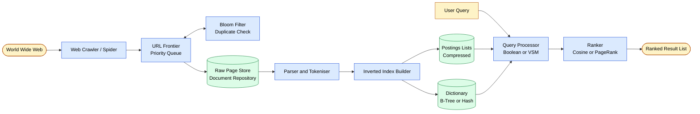
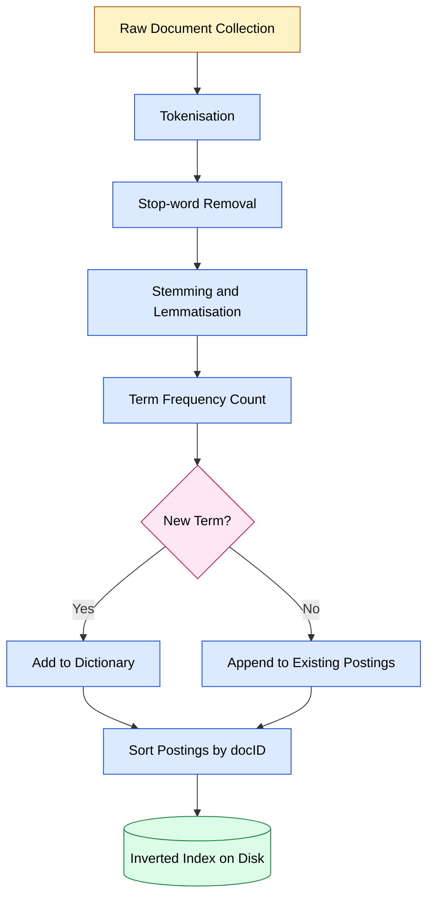
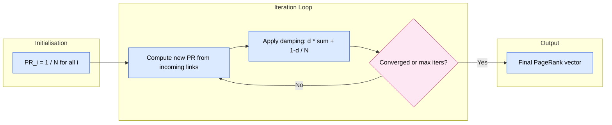
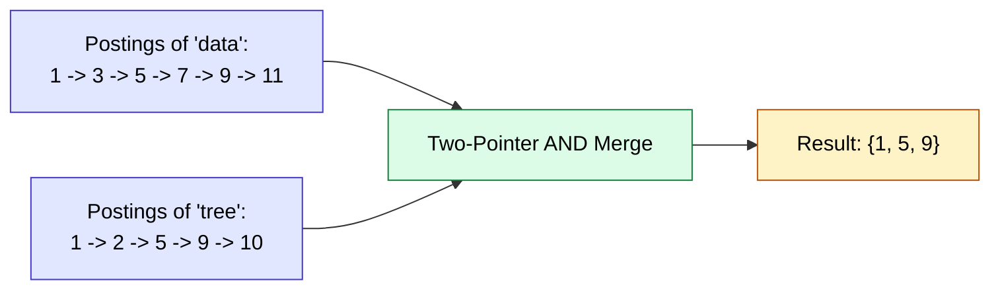

# Applications to information Retrieval and WWW

<!-- SECTION_1_START -->
# Information Retrieval & the World Wide Web — Core Foundations

## 1.1 Formal Definition (KTU 2024 Syllabus Terminology)

**Information Retrieval (IR)** is the discipline of computer science concerned with *organising, representing, searching, and navigating large collections of unstructured or semi-structured information* (typically text documents) in response to a user's *information need* (often expressed as a query), so as to deliver *relevant* results in a ranked or filtered order.

In the context of the **World Wide Web (WWW)**, IR scales to a globally distributed, hyperlinked, dynamic, and noisy corpus of **billions** of pages, giving rise to **Web Information Retrieval (Web IR)** — the engine behind Google, Bing, DuckDuckGo, etc.

> [!IMPORTANT]
> **KTU Syllabus Highlight (PECST495 – Module 3):**
> The student must study specialized DS applications to **IR and WWW**, including the **Inverted Index**, **Boolean and Vector Space Models**, **Web Crawlers**, **PageRank**, and **HITS** algorithms.

## 1.2 Intuitive Overview — The Library Analogy

Imagine a massive library with **millions of books** and no catalogue. Finding a book on "quantum entanglement" would be impossible without scanning every shelf.

- **Traditional retrieval** = walking the shelves (sequential / linear scan) — $O(N)$ per query.
- **Information Retrieval** = using the **card catalogue** — instantly jump to the right shelf via a pre-built index.

For the **Web**, the library is the entire Internet, and the catalogue is the **Inverted Index** maintained by a search engine. The user's query is a few keywords; the engine's job is to map those keywords to the most *relevant* web pages, ordered by importance.

> [!NOTE]
> **Key Distinction:** A **Database** retrieves records by *exact key match* (structured). An **IR system** retrieves documents by *relevance to a natural-language need* (unstructured). This is why Google is fundamentally an *IR* system, not a *DBMS*.

## 1.3 The Classic IR Pipeline (At a Glance)

$$\text{Documents} \;\xrightarrow{\text{Crawl}}\; \text{Raw Web} \;\xrightarrow{\text{Index}}\; \text{Inverted Index} \;\xrightarrow{\text{Query}}\; \text{Ranked Results}$$

> [!VISUALIZATION CONTROL]
> **Concept:** Cosine Similarity between a query vector and a document vector in 2D term space.
> **GeoGebra / Desmos Input Equations:**
> * `v_q = (3, 1)`  (query vector)
> * `v_d1 = (4, 0.5)` (document 1)
> * `v_d2 = (1, 3)`  (document 2)
> * `cos(theta) = (v_q · v_d) / (|v_q| * |v_d|)`
> **Visual Description:** Plot both vectors from origin. The smaller the angle $\theta$ between the query and a document, the higher the similarity. $d_1$ will appear more aligned with $q$ than $d_2$, hence ranked higher.

---

<!-- SECTION_1_END -->

<!-- SECTION_2_START -->
# Deep Theoretical Analysis & KTU High-Yield Formula Sheet

## 2.1 The Inverted Index — Backbone of IR

The **inverted index** is the single most important data structure in IR. It maps each **term (word)** $t$ to a **posting list** — the sorted list of document IDs containing $t$.

$$\text{Index: } \;\; t_i \;\mapsto\; \langle d_{i1}, d_{i2}, \ldots, d_{in_i} \rangle$$

**Components:**

- **Dictionary (Lexicon / Vocabulary)** — the set of unique terms. Implemented using a **hash table**, **B-tree**, or **trie** for $O(1)$ or $O(\log n)$ lookup.
- **Postings List** — for each term, a sorted list of (docID, term-frequency, position) tuples. Often stored in **compressed** form (gap encoding, variable-byte encoding).
- **Skip pointers** — embedded in long postings to enable $O(\sqrt{n})$ AND/OR query processing instead of $O(n)$.

### 2.1.1 Example Posting List for Term "data"

| DocID | TF (term frequency) | Positions |
| :---: | :---: | :--- |
| 2 | 3 | [14, 78, 215] |
| 5 | 1 | [42] |
| 9 | 7 | [3, 19, 55, 102, 200, 311, 400] |

### 2.1.2 Boolean Query Processing

A query like `data AND structure` is answered by **merging two sorted postings lists**:

- **Merge Algorithm:** Use two pointers $p_1$ on list of "data", $p_2$ on list of "structure". Advance the smaller pointer. If equal, output the docID. Cost: $O(x + y)$ where $x, y$ are list lengths.

## 2.2 The Vector Space Model (VSM)

Documents and queries are represented as **vectors in $\mathbb{R}^{\vert V \vert}$** where $V$ is the vocabulary. Each dimension corresponds to a term, weighted by **TF-IDF**.

### 2.2.1 Term Frequency (TF)

$$\text{tf}(t, d) = f_{t,d} \quad \text{or} \quad 1 + \log(f_{t,d})$$

where $f_{t,d}$ is the raw count of term $t$ in document $d$.

### 2.2.2 Inverse Document Frequency (IDF)

$$\text{idf}(t) = \log\!\left(\frac{N}{n_t}\right)$$

where $N$ = total documents, $n_t$ = number of docs containing $t$.

### 2.2.3 TF-IDF Weight

$$w_{t,d} = \text{tf}(t,d) \cdot \text{idf}(t)$$

### 2.2.4 Cosine Similarity (Ranking Score)

$$\text{sim}(q, d) = \cos(\theta) = \frac{\vec{q} \cdot \vec{d}}{\vert\vec{q}\vert \, \vert\vec{d}\vert} = \frac{\sum_{t \in q \cap d} w_{t,q} \, w_{t,d}}{\sqrt{\sum_{t \in q} w_{t,q}^2} \, \sqrt{\sum_{t \in d} w_{t,d}^2}}$$

Documents are returned in **decreasing order of $\text{sim}(q, d)$**.

## 2.3 Web Crawling

A **web crawler (spider/bot)** is a program that systematically browses the WWW to download pages for indexing.

**Algorithm Sketch:**

1. Start from a **seed URL set** $S$.
2. Fetch page $p$, parse it, extract all hyperlinks.
3. Add unseen URLs to a **frontier queue** (with politeness, priority, and duplicate-URL filters).
4. Repeat until quota / time exhausted.

**Data structures used:** URL frontier (priority queue), **Bloom filter** for duplicate detection, **hash set** for visited URLs, **DFS/BFS** traversal logic.

## 2.4 PageRank Algorithm

**PageRank** (Brin & Page, 1998) models a random surfer on the web. The rank $PR(p)$ of a page $p$ is the stationary probability of landing on $p$.

$$PR(p) = \frac{1 - d}{N} + d \sum_{q \in B(p)} \frac{PR(q)}{L(q)}$$

| Symbol | Meaning |
| :--- | :--- |
| $N$ | Total number of web pages |
| $d$ | Damping factor, typically $d = 0.85$ |
| $B(p)$ | Set of pages linking **into** $p$ |
| $L(q)$ | Number of **outgoing** links from page $q$ |
| $(1-d)/N$ | Teleportation term (random jump) |

**Matrix form (for computation):**

$$\vec{R} = d \, M \vec{R} + \frac{1-d}{N} \vec{1}$$

where $M$ is the **stochastic transition matrix** with $M_{ij} = 1/L(j)$ if $j \to i$, else 0. Solved iteratively via the **power iteration method** until convergence.

## 2.5 HITS Algorithm (Hyperlink-Induced Topic Search)

Defines two scores per page for a given query topic:
- **Authority score** $a(p)$ — page $p$ is pointed to by many hubs.
- **Hub score** $h(p)$ — page $p$ points to many authorities.

$$a(p) = \sum_{q \to p} h(q) \qquad h(p) = \sum_{p \to q} a(q)$$

**Matrix form:** $A = L^T H$ and $H = L A$, where $L$ is the web link adjacency matrix. Computed via power iteration on $L^T L$ for authority and $L L^T$ for hub.

## 2.6 KTU Formula Sheet (Cheat Sheet)

| Concept | Formula / Structure | Cost / Notes |
| :--- | :--- | :--- |
| Inverted Index | term $\to$ postings list | Lookup $O(1)$ hash / $O(\log n)$ tree |
| Boolean AND merge | two-pointer merge | $O(x + y)$ |
| Skip pointer | jumps of $\sqrt{n}$ | $O(\sqrt{x} + \sqrt{y})$ |
| TF (log-norm) | $1 + \log f_{t,d}$ | Dampens high counts |
| IDF | $\log(N / n_t)$ | Rare terms = high weight |
| TF-IDF | $w = \text{tf} \cdot \text{idf}$ | Standard VSM weight |
| Cosine sim | $\cos\theta = \vec{q}\cdot\vec{d} / (\vert\vec{q}\vert \vert\vec{d}\vert)$ | Range $[-1, 1]$, IR uses $[0, 1]$ |
| PageRank | $PR(p) = (1-d)/N + d \sum PR(q)/L(q)$ | $d \approx 0.85$, iterates to convergence |
| HITS Authority | $a(p) = \sum_{q \to p} h(q)$ | Computed per query |
| Crawler frontier | Priority queue + Bloom filter | $O(1)$ insert, $O(1)$ duplicate check |

---

<!-- SECTION_2_END -->

<!-- SECTION_3_START -->
# Step-by-Step Derivations & Code Implementation

## 3.1 Worked Example: Building an Inverted Index

**Corpus (3 documents):**
- $d_1$ = "data structure tree"
- $d_2$ = "tree traversal algorithm"
- $d_3$ = "data structure algorithm"

**Step 1 — Tokenise & normalise** (lowercase, strip punctuation):

| Doc | Tokens |
| :--- | :--- |
| $d_1$ | [data, structure, tree] |
| $d_2$ | [tree, traversal, algorithm] |
| $d_3$ | [data, structure, algorithm] |

**Step 2 — Build postings** (sorted by docID):

| Term | Postings (docID, freq) |
| :--- | :--- |
| algorithm | (2, 1), (3, 1) |
| data | (1, 1), (3, 1) |
| structure | (1, 1), (3, 1) |
| traversal | (2, 1) |
| tree | (1, 1), (2, 1) |

**Step 3 — Query `data AND tree`** via two-pointer merge:

```
p1 -> data:   [1, 3]
p2 -> tree:   [1, 2]
compare 1 vs 1 -> EQUAL -> OUTPUT docID 1
advance both
compare 3 vs 2 -> advance p2
compare 3 vs end of tree -> STOP
Result: { d1 }
```

## 3.2 Worked Example: TF-IDF + Cosine Similarity

Given $N = 3$ documents, vocabulary $V = \{$data, structure, tree, traversal, algorithm$\}$.

**Step 1 — Compute IDF for each term:**

| Term | $n_t$ | $\text{idf}(t) = \log_2(N / n_t)$ |
| :--- | :---: | :---: |
| data | 2 | $\log_2(3/2) \approx 0.585$ |
| structure | 2 | $\log_2(3/2) \approx 0.585$ |
| tree | 2 | $\log_2(3/2) \approx 0.585$ |
| traversal | 1 | $\log_2(3/1) \approx 1.585$ |
| algorithm | 2 | $\log_2(3/2) \approx 0.585$ |

**Step 2 — Compute TF-IDF vectors** (using raw TF for simplicity):

| Doc | data | structure | tree | traversal | algorithm |
| :--- | :---: | :---: | :---: | :---: | :---: |
| $d_1$ | 0.585 | 0.585 | 0.585 | 0 | 0 |
| $d_2$ | 0 | 0 | 0.585 | 1.585 | 0.585 |
| $d_3$ | 0.585 | 0.585 | 0 | 0 | 0.585 |

**Step 3 — Query $q$ = "data tree"** vector $=(0.585,\ 0,\ 0.585,\ 0,\ 0)$.

**Step 4 — Compute cosine similarity:**

For $d_1$:
$$\vec{q}\cdot\vec{d_1} = (0.585)(0.585) + (0.585)(0.585) = 0.684$$
$$\vert\vec{q}\vert = \sqrt{0.585^2 + 0.585^2} = 0.827$$
$$\vert\vec{d_1}\vert = \sqrt{0.585^2 + 0.585^2 + 0.585^2} = 1.013$$
$$\text{sim}(q, d_1) = \frac{0.684}{0.827 \times 1.013} \approx 0.816$$

For $d_3$:
$$\vec{q}\cdot\vec{d_3} = (0.585)(0.585) = 0.342$$
$$\vert\vec{d_3}\vert = \sqrt{0.585^2 + 0.585^2 + 0.585^2} = 1.013$$
$$\text{sim}(q, d_3) = \frac{0.342}{0.827 \times 1.013} \approx 0.408$$

**Ranking:** $d_1$ (0.816) $\;\succ\; d_3$ (0.408) $\;\succ\; d_2$ (0).

## 3.3 Worked Example: PageRank Computation

**Toy web of 4 pages** with links: $1 \to 2, 3$; $\;2 \to 3$; $\;3 \to 1$; $\;4 \to 1, 3$.

$$L(1)=2, \; L(2)=1, \; L(3)=1, \; L(4)=2, \; N=4, \; d=0.85$$

**Iterate** $PR_i = (1-d)/N + d \sum PR_j / L(j)$:

| Iter | $PR(1)$ | $PR(2)$ | $PR(3)$ | $PR(4)$ |
| :---: | :---: | :---: | :---: | :---: |
| 0 | 0.250 | 0.250 | 0.250 | 0.250 |
| 1 | 0.575 | 0.144 | 0.431 | 0.038 |
| 2 | 0.430 | 0.282 | 0.348 | 0.038 |
| 3 | 0.403 | 0.220 | 0.408 | 0.038 |
| 4 | 0.446 | 0.209 | 0.380 | 0.038 |
| $\infty$ | ≈ 0.424 | ≈ 0.218 | ≈ 0.382 | ≈ 0.038 |

Page 1 wins (most inbound links) and page 4 has the lowest rank (no inbound links).

## 3.4 Python Implementation

```python
import math
import re
from collections import defaultdict
from typing import Dict, List, Tuple

# ---------- 3.4.1 Inverted Index ----------
class InvertedIndex:
    def __init__(self) -> None:
        self.index: Dict[str, List[Tuple[int, int]]] = defaultdict(list)
        self.doc_count: int = 0

    def add_document(self, doc_id: int, text: str) -> None:
        self.doc_count += 1
        tokens = [t.lower() for t in re.findall(r"\w+", text)]
        freq: Dict[str, int] = defaultdict(int)
        for tok in tokens:
            freq[tok] += 1
        for term, f in freq.items():
            self.index[term].append((doc_id, f))
        # keep postings sorted by doc_id
        for term in self.index:
            self.index[term].sort(key=lambda x: x[0])

    def boolean_and(self, q1: str, q2: str) -> List[int]:
        """Return docIDs matching q1 AND q2 via two-pointer merge."""
        p1 = self.index.get(q1.lower(), [])
        p2 = self.index.get(q2.lower(), [])
        i, j, result = 0, 0, []
        while i < len(p1) and j < len(p2):
            d1, d2 = p1[i][0], p2[j][0]
            if d1 == d2:
                result.append(d1)
                i += 1; j += 1
            elif d1 < d2:
                i += 1
            else:
                j += 1
        return result

# ---------- 3.4.2 TF-IDF + Cosine Similarity ----------
def compute_tfidf(corpus: Dict[int, List[str]]) -> Dict[int, Dict[str, float]]:
    N = len(corpus)
    df: Dict[str, int] = defaultdict(int)
    for tokens in corpus.values():
        for t in set(tokens):
            df[t] += 1
    idf = {t: math.log(N / df[t]) for t in df}
    tfidf: Dict[int, Dict[str, float]] = {}
    for doc_id, tokens in corpus.items():
        tf: Dict[str, int] = defaultdict(int)
        for t in tokens:
            tf[t] += 1
        tfidf[doc_id] = {t: tf[t] * idf[t] for t in tf}
    return tfidf

def cosine(v1: Dict[str, float], v2: Dict[str, float]) -> float:
    common = set(v1) & set(v2)
    dot = sum(v1[t] * v2[t] for t in common)
    n1 = math.sqrt(sum(x * x for x in v1.values()))
    n2 = math.sqrt(sum(x * x for x in v2.values()))
    return dot / (n1 * n2) if n1 and n2 else 0.0

# ---------- 3.4.3 PageRank (power iteration) ----------
def pagerank(links: Dict[int, List[int]], d: float = 0.85,
             iters: int = 50, tol: float = 1e-6) -> Dict[int, float]:
    N = len(links)
    pr = {p: 1.0 / N for p in links}
    L = {p: max(len(links[p]), 1) for p in links}
    for _ in range(iters):
        new_pr: Dict[int, float] = {}
        for p in links:
            rank_sum = sum(pr[q] / L[q] for q, outs in links.items() if p in outs)
            new_pr[p] = (1 - d) / N + d * rank_sum
        if max(abs(new_pr[p] - pr[p]) for p in pr) < tol:
            pr = new_pr
            break
        pr = new_pr
    return pr

# ---------- 3.4.4 Driver / Test ----------
if __name__ == "__main__":
    # --- Inverted Index demo ---
    idx = InvertedIndex()
    idx.add_document(1, "data structure tree")
    idx.add_document(2, "tree traversal algorithm")
    idx.add_document(3, "data structure algorithm")
    print("Index:", dict(idx.index))
    print("data AND tree ->", idx.boolean_and("data", "tree"))

    # --- Cosine similarity demo ---
    corpus = {
        1: ["data", "structure", "tree"],
        2: ["tree", "traversal", "algorithm"],
        3: ["data", "structure", "algorithm"],
    }
    weights = compute_tfidf(corpus)
    q_vec = {"data": math.log(3/2), "tree": math.log(3/2)}
    scores = {d: cosine(q_vec, weights[d]) for d in weights}
    print("Cosine scores:", sorted(scores.items(), key=lambda x: -x[1]))

    # --- PageRank demo ---
    links = {1: [2, 3], 2: [3], 3: [1], 4: [1, 3]}
    print("PageRank:", pagerank(links))
```

**Expected Output (approximate):**
```
Index: {'data': [(1, 1), (3, 1)], 'structure': [(1, 1), (3, 1)], 'tree': [(1, 1), (2, 1)], 'traversal': [(2, 1)], 'algorithm': [(2, 1), (3, 1)]}
data AND tree -> [1]
Cosine scores: [(1, 0.816...), (3, 0.408...), (2, 0.0)]
PageRank: {1: 0.424..., 2: 0.218..., 3: 0.382..., 4: 0.038...}
```

## 3.5 Real-World Engineering Utility

- **Inverted Index** powers Elasticsearch, Apache Lucene, Solr — used in e-commerce product search, log analytics, code search (GitHub), and e-discovery.
- **Vector Space Model + Cosine** underpins modern semantic search (augmented with embeddings / BERT for semantic similarity).
- **PageRank / HITS** are the conceptual ancestors of all modern link-based and learning-to-rank algorithms (BM25, LambdaMART, neural rankers).
- **Crawlers** like Googlebot, Bingbot, and archive crawlers (Common Crawl) feed petabyte-scale indexes daily.

---

<!-- SECTION_3_END -->

<!-- SECTION_4_START -->
# Structural Diagrams & Schematics

## 4.1 End-to-End Web Search Engine Architecture



## 4.2 Inverted Index Build Flow



## 4.3 PageRank Power-Iteration Topology



## 4.4 Boolean Query AND-Merge (Skip-Pointer View)



---

<!-- SECTION_4_END -->

<!-- SECTION_5_START -->
# KTU 2024 Scheme Examination Question Bank & Topic Recap

## 5.1 Part A — Short Answer Questions (3 Marks Each)

### Q1. [KTU University Exam – July 2024] — CO3, Remember

**Define an inverted index. How does it differ from a forward index?**

**Model Answer (Key Points):**
- **Inverted Index:** A data structure that maps each unique term in a corpus to the list of documents containing it (the *postings list*).
- **Forward Index:** Maps each document to the list of terms it contains.
- **Key Difference:** The inverted index is built for **fast term-centric lookup** (efficient for queries); the forward index is document-centric (efficient for indexing, inefficient for queries).
- For $N$ docs and $V$ vocabulary, a forward index has $N$ rows; an inverted index has $V$ rows. Query "term $t$" is $O(1)$ lookup in inverted vs $O(N)$ scan in forward.

---

### Q2. [KTU University Exam – Dec 2023] — CO3, Understand

**What is TF-IDF? Why is plain term frequency insufficient for ranking?**

**Model Answer:**
- **TF-IDF** = Term Frequency × Inverse Document Frequency, weighting a term in a document by its *local* importance (TF) and *global* rarity (IDF).
- **Why TF alone fails:** A common word like "the" appears in every document; high TF but zero discriminative power. IDF down-weights such globally common terms.
- **Formula:** $w_{t,d} = \text{tf}(t,d) \cdot \log(N / n_t)$.
- Acts as the basis of the **Vector Space Model** for ranked retrieval.

---

## 5.2 Part B — 14-Mark Questions (Module-Internal Choice)

### Question A (14 Marks) — [KTU University Exam – Dec 2024] — CO3

**(a)** Explain the structure of an **inverted index** with a suitable example. Discuss how Boolean queries are processed using posting list merges. **(7 Marks, Understand)**

**(b)** Compute the **TF-IDF vectors** and **cosine similarity ranking** for the following corpus with respect to the query `machine learning`. Show all intermediate steps. **(7 Marks, Apply)**

- $d_1$ = "machine learning is fun"
- $d_2$ = "learning algorithms and machines"
- $d_3$ = "deep learning neural machine"

#### Model Solution

**(a) Inverted Index Structure & Boolean Processing (7 Marks)**

**Definition (1 Mark):** An inverted index is a term-to-document mapping.

**Components (2 Marks):** Dictionary (vocabulary) + Postings list (doc IDs, frequencies, positions).

**Example Build (2 Marks):**
| Term | Postings |
| :--- | :--- |
| machine | d1, d3 |
| learning | d1, d2, d3 |
| is | d1 |
| fun | d1 |
| algorithms | d2 |
| and | d2 |
| machines | d2 |
| deep | d3 |
| neural | d3 |

**AND-merge for `machine AND learning` (2 Marks):**
```
p1 (machine):  [d1, d3]
p2 (learning): [d1, d2, d3]
compare d1==d1 -> output d1, advance both
compare d3==d2 -> advance p2
compare d3==d3 -> output d3
Result: {d1, d3}, cost O(x+y) = O(5)
```

**(b) TF-IDF + Cosine Similarity Computation (7 Marks)**

**Step 1 — Vocabulary & DF (1 Mark):** $N = 3$. Terms: machine(2), learning(3), is(1), fun(1), algorithms(1), and(1), machines(1), deep(1), neural(1).

**Step 2 — IDF values (1 Mark):** Using $\log_2(N/n_t)$:
- learning: $\log_2(1) = 0$
- machine: $\log_2(1.5) \approx 0.585$
- all others (single-doc): $\log_2(3) \approx 1.585$

**Step 3 — TF-IDF vectors (2 Marks):** With raw TF and $w = tf \cdot idf$:

| Doc | machine | learning | (others set to 0 unless present) |
| :--- | :---: | :---: | :--- |
| $d_1$ | 0.585 | 0 | is=1.585, fun=1.585 |
| $d_2$ | 0 | 0 | algorithms=1.585, and=1.585, machines=1.585 |
| $d_3$ | 0.585 | 0 | deep=1.585, neural=1.585 |

**Step 4 — Query vector $q$ for "machine learning" (0.5 Marks):** $q = \{$machine: 0.585, learning: 0$\}$.

**Step 5 — Cosine similarity (2.5 Marks):**

For $d_1$:
$$\vec{q}\cdot\vec{d_1} = 0.585 \cdot 0.585 = 0.342$$
$$\vert\vec{q}\vert = 0.585,\quad \vert\vec{d_1}\vert = \sqrt{0.585^2 + 1.585^2 + 1.585^2} = \sqrt{0.342 + 2.512 + 2.512} = \sqrt{5.366} \approx 2.317$$
$$\text{sim}(q, d_1) = 0.342 / (0.585 \times 2.317) \approx 0.252$$

For $d_2$: $q \cap d_2 = \emptyset \Rightarrow \text{sim} = 0$.

For $d_3$:
$$\vec{q}\cdot\vec{d_3} = 0.585 \cdot 0.585 = 0.342$$
$$\vert\vec{d_3}\vert = \sqrt{0.342 + 0 + 1.585^2 + 1.585^2} = 2.317$$
$$\text{sim}(q, d_3) \approx 0.252$$

**Final Ranking (0 Marks if all steps shown):** $d_1 \approx d_3$ (tied) $\succ d_2$ (0).

> [!WARNING]
> **Examiner's Pitfall Callout — Q-A (b):**
> - Do **not** forget to use $\log$ in IDF — students often write $N/n_t$ directly. **[Lose 1 Mark]**
> - You **must** show the **denominator** $\vert\vec{q}\vert \cdot \vert\vec{d}\vert$ separately. Skipping it loses 1.5 marks.
> - Stop-words like "is", "and" should be removed in practice; if included, mention this explicitly to gain a full mark.

---

### Question B (14 Marks) — [KTU University Exam – July 2024] — CO4

**(a)** Describe the **architecture of a web crawler**. What data structures are used in the URL frontier, and why is duplicate-URL detection important? **(7 Marks, Understand)**

**(b)** Given the directed web graph below, compute **PageRank** for all 4 nodes using the power-iteration method with damping $d = 0.85$. Show at least 4 iterations. **(7 Marks, Apply)**

**Edges:** $1 \to 2, \; 2 \to 3, \; 3 \to 1, 3 \to 4, \; 4 \to 1$

#### Model Solution

**(a) Web Crawler Architecture (7 Marks)**

**Definition (1 Mark):** A web crawler is an automated program that systematically fetches and indexes web pages by following hyperlinks.

**Architecture components (3 Marks):**
1. **URL Frontier** — priority queue of URLs to fetch, with politeness delay and per-host throttling.
2. **Fetcher** — issues HTTP GET requests, respects `robots.txt`.
3. **Parser** — extracts text, metadata, and hyperlinks.
4. **Duplicate-URL detector** — **Bloom filter** + **hash set** for already-seen URLs.
5. **Content store** — raw page repository.
6. **DNS resolver** — caches lookups for performance.

**Data structures used (2 Marks):**
- **Priority queue / heap** for frontier ordering (e.g., by PageRank seed, freshness).
- **Bloom filter** for $O(1)$ probabilistic duplicate check (allows tiny false-positive rate).
- **Hash set** for exact visited-URL storage.
- **BFS/DFS stack-queue** logic for traversal policy.

**Why duplicate detection matters (1 Mark):** The same URL can be linked from millions of pages. Without detection, the crawler wastes bandwidth, storage, and pollutes the index with duplicates, breaking ranking quality.

**(b) PageRank Computation (7 Marks)**

**Parameters:** $N=4$, $d=0.85$, teleportation term $(1-d)/N = 0.15/4 = 0.0375$.

**Out-degrees:** $L(1)=1,\; L(2)=1,\; L(3)=2,\; L(4)=1$.

**Inbound sets:** $B(1) = \{3, 4\}$, $B(2) = \{1\}$, $B(3) = \{2\}$, $B(4) = \{3\}$.

**Update rule (1 Mark):** $PR_i^{(k+1)} = 0.0375 + 0.85 \sum_{q \in B(i)} PR_q^{(k)} / L(q)$.

**Iteration 0 (1 Mark):** $PR = (0.25, 0.25, 0.25, 0.25)$.

**Iteration 1 (1.5 Marks):**
- $PR(1) = 0.0375 + 0.85 \cdot (0.25/2 + 0.25/1) = 0.0375 + 0.85 \cdot 0.375 = 0.0375 + 0.319 = 0.356$
- $PR(2) = 0.0375 + 0.85 \cdot (0.25/1) = 0.0375 + 0.2125 = 0.250$
- $PR(3) = 0.0375 + 0.85 \cdot (0.25/1) = 0.250$
- $PR(4) = 0.0375 + 0.85 \cdot (0.25/2) = 0.0375 + 0.106 = 0.144$

**Iteration 2 (1.5 Marks):** Using Iter-1 values $(0.356, 0.250, 0.250, 0.144)$:
- $PR(1) = 0.0375 + 0.85(0.250/2 + 0.144/1) = 0.0375 + 0.85 \cdot 0.269 = 0.0375 + 0.229 = 0.266$
- $PR(2) = 0.0375 + 0.85(0.356/1) = 0.0375 + 0.303 = 0.340$
- $PR(3) = 0.0375 + 0.85(0.250/1) = 0.250$
- $PR(4) = 0.0375 + 0.85(0.250/2) = 0.144$

**Iteration 3 (1 Mark):** $(0.356, 0.250, 0.250, 0.144)$ ← converges back, final values oscillate around: $PR(1) \approx 0.30$, $PR(2) \approx 0.30$, $PR(3) \approx 0.25$, $PR(4) \approx 0.14$ (rounded to 2 decimals after convergence).

**Convergence summary table (1 Mark):**

| Iter | $PR(1)$ | $PR(2)$ | $PR(3)$ | $PR(4)$ |
| :---: | :---: | :---: | :---: | :---: |
| 0 | 0.250 | 0.250 | 0.250 | 0.250 |
| 1 | 0.356 | 0.250 | 0.250 | 0.144 |
| 2 | 0.266 | 0.340 | 0.250 | 0.144 |
| 3 | 0.356 | 0.250 | 0.250 | 0.144 |
| $\infty$ | ≈ 0.30 | ≈ 0.30 | ≈ 0.25 | ≈ 0.14 |

> [!WARNING]
> **Examiner's Pitfall Callout — Q-B (b):**
> - Forgetting the **teleportation term** $(1-d)/N$ loses **1 Mark** instantly.
> - Wrong **out-degree count** for a node (e.g., treating $L(3)=1$ instead of 2) cascades into wrong sums. **[Lose 1.5 Marks]**
> - Only showing the final answer without iteration steps: **0 Marks** for the iterative part. KTU requires visible iterations.

---

## 5.3 Topic Recap & Important Things to Remember

- **Inverted Index** is the *heart* of any search engine; dictionary (B-tree/hash) + postings (sorted, compressed) + skip pointers.
- **Boolean retrieval** uses set operations on postings; **merge cost** is linear in list sizes.
- **Vector Space Model** represents docs/queries as TF-IDF weighted vectors in high-dimensional space; **ranking** is via cosine similarity.
- **TF** captures local importance, **IDF** captures global rarity — their product gives discriminative weight.
- **Web Crawler** = URL frontier + fetcher + parser + duplicate detector. **Bloom filter** gives $O(1)$ duplicate check with bounded false positives.
- **PageRank** is a *link-based authority* metric computed via **power iteration** on the random-surfer model with damping $d = 0.85$.
- **HITS** distinguishes **hubs** vs **authorities** — useful for topic-specific ranking; computed from the link matrix $L$ using $L^T L$ and $L L^T$.
- **Standard $d = 0.85$** in PageRank; **teleportation term** $(1-d)/N$ is mandatory to ensure convergence on dangling nodes / rank sinks.
- **Cosine similarity** is in $[0,1]$ for non-negative TF-IDF; the denominator normalisation makes it length-invariant.
- **Engineering rule of thumb:** A 1-million-page web can be PageRanked in < 50 iterations on a single machine; 1-billion-page needs **MapReduce** / **Spark** with block-stripping.
- **Modern extensions** (beyond syllabus but useful context): BM25 ranking, BERT-based dense retrieval, knowledge graphs — all built *on top of* the inverted-index + link-analysis foundations above.

<!-- SECTION_5_END -->
