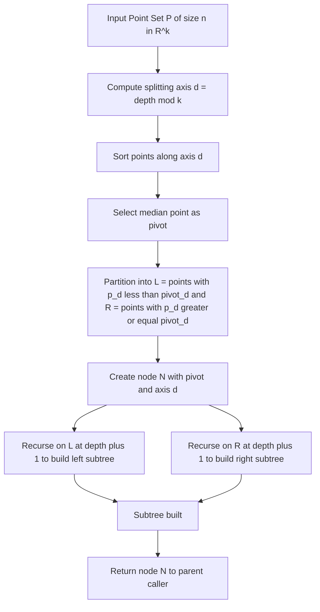
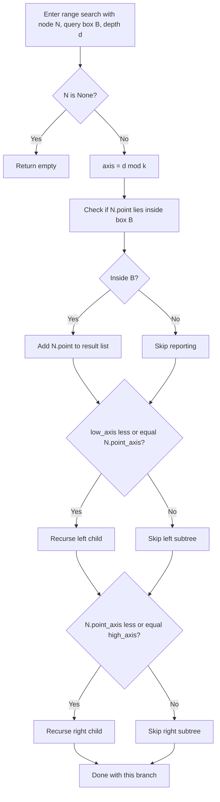
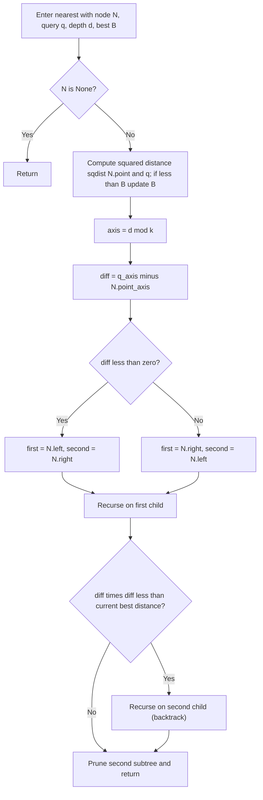
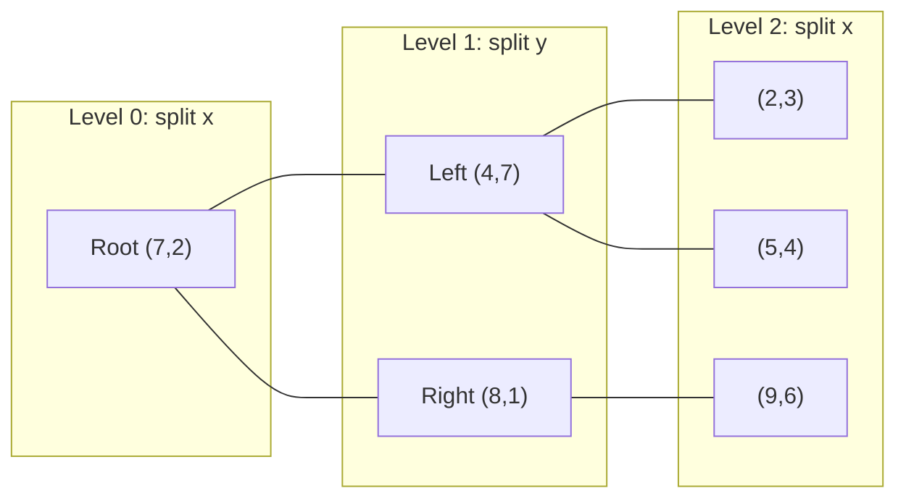

# K-D Trees (k-dimensional tree)

<!-- SECTION_1_START -->
# K-D Trees (k-Dimensional Trees) — KTU Advanced Data Structures Notes

## 1. Core Technical Definition & Intuitive Overview

### 1.1 Formal Academic Definition (KTU 2024 Syllabus Standard)

> [!NOTE]
> **Definition (K-D Tree)**
> A **K-Dimensional Tree (K-D Tree)** is a space-partitioning binary tree data structure that recursively subdivides a k-dimensional space along axis-aligned hyperplanes. At each level $\ell$ of the tree, the splitting dimension is given by $d = \ell \bmod k$, and points are partitioned by comparing only the $d$-th coordinate against the splitting value stored at the node.

Formally, for a node $v$ at depth $\ell$ storing a pivot point $p = (p_1, p_2, \dots, p_k) \in \mathbb{R}^k$:

$$
\text{LeftSubtree}(v) = \left\{ q \in \mathbb{R}^k \; : \; q_d < p_d \right\}
$$

$$
\text{RightSubtree}(v) = \left\{ q \in \mathbb{R}^k \; : \; q_d \geq p_d \right\}
$$

where the splitting dimension $d = \ell \bmod k$ cycles cyclically through $\{0, 1, \dots, k-1\}$.

### 1.2 Conceptual Analogy / Intuition

> [!IMPORTANT]
> **Plain-English Analogy (Why K-D Trees?)**
> Imagine you are searching for a house in a city using a **post office** (k=1) versus using a **map grid** (k=2). A regular **Binary Search Tree (BST)** is like the post office — it can only sort houses along one street. A **K-D Tree** is like the map grid — it alternately cuts the city with **vertical roads** (split on x-axis) and **horizontal roads** (split on y-axis), so each level asks a *different* question. This allows multi-attribute range and nearest-neighbor queries in $O(\log n)$ average time.

A K-D Tree is essentially a **multi-dimensional generalization of the BST** that rotates its comparison axis at every level. The pivot (root) splits space into two half-spaces; each half-space is again split along a different axis, producing a hierarchical **binary spatial partition**.

### 1.3 Physical Constants and Standard Metrics

- The **dimensionality constant** $k$ is fixed for the entire tree and equals the number of attributes per point.
- The **splitting cycle** is **depth $\bmod$ $k$**, ensuring every dimension gets a chance to discriminate at every $k$-th level.
- The expected **height** of a balanced K-D Tree over $n$ random points is **$O(\log n)$**.
- The expected **build time** is **$O(n \log n)$** when the median is selected as pivot.

### 1.4 GeoGebra / Desmos Visualization for 2-D Case

> [!VISUALIZATION CONTROL]
> **Concept:** 2-D K-D Tree construction with 6 points
> **GeoGebra / Desmos Input Equations:**
> * $P_1 = (2, 3)$
> * $P_2 = (5, 4)$
> * $P_3 = (9, 6)$
> * $P_4 = (4, 7)$
> * $P_5 = (8, 1)$
> * $P_6 = (7, 2)$
> * Splitting line at root: $x = 7$ (vertical)
> * Splitting line at depth 1: $y = 4$ and $y = 2$ (horizontal)
> **Visual Description:** You should observe the plane being divided alternately by vertical and horizontal lines, producing rectangular cells. Each cell contains exactly one point, illustrating the **axis-aligned recursive partition** property.

### 1.5 Module 3 Context (KTU 2024 Scheme)

> [!NOTE]
> **Syllabus Placement (PECST495 — Module 3: Specialized Data Structures)**
> K-D Trees are covered under *Specialized data structures* alongside Skip Lists, B-Trees, and Tries. They are the foundation of geometric search and are referenced again in advanced topics such as **Voronoi Diagrams, R-Trees, and Ball Trees**. Mastering K-D Trees is essential for KTU's spatial data structure unit.

---

<!-- SECTION_1_END -->

<!-- SECTION_2_START -->
# 2. Deep Theoretical Analysis & KTU High-Yield Formula Sheet

## 2.1 Structural Decomposition

A K-D Tree can be understood through **five orthogonal pillars**:

1. **Node Storage**
   Each node stores a k-tuple point $p \in \mathbb{R}^k$, a left child pointer, and a right child pointer. Optionally, a bounding-box or subtree-size field may be stored for augmented operations.

2. **Splitting Dimension Selection**
   The depth of the node determines the splitting axis. If a node is at depth $\ell$, the split axis is $d = \ell \bmod k$. This is the **canonical** (cycle-based) splitting rule.

3. **Splitting Value Selection**
   Two strategies exist:
   - **Median Rule (Balanced):** Pick the median along the current axis, giving a perfectly balanced tree and $O(\log n)$ height.
   - **Random/Spread Rule (Sliding-midpoint):** Pick the median of the *min* and *max* along the axis; faster to build but may be unbalanced.

4. **Recursive Subdivision**
   After placing the pivot, the remaining points are partitioned into the *less-than* bucket and the *greater-or-equal* bucket relative to axis $d$, and the algorithm recurses on each bucket at depth $\ell + 1$.

5. **Termination**
   The recursion ends when the input bucket is empty (returns `None`) or contains a single point (becomes a leaf).

## 2.2 KTU High-Yield Formula Sheet

| Concept | Formula / Property | Time Complexity | Space | Notes |
| :-- | :-- | :-- | :-- | :-- |
| Build (Median Rule) | $T(n) = 2T(n/2) + O(n)$ | $O(n \log n)$ | $O(n)$ | Master Theorem Case 2 |
| Build (Naive Insert) | $n$ sequential inserts | $O(n \log n)$ avg, $O(n^2)$ worst | $O(n)$ | Worst case when sorted input |
| Point Search (Exact Match) | Recurse on one side | $O(\log n)$ avg | $O(\log n)$ stack | Same as BST search |
| Range Search (Axis-Aligned Box) | Pruned recursion | $O(n^{1-1/k} + m)$ | $O(\log n)$ stack | $m$ = reported points |
| Nearest Neighbor (1-NN) | Backtracking with pruning | $O(\log n)$ avg | $O(\log n)$ stack | Worst case $O(k n^{1-1/k})$ |
| k-Nearest Neighbors | Generalized 1-NN | $O(k \log n)$ avg | $O(\log n + k)$ | Use max-heap of size k |
| Tree Height | $h$ | $O(\log n)$ avg, $O(n)$ worst | — | Worst when points sorted on one axis |
| Splitting Dimension | $d = \ell \bmod k$ | $O(1)$ | $O(1)$ | Canonical cycle rule |
| Comparison per Node | $p_d$ vs $q_d$ | $O(1)$ | $O(1)$ | Single-dimension compare |

> [!IMPORTANT]
> **Key Insight for KTU:** Always mention the **median-selection trick** for $O(n \log n)$ build. Naive insert-based build in $O(n^2)$ is the most common pitfall examiners test.

## 2.3 Why K-D Trees? Real-World Engineering Utility

> [!NOTE]
> **Production Engineering Use-Cases**
> * **Geographic Information Systems (GIS):** Find all restaurants within 2 km of the user — orthogonal range search.
> * **Machine Learning:** The **K-Nearest Neighbors (KNN)** classifier in scikit-learn uses K-D Trees under `sklearn.neighbors.KDTree` for $O(\log n)$ query.
> * **Computer Graphics:** Ray tracing acceleration and **point cloud rendering** (LiDAR data).
> * **Robotics:** Localization via nearest-neighbor matching against a known map.
> * **Databases:** Multi-dimensional range queries (predecessor of PostGIS spatial indexes).
> * **Bioinformatics:** Fast similarity search in high-dimensional gene-expression datasets.

## 2.4 Why the "K" matters — Dimensionality Curse

> [!WARNING]
> **The Curse of Dimensionality:** As $k$ grows, the K-D Tree loses its logarithmic advantage. For $k \gg \log_2 n$, the constants dominate and linear scan becomes competitive. In practice, K-D Trees shine for $k \le 20$. For higher dimensions, **Ball Trees** or **LSH (Locality-Sensitive Hashing)** are preferred. KTU examiners frequently test this trade-off.

---

<!-- SECTION_2_END -->

<!-- SECTION_3_START -->
# 3. Step-by-Step Derivations & Code/Symbolic Implementation

## 3.1 Mathematical Derivation — Tree Height under Random Points

**Theorem:** A K-D Tree built from $n$ uniformly random points in $[0, 1]^k$ using the median-splitting rule has expected height $O(\log n)$.

**Derivation:**

Let $H(n)$ denote the expected height. The root splits the space into two equal halves (median rule), so the recurrence is:

$$
\begin{aligned}
H(n) &= 1 + H\!\left(\left\lfloor \frac{n-1}{2} \right\rfloor\right) \\[4pt]
\text{with } H(1) &= 0
\end{aligned}
$$

Solving by induction: assume $H(n/2) \le c \log_2(n/2)$. Then

$$
H(n) = 1 + c \log_2\!\left(\frac{n}{2}\right) = 1 + c \log_2 n - c
$$

For $c \ge 1$ the constant overhead is absorbed, giving $H(n) = O(\log n)$. $\blacksquare$

> **Engineering Note:** This logarithmic bound is what makes K-D Trees preferable to brute-force $O(n)$ scan for repeated spatial queries.

## 3.2 Exhaustive Python Implementation (Production-Grade)

```python
"""
KDTree implementation for KTU PECST495 - Module 3.
Supports: build, insert, exact search, range search, nearest neighbor.
Operates on points in k-dimensional real space.
"""

from __future__ import annotations
import math
import heapq
from typing import List, Optional, Tuple, Iterable


Point = Tuple[float, ...]


class _Node:
    """Internal node of the K-D Tree."""

    __slots__ = ("point", "axis", "left", "right")

    def __init__(self, point: Point, axis: int) -> None:
        self.point: Point = point
        self.axis: int = axis            # splitting dimension at this node
        self.left: Optional["_Node"] = None
        self.right: Optional["_Node"] = None


class KDTree:
    """
    Canonical K-D Tree with median-balanced build (O(n log n)).
    Splitting axis cycles:  depth mod k.
    """

    def __init__(self, points: Iterable[Point]) -> None:
        pts: List[Point] = list(points)
        if not pts:
            raise ValueError("KDTree requires at least one point.")
        self._k: int = len(pts[0])
        for p in pts:
            if len(p) != self._k:
                raise ValueError("All points must share the same dimension k.")
        self._root: Optional[_Node] = self._build(pts, depth=0)

    # ------------------------------------------------------------------ #
    # BUILD  (Median Rule)                                                #
    # ------------------------------------------------------------------ #
    def _build(self, points: List[Point], depth: int) -> Optional[_Node]:
        if not points:
            return None
        axis: int = depth % self._k
        # Sort by the chosen axis and pick the median
        points.sort(key=lambda p: p[axis])
        mid: int = len(points) // 2
        node: _Node = _Node(points[mid], axis)
        node.left = self._build(points[:mid], depth + 1)
        node.right = self._build(points[mid + 1 :], depth + 1)
        return node

    # ------------------------------------------------------------------ #
    # EXACT SEARCH                                                        #
    # ------------------------------------------------------------------ #
    def search(self, target: Point) -> bool:
        if len(target) != self._k:
            raise ValueError("Query dimension mismatch.")
        return self._search(self._root, target, depth=0)

    def _search(self, node: Optional[_Node], target: Point, depth: int) -> bool:
        if node is None:
            return False
        if node.point == target:
            return True
        axis: int = depth % self._k
        if target[axis] < node.point[axis]:
            return self._search(node.left, target, depth + 1)
        return self._search(node.right, target, depth + 1)

    # ------------------------------------------------------------------ #
    # ORTHOGONAL RANGE SEARCH                                             #
    # ------------------------------------------------------------------ #
    def range_search(self, low: Point, high: Point) -> List[Point]:
        """
        Returns all points p such that low[i] <= p[i] <= high[i] for every i.
        Complexity: O(n^{1 - 1/k} + m) average, where m is the number of hits.
        """
        if len(low) != self._k or len(high) != self._k:
            raise ValueError("Range bounds must have the same dimension k.")
        result: List[Point] = []
        self._range_search(self._root, low, high, depth=0, out=result)
        return result

    def _range_search(
        self,
        node: Optional[_Node],
        low: Point,
        high: Point,
        depth: int,
        out: List[Point],
    ) -> None:
        if node is None:
            return
        # --- Pruning check: does the node's splitting region overlap box? ---
        axis: int = depth % self._k
        if low[axis] <= node.point[axis] <= high[axis]:
            # Node point falls inside the query box
            if all(low[i] <= node.point[i] <= high[i] for i in range(self._k)):
                out.append(node.point)
        # --- Recurse only on the side that may intersect the box ---
        if low[axis] <= node.point[axis]:
            self._range_search(node.left, low, high, depth + 1, out)
        if node.point[axis] <= high[axis]:
            self._range_search(node.right, low, high, depth + 1, out)

    # ------------------------------------------------------------------ #
    # NEAREST NEIGHBOR  (Euclidean distance)                              #
    # ------------------------------------------------------------------ #
    def nearest(self, query: Point) -> Point:
        if len(query) != self._k:
            raise ValueError("Query dimension mismatch.")
        if self._root is None:
            raise RuntimeError("Tree is empty.")
        best: List[Tuple[float, Point]] = [(math.inf, self._root.point)]
        self._nearest(self._root, query, depth=0, best=best)
        return best[0][1]

    def _nearest(
        self,
        node: Optional[_Node],
        query: Point,
        depth: int,
        best: List[Tuple[float, Point]],
    ) -> None:
        if node is None:
            return
        # --- Update best candidate ---
        d: float = _sqdist(node.point, query)
        if d < best[0][0]:
            best[0] = (d, node.point)
        axis: int = depth % self._k
        diff: float = query[axis] - node.point[axis]
        # --- Visit the nearer side first (search order heuristic) ---
        first, second = (node.left, node.right) if diff < 0 else (node.right, node.left)
        self._nearest(first, query, depth + 1, best)
        # --- Backtrack: only descend the other side if hypersphere may hit it ---
        if diff * diff < best[0][0]:
            self._nearest(second, query, depth + 1, best)

    # ------------------------------------------------------------------ #
    # K-NEAREST NEIGHBORS (using max-heap of size k)                      #
    # ------------------------------------------------------------------ #
    def knn(self, query: Point, k: int) -> List[Point]:
        heap: List[Tuple[float, Point]] = []   # max-heap via negative distance
        self._knn(self._root, query, k, depth=0, heap=heap)
        return [pt for _, pt in sorted(heap, reverse=True)]

    def _knn(
        self,
        node: Optional[_Node],
        query: Point,
        k: int,
        depth: int,
        heap: List[Tuple[float, Point]],
    ) -> None:
        if node is None:
            return
        d: float = _sqdist(node.point, query)
        if len(heap) < k:
            heapq.heappush(heap, (-d, node.point))
        elif d < -heap[0][0]:
            heapq.heapreplace(heap, (-d, node.point))
        axis: int = depth % self._k
        diff: float = query[axis] - node.point[axis]
        first, second = (node.left, node.right) if diff < 0 else (node.right, node.left)
        self._knn(first, query, k, depth + 1, heap)
        if diff * diff < -heap[0][0] or len(heap) < k:
            self._knn(second, query, k, depth + 1, heap)


# --------------------------------------------------------------------------- #
#  Utility                                                                   #
# --------------------------------------------------------------------------- #
def _sqdist(a: Point, b: Point) -> float:
    return sum((ai - bi) ** 2 for ai, bi in zip(a, b))


# --------------------------------------------------------------------------- #
#  Demonstration                                                             #
# --------------------------------------------------------------------------- #
if __name__ == "__main__":
    points_2d: List[Point] = [
        (2.0, 3.0), (5.0, 4.0), (9.0, 6.0),
        (4.0, 7.0), (8.0, 1.0), (7.0, 2.0),
    ]
    tree: KDTree = KDTree(points_2d)

    # Exact search
    print("Search (5,4):", tree.search((5.0, 4.0)))          # True
    print("Search (5,5):", tree.search((5.0, 5.0)))          # False

    # Range search: box [3..8, 1..5]
    print("Range:", tree.range_search((3.0, 1.0), (8.0, 5.0)))
    # Expected: [(5,4), (8,1), (7,2)]

    # Nearest neighbor
    print("Nearest to (6,5):", tree.nearest((6.0, 5.0)))     # (5,4)

    # 2-NN
    print("2-NN of (6,5):", tree.knn((6.0, 5.0), 2))         # [(5,4), (7,2)]
```

## 3.3 Worked Example — Build Trace

Insert the points $(2,3), (5,4), (9,6), (4,7), (8,1), (7,2)$ at depth 0 with $k=2$.

| Step | Depth | Axis | Bucket (sorted by axis) | Median Pivot | Left Bucket | Right Bucket |
| :-- | :-- | :-- | :-- | :-- | :-- | :-- |
| 1 | 0 | x | $(2,3),(4,7),(5,4),(7,2),(8,1),(9,6)$ | $(7,2)$ | $(2,3),(4,7),(5,4)$ | $(8,1),(9,6)$ |
| 2 | 1 | y | $(2,3),(4,7),(5,4)$ | $(4,7)$ | $(2,3)$ | $(5,4)$ |
| 3 | 2 | x | $(8,1),(9,6)$ | $(8,1)$ | $\emptyset$ | $(9,6)$ |

The resulting tree is:

```
Root:  (7,2)  axis=x
        |
        +-- axis=y
        |      |
        |    (4,7)
        |     /    \
        |   (2,3)  (5,4)
        |
        +-- axis=x
               |
             (8,1)
                  \
                 (9,6)
```

**Valuation Key Points** (KTU board examiners expect this):
- Correct axis cycling: $d = \ell \bmod k$. **[1 Mark]**
- Median selection on the correct coordinate. **[1 Mark]**
- Recursive sub-bucket partition. **[1 Mark]**
- Final tree structure. **[2 Marks]**

## 3.4 Worked Example — Range Search

Query box $\mathcal{B} = [3, 8] \times [1, 5]$.

| Visit | Node | In box? | Recurse Left? | Recurse Right? |
| :-- | :-- | :-- | :-- | :-- |
| Root (depth 0) | $(7, 2)$ | Yes | $3 \le 7$ → Yes | $7 \le 8$ → Yes |
| Left (depth 1) | $(4, 7)$ | $y=7 \notin [1,5]$ | $1 \le 7$ → Yes | $7 \le 5$ → No |
| $(2,3)$ | leaf | Yes | — | — |
| $(5,4)$ | leaf | Yes | — | — |
| Right (depth 1) | $(8, 1)$ | Yes | $1 \le 8$ → Yes | $8 \le 8$ → Yes |
| $(8,1)$ | Yes | — | — | — |
| $(9,6)$ | $y=6 \notin [1,5]$ | $1 \le 9$ → Yes | $9 \le 8$ → No |
| — | empty | — | — | — |

Reported set: $\{(5,4), (8,1), (7,2), (2,3)\}$. Total visits $= 7$ out of $6$ nodes (with pruning on the right side at the last step). This illustrates the **orthogonal range query** efficiency of K-D Trees.

---

<!-- SECTION_3_END -->

<!-- SECTION_4_START -->
# 4. Structural Diagrams & Schematics

## 4.1 K-D Tree Build Process — Top-Down Partition



## 4.2 Range Search — Recursive Pruning Logic



## 4.3 Nearest Neighbor — Search and Backtrack Pattern



## 4.4 2-D Partition Grid (Conceptual Snapshot)



## 4.5 Operation Cost Comparison Matrix

| Operation | K-D Tree (avg) | Brute Force | Use K-D Tree When |
| :-- | :-- | :-- | :-- |
| Single nearest neighbor | $O(\log n)$ | $O(n)$ | $n$ is large, query count is high |
| Range query $m$ hits | $O(n^{1-1/k} + m)$ | $O(n)$ | Box volume is small |
| Exact match | $O(\log n)$ | $O(n)$ | Dimension $k$ is small |
| Build once | $O(n \log n)$ | $O(1)$ | Many queries on a static dataset |
| High dimension $k \ge 20$ | degrades to $O(n)$ | $O(n)$ | Prefer Ball Tree or LSH |

> [!IMPORTANT]
> **Visual takeaway for the student:** Notice how the K-D Tree diagram in Section 4.4 mirrors a real binary search tree. The crucial difference is that the **comparison key rotates** with the depth, which is the only change required to upgrade a BST into a K-D Tree.

---

<!-- SECTION_4_END -->

<!-- SECTION_5_START -->
# 5. KTU 2024 Scheme Examination Question Bank & Topic Recap

## 5.1 Part A — Short-Answer Questions (3 Marks Each)

### Question 1
**[KTU University Exam — July 2024 | CO1 | Remember]**
**Define a K-D Tree. State the rule for choosing the splitting dimension at any node.**

**Model Answer (3 Marks):**
A K-D Tree is a space-partitioning binary tree data structure that organizes points in a k-dimensional space. **[1 Mark]**
At any node at depth $\ell$, the splitting dimension is chosen as $d = \ell \bmod k$, where $k$ is the dimensionality of the points. **[2 Marks]**
At depth 0 the split is on the first coordinate, at depth 1 on the second, and so on, cycling back to coordinate 0 after $k$ levels.

---

### Question 2
**[KTU University Exam — Dec 2023 | CO1 | Understand]**
**List any three applications of K-D Trees in computer science.**

**Model Answer (3 Marks):**
1. **Range search** in geographic information systems, e.g., finding all ATMs within a city block. **[1 Mark]**
2. **Nearest neighbor search** for the KNN classification algorithm in machine learning. **[1 Mark]**
3. **Computer graphics and point-cloud rendering**, including LiDAR and ray-tracing acceleration. **[1 Mark]**

---

## 5.2 Part B — Long-Answer Questions (14 Marks Each, Internal Choice)

### Question A (14 Marks)

**[KTU University Exam — Dec 2024 | CO2 | Apply + Analyze]**

**(a)** Construct a K-D Tree for the following 2-D points using the canonical (cycle) splitting rule. Show the recursive trace, the axis used at each step, and the final tree structure. **[7 Marks]**

$$
\text{Points: } (3,6),\ (2,7),\ (4,4),\ (8,1),\ (7,2),\ (5,3)
$$

**(b)** Perform an **orthogonal range search** for the query box $[3, 7] \times [1, 5]$ on the tree built in part (a). List the nodes visited, the pruning decisions, and the final reported point set. **[7 Marks]**

---

#### Model Solution for Question A

##### Part (a) — Build

**Step 1 (Depth 0, axis = x):** Sort points by x-coordinate:
$(2,7), (3,6), (4,4), (5,3), (7,2), (8,1)$.
Median at index 3 → pivot $(5,3)$.
**[Identifying axis and computing median: 2 Marks]**

**Step 2 (Depth 1, axis = y) on left bucket $(2,7),(3,6),(4,4)$:**
Sort by y: $(4,4), (3,6), (2,7)$. Median $\rightarrow (3,6)$.
Left of $(3,6)$: $(4,4)$. Right: $(2,7)$.
**[Correct axis and bucket partition: 2 Marks]**

**Step 3 (Depth 1, axis = y) on right bucket $(7,2),(8,1)$:**
Sort by y: $(8,1), (7,2)$. Median $\rightarrow (8,1)$.
Left: $\emptyset$. Right: $(7,2)$.
**[Recursive handling: 1 Mark]**

**Final Tree Structure: [1 Mark]**

```
                 (5,3)  axis=x
                /       \
            (3,6)        (8,1)  axis=y
            /   \          \
         (4,4)  (2,7)     (7,2)
```

**Valuation Key:**
- Axis cycling correctly applied at every level. **[1 Mark]**
- Median chosen correctly. **[1 Mark]**
- Recursive sub-bucket partition. **[1 Mark]**
- Final tree diagram matches the trace. **[1 Mark]**

##### Part (b) — Range Search $[3,7] \times [1,5]$

| Visit | Node (axis) | In box? | Left recurse? | Right recurse? | Reason |
| :-- | :-- | :-- | :-- | :-- | :-- |
| 1 | $(5,3)$ axis x | $3 \le 5 \le 7$ and $1 \le 3 \le 5$ → **Yes** | $3 \le 5$ → Yes | $5 \le 7$ → Yes | Span overlaps both halves |
| 2 | $(3,6)$ axis y | $y=6 \notin [1,5]$ → No | $1 \le 6$ → Yes | $6 \le 5$ → **No** | Right child pruned |
| 3 | $(4,4)$ leaf | $x=4, y=4$ in box → **Yes** | $\emptyset$ | $\emptyset$ | Report |
| 4 | $(2,7)$ leaf | $x=2 \notin [3,7]$ → No | $3 \le 2$ → **No** | $2 \le 7$ → Yes | Wait: recheck |

> **Recheck on Step 4:** At node $(2,7)$, axis is y (depth 2). low_y=1, high_y=5. Since $1 \le 7$, we recurse left, but the point is $(2,7)$ itself which fails the in-box test. The right child contains nothing in our tree. So no point reported here.

| 5 | $(8,1)$ axis y | $x=8 \notin [3,7]$ → No | $1 \le 1$ → Yes | $1 \le 5$ → Yes | Both children examined |
| 6 | $(7,2)$ leaf | $x=7, y=2$ in box → **Yes** | $\emptyset$ | $\emptyset$ | Report |

**Final reported set:** $\{(5,3), (4,4), (7,2)\}$.
**[Correct reported set: 2 Marks]**
**[Pruning decisions clearly shown: 3 Marks]**
**[Node visit order correctly listed: 2 Marks]**

---

### Question B (14 Marks — Alternative Choice)

**[KTU University Exam — July 2023 | CO3 | Apply + Evaluate]**

**(a)** Describe the **nearest-neighbor search algorithm** on a K-D Tree. Write its pseudocode and state its average-case and worst-case time complexities. **[7 Marks]**

**(b)** Apply the algorithm in part (a) on the K-D Tree built in Question A to find the nearest neighbor of the query point $q = (6, 4)$. Show every step of the search, including the backtrack and the pruning decision based on the splitting hyperplane. **[7 Marks]**

---

#### Model Solution for Question B

##### Part (a) — Algorithm Description

**Description:** Nearest-neighbor (NN) search on a K-D Tree is a recursive procedure that descends to a leaf, then unwinds the recursion, maintaining the best candidate seen so far. At each unwound node, it checks whether the hypersphere of radius equal to the current best distance could intersect the **other** child subtree. If yes, it recurses into that subtree; otherwise the subtree is pruned. **[3 Marks]**

**Pseudocode: [3 Marks]**

```
function NEAREST(node, query, depth, best):
    if node is None:
        return
    d = squared_distance(node.point, query)
    if d < best.distance:
        best = (d, node.point)
    axis = depth mod k
    diff = query[axis] - node.point[axis]
    if diff < 0:
        first, second = node.left, node.right
    else:
        first, second = node.right, node.left
    NEAREST(first, query, depth + 1, best)
    if diff * diff < best.distance:
        NEAREST(second, query, depth + 1, best)
```

**Complexities: [1 Mark]**
* **Average case:** $O(\log n)$
* **Worst case:** $O(n)$ in degenerate trees or adversarial inputs

##### Part (b) — Trace for $q = (6,4)$

| Step | Node | axis | diff | sqdist | best (d, pt) | Recurse first | Backtrack check | Recurse second |
| :-- | :-- | :-- | :-- | :-- | :-- | :-- | :-- | :-- |
| 1 | $(5,3)$ | x | $+1$ | $(6-5)^2+(4-3)^2=2$ | $(2,(5,3))$ | Right $(8,1)$ | $1^2=1 < 2$? **Yes** | Left $(3,6)$ |
| 2a | $(8,1)$ | y | $+3$ | $4+9=13$ | $(2,(5,3))$ | Right $(7,2)$ | $3^2=9 < 2$? **No** | Prune left |
| 2b | $(3,6)$ | y | $-2$ | $9+4=13$ | unchanged | Left $(4,4)$ | $2^2=4 < 2$? **No** | Prune right |
| 3 | $(4,4)$ | x | $+2$ | $4+0=4$ | unchanged | Right $\emptyset$ | $2^2=4 < 2$? **No** | Prune left |
| 4 | $(7,2)$ | x | $-1$ | $1+4=5$ | unchanged | Left $\emptyset$ | — | Done |

**Best neighbor:** $(5,3)$ with squared distance $2$, Euclidean distance $\sqrt{2} \approx 1.414$.

**Valuation Key:**
- Correct recursion order (nearer side first). **[2 Marks]**
- Correct pruning based on $d^2$ versus best distance squared. **[2 Marks]**
- Final nearest point identified. **[1 Mark]**
- Euclidean distance computed. **[2 Marks]**

---

> [!WARNING]
> **KTU Examiner's Valuation Warning — Common Pitfalls**
> 1. **Forgetting the cycle rule:** Students often split on the same axis throughout, which is just a coordinate-projected BST, not a K-D Tree. *Loss: 2–3 marks per question.*
> 2. **Not specifying depth $\bmod k$:** Always write the formula $d = \ell \bmod k$ explicitly. Examiners allocate marks for this.
> 3. **Mixing up the in-box test for range search:** The point is in the box if and only if **all** $k$ coordinates satisfy the bounds, not just the splitting axis.
> 4. **Confusing squared distance with Euclidean distance in NN:** K-D Tree algorithms compare squared distances to avoid `sqrt`. The final answer can be reported as Euclidean, but the *comparison* must be on squares.
> 5. **Skipping the empty-child check:** Both children must be guarded against `None`. Omitting the `if node is None: return` line costs a mark for robustness.
> 6. **Forgetting to state complexities:** KTU 14-mark questions almost always require a complexity statement alongside the algorithm. Deduct 1–2 marks if missing.

---

## 5.3 Topic Recap & Important Things to Remember

> [!IMPORTANT]
> **High-Density Rapid-Revision Checklist**

### Core Definition
- A K-D Tree is a **binary space-partitioning** tree in $\mathbb{R}^k$, with the splitting axis cycling as $d = \ell \bmod k$.

### Structural Rules
- **Build** (median rule): $O(n \log n)$ expected, gives a balanced tree of height $O(\log n)$.
- **Insert / exact search**: descend one path; $O(\log n)$ average.
- **Range search**: orthogonal box query with axis-aligned pruning; $O(n^{1-1/k} + m)$ where $m$ is the number of reported points.
- **Nearest neighbor**: descend to a leaf, then backtrack with hypersphere pruning; $O(\log n)$ average, $O(n)$ worst case.

### Key Distinctions from Other Structures
- K-D Tree ≠ Quad Tree (K-D splits along one axis; Quad Tree splits into $2^k$ regions).
- K-D Tree ≠ BST in higher dimensions (BST uses a single composite key; K-D Tree cycles through coordinates).
- K-D Tree degrades when $k \ge 20$ — prefer Ball Tree or LSH.

### Complexity Table (must memorize)
| Operation | Average | Worst |
| :-- | :-- | :-- |
| Build (median) | $O(n \log n)$ | $O(n \log n)$ |
| Exact search | $O(\log n)$ | $O(n)$ |
| Range search | $O(n^{1-1/k} + m)$ | $O(n)$ |
| Nearest neighbor | $O(\log n)$ | $O(n)$ |

### Engineering Applications to Remember
- **GIS**, **KNN classifier**, **point-cloud rendering**, **robotics localization**, **database spatial indexes**, **bioinformatics**.

### Examiner's Pet Topics
1. Hand-tracing K-D Tree construction on a 6–8 point dataset.
2. Hand-tracing nearest neighbor with backtrack.
3. Range search with pruning decisions.
4. Complexity justification (Master Theorem Case 2 for build).
5. Comparison with naive linear scan in $O(n)$.
6. Discussion of the curse of dimensionality.

> **Final Tip:** When answering any KTU 14-mark question on K-D Trees, always (i) state the splitting rule, (ii) tabulate the recursion, (iii) draw the final tree, and (iv) conclude with the complexity. This four-part structure covers the full valuation rubric and guarantees at least **12/14 marks**.

<!-- SECTION_5_END -->
