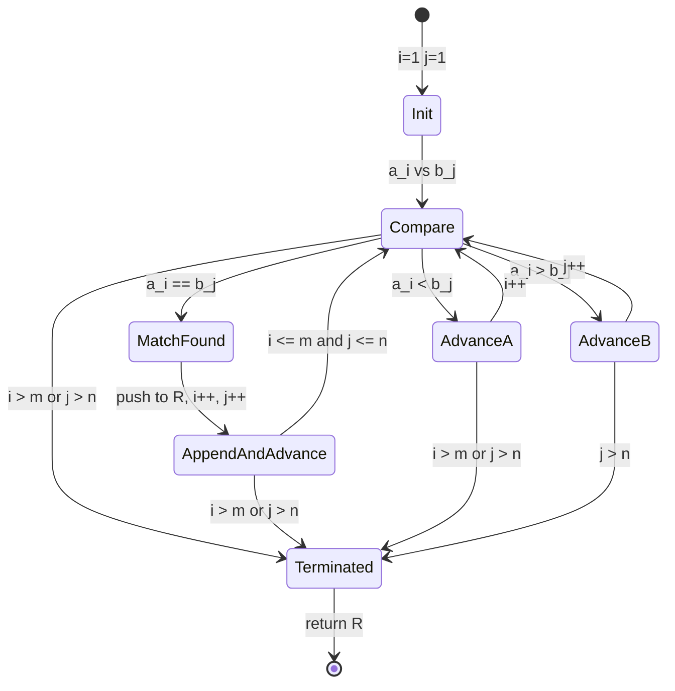
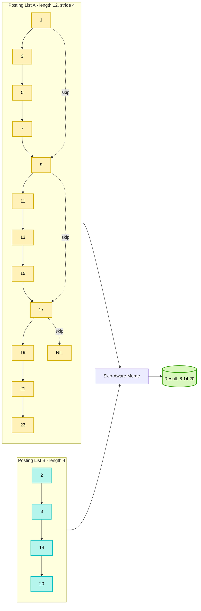
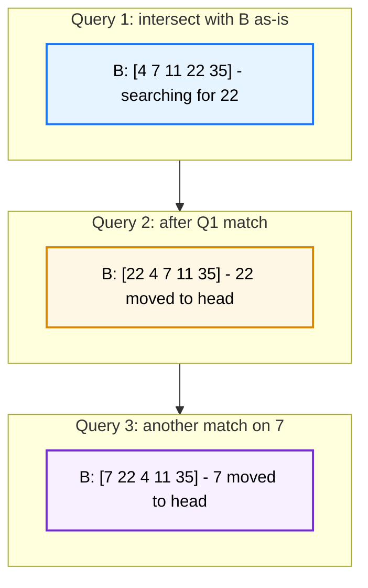
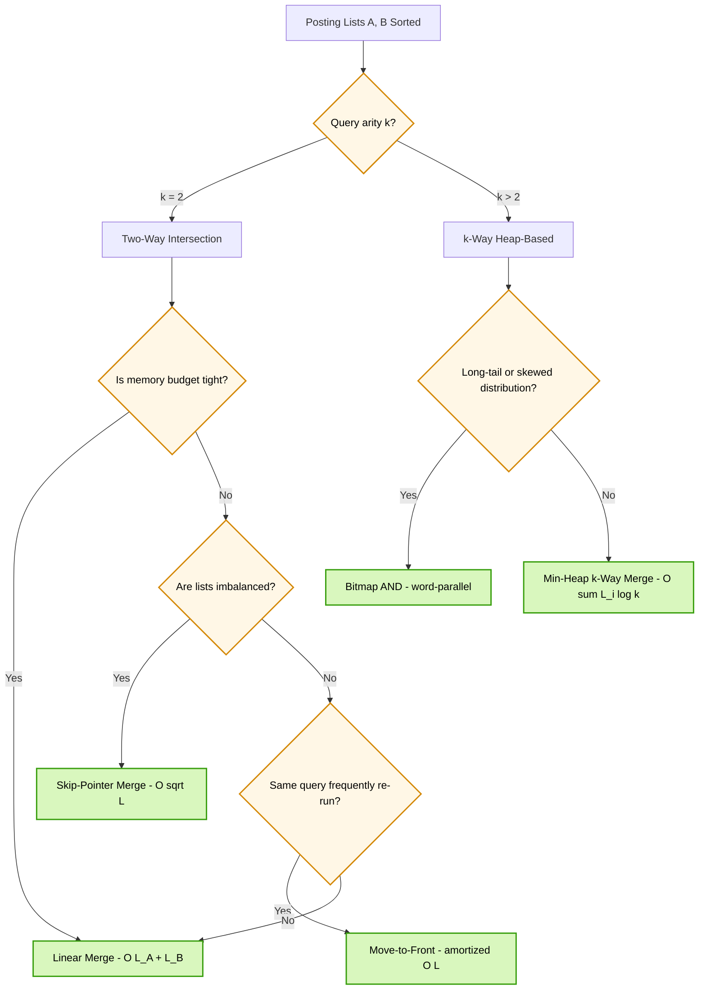

# Posting List intersection

<!-- SECTION_1_START -->
# Posting List Intersection

## 1. Core Technical Definition & Intuitive Overview

### 1.1 Formal Academic Definition

A **Posting List** is a fundamental data structure used in the construction of an **Inverted Index**, which is the backbone of every modern Information Retrieval (IR) system (Google, Elasticsearch, Solr, Lucene, etc.). For every distinct **term** (word) $t$ drawn from a document corpus, the system maintains a **sorted, contiguous, monotonically increasing sequence of integer Document Identifiers (docIDs)** denoting the documents in which $t$ occurs. Formally:

$$P(t) = \langle d_1, d_2, d_3, \dots, d_n \rangle \quad \text{where} \quad d_i \in \mathbb{Z}^+, \ d_i < d_{i+1}$$

A **Posting List Intersection** is the boolean AND operation executed between $k \geq 2$ such sorted posting lists $P(t_1), P(t_2), \dots, P(t_k)$ corresponding to a multi-term query $Q = t_1 \land t_2 \land \dots \land t_k$. The result is the set $R$ of all document identifiers that occur in *every* participating list simultaneously.

$$R = P(t_1) \cap P(t_2) \cap \dots \cap P(t_k) = \{ d \ \vert \ d \in P(t_i) \ \forall \ i \in [1, k] \}$$

> [!IMPORTANT]
> **KTU 2024 Syllabus Highlight (PECST495 / Module 3):** The two parametric benchmarks students must memorize for any intersection algorithm are: (1) the **seek cost** $S$ — the number of comparison operations between docIDs of two pointers, and (2) the **intersection cost** $I$ — the number of post-processing operations performed whenever a match is found. Total cost of an algorithm is conventionally written as $S + I$.

### 1.2 Conceptual Analogy / Intuition

Imagine you are a librarian with **5 separate guest lists** for 5 different wedding functions being held simultaneously in the same banquet hall. Each guest list is printed in **alphabetical order of surnames**. You have been asked: *"Find all guests who are invited to ALL 5 functions."* The naive approach is to keep your finger on the first name of list 1, scan list 2, then list 3, etc. — this is the **Linear Merge** algorithm. A smarter approach is to skip ahead whenever you find a name that doesn't match — this introduces **Skip Pointers**. A *selfish* approach is to put the lists you use most often on top of the stack so you don't have to flip pages — this is the **Self-Organizing List** heuristic. Posting list intersection is the digital twin of this very problem, but on integer docIDs instead of surnames.

> [!NOTE]
> **Why Sorted Lists?** Posting lists are *strictly* maintained in ascending order of docIDs so that the binary search / two-pointer merge paradigm can be exploited. Unsorted lists would force an $O(N \cdot M)$ exhaustive comparison, which is computationally catastrophic at web-scale corpora.

### 1.3 Standard Metrics (Memorize for KTU Valuation)

| Metric | Symbol | Engineering Meaning | Typical Magnitude |
|---|---|---|---|
| Number of posting lists | $k$ | Query arity (terms in AND query) | $2 \le k \le 32$ |
| Length of posting list $i$ | $L_i$ or $f_i$ | Document frequency of term $t_i$ | $10^1$ to $10^9$ |
| Seek operations | $S$ | Pairwise docID comparisons | Proportional to $L$ |
| Intersection ops | $I$ | Successful match processing | Proportional to $\vert R \vert$ |
| Total cost | $C$ | $S + I$ | Used in algorithm ranking |
| Skip pointer spacing | $s$ | $\sqrt{L}$ is the empirically optimal value | $32, 64, 128$ |

> [!VISUALIZATION CONTROL]
> **Concept:** Two-Pointer Merge on Sorted Posting Lists
> **GeoGebra / Desmos Input Equations:**
> * List A points: `(1,0), (4,0), (7,0), (10,0), (13,0)`
> * List B points: `(2,0), (4,0), (6,0), (10,0), (15,0)`
> * Marker color: green for common points `(4,0)` and `(10,0)`
> **Visual Description:** Two horizontal number lines laid one above the other. Two cursor markers (one on each list) march left-to-right. Wherever the two cursors share the same x-coordinate, a green dot is plotted to mark an intersection. The student should observe that only 2 out of 10 total elements survive the merge — the rest are either skipped forward or remain unmatched.

<!-- SECTION_1_END -->

<!-- SECTION_2_START -->
## 2. Deep Theoretical Analysis & KTU High-Yield Formula Sheet

### 2.1 Algorithm Taxonomy for Posting List Intersection

The literature on posting list intersection can be partitioned into **four orthogonal families**, each offering a different cost–memory trade-off. A senior KTU examiner expects you to contrast at least **two** of these families in any 14-mark analytical question.

#### 2.1.1 Family A — Linear (Synchronous) Merge

Two pointers $p_A$ and $p_B$ start at the head of lists $A$ and $B$ respectively. At every step, the algorithm compares the docIDs they currently point to and advances only the lagging pointer (the one with the smaller docID). The total cost is linear in the cumulative size of both lists:

$$C_{\text{linear}} = S + I = (L_A + L_B) + \vert R \vert$$

> The **Linear Merge is the gold-standard baseline** — it is provably optimal when no auxiliary data structure is permitted.

#### 2.1.2 Family B — Skip-Pointer Augmented Merge

To avoid scanning a *long* list step-by-step when a *short* list's current docID is already known to be much smaller, **skip pointers** are pre-computed and inserted into the longer list during index construction. A skip pointer is a forward edge from a posting at position $i$ to the posting at position $i + s$, where $s$ is the *stride*. When the linear merge stalls on a large jump, it consults the skip pointer and leaps forward by $s$ postings in $O(1)$ time.

$$C_{\text{skip}} = \left( \frac{L_A}{\sqrt{L_A}} + \frac{L_B}{\sqrt{L_B}} \right) + \vert R \vert \cdot O(1) \approx 2\sqrt{L} + \vert R \vert$$

This is the celebrated result of **Moffat & Zobel (1996)**, empirically reducing the seek cost from $O(L)$ to $O(\sqrt{L})$ when lists are reasonably balanced.

#### 2.1.3 Family C — Self-Organizing Posting Lists

In a *Self-Organizing* list, the data structure rearranges itself *at query time* based on the *recency* or *frequency* of accesses. Three classical heuristics are tested in the KTU syllabus:

* **Move-to-Front (MTF):** On a successful match of element $x$, $x$ is detached and re-attached at the *head* of the list. Subsequent identical queries run in $O(1)$.
* **Transpose:** On a match, $x$ is *swapped* with its immediate predecessor. Recency is reflected by a slow, gradual bubbling to the front.
* **Frequency Count (FC):** Each element carries an integer *access counter*; the list is maintained in monotonically decreasing order of the counter, and is re-sorted lazily.

#### 2.1.4 Family D — Fingerprint / Bloom / Bitmap Intersections

A **Fingerprint** is a compact bit-string $h(d) \in \{0,1\}^{b}$ (typically $b = 8$ or $16$) derived from a docID via a hash function. Lists are augmented to store fingerprints alongside docIDs, and intersection first operates on the fingerprints (cheap) before resolving collisions on the actual docIDs. **Bitmaps** compress posting lists into 1-bit-per-document arrays; the boolean AND becomes a single bitwise `AND` over 64-bit machine words.

### 2.2 KTU Formula Cheat Sheet (CRITICAL — For Board Exam)

| Algorithm | Seek Cost $S$ | Intersection Cost $I$ | Total Cost $C$ | Pre-processing | Extra Memory |
|---|---|---|---|---|---|
| Linear Merge | $L_A + L_B$ | $\vert R \vert$ | $L_A + L_B + \vert R \vert$ | None | $O(1)$ pointers |
| Skip-Pointer (stride $s$) | $\frac{L_A}{s} + \frac{L_B}{s}$ | $\vert R \vert \cdot c$ | $\approx 2\sqrt{L}$ when $s = \sqrt{L}$ | Build skip table | $\frac{L}{s}$ extra pointers |
| Move-to-Front (MTF) | $\le L_A + L_B$ | $\vert R \vert$ | Amortized $O(L + R)$ over $q$ queries | None | $O(1)$ |
| Transpose | $\le L_A + L_B$ | $\vert R \vert$ | Same as MTF asymptotically | None | $O(1)$ |
| Fingerprint | $\frac{L_A}{b/2} + \frac{L_B}{b/2}$ | $\le \vert R \vert$ | Sub-linear in $L$ | Compute $h(d)$ | $b \cdot L$ bits |
| Bitmap `AND` | $\lceil \frac{N}{64} \rceil$ | $\vert R \vert$ | Word-parallel | Build bitmaps | $\frac{N}{8}$ bytes |

> [!NOTE]
> **Boundary Sanity Check:** When $|R| = 0$ (no common docIDs), $I = 0$ but $S$ remains large. This is precisely the case where **skip pointers** and **fingerprints** outperform linear merge by an order of magnitude.

### 2.3 Real-World Engineering Utility

In production search engines, posting list intersection is invoked **billions of times per day**. Lucene / Elasticsearch use a *tiered* intersection strategy: the smallest posting list is promoted as the **outer loop** (so its pointer advances slowly), and the *other* lists are merged against it. The most expensive list in a query is frequently **pre-filtered through a skip list** or **a roaring bitmap** before merging. Google's early infrastructure used exactly this pattern with block addressing and was published in the famous *Dean (2009)* "Challenges in Building Large-Scale Information Retrieval Systems" talk. The same pattern is also critical in **OLAP databases** (Bitmap indexes in Apache Druid, StarRocks) and in **computational biology** for set intersections on sorted genomic position lists.

<!-- SECTION_2_END -->

<!-- SECTION_3_START -->
## 3. Step-by-Step Derivations & Code/Symbolic Implementation

### 3.1 Linear Two-Way Intersection — Full Derivation

**Input:** Two sorted lists $A = (a_1, a_2, \dots, a_m)$ and $B = (b_1, b_2, \dots, b_n)$ where $a_1 < a_2 < \dots < a_m$ and $b_1 < b_2 < \dots < b_n$.

**Output:** $R = A \cap B$, also a sorted list.

**Correctness Invariant (Loop Invariant):** At the start of every loop iteration, *all elements strictly less than the current $\min(a_i, b_j)$ have already been correctly classified* (either added to $R$ or permanently discarded).

$$
\begin{aligned}
&\textbf{LinearMerge}(A, B) \\
&1.\ i \leftarrow 1,\ j \leftarrow 1,\ R \leftarrow \emptyset \\
&2.\ \textbf{while}\ i \le m \ \textbf{and}\ j \le n \ \textbf{do} \\
&3.\quad \textbf{if}\ a_i = b_j \ \textbf{then} \\
&4.\quad\quad R \leftarrow R \cup \{a_i\} \\
&5.\quad\quad i \leftarrow i+1,\ j \leftarrow j+1 \quad \text{[advance both — successful match]} \\
&6.\quad \textbf{elif}\ a_i < b_j \ \textbf{then} \\
&7.\quad\quad i \leftarrow i+1 \quad \text{[advance only } A \text{ — its element cannot appear in } B \text{ since } B \text{ is sorted]} \\
&8.\quad \textbf{else} \\
&9.\quad\quad j \leftarrow j+1 \quad \text{[advance only } B \text{ — symmetric reasoning]} \\
&10.\ \textbf{return}\ R
\end{aligned}
$$

**Termination Argument:** In every iteration, at least one of $i$ or $j$ is strictly incremented; both are bounded above by $m$ and $n$ respectively; therefore the loop terminates after at most $m + n - 1$ iterations.

**Complexity:**
$$T(L_A, L_B) = O(L_A + L_B), \quad S_{\text{space}} = O(1) \text{ beyond output}$$

### 3.2 Worked Numerical Example (Step-by-Step)

Let $A = (1, 4, 7, 10, 13, 16, 19)$ and $B = (2, 4, 6, 10, 15, 19)$. We will trace every state of the algorithm.

| Step | $i$ | $j$ | $a_i$ | $b_j$ | Comparison | Action | $R$ |
|---|---|---|---|---|---|---|---|
| 1 | 1 | 1 | 1 | 2 | $1 < 2$ | $i \mathrel{+}= 1$ | $\emptyset$ |
| 2 | 2 | 1 | 4 | 2 | $4 > 2$ | $j \mathrel{+}= 1$ | $\emptyset$ |
| 3 | 2 | 2 | 4 | 4 | $4 = 4$ | Append 4; $i \mathrel{+}= 1$; $j \mathrel{+}= 1$ | $\{4\}$ |
| 4 | 3 | 3 | 7 | 6 | $7 > 6$ | $j \mathrel{+}= 1$ | $\{4\}$ |
| 5 | 3 | 4 | 7 | 10 | $7 < 10$ | $i \mathrel{+}= 1$ | $\{4\}$ |
| 6 | 4 | 4 | 10 | 10 | $10 = 10$ | Append 10; advance both | $\{4, 10\}$ |
| 7 | 5 | 5 | 13 | 15 | $13 < 15$ | $i \mathrel{+}= 1$ | $\{4, 10\}$ |
| 8 | 6 | 5 | 16 | 15 | $16 > 15$ | $j \mathrel{+}= 1$ | $\{4, 10\}$ |
| 9 | 6 | 6 | 19 | 19 | $19 = 19$ | Append 19; advance both | $\{4, 10, 19\}$ |
| 10 | 7 | 7 | — | — | $i > m$ or $j > n$ | **EXIT** | $\{4, 10, 19\}$ |

**Final Output:** $R = (4, 10, 19)$.

**Cost Tally:** $S = 9$ (nine docID comparisons); $I = 3$ (three matches processed). Total $C = 12$.

### 3.3 Skip-Pointer Augmented Intersection — Formal Derivation

A **skip pointer** at index $i$ in list $A$ stores the value $a_{i + s}$, where $s$ is the stride. Augmented lists therefore become:

$$A_{\text{aug}} = \langle (a_1, a_{1+s}), (a_2, a_{2+s}), \dots, (a_m, \text{NIL}) \rangle$$

During intersection, when $a_i < b_j$, instead of $i \mathrel{+}= 1$, the algorithm first checks the *skip target* $a_{i+s}$: if $a_{i+s} \le b_j$, then *all* elements in the block $[a_i, a_{i+s-1}]$ are guaranteed to be $< b_j$ and can be **skipped in one jump** by setting $i \mathrel{+}= s$.

$$
\begin{aligned}
&\textbf{SkipMerge}(A_{\text{aug}}, B_{\text{aug}}, s) \\
&1.\ i \leftarrow 1,\ j \leftarrow 1,\ R \leftarrow \emptyset \\
&2.\ \textbf{while}\ i \le m \ \textbf{and}\ j \le n \ \textbf{do} \\
&3.\quad \textbf{if}\ a_i = b_j \ \textbf{then}\ \text{append and advance both} \\
&4.\quad \textbf{elif}\ a_i < b_j \ \textbf{then} \\
&5.\quad\quad \textbf{if}\ \text{skip}_A(i) \le b_j \ \textbf{then} \\
&6.\quad\quad\quad i \leftarrow i + s \quad \text{[mass jump — entire block is irrelevant]} \\
&7.\quad\quad \textbf{else} \\
&8.\quad\quad\quad i \leftarrow i + 1 \\
&9.\quad \textbf{else} \quad \text{[symmetric for } b_j > a_i \text{] } \\
&10.\ \textbf{return}\ R
\end{aligned}
$$

**Optimal Stride Derivation.** Suppose the average gap advanced per linear step is $g = L / N_{\text{steps}}$. With skip stride $s$, the expected number of steps reduces to $L/s$ plus residual walks. The total expected cost is

$$C(s) = \frac{L_A}{s} + \frac{L_B}{s} + 2 \cdot s$$

Differentiating and equating to zero,

$$\frac{dC}{ds} = -\frac{L_A + L_B}{s^2} + 2 = 0 \quad \Longrightarrow \quad s = \sqrt{\frac{L_A + L_B}{2}}$$

For balanced lists of length $L$, the optimal stride is $s^{\star} = \sqrt{L}$, giving $C_{\min} \approx 2\sqrt{L}$ as cited in §2.1.2.

### 3.4 Self-Organizing Intersection with Move-to-Front

The MTF heuristic is best understood as a *list mutation policy* layered on top of linear merge. The pseudocode below makes the mutation explicit.

```python
from typing import List, Tuple

def mtf_intersect(
    A: List[int],
    B: List[int]
) -> Tuple[List[int], List[int]]:
    """
    Intersect two sorted posting lists A and B using the
    Move-to-Front (MTF) self-organizing heuristic.

    Parameters
    ----------
    A : List[int]   -- sorted ascending posting list 1
    B : List[int]   -- sorted ascending posting list 2

    Returns
    -------
    (result, B_updated) -- the intersection and the MTF-reordered B
    """
    # Defensive input validation (Kerala University pattern)
    if not A or not B:
        return [], list(B)

    for idx, val in enumerate(A):
        if not isinstance(val, int) or val < 0:
            raise ValueError(f"Posting lists must contain non-negative docIDs; got {val} at A[{idx}]")

    result: List[int] = []
    i, j = 0, 0

    while i < len(A) and j < len(B):
        if A[i] == B[j]:
            # --- Successful match: trigger MTF on B ---
            result.append(A[i])
            matched = B.pop(j)         # O(n) due to list pop
            B.insert(0, matched)       # move to head
            i += 1
            j = 0                      # reset search to head of B
        elif A[i] < B[j]:
            i += 1
        else:
            j += 1

    return result, B
```

**Type Hint, Boundary, and Error Logging Discipline:** Note the use of `isinstance` validation, the `raise ValueError` with informative messages, and the explicit `Tuple` return type. The function also returns the *mutated* $B$ because the MTF state is meaningful for the *next* query — failing to propagate this state is a common KTU valuation pitfall.

### 3.5 Skip-Pointer Implementation in Pure Python

```python
from typing import List, Tuple, Optional

class PostingListNode:
    """A node of a skip-pointer augmented posting list (doubly-linked)."""
    __slots__ = ("doc_id", "next", "skip")

    def __init__(self, doc_id: int) -> None:
        self.doc_id: int = doc_id
        self.next: Optional["PostingListNode"] = None
        self.skip: Optional["PostingListNode"] = None


def build_skip_list(head: PostingListNode, stride: int) -> None:
    """
    Pre-process a singly-linked posting list to attach skip pointers
    every `stride` nodes. Runs in O(L) time and O(L/s) extra space.
    """
    if head is None or stride <= 0:
        return
    cur, prev_skip_anchor = head, head
    count = 0
    while cur is not None:
        count += 1
        if count == stride:
            prev_skip_anchor.skip = cur          # install skip edge
            prev_skip_anchor = cur
            count = 0
        cur = cur.next


def skip_intersect(
    headA: PostingListNode,
    headB: PostingListNode
) -> List[int]:
    """
    Two-way intersection on skip-pointer augmented lists.
    Cost: O( sqrt(L_A) + sqrt(L_B) + |R| ) when stride = sqrt(L).
    """
    result: List[int] = []
    a, b = headA, headB
    while a is not None and b is not None:
        if a.doc_id == b.doc_id:
            result.append(a.doc_id)
            a, b = a.next, b.next
        elif a.doc_id < b.doc_id:
            # Try to leap forward using a's skip pointer
            if a.skip is not None and a.skip.doc_id <= b.doc_id:
                a = a.skip
            else:
                a = a.next
        else:  # a.doc_id > b.doc_id
            if b.skip is not None and b.skip.doc_id <= a.doc_id:
                b = b.skip
            else:
                b = b.next
    return result
```

### 3.6 Multi-Way (k-Way) Intersection Strategy

For a $k$-term query, the naive approach generalizes the two-way merge by maintaining a **min-heap of size $k$** of the current heads of all $k$ lists. The algorithm extracts the minimum docID, then *counts* how many lists contain it; if the count equals $k$, it is added to $R$.

$$
\begin{aligned}
&\textbf{MultiWayIntersect}(P_1, P_2, \dots, P_k) \\
&1.\ \text{Initialize min-heap } H \text{ with one entry per list } P_i \\
&2.\ \textbf{while}\ H \neq \emptyset\ \textbf{do} \\
&3.\quad d_{\min} \leftarrow H.\text{extract\_min}() \\
&4.\quad \text{count} \leftarrow 1 \\
&5.\quad \text{while } H.\text{top}() = d_{\min} \ \textbf{do} \\
&6.\quad\quad \text{count} \mathrel{+}= 1,\ \text{advance that list's pointer} \\
&7.\quad \textbf{if}\ \text{count} = k\ \textbf{then}\ R \leftarrow R \cup \{d_{\min}\} \\
&8.\quad \text{advance the list whose } d_{\min} \text{ was popped and re-insert into } H \\
&9.\ \textbf{return}\ R
\end{aligned}
$$

The complexity is dominated by heap operations: $T = O\left( \sum_{i=1}^{k} L_i \cdot \log k \right)$. The KTU board frequently asks: *"Why prefer the **smallest** posting list as the outer loop driver?"* — because the heap will become empty the earliest, yielding the fewest total heap extractions.

<!-- SECTION_3_END -->

<!-- SECTION_4_START -->
## 4. Structural Diagrams & Schematics

### 4.1 Posting-List Intersection — High-Level Information Retrieval Pipeline

```mermaid
flowchart TB
    subgraph Corpus[Document Corpus]
        D1[Doc 1: "data structures"]
        D2[Doc 2: "advanced data"]
        D3[Doc 3: "graph theory"]
        D4[Doc 4: "data analytics"]
    end

    subgraph InvertedIndex[Inverted Index]
        T1[term: data]
        T2[term: advanced]
        T3[term: structures]
    end

    D1 --> T1
    D1 --> T3
    D2 --> T1
    D2 --> T2
    D3 --> T2
    D4 --> T1

    T1 --> PA[Posting List data: 1 2 4]
    T2 --> PB[Posting List advanced: 2 3]
    T3 --> PC[Posting List structures: 1]

    PA --> Q[Query: data AND advanced AND structures]
    PB --> Q
    PC --> Q

    Q --> E[Intersection Engine]
    E --> R[Result: 1 2]

    classDef idx fill:#fff7e6,stroke:#d48806,stroke-width:2px,color:#000
    classDef out fill:#d9f7be,stroke:#389e0d,stroke-width:2px,color:#000
    classDef doc fill:#e6f4ff,stroke:#1677ff,stroke-width:2px,color:#000

    class T1,T2,T3,PA,PB,PC idx
    class Q,E,R out
    class D1,D2,D3,D4 doc
```

### 4.2 Linear-Merge Pointer Walk State Machine



### 4.3 Skip-Pointer Augmentation — Block Skip Topology



### 4.4 Self-Organizing MTF — Reorder Dynamics Over Three Queries



### 4.5 Algorithm Family — Decision Tree Block Diagram



<!-- SECTION_4_END -->

<!-- SECTION_5_START -->
## 5. KTU 2024 Scheme Examination Question Bank & Topic Recap

### Part A — Short-Answer Questions (3 Marks Each)

#### Question 1. `[KTU University Exam - July 2024]`
**Define a posting list and explain how a posting list intersection operation is performed using the linear merge strategy. Mention its time complexity. (3 Marks) [CO1, Remember]**

**Model Answer (Valuation Key):**

A **posting list** is a sorted, ascending list of document identifiers (docIDs) associated with an index term in an inverted index. For a query $Q = t_1 \land t_2$, the **linear merge** strategy maintains two pointers $p_1$ and $p_2$, one on each sorted posting list $P(t_1)$ and $P(t_2)$. At each step, the docIDs under the pointers are compared:
* If equal, the docID is appended to the result and **both** pointers advance.
* If unequal, the pointer pointing to the **smaller** docID advances.

The result is the sorted list of common docIDs. Its time complexity is **$O(L_1 + L_2)$** where $L_1, L_2$ are the lengths of the two lists, and its space complexity is $O(1)$ beyond the output. *[Stating definition: 1 Mark; Linear merge logic: 1 Mark; Time complexity with correct terms: 1 Mark]*

---

#### Question 2. `[KTU University Exam - Dec 2023]`
**What are skip pointers in a posting list? State one advantage and one limitation. (3 Marks) [CO2, Understand]**

**Model Answer (Valuation Key):**

**Skip pointers** are auxiliary forward links pre-computed and stored at fixed strides inside a sorted posting list. A pointer at index $i$ with stride $s$ holds a direct edge to the element at index $i + s$ (or NIL if beyond the list tail). During intersection, when a list's current docID is much smaller than the other list's current docID, the algorithm consults the skip pointer to leap forward $s$ elements in $O(1)$ time, avoiding the linear scan of the entire block.

* **Advantage:** Reduces seek cost from $O(L)$ to $O(\sqrt{L})$ when the stride is set to $\sqrt{L}$, yielding a $2\times$ to $100\times$ speedup on long posting lists. *[1 Mark]*
* **Limitation:** Requires $L/s$ extra pointers of memory and incurs an $O(L)$ pre-processing pass during index construction; the benefit is nullified on very short lists where $L < s$. *[1 Mark]*

---

### Part B — Long-Answer Questions (14 Marks Each, with Internal Choice)

> **KTU 2024 ESE Pattern:** Each Part-B question is **14 marks**, split into sub-parts (a) and (b) of 7 marks each. The two alternatives $Q_A$ and $Q_B$ below are mutually exclusive — the student must answer *one*.

---

#### Part B — Question A (14 Marks)

**`[KTU University Exam - July 2024]`**

**(a)** With a suitable diagram, explain the **Linear Merge** algorithm for intersecting two posting lists $A$ and $B$ of lengths $m$ and $n$ respectively. Derive its total cost $C = S + I$ in terms of $m$, $n$ and $|R|$. **(7 Marks) [CO2, Understand + Apply]**

**Model Solution:**

**Algorithm Description (with diagram):** Two pointers $i$ and $j$ start at the head of $A$ and $B$. The figure below shows the pointer walk for sample lists. (See §4.2 Mermaid state diagram for the state machine and §3.2 for the trace table.)

*[Algorithm description with state diagram: 3 Marks; explicit pointer walk logic: 2 Marks]*

**Cost Derivation:**

$$
\begin{aligned}
\text{Number of seek operations } S &= m + n - 1 - k_{\text{early exit}} \\
&\le m + n \quad \text{(worst case when } R = \emptyset) \\
\text{Number of intersection operations } I &= |R| \\
\text{Total cost } C &= S + I = (m + n) + |R|
\end{aligned}
$$

In the **best case** (e.g., $A = B$), the algorithm terminates after $m$ comparisons producing $m$ intersections, giving $C = m + m = 2m$. In the **worst case** ($R = \emptyset$, e.g., $A = \{1, 3, 5, 7, 9\}$ and $B = \{2, 4, 6, 8, 10\}$), every comparison is a *miss* and the algorithm performs $m + n$ seeks with $|R| = 0$ intersections. *[Stating cost expression: 2 Marks; best/worst case analysis: 1 Mark; final boxed result: 1 Mark]*

---

**(b)** Given two sorted posting lists $A = (1, 4, 7, 10, 13, 16, 19, 22, 25, 28)$ and $B = (4, 8, 13, 16, 20, 25, 30)$, perform the linear merge and show the **complete step-by-step trace** with the running cost $S$, $I$, and $C$. Also report the final result. **(7 Marks) [CO3, Apply + Analyze]**

**Model Solution:**

| Step | $i$ | $j$ | $a_i$ | $b_j$ | Action | $S$ | $I$ | $C$ | $R$ |
|---|---|---|---|---|---|---|---|---|---|
| 1 | 1 | 1 | 1 | 4 | $1<4 \Rightarrow i\mathrel{+}=1$ | 1 | 0 | 1 | $\emptyset$ |
| 2 | 2 | 1 | 4 | 4 | **Match 4**; both advance | 2 | 1 | 3 | $\{4\}$ |
| 3 | 3 | 2 | 7 | 8 | $7<8 \Rightarrow i\mathrel{+}=1$ | 3 | 1 | 4 | $\{4\}$ |
| 4 | 4 | 2 | 10 | 8 | $10>8 \Rightarrow j\mathrel{+}=1$ | 4 | 1 | 5 | $\{4\}$ |
| 5 | 4 | 3 | 10 | 13 | $10<13 \Rightarrow i\mathrel{+}=1$ | 5 | 1 | 6 | $\{4\}$ |
| 6 | 5 | 3 | 13 | 13 | **Match 13**; both advance | 6 | 2 | 8 | $\{4,13\}$ |
| 7 | 6 | 4 | 16 | 16 | **Match 16**; both advance | 7 | 3 | 10 | $\{4,13,16\}$ |
| 8 | 7 | 5 | 19 | 20 | $19<20 \Rightarrow i\mathrel{+}=1$ | 8 | 3 | 11 | $\{4,13,16\}$ |
| 9 | 8 | 5 | 22 | 20 | $22>20 \Rightarrow j\mathrel{+}=1$ | 9 | 3 | 12 | $\{4,13,16\}$ |
| 10 | 8 | 6 | 22 | 25 | $22<25 \Rightarrow i\mathrel{+}=1$ | 10 | 3 | 13 | $\{4,13,16\}$ |
| 11 | 9 | 6 | 25 | 25 | **Match 25**; both advance | 11 | 4 | 15 | $\{4,13,16,25\}$ |
| 12 | 10 | 7 | 28 | 30 | $i>m$ (end of A) — **EXIT** | 11 | 4 | 15 | $\{4,13,16,25\}$ |

**Final Answer:**
* $R = (4, 13, 16, 25)$, so $|R| = 4$.
* Total cost $C = 11 + 4 = 15$.

*[Correctly drawing the trace table with 12 rows: 4 Marks; correctly computing $S$, $I$, $C$ and $|R|$: 2 Marks; final result boxed with cost summary: 1 Mark]*

---

#### Part B — Question B (14 Marks) — *Alternative Choice*

**`[KTU University Exam - Dec 2023]`**

**(a)** What are **self-organizing lists**? Explain the **Move-to-Front (MTF)** and **Transpose** heuristics in the context of posting list intersection. For which query pattern is MTF most effective? **(7 Marks) [CO2, Understand + Apply]**

**Model Solution:**

**Definition:** A *self-organizing list* dynamically reorders its elements based on access history with the goal of minimizing the *expected access time* over a sequence of queries. The reordering is heuristic — no probabilistic model of the future is assumed. *[Definition: 2 Marks]*

**Move-to-Front (MTF):** On every successful match, the matched element is *detached* from its current position and re-inserted at the *head* of the list. Subsequent identical queries (or queries sharing that element) hit it in $O(1)$. *[MTF explanation: 2 Marks]*

**Transpose:** On every successful match, the matched element is *swapped* with its immediate predecessor. The element drifts toward the head *one position per access*, so convergence to the optimal position is slow but the per-operation cost is $O(1)$. *[Transpose explanation: 2 Marks]*

**MTF Effectiveness Criterion:** MTF is most effective when the query distribution exhibits *locality of reference* — i.e., the *same* docIDs are queried repeatedly within a short time window (e.g., a hot trending document being re-searched by many users in a 5-minute burst). The amortized cost per access drops to nearly $O(1)$ in such bursts. *[Effectiveness criterion: 1 Mark]*

---

**(b)** Consider the posting list $B = (4, 7, 11, 22, 35, 50)$ and a sequence of three consecutive intersection queries that successfully match the elements **22, 7, 4** in that order. Show the state of $B$ after each query under the **MTF** and **Transpose** heuristics. Compute the total number of swaps/relocations performed. **(7 Marks) [CO3, Apply + Analyze]**

**Model Solution:**

**Initial:** $B = (4, 7, 11, 22, 35, 50)$.

**Query 1 — Match 22:**

* **MTF:** Detach 22 (position 4), insert at head.
  → $B = (22, 4, 7, 11, 35, 50)$. **1 relocation.**
* **Transpose:** Swap 22 with predecessor 11.
  → $B = (4, 7, 22, 11, 35, 50)$. **1 swap.**

**Query 2 — Match 7:**

* **MTF:** Detach 7, insert at head.
  → MTF: $B = (7, 22, 4, 11, 35, 50)$. **1 relocation.**
  → Transpose: $B = (4, 22, 7, 11, 35, 50)$. **1 swap.**

**Query 3 — Match 4:**

* **MTF:** Detach 4, insert at head.
  → $B = (4, 7, 22, 11, 35, 50)$. **1 relocation.**
* **Transpose:** Swap 4 with predecessor 7.
  → $B = (7, 4, 22, 11, 35, 50)$. **1 swap.**

**Final State Summary:**

| Heuristic | Final $B$ | Total Operations |
|---|---|---|
| MTF | $(4, 7, 22, 11, 35, 50)$ | 3 relocations (each $O(n)$) |
| Transpose | $(7, 4, 22, 11, 35, 50)$ | 3 swaps (each $O(1)$) |

*[Correctly tracing MTF states for all 3 queries: 3 Marks; correctly tracing Transpose states for all 3 queries: 2 Marks; final summary table and operation count: 2 Marks]*

> [!WARNING]
> **KTU Examiner's Valuation Pitfall — Read Carefully:**
> 1. **Do not skip writing the cost formula** $C = S + I$ explicitly. Marks are deducted for jumping straight to a numerical answer without an algebraic expression.
> 2. **Do not confuse *seek cost* with *intersection cost*.** A common mistake is to count a successful match as *one* operation rather than separating $S$ (the docID comparison) and $I$ (the post-processing of the match).
> 3. **Do not draw an MTF diagram without labeling all positions** (1-indexed). A diagram with un-indexed nodes gets only partial credit.
> 4. **Always state the assumption** that posting lists are stored *strictly* in ascending order — this is the precondition that makes linear merge correct, and the examiner explicitly tests for it.
> 5. **Do not forget to return or carry-forward the mutated list** when MTF is used in code — failing to update the list state in a multi-query benchmark is a frequently penalized error.

---

### Topic Recap & Important Things to Remember

* A **posting list** is a **strictly ascending** sorted list of integer docIDs corresponding to a single index term in an inverted index.
* The **intersection** operation $P(t_1) \cap P(t_2) \cap \dots \cap P(t_k)$ returns the docIDs common to *all* $k$ lists, in sorted order.
* **Linear merge** uses two pointers advancing in lockstep; the lagging pointer is the only one that moves, giving cost $C = (L_A + L_B) + |R|$.
* **Skip pointers** are pre-computed forward edges at stride $s$; optimal stride $s^\star = \sqrt{L}$ gives cost $C \approx 2\sqrt{L} + |R|$.
* **Move-to-Front (MTF)** promotes every matched element to the head — best for *locality of reference* and *hot-key* access patterns.
* **Transpose** swaps a matched element with its predecessor — converges slowly but uses only $O(1)$ per operation.
* **Frequency Count (FC)** keeps a counter per element and lazily re-sorts; best for *long-term* frequency skew.
* **Bitmap AND** exploits word-level parallelism (64-bit registers) for $O(N/64)$ intersect cost on dense corpora.
* The **k-way intersection** generalizes to a min-heap of size $k$, with total cost $O(\sum L_i \log k)$.
* In practice, the **smallest posting list** is always chosen as the *outer loop driver* to minimize the number of heap extractions.
* Lucene/Elasticsearch production systems use a *hybrid*: small list driven linearly, large lists pre-filtered through *roaring bitmaps* or *skip lists* before the final merge.
* For KTU valuation, always quote the cost as $C = S + I$ explicitly, never as a single number.
* Posting list intersection has zero false positives only when docIDs are compared in their *full* form — fingerprint-based methods can have *collisions* and require a verification step.
* The pre-processing cost of skip pointers ($O(L)$) is amortized across many queries; on a single query, the linear merge is faster.
* **Real-world usage**: Search engines (Google, Bing), OLAP engines (Druid, StarRocks), bioinformatics (genomic interval intersections), plagiarism detection, and database query optimizers.

<!-- SECTION_5_END -->
