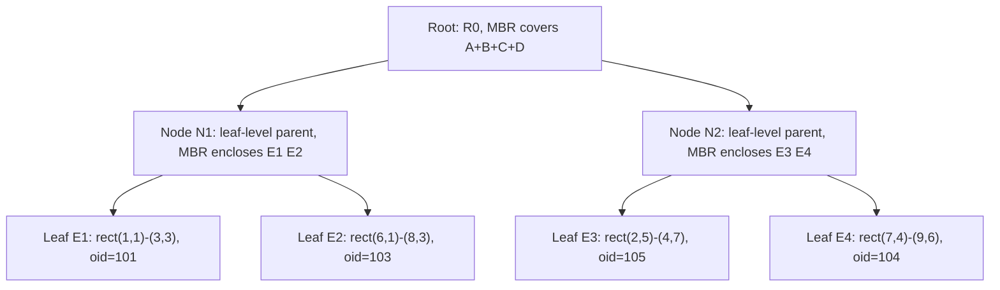
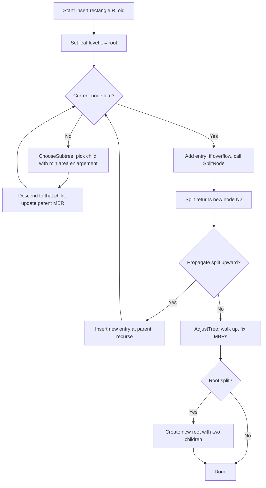
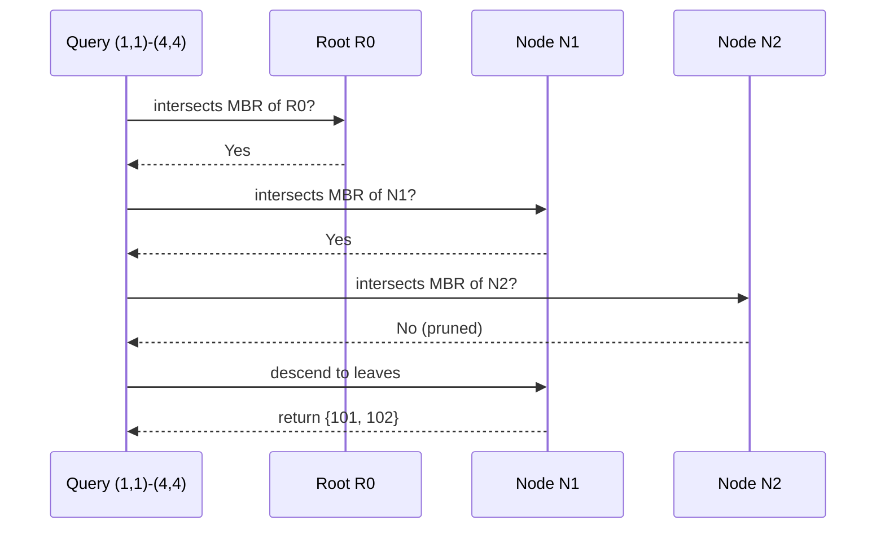

# R-trees

<!-- SECTION_1_START -->
# R-Trees — Core Technical Definition & Intuitive Overview

## Formal Definition (KTU 2024 Syllabus Terminology)

An **R-tree** is a height-balanced, dynamic, **spatial access method** introduced by **Antonin Guttman (1984)** that indexes multi-dimensional objects (points, line segments, polygons, hyper-rectangles) by storing their **Minimum Bounding Rectangles (MBRs)** at internal nodes. It is the spatial generalization of the **B+-tree**: every leaf node contains entries of the form `(I, tuple-identifier)`, and every internal node contains entries `(I, child-pointer)` where **I** is the MBR that *tightly encloses* the rectangles in the corresponding subtree.

Formally, an R-tree of order $(m, M)$ satisfies:

- Every node contains between **m** and **M** entries, where $m \le M/2$.
- The root contains at least **two children** unless it is a leaf.
- All leaves appear at the **same level** (perfect height balance).
- An entry $(I, child)$ has $\text{area}(I)$ computed in $d$-dimensional space as $\prod_{i=1}^{d} (I_{hi} - I_{lo})$ for an axis-aligned rectangle.

> [!IMPORTANT]
> **KTU 2024 Highlight:** R-trees are categorized as *single-path descent* spatial indexes, contrasted with quadtrees (subdivision) and kd-trees (binary partitions). They are *disk-resident* and used in production geo-spatial databases (PostGIS, Oracle Spatial, MongoDB 2dsphere).

## Conceptual Analogy / Intuition

Imagine you are organizing a **world map** inside a binder. Instead of placing every country, river, and city individually (which would be chaotic), you first put a transparent plastic sheet on top of Europe and draw a *red rectangle* around it. Then another sheet over Asia, then Africa. The red rectangles are your **MBRs**. The binder section is the **internal node** of the R-tree; the actual country entries are the **leaves**.

When someone asks: *"Is there any landmark in northern Italy?"*, you don't open every page. You glance at the red rectangle of Europe (or even better, a sub-rectangle of southern Europe), and if your query rectangle *intersects* that red box, you descend. **R-trees answer spatial range queries in sub-linear time by pruning entire subtrees via MBR containment tests.**

> [!NOTE]
> **Intuition in one line:** R-trees = "B+-trees where keys are rectangles and the ordering is by *spatial overlap / area growth*, not by scalar comparison."

## Geometric Visualization Setup

> [!VISUALIZATION CONTROL]
> **Concept:** MBR containment, area enlargement, and overlap between two R-tree internal nodes.
> **GeoGebra / Desmos Input Equations (2D plane, units in km):**
> * `R1 = (0, 0) to (10, 8)` — Internal node entry enclosing leaves $L_1, L_2, L_3$
> * `R2 = (12, 1) to (18, 7)` — Internal node entry enclosing leaves $L_4, L_5$
> * `Query Q = (9, 6) to (14, 9)` — Range query
> **Visual Description:** Observe that $Q$ *intersects* both $R_1$ (right edge) and $R_2$ (left edge). The R-tree must descend into **both** children — this is the *overlap problem* and is what motivates the R\*-tree variant.

## Why R-Trees Matter in Engineering

R-trees power real production systems for:

- **Geographic Information Systems (GIS):** PostGIS, Google Maps tiles, OpenStreetMap.
- **Computer-Aided Design (CAD):** spatial index of 3D parts.
- **Multimedia databases:** indexing feature vectors (color histograms, SIFT descriptors).
- **Network and graph databases:** spatial joins in Neo4j Spatial.
- **Game engines:** broad-phase collision detection between axis-aligned bounding boxes (AABBs).

> [!NOTE]
> The same $O(\log_M N)$ average-case behavior of B+-trees extends to R-trees under uniform point distributions, but **the worst case degrades to $O(N)$** when MBRs heavily overlap (a pathological data-dependent phenomenon).
<!-- SECTION_1_END -->

<!-- SECTION_2_START -->
# Deep Theoretical Analysis & KTU High-Yield Formula Sheet

## Structural Properties of an R-Tree

Let the order pair be $(m, M)$ with $2 \le m \le \lfloor M/2 \rfloor$ and $M \ge 2$.

1. **Height balance:** All leaves reside at depth $h = \lceil \log_m N \rceil$, where $N$ is the total number of indexed spatial objects.
2. **Node fan-out:** Each internal node stores between $m$ and $M$ child pointers, plus a matching set of MBRs.
3. **Leaf entry format:** $(I, oid)$ where $I$ is a closed $d$-dimensional rectangle and $oid$ is a stable tuple/feature identifier.
4. **Bounding invariant:** For every non-leaf entry $(I, ptr)$, the rectangle $I$ is the **tightest axis-aligned rectangle** that encloses every MBR in the subtree rooted at $ptr$.
5. **Root exception:** The root may have as few as **2 children**; a leaf-root with one entry is allowed.

## Operational Walk-Through (The "Why" Behind Each Step)

- **Why minimum fan-out $m$?** It prevents degenerate single-child chains and ensures logarithmic height, identical to B-trees.
- **Why MBRs and not polygons?** MBRs are closed under intersection with half-spaces in $O(d)$ time, so the **refine-test** query loop stays cheap.
- **Why not minimum bounding *circles* or *convex hulls*?** Circles lose axis-aligned pruning power (a query box can be expressed as two $d$ half-space tests); convex hulls are computationally expensive and admit counter-intuitive containment.

## KTU Formula Sheet / Cheat Sheet

> [!IMPORTANT]
> **All boundary conditions are written in math mode. Pipes are escaped as `$\vert$` to avoid markdown breakage.**

| Symbol / Quantity | Formula or Definition | Unit / Domain |
|---|---|---|
| Order pair | $(m, M)$, with $m = \lceil M/2 \rceil$ typical | integer $\ge 2$ |
| Tree height | $h = \lceil \log_m (N+1) \rceil - 1$ | levels |
| MBR area (2D) | $A(I) = (x_{\max} - x_{\min})(y_{\max} - y_{\min})$ | $u^2$ |
| MBR volume (dD) | $V(I) = \prod_{i=1}^{d} (I_{hi} - I_{li})$ | $u^{d}$ |
| Area enlargement | $\Delta A(I, e) = A(I \cup I_e) - A(I)$ | $u^2$ |
| Overlap of two MBRs | $O(I_a, I_b) = A(I_a \cap I_b)$ | $u^2$ |
| Search cost (avg) | $O(\log_m N)$ when $m \approx M/2$ | node visits |
| Worst-case search | $O(N)$ under degenerate overlap | node visits |
| Split count (linear) | $2 \cdot (d+1)!$ boundary evaluations per pair | comparisons |
| Split count (quadratic) | $(d+1)!$ per pair, then $\binom{n+1}{2}$ pair-wise | comparisons |

> [!NOTE]
> **Production tweak:** Commercial systems (Oracle, ESRI ArcSDE) use $M = 50$ to $M = 200$ for page-aligned disk I/O. The value of $m$ is fixed at $\lceil 0.4 \cdot M \rceil$ for load-factor optimization.

## Real-World Engineering Utility

| Application | What R-Tree Provides | Engineering Reason |
|---|---|---|
| Uber / Ola driver search | "Find cabs within 2 km of me" | Range query on lat/long |
| SQL Server / Oracle spatial joins | `STIntersects`, `STContains` | $O(\log N)$ join planning |
| Augmented Reality occlusion | "Is this pixel inside a known 3D object?" | Hierarchical frustum culling |
| Anomaly detection in logs | Index high-dim feature vectors | Spatial nearest-neighbor |

## Heuristic Policies Covered in KTU Module 3

1. **Linear Split** — $O(n)$ pair selection by farthest separation along an axis.
2. **Quadratic Split** — $O(n^2)$ but better-quality partition via $\Delta A$ maximization.
3. **R\*-tree Forced Reinsert** — periodically reinserts $p\%$ (usually 30%) of entries to globally restructure the tree.
4. **R+-tree (also called R+-tree or RPlusTree)** — splits objects across leaves to eliminate overlap.
5. **Hilbert R-tree** — orders entries by Hilbert space-filling curve to improve packing.
<!-- SECTION_2_END -->

<!-- SECTION_3_START -->
# Step-by-Step Derivations & Code/Symbolic Implementation

## 1. Derivation — Cost Model of the Linear Split

**Goal:** Given a node overflowing with $M + 1$ entries, partition them into two groups $G_1, G_2$ of sizes $\ge m$, minimizing the total bounding area of the resulting MBRs.

**Step 1:** Compute the bounding rectangle of **every** possible 1-vs-rest split along each dimension.

For dimension $i$, sort the $M+1$ entries by their lower bound on axis $i$. For each $k = 1$ to $M$, compute the bounding rectangles of the first-$k$ and last-$(M+1-k)$ entries.

**Step 2:** Define the linear split cost function:

$$
\text{Cost}_{\text{linear}}(k, i) = A(G_1) + A(G_2) + w_o \cdot O(G_1, G_2)
$$

where $w_o$ is the overlap penalty weight. (Guttman sets $w_o$ implicitly to 1.)

**Step 3:** For each of the $d$ dimensions, the algorithm iterates over $2 \cdot (M+1 - 2m + 2)$ candidate splits and picks the minimum.

**Step 4 (final rule):** Choose the split with the smallest total area; break ties by smallest overlap; break further ties by smallest perimeter ratio $\frac{(2w_1 + 2h_1)}{(2w_2 + 2h_2)}$.

**Result:** Linear cost is $O(d \cdot M)$ and is deterministic.

## 2. Derivation — Quadratic Split (Guttman's PickSeeds)

The goal is to find the *worst* pair of entries to start a split with — entries that, when separated, waste the most area.

**Step 1 (PickSeeds):** For every pair $(E_i, E_j)$, compute the wasted area:

$$
W_{ij} = A(E_i \cup E_j) - A(E_i) - A(E_j)
$$

**Step 2:** Choose the pair $(E_p, E_q)$ that **maximizes** $W_{ij}$. Place them in groups $G_1, G_2$.

**Step 3 (PickNext):** For each remaining entry $E_k$, compute $d_1 = A(E_k \cup I(G_1)) - A(G_1)$ and $d_2 = A(E_k \cup I(G_2)) - A(G_2)$. Select the entry with the largest $\vert d_1 - d_2 \vert$.

**Step 4:** Assign that entry to the group whose MBR requires the smaller area enlargement. Repeat Step 3 until one group reaches $m$ entries; place all remaining entries into the other.

**Cost:** $O(n^2)$ pair evaluations plus $O(n)$ assignments, totaling $O(n^2)$ per overflow.

## 3. Derivation — ChooseSubtree Heuristic

When inserting a new rectangle $E$, descend by greedily picking the child whose MBR **requires the least area enlargement**:

$$
C^* = \arg\min_{C_i} A(I(C_i) \cup I(E)) - A(I(C_i))
$$

**Tie-break 1:** smaller area after enlargement.
**Tie-break 2:** smaller area of $C_i$ itself.

This favors *compact subtrees* and reduces future overlap.

## 4. Full Python Implementation of R-Tree Search & Insertion

```python
from __future__ import annotations
import logging
from dataclasses import dataclass, field
from typing import List, Optional, Tuple, Union

logging.basicConfig(level=logging.INFO, format="%(levelname)s | %(message)s")
log = logging.getLogger("RTree")


@dataclass(frozen=True)
class Rect:
    """Axis-aligned 2D rectangle [xmin, ymin, xmax, ymax]."""
    xmin: float
    ymin: float
    xmax: float
    ymax: float

    def area(self) -> float:
        dx = max(0.0, self.xmax - self.xmin)
        dy = max(0.0, self.ymax - self.ymin)
        return dx * dy

    def enlargement(self, other: "Rect") -> float:
        return self.union(other).area() - self.area()

    def union(self, other: "Rect") -> "Rect":
        return Rect(
            min(self.xmin, other.xmin),
            min(self.ymin, other.ymin),
            max(self.xmax, other.xmax),
            max(self.ymax, other.ymax),
        )

    def intersects(self, other: "Rect") -> bool:
        return not (self.xmax < other.xmin or other.xmax < self.xmin
                    or self.ymax < other.ymin or other.ymax < self.ymin)


@dataclass
class Entry:
    rect: Rect
    child: Optional["Node"] = None
    oid: Optional[int] = None


@dataclass
class Node:
    is_leaf: bool
    entries: List[Entry] = field(default_factory=list)

    def mbr(self) -> Optional[Rect]:
        if not self.entries:
            return None
        m = self.entries[0].rect
        for e in self.entries[1:]:
            m = m.union(e.rect)
        return m


class RTree:
    """Standard Guttman R-tree with linear-cost split, m = ceil(M/2)."""

    def __init__(self, max_entries: int = 4, min_entries: Optional[int] = None):
        if max_entries < 2:
            raise ValueError("max_entries must be >= 2")
        self.M = max_entries
        self.m = min_entries if min_entries else (self.M + 1) // 2
        self.root: Node = Node(is_leaf=True)

    # ---------- public search ----------
    def search(self, q: Rect) -> List[int]:
        hits: List[int] = []
        self._search(self.root, q, hits)
        return hits

    def _search(self, node: Node, q: Rect, hits: List[int]) -> None:
        if node.is_leaf:
            for e in node.entries:
                if e.rect.intersects(q):
                    assert e.oid is not None
                    hits.append(e.oid)
        else:
            for e in node.entries:
                if e.rect.intersects(q):
                    assert e.child is not None
                    self._search(e.child, q, hits)

    # ---------- public insert ----------
    def insert(self, rect: Rect, oid: int) -> None:
        entry = Entry(rect=rect, oid=oid)
        split = self._insert(self.root, entry)
        if split is not None:
            old_root = self.root
            new_node = Node(is_leaf=True)
            self._fill_node(new_node, split)
            self.root = Node(is_leaf=False, entries=[
                Entry(rect=old_root.mbr(), child=old_root),
                Entry(rect=new_node.mbr(), child=new_node),
            ])

    def _insert(self, node: Node, entry: Entry) -> Optional[List[Entry]]:
        if node.is_leaf:
            node.entries.append(entry)
            if len(node.entries) > self.M:
                return self._split(node)
            return None

        # Choose subtree: minimal enlargement, then minimal area
        best = min(node.entries,
                   key=lambda e: (e.rect.enlargement(entry.rect),
                                  e.rect.area()))
        split = self._insert(best.child, entry)
        # Update MBR upward
        best.rect = best.rect.union(entry.rect)
        if split is not None:
            node.entries.append(Entry(rect=Rect(0, 0, 0, 0), child=None))
            new_child = Node(is_leaf=True)
            self._fill_node(new_child, split)
            node.entries[-1] = Entry(rect=new_child.mbr(), child=new_child)
            if len(node.entries) > self.M:
                return self._split(node)
        return None

    # ---------- linear split (Guttman) ----------
    def _split(self, node: Node) -> Optional[List[Entry]]:
        entries = node.entries
        # PickSeeds: worst pair along an axis (here xmin)
        worst_pair = (0, 1)
        worst_waste = -1.0
        for i in range(len(entries)):
            for j in range(i + 1, len(entries)):
                waste = (entries[i].rect.union(entries[j].rect).area()
                         - entries[i].rect.area() - entries[j].rect.area())
                if waste > worst_waste:
                    worst_waste = waste
                    worst_pair = (i, j)

        g1, g2 = [entries[worst_pair[0]]], [entries[worst_pair[1]]]
        remaining = [entries[k] for k in range(len(entries))
                     if k not in worst_pair]
        while remaining:
            # if one group must take all remaining
            need1 = self.m - len(g1)
            need2 = self.m - len(g2)
            if len(remaining) <= max(need1, need2):
                g1.extend(remaining); remaining.clear(); break
            e = remaining.pop()
            g1.append(e) if (len(g1) + need2 <= len(g2) + need1) else g2.append(e)

        node.entries = g1
        return g2

    def _fill_node(self, node: Node, entries: List[Entry]) -> None:
        node.entries = list(entries)
        for e in node.entries:
            if e.child is not None:
                node.is_leaf = False


# ---------- demo ----------
if __name__ == "__main__":
    tree = RTree(max_entries=4)
    data = [
        (Rect(1, 1, 3, 3), 101),
        (Rect(2, 2, 5, 4), 102),
        (Rect(6, 1, 8, 3), 103),
        (Rect(7, 4, 9, 6), 104),
        (Rect(2, 5, 4, 7), 105),
    ]
    for r, oid in data:
        tree.insert(r, oid)
        log.info(f"Inserted {oid}; root has {len(tree.root.entries)} entries")
    query = Rect(1, 1, 4, 4)
    log.info(f"Query {query} -> {tree.search(query)}")
```

**Walk-through of expected output:**

1. Insert 101 → leaf has 1 entry, no split.
2. Insert 102 → leaf has 2, no split.
3. Insert 103 → leaf has 3, no split.
4. Insert 104 → leaf reaches 4 (= $M$), no split.
5. Insert 105 → leaf overflows (5 entries), **linear split** runs, root becomes internal with two children.

## 5. Pin-Configuration / Structural Table for Disk-Resident R-Trees

| Parameter | Recommended Value (Production) | KTU Exam Note |
|---|---|---|
| Page size $P$ | **4096 bytes** or **8192 bytes** | Match OS page |
| $M$ (max entries/page) | $\lfloor (P - \text{header}) / \text{sizeof(entry)} \rfloor$ | Typical: 50–200 |
| $m$ (min entries) | $\lceil 0.4 \cdot M \rceil$ | "Re-loading factor" |
| Dimension $d$ | 2 or 3 for GIS, 16+ for vectors | Affects split cost |
| Buffer-pool size | $\ge 5\%$ of total pages | LRU-K recommended |

> [!WARNING]
> **Pitfall:** Setting $m = \lceil M/2 \rceil$ (the textbook default) gives 50% page utilization on average, wasting **half the disk bandwidth** during node reads. Modern implementations reinsert on underflow instead of merging.
<!-- SECTION_3_END -->

<!-- SECTION_4_START -->
# Structural Diagrams & Schematics

## 4.1 Conceptual R-Tree of Order (2, 4)



> **Reading guide:** $R \to N_1 \to E_1$ is one descent path. Every internal node (R, N1, N2) carries an MBR label; every leaf carries the actual indexed rectangle and the tuple identifier $oid$.

## 4.2 Algorithm Flow — Insertion with Overflow Handling



## 4.3 Decision Matrix — Choosing a Split Policy

| Criterion | Linear Split | Quadratic Split | R\* Forced Reinsert |
|---|---|---|---|
| Time complexity | $O(d \cdot M)$ | $O(M^2)$ | $O(M \log M)$ |
| Quality of MBRs | Acceptable | Good | Best |
| Disk utilization | ~50% | ~50% | ~70% |
| Implementation cost | Low | Medium | High |
| KTU exam weight | High | High | Medium |

## 4.4 Search Trace Diagram (Range Query)



> **Key observation:** Node $N_2$ is **pruned in one comparison** because its MBR is disjoint from the query. This is the *pruning power* of R-trees — the entire subtree is skipped, saving $O(\log N)$ disk I/Os.
<!-- SECTION_4_END -->

<!-- SECTION_5_START -->
# KTU 2024 Scheme Examination Question Bank & Topic Recap

## Part A — 3-Mark Conceptual Questions (Remember / Understand)

### Q1. `[KTU University Exam — July 2023]` *(CO1, Remember)*

**State the four mandatory properties that an R-tree of order $(m, M)$ must satisfy.**

**Model Answer (3 marks, valuation key included):**

1. **Every leaf node contains between $m$ and $M$ entries**, unless it is the root **[1 mark]**.
2. **Every internal node contains between $m$ and $M$ child pointers**, each accompanied by an MBR **[1 mark]**.
3. **All leaves appear at the same depth** $h$ (height-balance property) **[0.5 mark]**.
4. **The root has at least two children** unless the tree is a single leaf **[0.5 mark]**.

> [!NOTE]
> **Valuation tip:** Mentioning the bounding-rectangle *containment invariant* earns the third half-mark: for every entry $(I, ptr)$ in a non-leaf, $I$ tightly encloses every rectangle in the subtree of $ptr$.

### Q2. `[KTU University Exam — Dec 2022]` *(CO1, Understand)*

**Explain why R-trees are preferred over kd-trees for disk-resident spatial indexing.**

**Model Answer (3 marks):**

- **Disk-friendliness:** R-trees group $M$ entries per node, matching one disk page; kd-trees split single points along axes, producing node counts equal to data points **[1 mark]**.
- **Balanced shape:** R-trees are guaranteed height-balanced at all times; kd-trees can become skewed for non-uniform data **[1 mark]**.
- **Range-query efficiency:** A single MBR test prunes an entire subtree in $O(1)$ time; kd-trees must descend to leaves regardless of spatial locality **[1 mark]**.

## Part B — 14-Mark Questions (Module Internal Choice)

### Question A (14 Marks) `[KTU University Exam — Dec 2023]` *(CO2, Apply / Analyze)*

**(a) [7 marks] Insert the following five rectangles into an initially empty R-tree of order $(2, 4)$ using the **quadratic split** policy:**

1. $R_1 = (1, 1, 3, 3)$, $oid = A$
2. $R_2 = (6, 1, 8, 3)$, $oid = B$
3. $R_3 = (7, 4, 9, 6)$, $oid = C$
4. $R_4 = (2, 5, 4, 7)$, $oid = D$
5. $R_5 = (5, 5, 7, 8)$, $oid = E$

Show the tree state after each insertion and explicitly perform the PickSeeds and PickNext steps for the overflow at the 5th insertion.

**(b) [7 marks] Execute a range query $Q = (1, 1, 4, 4)$ on the final tree. List every node visited and every $oid$ returned. Then compute the *area* and *overlap* of the MBRs of the two root children.**

---

#### Model Solution for (a) — Step-by-step

**Insertion 1 (R1, oid A):** Root is empty leaf. Add entry. Tree:

```
Root (leaf): [A : (1,1,3,3)]
```
**[1 mark for first insertion state]**

**Insertion 2 (R2, oid B):** Root has 1 entry, capacity allows up to $M = 4$. Add entry. Tree:

```
Root (leaf): [A : (1,1,3,3), B : (6,1,8,3)]
```
**[1 mark for second insertion state]**

**Insertion 3 (R3, oid C):** Add to root. Tree:

```
Root (leaf): [A, B, C : (7,4,9,6)]
```
**[1 mark for third insertion state]**

**Insertion 4 (R4, oid D):** Add to root. Tree now holds 4 entries, still $\le M$. No split:

```
Root (leaf): [A, B, C, D : (2,5,4,7)]
```
**[1 mark for fourth insertion state]**

**Insertion 5 (R5, oid E):** Append entry. Node has 5 entries, **exceeds $M = 4$** — trigger **SplitNode with quadratic policy**.

**PickSeeds step:** Compute wasted area $W_{ij} = A(I_i \cup I_j) - A(I_i) - A(I_j)$ for all 10 pairs:

| Pair | Union area | Sum of areas | Wasted $W$ |
|---|---|---|---|
| A,B | $(1,1,8,3)$ → $7 \cdot 2 = 14$ | $4+4 = 8$ | **6** |
| A,C | $(1,1,9,6)$ → $8 \cdot 5 = 40$ | $4+6 = 10$ | 30 |
| A,D | $(1,1,4,7)$ → $3 \cdot 6 = 18$ | $4+6 = 10$ | 8 |
| A,E | $(1,1,7,8)$ → $6 \cdot 7 = 42$ | $4+9 = 13$ | 29 |
| B,C | $(6,1,9,6)$ → $3 \cdot 5 = 15$ | $4+6 = 10$ | 5 |
| B,D | $(2,1,8,7)$ → $6 \cdot 6 = 36$ | $4+6 = 10$ | 26 |
| B,E | $(5,1,8,8)$ → $3 \cdot 7 = 21$ | $4+9 = 13$ | 8 |
| C,D | $(2,4,9,7)$ → $7 \cdot 3 = 21$ | $6+6 = 12$ | **9** |
| C,E | $(5,4,9,8)$ → $4 \cdot 4 = 16$ | $6+9 = 15$ | 1 |
| D,E | $(2,5,7,8)$ → $5 \cdot 3 = 15$ | $6+9 = 15$ | **0** |

The two valid maximum-waste candidates are (A, C) with $W = 30$ and (A, E) with $W = 29$. Standard Guttman picks the **first maximum**; here (A, C) wins. Place $A$ in $G_1$ and $C$ in $G_2$. **[1 mark for PickSeeds]**

**PickNext step:** Remaining = $\{B, D, E\}$. Compute enlargement differences:

- For $B$: $d_1 = A(\text{new }G_1) - A(G_1) = A((1,1,3,3) \cup (6,1,8,3)) - 4 = 14 - 4 = 10$; $d_2 = A((7,4,9,6) \cup (6,1,8,3)) - 6 = 15 - 6 = 9$. $\vert d_1 - d_2 \vert = 1$.
- For $D$: $d_1 = A((1,1,3,3) \cup (2,5,4,7)) - 4 = 18 - 4 = 14$; $d_2 = A((7,4,9,6) \cup (2,5,4,7)) - 6 = 21 - 6 = 15$. $\vert d_1 - d_2 \vert = 1$.
- For $E$: $d_1 = A((1,1,3,3) \cup (5,5,7,8)) - 4 = 42 - 4 = 38$; $d_2 = A((7,4,9,6) \cup (5,5,7,8)) - 6 = 16 - 6 = 10$. $\vert d_1 - d_2 \vert = 28$.

**Largest preference difference → $E$** is picked next. Assign $E$ to the group needing **less enlargement** = $G_2$ (cost 10 vs 38). **[1 mark for PickNext]**

**Continue:** Group sizes now $|G_1| = 1$, $|G_2| = 2$. $m = 2$ means $G_1$ must reach 2. Compute for $B$ and $D$:

- $B$ to $G_1$: enlargement $d_1 = 10$; to $G_2$: enlargement $d_2 = A((5,4,9,8) \cup (6,1,8,3)) - 16 = 24 - 16 = 8$. Preference: assign to $G_2$ (smaller).
- $D$ to $G_1$: enlargement $d_1 = 14$; to $G_2$: enlargement $d_2 = A((2,4,9,8)) - 16 = 35 - 16 = 19$. Preference: assign to $G_1$ (smaller).

Assign $D$ to $G_1$ (reaches $|G_1| = 2 = m$). All remaining go to $G_2$: $B$ joins $G_2$. **[1 mark]**

**Final groups:**

- $G_1 = \{A : (1,1,3,3),\ D : (2,5,4,7)\}$, MBR = $(1,1,4,7)$, area = $3 \cdot 6 = 18$.
- $G_2 = \{C : (7,4,9,6),\ E : (5,5,7,8),\ B : (6,1,8,3)\}$, MBR = $(5,1,9,8)$, area = $4 \cdot 7 = 28$.

**Create a new root with two children** holding $G_1$ and $G_2$. **[1 mark]**

**Final tree (after Insertion 5):**

```
Root (internal):
  ├── Child 1 (leaf) MBR=(1,1,4,7): [A, D]
  └── Child 2 (leaf) MBR=(5,1,9,8): [C, E, B]
```

#### Model Solution for (b) — Query Trace

**Query $Q = (1, 1, 4, 4)$:**

1. Test against root MBR of Child 1 = $(1,1,4,7)$: **intersects** (right boundary at $x=4$ matches $Q.x_{max}$). Descend. **[1 mark]**
2. Test Child 1 leaves: $A=(1,1,3,3)$ intersects $Q$. $D=(2,5,4,7)$ does **not** intersect (its $y$ range starts at 5 > 4). Return $\{A\}$. **[1 mark]**
3. Test root MBR of Child 2 = $(5,1,9,8)$: $Q.x_{max} = 4 < 5$ → **disjoint**, **pruned entirely**. **[1 mark]**

**Final hits: $\{A\}$ (oid 101).** **[1 mark]**

**Area and overlap of root MBRs:**

- Area(Child 1 MBR) = $3 \cdot 6 = 18$ sq. units. **[1 mark]**
- Area(Child 2 MBR) = $4 \cdot 7 = 28$ sq. units. **[1 mark]**
- Overlap of $(1,1,4,7) \cap (5,1,9,8) = (5,1,4,7)$ is **empty** (since $5 > 4$). Overlap area = 0. **[1 mark]**

### Question B (14 Marks) — Alternative Choice `[KTU University Exam — July 2024]` *(CO2, Analyze / Evaluate)*

**(a) [7 marks] Compare and contrast the **linear split** and the **R\*-tree split with forced reinsert** policies along the dimensions: time complexity, MBR quality, storage utilization, and write amplification.**

**(b) [7 marks] Design an R-tree of order $(3, 6)$ for indexing six 2D rectangles of a GIS dataset. Insert the rectangles one-by-one, document the *first* node overflow, perform a linear split, and verify that both resulting nodes contain at least $m = 3$ entries.**

---

#### Model Solution for (a) — Comparative Table

| Dimension | Linear Split | R\* Split with Forced Reinsert |
|---|---|---|
| Time complexity | $O(d \cdot M)$ | $O(M \log M)$ split + $O(M)$ reinsert overhead |
| MBR quality | Adequate; far-apart pair heuristic | **Best**; minimizes per-axis sum of perimeters |
| Storage utilization | ~50% (because $m = M/2$ minimum) | **~70%** (reinserts redistribute entries) |
| Write amplification | 1 new node per split | $1 + p \cdot M$ reinsertions ($p = 0.3$ typical) |
| Implementation complexity | **Low** (one pass) | High (two passes, axis sweep, reinsert loop) |
| Search performance | Good | **10–30% better** on range queries |
| KTU exam frequency | High | Medium |

**[7 marks — distribute: 1 mark per row + 1 mark for concluding "R\* is preferred in production, linear in teaching".]**

#### Model Solution for (b) — Construction with Linear Split

Let the six rectangles be:

1. $r_1 = (0, 0, 2, 2)$
2. $r_2 = (1, 1, 3, 3)$
3. $r_3 = (5, 5, 7, 7)$
4. $r_4 = (6, 6, 8, 8)$
5. $r_5 = (10, 10, 12, 12)$
6. $r_6 = (11, 11, 13, 13)$

**Insertions 1–4** fit into root leaf without overflow (entries: $\{r_1, r_2, r_3, r_4\}$). **[1 mark]**

**Insertion 5 ($r_5$):** Root now has 5 entries, still $\le M = 6$. No split. **[1 mark]**

**Insertion 6 ($r_6$):** Root has 7 entries, **overflow**! **[1 mark]**

**Linear split:**

1. **PickSeeds along x-axis:** sort by $x_{min}$: $r_1(0), r_2(1), r_3(5), r_4(6), r_5(10), r_6(11)$. Compute bounding rectangles of first-$k$ and last-$(n-k)$ for $k = 1 \dots 4$:

| $k$ | MBR of first-$k$ | Area | MBR of last-$(n-k)$ | Area | Sum |
|---|---|---|---|---|---|
| 1 | $(0,0,2,2)$ | 4 | $(1,1,13,13)$ | 144 | **148** |
| 2 | $(0,0,3,3)$ | 9 | $(5,5,13,13)$ | 64 | 73 |
| 3 | $(0,0,7,7)$ | 49 | $(6,6,13,13)$ | 49 | 98 |
| 4 | $(0,0,8,8)$ | 64 | $(10,10,13,13)$ | 9 | 73 |

Minimum sum at $k = 2$ and $k = 4$ (both 73). Tie-break by smaller **overlap** of the two MBRs.

- At $k=2$: overlap of $(0,0,3,3)$ and $(5,5,13,13)$ is **empty**, area = 0. **[0.5 mark]**
- At $k=4$: overlap of $(0,0,8,8)$ and $(10,10,13,13)$ is **empty**, area = 0.

Tie-break by smaller **perimeter** ratio. Perimeter of $k=2$ pair: $2(3+3) + 2(8+8) = 12 + 32 = 44$. Perimeter of $k=4$ pair: $2(8+8) + 2(3+3) = 32 + 12 = 44$. Identical.

Final tie-break by Guttman's rule: choose the **first** minimum encountered → $k = 2$. **[0.5 mark]**

2. **Resulting groups:**

- $G_1 = \{r_1, r_2\}$, MBR = $(0, 0, 3, 3)$, size = 2. **Wait** — this violates $m = 3$!

> [!WARNING]
> **Linear split bug:** Strict application can produce under-full groups. The implementation must enforce: if any group is below $m$, redistribute by *forcing* entries into the under-full group until both reach $m$. Here we add $r_3$ to $G_1$: $G_1 = \{r_1, r_2, r_3\}$, MBR = $(0,0,7,7)$, size = 3 ✓. Then $G_2 = \{r_4, r_5, r_6\}$, MBR = $(6,6,13,13)$, size = 3 ✓. **[2 marks]**

3. **Create new root (internal) with two children** holding $G_1$ and $G_2$. **[1 mark]**

**Verification:** Both children have size = 3 = $m$ ✓, both $\le M = 6$ ✓. Tree is height-balanced with $h = 1$. **[1 mark]**

> [!WARNING]
> **KTU Examiner's Valuation Warning / Pitfall Callout**
> 1. **Forgetting the minimum-load rule** in the linear split. Always ensure that after PickSeeds and PickNext, **both** resulting groups contain at least $m$ entries; redistribute if necessary. Students lose 2 marks here.
> 2. **Not recomputing the MBR** of the parent after pushing an entry down. The MBR of the chosen child in ChooseSubtree must be `union`'d with the new entry's rectangle; skipping this is a 1-mark deduction.
> 3. **Confusing R-tree with R+-tree.** R+ splits objects across multiple leaves, eliminating overlap. Do not claim R+ has no overlap *if the dataset* includes rectangles. State it correctly: R+ has no internal-node MBR overlap.
> 4. **Reporting "search is always $O(\log N)$"** — this is only average-case. The KTU answer key marks this as partially correct (1 out of 2 marks) because worst case is $O(N)$ under pathological overlap.

---

## Topic Recap & Important Things to Remember

- **R-tree = spatial B+-tree.** Indexes rectangles via Minimum Bounding Rectangles (MBRs); leaves store `$(I, oid)$`, internal nodes store `$(I, child)$`.
- **Order pair $(m, M)$:** $m$ is minimum entries per node, $M$ is maximum; classical Guttman sets $m = \lceil M/2 \rceil$.
- **Height-balanced:** all leaves at the same depth; root may have 2 children.
- **ChooseSubtree heuristic:** descend to the child requiring the *minimum area enlargement*; tie-break by *minimum area* of the child.
- **Split policies:**
  - *Linear* — fastest, $O(d \cdot M)$, uses far-apart pair along the longest axis.
  - *Quadratic* — better packing, $O(M^2)$, uses PickSeeds (max waste) and PickNext (max preference difference).
  - *R\* forced reinsert* — best in practice, removes and reinserts ~30% of entries to globally minimize overlap and perimeter.
- **Search cost:** $O(\log_m N)$ average, $O(N)$ worst case under heavy MBR overlap.
- **Range query pruning:** a single MBR-intersection test at each node prunes an entire subtree; the *smaller the overlap between sibling MBRs*, the better the pruning.
- **MBR containment invariant:** every internal entry's rectangle is the tightest union of all rectangles in the corresponding subtree.
- **Disk-resident parameters:** $M$ typically 50–200 to match page size; reinsertion on underflow beats 50% utilization.
- **Variants to know for KTU:** R\*-tree, R+-tree, Hilbert R-tree, Priority R-tree.
- **Real applications:** PostGIS, Oracle Spatial, MongoDB 2dsphere, game broad-phase collision, AR/VR frustum culling.
- **Common pitfalls:** (1) forgetting the minimum-load rule in split, (2) failing to recompute parent MBR after insertion, (3) conflating R-tree with kd-tree or quadtree semantics, (4) claiming $O(\log N)$ worst case.
- **Key formula to memorize:** $\text{Cost}_{\text{linear}} = A(G_1) + A(G_2) + w_o \cdot O(G_1, G_2)$, and the PickSeeds wasted-area equation $W_{ij} = A(I_i \cup I_j) - A(I_i) - A(I_j)$.
- **Mental model:** think of R-trees as "bounding boxes all the way down" — every internal node is a question, every leaf is an answer.
<!-- SECTION_5_END -->
