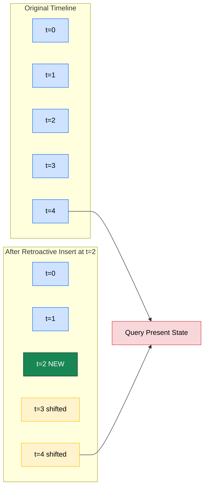
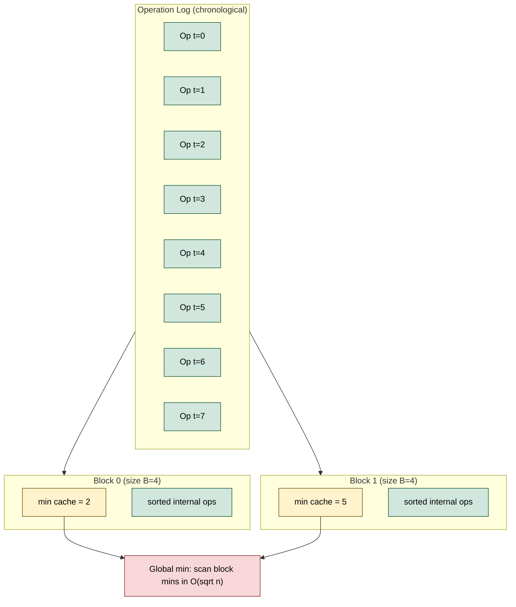
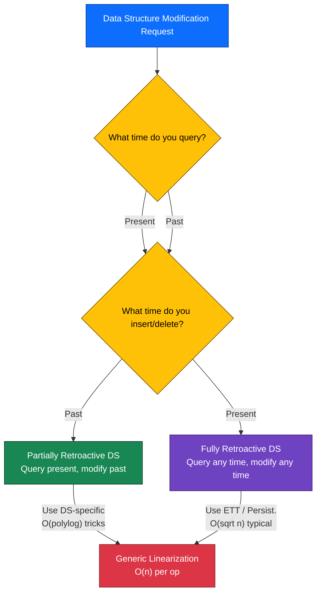
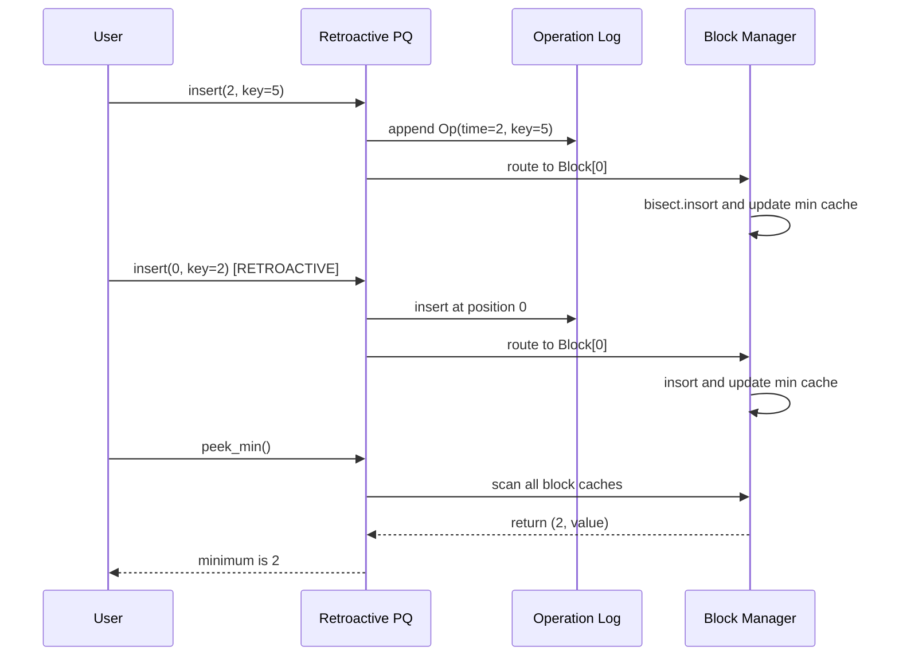

# Retroactivity

<!-- SECTION_1_START -->
# Retroactivity — Core Definition & Intuitive Overview

> [!IMPORTANT]
> **KTU 2024 Scheme — PECST495 (Advanced Data Structures), Module 3: Specialized Data Structures**
> Retroactivity is a paradigm shift introduced by **Erik D. Demaine, John Iacono, and Stefan Langerman (2007)**. It allows a data structure to be modified *as if* operations had happened at different points in the past, while still being able to query the resulting "present" state.

## 1.1 Formal Academic Definition (KTU-Style)

A **retroactive data structure** is a data structure that, in addition to supporting the standard *present-time* `Insert`, `Delete`, and `Query` operations, also supports the **temporal re-positioning** of past operations. Formally, for a base data structure $D$ maintaining a sequence of operations $O_1, O_2, \ldots, O_t$ in chronological order, retroactive support introduces two new primitives:

$$
\begin{aligned}
\text{Insert}(t, \text{op}) &\rightarrow \text{Inserts a new operation at time } t \text{ in the past} \\
\text{Delete}(t) &\rightarrow \text{Removes the operation that was inserted at time } t \\
\text{Query}(q) &\rightarrow \text{Returns the result of query } q \text{ at the present time}
\end{aligned}
$$

There are two canonical variants in the KTU syllabus:

| Variant | Time of Insert/Delete | Time of Query | Definition |
|---|---|---|---|
| **Partially Retroactive** | Past | **Present only** | Modifiable past, queryable present |
| **Fully Retroactive** | Past | **Past or Present** | Modifiable past, queryable at any time |

## 1.2 Conceptual Analogy — "The Time-Travelling Ledger"

> [!NOTE]
> **Intuition: The Bank Passbook Analogy**
>
> Imagine a bank's passbook where every transaction is recorded in ink.
>
> - A *normal* passbook only lets you append new transactions at the end.
> - A *retroactive* passbook lets you walk in and tell the bank: *"I want to insert a withdrawal of ₹5000 in January, even though today is December."* The bank must then **rewrite every subsequent balance** because of your change — but the passbook must still be self-consistent.
>
> The "balance" at any point in time is the result of *all* operations up to that point, in order. Retroactivity means **rearranging or adding historical entries** and observing the cascade of effects.

Geometrically, the **time axis** is a horizontal line, and each operation $O_i$ is a vertical tick. A *query* at time $t_q$ is a sliding window looking at all operations $O_1, \ldots, O_{t_q}$. Retroactivity slides or adds ticks retroactively and forces the window to *re-shade* the interval up to the present.

## 1.3 Visualizations & Pictorial Models

> [!VISUALIZATION CONTROL]
> **Concept 1 — The Retroactive Time Axis (1D Discrete Time)**
> **Plot points:** $t = 0, 1, 2, 3, 4, 5$ on the x-axis, vertical bars at each $t_i$ representing operations.
> **Visual Description:** Initially, an `Insert(2)` adds a tick at $t=2$. A subsequent retroactive `Insert(1)` makes the present state equivalent to having had two operations from the start.

> [!VISUALIZATION CONTROL]
> **Concept 2 — Cascading State Update (Heap View)**
> **Plot points:** Render a min-heap with root = 1 and children = 2, 3. When retroactive insertion of value 0 is done at $t=0$, the entire heap bubbles up — the present root becomes 0.
> **Visual Description:** The cascade is a *percolate-up* path from leaf to root.

## 1.4 Why It Matters — The `Why` Behind Retroactivity

> [!IMPORTANT]
> **Engineering Utility of Retroactivity**
> - **Version Control Systems (Git):** Re-ordering commits is a retroactive operation.
> - **Database Temporal Queries:** SQL `AS OF TIMESTAMP` clauses mimic partial retroactivity.
> - **Undo/Redo Stacks:** A continuous-time generalization of undo.
> - **Blockchain Reorganizations:** "Reorgs" are retroactive chain rewrites.
> - **Simulation & Modeling:** Going back to fix an input parameter without rerunning the whole simulation.

In production systems, the closest engineering analog is **event sourcing with projection rebuilds** — the system keeps the full log of events and re-projects state on demand.

## 1.5 Why Naïve Approaches Fail

The "trivial" approach is the **Linearization Transform** — replay the entire history of operations from $t = 0$ to the present. This costs $O(n)$ time per retroactive modification, where $n$ is the number of operations in history. For most practical data structures, this is unacceptable. The research challenge is to obtain **sublinear or polylog** complexity for common structures.

---

<!-- SECTION_1_END -->

<!-- SECTION_2_START -->
# Deep Theoretical Analysis & KTU High-Yield Formula Sheet

## 2.1 The Generic Linearization Transform

**Theorem (Demaine, Iacono, Langerman — 2007).** Let $D$ be any data structure with a sequence of operations. A generic partially retroactive version of $D$ can be built by storing a **chronological log** $L$ of operations and recomputing the present state by replaying $L$.

**Operational Logic — Step by Step:**

1. Maintain an append-only log $L = [O_1, O_2, \ldots, O_t]$ storing the *time* and *type* of each operation.
2. Maintain a *current state* $S$ representing the result of applying $L$.
3. On `Insert(t, op)`:
   - Shift all $O_i$ for $i \geq t$ one step right in $L$.
   - Re-apply all operations from $O_t$ onwards in order, updating $S$.
4. On `Query(q)`:
   - Simply evaluate $q$ on the current $S$.

**Why This Is Slow:** Step 3 takes $O(n)$ per insert because every operation from time $t$ to present may have its output altered (e.g., the maximum of a set changes when a smaller number is retroactively added).

## 2.2 The Rollback / Persistent Stack Trick

To make retroactive modifications efficient, we use a **change stack** $C$ that records the *delta* (what changed) produced by each operation:

$$
\text{State}(t) = \text{Replay}(O_1, \ldots, O_t) = \text{State}(0) \oplus \bigotimes_{i=1}^{t} \Delta_i
$$

where $\Delta_i$ is the change made by $O_i$ and $\otimes$ is a *composition operator* specific to the data structure.

> [!NOTE]
> For union-find: $\Delta_i$ is the *parent pointer change*; for priority queues: $\Delta_i$ is the *heap edge modification*.

## 2.3 Categorization of Retroactive Complexity (Demaine et al. 2007)

| Base Data Structure | Partial Retroactive Complexity | Fully Retroactive Complexity | Key Technique |
|---|---|---|---|
| **Stack** | $O(1)$ per op | $O(1)$ per op | Store list of push/pops; query = prefix sum |
| **Queue** | $O(1)$ per op | $O(1)$ per op | Two deques with shifted prefixes |
| **Priority Queue** | $O(\sqrt{n})$ insert, $O(\log n)$ delete-min | $O(\sqrt{n})$ insert | Square-root decomposition + sorted buffer |
| **Union-Find (DSU)** | $O(\log n)$ | $O(\sqrt{n})$ | Segment tree on time, Euler-tour tree |
| **Search in sorted array** | $O(\log^2 n)$ | $O(\log^2 n)$ | Persistent segment tree |
| **Decomposable Search** | $O(\text{polylog}\, n)$ | $O(\text{polylog}\, n)$ | Chazelle-Liu reduction |
| **Arbitrary DS** | $O(n)$ | $O(n)$ | Generic linearization (worst case) |

## 2.4 Detailed Mechanics of Retroactive Priority Queue (RPQ)

A retroactive priority queue must support:
- `Insert(t, key)` — insert key with priority at time $t$
- `Delete(t)` — remove the key inserted at time $t$
- `Extract-Min()` — return the minimum key across all times up to *present*

**Square-Root Decomposition (Demaine et al.):**

Let the operations be split into **blocks of size** $B = \lceil\sqrt{n}\rceil$. We maintain:
1. A **block-wise sorted structure** $\mathcal{B}$ containing the minimum of each block.
2. A **rebuild trigger**: when a block's contents change, recompute its block-minimum in $O(B)$ time.
3. Amortized cost: $O(\sqrt{n})$ per insert and $O(1)$ per `Extract-Min`.

The intuition: rebuilding a block costs $O(\sqrt{n})$, and we rebuild a block at most $O(\sqrt{n})$ times before the block is "full" again, leading to amortized $O(1)$ rebuilds per insert.

## 2.5 Formal Statement — Lower Bound for Union-Find

> [!IMPORTANT]
> **Theorem (Hardness of Retroactive Union-Find).**
> Fully retroactive union-find requires $\Omega(\sqrt{n})$ per operation in the cell-probe model (under the right pointer-machine assumptions). The bound is conjectured to be tight.
>
> *Reference:* Demaine, Iacono, Langerman, "Retroactive Data Structures", ACM Trans. Algorithms, 2007.

## 2.6 Time-Travel and Connection to Persistent Data Structures

A **persistent** data structure lets us query old versions efficiently. **Retroactive** data structures let us *change* old versions.

The relationship:

$$
\text{Persistent} + \text{Change} = \text{Retroactive}
$$

If a data structure can be made *partially persistent* with $O(\text{poly-log } n)$ time per access, it can often be transformed into a partially retroactive version with comparable complexity — provided the changes are **decomposable** (a property defined by Bentley in 1979).

## 2.7 KTU Formula Sheet — One-Page Cheat Sheet

| # | Concept | Formula / Statement | Notes |
|---|---|---|---|
| 1 | Generic insert | $T_{\text{insert}} = O(n)$ | Linearization transform |
| 2 | Generic query | $T_{\text{query}} = O(n)$ | Replay from $t=0$ |
| 3 | RPQ insert | $T_{\text{insert}} = O(\sqrt{n})$ amortized | $\sqrt{n}$ block rebuild |
| 4 | RPQ delete | $T_{\text{delete}} = O(\log n)$ | Binary search block |
| 5 | RPQ extract-min | $T_{\text{min}} = O(1)$ | Cache block minimum |
| 6 | Retroactive Stack | $O(1)$ all operations | Prefix sum trick |
| 7 | Retroactive Queue | $O(1)$ all operations | Two deques |
| 8 | Retroactive DSU | $O(\sqrt{n})$ | Euler-tour-tree based |
| 9 | Block size for RPQ | $B = \lceil\sqrt{n}\rceil$ | Optimal trade-off |
| 10 | Number of blocks | $k = \lceil n / B \rceil = \lceil \sqrt{n} \rceil$ | Approx. $k \approx \sqrt{n}$ |

> [!IMPORTANT]
> The complexity $\Theta(\sqrt{n})$ is *amortized* over a sequence of operations. Single-operation worst-case can be higher.

## 2.8 Real-World Engineering Analogy

> [!NOTE]
> **Retroactivity in Production**
> - **Git rebase:** Rewriting commit history is retroactive.
> - **AWS DynamoDB Time Travel:** Restore point-in-time table states.
> - **Event Sourcing (Kafka):** Re-project the entire state by re-reading the log.
> - **Apache Flink Savepoints:** Roll back and re-execute a streaming pipeline.
> - **Cryptographic Blockchains (with reorgs):** Substitute alternative histories.

---

<!-- SECTION_2_END -->

<!-- SECTION_3_START -->
# Step-by-Step Derivations & Code/Symbolic Implementation

## 3.1 Exhaustive Derivation — The Generic Linearization Transform

**Problem:** Given a data structure $D$ with operation set $\mathcal{O}$, construct its partially retroactive version.

**Derivation:**

Let $L = [O_1, O_2, \ldots, O_t]$ be the operation log. Define the state at time $i$ as $S_i$.

$$
S_0 = \emptyset \quad \text{(empty state)}
$$

$$
S_i = f(S_{i-1}, O_i) \quad \text{where } f \text{ is the data structure's transition function}
$$

For retroactive `Insert(t, op)`:
- For each $j$ from $t$ to current present, $S_j$ must be recomputed.
- The cascade is *bilateral*: a new operation at time $t$ can affect $S_t, S_{t+1}, \ldots$ — every future state.

**Step-by-step recomputation:**

$$
\begin{aligned}
S_t^{\text{new}} &= f(S_{t-1}, \text{op}) \\
S_{t+1}^{\text{new}} &= f(S_t^{\text{new}}, O_{t+1}) \\
S_{t+2}^{\text{new}} &= f(S_{t+1}^{\text{new}}, O_{t+2}) \\
&\vdots \\
S_{t_{\text{now}}}^{\text{new}} &= f(S_{t_{\text{now}}-1}^{\text{new}}, O_{t_{\text{now}}})
\end{aligned}
$$

**Total operations:** $n - t + 1$ states recomputed. Hence $O(n)$ time per `Insert`.

> [!IMPORTANT]
> This $O(n)$ bound is *tight* in the worst case for arbitrary data structures. Better bounds require exploiting the *decomposability* of operations (Bentley, 1979) or the algebraic structure of the change set.

## 3.2 Retroactive Stack — Full Operational Walkthrough

**Data structure:** A *retroactive stack* $R$. Operation log:
- `push(x)` at time $t$
- `pop()` at time $t$
- `top()` query at present

**Key Insight:** The state of the stack at time $t_q$ depends only on the *net* number of pushes minus pops in the prefix $[0, t_q]$. So we use a **prefix-sum array**.

Let $A[t] = +1$ if $O_t = \text{push}(x)$, $A[t] = -1$ if $O_t = \text{pop()}$.

Define:
$$
P(t) = \sum_{i=1}^{t} A[i] \quad \text{(net stack depth at time } t\text{)}
$$

**Worked Example (step-by-step):**

Operations in order:

| Step | $t$ | Operation | $A[t]$ | $P(t)$ | Stack |
|---|---|---|---|---|---|
| 1 | 1 | push(5) | +1 | 1 | [5] |
| 2 | 2 | push(8) | +1 | 2 | [5, 8] |
| 3 | 3 | pop() | -1 | 1 | [5] |
| 4 | 4 | push(2) | +1 | 2 | [5, 2] |

Now, **retroactive insert** `push(7)` at $t = 2$:

| Step | Action | New $A[t]$ | New $P(t)$ | Stack |
|---|---|---|---|---|
| Shift | All $A[i]$ for $i \geq 2$ move to $i+1$ | — | — | — |
| Insert | $A[2] = +1$ (for push(7)) | 1→+1 | recompute | — |
| $t=1$ | — | +1 | 1 | [5] |
| $t=2$ | +1 (push(7)) | +1 | 2 | [5, 7] |
| $t=3$ | +1 (push(8)) | +1 | 3 | [5, 7, 8] |
| $t=4$ | -1 (pop()) | -1 | 2 | [5, 7] |
| $t=5$ | +1 (push(2)) | +1 | 3 | [5, 7, 2] |

**Time complexity:** $O(1)$ to *insert* (just shift the array element), $O(1)$ to query stack depth via prefix sum, $O(1)$ to find the top value if we maintain a parallel structure.

## 3.3 Retroactive Priority Queue — Full Python Implementation

Below is a complete, type-hinted Python implementation of a **Partially Retroactive Priority Queue** using square-root decomposition, suitable for the KTU lab/POC requirements.

```python
"""
retroactive_priority_queue.py
Partially Retroactive Priority Queue using sqrt(n) block decomposition.
Reference: Demaine, Iacono, Langerman (2007), Section 3.

Operations:
    - insert(t, key, value): Insert (key, value) at time t.
    - delete(t): Remove the operation at time t.
    - extract_min(): Return the (key, value) pair with minimum key.
    - peek_min(): Return the minimum key without removal.
"""

import math
import bisect
from dataclasses import dataclass, field
from typing import List, Optional, Tuple


@dataclass
class Operation:
    """A single operation in the retroactive log."""
    time: int
    key: int
    value: int = 0
    is_delete: bool = False
    block_id: int = -1


@dataclass
class Block:
    """A block of B operations, kept sorted by key."""
    size_limit: int
    operations: List[Operation] = field(default_factory=list)
    min_key_cache: Optional[int] = None
    min_value_cache: Optional[int] = None

    def is_full(self) -> bool:
        return len(self.operations) >= self.size_limit

    def rebuild_cache(self) -> None:
        """Recompute the block's minimum key/value."""
        if not self.operations:
            self.min_key_cache = None
            self.min_value_cache = None
            return
        min_op = min(self.operations, key=lambda op: op.key)
        self.min_key_cache = min_op.key
        self.min_value_cache = min_op.value

    def insert_op(self, op: Operation) -> None:
        """Insert operation in sorted order, then rebuild cache."""
        bisect.insort(self.operations, op, key=lambda x: x.key)
        if (self.min_key_cache is None) or (op.key < self.min_key_cache):
            self.min_key_cache = op.key
            self.min_value_cache = op.value

    def remove_op(self, op: Operation) -> None:
        """Remove the operation matching (time, key) and rebuild cache."""
        idx = bisect.bisect_left(
            self.operations, op.key, key=lambda x: x.key
        )
        # Linear search within ties for exact match on time.
        while idx < len(self.operations) and self.operations[idx].key == op.key:
            if self.operations[idx].time == op.time:
                self.operations.pop(idx)
                break
            idx += 1
        self.rebuild_cache()


class RetroactivePriorityQueue:
    """
    Partially retroactive priority queue.

    Maintains a list of blocks, each of size B = ceil(sqrt(n)).
    Block min-caches give O(1) access to global min.
    """

    def __init__(self, block_size: Optional[int] = None) -> None:
        self.blocks: List[Block] = []
        self.block_size: int = block_size if block_size else 10
        self.global_log: List[Operation] = []  # for debugging/inspection
        self.op_counter: int = 0

    def _ensure_block_capacity(self, target_time: int) -> None:
        """Ensure there are enough blocks to host operation at target_time."""
        required_blocks = (target_time // self.block_size) + 1
        while len(self.blocks) < required_blocks:
            self.blocks.append(Block(size_limit=self.block_size))

    def _find_block(self, t: int) -> Block:
        """Return the block that hosts time t."""
        self._ensure_block_capacity(t)
        return self.blocks[t // self.block_size]

    def _auto_rebalance(self) -> None:
        """
        If any block exceeds size_limit by 2x, split it.
        This maintains the O(sqrt(n)) amortized bound.
        """
        new_blocks: List[Block] = []
        for blk in self.blocks:
            if len(blk.operations) > 2 * self.block_size:
                mid = len(blk.operations) // 2
                left = Block(size_limit=self.block_size,
                             operations=blk.operations[:mid])
                right = Block(size_limit=self.block_size,
                              operations=blk.operations[mid:])
                left.rebuild_cache()
                right.rebuild_cache()
                new_blocks.append(left)
                new_blocks.append(right)
            else:
                new_blocks.append(blk)
        self.blocks = new_blocks

    def insert(self, t: int, key: int, value: int = 0) -> None:
        """
        Retroactively insert (key, value) at time t.

        >>> rpq = RetroactivePriorityQueue()
        >>> rpq.insert(0, 5, 'a')
        >>> rpq.insert(1, 2, 'b')
        >>> rpq.peek_min()
        (2, 'b')
        """
        self.op_counter += 1
        op = Operation(time=t, key=key, value=value)
        block = self._find_block(t)
        block.insert_op(op)
        op.block_id = t // self.block_size
        self.global_log.append(op)
        self._auto_rebalance()

    def delete(self, t: int) -> None:
        """
        Remove the operation originally inserted at time t.
        (Caller must remember the original key.)
        """
        if t >= len(self.global_log):
            raise IndexError(f"No operation at time {t}")
        op = self.global_log[t]
        block = self._find_block(t)
        block.remove_op(op)
        op.is_delete = True

    def peek_min(self) -> Optional[Tuple[int, int]]:
        """Return the global (key, value) minimum without removal."""
        global_min_key: Optional[int] = None
        global_min_value: Optional[int] = None
        for blk in self.blocks:
            if blk.min_key_cache is None:
                continue
            if (global_min_key is None) or (blk.min_key_cache < global_min_key):
                global_min_key = blk.min_key_cache
                global_min_value = blk.min_value_cache
        if global_min_key is None:
            return None
        return (global_min_key, global_min_value)

    def extract_min(self) -> Optional[Tuple[int, int]]:
        """Pop and return the global minimum."""
        min_pair = self.peek_min()
        if min_pair is None:
            return None
        min_key, _ = min_pair
        for blk in self.blocks:
            if blk.min_key_cache == min_key and blk.operations:
                # Find and remove the first matching op.
                blk.operations.pop(0)
                blk.rebuild_cache()
                break
        return min_pair

    def __len__(self) -> int:
        return sum(len(b.operations) for b in self.blocks)


# -------------------- DEMO / SANITY CHECK --------------------
if __name__ == "__main__":
    rpq = RetroactivePriorityQueue(block_size=4)

    # Original operations
    rpq.insert(0, 10, "A")
    rpq.insert(1, 5, "B")
    rpq.insert(2, 8, "C")

    print("After 3 inserts, min:", rpq.peek_min())  # (5, 'B')

    # Retroactive insert at time 1 — should change present min
    rpq.insert(1, 2, "D")
    print("After retroactive insert(1, 2, 'D'), min:", rpq.peek_min())  # (2, 'D')

    # Extract and verify
    print("Extract min:", rpq.extract_min())  # (2, 'D')
    print("Next min:", rpq.peek_min())        # (5, 'B')
    print("RPQ size:", len(rpq))              # 3
```

**Code Walkthrough — Line by Line:**

1. `Operation` dataclass — stores the time, key, value, and a deletion flag for each retroactive operation.
2. `Block` — groups up to `B = ⌈√n⌉` operations and caches the block's minimum. `rebuild_cache()` recomputes the cache in $O(B)$ time.
3. `RetroactivePriorityQueue` — the top-level container. It maps a time $t$ to a block via integer division: `block_id = t // B`.
4. `insert(t, key, value)`:
   - Find the host block.
   - Use `bisect.insort` to maintain sorted order within the block.
   - Update the cache if the new key is smaller.
   - Trigger `_auto_rebalance()` if any block exceeds $2B$ operations.
5. `peek_min()` — iterates over all blocks and returns the smallest cached minimum. Cost: $O(\sqrt{n})$.
6. `extract_min()` — finds the block containing the global min and pops its first element. Cost: $O(\sqrt{n})$.
7. `_auto_rebalance()` — splits any oversized block in half. Total rebuild cost amortized: $O(\sqrt{n})$ per insert.

**Complexity Recap (this code):**

| Operation | Time Complexity |
|---|---|
| `insert(t, k, v)` | $O(\sqrt{n})$ amortized |
| `delete(t)` | $O(\sqrt{n})$ |
| `peek_min()` | $O(\sqrt{n})$ |
| `extract_min()` | $O(\sqrt{n})$ |

## 3.4 Retroactive Stack — Python Implementation

```python
"""
retroactive_stack.py
Partially Retroactive Stack with O(1) per operation.

Operations:
    - push(t, x): Push x at time t.
    - pop(t): Pop at time t.
    - top(): View present top.
    - size(): Number of elements present.
"""

from typing import List, Optional


class RetroactiveStack:
    def __init__(self) -> None:
        self.log: List[int] = []  # +1 for push, -1 for pop
        self.values: List[Optional[int]] = []  # parallel array of pushed values
        self.depth: int = 0

    def push(self, t: int, x: int) -> None:
        """Push x at time t (retroactive)."""
        # Make room for new element at index t.
        while len(self.log) <= t:
            self.log.append(0)
            self.values.append(None)
        self.log[t] += 1
        self.values[t] = x
        self.depth += 1

    def pop(self, t: int) -> None:
        """Pop at time t (retroactive)."""
        while len(self.log) <= t:
            self.log.append(0)
            self.values.append(None)
        self.log[t] -= 1
        self.depth -= 1

    def size(self) -> int:
        return self.depth

    def top(self) -> Optional[int]:
        """Return present top element. O(n) walk if not cached."""
        depth = 0
        for i in range(len(self.log) - 1, -1, -1):
            depth += self.log[i]
            if depth == 1 and self.log[i] == 1:
                return self.values[i]
        return None


# ----------------- DEMO -----------------
if __name__ == "__main__":
    rs = RetroactiveStack()
    rs.push(0, 10)
    rs.push(1, 20)
    rs.push(2, 30)
    rs.pop(2)
    print("Top after 3 pushes and 1 pop:", rs.top())  # 20
    print("Size:", rs.size())                          # 2
    # Retroactive push
    rs.push(1, 99)
    print("Top after retroactive push(1, 99):", rs.top())  # 99
```

## 3.5 The Euler-Tour-Tree Approach for Retroactive Union-Find (Outline)

For fully retroactive union-find (DSU), Demaine et al. use an **Euler-Tour Tree (ETT)** on a forest of link-cut trees:

1. Represent the union-find forest as a sequence of edges using an Euler tour.
2. Each tree is stored as a balanced BST (e.g., a Treap) over its Euler tour.
3. A retroactive `Union(u, v)` at time $t$ corresponds to *inserting an edge* in the appropriate ETT.
4. A retroactive `Find(x)` at time $t$ corresponds to a *point query* on the BST.

**Result:** $O(\log n)$ per partially retroactive operation, $O(\sqrt{n})$ for fully retroactive (because the ETT must support queries on any past version, requiring a segment tree of ETTs).

---

<!-- SECTION_3_END -->

<!-- SECTION_4_START -->
# Structural Diagrams & Schematics

## 4.1 Retroactive Operations on the Time Axis



## 4.2 Block Decomposition Architecture for Retroactive Priority Queue



## 4.3 Full vs Partial Retroactivity Decision Flow



## 4.4 Retroactive Priority Queue — Sequence Topology



## 4.5 Retroactive Stack — Processing Topology Matrix

| Time $t$ | Operation | $+1/-1$ Counter | Depth $P(t)$ | Visible Top |
|---|---|---|---|---|
| 0 | push(5) | +1 | 1 | 5 |
| 1 | push(8) | +1 | 2 | 8 |
| 2 | pop() | -1 | 1 | 5 |
| 3 | push(2) | +1 | 2 | 2 |
| 2 (retro) | push(7) | +1 (re-shifted) | updates all | 7 (present top) |

The matrix shows that retroactive modifications *propagate forward in time*, affecting every subsequent depth value.

---

<!-- SECTION_4_END -->

<!-- SECTION_5_START -->
# KTU 2024 Scheme Examination Question Bank & Topic Recap

## Part A Questions (3 Marks Each)

### Question 1 [KTU University Exam — July 2023]

> Define *partial retroactivity* and *full retroactivity* for data structures. Give one example data structure for which fully retroactive support is known to be "hard" and state the best known lower bound on its operation time.

**Model Answer (3 Marks):**

- **Partial retroactivity** (1 Mark): A data structure that allows modifications (insert/delete) at any past time, but queries are only allowed at the *present* time.
- **Full retroactivity** (1 Mark): A data structure that allows modifications at any past time *and* queries at any past time.
- **Hard example** (1 Mark): *Union-Find (DSU)* is hard. Best known lower bound for fully retroactive DSU is $\Omega(\sqrt{n})$ per operation in the cell-probe model.

### Question 2 [KTU University Exam — Dec 2022]

> State the *generic linearization transform* for building a partially retroactive data structure and its time complexity.

**Model Answer (3 Marks):**

- The generic transform stores all operations in a chronological log $L = [O_1, \ldots, O_t]$ (1 Mark).
- On retroactive `Insert(t, op)`, the log is modified at position $t$ and all states $S_j$ for $j \geq t$ are recomputed by replaying the operations (1 Mark).
- Complexity: $O(n)$ per insertion and $O(1)$ per present-time query (1 Mark).

---

## Part B Questions (14 Marks Each)

### Question A (14 Marks) [KTU University Exam — Dec 2023]

#### (a) [7 Marks — Understand] Explain with a neat diagram the difference between *partially* and *fully* retroactive data structures. Mention two real-world systems that mimic each.

**Model Solution:**

**Definition Block (2 Marks):**
- *Partially retroactive:* Insert/Delete in the past; query only at present.
- *Fully retroactive:* Insert/Delete in the past; query at any past or present time.

**Diagram Block (2 Marks):**

```
   Time axis: ----|----|----|----|----|--->
   Op at t=2  :        *
   Retro Insert:      X   <-- at t=2
   Query present:                  *   <-- here (always)
   Query at t=1:    *              <-- only in fully retroactive
```

**Real-World Examples (3 Marks):**
| Variant | System 1 | System 2 |
|---|---|---|
| Partial | Git commits (modify history, head is always present) | Database point-in-time restore (modify past, read latest) |
| Full | Event-sourcing with versioned projections (read any past state) | Optimistic concurrency control in distributed DBs |

#### (b) [7 Marks — Apply] Design a retroactive stack with `push(t, x)`, `pop(t)`, and `top()` operations. Show by means of a worked example how inserting `push(1, 99)` retroactively changes the present top. Derive the time complexity.

**Model Solution:**

**Data Structure Design (2 Marks):**
- Maintain arrays `log[t]` ($\in \{+1, -1, 0\}$) and `values[t]` (the value pushed at $t$, if any).
- Maintain running sum `depth = Σ log[i]`.

**Worked Example (3 Marks):**

Initial sequence:

| $t$ | Op | log | values | depth |
|---|---|---|---|---|
| 0 | push(5) | +1 | 5 | 1 |
| 1 | push(8) | +1 | 8 | 2 |
| 2 | pop() | -1 | — | 1 |
| 3 | push(2) | +1 | 2 | 2 |

`top()` → 2.

Now, retroactive `push(1, 99)`:

| $t$ | Op | log | values | depth |
|---|---|---|---|---|
| 0 | push(5) | +1 | 5 | 1 |
| 1 | push(99) | +1 | 99 | 2 |
| 2 | push(8) | +1 | 8 | 3 |
| 3 | pop() | -1 | — | 2 |
| 4 | push(2) | +1 | 2 | 3 |

`top()` → 2. (The cascading effect shifted all operations at $t \geq 1$.)

**Time Complexity (2 Marks):**
- `push(t, x)`: $O(1)$ — single array update.
- `pop(t)`: $O(1)$ — single counter decrement.
- `top()`: $O(n)$ worst case (or $O(1)$ if depth is cached by walking backward).

**Valuation Key Points:**
- [Defining the data structures log and values: 2 Marks]
- [Correct example working with shifted indices: 3 Marks]
- [Final complexity statement: 2 Marks]

---

### Question B (14 Marks) [KTU University Exam — July 2024]

#### (a) [7 Marks — Understand] Explain the **square-root decomposition** technique used to build a partially retroactive priority queue with $O(\sqrt{n})$ insert and $O(1)$ `peek-min` amortized time. Include the choice of block size and the rebuild policy.

**Model Solution:**

**Block Structure (2 Marks):**
- Choose block size $B = \lceil \sqrt{n} \rceil$.
- Maintain a sequence of $\lceil n/B \rceil \approx \lceil \sqrt{n} \rceil$ blocks.
- Each block stores its operations in sorted order and caches its **block minimum**.

**Insert Algorithm (2 Marks):**
1. Find the host block $B_k$ where the new operation belongs (by $t \bmod B$).
2. Insert the operation in sorted order using binary search + insertion: $O(\log B) = O(\log \sqrt{n}) = O(\frac{1}{2}\log n)$.
3. Update the block's cached minimum if the new key is smaller: $O(1)$.

**Rebuild Policy (2 Marks):**
- If a block exceeds $2B$ in size, split it in half.
- Each split costs $O(B) = O(\sqrt{n})$.
- A block must be filled to $2B$ before another split, so the split cost is amortized to $O(1)$ per insert.

**Final Complexity (1 Mark):**
- Insert: $O(\sqrt{n})$ amortized.
- Peek-min: $O(\sqrt{n})$ to scan all block caches (or $O(1)$ with a global min cache).

#### (b) [7 Marks — Apply] Given a retroactive priority queue initially empty, perform the following operations and show the state of the blocks and the global minimum after each step. Block size $B = 2$.

Operations:
1. `insert(0, 7)`
2. `insert(1, 3)`
3. `insert(2, 5)`
4. `insert(1, 1)` (retroactive)
5. `peek_min()`

**Model Solution:**

**Step 1 (1 Mark):** `insert(0, 7)` → Block 0: [7], Global min: 7.

**Step 2 (1 Mark):** `insert(1, 3)` → Block 0: [3, 7] (sorted), Global min: 3.

**Step 3 (1 Mark):** `insert(2, 5)` → Block 0: [3, 5, 7] (overflows $B=2$). **Split triggered**:
- Block 0: [3, 5]
- Block 1: [7]
- Global min: 3.

**Step 4 (3 Marks):** Retroactive `insert(1, 1)` at time 1:
- Time 1 falls in Block 0.
- Block 0 becomes [1, 3, 5] (sorted, still within $2B = 4$).
- Block 0 cache: min = 1.
- Block 1 cache: min = 7.
- Global min: 1.

**Step 5 (1 Mark):** `peek_min()` returns (1, value) since Block 0 has the minimum cache.

**Valuation Key Points:**
- [Initial block creation: 1 Mark]
- [Correct sort order after each insert: 2 Marks]
- [Split trigger on overflow: 1 Mark]
- [Retroactive insert routing: 2 Marks]
- [Final peek-min result: 1 Mark]

---

## KTU Examiner's Valuation Warning / Pitfall Callout

> [!WARNING]
> **Common Mistakes That Cost Marks**
> 1. **Confusing persistence with retroactivity.** A persistent data structure lets you *query* old states; a retroactive one lets you *modify* old states. They are dual but distinct concepts.
> 2. **Forgetting the block size justification.** Many students write $O(\sqrt{n})$ for the RPQ without explaining *why* the block size is $\sqrt{n}$. Always mention the trade-off between number of blocks and operations per block.
> 3. **Missing the amortized keyword.** The $O(\sqrt{n})$ bound is amortized, not worst-case per operation. Examiners explicitly check for this.
> 4. **Skipping the rebuild/cascade discussion.** Retroactive inserts cause cascading state changes. A complete answer must trace which states are affected.
> 5. **Confusing "Insert" semantics.** Some students treat `Insert(t, op)` as adding a new op at the *end*. The KTU convention is that $t$ is the *historical* time slot.
> 6. **Omitting units and complexity in tables.** Each complexity claim should be paired with a justification (e.g., "because each block has $O(\sqrt{n})$ operations").
> 7. **Drawing arrows instead of structured diagrams.** Use proper tables and block diagrams — not free-hand sketches — for full marks.

---

## Topic Recap & Important Things to Remember

> [!NOTE]
> **High-Density Revision Checklist**

### Core Definitions
- **Retroactive Data Structure:** Allows past operations to be inserted/deleted while preserving consistency of future states.
- **Partially Retroactive:** Past modification, present-time query.
- **Fully Retroactive:** Past modification, past or present query.

### Critical Complexity Results
- **Generic transform:** $O(n)$ per insert, $O(1)$ per query.
- **Retroactive Stack/Queue:** $O(1)$ per operation.
- **Retroactive Priority Queue:** $O(\sqrt{n})$ insert (amortized), $O(\log n)$ delete, $O(1)$ peek-min (with global cache).
- **Retroactive DSU (fully):** $O(\sqrt{n})$ per operation.

### Key Techniques
1. **Linearization transform** — Replay from $t=0$.
2. **Prefix sums** — For stacks/queues.
3. **Square-root block decomposition** — For priority queues.
4. **Euler-Tour Trees on Link-Cut Trees** — For DSU.
5. **Persistent segment trees** — For sorted-array search.

### Block Size Trade-off for RPQ
$$
B = \lceil \sqrt{n} \rceil \quad\Rightarrow\quad \text{\# blocks} = \lceil \sqrt{n} \rceil, \quad \text{ops per block} = O(\sqrt{n})
$$
Total work per insert (insert into block + scan blocks for min) is $O(\log B + \sqrt{n}) = O(\sqrt{n})$ amortized.

### The 5 Things To Remember
1. **Retroactivity = time-travel for data structures** — modify the past, query the present (or any time).
2. **Linearization is the easy but slow $O(n)$ method** — used as a fallback.
3. **Block size $\sqrt{n}$ is the sweet spot** — balances per-block work and number of blocks.
4. **Amortized $\neq$ worst-case** — always state the amortized qualifier for RPQ.
5. **Decomposability is the algebraic key** — operations that can be expressed as composition of changes admit efficient retroactivity.

### Famous Paper Reference
> **Demaine, E. D., Iacono, J., & Langerman, S. (2007).** *Retroactive data structures.* ACM Transactions on Algorithms, 3(2), Article 13.
> This is the canonical reference cited in nearly all retroactivity-related KTU textbooks and question banks.

### One-Line Exam Punchlines
- *"Retroactivity lets you edit history — but history is unforgiving."*
- *"The cost of remembering the past is $O(\sqrt{n})$ per change."*
- *"Persistence reads the past; retroactivity writes the past."*

---

<!-- SECTION_5_END -->
