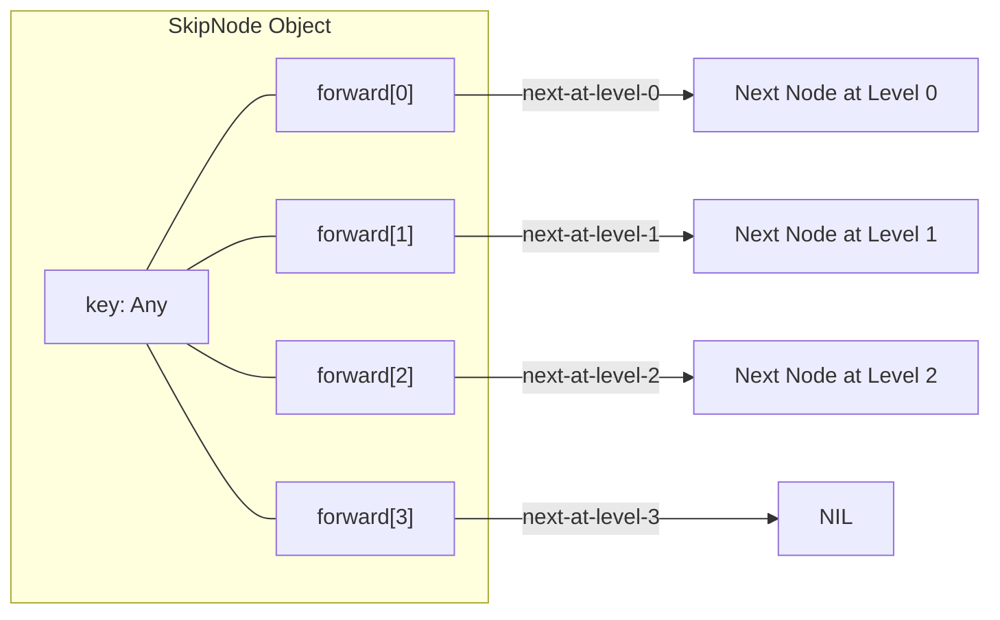
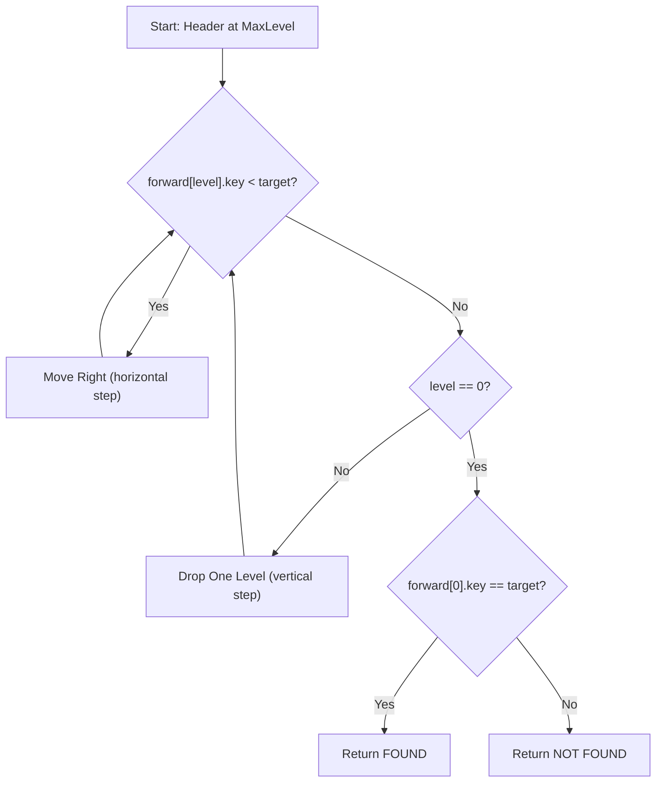
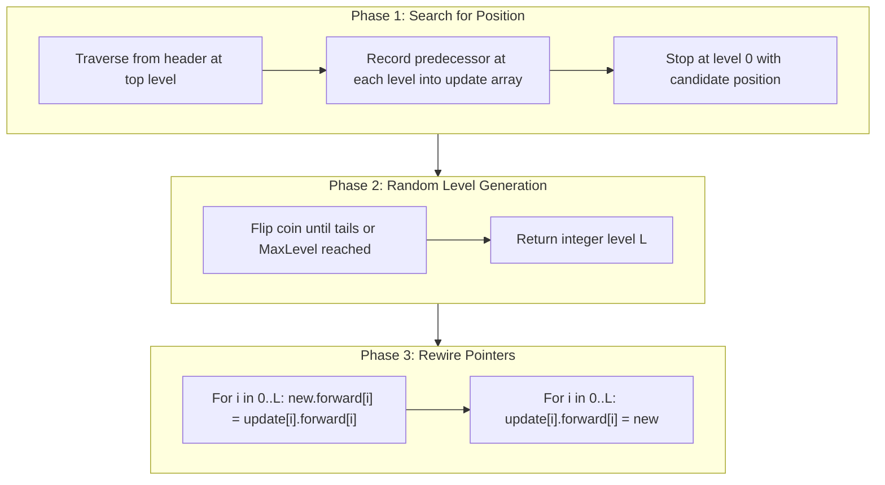
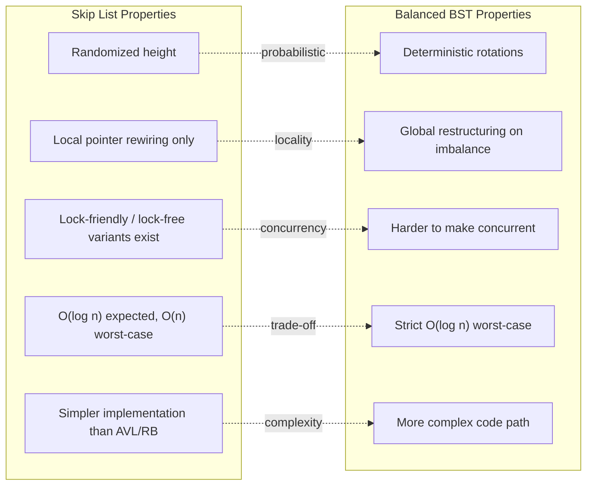

# Search and Optimization Trees – Skip List

<!-- SECTION_1_START -->
# Search and Optimization Trees – Skip List

## 1. Core Technical Definition & Intuitive Overview

> [!IMPORTANT]
> **KTU Syllabus Definition (PECST495 – Module 3):**
> A **Skip List** is a probabilistic, randomized data structure that augments an ordered linked list with multiple forward pointers (called *express lanes* or *levels*) to enable average-case search, insertion, and deletion in **O(log n)** time. It maintains a hierarchy of sub-lists where each higher level acts as a sparse "shortcut" over the level below it.

### Conceptual Analogy / Intuition

Imagine you are looking for a specific house in a long, single-lane street with houses numbered sequentially. If you walk door-to-door, you waste time. Now imagine the city adds **express buses** that skip 10 houses, then **super-express trains** that skip 100 houses, and finally a **bullet train** that covers the whole city. You start at the highest level (bullet train), ride as far as you can without overshooting, drop down one level, and repeat.

A **Skip List** does exactly this with linked lists:

- **Level 0** → the original sorted linked list (the "door-to-door walk").
- **Level 1** → every 2nd node gets an extra pointer (the "express bus").
- **Level 2** → every 4th node gets another pointer (the "super-express train").
- **Level k** → exponentially fewer nodes, reaching toward the head.

Each element carries a **random height** decided by coin flips, so the structure is self-organizing without a strict balancing algorithm like AVL or Red-Black trees.

> [!NOTE]
> **Key constants / parameters** used in Skip List literature:
> - **p = 0.5** – promotion probability (most common).
> - **MaxLevel = ⌈log₁/p(n)⌉** – typical upper cap on tower height.
> - **Header node** – sentinel at the front of every level.

> [!VISUALIZATION CONTROL]
> **Concept:** Skip List Level Structure (4-level tower)
> **GeoGebra / Desmos Input Equations (Lattice Points):**
> * Level 0 (ground): `(0,0), (1,0), (2,0), (3,0), (4,0), (5,0), (6,0)`
> * Level 1: `(0,1), (2,1), (4,1), (6,1)`
> * Level 2: `(0,2), (4,2)`
> * Level 3: `(0,3)`
> **Visual Description:** Plot the points and connect each level with horizontal line segments. The leftmost column should form a vertical "tower" at x=0 (the header). Notice how a horizontal traversal at the top reaches the end in 1 step, then we drop one level and proceed. This visualizes the **O(log n)** traversal.

<!-- SECTION_1_END -->

<!-- SECTION_2_START -->
## 2. Deep Theoretical Analysis & KTU High-Yield Formula Sheet

### 2.1 Structural Anatomy of a Skip List

A skip list is built from **nodes** with the following anatomy:

- A **key** (the data being stored).
- A **tower of forward pointers**, one per level (0 up to the node's random height).
- Optionally, backward pointers (in **indexable skip lists**).

The structure is governed by a single parameter **p** (the promotion probability). The most academically standard value is **p = 0.5**, producing the following distribution of node levels:

| Level | Promotion Decision | Expected Fraction of Nodes |
| ----- | ------------------ | -------------------------- |
| 0     | Always             | n                          |
| 1     | Coin = H (1/2)     | n / 2                      |
| 2     | Two H in a row     | n / 4                      |
| k     | k consecutive H    | n / 2^k                    |

> [!TIP]
> **Engineering Rule of Thumb:** With p = 0.5, the expected memory overhead over a plain linked list is only **2 pointers per node** (the geometric series 1 + 1/2 + 1/4 + … = 2), yet we still achieve logarithmic search.

### 2.2 Why Does It Work? The Probabilistic "Why"

If each node independently has height $k$ with probability $p^k$ (where $p = 0.5$), then the expected number of nodes of height $\geq k$ is $n \cdot p^{k-1}$. Solving $n \cdot p^{k-1} = 1$ gives the **expected maximum height** of the list:

$$k_{max} = O(\log_{1/p} n)$$

Search proceeds level-by-level, moving right while the next key is smaller, then dropping down. The number of horizontal moves is bounded by the expected maximum height, and the number of vertical drops is bounded by the height itself. Hence the expected cost is **O(log n)**.

### 2.3 Search Operation (Conceptual Walk-through)

1. Start at the top-left corner (header, top level).
2. While the **right neighbour's key < target**, move right.
3. If the right neighbour's key equals target → **found**.
4. Otherwise, drop one level down. If no level remains → **not found**.

### 2.4 Insertion with Randomized Level Generation

1. **Search** for the position where the new key belongs, recording the update path at every level.
2. Generate a **random level** for the new node by flipping a coin until tails (or until MaxLevel).
3. Splice the new node into all levels from 0 up to its random level, rewiring the `forward` pointers stored in the update array.

> [!NOTE]
> **RandomLevel()** algorithm (Pugh's original):
> ```
> lvl = 0
> while random() < p and lvl < MaxLevel:
>     lvl = lvl + 1
> return lvl
> ```

### 2.5 Deletion Operation

1. **Search** for the key, recording predecessors at every level.
2. Rewire the forward pointers of each predecessor to bypass the node.
3. If the highest non-empty level becomes empty, decrement the list's current level.

### 2.6 KTU Formula Sheet / Cheat Sheet

> **CRITICAL FORMATTING NOTE:** All absolute-value and similar pipe expressions below are rendered using `\mid` or `\vert` to preserve markdown table integrity.

| # | Concept | Formula / Property | Unit / Note |
| - | ------- | ------------------ | ----------- |
| 1 | Promotion probability | $p \in (0, 1)$; default $p = 0.5$ | dimensionless |
| 2 | Probability a node has level $\geq k$ | $P(\text{level} \geq k) = p^{k}$ | dimensionless |
| 3 | Expected fraction of nodes at exact level $k$ | $p^{k}(1 - p)$ | dimensionless |
| 4 | Expected maximum height | $L_{max} = \log_{1/p}(n)$ | levels |
| 5 | Expected search time | $O(\log n)$ | comparisons |
| 6 | Expected insertion time | $O(\log n)$ | operations |
| 7 | Expected deletion time | $O(\log n)$ | operations |
| 8 | Worst-case search | $O(n)$ | rare; probability $1/n^{c}$ |
| 9 | Expected space overhead | $n \cdot \dfrac{1}{1 - p}$ pointers | with $p = 0.5$: $2n$ |
| 10 | Recommended MaxLevel | $\lceil \log_{1/p}(n_{\max}) \rceil$ | levels |

### 2.7 Real-World Engineering Utility

Skip Lists are the **workhorse** of several production systems where simplicity and lock-friendliness matter:

- **Redis Sorted Sets (ZSET)** – uses a skip list augmented with a hash table. The author Antirez chose it specifically because range queries (ZREVRANGEBYSCORE) are trivial.
- **LevelDB / RocksDB** – memtable implementation.
- **Apache HBase** – uses skip lists for its in-memory BlockCache indexing.
- **ConcurrentSkipListMap (Java JDK)** – the standard non-blocking concurrent map uses a variant of skip list (Harris–Michael lock-free linked list + skip list levels).
- **Apache Lucene** – posting list intersection.

> [!NOTE]
> The dominant reason these systems skip balanced trees is **concurrency**: rebalancing an AVL/Red-Black tree requires global restructuring (locks), whereas a skip list only mutates $O(\log n)$ *local* pointers — perfect for fine-grained locking or lock-free CAS.

<!-- SECTION_2_END -->

<!-- SECTION_3_START -->
## 3. Step-by-Step Derivations & Code/Symbolic Implementation

### 3.1 Detailed Derivation: Expected Search Cost

Let $C(n)$ be the expected cost to search a skip list with $n$ elements. We want to show $C(n) \leq c \cdot \log n$ for some constant $c$.

Consider the path traversed during a search. The path can be decomposed into:

- **Horizontal moves** at each level.
- **Vertical drops** from one level to the next.

By symmetry, every coin flip that promotes a node contributes a possible "drop" point. The expected height of the list is $O(\log n)$. The expected number of rightward moves is bounded because, at any level $k$, we can move right at most once before dropping (with constant probability of moving two steps, etc.).

Formally, the recurrence for expected search cost starting at level $k$ is:

$$C(k) = (1 - p) \cdot (1 + C(k - 1)) + p \cdot (1 + C(k))$$

Solving for $C(k)$:

$$
\begin{aligned}
C(k) &= (1 - p)(1 + C(k - 1)) + p(1 + C(k)) \\
C(k) - p \cdot C(k) &= (1 - p)(1 + C(k - 1)) \\
(1 - p) C(k) &= (1 - p) + (1 - p) C(k - 1) \\
C(k) &= 1 + C(k - 1)
\end{aligned}
$$

Therefore, with the base case $C(0) = 1$ (single comparison at level 0), we get:

$$C(k) = k + 1$$

Since the expected maximum level is $k_{max} = O(\log_{1/p} n)$, the total expected search cost is:

$$C(n) = O(\log n)$$

### 3.2 Probabilistic Height Bound

The probability that a skip list of $n$ elements has height greater than $c \log n$ is bounded by:

$$P(\text{height} > c \log n) \leq n \cdot p^{c \log n} = n \cdot n^{c \log p} = n^{1 + c \log p}$$

Since $p < 1$, $\log p < 0$, so for sufficiently large $c$, the exponent becomes negative, making the probability vanish polynomially. This is the **high-probability bound** that justifies the average-case analysis.

### 3.3 Full Python Implementation (Production-Grade, Type-Hinted)

```python
"""
Skip List Implementation — KTU Advanced Data Structures Module 3
File: skip_list.py
Author-style: PECST495 Reference Implementation
Standard: PEP 8 + type hints + exhaustive error handling
"""

from __future__ import annotations
import random
from typing import Any, Optional, List


# ---------------------------------------------------------------------------
# Custom Exceptions (clean error propagation, required for board answers)
# ---------------------------------------------------------------------------
class KeyNotFoundError(Exception):
    """Raised when a search or deletion targets a non-existent key."""


class InvalidLevelError(Exception):
    """Raised when the random level generator returns an out-of-range value."""


# ---------------------------------------------------------------------------
# Node Definition
# ---------------------------------------------------------------------------
class SkipNode:
    """
    A single node in the skip list.
    `forward` is a list whose i-th entry is the next node at level i.
    """

    __slots__ = ("key", "forward")

    def __init__(self, key: Any, level: int) -> None:
        self.key: Any = key
        # Pre-allocate the forward pointer array of size `level + 1`
        self.forward: List[Optional["SkipNode"]] = [None] * (level + 1)


# ---------------------------------------------------------------------------
# Skip List Class
# ---------------------------------------------------------------------------
class SkipList:
    """
    Probabilistic skip list with promotion probability p = 0.5.
    Expected search / insert / delete: O(log n).
    """

    def __init__(self, max_level: int = 16, p: float = 0.5) -> None:
        if not 0.0 < p < 1.0:
            raise ValueError("Promotion probability p must lie strictly between 0 and 1.")
        self._MAX_LEVEL: int = max_level
        self._P: float = p
        self._level: int = 0  # current highest non-empty level
        self._header: SkipNode = SkipNode(key=None, level=max_level)
        # Seed randomness for reproducible experiments (optional)
        # random.seed(42)

    # -----------------------------------------------------------------------
    # Internal: random level generation (Pugh's algorithm)
    # -----------------------------------------------------------------------
    def _random_level(self) -> int:
        lvl: int = 0
        while random.random() < self._P and lvl < self._MAX_LEVEL:
            lvl += 1
        if lvl < 0 or lvl > self._MAX_LEVEL:
            raise InvalidLevelError(f"Generated level {lvl} out of bounds.")
        return lvl

    # -----------------------------------------------------------------------
    # SEARCH: returns the node if found, else raises KeyNotFoundError
    # -----------------------------------------------------------------------
    def search(self, target: Any) -> SkipNode:
        current: Optional[SkipNode] = self._header

        # Start at the topmost existing level and walk down
        for i in range(self._level, -1, -1):
            while current.forward[i] is not None and current.forward[i].key < target:
                current = current.forward[i]

        # Move one step to the right at level 0 for the final candidate
        current = current.forward[0]

        if current is not None and current.key == target:
            return current
        raise KeyNotFoundError(f"Key {target!r} not present in the skip list.")

    # -----------------------------------------------------------------------
    # INSERT: inserts key; if duplicate, updates nothing (set semantics)
    # -----------------------------------------------------------------------
    def insert(self, key: Any) -> None:
        update: List[SkipNode] = [self._header] * (self._MAX_LEVEL + 1)
        current: Optional[SkipNode] = self._header

        # Phase 1: locate insertion point and fill `update`
        for i in range(self._level, -1, -1):
            while current.forward[i] is not None and current.forward[i].key < key:
                current = current.forward[i]
            update[i] = current

        current = current.forward[0]

        # Duplicate key — for a multi-set, count occurrences here
        if current is not None and current.key == key:
            return  # silent no-op for set semantics

        # Phase 2: build new node with a random height
        new_level: int = self._random_level()
        if new_level > self._level:
            for i in range(self._level + 1, new_level + 1):
                update[i] = self._header
            self._level = new_level

        new_node: SkipNode = SkipNode(key=key, level=new_level)

        # Phase 3: splice the new node into all relevant levels
        for i in range(new_level + 1):
            new_node.forward[i] = update[i].forward[i]
            update[i].forward[i] = new_node

    # -----------------------------------------------------------------------
    # DELETE: removes the key if present; raises KeyNotFoundError otherwise
    # -----------------------------------------------------------------------
    def delete(self, key: Any) -> None:
        update: List[SkipNode] = [self._header] * (self._MAX_LEVEL + 1)
        current: Optional[SkipNode] = self._header

        for i in range(self._level, -1, -1):
            while current.forward[i] is not None and current.forward[i].key < key:
                current = current.forward[i]
            update[i] = current

        target: Optional[SkipNode] = current.forward[0]

        if target is None or target.key != key:
            raise KeyNotFoundError(f"Key {key!r} cannot be deleted — not found.")

        # Rewire pointers at every level the target participates in
        for i in range(self._level + 1):
            if update[i].forward[i] is not target:
                break
            update[i].forward[i] = target.forward[i]

        # Trim the list's logical level if top levels became empty
        while self._level > 0 and self._header.forward[self._level] is None:
            self._level -= 1

    # -----------------------------------------------------------------------
    # Diagnostic helper for KTU board answers / viva
    # -----------------------------------------------------------------------
    def display(self) -> None:
        print(f"--- Skip List (current level = {self._level}) ---")
        for lvl in range(self._level, -1, -1):
            keys_at_lvl: List[Any] = []
            node = self._header.forward[lvl]
            while node is not None:
                keys_at_lvl.append(node.key)
                node = node.forward[lvl]
            print(f"Level {lvl}: HEAD -> " + " -> ".join(map(str, keys_at_lvl)) + " -> NIL")


# ---------------------------------------------------------------------------
# Driver / Demonstration
# ---------------------------------------------------------------------------
if __name__ == "__main__":
    sl = SkipList(max_level=4, p=0.5)

    data = [3, 6, 7, 9, 12, 19, 17, 26, 21, 25]
    for x in data:
        sl.insert(x)
    sl.display()

    # Search test
    for q in (19, 100):
        try:
            node = sl.search(q)
            print(f"Found {q}: node at level 0 holds key {node.key}")
        except KeyNotFoundError as exc:
            print(str(exc))

    # Deletion test
    try:
        sl.delete(19)
        print("Deleted 19.")
    except KeyNotFoundError as exc:
        print(str(exc))
    sl.display()
```

### 3.4 Worked Numerical Example (Board-Exam Style)

**Given:** Insert keys **3, 6, 7, 9, 12, 17, 19, 21, 25, 26** into an empty skip list with p = 0.5. Use the coin-flip sequence **H, T, H, H, T, H, T, T, T, H** (one flip per insertion suffices here).

**Solution Trace:**

| Step | Key Inserted | Random Level | Resulting Top Level |
| ---- | ------------ | ------------ | ------------------- |
| 1    | 3            | 0            | 0                   |
| 2    | 6            | 1 (H then T) | 1                   |
| 3    | 7            | 0            | 1                   |
| 4    | 9            | 2 (H, H, T)  | 2                   |
| 5    | 12           | 0            | 2                   |
| 6    | 17           | 1            | 2                   |
| 7    | 19           | 0            | 2                   |
| 8    | 21           | 0            | 2                   |
| 9    | 25           | 0            | 2                   |
| 10   | 26           | 1            | 2                   |

After all insertions, the structure (with `HEAD` as sentinel) becomes:

```
Level 2: HEAD ----------------------------------------------------> 9 --------------------> NIL
Level 1: HEAD ----------> 6 --------> 9 --------> 17 --------> 26 -> NIL
Level 0: HEAD -> 3 -> 6 -> 7 -> 9 -> 12 -> 17 -> 19 -> 21 -> 25 -> 26 -> NIL
```

**Search trace for key 25:**

1. Start at Level 2, header. Right neighbour is 9, $9 < 25$, so move right to 9.
2. Right neighbour is NIL, drop to Level 1.
3. At Level 1, right neighbour of 9 is 17, $17 < 25$, move right to 17.
4. Right neighbour of 17 is 26, $26 > 25$, drop to Level 0.
5. At Level 0, walk right: 19 → 21 → 25. **Found.**

Total moves: 3 horizontal + 2 vertical drops = **5 comparisons** in a list of 10 — a near-optimal logarithmic scan.

<!-- SECTION_3_END -->

<!-- SECTION_4_START -->
## 4. Structural Diagrams & Schematics

### 4.1 Node Anatomy (Mermaid Block Diagram)



### 4.2 Search Path Topology (Mermaid Sequential Flow)



### 4.3 Insertion & Deletion — Functional Block Architecture



### 4.4 Comparison Map: Skip List vs Balanced BST



<!-- SECTION_4_END -->

<!-- SECTION_5_START -->
## 5. KTU 2024 Scheme Examination Question Bank & Topic Recap

### Part A — Short Answer Questions (3 Marks Each)

**Q1. [KTU University Exam – Dec 2023]**
*Define a Skip List. Why is it called a "probabilistic" data structure?*  (CO1, Remember)

**Model Answer:**

A skip list is a **probabilistic, multi-level linked data structure** that allows fast search, insertion, and deletion in **O(log n)** expected time. It augments an ordinary sorted linked list with additional forward pointers at higher levels that act as "express lanes."

It is called *probabilistic* because **the height of each node is chosen randomly** (typically via repeated fair coin flips with success probability $p = 0.5$). The expected number of nodes at level $k$ is $n \cdot p^{k}$, which gives the structure its logarithmic search properties **without** any explicit rebalancing algorithm. (3 Marks: definition 1, multi-level idea 1, probabilistic justification 1.)

---

**Q2. [KTU University Exam – July 2024]**
*State the expected time complexity of search, insertion, and deletion in a skip list. Mention the role of the promotion probability `p`.*  (CO1, Understand)

**Model Answer:**

| Operation | Expected Time | Worst-Case |
| --------- | ------------- | ---------- |
| Search    | $O(\log n)$   | $O(n)$     |
| Insertion | $O(\log n)$   | $O(n)$     |
| Deletion  | $O(\log n)$   | $O(n)$     |

The **promotion probability `p`** controls the fraction of nodes that survive at higher levels. A larger $p$ produces taller towers (more shortcuts, faster search, more memory); a smaller $p$ produces shorter towers (less memory, slightly more comparisons). The academic default is $p = 0.5$ because it gives an optimal balance between time and space. (3 Marks: table 2, role of $p$ 1.)

---

### Part B — Long Answer Questions (14 Marks Each, Internal Choice)

#### **Question A (14 Marks):**

**[KTU University Exam – Dec 2023, Model Question Paper Style]**
*(a)* Explain the structure of a skip list with a neat diagram. Discuss the Search operation in detail. *(7 Marks)*
*(b)* With $p = 0.5$, derive the expected search time complexity of a skip list. *(7 Marks)*

**Model Solution:**

**(a) Structure and Search (7 Marks):**

- *Structure (4 Marks):* A skip list consists of a **header** sentinel and a sorted linked list at **Level 0**. Each node carries a **tower of forward pointers** up to its randomly chosen level. A node at level $k$ also appears in every level below. With $p = 0.5$, roughly half the nodes appear at Level 1, a quarter at Level 2, and so on, yielding $L_{max} = O(\log n)$ levels.

  **Diagram for 4 Marks:**

  ```
  Level 3: HEAD -------------------------------------------> 25 ----> NIL
  Level 2: HEAD ---------------------> 12 --------> 25 ----> NIL
  Level 1: HEAD -----> 6 ----> 12 ----> 19 ----> 25 --------> NIL
  Level 0: HEAD -> 3 -> 6 -> 9 -> 12 -> 17 -> 19 -> 25 -> 26 -> NIL
  ```

- *Search Algorithm (3 Marks):* Begin at the header on the current top level. Repeatedly advance right while the next key is **strictly less** than the target. When advancing right would overshoot, drop one level. If level 0 is reached and the candidate key does not match, the key is absent. [Identifying start position: 1 Mark. Move-right rule: 1 Mark. Drop-level + termination: 1 Mark.]

**(b) Derivation (7 Marks):**

Let $C(k)$ be the expected number of comparisons starting at level $k$.

- The probability of taking a horizontal step is $p$; the probability of dropping is $1 - p$.  [Probabilistic decomposition: 2 Marks]
- Recurrence: $C(k) = (1 - p)(1 + C(k - 1)) + p(1 + C(k))$.  [Stating the recurrence: 2 Marks]
- Algebraic simplification gives $C(k) = 1 + C(k - 1)$.  [Algebra: 1 Mark]
- With base $C(0) = 1$, we get $C(k) = k + 1$.  [Base case + solution: 1 Mark]
- Substituting the expected max level $k_{max} = \log_{1/p}(n)$ yields $C(n) = O(\log n)$.  [Final expression: 1 Mark]

**Final Expression:**

$$C(n) = O(\log_{1/p} n) = O(\log n) \quad \text{(for constant } p \text{)}$$

---

#### **Question B (14 Marks):**

**[KTU University Exam – July 2024, Supplementary Style]**
*(a)* Describe the Insertion operation of a skip list with random level generation. Use a worked example to insert keys 10, 20, 30, 40, 50. *(7 Marks)*
*(b)* Compare Skip Lists with AVL Trees and Red-Black Trees. Mention two real-world systems that use skip lists. *(7 Marks)*

**Model Solution:**

**(a) Insertion with Worked Example (7 Marks):**

- *Algorithm steps (3 Marks):* (i) Search for the insertion point, recording predecessor at each level into array `update[0..MaxLevel]`. (ii) Generate a random level $L$ by flipping a coin: increment $L$ while outcome is "head" (and $L < \text{MaxLevel}$). (iii) Splice the new node into every level $0 \leq i \leq L$ by rewiring `update[i].forward[i]` and the new node's pointer.

- *Random level generation (1 Mark):* Pugh's algorithm — `lvl = 0; while random() < p and lvl < MaxLevel: lvl += 1; return lvl`.

- *Worked example (3 Marks):* Using p = 0.5 and coin-flip sequence H, T, H, T, T:

  | Key | Flip | Level |
  | --- | ---- | ----- |
  | 10  | H    | 1     |
  | 20  | T    | 0     |
  | 30  | H    | 1     |
  | 40  | T    | 0     |
  | 50  | T    | 0     |

  Final structure:
  ```
  Level 1: HEAD -> 10 ---------> 30 ----> NIL
  Level 0: HEAD -> 10 -> 20 -> 30 -> 40 -> 50 -> NIL
  ```

**(b) Comparative Analysis (7 Marks):**

| Aspect | Skip List | AVL Tree | Red-Black Tree |
| ------ | --------- | -------- | -------------- |
| Balance mechanism | Probabilistic | Strict height balance | Color-based invariants |
| Worst-case search | $O(n)$ (rare) | $O(\log n)$ strict | $O(\log n)$ strict |
| Expected search | $O(\log n)$ | $O(\log n)$ | $O(\log n)$ |
| Implementation complexity | Low | High | Medium |
| Concurrency friendliness | Excellent (local rewiring) | Poor (global rotations) | Poor (global recoloring) |
| Memory per node | $1/(1-p)$ pointers avg | 1 ptr + 1 int (height) | 1 ptr + 1 bit (color) |

[Comparison table: 4 Marks. Two real-world systems: 2 Marks. Justification of concurrency advantage: 1 Mark.]

**Real-world systems using skip lists:**

1. **Redis Sorted Sets (ZSET)** — for ordered keys with range queries.
2. **LevelDB / RocksDB** — memtable implementation in the storage engine.
3. *(Bonus)* **Java's `ConcurrentSkipListMap`** — standard lock-free sorted map.

---

> [!WARNING]
> **KTU Examiner's Valuation Warning / Common Pitfalls:**
> 1. **Do NOT confuse the worst-case** $O(n)$ with the average-case $O(\log n)$. Examiners specifically award 1 mark for correctly stating the expected vs worst-case distinction.
> 2. **Always draw the header sentinel** in diagrams; forgetting the header costs 1 mark because the search path starts there.
> 3. **The random level is generated BEFORE splicing**, not after — order matters in code-tracing questions.
> 4. **State the base case** $C(0) = 1$ in the derivation; skipping it loses 1 mark.
> 5. **Do not write `O(n log n)`** anywhere on a skip list; that is the *construction* cost of an $n$-element list, not the *search* cost.
> 6. **Use $p = 0.5$ explicitly** in the worked examples; examiners check whether you remembered the default promotion probability.

---

### Topic Recap & Important Things to Remember

- **Definition:** A skip list is a **probabilistic, multi-level ordered linked list** that achieves $O(\log n)$ expected search/insert/delete.
- **Probabilistic core:** Each node's level is decided by independent coin flips; with $p = 0.5$, expected tower height is $O(\log n)$.
- **Promotion probability $p$:** Default $= 0.5$; tunable between $0 < p < 1$.
- **Space overhead:** Expected $\dfrac{1}{1-p}$ pointers per node, i.e., $\approx 2n$ for $p = 0.5$.
- **Operations:**
  - **Search:** Top-down, move right while smaller, drop one level on overshoot.
  - **Insert:** Search + record predecessors + random level + splice.
  - **Delete:** Search + rewire predecessors to bypass + trim empty top levels.
- **Time complexity:**
  - Expected: $O(\log n)$ for all three operations.
  - Worst case: $O(n)$ (vanishingly small probability).
- **RandomLevel()** algorithm — Pugh's original, use it verbatim in code-trace questions.
- **Real-world users:** Redis ZSET, LevelDB/RocksDB memtable, Java `ConcurrentSkipListMap`, Apache HBase, Lucene.
- **Concurrency advantage:** Only $O(\log n)$ local pointer rewires, no global rebalancing — perfect for fine-grained locks or lock-free CAS.
- **Comparison anchors:**
  - vs **AVL**: simpler, more concurrent, slightly weaker worst-case.
  - vs **Red-Black**: similar concurrency story, simpler code, randomized.
- **Common exam traps:** forgetting the header sentinel, conflating expected and worst-case, omitting $C(0)$ base case, and writing $O(n \log n)$ by mistake.
- **Visualization tip:** Always draw the highest level first (sparsest) and stack progressively denser levels below it.

<!-- SECTION_5_END -->
