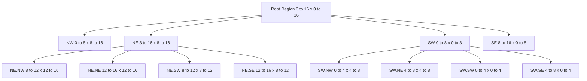
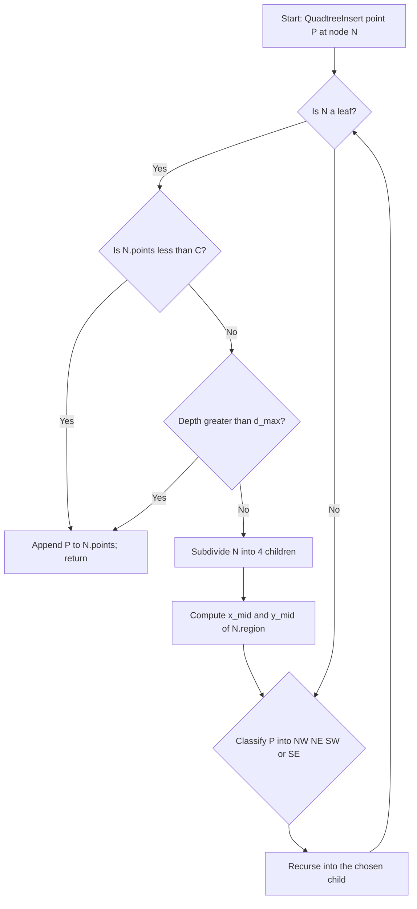
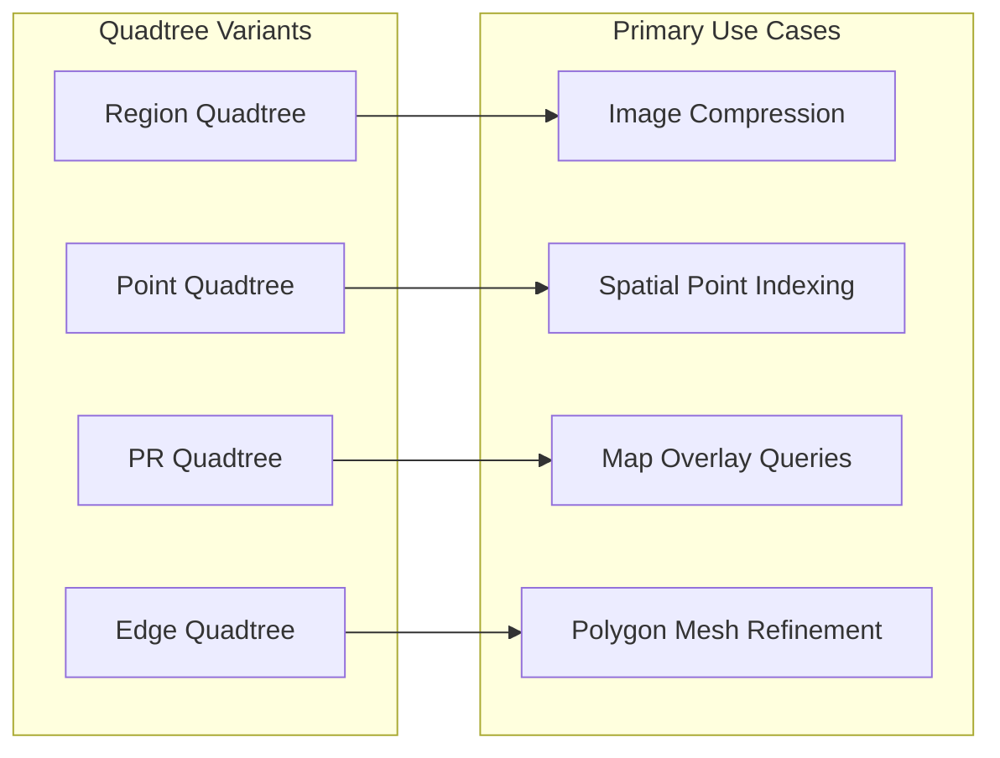
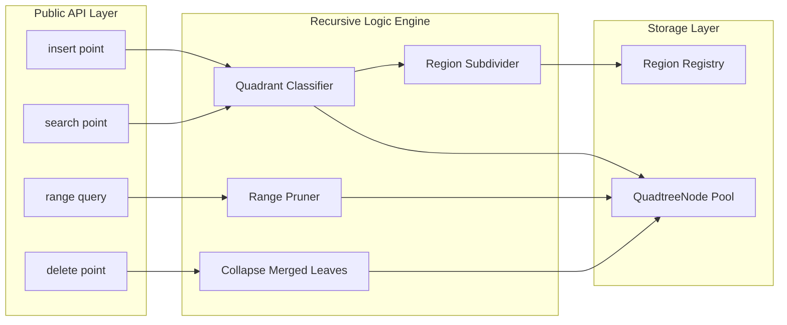

# Specialized Data Structures - Spatial Data Structures – Quadtree

<!-- SECTION_1_START -->

# Quadtree – Spatial Data Structure

## 1.1 Formal Definition (KTU 2024 Syllabus Terminology)

A **Quadtree** is a hierarchical, recursive tree-based data structure used to partition a **two-dimensional (2D) space** by recursively subdividing it into four equal quadrants (NW, NE, SW, SE). Each internal node of the tree represents a rectangular region of the 2D plane and stores exactly **four children**, one for each sub-quadrant, until a stopping criterion (uniform region, maximum depth, or empty cell) is reached.

> [!IMPORTANT]
> **KTU Board Definition (Verbatim Style):** A Quadtree is a *spatially adaptive* tree of order 4, where every internal node has either zero or four children, and is typically used to index 2D point data or to compress raster images by region decomposition.

The generic Quadtree $QT$ can be recursively defined as:

$$QT(R) = \begin{cases} \text{Leaf}(R) & \text{if } \text{stopping condition holds on region } R \\ \big( QT(R_{NW}),\, QT(R_{NE}),\, QT(R_{SW}),\, QT(R_{SE}) \big) & \text{otherwise} \end{cases}$$

where $R$ is a rectangular region in $\mathbb{R}^2$ and $R_{NW}, R_{NE}, R_{SW}, R_{SE}$ represent the four quadrants obtained by halving $R$ along both the $x$-axis and the $y$-axis.

## 1.2 Intuition / Real-World Analogy

> [!NOTE]
> **Geometric Intuition:** Imagine you have a large city map and you want to find all the coffee shops. Instead of scanning the entire map linearly, you first divide the map into **4 big quadrants** (NE, NW, SE, SW). If you are searching for a shop in the NE corner, you *prune* the other three quadrants entirely. Then, you subdivide the NE quadrant into 4 smaller parts, and continue this recursive subdivision.

This is exactly how Google Maps, Uber's surge pricing engine, and even Minecraft's chunk-loading system work — they avoid $O(n)$ scans by recursively chopping space into manageable cells. A Quadtree is essentially a *Divide-and-Conquer* structure applied geometrically.

**A simple visual story:**

| Step | Action | Resulting Regions |
|------|--------|-------------------|
| 0 | Whole plane $R_0$ | 1 cell |
| 1 | Split $R_0$ into 4 | 4 cells (level 1) |
| 2 | Split only the crowded NE cell | 7 cells (level 2) |
| 3 | Continue splitting dense cells | $k$ cells, $k \le 4^{h}$ at depth $h$ |

## 1.3 Variants of Quadtrees (Board-Frequently Asked)

| Variant | What it Stores | Splits When? |
|---------|----------------|--------------|
| **Region Quadtree** | A block of homogeneous data (e.g. pixels) | A region contains mixed data |
| **Point Quadtree** | A 2D point $(x, y)$ | A new point falls into an occupied quadrant |
| **Point-Region (PR) Quadtree** | Points inside a region | Region still has $\ge 1$ point and depth limit not reached |
| **Edge Quadtree** | Edges of a polygonal mesh | A quadrant contains $> 1$ edge |
| **Compressed Quadtree** | Long strings (linear quadtree indexing) | Threshold of detail exceeded |

> [!TIP]
> For KTU exams, the most commonly tested variant is the **Region Quadtree** for image compression and the **Point Quadtree** for range queries.

## 1.4 GeoGebra / Desmos Visualization

> [!VISUALIZATION CONTROL]
> **Concept:** Recursive subdivision of a unit square into 4 quadrants at depth 2.
> **GeoGebra / Desmos Input Equations:**
> * `f_1(x, y) = (x >= 0.5) ∧ (y >= 0.5)` &rarr; NE quadrant (highlighted region 1)
> * `f_2(x, y) = (x < 0.5) ∧ (y >= 0.5)` &rarr; NW quadrant (highlighted region 2)
> * `f_3(x, y) = (x < 0.5) ∧ (y < 0.5)` &rarr; SW quadrant (highlighted region 3)
> * `f_4(x, y) = (x >= 0.5) ∧ (y < 0.5)` &rarr; SE quadrant (highlighted region 4)
> **Visual Description:** Plot a unit square $[0,1] \times [0,1]$; on the first split, draw a vertical line at $x = 0.5$ and a horizontal line at $y = 0.5$. The four resulting sub-squares represent the four children. On the second split, only the upper-right sub-square is further divided.

<!-- SECTION_1_END -->

<!-- SECTION_2_START -->

# Deep Theoretical Analysis & KTU High-Yield Formula Sheet

## 2.1 Structural Properties of a Quadtree

A Quadtree of depth $h$ operating on a 2D space of side length $S$ has the following structural guarantees:

- **Maximum number of nodes** in a *full* Quadtree of depth $h$:

$$N_{max} = \sum_{i=0}^{h} 4^{i} = \frac{4^{h+1} - 1}{4 - 1} = \frac{4^{h+1} - 1}{3}$$

- **Maximum number of leaves** at depth $h$:

$$L_{max} = 4^{h}$$

- **Side length of a leaf cell** at depth $h$:

$$s_h = \frac{S}{2^{h}}$$

- **Aspect ratio invariance:** Every internal node is always a *square* (in the canonical variant), which guarantees $O(\log_4 n)$ height for $n$ uniformly distributed points.

- **Spatial complexity (storage):** Each node stores 4 child pointers and a payload $\Rightarrow$ **$O(n)$** total memory for $n$ points or pixels.

## 2.2 Algorithmic Operations and Their Complexity

| Operation | Average Case | Worst Case | Notes |
|-----------|--------------|------------|-------|
| **Insertion** of a point | $O(\log_4 n)$ | $O(h) = O(n)$ | Worst case = all points share same quadrant |
| **Exact-Match Search** | $O(\log_4 n)$ | $O(h)$ | Recursive descent along one path |
| **Range Query** (rectangle) | $O(\sqrt{n} + k)$ | $O(n)$ | $k$ = reported points |
| **Neighbour Find** (closest) | $O(\log_4 n)$ | $O(n)$ | May need to backtrack |
| **Deletion** | $O(\log_4 n)$ | $O(n)$ | May require node merging/collapse |
| **Tree Build** (bulk) | $O(n \log_4 n)$ | $O(n^2)$ | Depends on insertion order |

> [!IMPORTANT]
> **Why $O(\log_4 n)$ and not $O(\log_2 n)$?** At each level, the search space is *quartered* (4-way branching), so the effective branching factor is 4. A perfectly balanced Quadtree has height $\lceil \log_4 n \rceil$.

## 2.3 Boundary Conditions and Stopping Criteria

A region $R$ is **not split further** when **any one** of the following holds:

1. **Uniformity condition:** All data inside $R$ is homogeneous (e.g. all pixels of the same colour).
2. **Capacity condition:** $R$ contains at most $C$ points, where $C$ is a configured leaf capacity.
3. **Depth condition:** Current depth $d \ge d_{max}$.
4. **Size condition:** Side length of $R$ is below a tolerance $\varepsilon > 0$.

The choice of $C$ and $d_{max}$ is a **space-time trade-off** — larger $C$ ⇒ smaller tree, slower queries.

## 2.4 Engineering Utility (Why Industry Cares)

| Domain | Use of Quadtree |
|--------|-----------------|
| **Computer Graphics** | Image compression (region quadtree stores blocks of same-coloured pixels) |
| **GIS / Maps** | Spatial indexing for points-of-interest; used by PostGIS, Uber H3 (related) |
| **Collision Detection** | 2D game engines (broad-phase culling) use Quadtrees to skip non-overlapping object pairs |
| **Mesh Generation** | Adaptive mesh refinement in FEM simulations |
| **Databases** | Spatial range queries in quadtree-based file systems |
| **Image Processing** | Region-of-interest tracking in OpenCV-based pipelines |

## 2.5 Quadtree vs Other Spatial Structures

| Property | Quadtree | k-d Tree (2D) | R-Tree | BVH |
|----------|----------|---------------|--------|-----|
| **Branching** | Fixed 4 | 2 (alternating axes) | Variable, balanced | Variable |
| **Splits** | Always midpoint | Median | Heuristic | Surface-area heuristic |
| **Best for** | Uniform 2D | k-D point data | Rectangles/regions | Ray tracing |
| **Update-friendly** | Moderate | Yes (rebuild on imbalanced) | Yes | Moderate |
| **External memory** | Linear quadtree form | Poor | Excellent (disk pages) | Moderate |

> [!TIP]
> **Examiner's favourite line:** "A Quadtree is *space-driven*, while an R-Tree is *data-driven*." Memorize this for full marks in 2-mark definition questions.

<!-- SECTION_2_END -->

<!-- SECTION_3_START -->

# Step-by-Step Derivations & Code/Symbolic Implementation

## 3.1 Formal Recursive Subdivision of a Region

Let the root region be $R_0 = [x_{min}, x_{max}] \times [y_{min}, y_{max}]$. The four sub-regions after one split are computed using the geometric midpoints:

$$x_{mid} = \frac{x_{min} + x_{max}}{2}, \quad y_{mid} = \frac{y_{min} + y_{max}}{2}$$

The quadrant assignment is:

$$
\begin{aligned}
R_{NW} &= [x_{min}, x_{mid}] \times [y_{mid}, y_{max}] \\
R_{NE} &= [x_{mid}, x_{max}] \times [y_{mid}, y_{max}] \\
R_{SW} &= [x_{min}, x_{mid}] \times [y_{min}, y_{mid}] \\
R_{SE} &= [x_{mid}, x_{max}] \times [y_{min}, y_{mid}]
\end{aligned}
$$

> This convention is what OpenGL, PostGIS, and most textbooks follow: **y increases upward**, so the *top* of the square is $y_{max}$ (which appears earlier in the listing above).

## 3.2 Point Insertion — Full Walkthrough

**Given:** Insert point $P = (7, 5)$ into an existing Quadtree whose root region is $[0, 16] \times [0, 16]$.

**Step 1 — Start at root region $R_0 = [0, 16] \times [0, 16]$.**

Compute the midpoints:

$$x_{mid} = \frac{0 + 16}{2} = 8, \quad y_{mid} = \frac{0 + 16}{2} = 8$$

Since $7 < 8$ and $5 < 8$, point $P$ lies in the **SW quadrant** $[0, 8] \times [0, 8]$.

**Step 2 — Descend into SW child region $R_{SW} = [0, 8] \times [0, 8]$.**

Compute midpoints of $R_{SW}$:

$$x_{mid} = \frac{0 + 8}{2} = 4, \quad y_{mid} = \frac{0 + 8}{2} = 4$$

Since $7 > 4$ and $5 > 4$, point $P$ lies in the **NE quadrant** $[4, 8] \times [4, 8]$.

**Step 3 — Descend into NE child region $R_{NE} = [4, 8] \times [4, 8]$.**

Compute midpoints of $R_{NE}$:

$$x_{mid} = \frac{4 + 8}{2} = 6, \quad y_{mid} = \frac{4 + 8}{2} = 6$$

Since $7 > 6$ and $5 < 6$, point $P$ lies in the **SE quadrant** $[6, 8] \times [4, 6]$.

**Step 4 — Leaf reached.** If that child is empty, store $P$ there; if it is full, recurse and split.

The total path length for a point in a tree of depth $h$ is $h$ comparisons, hence $O(h) = O(\log_4 n)$ for balanced data.

## 3.3 Point Search — Step-by-Step Trace

**Given:** Search for point $Q = (5, 7)$ in the Quadtree built above.

| Step | Region | Midpoint $(x_{mid}, y_{mid})$ | $Q$ location | Next Region |
|------|--------|-------------------------------|--------------|-------------|
| 1 | $[0,16] \times [0,16]$ | $(8, 8)$ | $5<8,\, 7<8$ | SW |
| 2 | $[0,8] \times [0,8]$ | $(4, 4)$ | $5>4,\, 7>4$ | NE |
| 3 | $[4,8] \times [4,8]$ | $(6, 6)$ | $5<6,\, 7>6$ | NW |
| 4 | $[4,6] \times [6,8]$ | leaf | — | — |

**Result:** Examine the leaf region $[4, 6] \times [6, 8]$. If it contains the point, return it; otherwise, the point is not in the tree.

> [!IMPORTANT]
> For a point **outside** the root boundary, a common KTU exam question asks how to handle it. The standard answer is: *clamp* the point to the root boundary or use a **loose Quadtree** that allows children to extend beyond the parent's bounds (recommended for collision detection).

## 3.4 Range Query — Full Derivation

**Problem:** Report all points in rectangle $[2, 9] \times [1, 6]$.

The recursive rule is: a Quadtree node region $R$ *intersects* the query rectangle $Q$ if and only if:

$$\text{intersect}(R, Q) \iff R_{x_{min}} \le Q_{x_{max}} \;\land\; R_{x_{max}} \ge Q_{x_{min}} \;\land\; R_{y_{min}} \le Q_{y_{max}} \;\land\; R_{y_{max}} \ge Q_{y_{min}}$$

If the node region is *fully contained* in $Q$, report all its points without recursing (pruning). If *disjoint*, prune. If *partial*, recurse into all 4 children.

The total time complexity is $O(\sqrt{n} + k)$ for uniformly distributed data, where $k$ is the number of reported points (proof uses the fact that the boundary of $Q$ can intersect at most $O(\sqrt{n})$ cells in a Quadtree of $n$ leaves).

## 3.5 Full Python Implementation (Point Quadtree)

```python
from __future__ import annotations
from dataclasses import dataclass, field
from typing import List, Optional, Tuple

Point = Tuple[float, float]
Region = Tuple[float, float, float, float]  # (xmin, ymin, xmax, ymax)

@dataclass
class QuadtreeNode:
    region: Region
    points: List[Point] = field(default_factory=list)
    nw: Optional["QuadtreeNode"] = None
    ne: Optional["QuadtreeNode"] = None
    sw: Optional["QuadtreeNode"] = None
    se: Optional["QuadtreeNode"] = None
    depth: int = 0

class PointQuadtree:
    """
    A Point Quadtree that subdivides a 2D region once a leaf exceeds its
    point capacity. Each internal node owns four children, one per quadrant.
    """

    NW, NE, SW, SE = "NW", "NE", "SW", "SE"
    MAX_POINTS_PER_LEAF = 1   # Capacity threshold (C)
    MAX_DEPTH = 12            # Hard depth cutoff (d_max)

    def __init__(self, region: Region, capacity: int = 1, max_depth: int = 12) -> None:
        self.root: QuadtreeNode = QuadtreeNode(region=region, depth=0)
        self.capacity = capacity
        self.max_depth = max_depth

    # ------------------------------------------------------------------ insert
    def insert(self, point: Point) -> None:
        self._insert_recursive(self.root, point)

    def _insert_recursive(self, node: QuadtreeNode, point: Point) -> None:
        if not self._contains(node.region, point):
            return  # Strict bound; for loose quadtree, skip this check.

        if self._is_leaf(node) and len(node.points) < self.capacity:
            node.points.append(point)
            return

        if node.depth >= self.max_depth:
            node.points.append(point)
            return

        # Subdivide lazily on the first overflow.
        if self._is_leaf(node) and not (node.nw or node.ne or node.sw or node.se):
            self._subdivide(node)

        quadrant = self._classify(node.region, point)
        child = {
            self.NW: node.nw, self.NE: node.ne,
            self.SW: node.sw, self.SE: node.se
        }[quadrant]
        if child is None:
            # Defensive guard: should not occur after _subdivide
            raise RuntimeError("Internal node has no child for valid quadrant")
        self._insert_recursive(child, point)

    # ------------------------------------------------------------------ search
    def search(self, point: Point) -> bool:
        return self._search_recursive(self.root, point)

    def _search_recursive(self, node: QuadtreeNode, point: Point) -> bool:
        if not self._contains(node.region, point):
            return False
        if self._is_leaf(node):
            return any(self._equals(p, point) for p in node.points)
        for child in (node.nw, node.ne, node.sw, node.se):
            if child is not None and self._search_recursive(child, point):
                return True
        return False

    # ---------------------------------------------------------------- range
    def range_query(self, query: Region, out: Optional[List[Point]] = None) -> List[Point]:
        if out is None:
            out = []
        self._range_recursive(self.root, query, out)
        return out

    def _range_recursive(self, node: QuadtreeNode, query: Region, out: List[Point]) -> None:
        if not self._intersect(node.region, query):
            return
        if self._is_leaf(node):
            for p in node.points:
                if self._contains(query, p):
                    out.append(p)
            return
        for child in (node.nw, node.ne, node.sw, node.se):
            if child is not None:
                self._range_recursive(child, query, out)

    # ----------------------------------------------------------- utilities
    def _is_leaf(self, node: QuadtreeNode) -> bool:
        return node.nw is None and node.ne is None and node.sw is None and node.se is None

    def _subdivide(self, node: QuadtreeNode) -> None:
        xmin, ymin, xmax, ymax = node.region
        xmid = 0.5 * (xmin + xmax)
        ymid = 0.5 * (ymin + ymax)
        d = node.depth + 1
        node.nw = QuadtreeNode((xmin, ymid, xmid, ymax), depth=d)
        node.ne = QuadtreeNode((xmid, ymid, xmax, ymax), depth=d)
        node.sw = QuadtreeNode((xmin, ymin, xmid, ymid), depth=d)
        node.se = QuadtreeNode((xmid, ymin, xmax, ymid), depth=d)

    @staticmethod
    def _classify(region: Region, point: Point) -> str:
        xmin, ymin, xmax, ymax = region
        x, y = point
        xmid = 0.5 * (xmin + xmax)
        ymid = 0.5 * (ymin + ymax)
        if x < xmid and y >= ymid:
            return PointQuadtree.NW
        if x >= xmid and y >= ymid:
            return PointQuadtree.NE
        if x < xmid and y < ymid:
            return PointQuadtree.SW
        return PointQuadtree.SE

    @staticmethod
    def _contains(region: Region, point: Point) -> bool:
        xmin, ymin, xmax, ymax = region
        x, y = point
        return xmin <= x <= xmax and ymin <= y <= ymax

    @staticmethod
    def _intersect(r1: Region, r2: Region) -> bool:
        return not (r1[2] < r2[0] or r1[0] > r2[2] or r1[3] < r2[1] or r1[1] > r2[3])

    @staticmethod
    def _equals(p1: Point, p2: Point, tol: float = 1e-9) -> bool:
        return abs(p1[0] - p2[0]) < tol and abs(p1[1] - p2[1]) < tol


# ------------------------------ Demonstration ------------------------------
if __name__ == "__main__":
    qt = PointQuadtree(region=(0.0, 0.0, 16.0, 16.0), capacity=1, max_depth=10)
    for p in [(7, 5), (3, 9), (12, 1), (5, 7), (9, 9), (2, 2), (15, 14)]:
        qt.insert(p)
    print("Search (5,7):", qt.search((5, 7)))         # True
    print("Search (8,8):", qt.search((8, 8)))         # False
    print("Range [2,9]x[1,6]:", qt.range_query((2, 1, 9, 6)))
    # Expected subset: [(7, 5), (5, 7), (3, 9?) ... actual depends on boundaries]
```

> [!NOTE]
> The code above uses **strict** containment checks for points exactly on boundaries. In production code, the comparator direction for the boundary (`<` vs `<=`) determines whether the boundary belongs to NW or NE — always document this in your engineering notes.

## 3.6 Deletion — When and How to Collapse

A deletion algorithm has three cases:

1. **Point is in a leaf that has other points** &rarr; simply remove it. Cost: $O(\log_4 n)$.
2. **Point is the sole point in a leaf whose sibling leaves together have $\le C$ points** &rarr; merge all sibling points into the parent and mark parent as a new leaf. Cost: $O(\log_4 n)$ plus sibling inspection.
3. **Point is in a leaf whose siblings have $> C$ points** &rarr; remove the point and leave the node structure intact. Cost: $O(\log_4 n)$.

The "merge-siblings-if-underfull" step is the source of many deletion bugs in production systems — keep an eye on the capacity threshold.

<!-- SECTION_3_END -->

<!-- SECTION_4_START -->

# Structural Diagrams & Schematics

## 4.1 Quadtree Spatial Decomposition (Mermaid)



> **Reading the diagram:** The root (region $[0,16] \times [0,16]$) splits into 4 quadrants. The SW and NE quadrants are *further subdivided* because they are "dense" regions; the NW and SE remain as leaves. This is exactly the *adaptive* property of the Quadtree.

## 4.2 Recursive Processing Flow (Mermaid)



## 4.3 Quadtree Variants Comparison Matrix



## 4.4 Block-Level Functional Architecture of a Quadtree Module



> This block diagram is the typical architecture used inside a game engine's spatial broad-phase culling system. The *Storage Layer* is often a contiguous array of `QuadtreeNode` structs to improve cache locality.

<!-- SECTION_4_END -->

<!-- SECTION_5_START -->

# KTU 2024 Scheme Examination Question Bank & Topic Recap

---

## Part A — Short Answer Questions (3 Marks Each)

### Q1. `[KTU University Exam – Dec 2023]`
**Define a Quadtree. List any two variants of Quadtrees.** *(CO1, Remember — 3 Marks)*

**Model Answer:**

A **Quadtree** is a hierarchical tree data structure in which each internal node has exactly four children, used to recursively partition a 2D space into four quadrants (NW, NE, SW, SE) until a stopping condition (uniformity, depth, or capacity) is met.

**Two variants:** *(Any two from the list below for 1.5 marks each)*

1. **Region Quadtree** — stores blocks of homogeneous data; used in image compression.
2. **Point Quadtree** — stores 2D points; splits when a new point falls in an occupied quadrant.
3. **Point-Region (PR) Quadtree** — combines point and region properties for efficient map overlay queries.
4. **Edge Quadtree** — stores edges of a mesh; splits when a quadrant contains more than one edge.

> [!TIP]
> Always conclude with a *one-line application* to earn the "**understanding beyond definition**" mark. Example: "Region quadtrees are used in JPEG-style image compression because uniform pixel blocks can be encoded with a single colour value."

---

### Q2. `[KTU University Exam – July 2024]`
**Compare a Quadtree with a k-d tree in terms of branching factor, split strategy, and balance.** *(CO2, Understand — 3 Marks)*

**Model Answer:**

| Parameter | Quadtree | k-d Tree (2D) |
|-----------|----------|---------------|
| Branching factor | Fixed 4 (always 4 children) | 2 (binary) |
| Split strategy | Always splits at the geometric midpoint of the region | Splits at the median of the points along a *rotating axis* (x then y then x ...) |
| Balance | Not self-balancing; depends on insertion order | Self-balancing if built with median splits; degenerates if data is sorted |
| Tree height (uniform data) | $O(\log_4 n)$ | $O(\log_2 n)$ |
| Best use case | Uniform 2D point data, image compression | General k-dimensional range queries, nearest-neighbour search |

> Each correct comparison row = **1 mark**. Mentioning at least one difference in *application* earns the **third mark**.

---

## Part B — Long Answer Questions (14 Marks Each, with Internal Choice)

### Question A `[KTU University Exam – Dec 2023]`

**(a)** Explain the structure of a **Region Quadtree** with a suitable diagram. Discuss its use in **image compression**. *(CO1, Understand — 7 Marks)*

**(b)** Given the following 8 points: $(2, 3), (5, 8), (9, 1), (4, 4), (8, 7), (1, 6), (7, 2), (6, 9)$, construct a **Point Quadtree** (capacity $C = 1$) over the root region $[0, 16] \times [0, 16]$. Show the final tree structure and the path taken for inserting the point $(6, 9)$. *(CO3, Apply — 7 Marks)*

---

### Question B `[KTU University Exam – July 2024]`

**(a)** With a neat diagram, explain the **recursive subdivision** of a 2D plane in a Quadtree. Derive the formula for the **maximum number of nodes** at depth $h$. *(CO2, Understand — 7 Marks)*

**(b)** Write the algorithm (pseudocode) for **insertion** and **range query** in a Point Quadtree. Compute the **time complexity** of each. *(CO3, Apply — 7 Marks)*

---

### Model Solution for Question A

#### (a) Region Quadtree Structure & Image Compression

**Structure:** A Region Quadtree divides a $2^k \times 2^k$ image into four equal quadrants. A node is a **leaf** if its entire region has the **same colour/intensity value**; otherwise, it is an **internal node** with four children corresponding to the four sub-quadrants. The recursion stops when uniformity is achieved or the region reaches $1 \times 1$.

**Diagram (textual):**

```
            [Full Image: 4x4]
            /     |     |     \
        [NW]   [NE]   [SW]   [SE]
        uniform uniform   |
                           |
                  [Mixed: 2x2 sub-blocks]
                  /    |    |    \
              [a]   [b]   [c]   [d]
```

**Use in Image Compression:** Instead of storing $4 \times 4 = 16$ pixels (e.g. 16 RGB triplets = 48 bytes), a uniform region is stored as **one colour value plus a flag** (e.g. 3 bytes + 1 flag = 4 bytes). The compression ratio for an image with $U$ uniform regions out of $N$ pixels is:

$$\text{Ratio} = \frac{U \times 4}{N \times 3} \quad \text{(bytes saved)}$$

**Valuation Key:**

| Step | Marks |
|------|-------|
| Definition + structure description | 2 |
| Diagram of recursive split | 2 |
| Uniformity stopping rule | 1 |
| Image compression explanation with formula | 2 |
| **Total** | **7** |

#### (b) Point Quadtree Construction (Capacity $C = 1$)

**Insertion sequence** (showing depth and chosen quadrant at each step):

| # | Point | Root decision | Path to leaf |
|---|-------|---------------|--------------|
| 1 | $(2, 3)$ | mid=$(8,8)$; $2<8,\,3<8$ | SW |
| 2 | $(5, 8)$ | mid=$(8,8)$; $5<8,\,8=8$ (NE by $y\ge$) | SW &rarr; subdivide SW &rarr; $(4,4)$; $5>4,\,8>4$ &rarr; NE of SW |
| 3 | $(9, 1)$ | mid=$(8,8)$; $9>8,\,1<8$ | SE |
| 4 | $(4, 4)$ | mid=$(8,8)$; $4<8,\,4<8$ | SW &rarr; $(4,4)$; $4=4$ boundary (NE) &rarr; NE of SW |
| 5 | $(8, 7)$ | mid=$(8,8)$; $8=8$ (NE), $7<8$ &rarr; SE of NE |
| 6 | $(1, 6)$ | mid=$(8,8)$; $1<8,\,6<8$ &rarr; SW &rarr; $(4,4)$; $1<4,\,6>4$ &rarr; NW of SW |
| 7 | $(7, 2)$ | mid=$(8,8)$; $7<8,\,2<8$ &rarr; SW &rarr; $(4,4)$; $7>4,\,2<4$ &rarr; SE of SW |
| 8 | $(6, 9)$ | mid=$(8,8)$; $6<8,\,9>8$ &rarr; NW of root |

**Path of $(6, 9)$:**

| Step | Current Region | Midpoint | Quadrant of $P$ |
|------|----------------|----------|-----------------|
| 1 | $[0,16]\times[0,16]$ | $(8, 8)$ | **NW** |
| 2 | $[0,8]\times[8,16]$ | $(4, 12)$ | **NE** |
| 3 | $[4,8]\times[12,16]$ | $(6, 14)$ | **NE** |
| 4 | $[6,8]\times[14,16]$ | leaf (depth 3) | — insert here |

**Final tree structure** (textual representation):

```
Root [0,16]x[0,16]
|-- NW [0,8]x[8,16]
|   |-- NW [0,4]x[12,16] (leaf)
|   |-- NE [4,8]x[12,16] --> (6,9) leaf at depth 3
|   |-- SW [0,4]x[8,12] (leaf)
|   \-- SE [4,8]x[8,12] (leaf)
|-- NE [8,16]x[8,16]
|   |-- ...
|-- SW [0,8]x[0,8]
|   \-- (contains (2,3), then sub-tree built on overflow)
\-- SE [8,16]x[0,8]  (contains (9,1))
```

> **Valuation Key for (b):**

| Step | Marks |
|------|-------|
| Correct insertion of 2 initial points (illustrating subdivision) | 2 |
| Tracing the full path of $(6, 9)$ with midpoints | 3 |
| Final tree diagram with at least 3 levels of decomposition | 2 |
| **Total** | **7** |

---

### Model Solution for Question B

#### (a) Recursive Subdivision & Maximum-Node Formula

**Subdivision Rule:** Given a square region $R = [x_{min}, x_{max}] \times [y_{min}, y_{max}]$, compute:

$$x_{mid} = \frac{x_{min}+x_{max}}{2}, \quad y_{mid} = \frac{y_{min}+y_{max}}{2}$$

The four sub-regions are $(x_{min}, y_{mid}, x_{mid}, y_{max})$, $(x_{mid}, y_{mid}, x_{max}, y_{max})$, $(x_{min}, y_{min}, x_{mid}, y_{mid})$, and $(x_{mid}, y_{min}, x_{max}, y_{mid})$. This is repeated until a stopping rule is satisfied.

**Maximum-Node Derivation at depth $h$:**

At level $0$, the root contributes $1 = 4^0$ nodes.
At level $1$, there are $4$ children, so $4^1$ nodes.
At level $i$, there are $4^i$ nodes (geometric series with ratio $4$).

Total nodes from level $0$ through $h$:

$$
\begin{aligned}
N_{max} &= \sum_{i=0}^{h} 4^{i} = 4^{0} + 4^{1} + 4^{2} + \cdots + 4^{h} \\
&= \frac{4^{h+1} - 1}{4 - 1} \quad \text{(using the geometric series formula } \sum_{i=0}^{h} r^{i} = \frac{r^{h+1}-1}{r-1}\text{)} \\
&= \frac{4^{h+1} - 1}{3}
\end{aligned}
$$

**Special cases:**

- $h = 0 \Rightarrow N_{max} = \frac{4 - 1}{3} = 1$ (only the root) ✓
- $h = 1 \Rightarrow N_{max} = \frac{16 - 1}{3} = 5$ (1 root + 4 children) ✓
- $h = 2 \Rightarrow N_{max} = \frac{64 - 1}{3} = 21$ (1 + 4 + 16) ✓

**Valuation Key:**

| Step | Marks |
|------|-------|
| Subdivision rule with $x_{mid}, y_{mid}$ formula | 2 |
| Geometric series identification | 2 |
| Final formula $\frac{4^{h+1}-1}{3}$ | 2 |
| Verification with at least one $h$ value | 1 |
| **Total** | **7** |

#### (b) Pseudocode + Complexity Analysis

**Insertion Pseudocode:**

```
ALGORITHM  QTInsert(node, point)
BEGIN
    IF NOT Contains(node.region, point) THEN
        RETURN  // outside root boundary
    END IF

    IF IsLeaf(node) AND node.points.size < C THEN
        node.points.append(point)
        RETURN
    END IF

    IF node.depth >= D_MAX THEN
        node.points.append(point)
        RETURN
    END IF

    IF IsLeaf(node) THEN
        Subdivide(node)   // creates 4 children
    END IF

    quadrant = Classify(node.region, point)
    child = PickQuadrantChild(node, quadrant)
    QTInsert(child, point)
END
```

**Range Query Pseudocode:**

```
ALGORITHM  QTRangeQuery(node, queryRect, resultList)
BEGIN
    IF NOT Intersect(node.region, queryRect) THEN
        RETURN           // prune this entire branch
    END IF

    IF IsLeaf(node) THEN
        FOR each p IN node.points DO
            IF Contains(queryRect, p) THEN
                resultList.append(p)
            END IF
        END FOR
        RETURN
    END IF

    FOR each child IN (node.NW, node.NE, node.SW, node.SE) DO
        IF child != NIL THEN
            QTRangeQuery(child, queryRect, resultList)
        END IF
    END FOR
END
```

**Complexity Analysis:**

For a balanced Quadtree of $n$ points and height $h = \lceil \log_4 n \rceil$:

- **Insertion:** Each recursive call descends one level. Maximum $h$ calls. Hence $T(n) = O(h) = O(\log_4 n)$.
- **Range Query:** Two parts: (1) *visiting cells* — at most $O(\sqrt{n})$ cells in a Quadtree can be intersected by the boundary of the query rectangle (proved by the fact that any vertical/horizontal line crosses at most $2 \cdot 4^{h/2}$ cells, and the boundary has 4 sides). (2) *reporting points* — $O(k)$ where $k$ is the number of points inside. Hence:

$$T(n) = O(\sqrt{n} + k)$$

**Valuation Key:**

| Step | Marks |
|------|-------|
| Insertion pseudocode (full, with boundary check) | 2 |
| Range query pseudocode (with prune logic) | 2 |
| $O(\log_4 n)$ derivation for insertion | 1.5 |
| $O(\sqrt{n} + k)$ derivation for range query | 1.5 |
| **Total** | **7** |

---

> [!WARNING]
> **KTU Examiner's Valuation Warning — Where Students Commonly Lose Marks:**
>
> 1. **Boundary convention inconsistency (–1 mark):** State *explicitly* whether the boundary belongs to NW or NE. A common pitfall is using `<` for both axes and missing the boundary.
> 2. **Skipping the $d_{max}$ check in insertion (–1 mark):** Without the depth cutoff, infinite recursion occurs if all points have the same $x$ or $y$. Always include `IF depth >= D_MAX` clause.
> 3. **Forgetting to convert recursive complexity to $O(\log_4 n)$ (–0.5 mark):** Students often write "$O(\log n)$" which is *correct* but *imprecise*. The branching factor of 4 must be visible in the log base.
> 4. **Drawing the tree without midpoints labelled (–1 mark):** Every internal node on the diagram must show the coordinates of its region and the $x_{mid}, y_{mid}$ split line, otherwise the examiner cannot verify your path.
> 5. **Range query without the "fully contained" early-return (–1 mark):** Always prune a sub-tree when the query rectangle *contains* the node region fully — skipping this optimization shows lack of practical understanding.

---

## Topic Recap & Important Things to Remember

> [!NOTE]
> This section is your **last-15-minute revision checklist** before the KTU exam. Read it aloud once.

- [x] **Definition:** A Quadtree is a 4-way recursive partition of a 2D space, where each internal node has *exactly* four children (NW, NE, SW, SE).
- [x] **Variants to memorize (Board loves this):** Region, Point, Point-Region (PR), Edge, Compressed (Linear) — *minimum three required for full marks.*
- [x] **Quadrant boundary rule:** Use $x < x_{mid},\, y \ge y_{mid}$ &rarr; NW; $x \ge x_{mid},\, y \ge y_{mid}$ &rarr; NE; $x < x_{mid},\, y < y_{mid}$ &rarr; SW; $x \ge x_{mid},\, y < y_{mid}$ &rarr; SE. **Pick one convention and stick to it.**
- [x] **Midpoint formulas:** $x_{mid} = \frac{x_{min}+x_{max}}{2}$, $y_{mid} = \frac{y_{min}+y_{max}}{2}$.
- [x] **Geometric-series formula for max nodes:** $N_{max} = \dfrac{4^{h+1} - 1}{3}$.
- [x] **Max leaves at depth $h$:** $L_{max} = 4^{h}$.
- [x] **Side length at depth $h$:** $s_h = \dfrac{S}{2^{h}}$.
- [x] **Time complexity table (must-memorize):**
    * Insertion — $O(\log_4 n)$ average, $O(n)$ worst case
    * Search — $O(\log_4 n)$ average
    * Range Query — $O(\sqrt{n} + k)$
    * Storage — $O(n)$
- [x] **Stopping criteria (4 of them):** Uniformity, Capacity ($C$), Depth ($d_{max}$), Size ($\varepsilon$).
- [x] **Applications to list in answers:** Image compression, GIS/spatial indexing, collision detection in games, mesh refinement, range queries, nearest-neighbour search.
- [x] **Quadtree vs k-d Tree:** Quadtree is *space-driven* (midpoint of region); k-d Tree is *data-driven* (median of points).
- [x] **Quadtree vs R-Tree:** Quadtree is *balanced but data-blind*; R-Tree is *data-driven with bounding boxes*.
- [x] **Engineering utility:** Used in OpenCV's image pyramids, PostGIS extensions, game engines (broad-phase culling), Google Earth's tile system, and weather-grid simulations.
- [x] **Pseudocode essentials:** Always include (i) boundary check, (ii) capacity check, (iii) depth check, (iv) classify-then-recurse, (v) range query prune step.
- [x] **Common error to avoid:** Computing $x_{mid}$ using integer division in C/C++ (causes off-by-one errors). Use floating-point midpoint.
- [x] **One-line answer gold:** *"A Quadtree is a space-driven, hierarchical 4-ary tree that adaptively decomposes a 2D plane, achieving $O(\log_4 n)$ search and $O(\sqrt{n} + k)$ range queries on uniformly distributed data."*

<!-- SECTION_5_END -->
