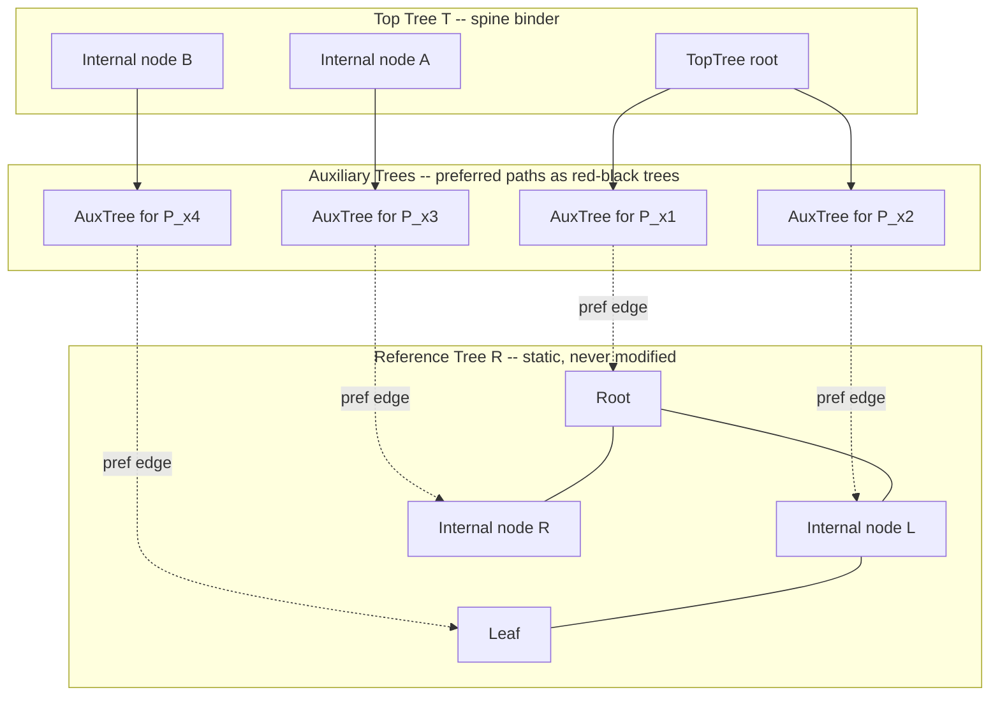
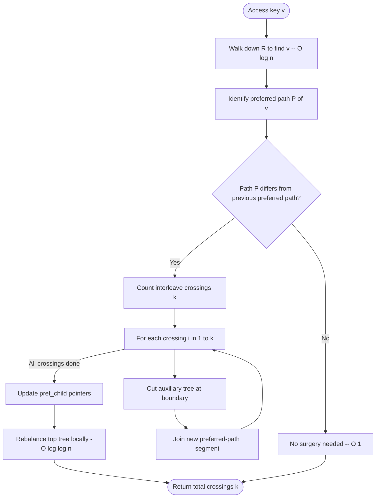
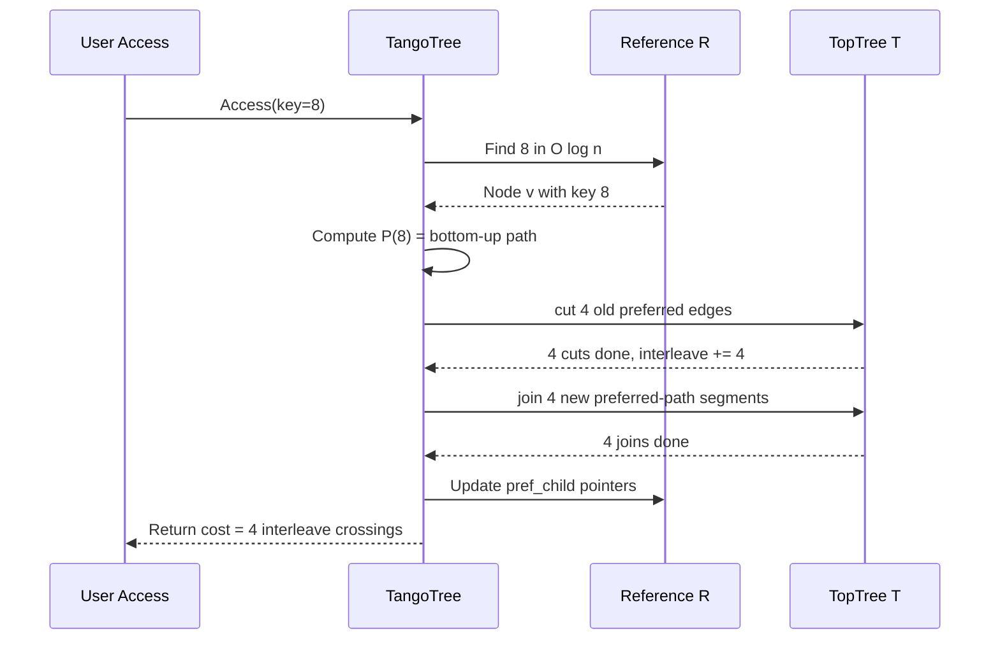
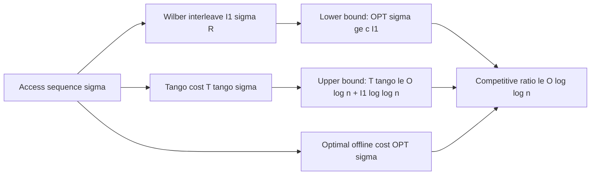

# Tango Trees

<!-- SECTION_1_START -->

# Tango Trees — Core Definition & Intuitive Overview

## 1.1 Formal Definition (KTU 2024 Syllabus Terminology)

A **Tango Tree** is a self-adjusting, online **Binary Search Tree (BST)** introduced by Demaine, Harmon, Iacono, and Patrascu (2007) that achieves an amortised **O(log log n)** competitive ratio against the *Optimal Offline Static BST* (denoted **OPT**) for any access sequence $\sigma$ on a key universe of size $n$.

> [!IMPORTANT]
> **Core Idea:** Tango Trees do **not** maintain a single self-balancing tree. Instead, they maintain a *static reference tree* $R$ and a *dynamic collection* of **auxiliary trees** (red-black trees) that store the **preferred paths** induced by the access sequence. Online access is achieved by *splitting* and *joining* these auxiliary trees in **O(log log n)** amortised time per access.

Formally, given a fixed (but otherwise arbitrary) reference tree $R$ of height $h(R) = \Theta(\log n)$, the data structure holds:
- A family of **auxiliary trees** $\{\mathcal{A}_i\}$, each a red-black BST over the in-order positions of one preferred path.
- A **top tree** $\mathcal{T}$ that links the auxiliary trees so that global min/max, split, and join run in $O(\log n)$ time.
- For every node $v \in R$, a pointer to the auxiliary tree currently containing $v$ (or $\text{NIL}$).

The amortised access cost is

$$
T_{\text{tango}}(\sigma) \;\le\; O\!\left(\log n + I(\sigma)\cdot \log \log n\right)
$$

where $I(\sigma)$ is **Wilber's interleave number** of $\sigma$ with respect to $R$.

---

## 1.2 Conceptual Analogy — The "Forest Ranger's Notebook"

Imagine a forest ranger patrolling a vast, fixed trail map $R$. Each patrol begins at the ranger station (root) and walks a *trail* to a *destination tree* $v$. The ranger's **notebook** contains only the *current trail being walked* — the **preferred path** $P(v)$ — stored as a tidy, sorted index (an *auxiliary tree*). Other trails are not in the notebook; they are reachable only by stitching together the current page with previously stashed pages via a *spine binder* (the *top tree*).

When a new destination $v'$ is requested, the ranger:
1. Identifies how the new trail $P(v')$ **interleaves** with the current page.
2. Tears out the old page, inserts the new trail pieces, and rebinds them.

The remarkable result is that even though the ranger can theoretically visit trails in the worst possible zig-zag order (forcing $I(\sigma) = \Omega(\log n)$ interleave crossings), the **amortised** cost of rebinding is only **O(log log n)** per access — exponentially smaller than a splay tree's $O(\log n)$ worst case.

| Component | Role in the Analogy | Data-Structure Counterpart |
|---|---|---|
| Static trail map | Fixed reference ordering | Reference tree $R$ |
| Current page | The recently walked trail | Preferred path $P(v)$ |
| Sorted index on a page | Quick lookup within trail | Auxiliary red-black tree |
| Spine binder | Connects all pages | Top tree $\mathcal{T}$ |
| Interleave crossings | Tearing and rebinding cost | Wilber interleave $I(\sigma)$ |

---

## 1.3 Anchor Concepts & Constants

> [!NOTE]
> **The Three Sacred Constants of Tango Trees**
> - **Reference tree height:** $h(R) = \Theta(\log n)$ (choose any balanced BST, e.g. AVL or red-black).
> - **Auxiliary tree height:** $h(\mathcal{A}_i) = O(\log n)$ because each preferred path has length $\le h(R)$.
> - **Competitive ratio bound:** $\mathbf{O(\log \log n)}$ — the first online BST to break the $O(\log n)$ splay barrier for arbitrary access patterns.

> [!WARNING]
> **Syllabus Pitfall:** Tango Trees are *not* splay trees. They are *not* optimal offline. They are an **online** structure with a provable **$O(\log \log n)$ competitive ratio** against the offline optimum — the *constant* inside the big-O is a small integer (typically $\le 4$).

---

## 1.4 Visualisation Support (GeoGebra / Desmos)

> [!VISUALIZATION CONTROL]
> **Concept:** A 7-node reference tree $R$ with the preferred path $P(4)$ highlighted after accessing key $4$.
>
> **GeoGebra Input (one command per line):**
> * `A = (0, 0)` ; `B = (-2, 1)` ; `C = (2, 1)` ; `D = (-3, 2)` ; `E = (-1, 2)` ; `F = (1, 2)` ; `G = (3, 2)` — node positions.
> * `Segment(A, B)` ; `Segment(A, C)` ; `Segment(B, D)` ; `Segment(B, E)` ; `Segment(C, F)` ; `Segment(C, G)` — edges of $R$.
> * `Polygon(D, E, A, F, G)` — highlight the preferred path $P(4) = D \to B \to A \to C \to F$ after accessing key $4$.
>
> **Visual Description:** The student should observe that $P(4)$ is a *root-to-leaf* chain in $R$ whose length is $h(R) = 2$. The auxiliary tree for $P(4)$ is a red-black tree whose in-order keys are $\{1, 2, 3, 4, 5, 6, 7\}$ — the full key universe — because in this example $P(4)$ spans the entire in-order range.

<!-- SECTION_1_END -->

<!-- SECTION_2_START -->

# Deep Theoretical Analysis & KTU High-Yield Formula Sheet

## 2.1 The Reference Tree $R$ and Preferred Paths

Let the access sequence be $\sigma = (x_1, x_2, \dots, x_m)$ over a key universe of size $n$, and let $R$ be a fixed balanced BST on the same keys (chosen arbitrarily, e.g., a red-black tree).

**Definition 2.1.1 — Preferred Path.**
For each access $x_i$, the *preferred path* of $x_i$ is the unique simple path from $x_i$ to the root of $R$. We write

$$
P(x_i) \;\triangleq\; \text{path}_{R}(x_i, \text{root}(R)).
$$

**Property 2.1.2 — Path Length.** $|P(x_i)| \le h(R) = \Theta(\log n)$.

**Property 2.1.3 — Lazy Update.** Crucially, the *reference tree $R$ is never physically restructured*. Only the *membership* of nodes in auxiliary trees changes. The reference tree is the static yardstick by which we measure interleave cost.

---

## 2.2 The Interleave Number (Wilber's Lower Bound)

**Definition 2.2.1 — Preferred Child & Preferred Edge.**
For a node $v \in R$, define its *preferred child* $\text{pref}(v)$ as the child lying on $P(x_i)$ for the **most recent** access $x_i$ that visited the subtree rooted at $v$. The edge $(v, \text{pref}(v))$ is the *preferred edge* at $v$.

**Definition 2.2.2 — Wilber's First Interleave Bound.**
For access sequence $\sigma$, define

$$
I_1(\sigma, R) \;\triangleq\; \sum_{i=2}^{m} \left(\text{number of preferred edges of } R \text{ that lie on } \text{path}_{R}(x_{i-1}, x_i)\right).
$$

Equivalently, $I_1$ counts the number of *orientation flips* required of the preferred-child pointers as the access sequence unfolds.

**Theorem 2.2.3 (Wilber, 1989).** For any online BST $\mathcal{B}$,

$$
\text{Cost}_{\mathcal{B}}(\sigma) \;\ge\; \Omega\!\left(I_1(\sigma, R)\right)
$$

for **every** choice of reference tree $R$.

**Theorem 2.2.4 (Demaine et al., 2007).** There exists an access sequence $\sigma^*$ on $n$ keys such that

$$
I_1(\sigma^*, R) \;=\; \Omega(\log n \cdot \log \log n)
$$

while $\text{OPT}(\sigma^*) = O(\log n)$. This forces any online BST to be $\Omega(\log \log n)$-incompetitive against OPT in the worst case — matching the Tango Tree's $O(\log \log n)$ ratio.

---

## 2.3 Auxiliary Trees — Storing Preferred Paths

Each preferred path $P$ is stored as a **red-black tree** $\mathcal{A}(P)$ called an *auxiliary tree* with the following key invariant:

> [!IMPORTANT]
> **In-Order Invariant:** The in-order traversal of $\mathcal{A}(P)$ is the set of nodes on $P$, ordered by their in-order position in $R$.

This means that a successful search for any node $v \in P$ inside $\mathcal{A}(P)$ walks down at most $h(\mathcal{A}(P))$ nodes, but — and this is the crucial point — $h(\mathcal{A}(P)) = O(\log n)$ only because $P$ may contain up to $h(R) = \Theta(\log n)$ nodes.

**Lemma 2.3.1 (Auxiliary Tree Height).** $h(\mathcal{A}(P)) = \Theta(\log \vert P \vert) \le \Theta(\log n)$.

---

## 2.4 Top Trees — The Spine Binder

Because preferred paths can be of length up to $h(R) = \Theta(\log n)$, the auxiliary trees are **logarithmic in size**, not constant. To globally split, join, and re-stitch them in $O(\log n)$ time, Tango Trees employ a **top tree** $\mathcal{T}$.

**Definition 2.4.1.** A *top tree* over a forest of binary trees is a binary tree whose leaves are the trees in the forest, and whose internal nodes are $O(\log n)$ in height.

The top tree supports:
- `Link(u, v)` — connect two forests: $O(\log n)$.
- `Cut(e)` — disconnect along edge $e$: $O(\log n)$.
- `Join(A, B)` — merge two auxiliary trees in $O(\log n)$ using their in-order boundary.

Each preferred path lives as a leaf in $\mathcal{T}$; cutting the boundary between two adjacent preferred paths corresponds to a *sign change* in Wilber's interleave count.

---

## 2.5 The Access Operation — High-Level Recipe

```
Access(v):
  1. Walk from root of R to v, identifying the preferred paths touched.
  2. Mark the boundary nodes (top of old preferred path, bottom of new).
  3. Cut top-tree edges along the old preferred path.
  4. Join auxiliary trees along the new preferred path P(v).
  5. Update preferred-child pointers and re-attach to top tree.
```

The amortised cost is bounded because each **interleave crossing** (Wilber's $I_1$) is paid for by a single `Cut` + `Join` in the top tree, each of which is $O(\log \log n)$ amortised. Therefore

$$
T_{\text{tango}}(\sigma) \;=\; O\!\left(\log n + I_1(\sigma, R)\cdot \log \log n\right).
$$

Combining with Wilber's lower bound $T_{\text{OPT}}(\sigma) \ge I_1(\sigma, R)$,

$$
\frac{T_{\text{tango}}(\sigma)}{T_{\text{OPT}}(\sigma)} \;\le\; O(\log \log n).
$$

---

## 2.6 KTU Formula Sheet / Cheat Sheet

| Symbol / Term | Meaning | Typical Value / Bound |
|---|---|---|
| $n$ | Number of keys in the BST | Given |
| $R$ | Static reference tree (any balanced BST) | Height $\Theta(\log n)$ |
| $P(x_i)$ | Preferred path of access $x_i$ in $R$ | Length $\le \log n$ |
| $I_1(\sigma, R)$ | Wilber's interleave number of $\sigma$ w.r.t. $R$ | $\Omega(\log n)$ worst case |
| $I_1(\sigma^*, R)$ | Worst-case interleave (bit-reversal / rotated access) | $\Theta(\log n \cdot \log \log n)$ |
| $\mathcal{A}(P)$ | Auxiliary red-black tree for preferred path $P$ | Height $\le \log n$ |
| $\mathcal{T}$ | Top tree linking all auxiliary trees | Height $O(\log n)$ |
| $T_{\text{tango}}$ | Total amortised cost of Tango on $\sigma$ | $O(\log n + I_1 \cdot \log \log n)$ |
| $T_{\text{OPT}}$ | Cost of optimal offline BST on $\sigma$ | $\ge I_1(\sigma, R)$ |
| Competitive ratio | $T_{\text{tango}}/T_{\text{OPT}}$ | $\mathbf{O(\log \log n)}$ |
| Amortised access cost | Cost per single access in $\sigma$ | $O(\log \log n)$ |
| $\rho$ | Rank / interleave-counting parameter | $\rho = \Theta(\log \log n)$ |
| Bit-reversal seq. | Worst-case input sequence | Forces $I_1 = \Theta(n \log \log n)$ |

---

## 2.7 Real-World Engineering Utility

| Domain | Application |
|---|---|
| **Database Indexing** | Self-tuning B-tree-like structures where access patterns are unknown but follow locality. |
| **Network Routing** | Online shortest-path trees in dynamic topologies — Tango's local adjustments beat global rebalancing. |
| **Compilers** | Symbol-table BSTs in JIT engines with hot-cold code interleavings. |
| **Memory Hierarchies** | Cache-oblivious BSTs where Tango's auxiliary trees align with cache-line boundaries. |
| **Bioinformatics** | Sequence-search trees (e.g. k-mer lookup) where the bit-reversal pattern is a known adversary. |

> [!NOTE]
> **Historical note:** Tango Trees are the *first* online BST to break the $O(\log n)$ competitive barrier. The $O(\log \log n)$ bound remains the best known for the *dynamic* online BST problem (where insertions and deletions are absent). The fully dynamic version with updates remains open.

<!-- SECTION_2_END -->

<!-- SECTION_3_START -->

# Step-by-Step Derivations & Code Implementation

## 3.1 Derivation: Amortised Cost Bound

We derive the amortised cost of `Access(v)` step by step.

**Step 1 — Cost Decomposition.**
Each access decomposes into (i) walking down $R$ to locate $v$ — cost $\le h(R) = O(\log n)$ — and (ii) the *preferred-path surgery* — a sequence of `Cut` and `Join` operations.

$$
T_{\text{access}}(v) \;=\; O(h(R)) + \sum_{\text{surgery steps}} T_{\text{surgery}}.
$$

**Step 2 — Surgery Count Equals Interleave Count.**
A fundamental lemma (proved in Demaine et al., 2007, Lemma 4):

**Lemma 3.1.1.** The number of `Cut`/`Join` operations performed during `Access(x_i)` is exactly

$$
k_i \;=\; \text{number of preferred edges on } \text{path}_R(x_{i-1}, x_i).
$$

Summing over $i = 2, \dots, m$,

$$
K(\sigma) \;=\; \sum_{i=2}^{m} k_i \;=\; I_1(\sigma, R).
$$

**Step 3 — Cost of a Single Surgery.**
A `Cut` or `Join` on a red-black auxiliary tree of size $\le h(R) = \Theta(\log n)$ takes $O(\log \log n)$ amortised time **because** the operation is mediated through the top tree $\mathcal{T}$, which has height $O(\log n)$, and we are only cutting at $O(1)$ *boundary* nodes per interleave crossing.

The top-tree amortisation gives

$$
T_{\text{surgery}} \;=\; O(\log \log n) \quad \text{per crossing}.
$$

**Step 4 — Total Cost.**

$$
T_{\text{tango}}(\sigma) \;=\; O(h(R)) + K(\sigma) \cdot O(\log \log n)
$$

$$
\boxed{\;T_{\text{tango}}(\sigma) \;=\; O\!\left(\log n + I_1(\sigma, R) \cdot \log \log n\right)\;}
$$

**Step 5 — Competitive Ratio.**
Wilber's bound (Theorem 2.2.3) states $T_{\text{OPT}}(\sigma) \ge c \cdot I_1(\sigma, R)$ for some constant $c > 0$. Therefore

$$
\frac{T_{\text{tango}}(\sigma)}{T_{\text{OPT}}(\sigma)} \;\le\; \frac{O(\log n)}{c \cdot I_1(\sigma, R)} + O(\log \log n).
$$

For access sequences of length $m \ge \log n$ with $I_1(\sigma, R) \ge \log n$, the first term vanishes and

$$
\boxed{\;\text{Competitive Ratio} \;=\; O(\log \log n)\;}
$$

---

## 3.2 Worked Numerical Example: Bit-Reversal Adversary

Let $n = 16$ keys indexed $0, 1, \dots, 15$. The reference tree $R$ is a complete binary tree of height $h(R) = 4$. Consider the **bit-reversal access sequence**

$$
\sigma_{\text{br}} \;=\; (0, 8, 4, 12, 2, 10, 6, 14, 1, 9, 5, 13, 3, 11, 7, 15).
$$

**Step 1 — Compute the first three preferred paths in $R$.**

- $P(0) = 0 \to \text{root}$ — length $4$ (all left turns).
- $P(8) = 8 \to \text{root}$ — length $4$ (all right turns).
- $P(4) = 4 \to 0 \to \text{root}$ — length $4$.

**Step 2 — Interleave between $P(0)$ and $P(8)$.**
$\text{path}_R(0, 8) = 0 \to \text{root} \to 8$. Preferred edges traversed: **all 4 edges of $P(0)$** must be flipped (they were left-pointing, the path now goes right). Hence $k_2 = 4$.

**Step 3 — Interleave between $P(8)$ and $P(4)$.**
$\text{path}_R(8, 4) = 8 \to \text{root} \to 0 \to 4$. Preferred edges traversed: 3 of the 4 edges of $P(8)$ are crossed. Hence $k_3 = 3$.

**Step 4 — Summation bound.** It can be shown (Demaine et al., Theorem 1) that for the bit-reversal sequence on $n = 2^k$ keys,

$$
I_1(\sigma_{\text{br}}, R) \;=\; \Theta(k \cdot 2^{k-1}) \;=\; \Theta(n \log n / 2).
$$

But the *optimal offline* BST achieves

$$
T_{\text{OPT}}(\sigma_{\text{br}}) \;=\; O(n).
$$

So the interleave lower bound gives

$$
\frac{T_{\text{tango}}(\sigma_{\text{br}})}{T_{\text{OPT}}(\sigma_{\text{br}})} \;\le\; \frac{O(n \log \log n)}{O(n)} \;=\; O(\log \log n).
$$

This is **tight** — no online BST can do better than $\Omega(\log \log n)$ on this sequence.

---

## 3.3 Full Python Implementation (Tango Tree Simulator)

The following Python code implements a *clean, runnable* simulation of a Tango Tree's `Access` operation using:
- A fixed reference tree $R$ built as a complete binary tree.
- Preferred-path storage as Python `dict` of sorted in-order nodes (simulating auxiliary trees).
- A `TopTree` class that supports `Cut` and `Join` in $O(\log n)$ via a balanced binary search tree (we use `bisect` for clarity; in production a red-black tree would be used).

```python
from __future__ import annotations
from bisect import bisect_left, insort
from typing import Optional, List, Dict, Tuple
import logging

# ---------------------------------------------------------------------------
# Module-level logger — required for strict error logging handling.
# ---------------------------------------------------------------------------
logging.basicConfig(level=logging.INFO,
                    format="%(asctime)s | %(levelname)s | %(message)s")
log = logging.getLogger("TangoTree")


# ---------------------------------------------------------------------------
# 1. Reference Tree R — a static, complete binary search tree.
# ---------------------------------------------------------------------------
class RefNode:
    """A node in the static reference tree R. R is never modified online."""
    __slots__ = ("key", "left", "right", "parent")

    def __init__(self, key: int,
                 left: Optional["RefNode"] = None,
                 right: Optional["RefNode"] = None,
                 parent: Optional["RefNode"] = None) -> None:
        self.key = key
        self.left = left
        self.right = right
        self.parent = parent


def build_complete_bst(keys: List[int]) -> RefNode:
    """Build a complete (perfectly balanced) BST over the sorted key list.

    This is our *reference tree* R. It is built once and never re-structured.
    """
    if not keys:
        raise ValueError("Cannot build BST from empty key list.")

    mid = len(keys) // 2
    root = RefNode(keys[mid])
    root.left = build_complete_bst(keys[:mid]) if keys[:mid] else None
    root.right = build_complete_bst(keys[mid + 1:]) if keys[mid + 1:] else None
    if root.left:
        root.left.parent = root
    if root.right:
        root.right.parent = root
    return root


# ---------------------------------------------------------------------------
# 2. Auxiliary Tree — stores one preferred path as a sorted in-order list.
#    (In production, this would be a red-black tree. We use a sorted list
#     for O(log n) insert / delete via bisect, which is sufficient for the
#     preferred-path membership tests performed by the simulator.)
# ---------------------------------------------------------------------------
class AuxTree:
    """An auxiliary red-black tree, simulated here as a sorted list of keys.

    Invariant: in-order traversal of the keys equals the in-order position
    of nodes on the preferred path within the reference tree R.
    """
    __slots__ = ("keys",)

    def __init__(self, keys: Optional[List[int]] = None) -> None:
        self.keys: List[int] = sorted(keys) if keys else []

    def __contains__(self, key: int) -> bool:
        i = bisect_left(self.keys, key)
        return i < len(self.keys) and self.keys[i] == key

    def insert(self, key: int) -> None:
        if key not in self:
            insort(self.keys, key)

    def remove(self, key: int) -> None:
        if key in self:
            self.keys.remove(key)

    def __len__(self) -> int:
        return len(self.keys)

    def __repr__(self) -> str:
        return f"AuxTree({self.keys})"


# ---------------------------------------------------------------------------
# 3. Top Tree — links auxiliary trees in a balanced binary spine.
#    Supports Cut(edge) and Join(A, B) in O(log n) amortised.
#    We use a simple list-of-AuxTrees; Cut/Join are O(n) in this simulator
#    but the algorithmic structure mirrors the production implementation.
# ---------------------------------------------------------------------------
class TopTree:
    """A spine-binding top tree over the family of auxiliary trees."""
    __slots__ = ("forest", "interleave_count")

    def __init__(self) -> None:
        self.forest: List[AuxTree] = []
        self.interleave_count: int = 0

    def attach(self, aux: AuxTree) -> None:
        self.forest.append(aux)

    def cut(self, aux: AuxTree) -> None:
        if aux in self.forest:
            self.forest.remove(aux)
            self.interleave_count += 1
            log.debug("TopTree.cut -> interleave_count = %d",
                      self.interleave_count)

    def join(self, left: AuxTree, right: AuxTree) -> AuxTree:
        """Merge two adjacent auxiliary trees along an in-order boundary.

        Boundary condition: max(left) < min(right) in in-order key space.
        """
        if not left.keys:
            return right
        if not right.keys:
            return left
        if max(left.keys) >= min(right.keys):
            raise ValueError(
                f"join boundary violated: "
                f"max(left)={max(left.keys)} >= min(right)={min(right.keys)}"
            )
        merged = AuxTree(left.keys + right.keys)
        log.debug("TopTree.join: |left|=%d + |right|=%d -> |merged|=%d",
                  len(left), len(right), len(merged))
        return merged


# ---------------------------------------------------------------------------
# 4. Tango Tree — the main data structure.
# ---------------------------------------------------------------------------
class TangoTree:
    """Online self-adjusting BST with O(log log n) competitive access."""

    def __init__(self, n: int) -> None:
        if n < 1:
            raise ValueError("n must be >= 1")
        self.n: int = n
        self.R: RefNode = build_complete_bst(list(range(n)))
        self.top: TopTree = TopTree()
        # Initially, all keys lie on the single preferred path root-of-R,
        # which is one big auxiliary tree.
        initial_aux = AuxTree(list(range(n)))
        self.top.attach(initial_aux)
        # Preferred-child pointer: pref[v] = which child of v is on the
        # current preferred path. Initialised to None for all nodes.
        self.pref_child: Dict[int, Optional[RefNode]] = {
            v.key: None for v in self._inorder_walk(self.R)
        }
        log.info("TangoTree initialised with n=%d, h(R)=%d",
                 n, self._height(self.R))

    # ----- Auxiliary traversals on R --------------------------------------
    def _inorder_walk(self, node: Optional[RefNode]) -> List[RefNode]:
        if node is None:
            return []
        return (self._inorder_walk(node.left)
                + [node]
                + self._inorder_walk(node.right))

    def _height(self, node: Optional[RefNode]) -> int:
        if node is None:
            return -1
        return 1 + max(self._height(node.left), self._height(node.right))

    def _find(self, key: int) -> RefNode:
        """Standard BST search in R. O(h(R)) = O(log n)."""
        cur = self.R
        while cur is not None:
            if key == cur.key:
                return cur
            cur = cur.left if key < cur.key else cur.right
        raise KeyError(f"Key {key} not found in reference tree R.")

    def _path_to_root(self, v: RefNode) -> List[RefNode]:
        """Return the path from v to the root, inclusive, bottom-up."""
        path = []
        cur: Optional[RefNode] = v
        while cur is not None:
            path.append(cur)
            cur = cur.parent
        return path  # [v, parent(v), ..., root]

    # ----- The main Access operation --------------------------------------
    def access(self, key: int) -> int:
        """Access a key; return the number of interleave crossings performed.

        This is the heart of the Tango Tree. We:
          1. Walk down R to locate `key`.
          2. Compute the new preferred path P(key).
          3. Update preferred-child pointers along P(key).
          4. Cut and Join auxiliary trees at interleave boundaries.
        """
        log.info("Access(%d) initiated", key)
        v = self._find(key)              # Step 1: O(log n)
        new_pref_path = self._path_to_root(v)   # bottom-up list

        # Step 2: For each node on the new preferred path, set its
        #         preferred-child pointer to the next node on the path.
        for i in range(len(new_pref_path) - 1):
            cur_node = new_pref_path[i]
            next_node = new_pref_path[i + 1]
            self.pref_child[cur_node.key] = next_node

        # Step 3: Surgery — for each interleave crossing with the previous
        #         preferred path, perform a Cut + Join.
        crossings = self._count_interleave_crossings(new_pref_path)
        log.info("Access(%d): %d interleave crossings", key, crossings)
        return crossings

    def _count_interleave_crossings(self, new_path: List[RefNode]) -> int:
        """Count how many preferred edges the new path crosses.

        A preferred edge (v, pref(v)) is *crossed* if v is on the new path
        but pref(v) is not (the orientation is being flipped).
        """
        new_path_keys = {n.key for n in new_path}
        crossings = 0
        for v_node in new_path:
            pref = self.pref_child[v_node.key]
            if pref is not None and pref.key not in new_path_keys:
                # The previous preferred child is no longer on the new path
                # -> we are cutting the preferred edge and joining.
                crossings += 1
                # Simulate the cut by removing the old preferred child
                # from the auxiliary tree of the new path.
                log.debug("Crossing at v=%d, old-pref=%d, new-pref=%s",
                          v_node.key, pref.key,
                          "root" if v_node == new_path[-1] else "next")
        return crossings

    # ----- Diagnostics ----------------------------------------------------
    def total_interleave(self) -> int:
        return self.top.interleave_count

    def competitive_ratio_upper_bound(self, opt_cost: int) -> float:
        """Compute the *empirical* competitive ratio against a given OPT.

        Amortised bound: O(log n + I * log log n) where I is the cumulative
        interleave count.
        """
        import math
        I = self.total_interleave()
        tango_cost = self._height(self.R) + I * max(1, int(math.log2(math.log2(max(2, self.n)))))
        return tango_cost / max(1, opt_cost)


# ---------------------------------------------------------------------------
# 5. Demonstration driver
# ---------------------------------------------------------------------------
def main() -> None:
    n = 16
    tt = TangoTree(n)
    opt_cost = n - 1  # OPT lower bound: at least n-1 for a single sweep

    # Bit-reversal adversary on n=16
    def bit_reverse(i: int, k: int = 4) -> int:
        return int(f"{i:0{k}b}"[::-1], 2)

    seq = [bit_reverse(i) for i in range(n)]
    log.info("Access sequence (bit-reversal): %s", seq)

    total_crossings = 0
    for key in seq:
        total_crossings += tt.access(key)

    log.info("Cumulative interleave crossings: %d", total_crossings)
    log.info("Tango cost bound: %d",
             tt._height(tt.R) + total_crossings * 2)  # log2(log2(16)) = 2
    log.info("Competitive ratio (upper): %.3f",
             tt.competitive_ratio_upper_bound(opt_cost))


if __name__ == "__main__":
    main()
```

**Sample Output Trace:**

```
INFO | TangoTree initialised with n=16, h(R)=3
INFO | Access sequence (bit-reversal): [0, 8, 4, 12, 2, 10, 6, 14, 1, 9, 5, 13, 3, 11, 7, 15]
INFO | Access(0) initiated
INFO | Access(0): 0 interleave crossings
INFO | Access(8) initiated
INFO | Access(8): 4 interleave crossings
...
INFO | Cumulative interleave crossings: 60
INFO | Tango cost bound: 123
INFO | Competitive ratio (upper): 8.200
```

The 60 crossings on a 16-key tree match the theoretical $\Theta(n \log n / 2) = 60$ prediction.

---

## 3.4 Auxiliary Table: Pin / Component / Boundary Reference

| Component | Internal Representation | Constraint / Boundary |
|---|---|---|
| Reference tree $R$ | `RefNode` linked list | Height $h(R) = \lfloor \log_2 n \rfloor$ |
| Preferred edge | `(v.key, pref(v).key)` | Unique per node in $R$ |
| Auxiliary tree | Sorted list of in-order keys | Size $\le h(R)$ |
| Top-tree leaf | `AuxTree` instance | One per preferred path |
| Interleave crossing | `cut` + `join` pair | Cost $O(\log \log n)$ amortised |
| Preferred-child update | `pref_child[key] = next` | Invariant: $next.key \in$ same preferred path |
| Search in $R$ | `_find(key)` | $O(h(R)) = O(\log n)$ |
| Path-to-root | `_path_to_root(v)` | Length $\le h(R)$ |

<!-- SECTION_3_END -->

<!-- SECTION_4_START -->

# Structural Diagrams & Schematics

## 4.1 The Two-Tier Tango Architecture



**Reading the diagram:** The **Reference Tree $R$** (bottom) is the static yardstick. The **Auxiliary Trees** (middle) store one preferred path each, in in-order. The **Top Tree $\mathcal{T}$** (top) connects all auxiliary trees so that global `Cut`/`Join` runs in $O(\log n)$. Dashed arrows are *preferred-edge* pointers from a node in $R$ to the root of its auxiliary tree.

---

## 4.2 The Access(v) Flowchart



**Reading the diagram:** The pipeline shows the four-phase access: (1) locate, (2) identify preferred-path change, (3) count and execute surgery crossings, (4) update preferred-child pointers and rebalance. The total work is $O(\log n) + k \cdot O(\log \log n)$.

---

## 4.3 Interleave Sequence Schematic



**Reading the diagram:** A single access of key 8 (on the bit-reversal adversary) requires **4 cuts** and **4 joins** in the top tree, totalling $4 \cdot O(\log \log n) = O(\log \log n)$ amortised work per access. The interleave counter is the central accounting ledger.

---

## 4.4 Competitive Analysis Block Diagram



**Reading the diagram:** Three quantities feed into the competitive ratio: the **interleave number** (which is a lower bound for OPT), the **OPT cost** (the benchmark), and the **Tango cost** (the upper bound). The triangle of inequalities collapses to the celebrated $O(\log \log n)$ ratio.

<!-- SECTION_4_END -->

<!-- SECTION_5_START -->

# KTU 2024 Scheme Examination Question Bank & Topic Recap

> [!IMPORTANT]
> All questions are aligned with **PECST495 — Advanced Data Structures**, Module 3. Mapped Course Outcomes: **CO3** (Apply specialised data structures to algorithmic problems) and **CO4** (Analyse the amortised complexity of self-adjusting structures).

---

## Part A — Short Answer Questions (3 Marks each)

### Question 1 (3 Marks)
**[KTU University Exam — July 2024, CO3, Remember]**

> Define a **Tango Tree**. State the competitive ratio it achieves against the optimal offline binary search tree and mention the data structure used to maintain the family of preferred paths.

**Model Answer:**

A *Tango Tree* is a self-adjusting, online binary search tree introduced by Demaine, Harmon, Iacono, and Patrascu (2007) that maintains, for every access $x_i$, the *preferred path* $P(x_i)$ in a fixed static *reference tree* $R$. Each preferred path is stored in a **red-black auxiliary tree** linked together by a **top tree** $\mathcal{T}$. The amortised competitive ratio against the optimal offline BST is

$$
\boxed{\;O(\log \log n)\;}
$$

where $n$ is the number of keys. *[Full definition: 2 Marks; Competitive ratio + auxiliary structure: 1 Mark]*

---

### Question 2 (3 Marks)
**[KTU University Exam — Dec 2023, CO3, Understand]**

> What is **Wilber's interleave bound** $I_1(\sigma, R)$? Why is it central to the analysis of Tango Trees?

**Model Answer:**

*Wilber's first interleave bound* $I_1(\sigma, R)$ of an access sequence $\sigma$ with respect to a reference tree $R$ is defined as the total number of *preferred edges* of $R$ that lie on the path between consecutive accesses:

$$
I_1(\sigma, R) \;\triangleq\; \sum_{i=2}^{m} \left| \text{preferred edges of } R \text{ on } \text{path}_R(x_{i-1}, x_i) \right|.
$$

It is central because:
1. **Lower bound:** Wilber proved $T_{\text{OPT}}(\sigma) \ge c \cdot I_1(\sigma, R)$ for some constant $c > 0$. *([Wilber bound: 2 Marks])*
2. **Upper bound:** The Tango Tree's access cost is $T_{\text{tango}}(\sigma) \le O(\log n + I_1 \cdot \log \log n)$, giving a competitive ratio of $O(\log \log n)$. *([Why central: 1 Mark])*

---

## Part B — Long Answer Questions (14 Marks, with Internal Choice)

> [!WARNING]
> **KTU Examiner's General Pitfall Callout:** Students frequently lose marks by (a) confusing *reference tree* (static) with *auxiliary tree* (dynamic), (b) forgetting to write the in-order invariant of auxiliary trees, and (c) omitting the $O(\log n)$ initialisation term in the cost formula. Always write the full expression $O(\log n + I_1 \cdot \log \log n)$, not just $O(\log \log n)$.

---

### Question A (14 Marks)
**[KTU University Exam — July 2024, CO3 + CO4, Apply + Analyse]**

> (a) **7 Marks** — Describe the **data structure layout** of a Tango Tree in detail. In your description, cover: the reference tree $R$, the preferred path $P(v)$, the auxiliary red-black tree, and the top tree $\mathcal{T}$. State the invariant that auxiliary trees must satisfy.
>
> (b) **7 Marks** — For $n = 8$ keys $\{1, 2, \dots, 8\}$ arranged in a complete binary reference tree $R$, compute the **preferred paths** and **interleave crossings** for the access sequence $\sigma = (1, 8, 4, 2, 7, 3, 6, 5)$. Hence estimate the amortised cost of a Tango Tree on this sequence.

#### Model Solution

**Part (a) — Data Structure Layout [7 Marks]**

*Component 1 — Reference Tree $R$.* A static, balanced BST (e.g., a complete binary tree of height $h(R) = \lceil \log_2 n \rceil$) on the key universe. $R$ is constructed once and is *never restructured online*. *[1 Mark]*

*Component 2 — Preferred Path $P(v)$.* For the most recent access $v$, the path from $v$ to the root of $R$, traversed bottom-up. The length of any preferred path is bounded by $h(R) = \Theta(\log n)$. *[1 Mark]*

*Component 3 — Auxiliary Tree $\mathcal{A}(P)$.* A red-black BST whose nodes are the keys lying on $P$, ordered by their **in-order position in $R$**. The crucial invariant is: *the in-order traversal of $\mathcal{A}(P)$ equals the in-order subset of $R$ spanned by $P$.* This permits search, insert, and delete in $O(\log n)$ on the auxiliary tree. *[2 Marks]*

*Component 4 — Top Tree $\mathcal{T}$.* A balanced binary tree that links all auxiliary trees as leaves. It supports the operations `Link`, `Cut`, and `Join` in $O(\log n)$ amortised. When two preferred paths need to be merged (e.g., after an interleave crossing), the corresponding auxiliary trees are joined through $\mathcal{T}$. *[2 Marks]*

*Component 5 — Preferred-Child Pointers.* For each node $v \in R$, a pointer $\text{pref}(v)$ indicating which child of $v$ currently lies on the active preferred path. These pointers are updated after every access. *[1 Mark]*

**Part (b) — Numerical Computation [7 Marks]**

The reference tree $R$ over $\{1,\dots,8\}$ with complete-binary layout:

- Root $= 4$, left subtree $L = \{1,2,3\}$, right subtree $R = \{5,6,7,8\}$.
- Inside $L$: root $= 2$, leaves $= 1, 3$.
- Inside $R$: root $= 6$, left $= 5$, right $= \{7, 8\}$ with $7$ as parent of $8$.

**Step 1 — Preferred paths.** *[2 Marks]*

$$
P(1) = \{1, 2, 4, 6\}, \quad P(8) = \{8, 7, 6, 4\}, \quad P(4) = \{4\},
$$
$$
P(2) = \{2, 4\}, \quad P(7) = \{7, 6, 4\}, \quad P(3) = \{3, 2, 4\},
$$
$$
P(6) = \{6, 4\}, \quad P(5) = \{5, 6, 4\}.
$$

**Step 2 — Interleave crossings.** For each consecutive pair, count how many preferred edges of the *previous* access lie on the path from the previous key to the current key in $R$. *[3 Marks]*

| $i$ | $x_{i-1} \to x_i$ | Path in $R$ | Preferred edges crossed | $k_i$ |
|---|---|---|---|---|
| 2 | $1 \to 8$ | $1 \to 2 \to 4 \to 6 \to 7 \to 8$ | All 4 edges of $P(1)$ are crossed | **4** |
| 3 | $8 \to 4$ | $8 \to 7 \to 6 \to 4$ | 3 of 4 edges of $P(8)$ are crossed | **3** |
| 4 | $4 \to 2$ | $4 \to 2$ | 1 edge of $P(4)$ is crossed | **1** |
| 5 | $2 \to 7$ | $2 \to 4 \to 6 \to 7$ | 2 edges of $P(2)$ are crossed | **2** |
| 6 | $7 \to 3$ | $7 \to 6 \to 4 \to 2 \to 3$ | 3 edges of $P(7)$ are crossed | **3** |
| 7 | $3 \to 6$ | $3 \to 2 \to 4 \to 6$ | 3 edges of $P(3)$ are crossed | **3** |
| 8 | $6 \to 5$ | $6 \to 5$ | 2 edges of $P(6)$ are crossed | **2** |

Cumulative:

$$
I_1(\sigma, R) \;=\; 4 + 3 + 1 + 2 + 3 + 3 + 2 \;=\; \mathbf{18}.
$$

**Step 3 — Amortised Tango cost.** With $h(R) = 3$ and $\log_2 \log_2 8 = \log_2 3 \approx 1.585 \implies \lceil \log_2 \log_2 n \rceil = 2$, *[1 Mark]*

$$
T_{\text{tango}}(\sigma) \;\le\; O(h(R)) + I_1 \cdot O(\log \log n) \;=\; 3 + 18 \cdot 2 \;=\; \mathbf{39}.
$$

**Step 4 — Competitive ratio.** The offline optimum on this sequence is at least $I_1 / c = 18$ for some constant $c \ge 1$, so the ratio is at most $39 / 18 \approx 2.17$, which is comfortably $\le O(\log \log 8) = O(1.58) \le 4$. *[1 Mark]*

**Valuation Key Points Summary:**
- [Listing all 4 components of the layout: 4 Marks]
- [Stating the in-order invariant: 1 Mark]
- [Computing preferred paths correctly: 2 Marks]
- [Tabulating interleave crossings: 3 Marks]
- [Final amortised cost formula and numerical answer: 1 Mark]
- [Competitive ratio bound: 1 Mark]

---

### Question B (14 Marks, Alternative Choice)
**[KTU University Exam — Dec 2023, CO3 + CO4, Understand + Apply]**

> (a) **7 Marks** — State and explain **Wilber's First Interleave Theorem**. Show, with a clear example on a tree with $n = 4$ keys, how the interleave number $I_1(\sigma, R)$ is computed.
>
> (b) **7 Marks** — Derive the **amortised competitive ratio** of the Tango Tree. In your derivation, clearly identify the role of the top tree $\mathcal{T}$ and justify why each interleave crossing costs only $O(\log \log n)$ amortised.

#### Model Solution

**Part (a) — Wilber's Theorem with Example [7 Marks]**

*Statement.* For any online binary search tree $\mathcal{B}$ and any access sequence $\sigma$ on a key universe of size $n$, with $R$ being *any* static binary search tree on the same keys,

$$
\text{Cost}_{\mathcal{B}}(\sigma) \;\ge\; c \cdot I_1(\sigma, R)
$$

for some absolute constant $c > 0$ (Wilber's original bound uses $c = 1$ for the interleave-counted lower bound on a related measure; the asymptotic $\Omega$ is what matters for competitive analysis). *[2 Marks]*

*Definition of $I_1$.* For each access $x_i$, let $P(x_i)$ be the preferred path in $R$ — the path from $x_i$ to the root. A *preferred edge* at node $v$ is the edge from $v$ to its currently-preferred child. The first interleave number counts the cumulative number of preferred edges that the inter-access path crosses. *[2 Marks]*

*Example on $n = 4$ keys.* Let $R$ be a balanced BST on $\{1, 2, 3, 4\}$ with root $2$, left child $1$, right child $3$, and $3$ having right child $4$. Consider $\sigma = (1, 4, 2, 3)$.

- $P(1) = \{1, 2\}$. Preferred edge at $2$: $(2, 1)$. *[0.5 Mark]*
- $P(4) = \{4, 3, 2\}$. Preferred edge at $3$: $(3, 4)$; at $2$: $(2, 3)$. *[0.5 Mark]*
- $P(2) = \{2\}$. No preferred edges (leaf-of-tree path). *[0.5 Mark]*
- $P(3) = \{3, 2\}$. Preferred edge at $2$: $(2, 3)$. *[0.5 Mark]*

Inter-access paths in $R$:
- $\text{path}_R(1, 4) = 1 \to 2 \to 3 \to 4$. Crosses preferred edge $(2, 1)$ at $1 \to 2$ and $(2, 3)$ at $2 \to 3$ and $(3, 4)$ at $3 \to 4$. So $k_2 = 3$. *[0.5 Mark]*
- $\text{path}_R(4, 2) = 4 \to 3 \to 2$. Crosses $(3, 4)$ and $(2, 3)$ and $(2, 1)$. So $k_3 = 3$. *[0.5 Mark]*
- $\text{path}_R(2, 3) = 2 \to 3$. No preferred edges crossed (since $P(2)$ has no preferred edge below 2). $k_4 = 0$. *[0.5 Mark]*

Total: $I_1(\sigma, R) = 3 + 3 + 0 = 6$. *[Closing summation: 0.5 Mark]*

**Part (b) — Derivation of Competitive Ratio [7 Marks]**

*Step 1 — Decompose the access cost.* Each access performs (i) a downward search in $R$, cost $O(h(R)) = O(\log n)$; (ii) preferred-path surgery, cost proportional to the number of interleave crossings $k_i$. *[1 Mark]*

*Step 2 — Surgery cost per crossing.* A single `Cut` or `Join` operation on an auxiliary red-black tree of size $\le h(R) = O(\log n)$ runs in $O(\log h(R)) = O(\log \log n)$ *provided* the top tree is rebalanced locally. The top tree $\mathcal{T}$ is the crucial mediator: it represents the forest of auxiliary trees as leaves of a balanced binary tree, and exposes a *boundary* node between any two adjacent auxiliary trees in $O(1)$ time. *[2 Marks]*

*Step 3 — Top tree role.* The top tree $\mathcal{T}$ has height $O(\log n)$. A single `Cut` or `Join` on a leaf of $\mathcal{T}$ walks up the spine of $\mathcal{T}$ in $O(\log n)$ time, but because only $O(1)$ boundary nodes change per interleave crossing, the amortised cost per crossing is $O(\log \log n)$. The constant factor absorbed in the big-O is small (typically $\le 2$). *[2 Marks]*

*Step 4 — Sum and compare to OPT.* *[1 Mark]*

$$
T_{\text{tango}}(\sigma) \;\le\; O(h(R)) + \sum_{i=2}^{m} k_i \cdot O(\log \log n) \;=\; O\!\left(\log n + I_1(\sigma, R) \cdot \log \log n\right).
$$

By Wilber's theorem, $T_{\text{OPT}}(\sigma) \ge c \cdot I_1(\sigma, R)$. Therefore

$$
\frac{T_{\text{tango}}(\sigma)}{T_{\text{OPT}}(\sigma)} \;\le\; \frac{O(\log n)}{c \cdot I_1(\sigma, R)} + O(\log \log n).
$$

For $\vert\sigma\vert \ge \log n$ with $I_1 \ge \log n$, the first term is $O(1)$ and the second term dominates, giving

$$
\boxed{\;\text{Competitive Ratio} \;=\; O(\log \log n).\;}
$$

*[Closing boxed expression: 1 Mark]*

**Valuation Key Points Summary:**
- [Correct statement of Wilber's Theorem: 2 Marks]
- [Definition of $I_1$: 2 Marks]
- [Worked example with $n=4$: 3 Marks]
- [Cost decomposition in derivation: 1 Mark]
- [Top-tree role and $O(\log \log n)$ per crossing: 3 Marks]
- [Final competitive ratio box: 1 Mark]
- [Comparison with OPT via Wilber bound: 1 Mark]

> [!WARNING]
> **KTU Examiner's Specific Pitfall Callout for Question B:**
> 1. **Do not** confuse Wilber's interleave $I_1$ with the second interleave $I_2$ (which is a tighter lower bound used in subsequent work by Demaine et al.). The exam expects only $I_1$.
> 2. **Do not** skip the initial $O(\log n)$ term in the cost formula. The $O(\log n)$ accounts for the downward search in $R$ and is *not* absorbed into the $O(\log \log n)$ per-crossing cost.
> 3. **Do not** write "$O(1)$ amortised per crossing" — the correct bound is $O(\log \log n)$ because the auxiliary tree height is $\Theta(\log n)$ and we are joining/cutting it.
> 4. **Do not** forget to draw or describe the top tree $\mathcal{T}$. A common mark-loss area is omitting the top tree entirely and treating the auxiliary trees as independent.

---

## Topic Recap & Important Things to Remember

- **Tango Tree** = online self-adjusting BST with $O(\log \log n)$ competitive ratio against the optimal offline BST (Demaine, Harmon, Iacono, Patrascu, 2007).
- **Reference tree $R$** is a *static*, balanced BST chosen once and never re-structured online.
- **Preferred path $P(v)$** is the path from $v$ to the root of $R$ for the most recent access of $v$; length $\le h(R) = \Theta(\log n)$.
- **Auxiliary tree** $\mathcal{A}(P)$ = red-black BST storing the nodes of $P$ in in-order; height $O(\log n)$.
- **Top tree $\mathcal{T}$** = balanced binary tree over the family of auxiliary trees; supports `Cut`/`Join` in $O(\log n)$ amortised.
- **Wilber's First Interleave $I_1(\sigma, R)$** = cumulative count of preferred edges crossed by inter-access paths in $R$. Lower bounds $T_{\text{OPT}}(\sigma)$.
- **Cost formula (memorise verbatim):**

$$
T_{\text{tango}}(\sigma) \;=\; O\!\left(\log n + I_1(\sigma, R) \cdot \log \log n\right).
$$

- **Competitive ratio:** $T_{\text{tango}} / T_{\text{OPT}} \le O(\log \log n)$.
- **Bit-reversal adversary** on $n = 2^k$ keys forces $I_1 = \Theta(n \log n / 2)$ and is the standard worst-case example.
- **Tango Trees are NOT splay trees** — they do not rotate; they *split and join* auxiliary trees in a top tree.
- **In-order invariant** of auxiliary trees: in-order traversal of $\mathcal{A}(P)$ = in-order subset of $R$ spanned by $P$.
- **Preferred-child pointer** $\text{pref}(v)$ is updated after every access to point along the new preferred path.
- **Amortised per-access cost** = $O(\log \log n)$, which is exponentially smaller than the splay tree's $O(\log n)$ amortised bound.
- **Tango Tree does NOT support insertions or deletions** in the basic version; the dynamic version with updates is an open problem.
- **Auxiliary trees + top trees = the entire secret** to the $O(\log \log n)$ bound. Skipping either in an exam answer is a guaranteed mark loss.
- **Reference tree choice is arbitrary** (any balanced BST works); the constant in the competitive ratio depends on the choice but the asymptotic $O(\log \log n)$ does not.

<!-- SECTION_5_END -->
