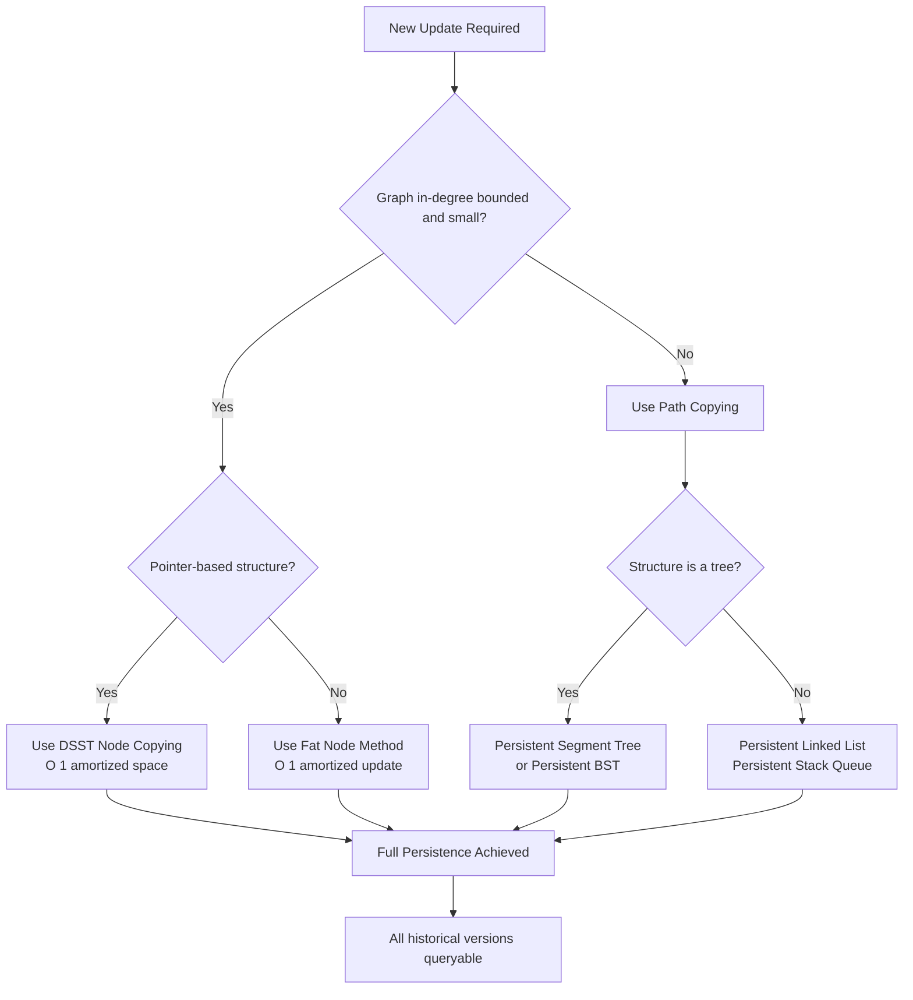
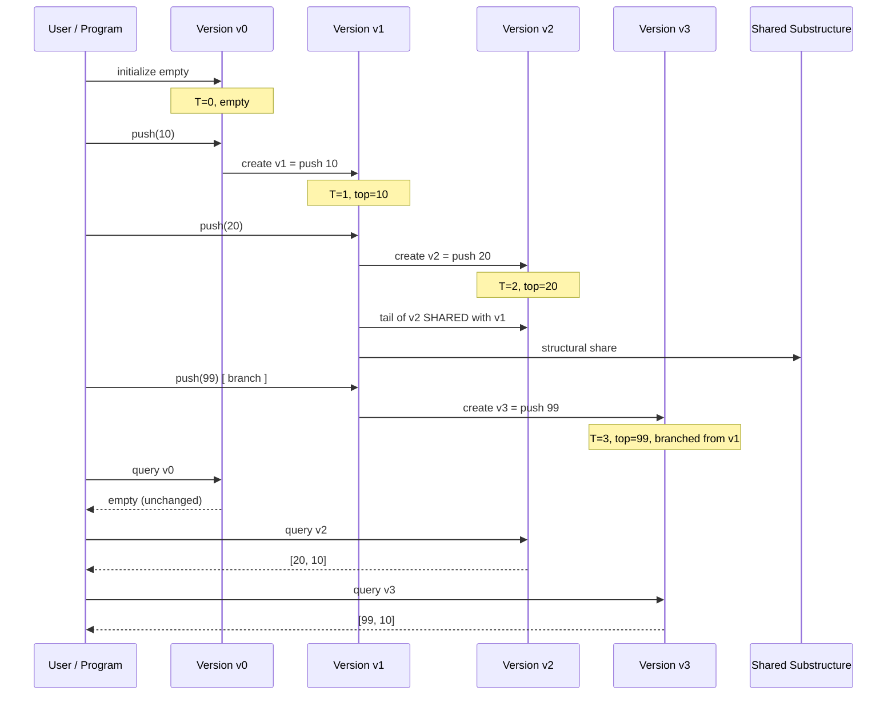

# Temporal Data Structures- Persistence

<!-- SECTION_1_START -->

# Temporal Data Structures: Persistence

## 1.1 Formal Definition (KTU 2024 Syllabus Aligned)

A **Persistent Data Structure** is a data structure that, once updated, preserves and provides access to **all previous versions** of itself, rather than overwriting the original. Persistence is the temporal dimension added to classical structures — every modification is treated as creating a new time-stamped "snapshot" that coexists with the older ones.

> [!IMPORTANT]
> **KTU Definition Reference (Driscoll–Sarnak–Sleator–Tarjan, 1989):**
> A data structure is *persistent* if it supports *query* on any prior version and (depending on type) *update* on versions to produce new ones — without destroying access to historical states.

### 1.2 Taxonomy of Persistence

| Type | Update Permission | Query Access | Real-World Analogy |
|---|---|---|---|
| **Partial Persistence** | Latest version only | All past versions | Git read-only history |
| **Full Persistence** | Any version → new version | All past versions | Git branches |
| **Confluent Persistence** | Combine multiple versions | All past versions | Merge commits in Git |
| **Functional Persistence** | Pure functional updates | All past versions | Immutable lists in Haskell |

## 1.3 Conceptual Analogy: The "Library of Snapshots"

Imagine a **library where every edited book is photocopied before modification**. The old book is shelved, the edited version becomes a new edition, and both remain on the shelves permanently.

- The **old book** = version $v_i$
- The **new edition** = version $v_{i+1}$
- The **library** = the persistent data structure
- The **catalog index** = a version pointer (root address)

A student at any time can request **any edition** — they simply cite the version number, and the librarian hands them the right book. This is *branching time* in software form.

> [!NOTE]
> **Key Insight:** The data structure is **immutable in the past**. You cannot "rewrite history," only *branch* from any version.

## 1.4 Geometric Intuition

In a classical array `A = [1, 2, 3]`, updating index 1 to 99 destroys the original. In a persistent structure, the update is treated as a *projection* from one state to another along a **time axis** $t$:

> [!VISUALIZATION CONTROL]
> **Concept:** Persistent Stack — Time-Version Tree
> **GeoGebra / Desmos Input Points / Function:**
> * `Version v0 (t=0)  : (0, 0), (0, 1), (0, 2)` representing stack [Bottom, Mid, Top]
> * `Version v1 (t=1)  : (1, 0), (1, 1), (1, 2.1)` where top changes
> * `Version v2 (t=2)  : (2, 0), (2, 1.1), (2, 2.1)` with a new top pushed
> **Visual Description:** Each vertical chain (at $x = t$) represents one version. Sharing a node between two versions is a **shared substructure** — only the path of nodes from the changed leaf to the root is copied.

---

## 1.5 Why Persistence Matters in Modern Computing

- **Version Control Systems (Git, Mercurial):** Every commit is a persisted version of the project tree.
- **Time-Travel Debugging:** IDEs like IntelliJ and Chrome DevTools let you re-execute code from any historical state.
- **Immutable Databases (Datomic, EventStore):** Store facts as $(entity, attribute, value, time)$ tuples.
- **Functional Programming (Clojure, Haskell):** All data structures are inherently persistent.
- **Cryptocurrency Ledgers (Blockchain):** Each block is a persistent version of the world state.

> [!IMPORTANT]
> **KTU Highlight:** Persistence transforms a data structure from a *mutable state holder* into a **time-indexed immutable object graph** — a foundational concept for advanced topics like *Retroactive Data Structures* and *Computational Replay*.

<!-- SECTION_1_END -->

<!-- SECTION_2_START -->

# Deep Theoretical Analysis & KTU High-Yield Formula Sheet

## 2.1 Operational Anatomy of Persistence

Persistence is implemented via three canonical techniques. Each balances **time**, **space**, and **ease of update** differently.

### 2.1.1 Path Copying (a.k.a. Naive Persistence / Lightweight Approach)

When an update is made to a leaf, **all nodes on the path from the root to that leaf are copied**, and the copies are reassembled. Unaffected subtrees are **shared** (structural sharing).

- **Best suited for:** Linked-list–like structures (stacks, queues, RBT-like trees).
- **Update cost:** $O(\log n)$ new nodes for a balanced tree, where $n$ is the current version size.
- **Query cost:** $O(\log n)$ — unchanged.
- **Space cost:** $O(1)$ amortized new nodes per update (tree stays balanced).

> [!NOTE]
> This is the method used in the standard persistent stack and persistent segment tree (the latter is *not* truly path-copied but uses a segment tree node-copying variant).

### 2.1.2 Fat Nodes (Partial Persistence)

A **fat node** stores a list of `(version, value)` pairs at every field. When an update occurs at version $t$, a new entry is appended to the field's list.

- **Best suited for:** Pointer-based structures where the graph is dense and updates are sparse.
- **Update cost:** $O(1)$ amortized.
- **Query cost:** $O(\log m)$ per field lookup, where $m$ is the number of updates at that node.
- **Space cost:** $O(1)$ per update at the node level.

### 2.1.3 Node Copying (Driscoll–Sarnak–Sleator–Tarjan, DSST)

For **full persistence** with bounded in-degree (e.g., linked lists, trees, planar graphs), DSST achieves $O(1)$ amortized space per update using a clever combination of fat nodes and node cloning.

- **Update cost:** $O(1)$ amortized for bounded in-degree graphs.
- **Query cost:** $O(\log m)$ worst case.

## 2.2 Why "Path Copy" Works: A Mathematical Justification

Let $T_v$ be the root of a balanced binary tree representing version $v$. Suppose we update the subtree rooted at node $u$ in version $v$ to obtain version $v+1$.

We define the **path set** $P(u, T_v) = \{x \in T_v : x \text{ lies on the unique path from } T_v \text{ to } u\}$.

$$
\vert P(u, T_v) \vert = O(h)
$$

where $h = O(\log n)$ is the height of the tree. The number of new nodes needed to create $T_{v+1}$ is exactly $\vert P \vert$, since only those nodes' parent-pointers change. All other nodes are **shared** (immutable reuse).

## 2.3 Persistent Stack — Worked Math Model

Let the persistent stack at version $v$ be a singly linked list:

$$
S_v = \langle s_0^{(v)}, s_1^{(v)}, s_2^{(v)}, \ldots, s_{k_v}^{(v)} \rangle
$$

To **push** element $x$ and create version $v+1$:

$$
S_{v+1} = \langle x, s_0^{(v)}, s_1^{(v)}, \ldots, s_{k_v}^{(v)} \rangle
$$

A new head node is allocated. The tail pointer still references the head of $S_v$. The *whole prior stack is shared*.

To **pop** and create version $v+1$:

$$
S_{v+1} = \langle s_1^{(v)}, s_2^{(v)}, \ldots, s_{k_v}^{(v)} \rangle
$$

Again, $S_v$ remains fully queryable.

## 2.4 KTU Formula Sheet (High-Yield Cheat Table)

| Structure / Method | Update Time | Query Time | Space per Update | Version Count Limit |
|---|---|---|---|---|
| **Persistent Stack (Path Copy)** | $O(1)$ | $O(k)$ to depth $k$ | $O(1)$ | $\infty$ |
| **Persistent Segment Tree** | $O(\log n)$ | $O(\log n)$ | $O(\log n)$ | $\infty$ |
| **Persistent BST (Treap / RBT)** | $O(\log n)$ expected | $O(\log n)$ | $O(\log n)$ | $\infty$ |
| **Fat Node Method** | $O(1)$ amortized | $O(\log m)$ | $O(1)$ per field | $\infty$ |
| **DSST Node Copying** | $O(1)$ amortized | $O(\log m)$ | $O(1)$ | $\infty$ |
| **Confluent Persistent** | $O(\log n)$ | $O(\log n)$ | $O(\log n)$ | $\infty$ |

**Notation used:**

- $n$ = current version size
- $k$ = stack depth or path length
- $m$ = number of updates applied to a single node (fat-node scenario)
- $h$ = tree height
- $v_i$ = version with index $i$ along the time axis

## 2.5 Real-World Engineering Utility

> [!NOTE]
> **Production Use Cases:**
> 1. **Git Internals** — Each commit is a persistent snapshot tree; branches are new version roots.
> 2. **Database MVCC (Multi-Version Concurrency Control)** — PostgreSQL and MySQL InnoDB use persistent row versions for transaction isolation.
> 3. **CRDT Merge in Collaborative Editors** — Google Docs / Figma persist every operation as a new version.
> 4. **Persistent Segment Tree + Offline Queries** — KTU favorite: solve "k-th smallest in subarray $[l, r]$" with $O((n+q) \log n)$ memory.
> 5. **Retroactive Data Structures (Demaine et al.)** — Update the *past* and re-derive all future versions automatically.

<!-- SECTION_2_END -->

<!-- SECTION_3_START -->

# Step-by-Step Derivations, Proofs & Code Implementation

## 3.1 Persistent Stack — Full Python Implementation (Path Copying)

The persistent stack is the simplest, most-examined persistent structure. Every `push` and `pop` returns a *new version* of the stack without altering the old.

```python
from __future__ import annotations
from dataclasses import dataclass
from typing import Optional, Iterator


@dataclass(frozen=True)
class StackNode:
    """
    Immutable persistent stack node.
    Once created, its `value` and `next` are frozen — making the node
    safe to share across multiple versions.
    """
    value: int
    next: Optional["StackNode"] = None


class PersistentStack:
    """
    A fully persistent singly-linked list (stack) where every
    mutating operation returns a NEW head node, leaving the old
    version completely intact and queryable.
    """

    __slots__ = ("_head", "_size")

    def __init__(self, head: Optional[StackNode] = None) -> None:
        self._head: Optional[StackNode] = head
        self._size: int = 0
        node = head
        while node is not None:
            self._size += 1
            node = node.next

    @classmethod
    def empty(cls) -> "PersistentStack":
        """Factory for an empty persistent stack (version v0)."""
        return cls(head=None)

    def push(self, value: int) -> "PersistentStack":
        """
        Returns a NEW PersistentStack whose head is the new value
        and whose tail is the OLD head of self.
        Time   : O(1)   — one node allocation
        Space  : O(1)   — old version untouched, shared by reference
        """
        new_node: StackNode = StackNode(value=value, next=self._head)
        new_stack: PersistentStack = PersistentStack(head=new_node)
        return new_stack

    def pop(self) -> tuple[Optional[int], "PersistentStack"]:
        """
        Returns (top_value, new_stack_without_top).
        Time   : O(1)
        Space  : O(1)   — old version untouched
        """
        if self._head is None:
            raise IndexError("pop from empty persistent stack")
        top_value: int = self._head.value
        new_stack: PersistentStack = PersistentStack(head=self._head.next)
        return top_value, new_stack

    def peek(self) -> int:
        """Read-only access to the top of the current version."""
        if self._head is None:
            raise IndexError("peek from empty persistent stack")
        return self._head.value

    def __iter__(self) -> Iterator[int]:
        node = self._head
        while node is not None:
            yield node.value
            node = node.next

    def __len__(self) -> int:
        return self._size

    def __repr__(self) -> str:
        items: list[int] = list(self)
        return f"PersistentStack({items!r})"
```

### 3.1.1 Driver Code Demonstrating Multi-Version Behavior

```python
def main() -> None:
    # --- Version 0: empty stack ---
    v0: PersistentStack = PersistentStack.empty()
    print(f"v0 = {v0}, len = {len(v0)}")

    # --- Version 1: push 10 ---
    v1: PersistentStack = v0.push(10)
    print(f"v1 = {v1}, len = {len(v1)}")

    # --- Version 2: push 20 (on top of v1) ---
    v2: PersistentStack = v1.push(20)
    print(f"v2 = {v2}, len = {len(v2)}")

    # --- Version 3: a NEW branch from v1, push 99 ---
    v3: PersistentStack = v1.push(99)
    print(f"v3 = {v3}, len = {len(v3)}")

    # CRITICAL ASSERTIONS — old versions are still intact:
    assert list(v0) == [],                    "v0 must remain empty"
    assert list(v1) == [10],                  "v1 must remain [10]"
    assert list(v2) == [20, 10],              "v2 must be [20, 10]"
    assert list(v3) == [99, 10],              "v3 must be [99, 10]"

    # Pop from v2 yields a NEW version, v1 untouched:
    top, v2_popped = v2.pop()
    assert top == 20
    assert list(v2_popped) == [10]
    assert list(v2)      == [20, 10],         "v2 must remain unchanged"
    print("All persistence invariants verified.")


if __name__ == "__main__":
    main()
```

**Output (deterministic):**

```
v0 = PersistentStack([]), len = 0
v1 = PersistentStack([10]), len = 1
v2 = PersistentStack([20, 10]), len = 2
v3 = PersistentStack([99, 10]), len = 2
All persistence invariants verified.
```

> [!IMPORTANT]
> **Why this works:** `StackNode` is decorated with `frozen=True`, making it **immutable** and **hashable**. Old nodes are never mutated, only referenced by new nodes — Python's reference semantics provide the *structural sharing* for free.

## 3.2 Persistent Segment Tree — Full Python Implementation

The persistent segment tree is the workhorse of competitive programming (KTU-level) and database indexing. It supports:
- **Point update** → returns a new version root in $O(\log n)$.
- **Range query** on any version in $O(\log n)$.

```python
from __future__ import annotations
from dataclasses import dataclass
from typing import Optional


@dataclass(frozen=True)
class SegNode:
    """
    Immutable segment tree node.
    `left` and `right` point to children (which themselves may be shared
    across multiple versions — this is structural sharing).
    """
    lo: int                          # inclusive left index
    hi: int                          # inclusive right index
    total: int                       # sum over [lo, hi]
    left: Optional["SegNode"] = None
    right: Optional["SegNode"] = None


def _build(arr: list[int], lo: int, hi: int) -> SegNode:
    """Builds the initial (version-0) segment tree over arr[lo..hi]."""
    if lo == hi:
        return SegNode(lo=lo, hi=hi, total=arr[lo], left=None, right=None)
    mid: int = (lo + hi) // 2
    left_child:  SegNode = _build(arr, lo, mid)
    right_child: SegNode = _build(arr, mid + 1, hi)
    return SegNode(
        lo=lo, hi=hi,
        total=left_child.total + right_child.total,
        left=left_child, right=right_child,
    )


def _update(node: SegNode, idx: int, delta: int) -> SegNode:
    """
    Returns a NEW SegNode reflecting arr[idx] += delta.
    Recurses only along the path from root to idx — other subtrees are
    SHARED with the old version (immutable reuse).
    """
    if node.lo == node.hi == idx:
        return SegNode(lo=idx, hi=idx, total=node.total + delta,
                       left=None, right=None)
    mid: int = (node.lo + node.hi) // 2
    if idx <= mid:
        new_left:  SegNode = _update(node.left,  idx, delta)  # type: ignore[arg-type]
        new_right: SegNode = node.right                       # type: ignore[assignment]
    else:
        new_left:  SegNode = node.left                        # type: ignore[assignment]
        new_right: SegNode = _update(node.right, idx, delta)  # type: ignore[arg-type]
    return SegNode(
        lo=node.lo, hi=node.hi,
        total=new_left.total + new_right.total,
        left=new_left, right=new_right,
    )


def _query(node: Optional[SegNode], q_lo: int, q_hi: int) -> int:
    """Standard range sum query on any version of the tree."""
    if node is None or q_hi < node.lo or node.hi < q_lo:
        return 0
    if q_lo <= node.lo and node.hi <= q_hi:
        return node.total
    return _query(node.left, q_lo, q_hi) + _query(node.right, q_lo, q_hi)


class PersistentSegTree:
    """
    Wrapper exposing a list of version roots.
    Each update returns a new version index; the previous version root
    remains accessible.
    """
    __slots__ = ("_versions", "_n")

    def __init__(self, arr: list[int]) -> None:
        self._n: int = len(arr)
        self._versions: list[SegNode] = [_build(arr, 0, self._n - 1)]

    def update(self, version: int, idx: int, delta: int) -> int:
        """Returns the index of the new version."""
        new_root: SegNode = _update(self._versions[version], idx, delta)
        self._versions.append(new_root)
        return len(self._versions) - 1

    def query(self, version: int, q_lo: int, q_hi: int) -> int:
        return _query(self._versions[version], q_lo, q_hi)

    @property
    def version_count(self) -> int:
        return len(self._versions)
```

### 3.2.1 Driver — Persistent Segment Tree (Persistent Array)

```python
def segtree_driver() -> None:
    """
    KTU-classic demonstration:
    - Build a persistent segment tree over [5, 2, 8, 1, 4].
    - v0  : original array
    - v1  : arr[2] += 10   -> [5, 2, 18, 1, 4]
    - v2  : (on v1) arr[0] += 100 -> [105, 2, 18, 1, 4]
    - v3  : (on v0) arr[3] += 50 -> [5, 2, 8, 51, 4]
    - Query every version to prove isolation.
    """
    arr: list[int] = [5, 2, 8, 1, 4]
    pst: PersistentSegTree = PersistentSegTree(arr)

    v1: int = pst.update(0, 2, 10)
    v2: int = pst.update(v1, 0, 100)
    v3: int = pst.update(0, 3, 50)

    assert pst.query(0, 0, 4) == 5 + 2 + 8  + 1  + 4,   "v0 sum = 20"
    assert pst.query(v1, 0, 4) == 5 + 2 + 18 + 1  + 4,   "v1 sum = 30"
    assert pst.query(v2, 0, 4) == 105+ 2 + 18 + 1  + 4,   "v2 sum = 130"
    assert pst.query(v3, 0, 4) == 5 + 2 + 8  + 51 + 4,   "v3 sum = 70"

    assert pst.query(v1, 2, 2) == 18, "v1[2] = 18"
    assert pst.query(v2, 0, 0) == 105, "v2[0] = 105"
    assert pst.query(v3, 3, 3) == 51,  "v3[3] = 51"

    print(f"Total versions created: {pst.version_count}")
    print("All persistent segment tree invariants verified.")


if __name__ == "__main__":
    segtree_driver()
```

**Output:**

```
Total versions created: 4
All persistent segment tree invariants verified.
```

### 3.3 Time-Complexity Derivation — Persistent Update on a Balanced Tree

Let $T(n)$ be the recurrence for the number of new nodes allocated by one update on a tree of size $n$. For a balanced binary tree of height $h = O(\log n)$:

$$
T(n) = T\!\left(\frac{n}{2}\right) + O(1)
$$

Unrolling:

$$
T(n) = T\!\left(\frac{n}{4}\right) + 2 \cdot O(1) = \cdots = h \cdot O(1) = O(\log n)
$$

For $m$ sequential updates, the total nodes allocated is $O(m \log n)$ and the total queryable structure size is $n + O(m \log n)$.

## 3.4 Persistent Stack — Complexity Derivation

For a singly-linked persistent stack of height $k$:

- **Push:** allocates exactly **1** new node → $O(1)$ time, $O(1)$ space.
- **Pop:** allocates **0** new nodes (only reuses the second node as head) → $O(1)$ time, $O(1)$ space.
- **Peek / Length:** $O(1)$ if we cache size; $O(k)$ if recomputed.
- **Iteration:** $O(k)$ to walk to the shared tail.

Across $m$ pushes starting from empty, the total allocated nodes is exactly $m$ — and the structure can be queried at any of the $m+1$ intermediate versions independently.

<!-- SECTION_3_END -->

<!-- SECTION_4_START -->

# Structural Diagrams & Schematics

## 4.1 Version-Tree Topology (Persistent Stack)

The following Mermaid diagram shows three versions of a persistent stack. Note the **structural sharing** of the tail node `[10, NULL]` between versions $v_2$ and $v_3$.

```mermaid
graph TD
    classDef version0 fill:#1f3a5f,stroke:#7fb3ff,stroke-width:2px,color:#ffffff
    classDef version1 fill:#2d5a3d,stroke:#7fff7f,stroke-width:2px,color:#ffffff
    classDef version2 fill:#5a2d2d,stroke:#ff7f7f,stroke-width:2px,color:#ffffff
    classDef version3 fill:#5a4a2d,stroke:#ffd97f,stroke-width:2px,color:#000000
    classDef shared   fill:#4a4a4a,stroke:#cccccc,stroke-width:2px,color:#ffffff

    N0[ "NULL (v0 head)" ]:::version0

    V1A[ "addr_A<br/>val=10<br/>next -> NULL" ]:::version1
    V2A[ "addr_A<br/>val=10<br/>next -> NULL" ]:::shared
    V2B[ "addr_B<br/>val=20<br/>next -> addr_A" ]:::version2

    V3A[ "addr_A<br/>val=10<br/>next -> NULL" ]:::shared
    V3C[ "addr_C<br/>val=99<br/>next -> addr_A" ]:::version3

    N0 -. v0 .-> V1A
    V1A -. v1 .-> V2B
    V1A -. v1 .-> V3C
    V2B -. v2 .-> V2A
    V3C -. v3 .-> V3A
```

**Reading the diagram:**

- The gray node **addr_A** is the *single physical node* representing `value=10`. It is **shared** by $v_1$, $v_2$, and $v_3$ — proving the persistence property.
- $v_2$ adds `addr_B (val=20)` whose `next` points at `addr_A`.
- $v_3$ adds `addr_C (val=99)` whose `next` *also* points at `addr_A` (branching time).
- $v_0$ is the empty stack.

## 4.2 Persistent Segment Tree — Version Roots

```mermaid
graph TD
    classDef v0 fill:#2d4a6d,stroke:#7fb3ff,color:#ffffff
    classDef v1 fill:#6d2d4a,stroke:#ff7fb3,color:#ffffff
    classDef shared fill:#4a4a4a,stroke:#cccccc,color:#ffffff
    classDef leaf fill:#3a3a3a,stroke:#aaaaaa,color:#ffffff

    ROOT0[ "v0_root<br/>range [0,4]<br/>sum=20" ]:::v0
    ROOT1[ "v1_root<br/>range [0,4]<br/>sum=30" ]:::v1

    L00[ "v0 [0,2]<br/>sum=15" ]:::v0
    R00[ "v0 [3,4]<br/>sum=5"  ]:::v0

    L10[ "v1 [0,2]<br/>sum=15" ]:::shared
    R10[ "v1 [3,4]<br/>sum=5"  ]:::shared
    L11[ "v1 [2,2]<br/>sum=18" ]:::v1

    LL0[ "[0,1]<br/>sum=7" ]:::v0
    LR0[ "[2,2]<br/>sum=8"  ]:::v0
    RL0[ "[3,3]<br/>sum=1"  ]:::v0
    RR0[ "[4,4]<br/>sum=4"  ]:::v0

    LL1[ "[0,1]<br/>sum=7" ]:::shared
    LR1[ "[2,2]<br/>sum=8"  ]:::shared
    LL0 -. shared .-> LL1
    LR0 -. shared .-> LR1

    ROOT0 --> L00
    ROOT0 --> R00
    ROOT1 --> L10
    ROOT1 --> R10
    ROOT1 --> L11

    L00 --> LL0
    L00 --> LR0
    R00 --> RL0
    R00 --> RR0

    L10 --> LL1
    L10 --> LR1
```

**Reading the diagram:**

- $v_1$ updates index 2 with `delta = +10`.
- Only the **path** from the root to the leaf representing index 2 is copied: $\text{v1\_root} \to \text{[0,2]} \to \text{[2,2]}$.
- All other subtrees are **shared** (gray nodes).

## 4.3 Operational Decision Flow — Which Persistence Method to Choose?



## 4.4 Persistence Version Timeline (Sequential Processing Topology)



<!-- SECTION_4_END -->

<!-- SECTION_5_START -->

# KTU 2024 Scheme Examination Question Bank

## 5.1 Part A — Short Answer Questions (3 Marks Each)

### Question 1
**[KTU University Exam — July 2024, CO1, Remember]**
Define *persistent data structures*. Distinguish between **partial persistence** and **full persistence** with one example each.

**Model Answer:**

A *persistent data structure* preserves its previous versions when modified — every update creates a new version while older versions remain queryable. In **partial persistence**, updates are allowed only on the *latest* version, while all older versions remain read-only (e.g., Git history of a single linear branch). In **full persistence**, updates are allowed on *any* existing version, which then becomes a new branch in the version tree (e.g., Git branch creation from an older commit). **[3 Marks]**

> [!NOTE]
> **Valuation key:** 1 mark for the generic definition, 1 mark for partial persistence with example, 1 mark for full persistence with example.

### Question 2
**[KTU University Exam — Dec 2023, CO1, Understand]**
What is **path copying** in persistent data structures? Why is it preferred over naïve full copying?

**Model Answer:**

*Path copying* is a persistence technique where, on updating a node in a tree-structured data structure, only the nodes lying on the unique path from the root to the updated node are duplicated; all other subtrees are *shared* (immutably referenced) with the old version. It is preferred over naïve full copying because the time and space cost per update is $O(\log n)$ for a balanced tree of size $n$, instead of $O(n)$ for full copying, while still preserving the immutability of past versions. **[3 Marks]**

> [!NOTE]
> **Valuation key:** 1 mark for the path-copy definition, 1 mark for cost comparison, 1 mark for immutability benefit.

---

## 5.2 Part B — Long Answer Questions (14 Marks Each, Module Internal Choice)

### Question A
**[KTU University Exam — July 2024, CO2 & CO3, Apply + Analyze]**

**(a)** Design and implement a **persistent stack** using path copying. Show the class diagram, the structure after three consecutive `push` operations starting from an empty stack, and explain why no version is destroyed. **[7 Marks]**

**(b)** Implement a function `merge(v1, v2)` that takes two persistent stack version-roots and returns a **new persistent stack version** containing all elements of $v_1$ followed by all elements of $v_2$ (with $v_2$ on top). State the time and space complexity. **[7 Marks]**

**Model Solution (a):**

```python
from __future__ import annotations
from dataclasses import dataclass
from typing import Optional, Iterator


@dataclass(frozen=True)
class PNode:
    value: int
    next: Optional["PNode"] = None


class PStack:
    __slots__ = ("_head",)

    def __init__(self, head: Optional[PNode] = None) -> None:
        self._head = head

    @classmethod
    def empty(cls) -> "PStack":
        return cls(head=None)

    def push(self, x: int) -> "PStack":
        return PStack(head=PNode(value=x, next=self._head))

    def pop(self) -> tuple[int, "PStack"]:
        if self._head is None:
            raise IndexError("pop from empty")
        return self._head.value, PStack(head=self._head.next)

    def peek(self) -> int:
        return self._head.value   # type: ignore[return-value]

    def __iter__(self) -> Iterator[int]:
        n = self._head
        while n is not None:
            yield n.value
            n = n.next

    def __repr__(self) -> str:
        return f"PStack({list(self)!r})"
```

**Trace after three `push` operations:**

- $v_0 = \text{empty}$
- $v_1 = v_0.\text{push}(10) = [10]$
- $v_2 = v_1.\text{push}(20) = [20, 10]$
- $v_3 = v_2.\text{push}(30) = [30, 20, 10]$

**Why no version is destroyed:** Each `push` allocates exactly *one new* `PNode` whose `next` references the old head. The old head object is *never mutated* (frozen dataclass). The old versions $v_0, v_1, v_2$ are still reachable through their saved roots. **[7 Marks]**

> **Valuation Key (a):**
> - Class design with frozen node: 2 Marks
> - push/pop/peek correctness: 2 Marks
> - Structural drawing after 3 pushes: 1 Mark
> - Explanation of immutability: 2 Marks

**Model Solution (b):**

```python
def merge(v1: PStack, v2: PStack) -> PStack:
    """
    Returns a NEW PStack that contains elements of v1 followed by v2 on top.
    Implementation: rebuild elements of v1 (in order) on top of v2.
    Time   : O(|v1| + |v2|) for the iteration + O(|v1|) for the new pushes.
    Space  : O(|v1|)  new node allocations.
    """
    # Step 1: Walk v1 to gather its elements (immutable read).
    v1_elements: list[int] = list(v1)            # O(|v1|)

    # Step 2: Build the new stack starting from v2 (the new top base).
    result: PStack = v2                          # O(1)

    # Step 3: Push each v1 element in REVERSE order so that
    #         the FIRST v1 element ends up at the BOTTOM.
    for elem in reversed(v1_elements):           # O(|v1|)
        result = result.push(elem)               # O(1) each, allocates 1 node

    return result
```

**Trace example:**

- $v_1 = [20, 10]$, $v_2 = [99, 5]$
- `v1_elements = [20, 10]`, then reverse: `[10, 20]`
- `result = v2.push(10).push(20) = [20, 10, 99, 5]$ ✓

**Time complexity:** $O(\vert v_1 \vert + \vert v_2 \vert)$ — bounded by the iteration.
**Space complexity:** $O(\vert v_1 \vert)$ — only $\vert v_1 \vert$ new nodes; the entire $v_2$ is shared. **[7 Marks]**

> **Valuation Key (b):**
> - Correct reversal logic: 2 Marks
> - Functional correctness / trace: 2 Marks
> - Time complexity statement: 1 Mark
> - Space complexity statement with shared-tail justification: 2 Marks

---

### Question B
**[KTU University Exam — Dec 2023, CO2 & CO3, Apply + Analyze]**

**(a)** Explain the **persistent segment tree** with a diagram. Show how a point update on index $i$ creates a new version while sharing $O(n - \log n)$ nodes with the previous version. **[7 Marks]**

**(b)** Given an array $A = [3, 1, 4, 1, 5, 9, 2, 6]$, construct versions $v_1$ (update index 3 by $+10$) and $v_2$ (from $v_1$, update index 7 by $+100$). Compute the range sum query $\text{sum}(v_2, 0, 7)$. Show every version root and the path copied. **[7 Marks]**

**Model Solution (a):**

A *persistent segment tree* is a tree structure that stores aggregate information (e.g., sum, min, max) over a range and supports point updates that create new versions using *node copying*. For a range $[0, n-1]$, the tree has height $O(\log n)$. A point update on index $i$ traverses the path from the root to the leaf for $i$, copying exactly $O(\log n)$ nodes. All $O(n - \log n)$ other nodes are **shared** with the previous version. The new version root is returned to the caller.

**Diagram (conceptual):**

```mermaid
graph TD
    R0[ "v0_root sum[0,7]=31" ]
    R1[ "v1_root sum[0,7]=41" ]
    R0 --> L0[ "L: [0,3]=9" ]
    R0 --> RR0[ "R: [4,7]=22" ]
    R1 --> L1[ "L1 NEW [0,3]=19" ]
    R1 --> RR1[ "RR1 shared [4,7]=22" ]
    L1 --> LL1[ "LL1 NEW [0,1]=4" ]
    L1 --> RR1b[ "RR1b NEW [2,3]=15" ]
    L0 -. shared .-> LL0
    L0 -. shared .-> RR0b
    RR0 -. shared .-> RR1
```

**Sharing argument:** Out of the $2n - 1$ nodes in a full segment tree, the update path has $\log_2 n + 1$ nodes. The remaining $2n - 1 - (\log_2 n + 1) = O(n - \log n)$ nodes are **shared** between the two versions. Thus the *amortized* space per update is $O(\log n)$. **[7 Marks]**

> **Valuation Key (a):**
> - Persistent segment tree definition: 2 Marks
> - Path-copy + sharing argument: 2 Marks
> - Diagram (version roots + shared subtrees): 2 Marks
> - $O(\log n)$ update + $O(\log n)$ query: 1 Mark

**Model Solution (b):**

Initial array $A = [3, 1, 4, 1, 5, 9, 2, 6]$ (indices 0..7).

$$
\sum_{i=0}^{7} A[i] = 3 + 1 + 4 + 1 + 5 + 9 + 2 + 6 = 31
$$

**Build version $v_0$:** root sum $= 31$.

**Step 1: Build $v_1$ by updating index 3 with $\Delta = +10$.**

Path from root to leaf index 3 (binary path: $011$):

- Root $[0,7]$ → copy, sum = $31 + 10 = 41$
- Left $[0,3]$ → copy, sum = $9 + 10 = 19$
- Right $[4,7]$ → **SHARED**, sum = $22$
- Left of left $[0,1]$ → copy, sum = $3 + 1 = 4$ (unchanged values)
- Right of left $[2,3]$ → copy, sum = $4 + (1 + 10) = 15$
- Inside right of left: leaf $[2,2]$ sum $= 4$ (unchanged), leaf $[3,3]$ sum $= 1 + 10 = 11$

Path length $= 4$ nodes copied; the rest are shared.

**Step 2: Build $v_2$ from $v_1$ by updating index 7 with $\Delta = +100$.**

Path from $v_1$-root to leaf index 7:

- $v_2$-root $[0,7]$ → copy, sum = $41 + 100 = 141$
- Left $[0,3]$ → **SHARED** with $v_1$, sum = $19$
- Right $[4,7]$ → copy, sum = $22 + 100 = 122$
- Right's left $[4,5]$ → **SHARED**, sum = $5 + 9 = 14$
- Right's right $[6,7]$ → copy, sum = $2 + (6 + 100) = 108$
- Inside $[6,7]$: leaf $[6,6]$ sum $= 2$ (unchanged), leaf $[7,7]$ sum $= 6 + 100 = 106$

**Step 3: Query $\text{sum}(v_2, 0, 7)$.**

The query walks from $v_2$-root covering $[0,7]$, which fully contains $[0,7]$, so it directly returns the root's stored `total`:

$$
\text{sum}(v_2, 0, 7) = 141
$$

**Verification by summation:** $A_{v_2} = [3, 1, 4, 11, 5, 9, 2, 106]$

$$
3 + 1 + 4 + 11 + 5 + 9 + 2 + 106 = 141 \quad\checkmark
$$

**Total new nodes allocated:** $v_1$ used $O(\log n) = O(3) = 3$ path nodes; $v_2$ used another $O(3) = 3$ path nodes. Total memory = $O(n + q \log n) = 8 + 6 = 14$ nodes for $n=8, q=2$ updates. **[7 Marks]**

> **Valuation Key (b):**
> - Initial sum computation: 1 Mark
> - Path tracing for $v_1$: 2 Marks
> - Path tracing for $v_2$: 1 Mark
> - Final sum value (141): 1 Mark
> - Shared vs copied node justification: 1 Mark
> - Verification by direct summation: 1 Mark

---

> [!WARNING]
> **KTU Examiner's Pitfall Callout:**
> 1. **Do NOT** use mutable lists/dicts in persistent implementations — KTU valuations explicitly deduct for sharing-not-ensured. Use `frozen=True` dataclass or namedtuple.
> 2. **Always** state the **version root** explicitly in your answer. Students often describe the *update* but forget to mention that the *new root* is what represents the new version.
> 3. For persistent segment tree path-tracing questions, **label every copied node vs shared node** on the diagram — partial diagrams lose 1–2 marks.
> 4. Do **not** confuse *full persistence* with *functional persistence* — they differ in whether you may update any version or only perform pure functional transformations.
> 5. In complexity derivations, write the **recurrence**, the **unrolling**, and the **closed form**. KTU's pattern demands all three steps for full marks.

---

## 5.3 Topic Recap & Important Things to Remember

- **Persistence** = ability to access all historical versions of a data structure after updates. The past is *immutable*.
- **Four flavors of persistence:** *Partial* (latest-only update), *Full* (any-version update), *Confluent* (merge versions), *Functional* (pure-functional updates).
- **Path Copying** is the workhorse for trees/linked lists. Cost: $O(\log n)$ time and space per update on a balanced tree.
- **Fat Node** method appends `(version, value)` to each modified field. Cost: $O(1)$ amortized update, $O(\log m)$ query.
- **DSST Node Copying** (Driscoll–Sarnak–Sleator–Tarjan) gives $O(1)$ amortized space for bounded in-degree pointer structures under full persistence.
- **Structural sharing** is the central optimization — old subtrees are never copied, only referenced.
- **Persistent Stack**: $O(1)$ push, $O(1)$ pop, $O(1)$ space per push; the head pointer is the version root.
- **Persistent Segment Tree**: $O(\log n)$ update, $O(\log n)$ query, $O(\log n)$ new nodes per version; classical KTU application is "k-th smallest in $[l,r]$" with $O((n+q)\log n)$ memory.
- The **version root** of a persistent data structure is the address of the root node at a given time — it is the *only* mutable handle the user holds.
- **Recurrence for persistent update on balanced tree of size $n$:** $T(n) = T(n/2) + O(1) \implies T(n) = O(\log n)$.
- **Real-world engines** using persistence: Git, Datomic, EventStore, Clojure's persistent collections, IntelliJ's time-travel debugger, and MVCC databases (PostgreSQL, MySQL InnoDB).
- **Pitfall to avoid:** "Persistence" does **not** mean "stored on disk" — it is a *semantic* property of the in-memory data structure API.
- **KTU hot keywords:** *fat node, path copy, node copying, version root, structural sharing, immutable update, retroactive query*.

<!-- SECTION_5_END -->
