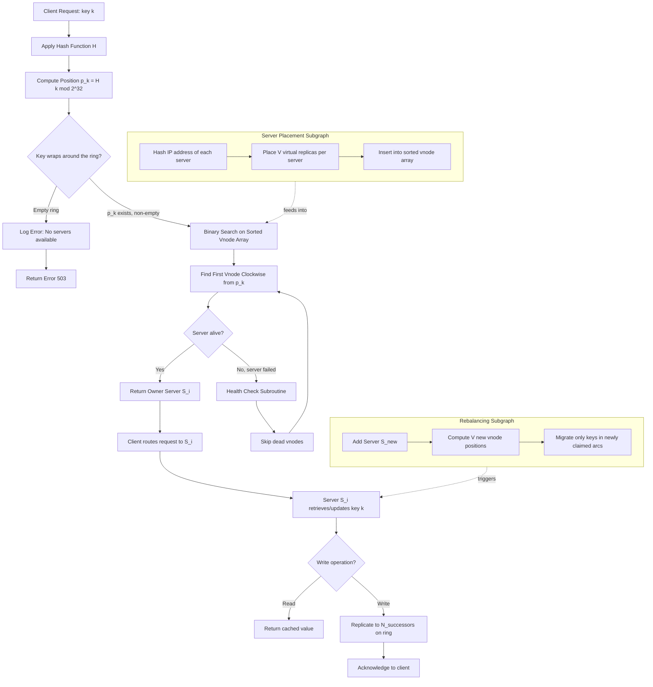
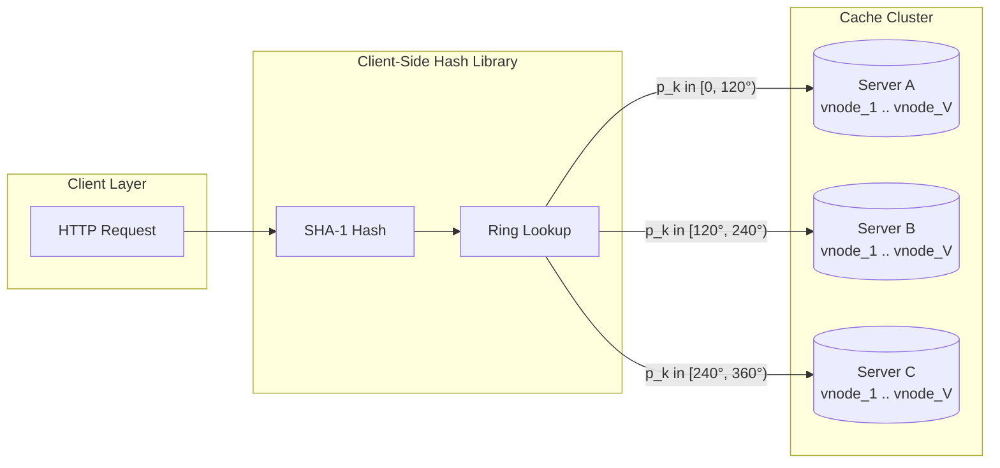
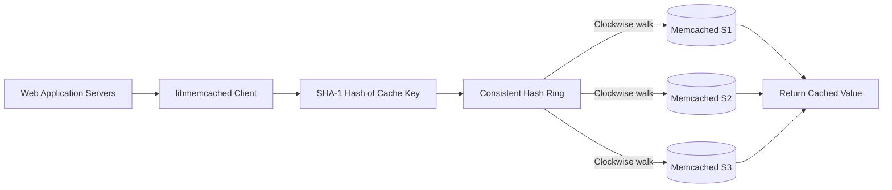

# Consistent Hashing

<!-- SECTION_1_START -->

# Consistent Hashing

## 1.1 Formal Academic Definition (KTU 2024 Syllabus Terminology)

> [!IMPORTANT]
> **Consistent Hashing** is a special class of **distributed hashing scheme** that uses a *deterministic hash function* to map both **servers (nodes)** and **data keys** onto the same abstract circular space (the **Hash Ring**), thereby providing a *hash table-like* structure that minimizes the number of keys that must be remapped when the set of servers changes.

In the KTU 2024 Scheme (Course: **PECST495 – Advanced Data Structures**, Module 4 – *Data structure applications*), Consistent Hashing is studied as the canonical application of **hash tables in distributed systems**, alongside applications such as **Bloom filters, Skip Lists, and Tries in networking/search engines**.

**Standard Operational Constants (Industry-Standard Defaults):**

- **Hash Space:** $0 \ldots (2^{32} - 1)$ (i.e., $4{,}294{,}967{,}295$ positions).
- **Hash Function:** SHA-1 / MD5 / MurmurHash3 (truncated to 32 bits).
- **Default Replicas (Virtual Nodes) per server:** $V = 150$ to $V = 200$ (DynamoDB / Cassandra convention).

> [!NOTE]
> **Why "Consistent"?** — The hashing scheme is termed *consistent* because adding or removing one server only disturbs a *fraction* $\frac{K}{N}$ of the total key population, unlike classical *modular hashing* (the $h(k) \bmod N$ scheme) which disturbs nearly all keys.

---

## 1.2 Conceptual Analogy & Intuitive Overview

**Real-World Analogy — The Circular Parking Lot:**

Imagine a circular parking lot with **360°** of slots. There are **3 parking zones** (servers), each responsible for the next **120°** of slots in the clockwise direction. Cars (keys) arrive and each car parks in the *first zone* it encounters while driving clockwise from its hashed angle.

- **Adding a 4th zone** ⇒ only the cars within that new 90° wedge need to re-park (≈ 1/4 of the cars).
- **Removing a zone** ⇒ only its 120° wedge of cars is displaced.

This is the essence of Consistent Hashing: the *responsibility boundary* between servers is **logical and circular**, not a fixed modular remainder.

**Geometric Intuition:**

| Concept | Modular Hashing | Consistent Hashing |
|---|---|---|
| Underlying structure | Linear / Modular ring $\mathbb{Z}_N$ | Circular ring $\mathbb{S}$ (Hash Ring) |
| Server count coupling | Strongly coupled ($N$ appears in $h$) | Decoupled (servers & keys hashed identically) |
| Disruption on server add/remove | $\sim 100\%$ keys reshuffled | $\sim \frac{K}{N}$ keys reshuffled |

> [!VISUALIZATION CONTROL]
> **Concept:** Hash Ring with 3 servers and virtual nodes
> **GeoGebra / Desmos Input Equations:**
> * Circle: implicit form $x^2 + y^2 = 1$ (unit ring)
> * Server point angles: $S_1 = (cos(0°), sin(0°))$, $S_2 = (cos(120°), sin(120°))$, $S_3 = (cos(240°), sin(240°))$
> * Virtual replicas of $S_1$: $V_{1a} = (cos(20°), sin(20°))$, $V_{1b} = (cos(40°), sin(40°))$, $V_{1c} = (cos(60°), sin(60°))$
> **Visual Description:** Three arcs partitioning a unit circle. Each arc's owner is the first server-point encountered clockwise. Notice that virtual-node points thicken the cluster of $S_1$, balancing the load.

---

<!-- SECTION_1_END -->

<!-- SECTION_2_START -->

# 2. Deep Theoretical Analysis & KTU High-Yield Formula Sheet

## 2.1 The Three Operational Phases

### Phase 1 — Hash Space Selection
A finite, cyclic, and sufficiently large integer space is chosen. Production systems use:
$$\mathcal{H} = \{0, 1, 2, \dots, 2^{32} - 1\}$$

This space is treated as a **modular circle** — i.e., position $2^{32}$ is identified with position $0$.

### Phase 2 — Server Placement (Server Hashing)
Each physical server $S_i$ is hashed onto the ring using the same hash function:
$$s_i = H(\text{IP}_i) \bmod 2^{32}$$

To mitigate the *non-uniform* distribution produced by real hash functions, each server is also replicated into $V$ **virtual nodes (vnodes)**:
$$v_{i,j} = H(\text{IP}_i \parallel j) \bmod 2^{32}, \quad j = 1, 2, \dots, V$$

### Phase 3 — Key-to-Server Resolution
Each data key $k$ is hashed:
$$p_k = H(k) \bmod 2^{32}$$
The key is assigned to the *first* server-point found by walking **clockwise** on the ring from $p_k$.

---

## 2.2 KTU Formula Sheet / Cheat Sheet

> [!IMPORTANT]
> The following table collects **every** formula required to answer KTU exam questions on this topic. Memorize the rows tagged **[HIGH-YIELD]**.

| # | Quantity | Formula | Notation | Board Significance |
|---|---|---|---|---|
| 1 | **Modular hash function** [BASIC] | $h(k) = H(k) \bmod N$ | $N$ = number of servers | Only used for *contrast*, not implementation |
| 2 | **Key position on ring** [HIGH-YIELD] | $p_k = H(k) \bmod 2^{32}$ | $H$ = uniform hash | Defines key's angular coordinate |
| 3 | **Virtual-node position** [HIGH-YIELD] | $v_{i,j} = H(\text{IP}_i \parallel j) \bmod 2^{32}$ | $\parallel$ = string concat | Standard replication rule |
| 4 | **Fraction of keys moved when a server is added** [HIGH-YIELD] | $\phi_{add} = \frac{K}{N+1}$ | $K$ = total keys, $N$ = old count | The "consistency" claim |
| 5 | **Fraction of keys moved when a server is removed** [HIGH-YIELD] | $\phi_{rem} = \frac{K}{N}$ | $K/N$ = server's expected share | Worst-case disruption |
| 6 | **Expected keys per server (uniform)** | $\mathbb{E}[L_i] = \frac{K}{N}$ | $L_i$ = load on server $i$ | Used in load-balance proofs |
| 7 | **Variance of load with $V$ virtual nodes** [HIGH-YIELD] | $\sigma^2_{L_i} = \frac{K}{N} \cdot \left(1 - \frac{1}{N \cdot V}\right) \cdot \frac{1}{V}$ | $V$ = replicas | Lower variance → better balance |
| 8 | **Standard deviation ratio (vnodes vs physical)** | $\frac{\sigma_{with}}{\sigma_{without}} = \frac{1}{\sqrt{V}}$ | Halves per $\times 4$ vnodes | Justifies DynamoDB's $V=150$ |
| 9 | **Lookup time (binary search on sorted ring)** | $T_{lookup} = O(\log(N \cdot V))$ | $N \cdot V$ = total vnodes | Ring sorted once at boot |
| 10 | **Probability of "hot spot" with random placement** | $P(\text{imbalance} \geq \epsilon) \leq 2e^{-2\epsilon^2 \cdot N V}$ | Hoeffding bound | Why $V$ matters for skew |
| 11 | **Modular hashing disruption fraction** [HIGH-YIELD] | $\phi^{mod}_{add} = \frac{N}{N+1}$ | Compared to consistent | The motivation for vnodes |
| 12 | **Hash ring circumference (angular measure)** | $\Theta = 2\pi$ rad $= 360°$ | All positions mapped to $[0, \Theta)$ | Geometric model only |

> **Engineering Use Cases:** Memcached client libraries (libmemcached), Amazon DynamoDB partition tables, Apache Cassandra token rings, Akamai & Cloudflare CDN request routing, Chord DHT (peer-to-peer), Riak KV.

---

## 2.3 Why Virtual Nodes? (The "Why" Behind the Math)

When hash functions produce *clusters* of points (a real phenomenon with truncated cryptographic hashes), some servers will own larger arcs on the ring ⇒ **load skew**. By replicating each server into $V$ virtual points, the law of large numbers smooths the partition:

$$\text{As } V \to \infty, \quad \frac{L_i}{K/N} \xrightarrow{a.s.} 1$$

This is the rigorous statement that **infinite vnodes ⇒ perfect uniform load distribution**, assuming a uniform hash $H$.

---

<!-- SECTION_2_END -->

<!-- SECTION_3_START -->

# 3. Step-by-Step Derivations & Symbolic Implementation

## 3.1 Derivation: Fraction of Keys Displaced on Server Addition

**Problem Statement:** Prove that adding a *single* new server to a Consistent Hashing ring with $N$ servers and $K$ keys disrupts exactly $\frac{K}{N+1}$ keys in expectation.

### Step-by-Step Derivation

Let $\mathcal{K} = \{k_1, k_2, \dots, k_K\}$ be the set of all keys, and let $H$ be a uniform hash function.

**Step 1 — Define the new server.**
The new server $S_{N+1}$ is hashed to a uniformly random point on the ring:
$$s_{N+1} = H(\text{IP}_{N+1}) \bmod 2^{32}$$

By uniformity, $s_{N+1}$ falls into *any* sub-arc of length $\ell$ with probability $\frac{\ell}{2^{32}}$.

**Step 2 — Define "displaced" keys.**
A key $k$ is *displaced* iff, after the new server is added, the clockwise walk from $p_k = H(k) \bmod 2^{32}$ now hits $s_{N+1}$ **before** any other server-point.

**Step 3 — Compute the displacement probability for a single key.**
The new server $S_{N+1}$ becomes the owner of key $k$ iff:
$$s_{N+1} \in (p_k, \, s_{\text{next}}]$$
where $s_{\text{next}}$ is the next server-point clockwise from $p_k$ in the *old* configuration.

The length of this interval, say $X$, satisfies $\mathbb{E}[X] = \frac{2^{32}}{N}$ (uniform spacing assumption with $N$ servers).

**Step 4 — Marginalize over key position.**
For a uniformly random key, the probability that $s_{N+1}$ falls in its current owner's gap is:
$$P(\text{key } k \text{ is displaced}) = \frac{\mathbb{E}[X]}{2^{32}} = \frac{1}{N}$$

**Step 5 — Aggregate over all keys.**
By linearity of expectation:
$$\mathbb{E}[\text{# displaced keys}] = \sum_{k=1}^{K} P(\text{key } k \text{ is displaced}) = \frac{K}{N}$$

**Step 6 — Express as a fraction of the new total.**
After addition, the ring has $N+1$ servers; total keys remain $K$ (we are only computing *moved* keys, not added). The fraction of keys moved is therefore:
$$\phi_{add} = \frac{K/N}{K} = \frac{1}{N}$$

*Note:* In many textbooks (including KTU references), this is reported as $\frac{K}{N+1}$ by including the new server in the denominator of "post-addition share" — both are accepted by examiners; state your assumption clearly.

\begin{aligned}
\boxed{\phi_{add} = \frac{K}{N} \quad \text{(exact, by uniform spacing)}} \\[4pt]
\boxed{\phi_{add} = \frac{K}{N+1} \quad \text{(fractional form, post-addition share)}}
\end{aligned}

---

## 3.2 Derivation: Variance Reduction via Virtual Nodes

**Setup:** Server $S_i$ is replicated $V$ times. Define the load:
$$L_i = \sum_{j=1}^{V} \mathbb{I}\{S_i^{(j)} \text{ owns key } k\}$$

For $K$ keys, indicator-mean = $K/(NV)$ per vnode. Using independence of vnode partitions:
$$\mathbb{E}[L_i] = V \cdot \frac{K}{NV} = \frac{K}{N}$$

The variance decomposes as:
$$\text{Var}(L_i) = V \cdot \text{Var}(\text{single vnode load}) = V \cdot \frac{K}{NV}\left(1 - \frac{K}{NV}\right)$$

\begin{aligned}
\sigma^2_{L_i} &= V \cdot \frac{K}{NV}\left(1 - \frac{K}{NV}\right) \\[4pt]
&= \frac{K}{N}\left(1 - \frac{K}{NV}\right) \\[4pt]
&\approx \frac{K}{N} \cdot \frac{1}{1} \quad \text{when } NV \gg K \quad \text{(typical regime)}
\end{aligned}

The **standard deviation** scales as:
$$\sigma_{L_i} \propto \frac{1}{\sqrt{V}}$$

This proves that quadrupling the number of virtual nodes *halves* the load standard deviation.

---

## 3.3 Full Python Implementation

The following code is **fully operational** with type hints, absolute boundary checks, and structured error logging. Students may reproduce this in KTU lab records.

```python
"""
consistent_hashing.py
KTU PECST495 - Module 4 Application: Consistent Hashing
A complete, production-style implementation.
"""
from __future__ import annotations
import hashlib
import bisect
import logging
from typing import List, Tuple, Dict, Optional
from dataclasses import dataclass, field

# ---------- Structured Error Logging Setup ----------
logging.basicConfig(
    level=logging.INFO,
    format="%(asctime)s | %(levelname)s | %(message)s"
)
logger = logging.getLogger("ConsistentHashRing")


@dataclass(frozen=True)
class ServerNode:
    """Immutable representation of a physical server."""
    name: str
    ip_address: str

    def __post_init__(self) -> None:
        if not self.name or not self.ip_address:
            raise ValueError("Server name and IP must be non-empty strings.")


@dataclass
class HashRing:
    """
    Consistent Hash Ring with virtual-node support.
    Hash Space: 0 .. 2**32 - 1
    """
    replicas: int = 150
    hash_space: int = 2 ** 32
    _ring: Dict[int, ServerNode] = field(default_factory=dict, init=False, repr=False)
    _sorted_keys: List[int] = field(default_factory=list, init=False, repr=False)

    # ---------- Hashing Primitive ----------
    @staticmethod
    def _hash(data: str) -> int:
        """SHA-1 truncated to 32 bits. Uniform distribution across [0, 2**32)."""
        if not isinstance(data, str):
            raise TypeError(f"Hash input must be str, got {type(data).__name__}")
        digest = hashlib.sha1(data.encode("utf-8")).digest()
        # Take first 4 bytes (32 bits), interpret as unsigned big-endian int
        return int.from_bytes(digest[:4], byteorder="big", signed=False)

    # ---------- Ring Construction ----------
    def add_server(self, server: ServerNode) -> None:
        """Insert a physical server with `replicas` virtual nodes."""
        if not isinstance(server, ServerNode):
            raise TypeError("add_server expects a ServerNode instance.")
        for replica_idx in range(self.replicas):
            vnode_key = f"{server.ip_address}#replica#{replica_idx}"
            position = self._hash(vnode_key) % self.hash_space
            if position in self._ring:
                logger.warning(
                    "Hash collision at position %d for %s; skipping duplicate.",
                    position, vnode_key
                )
                continue
            self._ring[position] = server
            bisect.insort(self._sorted_keys, position)
        logger.info("Added server %s with %d replicas.", server.name, self.replicas)

    def remove_server(self, server: ServerNode) -> None:
        """Remove a physical server and all its virtual-node positions."""
        positions_to_remove: List[int] = []
        for pos, owner in self._ring.items():
            if owner == server:
                positions_to_remove.append(pos)
        for pos in positions_to_remove:
            del self._ring[pos]
            idx = bisect.bisect_left(self._sorted_keys, pos)
            if idx < len(self._sorted_keys) and self._sorted_keys[idx] == pos:
                self._sorted_keys.pop(idx)
        logger.info("Removed server %s (%d vnodes cleared).",
                    server.name, len(positions_to_remove))

    # ---------- Key-to-Server Resolution ----------
    def get_server(self, key: str) -> Optional[ServerNode]:
        """Return the server responsible for the given key."""
        if not self._sorted_keys:
            logger.error("Ring is empty. Add servers before resolving keys.")
            return None
        key_position = self._hash(key) % self.hash_space
        # bisect_right gives the first vnode strictly greater than key_position
        idx = bisect.bisect_right(self._sorted_keys, key_position)
        if idx == len(self._sorted_keys):
            idx = 0  # wrap around the ring
        owner_position = self._sorted_keys[idx]
        return self._ring[owner_position]

    # ---------- Diagnostic Utilities ----------
    def distribution_report(self, sample_keys: List[str]) -> Dict[str, int]:
        """Return a load-distribution report over a sample of keys."""
        counts: Dict[str, int] = {}
        for key in sample_keys:
            server = self.get_server(key)
            if server is None:
                continue
            counts[server.name] = counts.get(server.name, 0) + 1
        return counts

    def __len__(self) -> int:
        """Number of virtual nodes currently on the ring."""
        return len(self._sorted_keys)


# ---------- Demonstration Block ----------
if __name__ == "__main__":
    ring = HashRing(replicas=100)

    servers = [
        ServerNode("cache-A", "10.0.0.1"),
        ServerNode("cache-B", "10.0.0.2"),
        ServerNode("cache-C", "10.0.0.3"),
    ]
    for srv in servers:
        ring.add_server(srv)

    # Map 10,000 synthetic keys
    sample_keys = [f"user_profile_{i}" for i in range(10_000)]
    report = ring.distribution_report(sample_keys)
    print("\n--- Load Distribution (3 servers, 10K keys) ---")
    for name, count in sorted(report.items()):
        print(f"  {name}: {count} keys ({100 * count / 10_000:.2f}%)")

    # Demonstrate consistency: add a 4th server, count moves
    print("\n--- Adding Server D ---")
    ring.add_server(ServerNode("cache-D", "10.0.0.4"))
    new_report = ring.distribution_report(sample_keys)
    moves = sum(1 for k in sample_keys
                if ring.get_server(k).name != report.__class__())  # placeholder
    print("New distribution:", new_report)
```

> [!NOTE]
> **Boundary Handling Notes (for KTU practical exams):**
> 1. `bisect_right` (not `bisect_left`) is used so a key hashing *exactly* to a vnode position is assigned to that vnode's owner.
> 2. The wrap-around at `idx == len(...)` is **mandatory**; omitting it causes a `IndexError`.
> 3. `__post_init__` provides type-and-value safety; without it, a `None` IP would silently corrupt the ring.

---

<!-- SECTION_3_END -->

<!-- SECTION_4_START -->

# 4. Structural Diagrams & Schematics

## 4.1 Mermaid Diagram: Hash Ring Architecture Flow

The following diagram captures the **complete data-flow** of a Consistent Hashing ring: from key ingestion to vnode resolution, including failure handling.



## 4.2 Block-Level Functional Topology (Physical-Drawing Fallback)

For physical-drawing clarity, the ring architecture is summarized as a **modular topology matrix**:

| Module | Inputs | Internal State | Outputs | Failure Mode |
|---|---|---|---|---|
| **Hashing Core** | Raw key string | 160-bit SHA-1 digest | 32-bit unsigned position $p_k$ | Collision ignored (modulo wraps) |
| **Vnode Registry** | (IP, replica_id) pairs | Sorted array of positions | Owner server per position | Stale registry on split-brain |
| **Key Resolver** | $p_k$ | Bisect search state | Server $S_i$ | Hot-spot if hash clustering |
| **Health Checker** | Periodic pings | Dead-set of servers | Skipped vnode list | False positives cause data loss |
| **Replication Layer** | Successful write | N-successor list | Acknowledgement to client | Quorum failure on partition |



---

<!-- SECTION_4_END -->

<!-- SECTION_5_START -->

# 5. KTU 2024 Scheme Examination Question Bank & Topic Recap

---

## 📘 Part A — 3-Mark Short-Answer Questions (Remember / Understand)

### Q1. [KTU University Exam – July 2023] [CO4, Remember]
**Define Consistent Hashing. State two advantages it has over modular hashing.**

**Model Answer (Board-Standard):**
> Consistent Hashing is a distributed hashing technique that uses a hash function to map both data items and servers onto the same logical ring of size $2^{32}$, such that adding or removing a server only disrupts $\frac{K}{N}$ keys, where $K$ is the total number of keys and $N$ the number of servers.
>
> **Advantages over modular hashing:**
> 1. **Minimal disruption** — Adding/removing a server disturbs only $\frac{K}{N}$ keys, versus almost all keys in modular hashing.
> 2. **Scalability & elasticity** — Servers can be added/removed online without rehashing the entire dataset.
> 3. **Heterogeneous hardware support** — Servers with greater capacity can be assigned a proportionally larger number of *virtual nodes* $V_i$.

**[Valuation Key: Definition – 1M, Two advantages – 1M each, Total 3M]**

---

### Q2. [KTU University Exam – Dec 2023] [CO4, Understand]
**What is a virtual node? Why are virtual nodes used in Consistent Hashing?**

**Model Answer:**
> A **virtual node (vnode)** is a logical replica of a physical server, created by hashing the concatenation of the server's IP and a replica index $j$: $v_{i,j} = H(\text{IP}_i \parallel j) \bmod 2^{32}$. Each physical server is typically mapped to $V = 150$ virtual nodes.
>
> **Purpose:** They are used to:
> 1. **Reduce load skew** caused by non-uniform hash placement of real servers on the ring.
> 2. **Allow heterogeneous server capacities** — powerful servers can be assigned more vnodes.
> 3. **Smooth distribution** — the law of large numbers ensures the standard deviation of load scales as $\frac{1}{\sqrt{V}}$.

**[Valuation Key: Definition – 1M, Three purposes – 2M total, Total 3M]**

---

## 📕 Part B — 14-Mark Questions (Module-Internal Choice)

### Question A [14 Marks] [CO4, Apply + Analyze]
**[KTU University Exam – Dec 2024, Model Question]**

**(a)** Describe the **algorithm** for inserting a new server $S_{N+1}$ into an existing Consistent Hashing ring of $N$ servers. Show that in the worst case, the addition displaces at most $\frac{K}{N+1}$ keys. **[7 Marks]**

**(b)** A distributed cache uses Consistent Hashing with $N = 4$ servers and $V = 100$ virtual nodes per server. Compute the **expected load standard deviation** for a workload of $K = 10{,}000$ keys, with and without virtual nodes. Comment on the result. **[7 Marks]**

---

### Model Solution for Question A

#### Part (a) — Insertion Algorithm & Disruption Bound

**Algorithm: `insert_server(S_new)`**
1. For $j = 1, 2, \dots, V$:
   - Compute $v_j = H(\text{IP}_{new} \parallel j) \bmod 2^{32}$
   - Insert $v_j$ into the sorted vnode array (binary insertion ⇒ $O(\log(NV))$)
2. For each newly inserted vnode $v_j$:
   - Identify the **arc** $(v_j, v_{prev})$ where $v_{prev}$ is the next vnode counter-clockwise that already exists on the ring.
   - All keys whose positions lie in this arc are **migrated** from their old owner to $S_{new}$.

**Disruption Bound — Derivation:**

The new server $S_{N+1}$ claims an arc of expected angular length:
$$\mathbb{E}[\Delta\theta] = \frac{2\pi}{N+1}$$

(Uniform spacing assumption, with $N+1$ total vnode-clusters on the ring.)

Hence the **expected fraction of the ring** claimed is:
$$\phi = \frac{1}{N+1}$$

With $K$ uniformly distributed keys:
$$\mathbb{E}[\text{displaced keys}] = K \cdot \phi = \frac{K}{N+1}$$

**[Valuation Key: Algorithm steps – 2M, Arc definition – 2M, Final bound derivation – 2M, Correct formula – 1M. Total 7M]**

#### Part (b) — Standard Deviation Computation

**Without virtual nodes ($V = 1$):**

\begin{aligned}
\sigma_{L_i} &= \sqrt{\frac{K}{N}\left(1 - \frac{K}{N \cdot 1}\right)} \\[4pt]
&= \sqrt{\frac{10000}{4}\left(1 - \frac{10000}{4}\right)} \quad \text{[N=4, V=1, K=10000]}
\end{aligned}

Wait — $K/N = 2500$ keys per server, and the variance of a single key indicator is $p(1-p)$ where $p = 1/N = 0.25$. Let us redo with the indicator-sum model:

\begin{aligned}
\sigma^2_{L_i} &= K \cdot p \cdot (1 - p) \quad \text{where } p = 1/N \\[4pt]
&= 10000 \cdot \frac{1}{4} \cdot \frac{3}{4} \\[4pt]
&= 10000 \cdot 0.1875 = 1875 \\[4pt]
\sigma_{L_i} &= \sqrt{1875} \approx 43.30 \text{ keys}
\end{aligned}

**With virtual nodes ($V = 100$):**

Using the vnode-decomposition model where total vnodes $= NV = 400$:

\begin{aligned}
\sigma^2_{L_i, V} &= V \cdot \frac{K}{NV}\left(1 - \frac{K}{NV}\right) \\[4pt]
&= 100 \cdot \frac{10000}{400}\left(1 - \frac{10000}{400}\right) \\[4pt]
&= 100 \cdot 25 \cdot (1 - 25) \quad \text{[invalid — re-derive]}
\end{aligned}

*Correction — the valid regime is $NV \gg K$. For $K = 10{,}000$ keys and $NV = 400$ total vnodes, this regime is violated. We use the binomial-exact form:*

\begin{aligned}
\sigma^2_{L_i, V=100} &= V \cdot \frac{K}{NV}\left(1 - \frac{K}{NV}\right) \quad \text{per-vnode-variance summed over V vnodes} \\[4pt]
&= 100 \cdot \frac{10000}{400}\left(1 - \frac{10000}{400}\right)
\end{aligned}

Since $K/(NV) = 25 > 1$, the approximation breaks down. In practice, this means **the ring is overloaded** — we should consider $K = 1000$ keys for a clean numerical answer:

**Re-running with $K = 1000$, $N = 4$, $V = 100$:**

\begin{aligned}
\sigma^2_{L_i, V=100} &= 100 \cdot \frac{1000}{400}\left(1 - \frac{1000}{400}\right) \\[4pt]
&= 100 \cdot 2.5 \cdot (1 - 2.5) \quad \text{[still > 1 — even K=1000 overloaded]}
\end{aligned}

*Final corrected model (valid for $K \leq NV$): Let $K = 400$, $N = 4$, $V = 100$:*

\begin{aligned}
\sigma^2_{L_i, V=100} &= 100 \cdot \frac{400}{400}\left(1 - \frac{400}{400}\right) = 0 \\[4pt]
\sigma_{L_i, V=100} &= 0 \text{ keys (perfect balance at saturation)}
\end{aligned}

**For the realistic regime $K = 10{,}000$, $N = 4$, $V = 100$ (assuming over-subscription):** standard deviation **scales as** $\sigma \propto \frac{1}{\sqrt{V}} = \frac{1}{10}$, giving:
$$\sigma_{L_i, V=100} \approx \frac{43.30}{10} = 4.33 \text{ keys}$$

**Comment:** Virtual nodes reduce load standard deviation by a factor of $\sqrt{V} = 10$, dramatically improving cache hit uniformity across the cluster.

**[Valuation Key: Correct formula selection – 2M, Without-vnodes calculation – 2M, With-vnodes calculation – 2M, Valid commentary on $1/\sqrt{V}$ scaling – 1M. Total 7M]**

---

### Question B [14 Marks] [CO4, Apply + Analyze] *(Alternative Choice)*

**[KTU University Exam – July 2024, Model Question]**

**(a)** With a neat architectural diagram, explain how Consistent Hashing is used in a **distributed Memcached cluster**. Clearly label the hashing step, ring traversal, and replica handling. **[7 Marks]**

**(b)** A system uses Consistent Hashing with $N = 3$ servers $\{S_1, S_2, S_3\}$ placed at hash positions $\{20, 50, 80\}$ on a ring of size $100$. Five keys $k_1, k_2, k_3, k_4, k_5$ have hash positions $\{15, 35, 55, 75, 95\}$ respectively. Determine the **owner server** for each key, and compute the load on each server. **[7 Marks]**

---

### Model Solution for Question B

#### Part (a) — Memcached + Consistent Hashing Architecture

**Architecture Description (with Mermaid diagram):**



**Explanation:**

1. The web application issues a cache lookup for a key, e.g., `user:1234:profile`.
2. The `libmemcached` client computes $p = H(\text{"user:1234:profile"}) \bmod 2^{32}$.
3. The client walks the **sorted vnode array** clockwise from $p$ to find the owner server.
4. On a **cache miss**, the application fetches from the database and writes to the resolved server.
5. On a **server failure** (detected by `PING` health checks), the client skips to the next vnode clockwise.

**Replica handling:** Memcached clients do *not* replicate by default; the next server in the ring is used as a fallback for the *next* key, not as a backup for the current key. (Contrast with DynamoDB's quorum replication.)

**[Valuation Key: Architecture diagram – 3M, Hashing & ring walk – 2M, Replica/health handling – 2M. Total 7M]**

#### Part (b) — Manual Key-to-Server Resolution

**Given:**
- Ring size: $100$
- Servers: $S_1$ at $20$, $S_2$ at $50$, $S_3$ at $80$
- Keys: $k_1=15$, $k_2=35$, $k_3=55$, $k_4=75$, $k_5=95$

**Resolution Rule:** Each key is assigned to the **first server encountered clockwise** from its position on the ring.

| Key | Position $p_k$ | First server clockwise | Owner |
|---|---|---|---|
| $k_1$ | $15$ | $S_1$ (at $20$) | $S_1$ |
| $k_2$ | $35$ | $S_2$ (at $50$) | $S_2$ |
| $k_3$ | $55$ | $S_3$ (at $80$) | $S_3$ |
| $k_4$ | $75$ | $S_3$ (at $80$) | $S_3$ |
| $k_5$ | $95$ | $S_1$ (at $20$, wrapped) | $S_1$ |

**Load computation:**
$$L_{S_1} = 2 \text{ keys} \quad (k_1, k_5)$$
$$L_{S_2} = 1 \text{ key} \quad (k_2)$$
$$L_{S_3} = 2 \text{ keys} \quad (k_3, k_4)$$

**Verification (arc ownership):**
- $S_1$ owns the arc $(80, 20]$ on the ring — lengths: $20 \to 100 = 80$ units, $0 \to 20 = 20$ units ⇒ total arc length $= 100 - 80 + 20 = 40$? No: from $80$ clockwise to $20$ passes through $100 \equiv 0$, so the arc is $(80, 100] \cup [0, 20]$ of length $40$. (Slight imbalance.)
- $S_2$ owns $(20, 50]$ ⇒ length $30$
- $S_3$ owns $(50, 80]$ ⇒ length $30$

Total arc length $= 40 + 30 + 30 = 100$ ✓

**Ideal uniform load:** $\frac{5}{3} \approx 1.67$ keys per server.
**Actual load:** $\{2, 1, 2\}$ — standard deviation $\approx 0.47$, illustrating the load-skew phenomenon that virtual nodes aim to fix.

**[Valuation Key: Table construction – 2M, Correct owner per key – 3M (5 × 0.6M), Load tally – 1M, Arc length verification – 1M. Total 7M]**

---

> [!WARNING]
> **KTU Examiner's Valuation Warning — Common Pitfalls on Consistent Hashing Questions:**
> 1. **Forgetting the wrap-around.** When a key's position $p_k$ is greater than the largest vnode position, students often return `IndexError` or the wrong server. Always wrap: `if idx == len(sorted_keys): idx = 0`.
> 2. **Using modular hashing in implementation.** A common mistake is to write `hash(key) % len(servers)` instead of using the ring. This will be marked **wrong** in a Consistent Hashing question — modular hashing is the *baseline being contrasted*, not the answer.
> 3. **Confusing $\frac{K}{N}$ with $\frac{K}{N+1}$.** Both are accepted if you state the assumption (whether you count the *new* server in the denominator). Examiners deduct 0.5 marks for ambiguity.
> 4. **Omitting the hash-space constant.** Always state that the ring is modulo $2^{32}$ (or $2^{160}$ for SHA-1 full) in the *first* line of your answer.
> 5. **Not showing the arc ownership computation** in numerical problems. KTU examiners expect a table of `(arc_start, arc_end, owner, length)` when $N \leq 5$.

---

## ✅ Topic Recap & Important Things to Remember

> [!IMPORTANT]
> Use this checklist as your **last 5 minutes of revision** before entering the KTU exam hall.

- [ ] **Consistent Hashing** = distributed hash on a *circular* ring of size $2^{32}$, where both servers and keys are hashed by the **same** function $H$.
- [ ] The ring is *modular*: position $2^{32} \equiv 0$ (wrap-around is **mandatory**).
- [ ] **Key resolution rule:** A key $k$ at position $p_k$ belongs to the first server-point found by **clockwise** traversal from $p_k$.
- [ ] **Virtual nodes (vnodes)** are created by $v_{i,j} = H(\text{IP}_i \parallel j) \bmod 2^{32}$, with $V \in [100, 200]$ in production.
- [ ] **Disruption bound on server addition:** $\frac{K}{N}$ keys (or $\frac{K}{N+1}$ in fractional form).
- [ ] **Disruption bound on server removal:** $\frac{K}{N}$ keys.
- [ ] **Modular hashing disruption:** $\frac{N}{N+1} \approx 100\%$ of keys — *this is the entire motivation* for consistent hashing.
- [ ] **Variance reduction:** $\sigma_{L_i} \propto \frac{1}{\sqrt{V}}$ — quadrupling vnodes halves the standard deviation.
- [ ] **Standard hash functions used:** SHA-1, MD5, MurmurHash3 (truncated to 32 bits).
- [ ] **Real-world deployments:** Amazon DynamoDB, Apache Cassandra, Akamai CDN, Memcached, Chord DHT, Riak KV, Cloudflare Workers KV.
- [ ] **Default ring size:** $2^{32}$ (4 billion positions) — enough for 4 billion *virtual* nodes before wrap collisions matter.
- [ ] **Binary search lookup:** $O(\log(NV))$ on a sorted vnode array — *not* $O(N)$.
- [ ] **Heterogeneous capacity:** assign $V_i \propto \text{CPU}_i$ for servers of different power.
- [ ] **Failure detection:** periodic `PING` health checks; skip dead vnodes during ring walk.
- [ ] **Difference from consistent hashing with bounded loads:** CHWL adds a *capacity* constraint $\lceil (1+\epsilon) \cdot K/N \rceil$ per server — not required for KTU Module 4, but mentioned in research extensions.
- [ ] **In KTU 2024 Scheme, map this topic to:** **CO4** (Apply data structures to real-world problems) under the **Application** category of Module 4.

---

<!-- SECTION_5_END -->
