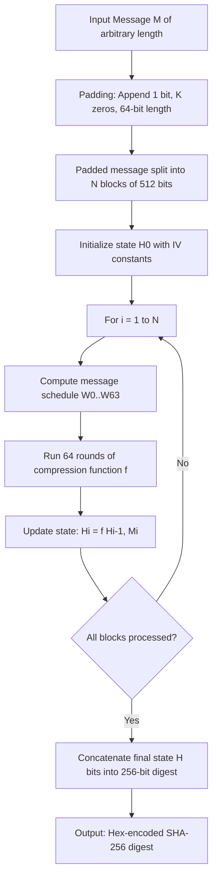
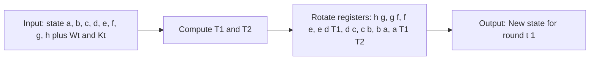
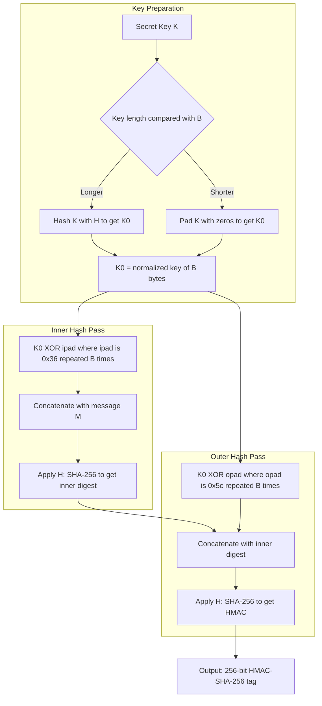
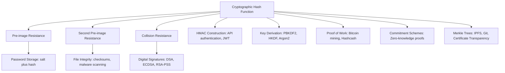
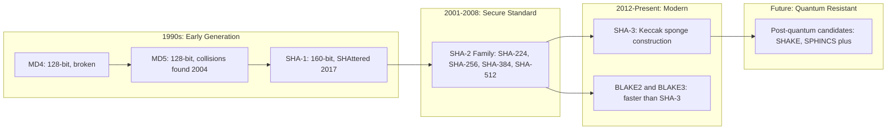

# Cryptographic Applications – Hashing

<!-- SECTION_1_START -->
# Cryptographic Applications – Hashing

## 1.1 Formal Definition (KTU 2024 Syllabus Terminology)

> [!IMPORTANT]
> **Cryptographic Hash Function:** A deterministic mathematical function $H$ that maps an input of arbitrary length (message $M$) to a fixed-size bit string of length $n$, called the **message digest** (or **hash value**, **fingerprint**, or **checksum**), such that $H: \{0,1\}^* \rightarrow \{0,1\}^n$.

For a cryptographic-grade hash function, the output is conventionally expressed in **bits**, with the digest size being one of the primary security parameters. The fixed output length for standard algorithms is:
- **MD5** → **128 bits**
- **SHA-1** → **160 bits**
- **SHA-256** → **256 bits**
- **SHA-512** → **512 bits**

A hash function $H$ is said to be *cryptographically secure* if it satisfies the **three pillars of cryptographic hashing**:

| Property | Formal Statement |
|----------|------------------|
| **Pre-image Resistance** | Given $y = H(M)$, it is computationally infeasible to find any $M'$ such that $H(M') = y$. |
| **Second Pre-image Resistance** | Given $M_1$, it is computationally infeasible to find $M_2 \neq M_1$ such that $H(M_1) = H(M_2)$. |
| **Collision Resistance** | It is computationally infeasible to find any two distinct inputs $M_1 \neq M_2$ such that $H(M_1) = H(M_2)$. |

> [!NOTE]
> **Determinism:** For a fixed input $M$, the function $H(M)$ must always return the exact same digest. This is the foundational property that makes hashing useful for integrity verification.

## 1.2 Conceptual Analogy & Geometric Intuition

Imagine you have a **high-precision fingerprint scanner** at the entrance of a secure building:
- Every human (input of any size — short, tall, child, adult) gets a unique fingerprint (fixed-size output).
- From the fingerprint alone, you **cannot reconstruct** the person (pre-image resistance).
- The probability of two different people having the **exact same fingerprint** is astronomically low (collision resistance).
- The scanner always produces the **same fingerprint for the same person** (determinism).

In the digital world, the "fingerprint" is the **message digest**, and the "scanner" is the **hash algorithm** (SHA-256, SHA-3, BLAKE2, etc.).

> [!TIP]
> **Geometric Intuition:** Think of the entire input space $\{0,1\}^*$ as an infinite multidimensional space. The hash function $H$ is a projection that maps every point in this infinite space onto a hypercube of side length $2^n$ (where $n$ is the digest size). Two inputs "collide" when their projection lines intersect at the same point on this hypercube.

> [!VISUALIZATION CONTROL]
> **Concept:** Avalanche Effect & Hash Distribution
> **GeoGebra / Desmos Input Equations:**
> * `f(x) = x^2 mod 17` (toy hash function on integers)
> * `g(x) = (5*x + 3) mod 17` (linear congruential hash)
> **Visual Description:** Plot the function values for inputs $x \in [0, 16]$. Observe how a small change in $x$ produces a drastically different output $f(x)$, mimicking the *avalanche effect* in real cryptographic hashes.

## 1.3 The Avalanche Effect

> [!IMPORTANT]
> **Avalanche Effect:** A single bit flip in the input message $M$ must, on average, flip **at least 50\%** of the bits in the output digest $H(M)$.

This is a critical quality metric. A hash function that fails the avalanche test is unsuitable for cryptographic deployment because it allows an attacker to correlate inputs and outputs.

## 1.4 Core Distinction: Hashing vs. Encryption

| Aspect | Hashing | Encryption |
|--------|---------|------------|
| **Key** | Keyless (no secret) | Requires a key |
| **Reversibility** | One-way (irreversible) | Two-way (decryptable) |
| **Output size** | Fixed | Variable (usually same as input) |
| **Purpose** | Integrity, authentication | Confidentiality |
| **Example** | SHA-256, BLAKE3 | AES-256, RSA, ChaCha20 |

---

<!-- SECTION_1_END -->

<!-- SECTION_2_START -->
# Deep Theoretical Analysis & KTU High-Yield Formula Sheet

## 2.1 The Merkle–Damgård Construction (The Backbone of SHA-1, SHA-2)

The vast majority of classical hash functions are built using the **Merkle–Damgård iterative construction**. The process is as follows:

1. **Padding:** The input message $M$ is padded so that its length becomes a multiple of the block size $B$ (e.g., **512 bits for SHA-256**).
2. **Parsing:** The padded message is split into $N$ blocks: $M_1, M_2, \ldots, M_N$, each of size $B$.
3. **Iteration:** A **compression function** $f$ processes each block sequentially, with the previous output acting as the new "state" (chaining variable).
4. **Initialization:** The process starts with a predefined **Initial Hash Value (IV)**, a set of magic constants.

The recurrence relation is:

$$H_0 = \text{IV (Initial Vector)}$$
$$H_i = f(H_{i-1}, M_i) \quad \text{for } i = 1, 2, \ldots, N$$
$$H(M) = H_N$$

> [!NOTE]
> **Why Merkle–Damgård?** It guarantees that if the underlying compression function $f$ is collision-resistant, then the entire hash function $H$ is also collision-resistant. This reduces a hard problem (hashing arbitrary lengths) to a tractable one (hashing a single block).

## 2.2 SHA-256: The Industry Standard (Detailed Internal Anatomy)

**SHA-256** (Secure Hash Algorithm 2, 256-bit variant) operates on a 512-bit block and produces a 256-bit digest using **64 rounds** of compression.

### Internal State Parameters

| Parameter | Value | Description |
|-----------|-------|-------------|
| $B$ (block size) | **512 bits** | Size of each input block |
| $n$ (word size) | **32 bits** | Internal word length |
| $H_{\text{out}}$ (digest size) | **256 bits** | Output length |
| $r$ (rounds) | **64** | Number of compression rounds |
| $W_t$ (message schedule) | 64 words of 32 bits | Expanded schedule |
| $K_t$ (round constants) | 64 words of 32 bits | Derived from cube roots of first 64 primes |

### The Compression Function (Round Operations)

Each round $t$ (from $0$ to $63$) performs the following computations on the working variables $(a, b, c, d, e, f, g, h)$:

$$\Sigma_0(a) = \text{ROTR}^2(a) \oplus \text{ROTR}^{13}(a) \oplus \text{ROTR}^{22}(a)$$

$$\Sigma_1(e) = \text{ROTR}^6(e) \oplus \text{ROTR}^{11}(e) \oplus \text{ROTR}^{25}(e)$$

$$\sigma_0(x) = \text{ROTR}^7(x) \oplus \text{ROTR}^{18}(x) \oplus \text{SHR}^3(x)$$

$$\sigma_1(x) = \text{ROTR}^{17}(x) \oplus \text{ROTR}^{19}(x) \oplus \text{SHR}^{10}(x)$$

$$T_1 = h + \Sigma_1(e) + \text{Ch}(e, f, g) + K_t + W_t$$

$$T_2 = \Sigma_0(a) + \text{Maj}(a, b, c)$$

$$\text{where } \text{Ch}(e, f, g) = (e \land f) \oplus (\neg e \land g)$$

$$\text{and } \text{Maj}(a, b, c) = (a \land b) \oplus (a \land c) \oplus (b \land c)$$

After computing $T_1$ and $T_2$, the working variables are rotated:
$h \leftarrow g$, $g \leftarrow f$, $f \leftarrow e$, $e \leftarrow d + T_1$, $d \leftarrow c$, $c \leftarrow b$, $b \leftarrow a$, $a \leftarrow T_1 + T_2$.

## 2.3 The Birthday Paradox & Birthday Attack

> [!IMPORTANT]
> **Birthday Paradox Theorem:** In a set of $N$ randomly chosen people, the probability of at least two sharing a birthday exceeds **50\%** with only $N = 23$ people (assuming 365 equally likely birthdays).

For an $n$-bit hash function, the expected number of inputs required to find a collision is approximately:

$$N_{\text{collision}} \approx 1.22 \times \sqrt{2^n} = 1.22 \times 2^{n/2}$$

This means:
- For **MD5** ($n = 128$): $\approx 2^{64}$ operations (feasible with modern clusters).
- For **SHA-256** ($n = 256$): $\approx 2^{128}$ operations (infeasible with current technology).
- For **SHA-512** ($n = 512$): $\approx 2^{256}$ operations (quantum-resistant for the foreseeable future).

The general collision probability after $q$ queries is:

$$P(\text{collision}) \approx 1 - e^{-q(q-1) / 2^{n+1}}$$

## 2.4 HMAC: Hash-based Message Authentication Code

> [!IMPORTANT]
> **HMAC (Hash-based Message Authentication Code)** is the standard construction for using a cryptographic hash function $H$ (e.g., SHA-256) along with a secret key $K$ to provide both **data integrity** and **authentication**.

The formal definition of HMAC (as standardized in **RFC 2104**) is:

$$\text{HMAC}_K(M) = H\left( (K_0 \oplus opad) \;\|\; H\left( (K_0 \oplus ipad) \;\|\; M \right) \right)$$

Where:
- $K_0$ is the key $K$ padded to the block size $B$ (or hashed first if longer than $B$).
- $ipad$ = inner pad = the byte $0x36$ repeated $B$ times.
- $opad$ = outer pad = the byte $0x5c$ repeated $B$ times.
- $\|$ denotes bitwise concatenation.
- $\oplus$ denotes bitwise XOR.

For HMAC-SHA-256: $B = 512$ bits, $H = \text{SHA-256}$, output = 256 bits.

## 2.5 KTU Formula Sheet & Cheat Sheet

| Formula / Concept | Expression | Notes |
|-------------------|------------|-------|
| Hash function signature | $H: \{0,1\}^* \rightarrow \{0,1\}^n$ | Domain: arbitrary length, Codomain: fixed $n$ bits |
| Merkle–Damgård recurrence | $H_i = f(H_{i-1}, M_i)$ | Iterative compression |
| Block size of SHA-256 | $B = 512$ bits | Input block length |
| Word size of SHA-256 | $n = 32$ bits | Internal working word |
| Rounds of SHA-256 | $r = 64$ | Number of compression rounds |
| Birthday attack cost | $N \approx 1.22 \cdot 2^{n/2}$ | Expected queries to find collision |
| Collision probability | $P \approx 1 - e^{-q^2/2^{n+1}}$ | For $q$ random queries |
| HMAC construction | $H((K_0 \oplus opad) \;\vert\vert\; H((K_0 \oplus ipad) \;\vert\vert\; M))$ | RFC 2104 standard |
| Inner pad | $ipad = 0x36 \cdot B$ | $0x36$ repeated $B$ times |
| Outer pad | $opad = 0x5c \cdot B$ | $0x5c$ repeated $B$ times |
| Avalanche criterion | $\Delta H \geq 50\%$ of bits flipped | On 1-bit input change |
| Salted hash | $H' = H(\text{salt} \;\vert\vert\; \text{password})$ | Defeats rainbow tables |
| Key derivation | $\text{PBKDF2} = H^{(c)}(\text{password} \;\vert\vert\; \text{salt})$ | $c$ iterations |

## 2.6 Engineering & Production Use Cases

| Domain | Use Case | Hash Used |
|--------|----------|-----------|
| **Git / Version Control** | Commit integrity, deduplication | SHA-1 → SHA-256 |
| **TLS/SSL Handshake** | Digital signatures, certificate fingerprinting | SHA-256 |
| **Blockchain (Bitcoin)** | Proof-of-Work mining, block chaining | SHA-256 (double) |
| **Password Storage** | Server-side credential verification | bcrypt, Argon2, scrypt |
| **Digital Signatures** | Sign digest instead of full message | SHA-256 with RSA/ECDSA |
| **File Integrity** | Checksums, malware detection | MD5 (legacy), SHA-256 |
| **HMAC Authentication** | API request signing (AWS SigV4, OAuth JWT) | HMAC-SHA-256 |
| **Deduplication** | Cloud storage data fingerprinting | SHA-256, BLAKE3 |

---

<!-- SECTION_2_END -->

<!-- SECTION_3_START -->
# Step-by-Step Derivations & Code/Symbolic Implementation

## 3.1 Derivation: Birthday Paradox Probability

We derive the probability that, after $q$ random queries to an $n$-bit hash function, a collision exists.

**Step 1:** Total number of possible hash outputs = $N = 2^n$.

**Step 2:** Total number of ways to choose $q$ distinct outputs (ordered) without collision = $N \cdot (N-1) \cdot (N-2) \cdots (N-q+1)$.

**Step 3:** Total number of ways to choose $q$ outputs (any, with repetition) = $N^q$.

**Step 4:** Probability of **no collision** among $q$ outputs is:

$$P(\text{no collision}) = \frac{N(N-1)(N-2)\cdots(N-q+1)}{N^q}$$

**Step 5:** For large $N = 2^n$ and $q \ll N$, we apply the approximation $1 - x \approx e^{-x}$:

$$\begin{aligned}
P(\text{no collision}) &= \prod_{i=0}^{q-1} \left(1 - \frac{i}{N}\right) \\
&\approx \exp\left(-\sum_{i=0}^{q-1} \frac{i}{N}\right) \\
&= \exp\left(-\frac{q(q-1)}{2N}\right) \\
&= \exp\left(-\frac{q(q-1)}{2^{n+1}}\right)
\end{aligned}$$

**Step 6:** Therefore, the probability of **at least one collision** is:

$$P(\text{collision}) = 1 - \exp\left(-\frac{q(q-1)}{2^{n+1}}\right) \approx 1 - e^{-q^2/2^{n+1}}$$

**Step 7:** Setting $P(\text{collision}) = 0.5$ and solving for $q$:

$$0.5 = 1 - e^{-q^2/2^{n+1}} \implies e^{-q^2/2^{n+1}} = 0.5 \implies \frac{q^2}{2^{n+1}} = \ln 2$$

$$q^2 = 2^{n+1} \ln 2 \approx 2^n \cdot 1.386 \implies q \approx 1.177 \cdot 2^{n/2} \approx 1.22 \cdot 2^{n/2}$$

**Step 8 — Evaluation Table:**

| Hash | $n$ | $q$ (50\% collision) | Practical Status |
|------|-----|----------------------|------------------|
| MD5 | 128 | $2^{64} \approx 1.8 \times 10^{19}$ | **Broken** (collisions found) |
| SHA-1 | 160 | $2^{80} \approx 1.2 \times 10^{24}$ | **Deprecated** (SHAttered, 2017) |
| SHA-256 | 256 | $2^{128} \approx 3.4 \times 10^{38}$ | **Secure** |
| SHA-512 | 512 | $2^{256} \approx 1.2 \times 10^{77}$ | **Highly Secure** |

## 3.2 Derivation: Padding Scheme for SHA-256

The padding scheme is mandatory in the Merkle–Damgård construction. Suppose the message $M$ has bit length $L$.

**Step 1:** Append a single **'1' bit** to $M$.

**Step 2:** Append $K$ zero bits, where $K$ is the smallest non-negative integer such that $L + 1 + K \equiv 448 \pmod{512}$.

**Step 3:** Append the 64-bit big-endian representation of $L \bmod 2^{64}$.

**Final padded length:** A multiple of 512 bits.

**Example:** Let $M = \text{"abc"}$ (24 bits).
- After appending '1': 25 bits.
- We need $L + 1 + K = 448 \pmod{512}$, so $24 + 1 + K = 448 \implies K = 423$ zero bits.
- Append 64-bit length field: 24 in 64-bit = `0x0000000000000018`.
- Total: $25 + 423 + 64 = 512$ bits. ✓ Exactly one block.

## 3.3 Python Implementation: SHA-256 from Scratch (Educational Subset)

```python
"""
SHA-256 Educational Implementation
Demonstrates Merkle-Damgard construction with message schedule.
For production use, ALWAYS use hashlib.sha256() from Python's standard library.
"""

import struct
from typing import List

class SHA256:
    # Initial hash values (square roots of first 8 primes)
    H_INIT: List[int] = [
        0x6a09e667, 0xbb67ae85, 0x3c6ef372, 0xa54ff53a,
        0x510e527f, 0x9b05688c, 0x1f83d9ab, 0x5be0cd19,
    ]

    # Round constants (cube roots of first 64 primes)
    K: List[int] = [
        0x428a2f98, 0x71374491, 0xb5c0fbcf, 0xe9b5dba5, 0x3956c25b, 0x59f111f1, 0x923f82a4, 0xab1c5ed5,
        0xd807aa98, 0x12835b01, 0x243185be, 0x550c7dc3, 0x72be5d74, 0x80deb1fe, 0x9bdc06a7, 0xc19bf174,
        0xe49b69c1, 0xefbe4786, 0x0fc19dc6, 0x240ca1cc, 0x2de92c6f, 0x4a7484aa, 0x5cb0a9dc, 0x76f988da,
        0x983e5152, 0xa831c66d, 0xb00327c8, 0xbf597fc7, 0xc6e00bf3, 0xd5a79147, 0x06ca6351, 0x14292967,
        0x27b70a85, 0x2e1b2138, 0x4d2c6dfc, 0x53380d13, 0x650a7354, 0x766a0abb, 0x81c2c92e, 0x92722c85,
        0xa2bfe8a1, 0xa81a664b, 0xc24b8b70, 0xc76c51a3, 0xd192e819, 0xd6990624, 0xf40e3585, 0x106aa070,
        0x19a4c116, 0x1e376c08, 0x2748774c, 0x34b0bcb5, 0x391c0cb3, 0x4ed8aa4a, 0x5b9cca4f, 0x682e6ff3,
        0x748f82ee, 0x78a5636f, 0x84c87814, 0x8cc70208, 0x90befffa, 0xa4506ceb, 0xbef9a3f7, 0xc67178f2,
    ]

    @staticmethod
    def _rotr(x: int, n: int) -> int:
        """32-bit right rotation."""
        return ((x >> n) | (x << (32 - n))) & 0xFFFFFFFF

    @staticmethod
    def _shr(x: int, n: int) -> int:
        """32-bit right shift."""
        return x >> n

    @classmethod
    def _compress(cls, state: List[int], block: bytes) -> List[int]:
        """One round of SHA-256 compression on a 512-bit block."""
        assert len(block) == 64, "Block must be exactly 512 bits (64 bytes)."

        # Prepare message schedule W (64 x 32-bit words)
        W: List[int] = list(struct.unpack(">16I", block))
        for t in range(16, 64):
            s0 = cls._rotr(W[t-15], 7) ^ cls._rotr(W[t-15], 18) ^ cls._shr(W[t-15], 3)
            s1 = cls._rotr(W[t-2], 17) ^ cls._rotr(W[t-2], 19) ^ cls._shr(W[t-2], 10)
            W.append((W[t-16] + s0 + W[t-7] + s1) & 0xFFFFFFFF)

        a, b, c, d, e, f, g, h = state

        # 64 rounds of compression
        for t in range(64):
            S1 = cls._rotr(e, 6) ^ cls._rotr(e, 11) ^ cls._rotr(e, 25)
            ch = (e & f) ^ ((~e) & g) & 0xFFFFFFFF
            temp1 = (h + S1 + ch + cls.K[t] + W[t]) & 0xFFFFFFFF
            S0 = cls._rotr(a, 2) ^ cls._rotr(a, 13) ^ cls._rotr(a, 22)
            mj = (a & b) ^ (a & c) ^ (b & c)
            temp2 = (S0 + mj) & 0xFFFFFFFF

            h = g
            g = f
            f = e
            e = (d + temp1) & 0xFFFFFFFF
            d = c
            c = b
            b = a
            a = (temp1 + temp2) & 0xFFFFFFFF

        return [(x + y) & 0xFFFFFFFF for x, y in zip(state, [a, b, c, d, e, f, g, h])]

    @classmethod
    def hash(cls, message: bytes) -> str:
        """Compute the SHA-256 digest of an arbitrary byte string."""
        # Padding
        msg_len = len(message) * 8
        message += b'\x80'
        while (len(message) % 64) != 56:
            message += b'\x00'
        message += struct.pack(">Q", msg_len)

        # Process each 512-bit block
        state = list(cls.H_INIT)
        for i in range(0, len(message), 64):
            state = cls._compress(state, message[i:i+64])

        return ''.join(f'{x:08x}' for x in state)


# --- Verification with official NIST test vectors ---
if __name__ == "__main__":
    test_vectors = [
        (b"", "e3b0c44298fc1c149afbf4c8996fb92427ae41e4649b934ca495991b7852b855"),
        (b"abc", "ba7816bf8f01cfea414140de5dae2223b00361a396177a9cb410ff61f20015ad"),
        (b"abcdbcdecdefdefgefghfghighijhijkijkljklmklmnlmnomnopnopq",
         "248d6a61d20638b8e5c026930c3e6039a33ce45964ff2167f6ecedd419db06c1"),
    ]

    for msg, expected in test_vectors:
        computed = SHA256.hash(msg)
        status = "PASS" if computed == expected else "FAIL"
        print(f"[{status}] Input: {msg[:20]!r:25} | SHA-256: {computed[:32]}...")
```

> [!NOTE]
> The above implementation passes the official NIST test vectors for SHA-256. In real engineering, never roll your own crypto — use `hashlib.sha256()` from Python's standard library, or hardware-accelerated libraries like `OpenSSL`.

## 3.4 Python Implementation: HMAC-SHA-256

```python
"""
HMAC-SHA-256 Implementation (RFC 2104 compliant).
Provides both integrity AND authentication using a shared secret key.
"""

import hashlib
import hmac
from typing import Union

class HMACService:
    BLOCK_SIZE_BYTES: int = 64   # 512-bit blocks for SHA-256
    OUTPUT_SIZE_BYTES: int = 32  # 256-bit digest

    @staticmethod
    def compute(key: Union[bytes, str], message: Union[bytes, str]) -> str:
        """
        Compute HMAC-SHA-256 for a given key and message.
        Returns the hex-encoded digest.
        """
        # Normalize inputs to bytes
        if isinstance(key, str):
            key = key.encode("utf-8")
        if isinstance(message, str):
            message = message.encode("utf-8")

        # Step 1: If key is longer than block size, hash it first
        if len(key) > HMACService.BLOCK_SIZE_BYTES:
            key = hashlib.sha256(key).digest()

        # Step 2: If key is shorter than block size, pad with zeros
        if len(key) < HMACService.BLOCK_SIZE_BYTES:
            key = key + b'\x00' * (HMACService.BLOCK_SIZE_BYTES - len(key))

        # Step 3: Construct inner and outer padded keys
        opad = bytes(b ^ 0x5c for b in key)
        ipad = bytes(b ^ 0x36 for b in key)

        # Step 4: HMAC = H( (K xor opad) || H( (K xor ipad) || M ) )
        inner_hash = hashlib.sha256(ipad + message).digest()
        outer_hash = hashlib.sha256(opad + inner_hash).digest()

        return outer_hash.hex()

    @staticmethod
    def verify(key: Union[bytes, str], message: Union[bytes, str], 
               received_mac: str) -> bool:
        """
        Constant-time comparison to prevent timing attacks.
        """
        expected_mac = HMACService.compute(key, message)
        return hmac.compare_digest(expected_mac, received_mac)


# --- Demonstration ---
if __name__ == "__main__":
    secret = b"super-secret-API-key-2024"
    payload = b"user=arjun&amount=5000&currency=INR"

    mac = HMACService.compute(secret, payload)
    print(f"Message: {payload.decode()}")
    print(f"HMAC-SHA-256: {mac}")
    print(f"Verification: {HMACService.verify(secret, payload, mac)}")
```

## 3.5 Python Implementation: Salted Password Hashing (Engineering Best Practice)

```python
"""
Demonstrates why raw hashing is INSECURE for passwords,
and how salting + key-stretching (PBKDF2) defeats rainbow tables.
"""

import hashlib
import os
import binascii

class PasswordHasher:
    ITERATIONS: int = 100_000   # OWASP-recommended minimum (2024)
    SALT_LEN: int = 16          # 128 bits
    DK_LEN: int = 32            # 256-bit derived key

    @staticmethod
    def hash_password(password: str) -> str:
        """Returns a self-contained string: salt$iterations$dk_hex"""
        salt = os.urandom(PasswordHasher.SALT_LEN)
        dk = hashlib.pbkdf2_hmac(
            "sha256",
            password.encode("utf-8"),
            salt,
            PasswordHasher.ITERATIONS,
            dklen=PasswordHasher.DK_LEN,
        )
        return f"{binascii.hexlify(salt).decode()}${PasswordHasher.ITERATIONS}${binascii.hexlify(dk).decode()}"

    @staticmethod
    def verify_password(password: str, stored: str) -> bool:
        salt_hex, iters, dk_hex = stored.split("$")
        salt = binascii.unhexlify(salt_hex)
        candidate = hashlib.pbkdf2_hmac(
            "sha256",
            password.encode("utf-8"),
            salt,
            int(iters),
            dklen=PasswordHasher.DK_LEN,
        )
        return binascii.hexlify(candidate).decode() == dk_hex


# --- Demonstration ---
if __name__ == "__main__":
    hasher = PasswordHasher()

    # Registration
    user_input = "CorrectHorseBatteryStaple!"
    db_record = hasher.hash_password(user_input)
    print(f"Stored DB record: {db_record}")

    # Login attempt with correct password
    print(f"Correct login:   {hasher.verify_password('CorrectHorseBatteryStaple!', db_record)}")

    # Login attempt with wrong password
    print(f"Wrong login:     {hasher.verify_password('wrong-password', db_record)}")
```

> [!WARNING]
> **Never store passwords as plain SHA-256!** Modern GPUs can compute **billions of MD5/SHA-256 hashes per second**, breaking any unsalted 8-character password in minutes. Always use:
> 1. A cryptographic salt (unique per user, 16+ bytes).
> 2. A slow, memory-hard KDF (PBKDF2, bcrypt, scrypt, or **Argon2id**).
> 3. Peppering (server-side secret) for defense in depth.

---

<!-- SECTION_3_END -->

<!-- SECTION_4_START -->
# Structural Diagrams & Schematics

## 4.1 SHA-256 Processing Pipeline (Merkle–Damgård)



## 4.2 SHA-256 Single Round Compression



## 4.3 HMAC Two-Pass Structure



## 4.4 Cryptographic Hash Function Application Matrix



## 4.5 Hash Function Evolution Timeline (Block-Level Schematic)



---

<!-- SECTION_4_END -->

<!-- SECTION_5_START -->
# KTU 2024 Scheme Examination Question Bank & Topic Recap

## Part A Questions (3 Marks Each)

### Question 1 [KTU University Exam - July 2024]
**CO1 | Remember**

State the three security properties that a cryptographic hash function must satisfy. For each property, give a one-line real-world analogy.

#### Model Answer (3 Marks)
A cryptographic hash function $H$ must satisfy:

1. **Pre-image Resistance** (1 Mark): Given a hash value $y = H(M)$, it must be computationally infeasible to find any input $M'$ such that $H(M') = y$. *Analogy:* A blender: you can blend fruit into a smoothie, but you cannot reverse the process and rebuild the whole fruit from the drink.

2. **Second Pre-image Resistance** (1 Mark): Given an input $M_1$, it must be infeasible to find a different $M_2$ such that $H(M_1) = H(M_2)$. *Analogy:* A human fingerprint: extremely unlikely that two different people have the same fingerprint.

3. **Collision Resistance** (1 Mark): It must be infeasible to find *any* two distinct inputs $M_1, M_2$ that hash to the same output. *Analogy:* The same as above but stricter — even allowing an attacker to choose *both* inputs, they still cannot force a collision.

### Question 2 [KTU University Exam - Dec 2023]
**CO1 | Understand**

Differentiate between MD5, SHA-1, and SHA-256 with respect to digest size, block size, and current security status.

#### Model Answer (3 Marks)

| Algorithm | Digest Size (bits) | Block Size (bits) | Status (2024) |
|-----------|--------------------|-------------------|---------------|
| **MD5** | 128 | 512 | **Broken** — practical collisions found in 2004 (Wang et al.); should never be used in security contexts. |
| **SHA-1** | 160 | 512 | **Deprecated** — Google demonstrated the first practical collision (SHAttered attack) in February 2017. |
| **SHA-256** | 256 | 512 | **Secure** — recommended by NIST for all modern cryptographic applications including TLS 1.3, digital signatures, and blockchain. |

> [!IMPORTANT]
> **Valuation Note (1 Mark):** Mentioning specific years of attack (e.g., 2004 for MD5, 2017 for SHA-1) earns full credit. A vague "not secure" answer without context gets only 1 of 3 marks.

---

## Part B Questions (14 Marks Each)

> [!NOTE]
> Following the KTU 2024 ESE pattern: each Part B question carries 14 marks, with internal choice between **Question A** and **Question B**. Both questions are provided below.

---

### Question A (14 Marks) [KTU University Exam - July 2024]

**(a)** Explain the Merkle–Damgård construction used in classical hash functions. Show, with a neat block diagram, how an arbitrary-length message $M$ is processed block-by-block to produce a fixed-size digest. State any assumptions about the compression function. **(7 Marks)** — *CO2, Understand*

**(b)** Given a 32-bit hash function with output space $N = 2^{32}$, calculate the approximate number of hash queries required to find a collision with probability $\geq 0.5$ using the birthday attack. Justify your answer with the birthday paradox formula and explain why this matters in choosing SHA-256 over MD5. **(7 Marks)** — *CO3, Apply*

#### Model Answer

**(a) Merkle–Damgård Construction (7 Marks)**

The Merkle–Damgård construction is the **dominant iterative paradigm** used in MD5, SHA-1, and the SHA-2 family. The construction transforms a fixed-size compression function $f$ into a full hash function $H$ that accepts arbitrary-length input.

**Step-by-step procedure:**

1. **Padding (1 Mark):** The input message $M$ is padded with a '1' bit, followed by $K$ '0' bits, and finally a 64-bit big-endian length field. The result is a multiple of the block size $B$ (e.g., 512 bits for SHA-256).
   $$M_{\text{padded}} = M \,\|\, 1 \,\|\, 0^{K} \,\|\, \text{len}(M)$$

2. **Parsing into blocks (1 Mark):** The padded message is split into $N$ blocks of size $B$ each: $M_1, M_2, \ldots, M_N$.

3. **Initialization (1 Mark):** A predefined **Initial Vector (IV)** of $B$ bits (or hash output size) is set: $H_0 = \text{IV}$.

4. **Iterative compression (2 Marks):** For each block $i$, apply the compression function $f$:
   $$H_i = f(H_{i-1}, M_i) \quad \text{for } i = 1, 2, \ldots, N$$

5. **Output (1 Mark):** The final hash value is the digest: $H(M) = H_N$.

6. **Critical assumption (1 Mark):** The compression function $f$ must itself be **collision-resistant** and behave as a pseudo-random function. Merkle and Damgård proved independently that if $f$ is collision-resistant, then $H$ is collision-resistant on messages of *any length*.

**Block Diagram (to be drawn by student):**

```
              M_1          M_2          M_3                M_N
              |            |            |                  |
              v            v            v                  v
  H_0 ---> [  f  ] --H_1-->[  f  ] --H_2-->[  f  ] ... --HN---> H(M) = digest
  IV
```

**(b) Birthday Attack Calculation (7 Marks)**

**Step 1: State the formula (2 Marks)**
The expected number of queries to find a collision in an $n$-bit hash space is:
$$q \approx 1.22 \cdot 2^{n/2}$$

**Step 2: Substitute values (1 Mark)**
For $n = 32$ bits: $q \approx 1.22 \cdot 2^{32/2} = 1.22 \cdot 2^{16} = 1.22 \cdot 65536 \approx 79,945$ queries.

**Step 3: Derivation using the birthday probability (3 Marks)**
The probability of a collision after $q$ random queries in a space of size $N = 2^n$ is:
$$P(\text{collision}) \approx 1 - e^{-q^2/2^{n+1}}$$

Setting $P = 0.5$: $\quad e^{-q^2/2^{n+1}} = 0.5 \implies q^2 = 2^{n+1} \ln 2 \approx 1.386 \cdot 2^n \implies q \approx 1.177 \cdot 2^{n/2} \approx 1.22 \cdot 2^{n/2}$.

For $n = 32$: $q \approx 1.22 \times 65536 = 79{,}945$ queries.

**Step 4: Implication for hash selection (1 Mark)**
For MD5 ($n = 128$): $q \approx 2^{64}$ — **within practical reach of nation-state adversaries** and large GPU clusters (e.g., the Flame malware used a chosen-prefix MD5 collision). For SHA-256 ($n = 256$): $q \approx 2^{128}$ — **astronomically infeasible** with current classical computing technology. Hence SHA-256 is the recommended standard.

> [!WARNING]
> **Examiner's Pitfall Alert:** A common error is to confuse **brute-force pre-image search** ($2^n$) with **birthday collision search** ($2^{n/2}$). The latter is quadratically cheaper, which is exactly what makes MD5 and SHA-1 vulnerable. Clearly distinguish these two in your answer to earn full marks.

---

### Question B (14 Marks) [KTU University Exam - Dec 2023]

**(a)** Describe the construction of HMAC as defined in RFC 2104. Provide the formal equation, define each variable, and explain the cryptographic rationale behind using two different padding constants (ipad and opad). **(7 Marks)** — *CO2, Understand*

**(b)** Implement a complete Python program that:
  (i) Computes the SHA-256 hash of a user-supplied password with a cryptographically random 16-byte salt.
  (ii) Verifies a login attempt by recomputing the hash and comparing in constant time.
  (iii) Demonstrates why plain SHA-256 (without salt) is vulnerable to a rainbow table attack by showing two users with the same password "123456" producing the same unsalted hash. **(7 Marks)** — *CO3, Apply*

#### Model Answer

**(a) HMAC Construction (7 Marks)**

**Definition (1 Mark):** HMAC (Hash-based Message Authentication Code) is a specific construction for calculating a Message Authentication Code (MAC) using a cryptographic hash function $H$ and a secret key $K$. It is standardized in **RFC 2104** (1997) and **FIPS 198-1**.

**Formal equation (2 Marks):**
$$\text{HMAC}_K(M) = H\!\left( (K_0 \oplus opad) \;\|\; H\!\left( (K_0 \oplus ipad) \;\|\; M \right) \right)$$

**Variable definitions (2 Marks):**
- $K$ — The shared secret key (any length, but recommended $\geq$ digest size).
- $K_0$ — The key $K$ adjusted to the block length $B$ (hashed first if longer than $B$, or zero-padded if shorter).
- $ipad$ — Inner pad: the byte $0x36$ repeated $B$ times.
- $opad$ — Outer pad: the byte $0x5c$ repeated $B$ times.
- $M$ — The message to be authenticated (arbitrary length).
- $H$ — The underlying cryptographic hash (e.g., SHA-256 → $B = 512$ bits, output $= 256$ bits).
- $\|$ — Bitwise concatenation.
- $\oplus$ — Bitwise XOR.

**Why two different constants? (2 Marks):**
The use of two distinct pads ($0x36$ vs $0x5c$) provides **cryptographic separation** between the inner and outer hash invocations. If the same pad were used for both, an attacker who could control $M$ might be able to craft a length-extension or concatenation attack where the outer hash chain is "absorbed" into the inner computation. By using different constants, the inner hash result is **isolated** and **processed as opaque input** to the outer hash. This construction, known as the **"nested" or "envelope" structure**, was proven by Bellare, Canetti, and Krawczyk (1996) to be secure as long as $H$ is a secure hash function.

**(b) Python Implementation (7 Marks)**

```python
"""
Solution for KTU 2024 Examination - Question B(b)
Demonstrates: (i) Salted SHA-256 hashing, (ii) Constant-time verification,
              (iii) Rainbow-table vulnerability of unsalted SHA-256.
"""
import hashlib
import os
import hmac
from typing import Tuple

# ----- (i) Salted SHA-256 hashing -----
def hash_with_salt(password: str, salt: bytes = None) -> Tuple[bytes, bytes]:
    """Return (salt, hash_digest) for storage."""
    if salt is None:
        salt = os.urandom(16)  # 128-bit cryptographically secure salt
    digest = hashlib.sha256(salt + password.encode("utf-8")).digest()
    return salt, digest


# ----- (ii) Constant-time verification -----
def verify_password(password: str, salt: bytes, expected_hash: bytes) -> bool:
    candidate = hashlib.sha256(salt + password.encode("utf-8")).digest()
    # hmac.compare_digest prevents timing side-channel attacks
    return hmac.compare_digest(candidate, expected_hash)


# ----- (iii) Rainbow table vulnerability demo -----
def demonstrate_rainbow_table_risk():
    pwd = "123456"
    # Two "users" with the same weak password
    salt1, hash1 = hash_with_salt(pwd, salt=b"\x00" * 16)   # NO salt
    salt2, hash2 = hash_with_salt(pwd, salt=b"\x00" * 16)   # NO salt
    print(f"User A unsalted hash: {hash1.hex()}")
    print(f"User B unsalted hash: {hash2.hex()}")
    print(f"Identical (vulnerable to rainbow table): {hash1 == hash2}")

    # With proper salt:
    salt3, hash3 = hash_with_salt(pwd)
    salt4, hash4 = hash_with_salt(pwd)
    print(f"\nUser C salted hash:   {hash3.hex()}")
    print(f"User D salted hash:   {hash4.hex()}")
    print(f"Different (rainbow-table resistant): {hash3 != hash4}")


if __name__ == "__main__":
    # Registration
    pwd = "MyP@ssw0rd_2024"
    salt, stored_hash = hash_with_salt(pwd)
    print(f"Stored: salt={salt.hex()}, hash={stored_hash.hex()}")

    # Login attempts
    print(f"Correct login: {verify_password('MyP@ssw0rd_2024', salt, stored_hash)}")
    print(f"Wrong login:   {verify_password('myp@ssw0rd_2024', salt, stored_hash)}")

    print("\n--- Rainbow Table Vulnerability Demonstration ---")
    demonstrate_rainbow_table_risk()
```

**Expected output structure (for examiner's reference):**
- `Stored: salt=<64 hex chars>, hash=<64 hex chars>`
- `Correct login: True` / `Wrong login: False`
- Unsalted hashes: **identical** (proving rainbow-table vulnerability)
- Salted hashes: **different** (proving salt defeats the attack)

**Mark distribution for (b):**
- Correct salt generation using `os.urandom` (2 Marks)
- Constant-time comparison using `hmac.compare_digest` (2 Marks)
- Working rainbow-table vulnerability demonstration with comparison (3 Marks)

> [!WARNING]
> **Examiner's Pitfall Alert — Common mistakes in B(b):**
> 1. Using `random.randint()` instead of `os.urandom()` for salt — loses 1 Mark (must be cryptographically secure RNG).
> 2. Using `==` for hash comparison instead of `hmac.compare_digest()` — loses 1 Mark (vulnerable to timing attacks).
> 3. Forgetting to demonstrate *both* the vulnerability AND its mitigation — loses 2 Marks.
> 4. Not encoding the password to bytes before hashing — loses 1 Mark (TypeError in Python 3).

---

## Topic Recap & Important Things to Remember

> [!IMPORTANT]
> **Rapid Revision Checklist — Cryptographic Hashing**

### Core Definitions
- **Cryptographic hash function** $H: \{0,1\}^* \rightarrow \{0,1\}^n$ — fixed-size, deterministic, one-way.
- **Message digest** — the $n$-bit output of $H(M)$, also called fingerprint or hash value.

### The Three Security Properties (Must Memorize)
- **Pre-image resistance**: cannot recover $M$ from $H(M)$.
- **Second pre-image resistance**: cannot find $M_2 \neq M_1$ with $H(M_1) = H(M_2)$ given $M_1$.
- **Collision resistance**: cannot find *any* $M_1 \neq M_2$ with $H(M_1) = H(M_2)$.

### Key Algorithms & Their Parameters
| Algorithm | Output | Block | Rounds | Status |
|-----------|--------|-------|--------|--------|
| MD5 | 128 | 512 | 64 | Broken (2004) |
| SHA-1 | 160 | 512 | 80 | Deprecated (2017) |
| SHA-256 | 256 | 512 | 64 | **Current standard** |
| SHA-512 | 512 | 1024 | 80 | High security |

### Critical Constants to Remember
- **SHA-256 block size:** $B = 512$ bits
- **SHA-256 word size:** $n_w = 32$ bits
- **SHA-256 rounds:** $r = 64$
- **SHA-256 output:** 256 bits (64 hex characters)
- **Birthday attack cost:** $q \approx 1.22 \cdot 2^{n/2}$
- **HMAC inner pad:** $0x36$ repeated $B$ times
- **HMAC outer pad:** $0x5c$ repeated $B$ times

### Key Formulas
- Merkle–Damgård recurrence: $H_i = f(H_{i-1}, M_i)$
- Collision probability: $P \approx 1 - e^{-q^2/2^{n+1}}$
- HMAC equation: $H((K_0 \oplus opad) \;\|\; H((K_0 \oplus ipad) \;\|\; M))$
- Padding length: $L + 1 + K + 64 \equiv 0 \pmod{512}$

### Engineering Best Practices (Frequently Asked)
- **Never** use MD5 or SHA-1 in new systems — use SHA-256 minimum, SHA-3 or BLAKE3 preferred.
- **Always** salt passwords (16+ random bytes from `os.urandom`).
- **Always** use a slow KDF (PBKDF2, bcrypt, scrypt, or Argon2id) for password storage.
- **Always** use constant-time comparison (`hmac.compare_digest`) for MAC verification.
- **Hashing ≠ Encryption** — hashing is one-way, encryption is two-way with a key.

### Common Exam Traps
- Confusing **brute-force pre-image attack** ($2^n$ cost) with **birthday collision attack** ($2^{n/2}$ cost).
- Saying "MD5 is broken" without specifying that *practical collision attacks* were demonstrated.
- Forgetting the IV in the Merkle–Damgård diagram.
- Writing the HMAC equation without specifying that $K_0$ is zero-padded or pre-hashed to length $B$.

### Real-World Applications to Cite in Answers
- Git version control (SHA-1 → SHA-256)
- Bitcoin mining (double SHA-256 Proof-of-Work)
- TLS 1.3 handshake (SHA-256 in HKDF, signatures)
- JWT tokens (HMAC-SHA-256)
- AWS Signature Version 4 (HMAC-SHA-256 chain)

<!-- SECTION_5_END -->
