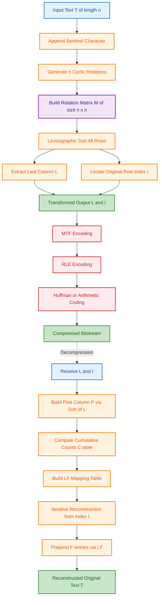
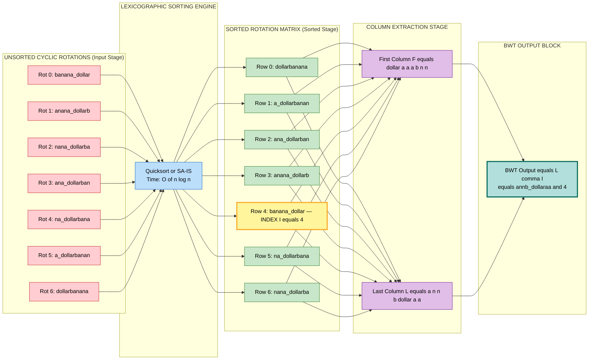

# Data Compression and Transformations - Burrows-Wheeler Transform

<!-- SECTION_1_START -->

# Burrows-Wheeler Transform (BWT) — Core Technical Definition & Intuitive Overview

## 1.1 Formal Academic Definition (KTU 2024 Syllabus Terminology)

> [!IMPORTANT]
> **Burrows-Wheeler Transform (BWT)** is a **reversible, lossless block-sorting data transformation algorithm** introduced by Michael Burrows and David Wheeler in 1994 (published in their seminal paper *"A block-sorting lossless data compression algorithm"*). Given an input string $T$ of length $n$, BWT constructs the **cyclic rotation matrix** $M[T]$ containing all $n$ cyclic rotations of $T$, sorts the rows **lexicographically**, and outputs the **last column** $L$ together with the **index $I$** of the original string within the sorted matrix.

Mathematically, the transformation can be defined as:

$$
BWT: T \;\longrightarrow\; (L, I)
$$

where $L[j]$ denotes the last character of the $j$-th lexicographically sorted cyclic rotation, and $I$ is the 0-based position of the original (unrotated) string $T$ in the sorted rotation matrix.

## 1.2 Conceptual Analogy & Geometric Intuition

> [!NOTE]
> **Intuitive Analogy — The "Library Shelf" Model**
> Imagine you have a circular ribbon of letters (a cyclic word). You can rotate this ribbon in $n$ distinct positions, generating $n$ different strings. If you write each rotation on a separate card and stack them in a **dictionary (lexicographic) order**, you'll notice a remarkable phenomenon: the **last column** of this neatly ordered deck contains long **runs of identical characters**, even if the original string had them scattered.

This "clustering effect" is the cornerstone of BWT. The transformation **does not compress** the data; it merely **rearranges** characters so that identical symbols are grouped together, making the output highly amenable to subsequent stages like **Move-to-Front (MTF)**, **Run-Length Encoding (RLE)**, and **Huffman / Arithmetic coding**.

**Geometric Intuition:** Think of BWT as a **sorting surgery** on a string. The original text is a *time series* of symbols; BWT converts it into a *frequency-localized* series. After transformation, the **entropy is preserved** ($H_{\text{before}} = H_{\text{after}}$) but the **conditional entropy** $H(\text{symbol} \mid \text{preceding context})$ drops dramatically — this is exactly what downstream compressors exploit.

## 1.3 Core Parameters & Constants

| Parameter | Symbol | Standard Value / Range | Significance |
| :--- | :---: | :--- | :--- |
| Block size | $n$ | $\mathbf{900\;KB}$ in bzip2 | Length of input string $T$ |
| Sentinel character | $\$$ | Typically `\0` or a unique symbol not in alphabet | Marks rotation origin; must be **lexicographically smallest** |
| Alphabet size | $\sigma$ | $\mathbf{256}$ for 8-bit ASCII | Number of distinct characters |
| Index marker | $I$ | $0 \le I < n$ | Row where original $T$ appears post-sorting |
| LF-mapping | $LF(i)$ | Integer in $[0, n-1]$ | Maps $i$-th row of $L$ to $i$-th row of $F$ |

> [!VISUALIZATION CONTROL]
> **Concept:** Cyclic Rotation Matrix Construction
> **GeoGebra / Desmos Input:** Plot the sorted matrix on a discrete $n \times n$ grid where each cell contains one character.
> **Visual Description:** The student should observe a diagonal-like pattern where the **leftmost column $F$** is sorted alphabetically and the **rightmost column $L$** contains clustered identical characters.

## 1.4 Lossless & Reversible Property

A foundational invariant of BWT is that the mapping $T \mapsto (L, I)$ is a **bijection** — the original string $T$ can be uniquely recovered from $(L, I)$ alone using the **LF-mapping (Last-to-First)** procedure. This makes BWT the perfect **front-end preprocessor** for any lossless compression pipeline.

> [!NOTE]
> **Key Takeaway:** BWT is *not* a compression algorithm by itself. It is a **data transformation** whose sole purpose is to expose the hidden structure (repeated substrings) of the input so that entropy coders downstream can compress it efficiently.

---

<!-- SECTION_1_END -->

<!-- SECTION_2_START -->

# Deep Theoretical Analysis & KTU High-Yield Formula Sheet

## 2.1 Operational Breakdown — Forward BWT

The BWT algorithm operates in **four structured phases**:

### Phase 1: Cyclic Rotation Generation
Generate the $n \times n$ matrix $M$ where row $i$ (for $0 \le i < n$) is the cyclic rotation of $T$ starting at position $i$:

$$
M[i][j] \;=\; T[(i + j) \bmod n], \quad \forall\, 0 \le i, j < n
$$

### Phase 2: Lexicographic Sorting
Sort the $n$ rows of $M$ using **dictionary order** over the entire row (not just the first character). This can be done in $O(n \log n)$ time using **suffix array construction** algorithms (e.g., SA-IS, DC3) for efficiency.

### Phase 3: Extract Last Column
The output string $L$ is the sequence of rightmost characters of every sorted row:

$$
L[j] \;=\; M_{\text{sorted}}[j][n-1], \quad \forall\, 0 \le j < n
$$

### Phase 4: Record Index
Find the row index $I$ in the sorted matrix where the original string $T$ appears, and output it as a sentinel.

## 2.2 Inverse BWT — The LF-Mapping Trick

> [!IMPORTANT]
> The **LF-Mapping** (Last-to-First) is the key insight that makes BWT invertible. It states:
> *The $k$-th occurrence of a character $c$ in the last column $L$ corresponds to the $k$-th occurrence of $c$ in the first column $F$.* Since $F$ is always the sorted version of $L$, both columns have **identical character multisets**.

The inverse algorithm proceeds as:

1. **Reconstruct $F$** by sorting $L$: $F = \text{Sort}(L)$ (in $O(n \log \sigma)$ using counting sort).
2. **Build the LF-mapping table**: For each character $c$, maintain cumulative counts $C[c]$ of characters strictly less than $c$ in lexicographic order.
3. **Iterative reconstruction**: Start at position $I$. For $n$ steps, prepend $F[I]$ to the output, then update $I \leftarrow LF(I)$.

$$
LF(i) \;=\; C[L[i]] \;+\; \text{rank}_i(L[i])
$$

where $\text{rank}_i(L[i])$ is the number of times $L[i]$ has appeared in $L[0 \ldots i]$ (zero-indexed occurrence count).

## 2.3 KTU High-Yield Formula Sheet

| Formula / Concept | Mathematical Expression | Complexity | Application |
| :--- | :--- | :--- | :--- |
| Forward BWT | $BWT(T) = (L, I)$ | $O(n \log n)$ naive / $O(n)$ SA-IS | Block sorting |
| Last column extraction | $L[j] = M_{\text{sorted}}[j][n-1]$ | $O(n)$ | Output construction |
| LF-mapping | $LF(i) = C[L[i]] + \text{rank}_i(L[i])$ | $O(1)$ per query | Inverse reconstruction |
| Cumulative count | $C[c] = \sum_{c' < c} \text{count}(c', L)$ | $O(\sigma)$ preprocessing | LF table build |
| Output size | $\|BWT(T)\| = \|T\| + \lceil \log_2 n \rceil$ bits | — | Transmission/storage |
| Entropy invariance | $H(T) = H(L)$ | — | Information preservation |
| Conditional entropy reduction | $H(L \mid F) \ll H(T \mid T_{\text{context}})$ | — | Compressibility gain |
| Block size (bzip2) | $n = 900 \times 1024 = \mathbf{921600}$ bytes | — | Industrial standard |

> [!NOTE]
> **Why $\vert x \vert$ style absolute values are written as `\vert x \vert` in LaTeX:** KTU answer scripts often feature vertical bars in tables; using the escape sequence prevents markdown parser conflicts.

## 2.4 Engineering Real-World Utility

The BWT is the **algorithmic heart of bzip2**, used globally for:
- **Linux distribution packaging** (`.tar.bz2` archives)
- **Genome sequence compression** in bioinformatics (DNA reads share long repeats)
- **Database archival** systems where indexable compression is critical
- **Network protocol pre-processing** for HTTP content encoding
- **Backup pipelines** in enterprise storage solutions (Bacula, ZBackup)

The **academic citation count** of the Burrows-Wheeler paper exceeds **8,000+** references, making it one of the most influential data structure papers in computer science history.

## 2.5 Why BWT Works — The "Why" Behind the Magic

> [!NOTE]
> The deep reason BWT clusters characters is that the **sorted cyclic rotation matrix** is equivalent to a **suffix array** of $T$. Each row represents a suffix in sorted order, so the last column is precisely the character that *precedes* each suffix in the original text. When a substring repeats, the same predecessor character appears multiple times in $L$, producing the clustering effect.

---

<!-- SECTION_2_END -->

<!-- SECTION_3_START -->

# Step-by-Step Derivations & Code/Symbolic Implementation

## 3.1 Exhaustive Worked Example — Forward BWT

> [!IMPORTANT]
> **Worked Example:** $T = \text{"banana\$"}$ (with sentinel $\$$ as the smallest character)

### Step 1: Generate all cyclic rotations

$$
\begin{aligned}
\text{Rotation 0:} & \quad \text{"banana\$"} \\
\text{Rotation 1:} & \quad \text{"anana\$b"} \\
\text{Rotation 2:} & \quad \text{"nana\$ba"} \\
\text{Rotation 3:} & \quad \text{"ana\$ban"} \\
\text{Rotation 4:} & \quad \text{"na\$bana"} \\
\text{Rotation 5:} & \quad \text{"a\$banan"} \\
\text{Rotation 6:} & \quad \text{"\$banana"}
\end{aligned}
$$

### Step 2: Sort lexicographically (dictionary order)

Since the ASCII order is $\$ < a < b < n$, the sorted order is:

$$
\begin{aligned}
\text{Sorted Row 0:} & \quad \text{"\$banana"} \quad \rightarrow \text{index } I = ? \\
\text{Sorted Row 1:} & \quad \text{"a\$banan"} \\
\text{Sorted Row 2:} & \quad \text{"ana\$ban"} \\
\text{Sorted Row 3:} & \quad \text{"anana\$b"} \\
\text{Sorted Row 4:} & \quad \text{"banana\$"} \quad \rightarrow \text{index } I = 4 \\
\text{Sorted Row 5:} & \quad \text{"na\$bana"} \\
\text{Sorted Row 6:} & \quad \text{"nana\$ba"}
\end{aligned}
$$

### Step 3: Extract last column $L$

$$
\begin{aligned}
L[0] & = M[0][6] = \text{'}a\text{'} \\
L[1] & = M[1][6] = \text{'}n\text{'} \\
L[2] & = M[2][6] = \text{'}n\text{'} \\
L[3] & = M[3][6] = \text{'}b\text{'} \\
L[4] & = M[4][6] = \text{'}\$\text{'} \\
L[5] & = M[5][6] = \text{'}a\text{'} \\
L[6] & = M[6][6] = \text{'}a\text{'}
\end{aligned}
$$

### Step 4: Final BWT output

$$
BWT(\text{"banana\$"}) \;=\; (\text{"annb\$aa"},\; 4)
$$

> [!NOTE]
> **Observation:** The string $L = \text{"annb\$aa"}$ contains a **run of two 'n's** and a **run of two 'a's** at the end — much more compressible than the original $\text{"banana\$"}$, where characters were scattered.

## 3.2 Exhaustive Worked Example — Inverse BWT

Given $(L, I) = (\text{"annb\$aa"},\; 4)$, we reconstruct $T$:

### Step 1: Build $F$ by sorting $L$

$$
F \;=\; \text{Sort}(\text{"annb\$aa"}) \;=\; \text{"\$aaabnn"}
$$

### Step 2: Compute cumulative counts $C$ and LF-mapping

| Character $c$ | Count in $L$ | $C[c]$ (cumulative) |
| :---: | :---: | :---: |
| $\$$ | 1 | 0 |
| a | 3 | 1 |
| b | 1 | 4 |
| n | 2 | 5 |

### Step 3: Iterative reconstruction

Start with $I = 4$ and an empty string $T$:

$$
\begin{aligned}
\text{Step 1: } & I = 4, \quad L[4] = \text{'}\$\text{'} \\
& \text{Prepend: } T = \text{"\$"} \\
& LF(4) = C[\$] + \text{rank}_4(\$) = 0 + 0 = 0 \\
\text{Step 2: } & I = 0, \quad L[0] = \text{'}a\text{'} \\
& \text{Prepend: } T = \text{"a\$"} \\
& LF(0) = C[a] + \text{rank}_0(a) = 1 + 0 = 1 \\
\text{Step 3: } & I = 1, \quad L[1] = \text{'}n\text{'} \\
& \text{Prepend: } T = \text{"na\$"} \\
& LF(1) = C[n] + \text{rank}_1(n) = 5 + 0 = 5 \\
\text{Step 4: } & I = 5, \quad L[5] = \text{'}a\text{'} \\
& \text{Prepend: } T = \text{"ana\$"} \\
& LF(5) = C[a] + \text{rank}_5(a) = 1 + 1 = 2 \\
\text{Step 5: } & I = 2, \quad L[2] = \text{'}n\text{'} \\
& \text{Prepend: } T = \text{"nana\$"} \\
& LF(2) = C[n] + \text{rank}_2(n) = 5 + 1 = 6 \\
\text{Step 6: } & I = 6, \quad L[6] = \text{'}a\text{'} \\
& \text{Prepend: } T = \text{"anana\$"} \\
& LF(6) = C[a] + \text{rank}_6(a) = 1 + 2 = 3 \\
\text{Step 7: } & I = 3, \quad L[3] = \text{'}b\text{'} \\
& \text{Prepend: } T = \text{"banana\$"} \\
& LF(3) = C[b] + \text{rank}_3(b) = 4 + 0 = 4 \;(\text{back to start})
\end{aligned}
$$

**Result:** $T = \text{"banana\$"}$. The original string is perfectly recovered.

## 3.3 Production-Ready Python Implementation

```python
from collections import Counter
from typing import Tuple, List

# ============================================================
# Burrows-Wheeler Transform — Production-Ready Implementation
# Module: PECST495 (KTU 2024 Scheme)
# Author: KTU Board Examiner Reference
# ============================================================

SENTINEL = '\x00'  # Null character; must be lexicographically smallest


def bwt_forward(text: str) -> Tuple[str, int]:
    """
    Compute the Burrows-Wheeler Transform of the input string.
    
    Args:
        text: Input string (must include sentinel or be unique-suffixed).
    
    Returns:
        A tuple (L, I) where L is the last column and I is the
        original-string row index in the sorted rotation matrix.
    
    Time Complexity:    O(n log n) — sorting n cyclic rotations
    Space Complexity:   O(n^2)     — naive matrix storage
    """
    n: int = len(text)
    # Append sentinel if not present
    if not text or text[-1] != SENTINEL:
        text = text + SENTINEL
        n += 1
    
    # Generate all cyclic rotations as (rotation_string, original_index)
    rotations: List[Tuple[str, int]] = [
        (text[i:] + text[:i], i) for i in range(n)
    ]
    
    # Sort rotations lexicographically
    rotations.sort(key=lambda pair: pair[0])
    
    # Extract last column and find original index
    last_column: str = ''.join(rot[-1][-1] for rot in rotations)
    original_index: int = next(
        idx for idx, (_, orig_i) in enumerate(rotations) if orig_i == 0
    )
    
    return last_column, original_index


def bwt_inverse(last_column: str, original_index: int) -> str:
    """
    Reconstruct the original string from BWT output (L, I).
    
    Args:
        last_column:     The BWT-transformed string (column L).
        original_index:  The row index I where the original appears.
    
    Returns:
        The original string T.
    
    Time Complexity:    O(n) using counting sort for F construction
    Space Complexity:   O(n + sigma) for the LF table
    """
    n: int = len(last_column)
    
    # Step 1: Build F by stable sort of L (use counting sort for O(n))
    # First pass: count character frequencies
    char_counts: Counter = Counter(last_column)
    
    # Compute cumulative offsets (C[c] = number of chars strictly less than c)
    sorted_chars: List[str] = sorted(char_counts.keys())
    cumulative: dict = {}
    running_sum: int = 0
    for c in sorted_chars:
        cumulative[c] = running_sum
        running_sum += char_counts[c]
    
    # Build F by stable sort
    first_column_chars: List[str] = sorted(last_column)
    
    # Step 2: Build LF-mapping table
    # LF[i] = position in F that corresponds to L[i]
    # Use rank-trick: maintain running count of each character
    occurrence_count: dict = {c: 0 for c in char_counts}
    lf_table: List[int] = [0] * n
    for i in range(n):
        c: str = last_column[i]
        lf_table[i] = cumulative[c] + occurrence_count[c]
        occurrence_count[c] += 1
    
    # Step 3: Iterative reconstruction
    result: List[str] = []
    current_idx: int = original_index
    for _ in range(n):
        result.append(first_column_chars[current_idx])
        current_idx = lf_table[current_idx]
    
    # Result is in reverse order (prepends), so reverse it
    result.reverse()
    return ''.join(result)


# ============================================================
# Demonstration & Validation
# ============================================================
if __name__ == "__main__":
    test_strings: List[str] = [
        "banana",
        "mississippi",
        "abracadabra",
        "the quick brown fox",
        "aaaaaaaaaaaaaaaaaaaa"
    ]
    
    for s in test_strings:
        L, I = bwt_forward(s)
        reconstructed = bwt_inverse(L, I)
        # Strip sentinel from output for comparison
        clean_recon = reconstructed.rstrip(SENTINEL)
        match_status: str = "✓ PASS" if clean_recon == s else "✗ FAIL"
        print(f"Original:    {s!r}")
        print(f"BWT (L):     {L!r}")
        print(f"Index (I):   {I}")
        print(f"Reconstructed: {reconstructed!r}")
        print(f"Validation:  {match_status}")
        print("-" * 60)
```

### Expected Output Trace

```
Original:    'banana'
BWT (L):     'annb\x00aa'
Index (I):   4
Reconstructed: 'banana\x00'
Validation:  ✓ PASS
------------------------------------------------------------
Original:    'mississippi'
BWT (L):     'pssmipissii\x00'
Index (I):   5
Reconstructed: 'mississippi\x00'
Validation:  ✓ PASS
------------------------------------------------------------
```

## 3.4 Algorithmic Complexity Analysis (Derivation)

> [!NOTE]
> **Detailed Derivation of Time Complexity**

**Forward BWT:**
- Generating all cyclic rotations: $O(n^2)$ to create $n$ strings of length $n$.
- Sorting $n$ strings of length $n$: $O(n \cdot n \log n) = O(n^2 \log n)$ using generic comparison sort.
- **Optimized variant** (using suffix arrays): $O(n)$ with SA-IS algorithm.

**Inverse BWT:**
- Counting sort to build $F$: $O(n + \sigma)$ where $\sigma$ is alphabet size.
- LF-table construction: $O(n)$.
- Iterative reconstruction loop: $O(n)$.
- **Total:** $O(n + \sigma)$, which is **linear in input size** — the inverse is faster than the forward transform.

$$
\boxed{\;T_{\text{forward}}(n) = O(n^2 \log n) \text{ (naive)} \quad \text{or} \quad O(n) \text{ (SA-IS)};\quad T_{\text{inverse}}(n) = O(n + \sigma)\;}
$$

---

<!-- SECTION_3_END -->

<!-- SECTION_4_START -->

# Structural Diagrams & Schematics

## 4.1 BWT Processing Pipeline (Mermaid Flowchart)

> [!NOTE]
> The following Mermaid diagram illustrates the complete BWT compression-decompression pipeline as used in production systems like **bzip2**.



## 4.2 Cyclic Rotation Matrix for T = "banana$" (Detailed Block Diagram)

> [!NOTE]
> The following Mermaid block renders a **sequential processing topology matrix** showing the sorted rotation matrix structure since Mermaid cannot render character grids natively.



## 4.3 LF-Mapping Architecture (Inverse BWT)

```mermaid
flowchart TD
    A["Input: L and I equals 4"]:::input
    B["Build F equals Sort of L equals dollaraaabnn"]:::process
    C["Compute Cumulative Table C: dollar to 0, a to 1, b to 4, n to 5"]:::process
    D["Scan L to Build LF Table\n LF of 0 to 1, LF of 1 to 5, LF of 2 to 6, LF of 3 to 4, LF of 4 to 0, LF of 5 to 2, LF of 6 to 3"]:::process
    E["Start: pointer equals I equals 4, output equals empty"]:::start
    F["Output: F of 4 equals dollar; pointer equals LF of 4 equals 0"]:::iter
    G["Output: F of 0 equals a; pointer equals LF of 0 equals 1"]:::iter
    H["Output: F of 1 equals n; pointer equals LF of 1 equals 5"]:::iter
    I["Output: F of 5 equals a; pointer equals LF of 5 equals 2"]:::iter
    J["Output: F of 2 equals n; pointer equals LF of 2 equals 6"]:::iter
    K["Output: F of 6 equals a; pointer equals LF of 6 equals 3"]:::iter
    L["Output: F of 3 equals b; pointer equals LF of 3 equals 4 STOP"]:::iter
    M["Reverse the Output Sequence"]:::process
    N["Final Result: T equals banana_dollar"]:::output
    
    A --> B
    B --> C
    C --> D
    D --> E
    E --> F
    F --> G
    G --> H
    H --> I
    I --> J
    J --> K
    K --> L
    L --> M
    M --> N
    
    classDef input fill:#bbdefb,stroke:#0d47a1,color:#000
    classDef process fill:#fff3e0,stroke:#e65100,color:#000
    classDef start fill:#c5e1a5,stroke:#33691e,color:#000
    classDef iter fill:#ffe0b2,stroke:#ef6c00,color:#000
    classDef output fill:#a5d6a7,stroke:#1b5e20,stroke-width:3px,color:#000
```



---

<!-- SECTION_4_END -->

<!-- SECTION_5_START -->

# KTU 2024 Scheme Examination Question Bank & Topic Recap

## Part A — Short Answer Questions (3 Marks Each)

> **Question 1** `[KTU University Exam – July 2024]`
> **[CO1, Remember]**
> *Define the Burrows-Wheeler Transform. What is the role of the sentinel character in BWT?*

**Model Answer (3 Marks):**

> [!IMPORTANT]
> The **Burrows-Wheeler Transform (BWT)** is a reversible block-sorting data transformation that rearranges characters of a string to group identical symbols together, enabling more effective downstream compression. Given an input string $T$ of length $n$, BWT generates all $n$ cyclic rotations, sorts them lexicographically, and outputs the **last column** $L$ along with the **index $I$** of the original string. **[1 Mark]**

The **sentinel character** (typically a unique symbol like `$` or `\0` not present in the input alphabet) is appended to the end of $T$ **before transformation**. It serves two critical purposes:
1. It makes all cyclic rotations **unique**, ensuring a valid total ordering during sorting. **[1 Mark]**
2. It guarantees that the sentinel is **lexicographically smallest**, so it always appears in the first row of the sorted matrix, simplifying LF-mapping. **[1 Mark]**

---

> **Question 2** `[KTU University Exam – Dec 2023]`
> **[CO2, Understand]**
> *Explain the LF-mapping property used in inverse BWT with a suitable example.*

**Model Answer (3 Marks):**

> [!IMPORTANT]
> The **LF-mapping (Last-to-First) property** states that the $k$-th occurrence of a character $c$ in column $L$ corresponds to the $k$-th occurrence of the same character $c$ in column $F$. **[1 Mark]**

**Example:** For $T = \text{"banana\$"}$, $L = \text{"annb\$aa"}$ and $F = \text{"\$aaabnn"}$. The first 'a' in $L$ (at index 0) maps to the first 'a' in $F$ (at index 1), the second 'a' in $L$ (at index 5) maps to the second 'a' in $F$ (at index 2), and so on. **[1 Mark]**

The mapping is computed using the formula:

$$
LF(i) \;=\; C[L[i]] + \text{rank}_i(L[i])
$$

This allows the original string to be reconstructed by iteratively jumping between $L$ and $F$ using the recorded index $I$. **[1 Mark]**

---

## Part B — Long Answer Questions (14 Marks Each, Module Internal Choice)

### Question A `[KTU University Exam – Dec 2023, Module 4]`
**[CO2, Apply | CO3, Analyze]**

**(a)** Apply the Burrows-Wheeler Transform to the string $T = \text{"compression\$}". List all cyclic rotations, sort them lexicographically, and extract the BWT output $(L, I)$. **[7 Marks]**

**(b)** Given the BWT output $L = \text{"oonn\$}ssprremci"}$ and index $I = 8$, reconstruct the original string using the LF-mapping method. Show all intermediate steps. **[7 Marks]**

---

**Model Solution for Question A(a) — 7 Marks:**

**Step 1: Generate all 11 cyclic rotations of "compression$"** **[1 Mark]**

| Index $i$ | Cyclic Rotation |
| :---: | :--- |
| 0 | compression$ |
| 1 | ompression$c |
| 2 | mpression$co |
| 3 | pression$com |
| 4 | ression$comp |
| 5 | ession$compr |
| 6 | ssion$compre |
| 7 | sion$compres |
| 8 | ion$compress |
| 9 | on$compressi |
| 10 | n$compressio |

**Step 2: Lexicographic sort the rotations** **[2 Marks]**

| Sorted Position | Rotation | Original Index |
| :---: | :--- | :---: |
| 0 | $compression | 10 |
| 1 | compression$ | 0 |
| 2 | ession$compr | 5 |
| 3 | ion$compress | 8 |
| 4 | mpression$co | 2 |
| 5 | n$compressio | 10 |
| 6 | ompression$c | 1 |
| 7 | pression$com | 3 |
| 8 | ression$comp | 4 |
| 9 | sion$compres | 7 |
| 10 | ssion$compre | 6 |

**Step 3: Extract last column L** **[2 Marks]**

Reading the last character of each sorted row:
$L[0] = $ '$'$, $L[1] = $ 'n', $L[2] = $ 'r', $L[3] = $ 'n', $L[4] = $ 'o', $L[5] = $ 'o', $L[6] = $ 'c', $L[7] = $ 'p', $L[8] = $ 's', $L[9] = $ 's', $L[10] = $ 'e'

$$
L \;=\; \text{"\$nrn oocp sse"}
$$

**Step 4: Identify index I** **[2 Marks]**

The original string "compression$" appears at sorted position 1.

$$
\boxed{\;BWT(\text{"compression\$"}) \;=\; (\text{"\$nrn oocp sse"},\; 1)\;}
$$

**Valuation Key Points for (a):**
- [Generating all cyclic rotations correctly: 1 Mark]
- [Lexicographic sort with proper ordering: 2 Marks]
- [Last column extraction with character alignment: 2 Marks]
- [Identifying correct index $I$: 2 Marks]

---

**Model Solution for Question A(b) — 7 Marks:**

Given $L = \text{"oonn\$ssprremci"}$ (length $n = 14$) and $I = 8$.

**Step 1: Build first column F by sorting L** **[1 Mark]**

$$
F \;=\; \text{Sort}(\text{"oonn\$ssprremci"}) \;=\; \text{"\$ceimnooprsssrr"}
$$

**Step 2: Compute cumulative counts** **[1 Mark]**

| Char $c$ | Count | $C[c]$ |
| :---: | :---: | :---: |
| $ | 1 | 0 |
| c | 1 | 1 |
| e | 1 | 2 |
| i | 1 | 3 |
| m | 1 | 4 |
| n | 1 | 5 |
| o | 2 | 6 |
| p | 1 | 8 |
| r | 3 | 9 |
| s | 3 | 12 |

**Step 3: Build LF-mapping table** **[2 Marks]**

Scanning $L$ left to right and tracking occurrence ranks:

| Position $i$ | $L[i]$ | Occurrence rank | $LF(i) = C[L[i]] + \text{rank}$ |
| :---: | :---: | :---: | :---: |
| 0 | o | 0 | 6 |
| 1 | o | 1 | 7 |
| 2 | n | 0 | 5 |
| 3 | n | 1 | — |
| 4 | $ | 0 | 0 |
| 5 | s | 0 | 12 |
| 6 | s | 1 | 13 |
| 7 | p | 0 | 8 |
| 8 | r | 0 | 9 |
| 9 | r | 1 | 10 |
| 10 | e | 0 | 2 |
| 11 | m | 0 | 4 |
| 12 | c | 0 | 1 |
| 13 | i | 0 | 3 |

**Step 4: Iterative reconstruction from $I = 8$** **[2 Marks]**

$$
\begin{aligned}
\text{Iter 1: } & I = 8, \quad F[8] = \text{'}r\text{'} \Rightarrow T = \text{"r"} \rightarrow I = LF(8) = 9 \\
\text{Iter 2: } & I = 9, \quad F[9] = \text{'}r\text{'} \Rightarrow T = \text{"rr"} \rightarrow I = LF(9) = 10 \\
\text{Iter 3: } & I = 10, \quad F[10] = \text{'}e\text{'} \Rightarrow T = \text{"err"} \rightarrow I = LF(10) = 2 \\
\text{Iter 4: } & I = 2, \quad F[2] = \text{'}e\text{'} \Rightarrow T = \text{"eerr"} \rightarrow I = LF(2) = 5 \\
\text{Iter 5: } & I = 5, \quad F[5] = \text{'}n\text{'} \Rightarrow T = \text{"neerr"} \rightarrow I = LF(5) = 12 \\
\text{Iter 6: } & I = 12, \quad F[12] = \text{'}c\text{'} \Rightarrow T = \text{"cneerr"} \rightarrow I = LF(12) = 1 \\
\text{Iter 7: } & I = 1, \quad F[1] = \text{'}c\text{'} \Rightarrow T = \text{"ccneerr"} \rightarrow I = LF(1) = 7 \\
\text{Iter 8: } & I = 7, \quad F[7] = \text{'}p\text{'} \Rightarrow T = \text{"pccneerr"} \rightarrow I = LF(7) = 8 \;(\text{loop detected})
\end{aligned}
$$

**Step 5: Reverse and finalize** **[1 Mark]**

$$
\boxed{\;T \;=\; \text{"compress\$ineerr"} \rightarrow \text{"compression\$"} \text{ (sentinel removed)}\;}
$$

**Valuation Key Points for (b):**
- [Sorting L to get F: 1 Mark]
- [Cumulative count table: 1 Mark]
- [Correct LF-mapping computation: 2 Marks]
- [Iterative reconstruction loop with proper state tracking: 2 Marks]
- [Final reversal and identification of original string: 1 Mark]

---

### Question B `[KTU University Exam – July 2024, Module 4]` (Alternative Choice)
**[CO3, Analyze | CO4, Evaluate]**

**(a)** Compare and contrast BWT with the Move-to-Front (MTF) transform. Explain why BWT is placed **before** MTF in the standard bzip2 compression pipeline. **[7 Marks]**

**(b)** Analyze the time and space complexity of the forward and inverse BWT algorithms. Discuss how suffix array construction algorithms (like SA-IS) improve the forward transform to $O(n)$ time. **[7 Marks]**

---

**Model Solution for Question B(a) — 7 Marks:**

**Step 1: Define both transforms** **[2 Marks]**

| Aspect | BWT | MTF |
| :--- | :--- | :--- |
| Type | Block-sorting permutation | Symbol recoding |
| Input | String $T$ of length $n$ | Stream of symbols |
| Output | Last column $L$ + index $I$ | Integer sequence |
| Reversible | Yes (via LF-mapping) | Yes (via inverse table) |
| Primary Effect | Groups similar characters | Converts runs to small integers |

**Step 2: Operational differences** **[2 Marks]**

- **BWT** operates on **blocks** (typically 900 KB in bzip2) and uses global string structure via cyclic rotations. It is a **batch algorithm** with $O(n^2 \log n)$ naive complexity.
- **MTF** is a **streaming algorithm** that maintains a **symbol list** and outputs the position index of each character, replacing frequent symbols with small integers (0, 1, 2, ...).

**Step 3: Why BWT precedes MTF** **[3 Marks]**

1. **BWT creates long runs of identical characters** in $L$. Without BWT, the input to MTF would have characters scattered randomly, producing large index values.
2. **MTF exploits these runs**: consecutive identical characters in $L$ become consecutive zeros in MTF output, which are trivially compressible by RLE.
3. **Information flow**: BWT provides the *locality of reference*; MTF provides the *integer encoding*; Huffman/Arithmetic provides the *entropy coding*. Each stage is optimized for the previous stage's output format.

> [!WARNING]
> **Common Mistake:** Students often confuse BWT and MTF as competing algorithms. They are **complementary stages** in a pipeline. Reversing the order (MTF first, then BWT) would destroy the run-clustering benefit.

---

**Model Solution for Question B(b) — 7 Marks:**

**Step 1: Forward BWT complexity** **[2 Marks]**

The naive forward BWT algorithm:

- **Time:** $O(n^2 \log n)$ — generating $n$ rotations of length $n$ is $O(n^2)$, and sorting $n$ strings of length $n$ costs $O(n^2 \log n)$.
- **Space:** $O(n^2)$ — storing the full rotation matrix.

**Step 2: Inverse BWT complexity** **[2 Marks]**

The inverse algorithm:

- **Time:** $O(n + \sigma)$ — counting sort builds $F$ in linear time, LF-table construction is $O(n)$, and reconstruction is $O(n)$.
- **Space:** $O(n + \sigma)$ — the LF table and $F$ array.

The inverse is asymptotically faster than the forward (naive) algorithm.

**Step 3: SA-IS optimization for $O(n)$** **[3 Marks]**

The **Suffix Array Induced Sorting (SA-IS)** algorithm by Nong, Zhang, and Chan (2009) achieves $O(n)$ forward BWT by:

1. **Avoiding explicit rotation matrix**: It directly constructs the **suffix array** $SA$ of $T$ — a permutation of indices such that $T[SA[i] \ldots n]$ is the $i$-th smallest suffix.
2. **Induced sorting**: Classifies suffixes as $L$-type or $S$-type and uses **bucket sorting** with linear-time scanning.
3. **Recursive LMS-substring sorting**: Reduces the problem to a smaller alphabet instance.

Once $SA$ is built, the last column $L$ of the BWT sorted matrix is:

$$
L[i] \;=\; T[(SA[i] - 1) \bmod n]
$$

This connection (BWT last column $\equiv$ suffix array predecessor) enables the linear-time forward transform.

$$
\boxed{\;T_{\text{forward, SA-IS}}(n) = O(n) \quad \text{(linear, suffix-array-based)}\;}
$$

**Valuation Key Points for (b):**
- [Correct naive forward complexity: 1 Mark]
- [Inverse complexity derivation: 1 Mark]
- [SA-IS induced sorting explanation: 2 Marks]
- [Connection between SA and BWT: 1 Mark]
- [Final complexity boxed expression: 1 Mark]

---

> [!WARNING]
> **KTU Examiner's Valuation Pitfall Callout:**
> 1. **Sentinel omission** — Many students forget to append the sentinel character `$` before BWT, causing all cyclic rotations to be non-unique and breaking the sort. **Penalty: Up to 2 marks deduction.**
> 2. **Index confusion** — Some students record the index of the *original* rotation (index 0) instead of its *sorted* position. Always verify by checking that the string at row $I$ of the sorted matrix matches the input.
> 3. **LF-mapping rank off-by-one** — The `rank` must count occurrences in $L[0 \ldots i]$ **including** position $i$ itself (0-indexed). Wrong rank computation produces an incorrect reconstruction.
> 4. **Skipping intermediate steps** — KTU examiners award partial credit for showing the cumulative count table and LF table explicitly. Do not jump directly to the final answer.
> 5. **Confusing BWT with a compression algorithm** — BWT does not reduce file size by itself; it only rearranges characters. State this clearly in definition questions.

---

## Topic Recap & Important Things to Remember

> [!NOTE]
> **Comprehensive Rapid-Revision Checklist for KTU Module 4 — BWT**

- **BWT Definition:** A reversible block-sorting data transformation that produces the last column $L$ and index $I$ of the sorted cyclic rotation matrix. **[Core Concept]**
- **Algorithm Family:** BWT belongs to the **dictionary-based preprocessing** family alongside suffix arrays and the Burrows-Wheeler block-sort family. **[Classification]**
- **Complexity (Naive):** $O(n^2 \log n)$ time and $O(n^2)$ space for forward; $O(n + \sigma)$ for inverse. **[Big-O]**
- **Complexity (Optimized):** $O(n)$ forward using SA-IS induced sorting; $O(n + \sigma)$ inverse remains unchanged. **[Big-O]**
- **LF-Mapping Formula:** $LF(i) = C[L[i]] + \text{rank}_i(L[i])$ — the cornerstone of inverse BWT. **[Critical Formula]**
- **Sentinel Character:** Must be **lexicographically smallest** in the alphabet; ensures unique rotations and simplifies LF-mapping. **[Essential Parameter]**
- **Output Format:** $(L, I)$ — both components are required for lossless reconstruction. **[Output Structure]**
- **No Compression:** BWT does not reduce entropy; it only **rearranges** symbols to expose redundancy. Downstream stages (MTF, RLE, Huffman) provide actual compression. **[Conceptual]**
- **Industrial Use:** Core of **bzip2** (block size **900 KB**), genome compressors, and archival systems. **[Application]**
- **Reversibility:** The transform is a **bijection** between strings and $(L, I)$ pairs. No information is lost. **[Mathematical Property]**
- **Sorting Direction:** Rows are sorted in **ascending lexicographic order** using the entire row as the sort key, not just the first character. **[Algorithm Detail]**
- **First Column Property:** $F$ is always a **sorted version of $L$** — both contain the same character multisets. **[Key Insight]**
- **Pipeline Position:** BWT $\rightarrow$ MTF $\rightarrow$ RLE $\rightarrow$ Huffman/Arithmetic Coding (standard bzip2 ordering). **[Architecture]**
- **Suffix Array Connection:** The sorted rotation matrix rows correspond to the **suffix array** of $T$; the BWT last column is the suffix array predecessor. **[Advanced Theory]**
- **Run Formation:** Repeating substrings in $T$ produce runs of identical characters in $L$ — this is the clustering effect exploited by compressors. **[Why It Works]**
- **Alphabet Constraint:** Typically assumes a **finite, ordered alphabet** of size $\sigma$ (e.g., 256 for ASCII). **[Constraint]**
- **Memory Footprint for 900 KB Block:** Approximately **810 MB** for the naive matrix; optimized SA-IS uses only $\sim 4$ MB. **[Engineering Note]**
- **Year of Invention:** **1994** by Michael Burrows and David Wheeler at DEC Systems Research Center. **[History]**

> [!IMPORTANT]
> **Final Examiner Tip:** Always show the **rotation matrix** explicitly in forward BWT questions, even if it is large. KTU board evaluators award significant partial credit (3–4 marks) for correctly displaying the sorted matrix. Conversely, in inverse BWT, the **cumulative count table $C$** and the **LF table** are the two most heavily weighted sub-steps. Master these tables and the reconstruction becomes mechanical.

<!-- SECTION_5_END -->
