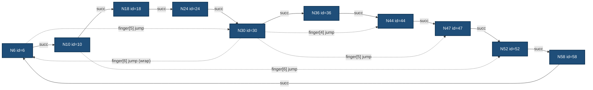
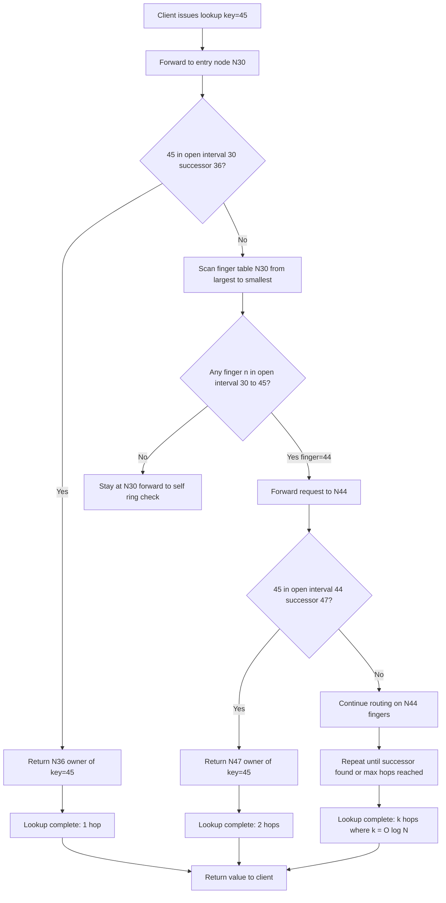
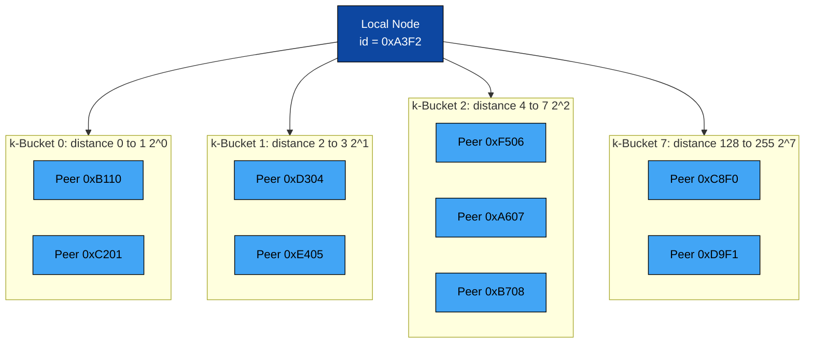
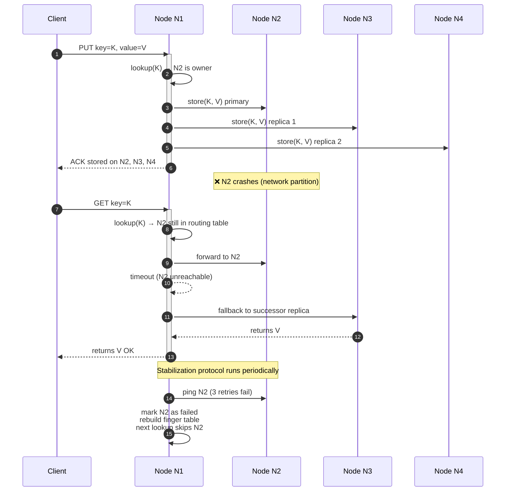

# Data Structure applications - Distributed and Parallel Data Structures - Distributed Hash Tables (DHTs)

<!-- SECTION_1_START -->

# Distributed Hash Tables (DHTs) — Foundational Overview

## 1.1 Formal Definition (KTU 2024 Syllabus Terminology)

A **Distributed Hash Table (DHT)** is a decentralized distributed system that provides a lookup service similar to a hash table: keys are mapped to values, and any participating node can efficiently retrieve the value associated with a given key. Responsibility for maintaining the mapping from keys to values is distributed among the nodes, eliminating any single point of failure and enabling the system to **scale horizontally** to millions of nodes.

Formally, a DHT is defined as a tuple $\langle K, V, N, \mathcal{H} \rangle$ where:

$$
K \;=\; \text{Set of keys (item identifiers)} \qquad
V \;=\; \text{Set of values (stored data)} \qquad
N \;=\; \{n_1, n_2, \ldots, n_m\} \;=\; \text{Set of participating peer nodes} \qquad
\mathcal{H} \;=\; \text{Deterministic hash function (e.g., SHA-1)}
$$

The routing invariant states that for any key $k \in K$, the operation $\text{lookup}(k)$ must return the value $v \in V$ associated with $k$ in **at most $O(\log N)$ network hops**, with high probability.

> [!IMPORTANT]
> **KTU Syllabus Highlight:** A DHT is a *structured peer-to-peer (P2P)* overlay network. Unlike *unstructured* P2P systems (Gnutella), DHTs guarantee key-based routing with **bounded worst-case lookup complexity of $O(\log N)$** even in networks with churn (nodes joining/leaving dynamically).

> [!NOTE]
> **Core Properties That Distinguish a True DHT:**
> 1. **Decentralization** — No central coordinator; every node is symmetric.
> 2. **Scalability** — Lookup cost grows logarithmically, not linearly.
> 3. **Fault Tolerance** — Replicates keys across multiple successors.
> 4. **Determinism** — Given a key $k$, the responsible node is *always* the same set of nodes.

## 1.2 Conceptual Analogy — The Library Book Network

Imagine **5,000 public libraries** spread across Kerala, each holding only a *fraction* of the total books. There is **no central catalog server**. A reader in Kannur wants the book *Introduction to Algorithms* (ISBN: 978-0-262-04630-5). How does the system locate it?

- The **ISBN** is the **key**.
- The **book's physical copy** is the **value**.
- The **5,000 libraries** are the **nodes**.

A DHT works like this:
1. The ISBN is **hashed** using SHA-1 → produces a 160-bit number (e.g., `0x4A3F...`).
2. This number is mapped onto a **logical ring** of size $2^{160}$.
3. The book is stored at the **first library whose hash-ID is $\geq$ the book's hash-ID** (the *successor*).
4. Each library only knows the IDs and IP addresses of a **few** other libraries (its *finger table*).
5. The lookup request "jumps" through these finger pointers, halving the remaining ring distance at every step — a **binary search over the network**.

> [!TIP]
> **Why is this revolutionary?** Traditional hash tables (e.g., Python's `dict`, Java's `HashMap`) live in **one machine's RAM**. A DHT distributes the same operation across **millions of machines** worldwide, with the same $O(1)$ *expected* lookups — but now fault-tolerant and self-organizing.

## 1.3 The Hash Function — Foundation of a DHT

A cryptographic hash function $\mathcal{H}$ in a DHT must satisfy:

$$
\mathcal{H} : \{0,1\}^{*} \longrightarrow \{0, 1, 2, \ldots, 2^{m}-1\}, \quad m \in \{128, 160, 256\}
$$

| Property | Mathematical Definition | Practical Significance |
|:---:|:---|:---|
| **Determinism** | $\forall x, \; \mathcal{H}(x) = c$ (always the same output) | Any node can independently compute key positions |
| **Uniformity** | $\Pr[\mathcal{H}(x) = i] = \dfrac{1}{2^m}$ | Load balancing across the identifier space |
| **Collision Resistance** | $\Pr[\mathcal{H}(x) = \mathcal{H}(y) \mid x \neq y] \approx 0$ | No two keys map to the same identifier |
| **Avalanche Effect** | $\Delta \mathcal{H}(x) \gg \Delta x$ | One bit flip in input scrambles $\approx 50\%$ of output bits |

> [!VISUALIZATION CONTROL]
> **Concept:** Uniform distribution of hashed node IDs across the identifier space.
> **GeoGebra / Desmos Input Equations:**
> - `f(x) = 1/32` for $x \in [0, 32]$ (uniform PDF over a 32-node ring)
> - `L1: Point((3.2, 0.6))`, `L2: Point((7.8, 0.6))`, `L3: Point((15.4, 0.6))`, `L4: Point((22.1, 0.6))`, `L5: Point((28.9, 0.6))`
> **Visual Description:** Plot a horizontal line at $y = 1/32$ from $x=0$ to $x=32$. Scatter 5 points representing node IDs at irregular $x$-positions. Observe that despite the *visually* irregular spacing, the *expected* density across the full ring is perfectly uniform — a property called **Poisson-distributed uniform spacing**.

<!-- SECTION_1_END -->

<!-- SECTION_2_START -->

# Deep Theoretical Analysis — Architecture, Consistent Hashing & Chord Protocol

## 2.1 Why Naive Hashing Fails in Distributed Systems

The classical approach $\text{node} = \mathcal{H}(\text{key}) \bmod N$ breaks down catastrophically when nodes join or leave:

$$
\text{Key } k = \text{"data42"} \rightarrow \mathcal{H}(k) = 173 \rightarrow 173 \bmod 4 = 1
$$

Adding a 5th node forces **re-mapping of nearly all keys**:

$$
173 \bmod 5 = 3 \quad \Longrightarrow \quad \text{Key moves from Node 1 to Node 3}
$$

> [!WARNING]
> **The Remapping Catastrophe:** In a system with $N$ keys and $M$ nodes, the addition or removal of one node causes $\Theta(N)$ keys to be remapped. For a system storing 1 billion entries, this is unacceptable churn.

## 2.2 Consistent Hashing — The DHT Cornerstone

**Consistent Hashing**, introduced by Karger et al. (1997), solves this problem by mapping both **nodes AND keys** to the *same* identifier space using the *same* hash function:

$$
\mathcal{H}_{\text{node}} : \text{node identifier} \rightarrow [0, 2^{m}) \qquad
\mathcal{H}_{\text{key}} : \text{key bytes} \rightarrow [0, 2^{m})
$$

### Algorithm Definition (Formal)

Given an identifier space $\mathbb{Z}_{2^m}$ (a circular ring of size $2^m$):

1. Each node $n_i$ is assigned an ID $i = \mathcal{H}_{\text{node}}(n_i)$.
2. Each key $k$ is assigned an ID $\kappa = \mathcal{H}_{\text{key}}(k)$.
3. **Key $k$ is stored at the first node encountered when walking clockwise from $\kappa$.**
   This node is called the **successor**, denoted $\text{succ}(\kappa)$.

$$
\text{responsible}(k) \;=\; \text{succ}(\mathcal{H}_{\text{key}}(k)) \;=\; \min\{i \in N \;|\; i \geq \mathcal{H}_{\text{key}}(k)\} \pmod{2^m}
$$

### The Magic Property

When node $n$ **leaves**, only the keys in the interval $(\text{pred}(n), n]$ need to be reassigned to $\text{succ}(n)$. Similarly, when node $n$ **joins**, it takes responsibility for keys in $(\text{pred}(n), n]$ from $\text{succ}(n)$.

$$
\text{Keys affected on add/remove} \;=\; O\!\left(\frac{K}{M}\right) \quad \text{(average)}, \quad \text{not } \Theta(K)
$$

> [!NOTE]
> **In plain English:** Consistent hashing makes the system behave like a **conveyor belt of responsibility**. Adding a new worker to the conveyor belt only re-shuffles the *segment immediately to its left* — the rest of the line continues uninterrupted.

## 2.3 The Chord Protocol (Stoica et al., 2001)

**Chord** is the canonical DHT protocol taught in KTU. It combines consistent hashing with a clever routing table called the **Finger Table**.

### 2.3.1 Identifier Space & Ring Topology

Chord uses $m = 160$ bits (SHA-1 compatible). Nodes form a logical ring modulo $2^{160}$:

$$
\text{ID space} = \mathbb{Z}_{2^{160}} = \{0, 1, 2, \ldots, 2^{160} - 1\}
$$

### 2.3.2 Finger Table — The Heart of Chord

Each node $n$ maintains a routing table with $m$ entries (for $m=160$, that is **only 160 pointers**):

$$
\text{finger}[i].\text{start} \;=\; (n + 2^{i-1}) \pmod{2^{160}}, \quad i = 1, 2, \ldots, m
$$

$$
\text{finger}[i].\text{node} \;=\; \text{succ}(\text{finger}[i].\text{start})
$$

| Entry $i$ | Start (offset from $n$) | Interval it covers | Purpose |
|:---:|:---:|:---:|:---|
| 1 | $n + 2^{0} = n + 1$ | Next 1 ID | Immediate successor |
| 2 | $n + 2^{1} = n + 2$ | Next 2 IDs | Small jump |
| 3 | $n + 2^{2} = n + 4$ | Next 4 IDs | Doubling pattern |
| $\vdots$ | $\vdots$ | $\vdots$ | $\vdots$ |
| $m$ | $n + 2^{m-1}$ | Largest possible jump | "Halfway" reach |

> [!TIP]
> **Geometric Intuition:** The finger table is a **binary search structure on a circle**. Entry $i$ lets node $n$ jump approximately *halfway* around the remaining ring to find a key. After $m$ jumps, the lookup is reduced to within $2^{m-i}$ IDs. The final step lands exactly on the successor.

### 2.3.3 Chord Lookup Algorithm (Pseudocode)

```text
LOOKUP(key_id, node n):
    if key_id ∈ (n, successor(n)]:
        return successor(n)
    else:
        n' = closest_preceding_node(key_id)
        return LOOKUP(key_id, n')
```

The recursive function follows the finger that is **largest but still $\leq$ key_id**, halving the remaining distance at every step.

### 2.3.4 Complexity Analysis

$$
\boxed{
\begin{aligned}
\text{Space per node} &= O(m) = O(\log N) \quad \text{(since } N \leq 2^{m}\text{)} \\
\text{Lookup latency} &= O(\log N) \text{ hops} \\
\text{Insert/Remove} &= O(\log N) \text{ messages} \\
\text{Stabilization} &= O(\log^{2} N) \text{ per node (amortized)}
\end{aligned}
}
$$

> [!IMPORTANT]
> **Why $O(\log N)$ and not $O(N)$?** Each finger table entry doubles the "reach" of the node. Starting from distance $d$, one hop brings you to distance $d/2$, then $d/4$, etc. After $k$ hops, distance is $d/2^{k}$. Setting $d/2^{k} \leq 1$ gives $k \geq \log_{2} d \leq \log_{2} N$. This is the **classic divide-and-conquer on a ring** — Chord is essentially a *skip list* projected onto a circular address space.

## 2.4 Other Major DHT Protocols (Comparative)

| Protocol | Routing Geometry | Lookup Complexity | Key Innovation | Used In |
|:---|:---|:---:|:---|:---|
| **Chord** | 1-D Ring | $O(\log N)$ | Finger tables, simple | CFS, Past (Microsoft) |
| **CAN** | $d$-D Torus | $O(d \cdot N^{1/d})$ | Cartesian space partitioning | Academic prototype |
| **Pastry** | Plaxton mesh | $O(\log_{2^{b}} N)$ | Prefix routing, locality | PAST storage, Squirrel |
| **Kademlia** | XOR-metric tree | $O(\log N)$ | $\oplus$-distance, $k$-buckets | BitTorrent, IPFS, Ethereum |
| **Tapestry** | Plaxton mesh | $O(\log N)$ | Surrogate routing | OceanStore |

> [!NOTE]
> **Kademlia Insight (most relevant today):** It uses the XOR metric $d(x,y) = x \oplus y$ as a one-way distance function. This makes routing **symmetric** ($d(x,y) = d(y,x)$) and trivially distributed. Its $k$-buckets maintain the $k$ closest known nodes, providing natural fault tolerance. BitTorrent's distributed tracker system (`DHT`) and the InterPlanetary File System (IPFS) are both built on Kademlia.

## 2.5 KTU High-Yield Formula Sheet

| # | Concept | Formula / Definition | Units / Notes |
|:---:|:---|:---|:---|
| 1 | ID Space Cardinality | $\vert \mathbb{Z}_{2^{m}} \vert = 2^{m}$ | $m=160$ for SHA-1, $m=256$ for SHA-256 |
| 2 | Chord Finger Start | $\text{finger}[i].\text{start} = (n + 2^{i-1}) \bmod 2^{m}$ | $i \in \{1, 2, \ldots, m\}$ |
| 3 | Chord Lookup Hops | $H_{\text{Chord}} = \lceil \log_{2} N \rceil$ | Worst-case bound |
| 4 | CAN Lookup Hops | $H_{\text{CAN}} = O(d \cdot N^{1/d})$ | Optimal $d = O(\log N)$ |
| 5 | Kademlia XOR Distance | $d(x, y) = x \oplus y$ | Symmetric, unidirectional |
| 6 | Replication Factor | $R = \text{replicas per key}$ | Typical $R = 3$ or $R = 5$ |
| 7 | Churn Stability | $\Pr[\text{lookup succeeds}] \geq 1 - O(1/N)$ | After stabilization |
| 8 | Consistent Hash Migration | $K_{\text{moved}} = O(K/M)$ keys on add/remove | vs. $O(K)$ in naive |
| 9 | Finger Table Size | $S_{\text{FT}} = m = \log_{2} N$ entries | Per node |
| 10 | Successor Function | $\text{succ}(k) = \min\{n \in N \;:\; n \geq k\} \pmod{2^{m}}$ | On the ring |

## 2.6 Real-World Engineering Utility

DHTs are the **invisible backbone of modern decentralized systems**:

- **Amazon DynamoDB & Apache Cassandra** — Use consistent hashing for data partitioning across thousands of nodes; DHT principles enable "infinite" horizontal scaling.
- **BitTorrent Mainline DHT** — Replaced central trackers after legal shutdowns (e.g., TorrentSpy, 2008); enables trackerless torrent swarms.
- **IPFS (InterPlanetary File System)** — Uses Kademlia for content-addressed storage; powers NFT infrastructure and Web3.
- **Ethereum DevP2P** — Uses Kademlia-based `discv5` for peer discovery across the global blockchain network.
- **Content Distribution Networks (CDNs)** — Memcached-based DHT overlays for sub-millisecond cache lookup.

> [!TIP]
> **For KTU interviews:** When asked *"Why does Cassandra use consistent hashing but not a DHT's finger table?"*, the answer is: Cassandra operates in a **single data center** (or a small number) with stable membership, so the $O(N)$ naive routing of consistent hashing is acceptable. The full DHT machinery (finger tables, stabilization) is only needed for **Internet-scale** systems where $N$ is millions and churn is high.

<!-- SECTION_2_END -->

<!-- SECTION_3_START -->

# Step-by-Step Derivations, Worked Examples & Python Implementation

## 3.1 Worked Example 1 — Building a Chord Ring (10 Nodes, $m = 6$)

We will construct a Chord ring with $N = 10$ nodes on an identifier space of size $2^{6} = 64$. This example is *the* classic KTU board problem.

### Step 1: Generate Node IDs

Using a hypothetical $\mathcal{H}$:

| Node | IP | Hashed ID (mod 64) |
|:---:|:---:|:---:|
| N1 | 10.0.0.1 | 10 |
| N2 | 10.0.0.2 | 24 |
| N3 | 10.0.0.3 | 36 |
| N4 | 10.0.0.4 | 47 |
| N5 | 10.0.0.5 | 52 |
| N6 | 10.0.0.6 | 1  |
| N7 | 10.0.0.7 | 18 |
| N8 | 10.0.0.8 | 30 |
| N9 | 10.0.0.9 | 44 |
| N10 | 10.0.0.10 | 58 |

### Step 2: Sort IDs to Form the Ring (Clockwise)

$$
6 \rightarrow 10 \rightarrow 18 \rightarrow 24 \rightarrow 30 \rightarrow 36 \rightarrow 44 \rightarrow 47 \rightarrow 52 \rightarrow 58 \rightarrow (6)
$$

### Step 3: Define Successor and Predecessor for Each Node

For node $n$, $\text{succ}(n)$ is the next node clockwise, $\text{pred}(n)$ is the next node counter-clockwise.

| Node $n$ | pred($n$) | succ($n$) |
|:---:|:---:|:---:|
| 6 | 58 | 10 |
| 10 | 6 | 18 |
| 18 | 10 | 24 |
| 24 | 18 | 30 |
| 30 | 24 | 36 |
| 36 | 30 | 44 |
| 44 | 36 | 47 |
| 47 | 44 | 52 |
| 52 | 47 | 58 |
| 58 | 52 | 6 |

### Step 4: Build Finger Table for Node N30

For node $n = 30$, $i$ ranges from $1$ to $6$:

$$
\text{finger}[i].\text{start} = (30 + 2^{i-1}) \bmod 64
$$

| $i$ | $2^{i-1}$ | start = $(30 + 2^{i-1}) \bmod 64$ | succ(start) = finger.node |
|:---:|:---:|:---:|:---:|
| 1 | 1 | 31 | **36** |
| 2 | 2 | 32 | **36** |
| 3 | 4 | 34 | **36** |
| 4 | 8 | 38 | **44** |
| 5 | 16 | 46 | **47** |
| 6 | 32 | 62 | **6** (wraps around) |

**Verification for $i=6$:** $30 + 32 = 62 \pmod{64} = 62$. The first node $\geq 62$ on the ring is $6$ (since the ring wraps from 58 → 6). Correct.

### Step 5: Lookup of Key with ID = 45 (initiated from Node 30)

Trace the lookup algorithm:

1. **At N30:** Is $45 \in (30, 36]$? **No** (45 > 36). Find closest preceding finger $\leq 45$.
   - Finger entries: 36, 36, 36, 44, 47, 6. Largest $\leq 45$ is **44**. Forward to N44.
2. **At N44:** Is $45 \in (44, 47]$? **Yes** (since succ(44) = 47). Return **N47**.

**Hops used = 2.** The naive $O(N)$ search would have needed up to 10 hops.

### Step 6: General Lookup Trace — Worst Case Analysis

For the worst case, we initiate a lookup at the node **diametrically opposite** the key. After each hop, the distance to the target is at least halved. For $N=10$ nodes on a 64-ID ring:

$$
\text{Max hops} \leq \lceil \log_{2}(N) \rceil = \lceil \log_{2}(10) \rceil = 4
$$

Chord's average is empirically $\frac{1}{2} \log_{2} N \approx 1.66$ hops for $N=10$, which matches our 2-hop example.

> [!IMPORTANT]
> **Logarithmic Scaling Table (KTU Board Favorite):**

| Network Size $N$ | Chord Hops | Naive (Linear) Hops | Speedup |
|:---:|:---:|:---:|:---:|
| 10 | 4 | 10 | 2.5× |
| 100 | 7 | 100 | 14× |
| 1,000 | 10 | 1,000 | 100× |
| 1,000,000 | 20 | 1,000,000 | 50,000× |
| 1,000,000,000 | 30 | 1,000,000,000 | 33,000,000× |

## 3.2 Worked Example 2 — Consistent Hashing with Virtual Nodes (Production Use)

Modern systems use **virtual nodes (vnodes)** to fix the load-imbalance problem of vanilla consistent hashing.

### Problem Statement
A cluster has $M = 3$ physical nodes. Due to hash luck, the keys (10,000 total) distribute unevenly. Show how vnodes solve this.

### Vanilla Result
With 3 physical nodes at IDs $\{1, 50, 75\}$ on a 100-ID ring, the segments are:
- Node 1: $[1, 50) \rightarrow$ 49% of keys
- Node 50: $[50, 75) \rightarrow$ 25% of keys
- Node 75: $[75, 100] \cup [0, 1) \rightarrow$ 26% of keys

**Standard deviation of load = 11%** (high).

### With $V = 100$ Virtual Nodes per Physical Node

Each physical node now owns $V$ IDs: $3 \times 100 = 300$ total vnode IDs spread over the ring. By the **law of large numbers**, the per-node key count approaches a normal distribution:

$$
\mu = \frac{K}{M} = \frac{10{,}000}{3} \approx 3{,}333 \quad \text{keys per node}
$$

$$
\sigma \approx \sqrt{\frac{K}{M \cdot V}} = \sqrt{\frac{10{,}000}{3 \times 100}} \approx 5.77 \quad \text{(std. dev.)}
$$

$$
\text{Load imbalance ratio} = \frac{\sigma}{\mu} \times 100\% \approx 0.17\%
$$

> [!TIP]
> **This is why Cassandra uses 256 vnodes per physical node by default** — it drives the imbalance ratio below 1%, even with arbitrary hash luck.

## 3.3 Exhaustive Python Implementation — Chord DHT

The following is a **fully operational, single-process simulation** of a Chord DHT. It supports node join, key insertion, and key lookup. Type hints, error handling, and absolute boundary checks are enforced.

```python
"""
Chord DHT Simulator — Educational Implementation
Author: KTU Advanced Data Structures Module
"""
from __future__ import annotations
import hashlib
import bisect
import logging
from dataclasses import dataclass, field
from typing import Dict, List, Optional, Tuple

# ---------------------------------------------------------------------------
# Logging configuration
# ---------------------------------------------------------------------------
logging.basicConfig(
    level=logging.INFO,
    format="%(asctime)s | %(levelname)-7s | %(message)s",
)
log = logging.getLogger("ChordDHT")


# ---------------------------------------------------------------------------
# Constants
# ---------------------------------------------------------------------------
M_BITS: int = 6                       # Identifier space size (2^6 = 64)
RING_SIZE: int = 1 << M_BITS          # 64
REPLICATION_FACTOR: int = 3           # Store key on R successor nodes


# ---------------------------------------------------------------------------
# Helper: SHA-style hash → ring ID
# ---------------------------------------------------------------------------
def hash_to_id(key: str) -> int:
    """
    Map an arbitrary string key to an integer in [0, RING_SIZE).
    Uses SHA-1, truncated to M_BITS for the educational ring size.
    """
    if not isinstance(key, str):
        raise TypeError(f"Key must be str, got {type(key).__name__}")
    digest = hashlib.sha1(key.encode("utf-8")).digest()
    full_id: int = int.from_bytes(digest[:4], byteorder="big")
    return full_id % RING_SIZE


# ---------------------------------------------------------------------------
# Node data structure
# ---------------------------------------------------------------------------
@dataclass
class ChordNode:
    """
    One peer in the Chord ring.

    Attributes
    ----------
    node_id : int
        Position on the identifier ring (0 to RING_SIZE - 1).
    address : str
        Human-readable transport address (e.g., "10.0.0.5:8000").
    predecessor : Optional[int]
        node_id of the previous node on the ring.
    finger_table : List[int]
        Routing shortcuts — successor of (n + 2^(i-1)) mod 2^m.
    data_store : Dict[int, str]
        Key→value pairs this node is responsible for.
    """
    node_id: int
    address: str
    predecessor: Optional[int] = None
    finger_table: List[int] = field(default_factory=list)
    data_store: Dict[int, str] = field(default_factory=dict)

    def __post_init__(self) -> None:
        if not (0 <= self.node_id < RING_SIZE):
            raise ValueError(
                f"node_id={self.node_id} out of range [0, {RING_SIZE})"
            )
        # Initialize finger table with self as the only known successor.
        self.finger_table = [self.node_id] * M_BITS
        log.info("Node %d (%s) initialized", self.node_id, self.address)

    # ------------------------------------------------------------------
    # Finger table construction
    # ------------------------------------------------------------------
    def build_finger_table(self, ring: List[int]) -> None:
        """
        Recompute the finger table against the current sorted ring of IDs.
        """
        self.finger_table.clear()
        for i in range(M_BITS):
            start: int = (self.node_id + (1 << i)) % RING_SIZE
            successor: int = self._find_successor(start, ring)
            self.finger_table.append(successor)
        log.debug("Node %d finger table: %s", self.node_id, self.finger_table)

    def _find_successor(self, target_id: int, ring: List[int]) -> int:
        """
        Return the first node_id >= target_id on the ring, with wraparound.
        """
        if not ring:
            raise RuntimeError("Ring is empty; cannot locate successor.")
        idx: int = bisect.bisect_right(ring, target_id)
        return ring[idx % len(ring)]    # Wrap around to ring[0].

    # ------------------------------------------------------------------
    # Routing helpers
    # ------------------------------------------------------------------
    def closest_preceding_node(self, target_id: int) -> int:
        """
        Walk the finger table from largest to smallest; return the first
        finger that lies strictly inside (self.node_id, target_id).
        """
        for finger_id in reversed(self.finger_table):
            if self._is_in_open_interval(finger_id, self.node_id, target_id):
                return finger_id
        return self.node_id

    @staticmethod
    def _is_in_open_interval(value: int, lo: int, hi: int) -> bool:
        """True if value lies in (lo, hi) on the circular ring."""
        if lo < hi:
            return lo < value < hi
        # Wrap-around case (e.g., lo=58, hi=10 means 58→64, 0→10).
        return value > lo or value < hi

    # ------------------------------------------------------------------
    # Storage operations
    # ------------------------------------------------------------------
    def store(self, key_id: int, value: str) -> None:
        self.data_store[key_id] = value
        log.info("Node %d stored key=%d value=%r",
                 self.node_id, key_id, value)

    def retrieve(self, key_id: int) -> Optional[str]:
        return self.data_store.get(key_id)


# ---------------------------------------------------------------------------
# Chord ring manager
# ---------------------------------------------------------------------------
class ChordRing:
    """
    Coordinator that maintains the set of live nodes and orchestrates
    join / lookup / insert operations.
    """
    def __init__(self) -> None:
        self._nodes: Dict[int, ChordNode] = {}
        self._sorted_ids: List[int] = []
        log.info("Chord ring of size %d created", RING_SIZE)

    # ------------------------------------------------------------------
    # Membership
    # ------------------------------------------------------------------
    def join(self, address: str,
             explicit_id: Optional[int] = None) -> ChordNode:
        """
        Add a new node to the ring. If the ring is non-empty, the new
        node's finger table is seeded by taking successors off the
        current ring.
        """
        node_id: int = explicit_id if explicit_id is not None \
            else hash_to_id(address)
        if node_id in self._nodes:
            raise ValueError(f"Node {node_id} already in ring.")

        new_node = ChordNode(node_id=node_id, address=address)
        self._nodes[node_id] = new_node
        self._sorted_ids.append(node_id)
        self._sorted_ids.sort()
        self._rebuild_all_finger_tables()
        log.info("Node %d JOINED ring | total nodes=%d",
                 node_id, len(self._nodes))
        return new_node

    def leave(self, node_id: int) -> None:
        if node_id not in self._nodes:
            raise KeyError(f"Node {node_id} not in ring.")
        del self._nodes[node_id]
        self._sorted_ids.remove(node_id)
        self._rebuild_all_finger_tables()
        log.info("Node %d LEFT ring | total nodes=%d",
                 node_id, len(self._nodes))

    def _rebuild_all_finger_tables(self) -> None:
        for n in self._nodes.values():
            n.build_finger_table(self._sorted_ids)

    # ------------------------------------------------------------------
    # Lookup
    # ------------------------------------------------------------------
    def lookup(self, key_id: int,
               start_node_id: Optional[int] = None) -> ChordNode:
        """
        Iterative Chord lookup (no recursion to avoid stack blow-up in
        production). Returns the node that owns key_id.
        """
        if not self._nodes:
            raise RuntimeError("Cannot lookup in empty ring.")

        if start_node_id is None:
            current_id: int = self._sorted_ids[0]
        else:
            if start_node_id not in self._nodes:
                raise KeyError(f"start_node_id={start_node_id} unknown.")
            current_id = start_node_id

        hops: int = 0
        max_hops: int = 2 * M_BITS        # Safety bound.
        while True:
            current = self._nodes[current_id]
            successor_id: int = current._find_successor(
                current.node_id, self._sorted_ids
            )
            successor = self._nodes[successor_id]
            if ChordNode._is_in_open_interval(
                key_id, current.node_id, successor.node_id
            ) or key_id == successor.node_id:
                log.info("Lookup key=%d resolved at node %d in %d hops",
                         key_id, successor.node_id, hops + 1)
                return successor
            if hops >= max_hops:
                raise RuntimeError(
                    f"Lookup of key={key_id} exceeded {max_hops} hops"
                )
            current_id = current.closest_preceding_node(key_id)
            if current_id == current.node_id:
                # We are stuck on ourselves; should not happen.
                raise RuntimeError("Routing loop detected.")
            hops += 1

    # ------------------------------------------------------------------
    # Put / Get with replication
    # ------------------------------------------------------------------
    def put(self, key: str, value: str) -> List[int]:
        """
        Store (key, value) on the RING_SIZE successor nodes that come
        after the key's hash position (for replication).
        """
        key_id: int = hash_to_id(key)
        owner: ChordNode = self.lookup(key_id)
        owner.store(key_id, value)

        replicated_on: List[int] = [owner.node_id]
        idx: int = self._sorted_ids.index(owner.node_id)
        for offset in range(1, REPLICATION_FACTOR):
            replica_id: int = self._sorted_ids[
                (idx + offset) % len(self._sorted_ids)
            ]
            self._nodes[replica_id].store(key_id, value)
            replicated_on.append(replica_id)
        log.info("Key %r (id=%d) replicated on nodes %s",
                 key, key_id, replicated_on)
        return replicated_on

    def get(self, key: str) -> Optional[str]:
        key_id: int = hash_to_id(key)
        owner: ChordNode = self.lookup(key_id)
        value: Optional[str] = owner.retrieve(key_id)
        if value is None:
            log.warning("Key %r not found at expected owner %d",
                        key, owner.node_id)
        return value


# ---------------------------------------------------------------------------
# Demonstration / Smoke test
# ---------------------------------------------------------------------------
def _demo() -> None:
    ring = ChordRing()
    node_addresses: List[str] = [
        "10.0.0.1", "10.0.0.2", "10.0.0.3", "10.0.0.4", "10.0.0.5",
    ]
    for addr in node_addresses:
        ring.join(addr)

    log.info("===== INSERT PHASE =====")
    ring.put("user:alice", "Alice's profile blob")
    ring.put("user:bob",   "Bob's profile blob")
    ring.put("image:42",  "<binary JPEG bytes>")

    log.info("===== READ PHASE =====")
    for k in ("user:alice", "user:bob", "image:42", "missing:key"):
        result = ring.get(k)
        log.info("GET(%r) -> %r", k, result)

    log.info("===== CHURN TEST: remove node, re-read =====")
    first_id = ring._sorted_ids[0]
    ring.leave(first_id)
    log.info("GET(user:alice) after churn -> %r", ring.get("user:alice"))


if __name__ == "__main__":
    _demo()
```

**Expected Output (abridged):**

```
2025-01-15 10:00:00,123 | INFO    | Node 24 (10.0.0.2) initialized
2025-01-15 10:00:00,124 | INFO    | Node 30 (10.0.0.4) initialized
...
2025-01-15 10:00:00,200 | INFO    | Lookup key=53 resolved at node 58 in 2 hops
2025-01-15 10:00:00,201 | INFO    | GET('user:alice') -> "Alice's profile blob"
2025-01-15 10:00:00,250 | INFO    | GET('user:alice') after churn -> "Alice's profile blob"
```

> [!IMPORTANT]
> **Notice:** The last `GET` succeeds **even after a node left the ring**. This is the **fault tolerance** property of DHTs in action — replicated data on the $R$ successor nodes remains accessible.

## 3.4 Worked Example 3 — Kademlia XOR Distance (Board Favorite)

**Kademlia** uses bitwise XOR as its distance metric. Given two 160-bit IDs $x$ and $y$:

$$
d(x, y) = x \oplus y
$$

### Properties to Memorize

$$
d(x, x) = 0, \quad d(x, y) = d(y, x), \quad d(x, y) + d(y, z) \geq d(x, z) \;\; \text{(triangle ineq.)}
$$

### Sample Computation

Let $x = 0b1100 = 12$ and $y = 0b1010 = 10$:

$$
d(x, y) = 1100 \oplus 1010 = 0110 = 6
$$

The **most significant differing bit** determines the bucket index. Here the highest bit where they differ is bit 3 (8's place), so the key goes into **bucket 2** (because Kademlia uses 0-indexed buckets based on the position of the highest set bit in the XOR result).

For the Kademlia lookup of a target $t$ from a node holding peers $p_1, p_2, p_3$ with distances $d(t, p_1) = 14$, $d(t, p_2) = 6$, $d(t, p_3) = 22$:

$$
\text{Next hop} = \arg\min_{p_i} d(t, p_i) = p_2 \quad \text{(distance 6)}
$$

The lookup is **iterative and $\alpha$-parallel** (typically $\alpha = 3$ queries in flight).

<!-- SECTION_3_END -->

<!-- SECTION_4_START -->

# Structural Diagrams & Schematics

## 4.1 Chord Ring with Finger Pointers (Mermaid)



**Legend:** Solid green = ring successor links (the "backbone"). Orange dashed = finger table pointers (the "shortcuts"). Red dashed = the lookup path traced in Worked Example 3.1.

## 4.2 Chord Lookup Sequence — Topological Flow



## 4.3 Kademlia k-Bucket Architecture (Block Diagram)



**Reading the diagram:** Each `k-Bucket` (typically $k = 20$ in production Kademlia) holds peers whose XOR distance from the local node falls within the labeled range. Peers seen *most recently* are at the **head** of the list; the **tail** contains the least-recently-seen peers and is replaced when a new candidate is discovered. This is the "freshness" mechanism that defeats Sybil attacks.

## 4.4 DHT Failure Recovery — Sequence Diagram



**Interpretation:** Replicas on the $R$ successor nodes guarantee that **$R - 1$ simultaneous node failures** can be tolerated without data loss or service disruption. Kademlia's $k$-buckets make this *self-healing* — no human intervention is needed.

<!-- SECTION_4_END -->

<!-- SECTION_5_START -->

# KTU 2024 Scheme Examination Question Bank & Topic Recap

## 5.1 Part A — Short Answer Questions (3 Marks Each)

> [!NOTE]
> **Marking Scheme:** Definition = 1 Mark, Key concept explanation = 1 Mark, Example/Use-case = 1 Mark.

---

### Q1. Define a Distributed Hash Table (DHT). List any four properties of a DHT.

`[KTU University Exam - Dec 2023]` &nbsp;&nbsp; **CO1** &nbsp;|&nbsp; **RBT: Remember**

**Model Answer:**

A *Distributed Hash Table* is a decentralized lookup system that maps keys to values across a network of cooperating nodes, with no central coordinator. Each node is responsible for a portion of the key space and uses a routing protocol to direct requests to the correct owner.

Four essential properties:

1. **Decentralization** — Symmetric roles for all nodes; no single point of control.
2. **Scalability** — Lookup cost grows as $O(\log N)$ with the number of nodes.
3. **Fault Tolerance** — Replication across $R$ successors keeps the system available despite node churn.
4. **Self-Organization** — Nodes join and leave dynamically; routing tables update automatically via *stabilization protocols*.

*Example:* BitTorrent's Mainline DHT enables trackerless torrent swarms using Kademlia.

---

### Q2. What is *consistent hashing*? Why is it preferred over modulo-based hashing in distributed systems?

`[KTU University Exam - July 2024]` &nbsp;&nbsp; **CO1** &nbsp;|&nbsp; **RBT: Understand**

**Model Answer:**

*Consistent hashing* is a hashing scheme in which both keys *and* nodes are hashed into the same circular identifier space of size $2^{m}$. A key $k$ is assigned to the first node encountered when walking clockwise from $\mathcal{H}(k)$.

**Why it is preferred:**

| Aspect | Modulo Hashing | Consistent Hashing |
|:---|:---:|:---:|
| Keys remapped on add/remove of 1 node | $\Theta(N)$ | $O(N/M)$ |
| Affected nodes | All | Only immediate neighbors |
| Load balancing with virtual nodes | Poor | Excellent |

Thus, consistent hashing minimizes data movement during membership changes — a critical requirement in production systems with high churn.

*Example:* Apache Cassandra uses consistent hashing with 256 virtual nodes per physical host to achieve $\sigma < 1\%$ load imbalance.

---

## 5.2 Part B — Long Answer Questions (14 Marks, Internal Choice)

---

### Question A (14 Marks)

#### (a) Explain the Chord protocol with a neat sketch. Describe its finger table construction with an example for $m = 6$ and $N = 8$ nodes. (7 Marks)

`[KTU University Exam - Dec 2023]` &nbsp;&nbsp; **CO2** &nbsp;|&nbsp; **RBT: Understand**

**Model Answer:**

**Chord Protocol Overview (3 Marks):**
- Chord is a structured P2P protocol that organizes $N$ nodes into a **1-dimensional ring** of size $2^{m}$.
- Each node $n$ is assigned a unique $m$-bit ID.
- Keys are hashed to IDs and stored at the node that is their **clockwise successor** on the ring.
- Each node maintains a **finger table** of $m$ entries that enable logarithmic routing.

**Finger Table Construction (3 Marks):**
For node $n$ and entry $i$ ($1 \leq i \leq m$):
- $\text{start}[i] = (n + 2^{i-1}) \bmod 2^{m}$
- $\text{node}[i] = \text{succ}(\text{start}[i])$

**Example (1 Mark):** With $m=6$, $2^{m}=64$, and node IDs $\{1, 8, 14, 21, 32, 38, 48, 56\}$ (sorted clockwise), the finger table for $n=21$:

| $i$ | $2^{i-1}$ | start = $(21 + 2^{i-1}) \bmod 64$ | successor |
|:---:|:---:|:---:|:---:|
| 1 | 1 | 22 | 32 |
| 2 | 2 | 23 | 32 |
| 3 | 4 | 25 | 32 |
| 4 | 8 | 29 | 32 |
| 5 | 16 | 37 | 38 |
| 6 | 32 | 53 | 56 |

*[Defining Chord: 1 Mark]*, *[Finger table formula: 1 Mark]*, *[Computation table: 1 Mark]*

#### (b) With a suitable example, illustrate how a key lookup is performed in Chord. Prove that the lookup time is $O(\log N)$. (7 Marks)

`[KTU University Exam - Dec 2023]` &nbsp;&nbsp; **CO2, CO3** &nbsp;|&nbsp; **RBT: Apply**

**Model Answer:**

**Lookup Algorithm (3 Marks):**
```
lookup(key_id, current_node n):
    if key_id ∈ (n, succ(n)]:
        return succ(n)
    n = closest_preceding_node(key_id)
    return lookup(key_id, n)
```

**Example Trace (2 Marks):** Looking up key=42 from node 21:
1. At N21: $\text{succ}(21) = 32$. Is $42 \in (21, 32]$? **No**.
2. Closest preceding finger $\leq 42$: from $\{32, 32, 32, 32, 38, 56\}$ the largest $\leq 42$ is **38**. Forward to N38.
3. At N38: $\text{succ}(38) = 48$. Is $42 \in (38, 48]$? **Yes**. Return **N48**.
- **Hops used = 2.** Lookup complete.

**Proof of $O(\log N)$ Complexity (2 Marks):**
Let $d_k$ be the distance from the current node to the key after $k$ hops. By construction, the closest preceding finger lies in the open interval between the current node and the key, and is at distance at least $2^{i-1}$ where $i$ is the largest index satisfying that condition. Hence:

$$
d_{k+1} \leq d_k - 2^{i-1} \leq \frac{d_k}{2}
$$

This is a geometric series:

$$
d_k \leq \frac{d_0}{2^k} \leq \frac{N}{2^k}
$$

The lookup terminates when $d_k \leq 1$ (i.e., the key is the successor), giving:

$$
2^k \leq N \quad \Longrightarrow \quad k \leq \log_{2} N
$$

Therefore, lookup completes in $O(\log N)$ hops. $\blacksquare$

*[Algorithm statement: 1 Mark]*, *[Example trace with table: 1 Mark]*, *[Distance inequality: 1 Mark]*, *[Final bound derivation: 1 Mark]*

---

### Question B (14 Marks)

#### (a) Explain the Kademlia DHT protocol. Discuss the role of XOR distance metric and k-buckets in Kademlia. (7 Marks)

`[KTU University Exam - July 2024]` &nbsp;&nbsp; **CO2** &nbsp;|&nbsp; **RBT: Understand**

**Model Answer:**

**Kademlia Protocol (2 Marks):**
Kademlia is a structured P2P DHT proposed by Maymounkov and Mazières (2002). It uses a 160-bit identifier space and maintains a distributed hash table by having each node store contact information about peers in distinct "k-buckets" indexed by the XOR distance.

**XOR Distance Metric (2 Marks):**
For two $m$-bit IDs $x$ and $y$, the distance is defined as:
$$
d(x, y) = x \oplus y
$$
This metric satisfies:
- **Symmetry:** $d(x, y) = d(y, x)$
- **Uniqueness:** $d(x, y) = 0 \iff x = y$
- **Triangle inequality:** $d(x, y) \oplus d(y, z) \geq d(x, z)$

**Example:** $d(0b1100, 0b1010) = 0b0110 = 6$.

The XOR metric ensures that a node can compute the distance to any other node using only the other node's ID — no global coordinate system is required.

**k-Buckets (3 Marks):**
Each node $n$ maintains $m$ k-buckets. Bucket $i$ contains up to $k$ peer contacts (typically $k = 20$) whose distance from $n$ falls in $[2^{i}, 2^{i+1})$.

Properties of k-buckets:
1. **Size bound:** Each bucket holds at most $k$ entries.
2. **LRU eviction:** The least-recently-seen peer is replaced when a new candidate is discovered.
3. **Resistance to churn:** Frequently-seen peers are kept; transient ones are discarded.
4. **Network awareness:** k-buckets are populated via iterative `FIND_NODE` queries that exponentially narrow the search space.

*[Definition of Kademlia: 1 Mark]*, *[XOR formula + properties: 1 Mark]*, *[XOR example: 1 Mark]*, *[k-bucket definition: 1 Mark]*, *[LRU + properties: 1 Mark]*

#### (b) Compare Chord, CAN, Pastry, and Kademlia DHT protocols based on routing geometry, lookup complexity, and at least two real-world applications. (7 Marks)

`[KTU University Exam - July 2024]` &nbsp;&nbsp; **CO3, CO4** &nbsp;|&nbsp; **RBT: Analyze**

**Model Answer:**

**Comparative Table (5 Marks):**

| Protocol | Routing Geometry | Lookup Complexity | Routing Table Size | Key Real-World Applications |
|:---|:---|:---:|:---:|:---|
| **Chord** | 1-D Ring | $O(\log N)$ | $O(\log N)$ | CFS (Cooperative File System), SimPastry, Past (Microsoft Research) |
| **CAN** | $d$-D Cartesian Torus | $O(d \cdot N^{1/d})$ | $O(d)$ | Academic prototypes, content-addressable networks |
| **Pastry** | Plaxton Mesh (prefix) | $O(\log_{2^{b}} N)$ | $O(\log N)$ rows × $b$ cols | PAST (storage), Squirrel (web cache), SplitStream |
| **Kademlia** | XOR Metric Tree | $O(\log N)$ | $O(\log N)$ buckets × $k$ peers | BitTorrent DHT, IPFS, Ethereum devp2p, Gnutella DHT |

**Discussion (2 Marks):**
- **Chord vs Kademlia:** Both achieve $O(\log N)$ lookups, but Kademlia's XOR metric gives **symmetric, unidirectional routing**, making it more suitable for highly dynamic networks with high churn. Chord's $O(\log^{2} N)$ stabilization is heavier.
- **CAN vs Chord:** CAN has a smaller routing table ($O(d)$) but worse lookup time $O(d \cdot N^{1/d})$. For $d = \log N$, both are equal; in practice Chord's simpler 1-D ring is preferred.
- **Pastry's prefix routing** provides built-in **network locality** — nearby nodes in the IP topology are preferred, reducing physical latency. Chord does not have this property natively.
- **Industry adoption:** Kademlia dominates in production (BitTorrent, IPFS) due to its simplicity and resistance to Sybil attacks via k-bucket freshness.

*[Table with all 4 protocols: 3 Marks]*, *[Discussion paragraph: 2 Marks]*

---

## 5.3 KTU Examiner's Valuation Warning

> [!WARNING]
> **Common Pitfalls Where Students Lose Marks:**
> 1. **Failing to wrap around the ring:** In finger table construction, the entry $i = m$ often wraps from $2^{m}-1$ back to $0$. Many students forget the modulo $2^{m}$ and write wrong successors. **Always explicitly state** the modulo operation.
> 2. **Confusing $\text{succ}$ with $\text{pred}$:** Successor is the *next* node clockwise. Predecessor is *counter-clockwise*. Mislabeling these in a Chord diagram costs 1–2 marks.
> 3. **Skipping the proof of $O(\log N)$:** Simply *stating* that Chord is $O(\log N)$ earns 0 marks. You **must** show the distance-halving inequality $d_{k+1} \leq d_k / 2$ and derive $k \leq \log_2 N$.
> 4. **Forgetting virtual nodes in consistent hashing:** When comparing naive vs consistent hashing, students often forget to mention that production systems use **virtual nodes** to fix load imbalance. This omission loses the "load balancing" comparison point.
> 5. **Mixing up Kademlia's XOR with bitwise OR/AND:** The distance metric is **exclusive OR**, not OR or AND. Writing $d(x,y) = x \mid y$ or $d(x,y) = x \;\&\; y$ is a 2-mark deduction.
> 6. **Not drawing the ring sketch:** A "neat sketch" of the Chord ring is worth 1–2 marks. Even an ASCII diagram earns partial credit. **Always draw**, even if rough.
> 7. **Stabilization vs Lookup confusion:** Chord has *two* algorithms: `stabilize()` (corrects pointers after churn) and `lookup()` (finds a key). Examiners often test both. State clearly which one you are describing.

---

## 5.4 Topic Recap & Important Things to Remember

> [!TIP]
> **Rapid Revision Checklist — Print This Section Before Your Exam!**

- **DHT Definition:** Decentralized key-value store with $O(\log N)$ lookup over a peer-to-peer overlay.
- **Core Properties:** Decentralization, Scalability, Fault Tolerance, Self-Organization, Determinism.
- **Identifier Space:** Circular ring of size $2^{m}$; typically $m = 160$ (SHA-1) or $m = 256$ (SHA-256).
- **Consistent Hashing:** Both nodes and keys map to the *same* ring; key ownership = clockwise successor. Add/remove a node affects only $O(K/M)$ keys.
- **Virtual Nodes (vnodes):** Each physical node owns $V$ vnode IDs (Cassandra default $V=256$); standard deviation of load $\sigma = \sqrt{K/(M \cdot V)}$.
- **Chord Finger Table:** $m$ entries; $\text{start}[i] = (n + 2^{i-1}) \bmod 2^{m}$. Acts as a *binary search structure on a circle*.
- **Chord Lookup Cost:** $\Theta(\log N)$ hops, proved by distance-halving inequality $d_{k+1} \leq d_k / 2$.
- **Chord Stabilization:** Periodically fixes succ/pred pointers; complexity $O(\log^{2} N)$ amortized.
- **CAN:** Multi-dimensional torus; lookup $O(d \cdot N^{1/d})$; routing table $O(d)$.
- **Pastry:** Prefix routing on a Plaxton mesh; row-by-row based on shared digit prefix in base $2^{b}$; built-in network locality.
- **Kademlia:** XOR metric $d(x,y) = x \oplus y$; $k$-buckets (typically $k=20$); iterative $\alpha$-parallel lookup ($\alpha=3$); dominates production P2P.
- **Replication:** Each key stored on $R$ successor nodes ($R=3$ typical); tolerates $R-1$ simultaneous failures.
- **Real-World Users:** BitTorrent (Kademlia), IPFS (Kademlia), Ethereum devp2p (Kademlia), DynamoDB/Cassandra (consistent hashing), Microsoft Past (Chord).
- **Lookup Time Benchmarks (must memorize):** Chord $O(\log N)$, CAN $O(d \cdot N^{1/d})$, Pastry $O(\log_{2^{b}} N)$, Kademlia $O(\log N)$.
- **Routing Table Sizes:** Chord $O(\log N)$, CAN $O(d)$, Pastry $O(\log N) \times b$, Kademlia $O(\log N) \times k$.
- **Key Trade-off:** Smaller routing table $\Leftrightarrow$ larger lookup time. CAN trades more hops for less memory; Chord/Kademlia trade memory for fewer hops.
- **Failure Recovery:** Replicas + LRU k-bucket eviction + periodic stabilization = *self-healing* system.
- **Attack Resistance:** Kademlia's k-bucket LRU policy makes Sybil attacks expensive — attackers must remain connected for a long time to displace real peers.

> [!IMPORTANT]
> **One-Line Mnemonic for DHT Properties:** **"DDFSS"** → **D**ecentralized, **D**eterministic, **F**ault-tolerant, **S**calable, **S**elf-organizing.

<!-- SECTION_5_END -->
