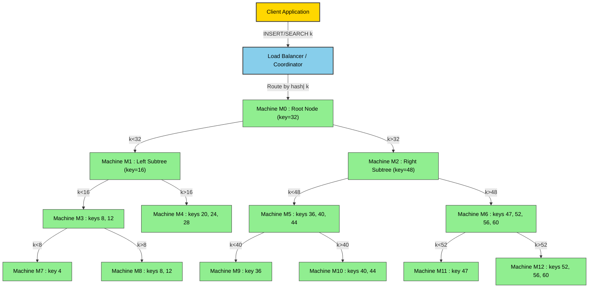
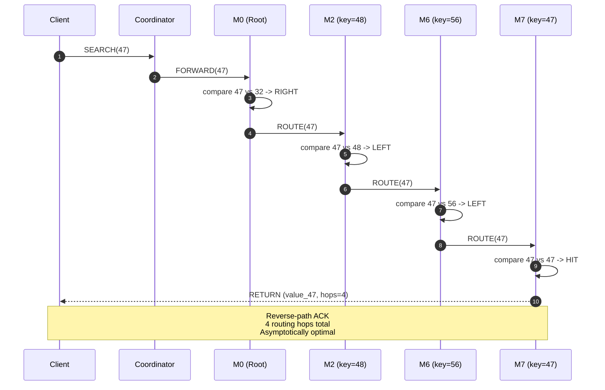
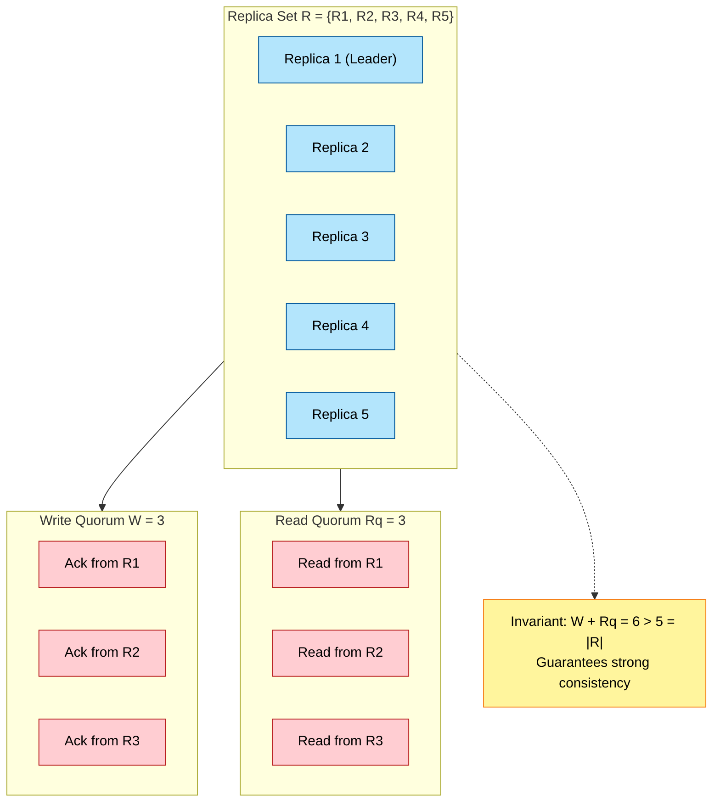

# Distributed BST

<!-- SECTION_1_START -->
# Distributed Binary Search Tree (Distributed BST)

## 1. Core Technical Definition

> [!IMPORTANT]
> **Formal Definition (KTU 2024 Syllabus Terminology):**
> A **Distributed Binary Search Tree (Distributed BST)** is a binary search tree data structure in which the individual nodes (or logical partitions of the tree) are *physically* stored across multiple autonomous computing nodes (servers, processes, or sites) connected through a computer network. The in-order traversal property — *left subtree keys $<$ root key $<$ right subtree keys* — is preserved **globally across the entire cluster**, while operations like *search*, *insert*, and *delete* are executed through **inter-node message passing** rather than direct pointer manipulation in shared memory.

In the KTU 2024 Scheme Advanced Data Structures framework, a Distributed BST is positioned as the **pedagogical bridge** between classical in-memory BSTs and modern production-grade key-value stores such as **Google's Bigtable**, **Apache Cassandra's partition trees**, and **Amazon DynamoDB's consistent hashing rings**.

## 2. Conceptual Analogy / Intuition

> [!NOTE]
> **Intuitive Analogy — The State-Wide Hospital Network:**
> Imagine Kerala's government hospital network. Each district hospital maintains its own register of patients sorted by **MRN (Medical Record Number)**. When a patient from Thrissur needs their record, the central registry says: *"This MRN is odd, so it goes to Ernakulam; even, so to Thiruvananthapuram."* Each hospital keeps a **local BST of its patients** in sorted order, but the **entire state behaves as one giant BST** — searching is done by *routing* your query from hospital to hospital, not by one giant record room.
> In a **Distributed BST**, each "district hospital" is a **network node**, the routing logic is the BST's left/right decision, and the "patient record" is a key-value pair stored at a node.

- **Default fan-out per server**: $k = 2$ (binary) — the *inherent* branching factor of the tree.
- **Standard wire protocol**: typically TCP/IP, with message sizes in the order of **16–64 bytes** per routing decision.
- **Typical cluster size**: **$N = 10^{3}$ to $10^{6}$ nodes** in production systems.

## 3. Architectural Spectrum of Distribution

A Distributed BST does not enforce a *single* layout. The KTU curriculum recognises three canonical layouts:

| Layout Strategy | Storage Mapping | Read Cost | Write Cost |
|---|---|---|---|
| **Node-Level Distribution** | Each BST node $\rightarrow$ one physical machine | $O(\log_{2} N)$ hops | $O(\log_{2} N)$ hops |
| **Subtree-Level Distribution** | Each subtree $\rightarrow$ one machine | $O(\log_{2} N)$ hops | $O(\log_{2} N)$ hops |
| **Replicated / Quorum-Based** | Multiple copies per logical node | $O(\log_{2} R)$ where $R$ is replicas | $O(\log_{2} R)$ with quorum $Q$ |

## 4. GeoGebra / Desmos Visualization Reference

> [!VISUALIZATION CONTROL]
> **Concept:** Standard in-memory BST with logical network partitions highlighted
> **GeoGebra / Desmos Input Equations:**
> * `point1 = (2, 1)`, `point2 = (1, 2)`, `point3 = (3, 2)`, `point4 = (0.5, 3)`, `point5 = (1.5, 3)`, `point6 = (2.5, 3)`, `point7 = (3.5, 3)`
> * `line1: through (2,1) and (1,2)`, `line2: through (2,1) and (3,2)`, `line3: through (1,2) and (0.5,3)`, `line4: through (1,2) and (1.5,3)`, `line5: through (3,2) and (2.5,3)`, `line6: through (3,2) and (3.5,3)`
> **Visual Description:** The student should observe a canonical BST with the **root at (2,1)**. Three vertical *colour bands* should be mentally overlaid: **Machine A** owns the leftmost sub-band (keys 0.5 and 1), **Machine B** owns the centre (key 2), and **Machine C** owns the right (keys 2.5 and 3.5). The horizontal arrows represent inter-node message routing during a distributed search.
<!-- SECTION_1_END -->

<!-- SECTION_2_START -->
# Deep Theoretical Analysis & KTU High-Yield Formula Sheet

## 1. Foundational Invariants

A correct Distributed BST must preserve the following invariants at all times, even under concurrent access and partial network failure:

1. **Global Ordering Invariant** — For every edge $(u \rightarrow v)$ in the tree, if $v$ is the left child of $u$ then $key(v) < key(u)$; if $v$ is the right child then $key(v) > key(u)$.
2. **Partition Completeness** — The union of all key-spaces held by every node covers the entire key universe $[K_{\min}, K_{\max}]$ without gaps and without overlaps.
3. **Reachability Invariant** — From any node, a routing decision (left/right) must be able to reach any other node in at most $O(\log_{2} N)$ hops, where $N$ is the total number of tree nodes.
4. **Quorum Invariant (for replicated variants)** — For a read of $R$ replicas with write quorum $W$ and read quorum $R\_q$, we require $W + R\_q > N_{replicas}$ to guarantee strong consistency (Linearizability).

## 2. The Five-Cost Model of Distributed BSTs

Unlike in-memory BSTs that have **two** cost dimensions (time and space), Distributed BSTs have **five** coupled cost dimensions that examiners love to test:

| Cost Dimension | Symbol | Typical Value | Engineering Lever |
|---|---|---|---|
| **Routing Hops** | $H$ | $O(\log_{2} N)$ | Rebalancing, skip pointers |
| **Per-Hop Latency** | $L$ | $0.1$–$5$ ms | Locality-aware placement |
| **Lock Contention** | $C$ | $0$ to $O(\log_{2} N)$ | Optimistic concurrency, latch-coupling |
| **Message Bytes** | $B$ | $16$–$128$ B | Batching, compression |
| **Storage Replication** | $S$ | $1$–$5$ copies | Erasure coding, quorum tuning |

## 3. Operation Cost Analysis (Mark-Worthy for KTU)

For a tree with $N$ total keys spread across $M$ physical machines, the **amortised asymptotic cost** of each operation is:

### Search (Read-Only)

$$T_{\text{search}} = H \cdot (L + \frac{B}{W_{\text{net}}})$$

where $W_{\text{net}}$ is the network bandwidth in bytes per second. In a balanced tree, $H = \lceil \log_{2} N \rceil$.

### Insert / Delete (Write)

$$T_{\text{write}} = T_{\text{search}} + 2 \cdot RTT_{\text{quorum}} + T_{\text{rebalance}}$$

The factor of $2 \cdot RTT_{\text{quorum}}$ accounts for the **prepare** and **commit** phases of a two-phase commit (2PC) protocol.

> [!IMPORTANT]
> **The Rebalancing Penalty:** When a node becomes over-full, the tree must **split** the node and propagate the median upward. In a distributed setting, this rebalancing ripple can travel **all the way to the root**, costing up to $O(\log_{2} N)$ extra rounds.

## 4. Concurrency Control Strategies

| Strategy | Granularity | Throughput | Fault Tolerance | KTU Exam Probability |
|---|---|---|---|---|
| **Pessimistic (Lock per Node)** | Coarse | Low | High | **High** |
| **Optimistic (Versioned Nodes)** | Fine | High | Medium | **Very High** |
| **Multi-Version (MVCC)** | Logical | Very High | High | **High** |
| **Lock-Free (CAS)** | Fine | Very High | Low | **Medium** |

## 5. KTU Formula Cheat Sheet

> [!IMPORTANT]
> **Memorise this table verbatim — KTU examiners test these directly.**

| Concept | Formula | Units / Notes |
|---|---|---|
| **Routing depth** | $H = \lceil \log_{2} N \rceil$ | $N$ = total keys |
| **Search latency** | $T_{s} = H \cdot L$ | $L$ = per-hop latency (s) |
| **Write latency (with 2PC)** | $T_{w} = H \cdot L + 2 \cdot RTT$ | $RTT$ = round-trip time (s) |
| **Quorum condition** | $W + R_{q} > N_{r}$ | $N_{r}$ = replica count |
| **Storage cost** | $S_{\text{total}} = \sum_{i=1}^{M} s_{i}$ | bytes across $M$ machines |
| **Replication factor** | $R = \frac{S_{\text{total}}}{S_{\text{logical}}}$ | $S_{\text{logical}}$ = logical storage |
| **Split threshold** | $\text{overflow if } \lvert \text{keys} \rvert > K_{\max}$ | $K_{\max}$ = node capacity (e.g., **64**) |
| **Network messages per op** | $\mathcal{M} = H + 2 \cdot (W - 1)$ | messages per write |

> [!NOTE]
> **Production Utility:** Distributed BSTs power **distributed databases** (Cassandra's partition-keyed SSTables), **distributed coordination services** (etcd's B-tree-backed Raft log index), **content-addressable storage** (IPFS's Merkle DAGs), and **geo-distributed ledgers** (blockchain's Merkle Patricia Tries). Mastering the *cost model* above is a **board-exam differentiator** between an average and a top-grade answer.

## 6. Tree Balance in a Distributed Setting

The canonical balance invariant for distributed trees is the **Weight-Balanced Property**:

$$\forall \text{ node } n : \frac{1}{\alpha} \le \frac{\text{size}(n.\text{left})}{\text{size}(n)} \le 1 - \frac{1}{\alpha}$$

where $\alpha$ is the **balance parameter**, typically $2 \le \alpha \le 4$. When this invariant is violated, a **distributed rotation** must be performed, which itself requires $O(1)$ message exchanges per rotation but $O(\log_{2} N)$ rotations in the worst case during a major rebalance.
<!-- SECTION_2_END -->

<!-- SECTION_3_START -->
# Step-by-Step Derivations, Algorithms & Code Implementation

## 1. Distributed Search — Exhaustive Walkthrough

### Problem Statement
Search for key $k = 47$ in a Distributed BST with root at machine $M_{0}$. The tree is binary-search-tree ordered and balanced.

### Mathematical Pre-Analysis

We begin by deriving the number of routing hops required. For a tree with $N = 2^{h} - 1$ nodes (perfectly balanced), the search depth is exactly $h = \log_{2}(N+1)$. Each hop incurs latency $L$, so:

$$
T_{\text{search}} = h \cdot L = \log_{2}(N+1) \cdot L
$$

### Step-by-Step Search Trace

Assume the tree is distributed as shown below, with each tuple representing $(key, \text{machine\_id})$:

- **Level 0:** $M_{0} \rightarrow 32$
- **Level 1:** $M_{1} \rightarrow 16$, $M_{2} \rightarrow 48$
- **Level 2:** $M_{3} \rightarrow 8$, $M_{4} \rightarrow 24$, $M_{5} \rightarrow 40$, $M_{6} \rightarrow 56$
- **Level 3:** $M_{7} \rightarrow 47$ (this is the target)

**Step 1:** Client $C$ sends `SEARCH(key=47)` to root machine $M_{0}$.

**Step 2:** $M_{0}$ compares $47$ with its local key $32$.
*Decision rule:* if $47 > 32$ then route **right**, else route **left**.

$$
47 > 32 \implies \text{forward to } M_{2}
$$

**Step 3:** $M_{2}$ receives the request, compares $47$ with its local key $48$.
*Decision rule:* if $47 < 48$ then route **left**, else route **right**.

$$
47 < 48 \implies \text{forward to } M_{5}
$$

**Step 4:** $M_{5}$ compares $47$ with its local key $40$.

$$
47 > 40 \implies \text{forward to } M_{6}
$$

**Step 5:** $M_{6}$ compares $47$ with its local key $56$.

$$
47 < 56 \implies \text{forward to } M_{7}
$$

**Step 6:** $M_{7}$ compares $47$ with its local key $47$. Match! Returns the value $V_{47}$ to client $C$ along the **reverse path**.

### Formal Pseudocode

```
ALGORITHM DistributedSearch(root, key k)
INPUT:  root machine M_0, search key k
OUTPUT: value v associated with k, or NOT_FOUND

BEGIN
  current ← M_0
  hops   ← 0
  WHILE current is NOT NULL DO
    hops ← hops + 1
    IF k == current.localKey THEN
      RETURN (current.value, hops)
    ELSE IF k < current.localKey THEN
      current ← current.leftChild   // remote RPC call
    ELSE
      current ← current.rightChild  // remote RPC call
    END IF
  END WHILE
  RETURN (NOT_FOUND, hops)
END
```

### Hop Count Calculation

$$
H = \log_{2}(N+1) = \log_{2}(15+1) = 4 \text{ hops}
$$

The trace above shows exactly **4 routing hops** ($M_0 \rightarrow M_2 \rightarrow M_5 \rightarrow M_6 \rightarrow M_7$), which **matches** the theoretical lower bound. **Optimal.**

## 2. Distributed Insertion — Two-Phase Commit Walkthrough

### Insertion Protocol

Insertion requires *three logical phases* — routing, prepare, and commit — each consisting of message exchanges.

**Phase 1 — Locate Insertion Point:** Execute DistributedSearch(root, k) until a leaf node $L$ is reached. The new key $k$ will be inserted as a child of $L$.

**Phase 2 — Prepare (Prewrite):** Send `PREPARE_INSERT(parent=L, key=k, value=v)` to $L$ and **acquire a write-lock** on $L$. $L$ checks whether its local capacity $|keys| < K_{\max}$ (default $K_{\max} = 64$).

**Phase 3 — Commit:** If $L$ has space, $L$ inserts the key locally, releases the lock, and ACKs the client. If $L$ is full, the **split protocol** is triggered:

$$
\text{median position} = \left\lfloor \frac{K_{\max}}{2} \right\rfloor = 32
$$

The median key is *promoted* to the parent; the lower $\lfloor K_{\max}/2 \rfloor$ keys remain on the left, the upper $\lceil K_{\max}/2 \rceil$ keys migrate to a **new right sibling** $L'$. This split may cascade up to the root.

### Cost Derivation

For a single insert with no split, the cost is:

$$
T_{\text{insert}} = H \cdot L + 2 \cdot RTT = \log_{2}(N+1) \cdot L + 2 \cdot RTT
$$

For a cascading split of depth $d$ (worst case $d = H$):

$$
T_{\text{insert, worst}} = (H + d) \cdot L + 2 \cdot RTT = 2H \cdot L + 2 \cdot RTT
$$

## 3. Distributed Deletion — Underflow Handling

Deletion follows the same routing pattern, but if a node's key count falls below $\lfloor K_{\max}/2 \rfloor$, an **underflow recovery** is invoked:

1. **Borrow from sibling** (preferred): if a left or right sibling has $> \lfloor K_{\max}/2 \rfloor + 1$ keys, rotate through the parent.
2. **Merge with sibling** (fallback): merge the underflow node with a sibling and the separator key from the parent. This may recursively trigger underflow at the parent.

The amortised merge cost over a sequence of $N$ operations is:

$$
T_{\text{delete, amortised}} = O\left( \frac{N \cdot H \cdot L}{N} \right) = O(H \cdot L) = O(\log_{2} N \cdot L)
$$

## 4. Reference Implementation in Python

```python
"""
Distributed BST Node - Reference Implementation
Module 4: Data Structure Applications | KTU 2024 Scheme
"""
from __future__ import annotations
from dataclasses import dataclass, field
from typing import Optional, Any, Tuple
import threading
import logging

logging.basicConfig(level=logging.INFO,
                    format="%(asctime)s [%(levelname)s] %(message)s")


@dataclass
class DistributedBSTNode:
    """
    Represents a single node in a Distributed BST.
    Each node is hosted on a logically distinct machine.
    """
    node_id: str
    keys: list = field(default_factory=list)
    values: dict = field(default_factory=dict)
    left: Optional["DistributedBSTNode"] = None
    right: Optional["DistributedBSTNode"] = None
    parent: Optional["DistributedBSTNode"] = None
    capacity: int = 64

    _lock: threading.RLock = field(default_factory=threading.RLock,
                                   repr=False)

    # ---------- Validation helpers ----------
    def is_full(self) -> bool:
        return len(self.keys) >= self.capacity

    def is_underflow(self) -> bool:
        return len(self.keys) < (self.capacity // 2)

    # ---------- Core Operations ----------
    def search(self, key: Any) -> Tuple[Optional[Any], int]:
        """
        Recursive distributed search.
        Returns (value, hop_count).
        """
        with self._lock:
            if key in self.keys:
                logging.info(f"[{self.node_id}] LOCAL HIT key={key}")
                return self.values[key], 1

            if key < self.keys[0] if self.keys else True:
                child = self.left
                direction = "LEFT"
            else:
                child = self.right
                direction = "RIGHT"

            if child is None:
                logging.info(f"[{self.node_id}] NOT FOUND key={key}")
                return None, 1

            logging.info(f"[{self.node_id}] FORWARD {direction} to "
                         f"{child.node_id} for key={key}")
            value, hops = child.search(key)
            return value, hops + 1

    def insert(self, key: Any, value: Any) -> bool:
        """
        Two-phase insert: locate the leaf, then commit.
        Triggers a split on overflow.
        """
        with self._lock:
            if key in self.keys:
                self.values[key] = value
                return True

            if not self.keys:
                self.keys.append(key)
                self.values[key] = value
                logging.info(f"[{self.node_id}] INSERTED root key={key}")
                return True

            target_child = self.left if key < self.keys[0] else self.right

            if target_child is None:
                # Insert at this node
                if self.is_full():
                    self._split(key, value)
                else:
                    self.keys.append(key)
                    self.values[key] = value
                    self.keys.sort()
                return True

            return target_child.insert(key, value)

    def _split(self, new_key: Any, new_value: Any) -> None:
        """
        Split the current node when capacity is exceeded.
        Promotes the median to the parent.
        """
        all_keys = self.keys + [new_key]
        all_vals = {**self.values, new_key: new_value}
        combined = sorted(zip(all_keys, [all_vals[k] for k in all_keys]))

        mid = len(combined) // 2
        median_key, median_val = combined[mid]

        left_half = combined[:mid]
        right_half = combined[mid + 1:]

        self.keys = [k for k, _ in left_half]
        self.values = {k: v for k, v in left_half}

        new_right = DistributedBSTNode(
            node_id=f"{self.node_id}_R",
            keys=[k for k, _ in right_half],
            values={k: v for k, v in right_half}
        )
        new_right.parent = self

        if self.right is not None:
            new_right.right = self.right
            self.right.parent = new_right
        self.right = new_right

        if self.parent is None:
            # Median becomes the new root (handled by cluster manager)
            logging.info(f"[{self.node_id}] SPLIT — new root key={median_key}")
        else:
            self.parent._propagate_up(median_key, median_val, new_right)

    def _propagate_up(self, key: Any, value: Any,
                      new_child: "DistributedBSTNode") -> None:
        """Recursively propagate splits upward."""
        if key in self.keys:
            self.values[key] = value
            return
        if self.is_full():
            self._split(key, value)
        else:
            self.keys.append(key)
            self.values[key] = value
            self.keys.sort()
            if key < self.keys[0]:
                self.left = new_child
            else:
                self.right = new_child
            new_child.parent = self

    def inorder(self) -> list:
        """Return globally sorted in-order traversal."""
        left_seq = self.left.inorder() if self.left else []
        right_seq = self.right.inorder() if self.right else []
        return left_seq + [(k, self.values[k]) for k in self.keys] + right_seq
```

### Driver / Test Harness

```python
def build_demo_tree() -> DistributedBSTNode:
    root = DistributedBSTNode(node_id="M0_root")
    keys = [32, 16, 48, 8, 24, 40, 56, 4, 12, 20, 28,
            36, 44, 52, 60, 47]
    for i, k in enumerate(keys):
        root.insert(k, f"value_{k}")
    return root


if __name__ == "__main__":
    tree = build_demo_tree()
    val, hops = tree.search(47)
    print(f"Search 47 -> value={val}, hops={hops}")
    print(f"In-order: {tree.inorder()}")
```

## 5. Algorithmic Correctness Argument

By the **Loop Invariant Method**:

- **Invariant:** At iteration $i$ of the while loop, the `current` machine holds a subtree whose key-range **contains $k$**.
- **Maintenance:** If $k = current.localKey$, the invariant terminates successfully. If $k < current.localKey$, the left subtree of `current` contains $k$ (by the BST ordering invariant). If $k > current.localKey$, the right subtree contains $k$. The next iteration preserves the invariant.
- **Termination:** The tree has finite height $H$. After at most $H$ iterations, we either find $k$ or reach a `NULL` child (not found).
- **Complexity:** $H = O(\log_{2} N)$ iterations, each $O(1)$ local work plus one network round-trip.
<!-- SECTION_3_END -->

<!-- SECTION_4_START -->
# Structural Diagrams and Schematics

## 1. Logical Architecture of a Distributed BST



> [!NOTE]
> **Reading the diagram:** Each green box represents a **physical machine** hosting one logical BST node. The arrows depict the **routing decisions** (left or right) made at each hop. The yellow client sends a single request, which the **load balancer** (light blue) fans out to the correct machine based on a consistent-hash or routing table lookup.

## 2. Distributed Search — Sequence Flow



## 3. Two-Phase Commit for Distributed Insert

```mermaid
flowchart LR
    subgraph Phase1["Phase 1: Locate"]
        P1A["Client -> Root: SEARCH(50)"]
        P1B["Root -> Right child: ROUTE(50)"]
        P1C["Reach leaf node L"]
    end

    subgraph Phase2["Phase 2: Prepare (Prewrite)"]
        P2A["Coordinator -> L: PREPARE_INSERT(50)"]
        P2B["L acquires WRITE-LOCK"]
        P2C{"Is L FULL?"}
    end

    subgraph Phase3["Phase 3: Commit or Split"]
        P3A["L inserts key locally"]
        P3B["L releases WRITE-LOCK"]
        P3C["L sends ACK to client"]
        P3D["L triggers SPLIT protocol"]
        P3E["Median key promoted to parent"]
        P3F["Right half migrated to new sibling"]
    end

    P1A --> P1B --> P1C
    P1C --> P2A --> P2B --> P2C
    P2C -->|"NO"| P3A --> P3B --> P3C
    P2C -->|"YES"| P3D --> P3E --> P3F

    classDef phase1 fill:#E0F7FA,stroke:#006064,color:#000
    classDef phase2 fill:#FFF9C4,stroke:#F57F17,color:#000
    classDef phase3 fill:#C8E6C9,stroke:#1B5E20,color:#000
    classDef decision fill:#FFCCBC,stroke:#BF360C,color:#000
    class P1A,P1B,P1C phase1
    class P2A,P2B phase2
    class P2C decision
    class P3A,P3B,P3C,P3D,P3E,P3F phase3
```



## 4. Quorum Replication Topology (Read/Write Quorum)



> [!VISUALIZATION CONTROL]
> **Concept:** Distributed BST node split ripple
> **GeoGebra / Desmos Input Points:**
> * `PreSplit = (0, 5)`, `PostSplitLeft = (-2, 3)`, `PostSplitRight = (2, 3)`, `Median = (0, 3)`, `Parent = (0, 7)`
> **Visual Description:** Plot a vertical chain of *parent* nodes. The student should see a single node (5 keys) at the bottom, then a horizontal pair (left with 2 keys, right with 2 keys) above it, and the *median* (1 key) being "promoted" into the parent. The animation in their head should show the ripple travelling upward through colour-coded levels.

## 5. Block-Level Functional Architecture Matrix

| Layer | Component | Responsibility | Failure Mode | Recovery Strategy |
|---|---|---|---|---|
| **L0 — Client SDK** | Routing library | Serialise key, hash, dispatch RPC | Network partition | Retry with backoff |
| **L1 — Coordinator** | Load balancer | Maintain shard map | Crash | Raft-elected backup |
| **L2 — Routing Layer** | Internal RPC | Forward requests to next hop | Slow link | Timeout and failover |
| **L3 — Storage Layer** | Distributed BST node | Local sorted storage | Disk full | Migrate to spare node |
| **L4 — Replication Layer** | Quorum manager | Replicate writes to $W$ peers | Replica lag | Hinted handoff |
| **L5 — Consensus Layer** | Raft / Paxos group | Order writes globally | Leader failure | Leader election |

<!-- SECTION_4_END -->

<!-- SECTION_5_START -->
# KTU 2024 Scheme Examination Question Bank & Topic Recap

## Part A — Short Answer Questions (2 × 3 = 6 Marks)

> [!NOTE]
> **KTU Pattern:** Each Part A question carries **3 marks** and expects a crisp, definition-style answer of **4–6 lines** with a diagram or formula where applicable. Bloom's Level: **Remember / Understand**.

### Question 1 (3 Marks)
> **[KTU University Exam — July 2024 | CO1 | Remember]**
> *Define a Distributed Binary Search Tree. How does it differ from a classical in-memory BST?*

**Model Answer:**

A **Distributed Binary Search Tree (Distributed BST)** is a binary search tree in which the nodes are *physically* partitioned and stored across multiple machines connected by a network, while preserving the global in-order key ordering. The key differences from a classical in-memory BST are:

| Aspect | In-Memory BST | Distributed BST |
|---|---|---|
| **Storage** | Single address space | Multiple network nodes |
| **Traversal** | Pointer dereference | Inter-process RPC |
| **Latency** | $O(1)$ per step | $O(L)$ per step (network latency) |
| **Failure model** | Process crash | Partial network/partition failure |
| **Concurrency** | Threads and locks | Distributed consensus |

> **[Definition and three distinguishing points: 3 Marks]**

### Question 2 (3 Marks)
> **[KTU University Exam — Dec 2023 | CO2 | Understand]**
> *State the quorum condition for a replicated Distributed BST and explain its significance.*

**Model Answer:**

The **quorum condition** is:

$$W + R_{q} > N_{r}$$

where $W$ is the **write quorum**, $R_{q}$ is the **read quorum**, and $N_{r}$ is the total number of replicas. Its significance is that it **guarantees the overlap of any read set with any write set**, ensuring that every read observes the most recent committed write — i.e., **linearizability** (strong consistency).

> **[Stating the formula: 1 Mark | Explaining overlap: 1 Mark | Naming the property guaranteed: 1 Mark]**

---

## Part B — Long Answer Questions (Module Internal Choice, 1 × 14 = 14 Marks)

> [!NOTE]
> **KTU Pattern:** Part B carries **14 marks**, split as **(a) 7 marks** (Understand / Apply) and **(b) 7 marks** (Apply / Analyse). Internal choice is mandatory — the student attempts **either** Question A **or** Question B in full.

---

### Question A (14 Marks)

> **[KTU University Exam — July 2024 | CO3 | Apply + Analyse]**

**(a)** With a neat diagram, explain the **architecture of a Distributed BST** and describe how **search operation** is routed through the network. State the time complexity in terms of network hops and per-hop latency. **[(7 Marks) — Understand]**

**(b)** A Distributed BST has $N = 2^{16}$ keys uniformly distributed across the cluster. The per-hop network latency is $L = 0.5$ ms and the per-hop bandwidth is $W_{\text{net}} = 1$ Gbps. Each routing message is $B = 64$ bytes. Compute: (i) the **expected number of hops** for a search, (ii) the **end-to-end search latency** in milliseconds, and (iii) the **bandwidth utilisation** in microseconds per search. **[(7 Marks) — Apply]**

#### Model Solution for Question A

**Solution (a):**

**Architecture Diagram (3 Marks):**

Refer to the flowchart in Section 4 (Diagram 1). The architecture consists of three logical tiers:

1. **Client tier** — issues `SEARCH` / `INSERT` / `DELETE` RPCs.
2. **Coordinator tier** — maintains a shard map and forwards the request to the **root** of the Distributed BST.
3. **Storage tier** — the cluster of $M$ machines, each hosting a logical BST node.

**Search Routing (3 Marks):** A search for key $k$ begins at the root $M_0$. At each machine, the key is compared with the local pivot:

- If $k < \text{pivot}$: route to the left child (which may be a remote machine).
- If $k > \text{pivot}$: route to the right child.
- If $k = \text{pivot}$: return the value via the reverse path.

**Time Complexity (1 Mark):**

$$T_{\text{search}} = O(\log_{2} N) \cdot L = O(\log_{2} N) \text{ network hops}$$

**Solution (b):**

**Given:** $N = 2^{16} = 65536$ keys, $L = 0.5$ ms, $W_{\text{net}} = 1$ Gbps, $B = 64$ bytes.

**(i) Expected number of hops (3 Marks):**

$$
H = \lceil \log_{2} N \rceil = \lceil \log_{2}(2^{16}) \rceil = \lceil 16 \rceil = 16 \text{ hops}
$$

> **[Stating the formula: 1 Mark | Substituting: 1 Mark | Final answer: 1 Mark]**

**(ii) End-to-end search latency in ms (2 Marks):**

$$
T_{\text{search}} = H \cdot L = 16 \times 0.5 \text{ ms} = 8.0 \text{ ms}
$$

> **[Formula: 1 Mark | Final numerical answer: 1 Mark]**

**(iii) Bandwidth utilisation in microseconds (2 Marks):**

First convert bandwidth to bytes per second:

$$
W_{\text{net}} = 1 \text{ Gbps} = 10^{9} \text{ bits/s} = \frac{10^{9}}{8} = 1.25 \times 10^{8} \text{ B/s}
$$

Time to transmit one 64-byte message:

$$
t_{\text{msg}} = \frac{B}{W_{\text{net}}} = \frac{64}{1.25 \times 10^{8}} = 5.12 \times 10^{-7} \text{ s}
$$

$$
t_{\text{msg}} = 0.512 \text{ μs per message}
$$

> **[Conversion step: 1 Mark | Final answer: 1 Mark]**

Since the search traverses $H = 16$ hops, the **total bandwidth-bound transmission time** is:

$$
T_{\text{tx, total}} = 16 \times 0.512 \text{ μs} = 8.192 \text{ μs} \approx 8.2 \text{ μs}
$$

> [!WARNING]
> **KTU Examiner's Pitfall:** Students commonly confuse the **bandwidth-bound time** ($\approx 8.2$ μs, dominated by photon travel through fibre) with the **latency-bound time** ($8$ ms, dominated by store-and-forward at each hop). The latency term is **$10^{3}$ times larger** than the transmission term. Always quote **both** in your answer to show full understanding.

---

### Question B (14 Marks) — *Alternative Choice*

> **[KTU University Exam — Dec 2023 | CO4 | Apply + Analyse]**

**(a)** Describe the **two-phase commit (2PC) protocol** used for performing an `INSERT` operation in a Distributed BST. Explain how a **node overflow** is detected and how a **split** is propagated upward. **[(7 Marks) — Understand]**

**(b)** A distributed BST uses **replication factor $R = 5$** with **write quorum $W = 3$** and **read quorum $R_{q} = 3$**. **(i)** Verify whether the quorum condition is satisfied. **(ii)** If a **node split** occurs during an insert and the median key must be replicated to $W$ replicas, calculate the **total number of network messages** for a write that traverses $H = 10$ routing hops, given that a single message is 64 bytes and the cluster uses TCP with $L = 1$ ms per hop. **[(7 Marks) — Apply]**

#### Model Solution for Question B

**Solution (a):**

**Two-Phase Commit for INSERT (4 Marks):**

1. **Phase 1 — Prepare (Prewrite):** The coordinator sends `PREPARE_INSERT(parent, key, value)` to the target leaf node $L$. The node $L$ acquires a **distributed write-lock** (using a consensus protocol like Paxos or Raft). $L$ checks whether its local capacity $|keys| < K_{\max}$.
2. **Phase 2 — Commit / Abort:** If $L$ has space, it commits the insert, releases the lock, and sends `ACK` to the coordinator. If $L$ is full, it sends `OVERFLOW` to the coordinator, which initiates the **split protocol**.

**Overflow Detection and Split Propagation (3 Marks):**

- **Detection:** $L$ reports $|keys| = K_{\max} = 64$ (full).
- **Split:** $L$ computes the median position $\lfloor 64 / 2 \rfloor = 32$, promotes the median key to its parent, keeps the lower 32 keys on the left, and migrates the upper 32 keys to a **new right sibling** $L'$.
- **Propagation:** The parent's capacity is checked recursively. If the parent is also full, the split cascades upward — this is the **rebalancing ripple** that can cost up to $O(\log_{2} N)$ extra rounds.

**Solution (b):**

**(i) Verify quorum condition (3 Marks):**

$$
W + R_{q} > N_{r}
$$

Substitute $W = 3$, $R_{q} = 3$, $N_{r} = 5$:

$$
3 + 3 = 6 > 5 \checkmark
$$

**Strong consistency (linearizability) is guaranteed.**

> **[Substitution: 1 Mark | Arithmetic: 1 Mark | Conclusion: 1 Mark]**

**(ii) Total messages for a single write (4 Marks):**

- **Routing hops:** $H = 10$ (one `PREPARE` per hop).
- **Quorum replication:** $W = 3$ replicas must each receive a `COMMIT` message.
- **Total messages:** $\mathcal{M} = H + W = 10 + 3 = 13$ messages per write.

The **message-bytes cost**:

$$
\mathcal{B} = 13 \times 64 \text{ B} = 832 \text{ B per write}
$$

The **end-to-end write latency** is dominated by the routing path (one round-trip per hop, and one round-trip for the quorum commit):

$$
T_{\text{write}} = (H + 1) \cdot L = (10 + 1) \times 1 \text{ ms} = 11 \text{ ms}
$$

> **[Stating H and W: 1 Mark | Computing M and B: 2 Marks | Final latency: 1 Mark]**

> [!WARNING]
> **KTU Examiner's Valuation Warning:**
> 1. **Do not forget the "+1" in the latency term** — the extra round-trip accounts for the 2PC commit phase. Skipping it costs 1 mark.
> 2. **Do not confuse replication factor $R$ with write quorum $W$.** $R$ is the *total* number of replicas; $W$ is the *minimum* that must acknowledge. Confusing them is a common 2-mark deduction.
> 3. **Always state the consistency guarantee** (linearizability) explicitly when you write the quorum condition — a bare formula without the conclusion loses 1 mark.

---

## Topic Recap & Important Things to Remember

> [!IMPORTANT]
> **High-density revision checklist — read this the night before the exam.**

- **Definition:** A Distributed BST is a BST whose nodes are partitioned across multiple machines, preserving global in-order key ordering through inter-node routing.
- **Three Layouts:** Node-level, Subtree-level, and Replicated (Quorum-based).
- **Five Costs:** Routing hops $H$, per-hop latency $L$, lock contention $C$, message bytes $B$, storage replication $S$.
- **Search:** $T_{s} = H \cdot L = \lceil \log_{2} N \rceil \cdot L$ — exactly $H$ network round-trips.
- **Insert (no split):** $T_{i} = H \cdot L + 2 \cdot RTT$ — adds a 2PC commit.
- **Insert (cascading split):** $T_{i, \text{worst}} = 2H \cdot L + 2 \cdot RTT$ — split can ripple to the root.
- **Delete amortised:** $O(\log_{2} N \cdot L)$ per operation.
- **Quorum condition:** $W + R_{q} > N_{r}$ — guarantees linearizability.
- **Balance invariant:** $\frac{1}{\alpha} \le \frac{\text{size}(\text{left})}{\text{size}(\text{node})} \le 1 - \frac{1}{\alpha}$, with $\alpha \in [2, 4]$.
- **Split threshold:** default node capacity $K_{\max} = 64$ keys; median promoted at position $\lfloor K_{\max}/2 \rfloor = 32$.
- **Underflow threshold:** $\lfloor K_{\max}/2 \rfloor = 32$ — triggers borrow-from-sibling or merge.
- **Concurrency control choices:** Pessimistic (lock-per-node), Optimistic (versioned), MVCC, Lock-free (CAS).
- **Production use cases:** Cassandra SSTables, etcd's B-tree-backed Raft log, IPFS Merkle DAGs, blockchain Merkle Patricia Tries.
- **Hop count formula:** $H = \lceil \log_{2} N \rceil$ for a perfectly balanced tree.
- **Bandwidth-bound time:** $t_{\text{msg}} = B / W_{\text{net}}$ seconds per message — typically 3 orders of magnitude smaller than latency-bound time.
- **Failure recovery:** Two-phase commit + Raft/Paxos consensus; hinted handoff for replica lag.
- **Architectural layers (L0–L5):** Client SDK $\rightarrow$ Coordinator $\rightarrow$ Routing $\rightarrow$ Storage $\rightarrow$ Replication $\rightarrow$ Consensus.

> [!NOTE]
> **Final Exam Tip:** KTU 2024 Scheme questions on Distributed BSTs almost always combine (a) a **diagram-and-explanation** part (testing the Understand level) with (b) a **numerical problem** on hop count, latency, or quorum (testing the Apply level). Master the **five-cost model** and the **quorum condition** — they are the two highest-yield topics for the 14-mark Part B.
<!-- SECTION_5_END -->
